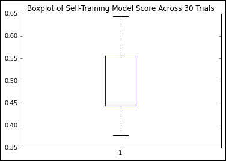
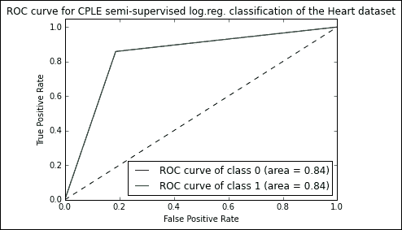

# 五、半监督学习

# 简介

在前几章中，我们已经使用先进的技术解决了一系列数据挑战。在每种情况下，我们都成功地将我们的技术应用于数据集。

然而，在许多方面，我们已经很容易了。我们的数据很大程度上来自规范的和准备充分的来源，所以我们不必做大量的准备。然而，在现实世界中，很少有这样的数据集(也许除了那些我们自己能够指定的数据集！).特别是，很少也不可能在野外遇到有类标签的数据集。如果数据集的足够部分没有标签，我们发现自己无法构建一个能够准确预测验证或测试数据标签的分类器。那么，我们该怎么办？

常见的解决方案是尝试手动标记我们的数据；这不仅耗时，而且还会遭受某些类型的人为错误(这在高维数据集上尤其常见，因为人类观察者无法像计算方法那样识别类边界)。

一种相当新且相当令人兴奋的替代方法是使用**半监督学习** 通过捕捉底层分布的形状，将标签应用于未标记的数据。半监督学习在过去十年中因其能够节省大量注释时间而越来越受欢迎，如果可能的话，注释可能需要人工专业知识或专业设备。这被证明特别有价值的背景是自然语言分析和语音信号分析；在这两个领域，人工注释都被证明是复杂和耗时的。

在本章中，您将学习如何应用几种半监督学习技术，包括:**对比悲观似然估计** ( **CPLE** )、自我学习和 S3VM。这些技术将使我们能够在一系列有问题的环境中标记训练数据。您将学会识别半监督技术的能力和局限性。我们将使用最近在 scikit 之上开发的一些 Python 库——学习将半监督技术应用于几个用例，包括音频信号数据。

我们开始吧！

# 理解半监督学习

执行机器学习最持久的成本是为训练目的创建标记数据。由于情况的循环性，数据集往往不带有提供的类标签；人们需要一种经过训练的分类技术来生成类标签，但是如果没有经过标记的训练和测试数据，就无法训练这种技术。如上所述，手动或通过测试过程标记数据是一种选择，但这可能非常耗时、昂贵(尤其是对于医学测试)、难以组织并且容易出错(对于大型或复杂的数据集)。半监督技术提出了打破这种僵局的更好方法。

半监督学习技术使用未标记和标记的数据来创建比单独使用未标记或标记的数据更好的学习技术。有一系列技术存在于有监督(有标记数据)和无监督(无标记数据)学习之间。

该组中存在的主要技术类型是半监督技术、转导技术和主动学习技术，以及一系列其他方法。

半监督技术将一组测试数据留在训练过程之外，以便在稍后阶段执行测试。与此同时，转导技术纯粹是为了给未标记的数据开发标签。转换技术中可能没有嵌入测试过程，也可能没有可使用的标记数据。

在本章中，我们将重点介绍一组半监督技术，这些技术以非常熟悉的格式提供强大的数据集标注功能。我们将要讨论的许多技术可用作熟悉的、预先存在的分类器的包装器，从线性回归分类器到支持向量机。因此，它们中的许多可以使用来自 Scikit-learn 的估计器来运行。我们将首先将线性回归分类器应用于测试用例，然后继续应用带有半监督扩展的 SVM。

# 半监督算法在起作用

我们已经讨论了什么是半监督学习，为什么我们要参与其中，以及使用半监督算法的一些普遍现实是什么。我们已经尽我们所能做了大概的描述。在接下来的几页中，我们将从这个一般的理解开始，发展有效使用半监督应用程序的能力。

## 自我训练

自我训练是最简单的半监督学习方法，也可以是最快的。自我训练算法在多种环境中看到一个应用，包括自然语言处理和计算机视觉；正如我们将看到的，它们既能带来巨大的价值，也能带来巨大的风险。

自我训练的目标是将来自未标记案例的信息与已标记案例的信息相结合，以迭代地为数据集的未标记示例识别标签。在每次迭代中，标记的训练集都会被放大，直到整个数据集都被标记。

自训练算法通常用作基础模型的包装器。在本章中，我们将使用 SVM 作为自我训练模型的基础。自训练算法非常简单，包含的步骤非常少，如下所示:

1.  一组标记数据用于预测一组未标记数据的标签。(这可能是所有未标记的数据或部分数据。)
2.  为所有新标记的病例计算置信度。
3.  从新标记的数据中选择案例，为下一次迭代保留。
4.  该模型在所有标记的案例上进行训练，包括在以前的迭代中选择的案例。
5.  模型迭代到步骤 1 到 4，直到成功收敛。

该过程以图形方式呈现，如下所示:


完成培训后，将对自我培训的模型进行测试和验证。这可以通过交叉验证来完成，如果存在的话，甚至可以使用保留的、标记的数据。

自我训练提供真正的力量和时间节省，但也是一个有风险的过程。为了理解要注意什么，以及如何将自我训练应用到自己的分类算法中，让我们更详细地看看算法是如何工作的。

为了支持这个讨论，我们将使用来自 semi up-learn GitHub 存储库的代码。为了使用这些代码，我们需要克隆相关的 GitHub 存储库。相关说明见[附录 A](10.html "Appendix A. Chapter Code Requirements") 。

### 实施自我培训

自我训练的每个迭代的第一步是为未标记的案例生成类标签。这是通过首先创建一个`SelfLearningModel`类来实现的，该类以基本监督模型(`basemodel`)和迭代限制作为参数。正如我们将在本章后面看到的，迭代极限可以作为分类精度(即收敛性)的函数来明确指定或提供。`prob_threshold`参数为标签验收提供了最低质量标准；分数低于此级别的任何预计标签都将被拒绝。同样，我们将在后面的示例中看到，除了提供硬编码阈值，还有其他选择。

```py
class SelfLearningModel(BaseEstimator): 

def __init__(self, basemodel, max_iter = 200, prob_threshold = 0.8): 
   self.model = basemodel 
   self.max_iter = max_iter 
   self.prob_threshold = prob_threshold  
```

定义了`SelfLearningModel`类的外壳后，下一步是为半监督模型拟合过程定义函数:

```py
def fit(self, X, y): 
   unlabeledX = X[y==-1, :] 
   labeledX = X[y!=-1, :] 
   labeledy = y[y!=-1] 

   self.model.fit(labeledX, labeledy) 
   unlabeledy = self.predict(unlabeledX) 
   unlabeledprob = self.predict_proba(unlabeledX)
   unlabeledy_old = [] 

   i = 0
```

`X`参数是输入数据的矩阵，其形状相当于`[n_samples, n_features]`。`X`用于创建`[n_samples, n_samples]`大小的矩阵。与此同时，`y`参数是一系列标签。未标记的点在`y`中标记为`-1`。从`X`开始，`unlabeledX`和`labeledX`参数通过在`X`上选择`X`中位置对应于`y`中`-1`标签的元素的操作而非常简单地创建。`labeledy`参数执行与`y`类似的选择。(自然，我们对`y`的未标记样本作为变量没那么感兴趣，但是我们需要确实存在的标签来进行分类尝试！)

标签预测的实际过程是这样实现的:首先，使用 sklearn 的预测操作。使用 sklearn 的`predict`方法生成`unlabeledy`参数，而`predict_proba`方法用于计算每个投影标签的概率。这些概率存储在`unlabeledprob`中。

### 注

Scikit-learn 的`predict`和`predict_proba`方法分别用于`predict`类标签和类标签正确的概率。因为我们将在几个半监督算法中应用这两种方法，所以了解它们实际上是如何工作的会很有帮助。

`predict`方法为输入数据生成类预测。它通过一组二进制分类器(即，试图只区分两个类的分类器)来实现这一点。具有 n 个多类的完整模型包含一组二元分类器，如下所示:


为了对一个给定的案例进行预测，所有分数超过零的分类器都投票选出一个应用于该案例的类别标签。具有最多票数(而不是最高和分类器分数)的类被识别。这被称为一对一预测方法，是一种相当常见的方法。

与此同时，`predict_proba`通过调用 **普拉特校准**来工作，这是一种允许将分类模型的输出转换为类的概率分布的技术。这包括首先训练有问题的基础模型，将回归模型拟合到分类器的分数:


然后可以使用最大似然法优化该模型(通过标量参数 *A* 和 *B* )。就我们的自训练模型而言，`predict_proba`允许我们将回归模型拟合到分类器的分数，从而计算每个类别标签的概率。这非常有帮助！

接下来，我们需要一个循环进行迭代。下面的代码描述了一个`while`循环，该循环一直执行到`unlabeledy_old`(T2 的副本)中没有剩余案例，或者直到达到最大迭代次数。在每次迭代中，对于没有概率超过概率阈值(`prob_threshold`)的标签的每种情况进行标记尝试:

```py
   while (len(unlabeledy_old) == 0 or       
      numpy.any(unlabeledy!=unlabeledy_old)) and i < self.max_iter: 
      unlabeledy_old = numpy.copy(unlabeledy) 
      uidx = numpy.where((unlabeledprob[:, 0] > self.prob_threshold)    
      | (unlabeledprob[:, 1] > self.prob_threshold))[0] 
```

`self.model.fit`方法然后尝试将模型拟合到未标记的数据。这些未标记的数据以尺寸矩阵`[n_samples, n_samples]`的形式呈现(如本章前面所述)。该矩阵是通过附加(带有`vstack`和`hstack`)未标记的案例而创建的:

```py
      self.model.fit(numpy.vstack((labeledX, unlabeledX[uidx, :])),     
      numpy.hstack((labeledy, unlabeledy_old[uidx])))
```

最后，迭代执行标签预测，然后是这些标签的概率预测。

```py
      unlabeledy = self.predict(unlabeledX) 
      unlabeledprob = self.predict_proba(unlabeledX) 
      i += 1 
```

在下一次迭代中，模型将执行相同的过程，这次将概率预测超过阈值的新标记的数据作为`model.fit`步骤中使用的数据集的一部分。

如果一个人的模型还没有包括一个可以生成标签预测的分类方法(像 sklearn 的 SVM 实现中可用的`predict_proba`方法)，那么引入一个是可能的。以下代码检查`predict_proba`方法，如果找不到该方法，则引入生成标签的`Platt scaling`:

```py
if not getattr(self.model, "predict_proba", None): 
   self.plattlr = LR() 
   preds = self.model.predict(labeledX) 
   self.plattlr.fit( preds.reshape( -1, 1 ), labeledy ) 

return self

def predict_proba(self, X): 
         if getattr(self.model, "predict_proba", None): 
         return self.model.predict_proba(X) 
         else: 
            preds = self.model.predict(X) 
            return self.plattlr.predict_proba(preds.reshape( -1, 1 ))
```

一旦我们有了这么多，我们就可以开始应用我们的自我训练架构。为此，让我们获取一个数据集并开始工作！

对于这个例子，我们将使用一个简单的线性回归分类器，以**随机梯度下降** ( **SGD** )作为我们的学习组件作为我们的基础模型(`basemodel`)。输入数据集将是 statlog `heart`数据集，从[www.mldata.org](http://www.mldata.org)获得。本章随附的 GitHub 存储库中提供了该数据集。

`heart`数据集是一个两类数据集，其中类是心脏病的存在与否。它的 13 个特性中的任何一个在 270 个案例中都没有缺失值。这些数据是无标签的，许多需要的变量通常是通过昂贵且有时不方便的测试获得的。变量如下:

*   `age`
*   `sex`
*   `chest pain type (4 values)`
*   `resting blood pressure`
*   `serum cholestoral in mg/dl`
*   `fasting blood sugar > 120 mg/dl`
*   `resting electrocardiographic results (values 0,1,2)`
*   `maximum heart rate achieved`
*   `exercise induced angina`
*   `10\. oldpeak = ST depression induced by exercise relative to rest`
*   `the slope of the peak exercise ST segment`
*   `number of major vessels (0-3) colored by flourosopy`
*   `thal: 3 = normal; 6 = fixed defect; 7 = reversable defect`

让我们从`Heart`数据集开始，加载数据，然后拟合一个模型:

```py
heart = fetch_mldata("heart")
X = heart.data
ytrue = np.copy(heart.target)
ytrue[ytrue==-1]=0

labeled_N = 2
ys = np.array([-1]*len(ytrue)) # -1 denotes unlabeled point
random_labeled_points = random.sample(np.where(ytrue == 0)[0], labeled_N/2)+\random.sample(np.where(ytrue == 1)[0], labeled_N/2)
ys[random_labeled_points] = ytrue[random_labeled_points]

basemodel = SGDClassifier(loss='log', penalty='l1') 

basemodel.fit(X[random_labeled_points, :], ys[random_labeled_points])
print "supervised log.reg. score", basemodel.score(X, ytrue)

ssmodel = SelfLearningModel(basemodel)
ssmodel.fit(X, ys)
print "self-learning log.reg. score", ssmodel.score(X, ytrue)
```

尝试这种方法会产生中等但不出色的结果:

```py
self-learning log.reg. score 0.470347

```

然而，在 1000 多次试验中，我们发现我们的输出质量差异很大:



考虑到我们正在查看真实世界和未标记数据集的分类准确率分数，这并不是一个可怕的结果，但我认为我们不应该对此感到满意。我们仍有一半以上的病例标签不正确！

我们需要更好地理解这个问题；目前，还不清楚哪里出了问题，也不清楚我们如何改善我们的结果。让我们通过回到自我训练的理论来解决这个问题，以了解我们如何诊断和改进我们的实现。

### 完善你的自我训练实施

在前一节中，我们讨论了自我训练算法的创建，并尝试了一个实现。然而，我们在第一次试验中看到的是，我们的结果，虽然展示了自我训练的潜力，但留下了成长的空间。我们结果的准确性和差异都值得怀疑。

自我训练可能是一个脆弱的过程。如果算法的某个元素配置不当或输入数据包含特性，迭代过程很可能会失败一次，并通过将错误标记的数据重新引入未来的标记步骤而继续加剧该错误。随着自训练算法的不断迭代，垃圾进入和垃圾排出是一个非常现实的问题。

有几种常见的风险类型应该被指出。在某些情况下，带标签的数据可能不会添加更多有用的信息。这在最初的几次迭代中尤其常见，这是可以理解的！一般来说，最容易标记的未标记案例是与现有已标记案例最相似的案例。然而，虽然为这些情况生成高概率标签很容易，但不能保证将它们添加到标签集中会使后续迭代中的标签更容易。

不幸的是，这种有时会导致添加对分类没有实际影响的案例，而分类精度通常会下降。更糟糕的是，添加与预先存在的案例在足够多的方面相似的案例，以使它们易于标记，但这实际上误导了分类器的决策边界，会导致错误分类的增加。

诊断自我训练模型出了什么问题有时会很困难，但一如既往，一些精心选择的情节会让情况变得更加清晰。由于这种类型的错误在最初的几次迭代中出现得特别频繁，因此只需在标签预测循环中添加一个元素来写入当前的分类精度，就可以让我们了解精度在早期迭代中是如何变化的。

一旦发现问题，就有一些可能的解决方案。如果存在足够多的标记数据，一个简单的解决方案是尝试使用一组更多样的标记数据来启动这个过程。

虽然冲动可能是使用所有标记的数据，但我们将在本章后面看到，自训练模型容易过度拟合——这种风险迫使我们保留一些数据用于验证目的。一个有前途的选择是使用我们数据集的多个子集来训练多个自训练模型实例。这样做，特别是在几次试验中，可以帮助我们理解输入数据对自我训练模型性能的影响。

在[第 8 章](08.html "Chapter 8. Ensemble Methods")、*集成方法*中，我们将探索一些围绕集成的选项，这些选项将使我们能够一起使用多个自训练模型来产生预测。当我们可以使用集合时，我们甚至可以考虑并行应用多种采样技术。

如果我们不想用数量来解决这个问题，也许我们可以通过提高质量来解决。一种解决方案是通过选择来创建适当多样的标记数据子集。有标签的案例的数量没有硬性限制，作为启动自我培训实施的最低数量。虽然你可以假设每节课只使用一个标记的案例(就像我们在前面的训练示例中所做的那样)，但是很快就会明白，针对更多样化和重叠的一组课进行训练会受益于更多的标记数据。

自我训练模型特别容易出现的另一类错误是有偏见的选择。我们天真的假设是，在每一次迭代过程中，数据的选择在最坏的情况下只是略微有偏差(只比其他类稍微偏向一类)。现实是，这不是一个安全的假设。有几个因素可以影响有偏见的选择的可能性，最有可能的罪魁祸首是来自一个类别的不成比例的抽样。

如果数据集作为一个整体，或者使用的标记子集偏向于一个类，那么你的自训练分类器会过度匹配的风险就会增加。这只会使问题复杂化，因为为下一次迭代提供的案例可能不够多样，不足以解决问题；无论自训练算法设置了什么不正确的决策边界，它都将被设置在原来的位置——覆盖到数据的一个子集。每个类的病例数之间的数字差异是这里的主要症状，但是发现过度拟合的更常见的方法也有助于诊断围绕选择偏差的问题。

### 注

这种对发现过度拟合的常用方法的参考值得进一步扩展，因为识别过度拟合的技术非常有价值！这些技术通常被称为验证技术。支撑验证技术的基本概念是，一个有两组数据——一组用于构建模型，另一组用于测试模型。

最有效的验证技术是独立验证，最简单的形式是等待确定预测是否准确。这显然不总是(或者甚至经常)可能的！

鉴于不可能进行独立验证，最好的办法是保留样本的一个子集。这被称为样本分裂，是现代验证技术的基础。大多数机器学习实现涉及训练、测试和验证数据集；这是一个多层次验证的案例。

第三个也是关键的验证工具是重采样，其中数据子集被迭代地用于重复验证数据集。在[第 1 章](01.html "Chapter 1. Unsupervised Machine Learning")、*无监督机器学习*中，我们看到了 v-fold 交叉验证的使用；交叉验证技术也许是行动中重新采样的最好例子。

除了适用的技术之外，注意数据有效建模所需的样本大小是一个好主意。这里没有普遍的原则，但我一直很喜欢下面的经验法则:

如果需要 *m* 个点来确定一条具有足够精度的单变量回归线，那么至少需要 *mn* 个观测值，或许还需要 *n 个观测值！mn* 观察，以适当地表征和评估具有 *n* 变量的回归模型。

请注意，这个问题的建议解决方案(重采样、样本分割和包括交叉验证在内的验证技术)和前面的解决方案之间存在一些矛盾。也就是说，过拟合需要更有节制地使用标记的训练数据的子集，而使用更多的训练数据不太可能出现不好的开始。对于每一个具体的问题，取决于所分析数据的复杂性，将会有一个适当的平衡来达成。通过监控任一类型问题的迹象，可以在正确的时间采取适当的措施(无论是增加还是减少迭代中同时使用的标记数据量)。

自我训练引入的另一类风险是，引入未标记的数据几乎总是会引入噪声。如果处理数据集，其中部分或全部未标记的情况是高噪声的，引入的噪声量可能足以降低分类精度。

### 注

使用数据复杂性和噪声度量来了解一个人的数据集中的噪声程度的想法并不新鲜。对我们来说幸运的是，已经有相当多的好的估计器存在，我们可以加以利用。

有两组主要的相对复杂性度量。有些人试图测量不同类别的值的重叠或可分性；该组中的度量试图描述每个类相对于其他类的模糊程度。这种情况的一个很好的度量是最大 **费希尔判别比**，尽管最大个体特征效率也是有效的。

或者(有时更简单)，可以使用线性分类器的误差函数来理解数据集的类之间的可分性。通过尝试在数据集上训练一个简单的线性分类器并观察训练误差，人们可以立即很好地理解类是如何线性分离的。此外，与该分类器相关的度量(例如类边界中的点的分数或平均类内/类间最近邻距离的比率)也非常有帮助。

还有其他数据复杂性度量，专门用于度量数据集的密度或几何形状。一个很好的例子是最大覆盖球的分数。同样，通过应用线性分类器并包括该分类器的非线性，可以获得有用的度量。

#### 改进选择过程

自我训练算法正确工作的关键是精确计算每个标签投影的置信度。自信计算是自我训练成功的关键。

在我们对自我训练的第一次解释中，我们对某些参数使用了一些简单的值，包括一个与置信度计算密切相关的参数。在选择我们标记的案例时，我们使用了一个固定的置信水平与预测概率进行比较，我们可以采用几种不同策略中的任何一种:

*   将所有投影标签添加到标签数据集
*   使用置信度阈值仅选择集合中最有信心的几个标签
*   将所有投影标签添加到标记的数据集中，并对每个标签进行置信度加权

总的来说，我们已经看到自我训练的实现存在相当大的风险。他们容易多次训练失败，也容易过度训练。更糟糕的是，随着未标记数据量的增加，自训练分类器的准确性面临越来越大的风险。

我们的下一步将是看看一个非常不同的自我培训实施。虽然在概念上类似于我们在本章前面使用的算法，但我们将研究的下一种技术在不同的假设下运行，产生非常不同的结果。

## 对比悲观似然估计

在我们之前的自我训练技术的发现和应用中，我们发现自我训练是一种具有重大风险的强大技术。特别是，我们发现需要多种诊断工具和一些非常严格的数据集条件。虽然我们可以通过细分、识别最佳标记数据和专注地跟踪某些数据集的性能来解决这些问题，但对于自我训练将带来最大好处的数据来说，其中一些操作仍然是不可能的——标记需要昂贵的测试，无论是医学测试还是科学测试，都需要专业知识和设备。

在某些情况下，我们最终得到了一些自我训练的分类器，它们的性能优于它们的监督对手，这是一种非常糟糕的情况。更糟糕的是，尽管带有标记数据的监督分类器在额外的情况下会倾向于提高精度，但半监督分类器的性能会随着数据集大小的增加而下降。因此，我们需要的是一种不那么幼稚的半监督学习方法。我们的目标应该是找到一种方法，利用半监督学习的优势，同时保持至少与监督方法下相同分类器相当的性能。

最近(2015 年 5 月)的自监督学习方法 CPLE 提供了一种更通用的方式来执行半监督参数估计。CPLE 提供了一个相当显著的优势:它产生的标签预测已经被证明始终优于由等效的半监督分类器或由基于标签数据的监督分类器创建的预测！换句话说，例如，当执行线性判别分析时，建议您执行基于 CPLE 的半监督分析，而不是监督分析，因为您将始终获得至少同等的性能。

这是一个相当大的要求，需要证实。让我们先了解一下 CPLE 是如何工作的，然后再来展示它在实际案例中的卓越表现。

CPLE 使用熟悉的最大对数似然度量进行参数优化。这可以认为是成功的条件；我们将开发的模型旨在优化模型参数的最大对数似然性。正是 CPLE 所包含的具体保证和假设使这项技术有效。

为了创建一个更好的半监督学习者——一个改进其监督替代的学习者——CPLE 明确地考虑了监督估计，使用半监督和监督模型之间产生的损失作为训练性能度量:


CPLE 计算任何半监督估计相对于监督解的相对改进。当监督解优于半监督估计时，损失函数表明了这一点，并且模型可以训练来调整半监督模型以减少这一损失。当半监督解优于监督解时，模型可以通过调整模型参数从半监督模型中学习。

然而，尽管到目前为止这听起来很好，但理论中有一个缺陷必须解决。半监督解不存在数据标签这一事实意味着后验分布(CPLE 用来计算损失)是不可获得的。CPLE 对此的解决方案是悲观。CPLE 算法采用所有标签/预测组合的**笛卡尔乘积**，然后选择后验分布，使似然性增益最小。

在现实世界的机器学习环境中，这是一种非常安全的方法。它提供了监督方法的分类精度，通过保守假设得到了半监督的性能改进。在实际应用中，这些保守的假设能够在测试中实现高性能。更好的是，CPLE 可以在一些最具挑战性的无监督学习情况下提供特定的性能改进，在这些情况下，标记的数据是未标记数据的不良表示(由于来自一个或多个类的不良采样或者仅仅因为缺少未标记的情况)。

为了理解 CPLE 比半监督或监督方法更有效，让我们把这个技术应用到一个实际问题上。我们将再次与 semi up-learn 库合作，这是一个专注于半监督学习的专业 Python 库，它扩展了 scikit-learn，在任何 scikit-learn 提供的分类器上提供 CPLE。我们从 CPLE 课程开始:

```py
class CPLELearningModel(BaseEstimator):

    def __init__(self, basemodel, pessimistic=True, predict_from_probabilities = False, use_sample_weighting = True, max_iter=3000, verbose = 1):
        self.model = basemodel
        self.pessimistic = pessimistic
        self.predict_from_probabilities = predict_from_probabilities
        self.use_sample_weighting = use_sample_weighting
        self.max_iter = max_iter
        self.verbose = verbose
```

我们已经熟悉了`basemodel`的概念。在本章的前面，我们使用了 S3VMs 和半监督的 LDE。在这种情况下，我们将再次使用 LDE；第一次检测的目标是尝试并超过本章前面半监督 LDE 获得的结果。事实上，我们要把那些结果吹出来！

但是，在此之前，让我们回顾一下其他参数选项。`pessimistic`论点给了我们一个使用非悲观(乐观)模型的机会。一个乐观的模型旨在最大化似然性，而不是遵循`pessimistic`方法来最小化未标记和标记区分似然性之间的损失。这可以产生更好的结果(主要是在训练期间)，但风险明显更大。在这里，我们将使用悲观模型。

`predict_from_probabilities`参数通过允许同时从多个数据点的概率生成预测来实现优化。如果我们将此设置为真，如果我们用于预测的概率大于平均值，我们的 CPLE 将把预测设置为`1`，否则设置为`0`。另一种选择是使用基本模型概率，出于性能原因，这通常是更可取的，除非我们在许多情况下调用`predict`。

我们也可以选择`use_sample_weighting`，或者称为**软标签**(但我们最熟悉的是后验概率)。我们通常会抓住这个机会，因为软标签比硬标签具有更大的灵活性，并且通常是首选的(除非模型只支持硬类标签)。

前几个参数提供了一种停止 CPLE 训练的方法，要么在最大迭代时，要么在对数似然停止改进后(通常是因为收敛)。`bestdl`提供最佳鉴别似然值和相应的软标签；这些值会在每次训练迭代中更新:

```py
        self.it = 0 
        self.noimprovementsince = 0 
        self.maxnoimprovementsince = 3 

        self.buffersize = 200
        self.lastdls = [0]*self.buffersize

        self.bestdl = numpy.infty
        self.bestlbls = []

        self.id = str(unichr(numpy.random.randint(26)+97))+str(unichr(numpy.random.randint(26)+97))
```

`discriminative_likelihood`函数计算输入的可能性(对于区分模型，即目标概率最大化的模型— *y = 1* ，以输入为条件， *X* )。

### 注

在这种情况下，值得你注意生成模型和区分模型之间的区别。虽然这不是一个基本的概念，但它对于理解为什么许多分类器有它们的目标是非常重要的。

分类模型获取输入数据并尝试对案例进行分类，为每个案例分配一个标签。这样做的方法不止一种。

一种方法是以案例为例，试图在它们之间划定一个决策边界。然后，我们可以在每个新案例出现时，识别它落在边界的哪一侧。这是一种**区别性**学习方法。

另一种方法是尝试对每个类的分布进行单独建模。一旦生成了模型，算法就可以使用贝叶斯规则来计算给定输入数据的标签上的后验分布。这种方法是生成性的，是一种非常强大的方法，但有很大的弱点(其中大部分都与我们对类建模的能力有关)。生成方法包括高斯判别模型(是的，这是一个稍微令人困惑的名字)和广泛的贝叶斯模型。更多信息，包括一些优秀的推荐阅读，请参见本章的*进一步阅读*部分。

在这种情况下，该函数将在每次迭代中用于计算预测标签的可能性:

```py
    def discriminative_likelihood(self, model, labeledData, labeledy = None, unlabeledData = None, unlabeledWeights = None, unlabeledlambda = 1, gradient=[], alpha = 0.01):
        unlabeledy = (unlabeledWeights[:, 0]<0.5)*1
        uweights = numpy.copy(unlabeledWeights[:, 0]) 

        uweights[unlabeledy==1] = 1-uweights[unlabeledy==1] 

        weights = numpy.hstack((numpy.ones(len(labeledy)), uweights))
        labels = numpy.hstack((labeledy, unlabeledy))
```

定义了 CPLE 的大部分内容后，我们还需要为我们的监督模型定义拟合过程。这使用了熟悉的组件，即`model.fit`和`model.predict_proba`，用于概率预测:

```py
        if self.use_sample_weighting:
            model.fit(numpy.vstack((labeledData, unlabeledData)), labels, sample_weight=weights)
        else:
            model.fit(numpy.vstack((labeledData, unlabeledData)), labels)

        P = model.predict_proba(labeledData)
```

为了执行悲观 CPLE，我们需要导出标记和未标记的鉴别对数似然。然后，我们依次对已标记和未标记的数据执行`predict_proba`:

```py
        try:

            labeledDL = -sklearn.metrics.log_loss(labeledy, P)
        except Exception, e:
            print e
            P = model.predict_proba(labeledData)

        unlabeledP = model.predict_proba(unlabeledData)  

        try: 
            eps = 1e-15
            unlabeledP = numpy.clip(unlabeledP, eps, 1 - eps)
            unlabeledDL = numpy.average((unlabeledWeights*numpy.vstack((1-unlabeledy, unlabeledy)).T*numpy.log(unlabeledP)).sum(axis=1))
        except Exception, e:
            print e
            unlabeledP = model.predict_proba(unlabeledData)
```

一旦我们能够计算标记和未标记分类尝试的鉴别对数似然性，我们就可以通过`discriminative_likelihood_objective`函数设置目标。这里的目标是在每次迭代中使用悲观(或乐观，根据选择)方法计算`dl`，直到模型收敛或达到最大迭代次数。

在每次迭代中，执行 t 检验以确定可能性是否已经改变。可能性应该在每次迭代收敛前继续变化。敏锐的读者可能在本章前面已经注意到，三个连续的 t 检验显示没有变化将导致迭代停止(这可通过`maxnoimprovementsince`参数配置):

```py
        if self.pessimistic:
            dl = unlabeledlambda * unlabeledDL - labeledDL
        else: 
            dl = - unlabeledlambda * unlabeledDL - labeledDL

        return dl

    def discriminative_likelihood_objective(self, model, labeledData, labeledy = None, unlabeledData = None, unlabeledWeights = None, unlabeledlambda = 1, gradient=[], alpha = 0.01):
        if self.it == 0:
            self.lastdls = [0]*self.buffersize

        dl = self.discriminative_likelihood(model, labeledData, labeledy, unlabeledData, unlabeledWeights, unlabeledlambda, gradient, alpha)

        self.it += 1
        self.lastdls[numpy.mod(self.it, len(self.lastdls))] = dl

        if numpy.mod(self.it, self.buffersize) == 0: # or True:
            improvement = numpy.mean((self.lastdls[(len(self.lastdls)/2):])) - numpy.mean((self.lastdls[:(len(self.lastdls)/2)]))

            _, prob = scipy.stats.ttest_ind(self.lastdls[(len(self.lastdls)/2):], self.lastdls[:(len(self.lastdls)/2)])

            noimprovement = prob > 0.1 and numpy.mean(self.lastdls[(len(self.lastdls)/2):]) < numpy.mean(self.lastdls[:(len(self.lastdls)/2)])
            if noimprovement:
                self.noimprovementsince += 1
                if self.noimprovementsince >= self.maxnoimprovementsince:

                    self.noimprovementsince = 0
                    raise Exception(" converged.") 
            else:
                self.noimprovementsince = 0
```

在每次迭代中，算法保存最佳鉴别似然性和最佳权重集，供下一次迭代使用:

```py
        if dl < self.bestdl:
            self.bestdl = dl
            self.bestlbls = numpy.copy(unlabeledWeights[:, 0])

        return dl
```

另一个值得讨论的因素是软标签是如何创建的。我们在本章前面已经讨论过了。这是它们在代码中的样子:

```py
f = lambda softlabels, grad=[]: self.discriminative_likelihood_objective(self.model, labeledX, labeledy=labeledy, unlabeledData=unlabeledX, unlabeledWeights=numpy.vstack((softlabels, 1-softlabels)).T, gradient=grad) 

lblinit = numpy.random.random(len(unlabeledy))
```

简而言之，`softlabels`提供了判别似然计算的概率版本。换句话说，它们充当权重，而不是硬的二进制类标签。软标签可使用`optimize`方法计算:

```py
        try:
            self.it = 0
            opt = nlopt.opt(nlopt.GN_DIRECT_L_RAND, M)
            opt.set_lower_bounds(numpy.zeros(M))
            opt.set_upper_bounds(numpy.ones(M))
            opt.set_min_objective(f)
            opt.set_maxeval(self.max_iter)
            self.bestsoftlbl = opt.optimize(lblinit)
            print " max_iter exceeded."
        except Exception, e:
            print e
            self.bestsoftlbl = self.bestlbls

        if numpy.any(self.bestsoftlbl != self.bestlbls):
            self.bestsoftlbl = self.bestlbls
        ll = f(self.bestsoftlbl)

        unlabeledy = (self.bestsoftlbl<0.5)*1
        uweights = numpy.copy(self.bestsoftlbl)

        uweights[unlabeledy==1] = 1-uweights[unlabeledy==1] 

        weights = numpy.hstack((numpy.ones(len(labeledy)), uweights))
        labels = numpy.hstack((labeledy, unlabeledy))
```

### 注

对于感兴趣的读者，优化使用**牛顿共轭梯度**计算梯度下降的方法来找到最佳权重值。本章末尾的进一步阅读部分提供了牛顿共轭梯度的参考。

一旦我们理解了这是如何工作的，剩下的计算就是直接比较最佳监督标签和软标签，将`bestsoftlabel`参数设置为最佳标签集。随后，针对最佳标签集计算辨别似然性，并计算`fit`函数:

```py
        if self.use_sample_weighting:
            self.model.fit(numpy.vstack((labeledX, unlabeledX)), labels, sample_weight=weights)
        else:
            self.model.fit(numpy.vstack((labeledX, unlabeledX)), labels)

        if self.verbose > 1:
            print "number of non-one soft labels: ", numpy.sum(self.bestsoftlbl != 1), ", balance:", numpy.sum(self.bestsoftlbl<0.5), " / ", len(self.bestsoftlbl)
            print "current likelihood: ", ll
```

既然我们已经有机会了解 CPLE 的实现，那么就让我们自己动手操作一个有趣的数据集吧！这一次，我们将通过使用哥伦比亚大学的百万歌曲数据集来改变现状。

该算法的核心特征是百万首歌曲的特征分析和元数据。数据是预先准备好的，由自然特征和衍生特征组成。可用的功能包括诸如艺术家的姓名和 ID、持续时间、响度、时间签名和每首歌曲的节奏等，以及其他度量，包括人群分级的可跳舞性分数和与音频相关联的标签。

这个数据集通常被标记(通过标签)，但是我们在这种情况下的目标是根据提供的数据为不同的歌曲生成流派标签。由于完整的百万首歌曲数据集是相当令人生畏的 300 GB，让我们使用 1% (1.8 GB)的 10，000 条记录的子集。此外，我们并不特别需要这些数据，因为它目前已经存在；这是一种无益的格式，很多字段对我们来说没什么用。

位于我们的“掌握 Python 机器学习”*的[第 6 章](06.html "Chapter 6. Text Feature Engineering")、*文本特征工程*文件夹中的`10000_songs`数据集是来自多种流派的经过清理、准备(也相当大)的音乐数据子集。在本分析中，我们将尝试从作为目标提供的流派标签中预测流派。我们将把标签的一个子集作为标记数据，用于启动我们的学习，并将尝试为未标记的数据生成标签。*

在这个迭代中，我们将按照如下方式提高我们的游戏:

*   使用更多带标签的数据。这一次，我们将使用总数据集大小的 1%(100 首歌曲)，随机获取，作为标记数据。
*   使用具有线性核的 SVM 作为我们的分类器，而不是我们在本章前面天真的自我训练实现中使用的简单线性判别分析。

那么，让我们开始吧:

```py
import sklearn.svm
import numpy as np
import random

from frameworks.CPLELearning import CPLELearningModel
from methods import scikitTSVM
from examples.plotutils import evaluate_and_plot

kernel = "linear"

songs = fetch_mldata("10000_songs")
X = songs.data
ytrue = np.copy(songs.target)
ytrue[ytrue==-1]=0

labeled_N = 20
ys = np.array([-1]*len(ytrue))
random_labeled_points = random.sample(np.where(ytrue == 0)[0], labeled_N/2)+\
                        random.sample(np.where(ytrue == 1)[0], labeled_N/2)
ys[random_labeled_points] = ytrue[random_labeled_points]
```

作为比较，我们将在 CPLE 实现的同时运行一个受监督的 SVM。为了进行比较，我们还将运行我们在本章前面看到的天真的自我监督实现:

```py
basemodel = SGDClassifier(loss='log', penalty='l1') # scikit logistic regression
basemodel.fit(X[random_labeled_points, :], ys[random_labeled_points])
print "supervised log.reg. score", basemodel.score(X, ytrue)

ssmodel = SelfLearningModel(basemodel)
ssmodel.fit(X, ys)
print "self-learning log.reg. score", ssmodel.score(X, ytrue)

ssmodel = CPLELearningModel(basemodel)
ssmodel.fit(X, ys)
print "CPLE semi-supervised log.reg. score", ssmodel.score(X, ytrue)
```

我们在这次迭代中获得的结果非常强:

```py
# supervised log.reg. score 0.698
# self-learning log.reg. score 0.825
# CPLE semi-supervised log.reg. score 0.833

```



CPLE 半监督模型成功地以 84%的准确率进行了分类，这个分数相当于人类的估计，比天真的半监督实现高出 10%以上。值得注意的是，它的表现也优于受监管的 SVM。

# 进一步阅读

开始理解半监督学习方法的一个坚实的地方是朱晓金非常全面的文献调查，可在[http://pages.cs.wisc.edu/~jerryzhu/pub/ssl_survey.pdf](http://pages.cs.wisc.edu/~jerryzhu/pub/ssl_survey.pdf)获得。

我也推荐同一作者的教程，在[http://pages.cs.wisc.edu/~jerryzhu/pub/sslicml07.pdf](http://pages.cs.wisc.edu/~jerryzhu/pub/sslicml07.pdf)以幻灯片形式提供。

关于污染悲观似然估计的关键论文是 Loog 2015 年的论文[http://arxiv.org/abs/1503.00269](http://arxiv.org/abs/1503.00269)。

本章提到了生成模式和区分模式的区别。吴恩达([http://cs229.stanford.edu/notes/cs229-notes2.pdf](http://cs229.stanford.edu/notes/cs229-notes2.pdf))和迈克尔·乔丹([http://www . ics . UCI . edu/~ s myth/courses/cs 274/readings/Jordan _ logistics . pdf](http://www.ics.uci.edu/~smyth/courses/cs274/readings/jordan_logistic.pdf))对生成算法和判别算法之间的区别提供了一些相对清晰的解释。

对于对贝叶斯统计感兴趣的读者来说，艾伦·唐尼的书《思考贝叶斯》是一个了不起的介绍(也是我最喜欢的统计学书籍之一):[https://www.google.co.uk/#q=think+bayes](https://www.google.co.uk/#q=think+bayes)。

对于有兴趣了解更多梯度下降的读者，我推荐 Sebastian Ruder 在[http://sebastianruder.com/optimizing-gradient-descent/](http://sebastianruder.com/optimizing-gradient-descent/)的博客。

对于有兴趣深入了解共轭下降内部的读者，Jonathan Shewchuk 的介绍在[https://www . cs . CMU . edu/~ quake-papers/无痛-共轭梯度. pdf](https://www.cs.cmu.edu/~quake-papers/painless-conjugate-gradient.pdf) 上为一些关键概念提供了清晰而令人愉快的定义。

# 总结

在这一章中，我们利用了机器学习中一个非常强大但鲜为人知的范例——半监督学习。我们从探索直推式学习和自我训练的基本概念开始，并通过使用一个天真的自我训练实现来提高我们对后一类技术的理解。

我们很快开始发现自我训练中的弱点，并寻找有效的解决方案，我们以 CPLE 的形式发现了这一点。CPLE 是一个非常优雅且高度适用的半监督学习框架，除了用作基础模型的分类器之外，它不做任何假设。作为回报，我们发现 CPLE 始终以最小的风险提供超过天真的半监督和监督实施的性能。关于机器学习中最有用的最新发展之一，我们已经获得了大量的理解。

在下一章中，我们将开始讨论数据准备技巧，这些技巧可以显著提高我们之前讨论过的所有模型的有效性。