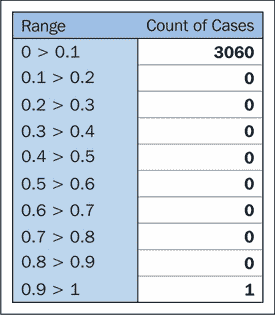
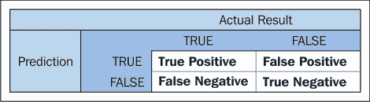
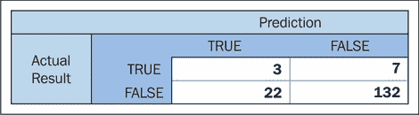
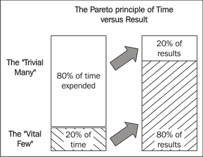

# 七、特征工程第二部分

# 简介

我们已经认识到特征工程的重要性。在前一章中，我们讨论了一些技术，这些技术使我们能够从一系列特征中进行选择，并有效地将原始数据转换为特征，这些特征可以通过我们迄今为止讨论的高级 ML 算法进行有效处理。

格言*垃圾进来，垃圾出去*在这种情况下是相关的。在前面的章节中，我们已经看到了图像识别和自然语言处理任务是如何需要精心准备的数据的。在这一章中，我们将看到一种更普遍的数据类型:从现实应用程序中收集的定量或分类数据。

我们将在本章中使用的数据类型在许多上下文中都很常见。我们可以讨论从森林、游戏机或金融交易中的传感器获取的遥测数据。我们可以利用通过研究收集的地质调查信息或生物测定数据。无论如何，核心原则和技术保持不变。

在本章中，您将学习如何询问这些数据以剔除或减轻质量问题，如何将其转换为有利于机器学习的形式，以及如何创造性地增强这些数据。

总的来说，我们将在本章中讨论的概念如下:

*   特征集创建的不同方法及特征工程的局限性
*   如何使用大量技术来增强和改进初始数据集
*   如何结合和使用领域知识来理解有效的选项，以转换和提高现有数据的清晰度
*   我们如何测试单个功能和功能组合的价值，以便只保留我们需要的东西

虽然我们将从底层概念的详细讨论开始，但在本章结束时，我们将进行多次迭代试验，并使用专门的测试来了解我们正在创建的特性对我们的帮助有多大。

# 创建特征集

成功的机器学习最重要的因素是你输入数据的质量。一个好的模型，如果有误导性的、不恰当的规范化的或不具信息性的数据，那么在模型运行适当准备的数据时，将不会看到同样的成功水平。

在某些情况下，您可以指定数据收集，或者访问一组有用的、大量的、多样的源数据。有了正确的知识和技能，您可以使用这些数据来创建非常有用的特征集。

一般来说，对于如何构建好的特征集有很强的知识是非常有帮助的，因为它使您能够审计和评估任何新的数据集，以发现错过的机会。在本章中，我们将介绍一个设计过程和技术集，使创建有效的特征集变得更加容易。

因此，我们将从讨论一些我们可以用来扩展或重新解释现有特性的技术开始，潜在地创建大量有用的参数来包含在我们的模型中。

然而，正如我们将会看到的，有效使用特征工程技术是有限制的，我们需要注意工程数据集周围的风险。

## 最大似然应用的工程特性

我们已经讨论了您可以做些什么来修补数据中的数据质量问题，并且我们已经讨论了如何在您必须加入到外部数据中的维度中创造性地使用维度。

一旦你面前有了一组相当好理解和经过质量检查的数据，在你能够从这些数据中产生有效的模型之前，通常还需要大量的工作。

### 使用重新缩放技术来提高特征的可学习性

将未准备好的数据直接输入许多机器学习模型的主要挑战是算法对不同变量的相对大小敏感。如果数据集有多个范围不同的参数，一些算法会将方差较大的变量视为比具有较小值和较小方差的算法更显著的变化。

解决这个潜在问题的关键是重新缩放，这是一个调整参数值相对大小的过程，同时保留每个参数中值的初始顺序(单调转换)。

如果在训练之前对输入数据进行缩放，梯度下降算法(包括大多数深度学习算法—[http://sebastianruder.com/optimizing-gradient-descent/](http://sebastianruder.com/optimizing-gradient-descent/))的效率会显著提高。为了理解为什么，我们将求助于画一些图片。给定的一系列培训步骤可能如下所示:


当应用于未缩放的数据时，这些训练步骤可能无法有效收敛(如下图中的左侧示例所示)。

由于每个参数具有不同的标度，模型试图训练的参数空间可能会高度失真和复杂。这个空间越复杂，在其中训练模型就越困难。总的来说，这是一个可以通过隐喻有效描述的复杂主题，但是对于寻求更全面解释的读者来说，在本章的*进一步阅读*部分有一个很好的参考。就目前而言，将训练中的梯度下降模型视为像大理石滚下斜坡一样的行为并不是没有道理的。这些弹珠容易卡在斜坡上的鞍点或其他复杂几何形状中(在这种情况下，这是由我们的模型的目标函数创建的表面——我们的模型通常训练其输出最小化的学习函数)。然而，通过缩放数据，表面变得更加规则，训练可以变得更加有效:


经典的例子是 *0* 和 *1* 之间的线性重新缩放；用这种方法，最大的参数值被重新调整到 *1* ，最小的被调整到 *0* ，中间值落在 *0-1* 区间，与它们相对于最大和最小值的原始大小成比例。在这样的变换下，矢量*【0，10，25，20，18】*将变为*【0，0.4，1，0.8，0.72】*。

这种转换的特殊价值在于，对于原始形式中幅度可能不同的多个数据点，重新缩放的特征将位于相同的范围内，从而使您的机器学习算法能够在有意义的信息内容上进行训练。

这是最直接的缩放选项，但是有一些非线性缩放选项，在正确的情况下会更有帮助；其中包括平方缩放、平方根缩放，最常见的可能是对数缩放。

参数值的对数标度在物理学和底层数据经常受幂律影响的环境中非常常见(例如， *y* 的指数增长与 *x* 的线性增长一致)。

与线性重新缩放不同，对数缩放调整数据案例之间的相对间距。这可能是一把双刃剑。一方面，对数标度能很好地处理外围情况。让我们来看一个描述虚构群体成员个人净财富的示例数据集，由以下汇总统计数据描述:


在重新调整之前，这一群体严重倾向于拥有荒谬净资产的个人。每十分之一的病例分布如下:



在对数标度之后，这种分布更加友好:


我们可以选择进一步缩放，并通过这样做来绘制这个分布的前半部分。在这种情况下，log-10 规范化显著降低了这些外围值的影响，使我们能够在数据集中保留异常值，而不会丢失低端的细节。

尽管如此，重要的是要注意，在某些情况下，聚类情况的相同增强会增强不同参数值中的噪声，并产生值之间更大间距的错误印象。这往往不会对对数标度处理异常值的方式产生负面影响；这种影响通常出现在原始值非常相似的小值案例组中。

通过对数标度引入非线性带来的挑战是巨大的，一般来说，非线性标度只推荐用于你理解的变量，并且它们之间有非线性关系或趋势。

### 创建有效的衍生变量

在许多机器学习应用中(例如，几乎所有的神经网络)，重新缩放是预处理的标准部分。除了重新缩放之外，还有其他准备技术，可以通过战略性地减少输入模型的参数数量来提高模型性能。最常见的例子是派生度量，它采用多个现有数据点，并在单个度量中表示它们。

这些是极其普遍的；例子包括加速度(作为来自两个时间点的速度值的函数)、体重指数(作为身高、体重和年龄的函数)和股票评分的 **市盈率** ( **市盈率**)比率。本质上，你曾经遇到的任何派生分数、比率或复杂度量都是由多个组成部分形成的组合分数。

对于熟悉环境中的数据集，许多这些预先存在的度量将是众所周知的。然而，即使在相对知名的领域，使用领域知识和现有数据的混合来寻找新的支持措施或转换也是非常有效的。思考派生度量选项时，一些有用的概念如下:

*   **两个变量组合**:作为 *m* 参数的函数的 *n* 参数的乘法、除法或归一化。
*   **随时间变化的度量**:这里的一个经典例子是一个度量中的加速度或 7D 变化。在更复杂的情况下，基础时间序列函数的斜率可能是一个有用的参数，而不是直接使用当前和过去的值。
*   **减去基线**:使用基本预期(一个平坦的预期，如*基线流失率*)根据该基线重新预测一个参数，可以更直接地了解同一变量。对于流失示例，我们可以生成一个参数，该参数根据与预期的偏差来描述流失。同样，在股票交易的情况下，我们可以根据开盘价来看收盘价。
*   **归一化**:根据前面的情况，基于另一个参数或基线的值对参数值进行归一化，该参数或基线是在给定其他变量属性的情况下动态计算的。这里的一个例子是*失败交易率*；除了将此值视为原始(或重新缩放的)计数之外，根据尝试的事务对其进行规范化通常也是有意义的。

这些不同元素的创造性重组让我们建立非常有效的分数。例如，有时，告诉我们客户参与度(下降或增加)随时间变化的斜率的参数需要以该客户之前是高度参与还是几乎不参与为条件，因为参与度的轻微下降在每种情况下可能意味着非常不同的事情。数据科学家的工作是有效地和创造性地为给定的领域捕获这些微妙的特征集。

到目前为止，这种讨论主要集中在数字数据上。然而，有用的数据通常被锁在非数字参数中，如代码或分类数据。因此，我们接下来将讨论一组将非数字特征转化为可用参数的有效技术。

### 重新解释非数字特征

一个常见的挑战是如何处理非数字特征，这可能是有问题的，也可能是特定问题的。通常，有价值的信息被编码在非数字速记值中。例如，在股票交易中，股票本身的身份(例如，AAPL)以及买方和卖方的身份是有趣的信息，我们期望这些信息与我们的问题有意义地联系起来。进一步举这个例子，我们可能还会期望一些股票的交易与其他股票不同，即使是在行业内，公司内部的组织差异也提供了重要的背景，这些差异可能发生在某些或所有时间点。

在某些情况下，一个简单的选择是构建一个聚合或一系列聚合。最明显的例子是出现次数，可以创建扩展度量(两个时间窗口之间的计数变化)，如前一节所述。

构建汇总统计数据并减少数据集中的行数会带来减少模型可用信息量的风险(增加模型脆弱性和过度拟合的风险)。因此，广泛地聚合和减少输入数据通常不是一个好主意。深度学习技术更是如此，比如第 2-4 章中讨论和使用的算法。

与其大量使用基于聚合的方法，不如让我们看看将字符串编码值转换为数字数据的另一种方法。另一类非常流行的技术是编码，最常见的编码策略是一次性编码。One-hot 编码是将一系列分类响应(例如，年龄组)转换为一组二进制变量的过程，每个响应选项(例如，18-30)都由其自己的二进制变量表示。这在视觉上更直观:


编码后，这个分类变量和连续变量的数据集成为二元变量的张量:


这呈现的优势是显著的；它使我们能够挖掘包含在大量数据集中的非常有价值的标签信息，而不会聚合或降低数据的信息内容。此外，one-hot 允许我们将编码变量的特定响应代码分成单独的特征，这意味着我们可以为特定变量识别或多或少有意义的代码，并且只保留重要的值。

另一种非常有效的技术，主要用于文本代码，被称为**哈希技巧**。简单来说，散列是将数据转换成数字表示的函数。散列对许多人来说是一个熟悉的概念，因为它们经常被用来编码敏感的参数和总结庞大的数据。然而，为了最大限度地利用哈希技巧，了解技巧是如何工作的以及可以用它做什么是很重要的。

我们可以使用散列法将一个文本短语转换成一个数值，用作该短语的标识符。虽然不同的散列算法有许多应用，但在这种情况下，即使是简单的散列也可以直接将字符串键和代码转换为我们可以有效建模的数字参数。

一个非常简单的散列可以把每个字母字符变成一个相应的数字。 *a* 会变成 *1* ， *b* 会变成 *2* ，以此类推。通过对这些值求和，可以为单词和短语生成哈希值。短语*卡特彼勒 gif*在此方案下的翻译如下:

```py
Cat: 3 + 1 + 20
Gifs: 7 + 9 + 6 + 19
Total: 65

```

这是一个可怕的散列，原因有二(完全无视输入包含垃圾词的事实！).首先，它可以呈现多少输出没有真正的限制。当人们记得散列技巧的全部要点是提供降维时，从散列中可能输出的数量必须是有限的，这是理所当然的！大多数散列限制了它们输出的数字的范围，因此选择散列的部分决定与您希望模型具有的特征的数量有关。

### 注

一种常见的行为是选择 2 的幂作为散列范围；这有助于在哈希过程中允许按位运算，从而加快速度。

这种杂凑很糟糕的另一个原因是对单词的改变影响很小，而不是很大。如果*猫*变成了*蝙蝠*，我们希望我们的哈希输出发生实质性的变化。而是变化一(变成 *64* )。一般来说，一个好的散列函数是输入文本中的一个小变化会导致输出中的一个大变化。这部分是因为语言结构趋向于非常一致(因此得分相似)，但是给定结构内稍微不同的名词和动词集合趋向于赋予彼此非常不同的含义(*猫坐在垫子上*对比*汽车坐在猫身上*)。

所以我们已经描述了散列。哈希技巧让事情更进一步。假设，把每个单词都变成一个散列的数字代码将导致大量的*散列冲突*——两个单词具有相同散列值的情况。自然，这些是相当糟糕的。

很容易地，不同术语使用频率的分布对我们有利。称为 **齐夫分布**，它要求遇到第 n 个<sup>最常见项的概率近似为 *P(n) = 0.1/n* 直到大约 1000(齐夫定律)。这意味着每一项都比前一项更不容易遇到。在 *n = 1000* 之后，术语往往足够模糊，以至于在一个数据集中不太可能遇到两个具有相同散列的术语。</sup>

同时，一个好的散列函数的范围有限，并且会受到输入的微小变化的显著影响。这些属性使得哈希冲突机会在很大程度上与术语使用频率无关。

这两个概念——齐夫定律和一个好的散列与散列冲突机会和术语使用频率的独立性——意味着散列冲突的机会非常小，并且当一个散列冲突发生时，它极有可能在两个不常用的单词之间。

这给了哈希技巧一个特殊的属性。也就是说，与在未处理的词包特征上的训练相比，在不降低在散列数据上训练的模型的性能的情况下，可以大规模地降低一组文本输入数据的维度(从数万个自然出现的词到几百个或更少)。

正确使用哈希技巧可以实现很多可能性，包括对我们讨论的技术的扩展(特别是单词包)。本章末尾的*进一步阅读*一节中包含了对不同哈希实现的参考。

## 使用特征选择技术

现在我们有了一个很好的特征创建选项选择，以及对创造性特征工程可能性的理解，我们可以开始将我们现有的特征构建成更有效的变体。鉴于这一新发现的功能工程技能集，我们面临创建大量难以管理的数据集的风险。

无限制地添加特征会增加模型脆弱性和对某些类型模型过度拟合的风险。这与你试图模拟的趋势的复杂性有关。在最简单的情况下，如果您试图识别两个大组之间的显著区别，那么您的模型可能支持大量功能。但是，随着您需要适应的模型变得更加复杂，以及您必须处理的组变得越来越小，添加越来越多的特征会损害模型一致有效地分类的能力。

这一挑战因以下事实而变得更加复杂:哪个参数或变体最适合该任务并不总是显而易见的。适用性可能因基础模型而异；例如，决策森林在单调变换(也就是说，保持数据案例初始排序的变换)中表现不佳；一个例子是对数缩放)而不是未缩放的基础数据；但是，对于其他算法，选择重新缩放和使用的重新缩放方法都是非常有影响的选择。

传统上，特征的数量和参数数量的限制与开发将关键输入与期望的结果分数相关联的数学函数的愿望相关联。在这种情况下，需要加入额外的参数作为移动或有害变量。

每个新参数都引入了另一个维度，这使得建模的关系更加复杂，结果模型更有可能过度拟合现有数据。一个简单的例子是，如果您引入一个参数，它只是每个案例的唯一标签；在这一点上，您的算法将只学习那些标签，使得当您的模型被引入新的数据集时，它很可能完全失败。

不那么琐碎的例子同样问题重重；当您的功能将案例分成非常小的组时，案例与功能的比例变得非常重要。简而言之，增加建模函数的复杂性会导致模型更容易过度拟合，而添加特征会加剧这种影响。根据这个原则，我们应该从非常小的数据集开始，并且只有在证明它们改进了模型之后才添加参数。

然而，在最近，一种相反的方法论——现在被普遍认为是做数据科学的一种常见方式的一部分——已经取得了进展。这种方法表明，增加非常大的特征集来整合每一个潜在的有价值的特征是一个好主意，并且*将*降低到一个更小的特征集来完成这项工作。

这种方法得到了一些技术的支持，这些技术能够在庞大的特征集(可能有数百或数千个特征)上做出决策，并且倾向于以*蛮力*的方式进行操作。这些技术将彻底测试特征组合，串联或并联运行模型，直到识别出最有效的参数子集。

这些技术起作用，这就是为什么这种方法变得流行。如果不使用这些技术，了解它们肯定是值得的，所以在本章的后面，您将学习如何应用它们。

使用暴力技术进行特征选择的主要缺点是，很容易相信算法的结果，而不管它选择的特征实际上意味着什么。明智的做法是在高效黑盒算法的使用和领域知识以及对正在进行的工作的理解之间取得平衡。因此，本章将使您能够使用两种范式(*构建*和*构建*)的技术，以便您能够适应不同的上下文。我们将从学习如何缩小您必须处理的特征集开始，从许多特征到最有价值的子集。

### 执行特征选择

构建了一个大型数据集后，人们面临的下一个挑战往往是如何缩小选项范围，只保留最有效的数据。在这一节中，我们将讨论支持特征选择的各种技术，它们可以自己工作，也可以作为熟悉算法的包装器。

这些技术包括相关分析、正则化技术和**递归特征消除** ( **RFE** )。当我们完成后，您将能够自信地使用这些技术来支持您的特征集选择，每次使用新数据集时，都有可能为自己节省大量工作！

#### 相关性

我们将从寻找回归模型主要问题的简单来源:多重共线性开始我们对特征选择的讨论。多重共线性是数据集中要素之间中度或高度相关性的奇特名称。一个显而易见的例子是披萨切片计数如何与披萨价格共线。

多重共线性有两种类型:结构性的和基于数据的。当创建新要素(例如来自要素 *f* 的要素 *f1* )时，会出现结构多重共线性，这可能会导致多个要素之间高度相关。当两个变量受同一致病因素影响时，基于数据的多重共线性倾向于发生。

这两种多重共线性都会造成一些不良影响。特别是，我们的模型的性能往往会受到所使用的特征组合的影响；当使用共线特征时，我们模型的性能将会下降。

无论是哪种情况，我们的方法都很简单:我们可以测试多重共线性，并移除表现不佳的特征。自然，性能不佳的特性对模型性能的贡献很小。它们可能表现不佳，因为它们复制了其他功能中可用的信息，或者它们可能根本没有提供对当前问题有意义的数据。有多种方法可以测试弱特征，因为许多特征选择技术会筛选出多共线特征组合，如果表现不佳，建议将其移除。

此外，还有一个具体的多重共线性检验值得考虑；即检查数据相关矩阵的特征值。特征向量和特征值是矩阵理论中的基本概念，有许多突出的应用。更多细节将在本章末尾给出。就目前而言，可以说数据集生成的相关矩阵中的特征值为我们提供了多重共线性的量化度量。考虑一组特征值来表示我们的特征给数据集带来了多少“新信息内容”；低特征值表明数据可能与其他特征相关。例如，在工作中，考虑以下代码，该代码创建一个特征集，然后将共线性添加到特征 *0* 、 *2* 和 *4* :

```py
import numpy as np

x = np.random.randn(100, 5) 
noise = np.random.randn(100)
x[:,4] = 2 * x[:,0] + 3 * x[:,2] + .5 * noise 
```

当我们生成相关矩阵并计算特征值时，我们发现如下:

```py
corr = np.corrcoef(x, rowvar=0)
w, v = np.linalg.eig(corr)

print('eigenvalues of features in the dataset x')
print(w)

eigenvalues of features in the dataset x
[ 0.00716428  1.94474029  1.30385565  0.74699492  0.99724486]
```

显然，我们的*第 0 个*特征是可疑的！然后我们可以通过调用`v`来检查这个特征的特征值:

```py
print('eigenvalues of eigenvector 0')
print(v[:,0])

eigenvalues of eigenvector 0
[-0.35663659 -0.00853105 -0.62463305  0.00959048  0.69460718]
```

从位置一和位置三的特征的小值，我们可以看出特征 *2* 和 *4* 与特征 *0* 高度多共线。在继续之前，我们应该删除这三个特征中的两个！

#### 套索

正则化方法是最有帮助的特征选择技术，因为它们提供了稀疏的解决方案:较弱的特征返回零，只留下具有真实系数值的特征子集。

两种最常用的正则化模型是 L1 正则化和 L2 正则化，在线性回归环境中分别称为 LASSO 和岭回归。

正则化方法通过在损失函数中增加一个惩罚来发挥作用。该惩罚导致 *E(X，Y) + a||w||* ，而不是最小化损失函数 *E(X，Y)* 。超参数 *a* 与正则化的数量有关(使我们能够调整正则化的强度，从而调整所选原始特征集的比例)。

在 LASSO 正则化中，使用的具体罚函数是 *α∑ni=1|wi|* 。每个非零系数增加了惩罚项的大小，迫使较弱的特征返回 *0* 的系数。使用 scikit-learn 对超参数的参数优化支持，可以选择合适的惩罚项。在这种情况下，我们将使用`estimator.get_params()`来执行网格搜索，以获得合适的超参数值。有关网格搜索如何操作的更多信息，请参见本章末尾的*进一步阅读*部分。

在 scikit-learn 中，逻辑回归为分类提供了 L1 惩罚。同时，LASSO 模块是为线性回归提供的。现在，让我们从将 LASSO 应用于示例数据集开始。在本例中，我们将使用波士顿住房数据集:

```py
fromsklearn.linear_model import Lasso
fromsklearn.preprocessing import StandardScaler
fromsklearn.datasets import load_boston

boston = load_boston()
scaler = StandardScaler()
X = scaler.fit_transform(boston["data"])
Y = boston["target"]
names = boston["feature_names"]

lasso = Lasso(alpha=.3)
lasso.fit(X, Y)

print "Lasso model: ", pretty_print_linear(lasso.coef_, names, sort = True)

Lasso model: -3.707 * LSTAT + 2.992 * RM + -1.757 * PTRATIO + -1.081 * DIS + -0.7 * NOX + 0.631 * B + 0.54 * CHAS + -0.236 * CRIM + 0.081 * ZN + -0.0 * INDUS + -0.0 * AGE + 0.0 * RAD + -0.0 * TAX
```

原始集合中的几个特征返回了`0.0`的相关性。增加相关性会使解决方案越来越稀疏。例如，当`alpha = 0.4`时，我们会看到以下结果:

```py
Lasso model: -3.707 * LSTAT + 2.992 * RM + -1.757 * PTRATIO + -1.081 * DIS + -0.7 * NOX + 0.631 * B + 0.54 * CHAS + -0.236 * CRIM + 0.081 * ZN + -0.0 * INDUS + -0.0 * AGE + 0.0 * RAD + -0.0 * TAX
```

我们可以立即看到 L1 正则化作为特征选择技术的价值。然而，重要的是要注意，L1 正则化回归是不稳定的。当数据中的特征相关时，即使数据变化很小，系数也会有很大变化。

这个问题可以通过 L2 正则化或岭回归有效地解决，岭回归开发了具有不同应用的特征系数。L2 归一化在损失函数中增加了一个额外的惩罚，即 L2 范数惩罚。这种处罚的形式为( *a∑ni=1w2i* )。目光敏锐的读者会注意到，与 L1 罚函数不同( *α∑ni=1|wi|* )，L2 罚函数使用平方系数。这使得系数值更均匀地分布，并且具有附加效果，即相关特征倾向于接收相似的系数值。这显著提高了稳定性，因为系数不再因小的数据变化而波动。

然而，L2 归一化对特征选择没有 L1 那么直接有用。相反，由于有趣的特征(具有预测能力)往往具有非零系数，L2 作为一种探索性工具更有用，它允许推断分类中特征的质量。它具有比 L1 正则化更稳定和可靠的额外优点。

#### 递归特征消除

RFE 是一个贪婪的迭代过程，充当另一个模型的包装器，比如 SVM (SVM-RFE)，它反复运行输入数据的不同子集。

与 LASSO 和岭回归一样，我们的目标是找到性能最好的特征子集。顾名思义，在每次迭代中，都会留出一个要素，允许对其余要素集重复该过程，直到数据集中的所有要素都被消除。消除特征的顺序成为它们的等级。在用增量较小的子集进行多次迭代之后，每个特征都被精确地评分，并且可以选择相关的子集来使用。

为了更好地理解这是如何工作的，让我们看一个简单的例子。我们将使用(现在已经很熟悉的)数字数据集来理解这种方法在实践中是如何工作的:

```py
print(__doc__)

from sklearn.svm import SVC
fromsklearn.datasets import load_digits
fromsklearn.feature_selection import RFE
importmatplotlib.pyplot as plt

digits = load_digits()
X = digits.images.reshape((len(digits.images), -1))
y = digits.target
```

我们将使用 SVM 作为我们的基础估计器，通过`SVC`算子进行**支持向量分类** ( **支持向量机**)。我们然后在这个模型上应用 RFE 包装。RFE 提出了几个论点，第一个是对选择估计量的引用。第二个论点是`n_features_to_select`，相当不言自明。如果特征集包含许多相互关联的特征，这些特征的子集具有高效分类特征的多元分布，则可以选择两个或多个特征的组合。

步进允许在每次迭代中移除多个特征。当给定一个介于 *0.0* 和 *1.0* 之间的值时，每一步都允许移除特征集的一个百分比，对应于步骤参数中给出的比例:

```py
svc = SVC(kernel="linear", C=1)
rfe = RFE(estimator=svc, n_features_to_select=1, step=1)
rfe.fit(X, y)
ranking = rfe.ranking_.reshape(digits.images[0].shape)

plt.matshow(ranking)
plt.colorbar()
plt.title("Ranking of pixels with RFE")
plt.show()
```

假设我们熟悉数字数据集，我们知道每个实例都是一个 8×8 的手写数字图像，如下图所示。每个图像位于 8×8 网格的中心:


当我们对数字数据集应用 RFE 时，我们可以看到它在应用排名时广泛地捕获了这些信息:


要剪切的第一个像素在图像的垂直边缘(通常是空的)内部和周围。接下来，算法开始剔除图像垂直边缘或顶部附近的空白区域。保留时间最长的像素是那些能够最大程度区分不同字符的像素，这些像素对于某些数字是存在的，而对于其他数字是不存在的。

这个例子给了我们很好的视觉确认 RFE 的作品。它没有给我们的是该技术如何持续工作的证据。RFE 的稳定性取决于基本模型的稳定性，在某些情况下，岭回归将提供更稳定的解。(有关涉及哪些情况和条件的更多信息，请参考本章末尾的*进一步阅读*部分。)

#### 遗传模型

在这一章的前面，我们讨论了能够在非常大的参数集下进行特征选择的算法的存在。这种类型的一些最突出的技术是遗传算法，它模拟自然选择来生成越来越有效的模型。

用于特征选择的遗传解决方案大致工作如下:

*   将一组初始变量(预测因子是此上下文中通常使用的术语)组合成多个子集(候选)，并为每个候选计算性能度量
*   来自具有最佳性能的候选的预测器被随机重组到新的迭代(一代)模型中
*   在该重组步骤中，对于每个子集，都有突变的概率，由此可以从子集添加或移除预测因子

该算法通常迭代多代。适当的迭代量取决于数据集的复杂性和所需的模型。与梯度下降技术一样，遗传算法的性能和迭代次数之间存在典型的关系，其中性能的提高随着迭代次数的增加而非线性下降，最终在过拟合风险增加之前达到最小值。

为了找到有效的迭代次数，我们可以使用训练数据进行测试；通过大量迭代运行模型并绘制**均方根误差** ( **RMSE** )，我们能够在给定输入数据和模型配置的情况下找到合适的迭代次数。

让我们更详细地谈谈每一代人身上发生的事情。具体来说，我们来谈谈候选人是如何产生的，绩效是如何评分的，重组是如何进行的。

候选项最初被配置为使用可用预测值的随机样本。关于在第一代中使用多少预测器，没有硬性规定；这取决于有多少功能可用，但通常会看到第一代候选人使用 50%到 80%的可用功能(在功能较多的情况下使用较小的百分比)。

适合性度量可能很难定义，但是通常的做法是使用两种形式的交叉验证。内部交叉验证(仅在其自身参数的上下文中测试每个模型，而不比较模型)通常用于跟踪给定迭代的性能；来自内部交叉验证的适应度度量用于选择模型，以便在下一代中重新组合。还需要外部交叉验证(针对未在任何迭代中用于验证的数据集进行测试)，以确认搜索过程生成的模型没有过度适应内部训练数据。

重组由三个关键参数控制:突变、交叉概率和精英化。后者是一个可选参数，人们可以使用它来保留当前世代中 n-许多表现最好的模型；通过这样做，可以防止特别有效的候选基因在重组过程中完全丢失。这可以在突变变体中使用该候选基因和/或将其用作下一代候选基因的亲本的同时进行。

突变概率定义了下一代模型被随机重新调整的机会(通过一些预测器，通常是一个，被添加或删除)。变异有助于遗传算法保持候选变量的广泛覆盖，降低陷入参数局部解的风险。

交叉概率定义了一对候选者被选择重组到下一代模型中的可能性。有几种交叉算法:可以将每个父要素集的一部分拼接(例如，前半部分/后半部分)到子要素中，或者可以随机选择每个父要素。默认情况下，也可能使用父母双方共有的功能。从父母的唯一预测者集合中随机抽样是一种常见的默认方法。

这些是通用遗传算法的主要部分，可以用作现有模型(逻辑回归、SVM 等)的包装器。这里描述的技术可以以许多不同的方式变化，并且与在多个定量领域中稍微不同地使用的特征选择技术相关。让我们把到目前为止已经讨论过的理论应用到一个实际的例子中。

# 实践中的特色工程

根据您正在使用的建模技术，其中一些工作可能比其他部分更有价值。深度学习算法在工程设计较少的数据上比在较浅的模型上表现更好，可能需要较少的工作来改进结果。

理解需要什么的关键是快速迭代从数据集获取到建模的整个过程。在第一次有明确的模型精度目标时，找到可接受的最小处理量并执行。尽可能了解结果，并为下一次迭代制定计划。

为了展示这在实践中的样子，我们将使用一个不熟悉的高维数据集，使用迭代过程来生成越来越有效的建模。

我最近住在温哥华。虽然它有许多积极的品质，但生活在城市中最糟糕的事情之一是有些不可预测的通勤。无论我是坐汽车旅行，还是乘坐 Translink 的 Skytrain 系统(一条单轨列车和过山车的高速线路)，我都发现自己受到难以预测的延误和拥堵问题的困扰。

本着将我们的新功能工程技能付诸实践的精神，让我们看看是否可以通过采取以下步骤来改善这种体验:

*   编写代码以从多个 API 获取数据，包括文本和气候流
*   使用我们的特征工程技术从这个初始数据中导出变量
*   通过生成通勤延迟风险评分来测试我们的功能集

不同寻常的是，在这个例子中，我们将不再关注构建和评分一个高性能的模型。相反，我们的重点是创建一个自给自足的解决方案，您可以根据自己的本地情况进行调整和应用。虽然采取这种方法符合本章的目标，但还有另外两个重要的动机。

首先，围绕分享和利用推特数据存在一些挑战。使用推特应用编程接口的部分条款是开发者有义务确保对时间线或数据集状态的任何调整(例如，包括删除推文)都在从推特上提取并公开共享的数据集中重现。这使得在本章的 GitHub 存储库中包含真实的 Twitter 数据变得不切实际。最终，由于用户需要构建自己的流并积累数据点，以及环境的变化(如季节变化)可能会影响模型性能，因此很难根据流数据提供任何下游模型的可再现结果。

这里的第二个要素很简单:不是每个人都住在温哥华！为了给最终用户带来一些有价值的东西，我们应该考虑一个可调整的通用解决方案，而不是一个特定地域的解决方案。

因此，下一节中介绍的代码旨在作为构建和开发的基础。它提供了作为成功的商业应用的基础的潜力，或者仅仅是一个有用的、数据驱动的生活帮。考虑到这一点，请查看本章的内容(并利用相关代码目录中的代码)，以便找到并创建适合您自己的情况、本地可用数据和个人需求的新应用程序。

## 通过 RESTful APIs 获取数据

为了开始，我们需要收集一些数据！我们需要寻找以足够的频率(最好每个通勤周期至少一个记录)捕获的丰富的、有时间戳的数据，以便进行模型训练。

一个自然的开始是推特应用编程接口，它允许我们收集最近的推文数据。我们可以将这个应用编程接口分为两种用途。

首先，我们可以从官方交通机构(特别是公交和火车公司)获得推文。这些公司提供有关延误和服务中断的运输服务信息，对我们有帮助的是，这些信息采用了有利于标记工作的一致格式。

其次，我们可以通过收听感兴趣地理区域的推文来挖掘通勤情绪，使用定制的字典来收听与中断案例或其原因相关的术语。

除了挖掘数据的推特应用编程接口来支持我们的模型，我们还可以利用其他应用编程接口来提取丰富的信息。一个特别有价值的数据来源是 **必应流量 API** 。这个应用编程接口可以很容易地被调用来提供跨用户指定的地理区域的交通拥堵或中断事件。

此外，我们可以利用来自 **雅虎天气 API** 的天气数据。该应用编程接口提供给定位置的当前天气，采用邮政编码或位置输入。它提供了丰富的当地气候信息，包括但不限于温度、风速度、湿度、大气压力和能见度。此外，它还提供了当前条件的文本字符串描述以及预测信息。

虽然我们可以考虑将其他数据源结合到我们的分析中，但我们将从这些数据开始，看看我们是如何做的。

### 测试我们模型的性能

为了有意义地评估我们的通勤中断预测尝试，我们应该尝试定义测试标准和适当的绩效评分。

我们试图做的是识别每天当天通勤中断的风险。最好，我们想知道通勤风险，并提前通知我们可以采取行动来减轻风险(例如，提前离开家)。

为了做到这一点，我们需要三样东西:

*   了解我们的模型将输出什么
*   我们可以用来量化模型性能的度量
*   我们可以使用一些目标数据，根据我们的衡量标准对模型性能进行评分

我们可以就为什么这很重要进行有趣的讨论。可以有效地说，有些模型是有目的的信息。可以说，我们的通勤风险评分是有用的，因为它产生了我们以前没有的信息。

然而，现实情况是，不可避免地会有一个性能标准。在这种情况下，可能只是我对模型输出的结果感到满意，但重要的是要意识到，总有一些性能标准在起作用。因此，量化性能是有价值的，即使在模型看起来是信息性的(甚至更好，不受监督)的情况下。这使得抵制放弃性能测试的诱惑变得谨慎；至少这样，你就有了一个量化的性能度量来迭代地改进。

一个合理的起点是断言我们的模型旨在输出给定日期出站(从家到工作)通勤的数值分数在 *0-1* 范围内。我们有几个关于如何呈现这个分数的选择；也许最明显的选择是对数据应用日志重新缩放。有充分的理由进行对数标度，在这种情况下，这可能不是一个坏主意。(通勤延迟时间的分布服从幂律并非不可能。)目前，我们不会重塑这组分数。相反，我们将等待查看我们模型的输出。

就提供实际指导而言， *0-1* 的分数不一定很有帮助。我们可能会发现自己想要使用桶边界在 *0-1* 范围内的桶边界的桶系统(如高风险、中风险或低风险)。简而言之，我们将过渡到将问题视为具有分类输出(类标签)的多类分类问题，而不是具有连续输出的回归问题。

这可能会提高模型性能。(更具体地说，因为它将把自由误差幅度提高到相关桶的最大宽度，这是一个非常慷慨的性能度量。)同样，在第一次迭代中引入这种变化可能不是一个好主意。直到我们回顾了真实通勤延迟的分布，我们才知道阶级之间的界限在哪里！

接下来，我们需要考虑如何衡量模型的性能。选择合适的评分标准通常取决于问题的特点。我们有很多关于分类器性能评分的选项。(有关机器学习算法性能度量的更多信息，请参见本章末尾的*进一步阅读*部分。)

决定哪种性能度量适合手头的任务的一种方法是考虑混淆矩阵。混淆矩阵是一个偶然事件表；在统计建模的背景下，他们通常描述标签预测与实际标签的对比。为一个训练好的模型输出一个混淆矩阵是很常见的(特别是对于有更多类的多类问题)，因为它可以产生关于按故障类型和类分类故障的有价值的信息。

在这种情况下，参考混淆矩阵更能说明问题。我们可以考虑以下简化矩阵来评估是否有我们不关心的意外情况:



在这种情况下，我们关心所有四种应急类型。假阴性会让我们陷入意想不到的延误，而假阳性会让我们提前出发去上班。这意味着我们需要一个既重视高灵敏度(真阳性率)又重视高特异性(假阳性率)的性能指标。考虑到这一点，理想的衡量标准是曲线下的面积(T2)。

第二个挑战是如何衡量这个分数；我们需要一些可以预测的目标。谢天谢地，这很容易获得。毕竟我每天都有通勤要做！我只是用秒表、一致的开始时间和一致的路线开始自我记录我的通勤时间。

重要的是认识到这种方法的局限性。作为一个数据源，我受制于自己的内部趋势。例如，我在早上喝咖啡之前有些懒散。同样，我自己的一贯通勤路线可能拥有其他路线所没有的本地趋势。从许多人和许多路线收集通勤数据会好得多。

然而，在某些方面，我对这个目标数据的使用感到满意。不仅仅是因为我试图对自己通勤路线的中断进行分类，并且不希望我的通勤时间的自然差异通过培训被误解，比如说，与其他通勤者群体或路线设定的目标相比较。此外，考虑到预期的日常轻微自然变化，功能模型应不予考虑。

就模型性能而言，很难判断什么足够好。更准确地说，不容易知道这个模型什么时候超过了我自己的预期。不幸的是，关于我自己的通勤延迟预测的准确性，我不仅没有任何非常可靠的数据，而且一个人的预测似乎不太可能推广到其他地方的其他通勤。训练一个模型超过一个相当主观的目标似乎是不明智的。

相反，让我们尝试超越一个相当简单的阈值——一个天真地认为每一天都不会包含通勤延迟的模型。这个目标具有反映我们实际行为的相当令人愉快的特性(因为我们倾向于每天起床，表现得好像不会有交通中断)。

在 85 个目标数据案例中，观察到 14 个通勤延误。基于这个目标数据和我们创建的评分标准，我们的目标是 *0.5* 。

### 推特

鉴于我们正在将这个示例分析的重点放在温哥华市，我们有机会利用第二个推特数据源。具体来说，我们可以使用温哥华公共交通管理局 Translink 的服务公告。

#### Translink 推特

如上所述，该数据已经结构良好，有利于文本挖掘和后续分析；通过使用我们在前两章中回顾的技术处理这些数据，我们可以清理文本，然后将其编码为有用的特征。

我们将应用推特应用编程接口在很长一段时间内收集 Translink 的推文。推特应用编程接口是一个非常友好的工具包，很容易从 Python 中使用。(有关如何使用推特应用编程接口的扩展指导，请参见本章末尾的*进一步阅读*部分！)在这种情况下，我们希望从推文中提取日期和正文。正文几乎包含了我们需要知道的一切，包括以下内容:

*   推文的性质(延迟或不延迟)
*   车站受到影响
*   关于延迟性质的一些信息

增加一点复杂性的一个因素是，同一个 Translink 账户在推特上发布了天空列车线路和公交线路的服务中断信息。幸运的是，在描述每种服务类型和主题的服务问题时，该帐户通常非常统一。特别是，推特账户使用特定的标签 **(#RiderAlert** 用于公交路线信息， **#SkyTrain** 用于列车相关信息， **#TransitAlert** 用于两种服务的一般警报，如法定假日)来区分服务中断的主题。

类似地，我们可以期望延迟总是用延迟这个词来描述，迂回这个词来描述迂回，而分流这个词来描述。这意味着我们可以使用特定的关键词过滤掉不想要的推文。干得好，特兰林克！

### 注

本章中使用的数据在本章随附的 GitHub 解决方案中的`translink_tweet_data.json`文件中提供。章节代码中还提供了刮擦脚本；为了利用它，您需要在 Twitter 上设置一个开发人员帐户。这很容易实现；此处记录了流程，您可以在此处注册。

一旦我们获得了推文数据，我们就知道下一步该做什么了——我们需要清理并规范正文！根据[第六章](06.html "Chapter 6. Text Feature Engineering")、*文本特征工程*，我们对输入数据运行`BeautifulSoup`和`NLTK`:

```py
from bs4 import BeautifulSoup

tweets = BeautifulSoup(train["TranslinkTweets.text"])  

tweettext = tweets.get_text()

brown_a = nltk.corpus.brown.tagged_sents(categories= 'a')

tagger = None
for n in range(1,4):
   tagger = NgramTagger(n, brown_a, backoff = tagger)

taggedtweettext = tagger.tag(tweettext)
```

我们可能不需要像上一章中的巨魔数据集那样进行密集的清理。Translink 的推文高度公式化，不包含非 ascii 字符或表情符号，所以我们在[第六章](06.html "Chapter 6. Text Feature Engineering")、*文本特征工程*中需要用到的具体“深度清洗”regex 脚本，这里就不需要了。

这为我们提供了一个包含小写、正则化和字典检查术语的数据集。我们已经准备好开始认真思考我们应该从这些数据中构建什么特性。

我们知道，检测数据中服务中断问题的基本方法是在推文中使用延迟术语。延迟以下列方式发生:

*   在给定的位置
*   在给定的时间
*   出于某种原因
*   在给定的持续时间内

在前三个因素中的每一个都在 Translink 推文中被持续跟踪，但是有一些数据质量问题值得认识。

位置根据第 22 街的受影响街道或车站*给出。对于我们的目的来说，这不是一个完美的描述，因为我们不太可能在不做大量额外工作的情况下将街道名称和路线起点/终点变成一般的*受影响区域*(因为不存在允许我们基于该信息绘制边界框的方便参考)。*

推文日期时间给出的时间并不完美。虽然我们不清楚推文是否在服务中断后的一致时间内发出，但 Translink 很可能有服务通知的目标。目前，在推文时间可能足够准确的假设下进行是明智的。

例外情况是可能是长期运行的问题或改变严重程度的问题(预计很小但变得重要的延迟)。在这些情况下，推文可能会被推迟，直到 Translink 团队认识到这个问题已经变得值得推文。数据质量问题的另一个可能原因是 Translink 内部通信不一致；工程或平台团队可能不会总是以相同的速度通知客户服务通知团队。

不过，我们必须有一定的信心，因为如果没有实时、准确的跨链路服务延迟数据集，我们无法测量这些延迟影响。(如果我们有，我们会用它来代替！)

Translink 始终如一地描述了天空列车服务延迟的原因，这些原因可分为以下几类:

*   铁路
*   火车
*   转换
*   控制
*   未知的
*   闯入
*   医学的
*   警察
*   力量

在推文正文中使用前面列表中给出的特定术语描述每个类别。显然，其中一些类别(警察、电力、医疗)不太可能相关，因为它们不会告诉我们任何关于道路状况的有用信息。列车、轨道和道岔故障率可能与绕行可能性相关；这表明，出于分类目的，我们可能希望保留这些案例。

与此同时，公交路线服务延误包含一组类似的代码，其中许多与我们的目的非常相关。这些代码如下:

*   **机动车事故** ( **MVA** )
*   建筑
*   火
*   运水人
*   交通

编码这些事件类型很可能会被证明有用！特别是，某些服务延迟类型可能比其他类型更有影响，从而增加了服务延迟更长的风险。我们希望对服务延迟类型进行编码，并在后续建模中将它们用作参数。

为此，让我们应用一种热编码的变体，它执行以下操作:

*   它为每种服务风险类型创建一个条件变量，并将所有值设置为零
*   它检查每项服务风险类型条款的推文内容
*   它将包含特定风险术语的每条推文的相关条件变量设置为 1

这有效地执行了一次性编码，而没有采取麻烦的中间步骤，即创建我们通常要处理的阶乘变量:

```py
from sklearn import preprocessing

enc = preprocessing.OneHotEncoder(categorical_features='all', dtype= 'float', handle_unknown='error', n_values='auto', sparse=True)

tweets.delayencode = enc.transform(tweets.delaytype).toarray()
```

除了我们可以在每个事件的基础上使用的功能之外，我们还可以查看服务中断风险和中断频率之间的关系。如果我们在一周内看到两次中断，第三次中断的可能性更大还是更小？

虽然这些问题很有趣，而且可能很有成果，但通常更谨慎的做法是在第一遍就建立一个有限的特征集和简单的模型，而不是过度设计一个庞大的特征集。因此，我们将运行初始发生率特性，并查看最终结果。

#### 消费者评论

2010 年的一个主要文化发展是广泛使用公共在线域名进行自我表达。如果我们知道如何利用这一点，这其中最令人高兴的产品之一就是可以获得大量关于任意数量主题的自我报告信息。

通勤中断是激发个人反应的频繁发生的事件，这意味着它们往往会在社交媒体上被广泛报道。如果我们为关键词搜索编写一个合适的字典，我们就可以开始使用推特，尤其是作为一个关于城市交通和运输问题的有时间戳的信息来源。

为了收集这些数据，我们将使用基于字典的搜索方法。我们对所讨论时期的大多数推文不感兴趣(由于我们使用的是 RESTful API，因此需要考虑回报限制)。相反，我们感兴趣的是识别包含与拥塞或延迟相关的关键术语的推文数据。

不幸的是，从大量用户那里获得的推文往往不符合有助于分析的一致风格。我们将不得不应用我们在前一章中开发的一些技术，将这些数据分解成更容易分析的格式。

除了使用基于字典的搜索，我们还可以做一些工作来缩小搜索范围。实现这一点最权威的方法是使用坐标边界框作为推特应用编程接口的参数，这样任何相关的查询都只返回从这个区域收集的结果。

一如既往，在我们第一次通过时，我们会保持简单。在这种情况下，我们将统计当前时段的流量中断推文数量。在随后的迭代中，我们可以利用这些数据做一些额外的工作。正如 Translink 数据包含明确定义的延迟原因类别一样，我们可以尝试使用专门的字典来基于关键术语(例如，与构造相关的术语和同义词的字典)隔离延迟类型。

我们还可以考虑定义一个比简单的近期统计更细致入微的颠覆性推文率量化。例如，我们可以考虑创建一个加权计数功能，通过非线性加权来增加多个并发推文的影响(可能表示严重中断)。

#### 必应流量 API

我们要进入的下一个应用编程接口是必应流量应用编程接口。这个 API 的优点是很容易访问；它是免费提供的(而一些竞争对手的 API 坐在付费墙后面)，返回数据，并提供良好的细节水平。除其他外，该应用编程接口还返回事故位置代码、事故的一般描述以及拥堵信息、事故类型代码和开始/结束时间戳。

有益的是，此 API 提供的事件类型代码描述了一组广泛的事件类型，如下所示:

1.  `Accident`。
2.  `Congestion`。
3.  `DisabledVehicle`。
4.  `MassTransit`。
5.  `Miscellaneous`。
6.  `OtherNews`。
7.  `PlannedEvent`。
8.  `RoadHazard`。
9.  `Construction`。
10.  `Alert`。
11.  `Weather`。

此外，还提供了严重性代码，其严重性值翻译如下:

1.  `LowImpact`。
2.  `Minor`。
3.  `Moderate`。
4.  `Serious`。

然而，一个缺点是，这个应用编程接口不能接收区域之间一致的信息。例如，在法国查询会返回多个其他事件类型的代码，(我观察了法国北部一个城镇一个月的时间，得到 1、3、5、8。)但似乎没有显示所有代码。在其他地方，可用的数据甚至更少。可悲的是，温哥华倾向于只显示代码 9 或 5 的数据，但即使是杂项编码的事件似乎也与建筑有关:

```py
Closed between Victoria Dr and Commercial Dr - Closed. Construction work. 5
```

这是一个有些麻烦的限制。不幸的是，这不是我们可以轻易解决的事情；必应的应用编程接口并没有提供我们想要的所有数据！除非我们为更完整的数据集付费(或者在您所在的地区有更全面的数据采集应用编程接口！)，我们将到需要继续使用我们所拥有的。

查询该应用编程接口的示例如下:

```py
importurllib.request, urllib.error, urllib.parse
import json

latN = str(49.310911)
latS = str(49.201444)
lonW = str(-123.225544)
lonE = str(-122.903931)

url = 'http://dev.virtualearth.net/REST/v1/Traffic/Incidents/'+latS+','+lonW+','+latN+','+lonE+'?key='GETYOUROWNKEYPLEASE'

response = urllib.request.urlopen(url).read()
data = json.loads(response.decode('utf8'))
resources = data['resourceSets'][0]['resources']

print('----------------------------------------------------')
print('PRETTIFIED RESULTS')
print('----------------------------------------------------')
for resourceItem in resources:
    description = resourceItem['description']
typeof = resourceItem['type']
    start = resourceItem['start']
    end = resourceItem['end']
print('description:', description);
print('type:', typeof);
print('starttime:', start);
print('endtime:', end);
print('----------------------------------------------------')

This example yields the following data;

----------------------------------------------------
PRETTIFIED RESULTS
----------------------------------------------------
description: Closed between Boundary Rd and PierviewCres - Closed due to roadwork.
type: 9
severity 4
starttime: /Date(1458331200000)/
endtime: /Date(1466283600000)/
----------------------------------------------------
description: Closed between Commercial Dr and Victoria Dr - Closed due to roadwork.
type: 9
severity 4
starttime: /Date(1458327600000)/
endtime: /Date(1483218000000)/
----------------------------------------------------
description: Closed between Victoria Dr and Commercial Dr - Closed. Construction work.
type: 5
severity 4
starttime: /Date(1461780543000)/
endtime: /Date(1481875140000)/
----------------------------------------------------
description: At Thurlow St - Roadwork.
type: 9
severity 3
starttime: /Date(1461780537000)/
endtime: /Date(1504112400000)/
----------------------------------------------------
```

即使在认识到不同地理区域代码可用性不均衡的缺点后，来自这个 API 的数据应该会给我们提供一些价值。对交通中断事件有一个局部的了解仍然能给我们一个合理时期的数据。在我们自己定义的区域内定位交通事故并返回与当前日期相关的数据的能力可能有助于我们模型的性能。

### 使用特征工程技术推导和选择变量

在我们第一次通过输入数据时，我们反复选择保持初始特征集小。虽然我们在数据中看到了许多机会，但我们优先考虑的是查看初步结果，而不是跟进这些机会。

然而，很可能我们的第一个数据集不会帮助我们非常有效地解决问题或达到我们的目标。在这种情况下，我们需要迭代我们的特征集，通过创建新的特征和筛选我们的特征集来减少特征创建过程的有价值的输出。

一个有用的例子涉及到一个热点编码和 RFE。在本章中，我们将使用 one-hot 将天气数据和推文词典转换为 m*n 大小的张量。产生了 m 个新的数据列后，我们希望减少我们的模型被这些新特性误导的可能性(例如，在多个特性强化相同信号的情况下，或者误导性但常用的术语没有被我们在[第 6 章](06.html "Chapter 6. Text Feature Engineering")、*文本特性工程*中描述的数据清理过程清除的情况下)。RFE 可以非常有效地做到这一点，这是我们在本章前面讨论的特征选择技术。

总的来说，使用扩展-收缩过程应用上两章中的技术的方法工作会很有帮助。首先，使用能够生成潜在有价值的新特性的技术，例如转换和编码，来扩展特性集。然后，使用能够识别这些特性中性能最好的子集的技术来移除性能不佳的特性。在整个过程中，测试不同的目标特征计数，以确定在不同特征数量下的最佳可用特征集。

一些数据科学家解释了这是如何不同于其他人。一些人将使用我们已经讨论过的特征创建技术的重复迭代来构建他们所有的特征，然后减少那个特征集——其动机是这个工作流最小化了丢失数据的风险。其他人将迭代执行整个过程。你选择怎么做完全取决于你自己！

在我们最初传递输入数据时，我们有一个如下所示的特征集:

```py
{
  'DisruptionInformation': {
    'Date': '15-05-2015',
    'TranslinkTwitter': [{
      'Service': '0',
      'DisruptionIncidentCount': '4'
  }, {
      'Service': '1',
      'DisruptionIncidentCount': '0'
    }]
  },
  'BingTrafficAPI': {
    'NewIncidentCount': '1',
    'SevereIncidentCount': '1',
    'IncidentCount': '3'
  },
  'ConsumerTwitter': {
    'DisruptionTweetCount': '4'
  }
}
```

这个数据集不太可能表现良好。尽管如此，让我们通过一个基本的初始算法来运行它，并大致了解我们离目标有多近；这样，我们可以用最少的开销快速学习！

为了方便起见，让我们从使用非常简单的回归算法运行第一遍开始。技术越简单，我们运行它的速度就越快(通常，它对我们来说就越清楚出了什么问题以及原因)。出于这个原因(因为我们处理的是具有连续输出的回归问题，而不是分类问题)，第一遍我们将使用一个简单的线性回归模型:

```py
from sklearn import linear_model

tweets_X_train = tweets_X[:-20]
tweets_X_test = tweets_X[-20:]

tweets_y_train = tweets.target[:-20]
tweets_y_test = tweets.target[-20:]

regr = linear_model.LinearRegression()

regr.fit(tweets_X_train, tweets_y_train)

print('Coefficients: \n', regr.coef_)
print("Residual sum of squares: %.2f" % np.mean((regr.predict(tweets_X_test) - tweets_y_test) ** 2))

print('Variance score: %.2f' % regr.score(tweets_X_test, tweets_y_test))

plt.scatter(tweets_X_test, tweets_y_test,  color='black')
plt.plot(tweets_X_test, regr.predict(tweets_X_test), color='blue',linewidth=3)

plt.xticks(())
plt.yticks(())
plt.show()
```

在这一点上，我们的 AUC 相当烂；我们看到的是 AUC 为 0.495 的车型。我们实际上比我们的目标做得更糟！让我们打印出一个混淆矩阵，看看这个模型做错了什么:


根据这个矩阵，它做什么都不太好。事实上，它声称几乎所有的记录都没有显示任何事件，以至于错过了 90%的真正中断！

考虑到我们的模型和特性处于早期阶段，以及一些输入数据的不确定效用，这实际上一点也不坏。与此同时，我们应该预计发生率为 6%(因为我们的培训数据表明，事件大约每 16 次通勤发生一次)。我们仍然会做得更好一点，因为我们猜测每天的通勤都会中断(如果我们忽略了每天早退对我们生活方式的影响)。

让我们考虑下一轮我们能做什么改变。

1.  首先，我们可以进一步改进我们的输入数据。我们确定了许多新特性，可以使用一系列转换技术从现有资源中创建这些特性。
2.  其次，我们可以考虑使用附加信息来扩展数据集。特别是，描述温度和湿度的天气数据集可以帮助我们改进模型。
3.  最后，我们可以升级我们的算法，让它更咕噜咕噜，随机森林或 SVM 就是明显的例子。有充分的理由暂时不这样做。主要原因是我们可以从线性回归中继续学到很多东西；我们可以与早期的结果进行比较，以了解我们的更改增加了多少价值，同时保留快速迭代循环和简单的评分方法。一旦我们开始在功能准备上获得最低回报，我们就应该考虑升级我们的模型。

目前，我们将继续升级数据集。我们有很多选择。我们可以将位置编码到来自必应应用编程接口“描述”字段的交通事件数据和 Translink 的推文中。就 Translink 而言，对于公交线路而言，这可能比天车线路更有用(鉴于我们将分析范围限制为仅关注交通通勤)。

我们可以通过两种方式中的一种来实现这个目标；

*   使用街道名称/位置的语料库，我们可以解析输入数据并构建一个热门矩阵
*   我们可以简单地对整个推文和整个 API 数据集进行一次性编码

有趣的是，如果我们打算在执行一次热编码后使用降维技术，我们可以对两条文本信息的整个主体进行编码，而没有任何重大问题。如果与推文和文本中使用的其他单词相关的功能不相关，它们将在 RFE 会议期间被删除。

这是一种稍微放任的方法，但有一个微妙的优势。也就是说，如果任何一个数据源中有一些其他潜在有用的内容，而这些内容是我们迄今为止忽略的潜在特性，那么这个过程将产生基于这些信息创建特性的额外好处。

让我们以编码延迟类型的相同方式编码位置:

```py
from sklearn import preprocessing

enc = preprocessing.OneHotEncoder(categorical_features='all', dtype= 'float', handle_unknown='error', n_values='auto', sparse=True)

tweets.delayencode = enc.transform(tweets.location).toarray()
```

此外，我们应该跟进我们的意图，从 Translink 和 Bing 地图事件日志中创建最近的计数变量。本章随附的 GitHub 存储库中提供了这种聚合的代码！

用这个更新的数据重新运行我们的模型产生的结果略有改善；预测方差得分上升到 0.56。虽然不引人注目，但这绝对是朝着正确方向迈出的一步。

接下来，让我们继续我们的第二个选项——添加一个提供天气数据的新数据源。

#### 天气空气污染指数

我们之前已经获取了数据，这些数据将帮助我们判断通勤中断是否正在发生——识别现有延误的反应性数据源。我们现在要做一些改变，试图找到与延误和拥堵原因相关的数据。道路工程和施工信息肯定属于这一类(还有其他一些必应交通应用编程接口代码)。

一个因素是(坊间流传！)与通勤时间增加相关的是坏天气。有时候这很明显；严寒或大风对通勤时间有明显影响。然而，在许多其他情况下，不清楚对于给定的通勤，气候因素和中断可能性之间的关系的强度和性质是什么。

通过从具有足够粒度和地理覆盖范围的来源提取相关天气数据，我们有望使用强天气信号来帮助改进我们对中断的正确预测。

出于我们的目的，我们将使用雅虎天气应用编程接口，它提供一系列温度、大气、压力相关和其他气候数据，包括当前和预测的。我们可以查询雅虎天气应用编程接口，而不需要密钥或登录过程，如下所示:

```py
import urllib2, urllib, json

baseurl = https://query.yahooapis.com/v1/public/yql?

yql_query = "select item.condition from weather.forecast where woeid=9807"
yql_url = baseurl + urllib.urlencode({'q':yql_query}) + "&format=json"
result = urllib2.urlopen(yql_url).read()
data = json.loads(result)
print data['query']['results']
```

为了理解应用编程接口能提供什么，用`*`替换`item.condition`(在本质上是一个嵌入式的 SQL 查询中)。该查询会输出大量信息，但深入挖掘会发现有价值的信息，包括当前条件:

```py
{
   'channel': {
     'item': {
      'condition': {
         'date': 'Thu, 14 May 2015 03:00 AM PDT', 'text': 'Cloudy', 'code': '26', 'temp': '46'
      }
    }
  }
}
```

包含以下信息的 7 天预测:

```py
{
    'item': {
      'forecast': {
        'code': '39', 'text': 'Scattered Showers', 'high': '60', 'low': '44', 'date': '16 May 2015', 'day': 'Sat'
      }
    }
}
```

和其他当前天气信息:

```py
'astronomy': {
     'sunset': '8:30 pm', 'sunrise': '5:36 am'

   'wind': {
     'direction':  '270', 'speed': '4', 'chill': '46'
```

为了建立一个训练数据集，我们每天通过一个从 2015 年 5 月到 2016 年 1 月运行的自动化脚本提取数据。这些预测可能对我们没有太大的用处，因为我们的模型可能会每天重新运行当前的数据，而不是依赖于预测。但是，我们肯定会使用`wind.direction`、`wind.speed`、`wind.chill`变量，以及`condition.temperature`、`condition.text`变量。

关于如何进一步处理这些信息，有一个选项跃入脑海。天气标签的一次性编码将使我们能够使用天气条件信息作为分类变量，就像我们在前面一章中所做的那样。这似乎是一个必要的步骤。这极大地扩充了我们的功能集，为我们留下了以下数据:

```py
{
  'DisruptionInformation': {
    'Date': '15-05-2015',
    'TranslinkTwitter': [{
      'Service': '0',
      'DisruptionIncidentCount': '4'
    }, {
      'Service': '1',
      'DisruptionIncidentCount': '0'
    }]
  },
  'BingTrafficAPI': {
    'NewIncidentCount': '1',
    'SevereIncidentCount': '1',
    'IncidentCount': '3'
  },
  'ConsumerTwitter': {
    'DisruptionTweetCount': '4'
  },
  'YahooWeather':{
    'temp: '45'
    'tornado': '0',
    'tropical storm': '0',
    'hurricane': '0',
    'severe thunderstorms': '0',
    'thunderstorms': '0',
    'mixed rain and snow': '0',
    'mixed rain and sleet': '0',
    'mixed snow and sleet': '0',
'freezing drizzle': '0',
'drizzle': '0',
'freezing rain': '0',
'showers': '0',
'snow flurries': '0',
'light snow showers': '0',
'blowing snow': '0',
'snow': '0',
'hail': '0',
'sleet': '0',
'dust': '0',
'foggy': '0',
'haze': '0',
'smoky': '0',
'blustery': '0',
'windy': '0',
'cold': '0',
'cloudy': '1',
'mostly cloudy (night)': '0',
'mostly cloudy (day)': '0',
'partly cloudy (night)': '0',
'partly cloudy (day)': '0',
'clear (night)': '0',
'sunny': '0',
'fair (night)': '0',
'fair (day)': '0',
'mixed rain and hail': '0',
'hot': '0',
'isolated thunderstorms': '0',
'scattered thunderstorms': '0',
'scattered showers': '0',
'heavy snow': '0',
'scattered snow showers': '0',
'partly cloudy': '0',
'thundershowers': '0',
'snow showers': '0',
'isolated thundershowers': '0',
'not available': '0',
}
```

很有可能很多时间会被有价值地投入到进一步丰富雅虎天气应用编程接口提供的天气数据中。对于第一遍，一如既往，我们将继续专注于构建一个采用我们之前描述的特性的模型。

### 注

我们将如何利用这些数据做进一步的工作，这绝对值得考虑。在这种情况下，区分跨列数据转换和跨行转换非常重要。

跨列转换是指来自同一输入案例中不同特征的变量基于彼此进行转换。例如，我们可以获取案例的开始日期和结束日期，并使用它来计算持续时间。有趣的是，我们在本书中学习的大多数技术不会从许多这样的转换中获得很多。大多数能够绘制非线性决策边界的机器学习技术倾向于在数据集建模中对变量之间的关系进行编码。深度学习技术通常会使这种能力更进一步。这是一些特征工程技术(尤其是基本转换)对深度学习应用程序增加较少价值的部分原因。

同时，跨行转换通常是一种聚合。例如，最后 n 多持续时间值的中心趋势是一个可以通过对多行的操作得到的特征。自然，一些特性可以通过列式和行式操作的组合来导出。跨行转换的有趣之处在于，模型通常不太可能训练识别它们，这意味着它们倾向于在非常特殊的环境中继续增加价值。

当然，这些信息相关的原因是最近的天气是一个背景，在这个背景下，来自跨行操作的特征可能会给我们的模型增加新的信息。例如，过去 n 小时内大气压力或温度的变化可能是比当前压力或温度更有用的变量。(特别是，当我们的模型旨在预测当天晚些时候的通勤时！)

下一步是重新运行我们的模型。这一次，我们的 AUC 高了一点；我们得分 *0.534* 。查看我们的困惑矩阵，我们也看到了改进:



如果问题与天气因素相关联，继续提取天气数据是个好主意；将该解决方案设置为在一段较长的时间内运行，将逐渐从每个来源收集纵向输入，逐渐为我们提供更可靠的预测。

在这一点上，我们离我们的 MVP 目标只有很短的距离。我们可以继续扩展我们的输入数据集，但明智的解决方案是找到另一种方法来解决问题。我们可以有意义地采取两种行动。

### 注

作为人类，数据科学家倾向于从简化假设的角度来思考。其中一个经常出现的例子是帕累托原则在成本/收益分析决策中的应用。从根本上说，帕累托原则指出，对于许多事件，大约 80%的价值或效果来自大约 20%的投入努力或原因，遵循所谓的帕累托分布。这个概念在软件工程环境中非常流行，因为它可以指导效率的提高。



为了将这一理论应用于当前的情况，我们知道我们可以花更多的时间来完善我们的特征工程。有些技术我们还没有应用，有些功能我们可以创建。然而，与此同时，我们知道有整个领域我们还没有触及:尤其是外部数据搜索和模型更改，我们可以快速尝试。在深入研究额外的数据集准备之前，在我们的下一轮中探索这些便宜但可能有影响的选项是有意义的。

在我们的探索性分析中，我们注意到我们的一些变量相当稀疏。目前还不清楚它们的帮助有多大(尤其是对于特定类型事故发生较少的车站)。

让我们使用本章前面使用的一些技术来测试我们的变量集。具体来说，让我们将`Lasso`应用于将我们的特征集简化为性能子集的问题:

```py
fromsklearn.preprocessing import StandardScaler

scaler = StandardScaler()
X = scaler.fit_transform(DisruptionInformation["data"])
Y = DisruptionInformation["target"]
names = DisruptionInformation["feature_names"]

lasso = Lasso(alpha=.3)
lasso.fit(X, Y)

print "Lasso model: ", pretty_print_linear(lasso.coef_, names, sort = True)
```

这种输出立即有价值。很明显，许多天气特征(要么没有足够频繁地出现，要么在出现时没有告诉我们任何有用的信息)对我们的模型没有任何帮助，应该删除。此外，我们没有从我们的流量总量中获得很多价值。虽然这些可以暂时保留下来(希望收集更多的数据将提高它们的有用性)，但是对于我们的下一步，我们将重新运行我们的模型，没有我们使用 LASSO 所揭示的得分很低的特征。

有一个相当便宜的额外变化，我们应该做:我们应该升级我们的模型，可以非线性拟合，从而可以拟合任何函数。这是值得做的，因为正如我们所观察到的，我们的一些特征显示了一系列表明非线性潜在趋势的偏斜分布。让我们对这个数据集应用一个随机森林:

```py
fromsklearn.ensemble import RandomForestClassifier, ExtraTreesClassifier
rf = RandomForestRegressor(n_jobs = 3, verbose = 3, n_estimators=20)
rf.fit(DisruptionInformation_train.targets,DisruptionInformation_train.data)

r2 = r2_score(DisruptionInformation.data, rf.predict(DisruptionInformation.targets))
mse = np.mean((DisruptionInformation.data - rf.predict(DisruptionInformation.targets))**2)

pl.scatter(DisruptionInformation.data, rf.predict(DisruptionInformation.targets))
pl.plot(np.arange(8, 15), np.arange(8, 15), label="r^2=" + str(r2), c="r")
pl.legend(loc="lower right")
pl.title("RandomForest Regression with scikit-learn")
pl.show()
```

让我们再次回到我们的困惑矩阵:


在这一点上，我们做得相当好。我们模型的简单升级带来了显著的改进，我们的模型正确识别了几乎 40%的通勤延迟事件(足以开始对我们有用！)，同时对少量案例进行错误分类。

令人沮丧的是，这种模式仍然会让我们不正确地比正确地早起更多次。当然，黄金标准是，如果它预测更多的通勤延误，而不是导致错误(提前)开工！如果我们持续收集特征数据，我们有理由希望实现这一目标；这种模式的主要弱点是，考虑到通勤中断事件的罕见性，可供样本的案例非常少。

然而，我们已经成功地从不同的来源收集和整理了一系列数据，以便从免费获得的数据中创建一个模型，产生一个可识别的、真实世界的好处(将上班迟到的人数减少 40%)。这绝对是值得高兴的成就！

# 进一步阅读

我建议对特征选择进行介绍，这是安藤萨巴斯对广泛的特征选择技术的四部分探索。它充满了 Python 代码片段和明智的评论。从[开始。](http://blog.datadive.net/selecting-good-features-part-i-univariate-selection/)

有关第 6 章和第 7 章中涵盖各种材料的功能选择和工程的讨论，请参考 Alexandre Bourhard-科特迪瓦在[上的幻灯片 http://people . eecs . Berkeley . edu/~ Jordan/courses/294-fall 09/讲座/功能/幻灯片. pdf](http://people.eecs.berkeley.edu/~jordan/courses/294-fall09/lectures/feature/slides.pdf) 。也可以考虑一下杰夫·豪伯特在[http://courses.washington.edu/css490/2012.的幻灯片 winter/讲座 _ slides/05a _ feature _ creation _ selection . pdf](http://courses.washington.edu/css490/2012.Winter/lecture_slides/05a_feature_creation_selection.pdf)。

缺乏对特征创建的全面讨论，大量可用资料讨论了降维技术或特定领域所需的非常具体的特征创建。要更全面地了解可能的转换范围，一种方法是阅读代码文档。在您现有知识的基础上，一个不错的地方是 Spark ML 的特征转换算法文档，位于[https://Spark . Apache . org/docs/1 . 5 . 1/ML-features . html # feature-transformers](https://spark.apache.org/docs/1.5.1/ml-features.html#feature-transformers)，它描述了数字和文本特征的一系列可能的转换。但是请记住，特性创建通常是特定于问题、特定于领域的，并且是一个高度创造性的过程。一旦你学会了一系列技术选项，诀窍就在于弄清楚如何将这些技术应用到手头的问题上！

对于对超参数优化感兴趣的读者，我推荐大家阅读 Alice Zheng 在 Turi 博客上的帖子，作为一个很好的起点:[http://blog . Turi . com/how-evaluation-machine-learning-models-part-4-超参数-tuning](http://blog.turi.com/how-to-evaluate-machine-learning-models-part-4-hyperparameter-tuning) 。

我还发现 scikit-learn 文档是网格搜索的有用参考，特别是:[http://scikit-learn.org/stable/modules/grid_search.html](http://scikit-learn.org/stable/modules/grid_search.html)。

# 总结

在本章中，您学习并应用了一套技术，使我们能够从非常少的初始数据开始，有效地构建和精细化机器学习数据集。这些强大的技术使数据科学家能够将看似浅薄的数据集转化为机遇。我们使用一组客户服务推文来展示这种能力，以创建一个旅行中断预测器。

但是，为了将该解决方案投入生产，我们需要添加一些功能。在倒数第二步移除一些位置是一个有问题的决定；如果此解决方案旨在识别旅程中断风险，那么移除位置似乎是不可能的！鉴于我们没有全年的数据，因此无法确定季节性或纵向趋势的影响(如延长的维护工程或计划中的车站关闭)，这一点尤其正确。我们在删除这些元素时有点仓促，更好的解决方案是将它们保留更长时间。

基于这些担忧，我们应该认识到有必要开始为我们的解决方案注入一些活力。当春天来临，我们的数据集开始包含新的气候条件时，我们的模型完全有可能无法有效地适应。在下一章中，我们将着眼于构建更复杂的模型集成，并讨论在模型解决方案中构建健壮性的方法。