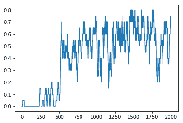

# 十三、强化学习

Deepmind 在 2017 年创造了世界上最好的围棋选手。他们是如何做到这一点的？当然是深度学习，但更确切地说是强化学习。

深蓝用传统游戏分析击败人类棋手。它将建立一个可能结果的树，并使用不同的策略(像 alpha/beta 一样，但适应象棋可能结果的空间)对其进行修剪。但是这在围棋中是不可能的，在 Deepmind 创造出他们的网络和训练方法之前，围棋永远无法被计算机解决。因为没有训练，网络就没有用！

在本章中，我们将执行以下操作:

*   看看不同类型的强化学习
*   探究问题学习的概念
*   通过表格和神经网络估计`Q`函数
*   让网络玩一个雅达利游戏

# 强化学习的类型

强化学习是无监督学习空间的一部分。它的目标是让一个模型表现得越来越好，但是我们没有基本的事实，例如，一组有标签的数据来训练我们的模型。我们唯一能做的就是使用网络，如果网络得到了一个好的结果，那么我们就用它来用反向传播来增强我们的模型。否则，我们再试试。

我们也可以在金融中使用这种方法来优化投资组合；这也可以用于机器人。过去人们用遗传算法训练一个行走机器人，但现在我们也可以用强化学习来完成这个任务！

现在我们有了神经网络可以拯救人类。让我们看看过去几年中受到关注的几种主要网络类型。

# 政策和价值网络

我们可以从解决围棋开始。围棋是一个有几千年历史的简单游戏。这是一个信息充分的两人游戏，意思是两个玩家面对面，没有隐藏的知识；所有的东西都包含在棋盘上(例如，与扑克等纸牌游戏相反)。在每个回合中，玩家将他们的一块石头(第一个玩家是白色的，第二个是黑色的)放在棋盘上，在这个过程中可能会改变其他石头的颜色，游戏以拥有最多颜色石头的人结束。

问题是棋盘很大，19 x 19 个方块，这意味着在开始时你有一大堆可能的选择。哪一个导致赢得比赛？

对于国际象棋来说，这个问题是在没有神经网络的情况下解决的。可能的移动只有一个子集，一台快速的计算机现在可以分析所有这些移动直到给定的深度。在这个分析树的叶子上，在国际象棋中可以知道我们是更接近胜利还是处于失败的边缘。对于围棋来说，这是不可能的。

进入深度学习。对于围棋，我们仍然需要分析不同的可能棋步，但我们不会试图像在国际象棋中那样详尽无遗；我们将改为使用**蒙特卡罗树搜索** ( **MCTS** )。这意味着我们将画一个随机的统一数字，从这个数字我们将玩一个移动。我们这样做是为了提前几步，然后我们评估我们是否更接近胜利。

但是正如我们之前看到的，我们无法衡量这是 Go，那么我们如何选择一个移动进行搜索，如何决定我们是赢还是输？这就是为什么我们有两个网络。政策网络将为下一步行动提供概率，价值网络将提供一个价值——要么它认为我们赢了，要么我们输了。

结合在一起，就有可能产生一套可能的招式，加上它们成功的几率，我们就可以发挥出来。在游戏的最后，我们使用信息来加强两个网络。

后来，新的 AlphaGo Zero 将这些网络合并在一起。不再有政策和价值网络，它在玩法上变得比最初的 AlphaGo 好得多。所以我们不需要对这些问题进行二分法，因为设计一个两者都做的架构是可能的。

# q 网络

事实上，在《围棋》之前，Deepmind 就开始为自己成名了。他们用所谓的 Q 网络来解决雅达利游戏。这是一组简单的游戏，玩家在每个阶段最多只能玩 10 步。

有了这些网络，目标是估计一个长期的奖励函数(如点数)，以及哪一步将最大化它。通过在开始时提供足够的选项，网络将逐步学习如何玩得越来越好。奖励功能如下:

*Q(s，a) = r + γ(最大值(Q(s '，a'))*

*r* 为奖励， *γ* 为贴现因子(未来收益不如眼前奖励重要) *s* 为游戏当前状态， *a* 为我们可以采取的行动。

当然，它在不断学习的同时，也在不断遗忘，网络也将不得不接受过去的训练。用一个比喻来说，它最后会跑而不会走，这是相当没用的。

# 擅长游戏

在本章的剩余部分，我们将使用带有`gym`包的 Q 游戏。它为玩不同类型的游戏提供了一个标准的应用编程接口，所以它是我们想要向您展示的完美测试案例。

# 一个小例子

Anaconda 不发货这个包，所以要通过`pip`安装:

```py
>>> pip install gym[atari]
```

We won't use the Atari part of the `gym`, but it will be required for the breakout game.

从这个包中，我们可以为不同的游戏创建一个环境，如下所示:

```py
env = gym.make('FrozenLake-v0')
```

这为文字游戏`FrozenLake`创造了新的环境。它由四个四个字符串组成，从`S`开始，到`G`结束，目标。但是在通往这个目标的路上有洞(`H`)，最终在那里结束会让你输掉比赛:

*   `SFFF`
*   `FHFH`
*   `FFFH`
*   `HFFG`

从环境中，我们可以得到观察空间的大小，`env.observation_space.n`，这里是`16`(玩家所在的地方)，动作空间的大小`env.action_space.n`，这里是`4`。

由于这是一个小玩具示例，我们可以创建`Q(s, a)`的估计:

```py
# Inspired by https://github.com/tensorlayer/tensorlayer/
#        blob/master/example/tutorial_frozenlake_q_table.py
Q = np.zeros((env.observation_space.n, env.action_space.n))
# Set learning hyperparameters
lr = .8
y = .95
num_episodes = 2000

# Let's run!
for i in range(num_episodes):
    # Reset environment and get first new observation (top left)
    s = env.reset()
    # Do 100 iterations to update the table
    for i in range(100):
        # Choose an action by picking the max of the table
        # + additional random noise ponderated by the episode
        a = np.argmax(Q[s,:]
            + np.random.randn(1, env.action_space.n) / (i + 1))
        # Get new state and reward from environment after chosen step 
        s1, r, d,_ = env.step(a)
        # Update Q-Table with new knowledge
        Q[s,a] = Q[s,a] + lr*(r + y*np.max(Q[s1,:]) - Q[s,a])
        s = s1
        if d == True:
            break
```

我们现在可以显示表格`Q`的内容:

```py
 [[0.18118924 0.18976168 0.19044738 0.18260069]
 [0.03811294 0.19398589 0.18619181 0.18624451]
 [0.16266812 0.13309552 0.14401865 0.11183018]
 [0.02533285 0.12890984 0.02641699 0.15121063]
 [0.20015578 0.00201834 0.00902377 0.03619787]
 [0\. 0\. 0\. 0\. ]
 [0.1294778 0.04845176 0.03590482 0.13001683]
 [0\. 0\. 0\. 0\. ]
 [0.02543623 0.05444387 0.01170018 0.19347353]
 [0.06137181 0.43637431 0.00372395 0.00830249]
 [0.25205174 0.00709722 0.00908675 0.00296389]
 [0\. 0\. 0\. 0\. ]
 [0\. 0\. 0\. 0\. ]
 [0\. 0.15032826 0.43034276 0.09982157]
 [0\. 0.86241133 0\. 0\. ]
 [0\. 0\. 0\. 0\. ]] 
```

我们可以在一些行中看到所有有`0`的条目；这些是洞和最后的目标阶段。从第一步开始，我们可以使用这些行给出的概率(在标准化之后)通过这个表进入下一步。

当然，这不是网络，所以我们用 Tensorflow 做一个网络学习这个表。

# 使用张量流进行文本游戏

让我们考虑一下我们这里需要的建筑类型。我们把游戏的状态作为输入，我们想要四个值中的一个作为输出。游戏很简单，有一个最优策略，一个从开始到目标的独特路径。这意味着网络可以非常简单，只有一层和线性输出:

```py
inputs = tf.placeholder(shape=[None, 16], dtype=tf.float32, name="input")
Qout = tf.layers.dense(
    inputs=inputs,
    units=4,
    use_bias=False,
    name="dense",
    kernel_initializer=
        tf.random_uniform_initializer(minval=0, maxval=.0125)
)
predict = tf.argmax(Qout, 1)

# Our optimizer will try to optimize 
nextQ = tf.placeholder(shape=[None, 4], dtype=tf.float32, name="target")
loss = tf.reduce_sum(tf.square(nextQ - Qout))

trainer = tf.train.GradientDescentOptimizer(learning_rate=learning_rate)
updateModel = trainer.minimize(loss)
```

对于我们的训练，我们需要重新引入新的选项，就像我们之前在表中的随机性一样。为了实现这一点，对于每 10 个预测，我们随机抽样一个动作(这被称为ε-贪婪策略，稍后我们将在雅达利游戏中重用它的一个变体)。否则，我们计算实际的`Q`值，并训练我们的网络以匹配该结果(更新密集层权重):

```py
# To keep track of our games and our results
with tf.Session() as sess:
    sess.run(tf.global_variables_initializer())

    for i in range(num_episodes):
        s = env.reset()

        for j in range(100):
            a, targetQ = sess.run([predict, Qout],
                feed_dict={inputs:np.identity(16)[s:s+1]})
            # We randomly choose a new state
            # that we may have not encountered before
            if np.random.rand(1) < e:
                a[0] = env.action_space.sample()

            s1, r, d, _ = env.step(a[0])

            # Obtain the Q' values by feeding
            # the new state through our network
            Q1 = sess.run(Qout, 
                feed_dict={inputs:np.identity(16)[s1:s1 + 1]})
            # Obtain maxQ' and set our target value for chosen action.
            targetQ[0, a[0]] = r + y*np.max(Q1)

            # Train our network using target and predicted Q values
            sess.run(updateModel,
                feed_dict={inputs:np.identity(16)[s:s+1], nextQ:targetQ})
            s = s1
            if d == True:
                # Reduce chance of random action as we train the model.
                e = 1 / ((i // 50) + 10)
                break
```

使用这种策略，该层获得了大约 40%的成功，但是这个值是有偏差的。如果我们绘制奖励的演变图(20 集以上的平均时间)，网络会随着时间的推移而显著改善:



存活时间也是如此:


我们可以看到，当网络开始变得更擅长奖励时，它也设法让玩家活得更久。不幸的是，网络在这项任务上仍然不是最好的。一个人只需走八步就能完成游戏。

我们现在可以对雅达利游戏使用类似的策略。

# 玩突破

雅达利游戏有几种玩法。首先是互动方式。我们可以使用内存视图，也可以使用显示的图像(总是相同的)。除此之外，游戏名称末尾的`-v?`表示该步骤是否重复以及重复的频率。`breakout`的`v0`表示在我们要求一个新的步骤之前，该步骤被执行了两次、三次或四次。对于`v4`，它确定性地跳过四帧。

我们可以从一个空的、简单的`breakout`游戏开始:

```py
# Import the gym module
import gym

# Create a breakout environment
env = gym.make('BreakoutDeterministic-v4')
# Reset it, returns the starting frame
frame = env.reset()
# Render
env.render()

is_done = False
while not is_done:
    # Perform a random action, returns the new frame, reward and whether the game is over
    frame, reward, is_done, _ = env.step(env.action_space.sample())
    # Render
    env.render()
```

我们现在唯一需要修改的是如何为游戏获得新的一步。嗯，我们需要的不仅仅是这些:首先我们需要训练一个模型！

让我们看看上下文。我们可以从环境中获取图像(它们是 160 x 210 像素)，考虑到我们将需要大量以前的图像，这个大小可能太大，无法放在一台计算机上。例如，我们可以在两个方向上各掉一个像素，所以这就是`preprocess`将要实现的。我们还将添加两个函数来转置我们的内部状态。原因是我们有一个通道的 84 x 105 的图像，但是我们需要使用过去的图像来知道球向哪个方向移动。为了实现这一点，我们动态地转置这个状态，得到一个图像 *84 x 105 x 状态 _ 长度*:

```py
import gym
import os
import six
import numpy as np
import tensorflow as tf
import random
from collections import deque , namedtuple

Transition = namedtuple("Transition",
    ["state", "action", "re-ward", "next_state", "done"])

def to_grayscale(img):
    return np.mean(img, axis=2).astype(np.uint8)

def downsample(img):
    return img[::2, ::2]

def preprocess(img):
    return to_grayscale(downsample(img))[None,:,:]

def adapt_state(state):
    return [np.float32(np.transpose(state, (2, 1, 0)) / 255.0)]

def adapt_batch_state(state):
    return np.transpose(np.array(state), (0, 3, 2, 1)) / 255.0

def get_initial_state(frame):
    processed_frame = preprocess(frame)
    state = [processed_frame for _ in range(state_length)]
    return np.concatenate(state)
```

Although we can make all the Atari games work with the network we are building, there is one issue. We are just taking every other pixel in each direction. But what happens if we are playing space invaders with a one-pixel-width missile? There is a 50/50 chance that we will die without seeing the missile!
To make this better, we could use `skimage.rescale` instead. For breakout, we don't need it, so this is left as an exercise for the reader.

我们现在要写一组超参数，以及游戏的一些常数，比如环境的名称和图像的大小:

```py
env_name = "Breakout-v4"
width = 80 # Resized frame width
height = 105 # Resized frame height
```

我们需要对网络进行很长时间的训练，所以我们来玩`12000`游戏。为了预测新的动作，我们将使用过去的`4`图像:

```py
n_episodes = 12000 # Number of runs for the agent
state_length = 4 # Number of most frames we input to the network
```

我们还需要设置`Q`功能的参数:

```py
gamma = 0.99 # Discount factor
```

在开始时，我们希望经常测试一个随机动作(向左或向右进行突破)。然后在训练过程中，我们会逐步去除随机性(这是我们的ε-贪婪策略)。每次运行网络时，我们都会考虑这一步，因此让我们将这一随机因素减少 100 多万步:

```py
# During all these steps, we progressively lower epsilon
exploration_steps = 1000000
initial_epsilon = 1.0 # Initial value of epsilon in epsilon-greedy
final_epsilon = 0.1 # Final value of epsilon in epsilon-greedy
```

我们需要填写我们的动作集合，所以一开始我们不训练，我们只是让游戏用随机的动作玩。这将是我们的初始训练集，随着时间的推移，我们将把所有的游戏添加到这套训练集中。当它遇到`400000`元素时，我们开始抛弃旧的、更随机的训练状态:

```py
# Number of steps to populate the replay memory before training starts
initial_random_search = 20000
replay_memory_size = 400000 # Number of states we keep for training
batch_size = 32 # Batch size
network_update_interval = 10000 # The frequency with which the target network is updated
```

我们会用`RMSProp`来训练我们的网络，所以我们用`momentum`设置了一个很低的学习率:

```py
learning_rate = 0.00025 # Learning rate used by RMSProp
momentum = 0.95 # momentum used by RMSProp
# Constant added to the squared gradient in the denominator
# of the RMSProp update
min_gradient = 0.01
```

最后，我们将存储经过时间训练的网络(带有一些检查点，以便我们可以在一些部分训练的状态下重新开始训练)，并将一些信息存储到 Tensorboard，例如我们发现的奖励和游戏的长度:

```py
network_path = 'saved_networks/' + env_name
tensorboard_path = 'summary/' + env_name
save_interval = 300000 # The frequency with which the network is saved
```

我们现在可以创建我们的网络类。我们将为每个网络创建一个实例。是的，我们需要两个网络——一个是估计下一步要采取的行动，另一个是估计`Q`值或目标。我们将不时更新行动网络(此处命名为`q_estimator`)到目标评估者(命名为`target_estimator`):

```py
class Estimator():
    """Q-Value Estimator neural network.
    This network is used for both the Q-Network and the Target Network.
    """

    def __init__(self, env, scope="estimator", summar-ies_dir=None):
        self.scope = scope
        self.num_actions = env.action_space.n
        self.epsilon = initial_epsilon
        self.epsilon_step = 
            (initial_epsilon - final_epsilon) / exploration_steps

        # Writes Tensorboard summaries to disk
        self.summary_writer = None
        with tf.variable_scope(scope):
            # Build the graph
            self.build_model()
        if summaries_dir:
            summary_dir = os.path.join(summaries_dir, 
                "summaries_%s" % scope)
            if not os.path.exists(summary_dir):
                os.makedirs(summary_dir)
            self.summary_writer = tf.summary.FileWriter(summary_dir)

    def build_model(self):
        """
        Builds the Tensorflow graph.
        """
        self.X = tf.placeholder(shape=[None, width, height, state_length],
            dtype=tf.float32, name="X")
        # The TD target value
        self.y = tf.placeholder(shape=[None], dtype=tf.float32, name="y")
        # Integer id of which action was selected
        self.actions = tf.placeholder(shape=[None], dtype=tf.int32, name="actions")

        model = tf.keras.Sequential()
        model.add(tf.keras.layers.Convolution2D(filters=32, kernel_size=8,
            strides=(4, 4), activation='relu',
            input_shape=(width, height, state_length), name="Layer1"))
        model.add(tf.keras.layers.Convolution2D(filters=64, kernel_size=4,
            strides=(2, 2), activation='relu', name="Layer2"))
        model.add(tf.keras.layers.Convolution2D(filters=64, kernel_size=3,
            strides=(1, 1), activation='relu', name="Layer3"))
        model.add(tf.keras.layers.Flatten(name="Flatten"))
        model.add(tf.keras.layers.Dense(512, activation='relu',
            name="Layer4"))
        model.add(tf.keras.layers.Dense(self.num_actions, name="Output"))
        self.predictions = model(self.X)

        a_one_hot = tf.one_hot(self.actions, self.num_actions, 1.0, 0.0)
        q_value = tf.reduce_sum(tf.multiply(self.predictions, a_one_hot),
            reduction_indices=1)

        # Calculate the loss
        self.losses = tf.squared_difference(self.y, q_value)
        self.loss = tf.reduce_mean(self.losses)

        # Optimizer Parameters from original paper
        self.optimizer = tf.train.RMSPropOptimizer(learning_rate,
            momentum=momentum, epsilon=min_gradient)
        self.train_op = self.optimizer.minimize(self.loss,
            global_step=tf.train.get_global_step())

        # Summaries for Tensorboard
        self.summaries = tf.summary.merge([
            tf.summary.scalar("loss", self.loss),
            tf.summary.histogram("loss_hist", self.losses),
            tf.summary.histogram("q_values_hist", self.predictions),
            tf.summary.scalar("max_q_value",
                tf.reduce_max(self.predictions))
        ]) 
```

在这种情况下，我们使用`keras`来构建我们的网络。它堆叠了三个卷积层(没有最大池层，尽管我们确实丢弃了一些节点以减少参数数量)和两个密集层。他们都使用了`relu`激活以后。

Note that`keras` is a high-level interface. In this example, we use `Sequential` which means that each layer connects to the previous one. It is then built by passing a placeholder to the model and getting an output tensor.

有了网络，我们现在可以创建一个`cost`函数，并将其馈送给优化器。我们还增加了一些汇总报表来检查`Q`或损失值的分布:

```py
def predict(self, sess, s):
    return sess.run(self.predictions, { self.X: s })

def update(self, sess, s, a, y):
    feed_dict = { self.X: s, self.y: y, self.actions: a }
    summaries, global_step, _, loss = sess.run(
        [self.summaries, tf.train.get_global_step(), self.train_op, self.loss], feed_dict)
    if self.summary_writer:
        self.summary_writer.add_summary(summaries, glob-al_step)
    return loss

def get_action(self, sess, state):
    if self.epsilon >= random.random():
        action = random.randrange(self.num_actions)
    else:
        action = np.argmax(self.predict(sess, adapt_state(state)))
    # Decay epsilon over time
    if self.epsilon > final_epsilon:
        self.epsilon -= self.epsilon_step
    return action

def get_trained_action(self, state):
    action = np.argmax(self.predict(sess, adapt_state(state)))
    return action
```

我们添加了一个方法来包装预测，因为我们将在几个地方使用它——首先是一个更新方法，它将实际训练这个估计器。我们还有两种方法来检索一个动作，要么使用ε-贪婪策略，要么不使用(训练后):

```py
def copy_model_parameters(estimator1, estimator2):
    """
    Copies the model parameters of one estimator to another.
    Args:
      estimator1: Estimator to copy the paramters from
      estimator2: Estimator to copy the parameters to
    """
    e1_params = [t for t in tf.trainable_variables()
        if t.name.startswith(estimator1.scope)]
    e1_params = sorted(e1_params, key=lambda v: v.name)
    e2_params = [t for t in tf.trainable_variables()
        if t.name.startswith(estimator2.scope)]
    e2_params = sorted(e2_params, key=lambda v: v.name)

    update_ops = []
    for e1_v, e2_v in zip(e1_params, e2_params):
        op = e2_v.assign(e1_v)
        update_ops.append(op)
    return update_ops
```

这是我们的函数，我们将调用它来从一个估计值更新另一个估计值。这将创建一组操作，我们将在后面的会话中运行这些操作:

```py
def create_memory(env):
    # Populate the replay memory with initial experience 
    replay_memory = deque()
    frame = env.reset()
    state = get_initial_state(frame)

    for i in range(replay_memory_init_size):
        action = np.random.choice(np.arange(env.action_space.n))
        frame, reward, done, _ = env.step(action)

        next_state = np.append(state[1:, :, :], preprocess(frame), axis=0)
        replay_memory.append(
            Transition(state, action, reward, next_state, done))
        if done:
            frame = env.reset()
            state = get_initial_state(frame)
        else:
            state = next_state

    return replay_memory
```

这个函数创建一个空的重放内存。这是必须的，这样游戏才能学到东西。没有这组初始状态，我们就无法训练网络。所以我们只是玩了一会儿随机移动，希望它能让我们的网络获得一些第一手的游戏知识。当然，我们也有我们的 epsilon-greedy 策略，稍后会给游戏增加新的招式。这也将对我们有很大帮助:

```py
def setup_summary():
    with tf.variable_scope("episode"):
        episode_total_reward = tf.Variable(0., name="EpisodeTotalReward")
        tf.summary.scalar('Total Reward', episode_total_reward)
        episode_avg_max_q = tf.Variable(0., name="EpisodeAvgMaxQ")
        tf.summary.scalar('Average Max Q', episode_avg_max_q)
        episode_duration = tf.Variable(0., name="EpisodeDuration")
        tf.summary.scalar('Duration', episode_duration)
        episode_avg_loss = tf.Variable(0., name="EpisodeAverageLoss")
        tf.summary.scalar('Average Loss', episode_avg_loss)
        summary_vars = [episode_total_reward, episode_avg_max_q,
            episode_duration, episode_avg_loss]
        summary_placeholders =
            [tf.placeholder(tf.float32) for _ in range(len(summary_vars))]
        update_ops = [sum-mary_vars[i].assign(summary_placeholders[i])
            for i in range(len(summary_vars))]
    summary_op = tf.summary.merge_all(scope="episode")
    return summary_placeholders, update_ops, summary_op
```

我们在这里定义了所有我们希望在张量板中显示的变量，这些变量位于来自估计器的直方图之上。

During the training, use `tensorboard --logdir=summary` to visualize the evolution of the training and the performance of your network.

我们可以通过设置环境、评估器和帮助功能来开始我们的主要训练循环:

```py
if __name__ == "__main__":
    from tqdm import tqdm

    env = gym.make(env_name)
    tf.reset_default_graph()

    # Create a global step variable
    global_step = tf.Variable(0, name='global_step', traina-ble=False)

    # Create estimators
    q_estimator = Estimator(env, scope="q",
        summaries_dir=tensorboard_path)
    target_estimator = Estimator(env, scope="target_q")
    copy_model = copy_model_parameters(q_estimator, tar-get_estimator)
    summary_placeholders, update_ops, summary_op = setup_summary()
    replay_memory = create_memory(env)
```

如果我们的保存位置中存储有以前的版本，我们可以启动 Tensorflow 会话并恢复网络:

```py
with tf.Session() as sess:
    sess.run(tf.global_variables_initializer())

    saver = tf.train.Saver()
    # Load a previous checkpoint if we find one
    latest_checkpoint = tf.train.latest_checkpoint(network_path)
    if latest_checkpoint:
        print("Loading model checkpoint %s...\n" % lat-est_checkpoint)
        saver.restore(sess, latest_checkpoint)

    total_t = sess.run(tf.train.get_global_step())
```

从这里，我们可以开始玩游戏。如果需要，我们首先保存网络，然后设置游戏状态:

```py
for episode in tqdm(range(n_episodes)):
    if total_t % save_interval == 0:
        # Save the current checkpoint
        saver.save(tf.get_default_session(), network_path)

    frame = env.reset()
    state = get_initial_state(frame)

    total_reward = 0
    total_loss = 0
    total_q_max = 0
```

我们在这个游戏中不断迭代，采取一个动作，并将这个动作的状态保存在我们的重放记忆中。这样，当网络学得更好玩的时候，我们也把这些更好的招式保存下来，以后学得更好:

```py
for duration in itertools.count(): 
    # Maybe update the target estimator
    if total_t % network_update_interval == 0:
        sess.run(copy_model)

    action = q_estimator.get_action(sess, state)
    frame, reward, terminal, _ = env.step(action)

    processed_frame = preprocess(frame)
    next_state = np.append(state[1:, :, :], processed_frame, axis=0)

    reward = np.clip(reward, -1, 1)
    replay_memory.append(
        Transition(state, action, reward, next_state, terminal))
    if len(replay_memory) > replay_memory_size:
        replay_memory.popleft()
```

我们从我们的重放记忆中获得一组状态，用奖励，用动作，来估计我们的`Q`值。一旦我们有了这个，我们就优化网络来增强它的行为。现在，我们可以根据目标 Q 网络更新我们的网络，以发挥更好的作用:

```py
samples = random.sample(replay_memory, batch_size)
states_batch, action_batch, reward_batch, next_states_batch, done_batch =
                    map(np.array, zip(*samples))

# Calculate q values and targets (Double DQN)
adapted_state = adapt_batch_state(next_states_batch)

q_values_next = q_estimator.predict(sess, adapted_state)
best_actions = np.argmax(q_values_next, axis=1)
q_values_next_target = tar-get_estimator.predict(sess, adapted_state)
targets_batch = reward_batch + np.invert(done_batch).astype(np.float32) *
    gamma * q_values_next_target[np.arange(batch_size), best_actions]

# Perform gradient descent update
states_batch = adapt_batch_state(states_batch)
loss = q_estimator.update(sess, states_batch, action_batch, targets_batch)

total_q_max += np.max(q_values_next)
total_loss += loss
total_t += 1
total_reward += reward
if terminal:
    break
```

游戏结束后，我们将变量保存到 Tensorboard 中，并捕获游戏结束时的截图:

```py
stats = [total_reward, total_q_max / duration, dura-tion, total_loss / duration]
for i in range(len(stats)):
    sess.run(update_ops[i], feed_dict={
        summary_placeholders[i]: float(stats[i])
    })
summary_str = sess.run(summary_op, )
q_estimator.summary_writer.add_summary(summary_str, episode)

env.env.ale.saveScreenPNG(six.b('%s/test_image_%05i.png' % (CHART_DIR, episode)))
```

我们可以用这个最后的循环在我们的 12000 场比赛中训练我们的网络。对于每次迭代，我们从训练好的网络中获得一个新的动作(从许多随机的动作开始)，然后训练我们的网络。

下面是前面代码的张量板图示例:


时间长了，我们可以看到平均`Q`慢慢提升，虽然奖励保持在低位。我们可以看到训练后的网络稍微好一点，但还是需要很多比赛才能好！

On top of the graphs displaying the evolution of the training, Tensorboard also provides a view of the graph that supports our network. This is very useful to check that it is correct and fits what we designed. It shows for instance the different weights that we use for a certain cost. If they are reused, this will be very clear from the graph.

这是 Tensorboard 中的另一个视图，我们称之为`summary_writer.add_graph(sess.graph)`:


The next step is now to try different hyper parameters. After all, we don't know if the network will end up learning the game. For instance, adding more episodes will enhance the ability to train, but what would changing the epsilon-greedy strategy do? Or the memory size? Or simply the batch size?

# 摘要

我们在这里看到，强化学习是一个非常强大的工具，可以在我们没有基本事实或最优策略的数据上训练模型。这仍然需要很多时间才能在单个处理器上实现，尤其是在没有 GPU 的情况下。

在[第 14 章](14.html)、*更大的数据*中，我们将看到如何将云的力量用于更复杂的模型。