# 五、参数学习

在本章中，我们将学习估计 PGM 参数的方法。我们从玩具的例子开始，比如估算抛硬币实验中的偏差。

到目前为止，我们在 PGM 上的旅程可以比作一个销售人员(让我们称他为杰克)试图向一家大型公司销售软件包的任务。他可能会尝试识别所涉及的不同人员，例如软件的最终用户、经理和采购部门等。这类似于在图模型中寻找随机变量(包括潜在或隐藏的随机变量)。杰克将试图与可能感兴趣的人建立联系，或者通过识别，例如，谁影响谁，谁是决策者，以及什么是组织层级。这类似于在图模型中建立随机变量之间的联系，这是我们在前一章中探讨过的。

考虑到有些人比其他人施加更大程度的影响，对杰克来说，人与人之间的影响程度也很重要。他发现购买决定是鲍勃做出的，爱丽丝和查理与鲍勃有个人联系，但鲍勃对爱丽丝的意见信任度远远高于查理(换句话说，爱丽丝对鲍勃的影响程度大于查理)。因此，如果杰克向爱丽丝提供他正在销售的软件的演示，他就有更高的销售机会，而不是查理。

确定连接之间影响程度的任务称为参数学习，我们将在本章后面讨论。有向(贝叶斯)和无向(马尔可夫)网络都需要参数学习。

我们将探索的参数学习领域包括两个广泛的领域。第一种叫做**最大似然估计** ( **极大似然估计**)。尽管名字听起来很复杂，但通过计算事件发生的次数(取决于分布的类型)，最大似然估计通常很容易计算。第二种方法使用贝叶斯统计。方法的选择是有争议的(在网上可以找到许多关于`Bayesian`和`Frequentist`的参考资料)，每种方法都有其优缺点。

我们从一个玩具例子开始。我们用贝叶斯和最大似然方法多次投掷图钉来学习它落在头上的概率。下图显示了图钉:


图钉的投掷可以使用伯努利分布来建模，伯努利分布是一种概率分布，取概率为的 1(正面)和概率为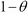的 0(反面)的值，其中是图钉的偏差。

如果我们把图钉扔 100 次并记录结果，我们会得到类似于*的 100 个事件的序列{ H，H，T，H，H……。}* 。这一结果序列被称为**独立且同分布的** ( **内径**)样本，它们来自相同的分布并且彼此独立。

图钉翻转的贝叶斯网络如下图所示。(类似于[第二章](2.html "Chapter 2. Directed Graphical Models")、*有向图模型*中的朴素贝叶斯网络)。

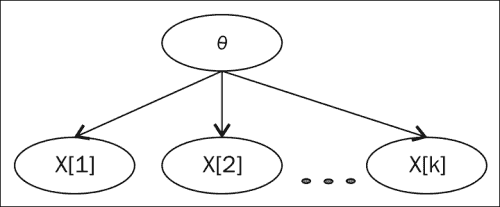

我们预计，随着足够多的翻转，我们会接近偏差的真实估计。让我们考虑以下结果的情况: *{H，T，H，T}* 。第一个正面的概率是θ，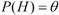，第二个反面的概率是。既然 tosses 是独立的，。

因此，达到包含两个头和两个尾的序列 *{H，T，H，T}* 的概率为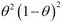。我们可以进一步推广，说明包含头部( *h* )和尾部( *t* )的序列的概率等于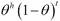。

# 似然函数

在概率上，我们从一个已知的参数开始，预测数据。可能性的概念是从数据开始并预测参数。最大似然是最大化数据可能性的参数值，或者换句话说，最大化似然函数值。

伯努利分布情况下的最大似然值如下:


我们看到序列的顺序没有影响，我们所需要的只是头部和尾部的数量。

最大似然估计法有一个缺点:参数估计不能表明我们对参数的信心。不管翻转的次数是多少，θ的值都可以是 0.7(10 次翻转 7 个头，10000 次翻转 7000 个头)。很明显，当结果是从 10000 次翻转而不是 10 次翻转中获得时，我们更有信心；然而，MLE 并没有给我们这样的画面。

图钉(伯努利)实验得出的头尾数称为充分统计。这是因为要得到最大似然估计，我们只需要数(头尾)而不需要序列。不同类型的分布需要不同的充分统计。例如，对于多项式分布(如掷出六面骰子)，足够的统计数据是结果为以下值之一的次数: *{1，2，3，4，5，6}* 。

# 使用最大似然估计的参数学习示例

在`Chap5_thumbtack_mle.ipynb` IPython 笔记本中，我们将使用最大似然估计来检查图钉的参数。

我们首先导入`bernoulli`配送。向后操作，我们设置图钉的偏置(通过为参数选择一个值)，然后多次翻转图钉(通过对随机值进行采样)，如下代码所示:

```py
from scipy.stats import bernoulli
import numpy as np
import matplotlib.pyplot as plt
import matplotlib

param_theta=0.3
num_flips=100
```

为了生成图钉的翻转，我们只需在`bernoulli`对象上调用`rvs`函数(随机变量)。为了生成`10`翻转，我们运行以下代码:

```py
bernoulli.rvs(0.3,size=10)
```

前面代码的输出如下:

```py
array([0, 1, 0, 0, 1, 1, 1, 1, 1, 0])

```

估计参数所需的足够统计数据仅仅是正面和反面的计数。让我们编写一个函数，生成一些翻转，计算头部的数量，并通过将头部的数量除以翻转的总数，给出参数的估计值。

下面的函数返回一个元组。第一个是累积估计，第二个是最终估计。

```py
def estimate_param(param, num_flips):
    res=bernoulli.rvs(param,size=num_flips)

    r_est=[np.sum(res[:i])/float(i) for i in range(1,len(res)+1)]

    final_estimate=ones/float(num_flips)

    return r_est,final_estimate

print estimate_param(param_theta,num_flips=10)
```

前面代码的输出如下:

```py
([0.0, 0.0, 0.0, 0.0, 0.2, 0.16, 0.14, 0.125, 0.11, 0.1], 0.1)
```

由于翻转过程的随机性，执行该操作时看到的实际值可能会有很大不同。下面的代码确定了越来越多样本的偏差。生成的图显示，随着样本数量的增加，估计值更接近真实值(`0.3`)，如水平线所示。每个单独的子情节表明，随着样本数量的增加，估计值会提高。

```py
x=[10,100,1000]

colors = matplotlib.rcParams['axes.color_cycle'] 

f, axarr = plt.subplots(len(x), 1)
f.tight_layout()
plt.subplots_adjust(hspace = 1)

for i, samples in enumerate(x):
    est,res=estimate_param(param_theta,samples)
    ax1 = plt.subplot(len(x),1,i+1)
    ax1.plot(range(samples),est , label=samples, alpha=0.4, lw=3)
    msg="number of samples ",samples

    ax1.set_title(msg)
    ax1.set_xlabel("$x$")

    ax1.set_ylim([0,0.8])
    ax1.axhline(y=res, xmin=0, xmax=1,linewidth=1, color='r')
    ax1.axhline(y=param_theta, xmin=0, xmax=1,linewidth=1, color='b')

plt.show()
```

前面代码的输出如下:


# 贝叶斯网络的最大似然估计

现在我们已经看到了如何使用最大似然估计进行估计，我们将尝试在贝叶斯网络中应用相同的方法。我们已经看到贝叶斯网络的结构如何允许我们将一个大的联合分布分解成一个更小的 CPD 集，并且在参数估计过程中同样的可分解性对我们有所帮助。

让我们以一个有两个二元随机变量的小贝叶斯网络为例， *X* 和 *Y* ，它们是这样连接的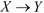。该网络有两个由(针对 X0 和 X1)和(针对给定 *X* 的 *Y* 的 CPD 中的四个条目)参数化的 CPD。我们得到的数据集是一组表单的实例。

我们的目标(在 MLE 中)是找到最大化数据可能性的(一组)参数。

原来似然函数(即给定 *D* 的参数的似然)分解成两项的集合，每个随机变量 *X* 和 *Y* 各一项。每个项都被称为局部似然函数，它衡量给定父项如何预测它。

对于随机变量 *X* ，类似于我们在前面章节中看到的，参数值如下:


其中 *M* 为充分统计，例如为我们看过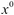的次数。

同样的，四个参数的值也是通过取相似的计数得到的。的具体数值如下:

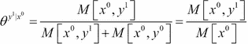

这里是我们在数据集中看到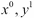的次数，是我们看到的次数，不考虑 *Y* 的值。

对于更大的网络，通过使用局部似然函数独立估计每个 CPD 的参数来获得最大似然参数估计。然后可以将这些结合起来，形成整个网络的最大似然估计解决方案。

对于每个随机变量 *X* 加上父代 *U* ，MLE 参数为，其中。

# 使用最大似然估计的贝叶斯参数学习示例

在`job_interview_libpgm.ipynb` IPython 笔记本中，我们将使用最大似然估计的 libpgm 实现来学习工作面试网络中 CPDs 的参数。

下面是从`libpgm`加载 CPDs 的代码，如前所示:

```py
from libpgm.graphskeleton import GraphSkeleton
from libpgm.nodedata import NodeData
from libpgm.discretebayesiannetwork import DiscreteBayesianNetwork
from libpgm.tablecpdfactor import TableCPDFactor
from libpgm.pgmlearner import PGMLearner
import pandas as pd
nd = NodeData()
skel = GraphSkeleton()
jsonpath="job_interview.txt"
nd.load(jsonpath)
skel.load(jsonpath)
skel.toporder()
```

我们可以创建贝叶斯网络，并使用以下代码获得随机样本:

```py
bn = DiscreteBayesianNetwork(skel, nd)
samples=bn.randomsample(2000)
```

在下面的代码中，我们实例化了`PGMLearner`类。`discrete_mle_estimateparams`方法已经知道网络的结构。如前一节所述，每个持续专业发展的估计只需要来自父母的信息，这种分解使得学习每个持续专业发展的参数成为可能:

```py
learner = PGMLearner()
result = learner.discrete_mle_estimateparams(skel, samples)
```

以下是来自`Interview`节点样本的 CPD 结果。由值`0`和`1`组成的最左边的列是来自家长分配的值(`[0,0]`)表示经验= 0 和等级= 0)，标题为`0`、`1`和`2`的列表示`Interview`节点取值`0`、`1`和`2`的概率。

```py
pd.DataFrame(result.Vdata['Interview']['cprob']).transpose()
```

前面代码的输出如下:

```py
 0	   1	         2
['0', '0']	 0.809582	 0.165848	 0.024570
['0', '1']	 0.321678	 0.396853	 0.281469
['1', '0']	 0.323204	 0.591160	 0.085635
['1', '1']	 0.115079	 0.182540	 0.702381

```

以下结果是来自原始网络的 CPD 参数。结果中的一些值是彼此相当接近的近似值，而其他值的误差在 20%的范围内。

```py
pd.DataFrame(bn.Vdata['Interview']['cprob']).transpose()
```

前面代码的输出如下:

```py
 0	  1	  2
['0', '0']	 0.8	 0.18	 0.02
['0', '1']	 0.3	 0.60	 0.10
['1', '0']	 0.3	 0.40	 0.30
['1', '1']	 0.1	 0.20	 0.70

```

# 数据碎片化

对于具有大量随机变量的网络，每个随机变量具有大量的值，我们看到每个唯一的赋值给父变量和子变量的数据实例的数量变得非常少。在某些情况下，我们根本没有实例。因此，从几个可用的数据实例中估计的参数通常会对数据进行过度填充，或者在没有可用实例的情况下返回值零。

因此，随着父集合的维数增加，可靠地估计参数变得越来越困难。这成为我们从数据中学习贝叶斯网络能力的一个限制因素。

# 数据碎片化对参数估计的影响

在下面的`data_segmentation.ipynb` IPython Notebook 中，我们将看到数据分割对使用最大似然的参数估计的影响。我们有一个在`small_network.txt`中定义的小网络，它有两个随机变量，，由一条弧线连接。父母 *X* 取 5 个值，子女 *Y* 取 2 个值。

我们首先从文件加载网络，创建一个`DiscreteBayesianNetwork`文件，如下代码所示:

```py
from libpgm.graphskeleton import GraphSkeleton
from libpgm.nodedata import NodeData
from libpgm.discretebayesiannetwork import DiscreteBayesianNetwork
from libpgm.pgmlearner import PGMLearner

nd = NodeData()
skel = GraphSkeleton()
jsonpath="small_network.txt"
nd.load(jsonpath)
skel.load(jsonpath)
skel.toporder()

bn = DiscreteBayesianNetwork(skel, nd)
```

在下面的代码中，我们将创建一个函数，该函数使用从中采样的数据来学习网络的参数。抽取`50`样本后，我们打印赋值`X = 3`和`Y = 0`的估计参数值。我们运行同一个函数几次来比较我们得到的结果。由于采样是随机的，因此当您运行以下命令时，可能会得到不同的结果:

```py
def learn_param(num_samp=50):
    data = bn.randomsample(num_samp)
    # instantiate learner 
    learner = PGMLearner()

    # estimate parameters from data and skeleton
    result = learner.discrete_mle_estimateparams(skel, data)
    numer=len([1 for m in data if m["X"]=='3' and m["Y"]=='0'])
    denom=len([1 for m in data if m["X"]=='3'])

    print "numerator:",numer," denominator:",denom," result=",numer/float(denom)

[learn_param() for _ in range(5)]
```

前面代码的输出如下:

```py
numerator: 1  denominator: 6  result= 0.166666666667
numerator: 2  denominator: 6  result= 0.333333333333
numerator: 2  denominator: 10  result= 0.2
numerator: 1  denominator: 4  result= 0.25
numerator: 2  denominator: 12  result= 0.166666666667

```

我们看到结果变化很大，因为采样数据集中感兴趣样本(`X == 3`和`Y == 0`)的数量很少。我们在文件中设定的实际值是`0.2`。

```py
nd.Vdata["Y"]["cprob"]["['3']"][0]
```

以下是前面代码的输出:

```py
0.2
```

只有当我们增加样本数量时，我们才能得到接近的值，如下面的代码所示:

```py
[learn_param(5000) for _ in range(3)]
```

以下是前面代码的输出:

```py
numerator: 160  denominator: 720  result= 0.222222222222
numerator: 156  denominator: 763  result= 0.204456094364
numerator: 156  denominator: 757  result= 0.20607661823

```

虽然这是一个只有一个父节点的小网络，但是父节点承担了越来越多的离散值，我们得到的最大似然估计很差。通过对网络建模，可以避免数据碎片，如下所示:

*   限制给定节点的父节点数量
*   尽可能限制父节点的离散值的数量

# 贝叶斯参数估计

在最大似然估计的例子中，数据单独用于估计被观测的参数。然而，在许多情况下，我们对观察到的参数有一个相当好的概念。如果问我们一个硬币的公平性，我们往往相当确定参数的值是 0.5，也就是正面和反面的可能性相等。贝叶斯统计允许我们将这种先验直觉考虑在内，并找到由先验和数据共同决定的后验。即使我们认为硬币是公平的，但如果我们在 10 万次翻转中得到 3 万个头，我们将确信参数接近 0.3，而不是之前猜测的 0.5。

我们通过颠倒我们的假设开始分析，即每个翻转都是独立的，是一个固定的量。我们假设是一个随机变量，每个连续的翻转告诉我们更多关于的值。我们假设翻转是有条件独立的。

tosses 和的联合分布如下:


假设两次投掷之间有条件独立，接下来是右手项: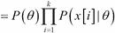 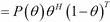

这里 *H* 和 *T* 分别是正面和反面的数量。

我们可以用这个联合分布来指定上的后验，如公式所示:

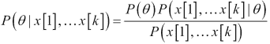

分子中的前两个项是先验和似然，而分母是归一化常数，使右侧成为适当的密度函数。

当然，贝叶斯方法允许我们在对概率分布有强烈直觉的情况下使用信息先验(不像均匀先验)。

## 参数学习的贝叶斯方法示例

在`thumbtack_Bayesian.ipynb` IPython 笔记本中，我们将使用贝叶斯方法确定图钉的偏差，从参数获得。

同样，我们将使用优秀的 PyMC 库。请使用`easy_install PyMC`安装 PyMC。

目前我们将避免讨论 PyMC 的细节。PyMC 的优秀文档可以在 PyMC 文档中找到，也可以在《黑客概率编程和贝叶斯方法》一书中找到。

为了估计θ，我们将首先从伯努利分布生成 30 个样本，其中控制参数取值`0.3`(对应于生成值 1 的大约 30%，其余为 0)。

我们试图找到后验分布的参数，并了解到后验既依赖于数据，也依赖于先验。我们有很多选择。在这种情况下，我们将使用统一优先。由于我们对图钉的偏差知之甚少，我们相信它可以在 0 到 1 之间。

PyMC 模型包含两个变量。第一个是统一先验，它代表了我们的信念，即参数的值可以在 0 到 1 之间的任何地方。第二个是伯努利变量，我们向它提供数据。

这两个变量以父子关系联系在一起；一致先验是伯努利变量的指定母体。

我们使用以下类型的 PyMC 变量:

*   **随机**:这是`uni_prior`变量，可以根据参数θ取不同的值
*   **确定性**:这个是`bern`变量，它的值是由其父代决定的

最后，模型中的所有变量都被包装在一个`model`对象中。

对于所有值不是`true`的变量，PyMC 的模拟将在模拟过程中略微影响变量的值。(在我们的例子中，`uni_prior`变量的值)将开始逼近它的后值，如下面的代码所示:

```py
from pymc import *
from scipy.stats import bernoulli
import matplotlib.pyplot as plt
import pymc.Matplot as plott

def create_model(data):
    #create a uniform prior, the lower and upper limits of which are 0 and 1
    uni_prior = Uniform('uni_prior', lower=0,upper=1.0 )
    bern = Bernoulli('bern',p=uni_prior, value=data,observed=True)
    model=Model([uni_prior,bern])
    return model
```

从先验分布中抽取的样本显示先验在 *x* 轴上均匀分布在`0`和`1`之间，如下代码所示:

```py
uni_prior = Uniform('uni_prior', lower=0,upper=1.0 )

samples = [uni_prior.random() for i in range(20000)]
plt.hist(samples, bins=100, normed=True )
plt.title("Prior distribution for $\ theta$")
plt.show()
```

前面代码的输出如下:


在下面的片段中，我们使用采样方法**马尔可夫链蒙特卡罗** ( **MCMC** )。MCMC 是一种用于从后验分布中抽取样本的方法。我们绘制`5000`样本和样本的直方图(用 MCMC 的说法叫做轨迹)。在贝叶斯统计中，参数θ被表示为随机变量，而不是单个值。

```py
sample_size=30

def get_traces(sample_size):
    data=bernoulli.rvs(0.3,size=sample_size)
    model=create_model(data)
    model.seed()
    mc1 = MCMC(model)
    mc1.sample(iter=5000,burn=1000)
    return mc1,mc1.trace('uni_prior')[:]

mc1,traces=get_traces(sample_size)
plott.histogram(traces,"uni_prior")
```

前面代码的输出如下:

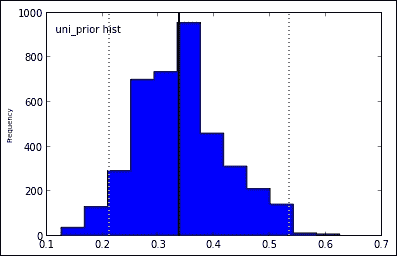

我们绘制了参数θ的后验分布。注意分布有相当多的方差，分布的峰值(用黑色垂直线表示)不对应`0.3`，这是参数θ的真值。分布峰的峰值在贝叶斯术语中称为点估计，如果我们想将参数θ表示为单个值，这类似于最佳估计。

在下面的代码片段中，我们绘制了越来越多样本的后验分布。对于初始模型，我们仅使用`30`样本。增加样本数量是否有助于改善参数的估计？

```py
num_samples=[20,50,100,500,5000]
for i in num_samples:
    m,traces=get_traces(i)
    plott.histogram(traces,"num samples = "+str(i),datarange=(0,0.6))
```

前面代码的输出如下:


我们看到越来越多的样本使分布变得更清晰，这表明它对参数θ的估计越来越有信心。

我们使用 PyMC 的绘图功能来创建层次模型的图像。我们还需要安装一些 python 库，比如`pydot`、`pygraphviz`(也要安装`base graphviz`)。

我们使用这个简单的单行代码创建点格式图表示:

```py
gdot=pymc.graph.dag(mc1)
```

查看文件也相当简单。我们只需将`dot`对象写入一个`.png`文件并查看它，如下代码所示:

```py
from IPython.display import Image
gdot.write_png('thumbtack_graph.png')
Image(filename='thumbtack_graph.png')
```

前面代码的输出如下:


# 贝叶斯网络的贝叶斯估计

类似于单个参数估计的贝叶斯情况，使用贝叶斯框架需要我们指定所有数据实例和未知参数的联合分布。

对于我们试图估计的参数，如果我们决定使参数先验独立(这可能不适用于所有情况)，那么计算后验变得更容易(这类似于最大似然估计中的似然分解)。如果我们有一个包含两个节点()的网络，那么我们可以独立于上的后验来计算的后验，同样的可分解性可以推广到更大的网络。

# 贝叶斯估计的例子

在`learn_cpd_Bayesian.ipynb`IPython 笔记本中，我们将使用 PyMC 从求职面试网络中估计一个 CPD 的参数，如下代码所示:

```py
from libpgm.graphskeleton import GraphSkeleton
from libpgm.nodedata import NodeData
from libpgm.discretebayesiannetwork import DiscreteBayesianNetwork
import pandas as pd

from pymc import *
import matplotlib.pyplot as plt
from pymc.Matplot import plot

nd = NodeData()
skel = GraphSkeleton()
jsonpath="job_interview.txt"
nd.load(jsonpath)
skel.load(jsonpath)
skel.toporder()
bn = DiscreteBayesianNetwork(skel, nd)
```

我们要学习的 CPD 是`Interview` CPD，如下代码所示:

```py
pd.DataFrame(bn.Vdata['Interview']['cprob']).transpose()
```

前面代码的输出如下:

```py
	 		  0	  1	  2
['0', '0']	 0.8	 0.18	 0.02
['0', '1']	 0.3	 0.60	 0.10
['1', '0']	 0.3	 0.40	 0.30
['1', '1']	 0.1	 0.20	 0.70
```

CPD 有 12 个唯一的概率。前面输出中的每一行对应于对其父项(`Experience`和`Grades`)的一个特定赋值，并且可以用多项式分布来表示。在这种特殊情况下，`Interview`取三个值，因此代表每行的多项式可以比作一个三面骰子。

由于父变量有四个唯一的赋值，我们需要学习四个`Multinomial`变量的参数。

最后，我们在这个模型上运行 MCMC 采样并观察后验，如下所示:

```py
def create_model(data,num_draws):
    partial_dirich = pymc.Dirichlet(name="partial_dirich",theta=[1.0, 1.0, 1.0])
    full_dirich=pymc.CompletedDirichlet(name="full_dirich",D=partial_dirich)
    multi = pymc.Multinomial(
            name="multi",
            value=data,
            n=num_draws,
            p=full_dirich,
            observed=True)
    model=Model([partial_dirich,full_dirich,multi])
    return model

def run_mcmc(model,**kwargs):
    mcmc = pymc.MCMC(model)
    mcmc.sample(**kwargs)
    return mcmc
```

前面的片段包含一个 PyMC 模型，由树中的以下三个变量组成:

*   `Dirichlet`:先验由这个分布表示，它允许我们有一个初始先验，包含一组三个概率值，加起来是 1。在 PyMC 中，`Dirichlet`随机变量仅存储 *k - 1* 概率(对于具有 *k* 结果的多项式),因为可以计算 kth 值，因为概率总和为 1。
*   `CompletedDirichlet`:为了简单起见，我们将其定义为`Dirichlet`变量的子代，这样更容易表示所有 *k* 值(本例中 k = 3)。
*   `Multinomial`:这是最后一个变量，是`CompletedDirichlet`对象的子对象。我们将从求职面试网络中抽取数据并将其传递给`Multinomial`变量。

注意，在图钉估计问题中，我们只学习了一个伯努利分布的估计。在这种情况下，我们必须学习四个单独的多项式分布的参数估计。

因此，我们对求职面试网络进行了四次抽样调查，每次都给父母分配一份工作。我们先从第一个家长作业开始: *{ Experience = 0，Grades = 0}* ，帮助我们学习 CPD 第一行的参数。

PyMC 可以消费的样本需要特定的格式，由一系列实验的结果组成。

我们先来理解实验这个术语。在一个实验的单次运行中，从网络中进行采样 *n 次*(类似于 *n 次*掷出三面骰子)。这将为我们提供长度为 0、1 和 2 的序列 *n* 。我们修剪这个序列以获得 0、1 和 2 的出现频率(在`get_counts`方法中执行)，如以下代码所示:

```py
def get_counts(vals):
    b = {0:0,1:0,2:0}
    for item in vals:
        b[item] = b.get(item, 0) + 1
    return np.array(b.values())
get_counts([0,1,2,0,1])
```

前面代码的输出如下:

```py
array([2, 2, 1])

```

产生的数组告诉我们`0`和`1`出现了两次，`2`出现了一次。

我们进行了几个这样的实验(在这个特定的例子中是 10 个)，整理频率，并将其作为数据传递给我们的 PyMC 模型中的`Multinomial`变量。

然后，我们在 PyMC 模型上运行 MCMC 采样，就像在随机游走期间一样，PyMC 模型中`full_dirich`变量的值开始逼近真正的多项式分布，如以下代码所示:

```py
def get_relevant_samples(experiments,evidence,num_samples=10):
    ''' for n experiments, sample and add the frequencies obtained.'''
    res=[]
    for i in xrange(experiments):
        vals=[float(i['Interview']) for i in bn.randomsample(num_samples,evidence)]
        res.append(get_counts(vals))
    return res

def plot_traces(traces):
    colors = ["#348ABD", "#A60628","#884732"]

    plt.plot(np.arange(len(traces)), traces[:,:, 0], c=colors[0])
    plt.plot(np.arange(len(traces)), traces[:,:, 1], c=colors[1])
    plt.plot(np.arange(len(traces)), traces[:,:, 2], c=colors[2])
    plt.title("traces of posterior ")
    plt.show()

def estimate_parameters(evidence,**kwargs):
    ''' run a few experiments, get the data, and estimate the parameter '''
    experiments=10
    samples=get_relevant_samples(experiments,evidence,num_samples=10)
    model=create_model(samples,experiments)    
    mc=run_mcmc(model,**kwargs)   

    traces=mc.trace('full_dirich')[:]
    return [np.mean(traces[:, :,0]),np.mean(traces[:,:, 1]),np.mean(traces[:,:, 2])],traces
```

我们首先确定父分配的参数， *{Experience = 0，Grades = 0}* ，如下代码所示，并绘制轨迹。我们看到三条独立的情节线。这些是多项式分布中三个概率的值，加起来应该是 1。

```py
means,traces=estimate_parameters(dict(Grades='0',Experience='0'),iter=5000)
plot_traces(traces)
```

前面代码的输出如下:


在前面的剧情中，我们取前 5000 条痕迹。我们看到后部最初四处移动，然后稍微下沉。如果我们在采样前给 PyMC 添加一个`burn`参数，算法将丢弃由`burn`值指定的第一个 *n* 样本，并收集下一个轨迹。由于 MCMC 算法需要时间从先前的开始进行随机游走，指定一个`burn`值允许算法丢弃表面上不是来自真实后验分布的轨迹，如下面的代码所示:

```py
means,traces=estimate_parameters(dict(Grades='0',Experience='0'),iter=20000,burn=1000)
plot_traces(traces)
```

前面代码的输出如下:

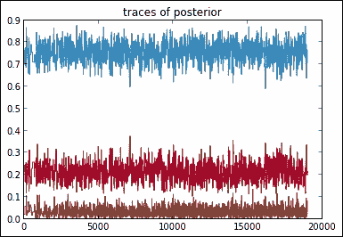

我们看到个体概率已经收敛。我们首先确定了父作业{经验= 0，等级= 0}的参数。为了学习父变量所有联合赋值的值，我们运行以下代码片段:

```py
all_parent_assignments=[['0','0'],['0','1'],['1','0'],['1','1']]
res=[]
for i,j in all_parent_assignments:
    evidence=dict(Grades=i,Experience=j)
    means,traces=estimate_parameters(evidence,iter=50000,burn=10000)
    res.append([[i,j]]+means)

pd.DataFrame(res,columns=['parent_assignment',0,1,2])

```

前面代码的输出如下:

```py
 par_assign	   0	          1	          2
0	 [0, 0]	 0.835853	 0.144636	 0.019511
1	 [0, 1]	 0.303323	 0.464297	 0.232380
2	 [1, 0]	 0.291015	 0.563842	 0.145143
3	 [1, 1]	 0.126254	 0.223568	 0.650178

```

我们将前面的后验均值与后面的工作面试网络中指定的真实概率进行比较。一些学到的价值观非常接近真实的价值观，而另一些则与基本事实相差高达 16%。

```py
pd.DataFrame(bn.Vdata['Interview']['cprob']).transpose()
```

前面代码的输出如下:

```py
par_assign    0	  1	  2
['0', '0']	 0.8	 0.18	 0.02
['0', '1']	 0.3	 0.60	 0.10
['1', '0']	 0.3	 0.40	 0.30
['1', '1']	 0.1	 0.20	 0.70

```

# 总结

在这一章中，我们学习了参数估计问题。我们首先使用两种方法估计图钉的参数，最大似然法和贝叶斯法。然后，我们扩展这些基础，使用最大似然估计来确定贝叶斯网络的参数。

已经完成了结构和参数学习的基础知识，在接下来的章节中，我们将使用网络来回答我们的查询，使用各种类型的推理方法。