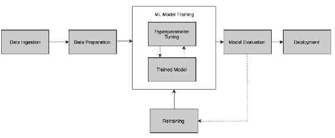
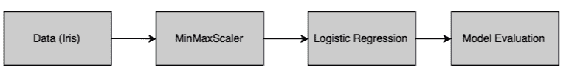
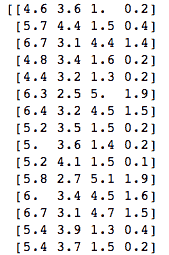
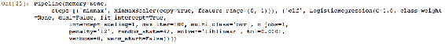
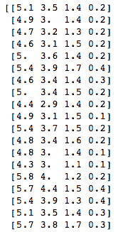
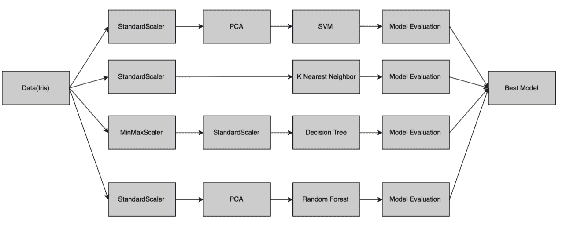

# 六、创建自动流水线

前几章重点介绍了**机器学习** ( **ML** )项目中需要执行的不同阶段。ML 模型要成功执行并产生结果，必须将许多移动部件捆绑在一起。将 ML 过程的不同部分连接在一起的过程被称为**流水线**。流水线是一个广义的概念，但对于数据科学家来说是非常重要的概念。在软件工程中，人们构建流水线来开发从源代码到部署的软件。类似地，在 ML 中，创建了一个流水线，允许数据从原始格式流向一些有用的信息。它提供了构造多 ML 并行流水线系统的机制，以便比较几种 ML 方法的结果。

流水线的每一级都被馈送来自其前一级的已处理数据；也就是说，处理单元的输出被提供作为其下一步的输入。数据在流水线中流动就像水在流水线中流动一样。掌握流水线的概念是创建无错误的 ML 模型的有力方法，流水线构成了构建 AutoML 系统的关键要素。在本章中，我们将讨论以下主题:

*   ML 流水线介绍
*   构建简单的流水线
*   功能变压器
*   使用弱学习者和集合构建复杂的流水线

我们将在下一节开始介绍 ML 流水线。

# 技术要求

所有代码示例都可以在本章 GitHub 链接的`Chapter 06`文件夹中找到。

# 机器学习流水线介绍

通常，ML 算法需要干净的数据来检测数据中的一些模式，并在新的数据集上进行预测。然而，在现实世界的应用程序中，数据通常不准备直接输入到 ML 算法中。类似地，ML 模型的输出只是数字或字符，在现实世界中执行某些动作时需要对其进行处理。为了实现这一点，ML 模型必须部署在生产环境中。将原始数据转换为可用信息的整个框架是使用 ML 流水线执行的。

以下是 ML 流水线的高级图示:



我们将把上图所示的模块分解如下:

*   **数据摄取**:是获取数据，导入数据使用的过程。数据可以来源于多个系统，如**企业资源规划** ( **ERP** )软件、**客户关系管理** ( **CRM** )软件、web 应用。数据提取可以是实时的，也可以是批量的。有时，获取数据是一个棘手的部分，也是最具挑战性的步骤之一，因为我们需要具备良好的业务和数据理解能力。

*   **数据准备**:我们在[第三章](3.html)、*数据预处理*中研究了各种数据准备技术。有几种方法可以将数据预处理成适合构建模型的形式。真实世界的数据往往是倾斜的——有缺失的数据，有时会很嘈杂。因此，有必要对数据进行预处理，使其干净并经过转换，这样它就可以通过 ML 算法运行了。
*   **ML 模型训练**:它涉及使用各种 ML 技术来理解数据中的本质特征，进行预测，或者从中得出见解。通常，最大似然算法已经被编码并作为应用编程接口或编程接口可用。我们需要承担的最重要的责任是调整超参数。使用超参数并优化它们以创建最佳拟合模型是模型训练阶段最关键和最复杂的部分。
*   **模型评估**:有多种标准可以用来评估模型。它是统计方法和商业规则的结合。在 AutoML 流水线中，评估主要基于各种统计和数学度量。如果一个 AutoML 系统是为某些特定的业务领域或用例开发的，那么业务规则也可以嵌入到系统中来评估模型的正确性。
*   **再培训**:我们为用例创建的第一个模型往往不是最好的模型。它被认为是一个基线模型，我们试图通过反复训练来提高模型的精度。
*   **部署**:最后一步是部署模型，包括将模型应用和迁移到业务运营中供他们使用。部署阶段高度依赖于组织拥有的信息技术基础设施和软件能力。

正如我们所看到的，为了从 ML 模型中得到结果，我们需要执行几个阶段。scikit-learn 为我们提供了一个流水线功能，可以用来创建几个复杂的流水线。在构建 AutoML 系统时，流水线将非常复杂，因为必须捕获许多不同的场景。然而，如果我们知道如何对数据进行预处理，利用最大似然算法并应用各种评估指标，流水线就是给这些部分赋予形状的问题。

让我们使用 scikit-learn 设计一个非常简单的流水线。

# 简单的流水线

我们将首先导入一个名为`Iris`的数据集，该数据集已经存在于 scikit-learn 的样本数据集库中([http://sci kit-learn . org/stable/auto _ examples/datasets/plot _ iris _ dataset . html](http://scikit-learn.org/stable/auto_examples/datasets/plot_iris_dataset.html))。数据集由四个要素组成，有 150 行。我们将在流水线中开发以下步骤，使用`Iris`数据集训练我们的模型。问题陈述是使用四个不同的特征来预测一个`Iris`数据的种类:



在这个流水线中，我们将使用`MinMaxScaler`方法来缩放输入数据，并使用逻辑回归来预测`Iris`的种类。然后，将根据精度测量结果对模型进行评估:

1.  第一步是从 scikit-learn 导入各种库，这些库将提供完成我们任务的方法。我们在前面几章中已经了解了这一切。唯一的补充是来自`sklearn.pipeline`的`Pipeline`法。这将为我们提供创建 ML 流水线所需的必要方法:

```py
from sklearn.datasets import load_iris
from sklearn.preprocessing import MinMaxScaler
from sklearn.linear_model import LogisticRegression
from sklearn.model_selection import train_test_split
from sklearn.pipeline import Pipeline
```

2.  下一步是加载`iris`数据，并将其拆分为训练和测试数据集。在这个例子中，我们将使用 80%的数据集来训练模型，剩下的 20%用来测试模型的准确性。我们可以使用`shape`功能查看数据集的维度:

```py
# Load and split the data
iris = load_iris()
X_train, X_test, y_train, y_test = train_test_split(iris.data, iris.target, test_size=0.2, random_state=42)
X_train.shape
```

3.  下面的结果显示了具有`4`列和`120`行的训练数据集，相当于`Iris`数据集的 80%，如预期的那样:


4.  接下来，我们打印数据集以浏览数据:

```py
print(X_train)
```

上述代码提供了以下输出:



5.  下一步是创建流水线。流水线对象采用(键、值)对的形式。Key 是具有特定步骤名称的字符串，value 是函数或实际方法的名称。在下面的代码片段中，我们将`MinMaxScaler()`方法命名为`minmax`，将`LogisticRegression(random_state=42)`命名为`lr`:

```py
pipe_lr = Pipeline([('minmax', MinMaxScaler()),
 ('lr', LogisticRegression(random_state=42))])
```

6.  然后，我们将流水线对象(`pipe_lr`)拟合到训练数据集:

```py
pipe_lr.fit(X_train, y_train)
```

7.  当我们执行前面的代码时，我们得到以下输出，它显示了所构建的拟合模型的最终结构:



8.  最后一步是使用`score`方法在`test`数据集上对模型进行评分:

```py
score = pipe_lr.score(X_test, y_test)
print('Logistic Regression pipeline test accuracy: %.3f' % score)
```

从下面的结果可以看出，模型的准确率为`0.900`，为 90%:


在前面的例子中，我们创建了一个流水线，它由两个步骤组成，即`minmax`缩放和`LogisticRegression`。当我们在`pipe_lr`流水线上执行`fit`方法时，`MinMaxScaler`对输入数据执行`fit`和`transform`方法，并将其传递给估计器，估计器是逻辑回归模型。流水线中的这些中间步骤被称为**变压器**，最后一步是估计器。

变压器用于数据预处理，有`fit`和`transform`两种方法。`fit`方法用于从训练数据中找到参数，`transform`方法用于将数据预处理技术应用于数据集。

估计器用于创建机器学习模型，有两种方法，`fit`和`predict`。`fit`方法用于训练最大似然模型，而`predict`方法用于将训练好的模型应用于测试或新的数据集。

下图总结了这一概念:


我们只需要调用流水线的**拟合**方法来训练模型，调用**预测**方法来创建预测。Rest 所有功能即 **Fit** 和 **Transform** 封装在流水线的功能中，并按上图所示执行。

有时，我们需要编写一些自定义函数来执行自定义转换。下一节是关于函数转换器，它可以帮助我们实现这个定制的功能。

# 函数转换器

A `FunctionTransformer`用于定义一个用户自定义函数，该函数消耗来自流水线的数据，并将该函数的结果返回到流水线的下一阶段。这用于无状态转换，例如取数字的平方或对数，定义自定义缩放函数，等等。

在下面的例子中，我们将使用`CustomLog`函数和预定义的预处理方法`StandardScaler`来构建流水线:

1.  我们导入所有需要的库，就像我们在前面的例子中所做的那样。这里唯一增加的是`sklearn.preprocessing`库中的`FunctionTransformer`方法。此方法用于执行自定义转换器函数，并将其缝合到流水线中的其他阶段:

```py
import numpy as np
from sklearn.datasets import load_iris
from sklearn.model_selection import train_test_split
from sklearn import preprocessing
from sklearn.pipeline import make_pipeline
from sklearn.preprocessing import FunctionTransformer
from sklearn.preprocessing import StandardScaler

```

2.  在下面的代码片段中，我们将定义一个自定义函数，它返回一个数字`X`的日志:

```py
def CustomLog(X):
    return np.log(X)
```

3.  接下来，我们将定义一个名为`PreprocData`的数据预处理函数，它接受数据集的输入数据(`X`)和目标(`Y`)。对于这个例子来说，`Y`是不必要的，因为我们不打算构建一个监督模型，而只是演示一个数据预处理流水线。然而，在现实世界中，我们可以直接使用这个函数来创建一个有监督的 ML 模型。

4.  这里，我们使用`make_pipeline`函数来创建流水线。我们在前面的例子中使用了`pipeline`函数，其中我们必须为数据预处理或 ML 函数定义名称。使用`make_pipeline`函数的优势在于它会自动生成函数的名称或键:

```py
def PreprocData(X, Y):
pipe = make_pipeline(
 FunctionTransformer(CustomLog),StandardScaler()
 )
 X_train, X_test, Y_train, Y_test = train_test_split(X, Y)
 pipe.fit(X_train, Y_train)
 return pipe.transform(X_test), Y_test
```

5.  当我们准备好流水线后，我们可以加载`Iris`数据集。我们打印输入数据`X`来看一下数据:

```py
iris = load_iris()
X, Y = iris.data, iris.target
print(X)
```

上面的代码打印了以下输出:



6.  接下来，我们将通过传递`iris`数据来调用`PreprocData`函数。返回的结果是一个经过转换的数据集，首先使用我们的`CustomLog`函数进行处理，然后使用`StandardScaler`数据预处理方法进行处理:

```py
X_transformed, Y_transformed = PreprocData(X, Y)
print(X_transformed)
```

7.  前面的数据转换任务产生以下转换后的数据结果:


我们现在需要为一个 AutoML 系统构建各种复杂的流水线。在下一节中，我们将使用几个数据预处理步骤和 ML 算法创建一个复杂的流水线。

# 复杂的流水线

在本节中，我们将使用鸢尾花的四种不同特征来确定预测鸢尾花种类的最佳分类器。我们将结合使用四种不同的数据预处理技术以及四种不同的 ML 算法来完成这项任务。以下是该作业的流水线设计:



我们将按如下方式进行:

1.  我们从导入任务所需的各种库和函数开始:

```py
from sklearn.datasets import load_iris
from sklearn.preprocessing import StandardScaler
from sklearn.decomposition import PCA
from sklearn.preprocessing import MinMaxScaler
from sklearn.model_selection import train_test_split
from sklearn.neighbors import KNeighborsClassifier
from sklearn.ensemble import RandomForestClassifier
from sklearn import svm
from sklearn import tree
from sklearn.pipeline import Pipeline
```

2.  接下来，我们加载`Iris`数据集，并将其拆分为`train`和`test`数据集。`X_train`和`Y_train`数据集将用于训练不同的模型，`X_test`和`Y_test`将用于测试训练的模型:

```py
# Load and split the data
iris = load_iris()
X_train, X_test, y_train, y_test = train_test_split(iris.data, iris.target, test_size=0.2, random_state=42)
```

3.  接下来，我们将创建四个不同的流水线，每个模型一个。在 SVM 模型的流水线中，`pipe_svm`，我们将首先使用`StandardScaler`缩放数字输入，然后使用**主成分分析** ( **主成分分析**)创建主成分。最后，使用该预处理数据集构建**支持向量机** ( **SVM** )模型。
4.  同样，我们将构建一个流水线来创建名为`pipe_knn`的 KNN 模型。在执行`KNeighborsClassifier`创建 KNN 模型之前，仅使用`StandardScaler`对数据进行预处理。
5.  然后，我们创建一个流水线来构建决策树模型。我们使用`StandardScaler`和`MinMaxScaler`方法对`DecisionTreeClassifier`方法使用的数据进行预处理。
6.  使用流水线创建的最后一个模型是随机森林模型，其中只有`StandardScaler`用于预处理`RandomForestClassifier`方法要使用的数据。

以下是用于创建这四个不同流水线的代码片段，这四个流水线用于创建四个不同的模型:

```py
# Construct svm pipeline

pipe_svm = Pipeline([('ss1', StandardScaler()),
      ('pca', PCA(n_components=2)),
      ('svm', svm.SVC(random_state=42))])

# Construct knn pipeline
pipe_knn = Pipeline([('ss2', StandardScaler()),
      ('knn', KNeighborsClassifier(n_neighbors=6, metric='euclidean'))])

# Construct DT pipeline
pipe_dt = Pipeline([('ss3', StandardScaler()),
      ('minmax', MinMaxScaler()),
      ('dt', tree.DecisionTreeClassifier(random_state=42))])

# Construct Random Forest pipeline
num_trees = 100
max_features = 1
pipe_rf = Pipeline([('ss4', StandardScaler()),
      ('pca', PCA(n_components=2)),
      ('rf', RandomForestClassifier(n_estimators=num_trees, max_features=max_features))])
```

7.  接下来，我们需要将流水线的名称存储在字典中，用于显示结果:

```py
pipe_dic = {0: 'K Nearest Neighbours', 1: 'Decision Tree', 2:'Random Forest', 3:'Support Vector Machines'}
```

8.  然后，我们将列出迭代执行这些流水线的四个流水线:

```py
pipelines = [pipe_knn, pipe_dt,pipe_rf,pipe_svm]
```

9.  现在，我们已经准备好了整个流水线的复杂结构。剩下的事情就是将数据与流水线匹配，评估结果，并选择最佳模型。

在下面的代码片段中，我们将四个流水线中的每一个迭代地适应训练数据集:

```py
# Fit the pipelines
for pipe in pipelines:
  pipe.fit(X_train, y_train)
```

10.  一旦模型拟合成功执行，我们将使用以下代码片段检查四个模型的准确性:

```py
# Compare accuracies
for idx, val in enumerate(pipelines):
  print('%s pipeline test accuracy: %.3f' % (pipe_dic[idx], val.score(X_test, y_test)))
```

11.  我们可以从以下结果中注意到，k 近邻和决策树模型以 100%的完美准确率领先。这太难以置信了，可能是使用小数据集和/或过度拟合的结果:


12.  我们可以使用两个获胜模型中的任意一个，即 **k 近邻** ( **KNN** )或决策树模型进行部署。我们可以使用下面的代码片段来实现这一点:

```py
best_accuracy = 0
best_classifier = 0
best_pipeline = ''
for idx, val in enumerate(pipelines):
 if val.score(X_test, y_test) > best_accuracy:
 best_accuracy = val.score(X_test, y_test)
 best_pipeline = val
 best_classifier = idx
print('%s Classifier has the best accuracy of %.2f' % (pipe_dic[best_classifier],best_accuracy))
```

13.  由于 k 近邻和决策树的精度相似，KNN 被选为最佳模型，因为它是流水线中的第一个模型。但是，在这个阶段，我们还可以使用一些业务规则或访问执行成本来决定最佳模型:


# 摘要

这一章是为 ML 系统构建流水线的草图——它只是冰山一角。建造流水线非常复杂。然而，一旦开发出来，它会让开发人员的生活更加舒适。它降低了制定不同模型的复杂性，因此成为创建自动语言系统所需的基本概念。我们在本章中描述的概念为您创建流水线奠定了基础。当您在本章中构建流水线时，您一定已经理解了使用流水线后模型构建过程的结构有多好。

下一章将总结我们到目前为止的学习。它还将为您提供几个建议，这些建议将有助于设计自动语言系统和成功执行数据科学项目。