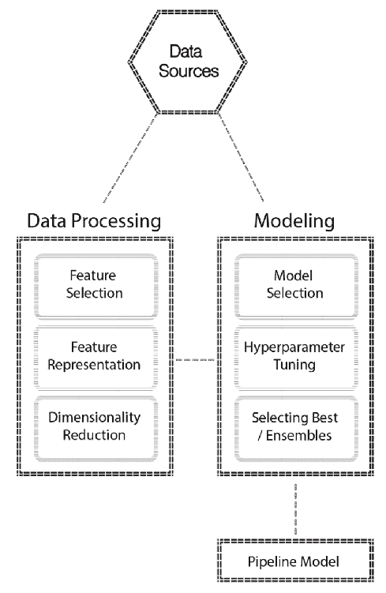
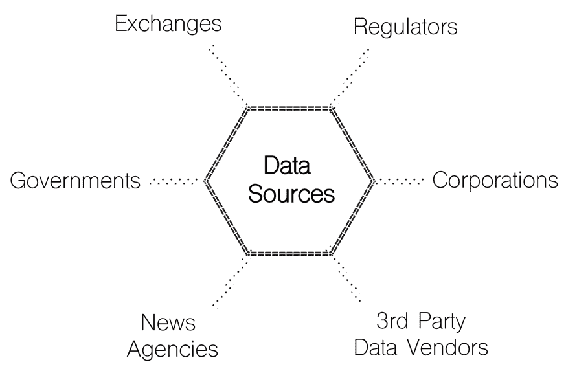
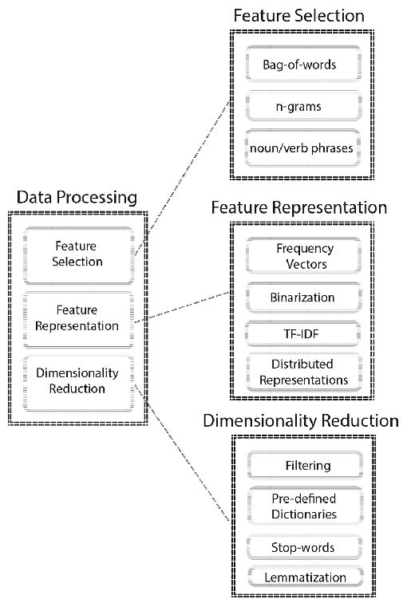
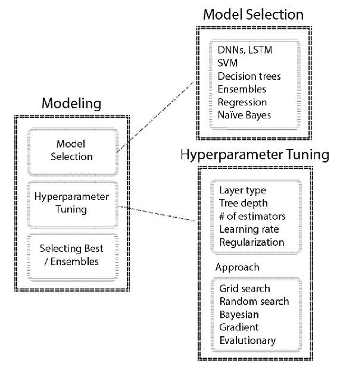

# 八、ML 和数据科学项目的关键方面

如果你已经走了这么远，拍拍自己的肩膀。这并不是把自己当成一个**机器学习** ( **ML** )专家，而是承认你为学习**自动化 ML** ( **AutoML** )工作流所做的工作。你现在已经准备好应用这些技术来解决你的问题了！

在这一章中，你将回顾你在各个章节中所学的内容，并将你的学习放在一个更广阔的视角中。

我们将在讨论中涵盖以下主题:

*   作为搜索的机器学习
*   ML 中的权衡
*   典型数据科学项目的参与模型
*   参与模式的各个阶段

# 作为搜索的机器学习

在前面的章节中，您已经看到了许多不同的技术应用于建模问题，其中大多数技术虽然看起来很简单，但是包含了许多最终影响您工作结果的参数。许多建模问题需要将 AutoML 表示为一个搜索问题，在大多数情况下，只能找到次优解。

从更广泛的意义上说，建模只是输入数据和输出数据之间的映射。因此，您将能够推断新输入数据到达未知输出的输出。为了实现您的目标，您需要思考您的实验设计，并相应地配置您的环境，因为您真的不知道什么是性能最好的 ML 流水线——但是让我们停下来一秒钟，退后一步。

实现高性能系统实际上是从系统架构的一些基本选择开始的，这些选择将允许您设计和交付成功的数据科学解决方案。您应该开始考虑的事情之一是您的系统硬件和软件配置，例如服务器类型、特定于 CPU 或 GPU 的要求、内存和磁盘要求、软件要求等。由于您将处理更大的数据集，因此您的配置将更加重要。此时所做的选择将决定数据科学堆栈的性能，该堆栈可能包含以下一些软件框架和库:

*   特定的软件发行版，如 Anaconda
*   数据处理框架，如 Hadoop、Apache Spark、Kafka
*   特定任务库，如 scikit-learn、XGBoost、TensorFlow/Keras、PyTorch
*   数据管理系统，如 MongoDB、Neo4j、Apache Cassandra 和 MySQL

这不是一个详尽的列表，但是，即使范围如此有限，这也是一个需要消化的大量信息。理想情况下，您应该至少熟悉每一个在典型架构中扮演的角色，一旦您开始构建系统，这些选择将随着您为不同的用例实现系统而变得清晰。

一旦你有了这些部分并顺利工作，你就可以开始考虑如何移动数据并将其输入到你的 ML 流水线中。

当您处于数据处理和建模阶段时，选项非常多，正如前面提到的，每个方法都有自己的一组参数。下面向您展示了到目前为止您所练习的典型流程:



让我们考虑一个用于预测金融市场走势的文本处理流水线，看看在这样的设置中，这些步骤意味着什么。

首先，你会有各种各样的数据源；这些可能包括来自以下方面的数据:

*   金融交易所
*   公司公告和文件
*   提供一般新闻和财经新闻的通讯社
*   来自政府机构的宏观经济数据
*   监管报告
*   推特等社交网络

下图显示了几个不同的数据源:



当您存储了这样的数据时，您需要处理这些数据以便在建模阶段使用，因为 ML 模型需要数值矢量化输入。

第一步是特征选择，这可能包括以下步骤:

*   确定每个单词是否会被视为不同的特征；这就是俗称的**词汇袋**
*   确定名词短语、动词短语或命名实体是否可以用作特征
*   将单词归类为有代表性的概念
*   创建 n 克，这是一个连续的项目序列

下图帮助我们理解不同的功能选择:


一旦你决定了你要使用什么特征，你就会考虑减少维数来避免维数灾难。此阶段可能包括以下步骤:

*   简单的过滤操作，例如只包括前 100 个概念
*   设置阈值以仅包括出现次数超过给定阈值的单词
*   使用由领域专家创建的预定义字典来过滤输入数据
*   标准操作，如删除停止词和引理化

下图有助于您理解特征选择和表示的不同方法:


降维也是特征表示后可以返回的一个阶段。一旦有了数字特征向量，就可以应用**主成分分析** ( **主成分分析**)等方法进一步降维。让我们看看特征表示的典型操作:

*   将词汇表中的单词表示为频率向量，其中每个单词将被分配一个出现次数
*   二进制化频率向量，以便每个值都是 0 或 1
*   使用**术语频率-逆文档频率** ( **tf-idf** )编码将单词表示为它们在文档集合中对整个文档的相对重要性，即**语料库**
*   使用分布式表示，如 Word2Vec 或 Doc2Vec

因此，您可以将完整的数字解释如下:



完成数据处理部分后，您可以开始建模，在这种情况下，您将有许多不同的算法可供选择。在文本挖掘中，以下是最常用的算法:

*   深度神经网络，特别是**长短期记忆** ( **LSTM** )网络，这是一种特殊类型的**递归神经网络** ( **RNNs** )
*   支持向量机
*   决策树
*   全体
*   回归算法
*   朴素贝叶斯

下图显示了可以使用的几种不同算法:


每个算法都有自己的参数空间，参数主要有两种类型:

*   训练开始前设置的超参数
*   在训练中学习的模型参数

目标是优化超参数，以便您的模型参数将为您提供最佳的泛化性能。搜索空间通常非常大，您已经看到了一些方法，例如贝叶斯优化，它们以高效的方式探索空间。

例如，让我们只看一下 XGBoost 算法的参数，它主导着 ML 应用程序。

如果运行以下几行，您将看到模型参数的解释:

```py
import xgboost as xgb
classifier = xgb.XGBClassifier()

classifier?
```

这为您提供了以下输出:

```py
Type: XGBClassifier
String form:
XGBClassifier(base_score=0.5, booster='gbtree', colsample_bylevel=1,
 colsample_bytree=1, g <...> reg_alpha=0, reg_lambda=1, scale_pos_weight=1, seed=None,
 silent=True, subsample=1)
File: ~/anaconda/lib/python3.6/site-packages/xgboost/sklearn.py
Docstring: 
Implementation of the scikit-learn API for XGBoost classification.
 Parameters
----------
max_depth : int
 Maximum tree depth for base learners.
learning_rate : float
 Boosting learning rate (xgb's "eta")
n_estimators : int
 Number of boosted trees to fit.
silent : boolean
 Whether to print messages while running boosting.
objective : string or callable
 Specify the learning task and the corresponding learning objective or
 a custom objective function to be used (see note below).
booster: string
 Specify which booster to use: gbtree, gblinear or dart.
nthread : int
 Number of parallel threads used to run xgboost. (Deprecated, please use n_jobs)
n_jobs : int
 Number of parallel threads used to run xgboost. (replaces nthread)
gamma : float
 Minimum loss reduction required to make a further partition on a leaf node of the tree.
min_child_weight : int
 Minimum sum of instance weight(hessian) needed in a child.
max_delta_step : int
 Maximum delta step we allow each tree's weight estimation to be.
subsample : float
 Subsample ratio of the training instance.
colsample_bytree : float
 Subsample ratio of columns when constructing each tree.
colsample_bylevel : float
 Subsample ratio of columns for each split, in each level.
reg_alpha : float (xgb's alpha)
 L1 regularization term on weights
reg_lambda : float (xgb's lambda)
 L2 regularization term on weights
scale_pos_weight : float
 Balancing of positive and negative weights.
base_score:
 The initial prediction score of all instances, global bias.
seed : int
 Random number seed. (Deprecated, please use random_state)
random_state : int
 Random number seed. (replaces seed)
missing : float, optional
 Value in the data which needs to be present as a missing value. If
 None, defaults to np.nan.
**kwargs : dict, optional
 Keyword arguments for XGBoost Booster object. Full documentation of parameters can
 be found here: https://github.com/dmlc/xgboost/blob/master/doc/parameter.md.
 Attempting to set a parameter via the constructor args and **kwargs dict simultaneously
 will result in a TypeError.
 Note:
 **kwargs is unsupported by Sklearn. We do not guarantee that parameters passed via
 this argument will interact properly with Sklearn.
```

要优化像 XGBoost 这样的超参数，您需要选择一种方法，如网格搜索、随机搜索、贝叶斯优化或进化优化。在实践中，贝叶斯优化为优化最大似然算法的超参数产生了良好的结果。

以下流程图显示了优化中使用的常见超参数和方法:



最终，您可以选择性能最好的 ML 流水线，也可以创建自己的集成来利用多个流水线。

掌握这些流水线需要您熟悉每一步，并在整个搜索空间中正确导航，以获得可接受的、接近最佳的解决方案。

# 机器学习中的权衡

主要有两个方面需要考虑:

*   训练时间
*   得分时间

当你开发你的流水线时，两者都将作为约束。

让我们想想训练和得分时间给积分榜带来的限制。对训练时间的要求通常会决定你将包括在候选人名单中的算法。例如，逻辑回归和**支持向量机** ( **支持向量机**)是快速训练算法，这可能对您很重要，尤其是如果您正在使用大数据快速原型化想法。他们得分也很快。两者都有不同的实现，解算器也有不同的选项，这使得这两者对许多 ML 用例来说都很方便。

然而，对于像深度神经网络这样的东西，训练和评分时间是非常有限的限制，因为你可能无法忍受长达一周的训练时间或超过一秒钟的评分时间。你可以通过拥有更强大的硬件资源来提高训练和得分时间，但这可能会导致你的账单飙升，这取决于你的网络的复杂性。除了算法的选择，训练时间也高度依赖于你的超参数空间，因为它可能会导致它更长。

另一个问题是可伸缩性，这与您的数据大小有关，您需要确保您的流水线的可伸缩性与数据的增长速度相匹配。此时，您应该考虑对多线程、多核、并行或分布式训练的支持等因素。

# 典型数据科学项目的参与模型

当你开始学习任何新的东西，或者在现有知识的基础上发展时，了解事情的背景和故事如何随着时间的推移而演变是很重要的，要知道当前的趋势是传统报告、**商业智能** ( **商业智能**)和分析的自然演变。这就是为什么最初的章节向您介绍了 ML 流水线的背景和基础，例如数据预处理、自动算法选择和超参数优化。

由于 AutoML 流水线的高度实验性，有许多概念连同它们的实际例子一起被解释。

高级分析和 ML 用来解决问题的想法不一定是新的，但它们现在才可用，因为人们可以轻松获得更便宜的硬件和软件资源。您可以使用更先进的技术来解决以前无法解决的一些问题。

在本书中，您已经学习了开发 ML 流水线的各个方面。然而，在现实项目中，开发 ML 流水线只是变量之一。操作 ML 流水线至关重要，因为只有成功部署和监控这些流水线，您才能从开发良好的流水线中获益。许多公司都有针对 ML 的**软件即服务** ( **SaaS** )产品，它们旨在抽象出生产环境中管理 ML 流水线的低级复杂性。

在下一节中，我们将讨论数据科学项目的不同阶段，以便您在处理端到端数据科学项目的成功交付时，能够准确地理解建模落在哪里。

# 参与模式的各个阶段

一个非常著名的建模过程是用于数据挖掘和预测分析项目的 CRISP-DM，它包括六个步骤:

1.  商业理解
2.  数据理解
3.  数据准备
4.  建模
5.  估价
6.  部署

这些阶段中的每一个都是相互跟随的，并且它们中的一些通过向前一个阶段提供反馈以递归的方式发生。部署阶段在模型监控和维护方面尤为重要，这是本章的重点。

让我们快速了解一下每个阶段及其在整个过程中的目的。

# 商业理解

这是一个阶段，在这个阶段中，您完全专注于项目目标、范围、资源、限制、迭代和检查点方面的业务目标。

你试图从商业角度理解整个情况，并从技术角度来阐述问题。在你的组织中，不同的内部利益相关者之间可能会有相互竞争的目标，你应该意识到它们并找到最佳位置。例如，在供应链管理中，产品供应组织试图将其库存保持在最佳水平，而销售组织希望根据非常乐观的销售预测为即将推出的产品建立过量库存。您应该知道谁将从您将实现的 ML 和数据科学能力中受益。

在此阶段，您通常会尝试解决以下问题:

*   熟悉当前的决策过程，并将它们进一步划分为不同场景的独立用例。
*   就人力资源达成一致后，确定要使用的数据源(例如数据提取、数据湖、运营数据库等)。
*   找出假设，并试图用可用的数据来验证它们，在继续前进之前，将事实与观点/直觉分开。
*   就可交付成果以及在整个项目中用于交付这些成果的工具/技术达成一致。
*   决定哪些评估指标/关键绩效指标将用于 ML 模型和业务成果。你应该始终与商业目标保持一致。
*   识别可能导致延迟或项目失败的风险，并向风险承担者阐明这些风险。ML 项目的成功本质上是概率性的，不像大多数人习惯使用的 BI 工作。

# 数据理解

在这一阶段，您将了解在整个项目中使用的数据源。

在此阶段，您通常会尝试解决以下问题:

*   清除数据访问和授权问题。
*   将数据加载到首选平台进行初步分析。
*   了解敏感信息并执行必要的操作，如匿名化或删除敏感数据。
*   确定要使用的数据集。
*   识别数据模式并获取字段描述。

*   确定每个数据集的数量并识别差异。例如，检查不同表中的变量是否具有相同的数据类型，例如，一个变量在一个表中可以是整数类型，在另一个表中可以是十进制类型。
*   探索样本数据集，例如生成基本的包括计数、平均值、标准偏差、百分位数，以及检查变量分布。
*   熟悉数据的收集方式，了解数据收集过程中是否存在可能的测量误差。
*   在牢记统计谚语的同时研究相关性——相关性并不意味着因果关系。
*   检测噪音，如异常值，并就如何对待它们达成一致。
*   通过检查数据集的不同属性，确保样本数据集代表总体。例如，由于数据的可用性，对不同类别的数据是否有任何偏斜。
*   及时执行多重质量检查，以确保数据质量。例如，您可以识别和澄清错误和缺失的值，例如日期列中的值 100，000，000，000，或者平均值为 23.4 的值 25，000。
*   决定用作测试数据的数据量，并将其与训练数据分开。

最终，这类实践将引导您在几次参与后创建自动化的数据准备流程和数据质量报告。

# 数据准备

在此阶段，您将通过连接不同的数据源、清理、格式化和工程要素来创建最终数据集，以便在建模阶段使用。

在此阶段，您通常会尝试解决以下问题:

*   识别用于模型构建的相关数据集。
*   记录数据连接和聚合以构建最终数据集。
*   编写带有有用参数的函数，以便在项目后期具有清理和格式化数据集的灵活性，例如通过 x%移除异常值，或者使用平均值、中值或最频繁值来输入缺失值。
*   相应地对待异常值。
*   玩转功能工程方法。

*   选择特征。通常，有三种主要的特征选择方法:
    *   过滤方法
    *   包装方法
    *   嵌入式方法
*   确定特征的重要性，列出包含/排除特征的原因。
*   商定要构建的数据转换流水线。
*   为特定的操作编写定制的转换器，例如通过扩展 Apache Spark 或 scikit-learn 的转换器类从给定的语料库中提取段落、句子和单词，以及类似的评估器。
*   对数据集进行适当的版本控制，并撰写附加注释，解释准备过程中涉及的步骤。

# 建模

在这一阶段，您需要考虑对之前阶段创建的最终数据集进行建模的选项。

在此阶段，您通常会尝试解决以下问题:

*   确定最大似然问题的类型，如监督、半监督、无监督和强化学习。
*   列出符合要求的 ML 模型。
*   就评估指标达成一致，并关注要点，如类别不平衡，因为它会欺骗准确性等指标。如果数据集不平衡，可以参考采样技术来获得平衡的数据集。
*   确定对假阴性和假阳性的容忍度。
*   思考如何正确设置交叉验证。
*   分析性能模型的最重要特征。
*   分析每个特征的模型敏感度。不同的算法可能会对特征进行不同的排序；这将有助于您理解，如果特征的分布特性随时间变化，模型会如何反应。
*   微调模型。
*   确定适合部署的 ML 工作负载类型，例如在线、批处理和流式部署。
*   在选择算法时，将训练和评分时间考虑在内，因为计算复杂度和数据大小通常是限制因素。

# 估价

这是您审查流程并确保涵盖所有计划项目的阶段。

在此阶段，您通常会尝试解决以下问题:

*   审查所有阶段，并确保要部署的模型流水线正确解决了之前执行的所有问题和步骤
*   准备一场精彩的演讲，保持简洁明了，*简单*但不要*简单*
*   展示结果，抓住要点，解释你的模型如何满足业务目标
*   解释它的局限性以及在什么情况下可以南下

# 部署

这是你开始操作你的 ML 模型的阶段。

在此阶段，您通常会尝试解决以下问题:

*   在生产中进行短时间的试驾
*   监控性能
*   当模型性能开始下降时，确定改进模型的策略，如重新评估、再培训循环和重新部署循环
*   准备最终报告和交付件

你当然可以扩展每个阶段要解决的项目列表，但是这个列表应该让你对你需要涵盖的内容有一个总体的了解。

在项目时间表的中间，你会有很多次加入一个项目团队。在这种情况下，你通常缺乏项目背景，你需要和关键人物开几次会来了解发生了什么。了解这些阶段将有助于您了解项目的当前阶段，并确定错过了什么或阐明后续步骤。

当你经历这些步骤时，记录下你对每一步的推理和发现是很重要的。当您需要重做一些步骤时，适当的文档会节省您的时间，因为您可能不记得您是如何执行一些分析或数据处理的。

# 摘要

就像你生活中追求的其他事情一样，实践是唯一能帮助你提高开发 ML 流水线技能的东西。您需要花费相当多的时间使用许多不同的技术和算法来处理各种问题和数据集。

尤其是在真实项目中，你可能不会遇到类似的问题，每个项目都需要你有不同的方法。您将很快意识到，重要的不仅仅是建模，而是理解这些技术如何相互集成，并在企业软件架构中很好地发挥作用。

通过学习 AutoML 系统，您向前迈进了一大步，并对 AutoML 流水线有了更好的理解。您肯定应该努力学习更多关于其他方面的知识，例如您感兴趣的领域中特定于领域的应用程序、应用程序体系结构、生产环境和模型维护技术。

感谢您抽出时间浏览内容，我们真诚地希望您和我们一样喜欢阅读这本书！