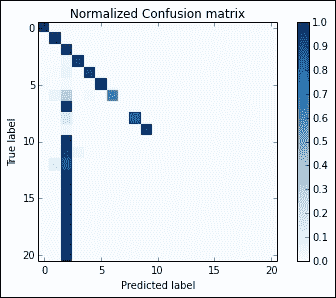

# 九、Spark 实用机器学习

在前一章中，我们看到了 Spark 数据处理的主要功能。在这一章中，我们将与 Spark 一起关注一个真实数据问题的数据科学。在本章中，您将学习以下主题:

*   如何在集群的节点间共享变量
*   如何从结构化(CSV)和半结构化(JSON)文件创建数据帧，将其保存在磁盘上并加载
*   如何使用类似 SQL 的语法来选择、过滤、连接、分组和聚合数据集，从而使预处理变得极其容易
*   如何处理数据集中丢失的数据
*   Spark 中有哪些现成的算法可用于特征工程，以及如何在实际场景中使用它们
*   哪些学习者可用，以及如何在分布式环境中衡量他们的表现
*   如何在集群中运行超参数优化的交叉验证

# 为本章设置虚拟机

由于机器学习需要大量的计算能力，为了节省一些资源(尤其是内存)，我们将在本章中使用不被 save 支持的 Spark 环境。这种操作模式被命名为独立模式，并创建一个没有集群功能的 Spark 节点；所有的处理都将在驱动程序机器上进行，不会被共享。不用担心；我们将在本章中看到的代码也将在集群环境中工作。

要以这种方式操作，请执行以下步骤:

1.  使用`vagrant up`命令打开虚拟机。
2.  当虚拟机准备就绪时，使用`vagrant ssh`访问虚拟机。
3.  通过`./start_jupyter.sh`从虚拟机内部使用 IPython 笔记本启动 Spark 独立模式。
4.  打开指向`http://localhost:8888`的浏览器。

要关闭它，使用 *Ctrl* + *C* 键退出 IPython 笔记本，`vagrant halt`关闭虚拟机。

### 注

请注意，即使在这种配置下，您也可以通过以下网址访问 Spark 用户界面(至少在运行 IPython 笔记本时):

`http://localhost:4040`

# 跨集群节点共享变量

当我们在分布式环境中工作时，有时需要跨节点共享信息，以便所有节点都可以使用一致的变量进行操作。Spark 通过提供两种变量来处理这种情况:只读变量和只写变量。通过不再确保共享变量既可读又可写，它也降低了一致性要求，让管理这种情况的艰苦工作落在了开发人员的肩上。通常，解决方案会很快达成，因为 Spark 真的很灵活，适应性很强。

## 广播只读变量

广播变量是驱动节点共享的变量，也就是我们配置中运行 IPython Notebook 的节点，所有节点都在集群中。它是一个只读变量，因为该变量由一个节点广播，如果另一个节点更改了它，则永远不会读回。

现在让我们看一下它是如何在一个简单的例子中工作的:我们想要对一个只包含性别信息的数据集进行一次热编码。准确地说，虚拟数据集包含的特征可以是男性 *M* 、女性 *F* 或未知的 *U* (如果信息缺失)。具体来说，我们希望所有节点都使用一个定义好的单向编码，如下面的字典中所列:

```py
In:one_hot_encoding = {"M": (1, 0, 0),
                    "F": (0, 1, 0),
                    "U": (0, 0, 1)
                   }
```

现在让我们试着一步一步来。

最简单的解决方案(尽管它不起作用)是并行化虚拟数据集(或者从磁盘中读取它)，然后使用 RDD 上的 map 方法和 lambda 函数将性别映射到它的编码元组:

```py
In:(sc.parallelize(["M", "F", "U", "F", "M", "U"])
   .map(lambda x: one_hot_encoding[x])
   .collect())

Out:
[(1, 0, 0), (0, 1, 0), (0, 0, 1), (0, 1, 0), (1, 0, 0), (0, 0, 1)]
```

这个解决方案在本地有效，但是不会在真实分布式环境中运行，因为所有节点的工作空间中都没有`one_hot_encoding`变量。一个快速的解决方法是将 Python 字典包含在映射函数中(这是分布式的)，就像我们在这里所做的那样:

```py
In:
def map_ohe(x):
    ohe = {"M": (1, 0, 0),
           "F": (0, 1, 0),
           "U": (0, 0, 1)
          }
    return ohe[x]

sc.parallelize(["M", "F", "U", "F", "M", "U"]).map(map_ohe).collect()

Out:
[(1, 0, 0), (0, 1, 0), (0, 0, 1), (0, 1, 0), (1, 0, 0), (0, 0, 1)] here are you I love you hello hi is that email with all leave formal minutes very worrying A hey
```

这样的解决方案在本地和服务器上都有效，但不是很好:我们混合了数据和流程，使得映射功能不可重用。如果映射函数引用一个广播变量会更好，这样它就可以与我们需要的任何映射一起使用，对数据集进行一次热编码。

为此，我们首先在映射函数内部广播 Python 字典(调用 Spark 上下文提供的`broadcast`方法，`sc`)；使用它的`.value`属性，我们现在可以访问它。这样做之后，我们就有了一个通用的地图函数，可以在任何一个热门地图字典上工作:

```py
In:bcast_map = sc.broadcast(one_hot_encoding)

def bcast_map_ohe(x, shared_ohe):
    return shared_ohe[x]

(sc.parallelize(["M", "F", "U", "F", "M", "U"])
 .map(lambda x: bcast_map_ohe(x, bcast_map.value))
 .collect())

Out:
[(1, 0, 0), (0, 1, 0), (0, 0, 1), (0, 1, 0), (1, 0, 0), (0, 0, 1)]
```

把广播的变量想象成一个写在 HDFS 的文件。然后，当一个通用节点想要访问它时，它只需要 HDFS 路径(作为 map 方法的一个参数传递)，并且您确信它们都将使用相同的路径读取相同的内容。当然，Spark 不使用 HDFS，而是它的内存变体。

### 注

广播变量保存在组成集群的所有节点的内存中；因此，他们从不共享大量可以填充他们的数据，这使得以下处理变得不可能。

要删除广播变量，请对广播变量使用`unpersist`方法。此操作将释放所有节点上该变量的内存:

```py
In:bcast_map.unpersist()
```

## 累加器只写变量

在 Spark 簇中可以共享的其他变量是累加器。累加器是只写变量，可以加在一起，通常用于实现和或计数器。只有运行 IPython 笔记本的驱动程序节点可以读取它的值；所有其他节点都不能。

让我们用一个例子来看看它是如何工作的:我们想处理一个文本文件，并了解在处理它时有多少行是空的。当然，我们可以通过扫描数据集两次(使用两个 Spark 作业)来做到这一点:第一次对空行进行计数，第二次进行真正的处理，但这种解决方案不是很有效。

在第一个无效的解决方案中——使用两个独立的 Spark 作业提取空行的数量——我们可以读取文本文件，过滤空行，并对它们进行计数，如下所示:

```py
In:print "The number of empty lines is:"

(sc.textFile('file:///home/vagrant/datasets/hadoop_git_readme.txt')
   .filter(lambda line: len(line) == 0)
   .count())

Out:The number of empty lines is:
6
```

相反，第二种解决方案更有效(也更复杂)。我们实例化一个累加器变量(初始值为`0`)，并为处理输入文件的每一行时找到的每一个空行添加`1`(用一个映射)。同时，我们可以对每一行做一些处理；例如，在下面这段代码中，我们简单地为每一行返回`1`，以这种方式计算文件中的所有行。

在处理结束时，我们将有两条信息:第一条是行数，来自对变换后的 RDD 的`count()`动作的结果，第二条是累加器的`value`属性中包含的空行数。请记住，在扫描数据集一次后，这两个选项都可用:

```py
In:accum = sc.accumulator(0)

def split_line(line):   
    if len(line) == 0:
        accum.add(1)
    return 1

tot_lines = (
    sc.textFile('file:///home/vagrant/datasets/hadoop_git_readme.txt')
      .map(split_line)
      .count())

empty_lines = accum.value

print "In the file there are %d lines" % tot_lines
print "And %d lines are empty" % empty_lines

Out:In the file there are 31 lines
And 6 lines are empty
```

本质上，Spark 支持数字类型的累加器，默认操作是求和。通过多一点编码，我们可以把它变成更复杂的东西。

## 广播和累加器在一起——一个例子

虽然广播和累加器是简单且非常有限的变量(一个是只读的，另一个是只写的)，但它们可以被主动用于创建非常复杂的操作。例如，让我们尝试在分布式环境中对 Iris 数据集应用不同的机器学习算法。我们将通过以下方式创建一个 Spark 作业:

1.  数据集被读取并广播到所有节点(因为它足够小，可以放入内存中)。
2.  每个节点将在数据集上使用不同的分类器，并在整个数据集上返回分类器名称及其准确度分数。请注意，在这个简单的例子中，为了让事情变得简单，我们将不做任何预处理、训练/测试分割或超参数优化。
3.  如果分类器引发任何异常，错误的字符串表示以及分类器名称应该存储在累加器中。
4.  最终的输出应该包含一个分类器的列表，这些分类器执行分类任务时没有错误，并且它们的准确性得分。

作为第一步，我们加载 Iris 数据集，并将其广播给集群中的所有节点:

```py
In:from sklearn.datasets import load_iris

bcast_dataset = sc.broadcast(load_iris())
```

现在，让我们创建一个自定义累加器。它将包含一个元组列表，以字符串形式存储分类器名称和它经历的异常。自定义累加器是由`AccumulatorParam`类派生的，应该至少包含两个方法:`zero`(初始化时调用)和`addInPlace`(在累加器上调用 add 方法时调用)。

下面的代码显示了最简单的方法，随后将其初始化为一个空列表。请注意，加法运算有点棘手:我们需要组合两个元素，一个元组和一个列表，但我们不知道哪个元素是列表，哪个是元组；因此，我们首先确保这两个元素都是列表，然后我们可以以一种简单的方式(使用`+`运算符)继续连接它们:

```py
In:from pyspark import AccumulatorParam

class ErrorAccumulator(AccumulatorParam):
    def zero(self, initialList):
        return initialList

    def addInPlace(self, v1, v2):
        if not isinstance(v1, list):
            v1 = [v1]
        if not isinstance(v2, list):
            v2 = [v2]
        return v1 + v2

errAccum = sc.accumulator([], ErrorAccumulator())
```

现在，让我们定义映射函数:每个节点应该在广播的 Iris 数据集上训练、测试和评估一个分类器。作为一个参数，该函数将接收分类器对象，并应该返回一个元组，该元组包含列表中包含的分类器名称及其准确度分数。

如果这样做引发了任何异常，分类器名称和异常作为字符串被添加到累加器中，并作为空列表返回:

```py
In:
def apply_classifier(clf, dataset):

    clf_name = clf.__class__.__name__
    X = dataset.value.data
    y = dataset.value.target

    try:
        from sklearn.metrics import accuracy_score

        clf.fit(X, y)
        y_pred = clf.predict(X)
        acc = accuracy_score(y, y_pred)

        return [(clf_name, acc)]

    except Exception as e:
        errAccum.add((clf_name, str(e)))
        return []
```

终于，我们到达了工作的核心。我们现在从 Scikit-learn 实例化几个对象(为了测试累加器，其中一些不是分类器)。我们将把它们转换成 RDD，并应用我们在前一个单元格中创建的映射函数。由于返回值是一个列表，我们可以使用`flatMap`只收集没有陷入任何异常的映射器的输出:

```py
In:from sklearn.linear_model import SGDClassifier
from sklearn.dummy import DummyClassifier
from sklearn.decomposition import PCA
from sklearn.manifold import MDS

classifiers = [DummyClassifier('most_frequent'), 
               SGDClassifier(), 
               PCA(), 
               MDS()]

(sc.parallelize(classifiers)
     .flatMap(lambda x: apply_classifier(x, bcast_dataset))
     .collect())

Out:[('DummyClassifier', 0.33333333333333331),
 ('SGDClassifier', 0.66666666666666663)]
```

不出所料，只有*真正的* 分类器包含在输出中。现在让我们看看哪些分类器产生了错误。不出所料，这里我们发现了前面输出中缺少的两个:

```py
In:print "The errors are:"
errAccum.value

Out:The errors are:
 [('PCA', "'PCA' object has no attribute 'predict'"),
 ('MDS', "Proximity must be 'precomputed' or 'euclidean'. Got euclidean instead")]
```

最后一步，让我们清理广播数据集:

```py
In:bcast_dataset.unpersist()
```

请记住，在这个例子中，我们使用了一个可以广播的小数据集。在现实世界的大数据问题中，您需要从 HDFS 加载数据集，广播 HDFS 路径。

# Spark 中的数据预处理

到目前为止，我们已经看到了如何从本地文件系统和 HDFS 加载文本数据。文本文件可以包含非结构化数据(如文本文档)或结构化数据(如 CSV 文件)。至于半结构化数据，就像包含 JSON 对象的文件一样，Spark 有特殊的例程能够将文件转换成数据帧，类似于 R 和 Python 熊猫中的数据帧。数据帧非常类似于 RDBMS 表，在 RDBMS 表中设置了模式。

## JSON 文件和 Spark 数据帧

为了导入符合 JSON 的文件，我们应该首先创建一个 SQL 上下文，从本地 Spark Context 创建一个`SQLContext`对象:

```py
In:from pyspark.sql import SQLContext
sqlContext = SQLContext(sc)
```

现在，让我们看看一个小 JSON 文件的内容(它是在游民虚拟机中提供的)。它是一个有六行三列的表的 JSON 表示，其中缺少一些属性(例如带有`user_id=0`的用户的`gender`属性):

```py
In:!cat /home/vagrant/datasets/users.json

Out:{"user_id":0, "balance": 10.0}
{"user_id":1, "gender":"M", "balance": 1.0}
{"user_id":2, "gender":"F", "balance": -0.5}
{"user_id":3, "gender":"F", "balance": 0.0}
{"user_id":4, "balance": 5.0}
{"user_id":5, "gender":"M", "balance": 3.0}
```

使用`sqlContext`提供的`read.json`方法，我们已经有了格式良好的表，并且在一个变量中有所有正确的列名。输出变量被键入为 Spark 数据帧。要在一个漂亮的格式化表格中显示变量，使用它的`show`方法:

```py
In:
df = sqlContext.read \
.json("file:///home/vagrant/datasets/users.json")
df.show()

Out:
+-------+------+-------+
|balance|gender|user_id|
+-------+------+-------+
|   10.0|  null|      0|
|    1.0|     M|      1|
|   -0.5|     F|      2|
|    0.0|     F|      3|
|    5.0|  null|      4|
|    3.0|     M|      5|
+-------+------+-------+
```

此外，我们可以使用`printSchema`方法研究数据帧的模式。我们意识到，在读取 JSON 文件的时候，每一个列类型都已经被数据推断出来了(示例中`user_id`列包含长整数，性别列由字符串组成，余额为双浮点):

```py
In:df.printSchema()

Out:root
 |-- balance: double (nullable = true)
 |-- gender: string (nullable = true)
 |-- user_id: long (nullable = true)
```

就像关系数据库管理系统中的一个表一样，我们可以滑动并切割数据框中的数据，选择列并按属性过滤数据。在本例中，我们要打印性别未缺失且余额严格大于零的用户的余额、性别和`user_id`。为此，我们可以使用`filter`和`select`方法:

```py
In:(df.filter(df['gender'] != 'null')
.filter(df['balance'] > 0)
   .select(['balance', 'gender', 'user_id'])
   .show())

Out:
+-------+------+-------+
|balance|gender|user_id|
+-------+------+-------+
|    1.0|     M|      1|
|    3.0|     M|      5|
+-------+------+-------+
```

我们也可以用类似 SQL 的语言重写前面工作的每一部分。事实上，`filter`和`select`方法可以接受 SQL 格式的字符串:

```py
In:(df.filter('gender is not null')
   .filter('balance > 0').select("*").show())

Out:
+-------+------+-------+
|balance|gender|user_id|
+-------+------+-------+
|    1.0|     M|      1|
|    3.0|     M|      5|
+-------+------+-------+
```

我们也可以只使用对`filter`方法的一次调用:

```py
In:df.filter('gender is not null and balance > 0').show()

Out:
+-------+------+-------+
|balance|gender|user_id|
+-------+------+-------+
|    1.0|     M|      1|
|    3.0|     M|      5|
+-------+------+-------+
```

## 处理缺失数据

数据预处理的一个常见问题是处理缺失数据。Spark 数据框，类似熊猫数据框，提供了一系列你可以在上面做的操作。例如，让数据集仅由完整的行组成的最简单的选择是丢弃包含缺失信息的行。为此，在 Spark 数据框中，我们首先必须访问数据框的`na`属性，然后调用`drop`方法。生成的表将只包含完整的行:

```py
In:df.na.drop().show()

Out:
+-------+------+-------+
|balance|gender|user_id|
+-------+------+-------+
|    1.0|     M|      1|
|   -0.5|     F|      2|
|    0.0|     F|      3|
|    3.0|     M|      5|
+-------+------+-------+
```

如果这样的操作删除了太多行，我们总是可以决定删除行时应该考虑哪些列(作为`drop`方法的扩充子集):

```py
In:df.na.drop(subset=["gender"]).show()

Out:
+-------+------+-------+
|balance|gender|user_id|
+-------+------+-------+
|    1.0|     M|      1|
|   -0.5|     F|      2|
|    0.0|     F|      3|
|    3.0|     M|      5|
+-------+------+-------+
```

此外，如果您想为每列设置默认值而不是删除行数据，可以使用`fill`方法，传递由列名(作为字典键)和默认值组成的字典来替换该列中缺失的数据(作为字典中键的值)。

举个例子，如果你想确保变量 balance(缺失的地方)设置为`0`，变量 gender(缺失的地方)设置为`U`，你可以简单的做以下操作:

```py
In:df.na.fill({'gender': "U", 'balance': 0.0}).show()

Out:
+-------+------+-------+
|balance|gender|user_id|
+-------+------+-------+
|   10.0|     U|      0|
|    1.0|     M|      1|
|   -0.5|     F|      2|
|    0.0|     F|      3|
|    5.0|     U|      4|
|    3.0|     M|      5|
+-------+------+-------+
```

## 在内存中分组和创建表格

要将函数应用于一组行(与 SQL `GROUP BY`的情况完全相同)，可以使用两种类似的方法。在下面的例子中，我们想要计算每个性别的平均平衡:

```py
In:(df.na.fill({'gender': "U", 'balance': 0.0})
   .groupBy("gender").avg('balance').show())

Out:
+------+------------+
|gender|avg(balance)|
+------+------------+
|     F|       -0.25|
|     M|         2.0|
|     U|         7.5|
+------+------------+
```

到目前为止，我们已经使用了数据框，但是正如您所看到的，数据框方法和 SQL 命令之间的距离很小。实际上，使用 Spark，可以将 DataFrame 注册为一个 SQL 表，以充分享受 SQL 的强大功能。该表保存在内存中，并以类似于 RDD 的方式分发。

要注册该表，我们需要提供一个名称，它将在未来的 SQL 命令中使用。在这种情况下，我们决定将其命名为`users`:

```py
In:df.registerTempTable("users")
```

通过调用 Spark `sql`上下文提供的`sql`方法，我们可以运行任何符合 SQL 的表:

```py
In:sqlContext.sql("""
    SELECT gender, AVG(balance) 
    FROM users 
    WHERE gender IS NOT NULL 
    GROUP BY gender""").show()

Out:
+------+-----+
|gender|  _c1|
+------+-----+
|     F|-0.25|
|     M|  2.0|
+------+-----+
```

毫不奇怪，命令输出的表(以及`users`表本身)属于 Spark 数据帧类型:

```py
In:type(sqlContext.table("users"))

Out:pyspark.sql.dataframe.DataFrame
```

数据框、表和关系数据库紧密相连，RDD 方法可以用在数据框上。请记住，数据框的每一行都是 RDD 元素。让我们详细看看这个，首先收集整个表:

```py
In:sqlContext.table("users").collect()
Out:[Row(balance=10.0, gender=None, user_id=0),
 Row(balance=1.0, gender=u'M', user_id=1),
 Row(balance=-0.5, gender=u'F', user_id=2),
 Row(balance=0.0, gender=u'F', user_id=3),
 Row(balance=5.0, gender=None, user_id=4),
 Row(balance=3.0, gender=u'M', user_id=5)]

In:
a_row = sqlContext.sql("SELECT * FROM users").first()
a_row

Out:Row(balance=10.0, gender=None, user_id=0)
```

输出是一个`Row`对象列表(它们看起来像 Python 的`namedtuple`)。让我们深入挖掘一下:`Row`包含多个属性，可以作为属性或字典键访问；也就是说，要从第一行中取出余额，我们可以选择以下两种方式:

```py
In:print a_row['balance']
print a_row.balance

Out:10.0
10.0
```

还有，`Row`可以用`Row`的`asDict`方法收集成 Python 字典。结果包含作为键的属性名和作为字典值的属性值:

```py
In:a_row.asDict()

Out:{'balance': 10.0, 'gender': None, 'user_id': 0}
```

## 将预处理后的数据帧或 RDD 写入磁盘

要将数据帧或 RDD 写入磁盘，我们可以使用写入方法。我们有多种格式可供选择；在这种情况下，我们将把它保存为本地机器上的 JSON 文件:

```py
In:(df.na.drop().write
   .save("file:///tmp/complete_users.json", format='json'))
```

检查本地文件系统上的输出，我们立即看到一些与我们预期不同的东西:这个操作创建了多个文件(`part-r-…`)。

它们中的每一个都包含一些序列化为 JSON 对象的行，将它们合并在一起将创建全面的输出。由于 Spark 是为处理大型分布式文件而设计的，因此针对该文件调整了写入操作，每个节点写入完整 RDD 的一部分:

```py
In:!ls -als /tmp/complete_users.json

Out:total 28
4 drwxrwxr-x 2 vagrant vagrant 4096 Feb 25 22:54 .
4 drwxrwxrwt 9 root    root    4096 Feb 25 22:54 ..
4 -rw-r--r-- 1 vagrant vagrant   83 Feb 25 22:54 part-r-00000-...
4 -rw-rw-r-- 1 vagrant vagrant   12 Feb 25 22:54 .part-r-00000-...
4 -rw-r--r-- 1 vagrant vagrant   82 Feb 25 22:54 part-r-00001-...
4 -rw-rw-r-- 1 vagrant vagrant   12 Feb 25 22:54 .part-r-00001-...
0 -rw-r--r-- 1 vagrant vagrant    0 Feb 25 22:54 _SUCCESS
4 -rw-rw-r-- 1 vagrant vagrant    8 Feb 25 22:54 ._SUCCESS.crc
```

为了读回它，我们不需要创建一个独立的文件——即使在读操作中有多个片段也可以。一个 JSON 文件也可以在一个 SQL 查询的`FROM`子句中读取。现在，让我们尝试在不创建中间数据帧的情况下，打印刚刚写在磁盘上的 JSON:

```py
In:sqlContext.sql(
    "SELECT * FROM json.`file:///tmp/complete_users.json`").show()

Out:
+-------+------+-------+
|balance|gender|user_id|
+-------+------+-------+
|    1.0|     M|      1|
|   -0.5|     F|      2|
|    0.0|     F|      3|
|    3.0|     M|      5|
+-------+------+-------+
```

除了 JSON，还有另一种格式在处理结构化大数据集时非常流行:Parquet 格式。拼花是 Hadoop 生态系统中可用的柱状存储格式；它对数据进行压缩和编码，并且可以使用嵌套结构:所有这些特性都使它非常高效。

保存和加载与 JSON 非常相似，即使在这种情况下，该操作也会产生多个写入磁盘的文件:

```py
In:df.na.drop().write.save(
    "file:///tmp/complete_users.parquet", format='parquet')

In:!ls -als /tmp/complete_users.parquet/

Out:total 44
4 drwxrwxr-x  2 vagrant vagrant 4096 Feb 25 22:54 .
4 drwxrwxrwt 10 root    root    4096 Feb 25 22:54 ..
4 -rw-r--r--  1 vagrant vagrant  376 Feb 25 22:54 _common_metadata
4 -rw-rw-r--  1 vagrant vagrant   12 Feb 25 22:54 ._common_metadata..
4 -rw-r--r--  1 vagrant vagrant 1082 Feb 25 22:54 _metadata
4 -rw-rw-r--  1 vagrant vagrant   20 Feb 25 22:54 ._metadata.crc
4 -rw-r--r--  1 vagrant vagrant  750 Feb 25 22:54 part-r-00000-...
4 -rw-rw-r--  1 vagrant vagrant   16 Feb 25 22:54 .part-r-00000-...
4 -rw-r--r--  1 vagrant vagrant  746 Feb 25 22:54 part-r-00001-...
4 -rw-rw-r--  1 vagrant vagrant   16 Feb 25 22:54 .part-r-00001-...
0 -rw-r--r--  1 vagrant vagrant    0 Feb 25 22:54 _SUCCESS
4 -rw-rw-r--  1 vagrant vagrant    8 Feb 25 22:54 ._SUCCESS.crc
```

## 处理 Spark 数据帧

到目前为止，我们已经描述了如何从 JSON 和 Parquet 文件中加载数据帧，但是没有描述如何从现有的 RDD 文件中创建它们。为此，您只需要为 RDD 中的每个记录创建一个`Row`对象，并调用 SQL 上下文的`createDataFrame`方法。最后，您可以将其注册为临时表，以充分利用 SQL 语法的强大功能:

```py
In:from pyspark.sql import Row

rdd_gender = \
    sc.parallelize([Row(short_gender="M", long_gender="Male"),
                    Row(short_gender="F", long_gender="Female")])

(sqlContext.createDataFrame(rdd_gender)
           .registerTempTable("gender_maps"))

In:sqlContext.table("gender_maps").show()

Out:
+-----------+------------+
|long_gender|short_gender|
+-----------+------------+
|       Male|           M|
|     Female|           F|
+-----------+------------+
```

### 注

这也是操作 CSV 文件的首选方式。首先用`sc.textFile`读取文件；然后使用`split`方法、`Row`构造函数和`createDataFrame`方法，创建最终的数据框。

当内存中有多个数据帧或可以从磁盘加载的数据帧时，您可以加入并使用经典关系数据库管理系统中可用的所有操作。在本例中，我们可以将从 RDD 创建的数据框与我们存储的拼花文件中包含的用户数据集连接起来。结果令人震惊:

```py
In:sqlContext.sql("""
    SELECT balance, long_gender, user_id 
    FROM parquet.`file:///tmp/complete_users.parquet` 
    JOIN gender_maps ON gender=short_gender""").show()

Out:
+-------+-----------+-------+
|balance|long_gender|user_id|
+-------+-----------+-------+
|    3.0|       Male|      5|
|    1.0|       Male|      1|
|    0.0|     Female|      3|
|   -0.5|     Female|      2|
+-------+-----------+-------+
```

在 web UI 中，每个 SQL 查询在 **SQL** 选项卡下被映射为一个虚拟的**有向无环图** ( **DAG** ) 。这对于跟踪工作进度和理解查询的复杂性非常有用。在执行前面的 JOIN 查询时，您可以清楚地看到两个分支正在进入同一个`BroadcastHashJoin`块:第一个来自 RDD，第二个来自拼花文件。然后，以下块只是选定列上的一个投影:


由于表在内存中，最后要做的是清理释放用来保存它们的内存。通过调用`sqlContext`提供的`tableNames`方法，我们得到了当前内存中所有表的列表。然后，要释放它们，我们可以用`dropTempTable`用表的名字作为参数。超过这一点，对这些表的任何进一步引用都将返回一个错误:

```py
In:sqlContext.tableNames()

Out:[u'gender_maps', u'users']

In:
for table in sqlContext.tableNames():
    sqlContext.dropTempTable(table)
```

从 Spark 1.3 开始，在进行数据科学运算时，DataFrame 是对数据集进行运算的首选方式。

# 带 Spark 的机器学习

在这里，我们到达了您工作的主要任务:创建一个模型来预测数据集中缺失的一个或多个属性。为此，我们使用了一些机器学习建模，Spark 可以在这种情况下为我们提供一只大手。

**MLlib** 是 Spark 机器学习库；虽然它是用 Scala 和 Java 构建的，但它的功能在 Python 中也是可用的。它包含分类、回归和推荐学习器，一些用于降维和特征选择的例程，并且具有许多用于文本处理的功能。它们都能够处理巨大的数据集，并利用集群中所有节点的能力来实现目标。

截至目前(2016 年)，它由两个主要包组成:`mllib`，在 RDDs 上运行，`ml`，在 DataFrames 上运行。由于后者表现良好，并且是数据科学中最流行的数据表示方式，开发人员选择贡献和改进`ml`分支，让前者保留下来，但不再进一步开发。乍一看，MLlib 似乎是一个完整的库，但是在开始使用 Spark 之后，您会注意到默认包中既没有统计库，也没有数字库。在这里，SciPy 和 NumPy 来帮助您，它们再次成为数据科学的基础！

在本节中，我们将尝试探索*新的* `pyspark.ml`包的功能；截至目前，与最先进的 Scikit-learn 库相比，它仍处于早期阶段，但它在未来肯定有很大的潜力。

### 注

Spark 是一个高级的、分布式的、复杂的软件，应该只在大数据上使用，并且有多个节点的集群；事实上，如果数据集可以放在内存中，使用其他库(如 Scikit-learn 或类似的库)会更方便，这些库只关注问题的数据科学方面。在小数据集的单个节点上运行 Spark 可能比 Scikit-learn 等效算法慢五倍。

## KDD 99 数据集上的 Spark

让我们使用一个真实的数据集来进行这个探索:KDD99 数据集。竞赛的目标是创建一个网络入侵检测系统，能够识别哪些网络流量是恶意的，哪些不是。而且，数据集中有很多不同的攻击；目标是使用数据集中包含的数据包流的特征来准确预测它们。

作为数据集上的一个边节点，在发布后的最初几年里，为入侵检测系统开发出色的解决方案非常有用。如今，由于这一点，数据集中包含的所有攻击都非常容易检测，因此不再用于入侵检测系统的开发。

例如，的特征是协议(tcp、icmp 和 udp)、服务(http、smtp 等)、数据包的大小、协议中活动的标志、成为根的尝试次数等。

### 注

更多关于 KDD99 挑战赛和数据集的信息可在[http://kdd.ics.uci.edu/databases/kddcup99/kddcup99.html](http://kdd.ics.uci.edu/databases/kddcup99/kddcup99.html)获得。

虽然这是一个经典的多类分类问题，但我们将深入研究它，向您展示如何在 Spark 中执行此任务。为了保持清洁，我们将使用新的 IPython 笔记本。

## 读取数据集

首先让我们下载并解压数据集。我们将非常保守，只使用原始训练数据集的 10%(75MB，未压缩)，因为我们所有的分析都在一个小型虚拟机上运行。如果您想尝试一下，可以取消对以下代码片段中的行的注释，并下载完整的训练数据集(750MB 未压缩)。我们使用 bash 命令下载训练数据集、测试(47MB)和特征名:

```py
In:!rm -rf ../datasets/kdd*

# !wget -q -O ../datasets/kddtrain.gz \
# http://kdd.ics.uci.edu/databases/kddcup99/kddcup.data.gz

!wget -q -O ../datasets/kddtrain.gz \
http://kdd.ics.uci.edu/databases/kddcup99/kddcup.data_10_percent.gz

!wget -q -O ../datasets/kddtest.gz \
http://kdd.ics.uci.edu/databases/kddcup99/corrected.gz

!wget -q -O ../datasets/kddnames \
http://kdd.ics.uci.edu/databases/kddcup99/kddcup.names

!gunzip ../datasets/kdd*gz
```

现在，打印前几行以了解格式。很明显，这是一个没有标题的经典 CSV，每行末尾都有一个点。此外，我们可以看到一些字段是数字的，但其中一些是文本的，目标变量包含在最后一个字段中:

```py
In:!head -3 ../datasets/kddtrain

Out:
0,tcp,http,SF,181,5450,0,0,0,0,0,1,0,0,0,0,0,0,0,0,0,0,8,8,0.00,0.00,0.00,0.00,1.00,0.00,0.00,9,9,1.00,0.00,0.11,0.00,0.00,0.00,0.00,0.00,normal.
0,tcp,http,SF,239,486,0,0,0,0,0,1,0,0,0,0,0,0,0,0,0,0,8,8,0.00,0.00,0.00,0.00,1.00,0.00,0.00,19,19,1.00,0.00,0.05,0.00,0.00,0.00,0.00,0.00,normal.
0,tcp,http,SF,235,1337,0,0,0,0,0,1,0,0,0,0,0,0,0,0,0,0,8,8,0.00,0.00,0.00,0.00,1.00,0.00,0.00,29,29,1.00,0.00,0.03,0.00,0.00,0.00,0.00,0.00,normal.
```

要创建带有命名字段的数据框，我们应该首先读取`kddnames`文件中包含的头。目标字段将简单命名为`target`。

读取并解析文件后，我们打印出问题的特征数量(记住目标变量不是特征)和它们的前 10 个名称:

```py
In:
with open('../datasets/kddnames', 'r') as fh:
    header = [line.split(':')[0] 
              for line in fh.read().splitlines()][1:]

header.append('target')

print "Num features:", len(header)-1
print "First 10:", header[:10]

Out:Num features: 41
First 10: ['duration', 'protocol_type', 'service', 'flag', 'src_bytes', 'dst_bytes', 'land', 'wrong_fragment', 'urgent', 'hot']
```

现在让我们创建两个独立的关系数据库，一个用于训练数据，另一个用于测试数据:

```py
In:
train_rdd = sc.textFile('file:///home/vagrant/datasets/kddtrain')
test_rdd = sc.textFile('file:///home/vagrant/datasets/kddtest')
```

现在，我们需要解析每个文件的每一行来创建一个数据帧。首先，我们将 CSV 文件的每一行拆分为单独的字段，然后将每个数值转换为浮点，将每个文本值转换为字符串。最后，我们去掉每行末尾的点。

最后一步，使用`sqlContext`提供的`createDataFrame`方法，我们可以为训练和测试数据集创建两个带有命名列的 Spark 数据帧:

```py
In:
def line_parser(line):

    def piece_parser(piece):
            if "." in piece or piece.isdigit():
                return float(piece)
            else:
                return piece

    return [piece_parser(piece) for piece in line[:-1].split(',')]

train_df = sqlContext.createDataFrame(
    train_rdd.map(line_parser), header)

test_df = sqlContext.createDataFrame(
    test_rdd.map(line_parser), header)
```

到目前为止，我们只写了 RDD 转换器；让我们引入一个操作，看看我们在数据集中有多少观察值，同时检查前面代码的正确性。

```py
In:print "Train observations:", train_df.count()
print "Test observations:", test_df.count()

Out:Train observations: 494021
Test observations: 311029
```

尽管我们使用的是完整 KDD99 数据集的十分之一，但我们仍在进行 50 万次观测。乘以特征数 41，我们清楚地看到，我们将在包含 2000 多万个值的观察矩阵上训练我们的分类器。这对于 Spark 来说并不是一个很大的数据集(完整的 KDD99 也不是)；世界各地的开发者已经在 petabytes 和十亿记录上使用它。如果数字看起来很大，不要害怕:Spark 旨在应对它们！

现在，让我们看看它在数据框的模式中是什么样子的。具体来说，我们想确定哪些字段是数字，哪些包含字符串(注意，为了简洁起见，结果被截断了):

```py
In:train_df.printSchema()

Out:root
 |-- duration: double (nullable = true)
 |-- protocol_type: string (nullable = true)
 |-- service: string (nullable = true)
 |-- flag: string (nullable = true)
 |-- src_bytes: double (nullable = true)
 |-- dst_bytes: double (nullable = true)
 |-- land: double (nullable = true)
 |-- wrong_fragment: double (nullable = true)
 |-- urgent: double (nullable = true)
 |-- hot: double (nullable = true)
...
...
...
 |-- target: string (nullable = true)
```

## 特征工程

从视觉分析来看，只有四个字段是字符串:`protocol_type`、`service`、`flag`和`target`(不出所料，这是多类目标标签)。

由于我们将使用基于树的分类器，我们希望将每个级别的文本编码为每个变量的数字。使用 Scikit-learn，这个操作可以通过一个`sklearn.preprocessing.LabelEncoder`对象来完成。在 Spark 中相当于`pyspark.ml.feature`套装的`StringIndexer`。

我们需要用 Spark 编码四个变量；然后我们必须将四个`StringIndexer`对象级联在一起:它们中的每一个都将对数据帧的特定列进行操作，输出一个带有附加列的数据帧(类似于映射操作)。映射是自动的，按频率排序:Spark 对所选列中每个级别的计数进行排序，将最受欢迎的级别映射为 0，下一个级别映射为 1，依此类推。请注意，通过此操作，您将遍历数据集一次，以统计每个级别的出现次数；如果您已经知道映射，那么广播它并使用`map`操作会更有效，如本章开头所示。

类似地，我们可以使用一个热编码器来生成一个数值观察矩阵。在单热编码器的情况下，我们会在数据帧中有多个输出列，每个分类特征的每个级别有一个输出列。为此，Spark 提供了`pyspark.ml.feature.OneHotEncoder`课程。

### 注

更一般地说，包含在`pyspark.ml.feature`包中的所有类都用于从数据帧中提取、转换和选择特征。所有的*在数据框中读取*一些列，*创建*一些其他列。

从 Spark 1.6 开始，Python 中可用的特性操作包含在以下详尽的列表中(所有这些都可以在`pyspark.ml.feature`包中找到)。名称应该是直观的，除了其中的几个，将在内联或稍后的文本中解释:

*   对于文本输入(理想情况下):
    *   阿富汗国防军和以色列国防军
    *   标记器及其基于正则表达式的实现
    *   Word2vec
    *   停止词移除器
    *   Ngram
*   对于分类特征:
    *   字符串索引和它的逆编码器，索引字符串
    *   OneHotEncoder
    *   矢量分度器(现成的分类到数字分度器)
*   对于其他输入:
    *   二值化器
    *   污染控制局(Pollution Control Agency)
    *   多项式展开
    *   规格化器、标准缩放器和最小最大缩放器
    *   桶化器(桶化特征的值)
    *   elemontwiseproduct _ 将列相乘)
*   通用:
    *   SQLTransformer(实现由 SQL 语句定义的转换，将 DataFrame 称为名为`__THIS__`的表)
    *   公式(使用 R 型语法选择列)
    *   向量装配器(从多列创建特征向量)

回到例子，我们现在想把每个分类变量中的级别编码为离散的数字。正如我们已经解释过的，为此，我们将为每个变量使用一个`StringIndexer`对象。此外，我们可以使用一个 ML 管道，并将它们设置为它的阶段。

然后，为了适合所有的索引器，你只需要调用管道的`fit`方法。在内部，它将按顺序适合所有分段对象。当它完成拟合操作时，会创建一个新对象，我们可以将其称为拟合管道。调用这个新对象的`transform`方法将依次调用所有的分段元素(已经拟合)，每个都在前一个完成之后。在这段代码中，您将看到管道正在运行。请注意，变压器构成了管道。因此，由于不存在任何操作，因此实际上不会执行任何操作。在输出数据框中，您会注意到四个额外的列，其名称与原始分类列相同，但带有`_cat`后缀:

```py
In:from pyspark.ml import Pipeline
from pyspark.ml.feature import StringIndexer

cols_categorical = ["protocol_type", "service", "flag","target"]
preproc_stages = []

for col in cols_categorical:
    out_col = col + "_cat"
    preproc_stages.append(
        StringIndexer(
            inputCol=col, outputCol=out_col, handleInvalid="skip"))

pipeline = Pipeline(stages=preproc_stages)
indexer = pipeline.fit(train_df)

train_num_df = indexer.transform(train_df)
test_num_df = indexer.transform(test_df)
```

让我们进一步研究管道。在这里，我们将看到管道中的阶段:不合适的管道和已安装的管道。请注意，Spark 和 Scikit-learn 有很大的区别:在 Scikit-learn 中，`fit`和`transform`是在同一个对象上调用的，而在 Spark 中，`fit`方法会产生一个新的对象(通常，它的名称会添加一个`Model`后缀，就像对于`Pipeline`和`PipelineModel`一样)，在这里您可以调用`transform`方法。这种差异源于闭包——一个合适的对象很容易在进程和集群之间分布:

```py
In:print pipeline.getStages()
print
print pipeline
print indexer

Out:
[StringIndexer_432c8aca691aaee949b8, StringIndexer_4f10bbcde2452dd1b771, StringIndexer_4aad99dc0a3ff831bea6, StringIndexer_4b369fea07873fc9c2a3]

Pipeline_48df9eed31c543ba5eba
PipelineModel_46b09251d9e4b117dc8d
```

让我们看看第一个观察，也就是 CSV 文件中的第一行，经过管道后是如何变化的。请注意，我们在这里使用了一个操作，因此管道和管道模型中的所有阶段都会被执行:

```py
In:print "First observation, after the 4 StringIndexers:\n"
print train_num_df.first()

Out:First observation, after the 4 StringIndexers:

Row(duration=0.0, protocol_type=u'tcp', service=u'http', flag=u'SF', src_bytes=181.0, dst_bytes=5450.0, land=0.0, wrong_fragment=0.0, urgent=0.0, hot=0.0, num_failed_logins=0.0, logged_in=1.0, num_compromised=0.0, root_shell=0.0, su_attempted=0.0, num_root=0.0, num_file_creations=0.0, num_shells=0.0, num_access_files=0.0, num_outbound_cmds=0.0, is_host_login=0.0, is_guest_login=0.0, count=8.0, srv_count=8.0, serror_rate=0.0, srv_serror_rate=0.0, rerror_rate=0.0, srv_rerror_rate=0.0, same_srv_rate=1.0, diff_srv_rate=0.0, srv_diff_host_rate=0.0, dst_host_count=9.0, dst_host_srv_count=9.0, dst_host_same_srv_rate=1.0, dst_host_diff_srv_rate=0.0, dst_host_same_src_port_rate=0.11, dst_host_srv_diff_host_rate=0.0, dst_host_serror_rate=0.0, dst_host_srv_serror_rate=0.0, dst_host_rerror_rate=0.0, dst_host_srv_rerror_rate=0.0, target=u'normal', protocol_type_cat=1.0, service_cat=2.0, flag_cat=0.0, target_cat=2.0)
```

生成的数据框架看起来非常完整，也很容易理解:所有变量都有名称和值。我们立即注意到分类特征仍然存在，例如，我们有`protocol_type`(分类)和`protocol_type_cat`(从分类映射而来的变量的数字版本)。

从数据框中提取一些列就像在一个 SQL 查询中使用`SELECT`一样简单。现在让我们为所有的数字特征建立一个名称列表:从标题中找到的名称开始，我们移除分类的，并用数字派生的来替换它们。最后，由于我们只需要特征，我们移除了目标变量及其数值导出的等价物:

```py
In:features_header = set(header) \
                - set(cols_categorical) \
                | set([c + "_cat" for c in cols_categorical]) \
                - set(["target", "target_cat"])
features_header = list(features_header)
print features_header
print "Total numerical features:", len(features_header)

Out:['num_access_files', 'src_bytes', 'srv_count', 'num_outbound_cmds', 'rerror_rate', 'urgent', 'protocol_type_cat', 'dst_host_same_srv_rate', 'duration', 'dst_host_diff_srv_rate', 'srv_serror_rate', 'is_host_login', 'wrong_fragment', 'serror_rate', 'num_compromised', 'is_guest_login', 'dst_host_rerror_rate', 'dst_host_srv_serror_rate', 'hot', 'dst_host_srv_count', 'logged_in', 'srv_rerror_rate', 'dst_host_srv_diff_host_rate', 'srv_diff_host_rate', 'dst_host_same_src_port_rate', 'root_shell', 'service_cat', 'su_attempted', 'dst_host_count', 'num_file_creations', 'flag_cat', 'count', 'land', 'same_srv_rate', 'dst_bytes', 'num_shells', 'dst_host_srv_rerror_rate', 'num_root', 'diff_srv_rate', 'num_failed_logins', 'dst_host_serror_rate']
Total numerical features: 41
```

这里`VectorAssembler`类来帮助我们构建特征矩阵。我们只需要传递要作为参数选择的列和要在数据框中创建的新列。我们决定将输出列简单命名为`features`。我们将这种转换应用于训练集和测试集，然后我们只选择我们感兴趣的两个列— `features`和`target_cat`:

```py
In:from pyspark.ml.feature import VectorAssembler

assembler = VectorAssembler(
    inputCols=features_header,
    outputCol="features")

Xy_train = (assembler
                .transform(train_num_df)
                .select("features", "target_cat"))
Xy_test = (assembler
                .transform(test_num_df)
                .select("features", "target_cat"))
```

此外，`VectorAssembler`的默认行为是产生`DenseVectors`或`SparseVectors`。在这种情况下，由于`features`的向量包含许多零，所以它返回一个稀疏向量。要查看输出内容，我们可以打印第一行。请注意，这是一个动作。因此，作业会在打印结果之前执行:

```py
In:Xy_train.first()

Out:Row(features=SparseVector(41, {1: 181.0, 2: 8.0, 6: 1.0, 7: 1.0, 20: 9.0, 21: 1.0, 25: 0.11, 27: 2.0, 29: 9.0, 31: 8.0, 33: 1.0, 39: 5450.0}), target_cat=2.0)
```

## 训练学习者

最后，我们到达了任务的热点部分:训练一个分类器。分类器包含在`pyspark.ml.classification`包中，对于这个例子，我们使用的是随机森林。

从 Spark 1.6 开始，使用 Python 接口的分类器的广泛列表如下:

*   分类(第`pyspark.ml.classification`包):
    *   `LogisticRegression`
    *   `DecisionTreeClassifier`
    *   `GBTClassifier`(基于决策树分类的梯度增强实现)
    *   `RandomForestClassifier`
    *   `NaiveBayes`
    *   `MultilayerPerceptronClassifier`

请注意，不是所有的都能够处理多类问题，并且可能有不同的参数；请务必查看与使用版本相关的文档。除了分类器，Spark 1.6 中使用 Python 接口实现的其他学习者如下:

*   聚类(即`pyspark.ml.clustering`包):
    *   KMeans
*   回归(第`pyspark.ml.regression`包):
    *   加速失效时间存活回归
    *   决策树回归器
    *   基于回归树的梯度增强回归实现
    *   等渗
    *   线性回归
    *   随机森林回归器
*   推荐人(即`pyspark.ml.recommendation`套餐):
    *   基于交替最小二乘法的协同过滤推荐系统

让我们回到 KDD99 挑战赛的目标。现在是实例化一个随机森林分类器并设置其参数的时候了。要设置的参数有`featuresCol`(包含特征矩阵的列)、`labelCol`(包含目标标签的数据框的列)、种子(使实验可复制的随机种子)和`maxBins`(树的每个节点中用于分裂点的最大箱数)。森林中树木数量的默认值为 20，每棵树最大深度为五级。此外，默认情况下，该分类器在数据框中创建三个输出列:`rawPrediction`(存储每个可能标签的预测分数)、`probability`(存储每个标签的可能性)和`prediction`(最可能标签):

```py
In:from pyspark.ml.classification import RandomForestClassifier

clf = RandomForestClassifier(
    labelCol="target_cat", featuresCol="features", 
    maxBins=100, seed=101)
fit_clf = clf.fit(Xy_train)
```

即使在这种情况下，训练的分类器也是不同的对象。与之前完全一样，训练好的分类器与带`Model`后缀的分类器命名相同:

```py
In:print clf
print fit_clf

Out:RandomForestClassifier_4797b2324bc30e97fe01
RandomForestClassificationModel (uid=rfc_44b551671c42) with 20 trees
```

在训练好的分类器对象上，即`RandomForestClassificationModel`，可以调用`transform`方法。现在我们预测训练数据集和测试数据集上的标签，并打印测试数据集的第一行；正如分类器中设置的那样，预测将出现在名为`prediction`的栏中:

```py
In:Xy_pred_train = fit_clf.transform(Xy_train)
Xy_pred_test = fit_clf.transform(Xy_test)

In:print "First observation after classification stage:"
print Xy_pred_test.first()

Out:First observation after classification stage:
Row(features=SparseVector(41, {1: 105.0, 2: 1.0, 6: 2.0, 7: 1.0, 20: 254.0, 27: 1.0, 29: 255.0, 31: 1.0, 33: 1.0, 35: 0.01, 39: 146.0}), target_cat=2.0, rawPrediction=DenseVector([0.0109, 0.0224, 19.7655, 0.0123, 0.0099, 0.0157, 0.0035, 0.0841, 0.05, 0.0026, 0.007, 0.0052, 0.002, 0.0005, 0.0021, 0.0007, 0.0013, 0.001, 0.0007, 0.0006, 0.0011, 0.0004, 0.0005]), probability=DenseVector([0.0005, 0.0011, 0.9883, 0.0006, 0.0005, 0.0008, 0.0002, 0.0042, 0.0025, 0.0001, 0.0004, 0.0003, 0.0001, 0.0, 0.0001, 0.0, 0.0001, 0.0, 0.0, 0.0, 0.0001, 0.0, 0.0]), prediction=2.0)
```

## 评估学习者的表现

任何数据科学任务的下一步是检查学习者在训练和测试集上的表现。对于这个任务，我们将使用 F1 分数，因为它是一个很好的度量标准，结合了精度和召回性能。

评估指标包含在`pyspark.ml.evaluation`包中；在为数不多的选择中，我们使用一个来评估多类分类器:`MulticlassClassificationEvaluator`。作为参数，我们提供了度量(精确度、召回率、准确度、f1 分数等)以及包含真实标签和预测标签的列的名称:

```py
In:
from pyspark.ml.evaluation import MulticlassClassificationEvaluator

evaluator = MulticlassClassificationEvaluator(
    labelCol="target_cat", predictionCol="prediction", 
    metricName="f1")

print "F1-score train set:", evaluator.evaluate(Xy_pred_train)
print "F1-score test set:", evaluator.evaluate(Xy_pred_test)

Out:F1-score train set: 0.992356962712
F1-score test set: 0.967512379842
```

获得的值非常高，并且在训练集和测试集上的性能有很大的差异。

除了多类分类器的评估器之外，回归器的评估器对象(其中度量可以是 MSE、RMSE、R2 或 MAE)和二进制分类器在同一个包中可用。

## ML 管道的功率

到目前为止，我们已经一片一片地建立并显示了输出。也可以将所有操作级联，并将其设置为管道的阶段。事实上，我们可以在一个独立的管道中将到目前为止看到的东西(四个标签编码器、向量生成器和分类器)链接在一起，将其放在训练数据集上，最后在测试数据集上使用它来获得预测。

这种操作方式更有效，但你会失去逐步分析的探索力。作为数据科学家的读者被建议，只有当他们完全确定内部发生了什么，并且只构建生产模型时，才使用端到端管道。

为了显示管道相当于我们到目前为止所看到的，我们计算测试集上的 F1 分数并打印出来。不出所料，它的价值完全相同:

```py
In:full_stages = preproc_stages + [assembler, clf]
full_pipeline = Pipeline(stages=full_stages)
full_model = full_pipeline.fit(train_df)
predictions = full_model.transform(test_df)
print "F1-score test set:", evaluator.evaluate(predictions)

Out:F1-score test set: 0.967512379842
```

在运行 IPython Notebook 的驱动程序节点上，我们也可以使用`matplotlib`库来可视化我们的分析结果。例如，为了显示分类结果的归一化混淆矩阵(由每个类的支持归一化)，我们可以创建以下函数:

```py
In:import matplotlib.pyplot as plt
import numpy as np
%matplotlib inline

def plot_confusion_matrix(cm):
    cm_normalized = \
        cm.astype('float') / cm.sum(axis=1)[:, np.newaxis]
    plt.imshow(
        cm_normalized, interpolation='nearest', cmap=plt.cm.Blues)
    plt.title('Normalized Confusion matrix')
    plt.colorbar()
    plt.tight_layout()
    plt.ylabel('True label')
    plt.xlabel('Predicted label')
```

Spark 能够建立混淆矩阵，但是那个方法在`pyspark.mllib`包里。为了能够使用这个包中的方法，我们必须使用`.rdd`方法将数据帧转换成 RDD:

```py
In:from pyspark.mllib.evaluation import MulticlassMetrics

metrics = MulticlassMetrics(
    predictions.select("prediction", "target_cat").rdd)
conf_matrix = metrics.confusionMatrix()tArray()
plot_confusion_matrix(conf_matrix)

Out:
```



## 手动调谐

虽然 F1 得分接近 0.97，但归一化混淆矩阵显示类别严重不平衡，分类器刚刚学会如何正确分类最受欢迎的类别。为了提高结果，我们可以对每个类重新采样，试图更好地平衡训练数据集。

首先，让我们计算每个类的训练数据集中有多少个案例:

```py
In:
train_composition = train_df.groupBy("target").count().rdd.collectAsMap()
train_composition

Out:
{u'back': 2203,
 u'buffer_overflow': 30,
 u'ftp_write': 8,
 u'guess_passwd': 53,
 u'neptune': 107201,
 u'nmap': 231,
 u'normal': 97278,
 u'perl': 3,
 ...
...
 u'warezmaster': 20}
```

这是强烈失衡的明显证据。我们可以尝试通过过采样*稀有的*类和过二次采样*流行的*类来提高性能。

在这个例子中，我们将创建一个训练数据集，其中每个类至少被表示 1000 次，但最多 25000 次。为此，让我们首先创建二次采样/过采样率，并在整个集群中广播，然后对训练数据集的每一行进行 flatMap，以对其进行正确的重新采样:

```py
In:
def set_sample_rate_between_vals(cnt, the_min, the_max):
    if the_min <= cnt <= the_max:
        # no sampling
        return 1

    elif cnt < the_min:
        # Oversampling: return many times the same observation
        return the_min/float(cnt)

    else:
        # Subsampling: sometime don't return it
        return the_max/float(cnt)

sample_rates = {k:set_sample_rate_between_vals(v, 1000, 25000) 
                for k,v in train_composition.iteritems()} 
sample_rates

Out:{u'back': 1,
 u'buffer_overflow': 33.333333333333336,
 u'ftp_write': 125.0,
 u'guess_passwd': 18.867924528301888,
 u'neptune': 0.23320677978750198,
 u'nmap': 4.329004329004329,
 u'normal': 0.2569954152017928,
 u'perl': 333.3333333333333,
 ...
 ...
 u'warezmaster': 50.0}

In:bc_sample_rates = sc.broadcast(sample_rates)

def map_and_sample(el, rates):
    rate = rates.value[el['target']]
    if rate > 1:
        return [el]*int(rate)
    else:
        import random
        return [el] if random.random() < rate else []

sampled_train_df = (train_df
                   .flatMap(
                     lambda x: map_and_sample(x, bc_sample_rates))
                   .toDF()
                   .cache())
```

`sampled_train_df`数据框变量中重新采样的数据集也被缓存；我们将在超参数优化步骤中多次使用它。它应该很容易放入内存，因为行数比原来少:

```py
In:sampled_train_df.count()

Out:97335
```

为了了解里面有什么，我们可以打印第一行。很快就能打印出价值，不是吗？当然是缓存了！

```py
In:sampled_train_df.first()

Out:Row(duration=0.0, protocol_type=u'tcp', service=u'http', flag=u'SF', src_bytes=217.0, dst_bytes=2032.0, land=0.0, wrong_fragment=0.0, urgent=0.0, hot=0.0, num_failed_logins=0.0, logged_in=1.0, num_compromised=0.0, root_shell=0.0, su_attempted=0.0, num_root=0.0, num_file_creations=0.0, num_shells=0.0, num_access_files=0.0, num_outbound_cmds=0.0, is_host_login=0.0, is_guest_login=0.0, count=6.0, srv_count=6.0, serror_rate=0.0, srv_serror_rate=0.0, rerror_rate=0.0, srv_rerror_rate=0.0, same_srv_rate=1.0, diff_srv_rate=0.0, srv_diff_host_rate=0.0, dst_host_count=49.0, dst_host_srv_count=49.0, dst_host_same_srv_rate=1.0, dst_host_diff_srv_rate=0.0, dst_host_same_src_port_rate=0.02, dst_host_srv_diff_host_rate=0.0, dst_host_serror_rate=0.0, dst_host_srv_serror_rate=0.0, dst_host_rerror_rate=0.0, dst_host_srv_rerror_rate=0.0, target=u'normal')
```

现在，让我们使用我们创建的管道进行一些预测，并打印这个新解决方案的 F1 分数:

```py
In:full_model = full_pipeline.fit(sampled_train_df)
predictions = full_model.transform(test_df)
print "F1-score test set:", evaluator.evaluate(predictions)

Out:F1-score test set: 0.967413322985
```

在 50 棵树的分类器上测试。为此，我们可以构建另一个管道(命名为`refined_pipeline`)并用新的分类器替换最后一个阶段。即使训练集被大幅缩减，表演看起来也是一样的:

```py
In:clf = RandomForestClassifier(
    numTrees=50, maxBins=100, seed=101,
    labelCol="target_cat", featuresCol="features")

stages = full_pipeline.getStages()[:-1]
stages.append(clf)

refined_pipeline = Pipeline(stages=stages)

refined_model = refined_pipeline.fit(sampled_train_df)
predictions = refined_model.transform(test_df)
print "F1-score test set:", evaluator.evaluate(predictions)

Out:F1-score test set: 0.969943901769
```

## 交叉验证

我们可以继续进行手动优化，在穷尽尝试了许多不同的配置后，找到合适的型号。这样做，会导致大量的时间浪费(以及代码的可重用性)，并且会过度填充测试数据集。相反，交叉验证是运行超参数优化的正确方法。现在让我们看看 Spark 是如何执行这一关键任务的。

首先，由于训练将被多次使用，我们可以缓存它。因此，让我们在所有转换之后缓存它:

```py
In:pipeline_to_clf = Pipeline(
    stages=preproc_stages + [assembler]).fit(sampled_train_df)
train = pipeline_to_clf.transform(sampled_train_df).cache()
test = pipeline_to_clf.transform(test_df)
```

带有交叉验证的超参数优化的有用类包含在`pyspark.ml.tuning`包中。两个要素是必不可少的:参数的网格图(可以用`ParamGridBuilder`构建)和实际的交叉验证程序(由`CrossValidator`类运行)。

在这个例子中，我们想要设置一些在交叉验证过程中不会改变的分类器参数。与 Scikit-learn 完全一样，它们是在创建分类对象时设置的(在本例中，是列名、种子和最大箱数)。

然后，感谢网格构建器，我们决定了交叉验证算法的每次迭代应该改变哪些参数。在示例中，我们希望检查分类性能，将林中每棵树的最大深度从 3 更改为 12(递增 3)，并将林中的树数更改为 20 或 50。

最后，在设置了网格图、我们要测试的分类器和折叠数之后，我们启动交叉验证(使用`fit`方法)。参数评估器是必不可少的:它会告诉我们在交叉验证后保留哪个模型最好。请注意，该操作可能需要 15-20 分钟才能运行(在引擎盖下， *4*2*3=24* 车型经过培训和测试):

```py
In:
from pyspark.ml.tuning import ParamGridBuilder, CrossValidator

rf = RandomForestClassifier(
    cacheNodeIds=True, seed=101, labelCol="target_cat", 
    featuresCol="features", maxBins=100)

grid = (ParamGridBuilder() 
        .addGrid(rf.maxDepth, [3, 6, 9, 12]) 
        .addGrid(rf.numTrees, [20, 50]) 
        .build())

cv = CrossValidator(
    estimator=rf, estimatorParamMaps=grid, 
    evaluator=evaluator, numFolds=3)
cvModel = cv.fit(train)
```

最后，我们可以使用交叉验证的模型来预测标签，就像我们自己使用管道或分类器一样。在这种情况下，通过交叉验证选择的分类器的性能比前一种情况稍好，并允许我们突破 0.97 的障碍:

```py
In:predictions = cvModel.transform(test)
print "F1-score test set:", evaluator.evaluate(predictions)

Out:F1-score test set: 0.97058134007
```

此外，通过绘制标准化混淆矩阵，您立即意识到该解决方案能够发现更广泛的攻击，甚至是不太流行的攻击:

```py
In:metrics = MulticlassMetrics(predictions.select(
        "prediction", "target_cat").rdd)
conf_matrix = metrics.confusionMa().toArray()
plot_confusion_matrix(conf_matrix)

Out:
```


### 最终清理

在这里，我们处于分类任务的末尾。请记住从缓存中删除您使用的所有变量和您创建的临时表:

```py
In:bc_sample_rates.unpersist()
sampled_train_df.unpersist()
train.unpersist()
```

Spark 记忆清除后，我们可以关闭笔记本。

# 总结

这是这本书的最后一章。我们已经看到了如何在一群机器上进行大规模的数据科学。Spark 能够通过一个简单的界面，使用集群中的所有节点来训练和测试机器学习算法，非常类似于 Scikit-learn。事实证明，这种解决方案能够处理数十亿字节的信息，为观察子采样和在线学习创造了一个有效的替代方案。

要成为 Spark 和流处理方面的专家，我们强烈建议您阅读本书，*掌握 Apache Spark* ，*迈克·弗兰普顿*， *Packt Publishing* 。

如果你有足够的勇气去切换到 Spark 的主要编程语言 Scala，这本书就是这样一个过渡的最佳选择: *Scala for Data Science，Pascal Bugnion，Packt Publishing* 。