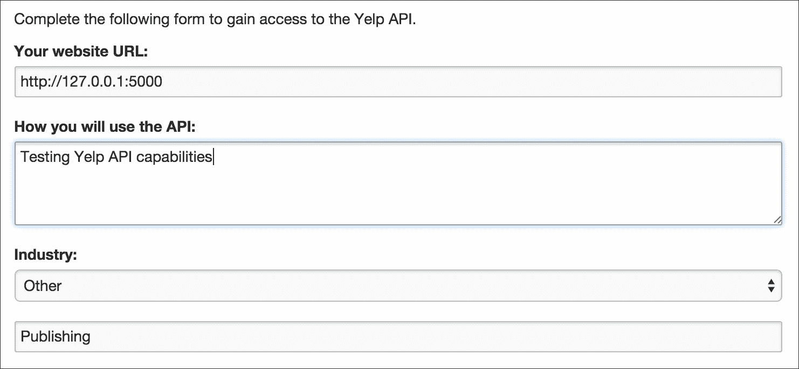

# 八、挖掘所有数据！

本章对现有的一些社交媒体 API 进行了展望。特别是，我们将讨论以下主题:

*   如何从 YouTube 上挖掘视频
*   如何从 GitHub 中挖掘开源项目
*   如何从 Yelp 中挖掘本地业务
*   如何使用请求库调用任何基于网络的应用编程接口
*   如何将您的请求调用打包到自定义客户端中

# 很多社交 API

前面的每一章都聚焦于近年来流行的特定社交媒体平台。幸运的是，故事还没有结束。许多平台提供社交网络功能，以及一个很好的应用编程接口来挖掘数据。另一方面，用详尽的例子和有趣的用例提供所有可能的 API 的全面描述将远远超出本书的范围。

为了提供思考的食粮，本章涉及社交媒体挖掘的两个方面。首先，我们将浏览一些有趣的 API，以便搜索或挖掘复杂的实体，如视频、开源项目或本地企业。其次，我们将讨论如果某个特定的应用编程接口没有一个好的 Python 客户端，该怎么办。

# 挖掘 YouTube 上的视频

YouTube([http://youtube.com](http://youtube.com))如今大概不需要太多介绍，是全球访问量最大的网站之一(2016 年 3 月在 Alexa 排名中排名第二)。视频分享服务的特点是内容广泛，事实上，它是由一系列不同的作者制作和分享的，从业余视频博主到大公司。YouTube 的注册用户可以上传、评价和评论视频。查看和共享不需要用户注册个人资料。

YouTube 在 2006 年被谷歌收购，所以今天他们是更大的谷歌平台的一部分。在[第五章](5.html "Chapter 5.  Topic Analysis on Google+")、*谷歌+* 话题分析、[第七章](7.html "Chapter 7.  Blogs, RSS, Wikipedia, and Natural Language Processing")、*博客、RSS、维基百科、自然语言处理*中，我们已经介绍了谷歌的其他服务，尤其是 Google+和 Blogger。YouTube 提供了三种不同的 API 来将您的应用程序与 YouTube 平台集成:YouTube 数据、YouTube 分析和 YouTube 报告。我们将重点关注第一个从 YouTube 检索和挖掘数据的网站，因为另外两个是为内容创作者量身定制的。

访问 YouTube Data API 的第一步和我们已经看到的非常相似，所以鼓励读者看一下[第五章](5.html "Chapter 5.  Topic Analysis on Google+")、*在 Google+* 上的话题分析，来完成访问 Google 开发者控制台([https://console.developers.google.com](https://console.developers.google.com))的程序。如果您已经在谷歌开发者控制台上注册了您的证书，您只需要启用 YouTube 数据应用编程接口，如图 8.1*所示:*


图 8.1:从谷歌开发者控制台启用 YouTube 数据应用编程接口

从谷歌开发者控制台的**凭证**选项卡，我们可以重用从[第 5 章](5.html "Chapter 5.  Topic Analysis on Google+")、*谷歌+* 主题分析中讨论的谷歌+项目中获得的 API 密钥。一旦凭据被整理出来，我们就可以将我们的谷歌应用编程接口密钥存储为环境变量:

```py
$ export GOOGLE_API_KEY="your-api-key"

```

我们还将重用用于其他谷歌服务的相同 Python 客户端，可以通过 CheeseShop 安装:

```py
$ pip install google-api-python-client

```

作为复习，我们将提醒用户，我们刚刚安装的包是以`googleapiclient`的形式提供的，但它也被简单地别名为`apiclient`(在代码示例中使用)。

使用配额制度对原料药进行限速。每个应用程序的每日上限为 1，000，000 台。对不同端点的不同调用将会有不同的配额成本，但是一百万个单位的速率限制远远超出了我们开始使用和实验该 API 所需要的。使用情况和配额可以在谷歌开发者控制台中看到。

与 YouTube 数据应用编程接口交互的第一个例子是通用搜索应用程序。`youtube_search_video.py`脚本实现了对`search.list`应用编程接口端点([https://developers.google.com/youtube/v3/docs/search/list](https://developers.google.com/youtube/v3/docs/search/list))的调用。对该端点的单次调用有 100 个单位的配额成本:

```py
# Chap08/youtube_search_video.py 
import os 
import json 
from argparse import ArgumentParser 
from apiclient.discovery import build 

def get_parser(): 
  parser = ArgumentParser() 
  parser.add_argument('--query') 
  parser.add_argument('--n', type=int, default=10) 
  return parser 

if __name__ == '__main__': 
  parser = get_parser() 
  args = parser.parse_args() 

  api_key = os.environ.get('GOOGLE_API_KEY') 
  service = build('youtube', 
                  'v3', 
                  developerKey=api_key) 

  search_feed = service.search() 
  search_query = search_feed.list(q=args.query, 
                                  part="id,snippet", 
                                  maxResults=args.n) 
  search_response = search_query.execute() 

  print(json.dumps(search_response, indent=4)) 

```

如前所述，该脚本使用`ArgumentParser`方法来解析命令行参数。`--query`参数允许我们为 API 调用传递查询字符串，而`--n`参数(可选，默认为`10`)用于定义我们想要检索的结果数量。

与 YouTube API 交互的核心由`service`对象处理，通过调用`apiclient.discovery.build()`函数来实例化，类似于我们为 Google+和 Blogger 所做的。这个函数的两个位置参数是服务名(`youtube`)和应用编程接口版本(`v3`)。第三个关键字参数是我们定义为环境变量的 API 关键字。实例化`service`对象后，我们可以调用其`search()`函数来构建搜索提要对象。这是允许我们调用`list()`函数的对象，定义了实际的 API 调用。

`list()`函数只接受基于关键字的参数。`q`参数是我们要传递给 API 的查询。`part`参数允许我们定义一个逗号分隔的属性列表，API 响应应该包括这些属性。最后，我们可以执行对应用编程接口的调用，这将产生一个响应对象(即 Python 字典)，为了简单起见，我们使用`json.dumps()`函数来打印它。

`search_response`字典有几个一级属性，如下所示:

*   `pageInfo`，包括`resultsPerPage`和`totalResults`
*   `items`:这是搜索结果列表
*   `kind`:这是结果对象的类型(本例中为`youtube#searchListResponse`)
*   `etag`
*   `regionCode`:这是两个字母的国家代码，例如`GB`
*   `nextPageToken`:这是一个构建对下一页结果调用的令牌

在`items`列表中，每一项都是一个搜索结果。我们有项目的标识(可以是视频、频道或播放列表)和包含几个细节的片段。

对于视频，一些有趣的细节包括:

*   `channelId`:这是视频创作者的 ID
*   `channelTitle`:这是视频创作者的名字
*   `title`:这是视频的标题
*   `description`:这是视频的文字描述
*   `publishedAt`:这是一个 ISO 8601 格式的日期字符串

可以扩展基本查询来定制搜索请求的结果。例如，来自`youtube_search_video.py`脚本的查询不仅检索视频，还检索播放列表或频道。如果我们想将结果限制在特定类型的对象上，我们可以使用`list()`函数中的`type`参数，该参数取一个可能的值:`video`、`playlist`和`channel`。此外，我们可以使用`order`属性影响结果的排序方式。该属性采用几个可接受的值之一:

*   `date`:这将按照相反的时间顺序对结果进行排序(最近的结果将排在第一位)
*   `rating`:这将从最高到最低评级对结果进行排序
*   `relevance`:这是根据结果与查询的相关性对结果进行排序的默认选项
*   `title`:这将按照标题的字母顺序对结果进行排序
*   `videoCount`:这将按上传视频的降序对频道进行排序
*   `viewCount`:这将从最高到最低的浏览量对视频进行排序

最后，我们还可以使用`publishedBefore`和`publishedAfter`参数将搜索限制在特定的出版日期范围内。

让我们考虑以下示例，以便将这些信息放在一起，并为搜索 API 端点构建一个自定义查询。假设我们有兴趣按照相关性的顺序检索 2016 年 1 月发布的视频。对`list()`函数的调用可以重构如下:

```py
search_query = search_feed.list( 
                                q=args.query, 
                                part="id,snippet", 
                                maxResults=args.n, 
                                type='video', 
                                publishedAfter='2016-01-01T00:00:00Z', 
                                publishedBefore='2016-02-01T00:00:00Z') 

```

`publishedAfter`和`publishedBefore`参数期望日期和时间根据 RFC 3339 进行格式化。

为了处理更多任意数量的搜索结果，我们需要实现分页机制。实现这一目标的最简单方法是将对搜索端点的调用包装到一个自定义函数中，该函数在不同的页面上迭代，直到达到所需的结果数量。

下面的类使用为视频搜索定制的方法实现了一个自定义的 YouTube 客户端:

```py
class YoutubeClient(object): 

  def __init__(self, api_key): 
    self.service = build('youtube', 
                         'v3', 
                         developerKey=api_key) 

  def search_video(self, query, n_results): 
    search = self.service.search() 
    request = search.list(q=query, 
                          part="id,snippet", 
                          maxResults=n_results, 
                          type='video') 
    all_results = [] 
    while request and len(all_results) <= n_results: 
      response = request.execute() 
      try: 
        for video in response['items']: 
          all_results.append(video) 
      except KeyError: 
        break 
      request = search.list_next(request, response) 
    return all_results[:n_results] 

```

初始化时，`YoutubeClient`类需要`api_key`，用于调用`apiclient.discovery.build()`方法和设置服务。

搜索逻辑的核心在`search_video()`方法中实现，该方法采用两个参数:查询和所需数量的结果。我们将首先像之前一样使用`list()`方法设置`request`对象。`while`循环检查`request`对象是否不是`None`，我们还没有达到结果数。查询的执行检索`response`对象中的结果，如前所述，该对象是一个字典。视频的数据列在`response['items']`中，附在`all_results`列表中。循环的最后一个操作是调用`list_next()`方法，该方法覆盖`request`对象，使其准备好检索下一页结果。

`YoutubeClient`类可以如下使用:

```py
# Chap08/youtube_search_video_pagination.py 
import os 
import json 
from argparse import ArgumentParser 
from apiclient.discovery import build 

def get_parser(): 
  parser = ArgumentParser() 
  parser.add_argument('--query') 
  parser.add_argument('--n', type=int, default=50) 
  parser.add_argument('--output') 
  return parser 

class YoutubeClient(object): 
  # as defined in the previous snippet 

if __name__ == '__main__': 
  parser = get_parser() 
  args = parser.parse_args() 

  api_key = os.environ.get('GOOGLE_API_KEY') 

  youtube = YoutubeClient(api_key) 
  videos = youtube.search_video(args.query, args.n) 

  with open(args.output, 'w') as f: 
    for video in videos: 
      f.write(json.dumps(video)+"\n") 

```

可以通过以下示例调用该脚本:

```py
$ python youtube_search_video_pagination.py \
 --query python \
 --n 50 \
 --output videos.jsonl

```

执行前面的命令将生成`videos.jsonl`文件，该文件包含与查询`python`相关的`50`视频的数据。该文件以 JSON Lines 格式保存，正如我们在前面所有章节中看到的那样。

本节展示了一些与 YouTube 数据应用编程接口交互的例子。这些模式与谷歌+和博客应用编程接口非常相似，因此一旦理解了谷歌服务的方法，就可以很容易地将其翻译成其他服务。

# 在 GitHub 上挖掘开源软件

GitHub([https://github.com](https://github.com))是 Git 存储库的托管服务。虽然私有存储库是付费计划的关键特性之一，但该服务以托管许多开源服务而闻名。除了 Git 的源代码管理功能之外，GitHub 还提供了一系列功能，使得开源项目的管理变得更加容易(例如，bug 跟踪、wikis、特性请求等等)。

### 型式

**源代码管理软件**

源代码控制系统(也称为版本控制或修订控制)是软件管理中最重要的工具之一，因为它跟踪开发中的软件是如何发展的。这一方面经常被新手或独立开发人员所忽视，但是在团队或独立完成复杂项目时，这一点至关重要。在这些优势中，有可能回滚不需要的更改(例如，存储和恢复软件的不同版本)，以及与团队成员的高效协作。Git 最初由 Linus Torvalds(Linux 的作者)开发，是最流行的版本控制工具之一。了解版本控制系统的基础知识对新手开发者、分析师和研究人员都是有益的。

GitHub 通过一个 API([https://developer.github.com/v3](https://developer.github.com/v3))提供对他们数据的访问，使用的是在他们的平台上注册一个应用的通用机制。只有在访问仅对经过身份验证的用户可用的私有信息时，才需要应用程序身份验证。

API 有一些严格的速率限制。未经身份验证的呼叫被限制在每小时 60 个，这是一个相当低的数字。实施身份验证后，该限制升级为每小时 5，000 次。搜索应用编程接口也有自定义速率限制规则(如果未经身份验证，每分钟 10 个请求，如果经过身份验证，每分钟 30 个请求)。身份验证可以通过以下三种不同的方式执行:

*   基本用户名/密码验证
*   oauth 2 记号
*   通过 Oauth2 客户端标识和客户端密码

基本身份验证需要将实际的用户名和密码发送到由 HTTP 标准定义的应用编程接口端点。另一方面，通过 Oauth2 令牌进行身份验证需要以编程方式获取令牌([https://developer . github . com/v3/oauth _ authorizations/# create-a-new-authorization](https://developer.github.com/v3/oauth_authorizations/#create-a-new-authorization))，然后通过标头或 URL 参数将其发送到 API 端点。最后一个选项是将客户端标识和客户端密码传递给应用编程接口。这些细节可以通过在 GitHub 平台([https://github.com/settings/applications/new](https://github.com/settings/applications/new))注册应用程序获得。*图 8.2* 显示了创建新申请的登记表:


图 8.2:在 GitHub 中注册一个新应用程序

注册应用程序后，我们可以将凭据存储为环境变量:

```py
$ export GITHUB_CLIENT_ID="your-client-id"
$ export GITHUB_CLIENT_SECRET="your-client-secret"

```

现在一切都设置好了，我们准备好与 GitHub API 交互了。有几个 Python 库可以作为客户端，都是第三方的，也就是 GitHub 不正式支持([https://developer.github.com/libraries](https://developer.github.com/libraries))。我们在本节中为示例选择的库是 PyGithub([https://github.com/PyGithub/PyGithub](https://github.com/PyGithub/PyGithub)，但是如果读者愿意，我们鼓励他们测试其他库。

要从我们的虚拟环境安装库，请使用以下命令:

```py
$ pip install PyGithub

```

以下脚本可用于查找特定的用户名，以便获得关于其配置文件和 GitHub 存储库的一些基本信息:

```py
# Chap08/github_get_user.py 
import os 
from argparse import ArgumentParser 
from github import Github 
from github.GithubException import UnknownObjectException 

def get_parser(): 
  parser = ArgumentParser() 
  parser.add_argument('--user') 
  parser.add_argument('--get-repos', action='store_true',  
                      default=False) 
  return parser 

if __name__ == '__main__': 
  parser = get_parser() 
  args = parser.parse_args() 
  client_id = os.environ['GITHUB_CLIENT_ID'] 
  client_secret = os.environ['GITHUB_CLIENT_SECRET'] 

  g = Github(client_id=client_id, client_secret=client_secret) 

  try: 
    user = g.get_user(args.user) 
    print("Username: {}".format(args.user)) 
    print("Full name: {}".format(user.name)) 
    print("Location: {}".format(user.location)) 
    print("Number of repos: {}".format(user.public_repos)) 
    if args.get_repos: 
      repos = user.get_repos() 
      for repo in repos: 
        print("Repo: {} ({} stars)".format(repo.name,  
              repo.stargazers_count)) 
  except UnknownObjectException: 
    print("User not found") 

```

该脚本使用`ArgumentParser`从命令行捕获参数:`--user`用于传递要搜索的用户名，而可选的`--get-repos`参数是一个布尔标志，表示我们是否希望在输出中包含用户存储库的列表(请注意，为了简单起见，不包含分页)。

可以使用以下命令运行该脚本:

```py
$ python github_get_user.py --user bonzanini --get-repos

```

这将产生以下输出:

```py
Username: bonzanini 
Full name: Marco Bonzanini 
Location: London, UK 
Number of repos: 9 
Repo: bonzanini.github.io (1 stars) 
Repo: Book-SocialMediaMiningPython (3 stars) 
# more repositories ...

```

`Github.get_user()`函数假设我们已经知道我们正在寻找的确切用户名。

下表列出了用户对象的一些最有趣的属性:

<colgroup><col> <col></colgroup> 
| **属性名称** | **描述** |
| `avatar_url` | 这是头像图片的网址 |
| `bio` | 这是用户的简短传记 |
| `blog` | 这是用户的博客 |
| `company` | 这是用户的公司 |
| `created_at` | 这是配置文件的创建日期 |
| `email` | 这是用户的电子邮件 |
| `followers` | 这是用户的追随者数量 |
| `followers_url` | 这是检索用户关注者列表的网址 |
| `following` | 这是用户遵循的配置文件数量 |
| `following_url` | 这是检索用户使用的配置文件列表的网址 |
| `location` | 这是用户的地理位置 |
| `login` | 这是登录名 |
| `name` | 这是全名 |
| `public_repos` | 这是公共存储库的数量 |
| `public_gists` | 这是公共 gists 的数量 |
| `repos_url` | 这是检索存储库的网址 |

使用精确的用户名检索用户配置文件后，我们可以查看搜索用户的选项。GitHub API 提供了一个由`Github.search_users()`函数访问的端点，它允许我们指定一个查询和一些排序和排序参数。以下脚本实现了搜索:

```py
# Chap08/github_search_user.py 
import os 
from argparse import ArgumentParser 
from argparse import ArgumentTypeError 
from github import Github 

def get_parser(): 
  parser = ArgumentParser() 
  parser.add_argument('--query') 
  parser.add_argument('--sort', 
                      default='followers', 
                      type=check_sort_value) 
  parser.add_argument('--order', 
                      default='desc', 
                      type=check_order_value) 
  parser.add_argument('--n', default=5, type=int) 
  return parser 

def check_sort_value(value): 
  valid_sort_values = ['followers', 'joined', 'repositories'] 
  if value not in valid_sort_values: 
     raise ArgumentTypeError('"{}" is an invalid value for  
                             "sort"'.format(value)) 
  return value 

def check_order_value(value): 
  valid_order_values = ['asc', 'desc'] 
  if value not in valid_order_values: 
     raise ArgumentTypeError('"{}" is an invalid value for  
                             "order"'.format(value)) 
  return value 

if __name__ == '__main__': 
  parser = get_parser() 
  args = parser.parse_args() 
  client_id = os.environ['GITHUB_CLIENT_ID'] 
  client_secret = os.environ['GITHUB_CLIENT_SECRET'] 

  g = Github(client_id=client_id, client_secret=client_secret) 

  users = g.search_users(args.query, 
                         sort=args.sort, 
                         order=args.order) 
  for i, u in enumerate(users[:args.n]): 
    print("{}) {} ({}) with {} repos ".format(i+1, u.login,  
          u.name, u.public_repos)) 

```

脚本使用`ArgumentParser`从命令行解析参数。搜索查询可以通过`--query`选项传递。该应用编程接口还接受两个参数，允许定制排序和排序。作为`--sort`和`--order`参数实现的这两个值只接受特定的值，因此我们必须为它们中的每一个指定特定的类型。更准确地说，`check_sort_value()`和`check_order_value()`助手函数实现了以下逻辑:如果给定值是有效的，它将被返回并传递给应用编程接口，否则将引发`ArgumentTypeError`异常。最后，`ArgumentParser`还接受一个`--n`参数来指定所需的结果数量(默认为`5`)。

可以使用以下命令运行该脚本:

```py
$ python github_search_user.py \ 
  --query [your query here] \ 
  --sort followers \ 
  --order desc

```

输出是五个(默认)最受欢迎用户的列表，也就是说，拥有最多关注者的用户。

可以实现一个非常类似的脚本来搜索流行的存储库。实现如以下脚本所示:

```py
# Chap08/github_search_repos.py 
import os 
from argparse import ArgumentParser 
from argparse import ArgumentTypeError 
from github import Github 

def get_parser(): 
  parser = ArgumentParser() 
  parser.add_argument('--query') 
  parser.add_argument('--sort', 
                      default='stars', 
                      type=check_sort_value) 
  parser.add_argument('--order', 
                      default='desc', 
                      type=check_order_value) 
  parser.add_argument('--n', default=5, type=int) 
  return parser 

def check_sort_value(value): 
  valid_sort_values = ['stars', 'forks', 'updated'] 
  if value not in valid_sort_values: 
     raise ArgumentTypeError('"{}" is an invalid value for  
                             "sort"'.format(value)) 
  return value 

def check_order_value(value): 
  valid_order_values = ['asc', 'desc'] 
  if value not in valid_order_values: 
     raise ArgumentTypeError('"{}" is an invalid value for  
                             "order"'.format(value)) 
  return value 

if __name__ == '__main__': 
  parser = get_parser() 
  args = parser.parse_args() 
  client_id = os.environ['GITHUB_CLIENT_ID'] 
  client_secret = os.environ['GITHUB_CLIENT_SECRET'] 

  g = Github(client_id=client_id, client_secret=client_secret) 

  repos = g.search_repositories(args.query, 
                                sort=args.sort, 
                                order=args.order) 
  for i, r in enumerate(repos[:args.n]): 
    print("{}) {} by {} ({} stars)".format(i+1, r.name,  
          r.owner.name, r.stargazers_count)) 

```

`github_search_repos.py`脚本与前一个非常相似，因为它也使用了带有自定义类型的`ArgumentParser`来解析`--sort`和`--order`参数。为了搜索存储库，它使用`Github.search_repositories()`方法，该方法接受一个查询和一些基于关键字的参数。

可以使用以下命令运行该脚本:

```py
$ python github_search_repos.py \
 --query python \
 --sort stars \
 --order desc

```

`python`查询发布了一些有趣的结果:

```py
1) oh-my-zsh by Robby Russell (36163 stars) 
2) jQuery-File-Upload by Sebastian Tschan (23381 stars) 
3) awesome-python by Vinta (20093 stars) 
4) requests by Kenneth Reitz (18616 stars) 
5) scrapy by Scrapy project (13652 stars)

```

虽然列表中有一些流行的 Python 项目(例如**请求**和 Scrapy 库)，但前两个结果似乎与 Python 无关。这是因为默认情况下调用搜索 API 会针对标题/描述字段发出查询，所以这个特定的调用捕获了一些在其描述中提到关键字`python`的存储库，但是它们并没有在 Python 中实现。

我们可以重构搜索，以便只检索用特定语言编写的存储库，这些存储库使用该语言作为主要语言。唯一需要更改的代码是使用`language`限定符调用`Github.search_repositories()`，如下所示:

```py
repos = g.search_repositories("language:{}".format(args.query), 
                              sort=args.sort, 
                              order=args.order) 

```

在查询中做了这一微小的更改后，结果看起来大不相同:

```py
1) httpie by Jakub RoztoÄil (22130 stars) 
2) awesome-python by Vinta (20093 stars) 
3) thef*** by Vladimir Iakovlev (19868 stars) 
4) flask by The Pallets Projects (19824 stars) 
5) django by Django (19044 stars)

```

此时，所有的结果都是主要用 Python 实现的项目。

下表总结了存储库对象的主要属性:

<colgroup><col> <col></colgroup> 
| **属性名称** | **描述** |
| `name` | 这是出现在 URL 中的回购的名称 |
| `full_name` | 这是回购的完整名称(即`user_name` / `repo_name`) |
| `owner` | 这是代表拥有项目的用户的对象 |
| `id` | 这是回购的数字标识 |
| `stargazers_count` | 这是观星者的数量 |
| `description` | 这是对回购的文字描述 |
| `created_at` | 这是创造时间的`datetime`对象 |
| `updated_at` | 这是上次更新的`datetime`对象 |
| `open_issues_count` | 这是未解决问题的数量 |
| `language` | 这是回购的主要语言 |
| `languages_url` | 这是检索其他语言信息的网址 |
| `homepage` | 这是项目主页的网址 |

有许多关于特定存储库的属性和细节。原料药的文件([https://developer.github.com/v3/repos](https://developer.github.com/v3/repos))提供了详尽的描述。

本节展示了一些从 GitHub API 中检索数据的例子。潜在的应用包括通过提取最常用的编程语言来理解编程语言的分析，例如，用特定语言编写的项目的最高数量、每种语言最活跃的项目、在给定时间范围内打开的问题的最高数量等等。

# 在 Yelp 上挖掘当地企业

Yelp 是一项在线服务，提供针对当地企业的众包评论，如酒吧和餐馆([https://www.yelp.com](https://www.yelp.com))。月访问量 1.35 亿，内容以社区驱动为主。

Yelp 提供了三个 API，可用于搜索本地企业的数据并与之交互。这三个应用编程接口根据其用途进行分组。搜索应用编程接口是基于关键词的搜索的入口点。业务应用编程接口用于查找特定业务的信息。电话搜索应用编程接口用于通过电话号码搜索业务。

Yelp API 的速率限制为每天 25，000 次调用。

本节描述了设置应用程序的基本步骤，该应用程序在 Yelp 数据库中搜索特定的关键字。

对 API 的访问受令牌保护。在 Yelp 上注册帐户后，访问任何 API 的第一步是在开发者网站([https://www.yelp.com/developers](https://www.yelp.com/developers))上获取令牌。*图 8.3* 显示了我们访问 API 需要填写的表单。在本例中，**您的网站网址**字段指向本地主机:



图 8.3:对 Yelp 应用编程接口的访问

完成第一步后，我们将获得四个不同的访问密钥。这些字符串应该受到保护，永远不要共享。访问密钥被称为消费者密钥、消费者秘密、令牌和令牌秘密。这些字符串用于调用应用编程接口之前必需的 OAuth 身份验证过程。

按照整本书使用的约定，我们可以将这些配置细节存储为环境变量:

```py
$ export YELP_CONSUMER_KEY="your-consumer-key"
$ export YELP_CONSUMER_SECRET="your-consumer-secret"
$ export YELP_TOKEN="your-token"
$ export YELP_TOKEN_SECRET="your-token-secret"

```

为了以编程方式访问该应用编程接口，我们需要安装官方 Python 客户端。在我们的虚拟环境中，使用以下命令:

```py
$ pip install yelp

```

下面的脚本`yelp_client.py`定义了一个函数，我们将使用它来设置对 API 的调用:

```py
# Chap08/yelp_client.py 
import os 
from yelp.client import Client 
from yelp.oauth1_authenticator import Oauth1Authenticator 

def get_yelp_client(): 
  auth = Oauth1Authenticator( 
    consumer_key=os.environ['YELP_CONSUMER_KEY'],
    consumer_secret=os.environ['YELP_CONSUMER_SECRET'],
    token=os.environ['YELP_TOKEN'],
    token_secret=os.environ['YELP_TOKEN_SECRET']
    )

  client = Client(auth)
  return client
```

一旦一切就绪，我们就可以开始寻找本地企业了。`yelp_search_business.py`脚本使用提供的位置和关键字调用搜索应用编程接口:

```py
# Chap08/yelp_search_business.py 
from argparse import ArgumentParser 
from yelp_client import get_yelp_client 

def get_parser(): 
  parser = ArgumentParser() 
  parser.add_argument('--location') 
  parser.add_argument('--search') 
  parser.add_argument('--language', default='en') 
  return parser 

if __name__ == '__main__': 
  client = get_yelp_client() 
  parser = get_parser() 
  args = parser.parse_args() 

  params = { 
    'term': args.search, 
    'lang': args.language, 
    'limit': 20, 
    'sort': 2 
  } 

  response = client.search(args.location, **params) 
  for business in response.businesses: 
    address = ', '.join(business.location.address) 
    categories = ', '.join([cat[0] for cat in  
                           business.categories]) 
    print("{} ({}, {}); rated {}; categories  
          {}".format(business.name, 
          address, 
          business.location.postal_code, 
          business.rating, 
          categories)) 

```

一个`ArgumentParser`对象用于解析通过命令行传递的参数。特别是，两个参数是强制性的:`--location`，它是城市或当地社区的名称，以及`--search`，它允许我们为搜索传递特定的关键词。还可以提供可选的`--language`参数来指定输出的期望语言(尤其是评论)。这个参数的值必须是一个语言代码(例如，英语的`en`、法语的`fr`、德语的`de`等等)。我们还将提供另外两个可选参数。`--limit`参数是我们想要的结果数量(默认为 20)，而`--sort`参数定义了结果的排序方式(0 表示最佳匹配，1 表示距离，2 表示最高评分)。

在脚本的主要部分，我们将设置 Yelp 客户端和解析器。然后，我们将定义一个传递给 Yelp 客户端的参数字典。这些参数包括通过命令行定义的参数。

可以使用以下命令调用该脚本:

```py
$ python yelp_search_business.py \
 --location London \
 --search breakfast \
 --limit 5

```

输出是打印在控制台上的本地企业列表(本例中为五家):

```py
Friends of Ours (61 Pitfield Street, N1 6BU); rated 4.5; categories Cafes, Breakfast & Brunch, Coffee & Tea 
Maison D'être (154 Canonbury Road, N1 2UP); rated 4.5; categories Coffee & Tea, Breakfast & Brunch 
Dishoom (5 Stable Street, N1C 4AB); rated 4.5; categories Indian, Breakfast & Brunch 
E Pellicci (332 Bethnal Green Road, E2 0AG); rated 4.5; categories Italian, Cafes, Breakfast & Brunch 
Alchemy (8 Ludgate Broadway, EC4V 6DU); rated 4.5; categories Coffee & Tea, Cafes

```

当搜索多个关键字时，查询必须用双引号括起来，以便能够正确解释，如下所示:

```py
$ python yelp_search_business.py \
 --location "San Francisco" \
 --search "craft beer" \
 --limit 5

```

API 返回的`location`对象有几个属性。下表总结了最有趣的问题:

<colgroup><col> <col></colgroup> 
| **属性名称** | **描述** |
| `id` | 这是业务标识符 |
| `name` | 这是企业名称 |
| `image_url` | 这是企业照片的网址 |
| `is_claimed` | 这是一个布尔属性，它通知我们企业所有者是否已经声明了该页面 |
| `is_closed` | 这是一个布尔属性，告知我们企业是否已经永久关闭 |
| `url` | 这是企业的 Yelp 网址 |
| `mobile_url` | 这是企业的 Yelp 手机网址 |
| `phone` | 这是带有国际格式电话号码的字符串 |
| `display_phone` | 这是带有电话号码格式的字符串，用于显示 |
| `categories` | 这是与业务相关的类别列表。每个类别都是一个元组`(display_name, filter_name)`，其中第一个名称可用于表示，第二个名称可用于过滤查询 |
| `review_count` | 这是该业务的评论数量 |
| `rating` | 这是企业的评级，四舍五入(例如，1，1.5...4.5, 5) |
| `snippet_text` | 这是对企业的简短描述 |
| `snippet_image_url` | 这是与业务相关的代码片段图像的 URL |
| `location` | 这是与业务相关的`location`对象 |

`location`对象提供以下属性:

*   `address (list)`，仅包含地址字段
*   `display_address (list)`，格式为显示，包括十字街道、城市、州代码等
*   `city (string)`
*   `state_code (string)`，ISO 3166-2 州的商业代码
*   `postal_code (string)`
*   `country_code (string)`，该业务的 ISO 3166-1 国家代码
*   `cross_streets (string)`，十字街头的商业(美国)
*   `neighborhoods (list)`、小区信息为业务
*   `coordinates.latitude (number)`
*   `coordinates.longitude (number)`

除了搜索应用编程接口之外，Yelp 还提供了一个业务应用编程接口，专门用于检索给定业务的信息。该应用编程接口假设您已经有了该业务的特定标识。

以下脚本显示了如何使用 Python 客户端访问业务应用编程接口:

```py
# Chap08/yelp_get_business.py 
from argparse import ArgumentParser 
from yelp_client import get_yelp_client 

def get_parser(): 
  parser = ArgumentParser() 
  parser.add_argument('--id') 
  parser.add_argument('--language', default='en') 
  return parser 

if __name__ == '__main__': 
  client = get_yelp_client() 
  parser = get_parser() 
  args = parser.parse_args() 

  params = { 
    'lang': args.language 
  } 

  response = client.get_business(args.id, **params) 
  business = response.business 
  print("Review count: {}".format(business.review_count)) 
  for review in business.reviews: 
    print("{} (by {})".format(review.excerpt, review.user.name)) 

```

业务应用编程接口的一个主要限制是没有完整地提供给定业务的评审列表。事实上，只给出了一个评论。这个单独的审查是业务应用编程接口提供的唯一一个搜索应用编程接口没有显示的附加信息，因此在这种情况下没有太多的数据挖掘空间。

有趣的是，Yelp 为学术研究提供了一个数据集，该数据集会不时更新和丰富([https://www.yelp.com/dataset_challenge](https://www.yelp.com/dataset_challenge))。数据集包括关于企业、用户、评论、图片和用户之间联系的详细信息。这些数据通常可用于自然语言处理、图形挖掘和机器学习的应用。数据集还与一项挑战相关，即学生因其提交的技术质量而获得奖励。

# 构建自定义 Python 客户端

在整本书中，我们通过 Python 库访问了不同的社交媒体平台，这些平台要么由社交媒体服务器本身正式支持，要么由第三方提供。

这一部分回答了这个问题:如果他们没有为他们的应用编程接口提供 Python 客户端(也没有非官方的库)会怎么样？

## HTTP 做得简单

为了实现对所需应用编程接口的调用，推荐的简单 HTTP 交互库是**请求**。在我们的虚拟环境中，使用以下命令:

```py
$ pip install requests

```

请求库提供了一个简单的接口来执行 HTTP 调用。为了测试这个库，我们将为`httpbin.org`服务实现一个简单的客户端，这是一个网络服务，提供基本的请求/响应交互，非常适合我们的教育目的。

`httpbin.org`网页([http://httpbin.org/](http://httpbin.org/))解释了各种端点及其含义。为了展示请求库的使用，我们将实现一个`HttpBinClient`类，该类具有调用一些基本端点的方法:

```py
class HttpBinClient(object): 

  base_url = 'http://httpbin.org' 

  def get_ip(self): 
    response = requests.get("{}/ip".format(self.base_url)) 
    my_ip = response.json()['origin'] 
    return my_ip 

  def get_user_agent(self): 
    response = requests.get("{}/user-agent".format(self.base_url)) 
    user_agent = response.json()['user-agent'] 
    return user_agent 

  def get_headers(self): 
    response = requests.get("{}/headers".format(self.base_url)) 
    headers = HeadersModel(response.json()) 
    return headers 

```

客户端有一个`base_url`类变量，用来存储要调用的基础 URL。`get_ip()`、`get_user_agent()`和`get_headers()`方法的实现分别调用`/ip`、`/user-agent`和`/headers`端点，使用`base_url`变量构建完整的网址。

对于这三种方法，与请求库的交互非常相似。使用`requests.get()`调用端点，向端点发送 HTTP GET 请求并返回响应对象。这个对象有一些属性，如`status_code`(存储响应状态)和`text`(存储原始响应数据)，以及我们将用来将 JSON 响应加载到字典中的`json()`方法。

虽然 IP 和用户代理是简单的字符串，但是 headers 对象有点复杂，因为有几个属性。因此，响应被包装到一个自定义的`HeadersModel`对象中，定义如下:

```py
class HeadersModel(object): 

  def __init__(self, data): 
    self.host = data['headers']['Host'] 
    self.user_agent = data['headers']['User-Agent'] 
    self.accept = data['headers']['Accept'] 

```

如果我们将前面的类保存在一个名为`httpbin_client.py`的文件中，我们可以使用示例应用程序中的自定义客户端，如下所示:

```py
>>> from httpbin_client import HttpBinClient 
>>> client = HttpBinClient() 
>>> print(client.get_user_agent()) 
python-requests/2.8.1 
>>> h = client.get_headers() 
>>> print(h.host) 
httpbin.org

```

网络应用编程接口的简单性和所提出的例子不应该误导读者认为我们只是给一个简单的任务增加了一层复杂性。事实上，我们可以使用请求库直接与应用程序中的 web API 进行交互。一方面，对于这个特定的例子来说，这可能是真的，但另一方面，社交媒体 API 在本质上是极其动态的。添加新的端点，更改响应格式，并不断开发新功能。例如，[第 4 章](4.html "Chapter 4.  Posts, Pages, and User Interactions on Facebook")、*脸书*上的帖子、页面和用户交互被起草后，脸书引入了新的 reactions 功能，这也引发了他们 API 响应的变化。

换句话说，定制的 Python 客户机增加了一层抽象，使我们能够专注于客户机的接口，而不是 web API。从应用的角度来看，我们会重点调用客户端的方法，比如`HttpBinClient.get_headers()`，隐藏`/headers` API 端点如何在这样的方法内部发送响应的细节。如果来自网络应用编程接口的响应格式将来会发生变化，我们所需要做的就是更新客户端以反映新的变化，但是由于这种额外的抽象层，我们所有与网络应用编程接口交互的应用程序都不会受到影响。

`httpbin.org`服务实际上并不复杂，因此社交媒体 API 客户端的真正实现可能并不那么简单，但总而言之，这就是它的要点:用抽象层隐藏实现细节。这是我们到目前为止采用的所有 Python 客户端都在做的事情。

### 型式

**HTTP 状态码**

为了更好地理解 HTTP 交互是如何工作的，我们必须提到响应状态代码的重要性。在底层，来自 HTTP 服务器的每个响应都以一个数字状态代码打开，后面跟一个描述状态代码背后动机的原因短语。例如，当我们将浏览器指向一个特定的网址时，网络服务器可以回复一个状态代码`200`，后跟原因短语`OK`。然后，响应包括我们请求的实际网页，浏览器可以显示该网页。网络服务器的另一个选择是用状态代码`404`来响应，后面跟着原因短语`Not Found`。浏览器可以理解这个响应，并向用户显示适当的错误消息。

Web APIs 与前面描述的简单交互没有什么不同。根据请求，服务器可以发送成功的响应(状态代码`2xx`)或错误(客户端错误的状态代码`4xx`，服务器错误的状态代码`5xx`)。客户端实现应该能够正确地解释网络应用编程接口提供的不同状态代码，并做出相应的行为。还值得一提的是，一些服务引入了非标准的状态码，比如推特的错误码`420`、*增强你的冷静*，当客户端发送太多请求时使用，必须有速率限制。

状态代码及其含义的完整列表可在[https://en.wikipedia.org/wiki/List_of_HTTP_status_codes](https://en.wikipedia.org/wiki/List_of_HTTP_status_codes)获得，并附有简化说明，但正式文件包含在相应的 RFC 文件中。

考虑到开源库的可用性，从零开始实现客户端的需求在今天应该是相当罕见的。如果是这种情况，读者现在应该准备开始了。

# 总结

本章讨论了在社交媒体上挖掘数据的更多选项。除了通常流行的社交网络，如推特、脸书和谷歌+，许多其他平台也提供访问其数据的应用编程接口。

当 Python 客户端不可用于特定平台时，我们可以实现一个定制客户端，利用请求库的简单性。定制客户端的实现起初似乎增加了不必要的复杂性，但它提供了一个重要的抽象层，从长远来看，这在设计方面是有回报的。

除了定制客户端实现的说明之外，我们还研究了一些其他流行的服务来挖掘复杂的对象。我们从 YouTube 上检索了关于视频的数据，从 GitHub 上检索了开源项目的数据，从 Yelp 上检索了餐馆等本地企业的数据。

在这本书里，还有很多社交媒体平台没有被探索，因为提供一个全面的讨论是不现实的，但我希望读者能很好地体会到存在的许多可能性。

下一章是这本书的最后一章。它提供了一个关于语义网的讨论，并为读者理解语义标记数据的重要性提供了一个前景。