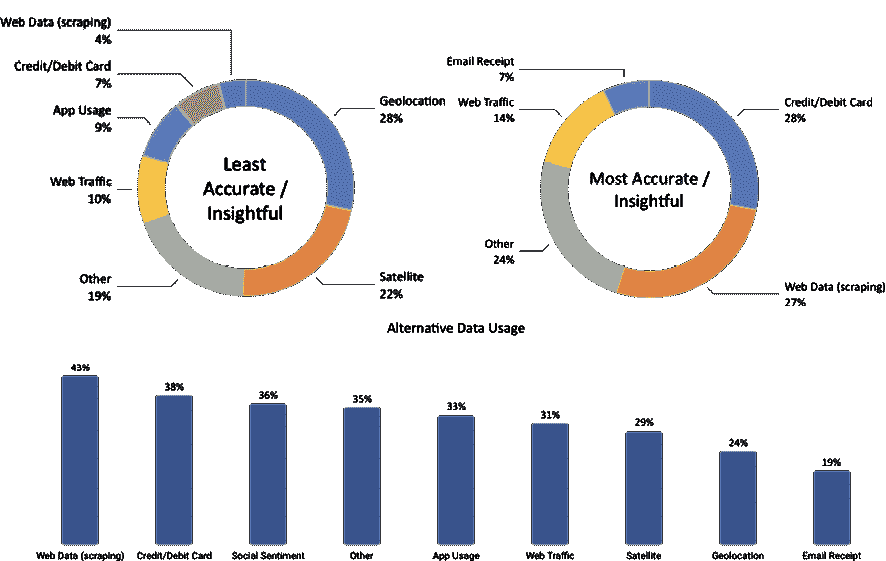
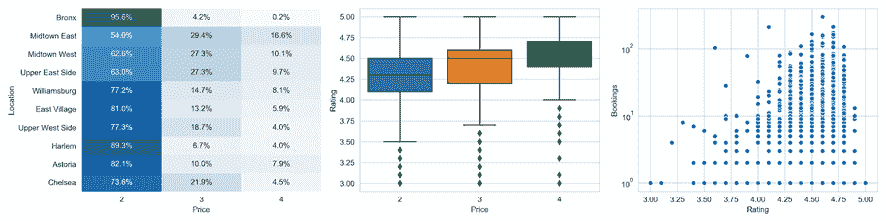

# 三、金融备选数据——类别和用例

上一章介绍了如何处理市场和基础数据，这些数据一直是交易策略的传统驱动因子。在本章中，我们将快进到最近出现的一系列更加多样化的数据源，作为自由裁量和算法策略的燃料。它们的异质性和新颖性激发了备选数据的标签，并创造了一个快速增长的提供商和服务行业。

在这一趋势背后有一个熟悉的故事：在互联网和移动网络爆炸性增长的推动下，随着处理、存储和分析新数据源技术的进步，数字数据继续呈指数级增长。反过来，更为多样化的数字数据的可用性和管理能力的指数级增长已经成为推动跨行业创新的**机器学习**（**ML**）显著性能改进背后的关键力量，包括投资行业。

数据革命的规模非同寻常：仅在过去两年中，当今世界上 90%的数据都被创造出来了，到 2020 年，全球 77 亿人口中的每一个人预计每天每秒产生 170 万条新信息。另一方面，早在 2012 年，只有 0.5%的数据被分析和使用，而到 2020 年，33%的数据被认为有价值。数据可用性和使用率之间的差距可能会很快缩小，因为到 2020 年，全球分析投资将超过 2100 亿美元，而创造价值的潜力将高出数倍。

本章介绍个人、业务流程和传感器如何生成**备选数据**。它还提供了一个框架，用于导航和评估用于投资目的的备选数据的激增供应。它演示了从获取到预处理和存储的工作流，使用 Python 处理通过 web 抓取获得的数据，为 ML 的应用奠定基础。最后，它提供了源、提供者和应用程序的示例。

本章将涵盖以下主题：

*   备选数据革命释放了哪些新的信息来源
*   个人、业务流程和传感器如何生成备选数据
*   评估用于算法交易的备选数据的新兴供应
*   在 Python 中使用备选数据，例如通过删除 internet
*   备选数据的重要类别和提供者

您可以在 GitHub 存储库的相应目录中找到本章的代码示例以及指向其他资源的链接。笔记本电脑包括图像的彩色版本。

# 另类数据革命

由数字化、网络化和急剧下降的存储成本驱动的数据洪流已经导致可用于预测分析的信息性质发生了深刻的质的变化，通常概括为以下五个方面：

*   **卷**：生成、收集和存储的数据量比线上和线下活动、交易、记录和其他来源的副产品大几个数量级。随着分析和存储容量的增加，卷继续增长。
*   **速度**：生成、传输和处理数据，使其接近或以实时速度可用。
*   **种类**：数据的组织格式不再局限于结构化的表格形式，如 CSV 文件或关系数据库表。相反，新的源生成半结构化格式，如 JSON 或 HTML，以及非结构化内容，包括原始文本“图像”？以及音频或视频数据，这给呈现适合 ML 算法的数据带来了新的挑战。
*   **准确性**：来源和格式的多样性使得验证数据信息内容的可靠性变得更加困难。
*   **值**：确定新数据集的值可能比以前耗费更多的时间和资源，也更不确定。

对于算法交易，如果新数据源能够访问传统数据源无法访问的信息，或者能够更快地访问，那么新数据源将提供信息优势。随着全球趋势的发展，投资行业正在迅速扩展，从市场和基础数据扩展到其他来源，以通过信息优势获取 alpha。到 2020 年，数据、技术能力和相关人才的年度支出预计将从目前的 30 亿美元每年增加 12.8%。

如今，投资者可以实时访问宏观或公司特定数据，而从历史上看，这些数据的可用频率要低得多。新数据源的用例包括以下内容：

*   **代表性商品和服务的在线价格数据**可用于衡量通货膨胀。
*   **店铺访问或购买**的数量允许实时估计公司或行业特定的销售或经济活动。
*   **卫星图像**可以在其他地方获得该信息之前，揭示农业产量、矿山或石油钻塔的活动。

随着大数据集标准化和采用的推进，传统数据中包含的信息可能会失去大部分预测价值。

此外，处理和集成不同数据集以及应用 ML 的能力允许进行复杂的洞察。在过去，定量方法依赖于简单的启发式方法，使用历史数据对公司进行排名，以获得价格与账面比率等指标，而 ML 算法综合新的指标，学习和调整这些规则，同时考虑不断变化的市场数据。这些见解为捕捉价值、势头、质量和情感等经典投资主题创造了新的机会：

*   **动量**：ML 可以识别资产对市场价格变动、行业情感或经济因子的风险敞口。
*   **价值**：算法可以分析金融报表之外的大量经济和行业特定的结构化和非结构化数据，以预测公司的内在价值。
*   **质量**：综合数据的复杂分析允许对客户或员工评论、电子商务或应用程序流量进行评估，以确定市场份额的收益或其他潜在收益质量驱动因子。
*   **情感**：对新闻和社交媒体内容的实时处理和解读，使 ML 算法既能快速检测到新出现的情感，又能将来自不同来源的信息合成为更连贯的大图。

然而，在实践中，包含有价值信号的数据通常不是免费提供的，通常是出于交易以外的目的而产生的。因此，备选数据集需要彻底的评估、昂贵的采集、仔细的管理和复杂的分析来提取可交易的信号。

# 备选数据的来源

备选数据集由许多来源生成，但可在较高级别上分类为主要由以下来源生成：

*   **在社交媒体上发布、评论产品或使用搜索引擎的个人**
*   **记录商业交易（特别是信用卡支付）或作为中介捕获供应链活动的企业**
*   **传感器**通过卫星或安全摄像头的图像，或通过移动模式（如手机发射塔）捕捉经济活动

随着新数据源的出现，以及以前标记为“替代”的数据源成为主流的一部分，备选数据的性质继续快速发展。例如，**波罗的海干散货运价指数**（**BDI**）汇集了数百家航运公司的数据，以估算干散货船的供需情况，现已在彭博码头发布。

备选数据包括原始数据以及聚合或以某种形式处理以增加价值的数据。例如，一些提供商的目标是提取可交易的信号，如情感分数。我们将在*第 4 章*、*金融特征工程——如何研究阿尔法因子*中介绍各种类型的提供商。

备选数据源在决定算法交易策略的价值或信号内容的关键方面有所不同。我们将在下一节中讨论这些方面，然后查看本节中的主要来源。

## 个人

个人通过在线活动以及离线活动自动创建电子数据，因为后者是通过电子方式捕获的，并且通常与在线身份相关。个人生成的数据通常是非结构化的文本、图像或视频格式，通过多个平台传播，包括：

*   社交媒体帖子，如 Twitter、Facebook 或 LinkedIn 等通用网站上的意见或反应，或 Glassdoor 或 Yelp 等商业评论网站上的意见或反应
*   反映对亚马逊或 Wayfair 等网站上产品的兴趣或看法的电子商务活动
*   使用 Google 或 Bing 等平台的搜索引擎活动
*   移动应用的使用、下载和评论
*   个人数据，如消息传递流量

社交媒体情感分析已经变得非常流行，因为它可以应用于单个股票、行业篮子或市场指数。最常见的来源是 Twitter，其次是各种新闻供应商和博客网站。供应是有竞争力的，而且价格更低，因为它通常是通过日益商品化的网络抓取获得的。考虑到最近消费者大规模采用这些工具的情况，包括博客、推特或视频在内的可靠社交媒体数据集的历史通常不到 5 年。相比之下，搜索历史记录从 2004 年开始提供。

## 业务流程

企业和公共实体产生并收集许多有价值的备选数据源。业务流程产生的数据通常比个人产生的数据具有更多的结构。它是一个非常有效的活动领先指标，否则可在一个低得多的频率。

业务流程生成的数据包括：

*   支付卡交易数据可能可从加工商和金融机构购买
*   普通数字化活动或记录保存产生的公司数据，如银行记录、出纳扫描数据或供应链订单
*   交易流和市场微观结构数据（如 L2 和 L3 订单簿数据，如*第 2 章*、*市场和基础数据–来源和技术*中的纳斯达克瘙痒指数数据示例所示）
*   由信用评级机构或金融机构监控的公司付款，以评估流动性和信誉

信用卡交易和公司排气数据（如销售点数据）是最可靠和最具预测性的数据集。信用卡数据大约有 10 年的历史，在不同的滞后时间，几乎都是实时的，而公司的季度收益报告滞后 2.5 周。公司废气数据的时间范围和报告延迟因来源而异。市场微观结构数据集的历史超过 15 年，而卖方流动数据的一致历史通常不到 5 年。

## 传感器

由于智能手机的普及和卫星技术成本的降低，嵌入在各种设备中的网络传感器是增长最快的数据源之一。

这类备选数据通常是非常非结构化的，通常比个人或业务流程生成的数据量大得多，并且它带来了更为严峻的处理挑战。这一类别中的主要备选数据源包括：

*   卫星成像用于监测经济活动，如建筑、航运或商品供应
*   地理定位数据，用于跟踪零售店的交通，如使用自愿提供的智能手机数据，或在运输路线上，如船舶或卡车上
*   位于感兴趣位置的摄像机
*   天气和污染传感器

**物联网**（**物联网**将进一步通过将联网微处理器嵌入家用电器、公共空间和工业生产流程等个人和商业电子设备，加速此类备选数据的大规模收集。

基于传感器的备选数据包含卫星图像、移动应用程序使用情况或手机位置跟踪，通常有 3 到 4 年的历史。

### 卫星

发射地理空间成像卫星所需的资源和时间大幅减少；将一颗小型卫星作为第二有效载荷送入低地球轨道的成本已降至 10 万美元左右，而不是数千万美元和多年的准备工作。因此，公司可以使用整个卫星群获得更高频率的特定位置覆盖率（目前大约每天）。

使用案例包括监测可通过空中覆盖捕获的经济活动，如农业和矿产生产和运输，或商业或住宅建筑或船舶的建造；工业事故，如火灾；或感兴趣地点的汽车和步行交通。相关的传感器数据由农业用无人机提供，无人机使用红外线监测作物。

在卫星图像数据能够可靠地用于 ML 模型之前，通常需要解决几个挑战。除了大量的预处理外，还包括考虑天气条件，如假期前后的云量和季节性影响。卫星也可能只提供可能影响预测信号质量的特定位置的不规则覆盖。

### 地理定位数据

地理定位数据是传感器生成的另一类快速增长的备选数据。一个熟悉的来源是智能手机，个人可以通过应用程序或通过 GPS、CDMA 或 Wi-Fi 等无线信号自愿分享自己的地理位置，这些无线信号可以测量商店、餐厅或活动场所等感兴趣地点的步行流量。

此外，越来越多的机场、购物中心和零售店安装了跟踪顾客数量和移动的传感器。虽然部署这些传感器的最初动机通常是测量营销活动的影响，但由此产生的数据也可用于估计步行流量或销售额。用于捕获地理位置数据的传感器包括 3D 立体视频和热成像，这降低了隐私问题，但对移动对象效果良好。天花板上还有传感器，还有压敏垫。一些供应商结合使用多个传感器，包括视觉、音频和手机位置，全面记录购物者的旅程，这不仅包括访问次数和持续时间，还包括重复访问的转换和测量。

# 评估备选数据的标准

备选数据的最终目标是在竞争性搜索产生阿尔法（即正的、不相关的投资回报）的交易信号时提供信息优势。实际上，从备选数据集中提取的信号可以单独使用，也可以与其他信号结合使用，作为定量策略的一部分。如果基于单个数据集的策略生成的 Sharpe 比率足够高，则独立使用是可行的，但在实践中很少。（信号测量与评估详见*第 4 章*、*金融特征工程——如何研究阿尔法因子*。）

定量公司正在建立阿尔法因子库，这些阿尔法因子可能单独是微弱信号，但组合起来可以产生有吸引力的回报。正如*第 1 章*、*交易机器学习——从理念到执行*所强调的，投资因子应基于基本和经济原理；否则，它们更有可能是过度拟合历史数据的结果，而不是在新数据上持久化和生成 alpha。

竞争导致的信号衰减是一个严重的问题，随着备选数据生态系统的发展，许多数据集不太可能保留有意义的夏普比率信号。延长备选数据集信号内容半衰期的有效策略包括排他性协议，或关注对处理造成挑战的数据集，以提高进入壁垒。

备选数据集可以根据其信号内容的质量、数据的定性方面和各种技术方面进行评估。

## 信号内容的质量

信号内容可以根据目标资产类别、投资风格、与传统风险溢价的关系以及最重要的阿尔法内容进行评估。

### 资产类别

大多数备选数据集包含与股票和商品直接相关的信息。在 Zillow 于 2006 年成功地首创了价格估算之后，针对房地产投资的有趣的数据集也成倍增加。

随着监测公司付款（包括小型企业付款）的替代来源的开发，有关公司信贷的备选数据正在增长。关于固定收入和利率预测的数据是一个较新的现象，但随着越来越多的产品销售和价格信息被大规模收集，这一数据将继续增加。

### 投资风格

大多数数据集中于特定的行业和股票，因此，自然会吸引多空股票投资者。随着另类数据收集的规模和范围不断扩大，另类数据也可能与宏观主题（如消费信贷、新兴市场活动和商品趋势）的投资者相关。

一些反映更广泛经济活动或消费者情感的备选数据集可以用作传统市场风险衡量指标的替代指标。相比之下，捕捉新闻的信号可能与在短时间内使用定量策略的高频交易员更相关。

### 风险溢价

一些备选数据集，如信用卡支付或社交媒体情感，已被证明产生的信号与股票市场的传统风险溢价（如价值、动量和波动质量）相关性较低（低于 5%）。因此，将从此类备选数据中获得的信号与基于传统风险因子的算法交易策略相结合，可以成为实现更多元化风险溢价组合的重要基石。

### α含量和质量

证明对备选数据集的投资合理所需的信号强度自然取决于其成本，而且备选数据的价格差异很大。记录社会情感的数据只需几千美元或更少，而一个全面及时的信用卡支付数据集的成本每年可能要几百万美元。

我们将详细探讨如何使用历史数据，即所谓的*回溯测试*，评估备选数据驱动的交易策略，以估算数据集中包含的阿尔法量。在个别情况下，数据集可能包含足够的阿尔法信号，以单独驱动策略，但更典型的是各种备选数据源和其他数据源的组合使用。在这些情况下，数据集允许提取微弱信号，这些信号产生一个小的正夏普比率，该比率本身不会收到资本分配，但在与类似的其他信号集成时可以提供投资组合级别的策略。然而，这并不能保证，因为还有许多备选数据集不包含任何 alpha 内容。

除了评估数据集的 alpha 内容外，还必须评估信号在多大程度上是增量或正交的，即数据集特有的或已被其他数据捕获，在后一种情况下，比较此类信号的成本。

最后，有必要评估一项战略的潜在能力，该战略依赖于一个给定的目标，即在不影响其成功的情况下可以分配的资本量。这是因为容量限制将使恢复数据成本更加困难。

## 数据质量

数据集的质量是另一个重要的标准，因为它影响分析和货币化所需的努力，以及它所包含的预测信号的可靠性。质量方面包括数据频率及其可用历史的长度、其包含信息的可靠性或准确性、其符合当前或潜在未来法规的程度以及其使用的排他性。

### 法律和声誉风险

使用备选数据集可能会带来法律或声誉风险，尤其是当它们包括以下项目时：

*   **重大非公开信息**（**MNPI**），因为它暗示违反内幕交易规定
*   **个人身份信息**（**PII**），主要是，因为欧盟颁布了**通用数据保护条例**（**GDPR**）

因此，法律和合规要求需要彻底审查。当数据提供者也是基于数据集进行积极交易的市场参与者时，也可能存在利益冲突。

### 排他性

备选数据集包含一个信号的可能性，该信号具有足够的预测性，能够在一段有意义的时期内以较高的夏普比率独立驱动策略，这与它的可用性和易处理性成反比。换句话说，数据越具有排他性，越难处理，具有 alpha 内容的数据集就越有可能在不遭受快速信号衰减的情况下驱动策略。

提供标准金融比率的公共基础数据几乎不包含阿尔法，对于独立的战略来说也不具吸引力，但它可能有助于分散风险因子组合。大型、复杂的数据集需要更多的时间才能被市场吸收，新的数据集不断涌现。因此，有必要评估其他投资者对数据集的熟悉程度，以及提供者是否是此类信息的最佳来源。

当一家企业刚刚开始销售其为其他目的生成的废气数据时，排他性或成为新数据集早期采用者的其他好处可能会出现。这是因为可能会影响数据的收集或管理方式，或协商限制竞争对手至少在某一特定时间段内访问的条件。

### 时间范围

为了测试数据集在不同场景中的预测能力，非常需要更广泛的历史记录。的可用性在几个月到几十年之间变化很大，并且对可基于数据构建和测试的交易策略的范围具有重要影响。在介绍主要数据源类型时，我们提到了不同数据集的时间范围。

### 频率

数据的频率决定了新信息的可用频率以及预测信号在给定时间段内的差异程度。它还影响投资策略的时间范围，范围从日内到每日、每周，甚至更低的频率。

### 可靠性

当然，数据在多大程度上准确地反映了其打算测量的内容，或者能够验证的程度是一个重大问题，应该通过彻底的审计来验证。这适用于原始数据和处理后的数据，需要分析用于提取或汇总信息的方法，同时考虑拟议收购的成本效益比。

## 技术方面

技术方面涉及报告的延迟或延迟，以及数据可用的格式。

### 延迟

数据提供商通常分批提供资源，数据收集方式、后续处理和传输以及监管或法律约束可能导致延迟。

### 总体安排

根据数据来源的不同，数据有多种格式。处理后的数据将采用用户友好的格式，并通过强大的 API 轻松集成到现有系统或查询中。另一方面，大量的数据源，如视频、音频或图像数据或专有格式，需要更多的技能来准备分析，但也为潜在竞争对手提供了更高的进入壁垒。

# 备选数据市场

2018 年，投资行业在数据服务方面的支出估计为 20-30 亿美元，预计这一数字将以每年两位数的速度增长，与其他行业持平。这项支出包括获取备选数据、相关技术投资和雇用合格人才。

安永会计师事务所（Ernst&Young）的一项调查显示，2017 年备选数据被大量采用；例如，43%的基金使用的是网络数据，近 30%的基金使用的是卫星数据（参见*图 3.1*。根据迄今为止的经验，基金经理认为刮取的网络数据和信用卡数据最具洞察力，而地理位置和卫星数据约 25%认为信息量较小：



图 3.1：备选数据的有用性和使用情况（来源：安永会计师事务所，2017 年）

由于这一新兴行业的快速发展，备选数据提供商的市场相当分散。摩根大通列出了 500 多家专业数据公司，而[AlternativeData.org](http://AlternativeData.org)列出了 300 多家。供应商扮演着许多角色，包括咨询师、聚合商和技术解决方案等中介机构；卖方支持以各种格式交付数据，从原始数据到半处理数据，或从一个或多个来源提取的某种形式的信号。

我们将突出主要类别的规模，并简要介绍几个突出的例子，以说明它们的多样性。

## 数据提供者和用例

[AlternativeData.org](http://AlternativeData.org)（由提供商 YipitData支持）列出了几个类别，可以作为各种数据提供商细分市场活动的粗略代理。社交情感分析是迄今为止最大的类别，而卫星和地理定位数据近年来增长迅速：

<colgroup><col> <col></colgroup> 
| 产品类别 | #提供者 |
| 社会情感 | 48 |
| 人造卫星 | 26 |
| 地理定位 | 22 |
| 网络数据和流量 | 22 |
| 基础设施和接口 | 20 |
| 顾问 | 18 |
| 信用卡和借记卡的使用 | 14 |
| 数据代理 | 10 |
| 公共数据 | 10 |
| 应用程序使用情况 | 7. |
| 电子邮件和消费者收据 | 6. |
| 卖方 | 6. |
| 天气 | 4. |
| 另外 | 87 |

以下简要示例旨在说明广泛的服务提供商和潜在用例。

### 社会情感数据

社会情感分析与推特数据联系最为密切。Gnip 是早期的社交媒体聚合器，使用 API 提供来自多个网站的数据，2014 年被 Twitter 以 1.34 亿美元收购。当研究人员在*自然*杂志上发表基于谷歌趋势的投资策略，如债务，可以在较长时间内用于盈利的交易策略时，搜索引擎是另一个引人注目的来源（Preis、Moat 和 Stanley 2013）。

#### 数据采集器

Dataminr 成立于 2009 年，根据与 Twitter 的独家协议提供社会情感和新闻分析。该公司是较大的替代供应商之一，在 2018 年 6 月，以富达为首，以 16 亿美元的估值额外筹集了 3.91 亿美元的资金，使总资金达到 5690 亿美元。它强调使用机器学习从社交媒体提要中提取实时信号，并为广泛的客户服务，不仅包括买卖方投资公司，还包括新闻机构和公共部门。

#### 推特

StockTwits 是一个社交网络和微博平台，数十万投资专业人士以 StockTwits 的形式分享信息和交易理念。通过金融网络和社交媒体平台，大量观众都能看到这些内容。这些数据可以被利用，因为它可能反映投资者情感，或自身推动交易，进而影响价格。Nasseri、Tucker 和 de Cesare（2015）根据选定的功能制定了交易策略。

#### 拉文帕克

RavenPack 分析大量多样、非结构化、基于文本的数据，以生成结构化指标，包括旨在向投资者提供相关信息的情感分数。基础数据来源包括优质新闻专线、监管信息、新闻稿和 19000 多份网络出版物。J.P.Morgan 根据情感得分测试了一个多空主权债券和股票策略，并取得了积极的结果，与传统风险溢价的相关性较低（Kolanovic 和 Krishnamachari，2017）。

### 卫星数据

RS Metrics 成立于 2010 年，它对来自卫星、无人机和飞机的地理空间数据进行三角测量，重点关注金属和商品，以及房地产和工业应用。该公司基于自己的高分辨率卫星提供信号、预测分析、警报和最终用户应用程序。用例包括对某些连锁店或商业地产零售流量的估算，以及某些普通金属的生产和储存或相关生产地点的就业情况。

### 地理定位数据

Advan 成立于 2015 年，为对冲基金客户提供来自手机流量数据的信号，目标是美国和欧盟各行业的 1600 家股票交易公司。该公司使用应用程序收集数据，这些应用程序在智能手机上安装地理定位代码，并获得明确的用户同意，并使用多个通道（如 Wi-Fi、蓝牙和手机信号）跟踪位置，以提高准确性。这些用例包括对实体店位置的客户流量的估计，反过来，这些估计可以作为预测交易公司收入的模型的输入。

### 电子邮件接收数据

除其他服务外，Eagle Alpha 通过电子邮件收据提供大量在线交易的数据，覆盖了5000 多家零售商，包括分为 53 个产品组的 SKU 级交易数据。J.P.Morgan 分析了一个涵盖 2013-2016 年的时间序列数据集，该数据集涵盖了整个样本期内活跃的恒定用户群。该数据集包含每个时期的总支出、订单数量和唯一买家数量（Kolanovic 和 Krishnamachari，2017）。

# 使用备选数据

我们将说明使用 Web 刮取获取 Office T0 备选数据，针对第一 OpenTable 餐厅数据，然后转移到通过寻找α来托管的收益呼叫转录本。

## 删除 OpenTable 数据

备选数据的典型来源是 Glassdoor 或 Yelp 等评论网站，这些网站通过员工评论或嘉宾评论传达内部见解。显然，用户贡献的内容并没有捕捉到代表性的观点，而是受到严重的选择偏差的影响。我们将查看*第 14 章*中的 Yelp 评论，例如*交易文本数据–情感分析*，发现在五星等级上的正面和负面评级要比您预期的多得多。尽管如此，对于 ML 模型来说，这些数据可能是有价值的输入，该模型旨在预测企业相对于竞争对手的前景或市场价值，或随着时间的推移获得交易信号。

数据需要从 HTML 源中提取，排除任何法律障碍。为了说明 Python 提供的 web 抓取工具，我们将从 OpenTable 检索餐厅预订信息。这种性质的数据可用于按地理位置、房地产价格或餐饮连锁收入预测经济活动。

### 使用请求和美化组解析 HTML 中的数据

在部分，我们将请求并解析 HTML 源代码。我们将使用请求库进行**超文本传输协议****HTTP**请求，并检索 HTML 源代码。然后，我们将依靠美丽的汤库，它可以轻松解析HTML 标记代码并提取我们感兴趣的文本内容。

然而，我们会遇到一个常见的障碍：网站可能只在使用 JavaScript 加载初始页面后才从服务器请求某些信息。因此，直接 HTTP 请求将不会成功。为了避免这种类型的保护，我们将使用无头浏览器检索网站内容，就像浏览器检索网站内容一样：

```py
from bs4 import BeautifulSoup
import requests
# set and request url; extract source code
url = https://www.opentable.com/new-york-restaurant-listings
html = requests.get(url)
html.text[:500]
' <!DOCTYPE html><html lang="en"><head><meta charset="utf-8"/><meta http-equiv="X-UA-Compatible" content="IE=9; IE=8; IE=7; IE=EDGE"/> <title>Restaurant Reservation Availability</title> <meta name="robots" content="noindex" > </meta> <link rel="shortcut icon" href="//components.otstatic.com/components/favicon/1.0.4/favicon/favicon.ico" type="image/x-icon"/><link rel="icon" href="//components.otstatic.com/components/favicon/1.0.4/favicon/favicon-16.png" sizes="16x16"/><link rel=' 
```

现在，我们可以使用 Beautiful Soup 解析 HTML 内容，然后通过检查源代码`rest-row-name-text`（请参阅 GitHub 存储库以获取检查网站源代码的链接说明）来查找与餐厅名称关联的类的所有 span 标记：

```py
# parse raw html => soup object
soup = BeautifulSoup(html.text, 'html.parser')
# for each span tag, print out text => restaurant name
for entry in soup.find_all(name='span', attrs={'class':'rest-row-name-text'}):
    print(entry.text)
Wade Coves
Alley
Dolorem Maggio
Islands
... 
```

一旦确定了感兴趣的页面元素，BeautifulSoup 就可以轻松地检索包含的文本。例如，如果要获取每个餐厅的价格类别，可以使用：

```py
# get the number of dollars signs for each restaurant
for entry in soup.find_all('div', {'class':'rest-row-pricing'}):
    price = entry.find('i').text 
```

当您尝试获取预订数量时，您只会得到一个空列表，因为站点在初始加载完成后使用 JavaScript 代码请求此信息：

```py
soup.find_all('div', {'class':'booking'})
[] 
```

这正是我们前面提到的挑战，JavaScript 动态加载关键部分，而不是将所有内容作为静态页面发送到浏览器，这样可以轻松解析。为了获得这些内容，我们需要像浏览器一样执行 JavaScript，这就是 Selenium 的用途。

### 介绍 Selenium–使用浏览器自动化

我们将使用浏览器自动化工具 Selenium 操作无头 Firefox 浏览器，该浏览器将为我们解析 HTML 内容。

以下代码打开 Firefox 浏览器：

```py
from selenium import webdriver
# create a driver called Firefox
driver = webdriver.Firefox() 
```

让我们关闭浏览器：

```py
# close it
driver.close() 
```

现在，我们使用 Selenium 和 Firefox 检索 HTML 源代码，包括动态加载的部分。为此，我们将 URL 提供给我们的驱动程序，然后使用其`page_source`属性获取整个页面内容，如浏览器中所示。

从这里开始，我们可以依靠Beautiful Soup 解析 HTML，如下所示：

```py
import time, re
# visit the opentable listing page
driver = webdriver.Firefox()
driver.get(url)
time.sleep(1) # wait 1 second
# retrieve the html source
html = driver.page_source
html = BeautifulSoup(html, "lxml")
for booking in html.find_all('div', {'class': 'booking'}):
    match = re.search(r'\d+', booking.text)
    if match:
        print(match.group()) 
```

### 建立餐厅预订和评级数据集

现在，你只需要将网站上所有有趣的元素结合起来，就可以创建一个功能，你可以在模型中使用它来预测地理区域的经济活动，或者特定街区的步行流量。

使用 Selenium，您可以按照链接进入下一页，快速构建纽约市 10000 多家餐厅的数据集，然后定期更新以跟踪时间序列。

首先，我们设置了一个函数，使用熟悉的 Beauty Soup 解析语法解析我们计划爬网的页面内容：

```py
def parse_html(html):
    data, item = pd.DataFrame(), {}
    soup = BeautifulSoup(html, 'lxml')
    for i, resto in enumerate(soup.find_all('div',
                                           class_='rest-row-info')):
        item['name'] = resto.find('span',
                                 class_='rest-row-name-text').text
        booking = resto.find('div', class_='booking')
        item['bookings'] = re.search('\d+', booking.text).group() \
            if booking else 'NA'
        rating = resto.find('div', class_='star-rating-score')
        item['rating'] = float(rating['aria-label'].split()[0]) \
            if rating else 'NA'
        reviews = resto.find('span', class_='underline-hover')
        item['reviews'] = int(re.search('\d+', reviews.text).group()) \
            if reviews else 'NA'
        item['price'] = int(resto.find('div', class_='rest-row-pricing')
                            .find('i').text.count('$'))
        cuisine_class = 'rest-row-meta--cuisine rest-row-meta-text sfx1388addContent'
        item['cuisine'] = resto.find('span', class_=cuisine_class).text
        location_class = 'rest-row-meta--location rest-row-meta-text sfx1388addContent'
        item['location'] = resto.find('span', class_=location_class).text
        data[i] = pd.Series(item)
    return data.T 
```

然后，我们启动一个无头浏览器，继续为我们点击**下一个**按钮，并捕获每个页面上显示的结果：

```py
restaurants = pd.DataFrame()
driver = webdriver.Firefox()
url = https://www.opentable.com/new-york-restaurant-listings
driver.get(url)
while True:
    sleep(1)
    new_data = parse_html(driver.page_source)
    if new_data.empty:
        break
    restaurants = pd.concat([restaurants, new_data], ignore_index=True)
    print(len(restaurants))
    driver.find_element_by_link_text('Next').click()
driver.close() 
```

2020 年初的一次样本运行产生了 10000 家餐厅的位置、烹饪和价格类别信息。此外，还有大约 1750 家餐厅（周一）的当天预订数据，以及大约 3500 家机构的评级和评论。

*图 3.2*显示了一个快速总结：左侧面板显示了前 10 个餐厅最多的地点的价格类别细分。中央面板显示，平均而言，更昂贵的餐厅的收视率更高，右侧面板突出显示，收视率更高的餐厅获得更多预订。随着时间的推移，跟踪这些信息可以提供信息，例如，关于消费者情感、位置偏好或特定的连锁餐厅：



图 3.2:OpenTable 数据摘要

网站不断变化，因此此代码可能会在某个时候停止工作。要更新我们的 bot，我们需要识别对站点导航的更改，例如新的类或 ID 名称，并相应地更正解析器。

### 通过刮擦和飞溅进一步实现自动化

Scrapy 是一个功能强大的库，用于构建跟踪链接、检索内容并以结构化方式存储解析结果的机器人。结合 Splash无头浏览器，它还可以解释 JavaScript，成为 Selenium 的有效替代品。

您可以使用`01_opentable`目录中的`scrapy crawl opentable`命令运行 spider，结果记录到`spider.log`：

```py
from opentable.items import OpentableItem
from scrapy import Spider
from scrapy_splash import SplashRequest
class OpenTableSpider(Spider):
    name = 'opentable'
    start_urls = ['https://www.opentable.com/new-york-restaurant-
                   listings']
    def start_requests(self):
        for url in self.start_urls:
            yield SplashRequest(url=url,
                                callback=self.parse,
                                endpoint='render.html',
                                args={'wait': 1},
                                )
    def parse(self, response):
        item = OpentableItem()
        for resto in response.css('div.rest-row-info'):
            item['name'] = resto.css('span.rest-row-name-
                                      text::text').extract()
            item['bookings'] = 
                  resto.css('div.booking::text').re(r'\d+')
            item['rating'] = resto.css('div.all-
                  stars::attr(style)').re_first('\d+')
            item['reviews'] = resto.css('span.star-rating-text--review-
                                         text::text').re_first(r'\d+')
            item['price'] = len(resto.css('div.rest-row-pricing > 
                                i::text').re('\$'))
            item['cuisine'] = resto.css('span.rest-row-meta—
                                         cuisine::text').extract()
            item['location'] = resto.css('span.rest-row-meta—
                               location::text').extract()
            yield item 
```

除了个别餐厅或连锁店的评论和预订之外，还有许多方法可以从这些数据中提取信息。

例如，我们可以进一步收集餐厅地址并对其进行地理编码，将餐厅的实际位置与其他感兴趣的区域（如热门零售点或社区）联系起来，以深入了解经济活动的特定方面。如前所述，这些数据与其他信息结合在一起最有价值。

## 对财报电话会议进行分析和分析

文本数据是一个重要的备选数据源。文本信息的一个例子是盈利电话的成绩单，高管们不仅展示最新的金融结果，还回答金融分析师的问题。投资者利用成绩单评估情感变化、对特定主题的强调或沟通方式。

我们将从流行的交易网站 DYTT1 www. SewitkalpHaA.T.T.2.在 OpenTable 示例中，我们将使用 Selenium 访问 HTML 代码，并使用 Beauty Soup 解析内容。为此，我们首先为 Firefox 浏览器实例化一个 Selenium`webdriver`实例：

```py
from urllib.parse import urljoin
from bs4 import BeautifulSoup
from furl import furl
from selenium import webdriver
transcript_path = Path('transcripts')
SA_URL = 'https://seekingalpha.com/'
TRANSCRIPT = re.compile('Earnings Call Transcript')
next_page = True
page = 1
driver = webdriver.Firefox() 
```

然后，我们迭代转录本页面，根据我们从检查网站中获得的导航逻辑创建 URL。只要我们找到其他成绩单的相关超链接，我们就可以访问 webdriver 的`page_source`属性并调用`parse_html`函数来提取内容：

```py
while next_page:
    url = f'{SA_URL}/earnings/earnings-call-transcripts/{page}'
    driver.get(urljoin(SA_URL, url))
    response = driver.page_source
    page += 1
    soup = BeautifulSoup(response, 'lxml')
    links = soup.find_all(name='a', string=TRANSCRIPT)
    if len(links) == 0:
        next_page = False
    else:
        for link in links:
            transcript_url = link.attrs.get('href')
            article_url = furl(urljoin(SA_URL, 
                           transcript_url)).add({'part': 'single'})
            driver.get(article_url.url)
            html = driver.page_source
            meta, participants, content = parse_html(html)
            meta['link'] = link
driver.close() 
```

为了从非结构化的转录本中收集结构化数据，除了 Beautiful Soup 之外，我们还可以使用正则表达式。

它们允许我们收集详细的信息，不仅是关于盈利电话公司和时间，而且还包括关于谁存在 T1，并且将陈述归于分析师和公司代表：

```py
def parse_html(html):
    date_pattern = re.compile(r'(\d{2})-(\d{2})-(\d{2})')
    quarter_pattern = re.compile(r'(\bQ\d\b)')
    soup = BeautifulSoup(html, 'lxml')
    meta, participants, content = {}, [], []
    h1 = soup.find('h1', itemprop='headline').text
    meta['company'] = h1[:h1.find('(')].strip()
    meta['symbol'] = h1[h1.find('(') + 1:h1.find(')')]
    title = soup.find('div', class_='title').text
    match = date_pattern.search(title)
    if match:
        m, d, y = match.groups()
        meta['month'] = int(m)
        meta['day'] = int(d)
        meta['year'] = int(y)
    match = quarter_pattern.search(title)
    if match:
        meta['quarter'] = match.group(0)
    qa = 0
    speaker_types = ['Executives', 'Analysts']
    for header in [p.parent for p in soup.find_all('strong')]:
        text = header.text.strip()
        if text.lower().startswith('copyright'):
            continue
        elif text.lower().startswith('question-and'):
            qa = 1
            continue
        elif any([type in text for type in speaker_types]):
            for participant in header.find_next_siblings('p'):
                if participant.find('strong'):
                    break
                else:
                    participants.append([text, participant.text])
        else:
            p = []
            for participant in header.find_next_siblings('p'):
                if participant.find('strong'):
                    break
                else:
                    p.append(participant.text)
            content.append([header.text, qa, '\n'.join(p)])
    return meta, participants, content 
```

当我们在*第 14-16 章*中使用 ML 处理自然语言时，我们将结果存储在几个`.csv`文件中，以便于访问：

```py
def store_result(meta, participants, content):
    path = transcript_path / 'parsed' / meta['symbol']
    pd.DataFrame(content, columns=['speaker', 'q&a', 
              'content']).to_csv(path / 'content.csv', index=False)
    pd.DataFrame(participants, columns=['type', 'name']).to_csv(path / 
                 'participants.csv', index=False)
    pd.Series(meta).to_csv(path / 'earnings.csv') 
```

请参阅 GitHub 存储库中的`README`以了解更多详细信息和参考资料，以了解如何开发 web 抓取应用程序。

# 总结

在本章中，我们介绍了大数据革命带来的备选数据的新来源，包括个人、业务流程和传感器，如卫星或 GPS 定位设备。我们提出了一个从投资角度评估备选数据集的框架，并列出了关键类别和提供者，以帮助您在这一巨大且迅速扩展的领域中导航，该领域为使用 ML 的算法交易策略提供关键输入。

我们还探索了强大的 Python 工具，您可以使用这些工具大规模收集自己的数据集。我们这样做是为了让你作为一个使用网络抓取的算法交易者，有可能获得你的私人信息优势。

在下一章中，我们将继续设计和评估产生交易信号的阿尔法因子，并研究如何在投资组合环境中组合它们。