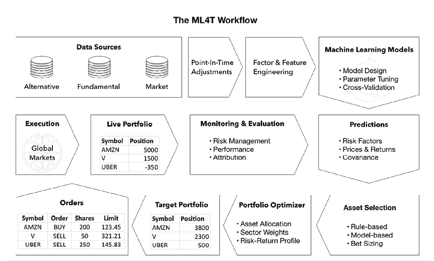
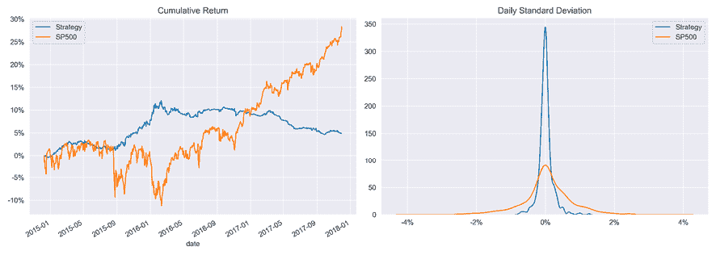
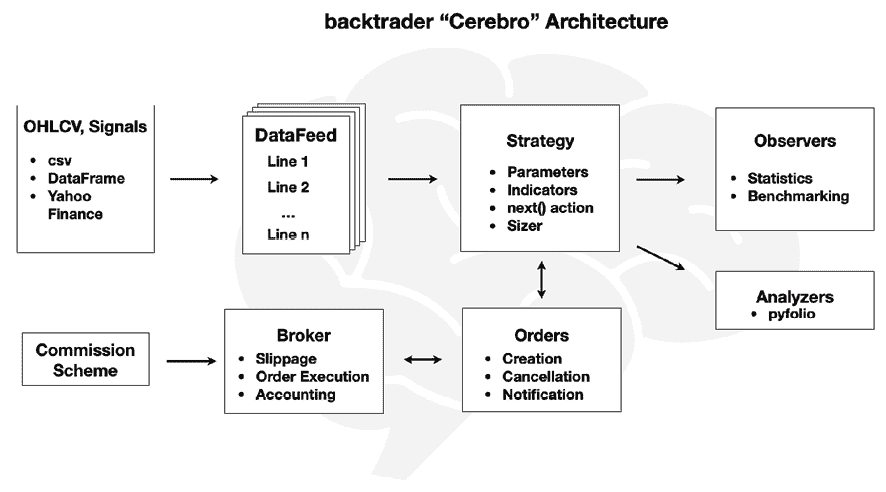
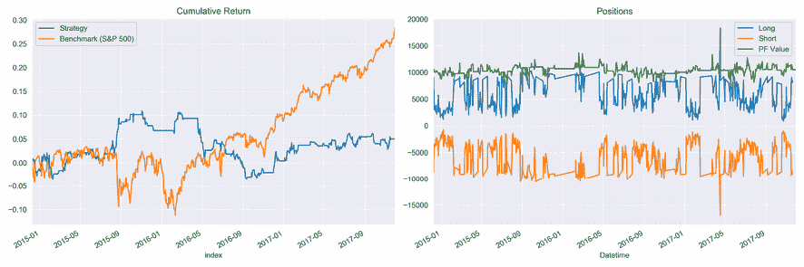
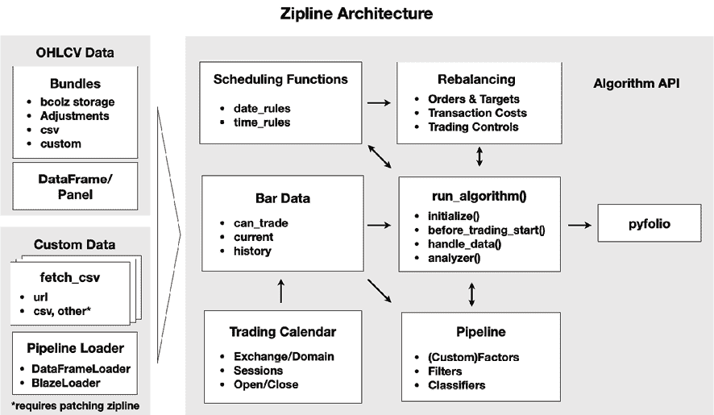
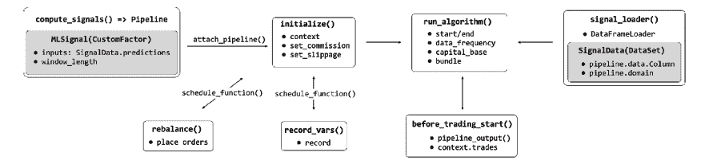
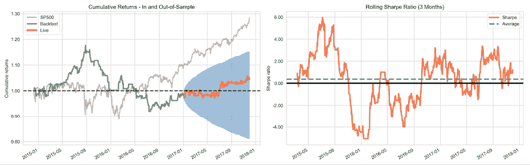
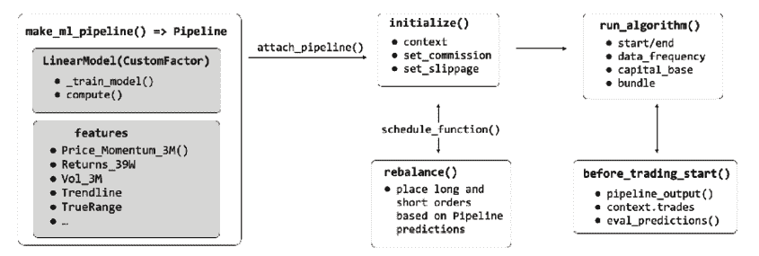
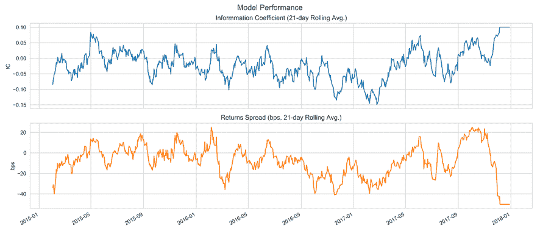
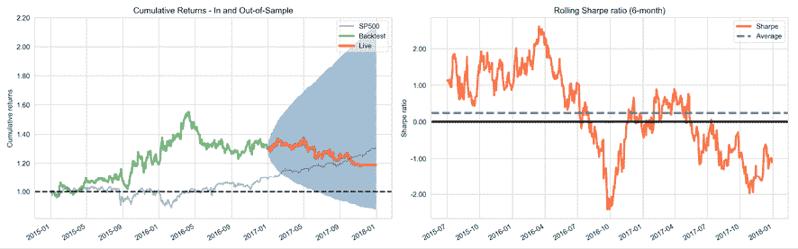

# 八、ML4T 工作流程——从模型到策略回溯测试

现在，是时候**整合**机器学习交易**（**ML4T**工作流程中的各种构建块**了，我们已经分别讨论过了。本章的目的是从端到端的角度介绍由 ML 算法驱动的交易策略的设计、模拟和评估过程。为此，我们将更详细地演示如何使用 Python 库 backtrader 和 Zipline 在历史市场环境中回溯测试 ML 驱动的策略。

ML4T 工作流的**最终目标是从历史数据中收集证据。这有助于我们决定是否在活跃的市场中部署候选策略，并将金融资源置于风险之中。此过程建立在您在前几章中培养的技能基础上，因为它依赖于您的以下能力：**

*   使用一组不同的数据源设计信息因子
*   设计 ML 模型，生成预测信号，以告知您的交易策略
*   从风险回报角度优化结果投资组合

对你的策略的真实模拟还需要忠实地描述证券市场如何运作以及交易如何执行。因此，当您设计回溯测试或评估回溯测试引擎是否包含准确性能度量所需的功能时，交易所的机构细节（如可用的订单类型和价格的确定方式）也很重要。最后，有几个方法方面需要注意，以避免有偏见的结果和错误的发现，这将导致糟糕的投资决策。

更具体地说，读完本章后，您将能够：

*   计划并实施端到端策略回溯测试
*   在实施回溯测试时，了解并避免关键陷阱
*   讨论矢量化与事件驱动的回溯测试引擎的优缺点
*   识别和评估事件驱动的 backtester 的关键组件
*   使用分钟和每日频率的数据源设计和执行 ML4T 工作流，ML 模型单独培训或作为回溯测试的一部分
*   使用 Zipline 和 backtrader

您可以在 GitHub 存储库的相应目录中找到本章的代码示例以及指向其他资源的链接。笔记本电脑包括图像的彩色版本。

# 如何回溯测试 ML 驱动的策略

简言之，*图 8.1*所示的 ML4T 工作流程是关于利用机器学习生成交易信号、选择和确定仓位或优化交易执行的交易策略的回溯测试。它包括以下步骤，并考虑到特定的投资范围和范围：

1.  收集和准备市场、基本面和备选数据
2.  工程师预测阿尔法因子和特征
3.  设计、调整和评估 ML 模型以生成交易信号
4.  根据这些信号决定交易，例如，应用规则
5.  在投资组合环境中确定单个头寸的大小
6.  模拟使用历史市场数据触发的结果交易
7.  评估结果职位的表现



图 8.1:ML4T 工作流程

当我们在*第 6 章*、*机器学习过程*中讨论 ML 过程时，我们强调模型的学习应该很好地推广到新的应用中。换句话说，当提供新的输入数据时，在给定数据集上训练的 ML 模型的预测应该表现同样好。类似地，战略的（相对）**回溯测试表现应表明未来市场表现**。

在我们了解回溯测试引擎如何运行历史模拟之前，我们需要回顾几个方法上的挑战。如果不能正确解决这些问题，结果将变得不可靠，并导致对该战略的实际实施做出错误的决定。

# 回溯测试陷阱及其避免方法

回溯测试模拟了基于历史数据的算法策略，目的是产生适用于新市场条件的性能结果。除了在不断变化的市场环境中预测的一般不确定性外，几个实施方面可能会使结果产生偏差，并增加将样本性能误认为样本外模式的风险。

这些方面都在我们的控制之下，包括数据的选择和准备、关于交易环境的不切实际的假设，以及统计测试有缺陷的应用和解释。假回溯测试发现的风险随着计算能力的提高、数据集的增大以及更复杂的算法的增加而倍增，这些算法有助于错误识别噪声样本中的明显信号。

在本节中，我们将概述最严重和最常见的方法错误。请参阅有关多重测试的文献以了解更多详细信息，特别是 Marcos Lopez de Prado 在*金融机器学习进展（2018）*中收集的一系列文章。我们还将介绍缩减的**夏普比率**（**SR**），它说明了在使用同一组金融数据进行分析时，如何调整重复试验产生的指标。

## 正确获取数据

影响回溯测试有效性的数据问题包括**前瞻性偏差**、**生存偏差**、**离群控制**以及**样本期的选择**。我们将依次解决这些问题。

### 前瞻性偏差–仅使用时间点数据

算法策略的核心是基于数据触发行为的交易规则。当我们使用已知或可用的历史信息制定或评估交易规则**时，会出现前瞻性偏差。当实时策略执行期间数据可用性不同时，由此产生的性能度量将具有误导性，不能代表未来。**

造成这种偏差的一个常见原因是，在首次公布金融报告后，未能对其进行更正或重述。股票分割或反向分割也会产生前瞻性偏差。例如，在计算收益率时，**每股收益**（**每股收益**）数据通常按季度报告，而市场价格的报告频率要高得多。因此，调整后的每股收益和价格数据需要同步，考虑到实际向市场参与者发布可用数据的时间。

**解决方案**包括仔细验证进入回测的所有数据的时间戳。我们需要保证结论仅基于时间点数据，而不会无意中包含来自未来的信息。高质量的数据提供商确保满足这些标准。当时间点数据不可用时，我们需要对报告滞后做出（保守的）假设。

### 生存偏差-追踪你的历史宇宙

当回溯测试数据仅包含当前活跃的证券，而**忽略了随着时间的推移**由于破产、退市或收购等原因而消失的资产时会产生生存偏差。不再是投资领域一部分的证券通常表现不佳，如果不将这些案例包括在内，则会使回溯测试结果产生积极的偏差。

**解决方案**自然是验证数据集是否包含随时间变化而可用的所有证券，而不是仅在运行测试时仍然可用的证券。在某种程度上，这是另一种确保数据真正及时的方法。

### 异常值控制–不排除实际极端值

数据准备通常包括一些异常值的处理，如 winsorizing 或 clipping 极值。挑战在于**识别真正不代表分析期间**的异常值，而不是当时作为市场环境组成部分的任何极值。如厚尾分布所示，当更频繁地观察到极值时，许多市场模型假设数据为正态分布。

**解决方案**涉及对极值发生概率的异常值进行仔细分析，并根据这一现实调整策略参数。

### 样本期–尝试表示相关的未来场景

如果样本数据不能**反映当前（和可能的未来）环境**，则回溯测试将不会产生概括到未来的代表性结果。选择不当的样本数据可能缺乏相关的市场制度方面，例如，在波动性或交易量方面，没有包含足够的数据点，或者包含太多或太少的极端历史事件。

**解决方案**涉及使用包含重要市场现象的样本周期，或生成反映相关市场特征的合成数据。

## 正确进行模拟

与历史模拟实施相关的实际问题包括：

*   未能**按市值计价**准确反映市场价格并说明提款情况
*   **关于交易的可用性、成本或市场影响的不切实际的假设**
*   不正确的**信号和交易执行时间**

让我们看看如何识别和解决这些问题。

### 按市值计价的表现–随时间跟踪风险

策略需要**始终满足投资目标和约束**。如果它在回溯测试过程中表现良好，但随着时间的推移导致不可接受的损失或波动，那么（显然）这是不现实的。投资组合经理需要定期（可能是实时）跟踪并报告其头寸的价值，称为按市值计价。

该解决方案涉及绘制随时间变化的表现图或计算（滚动）风险度量，例如**风险值**（**风险值**）或索蒂诺比率。

### 交易成本——假设一个现实的交易环境

市场不允许在任何时候或以目标价格执行所有交易。回溯测试假设**交易实际上可能不可用**或可能在不利条件下发生，将产生有偏差的结果。

实际缺陷包括在没有交易对手时假设卖空的策略，或低估大型交易或流动性较低资产交易的市场影响（下滑），或经纪人费用产生的成本。

**解决方案**包括对液体宇宙的限制和/或交易和滑移成本的现实参数假设。这也防止了来自不稳定因子信号的误导性结论，这些不稳定因子信号衰减迅速，并产生较高的投资组合周转率。

### 决策的时间安排——对信号和交易进行适当的排序

与前瞻性偏差类似，模拟可能会对**何时接收和交易信号**做出不切实际的假设。例如，当交易仅在下一个开盘时可用，信号可能根据收盘价计算，价格可能相当不同。当我们使用收盘价评估业绩时，回溯测试结果将无法代表现实的未来结果。

**解决方案**涉及信号到达、交易执行和表现评估顺序的精心编排。

## 正确掌握统计数据

当回溯测试有效性时，包括公布的结果，最突出的挑战是由于多次测试而发现虚假模式。基于对相同数据的不同候选人的测试来选择策略会使选择产生偏差。这是因为表现指标本身的随机性更可能导致积极的结果。换言之，该策略过度拟合了测试样本，产生了虚假的积极结果，不太可能推广到现场交易中遇到的未来数据。

因此，只有在报告试验数量以评估选择偏差的风险时，回溯测试性能才是有用的。在实际或学术研究中，这种情况很少发生，这会引起人们对许多已发表声明的有效性的怀疑。

此外，回溯测试过度拟合的风险不仅来自于运行大量测试，而且还影响基于对什么有效和什么无效的先验知识而设计的策略。由于风险包括其他人对相同数据运行的回溯测试的知识，因此在实践中很难避免回溯测试过度拟合。

建议的**解决方案**包括优先考虑可以使用投资或经济理论证明的测试，而不是武断的数据挖掘工作。它还意味着在各种上下文和场景中进行测试，可能包括对合成数据的测试。

### 最小回测长度和放气 SR

马科斯·洛佩兹·德普拉多（[http://www.quantresearch.info/](http://www.quantresearch.info/) 广泛发表了关于回溯测试的风险以及如何检测或避免的文章。这包括一个反向测试过度拟合的在线模拟器（[http://datagrid.lbl.gov/backtest/](http://datagrid.lbl.gov/backtest/) 、*贝利等 2015*。

另一个结果包括对回溯测试周期最小长度的估计，投资者应避免选择在给定数量的样本内试验中达到特定 SR，但预期样本外 SR 为零的策略。结果表明，例如，2 年的每日回溯测试数据不支持关于七种以上策略的结论。5 年的数据将这一数字扩大到 45 种战略变化。具体实施详见*贝利、博文、普拉多（2016）*。

*Bailey and Prado（2014）*还推导了一个缩减的 SR来计算 SR 在统计上显著的概率，同时控制多重测试、非正常回报和较短样本长度的通胀效应。（参见`deflated_sharpe_ratio.py`的 Python 实现的`multiple_testing`子目录以及相关公式的推导参考。）

### 回溯测试的最优停止

除了将回溯测试限制在理论上合理的策略，而不是单纯的数据挖掘练习之外，一个重要的问题是何时停止运行额外的测试。

回答这个问题的一种方法依赖于最优停止理论对**秘书问题**的解决方案。此问题假设我们根据面试结果选择申请人，并需要决定是否进行额外面试或选择最近的候选人。在这种情况下，最佳规则是始终拒绝第一个*n*/*e*候选，然后选择第一个超过前面所有选项的候选。使用此规则会导致选择最佳候选的概率为 1/*e*，而与候选池的*n*大小无关。

将此规则直接转换到回溯测试上下文中，会产生以下**建议**：测试 1/*e*（约 37%）个合理策略的随机样本，并记录其性能。然后，继续测试，直到某个策略优于之前测试的策略。这条规则适用于多个备选方案的测试，目标是尽快选择接近最佳的方案，同时将假阳性风险降至最低。有关更多信息，请参阅 GitHub 上列出的参考资料。

# 回溯测试引擎的工作原理

简单地说，回溯测试引擎迭代历史价格（和其他数据），将当前值传递给您的算法，接收订单作为回报，并跟踪结果头寸及其价值。

在实践中，对于创建本章开头的*图 8.1*中描述的 ML4T 工作流的真实和健壮模拟，有许多要求。矢量化方法和事件驱动方法之间的差异说明了真实交易环境的忠实再现如何增加了显著的复杂性。

## 矢量化与事件驱动的回溯测试

向量化回溯测试是评估策略的最基本方法。它只需将代表目标仓位大小的信号向量与投资期的回报向量相乘，即可计算周期表现。

让我们使用上一章中使用岭回归创建的每日收益预测来说明向量化的方法。使用一些简单的技术因子，我们预测了近期美元成交量最高的 100 只股票的次日回报（详见*第 7 章*、*线性模型——从风险因子到回报预测*）。

我们将把预测转化为一个非常简单的策略的信号：在任何一个交易日，我们将做多最高的 10 个正面预测，做空最低的 10 个负面预测。如果正面或负面预测减少，我们将持有更少的多头或空头头寸。笔记本`vectorized_backtest`包含以下代码示例，脚本`data.py`创建存储在`backtest.h5`中的输入数据。

首先，我们为我们的策略加载数据，以及标准普尔 500 指数价格（我们将其转换为每日回报），以对业绩进行基准测试：

```py
sp500 = web.DataReader('SP500', 'fred', '2014', '2018').pct_change()
data = pd.read_hdf('00_data/backtest.h5', 'data')
data.info()
MultiIndex: 187758 entries, ('AAL', Timestamp('2014-12-09 00:00:00')) to ('ZTS', Timestamp('2017-11-30 00:00:00'))
Data columns (total 6 columns):
 #   Column     Non-Null Count   Dtype  
---  ------     --------------   -----  
 0   predicted  74044 non-null   float64
 1   open       187758 non-null  float64
 2   high       187758 non-null  float64
 3   low        187758 non-null  float64
 4   close      187758 non-null  float64
 5   volume     187758 non-null  float64 
```

该数据结合了 2014-17 年期间 253 只不同股票的每日收益预测和 OHLCV 市场数据，每天有 100 只股票。现在，我们可以计算每日远期收益，并将其和预测转换为宽幅格式，每列一个股票代码：

```py
daily_returns = data.open.unstack('ticker').sort_index().pct_change()
fwd_returns = daily_returns.shift(-1)
predictions = data.predicted.unstack('ticker') 
```

下一步是选择正预测和负预测，按降序和升序排列，并使用整数掩码创建长信号和短信号，该掩码识别每侧的前 10 个预测，用 1 和 0 识别前 10 个预测之外的预测：

```py
long_signals = (predictions.where(predictions>0).rank(axis=1, ascending=False) > 10).astype(int)
short_signals = (predictions.where(predictions<0).rank(axis=1) > 10).astype(int) 
```

然后，假设投资规模相等，我们可以将二进制数据帧与正向回报相乘（使用空头的负倒数）得到每个头寸的每日表现。这些收益的日平均值对应于加权相等的长短组合的表现，其总和反映了市场中性长短策略的总体收益：

```py
long_returns = long_signals.mul(fwd_returns).mean(axis=1)
short_returns = short_signals.mul(-fwd_returns).mean(axis=1)
strategy = long_returns.add(short_returns).to_frame('strategy') 
```

当我们比较结果时，如*图 8.2*所示，与标准普尔 500 指数相比，我们的战略在该时期的前两年表现良好——也就是说，直到基准赶上，我们的战略在 2017 年表现不佳。

策略回报的波动性也较小，标准差为 0.002，而标准普尔 500 指数的标准差为 0.008；相关性较低，在-0.093 处为负：



图 8.2：矢量化回溯测试结果

虽然这种方法允许快速回溯信封评估，但它忽略了健壮、真实且用户友好的回溯测试引擎的重要功能；例如：

*   我们需要手动调整预测和回报的时间戳（使用 pandas 的内置功能），并且没有任何预防措施来防止意外的前瞻性偏差。
*   没有明确的头寸规模和交易过程的表示，以说明成本和其他市场现实，也没有跟踪头寸及其表现的会计系统。
*   除了事后计算之外，没有其他表现衡量标准，止损等风险管理规则很难模拟。

这就是事件驱动的回溯测试的用武之地。事件驱动的回溯测试引擎显式地模拟交易环境的时间维度，并对模拟施加更多的结构。这包括使用历史日历来定义何时可以进行交易以及何时可以进行报价。时间戳的实施也有助于避免前一节提到的前瞻性偏差和其他实现错误（但不能保证）。

通常，事件驱动系统旨在更紧密地捕获策略遇到的操作和约束，理想情况下，可以很容易地转换为提交实际订单的实时交易引擎。

## 关键实施方面

真实模拟的要求可以通过**单一平台**来满足，该平台以端到端的方式支持流程的所有步骤，或者通过**多个工具**来满足，每个工具都专门针对不同方面。

例如，您可以使用通用的 ML 库（如 scikit learn）或本书中我们将遇到的其他库来处理生成信号的 ML 模型的设计和测试，并将模型输出提供给单独的回溯测试引擎。或者，您可以在 Quantopian 或 QuantConnect 等单一平台上端到端运行整个 ML4T 工作流。

以下各节重点介绍了将此过程付诸实施需要解决的关键项目和实施细节。

### 数据摄取–格式、频率和时间

流程的第一步涉及数据来源。传统上，算法交易策略侧重于市场数据，即我们在*第 2 章*、*市场和基础数据–来源和技术*中讨论的 OHLCV 价格和交易量数据。如今，数据源越来越多样化，这就提出了一个问题：支持多少种不同的**存储格式和数据类型**，是使用专有格式还是自定义格式，还是依赖第三方或开源格式。

另一个方面是可以使用的数据源的**频率，以及不同频率的源是否可以组合。按计算复杂度和内存及存储要求的递增顺序排列的常见选项包括每日、分钟和滴答频率。中频也是可能的。算法策略往往在更高频率下表现更好，即使量子投资者正在取得进展，如*第 1 章*、*交易机器学习——从想法到执行*中所述。不管怎样，机构投资者肯定会要求勾选频率。**

最后，数据摄取还应解决**时间点约束**，以避免前瞻性偏差，如前一节所述。使用交易日历有助于将数据限制在合法的日期和时间；需要在吸收之前进行调整，以反映公司行为，如股票分割和股息或影响特定时间披露价格的重述。

### 因子工程-内置因子与库

为了便于在 ML 模型中使用阿尔法因子的工程，许多回溯测试引擎包括适用于移动平均和各种技术指标等众多标准转换的计算工具。**内置因子工程**的一个关键优势是可以轻松地将回溯测试管道转换为实时交易引擎，对输入数据应用相同的计算。

在*第 4 章*、*金融特征工程——如何研究阿尔法因子*中介绍的**数字 Python 库**（熊猫、NumPy、TA 库）是**预计算因子**的替代品。当目标是在分摊计算成本的各种回溯测试中重用因子时，这是有效的。

### ML 模型、预测和信号

如前所述，*第 6 章**机器学习过程*中讨论的 ML 工作流可以嵌入到端到端平台中，该平台将模型设计和评估部分集成到回溯测试过程中。虽然方便，但成本也很高，因为当目标可能是微调交易规则时，模型训练成为回溯测试的一部分。

与因子工程类似，您可以将这些方面解耦，并为此目的使用通用库设计、训练和评估 ML 模型，还可以将相关预测作为输入提供给 backtester。在本书中，我们将主要使用这种方法，因为它使论述更加简洁，重复性更少。

### 交易规则和执行

一个真实的策略模拟需要对交易环境的忠实描述。这包括访问相关交易所、在*第 2 章*中讨论的各种订单类型的可用性、*市场和基础数据-来源和技术*以及交易成本的核算。成本包括经纪人佣金、买卖差价和滑差，这给了我们目标执行价格和最终获得价格之间的差额。同样重要的是，确保交易延迟执行，以反映流动性和营业时间。

### 表现评估

最后，需要一个回溯测试平台来促进性能评估。它可以提供源于其交易记录的标准度量，或者提供度量的输出，这些度量可以与适合此目的的**pyfolio**等库一起使用。

在接下来的两部分中，我们将探讨两个最流行的回溯测试库，即 backtrader 和 Zipline。

# backtrader–本地回溯测试的灵活工具

**backtrader**是一个流行、灵活、用户友好的 Python 库，用于本地回溯测试，包含大量文档，由 Daniel Rodriguez 自 2015 年开发。除了大量活跃的个体交易者社区外，还有一些银行和交易公司使用 backtrader 对新策略进行原型化和测试，然后再使用 Java 等工具将其移植到生产就绪的平台上。您也可以使用 backtrader 与您选择的多个经纪人进行实时交易（请参阅 backtrader 文档和*第 23 章*、*结论和后续步骤*。

我们将首先总结 backtrader 的关键概念，以澄清此平台上的 backtesting 工作流的总体情况，然后演示其在 ML 预测驱动的策略中的使用。

## 反向交易者大脑结构的关键概念

backtrader 的**大脑**（西班牙语中“大脑”的意思）架构将回溯测试工作流的关键组件表示为（可扩展的）Python 对象。这些对象相互作用，以便于处理输入数据和计算因子，制定和执行策略，接收和执行订单，跟踪和衡量表现。一个 Cerbero 实例协调了从收集输入、逐条执行回溯测试到提供结果的整个过程。

库对这些交互使用约定，允许您省略一些细节并简化回溯测试设置。如果您打算使用 backtrader 开发自己的策略，我强烈建议您浏览文档，深入了解。

*图 8.3*概述了大脑架构中的关键元素，以下小节总结了它们最重要的功能：



图 8.3：backtrader Cerbero 体系结构

### 数据馈送、行和指示器

数据源是策略的原材料，包含有关单个证券的信息，例如 OHLCV 市场数据，每个观察都有时间戳，但您可以自定义可用字段。backtrader 可以从各种来源（包括 CSV 文件和数据帧）以及在线来源（如 Yahoo Finance）获取数据。您还可以使用一些扩展连接到在线交易平台，如交互式经纪人，以获取实时数据并执行交易。与数据帧对象的兼容性意味着您可以从 pandas 访问的数据库加载数据，从数据库到 HDF5 文件。（请参见*如何在实践中使用 backtrader*部分中的演示；也请参见 pandas 文档的*I/O*部分。）

加载后，我们将数据馈送添加到一个脑波实例中，这反过来又使一个或多个策略可以按照收到的顺序使用数据馈送。您的策略的交易逻辑可以通过名称（例如，股票代码）或序列号访问每个数据源，并检索数据源任何字段的当前值和过去值。每个字段称为一个**行**。

backtrader 提供了 130 多个常用的技术指标**指标**，允许您根据每条数据源的行或其他指标计算新值，以推动您的策略。您还可以使用标准 Python**操作**来派生新值。使用方法相当简单，文档中对此进行了很好的解释。

### 从数据和信号到交易——战略

**策略**对象包含您的交易逻辑，该交易逻辑基于数据馈送信息下订单，该数据馈送信息是脑波实例在回溯测试执行期间在每个条上呈现的。通过将策略配置为接受在向大脑添加策略实例时定义的任意参数，您可以轻松地测试变体。

对于回溯测试的每个小节，脑波实例调用策略实例的`.prenext()`或`.next()`方法。`.prenext()`的作用是解决尚未获得所有提要的完整数据的条，例如，在有足够的周期来计算诸如内置移动平均线之类的指标之前，或者如果存在其他缺失数据。默认情况下不做任何操作，但如果您的主要策略旨在处理缺失值，您可以添加您选择的交易逻辑或调用`next()`（请参阅*如何在实践中使用 backtrader*部分）。

您也可以使用 backtrader，而无需定义明确的策略，而是使用简化的信号接口。不过，StrategyAPI 为您提供了更多的控制和灵活性；有关如何使用 SignalsAPI 的详细信息，请参阅 backtrader 文档。

策略输出订单：接下来让我们看看 backtrader 如何处理这些订单。

### 佣金而非佣金计划

一旦您的策略评估了每个栏的当前和过去数据点，它需要决定下哪些订单。backtrader 允许您创建几个标准的**订单**类型，由 Cerbero 传递给代理实例执行，并在每个栏上提供结果通知。

您可以使用策略方法`buy()`和`sell()`下达市场、平仓和限价指令，以及停止和停止限价指令。执行工作如下：

*   **市场订单**：在下一个开放栏填写
*   **关闭指令**：在下一个关闭栏填写
*   **限价令**：仅当在（可选）有效期内满足价格阈值（例如，仅购买某个价格）时执行
*   **停止指令**：如果价格达到给定阈值，则成为市场指令
*   **止损限价单**：一旦触发止损，即成为限价单

实际上，止损单不同于限价单，因为在价格触发之前市场看不到它们。backtrader 还提供计算所需规模的目标订单，同时考虑当前头寸，以实现股票数量、头寸价值或投资组合价值百分比方面的特定投资组合分配。此外，还有**括号订单**，对于长订单，一个买入加上两个在买入执行时激活的限价卖出订单。如果一个销售订单填写或取消，另一个销售订单也会取消。

**经纪人**处理订单执行，跟踪投资组合、现金价值和通知，并实施佣金和打滑等交易成本。如果没有足够的现金，经纪人可以拒绝交易；对买卖进行排序以确保流动性可能很重要。backtrader 还有一个`cheat_on_open`功能，允许展望下一个交易栏，以避免由于下一个交易栏的不利价格变动而被拒绝的交易。当然，此功能会使您的结果产生偏差。

除了**佣金方案**之外，如固定或绝对交易价值的百分比金额，您还可以实现您自己的逻辑，如下文所示，收取固定的每股费用。

### 让一切成为现实——大脑

大脑控制系统根据时间戳表示的条形图同步数据馈送，并相应地逐事件运行交易逻辑和经纪人操作。backtrader 不会对频率或交易日历施加任何限制，可以并行使用多个时间框架。

如果可以预加载源数据，它还可以对指标的计算进行矢量化。有几个选项可用于从内存角度优化操作（有关详细信息，请参阅大脑文档）。

## 如何在实践中使用 backtrader

我们将使用*第 7 章**线性模型中的岭回归的每日收益预测来演示反向交易者——从风险因子到收益预测*，正如我们在本章前面对向量化反向测试所做的那样。我们将创建 Cerbero 实例，加载数据，制定并添加策略，运行回溯测试，并查看结果。

笔记本`backtesting_with_backtrader`包含以下代码示例和一些附加细节。

### 如何加载价格和其他数据

我们需要确保我们拥有所有我们想要买卖股票的日期的价格信息，而不仅仅是预测日期的价格信息。为了从熊猫数据帧加载数据，我们将 backtrader 的`PandasData`类划分为子类，以定义我们将提供的字段：

```py
class SignalData(PandasData):
    """
    Define pandas DataFrame structure
    """
    cols = OHLCV + ['predicted']
    # create lines
    lines = tuple(cols)
    # define parameters
    params = {c: -1 for c in cols}
    params.update({'datetime': None})
    params = tuple(params.items()) 
```

然后，我们实例化一个`Cerebro`类，并使用`SignalData`类为从 HDF5 加载的数据集中的每个股票代码添加一个数据提要：

```py
cerebro = bt.Cerebro()  # create a "Cerebro" instance
idx = pd.IndexSlice
data = pd.read_hdf('00_data/backtest.h5', 'data').sort_index()
tickers = data.index.get_level_values(0).unique()
for ticker in tickers:
    df = data.loc[idx[ticker, :], :].droplevel('ticker', axis=0)
    df.index.name = 'datetime'
    bt_data = SignalData(dataname=df)
    cerebro.adddata(bt_data, name=ticker) 
```

现在，我们准备好定义我们的战略。

### 如何制定交易逻辑

我们的`MLStrategy`子类backtrader 的`Strategy`类，并定义了我们可以用来修改其行为的参数。我们还创建一个日志文件来创建事务记录：

```py
class MLStrategy(bt.Strategy):
    params = (('n_positions', 10),
              ('min_positions', 5),
              ('verbose', False),
              ('log_file', 'backtest.csv'))
    def log(self, txt, dt=None):
        """ Logger for the strategy"""
        dt = dt or self.datas[0].datetime.datetime(0)
        with Path(self.p.log_file).open('a') as f:
            log_writer = csv.writer(f)
            log_writer.writerow([dt.isoformat()] + txt.split(',')) 
```

战略的核心在于`.next()`方法。我们做多/做空具有最高正/最低负预测的`n_position`股票，只要至少有`min_positions`头寸。我们总是出售未出现在新的多头和空头列表中的任何现有头寸，并使用`order_target_percent`在新目标中建立同等权重的头寸（省略日志语句以节省一些空间）：

```py
 def prenext(self):
        self.next()
    def next(self):
        today = self.datas[0].datetime.date()
        positions = [d._name for d, pos in self.getpositions().items() if pos]
        up, down = {}, {}
        missing = not_missing = 0
        for data in self.datas:
            if data.datetime.date() == today:
                if data.predicted[0] > 0:
                    up[data._name] = data.predicted[0]
                elif data.predicted[0] < 0:
                    down[data._name] = data.predicted[0]
        # sort dictionaries ascending/descending by value
        # returns list of tuples
        shorts = sorted(down, key=down.get)[:self.p.n_positions]
        longs = sorted(up, key=up.get, reverse=True)[:self.p.n_positions]
        n_shorts, n_longs = len(shorts), len(longs)
        # only take positions if at least min_n longs and shorts
        if n_shorts < self.p.min_positions or n_longs < self.p.min_positions:
            longs, shorts = [], []
        for ticker in positions:
            if ticker not in longs + shorts:
                self.order_target_percent(data=ticker, target=0)
         short_target = -1 / max(self.p.n_positions, n_short)
        long_target = 1 / max(self.p.top_positions, n_longs)
        for ticker in shorts:
            self.order_target_percent(data=ticker, target=short_target)
        for ticker in longs:
            self.order_target_percent(data=ticker, target=long_target) 
```

现在，我们需要配置我们的`Cerebro`实例并添加我们的`Strategy`。

### 如何配置 Cerbero 实例

我们使用定制佣金方案，假设我们购买或出售的每股支付 0.02 美元的固定金额：

```py
class FixedCommisionScheme(bt.CommInfoBase):
    """
    Simple fixed commission scheme for demo
    """
    params = (
        ('commission', .02),
        ('stocklike', True),
        ('commtype', bt.CommInfoBase.COMM_FIXED),
    )
    def _getcommission(self, size, price, pseudoexec):
        return abs(size) * self.p.commission 
```

然后，我们定义起始现金金额并相应地配置经纪人：

```py
cash = 10000
cerebro.broker.setcash(cash)
comminfo = FixedCommisionScheme()
cerebro.broker.addcommissioninfo(comminfo) 
```

现在，所缺少的只是将`MLStrategy`添加到`Cerebro`实例中，为所需的位置数量和最小的长/短数量提供参数。我们还将添加一个 pyfolio 分析器，以便查看我们在*第 5 章*、*投资组合优化和表现评估*中介绍的表现试纸：

```py
cerebro.addanalyzer(bt.analyzers.PyFolio, _name='pyfolio')
cerebro.addstrategy(MLStrategy, n_positions=10, min_positions=5, 
                    verbose=True, log_file='bt_log.csv')
results = cerebro.run()
ending_value = cerebro.broker.getvalue()
f'Final Portfolio Value: {ending_value:,.2f}'
Final Portfolio Value: 10,502.32 
```

回溯测试使用 869 个交易日，运行时间约为 45 秒。下图显示了累积回报和投资组合价值的演变，以及多头和空头头寸的每日价值。

性能看起来与前面的矢量化测试有些相似，上半年表现优于 S&P500 基准，之后表现不佳。

`backtesting_with_backtrader`笔记本包含完整的文件夹结果：



图 8.4：反向交易者结果

## backtrader 摘要和下一步

backtrader 是一个非常简单但灵活且性能优良的本地回溯测试引擎。由于兼容性，您可以从广泛的源中以所需的频率加载任何数据集。`Strategy`定义任意交易逻辑；您只需要确保根据需要访问不同的数据源。它还与 pyfolio 很好地集成，以实现快速而全面的性能评估。

在演示中，我们将我们的交易逻辑应用于预先训练的模型的预测。我们还可以在回溯测试期间训练模型，因为我们可以在当前条之前访问数据。然而，通常，将模型训练与策略选择分离并避免重复模型训练更有效。

backtrader 受欢迎的原因之一是能够使用它与您选择的经纪人进行实时交易。该社区非常活跃，可以在线获取连接到经纪人或其他数据源（包括加密货币）的代码。

# Zipline–Quantopian 提供的可扩展回溯测试

回溯测试引擎Zipline 为 Quantopian 的在线研究、回溯测试和实时（纸质）交易平台提供了动力。作为一家对冲基金，Quantopian 的目标是根据其风险管理标准，找出表现优于它的稳健算法。为此，他们通过竞争选择最佳战略，并分配资本与获胜者分享利润。

2012 年，Quantopian first发布了 Zipline 0.5 版，最新版本 1.3 于 2018 年 7 月发布。Zipline 与我们在*第 4 章、**金融特征工程*和*第 5 章、**投资组合优化和表现评估*中介绍的姐妹库 Alphalens、pyfolio 和 empyrical 合作良好，并与 NumPy、pandas 和 numeric 库集成良好，但可能并不总是支持最新版本。

Zipline 的设计规模为数千种证券，每种证券都可以与大量指标相关联。它比 backtrader 对回溯测试过程施加了更多的结构，以确保数据质量，例如，通过消除前瞻性偏差，并在执行回溯测试时优化计算效率。在演示如何使用 Zipline 对您选择的数据进行 ML 驱动模型的回溯测试之前，我们将先看看该体系结构的关键概念和元素，如图 8.5 所示。

## 用于稳健模拟的日历和管道

有助于实现可扩展性和可靠性目标的关键功能是存储 OHLCV 市场数据的数据包，该数据包可对拆分和股息进行实时调整，交易日历可反映世界各地交易所的营业时间，以及强大的管道 API（见下图）。我们将在以下章节中讨论它们的用法，以补充我们在前面章节中给出的简单拉链介绍：



图 8.5：拉链式结构

### 捆绑包–实时调整的时间点数据

主要的数据存储是一个**包**，它以压缩、柱状 bcolz 格式驻留在磁盘上，用于高效检索，并与存储在 SQLite 数据库中的元数据相结合。捆绑包设计为仅包含 OHLCV 数据，并且仅限于每日和分钟频率。一个很好的功能是捆绑包存储拆分和分红信息，Zipline 根据您为回溯测试选择的时间段计算**时间点调整**。

Zipline 依赖于**TradingCalendar**库（同样由 Quantopian 维护）获取全球交易所的运营细节，如时区、市场开盘和收盘时间或节假日。数据源具有域（目前，这些域是国家/地区），需要符合分配的 exchange 日历。Quantopian 正在积极开发对国际证券的支持，这些功能可能会发展。

安装后，`zipline ingest -b bundle`命令允许您立即安装 Quandl Wiki 数据集（每日频率）。结果最终出现在`.zipline`目录中，默认情况下，该目录位于您的主文件夹中。此外，您可以设计自己的捆绑包，我们将看到。

除了捆绑包之外，您还可以将 OHCLV 数据作为数据帧或面板提供给算法。（Panel 最近被弃用，但 Zipline 落后了几个版本。）然而，捆绑包更方便、更高效。

捆绑包的一个缺点是，它们不允许您存储价格和数量信息以外的数据。但是，有两种方法可以实现这一点：`fetch_csv()`函数从 URL 下载数据帧，并为其他 Quandl 数据源设计，例如基础知识。Zipline 合理地期望数据参考您提供的 OHCLV 数据的相同证券，并相应地对齐条形图。使用 pandas 对库进行修补以加载本地 CSV 或 HDF5 是非常容易的，GitHub 存储库提供了一些关于如何加载本地 CSV 或 HDF5 的指导。

此外，`DataFrameLoader`和`BlazeLoader`允许您向管道提供其他属性（请参阅本章后面的`DataFrameLoader`演示）。`BlazeLoader`可与多个源接口，包括数据库。然而，由于管道 API 仅限于每日数据，`fetch_csv()`对于以分钟频率添加特性至关重要，我们将在后面的章节中这样做。

### 算法 API–按计划进行回溯测试

`TradingAlgorithm`类实现了 Zipline 算法 API，并在与给定交易日历对齐的`BarData`上运行。初始设置后，反向测试将运行指定的时间段，并在特定事件发生时执行其交易逻辑。这些事件由每日或每分钟的交易频率驱动，但您也可以安排任意函数来评估信号、下订单、重新平衡投资组合，或记录有关正在进行的模拟的信息。

您可以从命令行、Jupyter 笔记本或使用底层`TradingAlgorithm`类的`run_algorithm()`方法执行算法。该算法需要在模拟开始时调用一次的`initialize()`方法。它通过上下文字典保持状态，并通过包含时间点当前和历史数据的数据变量接收可操作信息。

您可以将属性添加到上下文字典中，该字典可用于所有其他`TradingAlgorithm`方法，或者注册执行更复杂数据处理的管道，例如计算 alpha 因子和相应地过滤证券。

算法执行通过可选方法进行，这些方法可以通过 Zipline 自动调度，也可以按照用户定义的时间间隔进行调度。方法`before_trading_start()`每天在市场开盘前调用，主要用于识别算法可能在白天交易的一组证券。方法`handle_data()`以给定的交易频率调用，例如每分钟调用一次。

完成后，算法返回一个数据帧，其中包含投资组合表现指标（如果存在任何交易）以及用户定义的指标。如*第 5 章**投资组合优化和表现评估*所示，输出与 pyfolio 兼容，因此您可以快速创建表现试纸。

### 已知问题

Zipline 目前需要资金曲线和标准普尔 500 指数回报来进行基准测试（[https://github.com/quantopian/zipline/issues/2480](https://github.com/quantopian/zipline/issues/2480) ）。后者依赖 IEXAPI，现在需要注册才能获得密钥。例如，通过修补 Zipline 来绕过这一点并从美联储（Federal Reserve）下载数据是很容易的。GitHub 存储库描述了如何实现这一点。或者，您可以将`zipline/resources/market_data/SPY_benchmark.csv`中提供的 SPY returns 移动到您的`.zipline`文件夹中，该文件夹通常位于您的主目录中，除非您更改了其位置。

现场交易（[https://github.com/zipline-live/zipline](https://github.com/zipline-live/zipline) ）您自己的系统只能通过交互式代理提供，Quantopian 不完全支持。

## 使用分钟数据接收您自己的捆绑包

我们将使用我们在*第 2 章**市场和基础数据–来源和技术**中介绍的 AlgoSeek 提供的NASDAQ100 2013-17 样本来演示如何编写您自己的定制包。分为四个步骤：*

 *1.  将 OHCLV 数据划分为每个股票代码的一个文件，并存储元数据、拆分和红利调整。
2.  编写一个脚本，将结果传递给`ingest()`函数，该函数负责将包写入 bcolz 和 SQLite 格式。
3.  在主文件夹的`.zipline`目录中的 extension.py 脚本中注册捆绑包，并对数据源进行符号链接。
4.  对于 AlgoSeek 数据，我们还提供了自定义交易日历，因为它包括纽约证券交易所市场时间以外的交易活动。

目录`custom_bundles`包含本节的代码示例。

### 准备好要捆绑的数据

在*第 2 章，市场和基础数据-来源和技术*中，我们解析了包含 AlgoSeek NASDAQ 100 OHLCV 数据的每日文件，以获得每个股票的时间序列。我们将使用此结果，因为 Zipline 还单独存储每个安全性。

此外，我们使用 pandas DataReader`get_nasdaq_symbols()`函数获取权益元数据。最后，由于 Quandl Wiki 数据涵盖了相关时期的纳斯达克 100 指数，我们从该捆绑包的 SQLite 数据库中提取分割和股息调整。

其结果是一个 HDF5 存储，包含大约 135 个股票的价格和交易量数据，以及相应的元数据和调整数据。脚本`algoseek_preprocessing.py`说明了这个过程。

### 编写自定义 bundle 摄取函数

Zipline文档概述了启动 I/O 过程的`ingest()`功能所需的参数，但没有提供很多实际细节。脚本`algoseek_1min_trades.py`显示了如何使该部分工作于分钟数据。

有一个提供元数据的`load_equities()`函数，一个向`data_generator()`提供符号的`ticker_generator()`函数，后者依次加载和格式化每个符号的市场数据，还有一个`algoseek_to_bundle()`函数，它集成所有片段并返回所需的`ingest()`函数。

时区对齐很重要，因为 Zipline 将所有数据系列转换为 UTC；我们将美国/东部时区信息添加到 OHCLV 数据中，并将其转换为 UTC。为了便于执行，我们在`.zipline`目录的`custom_data`文件夹中为该脚本和`algoseek.h5`数据创建符号链接，我们将在下一步将其添加到`PATH`中，以便 Zipline 可以找到这些信息。

### 注册您的包

在运行`zipline ingest -b algoseek`之前，我们需要注册我们的定制捆绑包，以便Zipline 知道我们在谈论什么。为此，我们将在`.zipline`文件中的`extension.py`脚本中添加以下行，您可能需要首先创建该脚本，以及一些输入和设置（请参见`extension.py`示例）。

注册本身相当简单，但突出了几个重要细节。首先，Zipline 需要能够导入`algoseek_to_bundle()`函数，因此其位置需要在搜索路径上，例如，通过使用`sys.path.append()`。第二，我们引用一个自定义日历，我们将在下一步创建并注册该日历。第三，我们需要通知 Zipline，我们的交易日比纽约证券交易所交易日的默认 6 个半小时长，以避免出现偏差：

```py
register('algoseek',
        algoseek_to_bundle(),
        calendar_name='AlgoSeek',
        minutes_per_day=960
        ) 
```

### 创建和注册自定义 TradingCalendar

正如前面提到的一样，Quantopian 还提供了一个 TradingCalendar库来支持世界各地的交易。该包包含许多示例，将其中一个示例子类化非常简单。根据纽约证券交易所日历，我们只需覆盖开盘/收盘时间并更改名称：

```py
class AlgoSeekCalendar(XNYSExchangeCalendar):
    """
    A calendar for trading assets before and after market hours
    Open Time: 4AM, US/Eastern
    Close Time: 19:59PM, US/Eastern
    """
    @property
    def name(self):
        return "AlgoSeek"
    @property
    def open_time(self):
        return time(4, 0)
    @property
    def close_time(self):
        return time(19, 59) 
```

我们将定义放入`extension.py`并添加以下注册：

```py
register_calendar(
        'AlgoSeek',
        AlgoSeekCalendar()) 
```

现在，我们可以参考此交易日历，以确保回溯测试包括场外时间活动。

## 管道 API–回溯测试 ML 信号

管道 API有助于根据历史数据定义和计算证券横截面的阿尔法系数。管道显著提高了效率，因为它在整个回溯测试期间优化了计算，而不是单独处理每个事件。换句话说，它继续遵循事件驱动的体系结构，但尽可能将因子的计算矢量化。

管道使用因子、过滤器和分类器类来定义计算，这些计算在表中生成列，其中包含一组证券的时间点值。因子获取历史条形图数据的一个或多个输入数组，并为每个安全性生成一个或多个输出。有许多内在因子，你也可以设计自己的`CustomFactor`计算。

下图描述了如何使用`DataFrameLoader`加载数据，使用管道 API 计算预测`MLSignal`，以及各种计划活动如何与通过`run_algorithm()`函数执行的整体交易算法集成。我们将在本节中介绍详细信息和相应的代码：



图 8.6：使用 Zipline 管道 API 的 ML 信号反向测试

您需要使用`initialize()`方法注册管道，并在每个时间步或自定义时间表上执行它。Zipline 提供了许多内置计算，如移动平均线或布林格带，可用于快速计算标准因子，但它也允许创建自定义因子，我们将在下面进行说明。

最重要的是，管道 API 呈现阿尔法因子研究模块，因为它将阿尔法因子计算与算法的其余部分分离，包括交易订单的放置和执行以及投资组合持有量、价值等的簿记。

现在，我们将演示如何将套索模型每日收益预测以及我们宇宙的价格数据加载到管道中，并使用`CustomFactor`分别选择顶部和底部 10 个预测作为多头和空头头寸。笔记本`backtesting_with_zipline`包含以下代码示例。

我们的目标是将每日收益预测与 Quandl 捆绑中的 OHCLV 数据相结合，然后做多 10 只预测收益最高的股票，做空预测收益最低的股票，每一方至少需要 5 只股票，类似于上面的 backtrader 示例。

### 为我们的管道启用 DataFrameLoader

首先，我们加载 2015-17 年期间的预测，并使用`bundle.asset_finder.lookup_symbols()`方法提取我们宇宙中约 250 只股票的拉链线 ID，如下代码所示：

```py
def load_predictions(bundle):
    predictions = pd.read_hdf('../00_data/backtest.h5', 'data')[['predicted']].dropna()
    tickers = predictions.index.get_level_values(0).unique().tolist()
    assets = bundle.asset_finder.lookup_symbols(tickers, as_of_date=None)
    predicted_sids = pd.Int64Index([asset.sid for asset in assets])
    ticker_map = dict(zip(tickers, predicted_sids))
    return (predictions
            .unstack('ticker')
            .rename(columns=ticker_map)
            .predicted
            .tz_localize('UTC')), assets
bundle_data = bundles.load('quandl')
predictions, assets = load_predictions(bundle_data) 
```

为了使预测可用于管道 API，我们需要定义一个具有适当数据类型的`Column`和一个具有适当`domain`的`DataSet`，如下所示：

```py
class SignalData(DataSet):
    predictions = Column(dtype=float)
    domain = US_EQUITIES 
```

虽然捆绑包的OHLCV 数据可以依赖内置的`USEquityPricingLoader`，但我们需要定义自己的`DataFrameLoader`，如下所示：

```py
signal_loader = {SignalData.predictions:
                     DataFrameLoader(SignalData.predictions, predictions)} 
```

事实上，我们需要稍微修改 Zipline 库的源代码，以绕过只加载价格数据的假设。为此，我们在`run_algorithm`方法中添加了一个`custom_loader`参数，并确保在管道需要 SignalData 的`Column`实例之一时使用此加载程序。

### 使用自定义 ML 因子创建管道

我们的管道将有两个布尔列，用于识别我们希望交易的多头和空头资产。为了达到这个目的，我们首先定义一个名为`MLSignal`的`CustomFactor`，它只接收当前的回报预测。其动机是允许我们使用一些方便的`Factor`方法来对证券进行排名和筛选：

```py
class MLSignal(CustomFactor):
    """Converting signals to Factor
        so we can rank and filter in Pipeline"""
    inputs = [SignalData.predictions]
    window_length = 1
    def compute(self, today, assets, out, preds):
        out[:] = preds 
```

现在，我们可以通过实例化`CustomFactor`来设置实际的管道，除了提供的默认值之外，不需要任何参数。我们将其`top()`和`bottom()`方法与过滤器相结合，以选择最高正预测和最低负预测：

```py
def compute_signals():
    signals = MLSignal()
    return Pipeline(columns={
        'longs' : signals.top(N_LONGS, mask=signals > 0),
        'shorts': signals.bottom(N_SHORTS, mask=signals < 0)},
            screen=StaticAssets(assets)) 
```

下一步是通过定义一些上下文变量、设置事务成本参数、执行计划重新平衡和日志记录以及连接我们的管道来初始化我们的算法：

```py
def initialize(context):
    """
    Called once at the start of the algorithm.
    """
    context.n_longs = N_LONGS
    context.n_shorts = N_SHORTS
    context.min_positions = MIN_POSITIONS
    context.universe = assets
    set_slippage(slippage.FixedSlippage(spread=0.00))
    set_commission(commission.PerShare(cost=0, min_trade_cost=0))
    schedule_function(rebalance,
                      date_rules.every_day(),
                      time_rules.market_open(hours=1, minutes=30))
    schedule_function(record_vars,
                      date_rules.every_day(),
                      time_rules.market_close())
    pipeline = compute_signals()
    attach_pipeline(pipeline, 'signals') 
```

每天在市场开放前，我们都会运行我们的管道以获得最新的预测：

```py
def before_trading_start(context, data):
    """
    Called every day before market open.
    """
    output = pipeline_output('signals')
    context.trades = (output['longs'].astype(int)
                      .append(output['shorts'].astype(int).mul(-1))
                      .reset_index()
                      .drop_duplicates()
                      .set_index('index')
                      .squeeze()) 
```

开盘后，我们为我们的多头和空头目标下订单，并关闭所有其他头寸：

```py
def rebalance(context, data):
    """
    Execute orders according to schedule_function() date & time rules.
    """
    trades = defaultdict(list)
    for stock, trade in context.trades.items():
        if not trade:
            order_target(stock, 0)
        else:
            trades[trade].append(stock)
    context.longs, context.shorts = len(trades[1]), len(trades[-1])
    if context.longs > context.min_positions and context.shorts > context.min_positions:
        for stock in trades[-1]:
            order_target_percent(stock, -1 / context.shorts)
        for stock in trades[1]:
            order_target_percent(stock, 1 / context.longs) 
```

现在，我们准备执行回溯测试并将结果传递给 pyfolio：

```py
results = run_algorithm(start=start_date,
                       end=end_date,
                       initialize=initialize,
                       before_trading_start=before_trading_start,
                       capital_base=1e6,
                       data_frequency='daily',
                       bundle='quandl',
                       custom_loader=signal_loader) # need to modify zipline
returns, positions, transactions = pf.utils.extract_rets_pos_txn_from_zipline(results) 
```

*图 8.7*显示了策略的累积收益（左面板）和滚动夏普比率的曲线图，与前面的反向交易者示例具有可比性。

不过，回溯测试只需要大约一半的时间：



图 8.7：拉链式回测结果

笔记本`backtesting_with_zipline`包含完整的 pyfolio 泪膜纸，带有额外的度量和绘图。

## 如何在回溯测试期间训练模型

我们还可以将模型训练整合到我们的回溯测试中。您可以在`ml4t_with_zipline`笔记本中找到我们 ML4T 工作流的以下端到端示例的代码：



图 8.8：带模型训练的拉链式回测流程图

我们的目标是大致复制我们之前使用的、在*第 7 章**线性模型中生成的岭回归每日收益预测——从风险因子到收益预测*。然而，我们将使用一些额外的管道因子来说明它们的用法。主要的新元素是一个`CustomFactor`，它接收特征并将其作为输入返回，以训练模型并生成预测。

### 准备功能–如何定义管道因子

为了创建一个**管道因子**，我们需要一个或多个输入变量，一个`window_length`表示每个输入和安全性的最新数据点的数量，以及我们想要进行的计算。

我们使用线性回归（参见*第 7 章**线性模型——从风险因子到回报预测*）估计的线性价格趋势如下：我们使用 252 个最新收盘价格计算线性时间趋势的回归系数：

```py
class Trendline(CustomFactor):
    # linear 12-month price trend regression
    inputs = [USEquityPricing.close]
    window_length = 252
    def compute(self, today, assets, out, close):
        X = np.arange(self.window_length).reshape(-1, 1).astype(float)
        X -= X.mean()
        Y = close - np.nanmean(close, axis=0)
        out[:] = (X.T @ Y / np.var(X)) / self.window_length 
```

我们将使用 10 个自定义和内置因子作为模型的特征，以捕获动量和波动性等风险因子（详细信息请参见笔记本`ml4t_with_zipline`。接下来，我们将提出一个`CustomFactor`来训练我们的模型。

### 如何设计自定义 ML 因子

我们的`CustomFactor`称为`ML`，将有`StandardScaler`和**随机梯度下降**（**SGD**实现岭回归作为实例属性，我们将每周 3 天训练模型：

```py
class LinearModel(CustomFactor):
    """Obtain model predictions"""
    train_on_weekday = [0, 2, 4]
    def __init__(self, *args, **kwargs):
        super().__init__(self, *args, **kwargs)
        self._scaler = StandardScaler()
        self._model = SGDRegressor(penalty='L2')
        self._trained = False 
```

`compute`方法生成预测（处理潜在缺失值），但首先检查模型是否应进行训练：

```py
 def _maybe_train_model(self, today, returns, inputs):
        if (today.weekday() in self.train_on_weekday) or not self._trained:
            self._train_model(today, returns, inputs)
    def compute(self, today, assets, out, returns, *inputs):
        self._maybe_train_model(today, returns, inputs)
        # Predict most recent feature values
        X = np.dstack(inputs)[-1]
        missing = np.any(np.isnan(X), axis=1)
        X[missing, :] = 0
        X = self._scaler.transform(X)
        preds = self._model.predict(X)
        out[:] = np.where(missing, np.nan, preds) 
```

`_train_model`方法是拼图的核心。它移动收益，并将结果的远期收益与因子特征对齐，从而删除过程中缺少的值。它缩放剩余的数据点，并训练线性`SGDRegressor`：

```py
 def _train_model(self, today, returns, inputs):
        scaler = self._scaler
        model = self._model
        shift_by = N_FORWARD_DAYS + 1
        outcome = returns[shift_by:].flatten()
        features = np.dstack(inputs)[:-shift_by]
        n_days, n_stocks, n_features = features.shape
        features = features.reshape(-1, n_features)
        features = features[~np.isnan(outcome)]
        outcome = outcome[~np.isnan(outcome)]
        outcome = outcome[np.all(~np.isnan(features), axis=1)]
        features = features[np.all(~np.isnan(features), axis=1)]
        features = scaler.fit_transform(features)
        model.fit(X=features, y=outcome)
        self._trained = True 
```

`make_ml_pipeline()`功能对结果、特征和模型部分进行预处理，并将其组合到管道中，管道中有一列用于预测：

```py
def make_ml_pipeline(universe, window_length=21, n_forward_days=5):
    pipeline_columns = OrderedDict()
    # ensure that returns is the first input
    pipeline_columns['Returns'] = Returns(inputs=[USEquityPricing.open],
                                          mask=universe,
                                          window_length=n_forward_days + 1)
    # convert factors to ranks; append to pipeline
    pipeline_columns.update({k: v.rank(mask=universe)
                             for k, v in features.items()})
    # Create ML pipeline factor.
    # window_length = length of the training period
    pipeline_columns['predictions'] = LinearModel(
        inputs=pipeline_columns.values(),
        window_length=window_length + n_forward_days,
        mask=universe)
    return Pipeline(screen=universe, columns=pipeline_columns) 
```

### 在回溯测试期间跟踪模型性能

我们使用每天早上开盘前运行的`before_trading_start()`功能获取新的预测：

```py
def before_trading_start(context, data):
    output = pipeline_output('ml_model')
    context.predicted_returns = output['predictions']
    context.predicted_returns.index.rename(['date', 'equity'], inplace=True)
    evaluate_predictions(output, context) 
```

`evaluate_predictions`正是这样做的：它跟踪我们模型过去的预测，并在相关时间范围内的回报实现后（在我们的示例中，第二天）对其进行评估：

```py
def evaluate_predictions(output, context):
    # Look at past predictions to evaluate model performance out-of-sample
    # A day has passed, shift days and drop old ones
    context.past_predictions = {
        k - 1: v for k, v in context.past_predictions.items() if k > 0}
    if 0 in context.past_predictions:
        # Use today's forward returns to evaluate predictions
        returns, predictions = (output['Returns'].dropna()
                                .align(context.past_predictions[0].dropna(),
                                       join='inner'))
        if len(returns) > 0 and len(predictions) > 0:
            context.ic = spearmanr(returns, predictions)[0]
            context.rmse = np.sqrt(
                mean_squared_error(returns, predictions))
            context.mae = mean_absolute_error(returns, predictions)
            long_rets = returns[predictions > 0].mean()
            short_rets = returns[predictions < 0].mean()
            context.returns_spread_bps = (
                long_rets - short_rets) * 10000
    # Store current predictions
    context.past_predictions[N_FORWARD_DAYS] = context.predicted_returns 
```

我们还每天记录评估结果，以便在回溯测试后进行审查：



图 8.9：样本外性能模型

以下图表总结了累积回报和滚动 SR 方面的回溯测试性能。结果相对于前一个示例有所改善（由于不同的功能集），但自 2016 年年中以来，该模型的性能仍低于基准：



图 8.10：带模型训练的拉链式回测性能

请参阅笔记本了解更多关于我们如何定义宇宙、运行回溯测试以及使用 pyfolio 重新平衡和分析结果的详细信息。

## 而不是如何使用

笔记本`ml4t_quantopian`包含了一个如何在 Quantopian研究环境中使用简单 ML 模型对策略进行回溯测试的示例。在 Quantopian 云中使用 Zipline 的主要好处是可以访问许多其他数据集，包括基本数据和备选数据。请参阅笔记本，了解我们在此上下文中可以得出的各种因子的更多详细信息。

# 总结

在本章中，我们更深入地了解了回溯测试是如何工作的，存在哪些挑战，以及如何管理这些挑战。我们演示了如何使用两个流行的回溯测试库，backtrader 和 Zipline。

然而，最重要的是，我们经历了设计和测试 ML 模型的端到端过程，向您展示了如何实现对模型预测提供的信号起作用的交易逻辑，并了解了如何进行和评估回溯测试。现在，我们准备继续探索比我们开始的线性回归更广泛、更复杂的 ML 模型阵列。

下一章将介绍如何将时间维度合并到我们的模型中。*