# 二十二、深度强化学习——建立交易智能体

在本章中，我们将介绍**强化学习**（**RL**），它采用了一种不同于我们目前介绍的有监督和无监督算法的**机器学习**（**ML**）方法。RL 已经引起了极大的关注，因为它一直是一些最令人兴奋的人工智能突破背后的主要驱动力，比如 AlphaGo。AlphaGo 的创始人、谷歌旗下 DeepMind 首席 RL 研究员大卫·西尔弗（David Silver）最近因“电脑游戏玩法的突破性进展”获得了 2019 年著名的 ACM 计算奖。我们将看到，RL 的互动性和在线性使其特别适合于贸易和投资领域。

RL 模型**由一个 agent**进行目标导向学习，该 agent 与一个典型的随机环境交互，该 agent 对该环境具有不完整的信息。RL 的目标是通过从奖励信号中学习状态和行为的价值，自动化智能体如何做出决策以实现长期目标。最终目标是导出一个策略，该策略对行为规则进行编码，并将状态映射到动作。

RL 被认为是**最类似于人类学习**，这是在现实世界中采取行动并观察结果的结果。它不同于监督学习，因为它基于标量奖励信号一次优化智能体的行为，而不是通过从目标概念的正确标记的代表性样本中泛化。此外，RL 并没有停止预测。相反，它从端到端的角度来看待目标导向的决策，包括行动及其后果。

在本章中，您将学习如何制定 RL 问题并应用各种解决方法。我们将介绍基于模型和无模型的方法，介绍 OpenAI Gym 环境，并将深度学习与 RL 相结合，以训练一个能够在复杂环境中导航的智能体。最后，我们将向您展示如何通过建模与金融市场交互的智能体来优化其利润目标，从而使 RL 适应算法交易。

更具体地说，阅读本章后，您将能够：

*   定义一个**马尔可夫决策问题**（**MDP**）
*   使用价值和策略迭代来解决 MDP
*   在具有离散状态和动作的环境中应用 Q-学习
*   在持续的环境中构建和培训深度 Q 学习智能体
*   使用 OpenAI 健身房培训 RL 交易智能体

您可以在 GitHub 存储库的相应目录中找到本章的代码示例以及指向其他资源的链接。笔记本电脑包括图像的彩色版本。

# 强化学习系统的要素

RL 问题具有几个元素，这些元素将它们与我们到目前为止讨论的 ML 设置区分开来。以下两部分概述了通过学习自动决策的策略来定义和解决 RL问题所需的关键功能。我们将使用符号，通常遵循*强化学习：简介*（Sutton 和 Barto 2018）和 David Silver 关于 RL（[的 UCL 课程 https://www.davidsilver.uk/teaching/](https://www.davidsilver.uk/teaching/) ），建议在本章范围允许的简要总结之外进行进一步研究。

RL 问题旨在解决**优化智能体目标的行动，给出一些关于环境**的观察结果。环境向智能体提供有关其状态的信息，为行动分配奖励，并根据智能体可能知道或不知道的概率分布将智能体转换为新状态。它可能完全或部分可见，也可能包含其他智能体。环境的结构对智能体学习给定任务的能力有很大的影响，通常需要大量的前期设计工作来促进培训过程。

RL 问题根据环境状态的复杂性和智能体的动作空间（可以是离散的，也可以是连续的）而有所不同。除非离散化，否则连续动作和状态需要机器学习来近似状态、动作及其值之间的函数关系。它们还需要泛化，因为几乎可以肯定的是，在训练过程中，agent 只经历了可能无限多的状态和动作的子集。

解决复杂的决策问题通常需要一个分离关键方面的简化模型。*图 22.1*突出显示了 RL 问题的**显著特征。这些通常包括：**

*   智能体对环境状况的观察
*   智能体可用的一组操作
*   管理智能体决策的策略

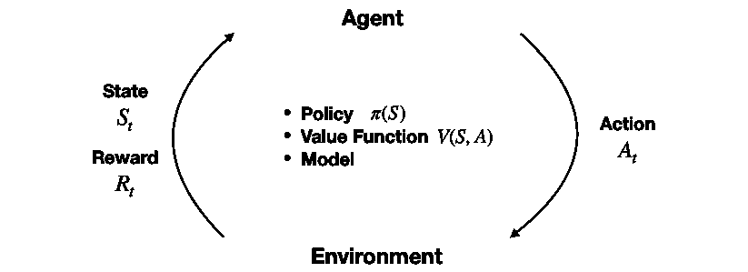

图 22.1：RL 系统的组件

此外，环境会发出**奖励信号**（可能是负面的），因为智能体的行为会导致向新状态的转换。在其核心，智能体通常学习一个**值函数**，该函数通知其对可用操作的判断。智能体的目标函数处理奖励信号，并将价值判断转化为最优策略。

## 政策——将国家转化为行动

在任何时间点，**策略定义智能体的行为**。它将智能体可能遇到的任何状态映射到一个或多个动作。在状态和操作数量有限的环境中，策略可以是在培训期间填写的简单查找表。

对于连续的状态和动作，策略采用机器学习可以帮助近似的函数形式。该策略还可能涉及大量计算，例如 AlphaZero，它使用树搜索来决定给定游戏状态的最佳操作。该策略也可能是随机的，并为给定状态的操作分配概率。

## 奖励–从行动中学习

奖励信号是环境在每个时间步发送给智能体的单个值。智能体的目标通常是**最大化随时间**收到的总报酬。奖励也可以是状态和行为的随机函数。它们通常被贴现以促进收敛并反映价值的时间衰减。

奖励是**智能体了解**在给定状态下其决策的价值并相应修改策略的唯一方式。由于奖励信号对 agent 的学习有着至关重要的影响，因此奖励信号通常是设计 RL 系统中最具挑战性的部分。

奖励需要清楚地传达智能体应该完成什么（而不是如何完成），并且可能需要领域知识来正确编码此信息。例如，交易智能体的开发可能需要定义购买、持有和出售决策的奖励。这些可能仅限于利润和损失，但也可能需要包括波动性和风险因子，如提取。

## 价值函数——长期的最佳选择

奖励提供对行动的即时反馈。然而，解决 RL 问题需要长期创造价值的决策。这就是价值函数的用武之地：它总结了给定状态下状态或行为的效用及其长期回报。

换句话说，一个状态的值是一个智能体在该状态开始时，在未来可以期望获得的总报酬。即时奖励可能是未来奖励的一个很好的代表，但智能体还需要考虑以下情况：低奖励之后可能会出现更好的结果（或相反）。

因此，**价值评估旨在预测未来报酬**。奖励是关键的投入，价值评估的目标是获得更多的奖励。然而，RL 方法侧重于学习准确的价值观，从而在有效利用（通常有限的）经验的同时做出良好决策。

还有一些 RL 方法不依赖于值函数，如随机优化方法，如遗传算法或模拟退火算法，其目的是通过有效地探索策略空间来找到最优行为。然而，目前对 RL 的兴趣主要是由直接或间接估计状态和行为价值的方法驱动的。

**策略梯度法**是一种新的发展，它依赖于一种参数化的、可微的策略，可以使用梯度下降法直接针对目标进行优化（Sutton 等人，2000）。请参阅 GitHub 上的参考资料，其中包括本章范围之外的关键论文和算法的摘要。

## 有没有模型？三思而后行？

**基于模型的 RL**方法通过预测其行为的后果来学习环境模型，从而允许智能体提前计划。例如，这种模型可用于根据当前状态和行为预测下一状态和奖励。这是规划的**基础，也就是说，在可能的未来实现之前，通过考虑它们来决定最佳的行动方案。**

更简单的**无模型方法**，相反，从**反复试验**中学习。现代 RL 方法的范围从低级的试错法到高级的深思熟虑的计划。正确的方法取决于环境的复杂性和可学习性。

# 如何解决强化学习问题

RL 方法旨在从经验中学习如何采取行动实现长期目标。为此，智能体和环境通过上一节中描述的动作、状态观察和奖励界面，通过一系列离散时间步骤进行交互。

## 解决 RL 问题的关键挑战

解决 RL 问题需要解决两个独特的挑战：信贷分配问题和勘探开发权衡。

### 信贷转让

在 RL 中，奖赏信号的出现可能明显晚于促成结果的行动，从而使行动与其后果的关联变得复杂。例如，当一个经纪人持有 100 个不同的头寸并反复交易时，如果他只知道投资组合的回报率，他怎么会意识到某些股票的表现比其他股票要好得多？

**信贷分配问题**是的挑战，即在给定状态下，尽管存在这些延迟，但要准确估计行动的收益和成本。RL 算法需要找到一种方法，在可能涉及产生积极和消极结果的许多决策中分配积极和消极结果的信用。

### 勘探与开发

RL 的动态性和互动性意味着，在经历所有相关轨迹之前，智能体需要估计状态和动作的价值。虽然它能够在任何阶段选择一个动作，但这些决策都是基于不完全学习的，同时也让智能体对其行为的最佳选择产生了第一次洞察。

对行动价值的局部可视性产生了只利用过去（成功）经验而不是探索未知领域的决策风险。这样的选择限制了智能体的风险敞口，并阻止其学习最优策略。

RL 算法需要平衡这一**勘探开发权衡**——勘探太少可能会产生有偏差的价值估计和次优策略，而勘探太少则会首先阻止学习。

## 解决 RL 问题的基本方法

有许多方法可以解决 RL 问题，所有这些方法都涉及为智能体的最佳行为寻找规则：

*   【方法】动态规划程序 To1 T1（MultT2，DP PoT T3）方法使得通常的不现实假设完全的 T4 对环境的知识，但它们是大多数其他方法的概念基础。
*   **蒙特卡罗**（**MC**方法通过抽样整个国家行动奖励序列，了解环境以及不同决策的成本和收益。
*   **时差**（**TD**学习通过学习较短序列显著提高样本效率。为了这一目的，它依赖**自举**，即根据自己先前的估计对其估计进行细化。

当 RL 问题包含明确定义的转移概率和有限数量的状态和动作时，可以将其框架为有限**马尔可夫决策过程**（**MDP**），DP 可以为其计算精确解。当前的 RL 理论主要关注有限 MDP，但实际应用用于（并且需要）更一般的设置。未知的转移概率需要有效的抽样来了解它们的分布。

连续状态和/或动作空间的方法通常利用**机器学习**来近似值或策略函数。它们整合了监督学习，特别是前四章讨论的深度学习方法。然而，这些方法在 RL 环境中面临着**不同的挑战**：

*   **奖励信号**不像标记的训练样本那样直接反映目标概念。
*   观察结果的**分布**取决于主体的行为和策略，这本身就是学习过程的主题。

以下各节将介绍并演示各种解决方法。我们将从 DP 方法值迭代和策略迭代开始，这两种方法仅限于具有已知转移概率的有限 MDP。正如我们将在下面的章节中看到的，它们是 Q-学习的基础，它是基于 TD 学习的，不需要关于转移概率的信息。它的目标是获得与 DP 类似的结果，但计算量较少，并且没有假设一个完美的环境模型。最后，我们将把范围扩展到连续状态，并引入深度 Q 学习。

# 求解动态规划问题

有限 MDP 是一个简单但基本的框架。我们将介绍智能体旨在优化的奖励轨迹，定义用于制定优化问题的政策和价值函数，以及构成解决方法基础的贝尔曼方程。

## 有限马尔可夫决策问题

MDP 将 agent 与环境的交互框架为一系列时间步骤*t*=1、*t*上的顺序决策问题，这些步骤构成了一个事件。时间步长假定为离散的，但框架可以扩展到连续时间。

MDPs 提供的抽象使其应用程序易于适应多种上下文。时间步长可以是任意间隔，动作和状态可以采用任何可以用数字表示的形式。

Markov 属性意味着当前状态完全描述了进程，即进程没有内存。当试图预测该进程的未来时，来自过去各州的信息没有任何价值。由于这些特性，该框架已被用于根据*第 5 章*、*投资组合优化和表现评估*中讨论的有效市场假设对资产价格进行建模。

### 状态、行动和奖励的顺序

MDP 按照以下方式进行：在每个步骤*t*中，agent 观察环境的状态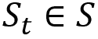并选择动作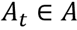，其中*s*和*A*分别是状态和动作的集合。在下一时间步*t+1*时，智能体收到奖励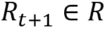并转换到状态*S*<sub xmlns:epub="http://www.idpf.org/2007/ops" style="font-style: italic;">t</sub><sub xmlns:epub="http://www.idpf.org/2007/ops" class="Subscript--PACKT-">+1</sub>。随着时间的推移，MDP 产生了一条轨道*S*<sub xmlns:epub="http://www.idpf.org/2007/ops" class="Subscript--PACKT-">0</sub>、*a*<sub xmlns:epub="http://www.idpf.org/2007/ops" class="Subscript--PACKT-">0</sub>、*R*<sub xmlns:epub="http://www.idpf.org/2007/ops" class="Subscript--PACKT-">1</sub>、*S*<sub xmlns:epub="http://www.idpf.org/2007/ops" class="Subscript--PACKT-">1</sub>、【T36 a<sub xmlns:epub="http://www.idpf.org/2007/ops" class="Subscript--PACKT-">1</sub>、*R*、<sub xmlns:epub="http://www.idpf.org/2007/ops" class="Subscript--PACKT-">T43】，…这将一直持续到智能体到达终止状态，并且事件结束。</sub>

具有有限数量的动作*a*、状态*S*和奖励*R*的有限 MDP 包括这些元素上定义良好的离散概率分布。由于马尔可夫性，这些分布只依赖于先前的状态和动作。

轨迹的概率性质意味着智能体将未来报酬的预期总和最大化。此外，奖励通常使用系数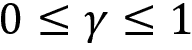进行贴现，以反映其时间价值。在中，对于非偶发但无限期持续的任务，需要严格小于 1 的折扣因子，以避免无限奖励并确保收敛。因此，智能体将未来收益的贴现预期总和*R*<sub style="font-style: italic;">t</sub>最大化，表示为*G*<sub style="font-style: italic;">t</sub>：

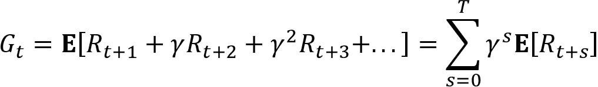

此关系也可以递归定义，因为第二步开始的和与*G*<sub style="font-style: italic;">t</sub><sub class="Subscript--PACKT-">+1</sub>贴现一次相同：

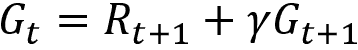

稍后我们将看到，这种类型的递归关系经常用于制定 RL 算法。

### 价值函数–如何估计长期回报

如前所述，策略将所有状态映射到动作的概率分布，以便在状态*S*t 中选择动作*a*t 的概率可以表示为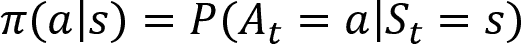。value 函数估计每个状态或状态操作对的长期回报。最基本的是找到一种政策，使国家与行动最佳地对应起来。

策略的状态值函数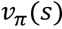给出了特定状态*s*的长期值*v*，作为从*s*开始，然后始终遵循策略的智能体的预期回报*G*。定义为如下，其中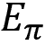为智能体执行策略时的期望值：

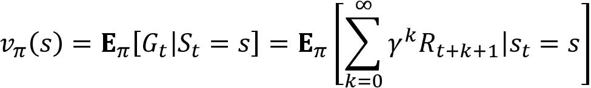

同样地，我们可以计算**状态动作值函数***q*（*s*、*a*作为在*s*状态下开始动作，然后始终遵循策略的预期回报：

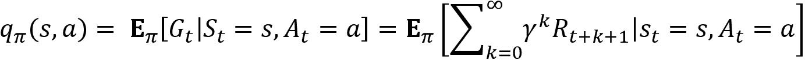

### 贝尔曼方程

Bellman方程定义了*s*中的所有状态*s*与在策略下的任何后续状态*s′*的值函数之间的递归关系。他们通过将价值函数分解为即时奖励和下一状态的贴现价值来实现：

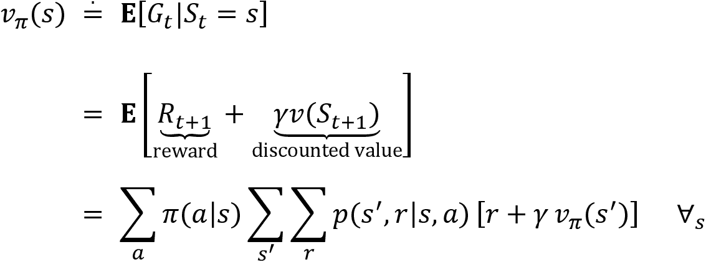

这个等式表示，对于给定的政策，一个国家的价值必须等于该政策下其继承国的预期价值，加上到达该继承国所获得的预期回报。

这意味着，如果我们知道当前可用动作的后续状态值，我们可以向前看一步，计算当前状态的预期值。因为它适用于所有状态*S*，所以表达式定义了一组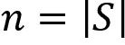方程。类似的关系适用于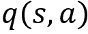。

*图 22.2*总结了这种递归关系：在当前状态下，智能体根据策略选择动作*a*。环境通过根据产生的新状态*s′*分配奖励进行响应：

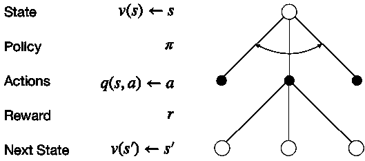

图 22.2:Bellman 方程表示的递归关系

### 从价值函数到最优策略

RL 问题的解决方案是优化累积奖励的策略。策略和价值函数紧密相连：最优策略为每个状态或状态-动作对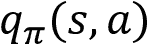产生的价值估计至少与任何其他策略的价值估计一样高，因为该值是给定策略下的累积回报。因此，最优值函数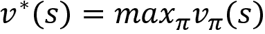和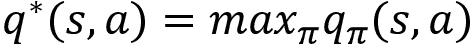隐含地定义了最优策略并求解 MDP。

最优值函数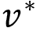和也满足上一节中的贝尔曼方程。这些贝尔曼最优方程可以省略和所暗示的对政策的明确引用。对于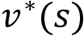，递归关系将当前值等同于在当前状态下选择最佳行动的即时奖励之和，以及继承国的预期贴现值：

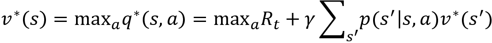

对于最优状态行动价值函数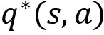，Bellman 最优方程将当前状态行动价值分解为隐含当前行动的报酬和所有后续状态中最佳行动的贴现预期价值之和：

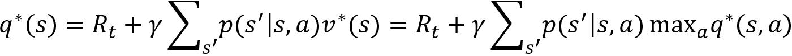

最优性条件意味着最好的策略是总是选择以贪婪的方式最大化期望值的行动，也就是说，只考虑单个时间步长的结果。

前面两个表达式定义的最优性条件是非线性的，因为存在 max 算子，并且缺少闭式解。相反，MDP 解决方案依赖于迭代解决方案，如策略和价值迭代或 Q-学习，我们将在下面介绍。

## 策略迭代

DP 是一种解决问题的通用方法，这些问题可以分解为更小的、重叠的子问题，具有递归结构，允许重用中间结果。由于递归贝尔曼最优方程和值函数的累积性质，MDP 符合要求。更具体地说，最优性的**原则**适用，因为最佳策略包括选择最佳行动，然后遵循最佳策略。

DP 要求了解 MDP 的转移概率。通常情况并非如此，但针对更一般情况的许多方法遵循类似于 DP 的方法，并从数据中学习缺失的信息。

DP 对于估算价值函数的**预测任务**和关注最优决策并输出策略的控制任务（同时也估算过程中的价值函数）非常有用。

寻找最优策略的策略迭代算法重复以下两个步骤，直到策略收敛，即不再改变超过给定阈值：

1.  **策略评估**：根据当前策略更新值函数。
2.  **政策改进**：更新政策，使行动最大化预期的一步价值。

政策评估依赖于贝尔曼方程来估计价值函数。更具体地说，它选择由当前策略确定的操作，并将得到的奖励和下一个状态的折扣值相加，以更新当前状态的值。

反过来，策略改进会改变策略，以便对于每个状态，策略产生的动作在下一个状态中产生最高值。这种改进称为贪婪，因为它只考虑单个时间步的返回。策略迭代总是收敛到最优策略，并且通常在相对较少的迭代中收敛。

## 价值迭代

策略迭代需要在每次迭代后对所有状态的策略进行评估。例如，如前所述，对于基于搜索树的策略，评估可能代价高昂。

**值迭代**通过折叠策略评估和改进步骤简化了此过程。在每个时间步，它迭代所有状态，并根据下一个状态的当前值估计选择最佳贪婪操作。然后，它使用贝尔曼最优性方程所暗示的一步前瞻来更新当前状态的值函数。

值函数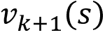对应的更新规则与策略评估更新几乎相同；它只是增加了对可用操作的最大化：

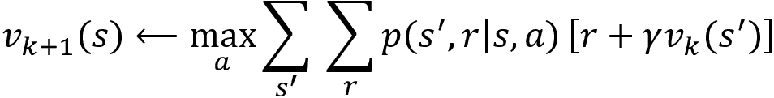

当值函数收敛时，算法停止，并输出从其值函数估计得到的贪婪策略。它还保证收敛到最优策略。

## 广义策略迭代

在实践中，有几种方法可以截断策略迭代；例如，在改进之前对策略*k*次进行评估。这仅仅意味着*max*操作符将仅在每*k*次<sup class="Superscript--PACKT-">次</sup>迭代中应用。

大多数 RL 算法估计价值和策略函数，并依靠策略评估和改进的交互作用来收敛到解决方案，如图 22.3 所示。一般方法在调整值函数以使其与策略匹配的同时，针对值函数改进策略：

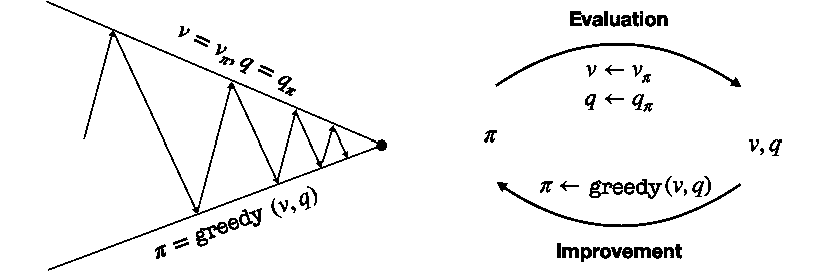

图 22.3：政策评估和改进的趋同

趋同要求价值函数与政策一致，而政策又需要稳定下来，同时贪婪地对待价值函数。因此，两个过程只有在发现一个策略对其自身的评估函数贪婪时才稳定。这意味着贝尔曼最优方程成立，因此政策和价值函数是最优的。

## Python 中的动态编程

在本部分中，我们将对一个由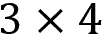网格组成的玩具环境应用价值和策略迭代，如*图 22.4*所示，具有以下特征：

*   **状态**：以二维坐标表示的 11 个状态。一个字段是不可访问的，最右边列中的前两个状态是 terminal，即结束该事件。
*   **动作**：上、下、左、右各一步的动作。环境是随机的，因此行动可能会产生意想不到的结果。对于每个动作，移动到预期状态的概率为 80%，在相邻方向移动的概率为 10%（例如，向右或向左而不是向上，或向上/向下而不是向右）。
*   **奖励**：如左面板所示，除终端状态下的+1/-1 奖励外，其他状态均为-0.02。

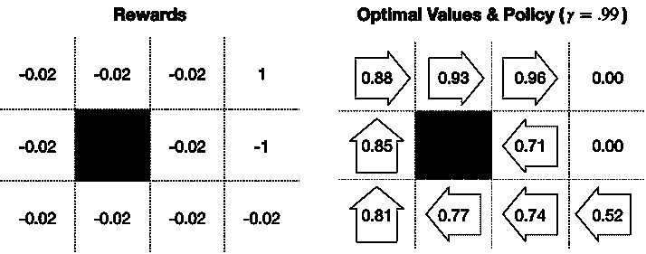

图 22.4:3×4 gridworld 奖励、价值函数和最优策略

### 建立网格世界

我们将从定义环境参数开始：

```py
grid_size = (3, 4)
blocked_cell = (1, 1)
baseline_reward = -0.02
absorbing_cells = {(0, 3): 1, (1, 3): -1}
actions = ['L', 'U', 'R', 'D']
num_actions = len(actions)
probs = [.1, .8, .1, 0] 
```

我们经常需要在 1D 和 2D 表示之间进行转换，因此我们将为此定义两个辅助函数；状态是一维的，单元是相应的二维坐标：

```py
to_1d = lambda x: np.ravel_multi_index(x, grid_size)
to_2d = lambda x: np.unravel_index(x, grid_size) 
```

此外，我们将预计算一些数据点，以使代码更加简洁：

```py
num_states = np.product(grid_size)
cells = list(np.ndindex(grid_size))
states = list(range(len(cells)))
cell_state = dict(zip(cells, states))
state_cell= dict(zip(states, cells))
absorbing_states = {to_1d(s):r for s, r in absorbing_cells.items()}
blocked_state = to_1d(blocked_cell) 
```

我们为每个州存储奖励：

```py
state_rewards = np.full(num_states, baseline_reward)
state_rewards[blocked_state] = 0
for state, reward in absorbing_states.items():
    state_rewards[state] = reward
state_rewards
array([-0.02, -0.02, -0.02,  1\.  , -0.02,  0\.  , -0.02, -1\.  , -0.02,
       -0.02, -0.02, -0.02]) 
```

为了解释概率环境，我们还需要计算给定动作实际移动的概率分布：

```py
action_outcomes = {}
for i, action in enumerate(actions):
    probs_ = dict(zip([actions[j % 4] for j in range(i, 
                                               num_actions + i)], probs))
    action_outcomes[actions[(i + 1) % 4]] = probs_
Action_outcomes
{'U': {'L': 0.1, 'U': 0.8, 'R': 0.1, 'D': 0},
 'R': {'U': 0.1, 'R': 0.8, 'D': 0.1, 'L': 0},
 'D': {'R': 0.1, 'D': 0.8, 'L': 0.1, 'U': 0},
 'L': {'D': 0.1, 'L': 0.8, 'U': 0.1, 'R': 0}} 
```

现在，我们准备计算转移矩阵，它是 MDP 的关键输入。

### 转移矩阵的计算

**转移矩阵**定义了每个前状态和动作*a*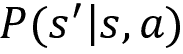在某一状态*S*结束的概率。我们将演示`pymdptoolbox`并使用一种可用的格式来指定过渡和奖励。对于这两种转移概率，我们将创建一个维度为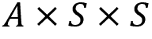的 NumPy 数组。

我们首先计算每个起始单元的目标单元并移动：

```py
def get_new_cell(state, move):
    cell = to_2d(state)
    if actions[move] == 'U':
        return cell[0] - 1, cell[1]
    elif actions[move] == 'D':
        return cell[0] + 1, cell[1]
    elif actions[move] == 'R':
        return cell[0], cell[1] + 1
    elif actions[move] == 'L':
        return cell[0], cell[1] - 1 
```

以下函数使用以`state`、`action`和`outcome`开头的参数来填写转移概率和奖励：

```py
def update_transitions_and_rewards(state, action, outcome):
    if state in absorbing_states.keys() or state == blocked_state:
        transitions[action, state, state] = 1
    else:
        new_cell = get_new_cell(state, outcome)
        p = action_outcomes[actions[action]][actions[outcome]]
        if new_cell not in cells or new_cell == blocked_cell:
            transitions[action, state, state] += p
            rewards[action, state, state] = baseline_reward
        else:
            new_state= to_1d(new_cell)
            transitions[action, state, new_state] = p
            rewards[action, state, new_state] = state_rewards[new_state] 
```

我们通过创建占位符数据结构并迭代的笛卡尔积来生成转换和奖励值，如下所示：

```py
rewards = np.zeros(shape=(num_actions, num_states, num_states))
transitions = np.zeros((num_actions, num_states, num_states))
actions_ = list(range(num_actions))
for action, outcome, state in product(actions_, actions_, states):
    update_transitions_and_rewards(state, action, outcome)
rewards.shape, transitions.shape
((4,12,12), (4,12,12)) 
```

### 值迭代算法的实现

我们首先创建了值迭代算法，该算法稍微简单一些，因为它在一个步骤中实现了策略评估和改进。我们捕获需要更新值函数的状态，不包括因缺少奖励而值为 0 的终端状态（+1/-1 分配给起始状态），并跳过被阻止的单元格：

```py
skip_states = list(absorbing_states.keys())+[blocked_state]
states_to_update = [s for s in states if s not in skip_states] 
```

然后，我们初始化值函数并设置贴现因子 gamma 和收敛阈值`epsilon`：

```py
V = np.random.rand(num_states)
V[skip_states] = 0
gamma = .99
epsilon = 1e-5 
```

如前所述，该算法使用 Bellman 最优方程更新值函数，并在*V*的 L1 范数变为小于绝对值ε时终止：

```py
while True:
    V_ = np.copy(V)
    for state in states_to_update:
        q_sa = np.sum(transitions[:, state] * (rewards[:, state] + gamma* V), 
                      axis=1)
        V[state] = np.max(q_sa)
    if np.sum(np.fabs(V - V_)) < epsilon:
        break 
```

该算法在 16 次迭代和 0.0117s 内收敛。它产生以下最优值估计值，与隐含的最优策略一起，在本节前面的*图 22.4*的右面板中进行了描述：

```py
pd.DataFrame(V.reshape(grid_size))
         0         1         2         3
0.884143  0.925054  0.961986  0.000000
1  0.848181  0.000000  0.714643  0.000000
2  0.808344  0.773327  0.736099  0.516082 
```

### 定义和运行策略迭代

策略迭代涉及单独的评估和改进步骤。我们通过选择期望报酬和下一状态值之和最大化的行动来定义改进部分。请注意，我们暂时填写终端状态的奖励，以避免忽略可能导致我们达到目标的行动：

```py
def policy_improvement(value, transitions):
    for state, reward in absorbing_states.items():
        value[state] = reward
    return np.argmax(np.sum(transitions * value, 2),0) 
```

我们像以前一样初始化 value 函数，还包括一个随机启动策略：

```py
pi = np.random.choice(list(range(num_actions)), size=num_states) 
```

该算法在贪婪选择的操作的策略评估和策略改进之间交替进行，直到策略稳定：

```py
iterations = 0
converged = False
while not converged:
    pi_ = np.copy(pi)
    for state in states_to_update:
        action = policy[state]
        V[state] = np.dot(transitions[action, state], 
                                      rewards[action, state] + gamma* V)
        pi = policy_improvement(V.copy(), transitions)
    if np.array_equal(pi_, pi):
        converged = True
    iterations += 1 
```

策略迭代仅在三次迭代后收敛。在算法找到最优值函数之前，策略稳定下来，最优策略略有不同，最显著的是，对于靠近负终端状态的字段，建议“向上”，而不是更安全的“左”。这可以通过收紧收敛标准来避免，例如，通过要求几轮的稳定策略或为值函数添加阈值。

### 使用 pymdptoolbox 求解 mdp

我们还可以使用 Python 库`pymdptoolbox`来求解 MDP，该库包括一些其他算法，包括 Q-learning。

要运行值迭代，只需在调用`.run()`方法之前，用所需的配置选项、奖励和转换矩阵实例化相应的对象：

```py
vi = mdp.ValueIteration(transitions=transitions,
                        reward=rewards,
                        discount=gamma,
                        epsilon=epsilon)
vi.run() 
```

值函数估计值与上一节中的结果相匹配：

```py
np.allclose(V.reshape(grid_size), np.asarray(vi.V).reshape(grid_size)) 
```

策略迭代的工作原理类似：

```py
pi = mdp.PolicyIteration(transitions=transitions,
                        reward=rewards,
                        discount=gamma,
                        max_iter=1000)
pi.run() 
```

它也会产生相同的策略，但值函数因运行而异，在策略收敛之前不需要达到最佳值。

### 经验教训

我们在前面的*图 22.4*中看到的右侧面板显示了由值迭代产生的最佳值估计以及相应的贪婪策略。负回报，再加上环境的不确定性，产生了一个最优的政策，其中包括远离负终端状态。

结果对奖励和折扣因子都很敏感。负面状态的成本会影响周围字段中的策略，您应该修改相应笔记本中的示例，以确定改变最佳操作选择的阈值级别。

# Q-learning–在行动中寻找最佳策略

Q-learning 是由 Chris Watkins 为其博士论文（[开发的早期 RL 突破 http://www.cs.rhul.ac.uk/~chrisw/new_thesis.pdf](http://www.cs.rhul.ac.uk/~chrisw/new_thesis.pdf)（1989 年）。它引入了增量动态编程来学习控制 MDP，而无需知道或建模我们在上一节中用于价值和策略迭代的转移矩阵和奖励矩阵。3 年后，一个收敛性证明随之而来（Christopher J.C.H.Watkins 和 Dayan 1992）。

Q-learning 直接优化动作值函数*Q*到近似*Q**。学习进行“脱离策略”，即，算法不需要仅根据值函数隐含的策略选择操作。然而，收敛需要在整个训练过程中不断更新所有状态-动作对。确保这一点的直接方法是通过贪婪策略。

## 探索与剥削——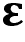-贪婪政策

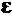**-贪婪策略**是一种简单的策略，确保在给定状态下探索新动作，同时利用学习经验。它通过随机选择动作来实现这一点。-贪婪策略随机选择概率为的动作，否则根据值函数选择最佳动作。

## Q-学习算法

该算法在给定集数的随机初始化后不断改进状态动作值函数。在每个时间步，它根据-贪婪策略选择一个动作，并使用学习率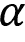更新值函数，如下所示：

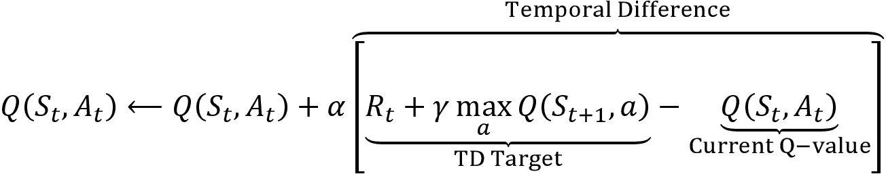

请注意，该算法不会根据转移概率计算期望值。相反，它从-贪婪策略产生的奖励*R*<sub class="Subscript--PACKT-">t</sub>中学习*Q*函数及其当前对下一状态贴现值函数的估计。

使用估计值函数改进这一估计称为**自举**。Q-learning算法是**时差****TD****学习**算法的一部分。TD 学习不会等到收到一集的最终奖励。相反，它使用更接近最终奖励的中间状态的值更新其估计值。在这种情况下，中间状态提前一个时间步。

## 如何使用 Python 训练 Q-learning agent

在本节中，我们将演示如何使用上一节中的状态网格构建 Q-learning agent。我们将对智能体进行 2500 集的培训，使用贪婪策略的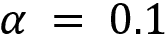和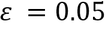学习率（详见笔记本`gridworld_q_learning.ipynb`：

```py
max_episodes = 2500
alpha = .1
epsilon = .05 
```

然后，我们将随机初始化 state action value 函数作为一个 NumPy 数组，维度为*状态数×动作数*：

```py
Q = np.random.rand(num_states, num_actions)
Q[skip_states] = 0 
```

该算法生成 2500 集，从随机位置开始，按照-贪婪策略进行，直到终止，并根据 Q-学习规则更新值函数：

```py
for episode in range(max_episodes):
    state = np.random.choice([s for s in states if s not in skip_states])
    while not state in absorbing_states.keys():
        if np.random.rand() < epsilon:
            action = np.random.choice(num_actions)
        else:
            action = np.argmax(Q[state])
        next_state = np.random.choice(states, p=transitions[action, state])
        reward = rewards[action, state, next_state]
        Q[state, action] += alpha * (reward + 
                            gamma * np.max(Q[next_state])-Q[state, action])
        state = next_state 
```

片段耗时 0.6 秒，收敛到一个值函数，与上一节值迭代示例的结果非常接近。`pymdptoolbox`实现的工作原理与前面的示例类似（详细信息请参见笔记本）。

# 与 OpenAI 健身房交易的深 RL

在前面的部分中，我们了解了 Q-learning 如何允许我们在具有离散状态和离散动作的环境中，使用基于 Bellman 方程的迭代更新来学习最优状态动作值函数*Q**。

在本节中，我们将使 RL 更接近真实世界，并将算法升级为**连续状态**（同时保持动作离散）。这意味着我们不能再使用简单地用状态操作值填充数组的表格解决方案。相反，我们将看到如何使用神经网络（**NN**）来**近似 q*，从而产生一个深度 q 网络。在介绍深度 Q-学习算法之前，我们将首先讨论深度学习如何与 RL 集成，以及加速其收敛并使其更健壮的各种改进。**

连续状态也意味着**更复杂的环境**。我们将演示如何使用 OpenAI Gym，这是一个用于设计和比较 RL 算法的工具包。首先，我们将通过训练深度 Q 学习智能体在月球着陆器环境中导航玩具宇宙飞船来说明工作流程。然后，我们将继续**定制 OpenAI Gym**以设计一个环境，模拟一个交易环境，在该环境中，智能体可以在与市场竞争的同时买卖股票。

## 用神经网络逼近值函数

连续状态和/或动作空间意味着**无限多的转换**，使得无法将状态动作值制成表格，如前一节所述。相反，我们通过从训练样本学习连续的参数化映射来近似 Q 函数。

受神经网络在其他领域的成功（我们在*第 4 部分*的前几章中讨论过）的推动，深度神经网络在逼近值函数方面也很流行。然而，**在 RL 上下文**中的机器学习**面临着不同的挑战**：

*   对于连续状态，智能体将无法访问大多数状态，因此需要进行泛化。
*   监督学习旨在从具有代表性和正确标记的独立且相同分布的样本中进行概括，而在 RL 上下文中，每个时间步只有一个样本，因此学习需要在线进行。
*   此外，当序列状态相似且状态和动作上的行为分布不是平稳的，而是由于智能体的学习而发生变化时，样本可以高度相关。

我们将介绍为应对这些额外挑战而开发的几种技术。

## 深度 Q-学习算法及其扩展

深度 Q-学习使用深度神经网络估计给定状态下可用动作的值。DeepMind 在*使用深度强化学习*玩 Atari 游戏时引入了这项技术（Mnih 等人，2013 年），在这项技术中，智能体仅通过像素输入学习玩游戏。

深度 Q 学习算法通过学习将状态映射到动作的多层**深度 Q 网络**（**DQN**）的一组权重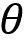来逼近动作值函数*Q*，从而将状态映射到动作，从而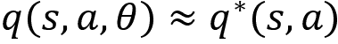。

该算法基于损失函数应用梯度下降，该损失函数计算 DQN 对目标的估计值之间的平方差：

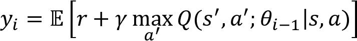

以及其对当前状态动作对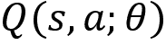的动作值的估计，以学习网络参数：

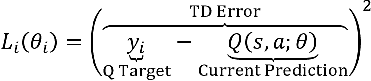

**目标和当前估计值均取决于 DQN 权重**，这突出了与监督学习的区别，在监督学习中，目标在训练前是固定的。

Q-learning算法使用**随机梯度下降**（**SGD**）而不是计算全梯度，并在每个时间步*i*后更新权重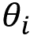。为了探索状态-动作空间，智能体使用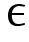-贪婪策略选择概率为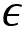的随机动作，并遵循贪婪策略选择预测的*q*值最高的动作。

基本的**DQN 架构**在多个方向上进行了细化，以使学习过程更加高效，并改善最终结果；Hessel 等人（2017 年）在**彩虹智能体**中结合了这些创新，并展示了每项创新如何在 Atari 基准测试中显著提高性能。以下小节总结了其中的一些创新。

### （优先）体验重播-关注过去的错误

体验重播存储智能体经历的状态、动作、奖励和下一状态转换的历史记录。在智能体选择一个*ε*贪婪动作之前，它从该体验中随机抽样小批量，以更新每个时间步的网络权重。

经验回放提高了样本效率，降低了在线学习过程中采集的样本的自相关性，并限制了反馈，因为当前权重生成的训练样本可能导致局部极小值或发散（Lin 和 Mitchell，1992）。

这项技术后来被改进，以便从学习的角度优先考虑更重要的经验。Schaul 等人（2015 年）通过 TD 误差的大小来近似过渡值，该误差捕获了事件对智能体的“意外”程度。在实践中，它使用关联的 TD 错误而不是统一概率对历史状态转换进行采样。

### 目标网络——消除学习过程的相关性

为了进一步削弱 NN 权重更新中当前网络参数产生的反馈回路，DeepMind 在*人类水平控制中通过深度强化学习*（Mnih 等人，2015）对该算法进行了扩展，以使用缓慢变化的目标网络。

目标网络与 Q 网络具有相同的体系结构，但其权重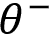仅在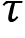步之后从 Q 网络复制时定期更新，否则保持不变。目标网络**生成 TD 目标预测**，即代替 Q 网络进行估计：

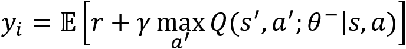

### 双深度 Q-学习-解耦行动和预测

Q-学习被证明高估了动作值，因为它有意对最大的估计动作值进行采样。

如*深度强化学习与双 Q 学习*（van Hasselt、Guez 和 Silver 2015）所示，如果这种偏差不能统一应用并改变行动偏好，则会对学习过程和产生的政策产生负面影响。

为了将动作值的估计与动作选择解耦，**双 DQN**（**DDQN**算法使用一个网络的权重来选择给定下一个状态的最佳动作，以及另一个网络的权重，要提供相应的行动价值估算，请执行以下操作：

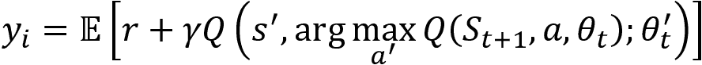.

一种选择是在每次迭代中随机选择两个相同网络中的一个进行训练，以便它们的权重不同。一种更有效的替代方法是依赖目标网络提供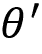。

## 介绍 OpenAI 健身房

OpenAI Gym 是一个 RL平台，提供标准化的环境，使用 Python 测试和基准 RL 算法。还可以扩展平台并注册自定义环境。

**月球着陆器 v2**（**LL**环境要求智能体基于离散动作空间和低维状态观测（包括位置、方向和速度）控制其二维运动。在每一个时间步，环境都会提供对新状态的观察和积极或消极的回报。每集由多达 1000 个时间步组成。*图 22.5*显示了我们稍后将训练的智能体在 250 集成功着陆后选择的帧：


图 22.5：月球着陆器事件期间 RL 智能体的行为

更具体地说，**主体观察状态**的八个方面，包括六个连续和两个离散元素。根据观察到的元素，智能体知道其位置、方向和移动速度，以及是否（部分）着陆。然而，它不知道它应该朝哪个方向移动，也不能观察环境的内部状态来理解支配它运动的规则。

在每个时间步，智能体使用**四个离散动作**中的一个来控制其运动。它不能做任何事情（并在当前路径上继续），启动其主机（以减少向下运动），或使用相应的方向引擎向左或向右转向。没有燃料限制。

目标是让智能体在着陆平台上坐标（0，0）处的两个旗帜之间着陆，但也可以在着陆平台外着陆。根据确切的着陆点，特工向 pad 移动时会累积 100-140 的奖励。然而，离开目标的移动否定了智能体通过向 pad 移动而获得的奖励。每条腿接地增加 10 分，而使用主机的成本为-0.3 分。

如果智能体着陆或崩溃，加上或减去 100 分，或在 1000 个时间步后，一集终止。解决 LL 需要在 100 个连续事件中平均获得至少 200 个累积奖励。

## 如何使用 TensorFlow 2 实现 DDQN

笔记本电脑`03_lunar_lander_deep_q_learning`使用 TensorFlow 2 实现了一个 DDQN 智能体，学习解决 OpenAI Gym 的**月球着陆器**2.0（**LL**环境。记事本`03_lunar_lander_deep_q_learning`包含一个 TensorFlow 1 实现，在第一版中讨论过，它的运行速度明显更快，因为它不依赖于急切执行，而且收敛速度更快。本节重点介绍了实施的关键要素；更多详细信息，请参见笔记本。

### 创建 DDQN 智能体

我们将`DDQNAgent`创建为一个 Python 类，将学习和执行逻辑与关键配置参数和性能跟踪集成在一起。

智能体的`__init__()`方法将以下信息作为参数：

*   **环境特征**，如状态观察的维度数量和智能体可用的操作数量。
*   **ε-贪婪策略**随机探索的衰减。
*   **神经网络架构**和**训练**和目标网络的参数更新。

    ```py
    class DDQNAgent:
        def __init__(self, state_dim, num_actions, gamma,
                     epsilon_start, epsilon_end, epsilon_decay_steps,
                     epsilon_exp_decay,replay_capacity, learning_rate,
                     architecture, l2_reg, tau, batch_size,
                     log_dir='results'): 
    ```

### 使 DDQN 体系结构适应月球着陆器

DDQN 结构首先应用于具有高维图像观察的 Atari 域，并依赖于卷积层。LL 的低维状态表示使完全连接的层成为更好的选择（参见*第 17 章*、*交易深度学习*。

更具体地说，网络将八个输入映射到四个输出，表示每个动作的 Q 值，因此只需一次向前传递即可计算动作值。DQN 使用 Adam 优化器在先前的损失函数上进行训练。该智能体的 DQN 使用三个密集连接的层，每个层有 256 个单元和 L2 活动正则化。通过 TensorFlow Docker 图像使用 GPU 可以显著提高 NN 训练性能（参见*第 17 章*和*第 18 章*、*CNN 获取金融时间序列和卫星图像*。

`DDQNAgent`类的`build_model()`方法基于`architecture`参数创建主要的在线和慢速移动目标网络，该参数指定了层数及其单元数。

对于主要在线网络，我们将`trainable`设置为`True`，对于目标网络，我们将`False`设置为。这是因为我们只是定期复制在线 NN 权重以更新目标网络：

```py
 def build_model(self, trainable=True):
        layers = []
        for i, units in enumerate(self.architecture, 1):
            layers.append(Dense(units=units,
                                input_dim=self.state_dim if i == 1 else None,
                                activation='relu',
                                kernel_regularizer=l2(self.l2_reg),
                                trainable=trainable))
        layers.append(Dense(units=self.num_actions, 
                            trainable=trainable))
        model = Sequential(layers)
        model.compile(loss='mean_squared_error',
                      optimizer=Adam(lr=self.learning_rate))
        return model 
```

### 记忆过渡和重放体验

为了实现体验重放，智能体会记住每个状态转换，以便在训练期间随机采样一小批。`memorize_transition()`方法接收对环境提供的当前和下一个状态的观察，以及智能体的动作、奖励和指示情节是否完成的标志。

它跟踪每个事件的奖励历史和长度，在每个周期结束时对 epsilon 应用指数衰减，并将状态转换信息存储在缓冲区中：

```py
 def memorize_transition(self, s, a, r, s_prime, not_done):
        if not_done:
            self.episode_reward += r
            self.episode_length += 1
        else:
            self.episodes += 1
            self.rewards_history.append(self.episode_reward)
            self.steps_per_episode.append(self.episode_length)
            self.episode_reward, self.episode_length = 0, 0
        self.experience.append((s, a, r, s_prime, not_done)) 
```

只要有足够的样本创建完整的批次，记忆的体验就会开始重放。`experience_replay()`方法使用在线网络预测下一状态的 Q 值，并选择最佳动作。然后从目标网络中选择这些动作的预测*q*值，以到达 TD`targets`。

接下来，它使用一批当前状态观测作为输入，TD 目标作为结果，均方误差作为损失函数来训练主网络。最后，每隔步更新目标网络权重：

```py
 def experience_replay(self):
        if self.batch_size > len(self.experience):
            return
        # sample minibatch from experience
        minibatch = map(np.array, zip(*sample(self.experience, 
                                              self.batch_size)))
        states, actions, rewards, next_states, not_done = minibatch
        # predict next Q values to select best action
        next_q_values = self.online_network.predict_on_batch(next_states)
        best_actions = tf.argmax(next_q_values, axis=1)
        # predict the TD target
        next_q_values_target = self.target_network.predict_on_batch(
            next_states)
        target_q_values = tf.gather_nd(next_q_values_target,
                                       tf.stack((self.idx, tf.cast(
                                          best_actions, tf.int32)), axis=1))
        targets = rewards + not_done * self.gamma * target_q_values
        # predict q values
        q_values = self.online_network.predict_on_batch(states)
        q_values[[self.idx, actions]] = targets
        # train model
        loss = self.online_network.train_on_batch(x=states, y=q_values)
        self.losses.append(loss)
        if self.total_steps % self.tau == 0:
            self.update_target()
    def update_target(self):
        self.target_network.set_weights(self.online_network.get_weights()) 
```

笔记本包含ε-贪婪策略和目标网络权重更新的附加实现细节。

### 建立开放式人工智能环境

我们将从实例化并从 LL 环境中提取关键参数开始：

```py
env = gym.make('LunarLander-v2')
state_dim = env.observation_space.shape[0]  # number of dimensions in state
num_actions = env.action_space.n  # number of actions
max_episode_steps = env.spec.max_episode_steps  # max number of steps per episode
env.seed(42) 
```

我们还将使用内置包装器，允许定期存储显示智能体性能的视频：

```py
from gym import wrappers
env = wrappers.Monitor(env,
                       directory=monitor_path.as_posix(),
                       video_callable=lambda count: count % video_freq == 0,
                      force=True) 
```

在没有显示器的服务器或 Docker 容器上运行时，可以使用`pyvirtualdisplay`。

### 关键超参数选择

智能体的性能对几个超参数非常敏感。我们将从折扣和学习率开始：

```py
gamma=.99,  # discount factor
learning_rate=1e-4  # learning rate 
```

我们将每 100 个时间步更新一次目标网络，在 replay 内存中存储多达 100 万个过去的片段，并从内存中抽取 1024 个小批次样本，以训练智能体：

```py
tau=100  # target network update frequency
replay_capacity=int(1e6)
batch_size = 1024 
```

ε-贪婪策略从的纯探索开始，在 250 集中线性衰减到 0.01，然后指数衰减：

```py
epsilon_start=1.0
epsilon_end=0.01
epsilon_linear_steps=250
epsilon_exp_decay=0.99 
```

笔记本包含训练循环，包括体验重播、SGD 和慢速目标网络更新。

### 月球着陆器学习性能

前面的超参数设置使智能体能够使用 TensorFlow 1 实现在大约 300 集中解决环境问题。

*图 22.6*的左面板显示了 100 个时段的情节奖励及其移动平均值。右面板显示了探索的衰退和每集的步骤数。大约有 100 集，每集通常需要 1000 个时间步，而特工减少探索，并在开始降落前“学会飞行”：


图 22.6:DDQN 智能体在月球着陆器环境中的性能

## 创建一个简单的交易智能体

在本节和以下各节中，我们将采用 deep RL 方法来设计一个智能体，学习如何交易单一资产。为了训练 agent，我们将建立一个简单的环境，其中包含一组有限的动作、一个具有连续观测的相对低维状态以及其他参数。

更具体地说，**环境**使用随机开始日期对单个股票报价器的股票价格时间序列进行采样，以模拟默认情况下包含 252 天或 1 年的交易周期。每个**状态观察**都为智能体提供各种滞后的历史回报和一些技术指标，如**相对强度指数**（**RSI**）。

智能体可以从三个**动作**中选择：

*   **买入**：将所有资金投资于该股票的多头头寸。
*   **公寓**：仅持有现金。
*   **卖空**：采取与资本额相等的空头头寸。

环境占**交易成本**，默认设置为 10 个基点，无交易情况下，每个周期扣减 1 个基点。智能体的**报酬**由每日收益减去交易成本构成。

环境跟踪智能体投资组合（由单一股票组成）的**净资产价值**（**NAV**），并将其与市场投资组合进行比较，市场投资组合无摩擦交易以提高智能体的门槛。

一集以 1 单位现金的初始资产净值开始：

*   如果导航下降到 0，则该集以损失结束。
*   如果导航命中 2.0，则智能体获胜。

此设置限制了复杂性，因为它关注单个股票，并从头寸大小中提取，以避免需要连续操作或大量离散操作，以及更复杂的簿记。但是，演示如何定制环境并允许扩展非常有用。

## 如何设计定制的 OpenAI 交易环境

为了建立一个学会交易的智能体，我们需要创造一个市场环境，提供价格和其他信息，提供相关的行动，并跟踪投资组合以相应地奖励智能体。有关构建大规模真实仿真环境的描述，请参见 Byrd、Hybinette 和 Balch（2019）。

OpenAI Gym 允许设计、注册和利用符合其体系结构的环境，如文档中所述。文件`trading_env.py`包含以下代码示例，除非另有说明，否则说明了该过程。

交易环境由三个类组成，它们相互作用以促进智能体的活动。`DataSource`类加载一个时间序列，生成一些特征，并在每个时间步向智能体提供最新的观察结果。`TradingSimulator`跟踪头寸、交易和成本以及表现。它还实施并记录买入并持有基准策略的结果。`TradingEnvironment`本身就安排了这一过程。我们将依次简要描述每种情况；有关实现的详细信息，请参见脚本。

### 设计数据源类

首先，我们编写了一个`DataSource`类来加载和预处理历史股票数据，以创建用于状态观察和奖励的信息。在本例中，我们将使其非常简单，并向智能体提供单个股票的历史数据。或者，你可以将许多股票组合成一个时间序列，例如，训练经纪人交易标准普尔 500 指数成分股。

我们将从 Quandl 数据集中加载一台股票的调整价格和成交量信息，在这种情况下，AAPL 将使用 1980 年代早期到 2018 年的数据：

```py
class DataSource:
    """Data source for TradingEnvironment
    Loads & preprocesses daily price & volume data
    Provides data for each new episode.
    """
    def __init__(self, trading_days=252, ticker='AAPL'):
        self.ticker = ticker
        self.trading_days = trading_days
    def load_data(self):
        idx = pd.IndexSlice
        with pd.HDFStore('../data/assets.h5') as store:
            df = (store['quandl/wiki/prices']
                  .loc[idx[:, self.ticker],
                       ['adj_close', 'adj_volume', 'adj_low', 'adj_high']])
        df.columns = ['close', 'volume', 'low', 'high']
        return df 
```

`preprocess_data()`方法创建多个特征并对其进行规范化。最近的每日收益率有两个作用：

*   当前状态的观察元素
*   交易成本净额，以及根据头寸大小，最后一期的报酬

该方法包括以下步骤（技术指标详见*附录*：

```py
def preprocess_data(self):
"""calculate returns and percentiles, then removes missing values"""
   self.data['returns'] = self.data.close.pct_change()
   self.data['ret_2'] = self.data.close.pct_change(2)
   self.data['ret_5'] = self.data.close.pct_change(5)
   self.data['rsi'] = talib.STOCHRSI(self.data.close)[1]
   self.data['atr'] = talib.ATR(self.data.high, 
                                self.data.low, self.data.close)
   self.data = (self.data.replace((np.inf, -np.inf), np.nan)
                .drop(['high', 'low', 'close'], axis=1)
                .dropna())
   if self.normalize:
       self.data = pd.DataFrame(scale(self.data),
                                columns=self.data.columns,
                                index=self.data.index) 
```

`DataSource`类跟踪剧集进度，在每个时间步向`TradingEnvironment`提供新数据，并发出剧集结束的信号：

```py
def take_step(self):
    """Returns data for current trading day and done signal"""
    obs = self.data.iloc[self.offset + self.step].values
    self.step += 1
    done = self.step > self.trading_days
    return obs, done 
```

### TradingSimulator 类

交易模拟器计算智能体的报酬并跟踪智能体和“市场”的净资产价值，后者通过再投资执行买入持有策略。它还跟踪头寸和市场回报，计算交易成本，并记录结果。

此类中最重要的方法是`take_step`方法，该方法根据智能体的当前头寸、最新股票收益率和交易成本计算智能体的报酬（略为简化；详细信息请参见脚本）：

```py
def take_step(self, action, market_return):
    """ Calculates NAVs, trading costs and reward
        based on an action and latest market return
        returns the reward and an activity summary"""
    start_position = self.positions[max(0, self.step - 1)]
    start_nav = self.navs[max(0, self.step - 1)]
    start_market_nav = self.market_navs[max(0, self.step - 1)]
    self.market_returns[self.step] = market_return
    self.actions[self.step] = action
    end_position = action - 1 # short, neutral, long
    n_trades = end_position – start_position
    self.positions[self.step] = end_position
    self.trades[self.step] = n_trades
    time_cost = 0 if n_trades else self.time_cost_bps
    self.costs[self.step] = abs(n_trades) * self.trading_cost_bps + time_cost
    if self.step > 0:
        reward = start_position * market_return - self.costs[self.step-1]
        self.strategy_returns[self.step] = reward
        self.navs[self.step] = start_nav * (1 + 
                                            self.strategy_returns[self.step])
        self.market_navs[self.step] = start_market_nav * (1 + 
                                            self.market_returns[self.step])
    self.step += 1
    return reward 
```

### TradingEnvironment 类

`TradingEnvironment`类子类`gym.Env`并驱动环境动力学。它实例化`DataSource`和`TradingSimulator`对象，并设置动作和状态空间维度，后者取决于`DataSource`定义的特征范围：

```py
class TradingEnvironment(gym.Env):
    """A simple trading environment for reinforcement learning.
    Provides daily observations for a stock price series
    An episode is defined as a sequence of 252 trading days with random start
    Each day is a 'step' that allows the agent to choose one of three actions.
    """
    def __init__(self, trading_days=252, trading_cost_bps=1e-3,
                 time_cost_bps=1e-4, ticker='AAPL'):
        self.data_source = DataSource(trading_days=self.trading_days,
                                      ticker=ticker)
        self.simulator = TradingSimulator(
                steps=self.trading_days,
                trading_cost_bps=self.trading_cost_bps,
                time_cost_bps=self.time_cost_bps)
        self.action_space = spaces.Discrete(3)
        self.observation_space = spaces.Box(self.data_source.min_values,
                                            self.data_source.max_values) 
```

`TradingEnvironment`的两个关键方法是`.reset()`和`.step()`。前者初始化`DataSource`和`TradingSimulator`实例，如下所示：

```py
def reset(self):
    """Resets DataSource and TradingSimulator; returns first observation"""
    self.data_source.reset()
    self.simulator.reset()
    return self.data_source.take_step()[0] 
```

每个时间步依赖于`DataSource`和`TradingSimulator`提供状态观察并奖励最近的动作：

```py
def step(self, action):
    """Returns state observation, reward, done and info"""
    assert self.action_space.contains(action), 
      '{} {} invalid'.format(action, type(action))
    observation, done = self.data_source.take_step()
    reward, info = self.simulator.take_step(action=action,
                                            market_return=observation[0])
    return observation, reward, done, info 
```

### 注册和参数化自定义环境

在使用定制环境之前，就像月球着陆器环境一样，我们需要在`gym`包中注册，提供`entry_point`的模块和类别信息，并定义每集的最大步数（以下步骤出现在`q_learning_for_trading`笔记本中）：

```py
from gym.envs.registration import register
register(
        id='trading-v0',
        entry_point='trading_env:TradingEnvironment',
        max_episode_steps=252) 
```

我们可以使用所需的交易成本和股票代码实例化环境：

```py
trading_environment = gym.make('trading-v0')
trading_environment.env.trading_cost_bps = 1e-3
trading_environment.env.time_cost_bps = 1e-4
trading_environment.env.ticker = 'AAPL'
trading_environment.seed(42) 
```

## 股票市场的深度 Q-学习

笔记本`q_learning_for_trading`包含 DDQN 智能体培训代码；我们将只强调与前面示例的显著差异。

### 调整和培训 DDQN 智能体

我们将使用相同的 DDQN智能体，但将 NN 架构简化为两层，每层 64 个单元，并添加用于正则化的退出。在线网络有 5059 个可培训参数：

```py
Layer (type)                 Output Shape              Param #   
Dense_1 (Dense)              (None, 64)                704       
Dense_2 (Dense)              (None, 64)                4160      
dropout (Dropout)            (None, 64)                0         
Output (Dense)               (None, 3)                 195       
Total params: 5,059
Trainable params: 5,059 
```

训练回路与自定义环境的交互方式与月球着陆器的情况非常相似。当事件处于活动状态时，智能体采取其当前策略建议的操作，并在记住当前转换后使用体验重播对在线网络进行训练。以下代码突出显示了关键步骤：

```py
for episode in range(1, max_episodes + 1):
    this_state = trading_environment.reset()
    for episode_step in range(max_episode_steps):
        action = ddqn.epsilon_greedy_policy(this_state.reshape(-1, 
                                                               state_dim))
        next_state, reward, done, _ = trading_environment.step(action)

        ddqn.memorize_transition(this_state, action,
                                 reward, next_state,
                                 0.0 if done else 1.0)
        ddqn.experience_replay()
        if done:
            break
        this_state = next_state
trading_environment.close() 
```

我们让勘探继续进行 2000 个 1 年期交易，相当于大约 500000 个时间步；我们使用ε在 500 个周期内从 1.0 到 0.1 的线性衰减，此后以 0.995 的系数进行指数衰减。

### DDQN 智能体性能基准测试

为了比较 DDQN 智能体的性能，我们不仅跟踪买入持有策略，还生成随机智能体的性能。

*图 22.7*显示了 2000 年培训期间三个累积回报值在过去 100 集的滚动平均值（左面板），以及智能体表现优于买入和持有期间（右面板）的最后 100 集的份额。它使用 AAPL 股票数据，每天约有 9000 个价格和成交量观测值：


图 22.7：交易智能体相对于市场的表现

这显示了在 500 集之后，智能体的性能如何从随机智能体的水平稳步提高，并且在接近实验结束时超过一半的时间内，智能体的性能开始优于买入并持有策略。

## 经验教训

与本书其他部分介绍的机器学习模型相比，这个相对简单的智能体只使用最新的市场数据和奖励信号。尽管如此，它还是学会了盈利，并取得了与市场类似的业绩（经过 2000 年数据的训练，只需在 GPU 上花费一小部分时间）。

请记住，使用单一股票也会大大增加数据拟合过度的风险。您可以使用保存的模型在新数据上测试经过培训的智能体（请参阅月球着陆器笔记本）。

总之，我们演示了建立 RL 交易环境的机制，并使用使用少量技术指标的基本智能体进行了实验。您应该尝试扩展环境和智能体，例如，从多个资产中进行选择、确定头寸大小和管理风险。

强化学习通常被认为是算法交易中最有希望的方法，因为它最准确地模拟了投资者面临的任务。然而，我们大大简化的示例说明，创建一个真实的环境是一个相当大的挑战。此外，鉴于金融数据的嘈杂性，在其他领域取得重大突破的深度强化学习可能面临更大的障碍，这使得学习基于延迟奖励的价值函数更加困难。

尽管如此，对这一主题的浓厚兴趣使得机构投资者有可能正在进行更大规模的实验，从而产生切实的结果。本书范围之外的一个有趣的补充方法是**逆强化学习**，其目的是根据观察到的行为识别智能体（例如，人类交易者）的奖励函数；请参见 Arora 和 Doshi（2019 年）的调查和 Roa Vicents 等人（2019 年）的限额指令簿交易申请。

# 总结

在本章中，我们介绍了一类不同的机器学习问题，重点是通过与环境交互的智能体自动做出决策。我们介绍了定义 RL 问题所需的关键特性和各种解决方法。

我们了解了如何将 RL 问题作为有限马尔可夫决策问题进行框架和分析，以及如何使用值和策略迭代计算解决方案。然后，我们转向更现实的情况，在这种情况下，智能体不知道转移概率和回报，并了解了 Q-learning 如何建立在 MDP 案例中 Bellman 最优方程定义的关键递归关系上。我们了解了如何使用 Python 解决 RL 问题，以实现简单的 mdp 和更复杂的 Q-learning 环境。

然后，我们将研究范围扩展到连续状态，并将深度 Q 学习算法应用到更复杂的月球着陆器环境中。最后，我们使用 OpenAI Gym 平台设计了一个简单的交易环境，并演示了如何培训智能体在交易单个股票时学习如何盈利。

在下一章和最后一章中，我们将通过本书介绍我们的一些结论和关键的解决方法，并在你们继续建立技能以使用机器学习进行交易时，为你们安排一些步骤。