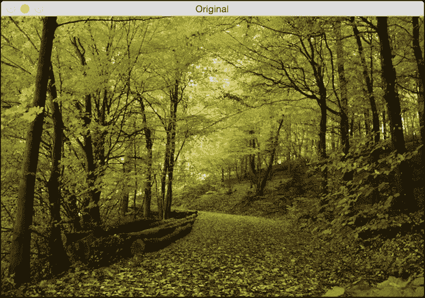
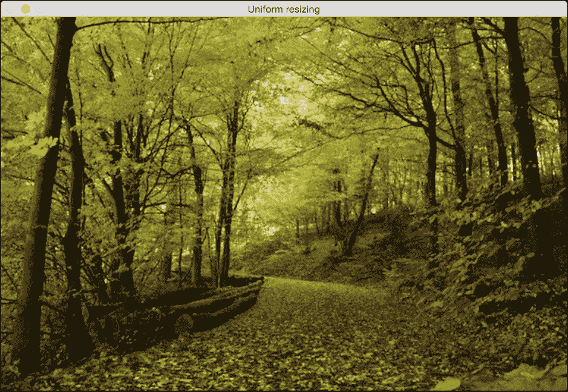
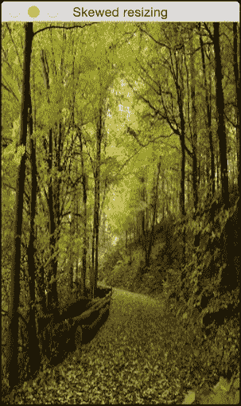
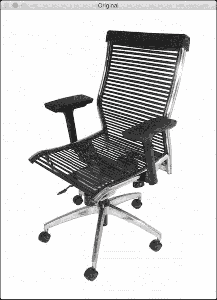
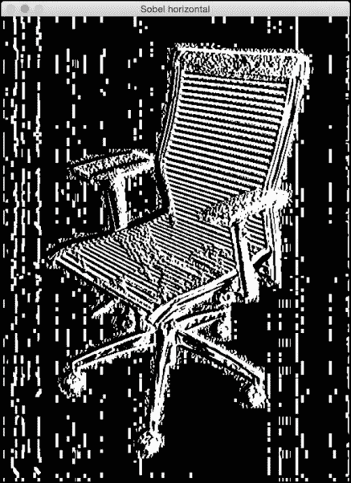
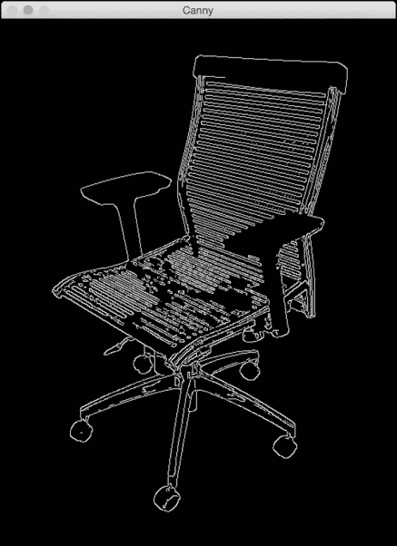
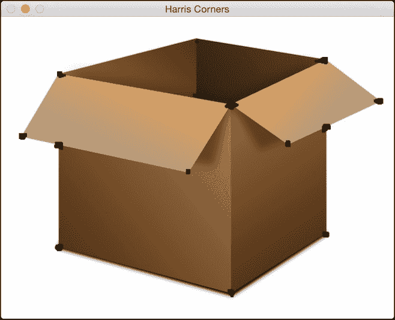
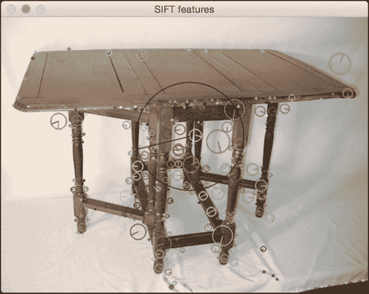
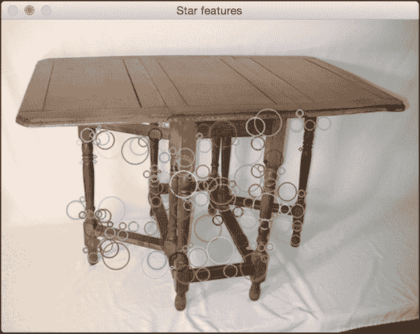

# 九、图像内容分析

在本章中，我们将介绍以下食谱:

*   使用 OpenCV-Python 对图像进行操作
*   检测边缘
*   直方图均衡
*   检测拐角
*   检测 SIFT 特征点
*   建筑之星特征探测器
*   使用视觉码本和矢量量化创建特征
*   使用极随机森林训练图像分类器
*   构建对象识别器

# 简介

**计算机视觉**是一个研究如何处理、分析和理解视觉数据内容的领域。在图像内容分析中，我们使用大量的计算机视觉算法来建立我们对图像中对象的理解。计算机视觉涵盖了图像分析的各个方面，如目标识别、形状分析、姿态估计、三维建模、视觉搜索等。人类真的很擅长识别和认识周围的事物！计算机视觉的最终目标是利用计算机对人类视觉系统进行精确建模。

计算机视觉由不同层次的分析组成。在低级视觉中，我们处理像素处理任务，例如边缘检测、形态处理和光流。在中级和高级视觉中，我们处理事物，例如对象识别、3D 建模、运动分析以及视觉数据的各种其他方面。随着我们越走越高，我们倾向于更深入地研究我们视觉系统的概念方面，并试图基于活动和意图提取视觉数据的描述。需要注意的一点是，较高层往往依赖较低层的输出进行分析。

这里最常见的一个问题是，“计算机视觉和图像处理有什么不同？”图像处理研究像素级的图像变换。图像处理系统的输入和输出都是图像。一些常见的例子是边缘检测、直方图均衡化或图像压缩。计算机视觉算法在很大程度上依赖图像处理算法来履行其职责。在计算机视觉中，我们处理更复杂的事情，包括在概念层面理解视觉数据。这样做的原因是因为我们想要对图像中的对象进行有意义的描述。计算机视觉系统的输出是给定图像中三维场景的解释。这种解释可以有多种形式，取决于手头的任务。

在本章中，我们将使用一个名为**【OpenCV】**的库来分析图像。OpenCV 是世界上最受欢迎的计算机视觉库。由于它已经针对许多不同的平台进行了高度优化，它已经成为行业中事实上的标准。在继续之前，请确保安装了支持 Python 的库。您可以在[http://opencv.org](http://opencv.org)下载安装 OpenCV。有关各种操作系统的详细安装说明，您可以参考网站上的文档部分。

# 使用 OpenCV-Python 对图像进行操作

让我们来看看如何使用 OpenCV-Python 对图像进行操作。在这个食谱中，我们将看到如何加载和显示图像。我们还将了解如何裁剪、调整大小以及将图像保存到输出文件中。

## 怎么做…

1.  新建一个 Python 文件，导入以下包:

    ```py
    import sys

    import cv2
    import numpy as np
    ```

2.  将输入图像指定为文件的第一个参数，并使用图像读取函数读取它。我们将使用`forest.jpg`，如下所示:

    ```py
    # Load and display an image -- 'forest.jpg'
    input_file = sys.argv[1]
    img = cv2.imread(input_file)
    ```

3.  显示输入图像，如下所示:

    ```py
    cv2.imshow('Original', img)
    ```

4.  我们现在将裁剪这张图片。提取输入图像的高度和宽度，然后指定边界:

    ```py
    # Cropping an image
    h, w = img.shape[:2]
    start_row, end_row = int(0.21*h), int(0.73*h)
    start_col, end_col= int(0.37*w), int(0.92*w)
    ```

5.  使用 NumPy 样式切片裁剪图像并显示:

    ```py
    img_cropped = img[start_row:end_row, start_col:end_col]
    cv2.imshow('Cropped', img_cropped)
    ```

6.  将图像调整到原始尺寸的`1.3`倍并显示:

    ```py
    # Resizing an image
    scaling_factor = 1.3
    img_scaled = cv2.resize(img, None, fx=scaling_factor, fy=scaling_factor, 
    interpolation=cv2.INTER_LINEAR)
    cv2.imshow('Uniform resizing', img_scaled)
    ```

7.  前面的方法将在两个维度上统一缩放图像。让我们假设我们想要基于特定的输出维度来扭曲图像。我们使用以下代码:

    ```py
    img_scaled = cv2.resize(img, (250, 400), interpolation=cv2.INTER_AREA)
    cv2.imshow('Skewed resizing', img_scaled)
    ```

8.  将图像保存到输出文件中:

    ```py
    # Save an image
    output_file = input_file[:-4] + '_cropped.jpg'
    cv2.imwrite(output_file, img_cropped)

    cv2.waitKey()
    ```

9.  `waitKey()`功能显示图像，直到你按下键盘上的一个键。
10.  The full code is given in the `operating_on_images.py` file that is already provided to you. If you run the code, you will see the following input image:

    

11.  The second output is the cropped image:

    

12.  The third output is the uniformly resized image:

    

13.  The fourth output is the skewed image:

    

# 检测边缘

**边缘检测**是计算机视觉中最流行的技术之一。它在许多应用中用作预处理步骤。让我们看看如何使用不同的边缘检测器来检测输入图像中的边缘。

## 怎么做…

1.  新建一个 Python 文件，导入以下包:

    ```py
    import sys

    import cv2
    import numpy as np 
    ```

2.  加载输入图像。我们将使用`chair.jpg` :

    ```py
    # Load the input image -- 'chair.jpg'
    # Convert it to grayscale 
    input_file = sys.argv[1]
    img = cv2.imread(input_file, cv2.IMREAD_GRAYSCALE)
    ```

3.  提取图像的高度和宽度:

    ```py
    h, w = img.shape
    ```

4.  **索贝尔滤波器**是一种类型的边缘检测器，使用 *3x3* 内核分别检测水平和垂直边缘。你可以在[http://www.tutorialspoint.com/dip/sobel_operator.htm](http://www.tutorialspoint.com/dip/sobel_operator.htm)了解更多。让我们从水平探测器开始:

    ```py
    sobel_horizontal = cv2.Sobel(img, cv2.CV_64F, 1, 0, ksize=5)
    ```

5.  运行垂直索贝尔检测器:

    ```py
    sobel_vertical = cv2.Sobel(img, cv2.CV_64F, 0, 1, ksize=5)
    ```

6.  **拉普拉斯边缘检测器**在两个方向上检测边缘。你可以在[http://homepages.inf.ed.ac.uk/rbf/HIPR2/log.htm](http://homepages.inf.ed.ac.uk/rbf/HIPR2/log.htm)了解更多。我们使用如下:

    ```py
    laplacian = cv2.Laplacian(img, cv2.CV_64F)
    ```

7.  即使拉普拉斯解决了 Sobel 的缺点，输出仍然非常嘈杂。 **Canny 边缘检测器**比都强，因为它处理问题的方式。这是一个多阶段的过程，它使用滞后来产生干净的边缘。你可以在[http://homepages.inf.ed.ac.uk/rbf/HIPR2/canny.htm](http://homepages.inf.ed.ac.uk/rbf/HIPR2/canny.htm):

    ```py
    canny = cv2.Canny(img, 50, 240)
    ```

    了解更多
8.  显示所有输出图像:

    ```py
    cv2.imshow('Original', img)
    cv2.imshow('Sobel horizontal', sobel_horizontal)
    cv2.imshow('Sobel vertical', sobel_vertical)
    cv2.imshow('Laplacian', laplacian)
    cv2.imshow('Canny', canny)

    cv2.waitKey()
    ```

9.  The full code is given in the `edge_detector.py` file that is already provided to you. The original input image looks like the following:

    

10.  Here is the horizontal Sobel edge detector output. Note how the detected lines tend to be vertical. This is due the fact that it's a horizontal edge detector, and it tends to detect changes in this direction:

    

11.  The vertical Sobel edge detector output looks like the following image:

    

12.  Here is the Laplacian edge detector output:

    

13.  Canny edge detector detects all the edges nicely, as shown in the following image:

    

# 直方图均衡化

**直方图均衡化**是修改图像像素强度以增强对比度的过程。人眼喜欢对比！这就是为什么几乎所有的相机系统都使用直方图均衡化来使图像看起来好看。有趣的是，直方图均衡化过程对于灰度和彩色图像是不同的。在处理彩色图像时有一个陷阱，我们将在这个食谱中看到它。让我们看看怎么做。

## 怎么做…

1.  新建一个 Python 文件，导入以下包:

    ```py
    import sys

    import cv2
    import numpy as np 
    ```

2.  加载输入图像。我们将使用图像，`sunrise.jpg` :

    ```py
    # Load input image -- 'sunrise.jpg'
    input_file = sys.argv[1]
    img = cv2.imread(input_file)
    ```

3.  将图像转换为灰度并显示:

    ```py
    # Convert it to grayscale
    img_gray = cv2.cvtColor(img, cv2.COLOR_BGR2GRAY)
    cv2.imshow('Input grayscale image', img_gray)
    ```

4.  均衡灰度图像的直方图并显示:

    ```py
    # Equalize the histogram
    img_gray_histeq = cv2.equalizeHist(img_gray)
    cv2.imshow('Histogram equalized - grayscale', img_gray_histeq)
    ```

5.  为了均衡彩色图像的直方图，我们需要遵循不同的程序。直方图均衡仅适用于强度通道。一幅 RGB 图像由三个颜色通道组成，我们不能对这些通道分别应用直方图均衡化过程。在我们做任何事情之前，我们需要把强度信息和颜色信息分开。所以，我们先把它转换成 YUV 色彩空间，均衡 Y 通道，然后再转换回 RGB 得到输出。您可以在[http://softpixel.com/~cwright/programming/colorspace/yuv](http://softpixel.com/~cwright/programming/colorspace/yuv)了解更多关于 YUV 色彩空间的信息。OpenCV 默认加载 BGR 格式的图像，所以我们先把它从 BGR 转换成 YUV:

    ```py
    # Histogram equalization of color images
    img_yuv = cv2.cvtColor(img, cv2.COLOR_BGR2YUV)
    ```

6.  均衡 Y 通道，如下所示:

    ```py
    img_yuv[:,:,0] = cv2.equalizeHist(img_yuv[:,:,0])
    ```

7.  将其转换回 BGR:

    ```py
    img_histeq = cv2.cvtColor(img_yuv, cv2.COLOR_YUV2BGR)
    ```

8.  显示输入和输出图像:

    ```py
    cv2.imshow('Input color image', img)
    cv2.imshow('Histogram equalized - color', img_histeq)

    cv2.waitKey()
    ```

9.  The full code is given in the `histogram_equalizer.py` file that is already provided to you. The input image is shown, as follows:

    

10.  The histogram equalized image looks like the following:

    

# 检测拐角

角点检测是计算机视觉中的一个重要过程。它帮助我们识别图像中的显著点。这是最早用于开发图像分析系统的特征提取技术之一。

## 怎么做…

1.  新建一个 Python 文件，导入以下包:

    ```py
    import sys

    import cv2
    import numpy as np
    ```

2.  加载输入图像。我们将使用`box.png` :

    ```py
    # Load input image -- 'box.png'
    input_file = sys.argv[1]
    img = cv2.imread(input_file)
    cv2.imshow('Input image', img)
    ```

3.  将图像转换为灰度并将其转换为浮点值。我们需要角点检测器的浮点值来工作:

    ```py
    img_gray = cv2.cvtColor(img, cv2.COLOR_BGR2GRAY)
    img_gray = np.float32(img_gray)
    ```

4.  在灰度图像上运行 **哈里斯角点检测器**功能。您可以在[了解更多关于哈里斯角点检测器的信息](http://docs.opencv.org/3.0-beta/doc/py_tutorials/py_feature2d/py_features_harris/py_features_harris.html)
5.  为了标记拐角，我们需要放大图像，如下所示:

    ```py
    # Resultant image is dilated to mark the corners
    img_harris = cv2.dilate(img_harris, None)
    ```

6.  让我们对图像进行阈值化，以显示重要的点:

    ```py
    # Threshold the image 
    img[img_harris > 0.01 * img_harris.max()] = [0, 0, 0]
    ```

7.  显示输出图像:

    ```py
    cv2.imshow('Harris Corners', img)
    cv2.waitKey()
    ```

8.  The full code is given in the `corner_detector.py` file that is already provided to you. The input image is displayed, as follows:

    

9.  The output image after detecting corners is as follows:

    

# 检测 SIFT 特征点

**尺度不变特征变换** ( **SIFT** )是计算机视觉领域最受欢迎的特征之一。大卫·劳在他的开创性论文中首次提出了这一点，该论文可在 https://www.cs.ubc.ca/~lowe/papers/ijcv04.pdf 获得。从那时起，它已经成为用于图像识别和内容分析的最有效的功能之一。它对规模、方向、强度等具有鲁棒性。这构成了我们物体识别系统的基础。让我们来看看如何检测这些特征点。

## 怎么做…

1.  新建一个 Python 文件，导入以下包:

    ```py
    import sys

    import cv2
    import numpy as np 
    ```

2.  加载输入图像。我们将使用`table.jpg` :

    ```py
    # Load input image -- 'table.jpg'
    input_file = sys.argv[1]
    img = cv2.imread(input_file)
    ```

3.  将此图像转换为灰度:

    ```py
    img_gray = cv2.cvtColor(img, cv2.COLOR_BGR2GRAY)
    ```

4.  初始化 SIFT 检测器对象并提取关键点:

    ```py
    sift = cv2.xfeatures2d.SIFT_create()
    keypoints = sift.detect(img_gray, None)
    ```

5.  关键点是显著点，但不是特征。这基本上给了我们突出点的位置。SIFT 也是一个非常有效的特征提取器，但是我们将在后面的食谱中看到它的这一方面。
6.  在输入图像的顶部绘制关键点，如下所示:

    ```py
    img_sift = np.copy(img)
    cv2.drawKeypoints(img, keypoints, img_sift, flags=cv2.DRAW_MATCHES_FLAGS_DRAW_RICH_KEYPOINTS)
    ```

7.  显示输入和输出图像:

    ```py
    cv2.imshow('Input image', img)
    cv2.imshow('SIFT features', img_sift)
    cv2.waitKey()
    ```

8.  The full code is given in the `feature_detector.py` file that is already provided to you. The input image is as follows:

    

9.  The output image looks like the following:

    

# 构建星特征检测器

SIFT 特征检测器在很多情况下都不错。然而，当我们构建对象识别系统时，我们可能希望在使用 SIFT 提取特征之前使用不同的特征检测器。这将使我们能够灵活地级联不同的块，以获得最佳性能。所以，在这种情况下，我们将使用**恒星特征检测器**来看看如何做到这一点。

## 怎么做…

1.  新建一个 Python 文件，导入以下包:

    ```py
    import sys

    import cv2
    import numpy as np 
    ```

2.  定义一个类来处理所有与星特征检测相关的功能:

    ```py
    class StarFeatureDetector(object):
        def __init__(self):
            self.detector = cv2.xfeatures2d.StarDetector_create()
    ```

3.  定义在输入图像上运行检测器的功能:

    ```py
        def detect(self, img):
            return self.detector.detect(img)
    ```

4.  在`main`功能中加载输入图像。我们将使用`table.jpg`:T2
5.  将图像转换为灰度:

    ```py
        # Convert to grayscale
        img_gray = cv2.cvtColor(input_img, cv2.COLOR_BGR2GRAY)
    ```

6.  使用星形特征检测器检测特征:

    ```py
        # Detect features using Star feature detector
        keypoints = StarFeatureDetector().detect(input_img)
    ```

7.  在输入图像上绘制关键点:

    ```py
        cv2.drawKeypoints(input_img, keypoints, input_img, 
                   flags=cv2.DRAW_MATCHES_FLAGS_DRAW_RICH_KEYPOINTS)
    ```

8.  显示输出图像:

    ```py
        cv2.imshow('Star features', input_img)
        cv2.waitKey()
    ```

9.  The full code is given in the `star_detector.py` file that is already provided to you. The output image looks like the following:

    

# 使用视觉码本和矢量量化创建特征

为了构建一个物体识别系统，我们需要从每个图像中提取特征向量。每个图像需要有一个签名，可以用于匹配。我们使用一个名为 **的概念来构建图像签名。该码本基本上是字典，我们将使用它来为训练数据集中的图像提供表示。我们使用矢量量化来聚类许多特征点，并得出质心。这些质心将作为我们视觉码本的元素。您可以在[http://mi . eng . cam . AC . uk/~ cipolla/讲座/PartIb/old/IB-visualcodebook . pdf](http://mi.eng.cam.ac.uk/~cipolla/lectures/PartIB/old/IB-visualcodebook.pdf)了解更多信息。**

在你开始之前，确保你有一些训练图像。给你提供了一个包含三个类的样本训练数据集，每个类有 20 个图像。这些图片是从[http://www.vision.caltech.edu/html-files/archive.html](http://www.vision.caltech.edu/html-files/archive.html)下载的。

要建立一个健壮的物体识别系统，你需要成千上万的图像。有一个叫做`Caltech256`的数据集，在这个领域非常流行！它包含 256 类图像，每个类包含数千个样本。您可以在[http://www.vision.caltech.edu/Image_Datasets/Caltech256](http://www.vision.caltech.edu/Image_Datasets/Caltech256)下载该数据集。

## 怎么做…

1.  这是一个冗长的食谱，所以我们只看重要的功能。完整的代码在已经提供给你的`build_features.py`文件中给出。让我们来看看为提取特征而定义的类:

    ```py
    class FeatureBuilder(object):
    ```

2.  定义从输入图像中提取特征的方法。我们将使用星检测器获取关键点，然后使用 SIFT 从这些位置提取描述符:

    ```py
        def extract_ features(self, img):
            keypoints = StarFeatureDetector().detect(img)
            keypoints, feature_vectors = compute_sift_features(img, keypoints)
            return feature_vectors
    ```

3.  我们需要从所有描述符中提取质心:

    ```py
        def get_codewords(self, input_map, scaling_size, max_samples=12):
            keypoints_all = []

            count = 0
            cur_label = ''
    ```

4.  每个图像将产生大量描述符。我们将只使用少量图像，因为质心在此之后不会有太大变化:

    ```py
            for item in input_map:
                if count >= max_samples:
                    if cur_class != item['object_class']:
                        count = 0
                else:
                    continue

            count += 1
    ```

5.  打印进度如下:

    ```py
            if count == max_samples:
                print "Built centroids for", item['object_class']
    ```

6.  提取当前标签:

    ```py
            cur_class = item['object_class']
    ```

7.  读取图像并调整大小:

    ```py
            img = cv2.imread(item['image_path'])
            img = resize_image(img, scaling_size)
    ```

8.  将维数设置为 128，提取特征:

    ```py
            num_dims = 128
            feature_vectors = self.extract_image_features(img)
            keypoints_all.extend(feature_vectors) 
    ```

9.  使用矢量量化对特征点进行量化。**矢量量化**是*N*-维版本的“四舍五入”。你可以在[http://www.data-compression.com/vq.shtml](http://www.data-compression.com/vq.shtml)了解更多。

    ```py
            kmeans, centroids = BagOfWords().cluster(keypoints_all)
            return kmeans, centroids
    ```

10.  定义处理词包模型和矢量量化的类:

    ```py
    class BagOfWords(object):
        def __init__(self, num_clusters=32):
            self.num_dims = 128
            self.num_clusters = num_clusters
            self.num_retries = 10
    ```

11.  定义量化数据点的方法。我们将使用 **k-means 聚类**来实现这一点:

    ```py
    def cluster(self, datapoints):
        kmeans = KMeans(self.num_clusters, 
            n_init=max(self.num_retries, 1),
            max_iter=10, tol=1.0)
    ```

12.  提取质心，如下所示:

    ```py
        res = kmeans.fit(datapoints)
        centroids = res.cluster_centers_
        return kmeans, centroids
    ```

13.  定义一种数据归一化的方法:

    ```py
    def normalize(self, input_data):
        sum_input = np.sum(input_data)

        if sum_input > 0:
            return input_data / sum_input
        else:
            return input_data
    ```

14.  定义一种获取特征向量的方法:

    ```py
    def construct_feature(self, img, kmeans, centroids):
        keypoints = StarFeatureDetector().detect(img)
        keypoints, feature_vectors = compute_sift_features(img, keypoints)
        labels = kmeans.predict(feature_vectors)
        feature_vector = np.zeros(self.num_clusters)
    ```

15.  建立直方图并归一化:

    ```py
        for i, item in enumerate(feature_vectors):
            feature_vector[labels[i]] += 1

            feature_vector_img = np.reshape(feature_vector, 
    ((1, feature_vector.shape[0])))
            return self.normalize(feature_vector_img)
    ```

16.  Define a method the extract the SIFT features:

    ```py
    # Extract SIFT features
    def compute_sift_features(img, keypoints):
        if img is None:
            raise TypeError('Invalid input image')

        img_gray = cv2.cvtColor(img, cv2.COLOR_BGR2GRAY)
        keypoints, descriptors = cv2.xfeatures2d.SIFT_create().compute(img_gray, keypoints)
        return keypoints, descriptors
    ```

    如前所述，完整的代码请参考 build_features.py。您应该以下列方式运行代码:

    ```py
    $ python build_features.py –-data-folder /path/to/training_img/ --codebook-file codebook.pkl --feature-map-file feature_map.pkl

    ```

    这将生成两个名为`codebook.pkl`和`feature_map.pkl`的文件。我们将在下一个食谱中使用这些文件。

# 使用极随机森林训练图像分类器

我们将使用 **【极随机森林】** ( **ERFs** )来训练我们的图像分类器。物体识别系统使用图像分类器将图像分类成已知的类别。由于的速度和精度，ERFs 在机器学习领域非常受欢迎。我们基本上构建了一堆基于我们的图像签名的决策树，然后训练森林做出正确的决定。你可以在[https://www . stat . Berkeley . edu/~ brei man/RandomForests/cc _ home . htm](https://www.stat.berkeley.edu/~breiman/RandomForests/cc_home.htm)了解更多随机森林。您可以在[http://www . Monte fiore . ulg . AC . be/~ Ernst/uploads/news/id63/extreme-random-trees . pdf](http://www.montefiore.ulg.ac.be/~ernst/uploads/news/id63/extremely-randomized-trees.pdf)了解 ERFs。

## 怎么做…

1.  新建一个 Python 文件，导入以下包:

    ```py
    import argparse 
    import cPickle as pickle 

    import numpy as np
    from sklearn.ensemble import ExtraTreesClassifier
    from sklearn import preprocessing
    ```

2.  定义参数解析器:

    ```py
    def build_arg_parser():
        parser = argparse.ArgumentParser(description='Trains the classifier')
        parser.add_argument("--feature-map-file", dest="feature_map_file", required=True,
    help="Input pickle file containing the feature map")
        parser.add_argument("--model-file", dest="model_file", required=False,
    help="Output file where the trained model will be stored")
        return parser
    ```

3.  定义一个类来处理电流变流体培训。我们将使用标签编码器来编码我们的训练标签:

    ```py
    class ERFTrainer(object):
        def __init__(self, X, label_words):
            self.le = preprocessing.LabelEncoder()  
            self.clf = ExtraTreesClassifier(n_estimators=100, max_depth=16, random_state=0)
    ```

4.  编码标签并训练分类器:

    ```py
            y = self.encode_labels(label_words)
            self.clf.fit(np.asarray(X), y)
    ```

5.  定义一个函数来编码标签:

    ```py
    def encode_labels(self, label_words):
        self.le.fit(label_words) 
        return np.array(self.le.transform(label_words), dtype=np.float32)
    ```

6.  定义一个函数对未知数据点进行分类:

    ```py
    def classify(self, X):
        label_nums = self.clf.predict(np.asarray(X))
        label_words = self.le.inverse_transform([int(x) for x in label_nums]) 
        return label_words
    ```

7.  定义`main`函数并解析输入参数:

    ```py
    if __name__=='__main__':
        args = build_arg_parser().parse_args()
        feature_map_file = args.feature_map_file
        model_file = args.model_file
    ```

8.  加载我们在上一个食谱中创建的特征图:

    ```py
        # Load the feature map
        with open(feature_map_file, 'r') as f:
            feature_map = pickle.load(f)
    ```

9.  提取特征向量:

    ```py
        # Extract feature vectors and the labels
        label_words = [x['object_class'] for x in feature_map]
        dim_size = feature_map[0]['feature_vector'].shape[1]  
        X = [np.reshape(x['feature_vector'], (dim_size,)) for x in feature_map]
    ```

10.  培训电流变流体，基于培训数据:

    ```py
        # Train the Extremely Random Forests classifier
        erf = ERFTrainer(X, label_words) 
    ```

11.  保存训练好的电流变液模型，如下所示:

    ```py
        if args.model_file:
            with open(args.model_file, 'w') as f:
                pickle.dump(erf, f)
    ```

12.  The full code is given in the `trainer.py` file that is provided to you. You should run the code in the following way:

    ```py
    $ python trainer.py --feature-map-file feature_map.pkl --model-file erf.pkl

    ```

    这将生成一个名为`erf.pkl`的文件。我们将在下一个食谱中使用这个文件。

# 构建对象识别器

现在我们训练了一个 ERF 模型，让我们继续构建一个可以识别未知图像内容的对象识别器。

## 怎么做…

1.  新建一个 Python 文件，导入以下包:

    ```py
    import argparse 
    import cPickle as pickle 

    import cv2
    import numpy as np

    import build_features as bf
    from trainer import ERFTrainer 
    ```

2.  定义参数解析器:

    ```py
    def build_arg_parser():
        parser = argparse.ArgumentParser(description='Extracts features \
    from each line and classifies the data')
        parser.add_argument("--input-image", dest="input_image", required=True,
    help="Input image to be classified")
        parser.add_argument("--model-file", dest="model_file", required=True,
    help="Input file containing the trained model")
        parser.add_argument("--codebook-file", dest="codebook_file", 
    required=True, help="Input file containing the codebook")
        return parser
    ```

3.  定义一个类来处理图像标签提取功能:

    ```py
    class ImageTagExtractor(object):
        def __init__(self, model_file, codebook_file):
            with open(model_file, 'r') as f:
                self.erf = pickle.load(f)

            with open(codebook_file, 'r') as f:
                self.kmeans, self.centroids = pickle.load(f)
    ```

4.  使用训练好的电流变流体模型定义一个函数来预测输出:

    ```py
        def predict(self, img, scaling_size):
            img = bf.resize_image(img, scaling_size)
            feature_vector = bf.BagOfWords().construct_feature(
    img, self.kmeans, self.centroids)
            image_tag = self.erf.classify(feature_vector)[0]
            return image_tag
    ```

5.  定义`main`功能，加载输入图像:

    ```py
    if __name__=='__main__':
        args = build_arg_parser().parse_args()
        model_file = args.model_file
        codebook_file = args.codebook_file
        input_image = cv2.imread(args.input_image)
    ```

6.  适当缩放图像，如下所示:

    ```py
        scaling_size = 200
    ```

7.  在终端上打印输出:

    ```py
        print "\nOutput:", ImageTagExtractor(model_file, 
        codebook_file).predict(input_image, scaling_size)
    ```

8.  The full code is given in the `object_recognizer.py` file that is already provided to you. You should run the code in the following way:

    ```py
    $ python object_recognizer.py --input-image imagefile.jpg --model-file erf.pkl --codebook-file codebook.pkl

    ```

    您将看到终端上打印的输出类。