# 一、从统计到机器学习的旅程

最近一段时间，**机器学习** ( **ML** )和数据科学获得了前所未有的普及。预计该领域在未来几年将呈指数级增长。首先，什么是机器学习？为什么有人需要不厌其烦地去理解这些原则？我们有你的答案。一个简单的例子可能是电子商务网站中的书籍推荐，当有人去搜索某本特定的书或任何其他产品推荐时，这些推荐被一起购买，以向用户提供他们可能喜欢的想法。听起来很神奇，对吧？事实上，利用机器学习，能够实现的远不止这些。

机器学习是一个研究分支，其中模型可以基于数据从经验中自动学习，而不像统计模型那样专门建模。随着时间的推移和更多的数据，模型预测将变得更好。

在第一章中，我们将介绍理解统计和机器学习术语所必需的基本概念，这些术语对于理解两个流之间的相似性是必要的，这些流要么是全职统计学家，要么是执行机器学习的软件工程师，但希望理解最大似然方法背后的统计工作。我们将快速介绍理解模型构建模块所必需的基础知识。

在本章中，我们将介绍以下内容:

*   模型建立和验证的统计术语
*   模型构建和验证的机器学习术语
*   机器学习模型概述

# 模型建立和验证的统计术语

统计学是数学的一个分支，研究数字数据的收集、分析、解释、表示和组织。

统计主要分为两个子分支:

*   **描述性统计**:这些用于汇总数据，如连续数据类型(如年龄)的平均值、标准差，而频率和百分比用于分类数据(如性别)。
*   **推断统计**:很多时候，收集整个数据(统计方法论中也叫总体)是不可能的，因此收集数据点的子集，也叫样本，会得出关于整个总体的结论，这就是所谓的推断统计。推断是使用假设检验、数字特征的估计、数据内关系的相关性等得出的。

统计建模是对数据进行统计，通过分析变量的重要性来发现潜在的隐藏关系。

# 机器学习

机器学习是计算机科学的一个分支，它利用过去的经验来学习和使用它的知识来做出未来的决定。机器学习是计算机科学、工程学和统计学的交叉。机器学习的目标是从给定的例子中归纳出一个可检测的模式或创建一个未知的规则。机器学习领域概述如下:

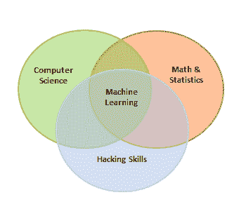

机器学习大致分为三类，但根据情况，这些类别可以结合起来，以实现特定应用的预期结果:

*   **监督学习**:这是教机器学习其他变量和一个目标变量之间的关系，类似于老师给学生提供成绩反馈的方式。监督学习的主要部分如下:
    *   分类问题
    *   回归问题
*   **无监督学习**:在无监督学习中，算法在没有任何监督或者没有提供任何目标变量的情况下自行学习。这是一个在给定数据中寻找隐藏模式和关系的问题。无监督学习中的类别如下:
    *   降维
    *   使聚集
*   **强化学习**:这允许机器或代理基于来自环境的反馈来学习其行为。在强化学习中，代理人在没有监督的情况下采取一系列果断的行动，最终会得到奖励，要么是+1，要么是-1。基于最终的回报，代理重新评估其路径。强化学习问题更接近人工智能方法论，而不是常用的机器学习算法。

在某些情况下，当变量数量非常多时，我们首先执行无监督学习来降低维数，然后执行有监督学习。同样，在一些人工智能应用中，监督学习与强化学习相结合可以用来解决问题；一个例子是自动驾驶汽车，最初，使用监督学习将图像转换为某种数字格式，并与驾驶动作(向左、向前、向右和向后)相结合。

# 统计建模和机器学习的主要区别

虽然统计建模和机器学习方法之间有内在的相似性，但有时对于许多实践者来说并不明显。在下表中，我们简洁地解释了差异，以显示两个流相似的方式以及它们之间的差异:

| **统计建模** | **机器学习** |
| 数学方程形式的变量之间关系的形式化。 | 不依赖于基于规则的编程就能从数据中学习的算法。 |
| 在对数据执行模型拟合之前，需要假设模型曲线的形状(例如，线性、多项式等)。 | 不需要假设基础形状，因为机器学习算法可以基于提供的数据自动学习复杂的模式。 |
| 统计模型预测产量的准确率为 85%，置信度为 90%。 | 机器学习只是以 85%的准确率预测输出。 |
| 在统计建模中，对参数进行各种诊断，如 p 值等。 | 机器学习模型不执行任何统计诊断显著性测试。 |
| 数据将被分成 70%-30%，以创建培训和测试数据。根据训练数据开发模型，并根据测试数据进行测试。 | 数据将被分成 50%-25%-25%，以创建培训、验证和测试数据。基于训练和超参数开发的模型根据验证数据进行调整，最后根据测试数据进行评估。 |
| 统计模型可以在称为训练数据的单个数据集上开发，因为诊断是在整体精度和单个变量水平上执行的。 | 由于缺乏对变量的诊断，机器学习算法需要在两个数据集上进行训练，称为训练和验证数据，以确保两点验证。 |
| 统计建模主要用于研究目的。 | 机器学习非常适合在生产环境中实现。 |
| 来自统计和数学学院。 | 来自计算机科学学院。 |

# 机器学习模型开发和部署的步骤

为了开发、验证和实现机器学习模型，机器学习模型的开发和部署包括一系列几乎类似于统计建模过程的步骤。步骤如下:

1.  **数据的收集**:机器学习的数据直接从结构化的源数据、网页报废、API、聊天交互等收集，因为机器学习可以对结构化和非结构化的数据(语音、图像和文本)进行工作。
2.  **数据准备和缺失/异常处理**:数据按照选择的机器学习算法进行格式化；此外，缺失值处理需要通过用平均值/中值替换缺失值和异常值来执行，以此类推。
3.  **数据分析与特征工程**:需要对数据进行分析，以便发现任何隐藏的模式和变量之间的关系等等。具有适当业务知识的正确特征工程将解决 70%的问题。此外，在实践中，数据科学家 70%的时间都花在功能工程任务上。
4.  **对训练和验证数据进行训练算法**:后特征工程，在统计建模中将数据分为三大块(训练、验证和测试数据)，而不是两块(训练和测试)。机器学习应用于训练数据，模型的超参数根据验证数据进行调整，以避免过度拟合。

5.  **在测试数据上测试算法**:一旦模型在列车和验证数据上表现出足够好的性能，将对照看不见的测试数据检查其性能。如果表现仍然足够好，我们可以进行下一步，也是最后一步。
6.  **部署算法**:训练好的机器学习算法将部署在直播流数据上，对结果进行分类。一个例子是由电子商务网站实现的推荐系统。

# 模型建立和验证的统计基础和术语

统计学本身是一门庞大的学科，可以写一本完整的书；然而，这里的尝试是集中在机器学习角度非常必要的关键概念上。在这一节中，涵盖了一些基础知识，其余的概念将在后面的章节中涵盖，只要有必要理解机器学习的统计等价物。

预测分析依赖于一个主要假设:历史会重演！

通过在验证关键度量后对历史数据拟合预测模型，相同的模型将被用于基于对过去数据有意义的相同解释变量来预测未来事件。

统计模型实施者的先行者是银行业和制药业；在一段时间内，分析也扩展到了其他行业。

统计模型是一类数学模型，通常由将一个或多个变量与近似现实联系起来的数学方程来指定。统计模型所包含的假设描述了一组概率分布，这将它与非统计、数学或机器学习模型区分开来

统计模型总是从一些潜在的假设开始，所有的变量都应该适用于这些假设，那么模型提供的性能在统计上是显著的。因此，了解所有构建模块中涉及的各种点点滴滴为成为一名成功的统计学家提供了坚实的基础。

在下一节中，我们用相关代码描述了各种基本原理:

*   **人口**:这是总体，观察的完整列表，或者关于研究对象的所有数据点。
*   **样本**:样本是人群的子集，通常是正在分析的人群的一小部分。


Usually, it is expensive to perform an analysis on an entire population; hence, most statistical methods are about drawing conclusions about a population by analyzing a sample.

*   **参数与统计**:任何基于总体计算的度量都是一个参数，而在样本上，它被称为**统计**。
*   **平均值**:这是一个简单的算术平均值，通过取值的总和除以这些值的计数来计算。平均值对数据中的异常值很敏感。离群值是指集合或列的值与同一数据中的许多其他值高度偏离；它通常有很高或很低的值。
*   **中位数**:这是数据的中点，按照升序或者降序排列计算。如果有 *N* 的观察。
*   **模式**:这是数据中重复次数最多的数据点:

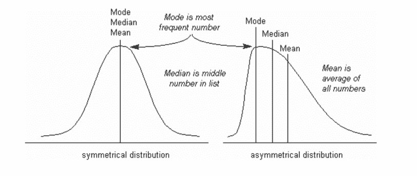

使用`numpy`数组和`stats`包计算平均值、中值和模式的 Python 代码如下:

```py
>>> import numpy as np 
>>> from scipy import stats 

>>> data = np.array([4,5,1,2,7,2,6,9,3]) 

# Calculate Mean 
>>> dt_mean = np.mean(data) ; print ("Mean :",round(dt_mean,2)) 

# Calculate Median 
>>> dt_median = np.median(data) ; print ("Median :",dt_median)          

# Calculate Mode 
>>> dt_mode =  stats.mode(data); print ("Mode :",dt_mode[0][0])                    

```

前面代码的输出如下:


We have used a NumPy array instead of a basic list as the data structure; the reason behind using this is the `scikit-learn` package built on top of NumPy array in which all statistical models and machine learning algorithms have been built on NumPy array itself. The `mode` function is not implemented in the `numpy` package, hence we have used SciPy's `stats` package. SciPy is also built on top of NumPy arrays.

描述性统计(平均值、中位数和模式)的 R 代码如下:

```py
data <- c(4,5,1,2,7,2,6,9,3) 
dt_mean = mean(data) ; print(round(dt_mean,2)) 
dt_median = median (data); print (dt_median) 

func_mode <- function (input_dt) { 
  unq <- unique(input_dt)  unq[which.max(tabulate(match(input_dt,unq)))] 
} 

dt_mode = func_mode (data); print (dt_mode) 

```

We have used the default `stats` package for R; however, the `mode` function was not built-in, hence we have written custom code for calculating the mode.

*   **变异的度量**:离差是数据中的变异，衡量数据中变量值的不一致性。分散实际上提供了一个关于传播的概念，而不是中心价值。
*   **范围**:这是数值的最大值和最小值之差。
*   **方差**:这是与均值的方差的均值( *xi* =数据点，*T5】=数据的均值， *N* =数据点个数)。方差的维度是实际值的平方。在群体中使用分母 *N-1* 代替 *N* 作为样本的原因是由于自由度。 *1* 计算方差时，样本中自由度的损失是由于样本替代的提取:*

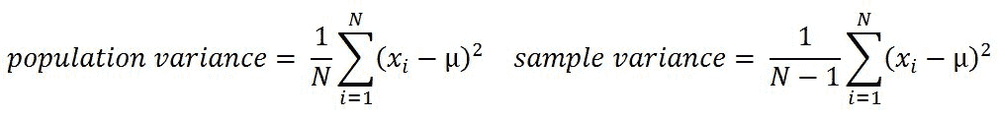

*   **标准差**:这是方差的平方根。通过对方差应用平方根，我们测量相对于原始变量的离差，而不是维度的平方:


*   **分位数**:这些只是数据中完全相同的片段。分位数包括百分位数、十分位数、四分位数等等。这些度量是在按升序排列数据后计算的:
    *   **百分位数**:这不过是数据点低于原始整体数据值的百分比。中位数是第 50 个<sup>百分位，因为低于中位数的数据点数量约为数据的 50%。</sup>
    *   **十分位数**:这是第 10 个百分位数，表示十分位数以下的数据点数量是整个数据的 10%。
    *   **四分位数**:这是数据的四分之一，也是第 25 <sup xmlns:epub="http://www.idpf.org/2007/ops">个</sup>百分位。第一个四分位数是数据的 25%，第二个四分位数是数据的 50%，第三个四分位数是数据的 75%。第二个四分位数也被称为中位数或第 50 <sup xmlns:epub="http://www.idpf.org/2007/ops">百分位数或第 5 <sup xmlns:epub="http://www.idpf.org/2007/ops">十分位数。</sup></sup>
    *   **四分位数区间**:这是第三个四分位数和第一个四分位数的差值。它能有效识别数据中的异常值。四分位数范围描述了中间 50%的数据点。


Python 代码如下:

```py
>>> from statistics import variance, stdev 
>>> game_points = np.array([35,56,43,59,63,79,35,41,64,43,93,60,77,24,82]) 

# Calculate Variance 
>>> dt_var = variance(game_points) ; print ("Sample variance:", round(dt_var,2)) 

# Calculate Standard Deviation 
>>> dt_std = stdev(game_points) ; print ("Sample std.dev:", round(dt_std,2)) 

# Calculate Range 
>>> dt_rng = np.max(game_points,axis=0) - np.min(game_points,axis=0) ; print ("Range:",dt_rng) 

#Calculate percentiles 
>>> print ("Quantiles:") 
>>> for val in [20,80,100]: 
>>>      dt_qntls = np.percentile(game_points,val)  
>>>      print (str(val)+"%" ,dt_qntls) 

# Calculate IQR                             
>>> q75, q25 = np.percentile(game_points, [75 ,25]); print ("Inter quartile range:",q75-q25) 

```

前面代码的输出如下:


离差(方差、标准差、范围、分位数和 IQR)的 R 码如下:

```py
game_points <- c(35,56,43,59,63,79,35,41,64,43,93,60,77,24,82) 
dt_var = var(game_points); print(round(dt_var,2)) 
dt_std = sd(game_points); print(round(dt_std,2)) 
range_val<-function(x) return(diff(range(x)))  
dt_range = range_val(game_points); print(dt_range) 
dt_quantile = quantile(game_points,probs = c(0.2,0.8,1.0)); print(dt_quantile) 
dt_iqr = IQR(game_points); print(dt_iqr) 

```

*   **假设检验**:这是通过对一个样本进行一些统计检验，对整体人群进行推断的过程。零假设和替代假设是验证假设是否具有统计学意义的方法。
*   **P 值**:假设零假设为真(通常在建模中，针对每个自变量，小于 0.05 的 P 值被认为是显著的，大于 0.05 的 P 值被认为是不显著的)，获得检验统计结果的概率至少和实际观察到的一样极端；尽管如此，这些值和定义可以根据上下文而改变)。

假设检验的步骤如下:

*   **假设检验的例子**:一个巧克力制造商，也是你的朋友，声称他工厂生产的所有巧克力至少有 1000g 重，你有一种奇怪的感觉，这可能不是真的；你们都采集了 30 块巧克力的样品，发现平均巧克力重量为 990 g，样品标准偏差为 12.5 g，给定 0.05 的显著性水平，我们可以拒绝你朋友提出的索赔吗？

无效假设为 *0 ≥ 1000* (所有巧克力重量均超过 1000)。

收集的样本:


计算测试统计:


*t =(990-1000)/(12.5/sqrt(30))= 4，3818*

*t 表中的临界 t 值= t0.05，30 = 1.699 = > - t0.05，30 = -1.699*

*P 值= 7.03 e-05*

测试统计为 *-4.3818* ，小于 *-1.699* 的临界值。因此，我们可以拒绝零假设(你朋友的说法)，即巧克力的平均重量超过 1000 克。

另外，决定索赔的另一种方法是使用 p 值。小于 *0.05* 的 p 值意味着索赔值和分布平均值显著不同，因此我们可以拒绝零假设:

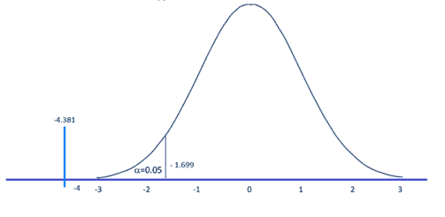

Python 代码如下:

```py
>>> from scipy import stats  
>>> xbar = 990; mu0 = 1000; s = 12.5; n = 30 

# Test Statistic 
>>> t_smple  = (xbar-mu0)/(s/np.sqrt(float(n))); print ("Test Statistic:",round(t_smple,2)) 

# Critical value from t-table 
>>> alpha = 0.05 
>>> t_alpha = stats.t.ppf(alpha,n-1); print ("Critical value from t-table:",round(t_alpha,3))           

#Lower tail p-value from t-table                          
>>> p_val = stats.t.sf(np.abs(t_smple), n-1); print ("Lower tail p-value from t-table", p_val)  

```

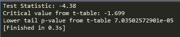

t 分布的 R 码如下:

```py
xbar = 990; mu0 = 1000; s = 12.5 ; n = 30 
t_smple = (xbar - mu0)/(s/sqrt(n));print (round(t_smple,2)) 

alpha = 0.05 
t_alpha = qt(alpha,df= n-1);print (round(t_alpha,3)) 

p_val = pt(t_smple,df = n-1);print (p_val) 

```

*   **ⅰ型和ⅱ型错误**:假设检验通常是对样本而不是整个人群进行的，这是由于收集所有可用数据的可用资源的实际限制。然而，当样本量的增加导致第一类和第二类误差最小化时，从样本中进行总体推断有其自身的成本，例如拒绝好的结果或接受错误的结果，更不用说单独使用了:
    *   **第一类错误**:当无效假设为真时，拒绝该假设
    *   **第二类错误**:接受虚假的零假设
*   **正态分布**:这在统计学中非常重要，因为中心极限定理指出，来自具有均值 *μ* 和方差 *σ2* 的总体的所有可能样本大小 *n* 的总体接近正态分布:

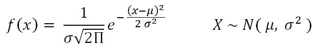

例:假设入学考试的考试成绩符合正态分布。此外，平均测试分数为 *52* ，标准偏差为 *16.3* 。考试中得分 *67* 以上的学生比例是多少？

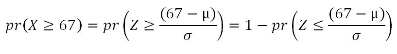

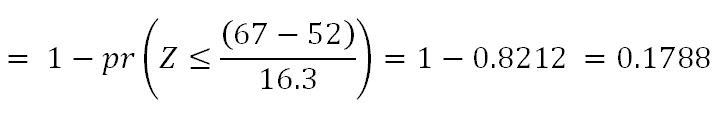


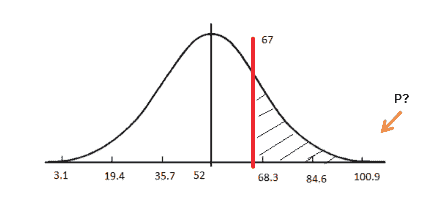

Python 代码如下:

```py
>>> from scipy import stats 
>>> xbar = 67; mu0 = 52; s = 16.3 

# Calculating z-score 
>>> z = (67-52)/16.3  

# Calculating probability under the curve     
>>> p_val = 1- stats.norm.cdf(z) 
>>> print ("Prob. to score more than 67 is ",round(p_val*100,2),"%") 

```

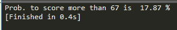

正态分布的 R 码如下:

```py
xbar = 67; mu0 = 52; s = 16.3 
pr = 1- pnorm(67, mean=52, sd=16.3) 
print(paste("Prob. to score more than 67 is ",round(pr*100,2),"%")) 

```

*   **卡方**:这种独立性检验是分类数据统计分析中最基本、最常见的假设检验之一。给定两个分类随机变量 *X* 和 *Y* ，独立性的卡方检验决定了它们之间是否存在统计相关性。

测试通常通过从数据计算 *χ2* 和从表格计算( *m-1* 、 *n-1* )度的 *χ2* 来进行。根据实际值和表值(以较高者为准)，决定两个变量是否独立:

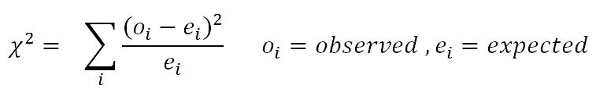

示例:在下表中，计算吸烟习惯是否对锻炼行为有影响:


Python 代码如下:

```py
>>> import pandas as pd 
>>> from scipy import stats 

>>> survey = pd.read_csv("survey.csv")   

# Tabulating 2 variables with row & column variables respectively 
>>> survey_tab = pd.crosstab(survey.Smoke, survey.Exer, margins = True) 

```

使用`crosstab`函数创建表格时，我们将额外获得行和列合计字段。然而，为了创建观察到的表，我们需要提取变量部分并忽略总数:

```py
# Creating observed table for analysis 
>>> observed = survey_tab.ix[0:4,0:3]  

```

stats 包中的`chi2_contingency`函数使用观察到的表，并随后计算其预期的表，然后计算 p 值，以检查两个变量是否相关。如果 *p 值< 0.05* ，两个变量之间有很强的依赖性，而如果 *p 值> 0.05* ，变量之间没有依赖性:

```py
>>> contg = stats.chi2_contingency(observed= observed) 
>>> p_value = round(contg[1],3) 
>>> print ("P-value is: ",p_value) 

```

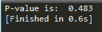

p 值为`0.483`，表示吸烟习惯和运动行为之间没有依赖性。

卡方的 R 码如下:

```py
survey = read.csv("survey.csv",header=TRUE) 
tbl = table(survey$Smoke,survey$Exer) 
p_val = chisq.test(tbl) 

```

*   **方差分析**:方差分析检验两个或两个以上总体均值相等的假设。ANOVAs 通过比较不同因素水平的反应变量均值来评估一个或多个因素的重要性。零假设认为所有的总体平均值都是相等的，而另一种假设认为至少有一个是不同的。

一家肥料公司经过研究开发出三种新型通用肥料，可用于种植任何类型的作物。为了找出这三种作物的产量是否相似，他们在研究中随机选择了六种作物类型。根据随机区组设计，每种作物类型将分别用所有三种肥料进行测试。下表以克/米 <sup>2</sup> 为单位表示产量。在 0.05 的显著性水平上，测试三种新型肥料的平均产量是否相等:

| **肥料 1** | **肥料 2** | **肥料 3** |
| Sixty-two | Fifty-four | Forty-eight |
| Sixty-two | Fifty-six | Sixty-two |
| Ninety | Fifty-eight | Ninety-two |
| forty-two | Thirty-six | Ninety-six |
| Eighty-four | seventy-two | Ninety-two |
| Sixty-four | Thirty-four | Eighty |

Python 代码如下:

```py
>>> import pandas as pd 
>>> from scipy import stats 
>>> fetilizers = pd.read_csv("fetilizers.csv") 

```

使用`stats`包计算单向方差分析:

```py
>>> one_way_anova = stats.f_oneway(fetilizers["fertilizer1"], fetilizers["fertilizer2"], fetilizers["fertilizer3"]) 

>>> print ("Statistic :", round(one_way_anova[0],2),", p-value :",round(one_way_anova[1],3)) 

```


结果:p 值确实小于 0.05，因此我们可以拒绝肥料的平均作物产量相等的无效假设。肥料对农作物有很大的影响。

方差分析的 R 码如下:

```py
fetilizers = read.csv("fetilizers.csv",header=TRUE) 
r = c(t(as.matrix(fetilizers))) 
f = c("fertilizer1","fertilizer2","fertilizer3") 
k = 3; n = 6 
tm = gl(k,1,n*k,factor(f)) 
blk = gl(n,k,k*n) 
av = aov(r ~ tm + blk) 
smry = summary(av) 

```

*   **混淆矩阵**:这是实际与预测的矩阵。这个概念可以通过使用该模型进行癌症预测的例子得到更好的解释:


混淆矩阵中使用的一些术语包括:

(TP/TP+FP)

(TP/TP+fn)


*(TN/TN+FP)*

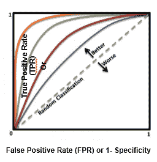

利用曲线下面积设定截止概率阈值，将预测概率分为不同类别；我们将在接下来的章节中介绍这种方法是如何工作的。

*   **观察和表现窗口**:在统计建模中，模型试图提前而不是当下预测事件，这样就会存在一些缓冲时间来进行纠正措施。例如，信用卡公司的一个问题是，例如，特定客户在未来 12 个月内违约的概率有多大？这样我就可以给他打电话，提供任何折扣或相应地制定我的收藏策略。

为了回答这个问题，需要使用过去 24 个月的自变量和未来 12 个月的因变量来开发违约概率模型(或技术术语中的行为记分卡)。用*X**Y*变量准备数据后，随机拆分成 70%-30%作为训练和测试数据；这种方法被称为**及时验证**，因为列车样本和测试样本来自同一时间段:


*   **时间内和时间外验证**:时间内验证意味着从同一时间段获得训练和测试数据集，而时间外验证意味着从不同时间段获得训练和测试数据集。通常，由于训练数据集和测试数据集的特征可能不同这一明显的原因，模型在非实时验证中的表现比在实时验证中的表现更差。
*   **R 平方(决定系数)**:这是由模型解释的响应变量变化百分比的度量。这也是一种衡量模型与仅利用平均值作为估计值相比将误差降至最低程度的方法。在某些极端情况下，R 平方的值也可能小于零，这意味着模型的预测值比仅将简单平均值作为所有观测值的预测值表现更差。我们将在接下来的章节中详细研究这个参数:


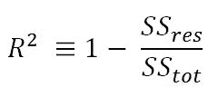

*   **调整后的 R 平方**:调整后的 R 平方统计量的解释几乎与 R 平方相同，但是如果模型中包含没有强相关性的额外变量，它会惩罚 R 平方值:

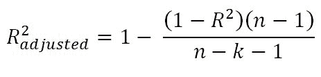

这里， *R2* =样本 R 平方值， *n* =样本量， *k* =预测因子(或)变量数。

调整后的 R 平方值是评价线性回归质量的关键指标。任何具有值 *R2 调整后的> = 0.7* 的线性回归模型都被认为是足够好的实施模型。

例:样本的 R 平方值为 *0.5，*，样本量为 *50* ，自变量数量为 *10* 。计算调整后的 R 平方:


*   **最大似然估计(MLE)** :这是通过寻找最大化观察可能性的参数值来估计统计模型(准确地说是逻辑回归)的参数值。我们将在[第 3 章](3.html)、*逻辑回归与随机森林*中更深入地介绍这种方法。
*   **阿卡克信息准则(AIC)** :这在逻辑回归中使用，类似于线性回归的调整 R-square 原理。它衡量给定数据集的模型的相对质量:


这里， *k* =预测因子或变量的数量

AIC 的想法是，如果模型中包含没有很强预测能力的额外变量，就惩罚目标函数。这是逻辑回归中的一种正则化。

*   **熵**:这个来自信息论，是对数据中杂质的度量。如果样本完全齐次，熵为零，如果样本等分，则熵为 *1* 。在决策树中，具有最大异质性的预测器将被认为最接近根节点，以贪婪模式将给定数据分类。我们将在[第 4 章](4.html)、*基于树的机器学习模型*中更深入地讨论这个主题:


这里， *n* =类数。熵在中间最大，值为 *1* ，在极端值为 *0* 时最小。较低的熵值是可取的，因为它将更好地隔离类别:


例如:给定两种硬币，其中第一种是公平的( *1/2* 头和 *1/2* 尾概率)，另一种是有偏差的( *1/3* 头和 *2/3* 尾概率)，计算两者的熵，并证明哪一种在建模方面更好:

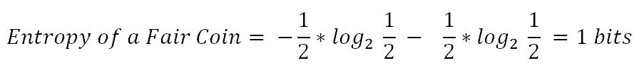


从这两个值中，决策树算法选择有偏硬币而不是公平硬币作为观察分割器，因为熵的值较少。

*   **信息增益**:这是根据给定的属性对示例进行划分所导致的熵的预期降低。这个想法是从混合类开始，并保持分区，直到每个节点都观察到最纯的类。在每个阶段，以贪婪的方式选择具有最大信息增益的变量:

*信息增益=父项熵-和(加权% *子项熵)*

*加权% =特定子节点中的观察数/总和(所有子节点中的观察数)*

*   **基尼**:基尼杂质是一种错误分类的度量，适用于多类分类器上下文。基尼系数的工作原理与熵几乎相同，只是基尼系数的计算速度更快:


这里， *i* =类数。基尼系数和熵之间的相似性如下所示:

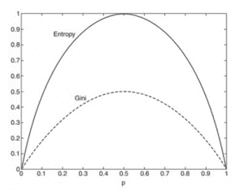

# 偏差与方差的权衡

除了白噪声，每个模型都有偏差和方差误差分量。偏差和方差彼此成反比；当试图减少一个组件时，模型的另一个组件将增加。真正的艺术在于通过平衡两者来创造良好的契合。理想的模型将具有低偏差和低方差。

偏差部分的误差来自基础学习算法中的错误假设。高偏差会导致算法错过特征和目标输出之间的相关关系；这种现象导致了装配不足的问题。

另一方面，方差分量的误差来自对模型拟合变化的敏感性，甚至是训练数据的微小变化；高方差会导致过拟合问题:


高偏差模型的一个例子是逻辑回归或线性回归，其中模型的拟合仅仅是一条直线，并且由于线性模型不能很好地逼近基础数据的事实，可能具有高误差分量。

高方差模型的一个例子是决策树，其中模型可能会创建太多的摆动曲线作为拟合，其中即使训练数据的微小变化也会导致曲线拟合的剧烈变化。

目前，最先进的模型正在利用高方差模型，如决策树，并在它们之上执行集成，以减少由高方差引起的误差，同时不损害由偏差分量引起的误差增加。这个类别最好的例子是随机森林，其中许多决策树将独立生长和集成，以便得出最佳匹配；我们将在接下来的章节中介绍这一点:


# 培训和测试数据

在实践中，在统计建模中，数据通常会被随机分成 70-30 或 80-20 个训练和测试数据集，其中用于建立模型的训练数据及其有效性将在测试数据上进行检查:


在下面的代码中，我们将原始数据分成 70%-30%的训练和测试数据。这里需要考虑的一个要点是，我们为随机数设置种子值，以便每次在训练和测试数据中创建相同的观察值时重复随机采样。重现结果非常需要重复性:

```py
# Train & Test split 
>>> import pandas as pd       
>>> from sklearn.model_selection import train_test_split 

>>> original_data = pd.read_csv("mtcars.csv")      

```

在下面的代码中，`train size`是`0.7`，这意味着 70%的数据应该被分割到训练数据集中，剩下的 30%应该在测试数据集中。随机状态是生成伪随机数过程中的种子，这使得每次运行时通过拆分完全相同的观察结果可以重复:

```py
>>> train_data,test_data = train_test_split(original_data,train_size = 0.7,random_state=42) 

```

用于统计建模的列车和测试分离的 R 代码如下:

```py
full_data = read.csv("mtcars.csv",header=TRUE) 
set.seed(123) 
numrow = nrow(full_data) 
trnind = sample(1:numrow,size = as.integer(0.7*numrow)) 
train_data = full_data[trnind,] 
test_data = full_data[-trnind,] 

```

# 模型构建和验证的机器学习术语

统计建模和机器学习之间似乎有相似之处，我们将在后续章节中深入讨论。然而，已经提供了如下快速视图:在统计建模中，具有两个独立变量的线性回归试图拟合具有最少误差的最佳平面，而在机器学习中，独立变量已经被转换成误差项的平方(平方确保函数将变得凸，这增强了更快的收敛并且还确保了全局最优)，并且基于系数值而不是独立变量进行优化:


机器学习利用优化来调整各种算法的所有参数。因此，了解一些关于优化的基础知识是一个好主意。

在步入梯度下降之前，引入凸函数和非凸函数是非常有帮助的。凸函数是这样的函数，其中函数上任意两个随机点之间的线也位于函数内，而非凸函数则不是这样。重要的是要知道函数是凸的还是非凸的，因为在凸函数中，局部最优也是全局最优，而对于非凸函数，局部最优不能保证全局最优:

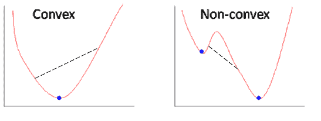

这看起来是个棘手的问题吗？一个转变可能是在不同的随机地点启动搜索过程；这样，它通常会收敛到全局最优值:

*   梯度下降:这是一种最小化由模型参数*θ**εR<sup>d</sup>*参数化的目标函数*J(θ)*的方法，方法是在与目标函数相对于参数的梯度相反的方向上更新参数。学习率决定了达到最小值所采取的步骤的大小。
*   **整批梯度下降(每次迭代考虑的所有训练观测值)**:整批梯度下降中，每次迭代考虑所有观测值；这种方法会占用大量内存，并且速度也会很慢。此外，在实践中，我们不需要所有的观察来更新权重。尽管如此，这种方法还是以巨大的计算量为代价，以较少的噪声提供了更新参数的最佳方式。
*   **随机梯度下降(每次迭代一个观测值)**:该方法通过在每个迭代阶段取一个观测值来更新权重。该方法提供了遍历权重的最快方法；然而，收敛时会产生大量噪音。
*   **迷你批量梯度下降(每次迭代约 30 个训练观察或更多)**:这是巨大计算成本和快速更新权重方法之间的权衡。在这种方法中，在每次迭代中，将随机选择大约 30 个观测值，并计算梯度来更新模型权重。在这里，很多人可能会问，为什么最低 30，而不是任何其他数字？如果我们研究统计基础，需要考虑 30 个观察，以便将样本近似为总体。然而，即使是 40、50 等也会在批量选择上做得很好。尽管如此，从业者需要改变批次大小并验证结果，以确定模型以什么值产生最佳结果:


# 线性回归与梯度下降

在下面的代码中，对同一数据集上以统计方式应用线性回归和以机器学习方式应用梯度下降进行了比较:

```py
>>> import numpy as np 
>>> import pandas as pd 

```

以下代码描述了使用熊猫数据框读取数据:

```py
>>> train_data = pd.read_csv("mtcars.csv")      

```

将 DataFrame 变量转换为 NumPy 数组，以便在 scikit learn 包中处理它们，因为 scikit-learn 是基于 NumPy 数组本身构建的，接下来将显示:

```py
>>> X = np.array(train_data["hp"])  ; y = np.array(train_data["mpg"])  
>>> X = X.reshape(32,1); y = y.reshape(32,1) 

```

从 scikit-learn 包导入线性回归；这适用于最小二乘法:

```py
>>> from sklearn.linear_model import LinearRegression 
>>> model = LinearRegression(fit_intercept = True) 

```

对数据拟合线性回归模型，显示单变量(`hp`变量)的截距和系数:

```py
>>> model.fit(X,y) 
>>> print ("Linear Regression Results" ) 
>>> print ("Intercept",model.intercept_[0] ,"Coefficient", model.coef_[0]) 

```

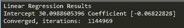

现在我们将从头开始应用梯度下降；在未来的章节中，我们可以使用 scikit-learn 内置模块，而不是从基本原则开始。然而，在这里，已经提供了关于优化方法的内部工作的说明，整个机器学习已经建立在该优化方法上。

定义梯度下降函数`gradient_descent`如下:

*   `x`:自变量。
*   `y`:因变量。
*   `learn_rate`:梯度更新的学习速率；过低会导致收敛变慢，过高会导致梯度过冲。
*   `batch_size`:每次迭代更新梯度时考虑的观测数；数字越大，迭代次数越少，数字越小，误差越小。理想情况下，由于统计显著性，批次大小应为最小值 30。但是，需要尝试各种设置来检查哪一个更好。
*   `max_iter`:最大迭代次数，超过该次数算法将自动终止:

```py
>>> def gradient_descent(x, y,learn_rate, conv_threshold,batch_size, max_iter): 
...    converged = False 
...    iter = 0 
...    m = batch_size   
...    t0 = np.random.random(x.shape[1]) 
...    t1 = np.random.random(x.shape[1]) 

```

Mean square error calculation
Squaring of error has been performed to create the convex function, which has nice convergence properties:
`...    MSE = (sum([(t0 + t1*x[i] - y[i])**2 for i in range(m)])/ m)`

下面的代码声明，运行算法直到它不满足收敛标准:

```py
...      while not converged:         
...          grad0 = 1.0/m * sum([(t0 + t1*x[i] - y[i]) for i in range(m)])   
...          grad1 = 1.0/m * sum([(t0 + t1*x[i] - y[i])*x[i] for i in range(m)])  
...          temp0 = t0 - learn_rate * grad0 
...          temp1 = t1 - learn_rate * grad1     
...          t0 = temp0 
...          t1 = temp1 

```

用更新的参数计算新的误差，以便检查新的误差变化是否超过预定的收敛阈值；否则，停止迭代并返回参数:

```py
...          MSE_New = (sum( [ (t0 + t1*x[i] - y[i])**2 for i in range(m)] ) / m) 
...          if abs(MSE - MSE_New ) <= conv_threshold: 
...              print 'Converged, iterations: ', iter 
...              converged = True     
...          MSE = MSE_New    
...          iter += 1      
...          if iter == max_iter: 
...              print 'Max interactions reached' 
...              converged = True 
...          return t0,t1 

```

以下代码描述了使用定义的值运行梯度下降函数。学习率= 0.0003，收敛阈值= 1e-8，批量= 32，最大迭代次数= 1500000:

```py
>>> if __name__ == '__main__': 
...      Inter, Coeff = gradient_descent(x = X,y = y,learn_rate=0.00003 , conv_threshold = 1e-8, batch_size=32,max_iter=1500000) 
...      print ('Gradient Descent Results')  
...      print (('Intercept = %s Coefficient = %s') %(Inter, Coeff))  

```

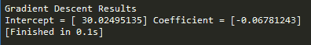

线性回归相对于梯度下降的 R 代码如下:

```py
# Linear Regression 
train_data = read.csv("mtcars.csv",header=TRUE) 
model <- lm(mpg ~ hp, data = train_data) 
print (coef(model)) 

# Gradient descent 
gradDesc <- function(x, y, learn_rate, conv_threshold, batch_size, max_iter) { 
  m <- runif(1, 0, 1) 
  c <- runif(1, 0, 1) 
  ypred <- m * x + c 
  MSE <- sum((y - ypred) ^ 2) / batch_size 

  converged = F 
  iterations = 0 

  while(converged == F) { 
    m_new <- m - learn_rate * ((1 / batch_size) * (sum((ypred - y) * x))) 
    c_new <- c - learn_rate * ((1 / batch_size) * (sum(ypred - y))) 

    m <- m_new 
    c <- c_new 
    ypred <- m * x + c
 MSE_new <- sum((y - ypred) ^ 2) / batch_size

 if(MSE - MSE_new <= conv_threshold) {
 converged = T
 return(paste("Iterations:",iterations,"Optimal intercept:", c, "Optimal slope:", m))
 }
 iterations = iterations + 1

 if(iterations > max_iter) {
 converged = T
 return(paste("Iterations:",iterations,"Optimal intercept:", c, "Optimal slope:", m))
 }
 MSE = MSE_new
 }
}
gradDesc(x = train_data$hp,y =  train_data$mpg, learn_rate = 0.00003, conv_threshold = 1e-8, batch_size = 32, max_iter = 1500000)

```

# 机器学习损失

机器学习中的损失函数或成本函数是将变量的值映射到一个实数上的函数，该实数直观地表示与变量值相关的一些成本。优化方法通过改变参数值来最小化损失函数，这是机器学习的中心主题。

零一损耗为*L0-1 = 1(m<= 0)*；在零一损失中， *m >的损失值为*0*= 0*，而 *1* 的损失值为 *m < 0* 。这种损失的难点在于它是不可微的、非凸的，并且还是 NP 难的。因此，为了使优化可行和可解，这些损失被不同问题的不同替代损失所代替。

用于机器学习代替零一损失的替代损失如下。零一损耗不可微，因此使用近似损耗来代替:

*   平方损失(用于回归)
*   铰链损耗(SVM)
*   逻辑/对数损失(逻辑回归)

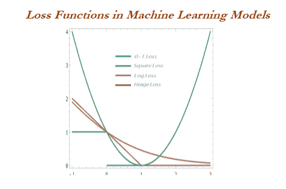

一些损失函数如下:


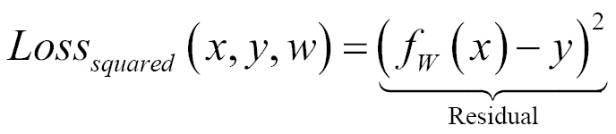


# 何时停止调整机器学习模型

何时停止调整机器学习模型中的超参数是一个价值百万美元的问题。这个问题大部分可以通过关注训练和测试错误来解决。在增加模型复杂性的同时，会出现以下几个阶段:

*   **阶段 1** :欠拟合阶段-高列车和高测试误差(或低列车和低测试精度)
*   **阶段 2** :良好拟合阶段(理想场景)-低列车和低测试误差(或高列车和高测试精度)
*   **阶段 3** :过拟合阶段-低列车和高测试误差(或高列车和低测试精度)

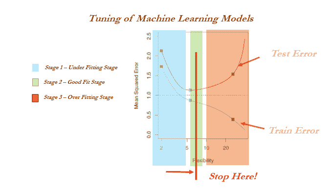

# 培训、验证和测试数据

由于多种原因，交叉验证在统计建模领域并不流行；统计模型本质上是线性的和稳健的，并且没有高方差/过拟合问题。因此，模型拟合将在训练或测试数据上保持不变，这在机器学习世界中并不成立。此外，在统计建模中，除了聚合度量之外，许多测试都是在单个参数级别执行的，而在机器学习中，我们在单个参数级别没有可见性:


在下面的代码中，提供了 R 和 Python 的实现。如果未提供任何百分比，则默认参数为列车数据 50%，验证数据 25%，其余测试数据 25%。

Python 实现只有一个训练和测试分割功能，因此我们使用了两次，并且还使用了要分割的观察数而不是百分比(如前面的训练和测试分割示例所示)。因此，需要一个定制的函数来分割成三个数据集:

```py
>>> import pandas as pd       
>>> from sklearn.model_selection import train_test_split               

>>> original_data = pd.read_csv("mtcars.csv")                    

>>> def data_split(dat,trf = 0.5,vlf=0.25,tsf = 0.25): 
...      nrows = dat.shape[0]     
...      trnr = int(nrows*trf) 
...      vlnr = int(nrows*vlf)     

```

下面的 Python 代码将数据分为训练数据和剩余数据。剩余的数据将进一步分为验证和测试数据集:

```py
...      tr_data,rmng = train_test_split(dat,train_size = trnr,random_state=42) 
...      vl_data, ts_data = train_test_split(rmng,train_size = vlnr,random_state=45)     
...      return (tr_data,vl_data,ts_data) 

```

对原始数据执行拆分功能以创建三个数据集(按 50%、25%和 25%拆分)如下:

```py
>>> train_data, validation_data, test_data = data_split (original_data ,trf=0.5, vlf=0.25,tsf=0.25) 

```

列车、验证和测试分离的代码如下:

```py
# Train Validation & Test samples 
trvaltest <- function(dat,prop = c(0.5,0.25,0.25)){ 
  nrw = nrow(dat) 
  trnr = as.integer(nrw *prop[1]) 
  vlnr = as.integer(nrw*prop[2]) 
  set.seed(123) 
  trni = sample(1:nrow(dat),trnr) 
  trndata = dat[trni,] 
  rmng = dat[-trni,] 
  vlni = sample(1:nrow(rmng),vlnr) 
  valdata = rmng[vlni,] 
  tstdata = rmng[-vlni,] 
  mylist = list("trn" = trndata,"val"= valdata,"tst" = tstdata) 
  return(mylist) 
} 
outdata = trvaltest(mtcars,prop = c(0.5,0.25,0.25)) 
train_data = outdata$trn; valid_data = outdata$val; test_data = outdata$tst 

```

# 交叉验证

交叉验证是以计算为代价确保模型稳健性的另一种方式。在普通的建模方法中，基于列车数据开发模型，并基于测试数据进行评估。在一些极端情况下，训练和测试可能没有被均匀地选择，一些看不见的极端情况可能出现在测试数据中，这将拖累模型的性能。

另一方面，在交叉验证方法中，数据被分成相等的部分，并对数据的所有其他部分进行训练，只有一部分除外，将对其性能进行评估。用户选择了多少零件，这个过程就重复多少次。

**示例**:在五重交叉验证中，将数据分为五部分，随后对四部分数据进行训练，并对一部分数据进行测试。这个过程将运行五次，以便覆盖数据中的所有点。最后，计算的误差将是所有误差的平均值:

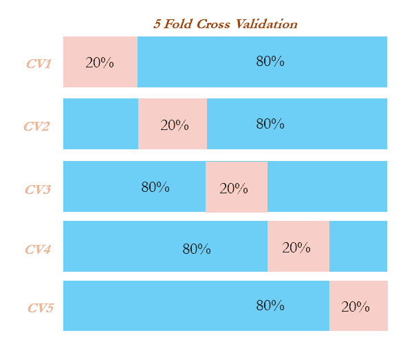

# 网格搜索

机器学习中的网格搜索是一种流行的方法，用于调整模型的超参数，以便找到确定最佳拟合的最佳组合:

**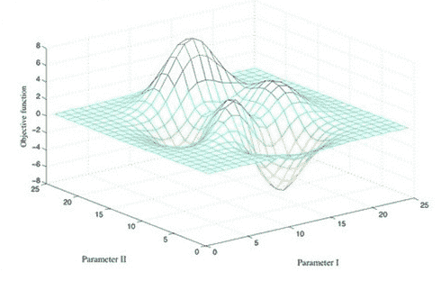**

在下面的代码中，已经执行了实现来确定特定用户是否会点击广告。网格搜索已经使用决策树分类器来实现分类。调整参数是树的深度、终端节点中的最小观察数以及执行节点拆分所需的最小观察数:

```py
# Grid search 
>>> import pandas as pd 
>>> from sklearn.tree import DecisionTreeClassifier 
>>> from sklearn.model_selection import train_test_split 
>>> from sklearn.metrics import classification_report,confusion_matrix,accuracy_score 
>>> from sklearn.pipeline import Pipeline 
>>> from sklearn.grid_search import GridSearchCV 

>>> input_data = pd.read_csv("ad.csv",header=None)                        

>>> X_columns = set(input_data.columns.values) 
>>> y = input_data[len(input_data.columns.values)-1] 
>>> X_columns.remove(len(input_data.columns.values)-1) 
>>> X = input_data[list(X_columns)] 

```

将数据分为训练和测试两部分:

```py
>>> X_train, X_test,y_train,y_test = train_test_split(X,y,train_size = 0.7,random_state=33) 

```

创建一个管道，为网格搜索创建变量组合:

```py
>>> pipeline = Pipeline([ 
...      ('clf', DecisionTreeClassifier(criterion='entropy')) ]) 

```

要探索的组合以 Python 字典格式作为参数给出:

```py
>>> parameters = { 
...      'clf__max_depth': (50,100,150), 
...      'clf__min_samples_split': (2, 3), 
...      'clf__min_samples_leaf': (1, 2, 3)} 

```

`n_jobs`字段用于选择计算机中的核心数量；`-1`表示它使用计算机中的所有核心。评分方法是准确性，可以选择很多其他选项，如`precision`、`recall`、`f1`:

```py
>>> grid_search = GridSearchCV(pipeline, parameters, n_jobs=-1, verbose=1, scoring='accuracy') 
>>> grid_search.fit(X_train, y_train)  

```

使用网格搜索的最佳参数进行预测:

```py
>>> y_pred = grid_search.predict(X_test) 

```

输出如下:

```py
>>> print ('\n Best score: \n', grid_search.best_score_) 
>>> print ('\n Best parameters set: \n')   
>>> best_parameters = grid_search.best_estimator_.get_params() 
>>> for param_name in sorted(parameters.keys()): 
>>>     print ('\t%s: %r' % (param_name, best_parameters[param_name])) 
>>> print ("\n Confusion Matrix on Test data \n",confusion_matrix(y_test,y_pred)) 
>>> print ("\n Test Accuracy \n",accuracy_score(y_test,y_pred)) 
>>> print ("\nPrecision Recall f1 table \n",classification_report(y_test, y_pred)) 

```

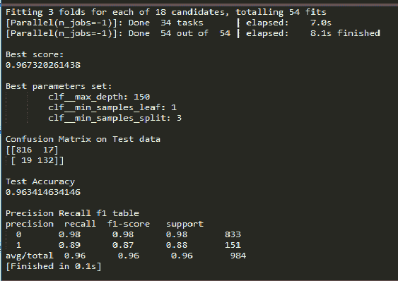

决策树上网格搜索的代码如下:

```py
# Grid Search on Decision Trees 
library(rpart) 
input_data = read.csv("ad.csv",header=FALSE) 
input_data$V1559 = as.factor(input_data$V1559) 
set.seed(123) 
numrow = nrow(input_data) 
trnind = sample(1:numrow,size = as.integer(0.7*numrow)) 

train_data = input_data[trnind,];test_data = input_data[-trnind,] 
minspset = c(2,3);minobset = c(1,2,3) 
initacc = 0 

for (minsp in minspset){ 
  for (minob in minobset){ 
    tr_fit = rpart(V1559 ~.,data = train_data,method = "class",minsplit = minsp, minbucket = minob) 
    tr_predt = predict(tr_fit,newdata = train_data,type = "class") 
    tble = table(tr_predt,train_data$V1559) 
    acc = (tble[1,1]+tble[2,2])/sum(tble) 
    acc 
    if (acc > initacc){ 
      tr_predtst = predict(tr_fit,newdata = test_data,type = "class") 
      tblet = table(test_data$V1559,tr_predtst) 
      acct = (tblet[1,1]+tblet[2,2])/sum(tblet) 
      acct 
      print(paste("Best Score")) 
      print( paste("Train Accuracy ",round(acc,3),"Test Accuracy",round(acct,3))) 
      print( paste(" Min split ",minsp," Min obs per node ",minob)) 
      print(paste("Confusion matrix on test data")) 
      print(tblet) 
      precsn_0 = (tblet[1,1])/(tblet[1,1]+tblet[2,1]) 
      precsn_1 = (tblet[2,2])/(tblet[1,2]+tblet[2,2]) 
      print(paste("Precision_0: ",round(precsn_0,3),"Precision_1: ",round(precsn_1,3))) 
      rcall_0 = (tblet[1,1])/(tblet[1,1]+tblet[1,2]) 
      rcall_1 = (tblet[2,2])/(tblet[2,1]+tblet[2,2]) 
      print(paste("Recall_0: ",round(rcall_0,3),"Recall_1: ",round(rcall_1,3))) 
      initacc = acc 
    } 
  } 
} 

```

# 机器学习模型概述

机器学习模型主要分为有监督、无监督和强化学习方法。我们将在后面的章节中详细讨论每种技术；下面是对它们的一个非常基本的总结:

*   **监督式学习**:这是教师向学生提供反馈，说明他们在考试中是否表现良好。其中目标变量确实存在，模型确实得到了调整以实现它。许多机器学习方法都属于这一类:
    *   分类问题
    *   逻辑回归
    *   套索和岭回归
    *   决策树(分类树)
    *   装袋分级机
    *   随机森林分类器
    *   增强分类器(adaboost、梯度增强和 xboost)
    *   SVM 分类器
    *   推荐引擎
    *   回归问题
    *   线性回归(套索和岭回归)
    *   决策树(回归树)
    *   装袋回归器
    *   随机森林回归器
    *   升压回归器- (adaboost、梯度升压和 xboost)
    *   SVM 回归器
*   **无监督学习**:类似于师生类比，教师不呈现，反馈给学生，学生需要自己准备。无监督学习没有监督学习中的那么多:
    *   **主成分分析** ( **主成分分析**
    *   k-均值聚类
*   **强化学习**:这是一个场景，其中一个代理在到达目标之前需要做出多个决策，并且它提供了一个奖励，要么是+1，要么是-1，而不是通知代理在路径上的表现有多好或有多差:
    *   马尔可夫决策过程
    *   蒙特卡罗方法
    *   时间差异学习
*   **逻辑回归**:这是结果是离散类而不是连续值的问题。比如客户会不会到，会不会购买产品，等等。在统计学方法中，它使用最大似然法来计算单个变量的参数。相反，在机器学习方法中，相对于 *β* 系数(也称为权重)，对数损失将被最小化。逻辑回归具有高偏差和低方差误差。
*   **线性回归**:用于客户收入等连续变量的预测。它利用误差最小化来拟合统计方法中的最佳可能线。然而，在机器学习方法中，平方损失将相对于 *β* 系数最小化。线性回归也具有高偏差和低方差误差。
*   **套索和脊线回归**:这使用正则化通过对系数应用惩罚来控制过拟合问题。在岭回归中，对系数的平方和应用惩罚，而在套索中，对系数的绝对值应用惩罚。可以调整惩罚以改变模型拟合的动态。岭回归试图最小化系数的大小，而套索试图消除它们。
*   **决策树**:递归二进制分裂应用于在每一级分裂类，以将观察分类到它们最纯的类。分类错误率只是该区域中不属于最常见类别的训练观察值的分数。决策树有一个过度拟合的问题，因为它们在拟合的方式上有很高的方差；修剪通过完全生长树来减少过拟合问题。决策树具有低偏差和高方差误差。
*   **装袋**:这是一种应用在决策树上的集成技术，目的是最小化方差误差，同时不会因为偏差而增加误差分量。在打包过程中，用观察值和所有变量(列)的子样本选择各种样本，随后在每个样本上独立地拟合单个决策树，随后通过进行最大投票(在回归情况下，计算结果的平均值)来集成结果。
*   **随机森林**:这个和套袋差不多，除了一点不同。在打包中，为每个样本选择所有的变量/列，而在随机森林中，选择几个子列。选择几个变量而不是全部的原因是，在每个独立的抽样树中，重要的变量总是在分裂的顶层首先出现，这使得所有的树看起来或多或少相似，违背了集成的唯一目的:它在多样化和独立的个体模型上比在相关的个体模型上工作得更好。随机森林既有低偏差又有方差误差。
*   **Boosting** :这是一个顺序算法，应用在弱分类器上，比如一个决策树桩(一级决策树或者有一个根节点和两个终端节点的树)，通过集合结果来创建一个强分类器。该算法首先为所有观测值分配相等的权重，然后进行后续迭代，通过增加错误分类观测值的权重和减少正确分类观测值的权重，将更多的注意力放在错误分类观测值上。最后，所有的个体分类器被组合以创建一个强分类器。Boosting 可能存在过拟合问题，但通过仔细调整参数，我们可以获得最佳的自机器学习模型。
*   **支持向量机(SVMs)** :这通过在类之间拟合尽可能宽的超平面来最大化类间的余量。在非线性可分离类的情况下，它使用核将观测值移动到高维空间，然后用那里的超平面线性分离它们。
*   **推荐引擎**:这利用协同过滤算法，通过考虑将使用该特定项目的相似用户的口味，向其各自的用户识别过去没有使用过的高概率项目。它使用**交替最小二乘** ( **ALS** )方法来解决这个问题。
*   **主成分分析(PCA)** :这是一种降维技术，用主成分代替原始变量进行计算。在数据方差最大的地方确定主成分；随后，顶部的 *n* 分量将通过覆盖大约 80%的方差来获取，并将用于进一步的建模过程，或者探索性分析将作为无监督学习来执行。
*   **K-means 聚类**:这是一种无监督算法，主要用于分割练习。K-means 聚类将给定的数据分类到 *k* 聚类中，使得在聚类中，变化最小，而在整个聚类中，变化最大。
*   **马尔可夫决策过程(MDP)** :在强化学习中，MDP 是一个数学框架，用于在结果部分随机、部分受控的情况或环境中对代理的决策进行建模。在该模型中，环境被建模为一组状态和动作，代理可以执行这些状态和动作来控制系统的状态。目标是控制系统，使代理人的总收益最大化。
*   **蒙特卡罗方法**:蒙特卡罗方法不需要完全了解环境，与 MDP 形成对比。蒙特卡罗方法只需要经验，经验是通过从与环境的实际或模拟交互中获得的状态、动作和回报的样本序列获得的。蒙特卡罗方法探索空间，直到选定样本序列的最终结果，并相应地更新估计。
*   **时间差异学习**:这是强化学习中的一个核心主题。时间差异是蒙特卡罗和动态规划思想的结合。与蒙特卡罗类似，时间差分方法可以直接从原始经验中学习，而无需环境动态模型。像动态规划一样，时间差分方法部分基于其他学习的估计来更新估计，而不等待最终结果。时间差异是两全其美的，在 AlphaGo 等游戏中最常用。

# 摘要

在本章中，我们获得了统计建模和机器学习中涉及的各种基本构建块和子组件的高级视图，例如与统计上下文相关的均值、方差、四分位数范围、p 值、偏差与方差权衡、AIC、基尼系数、曲线下面积等，以及与机器学习相关的交叉验证、梯度下降和网格搜索概念。在 Python 和 R 代码的支持下，我们已经用各种库解释了所有的概念，如`numpy`、`scipy`、`pandas`和`scikit- learn`，以及 Python 中的`stats`模型和 R 中的基本`stats`包。在下一章中，我们将学习使用 Python 和 R 代码在机器学习中用线性回归问题和岭/套索回归来绘制统计模型和机器学习模型之间的相似之处。