# 四、基于树的机器学习模型

基于树的方法的目标是将特征空间分割成多个简单的矩形区域，随后基于其所属区域中的训练观测值的均值或模式(准确地说，回归的均值和分类的模式)对给定观测值进行预测。与大多数其他分类器不同，决策树生成的模型易于解释。在本章中，我们将介绍以下基于决策树的人力资源数据模型示例，用于预测给定员工是否会在不久的将来离开组织。在本章中，我们将学习以下主题:

*   决策树-简单模型和带类权重调整的模型
*   打包(引导聚合)
*   随机森林-基本随机森林及网格搜索在层次参数调整中的应用
*   升压(AdaBoost、梯度升压、极限梯度升压- XGBoost)
*   系综集合(具有异质和同质模型)

# 引入决策树分类器

决策树分类器以简单的英语句子产生规则，无需任何编辑即可轻松解释并呈现给高级管理层。决策树可以应用于分类或回归问题。决策树模型基于数据中的特征，学习一系列问题来推断样本的类别标签。

下图中，一个程序员自己要求简单的递归决策规则做相关的动作。这些行动将基于为每个问题提供的答案，无论是肯定的还是否定的。


# 决策树中使用的术语

与逻辑回归相比，决策树没有太多的机器。这里我们有几个指标要研究。我们将主要关注杂质测量；决策树根据设定的杂质标准递归地分割变量，直到它们达到某个停止标准(每个终端节点的最小观测值，任何节点上分割的最小观测值，等等):

*   **熵:**熵来源于信息论，是对数据中杂质的度量。如果样本完全齐次，熵为零，如果样本等分，熵为 1。在决策树中，具有最大异质性的预测器将被认为最接近根节点，以贪婪模式将给定数据分类。我们将在本章中更深入地讨论这个主题:


其中 n =类的数量。熵在中间最大，值为 *1* ，在极端最小，值为 *0* 。熵值越低越好，因为它可以更好地隔离班级。

*   **信息增益:**信息增益是根据给定属性对示例进行划分所导致的熵的预期减少。这个想法是从混合类开始，并继续分区，直到每个节点达到它对最纯类的观察。在每个阶段，以贪婪的方式选择具有最大信息增益的变量。

*信息增益=父代熵-和(加权% *子代熵)*

*加权% =特定子节点中的观察数/总和(所有子节点中的观察数)*

*   **基尼:**基尼杂质是一种错误分类的度量，适用于多类分类器上下文。基尼系数的工作原理类似于熵，只是基尼系数的计算速度更快:

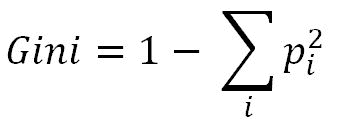

其中 *i =班级数量*。基尼系数和熵值的相似性如下图所示:


# 基于第一性原理的决策树工作方法

在下面的例子中，响应变量只有两个类:是否打网球。但是下表是根据不同日子记录的各种情况编制的。现在，我们的任务是找出变量产生的最显著的输出:是或否

1.  该示例位于分类树下:

| **日** | **展望** | **温度** | **湿度** | **风** | **打网球** |
| D1 | 快活的 | 热的 | 高的 | 无力的 | 不 |
| D2 | 快活的 | 热的 | 高的 | 强烈的 | 不 |
| D3 | 遮蔽 | 热的 | 高的 | 无力的 | 是 |
| D4 | 雨 | 温和的 | 高的 | 无力的 | 是 |
| D5 | 雨 | 凉爽的 | 常态 | 无力的 | 是 |
| D6 | 雨 | 凉爽的 | 常态 | 强烈的 | 不 |
| D7 | 遮蔽 | 凉爽的 | 常态 | 强烈的 | 是 |
| D8 | 快活的 | 温和的 | 高的 | 无力的 | 不 |
| D9 | 快活的 | 凉爽的 | 常态 | 无力的 | 是 |
| D10 | 雨 | 温和的 | 常态 | 无力的 | 是 |
| D11 | 快活的 | 温和的 | 常态 | 强烈的 | 是 |
| D12 | 遮蔽 | 温和的 | 高的 | 强烈的 | 是 |
| D13 | 遮蔽 | 热的 | 常态 | 无力的 | 是 |
| D14 | 雨 | 温和的 | 高的 | 强烈的 | 不 |

2.  以湿度变量为例对网球场地进行分类:
    *   **CHAID:** 湿度有两个类别，我们的期望值应该均匀分布，以便计算变量的区分度:

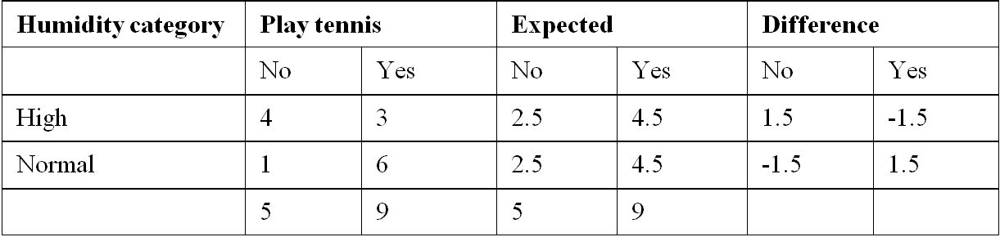

计算*x<sup>2</sup>T3(卡方)值:*


*计算自由度= (r-1) * (c-1)*

其中 r =行组件数/变量类别数，C =响应变量数。

这里有两个行类别(高和正常)和两个列类别(否和是)。

因此= *(2-1) * (2-1) = 1*

卡方 2.8 的 p 值，一维 f = 0.0942

p 值可用以下 Excel 公式求得: *= CHIDIST (2.8，1) = 0.0942*

以类似的方式，我们将计算所有变量的 *p 值*，并选择 p 值较低的最佳变量。

*   **熵**:

熵=-σp * log<sub>2</sub>p

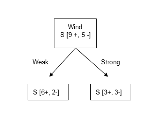


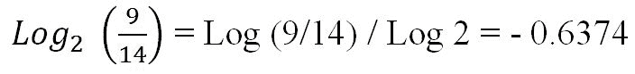

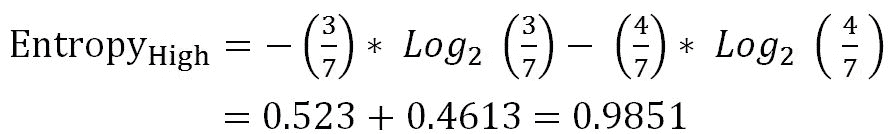


以类似的方式，我们将计算所有变量的*信息增益*，并选择具有最高*信息增益的最佳变量。*

*   基尼:

<sup>基尼= 1-σp<sup>2</sup>T3]</sup>


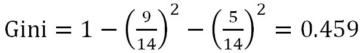


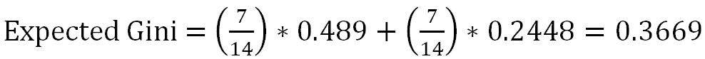

以类似的方式，我们将计算所有变量的*预期基尼系数*，并选择期望值*最低的* **作为最佳值。**

为了更好地理解，我们还将对风变量进行类似的计算:

*   **CHAID:** 风有两个类别，我们的期望值应该是均匀分布的，以便计算变量的区分度:

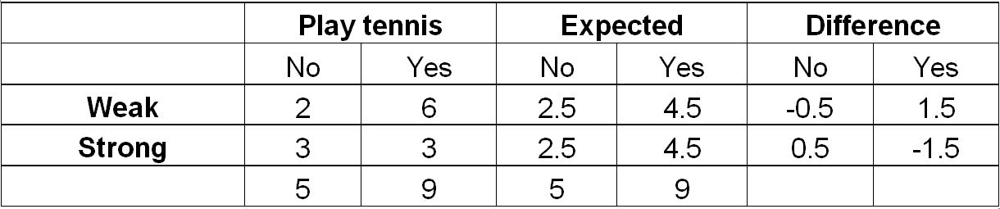


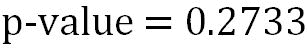

*   **熵**:


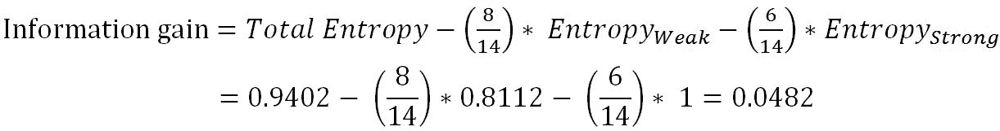

*   基尼:

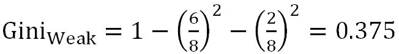

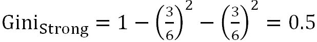


现在，我们将比较所有三个指标的两个变量，以便更好地理解它们。

| 变量 | CHAID
(p 值) | 熵
信息增益 | 基尼
期望值 |
| 湿度 | 0.0942 | 0.1518 | 0.3669 |
| 风 | 0.2733 | 0.0482 | 0.4285 |
| 较好的 | 低值 | 高价值 | 低值 |

对于所有三个计算，湿度被证明是比风更好的分类器。因此，我们可以确认所有的方法都传达了一个相似的故事。

# 逻辑回归与决策树的比较

在我们深入决策树的编码细节之前，在这里，我们将快速比较逻辑回归和决策树之间的差异，这样我们就知道哪个模型更好，以什么方式更好。

| 逻辑回归 | 决策树 |
| 逻辑回归模型看起来像是自变量和因变量之间的方程。 | 树型分类器用简单的英语句子产生规则，可以很容易地向高级管理层解释。 |
| 逻辑回归是一个参数模型，其中模型是通过将参数乘以自变量来预测因变量来定义的。 | 决策树是一种非参数模型，其中不存在预先假定的参数。隐式执行变量筛选或特征选择。 |
| 对响应(或因变量)做出假设，采用二项式或伯努利分布。 | 没有对数据的潜在分布做出假设。 |
| 模型的形状是预先定义的(逻辑曲线)。 | 模型的形状不是预定义的；相反，模型适合基于数据的最佳分类。 |
| 当自变量在本质上是连续的时，提供非常好的结果，线性也成立。 | 当大多数变量本质上是分类的时，提供最佳结果。 |
| 难以发现变量之间复杂的相互作用(变量之间的非线性关系)。 | 参数之间的非线性关系不会影响树的性能。经常揭露复杂的互动。树可以处理具有高度偏斜或多模态的数字数据，以及具有序数或非序数结构的分类预测器。 |
| 异常值和缺失值会降低逻辑回归的性能。 | 异常值和缺失值在决策树中被优雅地处理。 |

# 不同类型模型中误差分量的比较

需要对误差进行评估，以衡量模型的有效性，从而通过调整各种旋钮来进一步提高模型的性能。误差分量由偏差分量、方差分量和纯白噪声组成:

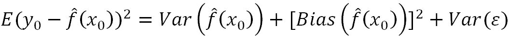

在以下三个地区中:

*   第一区域具有高偏差和低方差误差分量。在这个区域，模型本质上非常稳健，例如线性回归或逻辑回归。
*   尽管第三个区域具有高方差和低偏差误差分量，但是在这个区域中，模型非常不稳定，并且在本质上变化很大，类似于决策树，但是由于它们形状的本质的大量可变性，这些模型倾向于过度依赖于训练数据，并且在测试数据上产生较低的精度。
*   最后但同样重要的是，中间区域，也称为第二区域，是理想的最佳位置，其中偏差和方差分量都适中，导致它产生最低的总误差。

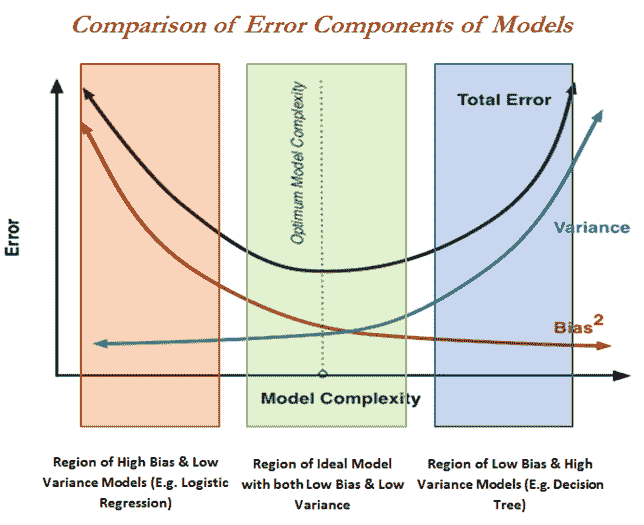

# 将模型推向理想区域的补救措施

具有高偏差或高方差误差分量的模型不能产生理想的拟合。因此，需要进行一些改造。在下图中，详细显示了应用的各种方法。在线性回归的情况下，会有高偏差成分，这意味着模型不够灵活，无法拟合数据中的一些非线性。一种方法是将单线分割成小的线性片段，并通过将它们约束在节点处(也称为**线性样条**)将它们拟合到区域中。尽管决策树具有很高的方差问题，这意味着即使 *X* 值稍有变化也会导致其对应的 *Y* 值发生很大变化，但这个问题可以通过执行决策树的集成来解决:

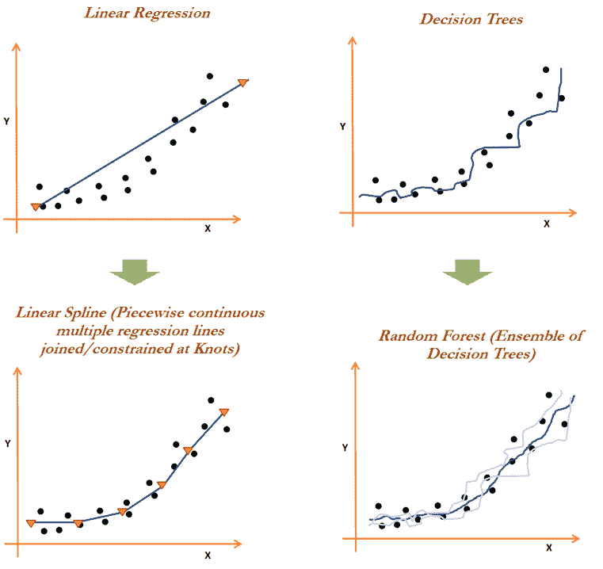

实际上，实现样条曲线是一种困难且不太受欢迎的方法，因为除了检查每个单独方程的线性假设和其他诊断关键绩效指标(p 值、AIC、多重共线性等)之外，从业者还必须关注许多方程。相反，在决策树上执行集成在数据科学社区中最受欢迎，类似于打包、随机森林和 boosting，我们将在本章的后面部分深入讨论。集成技术通过聚集高度可变的个体分类器(如决策树)的结果来解决方差问题。

# 人力资源流失数据示例

在本节中，我们将使用根据开源许可协议[https://www . Kaggle . com/pavansubhasht/IBM-HR-analytics-launch-dataset](https://www.kaggle.com/pavansubhasht/ibm-hr-analytics-attrition-dataset)在 Kaggle 数据集中共享的 IBM Watson 的 HR launch 数据(该数据在获得数据管理员的事先许可后已在本书中使用)来预测员工是否会根据独立解释变量进行流失:

```py
>>> import pandas as pd 
>>> hrattr_data = pd.read_csv("WA_Fn-UseC_-HR-Employee-Attrition.csv") 

>>> print (hrattr_data.head()) 

```

该数据中大约有 1470 个观察值和 35 个变量，这里显示了前五行，以便快速浏览变量:


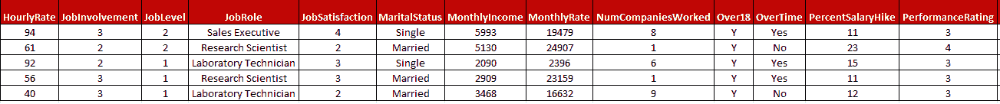

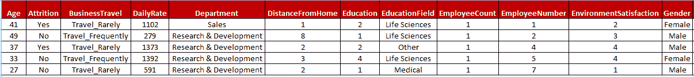

出于建模目的，以下代码用于将“是”或“否”类别转换为 1 和 0，因为 scikit-learn 不直接适合字符/类别变量的模型，因此需要执行虚拟编码来利用模型中的变量:

```py
>>> hrattr_data['Attrition_ind'] = 0 
>>> hrattr_data.loc[hrattr_data['Attrition'] =='Yes', 'Attrition_ind'] = 1 

```

为所有七个分类变量(此处按字母顺序显示)创建虚拟变量，它们是`Business Travel`、`Department`、`Education Field`、`Gender`、`Job Role`、`Marital Status`和`Overtime`。我们在分析中忽略了四个变量，因为它们在观察中没有变化，它们是`Employee count`、`Employee number`、`Over18`和`Standard Hours`:

```py
>>> dummy_busnstrvl = pd.get_dummies(hrattr_data['BusinessTravel'], prefix='busns_trvl') 
>>> dummy_dept = pd.get_dummies(hrattr_data['Department'], prefix='dept') 
>>> dummy_edufield = pd.get_dummies(hrattr_data['EducationField'], prefix='edufield') 
>>> dummy_gender = pd.get_dummies(hrattr_data['Gender'], prefix='gend') 
>>> dummy_jobrole = pd.get_dummies(hrattr_data['JobRole'], prefix='jobrole') 
>>> dummy_maritstat = pd.get_dummies(hrattr_data['MaritalStatus'], prefix='maritalstat')  
>>> dummy_overtime = pd.get_dummies(hrattr_data['OverTime'], prefix='overtime')  

```

连续变量是分开的，稍后将与创建的虚拟变量合并:

```py
>>> continuous_columns = ['Age','DailyRate','DistanceFromHome', 'Education', 'EnvironmentSatisfaction','HourlyRate','JobInvolvement','JobLevel','JobSatisfaction', 'MonthlyIncome', 'MonthlyRate', 'NumCompaniesWorked','PercentSalaryHike',  'PerformanceRating', 'RelationshipSatisfaction','StockOptionLevel', 'TotalWorkingYears', 'TrainingTimesLastYear','WorkLifeBalance', 'YearsAtCompany', 'YearsInCurrentRole', 'YearsSinceLastPromotion','YearsWithCurrManager'] 

>>> hrattr_continuous = hrattr_data[continuous_columns] 

```

在接下来的步骤中，从分类变量和直接连续变量导出的虚拟变量被合并:

```py
>>> hrattr_data_new = pd.concat([dummy_busnstrvl, dummy_dept, dummy_edufield, dummy_gender, dummy_jobrole, dummy_maritstat, dummy_overtime, hrattr_continuous, hrattr_data['Attrition_ind']],axis=1) 

```

Here, we have not removed one extra derived dummy variable for each categorical variable due to the reason that multi-collinearity does not create a problem in decision trees as it does in either logistic or linear regression, hence we can simply utilize all the derived variables in the rest of the chapter, as all the models utilize decision trees as an underlying model, even after performing ensembles of it.

准备好基本数据后，出于培训和测试目的，需要将数据分成 70-30 份:

```py
# Train and Test split 
>>> from sklearn.model_selection import train_test_split 
>>> x_train,x_test,y_train,y_test = train_test_split( hrattr_data_new.drop (['Attrition_ind'], axis=1),hrattr_data_new['Attrition_ind'],   train_size = 0.7, random_state=42) 

```

人力资源流失数据预处理代码:

```py
hrattr_data = read.csv("WA_Fn-UseC_-HR-Employee-Attrition.csv")   
str(hrattr_data);summary(hrattr_data)   
hrattr_data$Attrition_ind = 0;   
hrattr_data$Attrition_ind[   hrattr_data$Attrition=="Yes"]=1   
hrattr_data$Attrition_ind=   as.factor(hrattr_data$Attrition_ind)   

remove_cols = c("EmployeeCount","EmployeeNumber","Over18",   "StandardHours","Attrition")   
hrattr_data_new =   hrattr_data[,!(names(hrattr_data) %in% remove_cols)]   

set.seed(123)   
numrow = nrow(hrattr_data_new)   
trnind = sample(1:numrow,size =   as.integer(0.7*numrow))   
train_data =   hrattr_data_new[trnind,]   
test_data = hrattr_data_new[-trnind,]   
 # Code for calculating   precision, recall for 0 and 1 categories and # at overall level which   will be used in all the classifiers in # later sections   
frac_trzero =   (table(train_data$Attrition_ind)[[1]])/nrow(train_data)   
frac_trone =   (table(train_data$Attrition_ind)[[2]])/nrow(train_data)   

frac_tszero =   (table(test_data$Attrition_ind)[[1]])/nrow(test_data)   
frac_tsone = (table(test_data$Attrition_ind)[[2]])/nrow(test_data)   

prec_zero <-   function(act,pred){  tble = table(act,pred)   
return( round(   tble[1,1]/(tble[1,1]+tble[2,1]),4))}   

prec_one <-   function(act,pred){ tble = table(act,pred)   
return( round(   tble[2,2]/(tble[2,2]+tble[1,2]),4))}   

recl_zero <-   function(act,pred){tble = table(act,pred)   
return( round(   tble[1,1]/(tble[1,1]+tble[1,2]),4))}   

recl_one <-   function(act,pred){ tble = table(act,pred)   
return( round(   tble[2,2]/(tble[2,2]+tble[2,1]),4))}   

accrcy <-   function(act,pred){ tble = table(act,pred)   
return(   round((tble[1,1]+tble[2,2])/sum(tble),4))} 

```

# 决策树分类器

scikit-learn 中的`DecisionTtreeClassifier`已用于建模目的，可在`tree`子模块中获得:

```py
# Decision Tree Classifier 
>>> from sklearn.tree import DecisionTreeClassifier 

```

为 DT 分类器选择的参数在下面的代码中，分割标准为基尼，最大深度为 5，合格分割所需的最小观察数为 2，终端节点中应存在的最小样本数为 1:

```py
 >>> dt_fit = DecisionTreeClassifier(criterion="gini", max_depth=5,min_samples_split=2,  min_samples_leaf=1,random_state=42) 
>>> dt_fit.fit(x_train,y_train) 

>>> print ("\nDecision Tree - Train Confusion  Matrix\n\n", pd.crosstab(y_train, dt_fit.predict(x_train),rownames = ["Actuall"],colnames = ["Predicted"]))    
>>> from sklearn.metrics import accuracy_score, classification_report    
>>> print ("\nDecision Tree - Train accuracy\n\n",round(accuracy_score (y_train, dt_fit.predict(x_train)),3)) 
>>> print ("\nDecision Tree - Train Classification Report\n", classification_report(y_train, dt_fit.predict(x_train))) 

>>> print ("\n\nDecision Tree - Test Confusion Matrix\n\n",pd.crosstab(y_test, dt_fit.predict(x_test),rownames = ["Actuall"],colnames = ["Predicted"])) 
>>> print ("\nDecision Tree - Test accuracy",round(accuracy_score(y_test, dt_fit.predict(x_test)),3)) 
>>> print ("\nDecision Tree - Test Classification Report\n", classification_report( y_test, dt_fit.predict(x_test))) 

```

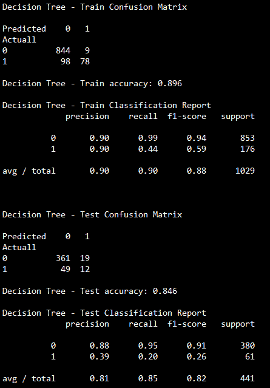

通过仔细观察结果，我们可以推断出，即使测试准确率高(84.6%)，一个类别的准确率和召回率(*消耗率=是*)也较低(*准确率= 0.39* 、*召回率= 0.20* )。当管理层试图使用这种模式在实际流失之前主动向流失可能性高的员工提供一些额外福利时，这可能是一个严重的问题，因为这种模式无法识别将要离职的真正员工。因此，我们需要寻找其他的修改；一种方法是通过使用类权重来控制模型。通过利用类权重，我们可以以增加其他错误为代价来增加特定类的重要性。

例如，通过将类别权重增加到类别 *1* ，我们可以识别更多具有实际流失特征的员工，但这样做，我们会将一些非潜在流失员工标记为潜在流失者(这应该是可以接受的)。

类别权重重要用途的另一个经典例子是，在银行场景中。在发放贷款时，拒绝一些好的申请比接受不良贷款要好。因此，即使在这种情况下，对违约者使用更高的权重比非违约者更好:

应用于人力资源流失数据的决策树分类器代码:

```py
# Decision Trees using C5.0   package   
library(C50)   
dtree_fit = C5.0(train_data[-31],train_data$Attrition_ind,costs   = NULL,control = C5.0Control(minCases = 1))   
summary(dtree_fit)   
tr_y_pred = predict(dtree_fit,   train_data,type = "class")   
ts_y_pred =   predict(dtree_fit,test_data,type = "class")   
tr_y_act =   train_data$Attrition_ind;ts_y_act = test_data$Attrition_ind   

tr_tble =   table(tr_y_act,tr_y_pred)   
print(paste("Train   Confusion Matrix"))   
print(tr_tble)   
tr_acc =   accrcy(tr_y_act,tr_y_pred)   
trprec_zero =   prec_zero(tr_y_act,tr_y_pred);    
trrecl_zero =   recl_zero(tr_y_act,tr_y_pred)   
trprec_one =   prec_one(tr_y_act,tr_y_pred);    
trrecl_one =   recl_one(tr_y_act,tr_y_pred)   
trprec_ovll = trprec_zero *frac_trzero   + trprec_one*frac_trone   
trrecl_ovll = trrecl_zero   *frac_trzero + trrecl_one*frac_trone   

print(paste("Decision Tree   Train accuracy:",tr_acc))   
print(paste("Decision Tree   - Train Classification Report"))   
print(paste("Zero_Precision",trprec_zero,"Zero_Recall",trrecl_zero))   
print(paste("One_Precision",trprec_one,"One_Recall",trrecl_one))   
print(paste("Overall_Precision",round(trprec_ovll,4),"Overall_Recall",   
round(trrecl_ovll,4)))   
 ts_tble =   table(ts_y_act,ts_y_pred)   
print(paste("Test   Confusion Matrix"))   
print(ts_tble)   

ts_acc =   accrcy(ts_y_act,ts_y_pred)   
tsprec_zero =   prec_zero(ts_y_act,ts_y_pred); tsrecl_zero = recl_zero(ts_y_act,ts_y_pred)   
tsprec_one =   prec_one(ts_y_act,ts_y_pred); tsrecl_one = recl_one(ts_y_act,ts_y_pred)   

tsprec_ovll = tsprec_zero *frac_tszero   + tsprec_one*frac_tsone   
tsrecl_ovll = tsrecl_zero   *frac_tszero + tsrecl_one*frac_tsone   

print(paste("Decision Tree   Test accuracy:",ts_acc))   
print(paste("Decision Tree   - Test Classification Report"))   
print(paste("Zero_Precision",tsprec_zero,"Zero_Recall",tsrecl_zero))   
print(paste("One_Precision",tsprec_one,"One_Recall",tsrecl_one))   
print(paste("Overall_Precision",round(tsprec_ovll,4),   
"Overall_Recall",round(tsrecl_ovll,4))) 

```

# 决策树分类器中类权重的调整

在下面的代码中，对类权重进行了调整，以查看具有相同参数的决策树的性能变化。创建一个虚拟数据框来保存组合的各种精度调用细节的所有结果:

```py
>>> dummyarray = np.empty((6,10))
>>> dt_wttune = pd.DataFrame(dummyarray)

```

要考虑捕获的指标是零和一个类别的权重(例如，如果给定的零类别的权重是 0.2，那么自动地，一的权重应该是 0.8，因为总权重应该等于 1)、训练和测试精度、零类别的精度、一个类别和总体。同样，还会计算零类别、一类别和整体的召回率:

```py
>>> dt_wttune.columns = ["zero_wght","one_wght","tr_accuracy", "tst_accuracy", "prec_zero","prec_one", "prec_ovll", "recl_zero","recl_one","recl_ovll"] 

```

零类别的权重从 0.01 到 0.5 进行验证，因为我们知道我们不想探索零类别将被赋予比一个类别更高的权重的情况:

```py
>>> zero_clwghts = [0.01,0.1,0.2,0.3,0.4,0.5] 

>>> for i in range(len(zero_clwghts)): 
...    clwght = {0:zero_clwghts[i],1:1.0-zero_clwghts[i]} 
...    dt_fit = DecisionTreeClassifier(criterion="gini",  max_depth=5,               ... min_samples_split=2, min_samples_leaf=1,random_state=42,class_weight = clwght) 
...    dt_fit.fit(x_train,y_train) 
...    dt_wttune.loc[i, 'zero_wght'] = clwght[0]        
...    dt_wttune.loc[i, 'one_wght'] = clwght[1]      
...    dt_wttune.loc[i, 'tr_accuracy'] = round(accuracy_score(y_train, dt_fit.predict( x_train)),3)     
...    dt_wttune.loc[i, 'tst_accuracy'] = round(accuracy_score(y_test,dt_fit.predict( x_test)),3)     

...    clf_sp = classification_report(y_test,dt_fit.predict(x_test)).split() 
...    dt_wttune.loc[i, 'prec_zero'] = float(clf_sp[5])    
...    dt_wttune.loc[i, 'prec_one'] = float(clf_sp[10])    
...    dt_wttune.loc[i, 'prec_ovll'] = float(clf_sp[17])    

...    dt_wttune.loc[i, 'recl_zero'] = float(clf_sp[6])    
...    dt_wttune.loc[i, 'recl_one'] = float(clf_sp[11])    
...    dt_wttune.loc[i, 'recl_ovll'] = float(clf_sp[18]) 
...    print ("\nClass Weights",clwght,"Train accuracy:",round(accuracy_score( y_train,dt_fit.predict(x_train)),3),"Test accuracy:",round(accuracy_score(y_test, dt_fit.predict(x_test)),3)) 
...    print ("Test Confusion Matrix\n\n",pd.crosstab(y_test,dt_fit.predict( x_test),rownames = ["Actuall"],colnames = ["Predicted"])) 

```

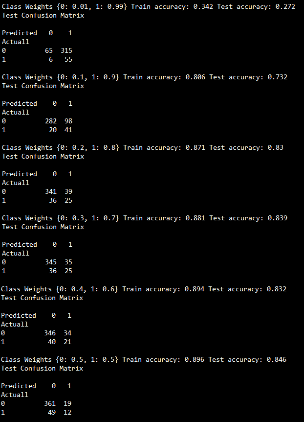

从前面的截图中，我们可以看到，在类别权重值为 0.3(零)和 0.7(一)时，它使用决策树方法识别了更多的属性(61 个中的 25 个)，而不会影响 83.9%的测试准确性:

将类别权重应用于人力资源流失数据的决策树分类器的代码:

```py
#Decision Trees using C5.0   package - Error Costs   
library(C50)   
class_zero_wgt =   c(0.01,0.1,0.2,0.3,0.4,0.5)   

for (cwt in class_zero_wgt){   
  cwtz = cwt   
  cwto = 1-cwtz   
  cstvr = cwto/cwtz     
  error_cost <- matrix(c(0,   1, cstvr, 0), nrow = 2)     
  dtree_fit = C5.0(train_data[-31],train_data$Attrition_ind, 
 costs = error_cost,control = C5.0Control(  minCases =   1))   
  summary(dtree_fit)     
  tr_y_pred =   predict(dtree_fit, train_data,type = "class")   
  ts_y_pred =   predict(dtree_fit,test_data,type = "class")   

  tr_y_act =   train_data$Attrition_ind;   
  ts_y_act =   test_data$Attrition_ind   
  tr_acc =   accrcy(tr_y_act,tr_y_pred)   
  ts_acc =   accrcy(ts_y_act,ts_y_pred)     

  print(paste("Class   weights","{0:",cwtz,"1:",cwto,"}",   
              "Decision   Tree Train accuracy:",tr_acc,   
              "Decision   Tree Test accuracy:",ts_acc))   
  ts_tble =   table(ts_y_act,ts_y_pred)   
  print(paste("Test   Confusion Matrix"))   
  print(ts_tble)    
} 

```

# 装袋分级机

正如我们已经讨论过的，决策树具有很高的方差，这意味着如果我们将训练数据分别分成两个随机部分，并为每个样本拟合两个决策树，所获得的规则将会非常不同。而低方差和高偏差模型，如线性或逻辑回归，将在两个样本中产生相似的结果。Bagging 指的是 bootstrap 聚合(重复采样并替换，精确地执行结果的聚合)，这是一种通用的方法来减少模型的方差。在这种情况下，它们是决策树。

聚合减少了方差，例如，当我们有 n 个独立的观测值 *x <sub>1</sub> ，x <sub>2</sub> 时，...，x <sub>n</sub>* 各有方差 *σ <sup>2</sup>* ，观测值的均值 *x̅* 的方差由 *σ <sup>2</sup> /n* 给出，通过对一组观测值求平均值说明其减少了方差。在这里，我们通过从训练数据中获取许多样本(也称为自举)，分别在每个样本上构建单独的决策树，对回归的预测进行平均，以及计算分类问题的模式来减少方差，以便获得同时具有低偏差和低方差的单个低方差模型:


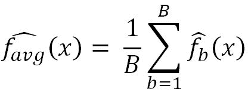

在打包过程中，对行进行采样，同时选择所有的列/变量(而在随机森林中，将对行和列进行采样，这将在下一节中介绍)并为每个样本拟合单独的树。在下图中，两种颜色(粉色和蓝色)代表两个样本，对于每个样本，采样几行，但每次都选择所有的列(变量)。由于所有列的选择而存在的一个问题是，大多数树将描述相同的故事，其中最重要的变量最初将出现在分割中，并且这在所有树中重复，这不会产生去相关的树，因此我们在应用方差减少时可能不会获得更好的性能。这个问题将在 random forest 中避免(我们将在本章的下一节讨论这个问题)，在本章中，我们还将对行和列进行采样:


在下面的代码中，使用相同的人力资源数据来拟合 bagging 分类器，以便在决策树方面比较苹果与苹果的结果:

```py
# Bagging Classifier 
>>> from sklearn.tree import DecisionTreeClassifier
>>> from sklearn.ensemble import BaggingClassifier

```

这里使用的基本分类器是决策树，其参数设置与我们在决策树示例中使用的相同:

```py
>>> dt_fit = DecisionTreeClassifier(criterion="gini", max_depth=5,min_samples_split=2, min_samples_leaf=1,random_state=42,class_weight = {0:0.3,1:0.7}) 

```

装袋中使用的参数为，`n_estimators`表示使用的单个决策树的数量为 5000，选择的最大样本和特征分别为 0.67 和 1.0，这意味着它将为每棵树和所有特征选择 2/3 <sup>rd</sup> 的观测值。更多详细信息，请参考 scikit-learn 手册[http://sci kit-learn . org/stable/modules/generated/sklearn . ensemble . bagging classifier . html](http://scikit-learn.org/stable/modules/generated/sklearn.ensemble.BaggingClassifier.html):

```py
>>> bag_fit = BaggingClassifier(base_estimator= dt_fit,n_estimators=5000, max_samples=0.67, 
...              max_features=1.0,bootstrap=True, 
...              bootstrap_features=False, n_jobs=-1,random_state=42) 

>>> bag_fit.fit(x_train, y_train) 

>>> print ("\nBagging - Train Confusion Matrix\n\n",pd.crosstab(y_train, bag_fit.predict(x_train),rownames = ["Actuall"],colnames = ["Predicted"]))       
>>> print ("\nBagging- Train accuracy",round(accuracy_score(y_train, bag_fit.predict(x_train)),3))  
>>> print ("\nBagging  - Train Classification Report\n",classification_report(y_train, bag_fit.predict(x_train))) 

>>> print ("\n\nBagging - Test Confusion Matrix\n\n",pd.crosstab(y_test, bag_fit.predict(x_test),rownames = ["Actuall"],colnames = ["Predicted"]))       
>>> print ("\nBagging - Test accuracy",round(accuracy_score(y_test, bag_fit.predict(x_test)),3)) 
>>> print ("\nBagging - Test Classification Report\n",classification_report(y_test, bag_fit.predict(x_test))) 

```


对打包结果进行分析后，得到的测试准确率为 87.3%，而决策树的测试准确率为 84.6%。比较已识别的实际流失员工数量，装袋中有 13 名，而决策树中有 12 名，但分类为 1 的 0 的数量明显减少到 8 名，而 DT 中为 19 名。总体而言，打包提高了单棵树的性能:

人力资源损耗数据打包分类器的代码:

```py
# Bagging Classifier - using   Random forest package but all variables selected   
library(randomForest)   
set.seed(43)   
rf_fit = randomForest(Attrition_ind~.,data   = train_data,mtry=30,maxnodes= 64,classwt = c(0.3,0.7), ntree=5000,nodesize =   1)   
tr_y_pred = predict(rf_fit,data   = train_data,type = "response")   
ts_y_pred =   predict(rf_fit,newdata = test_data,type = "response")   
tr_y_act = train_data$Attrition_ind;ts_y_act   = test_data$Attrition_ind   

tr_tble =   table(tr_y_act,tr_y_pred)   
print(paste("Train   Confusion Matrix"))   
print(tr_tble)   
tr_acc =   accrcy(tr_y_act,tr_y_pred)   
trprec_zero =   prec_zero(tr_y_act,tr_y_pred); trrecl_zero = recl_zero(tr_y_act,tr_y_pred)   
trprec_one =   prec_one(tr_y_act,tr_y_pred);    
trrecl_one =   recl_one(tr_y_act,tr_y_pred)   
trprec_ovll = trprec_zero   *frac_trzero + trprec_one*frac_trone   
trrecl_ovll = trrecl_zero   *frac_trzero + trrecl_one*frac_trone   
print(paste("Random Forest   Train accuracy:",tr_acc))   
print(paste("Random Forest   - Train Classification Report"))   
print(paste("Zero_Precision",trprec_zero,"Zero_Recall",trrecl_zero))   
print(paste("One_Precision",trprec_one,"One_Recall",trrecl_one))   
print(paste("Overall_Precision",round(trprec_ovll,4),"Overall_Recall",   
round(trrecl_ovll,4)))   

ts_tble =   table(ts_y_act,ts_y_pred)   
print(paste("Test   Confusion Matrix"))   
print(ts_tble)   
ts_acc =   accrcy(ts_y_act,ts_y_pred)   
tsprec_zero =   prec_zero(ts_y_act,ts_y_pred); tsrecl_zero = recl_zero(ts_y_act,ts_y_pred)   
tsprec_one =   prec_one(ts_y_act,ts_y_pred);    
tsrecl_one =   recl_one(ts_y_act,ts_y_pred)   
tsprec_ovll = tsprec_zero   *frac_tszero + tsprec_one*frac_tsone   
tsrecl_ovll = tsrecl_zero   *frac_tszero + tsrecl_one*frac_tsone   
print(paste("Random Forest   Test accuracy:",ts_acc))   
print(paste("Random Forest   - Test Classification Report"))   
print(paste("Zero_Precision",tsprec_zero,"Zero_Recall",tsrecl_zero))   
print(paste("One_Precision",tsprec_one,"One_Recall",tsrecl_one))   
print(paste("Overall_Precision",round(tsprec_ovll,4),"Overall_Recall",   
round(tsrecl_ovll,4))) 

```

# 随机森林分类器

随机森林通过利用去相关树做一个小的调整，提供了一个比套袋更好的方法。在 bagging 中，我们根据训练数据在自举样本上构建了许多决策树，但是 bagging 技术的一大缺点是它选择了所有变量。通过这样做，在每个决策树中，被选择来分割的候选/变量的顺序对于所有看起来彼此相关的单个树来说或多或少地保持相同。在聚集相关的个体实体时，减少它们的差异并不有效。

在随机森林中，在自举(重复采样和替换)过程中，从训练数据中抽取样本；不仅仅是简单地随机选择第二个和第三个观察值，类似于 bagging，它还从所有预测值中选择少数预测值/列(总 p 个预测值中的 m 个预测值)。

从总变量 p 中选择 m 个变量的经验法则是 *m = sqrt(p)* 用于分类，而 *m = p/3* 用于随机回归问题，以避免单个树之间的相关性。通过这样做，可以显著提高精度。射频的这种能力使其成为数据科学社区最喜欢使用的算法之一，成为跨越各种竞争甚至解决各种行业实际问题的制胜秘诀。

在下图中，不同的颜色代表不同的引导样本。在第一个样本中，选择第 1 <sup>st</sup> 、第 3 <sup>rd</sup> 、第 4 <sup>th、</sup>和第 7 <sup>th</sup> 列，而在第二个自举样本中，分别选择第 2 <sup>nd</sup> 、第 3 <sup>rd</sup> 、第 4 <sup>、</sup>和第 5 <sup>th</sup> 列。这样，可以随机选择任何列，无论它们是否彼此相邻。虽然给出了 *sqrt (p)* 或 *p/3* 的经验法则，但鼓励读者调整要选择的预测因子的数量:


示例图显示了在更改所选参数时测试误差变化的影响，显然 *m = sqrt(p)* 场景与 *m =p* 场景(我们可以称之为场景打包)相比，在测试数据上的表现更好:

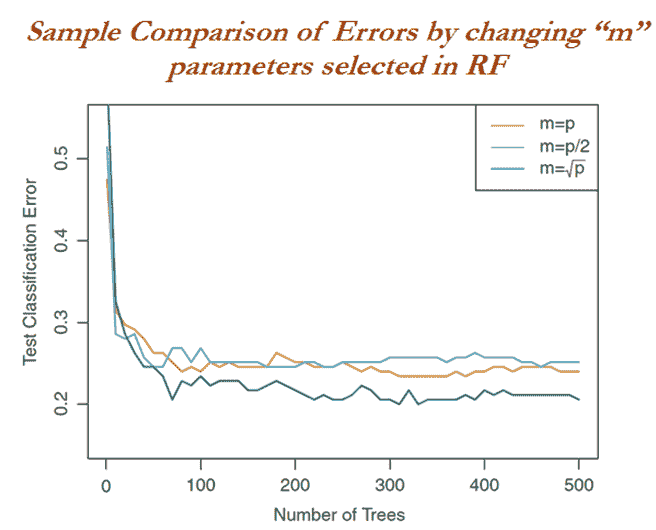

出于说明的目的，这里使用了`scikit-learn`包中的随机森林分类器:

```py
# Random Forest Classifier 
>>> from sklearn.ensemble import RandomForestClassifier 

```

随机森林中使用的参数是:`n_estimators`代表使用的个体决策树数量为 5000，选择的最大特征是 *auto* ，这意味着它将选择 *sqrt(p)* 进行分类，选择 *p/3* 进行自动回归。这里有一个简单的分类问题。每个叶的最小样本数提供了终端节点所需的最小观测数:

```py
>>> rf_fit = RandomForestClassifier(n_estimators=5000,criterion="gini", max_depth=5, min_samples_split=2,bootstrap=True,max_features='auto',random_state=42, min_samples_leaf=1,class_weight = {0:0.3,1:0.7}) 
>>> rf_fit.fit(x_train,y_train)        

>>> print ("\nRandom Forest - Train Confusion Matrix\n\n",pd.crosstab(y_train, rf_fit.predict(x_train),rownames = ["Actuall"],colnames = ["Predicted"]))       
>>> print ("\nRandom Forest - Train accuracy",round(accuracy_score(y_train, rf_fit.predict(x_train)),3)) 
>>> print ("\nRandom Forest  - Train Classification Report\n",classification_report( y_train, rf_fit.predict(x_train))) 

>>> print ("\n\nRandom Forest - Test Confusion Matrix\n\n",pd.crosstab(y_test, rf_fit.predict(x_test),rownames = ["Actuall"],colnames = ["Predicted"]))       
>>> print ("\nRandom Forest - Test accuracy",round(accuracy_score(y_test, rf_fit.predict(x_test)),3)) 
>>> print ("\nRandom Forest - Test Classification Report\n",classification_report( y_test, rf_fit.predict(x_test))) 

```


与 bagging 87.3%相比，随机森林分类器产生了 87.8%的测试准确性，并且与 bagging 相比，还识别了 14 个实际磨损的员工，其中识别了 13 个磨损的员工:

```py
# Plot of Variable importance by mean decrease in gini 
>>> model_ranks = pd.Series(rf_fit.feature_importances_,index=x_train.columns, name='Importance').sort_values(ascending=False, inplace=False) 
>>> model_ranks.index.name = 'Variables' 
>>> top_features = model_ranks.iloc[:31].sort_values(ascending=True,inplace=False) 
>>> import matplotlib.pyplot as plt 
>>> plt.figure(figsize=(20,10)) 
>>> ax = top_features.plot(kind='barh') 
>>> _ = ax.set_title("Variable Importance Plot") 
>>> _ = ax.set_xlabel('Mean decrease in Variance') 
>>> _ = ax.set_yticklabels(top_features.index, fontsize=13) 

```

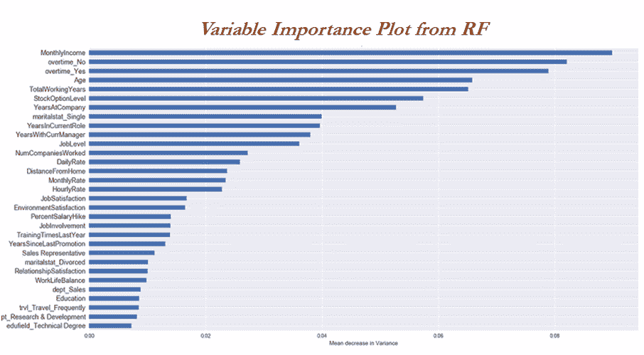

从变量重要性图来看，似乎月收入变量最显著，其次是加班、总工作年限、股票期权级别、在公司的年限等等。这让我们对决定员工是留在公司还是离开组织的主要因素有了一些了解:

应用于人力资源流失数据的随机森林分类器的代码:

```py
# Random Forest   
library(randomForest)   
set.seed(43)   
rf_fit =   randomForest(Attrition_ind~.,data = train_data,mtry=6, maxnodes= 64,classwt =   c(0.3,0.7),ntree=5000,nodesize = 1)   
tr_y_pred = predict(rf_fit,data   = train_data,type = "response")   
ts_y_pred =   predict(rf_fit,newdata = test_data,type = "response")   
tr_y_act =   train_data$Attrition_ind;ts_y_act = test_data$Attrition_ind   
tr_tble =   table(tr_y_act,tr_y_pred)   
print(paste("Train   Confusion Matrix"))   
print(tr_tble)   
tr_acc =   accrcy(tr_y_act,tr_y_pred)   
trprec_zero = prec_zero(tr_y_act,tr_y_pred);   trrecl_zero = recl_zero(tr_y_act,tr_y_pred)   
trprec_one =   prec_one(tr_y_act,tr_y_pred); trrecl_one = recl_one(tr_y_act,tr_y_pred)   
trprec_ovll = trprec_zero   *frac_trzero + trprec_one*frac_trone   
trrecl_ovll = trrecl_zero   *frac_trzero + trrecl_one*frac_trone   

print(paste("Random Forest   Train accuracy:",tr_acc))   
print(paste("Random Forest   - Train Classification Report"))   
print(paste("Zero_Precision",trprec_zero,"Zero_Recall",trrecl_zero))   
print(paste("One_Precision",trprec_one,"One_Recall",trrecl_one))   
print(paste("Overall_Precision",round(trprec_ovll,4),"Overall_Recall",round(trrecl_ovll,4)))   
ts_tble =   table(ts_y_act,ts_y_pred)   
print(paste("Test   Confusion Matrix"))   
print(ts_tble)   
ts_acc =   accrcy(ts_y_act,ts_y_pred)   
tsprec_zero = prec_zero(ts_y_act,ts_y_pred);   tsrecl_zero = recl_zero(ts_y_act,ts_y_pred)   
tsprec_one =   prec_one(ts_y_act,ts_y_pred); tsrecl_one = recl_one(ts_y_act,ts_y_pred)   
tsprec_ovll = tsprec_zero   *frac_tszero + tsprec_one*frac_tsone   
tsrecl_ovll = tsrecl_zero   *frac_tszero + tsrecl_one*frac_tsone   

print(paste("Random Forest   Test accuracy:",ts_acc))   
print(paste("Random Forest   - Test Classification Report"))   
print(paste("Zero_Precision",tsprec_zero,"Zero_Recall",tsrecl_zero))   
print(paste("One_Precision",tsprec_one,"One_Recall",tsrecl_one))   
print(paste("Overall_Precision",round(tsprec_ovll,4),"Overall_Recall",round(tsrecl_ovll,4)))   

```

# 随机森林分类器-网格搜索

机器学习模型中的参数调整起着至关重要的作用。这里，我们展示了一个关于如何调整随机森林模型的网格搜索示例:

```py
# Random Forest Classifier - Grid Search 
>>> from sklearn.pipeline import Pipeline 
>>> from sklearn.model_selection import train_test_split,GridSearchCV 

>>> pipeline = Pipeline([ ('clf',RandomForestClassifier(criterion='gini',class_weight = {0:0.3,1:0.7}))]) 

```

除了使用管道函数验证所有组合之外，调整参数类似于随机森林参数。需要评估的组合数量为*(3×3×2×2)* 5 = 36×5 = 180 个*组合。这里 5 是用在最后，由于交叉验证的五重:

```py
>>> parameters = { 
...         'clf__n_estimators':(2000,3000,5000), 
...         'clf__max_depth':(5,15,30), 
...         'clf__min_samples_split':(2,3), 
...         'clf__min_samples_leaf':(1,2)  } 

>>> grid_search = GridSearchCV(pipeline,parameters,n_jobs=-1,cv=5,verbose=1, scoring='accuracy') 
>>> grid_search.fit(x_train,y_train) 

>>> print ('Best Training score: %0.3f' % grid_search.best_score_) 
>>> print ('Best parameters set:') 
>>> best_parameters = grid_search.best_estimator_.get_params()  
>>> for param_name in sorted(parameters.keys()): 
...     print ('\t%s: %r' % (param_name, best_parameters[param_name])) 

>>> predictions = grid_search.predict(x_test) 

>>> print ("Testing accuracy:",round(accuracy_score(y_test, predictions),4)) 
>>> print ("\nComplete report of Testing data\n",classification_report(y_test, predictions)) 

>>> print ("\n\nRandom Forest Grid Search- Test Confusion Matrix\n\n",pd.crosstab( y_test, predictions,rownames = ["Actuall"],colnames = ["Predicted"]))      

```

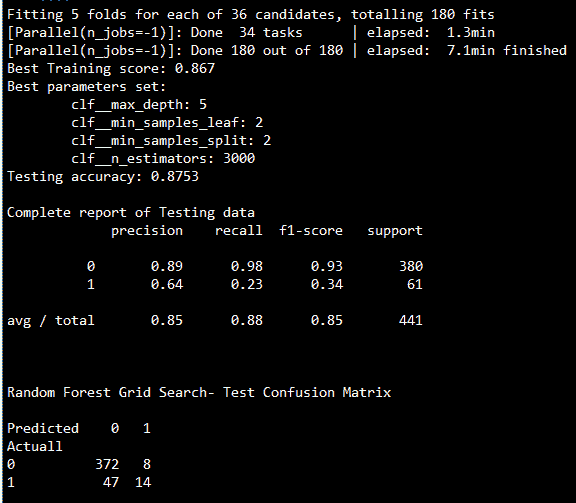

在前面的结果中，与已经探索的随机森林结果相比，网格搜索似乎没有提供太多优势。但是，实际上，大多数时候，与简单的模型探索相比，它会提供更好、更稳健的结果。然而，通过仔细评估许多不同的组合，它最终会发现最佳的参数组合:

随机森林分类器的代码，网格搜索应用于人力资源损耗数据；

```py
# Grid Search - Random Forest   
library(e1071)   
library(randomForest)   
rf_grid =   tune(randomForest,Attrition_ind~.,data = train_data,classwt =   c(0.3,0.7),ranges = list( mtry = c(5,6),   
  maxnodes = c(32,64), ntree =   c(3000,5000), nodesize = c(1,2)   
),   
tunecontrol =   tune.control(cross = 5) )   
print(paste("Best   parameter from Grid Search"))   
print(summary(rf_grid))   
best_model = rf_grid$best.model   
tr_y_pred=predict(best_model,data   = train_data,type ="response")   
ts_y_pred=predict(best_model,newdata   = test_data,type= "response")   

tr_y_act =   train_data$Attrition_ind;   
ts_y_act= test_data$Attrition_ind   

tr_tble =   table(tr_y_act,tr_y_pred)   
print(paste("Random Forest   Grid search Train Confusion Matrix"))   
print(tr_tble)   
tr_acc =   accrcy(tr_y_act,tr_y_pred)   
trprec_zero =   prec_zero(tr_y_act,tr_y_pred); trrecl_zero = recl_zero(tr_y_act,tr_y_pred)   
trprec_one =   prec_one(tr_y_act,tr_y_pred); trrecl_one = recl_one(tr_y_act,tr_y_pred)   
trprec_ovll = trprec_zero   *frac_trzero + trprec_one*frac_trone   
trrecl_ovll = trrecl_zero   *frac_trzero + trrecl_one*frac_trone   

print(paste("Random Forest   Grid Search Train accuracy:",tr_acc))   
print(paste("Random Forest   Grid Search - Train Classification Report"))   
print(paste("Zero_Precision",trprec_zero,"Zero_Recall",trrecl_zero))   
print(paste("One_Precision",trprec_one,"One_Recall",trrecl_one))   
print(paste("Overall_Precision",round(trprec_ovll,4),"Overall_Recall",round(trrecl_ovll,4)))   

ts_tble =   table(ts_y_act,ts_y_pred)   
print(paste("Random Forest   Grid search Test Confusion Matrix"))   
print(ts_tble)   
ts_acc =   accrcy(ts_y_act,ts_y_pred)   
tsprec_zero =   prec_zero(ts_y_act,ts_y_pred); tsrecl_zero = recl_zero(ts_y_act,ts_y_pred)   
tsprec_one =   prec_one(ts_y_act,ts_y_pred); tsrecl_one = recl_one(ts_y_act,ts_y_pred)   
tsprec_ovll = tsprec_zero   *frac_tszero + tsprec_one*frac_tsone   
tsrecl_ovll = tsrecl_zero   *frac_tszero + tsrecl_one*frac_tsone   

print(paste("Random Forest   Grid Search Test accuracy:",ts_acc))   
print(paste("Random Forest   Grid Search - Test Classification Report"))   
print(paste("Zero_Precision",tsprec_zero,"Zero_Recall",tsrecl_zero))   
print(paste("One_Precision",tsprec_one,"One_Recall",tsrecl_one))   
print(paste("Overall_Precision",round(tsprec_ovll,4),"Overall_Recall",round(tsrecl_ovll,4)))

```

# AdaBoost 分类器

Boosting 是另一个最先进的模型，被许多数据科学家用来赢得如此多的比赛。在这一部分，我们将介绍 **AdaBoost** 算法，接下来是**梯度增强**和**极限梯度增强** ( **XGBoost** )。Boosting 是一种通用方法，可以应用于许多统计模型。然而，在这本书里，我们将讨论 boosting 在决策树中的应用。在 bagging 中，我们从训练数据中提取了多个样本，然后组合各个树的结果来创建单个预测模型；该方法并行运行，因为每个引导样本不依赖于其他样本。Boosting 以顺序方式工作，不涉及自举采样；取而代之的是，每一棵树都适合于原始数据集的修改版本，并最终相加以创建一个强分类器:


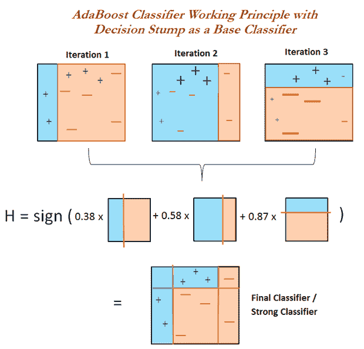

上图是 AdaBoost 工作原理的示例方法。我们将在下面的算法描述中详细介绍一步一步的过程。最初，对数据拟合了一个简单的分类器(也称为决策树桩，它将数据分成两个区域)，无论正确分类的类在下一次迭代(迭代 2)中将被赋予更低的权重，而对错误分类的类(观察者+蓝色图标)将被赋予更高的权重，另外，另一个决策树桩/弱分类器将被拟合到数据上，并将为下一次迭代再次改变权重(迭代 3，这里检查权重已经增加的符号)。一旦它完成迭代，这些与权重(每次迭代时根据错误率为每个分类器自动计算的权重)相结合，得到一个强分类器，它以惊人的精度预测类。

【AdaBoost 算法由以下步骤组成:

1.  初始化观察权重 *w <sub>i</sub> = 1/N，i=1，2，…，N* 。其中 *N =观察次数。*
2.  对于 m = 1 至 M:
    *   使用权重*w<sub>I</sub>T5】将分类器 *Gm(x)* 拟合到训练数据*
    *   计算:

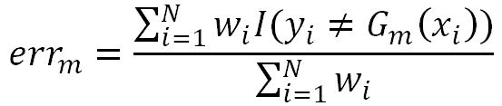

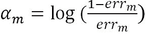

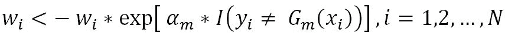

3.  输出:


所有的观察结果都同等重要。

In bagging and random forest algorithms, we deal with the columns of the data; whereas, in boosting, we adjust the weights of each observation and don't elect a few columns.

我们对数据进行分类，并评估总体误差。在最终的可加模型( **α** )评估中，应该给出用于计算权重的误差。直观的感觉是，对于误差较小的模型，将给予更高的权重。最后，将更新每个观察的权重。在这里，为了给下一次迭代更多的关注，对于不正确分类的观察，权重将增加，而对于正确分类的观察，权重将减少。

所有弱分类器与它们各自的权重相结合以形成强分类器。在下图中，分享了一个关于与初始迭代相比，权重在最后一次迭代中如何变化的快速想法:

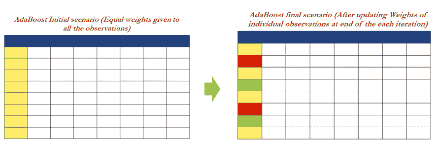

```py
# Adaboost Classifier 
>>> from sklearn.tree import DecisionTreeClassifier 
>>> from sklearn.ensemble import AdaBoostClassifier 

```

决策树桩被用作 AdaBoost 的基本分类器。如果我们观察下面的代码，树的深度保持为 1，它只有一次决策能力(也被认为是弱分类器):

```py
>>> dtree = DecisionTreeClassifier(criterion='gini',max_depth=1) 

```

在 AdaBoost 中，决策树桩被用作基础估计器，以适合整个数据集，然后在同一数据集上适合分类器的额外副本达 5000 次。学习率将每个类的贡献缩小了 0.05。学习率和估计量之间有一个权衡。通过仔细选择低学习率和大量的估计量，我们可以很好地收敛到最优值，但是要牺牲计算能力:

```py
>>>adabst_fit = AdaBoostClassifier(base_estimator= dtree,n_estimators=5000,learning_rate=0.05,random_state=42)

>>>adabst_fit.fit(x_train, y_train)
>>>print ("\nAdaBoost - Train Confusion Matrix\n\n", pd.crosstab(y_train, adabst_fit.predict(x_train), rownames = ["Actuall"],colnames = ["Predicted"]))
>>>print ("\nAdaBoost - Train accuracy",round(accuracy_score(y_train,adabst_fit.predict(x_train)), 3))
>>>print ("\nAdaBoost  - Train Classification Report\n",classification_report(y_train,adabst_fit.predict(x_train)))

```


就 1 值的召回率而言，AdaBoost 的结果似乎比已知的最佳随机森林分类器好得多。尽管与 87.8%的最佳精度相比，精度略有下降，降至 86.8%，但射频预测的 1 的数量为 23 个，这是 14 个，但增加了一些 0 的费用，但它在识别实际损耗方面确实取得了良好的进展:

应用于人力资源流失数据的 AdaBoost 分类器的代码:

```py
# Adaboost classifier using   C5.0 with trails included for boosting   
library(C50)   
class_zero_wgt = 0.3   
class_one_wgt = 1-class_zero_wgt   
cstvr =   class_one_wgt/class_zero_wgt   
error_cost <- matrix(c(0, 1,   cstvr, 0), nrow = 2)   
# Fitting Adaboost model     
ada_fit = C5.0(train_data[-31],train_data$Attrition_ind,costs   = error_cost, trails = 5000,control = C5.0Control(minCases = 1))   
summary(ada_fit)   

tr_y_pred = predict(ada_fit,   train_data,type = "class")   
ts_y_pred =   predict(ada_fit,test_data,type = "class")   

tr_y_act =   train_data$Attrition_ind;ts_y_act = test_data$Attrition_ind   

tr_tble = table(tr_y_act,tr_y_pred)   
print(paste("AdaBoost -   Train Confusion Matrix"))   
print(tr_tble)   
tr_acc =   accrcy(tr_y_act,tr_y_pred)   
trprec_zero =   prec_zero(tr_y_act,tr_y_pred); trrecl_zero = recl_zero(tr_y_act,tr_y_pred)   
trprec_one =   prec_one(tr_y_act,tr_y_pred); trrecl_one = recl_one(tr_y_act,tr_y_pred)   
trprec_ovll = trprec_zero   *frac_trzero + trprec_one*frac_trone   
trrecl_ovll = trrecl_zero   *frac_trzero + trrecl_one*frac_trone   
print(paste("AdaBoost   Train accuracy:",tr_acc))   
print(paste("AdaBoost -   Train Classification Report"))   
print(paste("Zero_Precision",trprec_zero,"Zero_Recall",trrecl_zero))   
print(paste("One_Precision",trprec_one,"One_Recall",trrecl_one))   
print(paste("Overall_Precision",round(trprec_ovll,4),"Overall_Recall",round(trrecl_ovll,4)))   

ts_tble =   table(ts_y_act,ts_y_pred)   
print(paste("AdaBoost -   Test Confusion Matrix"))   
print(ts_tble)   

ts_acc =   accrcy(ts_y_act,ts_y_pred)   
tsprec_zero =   prec_zero(ts_y_act,ts_y_pred); tsrecl_zero = recl_zero(ts_y_act,ts_y_pred)   
tsprec_one =   prec_one(ts_y_act,ts_y_pred); tsrecl_one = recl_one(ts_y_act,ts_y_pred)   

tsprec_ovll = tsprec_zero   *frac_tszero + tsprec_one*frac_tsone   
tsrecl_ovll = tsrecl_zero   *frac_tszero + tsrecl_one*frac_tsone   

print(paste("AdaBoost Test   accuracy:",ts_acc))   
print(paste("AdaBoost -   Test Classification Report"))   
print(paste("Zero_Precision",tsprec_zero,"Zero_Recall",tsrecl_zero))   
print(paste("One_Precision",tsprec_one,"One_Recall",tsrecl_one))   
print(paste("Overall_Precision",round(tsprec_ovll,4),"Overall_Recall",round(tsrecl_ovll,4)))   

```

# 梯度提升分类器

梯度提升是一种赢得竞争的算法，其原理是通过将焦点转移到在以前的迭代中难以预测的有问题的观察，并对弱学习者(通常是决策树)进行集成，来迭代提升弱学习者。它以分阶段的方式建立模型，就像其他升压方法一样，但它通过允许优化任意可微损失函数来推广它们。

让我们从一个简单的例子开始理解 Gradient Boosting，因为 GB 在理解工作原理方面向许多数据科学家提出了挑战:

1.  最初，我们在产生 75%准确度的观测值上拟合模型，剩余的无法解释的方差被捕获在 ***误差*** 项中:

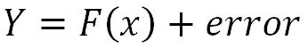

2.  然后，我们将在误差项上拟合另一个模型，以提取额外的解释成分，并将其添加到原始模型中，这将提高整体精度:

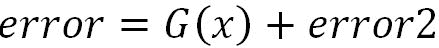

3.  现在，模型提供了 80%的精度，等式如下:


4.  我们再一次继续这个方法，在**错误 2** 组件上拟合模型，以提取进一步的解释组件:


5.  现在，模型精度进一步提高到 85%，最终模型方程如下:

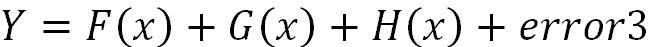

6.  在这里，如果我们使用加权平均(对预测结果比其他模型更准确的更好的模型给予更高的重要性)而不是简单的加法，它将进一步改善结果。其实这就是梯度提升算法的作用！

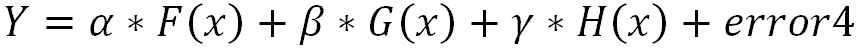

After incorporating weights, the name of the error changed from **error3** to **error4**, as both errors may not be exactly the same. If we find better weights, we will probably get accuracy of 90% instead of simple addition, where we have only got 85%.

**梯度助推涉及三个要素:**

*   **需要优化的损失函数:**损失函数取决于正在解决的问题类型。在回归问题中，使用均方误差，在分类问题中，将使用对数损失。在提升过程中，在每个阶段，来自先前迭代的无法解释的损失将被优化，而不是从头开始。

*   **弱学习器进行预测:**决策树在梯度提升中作为弱学习器使用。

*   **添加弱学习者使损失最小的加法模型函数:**一次添加一棵树，模型中已有树不变。梯度下降程序用于在添加树时最小化损失。

**梯度增强算法由以下步骤组成:**

1.  初始化:


2.  对于 *m = 1* 到 M:
    *   a)对于 *i = 1，2，…，N* 计算:

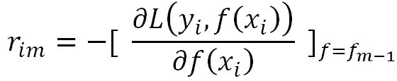


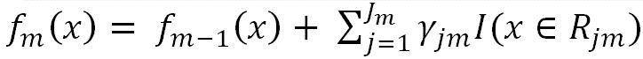

3.  输出:


初始化常数最优常数模型，它只是一个终端节点，将被用作在后续步骤中进一步调整它的起点。 *(2a)* ，通过将实际结果与预测结果进行比较来计算残差/误差，随后是( *2b* 和 *2c* )，其中下一个决策树将根据误差项进行拟合，以给模型带来更多的解释力，并且在( *2d* 中，在最后一次迭代中将额外的分量添加到模型中。最后，集成所有弱学习者来创建一个强学习者。

# AdaBoosting 与梯度 boosting 的比较

在了解了 AdaBoost 和 gradient boost 两者后，读者可能会好奇，想详细了解两者的区别。在这里，我们正是为了解渴而呈现的！

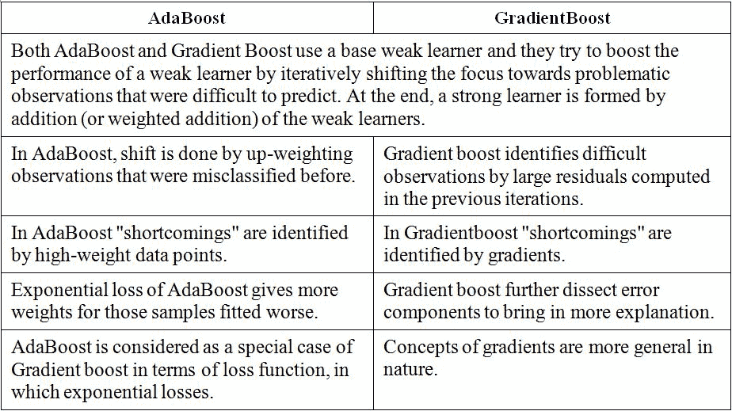

scikit-learn 包中的梯度增强分类器已用于计算:

```py
# Gradientboost Classifier
>>> from sklearn.ensemble import GradientBoostingClassifier

```

梯度增强算法中使用的参数如下。偏离已经被用于损失，因为我们试图解决的问题是 0/1 二元分类。学习率被选择为 0.05，要构建的树的数量是 5000 棵树，每个叶/末端节点的最小样本是 1，并且用于分裂资格的桶中所需的最小样本是 2:

```py
>>> gbc_fit = GradientBoostingClassifier (loss='deviance', learning_rate=0.05, n_estimators=5000, min_samples_split=2, min_samples_leaf=1, max_depth=1, random_state=42 ) 

>>> gbc_fit.fit(x_train,y_train) 
>>> print ("\nGradient Boost - Train Confusion Matrix\n\n",pd.crosstab(y_train, gbc_fit.predict(x_train),rownames = ["Actuall"],colnames = ["Predicted"]))
>>> print ("\nGradient Boost - Train accuracy",round(accuracy_score(y_train, gbc_fit.predict(x_train)),3))
>>> print ("\nGradient Boost - Train Classification Report\n",classification_report( y_train, gbc_fit.predict(x_train)))

>>> print ("\n\nGradient Boost - Test Confusion Matrix\n\n",pd.crosstab(y_test, gbc_fit.predict(x_test),rownames = ["Actuall"],colnames = ["Predicted"]))
>>> print ("\nGradient Boost - Test accuracy",round(accuracy_score(y_test, gbc_fit.predict(x_test)),3)) >>> print ("\nGradient Boost - Test Classification Report\n",classification_report( y_test, gbc_fit.predict(x_test)))

```


如果我们分析结果，梯度增强给出了比 AdaBoost 更好的结果，最高可能的测试精度为 87.5%，大多数 1 被捕获为 24，而 AdaBoost 获得的测试精度为 86.8%。因此，事实证明，难怪每个数据科学家都试图使用这种算法来赢得竞争！

应用于人力资源流失数据的梯度提升分类器的 R 代码:

```py
# Gradient boosting
library(gbm)

library(caret)
set.seed(43)
# Giving weights to all the observations in a way that total #weights will 
be euqal 1
model_weights <- ifelse(train_data$Attrition_ind == "0",
 (1/table(train_data$Attrition_ind)[1]) * 0.3,
 (1/table(train_data$Attrition_ind)[2]) * 0.7)
# Setting parameters for GBM
grid <- expand.grid(n.trees = 5000, interaction.depth = 1, shrinkage = .04, n.minobsinnode = 1)
# Fitting the GBM model
gbm_fit <- train(Attrition_ind ~ ., data = train_data, method = "gbm", weights = model_weights,
 tuneGrid=grid,verbose = FALSE)
# To print variable importance plot
summary(gbm_fit)

tr_y_pred = predict(gbm_fit, train_data,type = "raw")
ts_y_pred = predict(gbm_fit,test_data,type = "raw")
tr_y_act = train_data$Attrition_ind;ts_y_act = test_data$Attrition_ind

tr_tble = table(tr_y_act,tr_y_pred)
print(paste("Gradient Boosting - Train Confusion Matrix"))
print(tr_tble)

tr_acc = accrcy(tr_y_act,tr_y_pred)
trprec_zero = prec_zero(tr_y_act,tr_y_pred); trrecl_zero = 
recl_zero(tr_y_act,tr_y_pred)
trprec_one = prec_one(tr_y_act,tr_y_pred); trrecl_one = recl_one(tr_y_act,tr_y_pred)

trprec_ovll = trprec_zero *frac_trzero + trprec_one*frac_trone
trrecl_ovll = trrecl_zero *frac_trzero + trrecl_one*frac_trone

print(paste("Gradient Boosting Train accuracy:",tr_acc))
print(paste("Gradient Boosting - Train Classification Report"))
print(paste("Zero_Precision",trprec_zero,"Zero_Recall",trrecl_zero))
print(paste("One_Precision",trprec_one,"One_Recall",trrecl_one))
print(paste("Overall_Precision",round(trprec_ovll,4),"Overall_Recall",round(trrecl_ovll,4)))

ts_tble = table(ts_y_act,ts_y_pred)
print(paste("Gradient Boosting - Test Confusion Matrix"))
print(ts_tble)
ts_acc = accrcy(ts_y_act,ts_y_pred)
tsprec_zero = prec_zero(ts_y_act,ts_y_pred); tsrecl_zero = 
recl_zero(ts_y_act,ts_y_pred)
tsprec_one = prec_one(ts_y_act,ts_y_pred); tsrecl_one = recl_one(ts_y_act,ts_y_pred)
tsprec_ovll = tsprec_zero *frac_tszero + tsprec_one*frac_tsone
tsrecl_ovll = tsrecl_zero *frac_tszero + tsrecl_one*frac_tsone
print(paste("Gradient Boosting Test accuracy:",ts_acc))
print(paste("Gradient Boosting - Test Classification Report"))
print(paste("Zero_Precision",tsprec_zero,"Zero_Recall",tsrecl_zero))
print(paste("One_Precision",tsprec_one,"One_Recall",tsrecl_one))
print(paste("Overall_Precision",round(tsprec_ovll,4),"Overall_Recall",round(tsrecl_ovll,4)))

# Use the following code for performing cross validation on data - At the moment commented though
#fitControl <- trainControl(method = "repeatedcv", number = 4, repeats = 4)
# gbmFit1 <- train(Attrition_ind ~ ., data = train_data,
method = # "gbm", trControl = fitControl,tuneGrid=grid,verbose = FALSE)

```

# 极端梯度增强- XGBoost 分类器

XGBoost 是*陈天琪*在 2014 年基于梯度提升原理开发的新算法。自成立以来，它在数据科学界掀起了一场风暴。XGBoost 的开发在系统优化和机器学习原理方面都有很深的考虑。该库的目标是将机器的计算极限推向极致，以提供可扩展、可移植和准确的结果:

```py
# Xgboost Classifier
>>> import xgboost as xgb
>>> xgb_fit = xgb.XGBClassifier(max_depth=2, n_estimators=5000, 
learning_rate=0.05)
>>> xgb_fit.fit(x_train, y_train)

>>> print ("\nXGBoost - Train Confusion Matrix\n\n",pd.crosstab(y_train, xgb_fit.predict(x_train),rownames = ["Actuall"],colnames = ["Predicted"])) 
>>> print ("\nXGBoost - Train accuracy",round(accuracy_score(y_train, xgb_fit.predict(x_train)),3))
>>> print ("\nXGBoost  - Train Classification Report\n",classification_report(y_train, xgb_fit.predict(x_train)))
>>> print ("\n\nXGBoost - Test Confusion Matrix\n\n",pd.crosstab(y_test, xgb_fit.predict(x_test),rownames = ["Actuall"],colnames = ["Predicted"])) 
>>> print ("\nXGBoost - Test accuracy",round(accuracy_score(y_test, xgb_fit.predict(x_test)),3))
>>> print ("\nXGBoost - Test Classification Report\n",classification_report(y_test, xgb_fit.predict(x_test)))

```


从 **XGBoost** 得到的结果几乎与梯度升压相似。获得的测试精度为 87.1%，而提升得到 87.5%，并且识别的 1 的数量为 23，而梯度提升中为 24。XGBoost 相对于 Gradient boost 的最大优势在于性能和可用于控制模型调整的选项。通过改变其中的一些，使得 XGBoost 甚至比梯度增强更好！

应用于人力资源流失数据的极限梯度提升分类器的 R 代码:

```py
# Xgboost Classifier
library(xgboost); library(caret)

hrattr_data = read.csv("WA_Fn-UseC_-HR-Employee-Attrition.csv")
str(hrattr_data); summary(hrattr_data)
# Target variable creation
hrattr_data$Attrition_ind = 0;
hrattr_data$Attrition_ind[hrattr_data$Attrition=="Yes"]=1

# Columns to be removed due to no change in its value across observations
remove_cols = c("EmployeeCount","EmployeeNumber","Over18","StandardHours","Attrition")
hrattr_data_new = hrattr_data[,!(names(hrattr_data) %in% remove_cols)] 
# List of  variables with continuous values 
continuous_columns = c('Age','DailyRate', 'DistanceFromHome', 'Education', 'EnvironmentSatisfaction', 'HourlyRate', 'JobInvolvement', 'JobLevel', 'JobSatisfaction','MonthlyIncome', 'MonthlyRate', 'NumCompaniesWorked', 'PercentSalaryHike', 'PerformanceRating', 'RelationshipSatisfaction', 'StockOptionLevel', 'TotalWorkingYears',  'TrainingTimesLastYear', 'WorkLifeBalance', 'YearsAtCompany', 'YearsInCurrentRole', 'YearsSinceLastPromotion', 'YearsWithCurrManager')

# list of categorical variables
ohe_feats = c('BusinessTravel', 'Department', 'EducationField','Gender','JobRole', 'MaritalStatus', 'OverTime')

# one-hot-encoding categorical features
dummies <- dummyVars(~ BusinessTravel+Department+ EducationField+Gender+JobRole+MaritalStatus+OverTime, data = hrattr_data_new)
df_all_ohe <- as.data.frame(predict(dummies, newdata = hrattr_data_new))

# Cleaning column names and replace . with _

colClean <- function(x){ colnames(x) <- gsub("\\.", "_", colnames(x)); x }
df_all_ohe = colClean(df_all_ohe)

hrattr_data_new$Attrition_ind = as.integer(hrattr_data_new$Attrition_ind)

# Combining both continuous and dummy variables from categories
hrattr_data_v3 = cbind(df_all_ohe,hrattr_data_new [,(names(hrattr_data_new) %in% continuous_columns)], hrattr_data_new$Attrition_ind)

names(hrattr_data_v3)[52] = "Attrition_ind"

# Train and Test split based on 70% and 30%
set.seed(123)
numrow = nrow(hrattr_data_v3)
trnind = sample(1:numrow,size = as.integer(0.7*numrow))
train_data = hrattr_data_v3[trnind,]
test_data = hrattr_data_v3[-trnind,]

# Custom functions for calculation of Precision and Recall
frac_trzero = (table(train_data$Attrition_ind)[[1]])/nrow(train_data)
frac_trone = (table(train_data$Attrition_ind)[[2]])/nrow(train_data)

frac_tszero = (table(test_data$Attrition_ind)[[1]])/nrow(test_data)
frac_tsone = (table(test_data$Attrition_ind)[[2]])/nrow(test_data)
prec_zero <- function(act,pred){  tble = table(act,pred)
return( round( tble[1,1]/(tble[1,1]+tble[2,1]),4)  ) }

prec_one <- function(act,pred){ tble = table(act,pred)
return( round( tble[2,2]/(tble[2,2]+tble[1,2]),4)   ) }

recl_zero <- function(act,pred){tble = table(act,pred)
return( round( tble[1,1]/(tble[1,1]+tble[1,2]),4)   ) }

recl_one <- function(act,pred){ tble = table(act,pred)
return( round( tble[2,2]/(tble[2,2]+tble[2,1]),4)  ) }

accrcy <- function(act,pred){ tble = table(act,pred)
return( round((tble[1,1]+tble[2,2])/sum(tble),4)) }

y = train_data$Attrition_ind

# XGBoost Classifier Training
xgb <- xgboost(data = data.matrix(train_data[,-52]),label = y,eta = 0.04,max_depth = 2, nround=5000, subsample = 0.5, colsample_bytree = 0.5, seed = 1, eval_metric = "logloss", objective = "binary:logistic",nthread = 3)

# XGBoost value prediction on train and test data
tr_y_pred_prob <- predict(xgb, data.matrix(train_data[,-52]))
tr_y_pred <- as.numeric(tr_y_pred_prob > 0.5)
ts_y_pred_prob <- predict(xgb, data.matrix(test_data[,-52]))
ts_y_pred <- as.numeric(ts_y_pred_prob > 0.5)
tr_y_act = train_data$Attrition_ind;ts_y_act = test_data$Attrition_ind
tr_tble = table(tr_y_act,tr_y_pred)

# XGBoost Metric predictions on Train Data
print(paste("Xgboost - Train Confusion Matrix"))
print(tr_tble)
tr_acc = accrcy(tr_y_act,tr_y_pred)
trprec_zero = prec_zero(tr_y_act,tr_y_pred); trrecl_zero = recl_zero(tr_y_act,tr_y_pred)
trprec_one = prec_one(tr_y_act,tr_y_pred); trrecl_one = recl_one(tr_y_act,tr_y_pred)
trprec_ovll = trprec_zero *frac_trzero + trprec_one*frac_trone
trrecl_ovll = trrecl_zero *frac_trzero + trrecl_one*frac_trone

print(paste("Xgboost Train accuracy:",tr_acc))
print(paste("Xgboost - Train Classification Report"))
print(paste("Zero_Precision",trprec_zero,"Zero_Recall",trrecl_zero))
print(paste("One_Precision",trprec_one,"One_Recall",trrecl_one))
print(paste("Overall_Precision",round(trprec_ovll,4),"Overall_Recall",round(trrecl_ovll,4)))

# XGBoost Metric predictions on Test Data
ts_tble = table(ts_y_act,ts_y_pred)
print(paste("Xgboost - Test Confusion Matrix"))
print(ts_tble)
ts_acc = accrcy(ts_y_act,ts_y_pred)
tsprec_zero = prec_zero(ts_y_act,ts_y_pred); tsrecl_zero = recl_zero(ts_y_act,ts_y_pred)
tsprec_one = prec_one(ts_y_act,ts_y_pred); tsrecl_one = recl_one(ts_y_act,ts_y_pred)
tsprec_ovll = tsprec_zero *frac_tszero + tsprec_one*frac_tsone
tsrecl_ovll = tsrecl_zero *frac_tszero + tsrecl_one*frac_tsone

print(paste("Xgboost Test accuracy:",ts_acc))
print(paste("Xgboost - Test Classification Report"))
print(paste("Zero_Precision",tsprec_zero,"Zero_Recall",tsrecl_zero))
print(paste("One_Precision",tsprec_one,"One_Recall",tsrecl_one))
print(paste("Overall_Precision",round(tsprec_ovll,4),"Overall_Recall",round(tsrecl_ovll,4)))

```

# 系综集合-模型堆叠

集成或模型堆叠是一种将不同分类器组合成元分类器的方法，该元分类器比单独的每个单独的分类器具有更好的泛化性能。当你有疑问的时候，在处理你个人生活中的问题时，听取许多人的意见总是明智的！在模型上执行合奏有两种方式:

*   **具有不同类型分类器的集成:**在该方法中，不同类型的分类器(例如，逻辑回归、决策树、随机森林等)被拟合在相同的训练数据上，并且基于是分类还是回归问题，基于多数投票还是平均来组合结果。
*   **具有单一类型分类器的集成，但在各种自举样本上单独构建:**在该方法中，自举样本是从训练数据中提取的，并且每次将在提取的样本上拟合单独的模型(单个模型可以是决策树、随机森林等)，并且所有这些结果在最后被组合以创建集成。这种方法适合处理高度灵活的模型，其中方差减少仍然提高了性能。

# 具有不同类型分类器的集成

如前一节简要提到的，不同的分类器将应用于相同的训练数据，并且对结果进行集合，或者采取多数投票，或者应用另一个分类器(也称为元分类器)来拟合从单个分类器获得的结果。这意味着，对于元分类器 *X* ，变量将是模型输出，而 Y 变量将是实际的 0/1 结果。通过这样做，我们将获得应该为每个分类器给出的权重，并且这些权重将相应地应用于对看不见的观察进行分类。这里显示了应用系综的所有三种方法:

*   **多数投票或平均:**在该方法中，应用简单的模式函数(分类问题)从单个分类器中选择出现次数最多的类别。而对于回归问题，将计算平均值与实际值进行比较。
*   **元分类器在结果上的应用方法:**从单个分类器预测实际结果 0 或 1，并在 0 和 1 之上应用元分类器。这种方法的一个小问题是元分类器会有点脆弱和僵化。我的意思是 0 和 1 只是给出结果，而不是提供精确的敏感性(比如概率)。
*   **元分类器对概率的应用方法:**在该方法中，概率是从单个分类器中获得的，而不是 0 和 1。对概率应用元分类器使该方法比第一种方法更灵活。尽管用户可以试验这两种方法，看看哪一种表现更好。毕竟，机器学习就是探索和试错的方法。

在下图中，模型堆叠的完整流程已经用不同的阶段进行了描述:

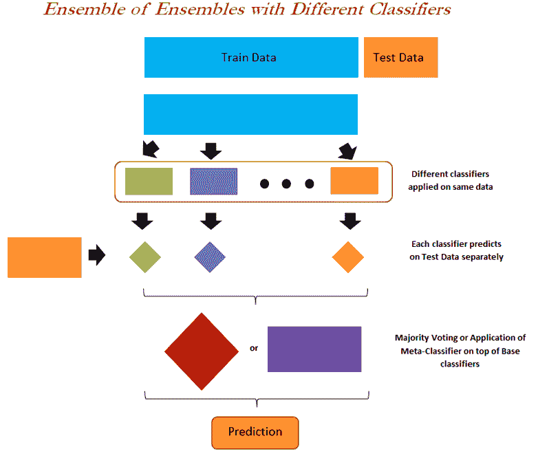

**使用多个分类器进行以下集成的步骤示例**:

*   四个分类器分别用于训练数据(逻辑回归、决策树、随机森林和 AdaBoost)
*   已经为所有四个分类器确定了概率，然而，由于类别 0 的概率+类别 1 的概率= 1 的原因，在元分类器中仅使用了类别 1 的概率，因此只有一个概率足以表示，否则出现多重共线性问题
*   逻辑回归已经被用作元分类器来模拟四个概率(从每个单独的分类器获得)之间关于最终 0/1 结果的关系
*   已经为元分类器中使用的所有四个变量计算了系数，并将其应用于新数据，以计算将观测值分类到相应类别的最终聚集概率:

```py
#Ensemble of Ensembles - by fitting various classifiers
>>> clwght = {0:0.3,1:0.7}

# Classifier 1 – Logistic Regression
>>> from sklearn.linear_model import LogisticRegression
>>> clf1_logreg_fit = LogisticRegression(fit_intercept=True,class_weight=clwght)
>>> clf1_logreg_fit.fit(x_train,y_train)

>>> print ("\nLogistic Regression for Ensemble - Train Confusion Matrix\n\n",pd.crosstab( y_train, clf1_logreg_fit.predict(x_train),rownames = ["Actuall"],colnames = ["Predicted"]))
>>> print ("\nLogistic Regression for Ensemble - Train accuracy",round( accuracy_score(y_train,clf1_logreg_fit.predict(x_train)),3))
>>> print ("\nLogistic Regression for Ensemble - Train Classification Report\n", classification_report(y_train,clf1_logreg_fit.predict(x_train)))
>>> print ("\n\nLogistic Regression for Ensemble - Test Confusion Matrix\n\n",pd.crosstab( y_test,clf1_logreg_fit.predict(x_test),rownames = ["Actuall"],colnames = ["Predicted"]))     >
>> print ("\nLogistic Regression for Ensemble - Test accuracy",round( accuracy_score(y_test,clf1_logreg_fit.predict(x_test)),3))
>>> print ("\nLogistic Regression for Ensemble - Test Classification Report\n", classification_report( y_test,clf1_logreg_fit.predict(x_test)))

# Classifier 2 – Decision Tree
>>> from sklearn.tree import DecisionTreeClassifier
>>> clf2_dt_fit = DecisionTreeClassifier(criterion="gini", max_depth=5, min_samples_split=2, min_samples_leaf=1, random_state=42, class_weight=clwght)
>>> clf2_dt_fit.fit(x_train,y_train)

>>> print ("\nDecision Tree for Ensemble - Train Confusion Matrix\n\n",pd.crosstab( y_train, clf2_dt_fit.predict(x_train),rownames = ["Actuall"],colnames = ["Predicted"]))
>>> print ("\nDecision Tree for Ensemble - Train accuracy", round(accuracy_score( y_train,clf2_dt_fit.predict(x_train)),3))
>>> print ("\nDecision Tree for Ensemble - Train Classification Report\n", classification_report(y_train,clf2_dt_fit.predict(x_train)))
>>> print ("\n\nDecision Tree for Ensemble - Test Confusion Matrix\n\n", pd.crosstab(y_test, clf2_dt_fit.predict(x_test),rownames = ["Actuall"],colnames = ["Predicted"]))
>>> print ("\nDecision Tree for Ensemble - Test accuracy",round(accuracy_score(y_test, clf2_dt_fit.predict(x_test)),3))

>>> print ("\nDecision Tree for Ensemble - Test Classification Report\n", classification_report(y_test, clf2_dt_fit.predict(x_test)))

# Classifier 3 – Random Forest
>>> from sklearn.ensemble import RandomForestClassifier
>>> clf3_rf_fit = RandomForestClassifier(n_estimators=10000, criterion="gini", max_depth=6, min_samples_split=2,min_samples_leaf=1,class_weight = clwght)
>>> clf3_rf_fit.fit(x_train,y_train)

>>> print ("\nRandom Forest for Ensemble - Train Confusion Matrix\n\n", pd.crosstab(y_train, clf3_rf_fit.predict(x_train),rownames = ["Actuall"],colnames = ["Predicted"]))
>>> print ("\nRandom Forest for Ensemble - Train accuracy",round(accuracy_score( y_train,clf3_rf_fit.predict(x_train)),3))
>>> print ("\nRandom Forest for Ensemble - Train Classification Report\n", classification_report(y_train,clf3_rf_fit.predict(x_train))) 
>>> print ("\n\nRandom Forest for Ensemble - Test Confusion Matrix\n\n",pd.crosstab( y_test, clf3_rf_fit.predict(x_test),rownames = ["Actuall"],colnames = ["Predicted"]))     
>>> print ("\nRandom Forest for Ensemble - Test accuracy",round(accuracy_score( y_test,clf3_rf_fit.predict(x_test)),3))
>>> print ("\nRandom Forest for Ensemble - Test Classification Report\n", classification_report(y_test,clf3_rf_fit.predict(x_test))) 
# Classifier 4 – Adaboost classifier
>>> from sklearn.ensemble import AdaBoostClassifier
>>> clf4_dtree = DecisionTreeClassifier(criterion='gini',max_depth=1,class_weight = clwght)
>>> clf4_adabst_fit = AdaBoostClassifier(base_estimator= clf4_dtree,
                n_estimators=5000,learning_rate=0.05,random_state=42)
>>> clf4_adabst_fit.fit(x_train, y_train)
>>> print ("\nAdaBoost for Ensemble  - Train Confusion Matrix\n\n",pd.crosstab(y_train, clf4_adabst_fit.predict(x_train),rownames = ["Actuall"],colnames = ["Predicted"]))     
>>> print ("\nAdaBoost for Ensemble   - Train accuracy",round(accuracy_score(y_train, clf4_adabst_fit.predict(x_train)),3))
>>> print ("\nAdaBoost for Ensemble   - Train Classification Report\n", classification_report(y_train,clf4_adabst_fit.predict(x_train)))
>>> print ("\n\nAdaBoost for Ensemble   - Test Confusion Matrix\n\n", pd.crosstab(y_test, clf4_adabst_fit.predict(x_test),rownames = ["Actuall"],colnames = ["Predicted"]))     
>>> print ("\nAdaBoost for Ensemble   - Test accuracy",round(accuracy_score(y_test, clf4_adabst_fit.predict(x_test)),3))
>>> print ("\nAdaBoost for Ensemble  - Test Classification Report\n", classification_report(y_test, clf4_adabst_fit.predict(x_test)))

```

在接下来的步骤中，我们执行分类器的集成:

```py
>> ensemble = pd.DataFrame() 

```

在接下来的步骤中，我们只对类别 1 采用概率，因为它给出了高概率的直观感觉，并指示了更高类别 1 的值。但这不应该阻止某人，如果他们真的想把概率改为 0。在这种情况下，低概率值更适合类别 1，这让我们有点头疼！

```py
>>> ensemble["log_output_one"] = pd.DataFrame(clf1_logreg_fit.predict_proba( x_train))[1]
>>> ensemble["dtr_output_one"] = pd.DataFrame(clf2_dt_fit.predict_proba(x_train))[1]
>>> ensemble["rf_output_one"] = pd.DataFrame(clf3_rf_fit.predict_proba(x_train))[1]
>>> ensemble["adb_output_one"] = pd.DataFrame(clf4_adabst_fit.predict_proba( x_train))[1]
>>> ensemble = pd.concat([ensemble,pd.DataFrame(y_train).reset_index(drop = True )],axis=1)

# Fitting meta-classifier
>>> meta_logit_fit =  LogisticRegression(fit_intercept=False)
>>> meta_logit_fit.fit(ensemble[['log_output_one', 'dtr_output_one', 'rf_output_one', 'adb_output_one']],ensemble['Attrition_ind'])
>>> coefs =  meta_logit_fit.coef_
>>> ensemble_test = pd.DataFrame()
>>> ensemble_test["log_output_one"] = pd.DataFrame(clf1_logreg_fit.predict_proba( x_test))[1]
>>> ensemble_test["dtr_output_one"] = pd.DataFrame(clf2_dt_fit.predict_proba( x_test))[1] 
>>> ensemble_test["rf_output_one"] = pd.DataFrame(clf3_rf_fit.predict_proba( x_test))[1]
>>> ensemble_test["adb_output_one"] = pd.DataFrame(clf4_adabst_fit.predict_proba( x_test))[1]
>>> coefs =  meta_logit_fit.coef_
>>> ensemble_test = pd.DataFrame()
>>> ensemble_test["log_output_one"] = pd.DataFrame(clf1_logreg_fit.predict_proba( x_test))[1]
>>> ensemble_test["dtr_output_one"] = pd.DataFrame(clf2_dt_fit.predict_proba( x_test))[1]
>>> ensemble_test["rf_output_one"] = pd.DataFrame(clf3_rf_fit.predict_proba( x_test))[1]
>>> ensemble_test["adb_output_one"] = pd.DataFrame(clf4_adabst_fit.predict_proba( x_test))[1]
>>> print ("\n\nEnsemble of Models - Test Confusion Matrix\n\n",pd.crosstab( ensemble_test['Attrition_ind'],ensemble_test['all_one'],rownames = ["Actuall"], colnames = ["Predicted"])) 
>>> print ("\nEnsemble of Models - Test accuracy",round(accuracy_score (ensemble_test['Attrition_ind'],ensemble_test['all_one']),3))
>>> print ("\nEnsemble of Models - Test Classification Report\n", classification_report( ensemble_test['Attrition_ind'], ensemble_test['all_one']))

```


虽然代码打印了**列车**、**测试精度**、**混淆矩阵**和**分类报告**，但由于空间限制，我们未在此显示。建议用户在电脑上运行并检查结果。测试准确率为 *87.5%* ，为最高值(与梯度提升结果相同)。然而，通过仔细调整，基于添加更好的模型和移除低权重的模型，系综确实给出了更好的结果:

```py
>>> coefs = meta_logit_fit.coef_
>>> print ("Co-efficients for LR, DT, RF and AB are:",coefs)

```

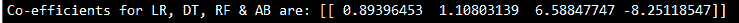

令人惊讶的是，AdaBoost 似乎拖累了整个团队的表现。一个提示是，要么更改 AdaBoost 中使用的参数并重新运行整个练习，要么从集成中移除 AdaBoost 分类器并重新运行集成步骤，以查看集成测试的准确性、精度和召回值是否有任何改进:

用于人力资源损耗数据的不同分类器集成的 r 代码:

```py
# Ensemble of Ensembles with different type of Classifiers setwd 
("D:\\Book writing\\Codes\\Chapter 4") 

hrattr_data = read.csv("WA_Fn-UseC_-HR-Employee-Attrition.csv") 
str(hrattr_data) 
summary(hrattr_data) 

hrattr_data$Attrition_ind = 0; hrattr_data$Attrition_ind[hrattr_data$Attrition=="Yes"]=1 
hrattr_data$Attrition_ind = as.factor(hrattr_data$Attrition_ind) 

remove_cols = c ("EmployeeCount","EmployeeNumber","Over18",  "StandardHours","Attrition")
hrattr_data_new = hrattr_data[,!(names(hrattr_data) %in% remove_cols)]

set.seed(123)
numrow = nrow(hrattr_data_new)
trnind = sample(1:numrow,size = as.integer(0.7*numrow))
train_data = hrattr_data_new[trnind,]
test_data = hrattr_data_new[-trnind,]

# Ensemble of Ensembles with different type of Classifiers train_data$Attrition_ind = as.factor(train_data$Attrition_ind)

# Classifier 1 - Logistic Regression
glm_fit = glm(Attrition_ind ~.,family = "binomial",data = train_data) glm_probs = predict(glm_fit,newdata = train_data,type = "response")

# Classifier 2 - Decision Tree classifier
library(C50) 
dtree_fit = C5.0(train_data[-31],train_data$Attrition_ind,
 control = C5.0Control(minCases = 1))
dtree_probs = predict(dtree_fit,newdata = train_data,type = "prob")[,2]

# Classifier 3 - Random Forest
library(randomForest)
rf_fit = randomForest(Attrition_ind~., data = train_data,mtry=6,maxnodes= 64,ntree=5000,nodesize = 1)
rf_probs = predict(rf_fit,newdata = train_data,type = "prob")[,2]

# Classifier 4 - Adaboost
ada_fit = C5.0(train_data[-31],train_data$Attrition_ind,trails = 5000,control = C5.0Control(minCases = 1))
ada_probs = predict(ada_fit,newdata = train_data,type = "prob")[,2]

# Ensemble of Models
ensemble = data.frame(glm_probs,dtree_probs,rf_probs,ada_probs)
ensemble = cbind(ensemble,train_data$Attrition_ind)
names(ensemble)[5] = "Attrition_ind"
rownames(ensemble) <- 1:nrow(ensemble)

# Meta-classifier on top of individual classifiers
meta_clf = glm(Attrition_ind~.,data = ensemble,family = "binomial")
meta_probs = predict(meta_clf, ensemble,type = "response")

ensemble$pred_class = 0
ensemble$pred_class[meta_probs>0.5]=1

# Train confusion and accuracy metrics
tr_y_pred = ensemble$pred_class
tr_y_act = train_data$Attrition_ind;ts_y_act = test_data$Attrition_ind
tr_tble = table(tr_y_act,tr_y_pred)
print(paste("Ensemble - Train Confusion Matrix"))
print(tr_tble)

tr_acc = accrcy(tr_y_act,tr_y_pred)
print(paste("Ensemble Train accuracy:",tr_acc))

# Now verifing on test data
glm_probs = predict(glm_fit,newdata = test_data,type = "response")
dtree_probs = predict(dtree_fit,newdata = test_data,type = "prob")[,2]
rf_probs = predict(rf_fit,newdata = test_data,type = "prob")[,2]
ada_probs = predict(ada_fit,newdata = test_data,type = "prob")[,2]

ensemble_test = data.frame(glm_probs,dtree_probs,rf_probs,ada_probs)
ensemble_test = cbind(ensemble_test,test_data$Attrition_ind)
names(ensemble_test)[5] = "Attrition_ind"

rownames(ensemble_test) <- 1:nrow(ensemble_test)
meta_test_probs = predict(meta_clf,newdata = ensemble_test,type = "response")
ensemble_test$pred_class = 0
ensemble_test$pred_class[meta_test_probs>0.5]=1

# Test confusion and accuracy metrics
ts_y_pred = ensemble_test$pred_class
ts_tble = table(ts_y_act,ts_y_pred)
print(paste("Ensemble - Test Confusion Matrix"))
print(ts_tble)

ts_acc = accrcy(ts_y_act,ts_y_pred)
print(paste("Ensemble Test accuracy:",ts_acc))

```

# 使用单一类型分类器的带有自举样本的集成

在这种方法中，自举样本是从训练数据中提取的，并且每次都将在提取的样本上拟合单独的模型(单个模型可以是决策树、随机森林等)，并且所有这些结果在最后被组合以创建一个集成。这种方法适合于处理高度灵活的模型，在这些模型中，方差的减少仍然会提高性能:

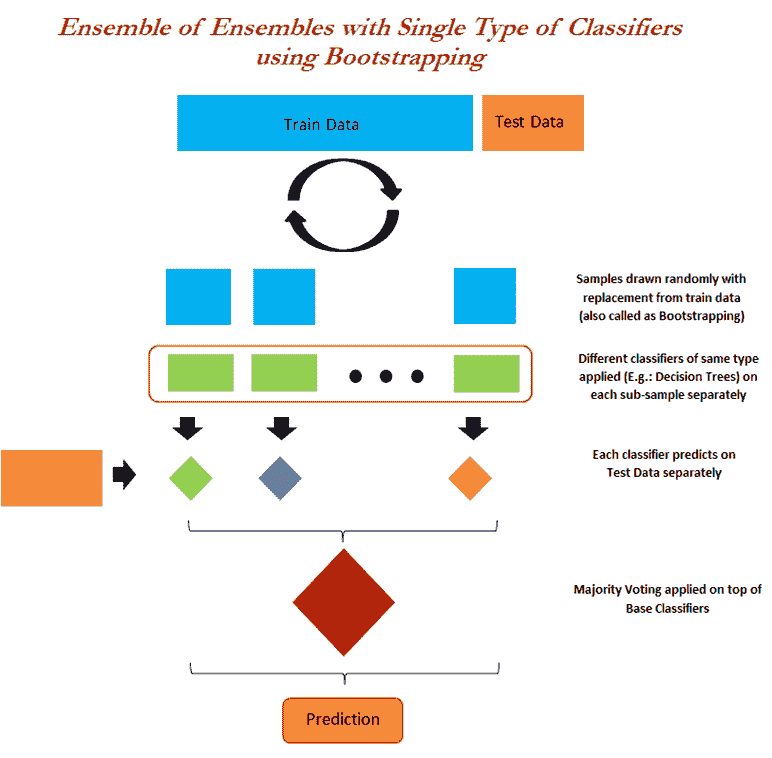

在下面的例子中，AdaBoost 被用作基础分类器，并且使用 bagging 分类器组合各个 AdaBoost 模型的结果以生成最终结果。尽管如此，每个 AdaBoost 都是由深度为 1(决策树桩)的决策树组成的。在这里，我们想展示分类器内部分类器内部分类器是可能的(虽然听起来像《盗梦空间》电影！):

```py
# Ensemble of Ensembles - by applying bagging on simple classifier 
>>> from sklearn.tree import DecisionTreeClassifier 
>>> from sklearn.ensemble import BaggingClassifier 
>>> from sklearn.ensemble import AdaBoostClassifier 
>>> clwght = {0:0.3,1:0.7}

```

以下是 AdaBoost 分类器中使用的基本分类器(决策树桩):

```py
>>> eoe_dtree = DecisionTreeClassifier(criterion='gini',max_depth=1,class_weight = clwght)

```

每个 AdaBoost 分类器由 500 棵决策树组成，学习率为 0.05:

```py
>>> eoe_adabst_fit = AdaBoostClassifier(base_estimator= eoe_dtree, n_estimators=500,learning_rate=0.05,random_state=42) 
>>> eoe_adabst_fit.fit(x_train, y_train) 

>>> print ("\nAdaBoost - Train Confusion Matrix\n\n",pd.crosstab(y_train, eoe_adabst_fit.predict(x_train),rownames = ["Actuall"],colnames = ["Predicted"])) 
>>> print ("\nAdaBoost - Train accuracy",round(accuracy_score(y_train, eoe_adabst_fit.predict(x_train)),3)) 
>>> print ("\nAdaBoost - Train Classification Report\n",classification_report(y_train, eoe_adabst_fit.predict(x_train))) 

>>> print ("\n\nAdaBoost - Test Confusion Matrix\n\n",pd.crosstab(y_test, eoe_adabst_fit.predict(x_test),rownames = ["Actuall"],colnames = ["Predicted"])) 
>>> print ("\nAdaBoost - Test accuracy",round(accuracy_score(y_test, eoe_adabst_fit.predict(x_test)),3)) 
>>> print ("\nAdaBoost - Test Classification Report\n",classification_report(y_test, eoe_adabst_fit.predict(x_test)))

```

bagging 分类器由 50 个 AdaBoost 分类器组成，用于集成集成:

```py
>>> bag_fit = BaggingClassifier(base_estimator= eoe_adabst_fit,n_estimators=50,
max_samples=1.0,max_features=1.0, bootstrap=True,
bootstrap_features=False,n_jobs=-1,random_state=42) 
>>> bag_fit.fit(x_train, y_train) 
>>> print ("\nEnsemble of AdaBoost - Train Confusion Matrix\n\n",pd.crosstab( y_train,bag_fit.predict(x_train),rownames = ["Actuall"],colnames = ["Predicted"])) 
>>> print ("\nEnsemble of AdaBoost - Train accuracy",round(accuracy_score(y_train, bag_fit.predict(x_train)),3))
>>> print ("\nEnsemble of AdaBoost - Train Classification Report\n", classification_report( y_train,bag_fit.predict(x_train))) 

>>> print ("\n\nEnsemble of AdaBoost - Test Confusion Matrix\n\n",pd.crosstab(y_test, bag_fit.predict(x_test),rownames = ["Actuall"],colnames = ["Predicted"])) 
>>> print ("\nEnsemble of AdaBoost - Test accuracy",round(accuracy_score(y_test,bag_fit.predict(x_test)),3)) 
>>> print ("\nEnsemble of AdaBoost - Test Classification Report\n", classification_report(y_test,bag_fit.predict(x_test)))

```

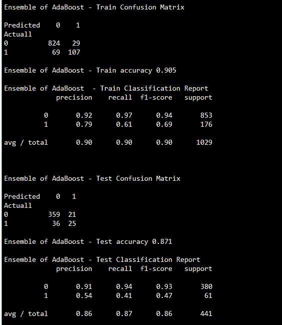

在 AdaBoost 上的集成结果显示了一些改进，其中获得的测试精度为 87.1%，几乎与梯度增强的 87.5%相当，这是我们迄今为止看到的最佳值。但是，这里标识的 1 的数量是 25，比梯度增强大。因此，已经证明了合奏确实有效！不幸的是，这些类型的函数在 R 软件中是不可用的，因此我们在这里不写等价的 R 代码。

# 摘要

在本章中，您已经了解了基于树的模型的完整细节，这些模型是目前行业中使用最多的，包括带有网格搜索的单个决策树和树的集成，如 bagging、random forest、boosting(包括 AdaBoost、gradient boost 和 XGBoost)，最后是集成集成，也称为模型堆叠，通过进一步聚合结果来减少方差误差，从而进一步提高准确性。在模型堆叠中，您已经学习了如何确定每个模型的权重，这样就可以决定将哪个模型保留在最终结果中，以获得最佳的准确性。

在下一章中，您将学习 k 近邻和朴素贝叶斯，它们比基于树的模型计算量小。朴素贝叶斯模型将用一个自然语言处理用例来解释。事实上，朴素贝叶斯和 SVM 常用于变量(维数)非常多的情况下进行分类。