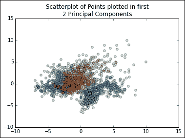
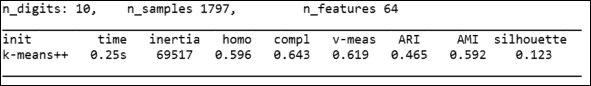
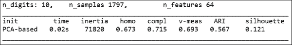
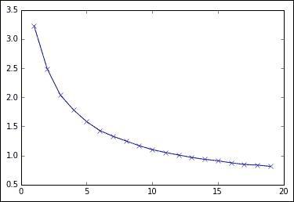
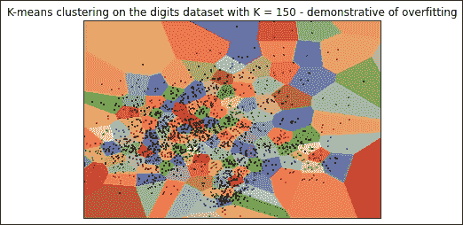
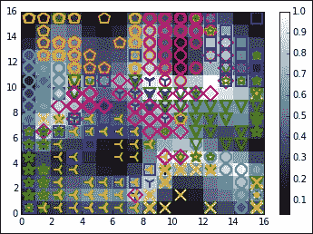

# 第一章。无监督机器学习

在本章中，您将学习如何应用无监督学习技术来识别数据集内的模式和结构。

无监督学习技术是一套有价值的探索性分析工具。它们揭示了数据集中的模式和结构，这些模式和结构产生的信息可能本身就具有信息价值，或者可以作为进一步分析的指南。拥有一套坚实的无监督学习工具至关重要，您可以应用这些工具来帮助将不熟悉或复杂的数据集分解为可操作的信息。

我们将首先回顾 **【主成分分析】** ( **主成分分析**)，这是一种具有一系列降维应用的基本数据处理技术。接下来，我们将讨论 **k-means 聚类**，一种广泛使用且平易近人的无监督学习技术。然后，我们将讨论 Kohenen 的 **自组织图** ( **SOM** )，这是一种拓扑聚类方法，能够将复杂数据集投影到二维。

在这一章中，我们将花一些时间讨论如何有效地应用这些技术来使高维数据集变得易于访问。我们将使用**【UCI 手写数字】**数据集来演示每种算法的技术应用。在讨论和应用每种技术的过程中，我们将回顾实际应用和方法问题，特别是关于如何校准和验证每种技术以及哪些性能测量是有效的。综上所述，我们将依次讨论以下主题:

*   主成分分析
*   k-均值聚类
*   自组织地图

# 主成分分析

为了有效地处理高维数据集，重要的是要有一套技术，可以将这个维度降低到可管理的水平。这种降维的优势包括能够以二维方式绘制多元数据，在最少数量的要素中捕获数据集的大部分信息内容，以及在某些情况下识别共线模型组件。

### 注

对于那些需要复习的人来说，机器学习上下文中的共线性指的是共享近似线性关系的模型特征。由于显而易见的原因，这些特性往往没有帮助，因为相关的特性不太可能相互添加任何一个独立提供的信息。此外，共线特征可能会强调局部最小值或其他虚假线索。

可能今天最广泛使用的降维技术是主成分分析。由于我们将在本书的多个上下文中应用主成分分析，因此我们应该回顾这一技术，了解其背后的理论，并编写 Python 代码来有效地应用它。

## PCA–第一

主成分分析是一种强大的分解技术；它允许人们将高度多元的数据集分解成一组正交分量。当把足够多的数据放在一起时，这些成分可以解释几乎所有数据集的差异。本质上，这些组件提供了数据集的简短描述。主成分分析有广泛的应用，其广泛的实用性使其非常值得我们花时间去研究。

### 注

请注意这里稍微谨慎的措辞——给定的一组长度小于原始数据集中变量数量的组件几乎总是会丢失源数据集中的一些信息内容。如果给定足够的分量，这种损失通常是最小的，但是在少量主分量由非常高维的数据集组成的情况下，可能会有相当大的损失。因此，在执行主成分分析时，考虑需要多少组件来有效地对所讨论的数据集建模总是合适的。

主成分分析的工作原理是连续识别数据集中最大方差的轴(主成分)。它是这样做的:

1.  识别数据集的中心点。
2.  计算数据的协方差矩阵。
3.  计算协方差矩阵的特征向量。
4.  特征向量的正交化。
5.  计算每个特征向量所代表的方差比例。

让我们简单地解释一下这些概念:

*   **协方差** 是应用于多个维度的有效方差；它是两个或多个变量之间的方差。虽然单个值可以捕捉一维或变量的方差，但需要使用*2×2*矩阵来捕捉两个变量之间的协方差，使用*3×3*矩阵来捕捉三个变量之间的协方差，以此类推。所以 PCA 的第一步就是计算这个协方差矩阵。
*   **特征向量** 是特定于数据集和线性变换的向量。具体地，在执行变换之前和之后，它是方向不改变的向量。为了更好地理解这是如何工作的，想象你拿着一根橡皮筋，伸直，放在双手之间。假设你把带子拉长，直到它在你的双手之间绷紧。特征向量是在拉伸之前和拉伸期间没有改变方向的向量；在这种情况下，它是从一只手到另一只手直接穿过带中心的向量。
*   **正交化** 是寻找两个相互正交(成直角)的向量的过程。在 n 维数据空间中，正交化过程采用一组向量并产生一组正交向量。
*   **正交化** 是一个正交化过程，也是对产品进行归一化。
*   **特征值** (大致对应特征向量的长度)用于计算每个特征向量所代表的方差比例。这是通过将每个特征向量的特征值除以所有特征向量的特征值之和来实现的。

总之，协方差矩阵用于计算特征向量。进行正交归一化处理，从特征向量产生正交的归一化向量。具有最大特征值的特征向量是连续分量具有较小特征值的第一主分量。这样，主成分分析算法具有获取数据集并将其转换为新的低维坐标系的效果。

## 采用主成分分析

现在我们已经在高层次上回顾了主成分分析算法，我们将直接进入并应用主成分分析到一个关键的 Python 数据集——UCI 手写`digits`数据集，作为 **scikit-learn** 的一部分分发。

该数据集由从 44 个不同作者收集的 1，797 个手写数字实例组成。来自这些作者作品的输入(压力和位置)在一个*8×8*网格上被重新采样两次，从而产生如下图所示的那种地图:


这些图可以被转换成长度为 64 的特征向量，然后可以很容易地用作分析输入。有了 64 个要素的输入数据集，使用像主成分分析这样的技术将变量集减少到可管理的数量就有了直接的吸引力。就目前的情况来看，我们无法用探索性可视化有效地探索数据集！

我们将使用以下代码开始对手写的`digits`数据集应用主成分分析:

```py
import numpy as np
from sklearn.datasets import load_digits
import matplotlib.pyplot as plt
from sklearn.decomposition import PCA
from sklearn.preprocessing import scale
from sklearn.lda import LDA
import matplotlib.cm as cm

digits = load_digits()
data = digits.data

n_samples, n_features = data.shape
n_digits = len(np.unique(digits.target))
labels = digits.target
```

这段代码为我们做了几件事:

1.  首先，它加载了一组必要的库，包括`numpy`，一组来自 scikit-learn 的组件，包括`digits`数据集本身，PCA 和数据缩放函数，以及 matplotlib 的绘图能力。
2.  然后代码开始准备`digits`数据集。它按顺序做了几件事:
    *   首先，它在创建有用的变量之前加载数据集
    *   创建`data`变量供后续使用，`target`向量( *0* 到 *9* )中不同的`digits`的数量被保存为一个变量，我们可以方便地访问该变量进行后续分析
    *   `target`向量也保存为标签以备后用
    *   所有这些变量的创建都是为了简化后续分析
3.  准备好数据集后，我们可以初始化我们的 PCA 算法，并将其应用于数据集:

    ```py
    pca = PCA(n_components=10)
    data_r = pca.fit(data).transform(data)

    print('explained variance ratio (first two components): %s' % str(pca.explained_variance_ratio_))
    print('sum of explained variance (first two components): %s' % str(sum(pca.explained_variance_ratio_)))
    ```

4.  该代码输出由解释力排序的前十个主成分中的每一个解释的方差。

在这个组`10`主成分的情况下，它们共同解释了整个数据集方差的 *0.589* 。考虑到这是从 *64* 变量到`10`分量的缩减，这其实不算太坏。然而，这确实说明了常设仲裁院的潜在损失。然而，关键问题是，这一组简化的组件是否使后续分析或分类更容易实现；也就是说，剩余的组件中是否有许多包含干扰分类尝试的方差。

创建了一个包含在`digits`数据集上执行的`pca`输出的`data_r`对象，让我们可视化输出。为此，我们将首先为类着色创建一个`colors`向量。然后我们简单地创建一个带有彩色类的散点图:

```py
X = np.arange(10)
ys = [i+x+(i*x)**2 for i in range(10)]

plt.figure()
colors = cm.rainbow(np.linspace(0, 1, len(ys)))
for c, i target_name in zip(colors, [1,2,3,4,5,6,7,8,9,10], labels):
   plt.scatter(data_r[labels == I, 0], data_r[labels == I, 1],     
   c=c, alpha = 0.4)
   plt.legend()
   plt.title('Scatterplot of Points plotted in first \n'
   '10 Principal Components')
   plt.show()
```

得到的散点图如下所示:



这个图向我们展示了，虽然在前两个主成分中类之间有一些分离，但是用这个数据集高度精确地分类可能很棘手。然而，类看起来确实是聚类的，我们可以通过使用聚类分析得到相当好的结果。这样，主成分分析让我们对数据集的结构有了一些了解，并为我们的后续分析提供了信息。

在这一点上，让我们抓住这一点，继续通过应用 k-means 聚类算法来检查聚类。

# 引入 k-均值聚类

在前一节中，您了解到无监督机器学习算法用于从大型、可能复杂的数据集提取关键的结构或信息内容。这些算法是在很少或没有人工输入的情况下实现的，并且无需训练数据(训练算法以识别期望的分类边界所需的一组带标签的解释和响应变量)。这意味着无监督算法是生成关于新的或不熟悉的数据集的结构和内容的信息的有效工具。它们允许分析师在很短的时间内建立强大的理解。

## 聚类–入门

聚类可能是典型的无监督学习技术，原因有几个。

大量的开发时间已经投入到优化聚类算法中，包括 Python 在内的大多数数据科学语言都有高效的实现。

聚类算法往往非常快，平滑的实现在多项式时间内运行。这使得即使在大型数据集上运行多个集群配置也不复杂。还存在可扩展的聚类实现，其将算法并行化，以在 1tb 规模的“T2”数据集上运行。

聚类算法通常很容易理解，因此如果必要的话，它们的操作很容易解释。

最流行的聚类算法是 k-means；该算法通过首先在数据空间中随机启动 k 个聚类作为 k 个点来形成 k 个聚类。这些点中的每一个都是一个簇的平均值。然后会出现一个迭代过程，运行如下:

*   每个点根据最小(群内)平方和被分配到一个群，这直观上是最接近的平均值。
*   每个聚类的中心(质心)成为新的平均值。这导致每种方法都发生了变化。

经过足够的迭代，质心移动到最小化性能度量的位置(最常用的性能度量是“簇内最小二乘和”度量)。一旦这个度量被最小化，在迭代过程中观察就不再被重新分配；此时，算法已经收敛到一个解。

## 启动聚类分析

现在我们已经回顾了聚类算法，让我们运行代码，看看聚类能为我们做些什么:

```py
from time import time
import numpy as np
import matplotlib.pyplot as plt

np.random.seed()

digits = load_digits()
data = scale(digits.data)

n_samples, n_features = data.shape
n_digits = len(np.unique(digits.target))
labels = digits.target

sample_size = 300

print("n_digits: %d, \t n_samples %d, \t n_features %d"
   % (n_digits, n_samples, n_features))

print(79 * '_')
print('% 9s' % 'init''         time   inertia   homo   compl   v-meas   ARI     AMI  silhouette')

def bench_k_means(estimator, name, data):
   t0 = time()
   estimator.fit(data)
   print('% 9s %.2fs %i %.3f %.3f %.3f %.3f %.3f %.3f'
      % (name, (time() - t0), estimator.inertia_,
         metrics.homogeneity_score(labels, estimator.labels_),
         metrics.completeness_score(labels, estimator.labels_),
         metrics.v_measure_score(labels, estimator.labels_),
         metrics.adjusted_rand_score(labels, estimator.labels_),
         metrics.silhouette_score(data, estimator.labels_,
            metric='euclidean',
            sample_size=sample_size)))
```

### 注

该代码与我们之前看到的 PCA 代码之间的一个关键区别是，该代码首先对`digits`数据集应用一个比例函数。该函数将数据集中的值缩放至 *0* 和 *1* 之间。在任何需要的地方对数据进行缩放至关重要，无论是按对数比例还是按界限比例，以防止不同特征值的幅度对数据集产生不成比例的强大影响。确定数据是否需要缩放(以及需要什么样的缩放，在哪个范围内，等等)的关键在很大程度上取决于数据的形状和性质。如果数据分布显示异常值或大范围内的变化，则应用对数标度可能是合适的。无论这是通过可视化和探索性分析技术手动完成的，还是通过使用汇总统计数据完成的，围绕缩放的决策都与被检查的数据和要使用的分析技术相关联。在[第 7 章](07.html "Chapter 7. Feature Engineering Part II")、*特征工程第二部分*中可以找到关于缩放决策和考虑的进一步讨论。

有益的是，scikit-learn 默认使用 k-means++算法，该算法在运行时间和避免不良聚类的成功率方面都优于原始的 k-means 算法。

该算法通过运行一个初始化过程来找到近似类内最小方差的聚类质心来实现这一点。

您可能已经从前面的代码中发现，我们正在使用一组性能估计器来跟踪我们的 k-means 应用程序的性能。基于单一的正确率或使用与其他算法通常使用的相同性能度量来度量聚类算法的性能是不切实际的。聚类算法成功的定义是，它们提供了输入数据如何分组的解释，在几个因素之间进行权衡，包括类分离、组内相似性和跨组差异。

**同质性分数**是一个简单的零到一的有界度量，用来衡量聚类在多大程度上只包含给定类的赋值。得分为 1 表示所有聚类都包含单个类的度量。这个度量由 **完备性分数**来补充，它是给定类的所有成员被分配到相同簇的程度的类似有界度量。因此，完整性分数和同质性分数为 1 表示完美的聚类解决方案。

**有效性测度(v-测度)**是同质性和完备性得分的调和均值，与二元分类的 F-测度完全相似。本质上，它提供了一个单一的 0-1 标度值来监控同质性和完整性。

调整后的兰德指数 ( **ARI** )是一种相似性度量，用于跟踪各组作业之间的一致性。当应用于聚类时，它测量真实的、预先存在的观察标签和作为聚类算法输出预测的标签之间的一致性。兰德指数在 *0-1* 范围内测量标注相似度，其中一个等于完美的预测标注。

所有前面的性能度量以及其他类似的度量(例如，Akaike 的互信息标准)的主要挑战是，它们需要对基本事实的理解，也就是说，它们需要对被检查的部分或全部数据进行标记。如果标签不存在并且无法生成，这些措施将不起作用。实际上，这是一个相当大的缺点，因为只有很少的数据集进行了预先标记，并且创建标签可能非常耗时。

在没有标记数据的情况下，测量 k 均值聚类解决方案性能的一个选项是 **轮廓系数**。这是一种衡量模型中的集群定义有多好的方法。给定数据集的轮廓系数是每个样本系数的平均值，该系数计算如下:


每个术语的定义如下:

*   *a* :样本与同一个聚类中所有其他点之间的平均距离
*   *b* :样本与下一个最近聚类中所有其他点之间的平均距离

这个分数在 *-1* 和 *1* 之间，其中 *-1* 表示聚类不正确， *1* 表示聚类非常密集， *0* 附近的分数表示聚类重叠。这往往符合我们对一个好的集群解决方案是如何组成的预期。

在`digits`数据集的情况下，我们可以使用这里描述的所有性能度量。因此，我们将通过在`digits`数据集上初始化我们的`bench_k_means`函数来完成前面的示例:

```py
bench_k_means(KMeans(init='k-means++', n_clusters=n_digits, n_init=10), name="k-means++", data=data)
print(79 * '_')
```

这将产生以下输出(请注意，随机种子意味着您的结果将与我的不同！):



让我们更详细地看看这些结果。

`0.123`处的剪影得分相当低，但这并不奇怪，因为手写数字数据本身就有噪声，并且确实倾向于重叠。然而，其他一些分数并没有那么令人印象深刻。`0.619`处的 V-测度是合理的，但是在这种情况下被较差的同质性测度所阻碍，这表明簇形质心没有完全解析。此外，`0.465`的 ARI 并不伟大。

### 注

让我们把这放在上下文中。最坏的分类尝试，随机分配，最多只能给出 10%的分类精度。因此，我们所有的绩效指标都将非常低。虽然我们确实做得比这好得多，但我们仍然远远落后于最好的计算分类尝试。正如我们将在[第 4 章](04.html "Chapter 4. Convolutional Neural Networks")、*卷积神经网络*中看到的，卷积网络在手写数字数据集上实现了分类误差极低的结果。我们不太可能用传统的 k-means 聚类达到这个精度水平！

总而言之，认为我们可以做得更好是有道理的。

为了再试一次，我们将应用额外的处理阶段。为了学习如何做到这一点，我们将应用主成分分析——我们之前介绍过的技术——来降低输入数据集的维度。实现这一点的代码非常简单，如下所示:

```py
pca = PCA(n_components=n_digits).fit(data)
bench_k_means(KMeans(init=pca.components_, n_clusters=10),
name="PCA-based",
data=data) 
```

该代码简单地将`PCA`应用于`digits`数据集，产生与类一样多的主成分(在这种情况下，是数字)。在继续之前，查看`PCA`的输出可能是明智的，因为任何小的主成分的存在都可能暗示数据集包含共线性，或者值得进一步检查。

这个集群实例显示了显著的改进:



V-measure 和 ARI 大约增加了 *0.08* 点，V-measure 读数相当可观`0.693`。轮廓系数没有显著变化。考虑到`digits`数据集中的复杂性和类间重叠，这些是很好的结果，特别是源于如此简单的代码添加！

对叠加了聚类的`digits`数据集的检查表明，一些有意义的聚类似乎已经形成。从下图中也可以明显看出，从输入特征向量中实际检测字符可能是一项具有挑战性的任务:


## 调整集群配置

前面的示例描述了如何应用 k-means，遍历了相关代码，展示了如何绘制聚类分析的结果，并确定了适当的性能指标。然而，当将 k-means 应用于真实数据集时，需要采取一些额外的预防措施，我们将对此进行讨论。

另一个关键的实用点是如何为 *k* 选择一个合适的值。用特定的 *k* 值初始化 k-means 聚类可能没有害处，但是在许多情况下，最初并不清楚您可能找到多少个聚类，或者 *k* 的哪些值可能有帮助。

我们可以为一批中的多个 *k* 值重新运行前面的代码，并查看性能指标，但这不会告诉我们 *k* 的哪个实例最有效地捕获了数据中的结构。风险在于，随着 *k* 的增加，轮廓系数或无法解释的方差可能会急剧下降，而没有形成有意义的聚类。这种情况的极端情况是如果 *k = o* ，其中 *o* 是样本中的观察次数；每个点都有自己的聚类，轮廓系数会很低，但结果不会有意义。然而，由于过高的 *k* 值，可能会出现过度拟合的情况，这种情况不太常见。

为了减轻这种风险，建议使用支持技术来激励选择 *k* 。这方面一个有用的技巧是 **肘法**。肘法是一种非常简单的技术；对于 *k* 的每个实例，绘制解释的差异相对于 *k* 的百分比。这通常会导致一个情节，往往看起来像一个弯曲的手臂。

对于主成分分析缩减的数据集，这段代码看起来像下面的代码片段:

```py
import numpy as np
from sklearn.cluster import KMeans
from sklearn.datasets import load_digits
from scipy.spatial.distance import cdist
import matplotlib.pyplot as plt
from sklearn.decomposition import PCA
from sklearn.preprocessing import scale

digits = load_digits()
data = scale(digits.data)

n_samples, n_features = data.shape
n_digits = len(np.unique(digits.target))
labels = digits.target

K = range(1,20)
explainedvariance= []
for k in K:
   reduced_data = PCA(n_components=2).fit_transform(data)
   kmeans = KMeans(init = 'k-means++', n_clusters = k, n_init = k)
   kmeans.fit(reduced_data)
   explainedvariance.append(sum(np.min(cdist(reduced_data, 
   kmeans.cluster_centers_, 'euclidean'), axis =   
   1))/data.shape[0])
   plt.plot(K, meandistortions, 'bx-')
   plt.show()
```

肘方法的这种应用从先前的代码样本中进行`PCA`约简，并对解释的方差进行测试(具体来说，对聚类内的方差进行测试)。输出结果，作为规定范围内 *k* 每个值的未解释方差的度量。在这种情况下，当我们使用`digits`数据集(我们知道它有十个类)时，指定的`range`是`1`到`20`:



肘部方法包括选择 *k* 的值，该值在最小化`K`的同时最大化解释的方差；也就是肘弯处 *k* 的值。这背后的技术意义在于，在更大的 *k* 值下，解释方差的最小增益被越来越大的过拟合风险所抵消。

肘部曲线可能或多或少明显，肘部可能不总是清晰可辨。该示例显示了比在其他数据集的其他情况下可能观察到的更渐进的进展。值得注意的是，虽然我们知道数据集中的类数量为十个，但在 *k* 上，肘关节方法开始显示收益递减，几乎立即增加，肘关节位于五个类左右。这与我们在前面的图中看到的类之间的大量重叠有很大关系。虽然有十个类别，但越来越难清楚地识别五个左右以上的类别。

考虑到这一点，值得注意的是，肘形方法旨在用作一种启发式方法，而不是某种客观原则。使用主成分分析作为预处理来提高聚类性能也有助于平滑图形，提供比其他方式更平缓的曲线。

除了使用肘方法之外，像我们在本章前面所做的那样，使用主成分分析来降低数据的维度，查看聚类本身也是有价值的。通过绘制数据集并将聚类分配投影到数据上，当 k-means 实现适合局部极小值或过度填充数据时，有时会非常明显。下图展示了我们之前的 K 均值聚类算法对`digits`数据集的过度拟合，这是通过使用 **K = 150** 人工提示的。在这个例子中，一些集群包含单个观察；这个输出不可能很好地推广到其他样本:



绘制肘形函数或集群分配很快就能实现，而且解释起来也很简单。然而，我们已经从启发的角度谈到了这些技术。如果一个数据集包含确定性数量的类，我们可能不确定启发式方法会产生可推广的结果。

另一个缺点是视觉图检查是一种非常手工的技术，这使得它不太适合生产环境或自动化。在这种情况下，找到一个基于代码的、自动的方法是理想的。在这种情况下，一个可靠的选择是 **v 型折叠交叉验证**，一种广泛使用的验证技术。

交叉验证很容易进行。为了使它工作，我们将数据集分成*和*两部分。其中一个零件被单独留出作为测试集。根据训练数据训练模型，训练数据是除测试集之外的所有部分。现在让我们再次使用`digits`数据集来尝试一下:

```py
import numpy as np
from sklearn import cross_validation
from sklearn.cluster import KMeans
from sklearn.datasets import load_digits
from sklearn.preprocessing import scale

digits = load_digits()
data = scale(digits.data)

n_samples, n_features = data.shape
n_digits = len(np.unique(digits.target))
labels = digits.target

kmeans = KMeans(init='k-means++', n_clusters=n_digits, n_init=n_digits)
cv = cross_validation.ShuffleSplit(n_samples, n_iter = 10, test_size = 0.4, random_state = 0)
scores = cross_validation.cross_val_score(kmeans, data, labels, cv = cv, scoring = 'adjusted_rand_score')
print(scores)
print(sum(scores)/cv.n_iter)
```

这段代码执行一些现在熟悉的数据加载和准备，并初始化 k-means 聚类算法。然后定义交叉验证参数`cv`。这包括迭代次数的说明、`n_iter`，以及每个文件夹中应该使用的数据量。在这种情况下，我们使用 60%的数据样本作为训练数据，40%作为测试数据。

然后，我们应用我们在交叉验证评分函数中指定的 k 均值模型和`cv`参数，并将结果打印为`scores`。现在让我们来看看这些分数:

```py
[ 0.39276606  0.49571292  0.43933243  0.53573558  0.42459285 
 0.55686854  0.4573401   0.49876358  0.50281585  0.4689295 ]

0.4772857426

```

这个输出按顺序给出了交叉验证的 k-means++聚类的调整后的 Rand 分数，该聚类按顺序在每个`10`折叠上执行。我们可以看到结果确实在`0.4`和`0.55`之间波动；没有 PCA 的 k-means++的早期 ARI 评分落在这个范围内(在`0.465`)。那么，我们所创建的是代码，我们可以将它合并到我们的分析中，以便在持续的基础上自动检查我们的聚类质量。

正如本章前面提到的，你对成功标准的选择取决于你已经掌握的信息。在大多数情况下，您无法从数据集中访问地面真实标签，并且必须使用我们之前讨论过的轮廓系数等度量。

### 注

有时，即使使用交叉验证和可视化也不能提供结论性的结果。尤其是对于不熟悉的数据集，遇到一些噪声或二次信号在不同的 *k* 值下比您试图分析的信号解决得更好的问题并不少见。

与本书中讨论的其他算法一样，理解希望使用的数据集是非常必要的。没有这种洞察力，即使是技术上正确和严格的分析也完全有可能得出不恰当的结论。[第 6 章](06.html "Chapter 6. Text Feature Engineering")、*文本特征工程*将更全面地讨论检查和准备不熟悉数据集的原则和技术。

# 自组织地图

自组织映射是一种生成降维数据拓扑表示的技术。这是此类应用的众多技术之一，其中一个更广为人知的替代方法是主成分分析。然而，作为降维技术和可视化格式，SOMs 提供了独特的机会。

## 声音–第一

SOM 算法涉及许多简单操作的迭代。当以较小的规模应用时，它的行为类似于 k 均值聚类(我们将很快看到)。在更大的范围内，SOMs 以一种强大的方式揭示了复杂数据集的拓扑结构。

自组织映射由一个网格(通常是矩形或六边形)节点组成，其中每个节点包含一个与输入数据集具有相同维数的权重向量。节点可以随机初始化，但是粗略近似数据集分布的初始化将倾向于训练得更快。

该算法迭代，因为观察值作为输入呈现。迭代采用以下形式:

*   识别当前配置中的获胜节点-最佳匹配单元 ( **BMU** )。通过测量所有权重向量在数据空间中的欧几里得距离来识别 BMU。
*   BMU 向输入向量调整(移动)。
*   相邻节点也被调整，通常调整量较小，相邻移动的幅度由邻域函数决定。(邻域函数各不相同。在本章中，我们将使用高斯邻域函数。)

这个过程可能会重复多次迭代，如果合适的话使用采样，直到网络收敛(到达一个位置，在这个位置呈现新的输入不能提供最小化损失的机会)。

自组织神经网络中的节点与神经网络中的节点并无不同。它通常拥有长度等于输入数据集维数的权重向量。这意味着输入数据集的拓扑可以通过低维映射来保留和可视化。

这个 SOM 类实现的代码可以在`som.py`脚本的图书仓库中找到。现在，让我们在熟悉的环境中开始使用 SOM 算法。

## 采用自组织神经网络

如前所述，基于向量的欧几里德距离比较，自组织映射算法是迭代的。

这种映射倾向于形成一个相当易读的 2D 网格。在通常使用的 Iris 教程数据集的情况下，SOM 将非常清晰地绘制出来:


在这个图中，类被分开了，并且在空间上也是有序的。这种情况下的背景颜色是一种聚类密度度量。蓝色和绿色类别之间有一些最小的重叠，其中 SOM 执行了不完美的分离。在 Iris 数据集上，SOM 将倾向于接近 100 次迭代量级的收敛解决方案，在 1000 次之后几乎没有可见的改进。对于包含不太清晰可分案例的更复杂数据集，此过程可能需要数万次迭代。

令人尴尬的是，像 scikit-learn 这样的现有 Python 包中没有 SOM 算法的实现。这使得我们有必要使用自己的实现。

为此，我们将使用的 SOM 代码位于相关的 GitHub 存储库中。现在，让我们看一下相关的脚本，了解一下代码是如何工作的:

```py
import numpy as np
from sklearn.datasets import load_digits
from som import Som
from pylab import plot,axis,show,pcolor,colorbar,bone

digits = load_digits()
data = digits.data
labels = digits.target
```

此时，我们已经加载了`digits`数据集并将`labels`识别为一组单独的数据。这样做将使我们能够观察到当将类分配给`map`时，SOM 算法是如何分离类的:

```py
som = Som(16,16,64,sigma=1.0,learning_rate=0.5)
som.random_weights_init(data)
print("Initiating SOM.")
som.train_random(data,10000) 
print("\n. SOM Processing Complete")

bone()
pcolor(som.distance_map().T) 
colorbar()
```

在这一点上，我们已经利用了一个`Som`类，该类在存储库中的一个单独的文件`Som.py`中提供。这个类包含交付我们在本章前面讨论的 SOM 算法所需的方法。作为这个函数的参数，我们提供了地图的维度(在尝试了一系列选项之后，在这种情况下，我们将从 16 x 16 开始——这个网格大小为要素地图提供了足够的空间来展开，同时保留了组之间的一些重叠。)和输入数据的维度。(这个参数决定了 SOM 节点内权重向量的长度。)我们还提供西格玛和学习率的值。

在这种情况下，适马定义了邻域函数的扩展。如前所述，我们使用的是高斯邻域函数。西格玛的合适值因网格大小而异。对于*8×8*网格，我们通常希望对适马使用 *1.0* 的值，而在本例中，我们对*16×16*网格使用 *1.3* 。当一个人的西格玛值偏离时，这是相当明显的；如果该值太小，则值倾向于聚集在网格中心附近。如果值太大，网格通常会以几个朝向中心的大空格结束。

*学习速率*自解释定义了自组织映射的初始学习速率。随着地图的不断迭代，学习速率会根据以下函数进行调整:


这里， *t* 为迭代指数。

接下来，我们首先用随机权重初始化我们的 SOM。

### 注

与 k 均值聚类一样，这种初始化方法比基于数据分布近似值的初始化慢。类似于 k-means++算法的预处理步骤将加速 SOM 的运行时间。我们的 SOM 在`digits`数据集上运行得足够快，以至于现在没有必要进行这种优化。

接下来，我们为每个类设置标签和颜色分配，这样我们就可以在绘制的 SOM 上区分类。接下来，我们遍历每个数据点。

在每次迭代中，我们为 BMU 绘制了一个类特定的标记，正如我们的 SOM 算法所计算的那样。

当 SOM 完成迭代时，我们添加一个 **U 矩阵**(相对观察密度的彩色矩阵)作为单色缩放的绘图层:

```py
labels[labels == '0'] = 0
labels[labels == '1'] = 1
labels[labels == '2'] = 2
labels[labels == '3'] = 3
labels[labels == '4'] = 4
labels[labels == '5'] = 5
labels[labels == '6'] = 6
labels[labels == '7'] = 7
labels[labels == '8'] = 8
labels[labels == '9'] = 9

markers = ['o', 'v', '1', '3', '8', 's', 'p', 'x', 'D', '*']
colors = ["r", "g", "b", "y", "c", (0,0.1,0.8), (1,0.5,0), (1,1,0.3), "m", (0.4,0.6,0)]
for cnt,xx in enumerate(data):
   w = som.winner(xx) 
   plot(w[0]+.5,w[1]+.5,markers[labels[cnt]],    
   markerfacecolor='None', markeredgecolor=colors[labels[cnt]], 
   markersize=12, markeredgewidth=2)
   axis([0,som.weights.shape[0],0,som.weights.shape[1]])
   show()
```

此代码生成类似于以下内容的图:



该代码提供了一个 16×16 节点的 SOM 图。正如我们所看到的，地图在将每个集群分成地图上拓扑上不同的区域方面做得相当好。某些类别(特别是青色圆圈中的五位数和绿色星星中的九位数)位于 SOM 空间的多个部分。然而，在大多数情况下，每个类都占据一个不同的区域，公平地说，SOM 相当有效。U 矩阵显示，具有高密度点的区域由来自多个类别的数据共同居住。这实际上并不令人惊讶，因为我们看到了 k-means 和 PCA 绘图的类似结果。

# 进一步阅读

Victor Powell 和 Lewis 乐和在[http://setosa.io/ev/principal-component-analysis/](http://setosa.io/ev/principal-component-analysis/)为 PCA 提供了一个奇妙的互动、可视化的解释，这对于不熟悉 PCA 核心概念或不太懂的读者来说是理想的选择。

谷歌研究公司的黄邦贤·施伦斯在 http://arxiv.org/abs/1404.1100 提供了一个清晰透彻的解释，对主成分分析进行了更长时间、更数学化的处理，涉及到底层的矩阵变换。

要获得将黄邦贤的描述翻译成清晰 Python 代码的完整工作示例，请考虑 Sebastian Raschka 在[http://sebastianaschka . com/Articles/2015 _ PCA _ in _ 3 _ steps . html](http://sebastianraschka.com/Articles/2015_pca_in_3_steps.html)上使用 Iris 数据集的演示。

最后，在[http://sci kit-learn . org/stable/modules/generated/sklearn . declaration . PCA . html](http://scikit-learn.org/stable/modules/generated/sklearn.decomposition.PCA.html)上查看 sklearn 文档了解更多关于 PCA 类参数的详细信息。

对于 k-means 生动而专业的处理，包括导致其失败的条件的详细调查，以及在这种情况下的潜在替代方案，考虑大卫·罗宾逊的神奇博客，方差解释在[http://varianceexplained.org/r/kmeans-free-lunch/](http://varianceexplained.org/r/kmeans-free-lunch/)。

里克·戈夫在[https://bl.ocks.org/rpgove/0060ff3b656618e9136b](https://bl.ocks.org/rpgove/0060ff3b656618e9136b)提供了关于肘法的具体讨论。

最后，考虑 sklearn 关于无监督学习算法的另一个视图的文档，包括位于[的 k-means http://sci kit-learn . org/stable/tutorial/statistical _ 推论/unsupervise _ learning . html](http://scikit-learn.org/stable/tutorial/statistical_inference/unsupervised_learning.html)。

科霍宁 SOM 上的许多现有材料要么相当陈旧，非常高级，要么是正式表达的。约翰·布里纳里亚在 http://www.cs.bham.ac.uk/~jxb/NN/l16.pdf 提供了本书中描述的一个不错的替代方案。

对于有兴趣更深入了解底层数学的读者，我建议直接阅读 Tuevo Kohonen 的作品。2012 年版的自组织地图是一个很好的起点。

本章中提到的多重共线性的概念，对不熟悉的[https://onlinecourses.science.psu.edu/stat501/node/344](https://onlinecourses.science.psu.edu/stat501/node/344)给出了清晰的解释。

# 总结

在本章中，我们回顾了预处理和降维的三种广泛应用的技术。通过这样做，您了解了很多关于不熟悉的数据集的知识。

我们开始应用主成分分析，一种广泛使用的降维技术，来帮助我们理解和可视化高维数据集。随后，我们使用 k-means 聚类对数据进行聚类，通过性能指标、肘形方法和交叉验证来确定改进和衡量 k-means 分析的方法。我们发现`digits`数据集上的 k-means，照现在的情况来看，并没有给出特别的结果。这是由于我们通过主成分分析发现的类重叠。我们通过应用主成分分析作为预处理来改善后续的聚类结果，从而克服了这个缺点。

最后，我们开发了一个自组织映射算法，它提供了比主成分分析更清晰的分类。

已经学习了一些关于无监督学习技术和分析方法的关键基础知识，让我们深入研究一些更强大的无监督学习算法的使用。