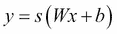
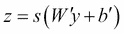
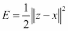

# 第三章。堆叠去噪自动编码器

在本章中，我们将通过应用**堆叠去噪自动编码器** ( **SdA** )来学习高维输入数据的特征表示，从而继续利用深度架构构建我们的技能。

和以前一样，我们将从深入了解支撑自动编码器的理论和概念开始。作为数据科学工具包的一部分，我们将确定相关技术，并指出自动编码器的优势。我们将讨论 **去噪自动编码器** ( **dA** )的使用，这是一种算法的变体，它将随机损坏引入到输入数据中，迫使自动编码器去干扰输入，从而构建更有效的特征表示。

像以前一样，我们将通过遍历阿达类的代码来跟进理论，将理论和实现细节联系起来，以建立对该技术的深刻理解。

在这一点上，我们将进行一次与前一章非常相似的旅程——通过堆叠 dA，我们将创建一个可用于预处理 MLP 网络的深度架构，该架构在包括语音数据处理在内的一系列无监督学习应用中提供了显著的性能提升。

# 自动编码器

自动编码器(也称为 **空竹网络**)是深度架构的另一个关键组件。自动编码器与 RBM 有关，自动编码器训练类似于 RBM 训练；然而，自动编码器可能比具有对比差异的径向基函数更容易训练，因此在径向基函数训练效率较低的情况下更受欢迎。

## 介绍自动编码器

自动编码器是一个简单的三层神经网络，其输出单元直接连接回输入单元。自动编码器的目的是在输出层重构(解码)输入之前，将 **i 维**输入编码为 **h 维**表示，其中 *h < i* 。训练过程包括在这个过程中迭代，直到重建误差最小化——此时应该已经达到输入数据的最有效表示(应该，排除了达到局部最小值的可能性！).

在前一章中，我们讨论了主成分分析作为一种强大的降维技术。这种将自动编码器描述为寻找输入数据的最有效的降维表示无疑是熟悉的，你可能会问为什么我们要探索另一种技术来完成同样的任务。

简单的答案是，像自组织映射一样，自动编码器可以提供非线性约简，这使它们能够比主成分分析更有效地处理高维输入数据。这又恢复了我们之前问题的一种形式——如果自动编码器实现了 SOM 的功能，却没有提供有启发性的视觉呈现，为什么还要讨论自动编码器呢？

简单地说，自动编码器是一套更发达、更复杂的技术；与我们在[第 1 章](01.html "Chapter 1. Unsupervised Machine Learning")、*无监督机器学习*中讨论的技术相比，去噪和叠加技术的使用能够相对容易地将高维多模态数据减少到更高的精度和更大的规模。

在高层次讨论了自动编码器的功能后，让我们深入了解一下自动编码器的拓扑结构以及它们的培训内容。

### 拓扑

如本章前面所述，自动编码器具有相对简单的结构。它是一个三层神经网络，**输入**、**隐藏**、**输出**层。与大多数神经网络架构一样，**输入**前馈到**隐藏的**层，然后是**输出**层。一个值得一提的拓扑特征是**隐藏的**层通常比**输入**或**输出**层节点少。(然而，如前所述，所需的**隐藏**节点的数量实际上是**输入**数据的复杂度的函数；**隐藏的**层的目标是限制来自**输入**的信息内容，并迫使网络识别捕获底层统计属性的表示。准确表示非常复杂的输入可能需要大量的隐藏节点。)

自动编码器的主要特点是**输出**通常设置为**输入**；自动编码器的性能度量是其在隐藏的**层内编码后重构**输入**的精度。自动编码器拓扑往往采用以下形式:**


出现在**输入**和**隐藏**层之间的编码功能是输入( *x* )到新形式( *y* 的映射。一个简单的示例映射函数可能是输入的非线性(在本例中为 sigmoid， *s* )函数，如下所示:



然而，可能存在或开发更复杂的编码来适应特定的主题领域。当然，在这种情况下， *W* 代表分配给 *x* 和 *b* 的权重值，是一个可调变量，可以对其进行调整以使重建误差最小化。

然后，自动编码器解码以传送其输出。该重建旨在采用与 *x* 相同的形状，并将通过类似的变换进行，如下所示:



这里，*b’*和*W’*通常也是可配置的，以允许网络优化。

### 训练

如上所述，网络通过最小化重构误差来训练。测量该误差的一种流行方法是简单的平方误差测量，如下式所示:



但是，对于输入格式不太通用的情况(如一组位概率)，存在不同的更合适的错误度量。

虽然目的是自动编码器捕捉输入数据集中变化的主轴，但是自动编码器有可能学习到远没有那么有用的东西——输入的身份函数。

## 去噪自动编码器

虽然自动编码器在某些应用中可以很好地工作，但它们在应用于输入数据包含必须在高维度中建模的复杂分布的问题时可能具有挑战性。主要的挑战是，对于具有**n 维输入和至少 *n* 编码的自动编码器，自动编码器很有可能只是学习输入的身份函数。在这种情况下，编码是输入的文字副本。这种自动编码器称为 **过完备**。**

 **### 注

当训练机器学习技术时，最重要的属性之一是理解隐藏层的维度如何影响结果模型的质量。如果输入数据很复杂，而隐藏层的节点太少，无法有效地捕捉到这种复杂性，那么结果是显而易见的——网络无法像有更多节点时那样进行训练。

为了捕捉输入数据中的复杂分布，您可能希望使用大量隐藏节点。在隐藏层具有至少与输入一样多的节点的情况下，网络很有可能会获知输入的身份；在这种情况下，输入的每个元素都是作为一个特定的唯一案例来学习的。自然，一个已经被训练这样做的模型将在训练数据上工作得非常好，但是由于它已经学会了一个不能推广到不熟悉的数据的琐碎模式，当被验证时，它很可能会灾难性地失败。

这在对复杂数据(如语音数据)建模时尤其相关。这种数据通常分布复杂，因此语音信号的分类需要多模态编码和高维隐藏层。当然，这增加了自动编码器(或大量模型中的任何一个，因为这不是自动编码器特有的问题)学习身份函数的风险。

虽然(相当令人惊讶的)过完全自动编码器可以并且确实在某些配置下学习误差最小化表示(即，其中第一隐藏层需要非常小的权重以迫使隐藏单元进入线性方向，并且后续权重具有大的值)，但是这种配置难以优化，并且希望找到另一种方法来防止过完全自动编码器学习恒等式函数。

有几种不同的方法可以防止过完备的自动编码器在学习身份函数的同时仍然捕获其表示中有用的东西。到目前为止，最流行的方法是将噪声引入到输入数据中，并通过学习分布和统计规律而不是同一性，迫使自动编码器在噪声数据上进行训练。这可以通过多种方法有效地实现，包括使用稀疏约束或缺失技术(其中输入值被随机设置为零)。

在本章中，我们将使用向输入端引入噪声的过程是压差。通过这种方法，多达一半的输入被随机设置为零。为了实现这一点，我们创建了一个对输入数据进行操作的随机损坏过程:

```py
def get_corrupted_input(self, input, corruption_level):

   return self.theano_rng.binomial(size=input.shape, n=1, p=1 -   
   corruption_level, dtype=theano.config.floatX) * input
```

为了对输入数据进行精确建模，自动编码器必须从未损坏的值中预测损坏的值，从而学习有意义的统计特性(即分布)。

除了防止自动编码器学习数据的身份值之外，添加去噪过程还倾向于产生对输入变化或失真更加鲁棒的模型。这被证明对于本来就有噪声的输入数据特别有用，例如语音或图像数据。本书前言中提到的深度学习技术的一个公认优势是，深度学习算法最大限度地减少了对特征工程的需求。许多学习算法需要对输入数据进行冗长而复杂的预处理(对图像进行滤波或对音频信号进行处理)来重建去噪后的输入，并使模型能够进行训练，而阿达可以用最少的预处理有效地工作。这可以大大减少在输入数据上训练模型达到实际精确度所需的时间。

最后，值得注意的是，学习输入数据集标识函数的自动编码器可能在根本上配置错误。由于自动编码器的主要附加价值是找到特征集的低维表示，所以已经学习了输入数据的标识函数的自动编码器可能只是有太多的节点。如果有疑问，可以考虑减少隐藏层中的节点数量。

既然我们已经讨论了自动编码器的拓扑结构——有效训练自动编码器的方法以及去噪在提高自动编码器性能中的作用——让我们回顾一下阿达的**和**代码，以便将前面的理论付诸实践。

## 应用阿达

在这一点上，我们准备逐步实施阿达。我们再次利用安诺库来申请一个`dA`类。

与我们在上一章中探讨的`RBM`类不同，DenoisingAutoencoder 相对简单，将 dA 的功能与我们在本章前面研究的理论和数学联系起来相对简单。

在[第 2 章](02.html "Chapter 2. Deep Belief Networks")、*深度信念网络*中，我们应用了一个`RBM`类，该类有许多元素，虽然对于 RBM 本身的正确运行不是必需的，但是支持多层、深度架构中的共享参数。我们将使用的`dA`类拥有类似的共享元素，这些元素将在本章后面为我们提供构建多层自动编码器架构的方法。

我们从初始化一个`dA`类开始。我们指定可见单位的数量，`n_visible`，以及隐藏单位的数量，`n_hidden`。此外，我们还指定了输入配置的变量(`input`)以及权重(`W`)和隐藏及可见偏差值(`bhid`和`bvis`)。这四个附加变量使自动编码器能够从深度架构的其他元素接收配置参数:

```py
class dA(object):

    def __init__(
        self,
        numpy_rng,
        theano_rng=None,
        input=None,
        n_visible=784,
        n_hidden=500,
        W=None,
        bhid=None,
        bvis=None
):

        self.n_visible = n_visible
        self.n_hidden = n_hidden
```

我们通过初始化权重和偏差变量来跟进。我们将权重向量`W`设置为初始值`initial_W`，该值是通过从以下范围随机均匀采样获得的:


然后，我们使用`numpy.zeros`将可见和隐藏的偏置变量设置为零数组:

```py
   if not theano_rng:
      theano_rng = RandomStreams(numpy_rng.randint(2 ** 30))

   if not W:
      initial_W = numpy.asarray(
         numpy_rng.uniform(
            low=-4 * numpy.sqrt(6\. / (n_hidden + n_visible)),
            high=4 * numpy.sqrt(6\. / (n_hidden + n_visible)),
            size=(n_visible, n_hidden)
         ),
         dtype=theano.config.floatX
      )
      W = theano.shared(value=initial_W, name='W', borrow=True)

   if not bvis:
      bvis = theano.shared(
         value=numpy.zeros(
            n_visible,
            dtype=theano.config.floatX
         ),
         borrow=True
      )

   if not bhid:
      bhid = theano.shared(
         value=numpy.zeros(
            n_hidden,
            dtype=theano.config.floatX
         ),
         name='b',
         borrow=True
      )
```

在本章前面，我们描述了自动编码器如何通过映射(如)在可见层和隐藏层之间转换。为了实现这种转换，需要定义`W`、`b`、`W'`和`b'`与前面描述的自动编码器参数、`bhid`、`bvis`和`W`相关。`W'`和`b'`在以下代码中称为`W_prime`和`b_prime`:

```py
self.W = W
self.b = bhid
self.b_prime = bvis
self.W_prime = self.W.T
self.theano_rng = theano_rng
if input is None:
   self.x = T.dmatrix(name='input')
else:
   self.x = input

self.params = [self.W, self.b, self.b_prime]
```

前面的代码分别将`b`和`b_prime`设置为`bhid`和`bvis`，而`W_prime`设置为`W`的转置；换句话说，重量是并列的。由于以下几个原因，自动编码器中有时会使用捆绑重量，但并不总是这样:

*   捆绑权重提高了几种情况下的结果质量(尽管通常在最优解是 PCA 的情况下，PCA 是具有捆绑权重的自动编码器倾向于达到的解决方案)
*   通过减少需要存储的参数数量，捆绑权重提高了自动编码器的内存消耗
*   最重要的是，捆绑权重提供了正则化效果；他们需要少一个参数进行优化(因此少一件可能出错的事情！)

然而，在其他情况下，使用无附加条件的砝码既常见又合适。例如，在输入数据是多模态的并且最优解码器对一组非线性统计规律建模的情况下，这是正确的。在这种情况下，线性模型，如主成分分析，将无法有效地模拟非线性趋势，您将倾向于使用无约束权重获得更好的结果。

为我们的自动编码器配置好参数后，下一步是定义使其能够学习的功能。在本章的前面，我们确定自动编码器通过向输入数据添加噪声来有效学习，然后尝试学习该输入的编码表示，该编码表示又可以重构到输入中。那么，我们接下来需要的是提供这种功能的函数。我们从破坏输入数据开始:

```py
def get_corrupted_input(self, input, corruption_level):

   return self.theano_rng.binomial(size=input.shape, n=1, p=1 – 
   corruption_level, dtype=theano.config.floatX) * input
```

损坏程度可使用`corruption_level`参数配置；正如我们之前所认识到的，通过压差导致的输入损坏通常不超过 50%,即 0.5。该函数随机取一组病例，其中病例数为`size`等于`corruption_level`的`input`的比例。该函数产生长度等于输入的*0*和*1*的损坏向量，其中向量的`corruption_level`大小比例为 *0* 。损坏的输入向量只是自动编码器输入向量和损坏向量的倍数:

```py
def get_hidden_values(self, input):
   return T.nnet.sigmoid(T.dot(input, self.W) + self.b)
```

接下来，我们获得隐藏值。这是通过执行等式以获得 *y* (隐藏值)的代码来完成的。为了获得自动编码器的输出( *z* )，我们通过使用先前定义的`b_prime`和`W_prime`执行的代码重建隐藏层:

```py
defget_reconstructed_input(self, hidden):
   returnT.nnet.sigmoid(T.dot(hidden, self.W_prime) +   
   self.b_prime)
```

最后缺少的部分是成本更新的计算。我们之前回顾了一个成本函数，一个简单的平方误差度量:。让我们使用这个成本函数来计算我们的成本更新，基于输入(`x`)和重构(`z`):

```py
def get_cost_updates(self, corruption_level, learning_rate):

   tilde_x = self.get_corrupted_input(self.x, corruption_level)
   y = self.get_hidden_values(tilde_x)
   z = self.get_reconstructed_input(y)
   E = (0.5 * (T.z – T.self.x)) ^ 2
   cost = T.mean(E)

   gparams = T.grad(cost, self.params)
   updates = [
      (param, param - learning_rate * gparam)
      for param, gparam in zip(self.params, gparams)
   ]

return (cost, updates)
```

至此，我们有了一个功能性的 dA！它可以用于建模输入数据的非线性属性，并且可以作为学习输入数据的有效和低维表示的有效工具。然而，自动编码器的真正威力来自于它们堆叠在一起时显示的属性，这些属性是深层架构的构建块。

# 堆叠去噪自动编码器

虽然自动编码器本身是有价值的工具，但是通过堆叠自动编码器以形成深度网络，可以获得显著的精度。这是通过将编码器在一层上创建的表示作为该层的输入馈送到下一层的编码器中来实现的。

**堆叠去噪自动编码器** ( **SdAs** )目前在许多领先的数据科学团队中用于复杂的自然语言分析以及大量的信号、图像和文本分析。

在上一章讨论了深度信念网络之后，SdA 的实现将会非常熟悉。SdA 的使用方式与我们深度信念网络中的 RBM 的使用方式非常相似。深层架构的每一层都有阿达和 sigmoid 组件，自动编码器组件用于对 sigmoid 网络进行预处理。堆叠式去噪自动编码器使用的性能度量是训练集误差，在最后一段微调时间之前，使用密集的逐层(逐层)预处理来逐步调整网络参数。在微调期间，使用验证和测试数据对网络进行训练，训练时间较短，但更新步骤较多。目标是让网络在微调结束时收敛，以便提供准确的结果。

除了提供深度网络的典型优势(学习复杂或高维数据集的特征表示的能力，以及在没有大量特征工程的情况下训练模型的能力)之外，堆叠自动编码器还有一个额外的有趣特性。

正确配置的堆叠式自动编码器可以捕获其输入数据的**分层分组**。堆叠去噪自动编码器的连续层可以学习越来越高级的特征。在第一层可以从输入数据中学习一些一阶特征(例如学习照片图像中的边缘)的情况下，第二层可以学习一些一阶特征的分组(例如，通过学习对应于输入图像中的轮廓或结构元素的给定的边缘配置)。

对于给定的问题，没有黄金法则来确定应该有多少层或多大层。最佳解决方案通常是试验这些模型参数，直到找到最佳点。这个实验最好用超参数优化技术或遗传算法来完成(我们将在本书后面的章节中讨论这些主题)。

更高层可以学习越来越高阶的配置，使得堆叠去噪自动编码器能够学习识别面部特征、字母数字字符或物体的广义形式(例如鸟)。这是 sda 学习输入数据的非常复杂的高级抽象的独特能力。

自动编码器可以无限期堆叠，并且已经证明继续堆叠自动编码器可以提高深度架构的有效性(主要限制因素是计算时间成本)。在本章中，我们将研究堆叠三个自动编码器来解决自然语言处理的挑战。

## 应用 SdA

既然我们有机会了解 SdA 作为深度学习架构的优势和力量，让我们在真实数据集上测试我们的技能。

在这一章中，让我们远离图像数据集，使用**opinirank Review**数据集，这是一个包含来自猫途鹰的大约 259，000 篇酒店评论的文本数据集，可通过 UCI 机器学习数据集存储库访问。这个免费提供的数据集提供了各种酒店的评论分数(从 1 到 5 的浮点数)和评论文本；我们将应用我们的堆叠 dA 来尝试从每个酒店的评论文本中识别其评分。

### 注

我们将应用我们的自动编码器来分析这个数据的预处理版本，它可以从本章附带的 GitHub 共享中访问。我们将在下一章讨论准备文本数据的技巧。感兴趣的读者可以在[https://archive . ics . UCI . edu/ml/datasets/opincrank+Review+Dataset](https://archive.ics.uci.edu/ml/datasets/OpinRank+Review+Dataset)获取源数据。

为了启动，我们需要一个堆叠的去噪自动编码器(以下简称`SdA`)类:

```py
class SdA(object):

    def __init__(
        self,
        numpy_rng,
        theano_rng=None,
        n_ins=280,
        hidden_layers_sizes=[500, 500],
        n_outs=5,
        corruption_levels=[0.1, 0.1]
):
```

如前所述，`SdA`是通过将一层自动编码器的编码作为输入提供给后续层而创建的。这个类支持层计数的配置(反映在`hidden_layers_sizes`和`corruption_levels`向量的长度中，但不是由它们设置的)。它还支持每层的不同层大小(以节点为单位)，可以使用`hidden_layers_sizes`进行设置。正如我们所讨论的，配置自动编码器的连续层的能力对于开发成功的表示是至关重要的。

接下来，我们需要参数来存储`SdA`的 MLP ( `self.sigmoid_layers`)和 dA ( `self.dA_layers`)元素。为了指定我们架构的深度，我们使用`self.n_layers`参数来指定所需的 sigmoid 和 dA 层数:

```py
self.sigmoid_layers = []
self.dA_layers = []
self.params = []
self.n_layers = len(hidden_layers_sizes)

assertself.n_layers> 0
```

接下来，我们需要构建我们的 sigmoid 和 dA 层。我们从设置隐藏层的大小开始，可以从输入向量的大小开始，也可以通过激活前面的层来设置。接下来，创建`sigmoid_layer`和`dA_layer`组件，dA 图层来自我们在本章前面讨论的`dA`类:

```py
for i in xrange(self.n_layers):
   if i == 0:
      input_size = n_ins
   else:
      input_size = hidden_layers_sizes[i - 1]

if i == 0:
   layer_input = self.x
else:
   layer_input = self.sigmoid_layers[-1].output

sigmoid_layer = HiddenLayer(rng=numpy_rng, input=layer_input, n_in=input_size, n_out=hidden_layers_sizes[i], activation=T.nnet.sigmoid)

self.sigmoid_layers.append(sigmoid_layer)
self.params.extend(sigmoid_layer.params)

dA_layer = dA(numpy_rng=numpy_rng, theano_rng=theano_rng, input=layer_input, n_visible=input_size, n_hidden=hidden_layers_sizes[i], W=sigmoid_layer.W, bhid=sigmoid_layer.b)

self.dA_layers.append(dA_layer)
```

实现了堆叠 dA 的各层后，我们需要一个最终的逻辑回归层来完成网络的 MLP 部分:

```py
self.logLayer = LogisticRegression(
   input=self.sigmoid_layers[-1].output,
   n_in=hidden_layers_sizes[-1],
   n_out=n_outs
)

self.params.extend(self.logLayer.params)
self.finetune_cost = self.logLayer.negative_log_likelihood(self.y)
self.errors = self.logLayer.errors(self.y)
```

这就完成了我们 SdA 的架构。接下来，我们需要生成`SdA`类使用的训练函数。每个功能都将迷你批次索引(`index`)作为一个参数，以及其他几个元素——这里启用了`corruption_level`和`learning_rate`，这样我们就可以在训练过程中调整它们(例如，逐渐增加或减少它们)。此外，我们还确定了有助于确定批次开始和结束位置的变量——`batch_begin`和`batch_end`:

### 注

动态调整学习速度的能力特别有帮助，可以通过两种方式之一来应用。一旦一种技术开始收敛到一个合适的解决方案，那么能够降低学习速率是非常有帮助的。如果你不这样做，你就有可能造成一种情况，即网络在位于最佳值附近的值之间振荡，而永远不会达到最佳值。在某些情况下，将学习率与网络的性能指标联系起来可能会有所帮助。如果错误率很高，在错误率开始降低之前进行较大的调整是有意义的！

```py
def pretraining_functions(self, train_set_x, batch_size):
    index = T.lscalar('index')  
    corruption_level = T.scalar('corruption')  
    learning_rate = T.scalar('lr')  
    batch_begin = index * batch_size
    batch_end = batch_begin + batch_size

    pretrain_fns = []
    for dA in self.dA_layers:
        cost, updates = dA.get_cost_updates(corruption_level, learning_rate)
        fn = theano.function(
            inputs=[
                index,
                theano.Param(corruption_level, default=0.2),
                theano.Param(learning_rate, default=0.1)
            ],
            outputs=cost,
            updates=updates,
            givens={
                self.x: train_set_x[batch_begin: batch_end]
            }
         )
         pretrain_fns.append(fn)

    return pretrain_fns
```

我们创建的预处理函数采用迷你批处理`index`，并且可以选择采用损坏级别或学习速率。它执行预处理的一个步骤，并输出成本值和权重更新向量。

除了预处理之外，我们还需要构建函数来支持微调阶段，其中网络在验证和测试数据上迭代运行，以优化网络参数。下面代码中的训练函数(`train_fn`)实现了一步微调。`valid_score`是一个 Python 函数，使用`SdA`对验证数据产生的误差度量来计算验证分数。类似地，`test_score`计算测试数据的误差分数。

为了启动这个过程，我们首先需要建立训练、验证和测试数据集。每个阶段需要两个数据集(集合`x`和集合`y`)，分别包含特征和类标签。确定验证和测试所需的小批次数量，并创建索引来跟踪批次大小(并提供识别批次开始和结束条目的方法)。每个批次都进行培训、验证和测试，之后所有批次都计算`valid_score`和`test_score`:

```py
def build_finetune_functions(self, datasets, batch_size,learning_rate):

   (train_set_x, train_set_y) = datasets[0]
   (valid_set_x, valid_set_y) = datasets[1]
   (test_set_x, test_set_y) = datasets[2]

   n_valid_batches = valid_set_x.get_value(borrow=True).shape[0]
   n_valid_batches /= batch_size
   n_test_batches = test_set_x.get_value(borrow=True).shape[0]
   n_test_batches /= batch_size

   index = T.lscalar('index')  

   gparams = T.grad(self.finetune_cost, self.params)

   updates = [
       (param, param - gparam * learning_rate)
       For param, gparam in zip(self.params, gparams)
]

train_fn = theano.function(
   inputs=[index],
   outputs=self.finetune_cost,
   updates=updates,
   givens={
      self.x: train_set_x[
         index * batch_size: (index + 1) * batch_size
      ],
      self.y: train_set_y[
         index * batch_size: (index + 1) * batch_size
      ]
   },
   name='train'
)

test_score_i = theano.function(
    [index],
   self.errors,
   givens={
      self.x: test_set_x[
      index * batch_size: (index + 1) * batch_size
   ],
      self.y: test_set_y[
      index * batch_size: (index + 1) * batch_size
   ]
},
   name='test'
)

valid_score_i = theano.function(
   [index],
   self.errors,
   givens={
      self.x: valid_set_x[
         index * batch_size: (index + 1) * batch_size
      ],
      self.y: valid_set_y[
         index * batch_size: (index + 1) * batch_size
      ]
   },
   name='valid'
)

def valid_score():
   return [valid_score_i(i) for i inxrange(n_valid_batches)]

def test_score():
   return [test_score_i(i) for i inxrange(n_test_batches)]

return train_fn, valid_score, test_score
```

有了培训功能，下面的代码将启动我们的堆栈式 dA:

```py
numpy_rng = numpy.random.RandomState(89677)
print '... building the model'
   sda = SdA(
      numpy_rng=numpy_rng,
      n_ins=280,
      hidden_layers_sizes=[240, 170, 100],
      n_outs=5
   )
```

应该注意的是在这一点上，我们应该尝试层大小的初始配置，看看我们如何做。在这种情况下，使用的图层大小是一些初始测试的结果。正如我们所讨论的，训练`SdA`分两个阶段进行。第一个是逐层的预处理过程，它在所有`SdA's`层上循环。第二个是对验证和测试数据进行微调的过程。

为了对`SdA`进行预处理，我们提供了训练每一层所需的损坏级别，并使用我们之前定义的`pretraining_fns`对各层进行迭代:

```py
print '... getting the pretraining functions'
pretraining_fns = sda.pretraining_functions(train_set_x=train_set_x,
batch_size=batch_size)

print '... pre-training the model'
start_time = time.clock()
corruption_levels = [.1, .2, .2]
for i in xrange(sda.n_layers):

   for epoch in xrange(pretraining_epochs):
      c = []
      for batch_index in xrange(n_train_batches):
         c.append(pretraining_fns[i](index=batch_index,
         corruption=corruption_levels[i],
         lr=pretrain_lr))
print 'Pre-training layer %i, epoch %d, cost ' % (i, epoch),

print numpy.mean(c)

end_time = time.clock()

print(('The pretraining code for file ' +
os.path.split(__file__)[1] + ' ran for %.2fm' % ((end_time - start_time) / 60.)), file = sys.stderr)
```

在这一点上，我们能够通过调用存储在本书的 GitHub 存储库中的前面的代码来初始化我们的`SdA`类:`MasteringMLWithPython/Chapter3/SdA.py`

## 评估 SdA 性能

SdA 将需要相当长的时间来运行。每层有 15 个时代，每层通常平均需要 11 分钟，网络将在现代桌面系统上运行大约 500 分钟，该系统具有图形处理器加速和单线程 GotoBLAS。

在没有 GPU 加速的系统上，网络将需要更长的时间来训练，建议您使用替代方案，该方案运行在明显更小的输入数据集上:`MasteringMLWithPython/Chapter3/SdA_no_blas.py`

结果质量较高，验证误差分数为 3.22%，测试误差分数为 3.14%。鉴于自然语言处理应用的模糊性和有时具有挑战性，这些结果尤其令人印象深刻。

值得注意的是，该网络对 1 星和 5 星评级案例的分类比中间级别更为正确。这在很大程度上是由于非极化或非情感语言的模糊性。

该输入数据可分类的部分原因是通过重要的特征工程。虽然耗时且有时存在问题，但我们已经看到，良好执行的功能工程与优化模型相结合，可以提供出色的准确性。在[第 6 章](06.html "Chapter 6. Text Feature Engineering")、*文本特征工程*中，我们将应用用于自己准备这个数据集的技术。

# 进一步阅读

谷歌大脑团队的 Quoc V. Le 提供了一个关于自动编码器(以及其他主题)的全面概述。在[https://cs.stanford.edu/~quocle/tutorial2.pdf](https://cs.stanford.edu/~quocle/tutorial2.pdf)阅读。

本章使用了在 http://deeplearning.net/tutorial/contents.html可获得的音频文档作为讨论的基础，因为音频是本章中使用的主要库。

# 总结

在本章中，我们介绍了自动编码器，这是一种有效的降维技术，具有一些独特的应用。我们关注的是堆叠去噪自动编码器背后的理论，它是自动编码器的扩展，任何数量的自动编码器都堆叠在一个深度架构中。我们能够将堆叠去噪自动编码器应用于一个具有挑战性的自然语言处理问题，并取得了巨大的成功，为酒店评论提供了高度准确的情感分析。

在下一章中，我们将讨论有监督的深度学习方法，包括**卷积神经网络** ( **CNN** )。**