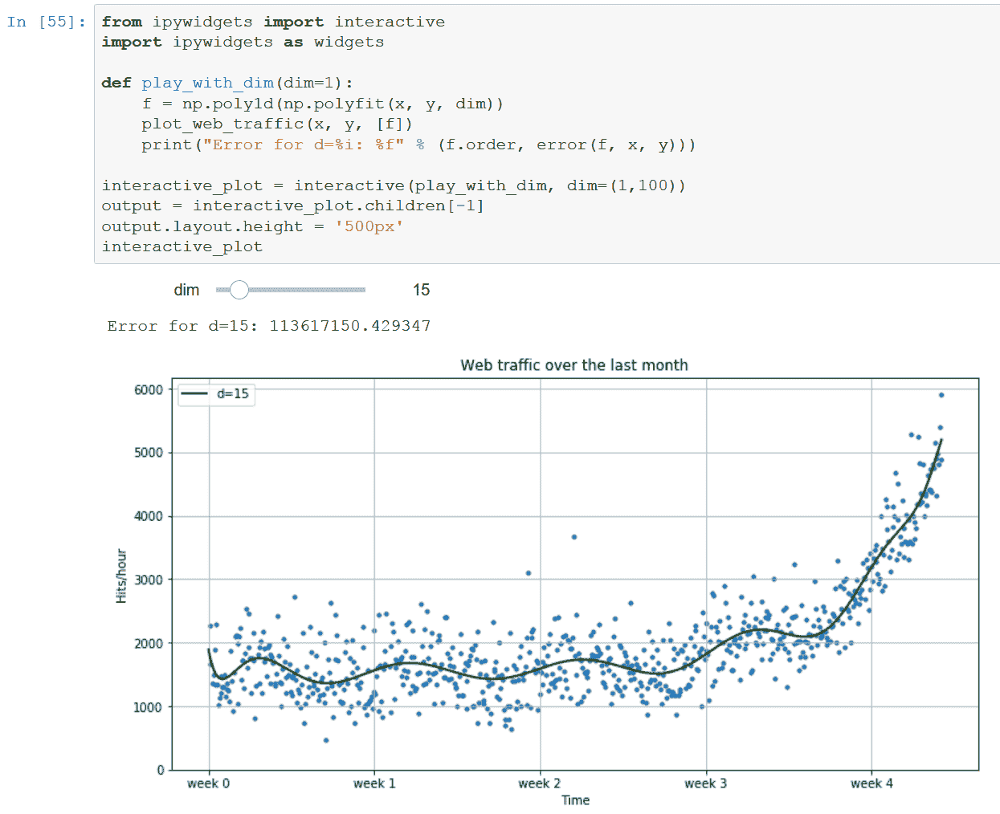
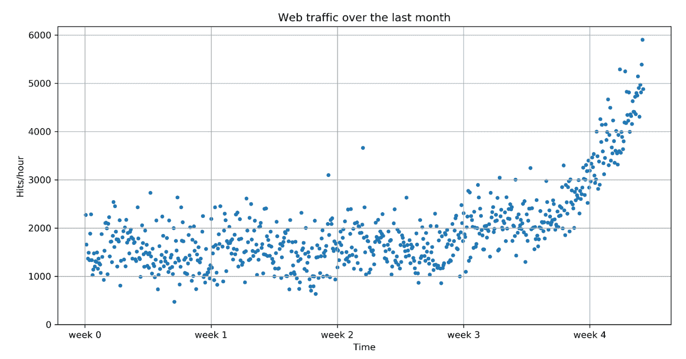
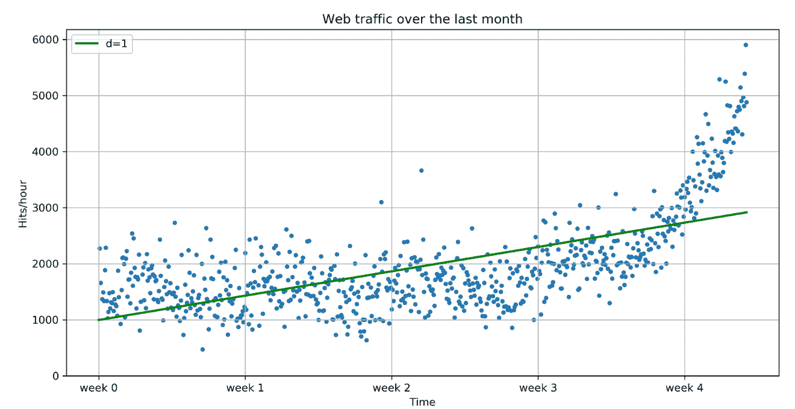
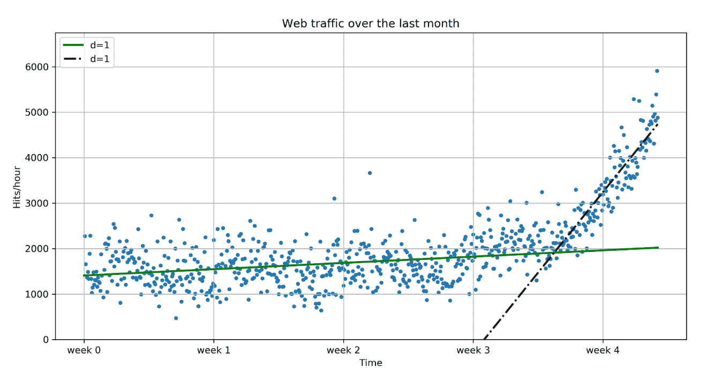
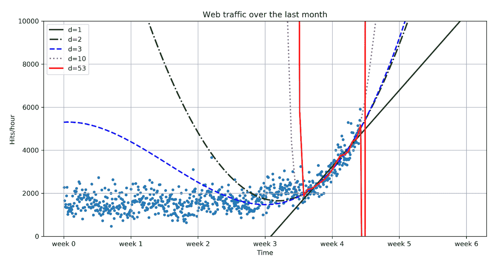
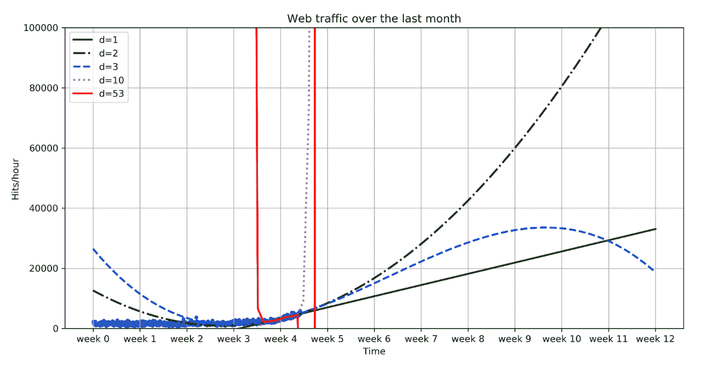

# 一、Python 机器学习入门

机器学习教机器学会自己执行任务。就这么简单。细节带来了复杂性，这很可能是你阅读这本书的原因。

也许你数据太多，见识太少。也许你希望，通过使用机器学习算法，你可以解决这个挑战，所以你开始挖掘算法。但也许过了一段时间，你会感到困惑:到底应该选择无数种算法中的哪一种？

或者，也许你只是对机器学习更感兴趣，并且你已经阅读关于它的博客和文章有一段时间了。一切似乎都很神奇和酷，所以你开始了你的探索，并把一些数据输入决策树或支持向量机。然而，在你成功地将这些应用于其他数据之后，也许你会想:整个设置是正确的吗？你得到最佳结果了吗？你怎么知道没有更好的算法？或者你的数据是否正确？

欢迎加入俱乐部！我们所有的作者都曾处于这样的阶段，寻找讲述机器学习理论教科书背后故事的信息。事实证明，这些信息大多是黑色艺术，通常不会在标准教科书中教授。所以，从某种意义上说，我们写这本书是为了年轻的自己。这本书不仅快速介绍了机器学习，还教授了我们在该领域职业生涯中学到的经验。我们希望它也能让你更顺利地进入计算机科学中最令人兴奋的领域之一。

# 机器学习和 Python——梦之队

机器学习的目标是通过给机器(软件)提供几个例子(即如何做或不做任务的例子)来教会它们执行任务。让我们假设每天早上当你打开你的电脑时，你执行相同的任务移动电子邮件，这样只有属于相同主题的电子邮件才会出现在同一个文件夹中。过一段时间后，你可能会觉得无聊，并考虑自动化这项工作。一种方法是开始分析你的大脑，写下你在整理邮件时大脑处理的所有规则和决定。然而，这将是相当麻烦的，并且总是不完美的。虽然你会错过一些规则，但你会超越其他规则。一种更好、更经得起未来考验的方法是，通过选择一组电子邮件元信息和正文/文件夹名称对，并让算法得出最佳规则集，来自动化这一过程。这些配对将是你的训练数据，结果规则集(也称为模型)可以应用到你还没有看到的未来电子邮件中。这是最简单形式的机器学习。

当然，机器学习本身并不是一个全新的领域。恰恰相反:它近年来的成功可以归因于它使用坚如磐石的技术和来自其他成功领域(如统计学)的见解的务实方式。在这些领域，目的是让我们人类深入了解数据——例如，通过更多地了解数据中潜在的模式和关系。随着你越来越多地阅读机器学习的成功应用(你已经查看了[www.kaggle.com](http://www.kaggle.com)，是吗？)，你会看到应用统计学是机器学习专家中的一个常见领域。

正如您将在后面看到的，想出一个像样的机器学习方法的过程从来都不容易。相反，你会发现自己在分析中来来回回，在不同的机器学习算法集上尝试不同版本的输入数据。正是这种探索性让 Python 非常适合自己。作为一种解释的高级编程语言，Python 似乎就是为尝试不同事物的过程而设计的。更重要的是，它甚至做得这么快。当然，它比 C 或许多其他本地编译的编程语言慢。尽管如此，有了无数用 C 语言编写的易于使用的库，你不必为了敏捷而牺牲速度。

# 这本书会教你什么，它不会教你什么

这本书将给你一个广泛的概述，什么类型的学习算法目前最常用于机器学习的不同领域，以及在应用它们时要注意什么。然而，从我们自己的经验来看，我们知道做酷的事情——也就是说，使用和调整机器学习算法，比如支持向量机、最近邻搜索或它们的集成——只会消耗一个好的机器学习专家做同样事情的总时间的一小部分。查看下面的典型工作流程，我们可以看到大部分时间将花在相当平凡的任务上:

*   读取数据并进行清理
*   探索和理解输入数据
*   分析如何最好地将数据呈现给学习算法
*   选择正确的模型和学习算法
*   正确测量性能

当谈到探索和理解输入数据时，我们需要使用一些统计学和基础数学。然而，当你这样做的时候，你会发现那些在你的数学课上看起来很枯燥的话题，当你用它们来看有趣的数据时，实际上是非常令人兴奋的。

当你读入数据时，旅程就开始了。当您必须回答诸如“我如何处理无效或缺失的值？”，您将会看到，与其说这是一门精确的科学，不如说这是一门艺术，是一门非常有益的艺术，因为正确地完成这一部分将使您的数据对更多的机器学习算法开放，从而增加成功的可能性。

当数据准备好并在程序的数据结构中等待时，你会想要对你正在工作的动物有一个真实的感觉。你有足够的数据来回答你的问题吗？如果没有，你可能需要考虑其他方法来获得更多。也许你甚至有太多的数据。在这种情况下，您可能需要考虑如何最好地提取样本。

通常，您不会将数据直接输入到机器学习算法中。相反，你会发现你可以在训练前提炼部分数据。通常，机器学习算法会提高你的性能。你甚至会发现，一个有精确数据的简单算法通常比一个有原始数据的非常复杂的算法要好。机器学习工作流程的这一部分被称为**特征工程**，大多数情况下，这是一个非常令人兴奋和有益的挑战。你会立即看到你之前创造性和智慧努力的结果。

因此，选择正确的学习算法并不仅仅是对你工具箱中的三四个进行射击(还会有更多；你会看到的)。它更像是一个权衡不同性能和功能需求的深思熟虑的过程。你需要快速的结果并且愿意牺牲质量吗？还是你更愿意花更多的时间去获得最好的结果？你对未来的数据有明确的想法吗，还是应该在这方面保守一点？

最后，对于有抱负的机器学习者来说，测量性能是这个过程中最有潜在陷阱的部分。有一些容易避免的错误，比如用你训练过的相同数据测试你的方法。但是也有更困难的方法，比如使用不平衡的训练数据。同样，数据是决定你的事业是失败还是成功的部分。

我们看到，只有第四点涉及花哨的算法。尽管如此，我们希望这本书能让你相信，其他四项任务并不只是简单的家务活，而是同样令人兴奋。我们希望，到本书结束时，你将真正爱上数据，而不是学习算法。

为此，我们不会用各种机器学习算法的理论方面来压倒你，因为在这方面已经有了优秀的书籍(你会在附录中找到指针)。相反，我们将尝试在各个章节中为您提供对基本方法的理解，这足以让您有一个想法并能够迈出第一步。因此，这本书绝不是机器学习的权威指南——它更像是一个入门工具包。我们希望它能点燃你的好奇心，让你渴望更多地了解这个有趣的领域。

在本章的剩余部分，我们将设置并了解 NumPy 和 SciPy 的基本 Python 库，然后使用 scikit-learn 训练我们的第一个机器学习算法。在此期间，我们将介绍将在整本书中使用的基本机器学习概念。接下来的章节将更详细地介绍前面描述的五个步骤，重点介绍使用不同应用场景的 Python 机器学习的不同方面。

# 如何最好地阅读这本书

虽然我们已经尝试提供传达本书思想所需的所有代码，但我们不想用重复的代码片段让您厌烦。相反，我们创建了独立的 Jupyter 笔记本([http:/](http://jupyter.org/)[/](http://jupyter.org/)[Jupyter。](http://jupyter.org/) [org](http://jupyter.org/) )可以通过 Git 从[https://github . com/PacktPublishing/Building-Machine-Learning-Systems-with-Python-第三版](https://github.com/PacktPublishing/Building-Machine-Learning-Systems-with-Python-Third-edition) [找到。](https://github.com/PacktPublishing/Building-Machine-Learning-Systems-with-Python-Third-edition)

如果还没有 Jupyter，只需用`pip install jupyter`安装，然后用`jupyter notebook`运行即可。它提供了更丰富的体验；例如，它直接将图表集成到其中。一旦你克隆了这本书代码的 Git 库，你可以简单地点击*移动* + *进入*。另外，您会发现它有交互式小部件，可以让您玩代码:



# 卡住了怎么办

我们试图传达每一个必要的想法，以复制本书的步骤。尽管如此，还是会有你被卡住的情况。原因可能从简单的错别字到包装版本的奇怪组合，再到理解上的问题。

有许多不同的方法获得帮助。很可能，您的问题已经在以下优秀的问答网站中提出并得到解决:

*   [http://stats.stackexchange.com](http://stats.stackexchange.com/):这个 Q &一个网站被命名为 Cross Validated，类似于 MetaOptimize，但是更专注于统计问题。
*   [http://stackoverflow.com](http://stackoverflow.com/):这个 Q & A 站点和上一个很像，但是更广泛的关注一般的编程主题。例如，它包含关于我们将在本书中使用的一些包的更多问题，例如 SciPy 或 Matplotlib。
*   [https://freenode.net/](https://freenode.net/):这是专注于机器学习话题的 IRC 频道。这是一个小型但非常活跃和有用的机器学习专家社区。

如开头所述，这本书旨在帮助您快速开始机器学习之旅。因此，我们强烈建议您建立自己的机器学习相关博客列表，并定期查看。这是了解什么有效，什么无效的最好方法。

我们唯一想在这里强调的博客(尽管附录中还有更多)是[http://blog.kaggle.com](http://blog.kaggle.com/)，该公司的博客，Kaggle，主办机器学习比赛。通常，他们鼓励竞赛的获胜者写下他们是如何接近竞赛的，哪些策略不起作用，以及他们是如何达成获胜策略的。即使你不读别的东西，这也是必须的。

# 入门指南

假设你已经安装了 Python(至少最近的 3 个应该没问题)，我们需要安装 NumPy 和 SciPy 进行数值运算，以及 Matplotlib 进行可视化。

# NumPy、SciPy、Matplotlib 和 TensorFlow 简介

在我们讨论具体的机器学习算法之前，我们必须先讨论如何最好地存储我们将要咀嚼的数据。这一点很重要，因为如果最先进的学习算法永远无法完成，它也不会对我们有任何帮助。这可能仅仅是因为访问数据的过程太慢，或者它的表示迫使操作系统整天交换数据。此外，与 C 或 Fortran 相比，Python 是一种解释语言(尽管是一种高度优化的语言)，对于许多数值较大的算法来说速度较慢。所以我们可能会问，为什么地球上有这么多科学家和公司把他们的财富押在 Python 上，即使是在高度计算密集型的领域。

答案是，在 Python 中，以 C 或 Fortran 扩展的形式将数字处理任务卸载到底层是非常容易的，这正是 NumPy 和 SciPy 所做的(参见[https://scipy.org](https://scipy.org/))。NumPy 提供了高度优化的多维数组的支持，多维数组是大多数最先进算法的基本数据结构。SciPy 使用这些数组来提供一组快速的数字配方。matplotlib([http://matplotlib.org](http://matplotlib.org/))可能是使用 Python 绘制高质量图形最方便、功能最丰富的库。最后，TensorFlow 是 Python 的主要神经网络包之一(我们将在后续章节中解释这个包是关于什么的)。

# 安装 Python

幸运的是，对于所有主要的操作系统——也就是 Windows、Mac 和 Linux——都有针对 NumPy、SciPy、Matplotlib 和 TensorFlow 的目标安装程序。如果您不确定安装过程，您可能需要安装 Anaconda Python 发行版(您可以通过 [https:/](https://www.anaconda.com/download/) [/](https://www.anaconda.com/download/) [www 访问该发行版)。](https://www.anaconda.com/download/) [蟒蛇。](https://www.anaconda.com/download/) [com/](https://www.anaconda.com/download/) [下载](https://www.anaconda.com/download/)，由 SciPy 创始投稿人 Travis Oliphant 维护开发。幸运的是，Anaconda 已经完全兼容 Python 3——我们将在本书中使用的 Python 版本。

The main Anaconda channel comes with three flavors of TensorFlow (use the Intel channel at your own risk, that is an older version of TensorFlow). The main flavor, `tensorflow`, is compiled for all platforms and runs on the CPU. If you have a Haswell CPU or a more recent Intel one, you can use the `tensorflow-mkl` package. Finally, if you have an Nvidia GPU with a compute capability of 3.0 or higher, you can use `tensorflow-gpu`.

# 使用 NumPy 高效地咀嚼数据，使用 SciPy 智能地咀嚼数据

让我们快速浏览一些基本的 NumPy 示例，然后看看 SciPy 在其基础上提供了什么。在路上，我们会用神奇的`matplotlib`包进行绘图。

要获得深入的解释，您可能想看一下 NumPy 在 https://docs.scipy.org/doc/numpy/user/quickstart.html 提供的一些更有趣的例子。

你也会发现帕克特出版社的伊万·伊德里斯的 *NumPy 初学者指南-第二版*非常有价值。其他教程风格指南可在 [http:/](http://www.scipy-lectures.org/) [/](http://www.scipy-lectures.org/) [www 上找到。](http://www.scipy-lectures.org/) [scipy-](http://www.scipy-lectures.org/) [讲座。](http://www.scipy-lectures.org/) [org](http://www.scipy-lectures.org/) ，官方 SciPy 教程可以在[http://docs.scipy.org/doc/scipy/reference/tutorial](http://docs.scipy.org/doc/scipy/reference/tutorial)找到。

In this book, we will use NumPy in version 1.13.3 and SciPy in version 1.0.0.

# 学习 NumPy

所以，让我们导入 NumPy 并玩一会儿。为此，我们需要启动 Python 交互式外壳:

```py
>>> import numpy >>> numpy.version.full_version 
1.13.3
```

由于我们不想污染我们的名称空间，我们当然不应该使用下面的代码:

```py
>>> from numpy import *
```

如果我们这样做，那么，例如，`numpy.array`将潜在地遮蔽包含在标准 Python 中的数组包。相反，我们将使用以下方便的快捷方式:

```py
>>> import numpy as np >>> a = np.array([0,1,2,3,4,5]) >>> a array([0, 1, 2, 3, 4, 5]) >>> a.ndim 
1 >>> a.shape 
(6,)
```

在前面的代码片段中，我们创建了一个数组，就像在 Python 中创建列表一样。但是，NumPy 数组有关于形状的附加信息。在这种情况下，它是由六个元素组成的一维数组。到目前为止，这并不奇怪。

我们现在可以将这个数组转换成二维矩阵:

```py
>>> b = a.reshape((3,2)) >>> b array([[0, 1],
 [2, 3], [4, 5]]) >>> b.ndim 
2 >>> b.shape (3, 2)
```

重要的是要意识到 NumPy 包优化了多少。例如，尽可能避免复制以下内容:

```py
>>> b[1][0] = 77 >>> b array([[ 0, 1],
 [77, 3], [ 4, 5]]) >>> a array([ 0, 1, 77, 3, 4, 5])
```

在这种情况下，我们已经在`b`中将值`2`修改为`77`，并且我们立即看到同样的变化也反映在`a`中。请记住，无论何时您需要真正的副本，您都可以执行以下操作:

```py
>>> c = a.reshape((3,2)).copy()
>>> c
array([[ 0, 1],
 [77, 3],
 [ 4, 5]])
>>> c[0][0] = -99
>>> a
array([ 0, 1, 77, 3, 4, 5])
>>> c
array([[-99, 1],
 [ 77, 3],
 [ 4, 5]])
```

注意，这里`c`和`a`是完全独立的副本。

NumPy 数组的另一个很大的优点是操作被传播到各个元素。例如，乘法一个 NumPy 数组将导致一个相同大小的数组(包括它的所有元素)被乘法:

```py
>>> d = np.array([1,2,3,4,5]) >>> d*2 array([ 2, 4, 6, 8, 10])
```

其他操作也是如此:

```py
>>> d**2 array([ 1, 4, 9, 16, 25])
```

与普通 Python 列表相比:

```py
>>> [1,2,3,4,5]*2
[1, 2, 3, 4, 5, 1, 2, 3, 4, 5]
>>> [1,2,3,4,5]**2
Traceback (most recent call last): 
  File "<stdin>", line 1, in <module>
TypeError: unsupported operand type(s) for ** or pow(): 'list' and 'int'

```

当然，通过使用 NumPy 数组，我们牺牲了 Python 列表提供的敏捷性。简单的操作，如添加或删除元素，对于 NumPy 数组来说有点复杂。幸运的是，我们手中都有，我们将使用正确的一个来完成手头的任务。

# 索引

NumPy 的部分能力来自其阵列的多种访问方式。

除了正常的列表索引，它还允许您通过执行以下操作将数组本身用作索引:

```py
>>> a[np.array([2,3,4])] 
array([77, 3, 4])
```

再加上条件也会传播到单个元素，我们获得了一种非常方便的方法来访问我们的数据，使用如下:

```py
>>> a>4 array([False, False, True, False, False, True], dtype=bool) >>> a[a>4] array([77, 5])
```

通过执行以下命令，我们可以剔除异常值:

```py
>>> a[a>4] = 4
>>> a
array([0, 1, 4, 3, 4, 4])
```

由于这是一个常见的用例，因此有一个特殊的`clip`函数，通过一个函数调用来裁剪一个区间两端的值:

```py
>>> a.clip(0,4)
array([0, 1, 4, 3, 4, 4])
```

# 处理不存在的值

当预处理我们刚刚从文本文件中读入的数据时，NumPy 的索引功能就派上了用场。很可能，这将包含无效值，我们将使用`numpy.NAN`标记为非实数，如以下代码所示:

```py
>>> # let's pretend we have read this from a text file:
>>> c = np.array([1, 2, np.NAN, 3, 4])
array([ 1., 2., nan, 3., 4.])
>>> np.isnan(c)
array([False, False, True, False, False], dtype=bool)
>>> c[~np.isnan(c)]
array([ 1., 2., 3., 4.])
>>> np.mean(c[~np.isnan(c)]) 
2.5
```

# 比较运行时

让我们将 NumPy 的运行时行为与普通的 Python 列表进行比较。在下面的代码中，我们将计算从 1 到 1000 的所有平方数的总和，并看看需要多少时间。我们将执行 10，000 次并报告总时间，以便我们的测量足够准确:

```py
import timeit

normal_py_sec = timeit.timeit('sum(x*x for x in range(1000))',
                              number=10000)
naive_np_sec = timeit.timeit('sum(na*na)',
                             setup="import numpy as np; na=np.arange(1000)", 
                             number=10000)
good_np_sec = timeit.timeit('na.dot(na)',
                            setup="import numpy as np; na=np.arange(1000)", 
                            number=10000)

print("Normal Python: %f sec" % normal_py_sec) 
print("Naive NumPy: %f sec" % naive_np_sec) 
print("Good NumPy: %f sec" % good_np_sec) 
```

执行此操作将输出

```py
Normal Python: 1.571072 sec
Naive NumPy: 1.621358 sec 
Good NumPy: 0.035686 sec
```

我们可以从这段代码中得出两个有趣的结论。首先，仅仅使用 NumPy 作为数据存储(天真的 NumPy)需要更长的时间，这令人惊讶，因为它看起来应该快得多，因为它是作为 C 扩展编写的。处理时间增加的一个原因是从 Python 本身访问单个元素的成本相当高。只有当我们能够在优化的扩展代码中应用算法时，我们才能提高速度。另一个观察是相当惊人的:使用 NumPy 的`dot()`功能，它做的完全一样，让我们的速度快了 44 倍以上。总之，在我们将要实现的每一个算法中，我们应该始终关注如何将 Python 中各个元素上的循环转移到一些高度优化的 NumPy 或 SciPy 扩展函数中。

然而，这种速度是有代价的。使用 NumPy 数组，我们不再拥有 Python 列表难以置信的灵活性，它基本上可以容纳任何东西。NumPy 数组总是只有一种数据类型:

```py
>>> a = np.array([1,2,3])
>>> a.dtype 
dtype('int32')
```

如果我们尝试使用不同类型的元素，例如下面代码中显示的元素，NumPy 将尽最大努力将其更正为最合理的常见数据类型:

```py
>>> np.array([1, "stringy"]) 
array(['1', 'stringy'], dtype='<U11')
>>> np.array([1, "stringy", {1, 2, 3}])
array([1, 'stringy', {1, 2, 3}], dtype=object)
```

# 学习 SciPy

除了 NumPy 的高效数据结构之外，SciPy 还提供了大量算法来处理这些数组。无论你从当前关于数字食谱的书中得到什么数字算法，你很可能会在 SciPy 中以某种方式找到对它们的支持。无论是矩阵操作、线性代数、优化、聚类、空间运算，甚至是快速傅立叶变换，工具箱都很容易被填满。因此，在开始实施数值算法之前，始终检查`scipy`模块是一个好习惯。

为了方便起见，NumPy 的完整命名空间也可以通过 SciPy 访问。所以，从现在开始，我们将通过 SciPy 命名空间使用 NumPy 的机制。您可以通过轻松比较任何基本函数的函数引用来检查这一点，如下所示:

```py
>>> import scipy, numpy
>>> scipy.version.full_version 
1.0.0
>>> scipy.dot is numpy.dot 
True
```

不同的算法被分组到以下工具箱中:

| **SciPy 套装** | **功能** |
| `cluster` | 层次聚类(`cluster.hierarchy`)矢量量化/K 均值(`cluster.vq`) |
| `constants` | 物理和数学常数转换方法 |
| `fftpack` | 离散傅里叶变换算法 |
| `integrate` | 集成例程 |
| `interpolate` | 插值(线性、三次等) |
| `io` | 数据输入和输出 |
| `linalg` | 使用优化的`BLAS`和`LAPACK`库的线性代数例程 |
| `ndimage` | n 维图像包 |
| `odr` | 正交距离回归 |
| `optimize` | 优化(寻找最小值和根) |
| `signal` | 信号处理 |
| `sparse` | 稀疏矩阵 |
| `spatial` | 空间数据结构和算法 |
| `special` | 特殊的数学函数，如贝塞尔函数或雅可比函数 |
| `stats` | 统计工具包 |

与我们的目标最相关的工具箱是`scipy.stats`、`scipy.interpolate`、`scipy.cluster`和`scipy.signal`。为了简洁起见，我们将简要探讨`stats`包的一些特性，并在个别章节中解释其他特性。

# 机器学习基础

在机器学习中，我们正在做的是问一个问题并回答它。从我们拥有的样本中，我们创建了一个问题，这是模型的学习方面。回答这个问题需要使用新样本的模型。

# 问问题

如果工作流涉及预处理特征，然后是模型训练，最后是模型使用，那么预处理特征步骤可以与我们提问时所做的假设相联系。例如，问题可以是，“知道猫有两只耳朵、两只眼睛、一个鼻子、一张嘴和胡须，这些是猫的形象吗？”

我们这里的假设与如何对图像进行预处理以获得耳朵、眼睛、鼻子、嘴巴和胡须的数量有关。这些数据将在训练过程中输入模型，以便我们得到答案。

# 获取答案

一旦模型被训练，我们就使用相同的特征来得到我们的答案。当然，有了我们之前问的问题，如果我们喂猫的图像，我们会得到一个肯定的答案。但是如果我们以老虎、狮子或狗的形象进食，我们也会得到肯定的识别。所以我们问的问题不是，“这些是猫的图像吗？”，但真的，“这些是猫的形象，知道猫有两只耳朵，两只眼睛，一个鼻子，一张嘴，还有胡须吗？”。我们对猫的定义是错误的，导致我们得出错误的答案。

这就是诀窍和实践很重要的地方。一旦理解了这一要点，任何人都可以设计出正确的模型来回答你被问到的问题。

# 我们机器学习的第一个(微小的)应用

让我们把手弄脏，看看我们假设的网络初创公司 MLaaS，它销售通过 HTTP 提供机器学习算法的服务。随着我们公司越来越成功，对更好的基础设施的需求也在增加，这样我们就可以成功地服务所有传入的 web 请求。我们不想分配太多的资源，因为那太昂贵了。另一方面，如果我们没有保留足够的资源来服务所有传入的请求，我们将会赔钱。现在，问题是，我们何时才能达到当前基础架构的极限，我们估计该基础架构每小时的容量约为 100，000 个请求？我们想提前知道何时我们必须请求云中的额外服务器来成功地服务所有传入的请求，而无需为未使用的请求付费。

# 读入数据

我们已经收集了上个月的网络统计数据，并将其汇总到一个名为`ch01/data/web_traffic.tsv` ( `.tsv`的文件中，因为它包含以制表符分隔的值)。它们被存储为每小时的点击次数。每一行都包含该小时以及该小时内的网页点击量。时间是连续列出的。

使用 SciPy 的`genfromtxt()`，我们可以使用以下代码轻松读取数据:

```py
>>> data = np.genfromtxt("web_traffic.tsv", delimiter="\t")
```

我们必须指定制表符作为分隔符，以便正确确定列。快速检查表明我们已经正确读取了数据:

```py
>>> print(data[:10])
    [[ 1.00000000e+00 2.27333105e+03] 
     [ 2.00000000e+00 1.65725549e+03] 
     [ 3.00000000e+00 nan]
     [ 4.00000000e+00 1.36684644e+03] 
     [ 5.00000000e+00 1.48923438e+03] 
     [ 6.00000000e+00 1.33802002e+03] 
     [ 7.00000000e+00 1.88464734e+03] 
     [ 8.00000000e+00 2.28475415e+03] 
     [ 9.00000000e+00 1.33581091e+03] 
     [ 1.00000000e+01 1.02583240e+03]]
>>> print(data.shape) 
(743, 2)
```

如你所见，我们有`2`维度的`743`数据点。

# 预处理和清理数据

SciPy 更方便的是将维度分成两个向量，每个向量的大小为`743`个数据点。第一个向量`*x*`将包含小时数，另一个向量`*y*`将包含特定小时内的网页点击量。这种拆分是使用 SciPy 的特殊索引表示法完成的，通过这种方法，我们可以单独选择列:

```py
x = data[:,0] y = data[:,1]
```

从 SciPy 数组中选择数据的方式还有很多。查看[https://docs.scipy.org/doc/numpy/user/quickstart.html](https://docs.scipy.org/doc/numpy/user/quickstart.html)了解更多关于索引、切片和迭代的细节。

一个警告是我们在`*y*`中仍然有一些包含无效值的值，比如`nan`。问题是我们能拿他们怎么办。让我们通过运行以下代码来检查多少小时包含无效数据:

```py
>>> np.sum(np.isnan(y)) 
8
```

如您所见，我们在`743`条目中只缺少`8`，因此我们可以删除它们。请记住，我们可以用另一个数组来索引 SciPy 数组。`Sp.isnan(y)`短语返回一个布尔数组，指示一个条目是否是数字。使用`~`，我们在逻辑上否定该数组，以便我们只选择那些来自`*x*`和`*y*`的元素，其中 *y* 包含有效数字:

```py
>>> x = x[~np.isnan(y)] >>> y = y[~np.isnan(y)]
```

为了获得数据的第一印象，让我们使用`matplotlib`在散点图中绘制数据。Matplotlib 包含`pyplot`包，试图模仿 MATLAB 的界面，这是一个非常方便易用的界面，可以在下面的代码中看到:

```py
import matplotlib.pyplot as plt

def plot_web_traffic(x, y, models=None): 
    '''
    Plot the web traffic (y) over time (x).
    If models is given, it is expected to be a list of fitted models, 
    which will be plotted as well (used later in this chapter).
    '''
    plt.figure(figsize=(12,6)) # width and height of the plot in inches 
    plt.scatter(x, y, s=10)
    plt.title("Web traffic over the last month")

    plt.xlabel("Time") 
    plt.ylabel("Hits/hour") 
    plt.xticks([w*7*24 for w in range(5)],
               ['week %i' %(w+1) for w in range(5)])
    if models:
        colors = ['g', 'k', 'b', 'm', 'r'] 
        linestyles = ['-', '-.', '--', ':', '-']

        mx = sp.linspace(0, x[-1], 1000)
        for model, style, color in zip(models, linestyles, colors): 
            plt.plot(mx, model(mx), linestyle=style, linewidth=2, c=color)

        plt.legend(["d=%i" % m.order for m in models], loc="upper left") 
   plt.autoscale(tight=True)
   plt.grid()
```

这里的主要命令是`plt.scatter(x, y, s=10)`，它以 y 为单位绘制了 x 中各天的网络流量。当 s=10 时，我们将设置线宽。然后我们稍微修饰一下图表(标题、标签、网格等等)，最后我们提供了向其中添加额外模型的可能性。

你可以在[http://matplotlib.org/users/pyplot_tutorial.html](http://matplotlib.org/users/pyplot_tutorial.html)找到更多关于绘图的教程。

您可以通过以下方式运行此功能:

```py
>>> plot_web_traffic(x, y)
```

我们将看到如果您在 Jupyter 笔记本会话中运行以下命令会发生什么:

```py
>>> %matplotlib inline
```

在笔记本的一个单元格中，Jupyter 将使用以下代码自动以内嵌方式显示生成的图形:

```py
>>> plot_web_traffic(x, y)
```

如果您在一个普通的命令外壳中，您必须将图形保存到磁盘，然后用图像查看器显示它:

```py
>>> plt.savefig("web_traffic.png"))
```

在生成的图表中，我们可以看到，虽然前几周的流量大致保持不变，但最后一周的流量却急剧增加:



# 选择正确的模型和学习算法

现在我们对数据有了第一印象，我们回到最初的问题:我们的服务器能够处理传入的 web 流量多长时间？要回答这个问题，我们必须做到以下几点:

1.  找到噪声数据点背后的真实模型
2.  使用该模型来找到我们的基础设施不能再处理负载并且必须扩展的时间点

# 在我们建立第一个模型之前

当我们谈论模型时，你可以认为它们是复杂现实的简化理论近似。因此，总会有一些劣势，也称为近似误差。这个错误将指导我们在众多选择中选择正确的型号。我们将此误差计算为模型预测与真实数据的平方距离；例如，对于学习的模型函数`f`，误差计算如下:

```py
def error(f, x, y):
 return np.sum((f(x)-y)**2)
```

向量`*x*`和`*y*`包含我们之前提取的网络统计数据。这就是 NumPy 向量化函数的美妙之处，我们在这里利用`f(x)`。假设训练好的模型取一个向量，并将结果作为相同大小的向量再次返回，这样我们就可以用它来计算 *y* 的差值。

# 从一条简单的直线开始

让我们假设基础模型是一条直线。接下来的挑战是如何最好地将这条线放入图表中，使其产生最小的近似误差。SciPy 的`polyfit()`函数正是这么做的。给定数据`x`和`y`以及多项式的期望阶数(直线的阶数为`1`，它会找到使前面定义的误差函数最小的模型函数:

```py
fp1 = np.polyfit(x, y, 1)
```

`polyfit()`功能返回拟合的`Model`功能的参数，`fp1`:

```py
>>> print("Model parameters: %s" % fp1)
Model parameters: [ 2.59619213 989.02487106]
```

这意味着最佳直线拟合是以下函数:

```py
f(x) = 2.59619213 * x + 989.02487106
```

然后我们使用`poly1d()`从`model`参数创建一个`model`函数:

```py
>>> f1 = np.poly1d(fp1)
>>> print(error(f1, x, y)) 
317389767.34
```

我们现在可以使用`f1()`来绘制我们的第一个训练模型。我们已经实现了`plot_web_traffic`的方式，让我们可以轻松地添加额外的模型来绘图。此外，我们传递了一个模型列表，其中我们目前只有一个:

```py
plot_web_traffic(x, y, [f1])
```

这将产生以下图:



看起来前四周并没有那么远，尽管我们可以清楚地看到，我们最初假设的基础模型是一条直线是有问题的。还有`319,531,507.008`的误差到底有多好或者有多坏？

误差的绝对值很少单独使用。然而，在比较两个竞争模型时，我们可以利用它们的误差来判断哪一个更好。尽管我们的第一个模型显然不是我们要使用的模型，但它在工作流中有着非常重要的作用。我们将把它作为我们的基线，直到我们找到更好的基线。无论我们将来提出什么模型，我们都将与当前的基线进行比较。

# 走向更复杂的模型

现在让我们拟合一个更复杂的模型，一个 2 次多项式，看看它是否更好地理解我们的数据:

```py
>>> f2p = np.polyfit(x, y, 2)
>>> print(f2p)
[ 1.05605675e-02 -5.29774287e+00 1.98466917e+03]
>>> f2 = np.poly1d(f2p)
>>> print(error(f2, x, y))
181347660.764
```

借助`plot_web_traffic(x, y, [f1, f2])`我们可以看到一个二级函数如何对我们的网络流量数据进行建模:


误差为`181,347,660.764`，几乎是直线模型误差的一半。这很好，但不幸的是这是有代价的:我们现在有了一个更复杂的函数，这意味着我们在`polyfit()`内部还有一个参数需要调整。拟合多项式如下:

```py
f(x) = 0.0105605675 * x**2 - 5.29774287 * x + 1984.66917
```

所以，如果更多的复杂性带来更好的结果，为什么不增加更多的复杂性呢？让我们试试 3 度、10 度和 100 度:


有趣的是，我们没有看到已经用 100 度拟合的多项式的 **d = 100** ，而是 **d = 53** 。这与我们在安装 100 度时得到的警告有关:

```py
RankWarning: Polyfit may be poorly conditioned
```

这意味着，由于数值误差，`polyfit`无法确定 100 度的良好拟合。相反，它认为 53 就足够了。

似乎曲线越复杂，越能更好地捕捉拟合数据。这些错误似乎讲述了同样的故事:

```py
>>> print("Errors for the complete data set:")
>>> for f in [f1, f2, f3, f10, f100]:
...     print("td=%i: %f" % (f.order, error(f, x, y)))
...
```

完整数据集的错误如下:

*   `d=1: 319,531,507.008126`
*   `d=2: 181,347,660.764236`
*   `d=3: 140,576,460.879141`
*   `d=10: 123,426,935.754101`
*   `d=53: 110,768,263.808878`

然而，仔细观察拟合的曲线，我们开始怀疑它们是否也捕捉到了生成该数据的真实过程。换句话说，我们的模型是否正确地代表了访问我们网站的客户的潜在群体行为？查看次数为`10`和`53`的多项式，我们会看到剧烈振荡的行为。这些模型似乎太符合数据了。以至于这个图表现在不仅捕捉到了潜在的过程，还捕捉到了噪音。这叫**超配**。

此时，我们有以下选择:

*   选择一个拟合的多项式模型
*   切换到另一个更复杂的模型类
*   对数据进行不同的思考，然后重新开始

在五个拟合的模型中，一阶模型显然过于简单，10 阶和 53 阶模型显然过度拟合。似乎只有二阶和三阶模型与数据相符。然而，如果我们在两个边界推断它们，我们会看到它们变得狂暴。

转到更复杂的班级似乎也不是正确的方法。哪些论点支持哪个阶级？此时，我们意识到我们可能还没有完全理解我们的数据。

# 退后一步继续前进——再看一下我们的数据

所以，我们退后一步，再看看数据。似乎在第 3 周和第 4 周之间有一个拐点。让我们分离数据，以周`3.5`为分离点训练两条线:

```py
>>> inflection = int(3.5*7*24) # calculate the inflection point in hours
>>> xa = x[:inflection] # data before the inflection point
>>> ya = y[:inflection]
>>> xb = x[inflection:] # data after
>>> yb = y[inflection:] 
>>> fa = sp.poly1d(sp.polyfit(xa, ya, 1))
>>> fb = sp.poly1d(sp.polyfit(xb, yb, 1)) 
>>> fa_error = error(fa, xa, ya)
>>> fb_error = error(fb, xb, yb)
>>> print("Error inflection=%f" % (fa_error + fb_error))

Error inflection=132950348.197616
```

从第一行(直线)开始，我们使用直到第 3 周的数据进行训练，在第二行(虚线)中，我们使用剩余的数据进行训练:



显然，这两条线的组合似乎比我们之前建模的任何东西都更适合数据。但是，组合误差仍然高于高阶多项式。我们能相信最后的错误吗？

换个角度问，为什么我们比任何更复杂的模型更相信仅在数据的最后一周拟合的直线？这是因为我们假设它会更好地捕捉未来的数据。如果我们将模型绘制到未来，我们可以看到我们是多么正确( **d = 1** 再次是我们的初始直线):


10 度和 53 度的模式似乎并不期待我们初创企业的光明未来。他们如此努力地试图对给定的数据进行正确的建模，以至于他们显然没有必要进行进一步的推断。这叫做过度拟合。

另一方面，低学位模型似乎不能很好地捕捉数据。这叫做**下配**。

所以，让我们公平地对待 2 级及以上的模型，看看如果我们只让它们符合上周的数据，它们会如何表现。毕竟，我们相信上周比之前的数据更能说明未来。结果可以在下面的迷幻图中看到，它进一步显示了过度拟合的问题有多糟糕:



请参见以下命令:

```py
>>> fb1 = np.poly1d(np.polyfit(xb, yb, 1))
>>> fb2 = np.poly1d(np.polyfit(xb, yb, 2))
>>> fb3 = np.poly1d(np.polyfit(xb, yb, 3))
>>> fb10 = np.poly1d(np.polyfit(xb, yb, 10))
>>> fb100 = np.poly1d(np.polyfit(xb, yb, 100)) 
>>> print("Errors for only the time after inflection point")
>>> for f in [fb1, fb2, fb3, fb10, fb100]:
...    print("td=%i: %f" % (f.order, error(f, xb, yb))) 
>>> plot_web_traffic(x, y, [fb1, fb2, fb3, fb10, fb100],
...     mx=np.linspace(0, 6 * 7 * 24, 100),
...     ymax=10000)
```

下表显示了拐点后的误差和时间:

| **错误** | **拐点后的时间** |
| `d = 1` | `22140590.598233` |
| `d = 2` | `19764355.660080` |
| `d = 3` | `19762196.404203` |
| `d = 10:` | `18942545.482218` |
| `d = 53:` | ` 18293880.824253` |

尽管如此，从仅在第 3.5 周及以后的数据上训练时模型的误差来看，我们仍然应该选择最复杂的一个(注意，我们也计算仅在拐点后出现的数据点上训练时的误差)。

# 培训和测试

如果我们只有一些未来的数据可以用来衡量我们的模型，那么我们应该能够只根据最终的近似误差来判断我们的模型选择。

虽然我们不能展望未来，但我们可以也应该通过保留一部分数据来模拟类似的效果。例如，让我们移除一定比例的数据，并在剩下的数据上进行训练。然后，我们使用保留的数据来计算误差。由于模型是在不知道持有数据的情况下训练的，我们应该对模型未来的行为有一个更真实的了解。

仅在拐点之后的时间训练的模型的测试误差现在显示了完全不同的情况:

*   `d=1: 6492812.705336`
*   `d=2: 5008335.504620`
*   `d=3: 5006519.831510`
*   `d=10: 5440767.696731`
*   `d=53: 5369417.148129`

看看下面的情节:


看起来具有 2 度和 3 度的模型具有最低的测试误差，这是当使用模型在训练期间没有看到的数据进行测量时显示的误差。这给了我们希望，当未来的数据到来时，我们不会得到坏的惊喜。然而，我们还没有完全完成。

我们将在下一个图中看到为什么我们不能简单地选择误差最小的模型:



拥有 3 级的模型并没有预见到我们会有每小时 10 万次点击的未来。所以我们坚持 2 级。

# 回答我们最初的问题

我们终于找到了一些我们认为最能代表底层流程的模型。现在，只需找出我们的基础架构何时会达到每小时 100，000 个请求就可以了。我们必须计算我们的模型函数何时达到 100，000 的值。因为两个模型(2 度和 3 度)非常接近，我们将为两个模型都这样做。

对于 2 次多项式，我们可以简单地计算出函数的倒数，并计算出它的值为 100，000。当然，我们希望有一种方法可以容易地应用于任何模型函数。

这可以通过从多项式中减去 100，000，得到另一个多项式，并找到它的根来实现。当提供带有`x0`参数的初始起始位置时，SciPy 的`optimize`模块具有实现这一点的`fsolve`功能。由于我们的输入数据文件中的每个条目对应一个小时，并且我们有其中的`743`，因此我们将开始位置设置为之后的某个值。让`fbt2`成为次数`2`的获胜多项式:

```py
>>> fbt2 = np.poly1d(np.polyfit(xb[train], yb[train], 2))
>>> print("fbt2(x)= n%s" % fbt2) 
fbt2(x)=
 2
0.05404 x - 50.39 x + 1.262e+04 
>>> print("fbt2(x)-100,000= n%s" % (fbt2-100000)) 
fbt2(x)-100,000=
 2
0.05404 x - 50.39 x - 8.738e+04 
>>> from scipy.optimize import fsolve
>>> reached_max = fsolve(fbt2-100000, x0=800)/(7*24) 
>>> print("100,000 hits/hour expected at week %f" % reached_max[0]) 
100,000 hits/hour expected at week 10.836350
```

预计每周`10.836350`会有 10 万次点击/小时，所以我们的模型告诉我们，考虑到当前的用户行为和我们初创企业的牵引力，我们还需要几周时间才能达到容量阈值。

当然，我们的预测存在一定的不确定性。为了获得真实的情况，我们可以引入更复杂的统计数据，以找到我们在越来越深入地展望未来时可以预期的差异。

还有我们无法精确建模的用户和底层用户行为动态。然而，在这一点上，我们对当前的预测没有意见，因为它足以回答我们最初的问题，即何时必须增加系统的容量。如果我们密切监控我们的网络流量，我们将及时看到何时我们必须分配新的资源。

# 摘要

恭喜你！您刚刚学到了两件重要的事情，其中最重要的是，作为一名典型的机器学习操作员，您将花费大部分时间来理解和提炼数据——这正是我们刚刚在第一个微小的机器学习示例中所做的。我们希望这个例子能帮助你开始将你的精神焦点从算法转移到数据上。

然后，你学会了拥有正确的实验设置是多么重要，不要把训练和测试混为一谈是至关重要的。诚然，多项式拟合的使用并不是机器学习世界中最酷的事情；我们之所以选择它，是为了当我们传达前面提到的两个最重要的信息时，您不会被一些闪亮算法的冷静分散注意力。

那么，让我们继续进入[第二章](02.html)、*用真实世界的例子进行分类*，我们正在讨论分类的话题。现在，我们将把这些概念应用于一种非常具体但非常重要的数据类型，即文本。