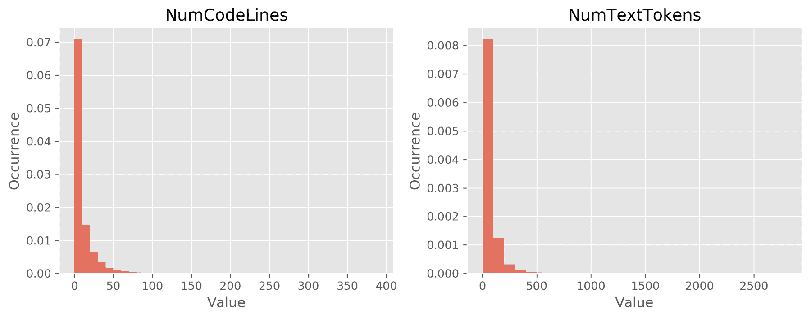
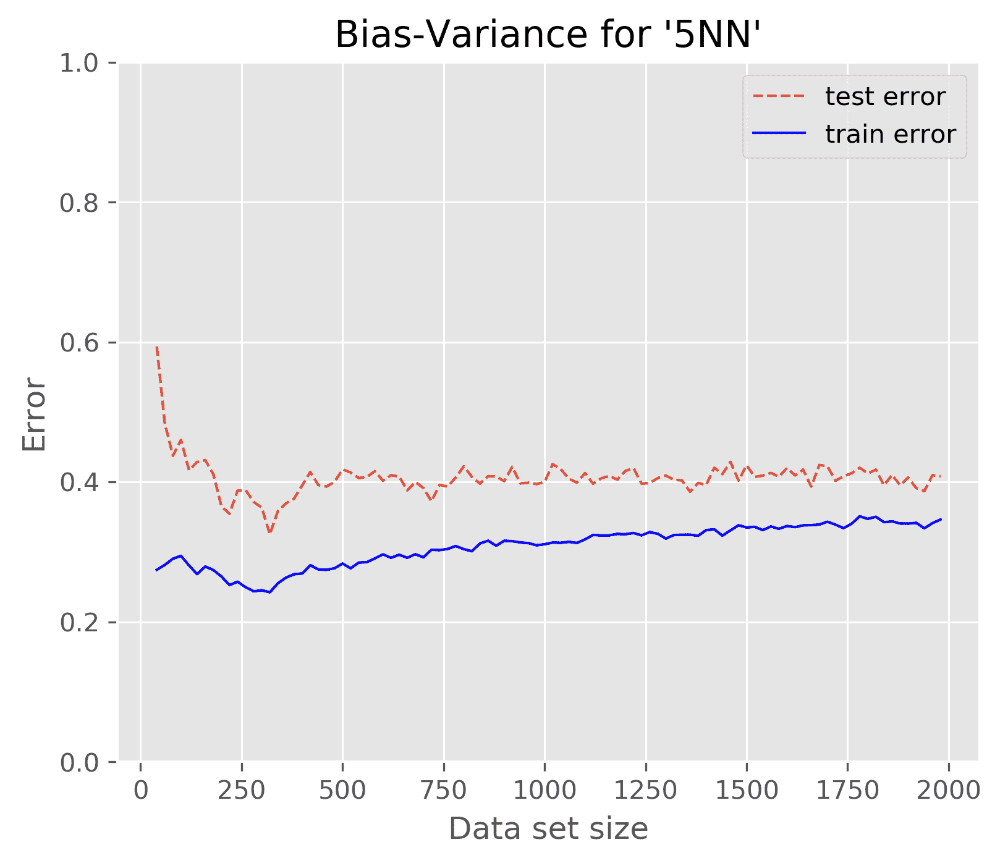
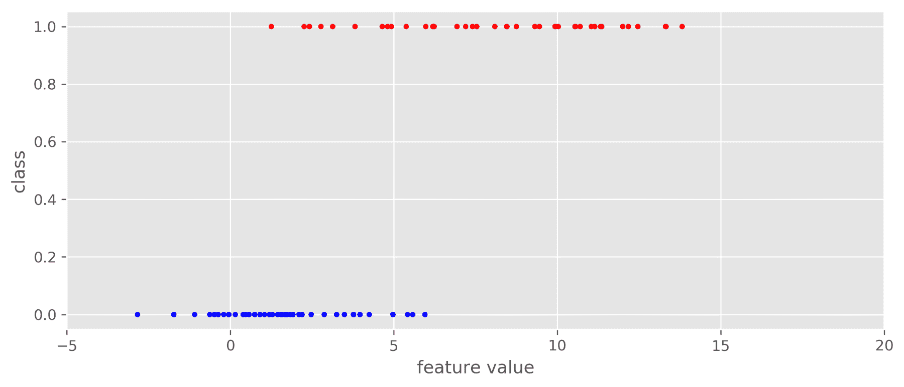
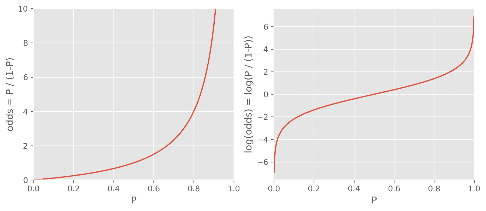
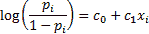
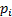
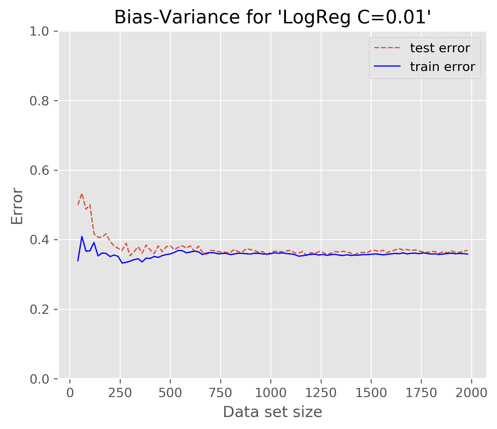
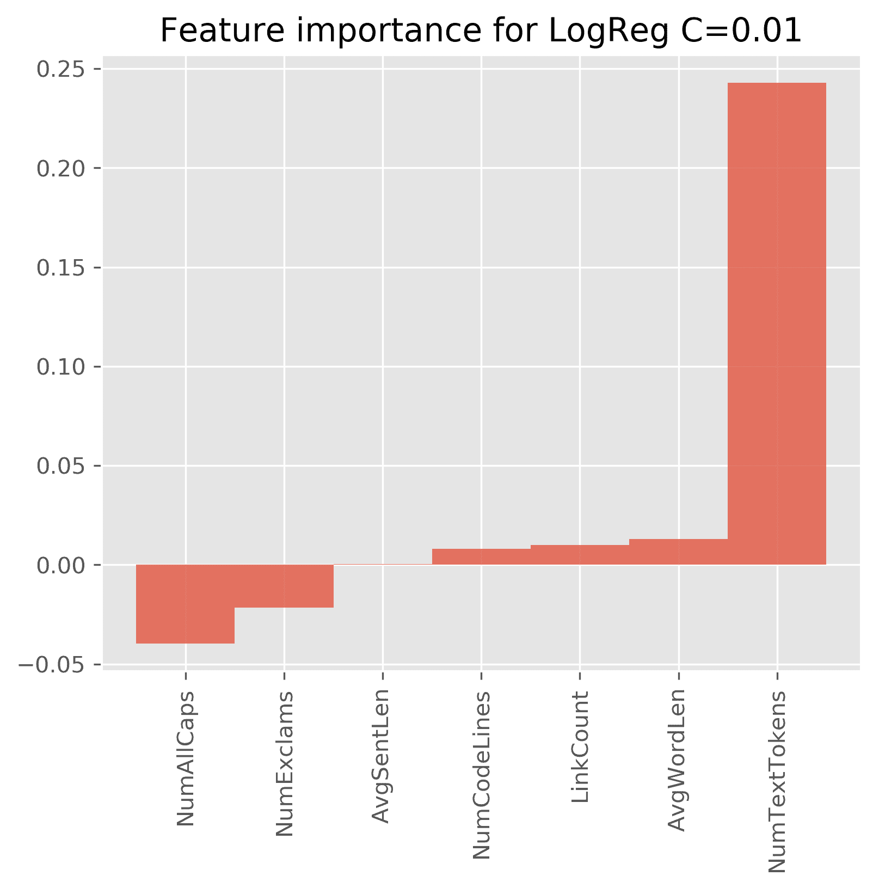
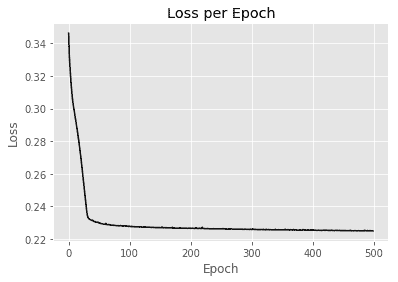
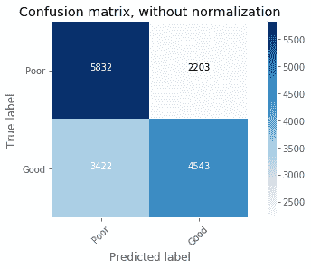

# 四、分类一——检测不良答案

问答网站所有者面临的一个持续挑战是保持发布内容的质量水平。StackOverflow 等网站做出了相当大的努力来鼓励具有不同可能性的用户对内容进行评分，并提供徽章和奖励积分，以便将更多的精力花在构思问题或设计可能的答案上。

一个特别成功的激励是提问者能够将他们问题的一个答案标记为被接受的答案(有激励让提问者这样标记答案)。这将导致标记答案的作者获得更高的分数。

当用户输入答案时，立即看到他们的答案有多好不是很有用吗？这意味着该网站将持续评估用户正在进行的回答，并提供关于该回答是否有改进空间的反馈。这将鼓励用户投入更多的精力来编写答案(例如提供一个代码示例，甚至包括一个图像)，从而改进整个系统。

让我们建立这样的机制！在本章中，我们将涵盖以下主题:

*   获取和预处理原始数据
*   创建第一最近邻分类器
*   研究如何提高分类器的性能
*   从最近邻回归到逻辑回归
*   学习精度和召回率，以更好地理解分类器的性能
*   思考运输它的必要步骤

# 绘制我们的路线图

因为我们将使用非常嘈杂的真实数据构建一个系统，所以这一章不适合胆小的人，因为我们不会得到达到 100%准确率的分类器的黄金解；通常，即使是人类也不同意一个答案是好是坏(看看 StackOverflow 的一些评论就知道了)。我们会发现，有些挑战，比如本章中的挑战，是如此的艰难，以至于我们不得不一路调整我们最初的目标。我们将从前几章中学习的最近邻方法开始，找出为什么它对本章中的任务不是很好，切换到逻辑回归，并得出一个解决方案，该解决方案将获得足够好的预测质量，但依赖于较小部分的答案。最后，我们将花一些时间来研究如何提取获胜者，并将其部署到目标系统上。

# 学习分类经典答案

在分类中，我们希望为给定的数据实例找到相应的类，有时也称为标签。为了实现这一点，我们需要回答两个问题:

*   我们应该如何表示数据实例？
*   我们的分类器应该具备哪种模型或结构？

# 调整实例

最简单的形式是，在我们的例子中，数据实例是答案文本本身，标签是一个二进制值，指示询问者是否接受这个文本作为答案。然而，对于大多数机器学习算法来说，原始文本是非常不方便处理的表示。他们想要数字。我们的任务是从原始文本中提取有用的特征，然后机器学习算法可以使用这些特征来学习合适的标签。

# 调整分类器

一旦我们找到或收集了足够多的(文本、标签)对，我们就可以训练一个分类器。对于分类器的底层结构，我们有各种各样的可能性，每种可能性都有优点和缺点。仅举一些比较突出的选择，有逻辑回归、决策树、支持向量机和朴素贝叶斯。在本章中，我们将对比基于实例的方法从[第 2 章](02.html)、*分类与真实世界的例子*，最近邻，与基于模型的逻辑回归。

# 正在获取数据

对我们来说幸运的是，StackOverflow 背后的团队提供了 StackExchange 宇宙背后的大部分数据，StackOverflow 根据`cc-by-sa`许可证属于该宇宙。在写这本书的时候，最新的数据转储可以在[https://archive.org/download/stackexchange](https://archive.org/download/stackexchange)找到。它包含 StackExchange 家族中所有 Q & A 站点的数据转储。对于 StackOverflow，你会发现多个文件，其中我们只需要`stackoverflow.com-Posts.7z`文件，11.3 GB。

下载并提取后，我们有大约 59 GB 的 XML 格式的数据，在根标签帖子中包含所有问题和答案作为单独的行标签:

```py
<?xml version="1.0" encoding="utf-8"?>
<posts>
...
  <row Id="4572748" PostTypeId="2" ParentId="4568987" CreationDate="2011-01-01T00:01:03.387" Score="4" ViewCount="" Body="&lt;p&gt;IANAL, but &lt;a href=&quot;http://support.apple.com/kb/HT2931&quot; rel=&quot;nofollow&quot;&gt;this&lt;/a&gt; indicates to me that you cannot use the loops in your application:&lt;/p&gt;&lt;blockquote&gt;&lt;p&gt;...however, individual audio loops may not be commercially or otherwise distributed on a standalone basis, nor may they be repackaged in whole or in part as audio samples, sound effects or music beds.&quot;&lt;/p&gt;&lt;p&gt;So don't worry, you can make
 commercial music with GarageBand, you just can't distribute the loops as loops.&lt;/p&gt; &lt;/blockquote&gt; " OwnerUserId="203568" LastActivityDate="2011-01-01T00:01:03.387" CommentCount="1" />
…
</posts>  
```

请参考下表:

| **名称** | **类型** | **描述** |
| --- | --- | --- |
| `Id` | 整数 | 这是帖子的唯一标识符。 |
| `PostTypeId` | 整数 | 这描述了帖子的类别。我们感兴趣的价值观如下:

*   1:问题
*   2:回答

其他值将被忽略。 |
| `ParentId` | 整数 | 这是此答案所属问题的唯一标识符。问题缺少，这种情况下我们设置为`-1`。 |
| `CreationDate` | 日期时间 | 这是提交日期。 |
| `Score` | 整数 | 这是帖子的分数。 |
| `ViewCount` | 整数或空 | 这是这篇文章的用户浏览量。 |
| `Body` | 线 | 这是以编码的超文本标记语言文本形式发布的完整帖子。 |
| `OwnerUserId` | 身份 | 这是海报的唯一标识符。如果`1`，那么就是维基问题。 |
| `Title` | 线 | 这是问题的标题(缺少答案)。 |
| `AcceptedAnswerId` | 身份 | 这是已接受答案的标识(缺少答案)。 |
| `CommentCount` | 整数 | 这是帖子的评论数。 |

Normally, we try to stick to the Python style guides for variable naming. In this chapter, we will use the names in the XML fomat so they are easier to follow. For example, we will have `ParentId` instead of `parent_id`.

# 将数据精简为可咀嚼的块

我们将需要训练许多变体，直到我们到达最终的分类器。鉴于目前的数据，我们将被以下因素大大拖慢:

*   Post-it 存储属性，这可能是我们不需要的。
*   它存储为 XML，这不是解析速度最快的格式。
*   转储包含可追溯到 2011 年的帖子。仅限于 2017 年，我们最终仍将有超过 600 万个职位，这应该足够了。

# 预选和处理属性

我们当然可以去掉那些我们认为无助于分类器区分好答案和不好答案的属性。但我们在这里必须谨慎。虽然有些功能不会直接影响分类，但仍有必要保留:

*   例如`PostTypeId`属性是区分问题和答案所必需的。它不会被挑选作为一个功能，但我们需要它来过滤数据。
*   `CreationDate`确定发布问题和发布单个答案之间的时间跨度可能很有意思。然而，在本章中，我们将忽略它。
*   分数是社区评价的重要指标。
*   `ViewCount`相比之下，很可能对我们的任务没有任何用处。即使它有助于分类器区分好与坏，我们在提交答案时也不会有这些信息。所以我们忽略它。
*   `Body`属性显然包含了最重要的信息。由于它是 HTML 编码的，我们将不得不将其解码为纯文本。
*   `OwnerUserId`只有当我们考虑到依赖于用户的特性时才是有用的，而我们不会这样做。
*   这里也忽略了 Title 属性，尽管它可以添加一些关于该问题的更多信息。
*   `CommentCount`也是忽略。类似于`ViewCount`，它可以帮助分类器处理暂时存在的帖子(更多评论=更模糊的帖子？).然而，在发布答案时，这对分类器没有帮助。
*   `AcceptedAnswerId`类似于 Score，是一个帖子质量的指标。然而，随着时间的推移，这是一个可能会过时的信号。想象一下，一个用户发布了一个问题，收到了几个答案，将其中一个标记为已接受，然后忘记了它。多年后，更多的用户已经阅读了问题，也将已经阅读了答案，其中一些答案在提问者接受答案时并不存在。所以结果可能是得分最高的答案不是被接受的答案。既然已经有分数了，就忽略录取信息。

可以说，为了加快处理速度，我们将使用`lxml`模块解析 XML 文件，然后输出两个文件。在一个文件中，我们将存储一个字典，该字典将帖子的 Id 值映射到它的其他数据，除了 JSON 格式的 Text，这样我们就可以很容易地读取它，并将其保存在元字典的内存中。例如，帖子的分数位于`meta[post_id]['Score']`。我们将对本章中创建的新功能进行同样的操作。

然后，我们将实际的帖子存储在另一个以制表符分隔的文件中，其中第一列是 Id，第二列是 Text，我们可以通过以下方法轻松地读取:

```py
def fetch_posts(fn):
    for line in open(fn, "r"):
        post_id, text = line.split("\t")
        yield int(post_id), text.strip()
```

我们将这两个文件称为:

```py
>>> import os
>>> fn_sample = os.path.join('data', "sample.tsv")
>>> fn_sample_meta = os.path.join('data', "sample-meta.json")
```

为了简洁起见，请查看 Jupyter 笔记本上的代码。

# 定义什么是好的答案

在我们可以训练一个分类器来区分好的和坏的答案之前，我们必须创建训练数据。到目前为止，我们只有一堆数据。我们仍然需要定义标签。

当然，我们可以简单地把每个问题最好和最差的答案作为正面和负面的例子。然而，我们如何处理只有好答案的问题，比如，一个有两个，另一个有四个点？难道我们真的应该因为恰好是分数较低的答案，就把两分的答案当成反面教材吗？或者假设我们只有两个否定的答案，一个得分为`-2`，另一个得分为`-4`。显然，我们不能以`-2`的回答为正面例子。

因此，我们将寻找至少有一个得分高于`0`的答案和至少一个得分为负的答案，并扔掉那些不符合这一标准的答案。如果我们获取所有剩余的数据，我们将不得不在每一步等待相当长的时间，因此我们进一步筛选到 10，000 个问题。从这些答案中，我们将选择得分最高的答案作为肯定的例子，得分最低的答案作为否定的例子，这导致我们的训练集有 20，000 个答案。

如前所述，在本章中(以及在 Jupyter 笔记本中)，我们将维护一个元字典，它将答案 id 映射到特征，其中得分为 1(我们将在此过程中设计更多的特征)。因此，我们可以创建如下标签:

```py
>>> all_answers = [a for a,v in meta.items() if v['ParentId']!=-1]
>>> Y = np.asarray([meta[aid]['Score'] > 0 for aid in all_answers])
>>> print(np.unique(Y, return_counts=True))
(array([False, True], dtype=bool), array([10000, 10000], dtype=int64))
```

# 创建我们的第一个分类器

先从[第二章](02.html)、*用真实例子*分类简单美观的最近邻法说起。虽然它不如其他方法先进，但它非常强大:因为它不是基于模型的，所以它可以学习几乎任何数据。但是这种美有一个明显的缺点，我们很快就会发现(正因为如此，我们不得不将前一句中的 learn 大写)。

# 设计特征

如前所述，我们将使用文本和分数特征来训练我们的分类器。文本的问题是分类器不能很好地处理字符串。我们必须把它转换成一个或多个数字。那么，从帖子中提取哪些统计数据可能有用呢？让我们从 HTML 链接的数量开始，假设好的帖子中有链接的几率更高。

我们可以用正则表达式做到这一点。下面捕获所有以`http://`开头的 HTML 链接标签(暂时忽略其他协议):

```py
import re
link_match = re.compile('<a href="http://.*?".*?>(.*?)</a>', 
 re.MULTILINE | re.DOTALL)
```

但是，我们不想计算属于代码块一部分的链接。例如，如果一篇文章解释了`requests Python`模块的用法，它很可能也包含 URL。这意味着我们必须遍历所有的代码块，计算其中的链接数，然后从链接总数中减去它们。这可以通过另一个匹配`<pre>`标记的正则表达式来实现，该标记在 StackExchange 站点上用于标记代码:

```py
code_match = re.compile('<pre>(.*?)</pre>',
                        re.MULTILINE | re.DOTALL)

def extract_features_from_body(s):
    link_count_in_code = 0
    # count links in code to later subtract them 
    for match_str in code_match.findall(s):
        link_count_in_code += len(link_match.findall(match_str))

    return len(link_match.findall(s)) – link_count_in_code
```

For production systems, we would not want to parse HTML content with regular expressions. Instead, we should rely on excellent libraries such as `BeautifulSoup`, which does a marvelous job of robustly handling all the weird things that typically occur in everyday HTML.

有了这些，我们可以为每个答案生成一个特征，并将其存储在 meta 中。但是在我们训练分类器之前，让我们看看我们将用什么来训练它。我们可以通过新功能的频率分布获得第一印象。这可以通过绘制数据中每个值出现频率的百分比来实现:

```py
import matplotlib.pyplot as plt

X = np.asarray([[meta[aid]['LinkCount']] for aid in all_answers])
plt.figure(figsize=(5,4), dpi=300)
plt.title('LinkCount')
plt.xlabel('Value')
plt.ylabel('Occurrence')

n, bins, patches = plt.hist(X, normed=1, 
                            bins=range(max(X.ravel())-min(X.ravel())), 
                            alpha=0.75)

plt.grid(True)
```

参考下图:


由于大多数帖子根本没有链接，我们现在知道这个特性不会成为一个好的分类器。不管怎样，让我们试一试，初步估计一下我们的位置。

# 训练分类器

我们必须将特征数组和先前定义的`Y`标签一起传递给`kNN`学习器，以获得分类器:

```py
from sklearn.neighbors import KNeighborsClassifier
X = np.asarray([extract_features_from_body(text) for post_id, text in 
                fetch_posts(fn_sample) if post_id in all_answers])
knn = KNeighborsClassifier()
knn.fit(X, Y)  
```

使用标准参数，我们只是给我们的数据拟合了一个`5NN`(意思是带有`k=5`的`NN`)。为什么是`5NN`？以我们目前对数据的了解，我们真的不知道正确的 k 应该是什么。一旦我们有了更多的洞察力，我们就会对如何设定`k`有更好的想法。

# 测量分类器的性能

我们必须清楚我们想要测量什么。最简单的方法是简单地计算测试集的平均预测质量。这将导致错误预测的值介于 0 和完美预测的值介于 1 之间。

现在让我们使用精度作为预测质量，scikit-learn 使用`knn.score()`为我们方便地计算。但是正如我们在[第 2 章](02.html)、*用现实世界的例子*进行分类时所学的，我们不会只做一次，而是在这里使用来自`sklearn.model_selection`的现成的 KFold 类进行交叉验证。最后，我们将对每个折叠的测试集的分数进行平均，并使用标准偏差查看其变化程度:

```py
from sklearn.neighbors import KNeighborsClassifier
from sklearn.model_selection import KFoldscores = []
N_FOLDS = 10
cv = KFold(n_splits=N_FOLDS, shuffle=True, random_state=0)

for train, test in cv.split(X, Y):
    X_train, y_train = X[train], Y[train]
    X_test, y_test = X[test], Y[test]
    clf =KNeighborsClassifier()
    clf.fit(X_train, Y)_train)
    scores.append(clf.score(X_test, y_test))

print("Mean(scores)=%.5f\tStddev(scores)=%.5f"\
      %(np.mean(scores), np.std(scores)))
```

以下是输出:

```py
Mean(scores)=0.50170 Stddev(scores)=0.01243 
```

现在，这还远远不能使用。准确率只有 50%，就像扔硬币一样。显然，一篇文章中的链接数量并不能很好地反映一篇文章的质量。所以，我们可以说这个特性没有太大的辨别能力——至少对于有`k=5`的 kNN 来说没有。

# 设计更多功能

除了使用超链接的数量作为帖子质量的代表，代码行的数量也可能是另一个很好的指标。至少，这是一个很好的指标，表明帖子的作者有兴趣回答这个问题。我们可以找到嵌入在`<pre>...</pre>`标签中的代码。一旦我们提取了它，我们应该计算帖子中正常单词的数量:

```py
# we will use regular expression to remove HTML tags
tag_match = re.compile('<[^>]*>', re.MULTILINE | re.DOTALL)
whitespace_match = re.compile(r'\s+', re.MULTILINE | re.DOTALL)

def extract_features_from_body(s):
    num_code_lines = 0
    link_count_in_code = 0

    # remove source code and count how many lines the post has
    code_free_s = s
    for match_str in code_match.findall(s):
        num_code_lines += match_str.count('\n')
        code_free_s = code_match.sub(' ', code_free_s)

        # Sometimes source code contains links, which we don't want to 
        # count
        link_count_in_code += len(link_match.findall(match_str))

    links = link_match.findall(s)
    link_count = len(links) - link_count_in_code

    html_free_s = tag_match.sub(' ', code_free_s)

    text = html_free_s
    for link in links:
        if link.lower().startswith('http://'):
            text = text.replace(link, ' ')

    text = whitespace_match.sub(' ', text)
    num_text_tokens = text.count(' ')

    return num_text_tokens, num_code_lines, link_count  
```

看到这一点，我们注意到，至少一篇帖子中的字数显示出更高的可变性:



因为我们有多个功能，所以我们标准化了它们的价值:

```py
scores = []
for train, test in cv.split(X, Y): 
    clf = make_pipeline(StandardScaler(), KNeighborsClassifier())
    clf.fit(X[train], Y[train])
    scores.append(clf.score(X[test], Y[test]))

print("Mean(scores)=%.5f\tStddev(scores)=%.5f"%(np.mean(scores), np.std(scores)))  
```

在更大的特征空间上训练可以大大提高准确性:

```py
Mean(scores)=0.60070 Stddev(scores)=0.00759
```

但是，这仍然意味着我们会把大约 10 个错误中的 4 个归类。至少我们走的方向是对的。更多的特征导致更高的精度，这导致我们添加更多的特征。因此，让我们通过更多功能来扩展功能空间:

*   `AvgSentLen`:这是衡量一个句子的平均字数。也许有一种模式，特别好的帖子不会用过长的句子让读者的大脑超载
*   `AvgWordLen`:与`AvgSentLen`类似，该功能测量一篇帖子的平均字数
*   `NumAllCaps`:这衡量的是大写的字数，被认为是文风不佳
*   `NumExclams`:这是测量感叹号的数量

我们将使用 NLTK 来方便地确定句子和单词的边界，计算特征，并立即将它们附加到已经包含其他特征的元词典中:

```py
import nltk
def add_sentence_features(m):
    for pid, text in fetch_posts(fn_sample):
        if not text:
            for feat in ['AvgSentLen', 'AvgWordLen', 
                         'NumAllCaps', 'NumExclams']:
                m[pid][feat] = 0
        else:
            sent_lens = [len(nltk.word_tokenize(sent)) for sent in 
                         nltk.sent_tokenize(text)]
            m[pid]['AvgSentLen'] = np.mean(sent_lens)
            text_tokens = nltk.word_tokenize(text)
            m[pid]['AvgWordLen'] = np.mean([len(w) for w in text_tokens])
            m[pid]['NumAllCaps'] = np.sum([word.isupper() \
                                           for word in text_tokens])
            m[pid]['NumExclams'] = text.count('!')
add_sentence_features(meta)
```

以下图表显示了平均句子和单词长度的值分布，以及大写单词和感叹号的数量:


有了这四个额外的特性，我们现在有七个特性来代表各个帖子。让我们看看我们如何进步:

```py
Mean(scores)=0.60225 Stddev(scores)=0.00729  
```

这很有趣。我们又增加了四个功能，但没有得到任何回报。这怎么可能呢？

为了理解这一点，我们必须提醒自己`kNN`是如何工作的。我们的`5NN`分类器通过计算前面提到的七个特征来确定新帖子的类别— `LinkCount`、`NumTextTokens`、`NumCodeLines`、`AvgSentLen`、`AvgWordLen`、`NumAllCaps`和`NumExclams`—然后找到最接近的五个其他帖子。新帖子的类别就是最近帖子的大多数类别。最近的帖子是通过计算欧几里德距离来确定的(因为我们没有指定它，所以分类器是用默认的`p=2`初始化的，这是闵可夫斯基距离中的参数)。这意味着所有七个特征都被相似地对待。

# 决定如何提高性能

为了改进这一点，我们基本上有以下选择:

*   多补充数据:可能只是学习算法的数据不够；添加更多的训练数据应该会有所帮助。
*   玩转模型复杂性:也许模型不够复杂？还是可能已经太复杂了？在这种情况下，我们可以减少 k，以便考虑更少的最近邻，从而更好地预测非平滑数据。或者我们可以增加它来达到相反的效果。
*   修改特征空间:也许我们没有合适的特征集？我们可能遗漏了帖子的一些重要方面。或者，我们是否应该删除一些当前的特征，以防某些特征与其他特征混淆？
*   改变模型:也许 kNN 不太适合我们的用例；也许它永远无法实现良好的预测性能，无论我们允许它有多复杂，特征空间有多复杂。

困在这一点上，人们经常试图通过随机选择其中一个选项并以不特定的顺序进行尝试来提高当前的性能，希望偶然找到黄金配置。我们可以在这里做同样的事情，但这肯定需要比做出明智决定更长的时间。让我们走知情路线，为此我们需要引入偏差-方差权衡。

# 偏差、差异及其权衡

在[第 1 章](01.html)、*Python 机器学习入门*中，我们尝试拟合由 d 维参数控制的不同复杂度的多项式来拟合数据。我们意识到一个二维多项式，一条直线，不能很好地拟合示例数据，因为数据本质上不是线性的。无论我们的拟合过程有多复杂，我们的二维模型都将一切视为一条直线。我们了解到它对手头的数据太有偏见，称之为拟合不足。

我们对维度进行了一点研究，发现 100 维多项式非常适合训练它的数据(当时我们不知道训练测试拆分)。然而，我们很快发现它太合适了。我们意识到它的过度拟合非常严重，以至于用不同的数据点样本，我们会得到完全不同的 100 维多项式。这就是为什么人们也可以说模型对于给定的数据具有太高的方差。

这些是大多数机器学习问题的极端情况。理想情况下，我们希望同时具有低偏差和低方差。但是，我们处在一个糟糕的世界，必须在它们之间进行权衡。如果我们改进一个，另一个可能会变得更糟。

# 固定高偏置

让我们现在假设我们遭受高偏差。在这种情况下，增加更多的训练数据显然没有帮助。此外，删除功能肯定不会有帮助，因为我们的模型已经过于简单了。

我们唯一的可能是获得更多的特性，使模型更加复杂，或者改变模型本身。

# 固定高方差

相反，如果我们遭受高方差，这意味着我们的模型对于数据来说太复杂了。在这种情况下，我们只能尝试获取更多的数据或降低复杂性。这将意味着增加 k 以便考虑更多的邻居，或者删除一些特征。

# 偏高还是偏低？

为了找出我们的问题是什么，我们必须绘制不同数据大小上的训练和测试误差，然后检查训练和测试之间的差距是否正在缩小。

高偏差通常表现为测试误差在开始时减少一点，但随后随着训练误差随着数据集大小的增加而接近，测试误差稳定在一个非常高的值。两条曲线之间有很大的差距，说明差异很大。

为 **5NN** 绘制不同数据集大小的误差显示了训练误差和测试误差之间的巨大差距，暗示了一个高方差问题:


由于测试误差不会随着数据的增加而减少，我们不得不重新考虑模型。我们当然可以通过增加 k 或简化特征空间来降低模型的复杂性。

如下图所示，对于只有`LinkCount`和`NumTextTokens`的简化特征空间，减少特征空间没有帮助:



对于其他较小的特征集，我们得到了类似的图。不管我们采用什么样的特征子集，图形看起来都是相似的。

降低模型复杂度的另一种方法是增加 k，这导致更平滑的决策边界。再次接受所有功能的培训，我们确实看到了积极的影响:

| **k** | **平均值(分数)** | **stddev(分数)** |
| five | 0.6022 | 0.0073 |
| Ten | 0.6191 | 0.0096 |
| Forty | 0.6425 | 0.0104 |

但这还不够，还以较低的分类-运行时性能为代价。以上表中平均精度最高的 **k=40** 为例。要对新帖子进行分类，我们需要找到离其他帖子最近的 **40** 来决定新帖子是否是好帖子:


显然，在我们的场景中使用最近邻似乎有问题。它还有另一个真正的缺点。随着时间的推移，我们的系统中会有越来越多的帖子。由于最近邻方法是一种基于实例的方法，我们将不得不在系统中存储所有帖子。我们得到的越多，预测就会越慢——鉴于如此低的性能，这绝对不是我们愿意付出的代价。这与基于模型的方法不同，基于模型的方法试图从数据中导出模型。

现在我们有足够的理由放弃最近邻法，在分类世界中寻找更好的地方。当然，我们永远不会知道是否有一个我们只是碰巧没有想到的黄金特征。但是现在，让我们转向另一种分类方法，这种方法在基于文本的分类场景中非常有效。

# 使用逻辑回归

与其名称相反，逻辑回归是一种分类方法。当涉及到基于文本的分类时，这是一个非常强大的工具；它通过首先对逻辑函数进行回归来实现这一点，因此得名。

# 一点数学知识和一个小例子

为了对逻辑回归的工作方式有一个初步的了解，让我们首先看一下下面的例子，其中我们有人工特征值，`X`，用相应的类，`0`或`1`绘制:

```py
from scipy.stats import norm
np.random.seed(3) # for reproducibility
NUM_PER_CLASS = 40
X_log = np.hstack((norm.rvs(2, size=NUM_PER_CLASS, scale=2),
                   norm.rvs(8, size=NUM_PER_CLASS, scale=3)))
y_log = np.hstack((np.zeros(NUM_PER_CLASS),
                   np.ones(NUM_PER_CLASS))).astype(int)
plt.xlim((-5, 20))
plt.scatter(X_log, y_log, c=np.array(['blue', 'red'])[y_log], s=10)
plt.xlabel("feature value")
plt.ylabel("class")  
```

参考下图:



我们可以看到，数据非常嘈杂，以至于类在 1 到 6 之间的特征值范围内重叠。因此，最好不要直接对离散类建模，而是对某个特征值属于类`1`、 *P(X)* 的概率建模。一旦我们拥有这样一个模型，我们就可以预测等级`1`如果 *P(X) > 0.5* ，否则等级为 0。

从数学上讲，总是很难对有限范围的东西进行建模，就像我们这里的离散标签 0 和 1 一样。因此，我们稍微调整一下概率，使它们始终保持在 0 和 1 之间。为此，我们需要比值比和它的对数。

假设一个特征属于类`1`， *P(y=1) = 0.9* 的概率为 0.9。比值比为 *P(y=1)/P(y=0) = 0.9/0.1 = 9* 。我们可以说这个特征映射到类`1`的几率是 9:1。如果 *P(y=0.5)* ，那么我们将有 1:1 的机会该实例属于类`1`。优势比以 0 为界，但趋于无穷大(下图中的左图)。如果我们现在取它的对数，我们可以将 0 到 1 之间的所有概率映射到从负到正无穷大的整个范围(下面一组图中的右图)。好的一面是，我们仍然保持着这样一种关系，即更高的概率导致更高的概率对数，只是不再局限于 0 和 1:



这意味着我们现在可以将我们的特征的线性组合(好的，我们只有一个和一个常数，但这将很快改变)拟合到对数(赔率)值。从某种意义上说，我们用代替了[第一章](01.html)、*Python 机器学习入门*、(用 log(赔率)代替 y)。

我们可以为解决这个，这样我们就有了。

我们只需找到正确的系数，这样公式就能给出数据集内所有(xi，π)对的最低误差，但这将由 scikit-learn 完成。

拟合后，公式将给出属于类`1`的每个新数据点`x`的概率:

```py
>>> from sklearn.linear_model import LogisticRegression
>>> clf = LogisticRegression()
>>> print(clf)
LogisticRegression(C=1.0, class_weight=None, dual=False, fit_intercept=True, intercept_scaling=1, max_iter=100, multi_class='ovr', n_jobs=1, penalty='l2', random_state=None, solver='liblinear', tol=0.0001, verbose=0, warm_start=False)
>>> clf.fit(X_log, y_log)
>>> print(np.exp(clf.intercept_), np.exp(clf.coef_.ravel()))
[ 0.09437188] [ 1.80094112]
>>> def lr_model(clf, X):
...     return 1 / (1 + np.exp(-(clf.intercept_ + clf.coef_* X)))
>>> print("P(x=-1)=%.2f\tP(x=7)=%.2f"%(lr_model(clf, -1), 
lr_model(clf, 7)))
P(x=-1)=0.05 P(x=7)=0.85
```

您可能已经注意到 scikit-learn 通过`intercept_ special`字段公开了第一个系数。

如果我们绘制拟合模型，我们会发现它在给定数据的情况下非常有意义:

```py
X_range = np.arange(-5, 20, 0.1)
plt.figure(figsize=(10, 4), dpi=300)
plt.xlim((-5, 20))
plt.scatter(X_log, y_log, c=np.array(['blue', 'red'])[y_log], s=5)
# we use ravel() to get rid of the additional axis
plt.plot(X_range, lr_model(clf, X_range).ravel(), c='green')
plt.plot(X_range, np.ones(X_range.shape[0]) * 0.5, "--")
plt.xlabel("feature value")
plt.ylabel("class")
plt.grid(True)  
```

参考下图:


# 逻辑回归在分类后问题中的应用

诚然，上一节中的例子是为了展示逻辑回归的美妙之处而创建的。它在真实的噪声数据上表现如何？

将它与作为基线的最佳最近邻分类器`(k=40)`进行比较，我们看到它不会改变很多情况:

| **方法** | **平均值(分数)** | **stddev(分数)** |
| `LogReg C=0.001` | 0.6369 | 0.0097 |
| `LogReg C=0.01` | 0.6390 | 0.0109 |
| `LogReg C=0.1` | 0.6382 | 0.0097 |
| `LogReg C=1.00` | 0.6380 | 0.0099 |
| `LogReg C=10.00` | 0.6380 | 0.0097 |
| `40NN` | 0.6425 | 0.0104 |

我们已经显示了`C`正则化参数的不同值的准确性。有了它，我们可以控制模型的复杂性，类似于最近邻法的`k`参数。`C`值越小，模型复杂度越低。

快速查看我们的最佳候选人之一`C=0.01,`的偏差-方差图显示，我们的模型具有高偏差-测试和训练-误差曲线，接近但保持在不可接受的高值。这表明当前特征空间的逻辑回归拟合不足，无法学习正确捕捉数据的模型:



那么，现在怎么办？我们切换了模型，并根据我们当前的知识状态尽可能地对其进行了调整，但我们仍然没有可接受的分类器。我们通过切换获得的唯一好处是，我们现在有了一个可以根据数据进行扩展的模型，因为它不需要存储所有的实例。

越来越多的，似乎要么数据对于这个任务来说太嘈杂，要么我们的特征集仍然不够合适，不足以正确区分类别。

# 寻找准确性的背后——准确性和召回率

让我们退后一步，再次思考我们正在努力实现的目标。事实上，我们并不需要一个能完美预测好答案和坏答案的分类器，因为我们直到现在都是用准确度来衡量的。如果我们可以调整分类器，使其特别擅长预测某个类别，我们就可以相应地调整用户的反馈。例如，如果我们有一个分类器，当它预测一个答案是坏的时，它总是正确的，那么在分类器检测到答案是坏的之前，我们不会给出任何反馈。相反，如果分类器在预测答案是好的方面超过了，我们可以在开始时向用户显示有用的评论，并在分类器说答案是好的时将其删除。

要弄清楚我们处于哪种情况，我们必须了解如何测量精度和召回率。为了理解这一点，我们必须研究下表中描述的四种不同的分类结果:


例如，如果分类器预测一个实例是正的，并且该实例确实是正的，那么这就是一个真正的正实例。另一方面，如果分类器错误地分类了那个实例，说它是负的，而实际上它是正的，那么这个实例就被称为假负的。

当我们预测一篇文章是好是坏，但不一定两者都预测时，我们想要的是有很高的成功率。也就是说，我们想要尽可能多的真实积极因素。这就是精准捕捉到的:


相反，如果我们的目标是发现尽可能多的好或坏的答案，我们会对回忆更感兴趣:


参考下图:


那么，我们现在如何优化精度呢？到目前为止，我们一直用 **0.5** 作为判断一个答案好不好的门槛。我们现在可以做的是计算 TP、FP 和 FN 的数量，同时在 **0** 和 **1** 之间改变阈值。有了这些计数，我们就可以绘制精确度超过回忆的曲线。

`metrics`模块中方便的`precision_recall_curve()`功能为我们完成所有计算:

```py
>>> from sklearn.metrics import precision_recall_curve
>>> # X_test would come from KFold’s train/test split
>>> precision, recall, thresholds = precision_recall_curve(y_test, 
 clf.predict(X_test))
```

以可接受的性能预测一个类别并不总是意味着分类器在预测另一个类别时也是可接受的。这可以在以下两个图中看到，其中我们绘制了分类不良(左图)和良好(右图)答案的精度/召回曲线:

在图表中，我们还包括了对分类器性能的更好描述，曲线下的**区域( **AUC** )。它可以理解为分类器的平均精度，是比较不同分类器的好方法。**

预测好答案表明，我们可以在 20%的召回率下获得 80%的准确率，而当我们想对差答案实现 80%的预测时，我们的召回率只有不到 10%。

让我们找出我们需要的门槛。当我们在不同的折叠上训练许多分类器时(记住，我们在几页后重复`KFold()`，我们需要检索既不太差也不太好的分类器，以便获得真实的视图。让我们称之为中等克隆:

```py
>>> medium = np.argsort(scores)[ len(scores) // 2)]
>>> thresholds = np.hstack(([0],thresholds[medium]))
>>> for precision in np.arange(0.77, 0.8, 0.01):
...    thresh_idx = precisions >= precision
P=0.77 R=0.25 thresh=0.62
P=0.78 R=0.23 thresh=0.65
P=0.79 R=0.21 thresh=0.66
P=0.80 R=0.13 thresh=0.74 
```

在`0.66`设置阈值，我们看到当我们接受 21%的低召回率时，我们在检测好答案时仍然可以达到 79%的准确率。这意味着我们只能发现三分之一的好答案。但是从我们设法发现的三分之一的好答案中，我们可以合理地确定它们确实是好的。对于其余的，我们可以礼貌地显示关于如何改进答案的额外提示。

# 精简分类器

观察单个特性的实际贡献总是值得的。对于逻辑回归，我们可以直接取学习的系数`(clf.coef_)`得到特征影响的印象:



我们看到`NumCodeLines`、`LinkCount`、`AvgWordLen`、`NumTextTokens`对判断一个帖子是否好的正面影响最大，而`AvgWordLen`、`LinkCount`、`NumCodeLines`在这方面也有发言权，但少了很多。这意味着越详细越有可能导致分类成为一个好答案。

另一边，我们有`NumAllCaps`，`NumExclams`有负权重一。这意味着，一个答案喊得越多，就越不可能得到好评。

然后我们有`AvgSentLe` n 特征，这似乎对检测好答案没有太大帮助。我们可以轻松地删除该功能并保留。然而，仅仅从系数的相同分类性能量值，我们不能立即导出特征的重要性，因为我们在原始特征上训练分类器，原始特征没有被归一化。

# 运送它！

假设我们想将这个分类器集成到我们的站点中。在前面所有的例子中，我们总是只对 90%的可用数据进行训练，因为我们使用了另外 10%的数据进行测试。让我们假设数据是我们所有的。在这种情况下，我们应该在所有数据上重新训练分类器:

```py
>>> C_best = 0.01 # determined above
>>> clf = LogisticRegression(C=C_best)
>>> clf.fit(X, Y) # now trainining an all data without cross-validation
>>> print(clf.coef_)
[[ 0.24937413 0.00777857 0.0097297 0.00061647 0.02354386 -0.03715787 -0.03406846]]  
```

最后，我们应该存储训练好的分类器，因为我们肯定不希望每次启动分类服务时都重新训练它。相反，我们可以简单地在训练后序列化分类器，然后在该站点上反序列化:

```py
>>> import pickle
>>> pickle.dump(clf, open("logreg.dat", "w"))
>>> clf = pickle.load(open("logreg.dat", "r"))
>>> print(clf.coef_) # showing that we indeed got the same classifier again
[[ 0.24937413 0.00777857 0.0097297 0.00061647 0.02354386 -0.03715787 -0.03406846]]  
```

恭喜你，分类器现在可以像刚刚训练过一样使用了。我们现在可以使用分类器的`predict_proba()`来计算一个答案是好答案的概率。我们将使用`0.66`的阈值，这将在 21%的召回率下产生 79%的精度，正如我们之前确定的:

```py
>>> good_thresh = 0.66  
```

让我们来看看两个人工帖子的功能，以展示它是如何工作的:

```py
>>> # Remember that the features are in this order:
>>> # LinkCount, NumCodeLines, NumTextTokens, AvgSentLen, AvgWordLen, 
>>> # NumAllCaps, NumExclams
>>> good_post = (2, 1, 100, 5, 4, 1, 0)
>>> poor_post = (1, 0, 10, 5, 6, 5, 4)
>>> proba = clf.predict_proba([good_post, poor_post])
>>> print(proba) # print probabilities (poor, good) per post
array([[ 0.30127876, 0.69872124],
 [ 0.62934963, 0.37065037]])
>>> print(proba >= good_thresh)
array([[False, True],
 [False, False]], dtype=bool) 
```

正如预期的那样，我们设法检测到第一篇文章是好的，但不能说第二篇文章有什么问题，这就是为什么我们会展示一个好的、激励性的信息来指导作者改进文章。

# 利用张量流进行分类

神经网络也可以用来对数据进行分类。与前面的分类器一样，它们可以生成属于某个类的概率，因此，我们可以使用我们想要的阈值来获得我们需要的精度。

这个例子将是我们第一次真正深入神经网络。就像前面的例子一样，我们将使用占位符，但是我们将使用标准的 Tensorflow 函数来创建变量，而不是显式设置变量。

就像以前一样，我们将使用相同的数据和我们当前的所有功能:

```py
X = np.asarray([get_features(aid, ['LinkCount', 'NumCodeLines', 
                                   'NumTextTokens', 'AvgSentLen', 
                                   'AvgWordLen', 'NumAllCaps', 
                                   'NumExclams']) for aid in all_answers])
Y = np.asarray([meta[aid]['Score'] > 0 for aid in all_answers])
```

当然，这里的一个练习是通过使用更少的特征来复制以前的结果，并看看这个神经网络如何能够区分好帖子和坏帖子。

神经网络和大脑不一样。当现实中不存在这种东西时，我们显式地创建层(稍后将详细介绍这一点，但这是理解我们如何创建简单的神经网络所必需的)。将我们想要创建的图层分解是一种很好的做法，因此，例如，我们将创建两种类型的图层:一种用于密集图层，这意味着它们将所有输入连接到所有输出，另一种用于只有一个输出单元的输出图层:

```py
import tensorflow as tf

def create_dense(x, n_units, name, alpha=0.2):
    # Hidden layer
    h = tf.layers.dense(x, n_units, activation=tf.nn.leaky_relu, name=name)
    return h

def create_output(x):
    # Output layer
    h = tf.layers.dense(x, 1, activation=tf.nn.sigmoid, name="Output")
    return h
```

该输出单元通过`sigmoid`激活创建。这意味着在- `inf`和`+inf`之间创建值的内部`tf.matmult`被输入到一个函数中，该函数将这些值映射到区间`[0, 1]`。`0`和`1`对于输出是无法实现的，所以我们在训练神经网络的时候，要把这个保存在记忆中。因此，对于我们训练中的目标概率，我们改变输出以适应这种不可能:

```py
Y = Y.astype(np.float32)[:, None]
bce_ceil = 1e-5
Y = Y * (1 - 2 * bce_ceil) + bce_ceil
```

现在，我们可以分割我们的数据:

```py
from sklearn.model_selection import train_test_split
X_train, X_test, Y_train, Y_test = train_test_split(X, Y, train_size=0.8)
```

让我们从设置我们通常的超级参数开始:

```py
n_epochs = 500
batch_size = 1000
steps = 10
layer1_size = 5
```

如果我们使用所有七个特征，我们的神经网络构建如下:

```py
X_tf = tf.placeholder(tf.float32, (None, 7), name="Input")
Y_ref_tf = tf.placeholder(tf.float32, (None, 1), name="Target_output")

h1 = create_dense(X_tf, layer1_size, name="Layer1")
Y_tf = create_output(h1)

loss = tf.reduce_mean(tf.square(Y_ref_tf - Y_tf))

grad_speed = .01
my_opt = tf.train.GradientDescentOptimizer(grad_speed)
train_step = my_opt.minimize(loss)
```

梯度步长现在远远大于回归示例中的步长。我们可以使用更小的步长，但这需要更多的步长来实现我们的`loss`函数的局部最小值。

我们现在可以训练我们的神经网络，非常类似于我们在[第 2 章](02.html)、*中所做的，用真实世界的例子*进行分类。唯一不同的是，最后，我们还运行了神经网络内部的测试数据:

```py
with tf.Session() as sess:
    sess.run(tf.global_variables_initializer())
    loss_vec = []
    for epoch in range(n_epochs):
        permut = np.random.permutation(len(X_train))
        for j in range(0, len(X_train), batch_size):
            batch = permut[j:j+batch_size]
            Xs = X_train[batch]
            Ys = Y_train[batch]

            sess.run(train_step, feed_dict={X_tf: Xs, Y_ref_tf: Ys})

        temp_loss = sess.run(loss, feed_dict={X_tf: X_train, Y_ref_tf: Y_train})
        loss_vec.append(temp_loss)
        if epoch % steps == steps - 1:
            print('Epoch #%i loss = %s' % (epoch, temp_loss))

    predict_train = sess.run(Y_tf, feed_dict={X_tf: X_train})
    predict_test = sess.run(Y_tf, feed_dict={X_tf: X_test})
```

现在，我们扔掉了我们训练的神经网络，这就是为什么我们也在同一个会话中使用测试数据。我们将在[第 8 章](08.html)、*人工神经网络和深度学习*中看到如何保存和重用模型。

当然，我们也可以展示优化器的表现:

```py
plt.plot(loss_vec, 'k-')
plt.title('Loss per Epoch)
plt.xlabel(Epoc')
plt.ylabel('Loss')
```

参考下图:



每一代人的损失在不同的时期会有很大的不同。`grad_speed`是改变这个图形最重要的参数。它的值是收敛速度和稳定性之间的折衷，我建议您尝试不同的值，看看这个函数在不同的值和不同的运行中是如何表现的。

如果我们查看训练分数和测试分数，我们可以看到我们的结果与前面的最佳分类器相匹配:

```py
from sklearn.metrics import accuracy_score
score = accuracy_score(Y_train > .5, predict_train > .5)
print("Score (on training data): %.2f" % score)
score = accuracy_score(Y_test > .5, predict_test > .5)
print("Score (on testing data): %.2f" % score)
```

这将输出:

```py
Score (on training data): 0.65
Score (on testing data): 0.65
```

这是一个回到超参数的好时机，尤其是中间或隐藏层的大小和修改节点的数量。降低它会降低分类器的行为吗？是增加还是改善？再加一个中间层怎么样？它的神经元数量有什么影响？

`sklearn`的一个很好的特性是丰富的支持功能和教程。这是混淆矩阵教程中的一个函数，有助于可视化分类器的质量:

```py
def plot_confusion_matrix(cm, classes,
                          normalize=False,
                          title='Confusion matrix',
                          cmap=plt.cm.Blues):
    """
    This function prints and plots the confusion matrix.
    Normalization can be applied by setting `normalize=True`.
    """
    import itertools
    if normalize:
        cm = cm.astype('float') / cm.sum(axis=1)[:, np.newaxis]
        print("Normalized confusion matrix")
    else:
        print('Confusion matrix, without normalization')

    print(cm)

    plt.imshow(cm, interpolation='nearest', cmap=cmap)
    plt.title(title)
    plt.colorbar()
    tick_marks = np.arange(len(classes))
    plt.xticks(tick_marks, classes, rotation=45)
    plt.yticks(tick_marks, classes)

    fmt = '.2f' if normalize else 'd'
    thresh = cm.max() / 2.
    for i, j in itertools.product(range(cm.shape[0]), range(cm.shape[1])):
        plt.text(j, i, format(cm[i, j], fmt),
                 horizontalalignment="center",
                 color="white" if cm[i, j] > thresh else "black")

    plt.tight_layout()
    plt.ylabel('True label')
    plt.xlabel('Predicted label')
```

我们现在可以在`.5`使用它和一个阈值来查看这个分类器在训练和测试数据上的行为:

```py
class_names = ["Poor", "Good"]
from sklearn import metrics
print(metrics.classification_report(Y_train > .5, predict_train > .5, target_names=class_names))
plot_confusion_matrix(metrics.confusion_matrix(Y_train > .5, pre-dict_train > .5), classes=class_names,title='Confusion matrix, without normaliza-tion')
plt.show()
print(metrics.classification_report(Y_test > .5, predict_test > .5, target_names=class_names))
plot_confusion_matrix(metrics.confusion_matrix(Y_test > .5, pre-dict_test > .5), classes=class_names,title='Confusion matrix, without normaliza-tion')
```

这将输出:

```py
             precision recall f1-score support

       Poor        0.63  0.73     0.67    8035
       Good        0.67  0.57     0.62    7965
```

参考下图:



请参见以下数据:

```py
avg / total       0.65      0.65      0.65      16000

 precision     recall  f1-score   support

 Poor       0.62       0.73      0.67      1965
 Good       0.68       0.57      0.62      2035

avg / total       0.65       0.65      0.65      4000
```

当从训练数据转移到测试数据时，看到分类器的稳定性是非常有趣的。在这两种情况下，我们也可以看到仍然有很多错误的分类，重点是被标记为坏帖子的好帖子(这可能比相反的好！).

# 摘要

我们成功了！从一个非常嘈杂的数据集，我们建立了两个分类器，解决了我们的部分目标。当然，我们必须务实，并根据可实现的目标调整我们的初始目标。但是在途中，我们了解了最近邻和逻辑回归的优缺点，并了解了神经网络的简单分类。我们学习了如何提取特征，如`LinkCount`、`NumTextTokens`、`NumCodeLines`、`AvgSentLen`、`AvgWordLen`、`NumAllCaps`和`NumExclams`，以及如何分析它们对分类器性能的影响。

但更有价值的是，我们学到了调试表现不佳的分类器的有效方法。这将有助于我们在未来更快地生产出可用的系统。

在研究了最近邻和逻辑回归之后，在[第 5 章](05.html)、*降维*中，我们将熟悉另一个简单但强大的分类算法:朴素贝叶斯。在此过程中，我们还将从 scikit-learn 了解一些更方便的工具。