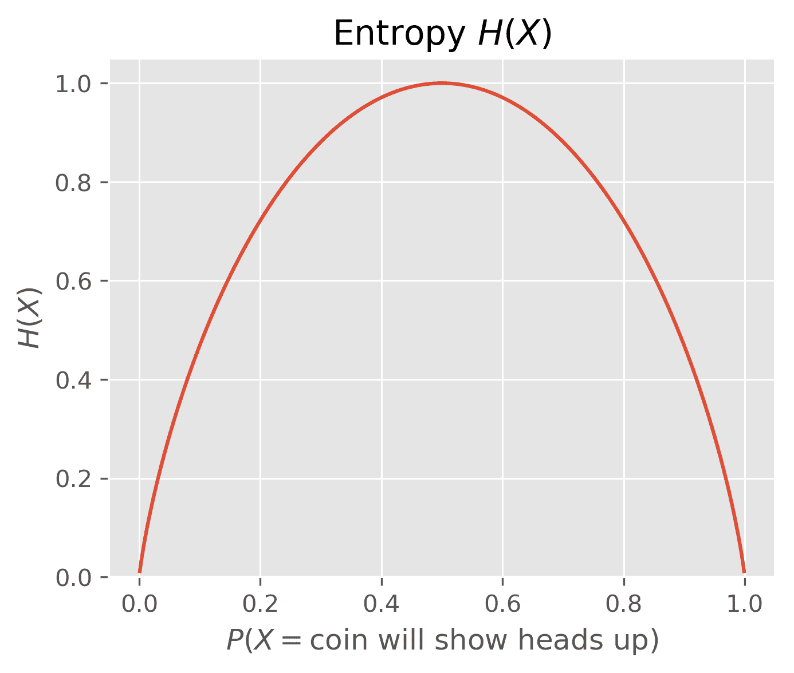
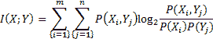
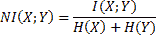
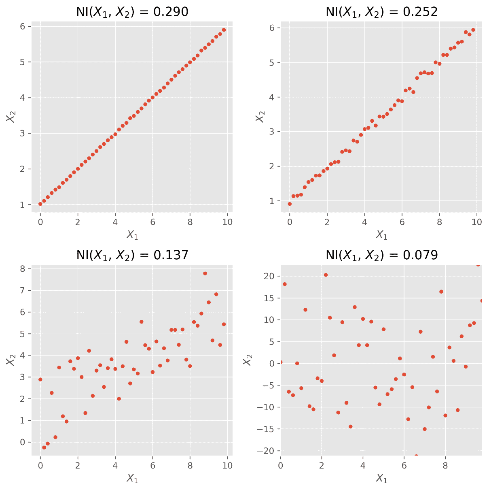
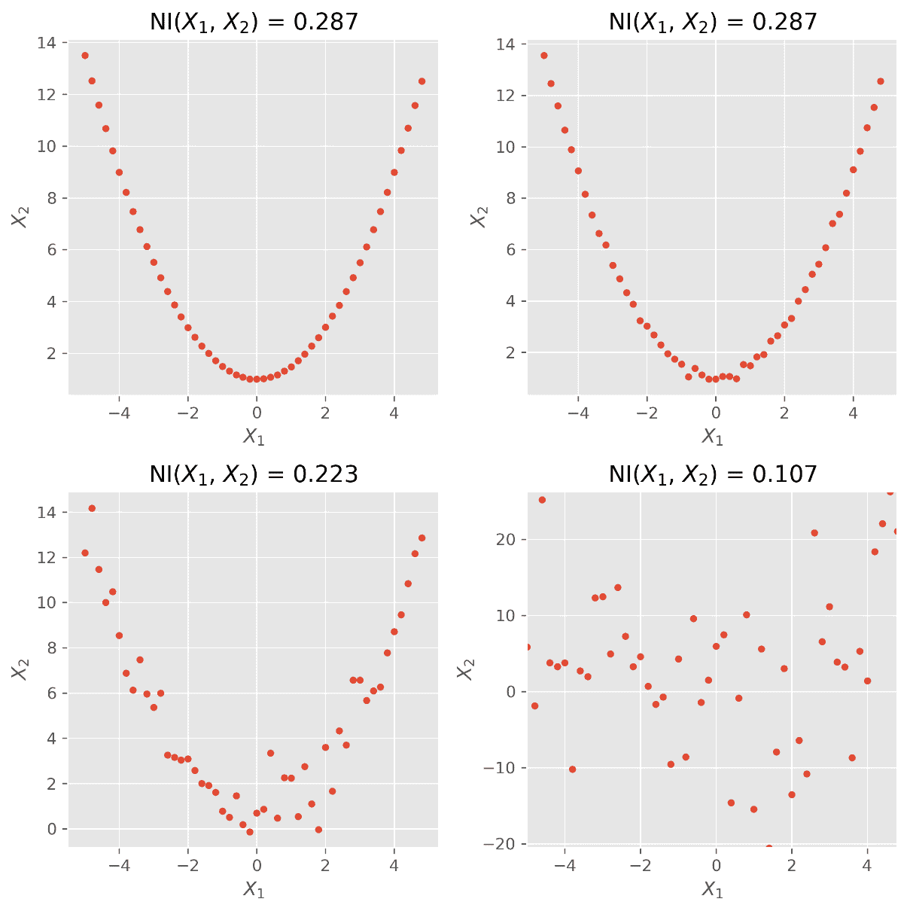
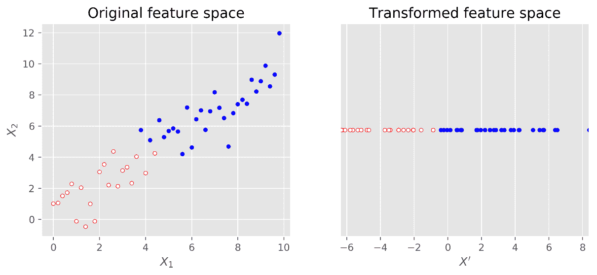
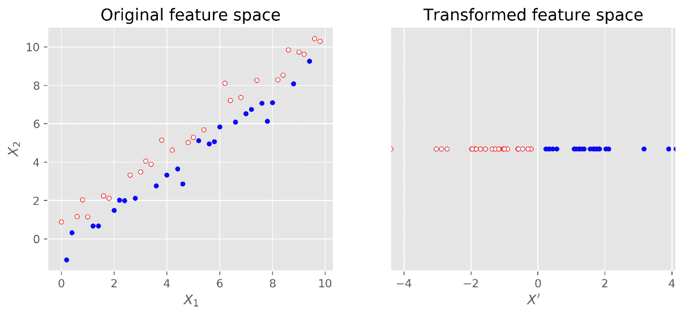
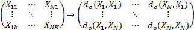
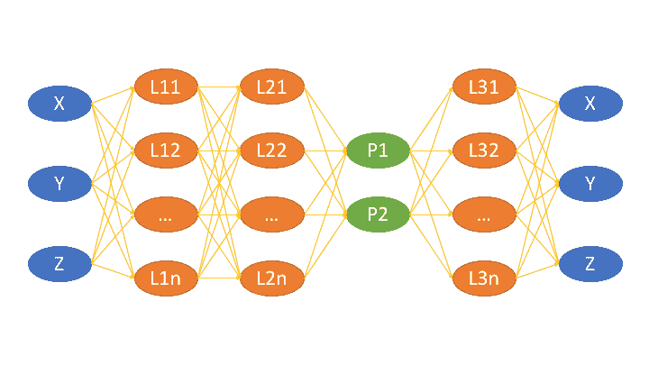

# 降维

垃圾输入，垃圾输出——在本书中，我们将在将机器学习方法应用于数据时看到这种模式。回顾过去，我们可以看到，最有趣的机器学习挑战总是涉及某种特征工程，我们试图利用对问题的洞察来精心设计模型有望获得的附加特征。

在这一章中，我们将朝着与降维相反的方向前进，去掉不相关或冗余的特征。删除特征起初可能看起来是反直觉的，因为更多的信息似乎总是比更少的信息更好。同样，即使我们的数据集中有冗余特征，学习算法难道不能快速计算出来并将其权重设置为`0`？事实上，有充分的理由尽可能缩小尺寸:

*   多余的特征会激怒或误导学习者。并非所有机器学习方法都是如此(例如，支持向量机喜欢高维空间)。然而，大多数模型感觉更安全，尺寸更小
*   反对高维特征空间的另一个观点是，更多的特征意味着更多的参数需要调整，并且过拟合的风险更高
*   我们为解决任务而检索的数据可能只是人为的高维，而真实的维度可能很小
*   更少的维度等于更快的训练等于更多的参数变化，在相同的时间范围内尝试等于更好的最终结果
*   缩小尺寸更有利于可视化。如果我们想要可视化数据，我们将被限制在二维或三维

在这一章中，我们将向您展示如何清除数据中的垃圾，同时保留其中真正有价值的部分。

# 绘制我们的路线图

降维可以大致分为特征选择和特征投影方法。到目前为止，当我们发明、分析、然后可能丢弃一些特征时，我们已经在几乎每一章中采用了某种特征选择。在本章中，我们将介绍一些使用统计方法的方法，即相关性和互信息，以便能够在广阔的特征空间中做到这一点。特征投影试图将原始特征空间转换为低维特征空间。当我们无法使用选择方法去除特征，但是我们仍然有太多的特征需要学习时，这尤其有用。我们将使用**主成分分析** ( **主成分分析**)、**线性判别分析** ( **LDA** )和**多维标度** ( **MDS** )来演示这一点。

# 选择功能

如果我们想对我们的机器学习算法好一点，我们会为它提供彼此不依赖的特性，但这些特性高度依赖于要预测的值。这意味着每个特征都添加了显著的信息。删除任何功能都会导致性能下降。

如果我们只有少数特征，我们可以绘制一个散点图矩阵(每个特征对组合一个散点图)。然后就可以很容易地发现特征之间的关系。对于每一个表现出明显依赖性的特征对，我们会考虑是否应该删除其中一个，或者更好地从两个特征中设计一个更新、更干净的特征。

然而，大多数时候，我们有很多功能可以选择。试想一下分类任务，我们有一袋单词来对答案的质量进行分类，这将需要 1,000 x 1,000 的散点图(使用 1000 个单词的词汇)。在这种情况下，我们需要一种更自动化的方法来检测重叠的特征并解决它们。我们将在下面的小节中介绍两种通用的方法。

# 使用过滤器检测冗余特征

过滤器试图独立于任何后来使用的机器学习方法来清理特征空间。他们依靠统计方法来找出哪些特征是多余的或不相关的。在冗余特征的情况下，过滤器只为每个冗余特征组保留一个。不相关的功能将被简单地删除。一般来说，过滤器的工作方式如下图所示:


首先，我们使用仅考虑训练数据的统计信息过滤掉冗余的特征。然后，我们检查剩余的特征在分类标签时是否有用。

# 相互关系

利用相关性，我们可以很容易地看到特征对之间的线性关系。在下图中，我们可以看到不同程度的相关性，以及绘制为虚线的潜在线性相关性(拟合的一维多项式)。借助于`scipy.stat`的`pearsonr()`函数，使用共同的皮尔逊相关系数(皮尔逊值)计算各个图顶部的相关系数 *Cor (X <sub>1</sub> ，X <sub> 2 </sub> )* 。

给定两个大小相等的数据序列，它返回相关系数值和 *p* 值的元组。 *p* 值描述了数据序列由不相关系统生成的可能性。换句话说， *p* 值越高，我们越不应该相信相关系数:

```py
>>> from scipy.stats import pearsonr
>>> pearsonr([1,2,3], [1,2,3.1])
(0.99962228516121843, 0.017498096813278487)
>>> pearsonr([1,2,3], [1,20,6])
(0.25383654128340477, 0.83661493668227427)
```

在第一种情况下，我们有一个明确的迹象表明，这两个系列是相关的。在第二种情况下，我们仍然有一个明显非零的值。

但是*p*-值`0.84`告诉我们相关系数不显著，不要太在意。在下图中具有高相关系数的前三种情况下，我们可能会想抛出*X*T5】1 或 *X* <sub xmlns:epub="http://www.idpf.org/2007/ops">2</sub> ，因为它们似乎传达了相似的信息，如果不是相同的话:


然而，在最后一种情况下，我们应该保留这两个特性。在我们的应用中，这个决定当然是由这个 *p* 值驱动的。

虽然它在前面的例子中表现得很好，但现实很少是好的。基于相关性的特征选择的一个很大的缺点是它只检测线性关系(可以用直线建模的关系)。如果我们在非线性数据上使用相关性，我们可以看到这个问题。在下面的例子中，我们有一个二次关系:


虽然人眼立即看到除了右下方的图之外的所有图中 *X* <sub>1</sub> 和 *X* <sub>2</sub> 之间的关系，但是相关系数没有。很明显，相关性对于检测线性关系是有用的，但是对于其他任何事情都是失败的。有时，应用简单的变换来获得线性关系确实很有帮助。例如，在前面的图中，如果我们画出 *X* <sub>2</sub> 而不是 *X* <sub>1</sub> 的平方，我们就会得到一个很高的相关系数。然而，正常数据很少提供这种机会。

幸运的是，对于非线性关系，相互信息有所帮助。

# 交互信息

在考虑特征选择时，我们不应该像上一节(线性关系)那样关注关系的类型。相反，考虑到
我们已经有了另一个功能，我们应该从一个功能提供多少信息来考虑。

为了理解这一点，让我们假设我们想要使用来自`house_size`、`number_of_levels`和`avg_rent_price`特征集的特征来训练输出房屋是否有电梯的分类器。在这个例子中，我们可以直观地看到，知道了`house_size`，我们就不需要再知道`number_of_levels`了，因为它不知何故包含了多余的信息。有了`avg_rent_price`，就不一样了，因为我们不能简单地从房子的大小或层数来推断出租空间的价值。因此，明智的做法是，除了租赁空间的平均价格之外，只保留其中一个。

互信息通过计算两个特征共有多少信息来形式化上述推理。然而，与相关性不同，它不依赖于数据的顺序，而是依赖于分布。为了理解它是如何工作的，我们必须深入研究信息熵。

让我们假设我们有一个公平的硬币。在我们翻转它之前，我们将对它是正面还是反面有最大的不确定性，因为每个结果都有 50%的相同概率。这种不确定性可以通过克劳德·香农的信息熵来衡量:


在我们的公平硬币案例中，我们有两种情况:让 *X <sub>0</sub>* 为正面的情况，让 *X <sub>1</sub>* 为带有的反面的情况。

因此，它的结论如下:


For convenience, we can also use `scipy.stats.entropy([0.5, 0.5], base=2)`. We set the base parameter to `2` to get the same result as earlier. Otherwise, the function will use the natural logarithm via `np.log()`. In general, the base does not matter (as long as you use it consistently).

现在，想象一下，我们事先知道硬币实际上并不公平，在翻转后，头部有 60%的机会出现:

*H(X) = -0.6 <sup>。日志<sub>2</sub>T4【0.6】-0.4<sup>。log <sub>2</sub></sup> (0.4)=0.97</sup>*

我们可以看到这种情况不太不确定。不确定性会随着我们远离`*0.5*`而降低，达到 *0* 的极值，无论是 *0* 百分比还是 *100* 百分比的头部出现概率，如下图所示:



我们现在将修改熵 **H(X)** ，将它应用于两个特征，而不是一个特征，这样当我们了解 *Y* 时，它可以测量从 *X* 中消除了多少不确定性。然后，我们可以了解一个特性如何减少另一个特性的不确定性。

例如，没有任何关于天气的进一步信息，我们完全不确定外面是否在下雨。如果我们现在知道外面的草是湿的，那么不确定性就降低了(我们仍然需要检查洒水器是否已经打开)。

更正式地说，相互信息的定义如下:



这看起来有点吓人，但实际上只不过是总和和乘积。例如，`p()`的计算可以通过对特征值进行宁滨运算，然后计算每个箱中值的分数来完成。在下面的图中，我们将箱的数量设置为十。

为了将互信息限制在`[0,1]`的区间内，我们必须将其除以它们相加的个体熵，这给了我们以下归一化互信息:



代码如下:

```py
def normalized_mutual_info(x, y, bins=10):
    counts_xy, bins_x, bins_y = np.histogram2d(x, y, bins=(bins, bins))
    counts_x, bins = np.histogram(x, bins=bins)
    counts_y, bins = np.histogram(y, bins=bins)

    counts_xy += 1 # add-one smoothing as we have
    counts_x += 1 # seen in the previous chapters
    counts_y += 1
    P_xy = counts_xy / np.sum(counts_xy)
    P_x = counts_x / np.sum(counts_x)
    P_y = counts_y / np.sum(counts_y)

    I_xy = np.sum(P_xy * np.log2(P_xy / (P_x.reshape(-1, 1) * P_y)))

    return I_xy / (entropy(counts_x) + entropy(counts_y))
```

相互信息的好处是，与相关性不同，它不仅仅关注线性关系，正如我们在下图中看到的:



正如我们所看到的，相互信息能够表明线性关系的强度。下图显示它也适用于平方关系:



因此，我们需要做的是计算所有特征对的归一化互信息。对于每一对过高的值(我们必须确定这意味着什么)，我们将丢弃其中一个。在回归的情况下，我们可以删除与期望结果值相互信息太少的特征。

这可能适用于少量的功能。然而，在某些时候，这个过程可能非常昂贵，因为计算量随着特征数量的增加而呈二次增长。

过滤器的另一个巨大缺点是，它们会丢弃在孤立情况下似乎没有用的功能。更多的时候，有一些特征看起来完全独立于目标变量，但是当它们结合在一起时，就会摇摆不定。为了保存这些，我们需要包装纸。

# 向模型询问使用包装器的特性

虽然过滤器可以极大地帮助摆脱无用的功能，但它们只能到此为止。在所有的过滤之后，可能仍然有一些特征在它们之间是独立的，并且显示出与结果变量的某种程度的依赖，但是从模型的角度来看，这些特征是完全无用的。试想以下描述`XOR`功能的数据。就个体而言，无论是 **A** 还是 **B** 都不会表现出任何依赖 **Y** 的迹象，而合在一起，它们显然会表现出:

| **A** | **B** | **Y** |
| `0` | `0` | `0` |
| `0` | `1` | `1` |
| `1` | `0` | `1` |
| `1` | `1` | `0` |

那么，为什么不要求模型本身对个体特征进行投票呢？这就是 scikit 包装器所做的，正如我们在下面的流程图中看到的:


在这里，我们将特征重要性的计算推到了模型训练过程中。不幸的是(但可以理解)，特征重要性不是以二进制来确定的，而是以排名值来确定的，所以我们仍然需要指定在哪里进行切割，我们愿意接受特征的哪一部分，以及我们想要放弃哪一部分。

回到 scikit-learn，我们在`sklearn.feature_selection`包中找到了各种优秀的包装类。这个领域真正的主力是`RFE`，代表递归特征消除。它需要一个估计器和所需数量的特征作为参数，然后用各种特征集训练估计器，只要它找到了足够小的特征子集。`RFE`实例本身假装是一个估计量，从而实际上包装了所提供的估计量。

在下面的例子中，我们将使用数据集方便的`make_classification()`函数创建一个 100 个样本的人工分类问题。它让我们指定创建 10 个特征，其中只有三个是真正有价值的，以解决分类问题:

```py
>>> from sklearn.feature_selection import RFE
>>> from sklearn.linear_model import LogisticRegression
>>> from sklearn.datasets import make_classification
>>> X,y = make_classification(n_samples=100, n_features=10, 
 n_informative=3, random_state=0)
>>> clf = LogisticRegression()
>>> selector = RFE(clf, n_features_to_select=3)
>>> selector = selector.fit(X, y)
>>> print(selector.support_)
[False False True False False False True True False False]
>>> print(selector.ranking_)
[5 4 1 2 6 7 1 1 8 3]
```

当然，现实场景中的问题是，我们如何知道`n_features_to_select`的正确值？事实是，我们不能。然而，大多数时候，我们可以使用数据样本，并使用不同的设置来玩它，以快速获得对正确棒球场的感觉。

好的一点是，我们不用那么精确地使用包装器。让我们尝试一下`n_features_to_select`的不同值，看看`support_`和`ranking_`是如何变化的:

| `**n_features_**``**to_select**` | `**support_**` | `**ranking_**` |
| one | `[False False False False False False False True False False]` | `[ 7 6 3 4 8 9 2 1 10 5]` |
| Two | `[False False False False False False True True False False]` | `[6 5 2 3 7 8 1 1 9 4]` |
| three | `[False False True False False False True True False False]` | `[5 4 1 2 6 7 1 1 8 3]` |
| four | `[False False True True False False True True False False]` | `[4 3 1 1 5 6 1 1 7 2]` |
| five | `[False False True True False False True True False True]` | `[3 2 1 1 4 5 1 1 6 1]` |
| six | `[False True True True False False True True False True]` | `[2 1 1 1 3 4 1 1 5 1]` |
| seven | `[ True True True True False False True True False True]` | `[1 1 1 1 2 3 1 1 4 1]` |
| eight | `[ True True True True True False True True False True]` | `[1 1 1 1 1 2 1 1 3 1]` |
| nine | `[ True True True True True True True True False True]` | `[1 1 1 1 1 1 1 1 2 1]` |
| Ten | `[ True True True True True True True True True True]` | `[1 1 1 1 1 1 1 1 1 1]` |

我们可以看到结果非常稳定。在请求较小特征集时使用的特征在允许更多特征进入时继续被选择。最后，当我们走错路时，我们依靠我们的火车/测试设备分裂来警告我们。

# 其他特征选择方法

阅读机器学习文献时，你会发现其他几种特征选择方法。有些甚至看起来不像是特征选择方法，因为它们嵌入在学习过程中(不要与前面提到的包装器混淆)。例如，决策树的核心深处有一个特征选择机制。其他学习方法采用某种惩罚模型复杂性的正则化，因此将学习过程推向仍然简单的良好表现的模型。他们通过将影响较小的特征的重要性降低到零，然后放弃它们(L1 正则化)来做到这一点。

通常，机器学习方法的力量在很大程度上要归功于它们植入的特征选择方法。

# 特征投影

在某个时候，在我们删除了多余的特征并丢弃了不相关的特征之后，我们仍然会经常发现我们有太多的特征。无论我们使用什么样的学习方法，它们都表现不佳，并且，考虑到巨大的特征空间，我们理解它们实际上不能做得更好。我们必须摆脱特征，即使常识告诉我们它们是有价值的。另一种需要降低特征维数的情况是，当我们想要可视化数据时，特征选择没有太大帮助。然后，我们需要在最后最多有三个维度来提供任何有意义的图形。

输入要素投影方法。他们重组特征空间，使其更容易被模型访问，或者简单地将维度减少到两到三个，这样我们就可以直观地显示依赖关系。

同样，我们可以区分特征投影方法是线性的还是非线性的。此外，正如之前在*选择特征*部分所看到的，我们将为每种类型提供一种方法(主成分分析作为多维标度的线性和非线性版本)。尽管它们广为人知并被广泛使用，但它们只是可用的更有趣和更强大的特征投影方法中的一部分。

# 主成分分析

**主成分分析** ( **PCA** )如果想减少特征数量，又不知道用哪种特征投影方法，往往是首先要尝试的。主成分分析是有限的，因为它是一种线性方法，但很有可能它已经走得足够远，让你的模型学得足够好。再加上它提供的强大的数学属性，它找到变换后的特征空间的速度，以及它后来能够在原始特征和变换后的特征之间进行变换的速度，我们几乎可以保证它也将成为您经常使用的机器学习工具之一。

总而言之，给定原始特征空间，PCA 在具有以下属性的低维空间中找到其自身的线性投影:

*   保守方差被最大化
*   最终的重建误差(当试图从变换后的特征返回到原始特征时)被最小化

由于主成分分析只是对输入数据进行转换，因此它可以应用于分类和回归问题。在本节中，我们将使用分类任务来讨论该方法。

# 绘制主成分分析

主成分分析涉及很多线性代数，我们不想深入讨论。然而，基本算法的过程可以很容易地描述如下:

1.  通过减去平均值使数据居中
2.  计算协方差矩阵
3.  计算协方差矩阵的特征向量

如果我们从 *N* 个特征开始，那么算法将返回一个具有 *N* 个维度的变换特征空间(到目前为止我们什么都没有得到)。然而，这个算法的好处是，特征值表明有多少方差是由相应的特征向量描述的。

让我们假设我们从 *N = 1000 个*特征开始，并且我们知道我们的模型在多于 *20 个*特征的情况下不能很好地工作。然后，我们简单地选择具有最高特征值的 *20* 特征向量。

# 应用主成分分析

让我们考虑下面的人工数据集，它在下面的左图中可视化:

```py
>>> x1 = np.arange(0, 10, .2)
>>> x2 = x1+np.random.normal(loc=0, scale=1, size=len(x1))
>>> X = np.c_[(x1, x2)]
>>> good = (x1>5) | (x2>5) # some arbitrary classes
>>> bad = ~good  
```



Scikit-learn 在其`decomposition`包中提供了`PCA`类。在这个例子中，我们可以清楚地看到，一个维度应该足以描述数据。我们可以使用`n_components`参数来指定:

```py
>>> from sklearn import linear_model, decomposition, datasets
>>> pca = decomposition.PCA(n_components=1)  
```

同样，在这里，我们可以使用`pca`(或其`fit_transform()`组合)的`fit()`和`transform()`方法来分析数据，并将其投影到变换后的特征空间中:

```py
>>> Xtrans = pca.fit_transform(X)  
```

正如我们所指定的，`Xtrans`只包含一个维度。您可以在前面的右手图中看到结果。在这种情况下，结果甚至是线性可分的。我们甚至不需要复杂的分类器来区分这两个类。

为了理解重建误差，我们可以看看我们在转换中保留的数据的方差:

```py
>>> print(pca.explained_variance_ratio_)
>>> [ 0.96393127]  
```

这意味着，从两个维度到一个维度后，我们仍然剩下 96%的方差。

当然，事情并不总是这么简单。通常情况下，我们不知道预先建议多少维度。在这种情况下，我们在初始化`PCA`时不指定`n_components`参数，让它计算完整的变换。拟合数据后，`explained_variance_ratio_`包含一组递减顺序的比值:第一个值是描述最高方差方向的基向量的比值，第二个值是第二个最高方差方向的比值，依此类推。在绘制完这个数组后，我们很快就能感觉到我们需要多少个组件:图表肘部之前的组件数量通常是一个很好的猜测。

Plots displaying the explained variance over the number of components are called scree plots. A nice example of combining a scree plot with a grid search to find the best setting for the classification problem can be found at [http://scikit-learn.org/stable/auto_examples/plot_digits_pipe.html](http://scikit-learn.org/stable/auto_examples/plot_digits_pipe.html).

# 主成分分析的局限性和线性判别分析的帮助

作为一种线性方法，当我们面对具有非线性关系的数据时，主成分分析当然有其局限性。我们在这里不做详细介绍，但是可以说 PCA 有一些扩展，例如内核 PCA，引入了非线性变换，这样我们仍然可以使用 PCA 方法。

主成分分析的另一个有趣的缺点是当它被应用于特殊的分类问题时。如果我们把 *good = (x1 > 5) | (x2 > 5)* 换成 *good = x1 > x2* 来模拟这样的特殊情况，就可以很快看出问题，如下图所示:


这里，类不是按照方差最高的轴分布，而是按照方差第二高的轴分布。显然，主成分分析完全失败了。由于我们没有向 PCA 提供任何关于类别标签的提示，所以它不能做得更好。

**线性判别分析** ( **LDA** )来到这里救援。这是一种试图最大化属于不同类的点的距离，同时最小化同一类的点的距离的方法。我们不会给出关于底层理论如何工作的更多细节，只是简单介绍一下如何使用它，如下面的代码所示:

```py
>>> from sklearn import lda
>>> lda_inst = lda.LDA(n_components=1)
>>> Xtrans = lda_inst.fit_transform(X, good)  
```

仅此而已。请注意，与前面的主成分分析示例相反，我们为`fit_transform()`方法提供了类标签。因此，主成分分析是一种无监督的特征投影方法，而线性判别分析是一种有监督的方法。结果如预期:



那么，为什么要考虑 PCA 呢？为什么不干脆用 LDA？没那么简单。随着类别数量的增加和每个类别样本的减少，LDA 看起来不再那么好了。此外，主成分分析似乎不像线性判别分析那样对不同的训练集敏感。所以，当我们不得不建议使用哪种方法时，我们只能说这取决于情况。

# 多维标度

主成分分析试图对保留的方差进行优化，而**多维缩放** ( **MDS** )则试图在减少维度时尽可能保留相对距离。当我们拥有高维数据集并希望获得视觉印象时，这非常有用。

MDS 不在乎数据点本身；相反，它对数据点对之间的差异感兴趣，并将其解释为距离。它获取维度 *k* 的所有 *N* 数据点，并使用距离函数 *d <sub>0</sub>* 计算距离矩阵，该距离函数测量原始特征空间中的(大部分时间，欧几里德)距离:



现在，MDS 试图将各个数据点定位在较低的维度上，这样那里的新距离就尽可能地类似于原始空间中的距离。由于 MDS 经常被用于可视化，低维度的选择在大多数情况下是两个或三个。

让我们来看看下面由五维空间中的三个数据点组成的简单数据。其中两个数据点在附近，一个非常明显，我们希望在三维和二维中看到这一点:

```py
>>> X = np.c_[np.ones(5), 2 * np.ones(5), 10 * np.ones(5)].T
>>> print(X)
[[ 1\. 1\. 1\. 1\. 1.]
 [ 2\. 2\. 2\. 2\. 2.]
 [ 10\. 10\. 10\. 10\. 10.]]
```

使用 scikit-learn 的`manifold`包中的`MDS`类，我们首先指定要将`X`转换为三维欧氏空间:

```py
>>> from sklearn import manifold
>>> mds = manifold.MDS(n_components=3)
>>> Xtrans = mds.fit_transform(X) 
```

为了在两个维度上可视化它，我们需要相应地设置`n_components`。

结果可以在下面两张图表中看到。三角形和圆形靠得很近，而星星离得很远:


让我们来看看稍微复杂一点的 Iris 数据集。我们后面会用它来对比 LDA 和 PCA。Iris 数据集包含每朵花的四个属性。使用前面的代码，我们将它投影到三维空间，同时尽可能保持单个花之间的相对距离。在前面的例子中，我们没有指定任何度量，所以`MDS`将默认为欧几里德。这意味着根据四种属性不同的花在 MDS 尺度的三维空间中也应该很远，相似的花现在应该几乎在一起，如下图所示:


相反，用主成分分析将维度减少到三维和二维，我们看到属于同一类别的花的预期更大的传播:


当然，使用 MDS 需要了解单个特征的单位；也许我们使用的特征无法用欧几里得度量来比较。例如，一个分类变量，即使被编码为整数(0 =圆，
1 =星，2 =三角形，等等)，也不能用欧几里德度量来比较(一个圆是否更接近于星而不是三角形？).

然而，一旦我们意识到这个问题，MDS 是一个有用的工具，它揭示了我们的数据中的相似性，否则在原始特征空间中很难看到这些相似性。

深入观察 MDS，我们意识到它不是一个单一的算法，而是一系列不同的算法，我们只使用了其中的一个。PCA 也是如此。另外，如果你意识到 PCA 和 MDS 都不能解决你的问题，只要看看 scikit-learn 工具包中的许多其他学习和嵌入算法就可以了。

然而，在你被许多不同的算法淹没之前，最好从最简单的算法开始，看看你能走多远。然后，采取下一个更复杂的，并继续从那里。

# 用于降维的自动编码器或神经网络

十几年前，神经网络降维的主要工具是科霍宁地图，或**自组织地图** ( **SOM** )。它们是神经网络，可以将数据映射到离散的嵌入 1D 的空间中。从那时起，有了更快的计算机，现在有可能使用深度学习来创建嵌入式空间。

诀窍是有一个比输入层节点少的中间层和一个必须再现输入层的输出层。这个中间层上的数据会给出嵌入空间中的坐标。

如果我们使用没有特定激活函数的规则密集层，我们得到从输入到嵌入层到输出层的线性函数。不止一层到嵌入层不会改变训练的结果，因此，我们得到线性嵌入，例如 PCA(没有在嵌入层中具有正交基的约束)。

给稠密层增加一个非线性激活函数将使得能够在数据中找到**流形**，而不仅仅是超平面。与 Isomap 等工具试图匹配数据之间的距离(这是 MDS 的变体，试图匹配近似测地线距离而不是欧几里德距离)或拉普拉斯特征映射(试图匹配数据之间的相似性)相反，自动编码器不知道我们试图保留什么——它们只会试图再现我们在输入端提供的任何东西。

Neural networks can extract features from data, as we will see in the TensorFlow chapter, but we will keep things simple here by using a dataset that is features-only.

我们将考虑的数据集是瑞士卷。它是流形中使用的最著名的数据集之一，因为它是一个非线性数据集，人眼很容易理解，但这种包装足以使算法很难正确描述它:

```py
import numpy as np
max = 4
def generate_swissroll(n):
    """
    Generates data for the swissroll
    Returns the parameter space, the swissroll
    """
    orig = np.random.random((2, n)) * max
    return (orig.T, np.array((orig[1] * np.cos(orig[1]),
                              orig[1] * np.sin(orig[1]), 
                              orig[0])).T)

def color_from_parameters(params):
    """
    Defines a color scheme for the swissroll
    """
    return np.array((params[:,0], params[:,1], max - params[:,1])).T / max
```

从这些函数中，我们可以生成新数据以及一个颜色代码，该代码允许我们检查嵌入的数据是否与我们使用的原始参数匹配，如下图所示:


现在是时候考虑我们将使用的架构了。我们将从输入层开始，输入层将使用两个层在网络内部馈送数据，这两个层将完成将输入数据展开到具有两个层的嵌入层的繁重工作。为了重建瑞士卷，我们将在三单元输出层结束之前使用另一个密集层。为了创建非线性，每个层(输入除外)将使用`leaky_relu`激活。安排如下图所示:



让我们创建脚手架:

```py
import tensorflow as tf

def tf_create_variables():
    swissroll_tf = tf.placeholder(tf.float32, (None, 3), name="swissroll")
    return swissroll_tf

def tf_create_dense_layer(x, size):
    return tf.layers.dense(x, size, activation=tf.nn.leaky_relu,         
       kernel_initializer=tf.contrib.layers.xavier_initializer())
```

这一次，自动编码器将被封装在一个类中。构造器将创建变量，`train`方法将运行优化，并创建一些显示图像。

当我们构建层时，我们保存嵌入层变量，因为这个变量是我们想要用来获取嵌入空间中新样本的参数的变量:

```py
class Autoencoder(object):
    def __init__(self, swissroll, swissroll_test, nb_intermediate, 
                 learning_rate):
        self.swissroll = swissroll
        self.swissroll_test = swissroll_test

        self.swissroll_tf = tf_create_variables()

        intermediate_input = tf_create_dense_layer(self.swissroll_tf, 
                                                   nb_intermediate)
        intermediate_input = tf_create_dense_layer(intermediate_input, 
                                                   nb_intermediate)
        self.encoded = tf_create_dense_layer(intermediate_input, 2)
        intermediate_output = tf_create_dense_layer(self.encoded, 
                                                    nb_intermediate)
        self.output = tf_create_dense_layer(intermediate_output, 3)

        self.meansq = tf.reduce_mean(tf.squared_difference(
                                    self.output, self.swissroll_tf))
        self.train_step = tf.train
                            .GradientDescentOptimizer(learning_rate)
                            .minimize(self.meansq)

    def train(self, display, n_epochs, batch_size, **kwargs):
        n = len(self.swissroll)

        with tf.Session() as sess:
            sess.run(tf.global_variables_initializer())

            for i in range(n_epochs):
                permut = np.random.permutation(n)
                for j in range(0, n, batch_size):
                    samples = permut[j:j+batch_size]
                    batch = self.swissroll[samples]
                    sess.run(self.train_step, 
                             feed_dict={self.swissroll_tf: batch})

                if i % step == step - 1:
                    print("Epoch :%i\n Loss %f" %\
                          (i, sess.run(self.meansq, 
                          feed_dict={self.swissroll_tf: self.swissroll})))

            error = sess.run(self.meansq, 
                         feed_dict={self.swissroll_tf: self.swissroll})
            error_test = sess.run(self.meansq, 
                         feed_dict={self.swissroll_tf: self.swissroll_test})

            if display:
                pred = sess.run(self.encoded, 
                         feed_dict={self.swissroll_tf : self.swissroll})
                pred = np.asarray(pred)
                recons = sess.run(self.output, 
                         feed_dict={self.swissroll_tf : self.swissroll})
                recons = np.asarray(recons)
                recons_test = sess.run(self.output, 
                         feed_dict={self.swissroll_tf : self.swissroll_test})
                recons_test = np.asarray(recons_test)

                print("Embedded manifold")
                plot_2d(pred, colors)
                save_png("swissroll_embedded")
                plt.show()
                print("Reconstructed manifold")
                plot_3d(recons, colors)
                save_png("swissroll_reconstructed")
                plt.show()
                print("Reconstructed test manifold")
                plot_3d(recons_test, kwargs['colors_test'])
                save_png("swissroll_test")
                plt.show()
        return error, error_test
```

我们可以运行这个自动编码器，并检查它是否也适用于新数据:

```py
n = 5000
n_epochs = 2000
batch_size = 100
nb_intermediate = 20
learning_rate = 0.05
step = 100
params, swissroll = generate_swissroll(n)
params_test, swissroll_test = generate_swissroll(n)
colors = color_from_parameters(params)
colors_test = color_from_parameters(params_test)

model = Autoencoder(swissroll, swissroll_test, 
                    nb_intermediate, learning_rate)

error, error_test = model.train(True, n_epochs, batch_size, 
                                colors=colors, test=swissroll_test, 
                                colors_test = colors_test)
…
Epoch :1599
  Loss 0.001498
Epoch :1699
  Loss 0.001008
Epoch :1799
  Loss 0.000870
Epoch :1899
  Loss 0.000952
Epoch :1999
  Loss 0.000830
```

训练数据的嵌入空间很好，并且尊重我们用来生成`swissroll`的配色方案。我们可以在下图中看到它的表示:


这里有趣的一点是，参数空间并不直接链接到我们用来创建数据的参数。幅度不同，每次新跑都会得到一个新的嵌入空间。我们可以在均方成本函数中添加正则化，就像我们在回归一章中所做的那样。

关键一点是检查输出数据是否与输入数据匹配。我们看到损失很低。测试数据还显示重建误差较低，但目视检查有时是一件好事。下图显示了图形表示:


我们可以看到，与最初的瑞士卷相比，有一些颠簸和不连续。在重建过程中添加第二层将有助于减少这种情况；我们在这里这样做不是为了表明我们不必为自动编码器使用对称神经网络。

# 摘要

在本章中，您了解到，有时，您可以使用特征选择方法来删除完整的特征。我们还看到，在某些情况下，这是不够的，我们必须采用特征投影方法来揭示我们数据中的真实和低维结构，希望模型使用起来更容易。

当然，我们只是触及了大量可用降维方法的表面。尽管如此，我们希望我们能让你对这整个领域感兴趣，因为还有很多其他方法等着你去发现。归根结底，特征选择和投影是一门艺术，就像选择正确的学习方法或训练模型一样。

在[第 6 章](06.html)、*聚类–寻找相关帖子*中，我们将介绍聚类，这是一种无监督的学习技术。我们将使用它来查找给定文本的类似新闻帖子。