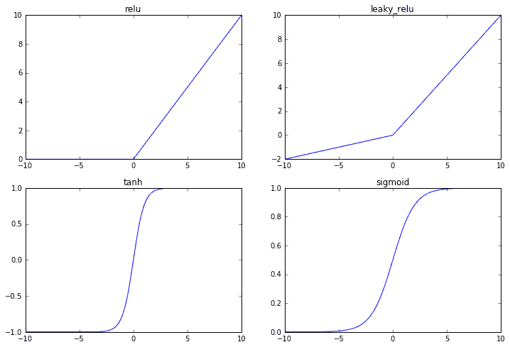
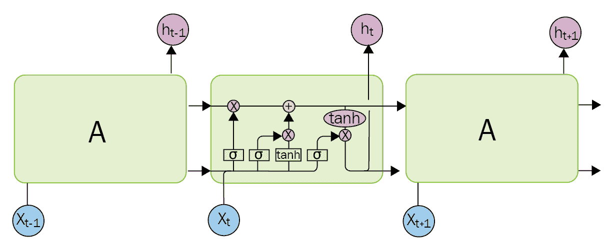

# 八、人工神经网络与深度学习

神经网络正在引领当前的机器学习趋势。无论是 Tensorflow、Keras、CNTK、PyTorch、Caffee 还是其他任何包，它们目前都取得了其他算法很少取得的成果，尤其是在图像处理等领域。随着快速计算机和大数据的出现，20 世纪 70 年代设计的神经网络算法现在可以使用了。即使在十年前，最大的问题是你需要大量的训练数据，而这些数据是不可用的，同时，即使你有足够的数据，训练模型所需的时间也太多了。这个问题现在差不多解决了。

这些年的主要改进是神经网络架构。用于更新神经网络的反向传播算法与以前大致相同，但是结构已经有了许多改进，例如卷积层而不是密集层，或者，**长短期记忆** ( **LSTM** )用于规则递归层。

下面是我们将遵循的计划:首先深入了解 TensorFlow 及其 API，然后我们将它应用于卷积神经网络进行图像处理，最后我们将处理递归神经网络(特别是被称为 LSTM 的味道)进行图像处理和文本处理。

谈论机器学习速度主要是关于神经网络速度。为什么呢？因为神经网络基本上是矩阵乘法和并行数学函数——图形处理器非常擅长的模块。

# 使用张量流

我们已经看到了一些使用 TensorFlow 的例子，现在是时候更多地了解它是如何工作的了。

首先，这个名字来源于这样一个事实，即张量流使用张量(二维以上的矩阵)进行所有计算。所有函数都作用于这些对象，返回张量或行为类似张量的运算，并为所有对象定义新的名称。名字的第二部分来自张量之间数据流动的基础图。

神经网络的灵感来自于大脑的工作方式，但它并不像神经网络使用的模型那样工作。是的，每个神经元都与许多其他神经元相连，但输出不是输入乘以转换矩阵加上激活函数内部反馈的偏置的乘积。此外，神经网络具有层次(深度学习指的是具有多个所谓的隐藏层的神经网络，意味着既没有输入也没有输出)，其体系结构具有严格的进展。大脑在各处都有联系并持续进化，而神经网络对于给定的输入和给定的时刻总是有稳定的输出(直到我们得到一个新的节拍，正如我们将在循环网络中看到的)。

现在让我们深入了解一下 TensorFlow 图形应用编程接口。

# TensorFlow API

最好的开始方式是看一下编程环境:


我们显然对 Python 堆栈感兴趣，我们将主要关注层和度量。数据集很有趣，但其中许多来自外部贡献，有些是针对移除的。scikit learn API 被认为是更面向未来的，所以我们就不看了。

估计器是更高层次的 API，但是它们没有 scikit 学习到的那样发达。当我们开发新的网络时，能够调试它们并检查它们肠道内的信息在中间的应用编程接口中比在顶部的应用编程接口中更容易，尽管所有张量都有名字的事实使得在估计器应用编程接口之外获得这些信息成为可能。

很多在线教程仍然直接使用较低的 API，我们在我们的回归示例中通过直接调用`tf.matmult`来使用它。我们认为使用中级或高级应用编程接口比其他应用编程接口更好，即使它们有时看起来更灵活，更接近您认为的需求。

# 图形

正如我们从张量流的定义中看到的，图是张量流的核心。默认图包含对象(占位符、变量或常量)之间的结构以及这些对象的类型(变量例如是可训练变量，所有可训练变量都可以通过调用`tf.trainable_variables()`来检索)。

可以通过使用`with`构造来更改默认图形:

```py
g = tf.Graph()
with g.as_default(): 
    c = tf.constant("Node in g") 
```

因此，每次我们调用 TensorFlow 函数时，我们都会向默认图中添加节点(无论我们是否在一个块中)。一张图表本身没有任何作用。当我们创建新图层、使用度量或创建占位符时，实际上不会执行任何操作。我们唯一要做的就是在图上添加节点。

一旦我们有了一个有趣的图，我们需要在所谓的会话中执行。这是 TensorFlow 实际执行代码的唯一地方，也是可以从图中检索值的唯一地方。

Just as for the graph, variables, placeholders, and so on will be put on the best possible device. This device will be the CPU for all platforms, at the time of writing, that's Linux for HIP-capable AMD GPUs or nVidia GPU for Linux and Windows.

可以使用以下命令将它们固定在特定设备上:

```py
with tf.device("/device:CPU:0"): 
```

图形的不同部分使用相同的名称有时很有趣。为了实现这一点，我们可以使用`name_scope`为名称加上路径前缀。当然，它们可以递归使用:

```py
var = tf.constant([0, 1, 2, 3])
with tf.name_scope("section"):
    mean = tf.reduce_mean(var)
```

# 会议

是时候多学一点关于会话的知识了。正如我们前面看到的，TensorFlow 只执行会话中的操作。

会话最简单的用法如下:

```py
with tf.Session() as sess:
    sess.run(tf.global_variables_initializer())
    sess.run([mean], feed_dict={})
```

这将通过在会话中调用变量的初始值来初始化变量。在神经网络中，我们不能让所有变量都以零值开始，尤其是不同层中的权重(有些，如偏差，可以初始化为 0)。初始值设定项是最重要的，要么直接为显式变量设置，要么在调用中级函数时是隐式的(参见 TensorFlow 中可用的不同初始值设定项，并在我们所有的示例中使用它们)。

TensorFlow 还使用一种外部方式来获取报告，称为摘要。它们生活在`tf.summary`模块中，可以跟踪张量，并对它们进行预处理:

```py
tf.summary.histogram(var)
tf.summary.scalar('mean', tf.reduce_mean(var))
```

然后，所有这些摘要报告都可以在会话运行期间写入和检索，并由一个特殊对象保存:

```py
merged = tf.summary.merge_all()
writer = tf.summary.FileWriter(path/to/log-directory)
with tf.Session() as sess:
    summary, _ = sess.run([merged, train_step], feed_dict={})
    writer.add_summary(summary, i)
```

Tensorboard is a tool provided with TensorFlow that allows us to display these summaries. It can be launched with `tensorboard --logdir=path/to/log-directory`.

如果我们不想直接使用会话，可以使用**估计器**类。

从一个估计量，我们可以调用它的方法训练，它把一个数据生成器和我们想要运行的步骤数作为一个参数。例如，这可能是:

```py
def input_fn():
    features = {'SepalLength': np.array([6.4, 5.0]),
        'SepalWidth': np.array([2.8, 2.3]),
        'PetalLength': np.array([5.6, 3.3]),
        'PetalWidth': np.array([2.2, 1.0])}
    labels = np.array([2, 1])
    return features, labels
estimator.train(input_fn=input_fn , steps=STEPS)
```

同样，我们可以使用 test 从模型中获得结果:

```py
estimator.test(input_fn=input_train)
```

如果你想使用比张量流已经提供的简单估算器更多的东西，我们建议遵循张量流网站上的教程:[https://www.tensorflow.org/get_started/custom_estimators](https://www.tensorflow.org/get_started/custom_estimators)。

# 有用的操作

在所有之前的张量流模型中，我们遇到了在张量流中创建层的函数。有几层或多或少是不可避免的。

第一个是`tf.dense`，将所有输入连接到一个新的图层。我们在自动编码器示例中看到了它们，它们将张量(变量，占位符...)然后`units`输出单位的数量。默认情况下，它也有偏差，这意味着图层计算`inputs * weights + bias`。

我们后面会看到的另一个重要的层是`conv2d`。它计算图像上的卷积，这一次需要`filters`来指示输出图层中的节点数量。这就是卷积神经网络的定义。以下是卷积的常用公式:


The standard name for the tensor of coefficients in the convolution is called a kernel.

让我们看看其他几层:

*   `dropout`会在训练阶段随机放一些权重到零。这在复杂的深度学习网络中非常重要，以防止它过度拟合。我们稍后还会看到。
*   `max_pooling2d`是卷积层非常重要的补充。它选择二维形状上输入的最大值。还有一个一维版本，在密集层之后工作。

所有层都有一个`activation`参数。这种激活将线性运算转化为非线性运算。让我们看看`tf.nn`模块中最有用的:



正如我们之前看到的，scikit learn 提供了许多计算精度、曲线等的指标。TensorFlow 在`tf.metrics`模块中提供了类似的操作。

# 保存和恢复神经网络

有两种方法可以存储训练好的神经网络以备将来使用，然后恢复它。我们将在卷积神经网络的例子中看到它们实现了这一点。

第一个住在`tf.train`。它是用以下语句创建的:

```py
saver = tf.train.Saver(max_to_keep=10)
```

然后每个训练步骤都可以保存为:

```py
saver.save(sess, './classifier', global_step=step)
```

这里保存了完整的图形，但可能只保存了其中的一部分。我们在这里保存所有内容，并且只保留最后 10 次保存，并且我们用我们所在的步骤来后缀保存的名称。

假设我们用`saver.save(sess, './classifier-final')`保存了最后的训练步骤。我们知道，我们首先必须恢复图形状态:

```py
new_saver = tf.train.import_meta_graph("classifier-final.meta")
```

这没有恢复变量状态，为此我们不得不调用:

```py
new_saver.restore(sess, tf.train.latest_checkpoint('./'))
```

Be aware that only the graph is restored. If you have Python variables pointing to nodes in this graph, you need to restore them before you can use them. This is true for placeholders and operations.

我们还必须恢复一些变量:

```py
graph = tf.get_default_graph()
training_tf = graph.get_tensor_by_name('is_training:0')
```

这也是对所有张量(占位符、运算等)使用专有名称的一个很好的理由，因为我们需要在恢复图形时使用它们的名称来再次获得对它们的引用。

另一种机制建立在这种机制的基础上，功能更强大，但我们将展示模仿简单机制的基本用法。我们首先创建通常被称为`builder`的东西:

```py
builder = tf.saved_model.builder.SavedModelBuilder(export_dir)
```

The `export_dir` folder is created by the builder here. If it already exists, you have to remove it before creating a new saved model.

现在训练结束后，我们可以称之为拯救网络的状态:

```py
builder.add_meta_graph_and_variables(sess, [tf.saved_model.tag_constants.TRAINING])
```

显然，我们可以在这个对象中保存多个网络，具有更多的属性，但是，在我们的例子中，我们只需要调用一个函数来恢复状态:

```py
tf.saved_model.loader.load(sess, [tf.saved_model.tag_constants.TRAINING], export_dir)
```

# 训练神经网络

我们没怎么讨论过训练神经网络。基本上所有的优化都是梯度下降，问题是我们要用什么步长，要不要考虑之前的梯度？

当计算一个梯度时，还有一个问题，我们是只对一个新样本这样做，还是同时对多个样本(批次)这样做。基本上，我们几乎从不一次只输入一个样本(随着批次大小的变化，所有占位符都有一个设置为`None`的第一维，表示它将是动态的)。

这也要求创建一个特殊的层`batch_normalization`，它可以缩放梯度(向上或向下，这样层可以以有意义的方式更新，因此批量大小在这里很重要)，并且在一些网络架构中，它将是强制性的。这一层还有两个学习参数，即均值和标准差。如果它们不重要，可以实现一个更简单的批处理标准化层，并将在[第 12 章](12.html)、*计算机视觉*中的示例中使用。

我们之前用的优化器是`GradientDescentOptimizer`。这是一个简单的梯度下降与固定的步骤。这是非常脆弱的，因为步长严重依赖于数据集和我们使用的模型。

另一个非常重要的是`AdamOptimizer`。它是目前最有效的优化器之一，因为它基于前一个缩放新的梯度(试图模仿成本函数减少的牛顿方法的 hessian 缩放)。

另一个值得一提的是`RMSPropOptimizer`。这里，额外的技巧是动量。动量表示新渐变在新渐变之上使用了先前渐变的一部分。

The size of the gradient step, or learning rate, is crucial. The selection of an adequate for it often requires some know-how. The rate must be small enough so that the optimizations makes the network better, but big enough to have efficient first iterations. The improvement of the training is supposed to be fast for the first iterations and then improve slowly (it is globally fitting an often requires some know-how. The rate must be small enough so that the optimizations makes the network better, but big enough to have efficient first iterations. The improvement of the training is supposed to be fast for the first iterations and then improve slowly (it is globally fitting an *e<sup>-t</sup>* curve).
To avoid over-generalization, it is sometimes advised to stop optimization early (called early stopping), when the improvements are slow. In this context, using collaborative filtering can also achieve better results.
Additional information can be found at [http://ruder.io/optimizing-gradient-descent/](http://ruder.io/optimizing-gradient-descent/).

# 卷积神经网络

不到十年前，神经网络在图像处理方面还不是最好的。除了数据和中央处理器的能力，原因是研究人员使用了密集的层。当堆叠几个层和连接几千个像素到一千个隐藏单元的密集层时，我们最终得到了一个非凸成本函数来优化，该函数有数百万个参数。

因此，维度的诅咒是一个非常大的问题，即使是最大的数据库也可能不够。但是让我们回到引言。机器学习不仅仅是训练一个模型，它也是关于特征处理的。在图像处理中，人们使用许多不同的工具来从图像中提取特征，但是所有这些预处理工作流的一个常见工具是过滤。

现在，让我们回到神经网络。如果我们能把这些过滤器植入神经网络呢？那么问题就是要知道哪些过滤器是最好的。这就是卷积网络的用武之地:卷积层创建特征，然后密集层完成它们的工作(分类、回归等等)。

不像密集层那样有数百万个系数，我们创建一个输出像素的图像，每个像素有固定数量的单位。然后，这些单元中的每一个都有固定数量的权重，并且它们对于输出图像中的所有像素都是相同的。当我们在输出图像中从一个像素移动到另一个像素时，我们也在输入图像中以相同的方式移动连接(可能是一个步幅):


所以一个 conv2d 图层的权重有一个维度`[kernel_size_1, kernel_size_2, filters]`维度的核，如果考虑权重的数量，这个核是非常小的！这远远少于一千个数字，而不是超过一百万个。这是可以训练的，甚至可以通过查看这些权重来查看哪些特征与我们提出的问题相关。我们应该能够看到像梯度滤波器、索贝尔滤波器或者看曲线的滤波器这样简单的东西。

既然我们有了所有这些零件，我们就可以把它们放在一起了。我们将再次尝试使用手数字数据集，并将这些图像分为 10 类(每个数字一类)。我们还将保存训练好的模型，并用前面看到的两种方法进行恢复。

让我们从一些简单的导入和一些超参数开始:

```py
import tensorflow as tf
import numpy as np
from sklearn.model_selection import train_test_split
n_epochs = 10
learning_rate = 0.0002
batch_size = 128
export_dir = "data/classifier-mnist"
image_shape = [28,28,1]
step = 1000
dim_W3 = 1024
dim_W2 = 128
dim_W1 = 64
dropout_rate = 0.1
```

我们将训练神经网络 10 个时期(因此我们将通过完整的训练数据集`10`次)，我们将使用`0.0002`的学习率，`128`的批次大小(因此我们将一次用`128`图像训练模型)，然后我们将使用`64`卷积滤波器，然后是`128`滤波器，最后是最后一层中的`1024`节点，在最后 10 个节点之前，这将给出我们的分类结果。最后，1，024 节点层还将有一个速率为`0.1`的丢弃部分，这意味着在训练期间，我们将始终在该层任意将 102 节点输出设置为 0:

```py
from sklearn.datasets import fetch_mldata
mnist = fetch_mldata('MNIST original')
mnist.data.shape = (-1, 28, 28)
mnist.data = mnist.data.astype(np.float32).reshape( [-1, 28, 28, 1]) / 255.
mnist.num_examples = len(mnist.data)
mnist.labels = mnist.target.astype(np.int64)
X_train, X_test, y_train, y_test = train_test_split(mnist.data, mnist.labels, test_size=(1\. / 7.))
```

我们现在获得数据，重塑它，改变它的类型，并保留 60，000 张图像用于培训，10，000 张图像用于测试。标签将为`int64`，因为这是我们将用于自定义检查功能的标签。我们不需要在一个热数组中转换标签，因为张量流已经有了一个处理这个问题的函数。无需添加超出要求的处理！

Why a four-dimension matrix? The first dimension, `-1`, is our batch size, and it will be dynamic. The second two dimensions are for the width and height of our image. The final one is the number of input channels, here just `1`.

让我们创建我们的卷积神经网络类:

```py
class CNN():
    def __init__(
            self,
            image_shape=(28,28,1)
            dim_W3=1024,
            dim_W2=128,
            dim_W1=64,
            classes=10
            ):

        self.image_shape = image_shape

        self.dim_W3 = dim_W3
        self.dim_W2 = dim_W2
        self.dim_W1 = dim_W1
        self.classes = classes
```

我们为我们的`CNN`创建一个类，并在本地保存一些我们之前设置的参数:

```py
def create_conv2d(self, input, filters, kernel_size, name):
    layer = tf.layers.conv2d(
                inputs=input,
                filters=filters,
                kernel_size=kernel_size,
                activation=tf.nn.leaky_relu,
                name="Conv2d_" + name,
                padding="same")
    return layer
```

这种方法使用我们之前看到的参数，以及`filters`和`kernel_size`来创建卷积层。我们将输出激活设置为一个泄漏的`relu`，因为它为这些情况给出了很好的结果。

The `padding` parameter can be `same` or `precise`. The second option relates to the convolution equation. When we don't want to have partial convolutions (on the edges of the image), this is the option we want to use.

```py
def create_maxpool(self, input, name):
     layer = tf.layers.max_pooling2d(
                inputs=input,
                pool_size=[2,2],
                strides=2,
                name="MaxPool_" + name)
    return layer
```

最大池层也非常简单。我们希望在 2x2 像素范围内获得最大值，输出大小将是原始图像在所有方向上除以`2`(因此步幅等于`2`):

```py
def create_dropout(self, input, name, is_training):
    layer = tf.layers.dropout(
                inputs=input,
                rate=dropout_rate,
                name="DropOut_" + name,
                training=is_training)
    return layer
```

我们在这个例子中介绍的脱落层有一个额外的参数，一个名为`is_training`的占位符。当我们测试数据时(或当我们在训练后使用模型时)，停用该层将非常重要:

```py
def create_dense(self, input, units, name, is_training):
    layer = tf.layers.dense(
            inputs=input,
            units=units,
            name="Dense" + name,
            )
    layer = tf.layers.batch_normalization(
            inputs=layer,
            momentum=0,
            epsilon=1e-8,
            training=is_training,
            name="BatchNorm_" + name,
    )
   layer = tf.nn.leaky_relu(layer, name="LRELU_" + name)
   return layer
```

我们的致密层比普通层更复杂。我们在激活之前添加了一个`batch_normalization`步骤，它将根据批次大小缩放我们的梯度。那里还有一个使用动量的选项，使得优化类似于`RMSProp`:

```py
def discriminate(self, image, training):
    h1 = self.create_conv2d(image, self.dim_W3, 5, "Layer1”)
    h1 = self.create_maxpool(h1, "Layer1")

    h2 = self.create_conv2d(h1, self.dim_W2, 5, "Layer2")
    h2 = self.create_maxpool(h2, "Layer2")
    h2 = tf.reshape(h2, (-1, self.dim_W2 * 7 * 7))

    h3 = self.create_dense(h2, self.dim_W1, "Layer3", train-ing)
    h3 = self.create_dropout(h3, "Layer3", training)

    h4 = self.create_dense(h3, self.classes, "Layer4”, train-ing)
    return h4
```

现在我们已经有了网络的所有独立模块，我们可以将它们放在一起。所以会是:


让我们开始创建我们的模型:

```py
def build_model(self):
    image = tf.placeholder(tf.float32,
        [None]+self.image_shape, name="image")
    Y = tf.placeholder(tf.int64, [None], name="label")
    training = tf.placeholder(tf.bool, name="is_training")

   probabilities = self.discriminate(image, training)
    cost = tf.reduce_mean(
        tf.nn.sparse_softmax_cross_entropy_with_logits(labels=Y,
            logits=probabilities))
    accuracy = tf.reduce_mean(
        tf.cast(tf.equal(tf.argmax(probabilities, axis=1), Y),
            tf.float32), name=" accuracy")

    return image, Y, cost, accuracy, probabilities, training
```

为输入图像添加一个占位符，为标签和训练添加另一个占位符，我们现在使用`sparse_softmax_cross_entropy_with_logits`成本函数，它将单值`labels`数组和名为`logits`的张量(密集层的输出)作为参数。当我们一次只有一个活动标签时，这个功能非常好(例如，它非常适合分类，但不适用于图像注释)。

现在是时候使用这个新类了:

```py
cnn_model = CNN(
        image_shape=image_shape,
        dim_W1=dim_W1,
        dim_W2=dim_W2,
        dim_W3=dim_W3,
        )
image_tf, Y_tf, cost_tf, accuracy_tf, output_tf, training_tf = 
    cnn_model.build_model()
train_step = tf.train.AdamOptimizer(learning_rate, 
    beta1=0.5).minimize(cost_tf)

saver = tf.train.Saver(max_to_keep=10)
builder = tf.saved_model.builder.SavedModelBuilder(export_dir)
```

我们用它来实例化我们的优化器(这里是`Adam`)，并借此机会构建我们的模型序列化器:

```py
accuracy_vec = []
with tf.Session() as sess:
    sess.run(tf.global_variables_initializer())
    for epoch in range(n_epochs):
        permut = np.random.permutation(len(X_train))

        print("epoch: %i" % epoch)
        for j in range(0, len(X_train), batch_size):
            if j % step == 0:
                print(" batch: %i" % j)

            batch = permut[j:j+batch_size]
            Xs = X_train[batch]
            Ys = y_train[batch]

            sess.run(train_step,
                    feed_dict={
                        training_tf: True,
                        Y_tf: Ys,
                        image_tf: Xs
                        })
            if j % step == 0:
                temp_cost, temp_prec = sess.run([cost_tf, accura-cy_tf],
                    feed_dict={
                        training_tf: False,
                        Y_tf: Ys,
                        image_tf: Xs
                        })
                print(" cost: %f\n prec: %f" % (temp_cost, temp_prec))
        saver.save(sess, './classifier', global_step=epoch)
    saver.save(sess, './classifier-final')
    builder.add_meta_graph_and_variables(sess,
                               [tf.saved_model.tag_constants.TRAINING])
builder.save()
Epoch #-1
 train accuracy = 0.068963
 test accuracy = 0.071796
Result for the 10 first training images: [0 8 9 9 7 6 3 5 1 3]
Reference for the 10 first training images: [9 8 4 4 9 8 1 8 2 5]
epoch: 0
 batch: 0
 cost: 1.319493
 prec: 0.687500
 batch: 16000
 cost: 0.452003
 prec: 1.000000
 batch: 32000
 cost: 0.383446
 prec: 1.000000
 batch: 48000
 cost: 0.392471
 prec: 0.992188
Epoch #0
 train accuracy = 0.991166
 test accuracy = 0.986650
#...
Epoch #9
 train accuracy = 0.999833
 test accuracy = 0.991693
Result for the 10 first training images: [9 8 4 4 9 3 1 8 2 5]
Reference for the 10 first training images: [9 8 4 4 9 8 1 8 2 5]
```

这是我们在前面的例子中遵循的通常模式；我们刚刚添加了中间层的保存程序。请注意，构建器要求在会话结束后进行最后一次`save()`调用。

不经过任何训练，算法的准确率在 1/10 左右，这是随机网络会达到的效果。经过 10 个时代，我们的训练和测试精度接近 1。让我们看看训练和测试错误是如何随之演变的:

```py
from matplotlib import pyplot as plt

accuracy = np.array(accuracy_vec)
plt.semilogy(1 - accuracy[:,0], 'k-', label="train")
plt.semilogy(1 - accuracy[:,1], 'r-', label="test")
plt.title('Classification error per Epoch')
plt.xlabel('Epoch')
plt.ylabel('Classification error')
plt.legend()
plt.show()
```

参考下图:


显然，更多的训练时期会降低训练误差，但在少数时期后，测试误差(泛化能力)不会进化。这意味着没有必要在这上面花更多的时间。但也许改变一些参数会有所帮助？还是不同的激活功能？

当我们保存训练好的网络时，我们可以用两种方法恢复它:

```py
tf.reset_default_graph()
new_saver = tf.train.import_meta_graph("classifier-final.meta") 

with tf.Session() as sess: 
    new_saver.restore(sess, tf.train.latest_checkpoint('./'))

    graph = tf.get_default_graph()
    training_tf = graph.get_tensor_by_name('is_training:0')
    Y_tf = graph.get_tensor_by_name('label:0')
    image_tf = graph.get_tensor_by_name('image:0')
    accuracy_tf = graph.get_tensor_by_name('accuracy:0')
    output_tf = graph.get_tensor_by_name('LeakyRELU_Layer4/Maximum:0')
    show_train(sess, 0) # Function defined in the support notebook
INFO:tensorflow:Restoring parameters from ./classifier-final
Epoch #0
 train accuracy = 0.999833
 test accuracy = 0.991693
Result for the 10 first training images: [9 8 4 4 9 3 1 8 2 5]
Reference for the 10 first training images: [9 8 4 4 9 8 1 8 2 5]
```

而第二种方法:

```py
tf.reset_default_graph()
with tf.Session() as sess:
   tf.saved_model.loader.load(sess, [tf.saved_model.tag_constants.TRAINING], export_dir)
   graph = tf.get_default_graph()
   training_tf = graph.get_tensor_by_name('is_training:0')
   Y_tf = graph.get_tensor_by_name('label:0')
   image_tf = graph.get_tensor_by_name('image:0')
   accuracy_tf = graph.get_tensor_by_name('accuracy:0')
   output_tf = graph.get_tensor_by_name('LeakyRELU_Layer4/Maximum:0')
   show_train(sess, 0)
INFO:tensorflow:Restoring parameters from b'data/classifier-mnist/variables/variables'
 Epoch #0
 train accuracy = 0.999833
 test accuracy = 0.991693
 Result for the 10 first training images: [9 8 4 4 9 3 1 8 2 5]
 Reference for the 10 first training images: [9 8 4 4 9 8 1 8 2 5]

```

它们都返回了与我们在训练后得到的相同的训练和测试错误，所以我们可以重用它来进行额外的分类。

现在是时候解决另一种类型的网络，递归神经网络。

# 递归神经网络

我们之前看到的所有网络都有一层向另一层提供数据，并且没有环路。循环网络自身循环，因此发生的情况是输出的新值也依赖于节点过去的内部状态及其输入。这可以总结为下图:


理论上，这些网络是可以训练的，但这是一项艰巨的任务，尤其是在文本预测中，当一个新单词可能依赖于早已消失的其他单词时(想想天空中的云，其中预测的单词 sky 依赖于过去三个单词的云)。

More information on this problem can be found by looking up "vanishing gradient in recurrent neural networks" on your favorite search engine.

因此，开发了没有这些问题的其他体系结构。最主要的一个叫 LSTM。这个自相矛盾的名字反映了它的工作原理。首先，它有两种内部状态，如下图所示:



Image adapted from: http://colah.github.io/posts/2015-08-Understanding-LSTMs/

内部状态是我们设置的输入和内部状态的非线性的混合。这方面有一些进展，但对于我们这里的应用来说已经足够好了。

如果我们把它和金融中使用的隐马尔可夫模型(AR(n)或更复杂的滤波器)进行比较，这个模型是非线性的。就像卷积层一样，LSTM 层将从输入信号中提取特征，然后密集层将做出最终决定(在我们的示例中是分类)。

# LSTM 预测文本

我们对 LSTM 的第一个测试将是文本预测。我们的网络会学习一个短语中的下一个单词，就像我们在学校背一首诗一样。在这里，我们只是把它训练在一首小诗上，但是如果这样的网络是训练在一个作家的全文上，有更多的容量(所以有更多的层次，可能更大的层次)，它可以学习他们的风格，像作家一样写作。

让我们存储我们的寓言:

```py
text="""A slave named Androcles once escaped from his master and fled to the forest. As he was wandering about there he came upon a Lion lying down moaning and groaning. At first he turned to flee, but finding that the Lion did not pursue him, he turned back and went up to him.

As he came near, the Lion put out his paw, which was all swollen and bleeding, and Androcles found that a huge thorn had got into it, and was causing all the pain. He pulled out the thorn and bound up the paw of the Lion, who was soon able to rise and lick the hand of Androcles like a dog. Then the Lion took Androcles to his cave, and every day used to bring him meat from which to live.

But shortly afterwards both Androcles and the Lion were captured, and the slave was sentenced to be thrown to the Lion, after the latter had been kept without food for several days. The Emperor and all his Court came to see the spectacle, and Androcles was led out into the middle of the arena. Soon the Lion was let loose from his den, and rushed bounding and roaring towards his victim.

But as soon as he came near to Androcles he recognised his friend, and fawned upon him, and licked his hands like a friendly dog. The Emperor, surprised at this, summoned Androcles to him, who told him the whole story. Whereupon the slave was pardoned and freed, and the Lion let loose to his native forest."""
```

我们可以去掉标点符号并标记它:

```py
training_data = text.lower().replace(",", "").replace(".", "").split()
```

我们现在可以通过索引单词，然后创建单词和整数之间的映射，将标记(或单词)转换为整数，反之亦然(也称为单词包)。我们还可以通过将表示文本的令牌数组转换为整数数组来获得一些时间，整数是映射到单词的索引:

```py
def build_dataset(words):
    count = list(set(words))
    dictionary = dict()
    for word, _ in count:
        dictionary[word] = len(dictionary)
    reverse_dictionary = dict(zip(dictionary.values(), diction-ary.keys()))
    return dictionary, reverse_dictionary

dictionary, reverse_dictionary = build_dataset(training_data)
training_data_args = [dictionary[word] for word in training_data]
```

我们的主层`RNN`不是 TensorFlow 的一部分，而是`contrib`包的一部分。创建它需要多行，但它是不言自明的。我们最终得到了一个密集的层，其输出节点与令牌一样多:

```py
import tensorflow as tf
tf.reset_default_graph()
from tensorflow.contrib import rnn

def RNN(x):
    # Generate a n_input-element sequence of inputs
    # (eg. [had] [a] [general] -> [20] [6] [33])
    x = tf.split(x,n_input,1)

    # 1-layer LSTM with n_hidden units.
    rnn_cell = rnn.BasicLSTMCell(n_hidden)

    # generate prediction
    outputs, states = rnn.static_rnn(rnn_cell, x, dtype=tf.float32)

    # there are n_input outputs but we only want the last output
    return tf.layers.dense(inputs = outputs[-1], units = vocab_size)
x = tf.placeholder(tf.float32, [None, n_input])
y = tf.placeholder(tf.int64, [None])
```

让我们添加我们的`hyper`参数:

```py
import random
import numpy as np

vocab_size = len(dictionary)

# Parameters
learning_rate = 0.001
training_iters = 50000
display_step = 1000
# number of inputs (past words that we use)
n_input = 3
# number of units in the RNN cell
n_hidden = 512
```

我们准备好创建网络和我们的优化`cost`功能:

```py
pred = RNN(x)

cost = tf.reduce_mean(
    tf.nn.sparse_softmax_cross_entropy_with_logits(logits=pred,
        labels=y))
optimizer = tf.train.RMSPropOptimizer(
    learning_rate=learning_rate).minimize(cost)

correct_pred = tf.equal(tf.argmax(pred,1), y)
accuracy = tf.reduce_mean(tf.cast(correct_pred, tf.float32))
```

我们开始训练吧:

```py
with tf.Session() as session:
    session.run(tf.global_variables_initializer())

    step = 0
    offset = random.randint(0,n_input+1)
    end_offset = n_input + 1
    acc_total = 0
    loss_total = 0

    while step < training_iters:
        # Batch with just one sample. Add some randomness on se-lection process.
        if offset > (len(training_data)-end_offset):
            offset = random.randint(0, n_input+1)

        symbols_in_keys = [ [training_data_args[i]] 
            for i in range(offset, offset+n_input) ]
        symbols_in_keys = np.reshape(np.array(symbols_in_keys), 
            [1, n_input])

        symbols_out_onehot = [training_data_args[offset+n_input]]

        _, acc, loss, onehot_pred = session.run(
            [optimizer, accu-racy, cost, pred],
            feed_dict={x: sym-bols_in_keys, y: symbols_out_onehot})
        loss_total += loss
        acc_total += acc
        if (step+1) % display_step == 0:
            print(("Iter= %i , Average Loss= %.6f," + 
                " Average Accuracy= %.2f%%") % 
                (step+1, loss_total/display_step,
                100*acc_total/display_step))
            acc_total = 0
            loss_total = 0
            symbols_in = [training_data[i]
                for i in range(offset, offset + n_input)]
            symbols_out = training_data[offset + n_input]
            symbols_out_pred = reverse_dictionary[
                np.argmax(onehot_pred, axis=1)[0]]
            print("%s - [%s] vs [%s]" % 
                (symbols_in, symbols_out, symbols_out_pred))
        step += 1
        offset += (n_input+1)
Iter= 1000 , Average Loss= 4.034577, Average Accuracy= 11.50%
['shortly', 'afterwards', 'both'] - [androcles] vs [to]
Iter= 2000 , Average Loss= 3.143990, Average Accuracy= 21.10%
['he', 'came', 'upon'] - [a] vs [he]
Iter= 3000 , Average Loss= 2.145266, Average Accuracy= 44.10%
['and', 'the', 'slave'] - [was] vs [was]
…
Iter= 48000 , Average Loss= 0.442764, Average Accuracy= 87.90%
['causing', 'all', 'the'] - [pain] vs [pain]
Iter= 49000 , Average Loss= 0.507615, Average Accuracy= 85.20%
['recognised', 'his', 'friend'] - [and] vs [and]
Iter= 50000 , Average Loss= 0.427877, Average Accuracy= 87.10%
['of', 'androcles', 'like'] - [a] vs [a]
```

准确性远非很好，但对于一个小的试验来说，它已经相当有趣了。通过使用`pred`功能，我们可以要求网络基于前面会话中的三个输入单词生成一个新单词:

```py
symbols_in_keys = [ [‘causing’], [‘all’], [‘the’]]
symbols_in_keys = 
    np.reshape(np.array(symbols_in_keys), [1, n_input])

onehot_pred = session.run(pred, feed_dict={x: sym-bols_in_keys})
print(“Estimate is: %s” % 
    reverse_dictionary[np.argmax(onehot_pred, axis=1)[0]])
Estimate is: pain
```

一个有趣的问题是，如果有更多的训练时间会发生什么？如果我们将中间层改为使用多个 LSTM 层，会发生什么？

递归神经网络不仅仅用于文本或金融。它们也可以用于图像识别。

# 图像处理 LSTM

假设我们想要执行手写识别。不时地，我们会得到一个新的数据列。是信的结尾吗？如果有，是哪一个？是一句话的结尾吗？是标点吗？所有这些问题都可以用一个循环网络来回答。

对于我们的测试示例，我们将返回到我们的 10 位数数据集，并使用 LSTMs 而不是卷积层。

我们使用类似的超参数:

```py
import tensorflow as tf
from tensorflow.contrib import rnn

# rows of 28 pixels
n_input=28
# unrolled through 28 time steps (our images are (28,28))
time_steps=28

# hidden LSTM units
num_units=128

# learning rate for adam
learning_rate=0.001
n_classes=10
batch_size=128

n_epochs = 10
step = 100
```

设置训练和测试数据几乎类似于我们的 CNN 示例，除了我们重塑图像的方式:

```py
import os
import numpy as np

from sklearn.datasets import fetch_mldata
from sklearn.model_selection import train_test_split
mnist = fetch_mldata('MNIST original')
mnist.data = mnist.data.astype(np.float32).reshape(
    [-1, time_steps, n_input]) / 255.
mnist.num_examples = len(mnist.data)
mnist.labels = mnist.target.astype(np.int8)

X_train, X_test, y_train, y_test = train_test_split(
    mnist.data, mnist.labels, test_size=(1\. / 7.))
```

让我们快速建立我们的网络及其支架:

```py
x = tf.placeholder(tf.float32, [None,time_steps, n_input])
y = tf.placeholder(tf.int64, [None])

# processing the input tensor from [batch_size, n_steps,n_input]
# to "time_steps" number of [batch_size, n_input] tensors
input = tf.unstack(x, time_steps,1)

lstm_layer = rnn.BasicLSTMCell(num_units, forget_bias=True)
outputs, _ = rnn.static_rnn(lstm_layer, input,dtype=tf.float32)

prediction = tf.layers.dense(inputs=outputs[-1], units = n_classes)

loss = tf.reduce_mean(tf.nn.sparse_softmax_cross_entropy_with_logits(
    logits=prediction, labels=y))
opt = tf.train.AdamOptimizer(learning_rate=learning_rate).minimize(loss)

correct_prediction = tf.equal(tf.argmax(prediction,1), y)
accuracy = tf.reduce_mean(tf.cast(correct_prediction, tf.float32))
```

我们现在准备训练:

```py
with tf.Session() as sess:
    sess.run(tf.global_variables_initializer())
    for epoch in range(n_epochs):
        permut = np.random.permutation(len(X_train))
        print("epoch: %i" % epoch)
        for j in range(0, len(X_train), batch_size):
            if j % step == 0:
                print(" batch: %i" % j)

            batch = permut[j:j+batch_size]
            Xs = X_train[batch]
            Ys = y_train[batch]

            sess.run(opt, feed_dict={x: Xs, y: Ys})

            if j % step == 0:
                acc=sess.run(accuracy,feed_dict={x:Xs,y:Ys})
                los=sess.run(loss,feed_dict={x:Xs,y:Ys})
                print(" accuracy %f" % acc)
                print(" loss %f" % los)
                print("")
epoch: 0
 batch: 0
 accuracy 0.195312
 loss 2.275624

 batch: 3200
 accuracy 0.484375
 loss 1.514501
…
 batch: 54400
 accuracy 0.992188
 loss 0.022468

 batch: 57600
 accuracy 1.000000
 loss 0.007411
```

我们在这里也获得了相当高的准确度，但是我们将让读者检查测试样本的准确度。

# 摘要

使用张量流总是遵循类似的模式。设置您的输入、图表和您想要优化的功能。训练您的模型，保存它，并在您的应用程序中重用它。因为它有很多功能，所以很少有 TensorFlow 做不到的事情。在未来的章节中，我们还将探索其他类型的网络。

在书中的这一点上，我们已经看到了机器学习的主要模式:分类。在接下来的两章中，我们将研究用于两种特定数据的技术:音乐和图像。我们的第一个目标是建立一个音乐类型分类器。