# 分类二——情感分析

对于公司来说，密切监控公众对关键事件的接受是至关重要的，例如产品发布或新闻发布。随着用户生成的内容在推特上的实时访问和容易访问，现在可以对推文进行情感分类。有时也被称为意见挖掘，这是一个活跃的研究领域，几个公司已经在销售这种服务。由于这表明显然存在市场，我们有动力使用上一章构建的分类肌肉来构建我们自己的本土情感分类器。

# 绘制我们的路线图

由于推特的每条消息的大小限制，对推文的情绪分析尤其困难。这导致了一种特殊的句法，创造性的缩写，以及很少格式良好的句子。典型的方法是分析句子，汇总每个段落的情感信息，然后计算文档的整体情感，这种方法在这里不起作用。

显然，我们不会试图构建最先进的情感分类器。相反，我们希望执行以下操作:

*   以此场景为载体，引入另一种分类算法**朴素贝叶斯**
*   解释**词性** ( **词性**)标注是如何工作的，以及它如何帮助我们
*   展示 scikit-learn 工具箱中更多有用的技巧

# 获取推特数据

自然，我们需要描述情感的推文和相应的标签。在这一章中，我们将使用来自 Niek Sanders 的语料库，他出色地完成了手动将 5000 多条推文标记为积极、消极或中立的工作，并授予我们在这一章中使用它的权限。

为了遵守推特的服务条款，我们不会提供任何来自推特的数据，也不会在本章中显示任何真实的推文。相反，我们可以使用桑德的手标数据，其中包含推文 id 和他们的手标情绪。我们将使用推特的应用编程接口逐个获取相应的推文。为了不让你太厌烦，只需执行相应 Jupyter 笔记本的第一部分，这将启动下载过程。为了很好地使用推特的服务器，下载 5000 多条推特的所有数据需要相当长的时间，这意味着立即开始是个好主意。

数据自带四个情感标签，由`load_sanders_data()`返回:

```py
>>> X_orig, Y_orig = load_sanders_data()
>>> classes = np.unique(Y_orig)
>>> for c in classes: print("#%s: %i" % (c, sum(Y_orig == c)))
#irrelevant: 437
#negative: 448
#neutral: 1801
#positive: 391  
```

在`load_sanders_data()`里面，我们是把无关的、中性的标签一起当作中性的对待，把所有非英文的推文都去掉，结果推文 3077 条。

如果你在这里得到不同的计数，这是因为，在此期间，推文可能已经被删除或设置为私人的。在这种情况下，您可能还会得到与接下来几节中显示的数字和图表略有不同的数字和图表。

# 引入朴素贝叶斯分类器

天真的贝叶斯可能是最优雅的机器学习算法之一，具有实用价值。尽管它的名字，但当你看它的分类表现时，它并不那么幼稚。事实证明，它对不相关的特性相当稳健，但它会善意地忽略这些特性。它学得很快，预测也一样。它不需要大量存储空间。那么，为什么叫幼稚呢？

添加*天真*是为了解释天真贝叶斯优化工作所需的一个假设。假设特征是不相关的。然而，现实世界的应用程序很少会出现这种情况。然而，它在实践中仍然返回非常好的准确性，即使当独立性假设不成立时。

# 了解贝叶斯定理

本质上，朴素贝叶斯分类只不过是跟踪哪个特征为哪个类别提供证据。特征的设计方式决定了用来学习的模型。所谓伯努利模型只关心布尔特征；一个词在一条推文中出现一次还是多次并不重要。相比之下，多项式模型使用字数作为特征。为了简单起见，我们将使用伯努利模型来解释如何使用朴素贝叶斯进行情感分析。然后我们将使用多项式模型来建立和调整我们的真实世界分类器。

让我们假设以下变量的含义，我们将用来解释朴素贝叶斯:

| **变量** | **表示** |
| `c` | 这是推文的类别(正面或负面——对于这个解释，我们忽略中性标签) |
| `F<sub>1</sub>` | “棒极了”这个词在推文中至少出现过一次 |
| `F<sub>2</sub>` | 疯狂这个词在推文中至少出现过一次 |

在训练中，我们学习了朴素贝叶斯模型，这是当我们已经知道特征和时类的概率。这个概率写成。

由于我们不能直接估计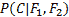，我们应用了一个技巧，这个技巧被贝叶斯发现:

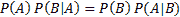

如果我们将替换为“可怕”和“疯狂”的概率，并将视为我们的类，我们会得到一个关系，帮助我们稍后检索属于指定类的数据实例的概率:

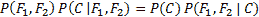

这允许我们通过其他概率来表达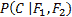:


我们也可以这样描述:


*在先*和*证据*很容易确定:

*   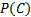是不知道数据的类的先验概率。我们可以通过简单地计算属于该特定类的所有训练数据实例的分数来估计这个数量。
*   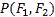是特征和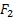的证据或概率

棘手的部分是可能性的计算。如果我们知道数据实例的类是，那么这个值描述了看到和特征值的可能性。要估计这一点，我们需要做一些思考。

# 天真

从概率论中，我们还知道以下关系:


然而，这本身并没有多大帮助，因为我们用另一个难题(估计)来处理一个难题(估计)。

然而，如果我们天真地假设和相互独立，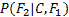简化为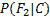，我们可以这样写:

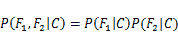

把所有的东西放在一起，我们得到了以下非常容易管理的公式:

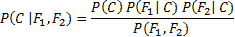

有趣的是，尽管在我们有心情的时候简单地调整我们的假设在理论上是不正确的，但在这种情况下，它在现实世界的应用中被证明是非常有效的。

# 用朴素贝叶斯分类

给定一条新的推文，剩下的唯一部分就是计算概率:

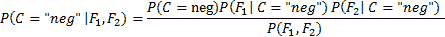

然后选择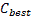类作为概率较高的。

至于两个类，分母是一样的，我们可以简单的忽略它，不改变胜者类。

然而，请注意，我们不再计算任何真实的概率。相反，我们正在估计哪一类更有可能给出证据。这是朴素贝叶斯如此稳健的另一个原因:它对真实概率不感兴趣，只对信息感兴趣，哪个类更有可能。简而言之，我们可以这样写:

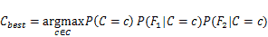

简单来说就是我们在计算 ( *pos* 和 *neg* 的所有类在 *argmax* 之后的部分，并返回得到最高值的类。

但是，对于下面的例子，让我们坚持真实概率，做一些计算，看看朴素贝叶斯是如何工作的。为了简单起见，我们将假设推特只允许前面提到的两个词，可怕和疯狂，并且我们已经手动分类了一些推文:

| **推文** | **级** |
| --- | --- |
| 可怕的 | 正面推文 |
| 可怕的 | 正面推文 |
| 可怕的疯狂 | 正面推文 |
| 疯狂的 | 正面推文 |
| 疯狂的 | 负面推文 |
| 疯狂的 | 负面推文 |

在这个例子中，我们在正面和负面的推文中都有疯狂的推文，以模仿你在现实世界中经常会发现的一些歧义(例如，对足球疯狂对疯狂的白痴)。

在这种情况下，我们总共有六条推文，其中四条是积极的，两条是消极的，这导致了以下优先事项:

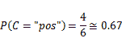

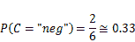

这意味着，在对推文本身一无所知的情况下，假设推文是正面的是明智的。

我们仍然缺少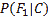和的计算，这是两个特征和的概率，在类中有条件。

这是通过我们已经看到具体特征的推文数量除以已经用类标记的推文数量来计算的。假设我们想知道在推文中看到 awesome 发生的概率，知道它的类是正的，我们将有:


这是因为在四条积极的推文中，有三条包含了“棒极了”这个词。显然，在正面推文中没有令人敬畏的可能性是相反的:

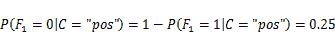

同样，对于其余部分(省略一个词没有出现在推文中的情况):

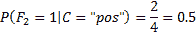


为了完整起见，我们还将计算证据，以便我们可以在下面的示例推文中看到真实概率。对于和两个具体数值，我们可以计算出如下证据:

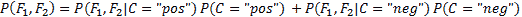

这导致以下值:

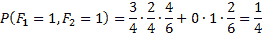

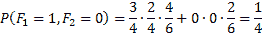

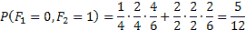

现在我们有了对新推文进行分类的所有数据。剩下的唯一工作就是解析这条推文，分析它的特点:

| **推文** | **** | **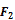** | **类概率** | **分类** |
| 可怕的 | one | Zero | 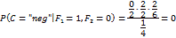 | 积极的 |
| 疯狂的 | Zero | one | 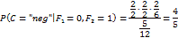 | 否定的；消极的；负面的；负的 |
| 可怕的疯狂 | one | one | 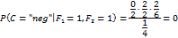 | 积极的 |

目前为止，一切顺利。琐碎推文的分类似乎给推文分配了正确的标签。然而，问题仍然是，我们应该如何对待训练语料库中没有出现的单词。毕竟，有了前面的公式，新单词总会被赋予零的概率。

# 解释看不见的单词和其他奇怪的东西

当我们早先计算概率时，我们实际上欺骗了自己。我们不是在计算真实的概率，而只是通过分数进行粗略的近似。我们假设训练语料库会告诉我们真实概率的全部真相。它没有。一个只有六条推文的语料库显然不能给我们所有关于每一条被写过的推文的信息。例如，肯定有包含文字的推文。只是我们从未见过他们。显然，我们的近似值非常粗略，我们应该考虑到这一点。这在实践中经常用所谓的**加一平滑**来完成。

Add-one smoothing is sometimes also referred to as **additive smoothing** or **Laplace smoothing**. Note that Laplace smoothing has nothing to do with Laplacian smoothing, which is related to the smoothing of polygon meshes. If we do not smooth by `1` but by an adjustable parameter, `alpha>0`, it is called Lidstone smoothing.

这是一种非常简单的技术，可以将一个要素添加到所有要素实例中。它有一个潜在的假设，即使我们没有在整个语料库中看到一个给定的单词，我们的推文样本仍然有可能不包括这个单词。因此，通过加一平滑，我们假装我们比实际看到的更多地看到了每一个事件。这意味着我们现在不用计算，而是做。

为什么分母要加 2？因为我们有两个特点:牛逼和疯狂的发生。因为我们为每个特征加 1，我们必须确保最终结果还是一个概率。事实上，我们得到 1 作为总概率:


# 算术欠流核算

还有另一个路障。实际上，我们处理的概率比我们在玩具例子中处理的概率小得多。通常情况下，我们也有许多不仅仅是两个特征，它们是相互相乘的。这将很快导致 NumPy 提供的浮点精度不再满足要求:

```py
>>> import numpy as np
>>> # tell numpy to print out more digits (default is 8)
>>> np.set_printoptions(precision=20) 
>>> np.array([2.48E-324])
 array([ 4.94065645841246544177e-324])
>>> np.array([2.47E-324])
 array([ 0.])  
```

那么，我们击中`2.47E-324`这样的数字的可能性有多大呢？为了回答这个问题，我们只需要想象`0.0001`的条件概率的可能性，然后将它们的`65`相乘(这意味着我们有`65`低概率特征值)，你已经被算术下溢击中了:

```py
>>> x = 0.00001
>>> x**64 # still fine
 1e-320
>>> x**65 # ouch
 0.0  
```

Python 中的浮点通常使用 c 语言中的 double 来实现。要了解您的平台是否是这种情况，您可以按如下方式进行检查:

```py
>>> import sys
>>> sys.float_info
 sys.float_info(max=1.7976931348623157e+308, max_exp=1024, 
 max_10_exp=308, min=2.2250738585072014e-308, min_exp=-1021, 
 min_10_exp=-307, dig=15, mant_dig=53, epsilon=2.220446049250313e-16, 
 radix=2, rounds=1)  
```

为了缓解这种情况，人们可以转而使用数学库，比如允许任意精度的`mpmath`([http://mpmath.org](http://mpmath.org/))。然而，它们的速度不足以作为 NumPy 的替代品。

幸运的是，有一个更好的方法来解决这个问题，这与我们可能还记得的学校里的一段美好关系有关(也称为 logsum-trick):


如果我们将此公式应用于我们的案例，我们会得到以下结果:


由于概率在 **0** 和 **1** 之间的区间内，概率的对数在-和 0 之间的区间内。不要为此烦恼。更高的数字仍然是正确类别的一个更强有力的指标——只是它们现在是负数:


但是有一个警告:我们实际上没有公式命名者的日志(分数的顶部)。我们只有概率的乘积。幸运的是，在我们的例子中，我们对概率的实际值不感兴趣。我们只是想知道哪个类的后验概率最高。我们很幸运，因为如果我们发现以下情况:


那么我们也将永远拥有:

。

快速看一下前面的图表，可以发现曲线是严格单调递增的，也就是说，当我们从左向右时，它总是向上的。让我们把这个放在前面提到的公式中:

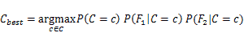

这将最终检索出两个特性的公式，这两个特性将为我们提供最好的类，也是我们将在实践中看到的真实数据:


当然，如果只有两个特性，我们将不会非常成功，所以让我们重写它，以允许任意数量的特性:


我们在这里，准备使用 scikit-learn 工具包中的第一个分类器。

如前所述，我们刚刚学习了朴素贝叶斯的伯努利模型。除了布尔特征，我们还可以使用单词出现的次数，也称为多项式模型。由于这提供了更多的信息，并且通常还会带来更好的性能，因此我们将把它用于我们的真实数据。但是，请注意，基础公式会有一些变化。然而，不用担心，因为朴素贝叶斯的工作原理仍然是一样的。

# 创建我们的第一个分类器并对其进行调整

天真的贝叶斯分类器存在于`sklearn.naive_bayes`包中。有不同种类的朴素贝叶斯分类器:

*   `GaussianNB`:该分类器假设特征为正态分布(高斯)。它的一个使用案例可能是给定一个人的身高和体重的性别分类。在我们的例子中，我们被给予推文文本，从中提取字数。这些显然不是高斯分布的。
*   `MultinomialNB`:这个分类器假设特征是出现次数，这是我们未来的情况，因为我们将使用推文中的字数作为特征。在实践中，这个分类器也能很好地处理 TF-IDF 向量。
*   `BernoulliNB`:这个分类器和`MultinomialNB`类似，但是更适合使用二进制单词出现次数，而不是单词计数。

因为我们将主要关注单词的出现，所以`MultinomialNB`分类器最适合我们的目的。

# 先解决一个简单的问题

正如我们所看到的，当我们查看我们的推文数据时，推文不仅是正面的，也是负面的。大多数推文实际上不包含任何情绪，而是中立的或不相关的，例如，包含原始信息(例如，新书:构建机器学习...http://link)。这导致了四类。为了不使任务过于复杂，我们现在只关注积极和消极的推文:

```py
>>> # first create a Boolean list having true for tweets
>>> # that are either positive or negative
>>> pos_neg_idx = np.logical_or(Y_orig=="positive", Y_orig =="negative")

>>> # now use that index to filter the data and the labels
>>> X = X_orig [pos_neg_idx]
>>> Y = Y_orig [pos_neg_idx]

>>> # finally convert the labels themselves into Boolean
>>> Y = Y=="positive"  
```

现在，`X`中有原始推文文本，`Y`中有二进制分类，`0`表示否定，`1`表示肯定推文。

我们刚刚说过我们将使用单词出现次数作为特征。不过，我们不会以原始形式使用它们。相反，我们将使用`TfidfVectorizer`将原始推文文本转换为 TF-IDF 特征值，然后与标签一起使用来训练我们的第一个分类器。为了方便起见，我们将使用`Pipeline`类，它允许我们将向量器和分类器挂钩在一起，并提供相同的接口:

```py
from sklearn.feature_extraction.text import TfidfVectorizer
from sklearn.naive_bayes import MultinomialNB
from sklearn.pipeline import Pipeline

def create_ngram_model(params=None):
    tfidf_ngrams = TfidfVectorizer(ngram_range=(1, 3), 
                                   analyzer="word", binary=False)
    clf = MultinomialNB()
    pipeline = Pipeline([('tfidf', tfidf_ngrams), ('clf', clf)])
    if params:
        pipeline.set_params(**params)
    return pipeline
```

由`create_ngram_model()`返回的`Pipeline`实例现在可以用于拟合和预测，就像我们有一个正常的分类器一样。稍后，我们将传递一个参数字典作为`params`，这将帮助我们创建自定义管道。

由于我们没有那么多数据，我们应该进行交叉验证。但是，这次我们不会使用`KFold`，它将数据划分为连续的折叠；相反，我们将使用`ShuffleSplit`。它为我们打乱了数据，但并不阻止同一数据实例被多次折叠。然后，对于每个折叠，我们跟踪精度-召回曲线下的区域，以确保准确性。

为了让我们的实验保持敏捷，让我们把所有的东西都包装在一个`train_model()`函数中，该函数将一个函数作为创建分类器的参数:

```py
from sklearn.metrics import precision_recall_curve, auc
from sklearn. model_selection import ShuffleSplit

def train_model(clf_factory, X, Y):
    # setting random_state to get deterministic behavior
    cv = ShuffleSplit(n_splits=10, test_size=0.3, 
                       random_state=0)

    scores = []
    pr_scores = []

    for train, test in cv.split(X, Y):
        X_train, y_train = X[train], Y[train]
        X_test, y_test = X[test], Y[test] 
        clf = clf_factory()
        clf.fit(X_train, y_train)

 train_score = clf.score(X_train, y_train)
        test_score = clf.score(X_test, y_test)

        scores.append(test_score)
        proba = clf.predict_proba(X_test)

        precision, recall, pr_thresholds = precision_recall_curve(y_test, proba[:,1])

        pr_scores.append(auc(recall, precision))

        summary = (np.mean(scores), np.mean(pr_scores))
        print("Mean acc=%.3ftMean P/R AUC=%.3f" % summary)
```

把所有东西放在一起，我们可以训练我们的第一个模型:

```py
 >>> X_orig, Y_orig = load_sanders_data()
 >>> pos_neg_idx = np.logical_or(Y_orig =="positive", Y_orig =="negative")
 >>> X = X_orig[pos_neg_idx]
 >>> Y = Y_orig [pos_neg_idx]
 >>> Y = Y_orig =="positive"
 >>> train_model(create_ngram_model, X, Y)
 Mean acc=0.777    Mean P/R AUC=0.885
```

我们首次尝试在向量化的 TF-IDF 三元组特征上使用朴素贝叶斯，得到了 77.7%的准确率和 88.5%的平均市盈率 AUC。查看中位数的市盈率图表(表现与平均值最相似的列车/测试分割)，它显示了比我们在上一章中看到的图表更令人鼓舞的行为。请注意，0.90 的曲线的 AUC 与 0.885 的平均 P/R 略有不同，因为该曲线取自训练运行的中位数，而平均 P/R AUC 是所有 AUC 分数的平均值。同样的原理也适用于后续图像:


首先，结果相当令人鼓舞。当我们意识到 100%的准确率在情感分类任务中可能永远无法实现时，他们会更加印象深刻。对于一些推文来说，即使是人类也经常不真正同意相同的分类标签。

# 使用所有类

我们再次简化了我们的任务，因为我们只使用了正面或负面的推文。这意味着，我们假设了一个完美的分类器，可以提前分类推文是否包含情感，并将它转发给我们天真的贝叶斯分类器。

那么，如果我们也对一条推文是否包含任何情绪进行分类，我们的表现会如何呢？为了找到答案，让我们首先编写一个便利函数，返回一个修改过的类数组，该数组提供了一个我们希望解释为积极的情感列表:

```py
def tweak_labels(Y, pos_sent_list):
    pos = Y==pos_sent_list[0]
    for sent_label in pos_sent_list[1:]:
        pos |= Y==sent_label

    Y = np.zeros(Y.shape[0])
    Y[pos] = 1
    return Y.astype(int)  
```

请注意，我们现在谈论的是两种不同的积极因素。推文的情绪可以是积极的，这要与训练数据的类别区分开来。例如，如果我们想知道如何区分有情绪的推文和中性的推文，我们可以做:

```py
>>> X = X_orig
>>> Y = tweak_labels(Y_orig, ["positive", "negative"])  
```

在`Y`中，我们现在有`1`(积极类)用于所有积极或消极的推文，还有`0`(消极类)用于中性和不相关的推文:

```py
>>> train_model(create_ngram_model, X, Y)
Mean acc=0.734    Mean P/R AUC=0.661  
```

看看下面的情节:

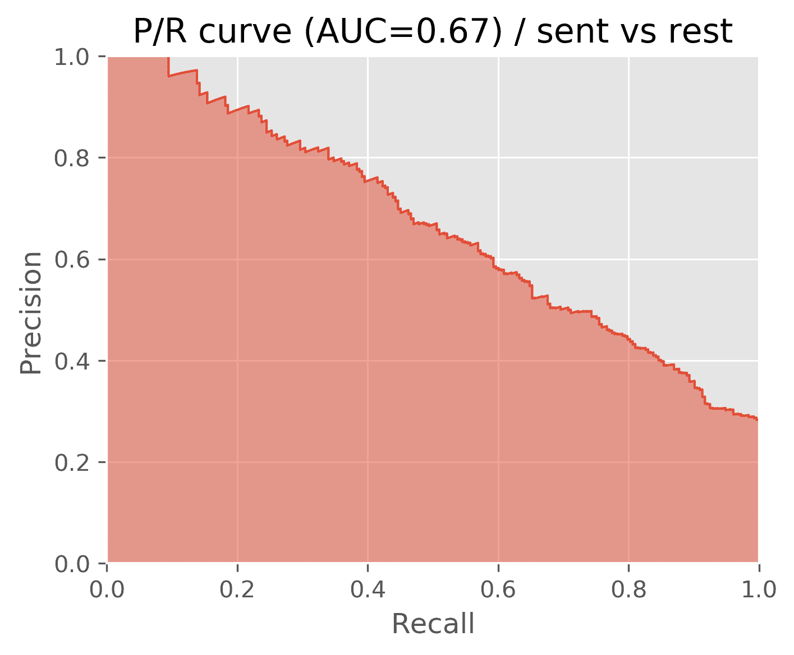

不出所料，市盈率 AUC 大幅下降，目前仅为 66%。准确性仍然很高，但这只是因为我们有一个高度不平衡的数据集。在总共 3077 条推文中，只有 839 条是正面或负面的，约占 27%。这意味着，如果我们创建一个分类器，总是将推文分类为不包含任何情绪，我们将已经有 73%的准确率。如果训练和测试数据不平衡，这是另一个总是看精度和回忆的原因。

那么，天真的贝叶斯分类器将如何对积极的推文和其他推文进行分类，以及对消极的推文和其他推文进行分类？一个字:差:

```py
== Pos vs. rest == 
Mean acc=0.87  Mean P/R AUC=0.305 
== Neg vs. rest == 
Mean acc=0.852 Mean P/R AUC=0.49 
```

如果你问我的话，我觉得很难用。查看以下图表中的市盈率曲线，我们也将发现没有可用的精度/召回权衡，正如我们在上一章中所做的那样:

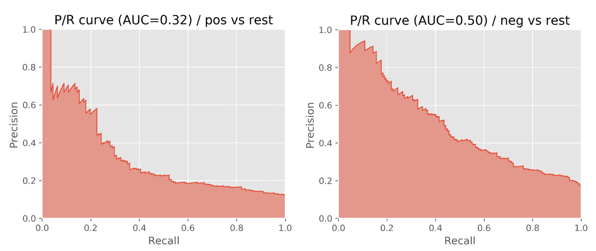

# 调整分类器的参数

当然，我们还没有充分探索当前的设置，应该进行更多的调查。大致有两个区域可以玩旋钮:`TfidfVectorizer`和`MultinomialNB`。由于我们没有真正的直觉，我们应该探索哪个领域，让我们尝试扫描超参数。

我们将首先看到`TfidfVectorizer`参数:

*   使用不同的 ngrams 设置:
    *   unigrams (1，1)
    *   单图和双图(1，2)
    *   单项式、二元式和三元式(1，3)
*   玩`min_df` : `1`或`2`
*   使用`use_idf`和`smooth_idf` : `False`或`True`探索以色列国防军在 TF-以色列国防军中的影响
*   通过将`stop_words`设置为`english`
    或``None`` 是否删除停止词
*   是否使用字数的对数(`sublinear_tf`)
*   通过将`binary`设置为`True`或`False`，是跟踪字数还是简单地跟踪单词是否出现

现在我们将看到`MultinomialNB`分类器:

*   通过设置`alpha`使用哪种平滑方法
*   加一或拉普拉斯平滑:`1`
*   丽德斯通平滑:`0.01, 0.05, 0.1, or 0.5`
*   无平滑:`0`

一个简单的方法是为所有这些合理的探索值训练一个分类器，同时保持其他参数不变并检查分类器的结果。由于我们不知道这些参数是否会相互影响，要做好这一点，我们需要为所有参数值的每个可能组合训练一个分类器。显然，这对我们来说太繁琐了。

因为这种参数探索在机器学习任务中经常出现，scikit-learn 有一个专门的类，叫做`GridSearchCV`。它需要一个估计器(带有类分类器接口的实例)，在我们的例子中是`Pipeline`实例，以及一个带有潜在值的参数字典。

`GridSearchCV`期望字典的关键字遵循某种格式，以便能够设置正确估计器的参数。格式如下:

```py
<estimator>__<subestimator>__...__<param_name> 
```

例如，如果我们想要为`TfidfVectorizer`(在`Pipeline`描述中被命名为`tfidf`的`ngram_range`参数指定想要探索的值，我们将不得不说:

```py
param_grid={"tfidf__ngram_range"=[(1, 1), (1, 2), (1, 3)]}  
```

这将告诉`GridSearchCV`尝试将三元组的单值作为`TfidfVectorizer`的`ngram_range`参数的参数值。

然后，它用所有可能的参数值组合训练估计量。我们确保它使用`ShuffleSplit`对训练数据的随机样本进行训练，这将生成随机训练/测试拆分的迭代器。最后，它以成员变量`best_estimator_`的形式提供了最佳估计量。

当我们想要将返回的最佳分类器与我们当前的最佳分类器进行比较时，我们需要以同样的方式对其进行评估。因此，我们可以使用`cv`参数传递`ShuffleSplit`实例(因此，`GridSearchCV`中的`CV`)。

最后缺少的部分是定义`GridSearchCV`应该如何确定最佳估计量。这可以通过使用`make_scorer`辅助函数向`scoring`参数提供所需的评分函数来实现。我们可以自己写一个，也可以从`sklearn.metrics`包里挑一个。我们当然不应该拿`metric.accuracy`来说事，因为我们的阶级不平衡(我们包含情感的推文比中立的少得多)。相反，我们希望对这两个类、带有情绪的推文和没有正面或负面意见的推文都有很好的精度和召回率。结合了精确度和召回率的一个度量是 **F-measure** ，它被实现为`metrics.f1_score`:

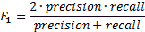

将所有内容放在一起后，我们得到以下代码:

```py
from sklearn. model_selection import GridSearchCV
from sklearn.metrics import make_scorer, f1_score

def grid_search_model(clf_factory, X, Y):
    cv = ShuffleSplit(n_splits=10, test_size=0.3, random_state=0)

    param_grid = dict(tfidf__ngram_range=[(1, 1), (1, 2), (1, 3)],
            tfidf__min_df=[1, 2],
            tfidf__stop_words=[None, "english"],
            tfidf__smooth_idf=[False, True],
            tfidf__use_idf=[False, True],
            tfidf__sublinear_tf=[False, True],
            tfidf__binary=[False, True],
            clf__alpha=[0, 0.01, 0.05, 0.1, 0.5, 1],
            )

    grid_search = GridSearchCV(clf_factory(),
            param_grid=param_grid, cv=cv,
            scoring=make_scorer(f1_score), verbose=10)
    grid_search.fit(X, Y) 

    return grid_search.best_estimator_
```

执行此操作时，我们必须保持耐心:

```py
print("== Pos/neg vs. irrelevant/neutral ==")
X = X_orig
Y = tweak_labels(Y_orig, ["positive", "negative"])
clf = grid_search_model(create_ngram_model, X, Y)
print(clf)  
```

由于我们刚刚请求了一个参数，扫描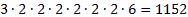参数组合，每个参数组合被训练 10 次:

```py
... waiting some 20 minutes  ...
Pipeline(memory=None,
    steps=[('tfidf', TfidfVectorizer(analyzer='word', binary=True, 
       decode_error='strict',
       dtype=<class 'numpy.int64'>, encoding='utf-8', input='content',
       lowercase=True, max_df=1.0, max_features=None, min_df=1,
    ngram_range=(1, 2), norm='l2', preprocessor=None, 
smooth_idf=False, vocabulary=None)), 
('clf', MultinomialNB(alpha=0.01, class_prior=None, fit_prior=True))])  
```

为了能够将这些数字与我们之前的方法进行比较，我们将创建一个`best_params`字典，然后将其传递给分类器工厂，然后运行与之前相同的代码，对 10 倍 CV 拆分进行训练并输出平均分数:

```py
best_params = dict(all__tfidf__ngram_range=(1, 2),
                   all__tfidf__min_df=1,
                   all__tfidf__stop_words=None,
                   all__tfidf__smooth_idf=False,
                   all__tfidf__use_idf=False,
                   all__tfidf__sublinear_tf=True,
                   all__tfidf__binary=False,
                   clf__alpha=0.01,
                )
print("== Pos/neg vs. irrelevant/neutral ==")
X = X_orig
Y = tweak_labels(Y_orig, ["positive", "negative"])
train_model(lambda: create_ngram_model(best_params), X, Y)  
```

结果如下:

```py
== Pos/neg vs. irrelevant/neutral ==
Mean acc=0.791    Mean P/R AUC=0.681  
```

最佳估计器确实将市盈率 AUC 从 65.8%提高到 68.1%，其设置如前面的代码所示。

此外，如果我们用我们刚刚发现的参数配置矢量器和分类器，那么正面推文对其余推文和负面推文对其余推文的破坏性结果会得到改善。只有阳性和阴性分类显示出稍差的性能:


看看下面的情节:


事实上，市盈率曲线看起来要好得多(注意，曲线来自折叠分类器的中间，因此，AUC 值略有差异)。然而，我们可能仍然不会使用这些分类器。是时候做些完全不同的事情了...

# 清理推文

新的约束导致新的形式。在这方面，推特也不例外。因为文本必须适合 280 个字符，人们自然会开发新的语言快捷方式，用更少的字符说出相同的内容。到目前为止，我们忽略了所有不同的表情符号和缩写。让我们看看考虑到这一点，我们能提高多少。为了这个努力，我们必须提供我们自己的`preprocessor()`到`TfidfVectorizer`。

首先，我们在字典中定义一系列常见的表情符号及其替换。虽然我们可以找到更明显的替代词，但我们会用明显的肯定或否定的词来帮助分类器:

```py
    emo_repl = {
     # positive emoticons
     "&lt;3": " good ",
     ":d": " good ", # :D in lower case
     ":dd": " good ", # :DD in lower case
     "8)": " good ",
     ":-)": " good ",
     ":)": " good ",
     ";)": " good ",
     "(-:": " good ",
     "(:": " good ", 
     # negative emoticons:
     ":/": " bad ",
     ":&gt;": " sad ",
     ":')": " sad ",
     ":-(": " bad ",
     ":(": " bad ",
     ":S": " bad ",
     ":-S": " bad ",
     }

 # make sure that e.g. :dd is replaced before :d
 emo_repl_order = [k for (k_len,k) in reversed(sorted([(len(k),k) 
                   for k in emo_repl.keys()]))]
```

然后，我们将缩写定义为正则表达式及其扩展(`b`标记单词边界):

```py
    re_repl = {
     r"brb": "are",
     r"bub": "you",
     r"bhahab": "ha",
     r"bhahahab": "ha",
     r"bdon'tb": "do not",
     r"bdoesn'tb": "does not",
     r"bdidn'tb": "did not",
     r"bhasn'tb": "has not",
     r"bhaven'tb": "have not",
     r"bhadn'tb": "had not",
     r"bwon'tb": "will not",
     r"bwouldn'tb": "would not",
     r"bcan'tb": "can not",
     r"bcannotb": "can not",
 }

def create_ngram_model_emoji(params=None):
    def preprocessor(tweet):
        tweet = tweet.lower()
        for k in emo_repl_order:
            tweet = tweet.replace(k, emo_repl[k])
        for r, repl in re_repl.items():
            tweet = re.sub(r, repl, tweet)

        return tweet

    tfidf_ngrams = TfidfVectorizer(preprocessor=preprocessor,
                                   analyzer="word")
    clf = MultinomialNB()
    pipeline = Pipeline([('tfidf', tfidf_ngrams), ('clf', clf)])
    if params:
        pipeline.set_params(**params)

    return pipeline
```

请记住，我们创建了一个参数字典，我们发现最好使用`GridSearchCV`。我们将把它传递给`create_ngram_model_emoji`，这样我们的新模型将在我们已经发现的基础上进行改进。由于`train_model`需要一个分类器工厂，因为它会被一次又一次地实例化，我们使用 Python 的`lambda`创建工厂:

```py
print("== Pos/neg vs. irrelevant/neutral ==")
X = X_orig
Y = tweak_labels(Y_orig, ["positive", "negative"])
train_model(lambda: create_ngram_model_emoji(best_params), X, Y)
```

当然，这里可以使用更多的缩写。但是已经有了这个有限的集合，我们得到了大约半个点的积极与消极的改善，以及情绪与无情绪的改善。复制前面的表格并为新方法填写数字，我们看到它为每个分类器都批准了一点:


# 考虑到单词类型

到目前为止，我们的希望是，简单地使用相互独立的单词和单词包的方法就足够了。然而，仅仅从我们的直觉来看，我们知道中性推文可能包含更高比例的名词，而正面或负面推文更丰富多彩，需要更多的形容词和动词。如果我们也使用推文的语言信息呢？如果我们能找出一条推文中有多少单词是名词、动词、形容词等等，分类器可能也会考虑到这一点。

# 确定单词类型

这就是词性标注，或者说词性标注的意义所在。POS tagger 分析一个句子，用词类标记每个单词，例如，book 这个词是名词(这是一本好书)还是动词(能不能请你订航班？).

你可能已经猜到 NLTK 也会在这个领域发挥作用。事实上，它很容易打包成各种解析器和标记器。我们将使用的词性标注器`nltk.pos_tag()`实际上是一个成熟的分类器，它是使用佩恩树库项目中手动标注的句子训练的。它将单词标记列表作为输入，并输出元组列表，其中每个元素包含原始句子的部分及其词性标记:

```py
>>> import nltk
>>> nltk.pos_tag(nltk.word_tokenize("This is a good book."))
[('This', 'DT'), ('is', 'VBZ'), ('a', 'DT'), ('good', 'JJ'), ('book', 
'NN'), ('.', '.')]
>>> nltk.pos_tag(nltk.word_tokenize("Could you please book the flight?"))
[('Could', 'MD'), ('you', 'PRP'), ('please', 'VB'), ('book', 'NN'), 
('the', 'DT'), ('flight', 'NN'), ('?', '.')]
```

POS 标签缩写取自佩恩树库(改编自[http://www.anc.org/OANC/penn.html](http://www.anc.org/OANC/penn.html)):

| **POS 标签** | **描述** | **例** |
| --- | --- | --- |
| `CC` | 并列连词 | 或者 |
| `CD` | 基数 | 第二 |
| `DT` | 限定词 | 这 |
| `EX` | 那里存在 | *有*有 |
| `FW` | 外来词 | 幼儿园 |
| `IN` | 介词/从属连词 | 在，在，像 |
| `JJ` | 形容词 | 凉爽的 |
| `JJR` | 形容词，比较的 | 冷却器 |
| `JJS` | 形容词，最高级 | 最凉快的 |
| `LS` | 列表制作人 | 1) |
| `MD` | 情态的 | 可能，威尔 |
| `NN` | 名词，单数或复数 | 书 |
| `NNS` | 名词复数 | 书 |
| `NNP` | 专有名词，单数 | 肖恩 |
| `NNPS` | 专有名词，复数 | 海盗 |
| `PDT` | 前限定词 | 两个男孩 |
| `POS` | 所有格结尾 | 朋友的 |
| `PRP` | 人称代名词 | 我，他，它 |
| `PRP$` | 所有格代名词 | 我的，他的 |
| `RB` | 副词 | 然而，通常，自然地，在这里，很好 |
| `RBR` | 副词，比较的 | 较好的 |
| `RBS` | 副词，最高级 | 最好的 |
| `RP` | 颗粒 | 放弃*放弃* |
| `TO` | 到 | *去*去，*去*他 |
| `UH` | 感叹词 | 嗯嗯嗯 |
| `VB` | 动词，基本形式 | 拿 |
| `VBD` | 动词，过去式 | 拿 |
| `VBG` | 动词、动名词/现在分词 | 拿 |
| `VBN` | 动词，过去分词 | 拿 |
| `VBP` | 动词，唱。存在，非 3d | 拿 |
| `VBZ` | 动词，第三人称歌唱。礼物 | 接受 |
| `WDT` | wh-确定 | 哪个 |
| `WP` | wh 代词 | 谁，什么 |
| `WP$` | 所有格 wh 代词 | 谁的 |
| `WRB` | wh-abverb | 何时何地 |

有了这些标签，从`pos_tag()`的输出中过滤出想要的标签是非常容易的。我们只需计算所有标签以`NN`开头的名词、`VB`开头的动词、
开头的形容词和`RB`开头的副词。

# 使用 SentiWordNet 成功作弊

虽然语言信息，如前一节所述，很可能会对我们有所帮助，但我们可以用一些更好的东西来收获它:SentiWordNet([http://SentiWordNet . isti . CNR . it](http://sentiwordnet.isti.cnr.it))。简单来说就是一个 13 MB 的文件，我们要从网站下载，解压，放入 Jupyter 笔记本的数据目录；它给大多数英语单词赋予了一个正值和负值。这意味着对于每个同义词集，它都记录了积极和消极的情感值。一些例子如下:

| **POS** | **ID** | **姿势得分** | 否定得分 | **同步组术语** | **描述** |
| --- | --- | --- | --- | --- | --- |
| `a` | 00311354 | Zero point two five | Zero point one two five | 勤奋好学#1 | 以小心和努力为特点的；努力修理电视机 |
| `a` | 00311663 | Zero | Zero point five | 粗心的#1 | 以缺乏关注、考虑、深谋远虑或彻底为特点的；不小心... |
| `n` | 03563710 | Zero | Zero | 植入物#1 | 永久放置在组织中的假体 |
| `v` | 00362128 | Zero | Zero | 扭结#2曲线#5卷曲#1 | 形成卷曲、曲线或扭结；雪茄烟雾在天花板上袅袅上升 |

有了 **POS** 一栏的信息，我们就能区分名词书和动词书了。`PosScore`和`NegScore`一起会帮助我们确定这个词的中性，就是 1-poss core-neggle。`SynsetTerms`列出集合中所有同义词。我们可以放心地忽略`ID`和`Description`列。

synset 术语附加了一个数字，因为有些术语在不同的 synset 中出现多次。例如，innovate 传达了两种不同的意思，这也导致了不同的分数:

| **POS** | **ID** | **姿势得分** | 否定得分 | **同步组术语** | **描述** |
| `v` | 01636859 | Zero point three seven five | Zero | 幻想#2幻想 | 在头脑中描绘；他幻想着理想的妻子 |
| `v` | 01637368 | Zero | Zero point one two five | 幻想#1幻想#1幻想 | 沉溺于幻想；当他说他计划创办自己的公司时，他是在幻想 |

为了找出应该采用哪种 synsets，我们需要真正理解推文的含义，这超出了本章的范围。专注于这一挑战的研究领域被称为词义消歧。
对于我们的任务，我们采取简单的路线，简单地对找到一个术语的所有合成集进行平均。对于幻想来说，`PosScore`会是`0.1875`，`NegScore`会是`0.0625`。

下面的函数`load_sent_word_net()`为我们完成了所有这些，并返回一个字典，其中键是单词类型/单词形式的字符串，例如 n/implant，值是正负分数:

```py
import csv, collections
    def load_sent_word_net():
    # making our life easier by using a dictionary that
    # automatically creates an empty list whenever we access
    # a not yet existing key
    sent_scores = collections.defaultdict(list) 
    with open(os.path.join(DATA_DIR, "SentiWordNet_3.0.0_20130122.txt"), 
              "r") as csvfile:
     reader = csv.reader(csvfile, delimiter='t',
                         quotechar='"')
     for line in reader:
         if line[0].startswith("#"):
             continue
         if len(line)==1:
             continue

         POS, ID, PosScore, NegScore, SynsetTerms, Gloss = line
         if len(POS)==0 or len(ID)==0:
             continue
         for term in SynsetTerms.split(" "):
             # drop number at the end of every term
             term = term.split("#")[0] 
             term = term.replace("-", " ").replace("_", " ")
             key = "%s/%s"%(POS, term.split("#")[0])
             sent_scores[key].append((float(PosScore), 
                                      float(NegScore)))
    for key, value in sent_scores.items():
         sent_scores[key] = np.mean(value, axis=0) 
 return sent_scores
```

# 我们的第一个估计量

现在，我们已经准备好了创建我们自己的第一个矢量器。最便捷的方式就是从`BaseEstimator`继承。它要求我们实现以下三种方法:

*   `get_feature_names()`:这返回了我们将在`transform()`中返回的特性的字符串列表。
*   `fit(document, y=None)`:因为我们没有实现一个分类器，所以我们可以忽略这个，简单的返回 self。
*   `transform(documents)`:返回`numpy.array()`，包含一个形状的数组(`len(documents), len(get_feature_names)`)。这意味着，对于`documents`中的每个文档，它必须为`get_feature_names()`中的每个特征名称返回值。

下面是实现:

```py
sent_word_net = load_sent_word_net()

 class LinguisticVectorizer(BaseEstimator):
     def get_feature_names(self):
         return np.array(['sent_neut', 'sent_pos', 'sent_neg',
                          'nouns', 'adjectives', 'verbs', 'adverbs',
                          'allcaps', 'exclamation', 'question', 'hashtag', 
                          'mentioning'])
     # we don't fit here but need to return the reference
     # so that it can be used like fit(d).transform(d)
     def fit(self, documents, y=None):
         return self 
    def _get_sentiments(self, d):
         sent = tuple(d.split())
         tagged = nltk.pos_tag(sent)

         pos_vals = []
         neg_vals = []

         nouns = 0.
         adjectives = 0.
         verbs = 0.
         adverbs = 0. 
    for w,t in tagged:
             p, n = 0, 0
             sent_pos_type = None
             if t.startswith("NN"):
                 sent_pos_type = "n"
                 nouns += 1
             elif t.startswith("JJ"):
                 sent_pos_type = "a"
                 adjectives += 1
             elif t.startswith("VB"):
                 sent_pos_type = "v"
                 verbs += 1
             elif t.startswith("RB"):
                 sent_pos_type = "r"
                 adverbs += 1

             if sent_pos_type is not None:
                 sent_word = "%s/%s" % (sent_pos_type, w)

                 if sent_word in sent_word_net:
                     p,n = sent_word_net[sent_word]

             pos_vals.append(p)
             neg_vals.append(n)

         l = len(sent)
         avg_pos_val = np.mean(pos_vals)
         avg_neg_val = np.mean(neg_vals)
         return [1-avg_pos_val-avg_neg_val, avg_pos_val, avg_neg_val, 
                 nouns/l, adjectives/l, verbs/l, adverbs/l] 
 def transform(self, documents):
        obj_val, pos_val, neg_val, nouns, adjectives, 
           verbs, adverbs = np.array([self._get_sentiments(d) 
           for d in documents]).T 
 allcaps = []
        exclamation = []
        question = []
        hashtag = []
        mentioning = []

        for d in documents:
            allcaps.append(np.sum([t.isupper() 
                 for t in d.split() if len(t)>2]))

            exclamation.append(d.count("!"))
            question.append(d.count("?"))
            hashtag.append(d.count("#"))
            mentioning.append(d.count("@"))

        result = np.array([obj_val, pos_val, neg_val, nouns, adjectives, 
                           verbs, adverbs, allcaps, exclamation,                          
                           question, hashtag, mentioning]).T

        return result  
```

# 把所有东西放在一起

然而，孤立地使用这些语言特征，而不考虑单词本身，不会让我们走得很远。因此，我们必须将`TfidfVectorizer`参数与语言特征相结合。这可以通过 scikit-learn 的`FeatureUnion`课程来完成。其初始化方式与`Pipeline`相同；然而，`FeatureUnion`不是评估序列中的估计量，而是将前一个估计量的输出传递给下一个估计量，然后并行处理并连接输出向量:

```py
def create_union_model(params=None):
    def preprocessor(tweet):
        tweet = tweet.lower()
        for k in emo_repl_order:
            tweet = tweet.replace(k, emo_repl[k])
        for r, repl in re_repl.items():
            tweet = re.sub(r, repl, tweet) 
 return tweet.replace("-", " ").replace("_", " ") 
 tfidf_ngrams = TfidfVectorizer(preprocessor=preprocessor,
                                   analyzer="word")
    ling_stats = LinguisticVectorizer()
    all_features = FeatureUnion([('ling', ling_stats), 
                                 ('tfidf', tfidf_ngrams)])
    clf = MultinomialNB()
    pipeline = Pipeline([('all', all_features), ('clf', clf)])

    if params:
        pipeline.set_params(**params) 
 return pipeline
```

然而，在组合特征器上的训练和测试有点令人失望。相对于其余部分，我们在积极方面提高了 1%，但在其他方面却有所下降:


有了这些结果，如果我们不能在市盈率 AUC 中获得一个重要的职位，我们可能不想为昂贵得多的 SentiWord 方法付出代价。相反，我们可能会选择 GridCV + Cleaning 方法，首先使用确定推文是否包含情感的分类器(pos/neg 对无关/中性)，然后在确实包含情感的情况下，使用肯定对否定的分类器来确定实际的情感。

# 摘要

恭喜你坚持到最后！我们一起学习了朴素贝叶斯是如何工作的，以及为什么它一点也不幼稚。特别是对于训练集，我们没有足够的数据来学习类概率空间中的所有小生境，朴素贝叶斯在推广方面做得很好。我们学会了如何将它应用到推文中，清理粗糙的推文文本有很大帮助。最后，我们意识到一点点欺骗是可以的(只有在我们完成了应尽的工作之后)。然而，由于我们意识到昂贵得多的分类器并没有奖励我们一个改进得多的分类器，我们回到了便宜的分类器。

在[第 10 章](10.html)、*主题建模*中，我们将学习如何使用潜在狄利克雷分配(也称为主题建模)从文档中提取主题。这将有助于我们通过分析所涵盖主题的相似程度来比较文档。