# 第三章。无向图形模型

我们现在来看看模型，其中变量之间的相互作用使得方向性不能归因于它们。我们将看到如何根据它们的分布和 D-分离来表示这些无向模型及其性质。

# 成对马尔可夫网络

我们将用下面的例子来推动本章的讨论。我们有四个同事( **Amar** 、 **Bob** 、 **Charlie** 和 **Deepak** )在办公室聚会上相遇。聚会上有传言说一名高级经理可能会离开组织。这四位同事偶遇，一对一对话，可能是关于谣言。我们知道查理和鲍勃·邦德真的很好，但查理和迪帕克就不一样了。简而言之，每一对都会影响另一对，对彼此有一定程度的喜欢或不喜欢。我们希望该模型能够捕捉每个人是否知道或不知道谣言的实例。在下图的图表中可以看到它们相互作用的模型。我们将使用马尔可夫网络来模拟这四个同事是否知道这个谣言。

在建模问题时，您可能会想起贝叶斯网络，我们可以尝试使用它来建模聚会示例。看起来变量之间的相互作用是对称的；人们不能把一个方向归因于两个人之间的亲密关系。我们可以使用马尔可夫网络对这种类型的交互进行建模，其中节点代表随机变量，边代表两个节点之间的亲缘关系、交互或喜欢/不喜欢。

两个变量之间的相互作用可以用一个称为因子的函数来表示，该函数将量化其范围内变量之间的好恶程度。因子有一组输入变量，称为因子的范围。因子中的值是实数集中的，其中零表示亲和力低，反之亦然。

我们可以用因子和来表示前面的网络，它们的值可以分别被认为是对 Amar 和 Bob、Bob 和 Charlie、Charlie 和 Deepak、Deepak 和 Amar 的相容因子(或局部快乐)。下表中的值描述了 Amar 和 Bob bond 都很好地分享了信息，因此他们两个知道或不知道谣言的可能性很高，一个人知道而不与另一个人分享的可能性很低:

<colgroup><col style="text-align: left"> <col style="text-align: left"> <col style="text-align: left"></colgroup> 
| 

 |
| --- |
|  | *B0T3】* | *20* |
|  | *B1T3】* | *2* |
| 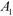 | *B0T3】* | *5* |
|  | *B1T3】* | *10* |

所以，我们可以看到图被分解成小的因素，但是我们如何定义整体的联合分布呢？我们将通过使用定义如下的因子乘积来实现这一点:

然而，你可能会说，这不是一个有效的概率分布，因为它不等于 1，这是正确的。这是通过将所有项除以来纠正的，T1 也被称为分区函数，定义如下:

这里， *Z* 简单来说就是所有因子的值之和，如下式所示:

既然我们已经了解了贝叶斯网络，一个自然的问题可能会出现——因素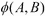是某种边际概率还是某种条件概率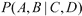或者它们的某种组合？不幸的是，这些边际概率或条件概率与因子概率之间没有直接的对应关系。我们所能陈述的是，因素是构成马尔可夫网络的其他因素的集合。因此，在马尔可夫网络编码的概率分布和网络构成因素之间没有直接的映射，这与我们在贝叶斯网络中遇到的情况略有不同。

我们可以将成对马尔可夫网络定义为由表示随机变量的节点组成的无向图，这些节点由两个节点()之间的边连接。这表示两个节点之间的因子(或势)，即。

# 吉布斯分布

在成对马尔可夫网络中，我们的因子在其范围内只有两个变量。如果我们扩展网络，使每个节点连接到网络中的所有其他节点，我们将获得如下图所示的边:

成对马尔可夫网络中的是否代表随机变量上的任何概率分布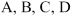否，因为该网络中的参数不足以描述 *n* 随机变量上的联合概率分布(如果每个随机变量取 *d* 值，则需要参数)。细心的读者可能已经注意到对于前面的成对马尔可夫网络(有四个变量)，参数的数量(与联合分布相比)确实相等。让我们看看下表，了解当每个随机变量取二进制值时所需的参数数量:

<colgroup><col style="text-align: left"> <col style="text-align: left"> <col style="text-align: left"> <col style="text-align: left"></colgroup> 
| 

随机变量的数量

 | 

边数(因素)

 | 

成对马尔可夫网络中的参数

 | 

联合分布中的参数

 |
| --- | --- | --- | --- |
| 4 (2 x 2 网格) | four | Sixteen |  =16 |
| 9 (3 x 3 网格) | Twelve | Forty-eight | 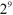 =512 |

我们可以看到，在一般情况下，成对马尔可夫网络中的参数数量不足以表示联合分布。解决这个问题的一个方法是允许一个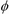因子在其范围内有无限数量的变量，而不是两两两的情况。这被称为吉布斯分布，定义如下:

每个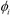因子在其范围内可能有几个变量，吉布斯分布就是一组这样的因子。正如我们已经看到的成对情况，非标准化分布是其因素的乘积，如下式所示:

为了使它成为一个加起来为 1 的概率分布(因为因子的取值不受约束)，我们必须通过除以配分函数 *Z* 进行归一化。我们得到，这里是。

那么，这个吉布斯分布到底给了我们什么呢？它只是给了我们一个有效的概率分布(加起来是 1)，它看起来类似于一个概率分布，可以映射到一个图，就像贝叶斯网络一样。

# 诱导马尔可夫网络

如果我们有涉及多个变量的因素，马尔可夫网络会是什么样子？在成对案例中，因素意味着随机变量 *A* 和 *B* 之间的边缘。假设因子在所有对中具有优势确实是合乎逻辑的。这叫做**诱导马尔可夫网络**，图中包含两个因子和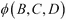的边，如下图所示:

# 因式分解

在贝叶斯网络的表示部分，我们遇到了两种表示:一种是图，另一种是概率分布。我们问自己一些问题，比如它们是否等价，当我们从一种观点切换到另一种观点时，我们是失去了信息还是获得了信息？我们现在将在马尔可夫网络的背景下研究这些问题。

分布 D 和图 G 的等价性是什么？D 什么时候对 G 进行因子分解？换句话说，什么时候可以用 G 来表示 D？理解因式分解的一种方法是将其视为分解问题。我们有一个问题(例如，一个巨大的联合分布)，我们想把它分解成更小的部分(比如贝叶斯网络中的条件概率分布)。

如果我们有一组因子(它是它的单个因子的乘积)，我们可以说分布 D 在 G 上分解，G 是这组因子的诱导图。

然而，与贝叶斯网络不同的是，如果给我们一个图 G，就没有一组唯一的因子可以从图中读取。让我们看一下下图:

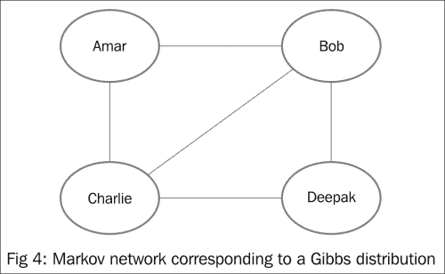

我们知道因子范围内的所有变量(对)都是由边连接的。例如在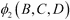因子中，之间有一条边。所有其他因素也是如此。

现在考虑两组因素: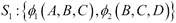和。我们可以看到，在这两个集合中，每个单个因子都满足其范围内的所有变量都由一条边连接的条件。如果我们用四个顶点画一个图，然后按照因子集或的描述连接边，我们会发现实体化的图是一样的。

所以不同的组因子可以归纳出同一个图，不能从图中读出因式分解，或者拆分成单个因子。这不应该被理解为与贝叶斯网络相比不够好，而是一个图可以有多个因子分解，所有这些都是正确的。

# 影响流

影响如何沿着马尔可夫网络流动？我们已经看到，在给定的图 G 中不存在单一唯一的因子分解，影响的流不依赖于因子的形式。

两个变量可以相互影响，只要它们通过一组边连接起来。在上图中， **Amar** 、 **Bob** 、 **Charlie** 通过一组边连接在一起，可以相互影响，因式分解，不管是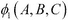还是，其实并不重要。

# 主动跟踪和分离

与贝叶斯网络中活动轨迹的详细规则不同，在马尔可夫网络中，规则很简单:影响可以在任意两个通过边连接的随机变量之间流动。如果观察到某个节点，则该节点会被阻止。我们可以在下图的示例中看到这一点。

因此，我们可以陈述马尔可夫网络中分离的概念(注意，我们不称之为 D-分离，因为这不是一个有向图)。给定证据集 Z，如果在 X 和 Y 之间的 G 中没有活动踪迹，则随机变量 X 和 Y 在图 G 中是分开的。也就是说，在连接 X 和 Y 的踪迹之一中应该没有证据或观察到的节点。

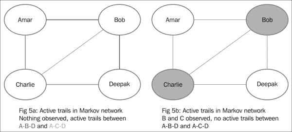

# 结构化预测

在机器学习分类器的典型应用中，分类器预测目标变量的类别，例如垃圾邮件/非垃圾邮件，以对电子邮件进行分类。通常，每个实例(如单个电子邮件)都独立于下一封或上一封电子邮件。

然而，有几类应用程序的目标变量与其邻居相关。以图像分割为例，其中一个典型的问题是，在牧场上的牛的图片中，我们希望将每个像素(或超级像素，如图像处理文献所述，它是一组连续的像素)分类为牛或草。每个超级像素都有几个邻居，如果超级像素 *Sp* 在牛的胃部区域，被其他已经归类为牛的超级像素包围，很明显超级像素 *Sp* 也应该归类为牛。超级像素 *Sp* 的分类任务通过使用局部结构而不是通过独立分类，忽略附近的超级像素而变得容易得多。

同样，在自然语言处理领域，名为**词性标注** ( **词性标注**)的任务涉及用名词、代词或动词等词类标注句子中的每个单词。在这里，如果我们看整个句子，而不是孤立地看每个单词，将一个单词标记为名词或动词会容易得多。

在这种情况下，当我们希望执行特定任务的预测，并且存在我们可以利用的局部结构时，我们可以使用诸如**隐马尔可夫模型** ( **HMMs** )和**条件随机场** ( **CRFs** )的模型。局部结构可以是位于单词序列中的附近的单词或位于像素网格中的附近的像素。

## 相关特征问题

如果我们试图预测超级像素的类别，特征(例如每个超级像素的颜色直方图)彼此高度相关。在像朴素贝叶斯这样的生成模型中，同一个特征被计数多次，这就给了一个高度倾斜的概率给一个类。校正独立性假设需要在要素之间添加边，因为相关的要素不是条件独立的。很难弄清楚它们是如何关联的，模型之间会紧密连接，这意味着很多顶点之间会有很多边。

这个问题的一个解决方案是建模而不是(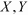)，也就是建模条件分布而不是联合分布(其中 *Y* 是目标变量的集合， *X* 是观测变量的集合)。我们不关心特性如何变化(或者不一起变化)；我们只关心目标变量。通用报告格式不同于 MRF，它试图模拟条件分布而不是联合分布()。

## 通用报告格式表示

一个 CRF 可以用一组因子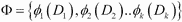来表示，看起来类似于吉布斯分布。不同的是归一化常数 *Z* 只对 y 的所有值求和

如果联合分布有两个变量 A 和 B，如下式所示:

然后通过除以对条件分布进行归一化，如下式所示:

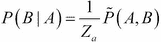

这里，是 A 值的联合分布，求和出来。

朴素贝叶斯模型是生成模型的一个例子(模拟联合分布的模型)，它的条件等价物是逻辑回归模型(模拟条件分布的模型)。

## 通用报告格式示例

通过这个例子可以更好地理解通用报告格式的使用:

给定一组与文字中手写字符相对应的图像，我们需要预测每个图像中的字符。我们可以想象，我们构建的解决方案将从最简单的开始，然后努力改进它。我们可以从一个最简单的模型开始，它有单因素，也就是说，每个角色的预测值将只取决于图像特征，如下图所示。已经观察到图像 **I1** 到 **I4** ，我们想识别类变量 **c1** 到 **c4** (可以取 26 个值，从 A 到 Z 每个字符一个)。

通过使用强分类器，如逻辑回归或随机森林，我们可以使用单例特征获得相当好的预测分数。

但是，我们可以看到这种模式是可以改进的。考虑上图中的字符 **l2** 。我们知道字母 **q** 后面最常见的字符是 **u** ，其他字符极其少见。同样，跟在 **qui** 后面的字符很可能是 **t** 或 **d** (quid 或 quit)。我们可以通过添加成对特征(在两个字符类之间)、三元组特征(在三个字符类之间)甚至更多来编码知识。观察下图，该图描绘了添加的特征的边缘:

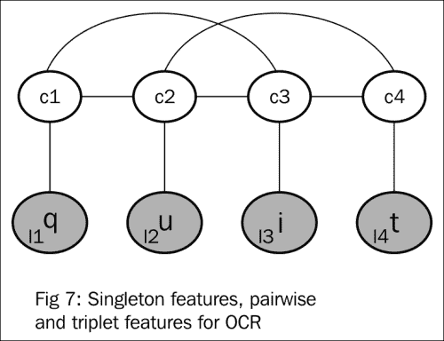

捕捉类 *C* 和图像 *I* 之间的势的单因素可以表示为，成对和三元因素可以表示为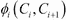和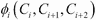。英语字符的成对特征适用于所有组合，如{A - A}、{A - B}、{A - C}一直到{Z - Z}，同样适用于三元组因子{ A-A }、{ A-A-B }，等等。假设我们在英语中有 26 个字符，我们将分别需要 26 个 2 和 26 个 3 因子来表示成对和三元组因子的所有组合。我们必须从数据中了解这些因素的参数。例如，为了学习{X-Y-Z}的参数，我们可以计算字符{X-Y-Z}在一个大型单词语料库中的出现次数。我们可能会预料到许多这样的因素极少发生(例如组合 *xmq* )。

添加范围内有三个以上变量的较大因子可能很有诱惑力，但考虑到指数级的增长，在因子数量呈指数级的网络上存储、操作和运行推理变得很困难。

# 因式分解-独立探戈

在前一章中，我们了解到图形和分布的两个概念都编码在一个图形模型中。我们现在转向因子分解和独立性的等价性，我们想知道在马尔可夫网的背景下，它们在两种观点中是否都受到尊重。

以下是我们希望解决的问题:

*   第一个问题是，如果图中的两个节点是有条件独立的，分布是否尊重这种独立性？
*   第二个问题是，将一个分布分解成一个图是有效的分解吗？

这个定理与贝叶斯网络有相似之处。如果一个分布 P 在图 G 上因式分解，并且假设两个随机变量 X 和 Y 被分开(在图 G 中)给定，那么分布 P 满足独立性陈述，并且 X 在给定 z 的情况下条件独立于 Y。

换句话说，由图 H 通过分离属性定义的独立性被表示该图的分布 P 所保留。类似于贝叶斯网络，图 H 是分布 p 的 I 图

这种关系的逆是因式分解的独立性——如果分布 P 满足图 G 所描述的独立性，则 P 在图 G 上进行因式分解。与贝叶斯网络的情况不同，这仅适用于正分布，也就是说，随机变量的所有赋值的概率都必须大于零。这种关系源自哈默斯利-克利福德定理。

总而言之，正如在贝叶斯网络的情况下，我们有两个马尔可夫网络的等价视图。因式分解使图 G 能够表示(正)分布，而 I-map 使图 G 描述的独立性在(正)分布中得到尊重。

# 总结

在这一章中，我们学习了马尔可夫随机场，它是图形模型的一种替代表示。我们了解了它们的属性，它们与贝叶斯网络的相似之处和不同之处。我们还研究了一些使用磁流变液的实际应用。我们还了解了条件随机场以及它们如何用于结构化预测。

在学习了表示 PGM 的概念和方法之后，在本书的下一部分，我们将学习如何将表示转换为可以被软件工具使用来解决现实问题的工件。