# 第四章。结构学习

在使用 PGM 解决问题时，我们可能采取的常见路径是从数据集开始，然后在该数据集上运行一些类型的推理查询。我们可能有一些网络结构的领域知识，以及这个网络的参数的知识。通常，我们可能没有网络结构或参数先验的先验知识，我们所拥有的只是一个数据集。

给定一个数据集，我们手头有以下任务:

*   学习网络的结构。这可以通过单独从数据中学习来实现，也可以通过提供一些领域知识(边缘之间的联系)来实现。
*   了解网络的参数。同样，领域知识可以帮助我们获得参数先验，或者它可以完全从数据中学习。
*   使用推理引擎运行条件概率查询或映射查询。

隐含着对一种工具的需求，这种工具可以帮助我们完成前面所有的任务，结构和参数学习，以及推理。

在本书的下一部分，我们将按照同样的顺序探索结构、参数学习，最后是推理。

在本章中，我们将学习如何学习 PGM 的结构。

当我们希望使用 PGM 时，一个任务是确定图形模型的结构。有时，我们有一个领域专家，他可以安排一个合适的层次模型。不幸的是，情况并非总是如此，在没有任何领域知识的情况下，我们可能希望了解给定数据的网络结构。即使有一些可用的领域专业知识，我们也希望验证或改进网络结构。

结构学习的另一个用途是当目标是发现结构时(而不一定只是为了运行推理查询而发现结构)。例如，因果贝叶斯网络已经被用于建模蛋白质信号网络，其中发现网络结构被用于理解药物相互作用和患病细胞中的功能障碍信号。

# 结构学习景观

结构学习之旅是这样进行的:我们讨论的算法可以分为两个领域，一个领域使用约束，另一个领域关注基于分数的方法。

我们还将讨论已发现的结构类型，如树木、森林和图表。我们将探讨每组中算法的优缺点，并尝试一些简单的例子来练习一些算法。

# 基于约束的结构学习

在这种方法中，我们从一组表示数据中随机变量的顶点开始，然后测试数据中的条件相关性(和独立性)。这种方法的目标是从贝叶斯网络结构中读取数据的条件依赖和独立性。约束本质上是对随机变量之间条件独立性的测试。

该算法在逻辑上可以分为三个部分。

## 第一部分

对于每个变量 *X <sub>i</sub>* ，算法试图找到见证变量的子集(比如说， *X <sub>1</sub>* 到 *X <sub>n</sub>* )，其中 *X <sub>i</sub>* 独立于其他变量。然而，检查随机变量的所有子集将需要搜索指数。为了补救这一点，该算法通过执行以下任务仅使用多项式次数的独立性测试:

它限制每个顶点的父顶点的数量。这取决于我们对网络规模的直觉。更大的网络可能需要更大的见证变量子集。

用于确定条件独立性的程序也值得讨论。这个问题通常在使用假设检验的统计文献中得到解决。假设我们在变量 A 和 B 上有一个分布，我们希望知道联合分布是否是个体概率的乘积，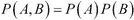。变量不独立的分布可能是。

对于离散值随机变量，接受或拒绝零假设(零假设表明两个变量是独立的)的合适检验是卡方检验。当两个变量独立时，卡方检验很可能返回值 0，当两个变量不独立时，卡方检验将返回高值。皮尔逊卡方检验统计量通过使用以下公式计算:


在该公式中，参数如下:

*   :这是皮尔逊累积检验统计量
*   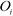:这是观察到的频率
*   :这是零假设给出的预期或理论频率
*   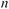:这是自由度

通过卡方检验，我们可以在网络中建立一组独立性。然而，当运行多个假设测试时，由于数据稀疏和统计噪声，统计误差会累积并导致不正确的独立性假设。在有大量实例的小型网络上，这些错误不会影响结构的正确性，但对于大型网络来说，这是不能说的。数据不足的大型网络可能会产生虚假的独立性，这将导致构建的结构不正确。

## 第二部分

众所周知，分布 P 中独立(I-map)的图不是唯一的，这意味着有多个图 G*可以表示该分布，这些图可以称为 I-等价图。该算法的目标是找到属于 G*的 I 等价类的任何一个网络。

在第二部分，我们将创建一个无向图或图骨架，如果 X 和 Y 节点在图中相邻，我们将在它们之间添加边。通过邻接，我们意味着最终的图将具有形式或的有向边。我们可以使用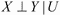形式的独立查询来推断它们是否相邻。如果我们发现任何见证节点 *U* ，它会阻挡 *X* 和 *Y* 之间的活动踪迹，从而得出 *X* 和 *Y* 是有条件独立的结论。另一方面，如果我们没有找到任何见证节点 *U* ，我们得出结论，它们必须是条件依赖的，因此我们添加了一条连接 *X* 和 *Y* 的边。

假设我们有一组独立，我们使用前面提到的测试在不独立的节点之间添加边。

## 第三部分

现在我们有了一个骨架，我们希望把无向边转换成有向边。一个定理(柯勒 3.8)假设所有 I 等价于 G*的有向图都具有相同的不道德集。假设一个节点有两个父节点；如果父母之间没有边缘联系(可能类似于未婚)，那他们就是不道德的。该算法继续测试和验证骨架中潜在的不道德性。潜在的不道德，目前被表示为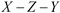，必须改变为以下之一:

*   
*   
*   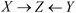
*   

对于这四个目的地中的每一个，我们都有规则来确定给定一个无向三元组节点的正确目的地。有关这些规则的描述，请参考柯勒·3.4.3.2 的文章。

我们现在来看看`constraint-based.ipynb` IPython 笔记本，在这里我们试图通过使用基于约束的方法来学习贝叶斯网络的结构。我们将首先加载网络，如以下代码所示:

```py
from libpgm.nodedata importNodeData
from libpgm.graphskeleton importGraphSkeleton
from libpgm.discretebayesiannetwork importDiscreteBayesianNetwork
from libpgm.pgmlearner importPGMLearner

nd=NodeData()
skel=GraphSkeleton()
fpath="job_interview.txt"
nd.load(fpath)
skel.load(fpath)
skel.toporder()

bn=DiscreteBayesianNetwork(skel,nd)
```

我们正在加载一个具有现有结构和参数(在`job_interview.txt`文件中定义)的网络，这可能看起来很奇怪。对于本例，我们将使用合成数据，即从现有网络中提取的样本。这有助于我们将结果与开始时的已知网络进行比较。首先，我们将从`job_interview`网络中随机抽取两个样本，我们在之前的章节中已经看到过，如下代码所示:

```py
bn.randomsample(2)
```

前面代码的输出如下:

```py
[{u'Admission': u'admitted',
u'Experience': u'high',
u'Grades': u'poor',
u'Interview': u'good',
u'Offer': u'no'},
 {u'Admission': u'admitted',
u'Experience': u'low',
u'Grades': u'poor',
u'Interview': u'poor',
u'Offer': u'yes'}]

```

我们可以看到，随机样本是每个随机变量的一个特定赋值，它是从联合分布中抽取的。它也可以被认为是网络中所有节点的随机分配。

让我们讨论一下算法是如何进行的。我们首先查询所有节点对的条件独立性。这是通过运行卡方检验实现的。零假设指出节点 *X* 和 *Y* 是条件独立的，给定 z

下面的`discrete_condind`方法返回卡方值和 p 值，这是独立是由于偶然的概率。我们为 p 值选择一个阈值(比如 0.05)。如果卡方检验统计返回大于阈值的 p 值，则意味着 *X* 和 *Y* 之间的独立概率太高，不可能是偶然发生的。所以，我们可以得出结论，X 和 Y 确实是独立的。

```py
learner = PGMLearner()
data = bn.randomsample(200)

X,Y='Grades','Offer'
c,p,w=learner.discrete_condind(data,X,Y,[])
print "independence between X and Y: ",c," p-value",p," witness node: ",w
```

前面代码的输出如下:

```py
independence between X and Y:  8184619.56996  p-value 0.0  witness node:  []

```

我们将从下图中描述的求职面试网络运行独立性查询:

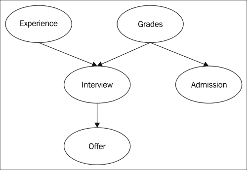

在前面代码片段的查询中，我们可以看到 p 值小于 0.05，`Grades`和`Offer`变量可以认为是不独立的。由于 D 分离规则规定，给定工作面试网络，`Grades`和`Offer`之间有一条活跃的轨迹，如果观察到`Interview`变量，这条轨迹就会被阻断。如果我们观察位于`Grades`和`Offer`之间的`Interview`变量会发生什么？：

```py
X,Y='Grades','Offer'
c,p,w=learner.discrete_condind(data,X,Y,['Interview'])
print "Independence between X and Y: ",c," p-value",p," witness node ",w
```

前面代码的输出如下:

现在，`Grades`和`Offer`是条件独立的(因为 p 值远大于 0.05)。在给定其他见证变量的情况下，算法的第一阶段基本上试图确定网络中所有节点对的条件独立性。然后，我们剩下一组节点之间的无向依赖关系。

```py
Independence between X and Y:  2.79444519518  p-value 0.993172910586  witness node  ['Interview']

```

算法的第二和第三阶段基本上包含在`discrete_constraint_estimatestruct`方法中，其中依赖集被转换成无向图。然后，方向性被解决。这在以下代码中显示:

```py
result=learner.discrete_constraint_estimatestruct(data)
print result.E
```

前面代码的输出如下:

```py
[[u'Grades', u'Admission'], [u'Experience', u'Interview'], [u'Grades', u'Interview'], [u'Interview', u'Offer']]

```

`result.E`变量返回网络中学习到的有向边，每条边都是包含该边的起点和终点节点的列表。我们可以看到，求职面试网络中的四条原始边已经找到了。然而，这是一个小网络。这种算法会扩展到更大的网络吗？

我们现在来看看`alarm_network.ipynb` IPython 笔记本，其中我们尝试在更大的数据集上使用基于约束的方法。逻辑警报减少机制网络是一个贝叶斯网络，旨在提供一个警报消息系统来监控患者。这个网络有 37 个顶点和 46 条边，比我们目前使用的 5 个顶点和 4 条边的求职面试网络要大得多。

数据集可以在[http://www.cs.ru.nl/~peterl/BN/alarm.csv](http://www.cs.ru.nl/~peterl/BN/alarm.csv)找到，通常称为报警网络。关于数据集的更多信息(如列描述)可在[http://www.bnlearn.com/documentation/man/alarm.html](http://www.bnlearn.com/documentation/man/alarm.html)找到。

让我们使用`pandas`库加载`alarm.csv`文件，如下代码所示:

```py
import pandas as pd
import numpy as np
df=pd.read_csv("alarm.csv")
```

`alarm.csv`文件中有记录，我们应该将其转换为`libpgm`可以使用的格式。每个实例应该是一个字典，其中键是列名，值是列值。下面的函数执行格式转换，并返回一个字典列表，这些字典是从原始数据集中采样而不替换的。这在以下代码中显示:

```py
from random import randint,sample

def rand_index(dframe,n_samples=100):
rindex =  np.array(sample(xrange(len(dframe)) ,n_samples if n_samples<=len(dframe) else len(dframe)))
    return [{i:j.values()[0] for i,j in dframe.iloc[[k]].to_dict().items()} for k in rindex ]

#Lets examine a single sample:
rand_index(df,n_samples=1)
```

前面的代码给出了以下输出:

```py
 [{'Anaphylaxis': 'b',
 'ArtCOb': 'b',
 'BP': 'c',
 'CO': 'a',
 'CVP': 'a',
 ….<rows elided>
}]

```

让我们加载数据，创建一个学习者对象的实例，并用少量样本(100 个)估计结构，如下面的代码所示:

```py
from libpgm.nodedata import NodeData
from libpgm.graphskeleton import GraphSkeleton
from libpgm.discretebayesiannetwork import DiscreteBayesianNetwork
from libpgm.pgmlearner import PGMLearner

data=rand_index(df,n_samples=100)
learner = PGMLearner()
result=learner.discrete_constraint_estimatestruct(data)
print result.E
```

前面代码的输出如下:

```py
[['VentLung', 'MinVol'], ['HR', 'HRBP'], ['LVFailure', 'History'], ['BP', 'TPR'], ['SaOb', 'Shunt'], ['Intubation', 'Shunt'], ['PCWP', 'LVEDVolume'], ['Hypovolemia', 'LVEDVolume']]

```

为了比较`libpgm`学习的结构与正确报警网络的性能，让我们加载`parent-child.txt`文件中描述的正确报警网络。该文件的每一行都包含父顶点，后跟子顶点(在某些情况下，某些节点是没有子节点的叶节点)。这在以下代码中显示:

```py
file = open('parent-child.txt', 'r')

def edges(line):
st=line.strip('\n').strip(' ').split(' ')
    #print st
    return [[st[0],i] for i in st[1:] ]

all_edges=[l for line in file for l in edges(line)]
#a set containing the correct edges
ground_truth=set([tuple(i) for i in all_edges])
print all_edges[:5]
```

前面代码的输出如下:

```py
[['HISTORY', 'LVFAILURE'], ['CVP', 'LVEDVOLUME'], ['PCWP', 'LVEDVOLUME'], ['LVEDVOLUME', 'HYPOVOLEMIA'], ['LVEDVOLUME', 'LVFAILURE']]

```

让我们定义一个诊断函数，将找到的网络与正确的网络进行比较。我们希望查询两者中的边数，以及具有正确方向的边数和正确连接节点但方向错误的边数。代码如下:

```py
def printdiag(result):
    found=set([tuple([j.upper() for j in i]) for i in result.E])
    correct=ground_truth.intersection(found)
    undirected_common_edges=[(i,j) for i,j in found for k,l in ground_truth if i.find(k)!=-1 and j.find(l)!=-1]
    print "Number of edges in learnt network ",len(found)
    print "Total number of edges in true network ",len(ground_truth)
    print "Number of edges with correct directionality ",len(correct)
    print "Number of edges with incorrect directionality ",len(undirected_common_edges)
```

让我们定义一个函数，当数据集选取特定数量的样本时，该函数打印结果统计，如下所示:

```py
def learn_structure(n_samples):
    data=rand_index(df,n_samples)
    learner = PGMLearner()

result1=learner.discrete_constraint_estimatestruct(data)
printdiag(result1)

learn_structure(1000)
```

前面代码的输出如下:

```py
Number of edges in learnt  36
Total number of edges in true network  46
Number of edges with correct directionality  6
Number of edges with incorrect directionality  7

```

让我们检查一下`learn_structure`方法在提供 1000 个样本时的性能，如下面的代码所示。它找到的边不到一半，只有几条边正确地连接了节点。增加样本量有帮助吗？(这可能需要几分钟来运行。):

```py
learn_structure(10000)
```

前面代码的输出如下:

```py
Number of edges in learnt network  30
Total number of edges in true network  46
Number of edges with correct directionality  2
Number of edges with incorrect directionality  3

```

我们可以看到，样本的数量仍然不足以提高正确识别的边的数量。算法没有学习到正确的结构并不奇怪，因为复杂性呈指数增长。精确方法的可行节点数据说约为 30 个(卡西欧·德·坎波斯，ICML，2009)。算法的复杂度为`O(n<sup>d+2</sup>` `)`运行时间，其中`n`为顶点数，`d`为见证集的上限。该算法的各种版本试图约束见证集以提高其性能(这在[第 2 章](2.html "Chapter 2. Directed Graphical Models")、*定向图形模型*([http://arxiv.org/pdf/1111.6925.pdf](http://arxiv.org/pdf/1111.6925.pdf))中有所描述)。

## 基于约束的方法概述

基于约束的方法是一种可以学习有向和无向图形模型的结构的方法。这些方法对数据中的噪声相当敏感，会产生错误的独立性假设，导致网络错过寻找 I-等价结构的机会。它们不能扩展到具有大量节点的网络，这可以通过将边界设置为见证集的大小来改善。

# 基于分数的学习

基于分数的方法是分配一个分数，该分数指示一个图与数据的匹配程度，然后在所有可能的网络结构的空间中搜索，以找到一个最大化分数的图。基于分数的方法加强了稀疏性(更少的边)。这就产生了一个优化问题，我们需要搜索指数级的网络结构。

## 可能性得分

给定特定的图结构 g，似然分数是使数据的似然性最大化的分数。最大似然估计 g 的参数。通常，使用似然分数的对数。可能性分数分解为以下公式:


等式的右侧由两项组成:

第一项是图中节点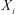与其父节点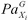之间的互信息之和(由表示)。互信息是一个信息论标准，可以理解为两个随机变量*X<sub>1</sub>T9】和*X<sub>2</sub>T13】的联合分布和边际分布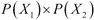的乘积之间的平均距离。**

第二项是每个随机变量的熵之和。可以观察到它独立于它的双亲(因此独立于图结构)。 *M* 为样本数。

可能性得分背后的直觉是，如果一个变量与其父变量相关，那么网络的结构会更好。换句话说，得分较高的图会将变量及其父变量放在一起。

让我们比较一下包含两个随机变量的简单网络的得分，如下图所示:

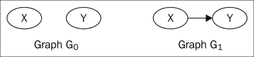

为了比较两个网络之间的分数，我们可以减去它们的分数(使用前面的等式)。

我们可以看到，当我们减去分数后，(第二个)熵项抵消，只剩下第一个项，这是 *X* 和 *Y* 之间的互信息。这显示在以下公式中:


互信息得分总是大于或等于零。当两个随机变量 X 和 Y 独立时，互信息应该为零。然而，在现实世界中，我们可能会在数据集中遇到统计噪声，给定足够的样本，随机变量之间总是会有一些依赖关系，从而导致互信息的非零值。

为什么这对我们很重要？这很重要，因为互信息项奖励网络增加一条边，很少奖励网络移除一条边，因此密集连接的网络比稀疏连接的网络获得更高的分数。

这种现象被称为过拟合，正如我们从机器学习文献中所知，这是需要避免的(因为它使 PGM 中的参数学习变得复杂)。避免过拟合的方法包括限制父对象和参数的数量。其他评分函数(我们将在后面的章节中看到)规定惩罚过度拟合，并且可以在足够连接的网络和它与数据的拟合之间建立折衷。

## 贝叶斯信息准则得分

试图提高可能性分数的评分函数试图以各种方式惩罚复杂性。**贝叶斯信息标准**(**【BIC】**)和**阿卡克信息标准**(**【AIC】**)是衡量统计模型与数据拟合质量的信息论得分。BIC 评分采用的方法是从可能性(第一项)中减去惩罚项(以下公式中的第二项)，如下式所示:


这里， *M* 是训练实例的数量，*Dim【G】*是分布中独立参数的数量(在联合分布中，独立参数的数量是联合分布中的总行数减一)。第二项试图将似然项添加边的倾向限制为参数和训练实例数量的函数。

第二个术语只是平衡模型复杂性和它对数据的适应性之间的折衷的一种方法。如果把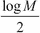换成 *1* ，就叫 AIC。BIC 评分的否定被称为**最小描述长度** ( **MDL** )标准。

已经表明，BIC 分数具有一种称为一致性的属性。随着数据实例的数量逐渐增加，图 G 的正确结构(或任何其他 I 等价结构)获得最大得分。

## 贝叶斯得分

另一类评分函数使用贝叶斯原理对可能的结构空间和可能的参数进行平均，以找到最适合数据和参数的图形结构。像`BDE`和`BDEU`(贝叶斯狄利克雷的变体)这样的评分函数存在于贝叶斯保护伞下，但是它们使用不同的结构和参数优先级。

与所有贝叶斯方法一样，当数据实例数量较低时，先验(结构和参数)将产生较大的影响。但是，随着实例数量的增加，数据量会降低先前的强度。因此，对于少量的数据实例，贝叶斯得分低于数据。

贝叶斯方法的渐近行为产生了类似于 BIC 分数的分数，并且它们很少过度拟合数据。

在下面的笔记本(`bnfinder.ipynb`)中，我们现在将使用`BNFinder`库，使用基于分数的方法来学习贝叶斯网络的结构。

`BNFinder`工具实现了多种基于分数的方法，如`BDE`、`MIT`和`MDL`。可以使用`pip install BNFinder`命令安装 BNFinder。

在使用数据集找到关系之前，`BNFinder`工具允许我们将诸如潜在父母和已知边等先验信息添加到模型中。

让我们加载必要的导入并创建我们将使用的评分函数(`BDe`)。我们将使用默认参数值，如以下代码所示:

```py
fromBNfinder.BDEimportBDE
fromBNfinder.dataimportdataset

score=eval("BDE")(data_factor=1.0,chi_alpha=.9999,sloops=False)
score
```

前面代码的输出如下:

```py
<BNfinder.BDE.BDE instance at 0x00000000124EB688>

```

我们创建了一个数据集对象，并从一个文件中加载它。`job_interview_samples.txt`文件包含从`libpgm'srandomsample()`方法生成的样本。生成样本的代码可以在 IPython 笔记本作业`_interview_samples.ipynb`中找到。

`BNFinder`工具使用的数据集格式是普通数据集的转置。如果普通数据集有三列，则每个实例行包含三个值。但是`BNFinder`数据集格式将有三行，一行将包含该列的所有值。

让我们创建以下方法，读入数据集，执行结构学习，并将输出保存为`.bif`格式，并写出 CPDs。其他进行贝叶斯推理的工具使用**贝叶斯交换格式** ( **BIF** )。

```py
def learn_structure(sample_data,dataset_name):
    d = dataset(dataset_name).fromNewFile(open(sample_data))
    score2,g,subpars = d.learn(score=score,data_factor=1.0)
    d.write_bif(g,dataset_name+".bif")
    d.write_cpd(g,file(dataset_name+"_cpd.txt","w"))
    return score2,g,subpars
```

我们现在将尝试从求职面试网络的样本数据中学习结构，如以下代码所示:

```py
s,g,sp=learn_structure("job_interview_samples.txt","job_interview")
g
```

图表信息如下:

```py
 Admission(Admission) => Grades(-),
 Experience(Experience) => Grades(+), Interview(+),
 Grades(Grades) => Admission(-), Experience(+), Interview(+),
 Interview(Interview) => Experience(+), Grades(+), Offer(+),
 Offer(Offer) => Interview(+),

```

图的输出是边的列表，父在左边，子在右边。加号/减号表示节点之间的正/负相关性。

虽然代码很快终止，但它找不到正确的边，除了面试-提供和成绩-录取之间的边。`BNFinder`工具确实提供了通过使用两种方法将我们的直觉/领域知识添加到结构发现过程中的机会:我们可以为给定顶点定义已知的父节点列表，或者指定一个**调节器**(来自`BNFinder`工具在生物网络重建中的根的技术术语)，这将约束网络仅允许列出的节点作为根节点或所有顶点的潜在父节点。

我们可以将调节器添加到样本数据文件的序言部分，该部分保存在`job_interview_samples_preamble1.txt`中。如果您的系统外壳中有 head 命令，以下命令应该可以工作。

`preamble`段第一行提示`Experience`和`Grades`在网络的根，没有父母，如下代码所示:

```py
!head -1 job_interview_samples_preamble1.txt
#regulators Experience Grades

```

```py
s,g,sp=learn_structure("job_interview_samples_preamble1.txt","job_interview")
g
```

图表信息如下:

```py
 Admission(Admission) =>
 Experience(Experience) => Interview(+), Offer(+),
 Grades(Grades) => Admission(-), Interview(+), Offer(+),
 Interview(Interview) =>
 Offer(Offer) =>

```

这次我们看到其他种类的错误，`Interview`和`Offer`之间的边缘消失了。我们将以下行添加到`preamble`部分(从父宏开始)。指定`Interview`顶点的父节点为`Experience`和`Grades`，如下图所示:

```py
!head -2 job_interview_samples_preamble2.txt
#regulators Experience Grades
#parents Interview Experience Grades

```

```py
s,g,sp=learn_structure("job_interview_samples_preamble2.txt","job_interview")
g
```

图表信息如下:

```py
 Admission(Admission) =>
 Experience(Experience) => Interview(+), Offer(+),
 Grades(Grades) => Admission(-), Interview(+), Offer(+),
 Interview(Interview) =>
 Offer(Offer) =>

```

获得的边缺少面试-录用的边。

我们可以添加三个约束，指定`Experience`和`Offer`的父以及监管者。代码如下:

```py
!head -3 job_interview_samples_preamble3.txt
#regulators Experience Grades
#parents Interview Experience Grades
#parents Offer Interview

```

```py
s,g,sp=learn_structure("job_interview_samples_preamble3.txt","job_interview")
#save the file to open in cytoscape
net_str=g.to_SIF()
f=open("job_interview_sif.txt","w")
f.write(net_str)
f.close()
g
```

图表信息如下:

```py
 Admission(Admission) =>
 Experience(Experience) => Interview(+),
 Grades(Grades) => Admission(-), Interview(+),
 Interview(Interview) => Offer(+),
 Offer(Offer) =>

```

在`preamble`部分指定了前面的元素之后，我们就到达了正确的网络。

我们可以使用细胞景观工具查看创建的网络，这也允许我们导出找到的节点和边。文件在细胞景观中的查看和保存是离线完成的，在这里展示。细胞角读取。`sif`文件创建(在前面的片段中)并可以导出一个`.png`图像，如下代码所示:

```py
Image("job_net.png")
```


我们也可以将`BNFinder`工具基于分数的方法应用于更大的数据集。它比 libpgm 中基于约束的方法更有效，但它需要手握(通过添加已知边)来防止无环性并更快完成。

在下一个片段中，我们将尝试学习真实世界网络的结构。这个数据集由不同扰动下蛋白质信号网络状态的测量组成。虽然在应用结构学习算法之前，一些信令关系是已知的，但是所学习的结构被用来阐明传统报道的关系，以及以贝叶斯网络的形式推断新的网络因果关系。

以下示例摘自`BNFinder`项目文档:

```py
s,g,sp=learn_structure("sachs.inp","sachs")
net_str=g.to_SIF()
f=open("sachs_cpd.sif","w")
f.write(net_str)
f.close()
```

以下是细胞角为网络生成的图像。该网络从真实数据集中的 17 条边中提取 11 条正确的边。

```py
Image(filename='sachs_network.png')
```


我们可以得出结论，从现实世界网络中导出的数据集学习完美的网络结构是不现实的，尤其是当随机变量的数量大于一个小数字时。结构学习算法通常通过首先结合领域知识(节点之间的已知边)，然后使用数据或者经验地验证这些边的合理性，或者学习领域专家未知的新边来使用。

## 基于分数的学习总结

从计算的角度来看，基于分数的方法使用的优化角度是 NP 难的，相比之下，基于约束的方法具有低多项式时间复杂度。避免 NP 难度复杂性的其他方法是启发式搜索算法(如贪婪爬山、禁忌搜索和模拟退火)来执行图结构的局部搜索。这些方法使用相似的评分函数来评估结构对数据的适合度，并且它们的效率来源于要搜索的图结构的空间的减少。

由于我们经常使用学习的结构来运行推理查询，我们必须记住贝叶斯网络中的推理是 NP 难的。即使是近似推理也是 NP 难的。因此，我们努力学习图形结构，这将使我们能够快速推断。因此，PGM 社区倾向于学习特定类别的结构(如树和森林)，对于这些结构，结构学习和推理都更容易管理。

树木因其理想的特性而受到青睐。即使在高维空间中，也可以使用优化方法来学习它们的结构，并且参数的数量可以保持较低。

# 总结

在这一章中，我们首先看了从数据中学习网络结构。我们研究了两种方法，一种基于约束，另一种基于评分函数。此外，我们运行了一些 Python 示例来查看这些算法的运行情况。我们了解到，为了找到最佳结构，我们必须在指数数量的结构上进行搜索，因此树和森林是优于一般图的结构。

在下一章中，我们将学习参数学习以及如何为我们已经知道的图结构定义参数。