# 一、机器学习中的思维

机器学习系统具有深刻而令人兴奋的能力，能够为各种各样的应用提供重要的见解；从开创性和拯救生命的医学研究，到发现我们宇宙的基本物理方面。从为我们提供更好、更清洁的食物，到网络分析和经济建模。事实上，我们生活中几乎没有任何领域没有被这项技术以某种方式触及。随着物联网的扩展，产生了惊人数量的数据，很明显，智能系统正在以相当戏剧性的方式改变社会。有了开源工具，例如 Python 及其库提供的工具，以及以 Web 为代表的不断增长的开源知识库，以新的令人兴奋的方式学习和应用这项技术相对容易且便宜。在本章中，我们将涵盖以下主题:

*   人类接口
*   设计原则
*   模型
*   统一建模语言

# 人机界面

对于那些年龄足够大，或者不幸使用了早期版本的微软办公套件的人来说，你们可能会记得 Clippy 先生的办公助手。这项功能最早是在 Office 97 中引入的，每当您在文档开头键入“亲爱的”一词时，它都会不请自来地从计算机屏幕的右下角弹出，并提示“看起来您正在写信，您需要帮助吗？”。

在早期版本的 Office 中默认打开的 Clippy 先生几乎被该软件的用户普遍嘲笑，并可能作为机器学习的第一个大失败而载入史册。

那么，为什么快乐的克利珀先生这么讨厌呢？显然，处于消费软件开发前沿的微软员工并不愚蠢，自动化助理可以帮助完成日常办公任务的想法并不一定是个坏主意。事实上，自动化助理的后期化身，至少是最好的自动化助理，在背景下无缝运行，并显著提高了工作效率。考虑预测文本。有很多例子，有些非常有趣，说明预测文本出现了惊人的错误，但在大多数情况下，它并没有失败，它没有被注意到。它只是成为我们正常工作流程的一部分。

此时，我们需要区分错误和失败。Clippy 先生之所以失败，是因为它过于张扬且设计拙劣，不一定是因为它出错了；也就是说，它可以提出正确的建议，但很可能你已经知道你正在写信。预测文本有很高的错误率，也就是说，它经常把预测弄错，但它不会失败，主要是因为它被设计成失败的方式:不引人注目。

用系统工程的话来说，任何具有紧密耦合的人机界面的系统的设计都是困难的。人类的行为，就像一般的自然世界一样，不是我们总能预测到的。表情识别系统、自然语言处理和手势识别技术等等，都开辟了人机交互的新途径，这对机器学习专家来说有着重要的应用。

每当我们设计一个需要人工输入的系统时，我们需要预测可能的方式，而不仅仅是预期的方式，人类将与系统交互。本质上，我们试图用这些系统来做的是向它们灌输对人类经验的广阔全景的一些理解。

在网络的最初几年，搜索引擎使用一个简单的系统，该系统基于搜索词在文章中出现的次数。Web 开发人员很快开始通过增加关键搜索词的数量来玩这个系统。显然，这将导致关键词军备竞赛，并导致一个非常无聊的网络。衡量优质入站链接数量的页面排名系统旨在提供更准确的搜索结果。当然，现在现代搜索引擎使用更复杂和秘密的算法。

对于 ML 设计者来说，同样重要的是生成的数据量不断增加。这带来了几个挑战，最明显的是它的巨大。然而，算法在提取知识和见解方面的能力是巨大的，而这在较小的数据集上是不可能的。因此，许多人类互动现在已经数字化，我们才刚刚开始了解和探索这些数据可以被使用的许多方式。

作为一个好奇的例子，考虑研究*20世纪书籍*中的情绪表达(Acerbi 等人，2013)。虽然严格来说更多的是数据分析研究，而不是机器学习，但它是说明性的，原因有几个。它的目的是用情绪评分的方式，从 20 世纪的书籍中提取文本，绘制情感内容的图表。通过古腾堡数字图书馆项目、WordNet([http://wordnet.princeton.edu/wordnet/](http://wordnet.princeton.edu/wordnet/))和谷歌的 **Ngram** 数据库([books.google.com/ngrams](http://books.google.com/ngrams))获得大量数字化文本后，这项研究的作者能够绘制出 20 世纪文化变迁的地图，反映在当时的文献中。他们通过描绘*语气*词语的使用趋势来做到这一点。

在这项研究中，作者将每个单词(*标记为 1 克*，并将其与情绪评分和发表年份联系起来。我们可以看到，情绪词，如快乐、悲伤、恐惧等，可以根据它们唤起的积极或消极情绪来评分。心情评分来自 WordNet([wordnet.princeton.edu](http://wordnet.princeton.edu))。WordNet 为每个情绪词分配一个情感分数。最后，作者简单统计了每个情绪词的出现次数:

这里， *ci* 是特定语气词的计数， *n* 是语气词的总计数(不是所有的词，只是带有语气分数的词)*CtheT7】是文字中 *the* 的计数。这将总和正常化，以考虑到一些年份更多的书被写入(或数字化)。此外，由于许多后来的书倾向于包含更多的技术语言，单词*被用来规范化，而不是得到总字数。这在散文文本中给出了一个更准确的长时间的情感表达。最后，根据正态分布 *M z* 通过减去平均值并除以标准差来归一化得分。**

 *

这个数字取自 20 世纪 T2 图书公司(阿尔伯托·阿西尔比、瓦西利奥斯·兰波斯、菲利普·加内特、r·亚历山大·本特利)PLOS 的《情感的表达》。

在这里，我们可以看到这项研究生成的图表之一。它显示了这一时期所写书籍的喜悲评分，并清楚地显示了与二战时期相关的负面趋势。

这项研究之所以有趣，有几个原因。首先，它是数据驱动科学的一个例子，以前被认为是软的科学，如社会学和人类学，被赋予了坚实的经验基础。尽管有一些令人印象深刻的结果，这项研究相对容易实施。这主要是因为大部分艰苦的工作已经由 WordNet 和谷歌完成了。这突出了如何使用互联网上免费提供的数据资源，以及软件工具，如 Python 的数据和机器学习包，任何有数据技能和动机的人都可以在这项工作的基础上再接再厉。

# 设计原则

系统设计和设计其他东西，比如房子，经常会有相似之处。这个类比在一定程度上成立。我们试图将设计组件放入符合规范的结构中。当我们考虑他们各自的操作环境时，这个类比就失效了。在房屋的设计中，一般认为景观一旦形成，就不会改变。

软件环境略有不同。系统是互动和动态的。我们设计的任何系统都将嵌套在其他系统中，无论是电子系统、物理系统还是人类系统。同样，计算机网络中的不同层(应用层、传输层、物理层等)嵌套了不同的含义和功能集，因此在项目的不同级别执行活动。

作为这些系统的设计者，我们还必须对环境有强烈的意识，也就是我们工作的领域。这些知识为我们提供了数据模式的线索，并帮助我们为工作提供背景。

机器学习项目可以分为五个截然不同的活动，如下所示:

*   定义对象和规范
*   准备和探索数据
*   模型结构
*   履行
*   测试
*   部署

设计师主要关心前三个。然而，他们经常在其他活动中发挥重要作用，而且在许多项目中必须发挥重要作用。还应该说，项目的时间表不一定是这些活动的线性序列。重要的是，它们是不同的活动。它们可能相互平行发生，也可能以其他方式相互作用，但它们通常涉及不同类型的任务，这些任务可以在人力和其他资源、项目阶段和外部性方面分开。此外，我们需要考虑不同的活动涉及不同的运作模式。当你勾画出一个想法时，考虑一下你的大脑工作的不同方式，与你从事一个特定的分析任务，比如一段代码相比。

通常，最难的问题是从哪里开始。我们可以开始钻研一个问题的不同元素，有一个特征集的想法，也许还有一个我们可能使用的模型的想法。这可能会导致一个定义的对象和规范，或者我们可能不得不做一些初步的研究，比如检查可能的数据集和来源、可用的技术，或者与系统的其他工程师、技术人员和用户交谈。我们需要探索经营环境和各种制约因素；它是 web 应用程序的一部分，还是科学家的实验室研究工具？

在设计的早期阶段，我们的工作流程会在处理不同的元素之间切换。例如，我们从一个一般的问题开始——也许有一个任务的想法，或者解决它所必需的任务——然后我们把它分成我们认为是关键的特征，用一个玩具数据集在几个模型上尝试它，回去细化特征集，调整我们的模型，精确地定义任务，并细化模型。当我们觉得我们的系统足够健壮时，我们可以用一些真实的数据来测试它。当然，然后我们可能需要回去更改我们的功能集。

选择和优化特征通常是机器学习设计者的一项主要活动(实际上，本身就是一项任务)。在充分描述任务之前，我们无法真正决定我们需要什么特征，当然，任务和特征都受到我们可以构建的可行模型类型的限制。

## 问题类型

作为设计师，我们被要求解决一个问题。我们得到了一些数据和一个预期的输出。第一步是以一种机器可以理解的方式，以一种对人类有意义的方式来构建问题。我们可以采用以下六种方法来精确定义我们的机器学习问题:

*   **探索性**:这里我们分析数据，寻找一个趋势或者变量之间的关系等模式。探索通常会导致一种假设，比如将饮食与疾病联系起来，或者将犯罪率与城市住宅联系起来。
*   **描述性**:这里我们尝试总结一下我们数据的具体特征。例如，平均寿命，平均温度，或人口中左撇子的数量。
*   **推理**:推理问题是一个试图支持假设的问题，例如，通过使用不同的数据集来证明(或否定)预期寿命和收入之间的一般联系。
*   **预测性**:在这里，我们正在尝试预测未来的行为。例如，通过分析收入来预测预期寿命。
*   **偶然的**:这是一次的尝试，试图找出是什么导致了一些事情。低收入会导致预期寿命降低吗？
*   **机械论**:这试图回答诸如“是什么机制将收入与预期寿命联系起来？”

大多数机器学习问题在开发过程中都会涉及到这几种类型的问题。例如，我们可以首先探索数据，寻找模式或趋势，然后描述数据的某些关键特征。这可能使我们能够做出预测，并找到特定问题背后的原因或机制。

## 你问的问题对吗？

这个问题在它的主题领域里必须是合理的和有意义的。这些领域知识使你能够理解数据中重要的东西，并看到某个模式或相关性在哪里有意义。

问题应该尽可能具体，同时仍然给出有意义的答案。它通常以一个概括的说法开始，比如“我想知道富有是否意味着健康”。因此，你做一些进一步的研究，发现你可以得到按地理区域划分的财富统计数据，比如说从税务局。我们可以通过健康的反义词来衡量健康，也就是疾病，比如住院人数，我们可以通过将疾病与地理区域联系起来来检验我们最初的主张，“富裕意味着健康”。我们可以看到，一个更具体的问题依赖于几个可能有问题的假设。

我们还应该考虑到，我们的结果可能会被这样一个事实所混淆，即穷人可能没有医疗保险，因此尽管生病，他们去医院的可能性也更小。我们想要发现的东西和我们试图测量的东西之间是相互作用的。这种互动或许隐藏了真实的患病率。然而，一切都没有失去。因为我们知道这些事情，那么也许我们可以在我们的模型中解释它们。

通过尽可能多地了解我们正在从事的领域，我们可以让事情变得更容易。

你可以通过检查你正在问的问题，或者其中的一部分，是否已经被回答，或者是否有数据集可以帮助你解决这个问题，从而节省很多时间。通常，你必须同时从几个不同的角度来处理一个问题。尽可能多做准备性研究。很有可能其他设计师已经完成了可以给你自己带来启发的工作。

## 任务

任务是在一段时间内进行的特定活动。我们必须区分人工任务(规划、设计和实现)和机器任务(分类、聚类、回归等等)。还要考虑当人和机器重叠时，例如，在为模型选择特征时。我们在机器学习中的真正目标是尽可能多地将这些任务从人工任务转换为机器任务。

将现实世界的问题与特定的任务相匹配并不总是容易的。许多现实世界的问题看似在概念上有联系，但需要截然不同的解决方案。或者，看起来完全不同的问题可能需要类似的方法。不幸的是，没有简单的查找表来匹配特定的任务和问题。很大程度上取决于设置和领域。一个领域的类似问题在另一个领域可能无法解决，也许是因为缺乏数据。然而，有少量的任务应用于大量的方法来解决许多最常见的问题类型。换句话说，在所有可能的编程任务的空间中，有一个对我们的特定问题有用的任务子集。在这个子集中，有一个较小的任务子集，这些任务很容易，实际上可以有效地应用于我们的问题。

机器学习任务发生在三大设置中:

*   **监督学习**:这里的目标是从标记的训练数据中学习一个模型，该模型允许对看不见的未来数据进行预测。
*   **无监督学习**:这里我们处理未标记的数据，我们的目标是在这个数据中找到隐藏的模式，提取有意义的信息。
*   **强化学习**:这里的目标是开发一个系统，基于它与环境的交互来提高它的性能。这通常包括一个奖励信号。这类似于监督学习，只是强化学习使用奖励函数来不断提高其性能，而不是有一个标记的训练集。

现在，让我们来看看一些主要的机器学习任务。下图应该给你一个起点，让你尝试并决定什么类型的任务适合不同的机器学习问题:

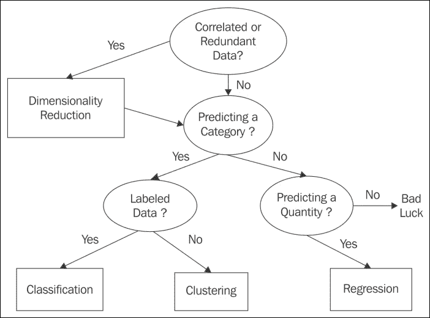

### 分类

分类可能是最常见的任务类型；这在一定程度上是因为它相对容易，容易理解，并且解决了许多常见的问题。分类是指根据一组实例的特征为其分配类。这是一种监督学习方法，因为它依赖于一个标记的训练集来学习一组模型参数。然后，该模型可以应用于未标记的数据，以预测每个实例属于哪个类。大致有两种分类任务:**二进制分类**和T5】多类分类。典型的二进制分类任务是电子邮件垃圾邮件检测。在这里，我们使用电子邮件的内容来确定它是否属于两个类别之一:垃圾邮件还是非垃圾邮件。多类分类的一个例子是手写识别，我们试图预测一个类，例如，字母名称。在这种情况下，我们对每个字母数字字符都有一个类。多类分类有时可以通过将二进制分类任务链接在一起来实现，然而，我们以这种方式丢失信息，并且我们无法定义单个决策边界。因此，多类分类通常与二类分类分开处理。

### 回归

有些情况下，我们感兴趣的不是离散类，而是连续变量，例如概率。这些类型的问题是回归问题。回归分析的目的是了解输入、自变量的变化如何影响因变量的变化。最简单的回归问题是线性的，包括将一条直线拟合到一组数据上，以便进行预测。这通常是通过最小化训练集中每个实例的误差平方和来实现的。典型的回归问题包括根据症状的范围和严重程度估计疾病的可能性，或者根据过去的表现预测考试成绩。

### 聚类

聚类是最著名的无监督方法。在这里，我们关注的是对未标记数据集中的实例之间的相似性进行度量。我们经常使用几何模型根据实例的特征值来确定实例之间的距离。我们可以使用任意的接近度来确定每个实例属于哪个集群。聚类常用于数据挖掘和探索性数据分析。有各种各样的方法和算法来执行这项任务，其中一些方法包括基于距离的方法，以及为每个聚类找到一个中心点，或者使用基于分布的统计技术。

与聚类相关的是关联；这是一项无人监督的任务，要在数据中找到某种类型的模式。这项任务背后是产品推荐系统，如亚马逊和其他在线商店提供的产品推荐系统。

### 降维

许多数据集包含大量与每个实例相关的特征或测量值。这可能会在计算能力和内存分配方面带来挑战。同样，许多特征可能包含冗余信息或与其他特征相关的信息。在这些情况下，我们的学习模型的性能可能会显著下降。降维最常用于特征前置；它将数据压缩到较低维度的子空间中，同时保留有用的信息。当我们想要可视化数据时，通常通过将更高维度投影到一维、二维或三维上，也可以使用降维。

从这些基本的机器任务中，有许多衍生的任务。在许多应用中，这可能只是将学习模型应用于预测，以建立偶然的关系。我们必须记住解释和预测是不一样的。一个模型可以做出预测，但除非我们明确知道它是如何做出预测的，否则我们无法开始形成一个可理解的解释。解释需要人类对这个领域的知识。

我们还可以使用预测模型从一般模式中寻找异常。在这里，我们对偏离预测的个别情况感兴趣。这通常被称为**异常检测**在检测银行欺诈、噪声过滤，甚至寻找外星生命等方面有着广泛的应用。

一个重要且潜在有用的任务是子群发现。我们在这里的目标不是像在集群中那样，划分整个域，而是找到一个具有实质上不同分布的子组。本质上，子群发现是试图找到一个因变量和许多独立解释变量之间的关系。我们并不是试图找到一个完整的关系，而是一组不同的实例，这些实例在某些方面对领域很重要。例如，建立一个亚组，*吸烟者=真*和*家族史=真*作为*心脏病的目标变量=真*。

最后，我们考虑控制型任务。给定不同的条件，这些行为优化控制设置，以使收益最大化。这可以通过几种方式实现。我们可以克隆专家的行为:机器直接从人类那里学习，并在给定不同条件下对行动做出预测。任务是学习专家行为的预测模型。这类似于强化学习，任务是学习条件和最佳行动之间的关系。

### 错误

在机器学习系统中，软件缺陷会带来非常严重的现实后果；如果你嵌入流水线机器人的算法将人归类为生产组件，会发生什么？显然，在关键系统中，你需要为失败做好准备。在你的设计过程和系统中应该有一个健壮的故障和错误检测程序。

有时为了调试和检查逻辑缺陷，有必要设计非常复杂的系统。可能需要生成具有特定统计结构的数据集，或者创建*人工人类*来模拟界面。例如，开发一种方法来验证您的设计在数据、模型和任务级别的逻辑是否合理。错误可能很难追踪，作为一名科学家，你必须假设有错误，并试图证明不是这样。

识别并优雅地捕捉错误的想法对于软件设计者来说很重要，但是作为机器学习系统的设计者，我们必须更进一步。我们需要能够在我们的模型中捕捉从错误中学习的能力。

必须考虑我们如何选择测试集，特别是它在数据集的其余部分中的代表性。例如，如果与训练集相比它是有噪声的，那么它将在测试集上给出较差的结果，这表明我们的模型是过度拟合的，而事实上并非如此。为了避免这种情况，使用了交叉验证的过程。例如，这是通过将数据随机分成十个大小相等的块来实现的。我们使用九个组块来训练模型，一个用于测试。我们这样做 10 次，用每个组块测试一次。最后，我们取测试集性能的平均值。除了分类之外，交叉验证还用于其他有监督的学习问题，但是正如您所料，无监督的学习问题需要进行不同的评估。

对于无监督的任务，我们没有带标签的训练集。因此，评估可能有点棘手，因为我们不知道正确答案是什么样子的。例如，在一个聚类问题中，我们可以通过度量来比较不同模型的质量，例如聚类直径与聚类之间的距离之比。然而，在任何复杂的问题中，我们永远无法判断是否还有另一个模型尚未构建，哪个更好。

### 优化

优化问题在许多不同的领域无处不在，如金融、商业、管理、科学、数学和工程。优化问题包括以下内容:

*   我们希望最大化或最小化的目标函数。
*   决策变量，即一组可控输入。为了满足目标函数，这些输入在指定的约束条件内变化。
*   不可控或固定输入的参数。
*   约束是决策变量和参数之间的关系。它们定义了决策变量可以有哪些值。

大多数优化问题只有一个目标函数。在我们可能有多个目标函数的情况下，我们经常发现它们相互冲突，例如，降低成本和增加产量。在实践中，我们试图将多个目标重新表述为一个单一的函数，也许是通过创建目标函数的加权组合。在我们的成本和产出例子中，一个单位成本的变量可能会起作用。

决策变量是我们为了实现目标而控制的变量。它们可能包括资源或劳动力之类的东西。对于模型的每次运行，模块的参数是固定的。我们可以使用几个*情况*，在这里我们选择不同的参数来测试多个条件下的变化。

对于许多不同类型的优化问题，有成千上万种求解算法。其中大部分涉及到首先找到一个可行的解决方案，然后通过调整决策变量来迭代地改进它，希望找到一个最优的解决方案。许多优化问题可以用线性规划技术很好地解决。他们假设目标函数和所有约束对于决策变量是线性的。当这些关系不是线性时，我们通常使用合适的二次函数。如果系统是非线性的，那么目标函数可能不是凸的。也就是说，它可能有多个局部极小值，并且不能保证局部极小值是全局极小值。

### 线性规划

为什么线性模型如此普遍？首先，它们相对容易理解和实现。它们基于一个建立在 17 世纪中期的数学理论，这个理论后来在数字计算机的发展中发挥了关键作用。计算机的独特任务是实现线性程序，因为计算机在很大程度上是基于线性编程理论来概念化的。线性函数总是凸的，这意味着它们只有一个最小值。**线性规划** ( **线性规划**)问题通常用单纯形法求解。假设我们想要解决优化问题，我们将使用以下语法:

*最大 x1T3】+*x2T7】带约束:*2x1T11】+*x2≤4*和*x1T19】+*2x2≤3*****

我们假设*x1T3*x2T7】大于等于 0。我们需要做的第一件事是将其转换为标准形式。这是通过保证问题是一个最大化问题来完成的，也就是我们把 *min z* 转换为 *max -z* 。我们还需要通过添加非负松弛变量将不等式转化为等式。这里的例子已经是一个最大化问题，所以我们可以保持目标函数不变。我们确实需要将约束中的不平等改变为平等:**

*2x1T3】+*x2T7】+*x3= 4*和*x1T15】+*2x2T19】+*x4= 3*****

如果我们让 *z* cf 目标函数，那么我们可以写出以下内容:

*z-x1-x2= 0*

我们现在有以下线性方程组:

*   目标:*z-x1-x2*+*0*+*0 = 0*
*   约束 1:*2x1*+*x2*+*x3*+*0 = 4*
*   约束 2:*x1*+*2x2T7】+*0+x4= 3**

我们的目标是最大化 *z* ，记住所有变量都是非负的。我们可以看到*x1T5*x2T9】出现在所有方程中，被称为非基本方程。 *x 3* 和 *x 4* 值各只出现在一个等式中。它们被称为基本变量。我们可以通过将所有非基本变量赋给 0 来找到一个基本解。这里，这给了我们以下内容:**

*x1= x2= 0*；*x3= 4*；*x4= 3*； *z = 0*

记住我们的目标是最大化 *z* ，这是最佳解决方案吗？我们可以看到由于 *z* 在我们的线性系统的第一个方程中减去 *x 1* 和 *x 2* ，我们能够增加这些变量。如果这个方程中的系数都是非负的，那么就没有办法增加 *z* 。我们将知道，当目标方程中的所有系数都为正时，我们已经找到了最优解。

这里不是这样。所以，我们取目标方程中一个负系数的非基本变量(比如说 *x 1* ，叫做 **进入变量**)，用一个叫做**旋转**的技巧，把它从非基本变成基本变量。同时，我们将把一个基本变量，叫做 **离开变量**，变成一个非基本变量。我们可以看到 *x 1* 出现在两个约束方程中，那么我们选择哪一个做枢轴呢？记住我们需要保持系数为正。我们发现，通过使用枢轴元素，我们可以找到另一个基本解，该元素产生方程右侧与其各自输入系数的最低比率。对于 *x 1* ，在本例中，第一个约束为 *4/2* ，第二个约束为 *3/1* 。因此，我们将在约束 1 中使用 *x 1* 进行枢轴旋转。

我们将约束 *1* 除以 *2* ，得到如下结果:

*x1*+*x【2】*+*x*= 2

我们现在可以用 *x 1* 来写这个，然后代入其他方程，从那些方程中去掉 *x1* 。一旦我们完成了一点代数运算，我们就得到下面的线性系统:

*z-1/2x2*+*1/3 x3= 2*

*x1T3+*1/2 x2T7+*1/2x3= 2***

*3/2x2–1/2x3*+*x4= 1*

我们有另一个基本解决方案。但是，这是最优解吗？由于我们在第一个方程中还有一个负系数，所以答案是否定的，我们现在可以和 *x2* 进行同样的枢转过程，利用比值法则，我们发现可以在第三个方程中的 *3/2x2* 上进行枢转。这给了我们以下信息:

*z+1/3x3T3】+*1/3x4= 7/3**

*x1+2/3x3-1/3 x4= 5/3*

*x2-1/3x3T3+*2/3 x4= 2/3**

这就给了我们 *x 3 = x 4 = 0* ， *x 1 = 5/3* ， *x2 = 2/3* ， *z = 7/3* 的解决方案。这是最优解，因为在第一个方程中没有更多的否定。

我们可以用下面的图表来形象化这一点。阴影区域是我们将找到可行解决方案的区域:

双变量优化问题

### 车型

线性编程为我们提供了一种将现实世界的问题编码成计算机语言的策略。然而，我们必须记住，我们的目标不仅仅是解决一个问题的实例，而是创建一个模型，从新的数据中解决独特的问题。这就是学习的本质。一个学习模型必须有一个机制来评估它的输出，反过来，改变它的行为到一个更接近解决方案的状态。

这个模型本质上是一个假设，也就是对一个现象提出的解释。目标是让它对问题进行概括。在监督学习问题的情况下，从训练集中获得的知识被应用于未标记的测试。在无监督学习问题的情况下，例如聚类，系统不从训练集中学习。它必须从数据集本身的特征中学习，比如相似度。在这两种情况下，过程都是迭代的。它重复一组定义明确的任务，这使模型更接近正确的假设。

模型是机器学习系统的核心。他们正在学习什么。有许多模型，这些模型有许多变化，也有独特的解决方案。我们可以看到机器学习系统解决的问题(回归、分类、关联等)出现在许多不同的设置中。它们已经成功地应用于科学、工程、数学、商业的几乎所有分支，以及社会科学；他们和他们经营的领域一样多样化。

这种模型的多样性给了机器学习系统很大的解决问题的能力。然而，对于设计师来说，决定哪一个或哪几个模型是解决特定问题的最佳模型也可能有点令人生畏。让事情变得复杂的是，通常有几个模型可以解决你的任务，或者你的任务可能需要几个模型。当你着手这样一个项目时，你根本不知道哪一个是解决原始问题的最准确和最有效的途径。

为了我们在这里的目的，让我们把这个广阔的画布分成三个重叠的、非相互的和排他的类别:几何的、概率的和逻辑的。在这三个模型中，必须区分模型如何划分实例空间。实例空间可以被视为数据的所有可能实例，无论每个实例是否出现在数据中。实际数据是实例空间的空间子集。

划分这个空间有两种方法:分组和分级。两者的主要区别在于分组模型将实例空间划分为称为**段**的固定离散单元。它们的分辨率是有限的，无法区分超过这个分辨率的类。另一方面，放坡会在整个实例空间上形成一个全局模型，而不是将空间分割成段。理论上，它们的分辨率是无限的，无论实例有多相似，它们都可以区分它们。分组和分级之间的区别不是绝对的，许多模型都包含两者的元素。例如，线性分类器通常被认为是分级模型，因为它基于连续函数。然而，存在线性模型不能区分的情况，例如，平行于决策边界的线或表面。

#### 几何模型

几何模型使用实例空间的概念。几何模型最明显的例子是当所有的特征都是数字的，并且可以成为笛卡尔坐标系统中的坐标。当我们只有两三个特征时，它们很容易被可视化。然而，由于许多机器学习问题有数百或数千个特征，因此维度，可视化这些空间是不可能的。然而，许多几何概念，如线性变换，仍然适用于这个超空间。这可以帮助我们更好地理解我们的模型。例如，我们期望许多学习算法是平移不变的，也就是说，我们将原点放在坐标系的什么位置并不重要。同样，我们可以使用欧几里得距离的几何概念来衡量实例之间的任何相似性；这为我们提供了一种方法来聚类相似的实例，并在它们之间形成决策边界。

假设我们使用线性分类器将段落分为快乐或悲伤，我们设计了一组测试。每个测试都与一个权重 *w* 相关联，以确定每个测试对整体结果的贡献程度。

我们可以简单地将每个测试相加并乘以它的权重，得到一个总分数，并创建一个决策规则，该规则将创建一个边界，例如，如果快乐分数大于一个阈值， *t* 。

每个特征对整体结果都有独立的贡献，因此规则是线性的。这种贡献取决于每个特征的相对权重。这个权重可以是正的，也可以是负的，在计算整体分数时，每个单独的特征不受阈值的限制。

我们可以用向量符号重写这个和，使用 *w* 作为权重向量(*w1T5】， *w 2 ，...w n* )和 *x* 为一个测试结果向量( *x 1 ，x 2 ，...，x n* )。此外，如果我们使其相等，我们可以定义决策边界:*

*w . x = t*

我们可以把 *w* 想象成一个指向正(快乐)例 *P* 和负例 *N* 的“质心”之间的向量。我们可以通过对以下各项求平均值来计算这些质心:

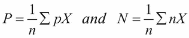

我们现在的目标是在这些质心中间创建一个决策边界。我们可以看到 *w* 与 *P - N* 成比例，或者相等， *(P + N)/2* 将在决策边界上。所以，我们可以写下以下内容:

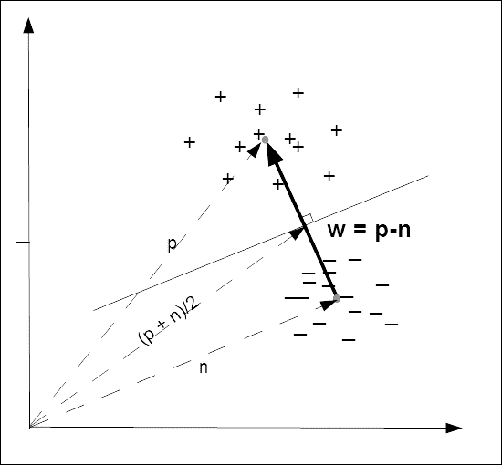

决策边界图

实际上，真实数据是有噪声的，不一定容易分离。即使数据很容易分离，特定的决策边界也可能没有太大的意义。考虑稀疏的数据，例如在文本分类中，与每个单词的实例数相比，单词数很大。在这个大面积的空实例空间中，可能很容易找到一个决策边界，但是哪个是最好的呢？选择的一种方法是使用一个边距来测量决策边界与其最近实例之间的距离。我们将在本书后面探讨这些技术。

#### 概率模型

概率模型的一个典型例子是贝叶斯分类器，给你一些训练数据( *D* ，和一个基于初始训练集的概率(一个特定的假设， *h* ，得到后验概率， *P (h/D)* )。

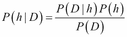

举个例子，假设我们有一袋弹珠。我们知道其中 40%是红色，60%是蓝色。我们还知道，一半的红色弹珠和所有的蓝色弹珠都有白色斑点。当我们把手伸进包里挑选大理石时，我们可以通过它的纹理感觉到它有斑点。它是红色的几率有多大？

设 *P(RF)* 等于随机抽取的带有斑点的大理石为红色的概率:

*P(FR)* =红色大理石有斑点的概率为 0.5。

*P(R)* =弹珠为红色的概率为 0.4。

*P(F)* =大理石有斑点的概率是*0.5×0.4+1×0.6 = 0.8*。

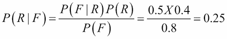

概率模型允许我们明确地计算概率，而不仅仅是一个二元真或假。正如我们所知，我们需要做的关键事情是创建一个模型，将一个变量映射或特征化为一个目标变量。当我们采用概率方法时，我们假设有一个潜在的随机过程，它产生了一个定义明确但未知的概率分布。

考虑一个垃圾邮件检测器。我们的特征变量 *X* 可以由一组单词组成，表示该电子邮件可能是垃圾邮件。目标变量 *Y* 是实例类，要么是垃圾邮件，要么是火腿。我们对 *Y* 给定 *X* 的条件概率感兴趣。对于每个电子邮件实例，将有一个特征向量 *X* ，由代表我们的垃圾邮件单词的存在的布尔值组成。我们正在试图找出我们的目标布尔值 *Y* 是否代表垃圾邮件。

现在，考虑我们有两个词， *x 1* 和 *x 2* ，它们构成了我们的特征向量 *X* 。从我们的训练集中，我们可以构建一个如下所示的表:

<colgroup><col style="text-align: left"> <col style="text-align: left"> <col style="text-align: left"></colgroup> 
|   | 

P(Y =垃圾邮件&#124; x1，x2)

 | 

P(Y =非垃圾邮件&#124; x1，x2)

 |
| --- | --- | --- |
| *P(Y&#124; x 1 = 0，x 2 = 0)* | Zero point one | Zero point nine |
| *P(Y&#124; x 1 = 0，x 2 = 1)* | Zero point seven | Zero point three |
| *P(Y&#124; x 1 = 1，x 2 = 0)* | Zero point four | Zero point six |
| *P(Y&#124; x 1 = 1，x 2 = 1)* | Zero point eight | Zero point two |

> *表 1.1*

我们可以看到，一旦我们开始向我们的特征向量添加更多的单词，它将很快变得难以管理。有了 *n* 大小的特征向量，我们就有了*2nT5】案例来区分。幸运的是，还有其他方法来处理这个问题，我们将在后面看到。*

上表中的概率称为后验概率。当我们从先前的分布中获得知识时，就会用到这些。例如，十分之一的电子邮件是垃圾邮件。但是，考虑一种情况，我们可能知道 *X* 包含 *x 2 = 1* ，但是我们不确定 *x 1* 的值。该实例可能属于第 2 行，其中它是垃圾邮件的概率是 **0.7** ，或者属于第 4 行，其中概率是 **0.8** 。解决方法是在任何情况下，使用 *x 1 = 1* 的概率对这两行进行平均。也就是说，一个单词 *x 1* 出现在任何电子邮件中的概率，不管是不是垃圾邮件:

*P(Y | x2= 1)= P(Y | x1= 0，x2= 1)P(x1= 0)+P(x1= 1，x2= 1)P(x1= 1)*

这被称为似然函数。如果我们知道，从一个训练集中， *x 1* 为 1 的概率是 0.1，那么它为零的概率是 0.9，因为这些概率之和必须是 1。因此，我们可以计算出一封电子邮件包含垃圾邮件单词*的概率为 0.7 * 0.9 + 0.8 * 0.1 = 0.71* 。

这是似然函数的一个例子: *P(X|Y)* 。那么，为什么我们想知道 *X* 的概率，这是我们都已经准备好知道的，条件是 *Y* ，这是我们一无所知的呢？看待这个问题的一种方法是考虑任何包含特定随机段落的电子邮件的概率，比如说《战争与和平》的第 127 段。显然，无论电子邮件是否是垃圾邮件，这种可能性都很小。我们真正感兴趣的不是这些可能性的大小，而是它们的比率。包含特定单词组合的电子邮件是垃圾邮件还是非垃圾邮件的可能性有多大？这些有时被称为生成模型，因为我们可以对所有涉及的变量进行采样。

我们可以使用贝叶斯规则在先验分布和似然函数之间进行转换:

*P(Y)* 是在观测到 *X* 之前的先验概率，即每个类的可能性有多大。同样的， *P(X)* 是不考虑 *Y* 的概率。如果我们只有两个类，我们可以使用比率。例如，如果我们想知道数据对每个类的支持程度，我们可以使用以下方法:

如果概率小于 1，我们假设分母中的类最有可能。如果大于 1，则枚举数中的类最有可能。如果我们使用来自*表 1.1* 的数据，我们计算以下后验概率:

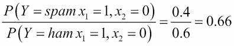

可能性函数在机器学习中很重要，因为它创建了一个生成模型。如果我们知道词汇表中每个单词的概率分布，以及每个单词出现在垃圾邮件或非垃圾邮件中的可能性，我们就可以根据条件概率生成一封随机的垃圾邮件， *P(X|Y =垃圾邮件)*。

#### 逻辑模型

逻辑模型基于算法。它们可以被翻译成一套人类可以理解的正式规则。例如，如果 *x 1* 和 *x 2* 都为 1，则该电子邮件被归类为垃圾邮件。

这些逻辑规则可以组织成树形结构。在下图中，我们看到实例空间在每个分支被迭代分区。树叶由矩形区域(或更高维度情况下的超矩形)组成，表示实例空间的片段。根据我们正在解决的任务，树叶标有类、概率、实数等等。

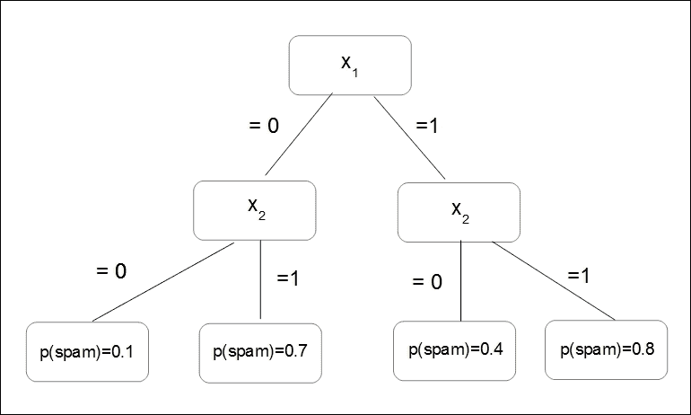

人物特征树

特征树在表示机器学习问题时非常有用；甚至那些乍一看似乎没有树形结构的。例如，在前面部分的贝叶斯分类器中，我们可以将实例空间划分为尽可能多的区域，只要有特征值的组合。决策树模型通常采用修剪技术来删除给出错误结果的分支。在[第 3 章](3.html "Chapter 3. Turning Data into Information")、*将数据转化为信息*中，我们将了解 Python 中表示决策树的多种方法。

### 注

请注意，决策规则可能会重叠，并做出矛盾的预测。

然后说它们在逻辑上不一致。当规则没有考虑特征空间中的所有坐标时，它们也可能是不完整的。有许多方法可以解决这些问题，我们将在本书后面详细讨论这些问题。

因为树学习算法通常以自上而下的方式工作，所以第一个任务是在树的顶部找到一个好的特征来分割。我们需要找到一个在后续节点中产生更高纯度的分裂。所谓纯粹，我指的是训练样本都属于同一类的程度。当我们沿着树往下走时，在每一个层次上，我们发现每个节点上的训练例子的纯度都在增加，也就是说，它们越来越多地被分成自己的类，直到我们到达所有例子都属于同一个类的叶子。

换个角度来看，我们对降低决策树中后续节点的熵感兴趣。熵，一种无序的度量，在树的顶部(根)很高，随着数据被分成各自的类，熵在每个节点逐渐降低。

在更复杂的问题中，那些具有更大特征集和决策规则的问题，找到最佳分割有时是不可能的，至少在可接受的时间内是不可能的。我们真正感兴趣的是创造最浅的树，以最短的路径到达我们的叶子。在分析所需的时间内，每个节点随着每个附加特征呈指数级增长，因此找到最佳决策树可能比实际使用次最佳树来执行任务需要更长的时间。

逻辑模型的一个重要性质是，它们可以在某种程度上为它们的预测提供解释。例如，考虑决策树做出的预测。通过追踪从叶子到根的路径，我们可以确定导致最终结果的条件。这是逻辑模型的优势之一:人类可以检查它们，以揭示更多关于问题的信息。

### 特征

就像决策只和我们在现实生活中获得的信息一样好，在机器学习任务中，模型只和它的特征一样好。从数学上讲，特征是从实例空间映射到特定域中的一组值的函数。在机器学习中，我们进行的大多数测量都是数值的，因此最常见的特征域是实数集。其他常见的领域包括布尔、真或假、整数(比如，当我们计算特定特征的出现时)或有限集合，如一组颜色或形状。

模型是根据它们的特征来定义的。此外，单个特征可以转化为模型，这被称为单变量模型。我们可以区分特征的两种用途。这与分组和分级之间的区别有关。

首先，我们可以通过放大实例空间中的一个区域来对特征进行分组。让 *f* 成为一个统计一个单词出现次数的功能，*X1T5，在一封电子邮件中， *X* 。我们可以设置如下条件:*

其中 *f(X)=0* ，表示不包含*X1T5】的电子邮件，或者其中 *f(X) > 0* 表示包含 *x 1* 一次或多次的电子邮件。这些条件被称为**二进制拆分**，因为它们将实例空间分为两组:满足条件的和不满足条件的。我们还可以将实例空间拆分为两个以上的段，以创建非二进制拆分。例如其中*f(X)= 0*；*0<F(X)<5*； *F(X) > 5* 以此类推。*

其次，我们可以对我们的特征进行分级，以计算每个特征对整体结果的独立贡献。回想一下我们简单的线性分类器，以下形式的决策规则:

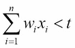

因为这个规则是线性的，所以每个特征对实例的得分都有独立的贡献。这个贡献取决于*wIT3。如果是正数，那么一个正数*xIT7】就会增加分数。如果 *w i* 为负值，则正值 *x i* 会降低分数。如果 *w i* 很小或者为零，那么它对整体结果的贡献可以忽略不计。可以看出，这些特征对最终预测做出了可测量的贡献。**

特征的这两种用途，如分割(分组)和预测(分级)，可以组合成一个模型。一个典型的例子发生在我们想要逼近一个非线性函数的时候，比如说 *y sin π x* ，在区间上， *-1 < x < 1* 。显然，简单的线性模型是行不通的。当然，简单的答案是将 *x* 轴拆分为 *-1 < x 0* 和 *0 <* 。在每一段上，我们都能找到一个合理的线性近似。

使用分组和分级

通过特征构建和转换，可以做大量的工作来提高模型的性能。在大多数机器学习问题中，特征不一定是显式可用的。它们需要从原始数据集构建，然后转换成我们的模型可以利用的东西。这在文本分类等问题中尤为重要。在我们简单的垃圾邮件示例中，我们使用了所谓的单词包表示，因为它忽略了单词的顺序。然而，这样做，我们就失去了关于文本意义的重要信息。

特征构建的一个重要部分是离散化。我们有时可以通过将特征分成相关的块来提取更多的信息，或者与我们的任务更相关的信息。例如，假设我们的数据由人们的精确收入列表组成，我们试图确定财务收入和一个人居住的郊区之间是否存在关系。显然，如果我们的特征集不是由精确的收入组成，而是由收入范围组成，这将是合适的，尽管严格来说，我们会丢失信息。如果我们适当地选择我们的区间，我们将不会丢失与我们的问题相关的信息，我们的模型将表现得更好，并给我们更容易解释的结果。

这突出了特征选择的主要任务:分离信号和噪声。

真实世界的数据总是包含大量我们不需要的信息，以及简单的随机噪声，分离出与我们的需求相关的可能很小的一部分数据对我们模型的成功很重要。当然，重要的是，我们不要丢弃对我们可能重要的信息。

通常，我们的特征将是非线性的，线性回归可能不会给我们好的结果。一个技巧是转换实例空间本身。假设我们有如下图所示的数据。显然，线性回归只能给我们一个合理的拟合，如左侧的图所示。但是，如果我们对实例空间进行平方，就可以改善这个结果，也就是说，我们使*x = x2T3】和*y = y2T7】，如右侧的图所示:**

方差= .92 方差= .97

转换实例空间

我们可以更进一步，使用一种叫做 **内核技巧**的技术。其思想是我们可以创建一个更高维的隐式特征空间。成对的数据点通过指定的函数从原始数据集映射到这个更高维的空间，有时称为**相似性函数**。

比如让 *x 1 = (x 1 ，y 1 )* 和 *x 2 = (x 2 ，y 2 )* 。

我们创建一个 2D 到三维的映射，如下所示:

三维空间中与 2D 点*x1T3】和*x2T7】对应的点如下:**

这两个向量的点积是:

我们可以看到，通过对原始 2D 空间中的点积求平方，我们获得了三维空间中的点积，而实际上没有创建特征向量本身。这里我们定义了内核 *k(x 1 ，x 2 ) = (x 1 ，x22*。在高维空间中计算点积通常在计算上更便宜，正如我们将看到的，这种技术在机器学习中被相当广泛地使用，从 **支持向量机** ( **SVM** )、**主成分分析** ( **主成分分析**)和相关性分析。

我们之前看到的基本线性分类器定义了一个决策边界，*w x = t*。向量 *w* 等于正例的平均值和负例的平均值之间的差值 *p-n* 。假设我们有点 *n= (0，0)* 和 *p = (0，1)* 。让我们假设我们已经从两个训练示例中获得了正平均值， *p1 = (-1，1)* 和 *p2 = (1，1)* 。因此，我们有以下几点:

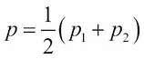

我们现在可以将决策边界写成如下:

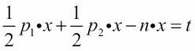

使用内核技巧，我们可以获得以下决策边界:

使用我们前面定义的内核，我们可以得到以下结果:

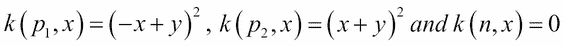

我们现在可以导出决策边界:

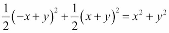

这只是一个围绕原点的圆，半径 *√t* 。

另一方面，使用内核技巧，根据每个训练示例评估每个新实例。作为这种更复杂计算的回报，我们获得了更灵活的非线性决策边界。

一个非常有趣和重要的方面是特征之间的交互。相互作用的一种形式是相互关联。例如，一篇博文中的单词，我们可能期望单词*冬季*和*寒冷*之间存在正相关，而*冬季*和*炎热*之间存在负相关。这对您的模型意味着什么取决于您的任务。如果您正在进行情感分析，您可能会考虑降低每个单词一起出现时的权重，因为与该单词单独出现时相比，添加另一个相关单词对整体结果的权重会略低。

同样关于情感分析，我们经常需要转换某些特征来捕捉它们的含义。例如，短语*不高兴*包含一个词，如果我们只使用 *1 克*，即使它的情绪明显是负面的，也会有助于正面情绪得分。一个解决方案(除了使用 *2 克*，这可能会不必要地使模型复杂化)是识别这两个单词何时出现在一个序列中，并创建一个新的特征， *not_happy* ，以及相关的情感评分。

选择和优化特征是很值得花费的时间。它可以是学习系统设计的重要部分。设计的这种迭代性质在两个阶段之间转换。首先，理解你正在研究的现象的性质，其次，用实验来检验你的想法。这种实验让我们对现象有了更深入的了解，使我们能够优化我们的特征并获得更深入的理解，直到我们对我们的模型感到满意，从而准确地反映了现实。

## 统一建模语言

机器学习系统可能很复杂。人脑通常很难理解一个完整系统的所有相互作用。我们需要某种方式将系统抽象成一组离散的功能组件。这使我们能够用图表和图表来可视化我们系统的结构和行为。

UML 是一种形式主义，它允许我们以精确的方式可视化和交流我们的设计思想。我们用代码实现我们的系统，基本原理用数学表达，但是还有第三个方面，从某种意义上说，是垂直于这些的，那就是我们系统的可视化表示。绘制设计的过程有助于从不同的角度将其概念化。也许我们可以考虑尝试三角测量一个解决方案。

概念模型是描述问题要素的理论工具。它们可以帮助我们澄清假设，证明某些性质，并让我们对系统的结构和相互作用有一个基本的了解。

UML 产生于既要简化这种复杂性，又要允许我们的设计清晰明确地传达给团队成员、客户和其他利益相关者的需要。模型是真实系统的简化表示。在这里，我们使用了更一般意义上的*模型*这个词，与其更精确的机器学习定义相比。UML 可以用来建模几乎任何可以想象的系统。核心思想是用核心属性和功能的清晰表示来去除任何不相关的和潜在的混淆元素。

### 类图

类图为系统的静态结构建模。类代表具有共同特征的抽象实体。它们很有用，因为它们表达并实施了面向对象的编程方法。我们可以看到，通过在代码中分离不同的对象，我们可以更清楚地将每个对象作为一个独立的单元来处理。我们可以用一组特定的特征来定义它，并定义它与其他对象的关系。这使得复杂的程序能够分解成独立的功能组件。它还允许我们通过继承来子类化对象。这是非常有用的，反映了我们如何建模我们世界中特别有层次的方面(也就是说，程序员是*人类*的子类， *Python 程序员*是程序员的子类)。对象编程可以加快整体开发时间，因为它允许组件的重用。有丰富的开发组件类库可以利用。此外，生成的代码往往更容易维护，因为我们可以替换或更改类，并且能够(通常)理解这将如何影响整个系统。

事实上，对象编码确实倾向于导致更大的代码库，这可能意味着程序运行会更慢。最终，这不是一个“非此即彼”的情况。对于许多简单的任务，如果您可能再也不会使用它，您可能不想花时间创建一个类。一般来说，如果您发现自己键入了相同的代码，或者创建了相同类型的数据结构，那么创建一个类可能是个好主意。对象编程的最大优势是我们可以将数据和对数据进行操作的函数封装在一个对象中。这些软件对象可以以相当直接的方式与现实世界的对象相对应。

最初，设计面向对象的系统可能需要一些时间。然而，在建立可行的类结构和类定义的同时，实现类所需的编码任务变得更加清晰。创建类结构可能是开始系统建模的一种非常有用的方式。当我们定义一个类时，我们感兴趣的是一组特定的属性，作为所有可能属性或实际不相关属性的子集。它应该是真实系统的精确表示，我们需要判断什么是相关的，什么不是。这很难，因为现实世界的现象是复杂的，我们所掌握的关于系统的信息总是不完整的。我们只能依靠我们所知道的，所以我们的领域知识(对我们试图建模的系统的理解)，无论是软件、自然的还是人类的，都是至关重要的。

### 物体图

对象图是运行时系统的逻辑视图。它们是特定时刻的快照，可以理解为类图的一个实例。许多参数和变量随着程序的运行而改变值，对象图的功能就是映射这些。这种运行时绑定是对象图所代表的关键内容之一。通过使用链接将对象联系在一起，我们可以对特定的运行时配置进行建模。对象之间的链接对应于对象类之间的关联。因此，链接受到与它对其对象强制实施的类相同的约束。

对象图

类图和对象图都由相同的基本元素组成。而类图代表了类的抽象蓝图。对象图表示对象在特定时间点的真实状态。单对象图不能代表每个类实例，所以在画这些图的时候，我们必须把自己局限在重要的实例和覆盖系统基本功能的实例上。对象图应该阐明对象之间的关联，并指出重要变量的值。

### 活动图

活动图的目的是通过将单独的动作链接在一起来建模系统的工作流，这些动作一起表示一个过程。他们特别擅长对协调任务集进行建模。活动图是 UML 规范中使用最多的图之一，因为它们的格式基于传统的流程图，所以理解起来很直观。活动图的主要组成部分是动作、边(有时称为路径)和决策。动作用圆角矩形表示，边用箭头表示，决策用菱形表示。活动图通常有一个开始节点和一个结束节点。

示例活动图的图形

### 状态图

状态图用于对系统建模，这些系统根据其所处的状态改变行为。它们由状态和转换表示。状态由圆角矩形表示，过渡由箭头表示。每个转换都有一个触发器，这是沿着箭头写的。

许多状态图将包括初始伪状态和最终状态。伪状态是控制流量的状态。另一个例子是选择伪状态。这表明布尔条件决定了转换。

状态转换系统由四个要素组成；它们如下:

*   *S = {s 1 ，s 2 ，…}* :一组状态
*   *A= {a 1 ，a 2 ，...}* :一套动作
*   *E ={e 1 ，e 2 ，...}* :一组事件
*   *y: S(A U E)→2s* :状态转换功能

第一个元素 *S* 是世界可以处于的所有可能状态的集合。行动是一个代理可以做的改变世界的事情。事件可以发生在世界上，不受代理人的控制。状态转移函数 *y* 将两件事作为输入:世界的状态和行动与事件的联合。这给了我们作为应用特定动作或事件的结果的所有可能状态。

假设我们有一个仓库，储存了三种物品。我们认为仓库最多只能储存一种物品。我们可以用下面的矩阵来表示仓库的可能状态:

这可以为 *E* 和 *A* 定义类似的二进制矩阵，前者代表卖出的事件，后者是一个行动指令。

在这个简单的例子中，我们的转换函数应用于一个实例( *s* ，这是 *S* 中的一列)，这是*S = S+a-e*，其中*S‘*是系统的最终状态， *s* 是其初始状态， *a* 和 *e* 分别是一个活动和一个事件。

我们可以用下面的转换图来表示:

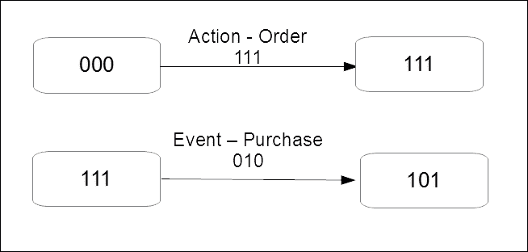

过渡图的图形

# 总结

到目前为止，我们已经介绍了广泛的机器学习问题、技术和概念。希望到目前为止，你已经知道如何通过将一个新的独特的问题分解成几个部分来开始解决它。我们回顾了一些基本的数学知识，并探索了可视化设计的方法。我们可以看到，同一个问题可以有很多不同的表现，每一个都可能突出不同的方面。在我们开始建模之前，我们需要一个定义明确的目标，表述为一个具体的、可行的和有意义的问题。我们需要清楚如何用机器能理解的方式表达这个问题。

设计过程，虽然由不同的和独特的活动组成，但不一定是一个线性的过程，而是一个迭代的过程。我们循环通过每个特定的阶段，提出和测试想法，直到我们觉得我们可以跳到下一个阶段。有时我们可能会跳回前一个阶段。我们可能坐在一个平衡点，等待一个特定的事件发生；我们可以循环通过几个阶段，或者并行通过几个阶段。

在下一章中，我们将开始探索各种 Python 库中可用的实用工具。*