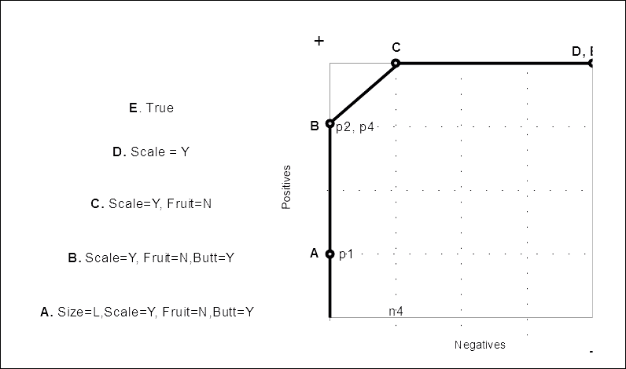
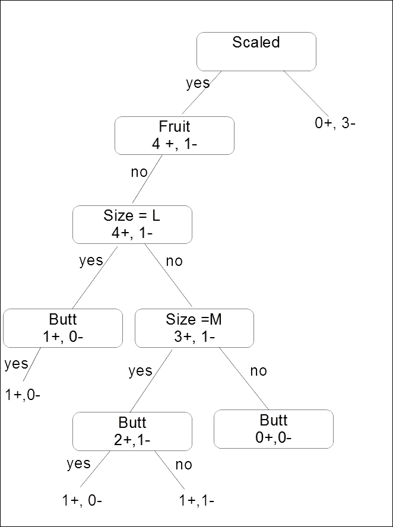
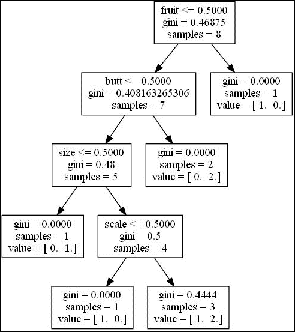
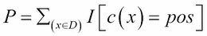
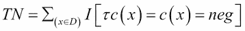
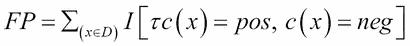
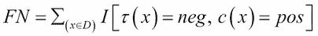
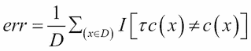

# 四、模型——从信息中学习

到目前为止，在这本书里，我们已经检查了一系列的任务和技术。我们介绍了数据类型、结构和属性的基础知识，并熟悉了一些可用的机器学习工具。

在本章中，我们将研究三大类型的模型:

*   逻辑模型
*   树形模型
*   规则模型

下一章将专门讨论另一种重要的模型——线性模型。本章的大部分材料都是理论性的，其目的是介绍机器学习任务所需的一些数学和逻辑工具。我鼓励你研究这些想法，并以可能有助于解决我们遇到的问题的方式来阐述它们。

# 逻辑模型

逻辑模型将实例空间(即所有可能或允许的实例的集合)划分为段。目标是确保每个数据段中的数据对于特定的任务是同质的。例如，如果任务是分类，那么我们的目标是确保每个片段包含同一个类的大多数实例。

逻辑模型使用逻辑表达式来解释特定的概念。最简单和最通用的逻辑表达式是文字，其中最常见的是等式。等式表达式可以应用于所有类型——主格、数字和序数。对于数字和序数类型，我们可以包括不等式文字:大于或小于。从这里，我们可以使用四个逻辑连接词来构建更复杂的表达式。这些是连词(逻辑 AND)，用`∧`表示；析取(逻辑或)，用`∨`表示；`→`寓意；和否定，用`┌`表示。这为我们提供了一种表达以下等价关系的方法:

*┌┌A ≡ A = A → B ≡ ┌A ∨ B*

*┌(a∧b)≡┌a∨┌b = ┌(a∨b)≡┌a∧┌b*

我们可以用一个简单的例子来应用这些想法。假设你遇到一片看起来都来自同一物种的树林。我们的目标是确定这种树种的定义特征，用于分类任务。为了简单起见，假设我们只处理以下四个特征:

*   大小:这个有三个值——小、中、大
*   叶类型:这有两个值-缩放或非缩放
*   水果:这有两个值——是或不是
*   支撑物:这有两个值——是或不是

我们确定的第一棵树可以用下面的连词来描述:

*大小=大∧叶=有鳞∧果=无∧支撑=是*

我们遇到的下一棵树是中等大小的。如果我们去掉大小条件，那么语句就变得更一般了。也就是说，它将覆盖更多的样本:

*叶子=有鳞∧果实=无∧支撑物=是*

下一棵树也是中等大小的，但是它没有扶壁，所以我们去掉了这个条件，将其推广到下面:

*叶=有鳞∧果=无*

小树林里的树都满足这种结合，我们断定它们是针叶树。显然，在现实世界的例子中，我们将使用更大范围的特征和值，并采用更复杂的逻辑结构。然而，即使在这个简单的例子中，**实例空间**是 3 2 2 2，这使得有 24 个可能的实例。如果我们将一个特征的缺失视为一个附加值，那么**假设空间**，也就是我们可以用来描述这个集合的空间，就是 *4 3 3 3 = 108* 。可能的实例集或扩展集的数量为 *2 <sup>24</sup>* 。例如，如果你随机选择一组。例如，如果你随机选择一组实例，你能找到准确描述它们的合取概念的几率远远超过 100，000 比 1。

## 一般性排序

我们可以开始将这个假设空间从最一般的语句映射到最具体的语句。例如，在我们的针叶树假设附近，空间看起来像这样:


这里，我们笼统地对我们的假设进行排序。顶部是最普遍的假设——所有的树都是针叶树。更一般的假设将覆盖更多的实例，因此最一般的假设，即所有的树都是针叶树，适用于所有的实例。现在，虽然这可能适用于我们所处的小树林，但当我们试图将这一假设应用于新数据，即小树林外的树木时，它将失败。在上图的底部，我们有一个最简单的假设。当我们进行更多的观察并在节点中向上移动时，我们可以消除假设并建立下一个最普遍的完整假设。我们能从数据中得出的最保守的概括是这些例子中最不一般的概括是**(**LGG**)。我们可以将其理解为假设空间中从每个实例向上的路径相交的点。**

 **让我们用表格描述我们的观察结果:

<colgroup><col style="text-align: left"> <col style="text-align: left"> <col style="text-align: left"> <col style="text-align: left"> <col style="text-align: left"></colgroup> 
| 

大小

 | 

有鳞的

 | 

水果

 | 

支持

 | 

标签

 |
| --- | --- | --- | --- | --- |
| L | Y | 普通 | Y | 第一亲代 |
| M | Y | 普通 | Y | p2 |
| M | Y | 普通 | 普通 | p3 |
| M | Y | 普通 | Y | p4 |

当然，你迟早会走出小树林，观察到负面的例子——显然不是针叶树的树。您注意到以下特征；

<colgroup><col style="text-align: left"> <col style="text-align: left"> <col style="text-align: left"> <col style="text-align: left"> <col style="text-align: left"></colgroup> 
| 

大小

 | 

有鳞的

 | 

水果

 | 

支持

 | 

标签

 |
| --- | --- | --- | --- | --- |
| S | 普通 | 普通 | 普通 | n1 |
| M | 普通 | 普通 | 普通 | n2 |
| S | 普通 | Y | 普通 | n3 |
| M | Y | 普通 | 普通 | n4 |

所以，随着负例的加入，我们仍然可以看到，我们最不一般的完全假设仍然是*标度= Y ∧水果=N* 。然而，你会注意到一个负面的例子， *n4* 被覆盖了。因此，这个假设并不一致。

## 版本空间

这个简单的例子可能会让你得出只有一个 LGG 的结论。但这不一定是真的。我们可以通过添加一种称为**内部析取**的受限析取形式来扩展我们的假设空间。在我们之前的例子中，我们有三个中型或大型针叶树的正面例子。我们可以增加一个条件*尺寸=中∨尺寸=大*，我们可以把这个写成*尺寸【m，l】*。内部析取仅适用于具有两个以上值的要素，因为类似*leaks = Scaled∨leaks = Non Scaled*的东西总是`true`。

在前面的针叶树例子中，我们去掉了大小条件，以适应我们的第二个和第三个观察。这给了我们以下的 LGG:

*叶=缩放∧叶= =否*

考虑到我们的内部分离，我们可以将前面的 LGG 改写如下:

*大小[m，l] ∧叶=有鳞∧果=无*

现在，考虑第一个非针叶树或负非针叶树的例子:

*大小=小∧叶=无鳞∧果=无*

我们可以去掉 LGG 的三个条件中的任何一个，但不包括这个反面例子。然而，当我们试图进一步推广到单个条件时，我们看到*大小【m，l】*和*叶子=缩放的*是可以的，但是*果实=不*则不行，因为它涵盖了反面的例子。

现在我们感兴趣的是**完备**和**一致**的假设，即涵盖了所有的正例，没有一个负例。现在让我们只考虑四个正的( *p1 - p4* )例子和一个负的例子( *n1* )来重新绘制我们的图表。


这有时被称为**版本空间**。请注意，我们有一个最不一般的假设，三个中间假设，现在，两个最一般的假设。版本空间形成凸集。这意味着我们可以在这个集合的成员之间进行插值。如果一个元素位于集合中最一般和最不一般的成员之间，那么它也是该集合的成员。这样，我们就可以通过版本空间最一般和最不一般的成员来充分描述版本空间。

考虑一种情况，其中最不一般的概括涵盖了一个或多个负面实例。在这种情况下，我们可以说数据不是**合取可分的**，版本空间为空。我们可以采用不同的方法来寻找最普遍的一致假设。这里我们感兴趣的是一致性，而不是完整性。这本质上涉及到从最一般的假设空间迭代路径。我们采取向下的步骤，例如，添加一个连词或从内部连词中移除一个值。在每一步，我们最小化结果假设的专门化。

## 覆盖空间

当我们的数据不能合取分离时，我们需要一种在一致性和完备性之间进行优化的方法。一个有用的方法是映射正负实例的**覆盖空间**，如下图所示:



我们可以看到，学习一个假设涉及到通过一般性排序的假设空间找到一条路径。逻辑模型包括通过网格结构的假设空间寻找路径。这个空间中的每个假设都包含一组实例。这些集合中的每一个集合都有上界和下界，并且按照一般性进行排序。到目前为止，我们只使用了文字的单个连词。有了丰富的逻辑语言，为什么不在我们的表达中加入各种逻辑连接词呢？基本上有两个原因可以让我们的表达保持简单，如下所示:

*   更具表达性的语句会导致专门化，这会导致模型过度拟合训练数据，并且在测试数据上表现不佳
*   复杂的描述在计算上比简单的描述更昂贵

正如我们在学习合取假设时所看到的，未被发现的正面例子允许我们从合取中删除文字，使其更具一般性。另一方面，涵盖的反面例子要求我们通过添加文字来增加专门化。

我们可以用子句的析取来描述每个假设，而不是用单个文字的连词来描述每个假设，其中每个子句可以是 *A → B* 的形式。这里， *A* 是文字的连词， *B* 是单个文字。让我们考虑以下陈述，它涵盖了一个负面的例子:

*Butt =Y ∧ Scaled = N ∧ Size = S ∧ ┌水果= N*

为了排除这个反面例子，我们可以写下面的子句:

*对接= Y ∧缩放= N ∧大小= S →果实= N*

当然还有其他排除否定的从句，比如 *Butt = Y →水果= N*；然而，我们对最具体的条款感兴趣，因为它不太可能排除涵盖的积极因素。

## PAC 学习和计算复杂度

考虑到这一点，当我们增加逻辑语言的复杂性时，我们增加了计算成本，我们需要一个度量来衡量语言的可学习性。为了这些目的，我们可以使用 **的思想大概正确** ( **PAC** )学习。

当我们从一组假设中选择一个假设时，目标是确保我们的选择具有高概率的低泛化误差。这将在测试集上以高精度执行。这就引入了 **计算复杂度**的思想。这是一种形式化方法，用于衡量给定算法的计算成本与其输出精度之间的关系。

PAC 学习考虑到了非典型例子上的错误，这种典型性是由一个不确定的概率分布 *D* 决定的。我们可以根据这个分布来评估一个假设的错误率。例如，让我们假设我们的数据是无噪声的，并且学习者总是在训练样本中输出完整且一致的假设。让我们选择一个任意误差率ϵ < 0.5 和一个故障率δ= 0.5。我们要求我们的学习算法输出一个概率≥ 1 - δ的假设，这样错误率将小于 *ϵ* 。事实证明，对于任何大小合理的训练集来说，这都是正确的。例如，如果我们的假设空间 *H* 包含单个不良假设，那么它在 *n* 独立训练样本上完整一致的概率小于或等于 *(1 - ϵ) <sup>n</sup>* 。对于任何 *0 ≤ ϵ ≤ 1* ，该概率小于 *e-n ϵ* 。我们需要将其保持在我们的错误率 *δ* 以下，这是我们通过设置 *n ≥ 1/ ϵ ln 1/ δ* 实现的。现在，如果 *H* 包含多个不良假设， *k ≤ | H |* ，那么在 *n* 个独立样本上至少有一个是完整一致的概率最大:

*k(1-a1)n≤h |(1-a1)n≤h | e-n〖t1]*

如果满足以下条件，该最大值将小于 *f* :


这就是所谓的 **样本复杂度**，你会注意到它在 *1/δ* 中是对数的，在 *1/ϵ* 中是线性的。

### 注

这意味着降低故障率比降低错误率要便宜很多。

在结束这一部分时，我将进一步说明一点。假设空间 *H* 是 *U* 的一个子集，一个解释任何给定现象的宇宙。我们如何知道正确的假设是否真的存在于 *H* 内部而不是 *U* 的其他地方？贝叶斯定理显示了 *H* 和 *┌ H* 的相对概率以及它们的相对先验概率之间的关系。然而，我们没有真正的方法可以知道 *P┌ H* 的价值，因为没有办法计算一个尚未构思的假设的概率。此外，这个假设的内容包括一个目前未知的可能物体的宇宙。这种悖论出现在任何使用比较假设检验的描述中，我们对照 *H* 中的其他假设来评估我们当前的假设。另一种方法是找到评估 *H* 的方法。我们可以看到，随着我们扩展 *H* ，其中假设的可计算性变得更加困难。要评价 *H* ，我们需要把我们的宇宙限制在已知的宇宙。对于一个人来说，这是一种已经印在我们大脑和神经系统中的体验生活；对于一台机器来说，它就是内存库和算法。评估这个全球假设空间的能力是人工智能的关键挑战之一。

# 树木模型

树模型在机器学习中无处不在。它们自然适合分治迭代算法。决策树模型的主要优势之一是它们自然易于可视化和概念化。它们允许检查，而不仅仅是给出答案。例如，如果我们必须预测一个类别，我们也可以揭示产生特定结果的逻辑步骤。此外，树模型通常比其他模型需要更少的数据准备，并且可以处理数字和分类数据。从负面来看，树模型可能会创建过于复杂的模型，无法很好地推广到新数据。树模型的另一个潜在问题是，它们会对输入数据的变化变得非常敏感，正如我们稍后将看到的，使用它们作为集成学习器可以缓解这个问题。

决策树和上一节中使用的假设映射之间的一个重要区别是，树模型不在具有两个以上值的特征上使用内部析取，而是在每个值上使用分支。我们可以通过下图中的尺寸特征看到这一点:



需要注意的另一点是，决策树比合取假设更具表达性，我们可以在这里看到这一点，我们已经能够分离合取假设覆盖负例子的数据。当然，这种表现力是有代价的:过度依赖训练数据的倾向。一种强制推广和减少过度拟合的方法是引入一种对不太复杂的假设的归纳偏差。

我们可以很容易地使用 Sklearn `DecisionTreeClassifier`实现我们的小例子，并创建结果树的图像:

```py
from sklearn import tree

names=['size','scale','fruit','butt']
labels=[1,1,1,1,1,0,0,0]

p1=[2,1,0,1]
p2=[1,1,0,1]
p3=[1,1,0,0]
p4=[1,1,0,0]
n1=[0,0,0,0]
n2=[1,0,0,0]
n3=[0,0,1,0]
n4=[1,1,0,0]
data=[p1,p2,p3,p4,n1,n2,n3,n4]

def pred(test, data=data):
 dtre=tree.DecisionTreeClassifier()
 dtre=dtre.fit(data,labels)
 print(dtre.predict([test]))
 with open('data/treeDemo.dot', 'w') as f:
 f=tree.export_graphviz(dtre,out_file=f,
 feature_names=names)
pred([1,1,0,1])

```

运行前面的代码会创建一个`treeDemo.dot`文件。保存为`.dot`文件的决策树分类器可以使用 **Graphiz** 图形可视化软件转换为图像文件，如`.png`、`.jpeg`或`.gif`。您可以从[http://graphviz.org/Download.php](http://graphviz.org/Download.php)下载 Graphviz。安装完成后，使用它将`.dot`文件转换为您选择的图像文件格式。

这可以让您清楚地了解决策树是如何拆分的。



我们可以从完整的树中看到，我们在每个节点上递归拆分，每次拆分都增加了同一类样本的比例。我们继续向下移动节点，直到到达一个叶节点，在那里我们的目标是拥有一组同类实例。纯度的概念很重要，因为它决定了每个节点是如何被分割的，并且它位于上图中基尼系数的后面。

## 纯度

我们如何理解每个特征对于能够将样本分成包含最少或不包含来自其他类的样本的类的有用性？赋予一个类标签的特征的指示集是什么？为了回答这个问题，我们需要考虑分裂的纯粹性。例如，假设我们有一组布尔实例，其中 *D* 被分成 *D1* 和 *D2* 。如果我们进一步把自己限定在仅仅两个类， *D <sup>pos</sup>* 和 *D <sup>neg</sup>* 的话，我们可以看到最佳的情况是 *D* 完美地拆分为正反例。这有两种可能:要么是*D1<sup>pos</sup>= D<sup>pos</sup>*和 *D1 <sup>neg</sup> = {}* ，要么是*D1<sup>neg</sup>= D<sup>neg</sup>*和 *D1 <sup>pos</sup> = {}* 。

如果这是真的，那么分裂的孩子就被说成是纯洁的。我们可以通过*n<sup>pos</sup>T3】和*n<sup>neg</sup>T7】的相对大小来测量分裂的杂质。这是正类的经验概率，可以用*p = n<sup>pos</sup>/(n<sup>pos</sup>+n<sup>neg</sup>)*的比例来定义。杂质函数有几个要求。首先，如果我们切换正负类(即把 *p* 换成 *1-p* ，那么杂质应该不会改变。此外，当 *p=0* 或 *p=1* 时，该函数应为零，当 *p=0.5* 时，该函数应达到最大值。为了以有意义的方式分割每个节点，我们需要一个具有这些特征的优化函数。**

有三个函数通常用于杂质测量或分离标准，具有以下特征。

*   **少数类**:这只是对误分类例子比例的一种度量，假设我们用多数类来标记每片叶子。这个比例越高，误差越大，分裂的杂质越多。这有时被称为**分类错误**，被计算为 *min(p，1-p)* 。
*   **基尼指数**:如果我们把例子标为正，概率 *p* ，或者负，概率 *1-p* ，这就是预期误差。有时，基尼指数的平方根也被使用，当处理大部分样本属于一类的高度偏斜数据时，这可能有一些优势。
*   **熵**:这个杂质的度量是基于分裂的预期信息含量。考虑一条消息，告诉你一系列随机抽取样本的类别。样本集越纯，这个消息就变得越可预测，因此期望的信息就越小。熵由以下公式衡量:


这三个分裂标准的概率范围在 *0* 和 *1* 之间，绘制在下图中。熵标准由 *0.5* 缩放，以使它们能够与其他两个进行比较。我们可以使用决策树的输出来查看曲线上每个节点的位置。


# 规则模型

我们可以利用离散数学的原理来最好地理解规则模型。让我们回顾一下这些原则。

让 *X* 为一组特征，特征空间， *C* 为一组类。我们可以将 *X* 的理想分类器定义如下:

*c: X → C*

类别为 *c* 的特征空间中的一组示例定义如下:

*d = {(x<sub>【1】</sub>、c(x<sub>【1】</sub>)，-我...。，(x <sub>n</sub> ，c(x<sub>n</sub>)√x×c*

*X* 的分裂是将 *X* 分割成一组互斥的子集 *X <sub>1</sub> ....X <sub>s</sub>* ，所以我们可以这样说:

*X = X1∧..∪ Xs*

这会导致 *D* 分裂成 *D <sub>1</sub> ，...D <sub>s</sub>* 。我们定义 *Dj* ，其中 *j = 1，...，s* 和 is *{(x，c(x) ∈ D | x ∈ Xj)}* 。

这只是在 *X* 中定义了一个子集，称为 *Xj* ，其中 *Xj* 的所有成员都被完美地分类了。

在下表中，我们使用指示函数的总和定义了一些度量。指示器功能使用符号 *I[...】*如果方括号之间的语句为真，则等于 1，如果为假，则等于 0。这里 *τc(x)* 是对 *c(x)* 的估计。

让我们看看下表:

<colgroup><col style="text-align: left"> <col style="text-align: left"></colgroup> 
| **阳性数** |  |
| **底片数** |  |
| **真阳性** |  |
| **真底片** |  |
| **假阳性** |  |
| **假阴性** |  |
| **精度** |  |
| **错误率** |  |
| **真阳性率(灵敏度、召回)** |  |
| **真阴性率(阴性回忆)** |  |
| **精度、信心** |  |

规则模型不仅包括规则集或规则列表，而且重要的是，还包括如何组合这些规则以形成预测的规范。它们是一个逻辑模型，但与树方法的不同之处在于，树分裂成互斥的分支，而规则可以重叠，可能携带额外的信息。在监督学习中，规则模型本质上有两种方法。一种是找到文字的组合，就像我们之前做的那样，形成一个假设，覆盖一组足够同质的样本，然后找到一个标签。或者，我们可以反其道而行之；也就是说，我们可以首先选择一个类，然后找到覆盖该类足够大的样本子集的规则。第一种方法倾向于导致规则的有序列表，而在第二种方法中，规则是无序的集合。正如我们将看到的，每一个都以自己特有的方式处理重叠的规则。让我们先看看有序列表方法。

## 有序列表法

当我们向连接规则添加文字时，我们的目标是增加规则覆盖的每个后续实例集的同质性。这类似于在假设空间中构建一条路径，就像我们在上一节中为逻辑树所做的那样。规则方法的一个关键区别是，我们只对其中一个孩子的纯度感兴趣，即添加的文字为真的孩子。对于基于树的模型，我们使用两个子代的加权平均值来寻找二元分裂的两个分支的纯度。在这里，我们仍然对计算后续规则的纯度感兴趣；然而，我们只遵循每个分裂的一面。我们仍然可以使用相同的方法来寻找纯度，但是我们不再需要对所有的孩子求平均值。与决策树的分治策略相反，基于规则的学习通常被描述为分离和征服。

让我们简单考虑一个例子，使用我们上一节中的针叶树分类问题。


有几个选项可以选择最纯粹的拆分规则。假设我们选择了规则*如果 scaled = N，那么 class 是负的*，我们已经覆盖了四个负样本中的三个。在下一次迭代中，我们将这些样本从考虑中移除，并继续搜索具有最大纯度的文本的过程。实际上，我们正在做的是建立一个有序的规则列表，加入`if`和`else`子句。我们可以将我们的规则重写为互斥的，这意味着不需要对规则集进行排序。这里的折衷是，我们必须使用否定文字或内部析取来处理具有两个以上值的特征。

我们可以对这个模型进行某些改进。例如，我们可以引入一个停止准则，如果满足某些条件，就停止迭代，例如在有噪声数据的情况下，当每个类中的样本数量低于某个数量时，我们可能希望停止迭代。

有序规则模型与决策树有很多共同之处，特别是，它们使用基于纯度概念的目标函数，纯度是每个拆分中正负类实例的相对数量。它们具有易于可视化的结构，并用于许多不同的机器学习环境中。

## 基于集合的规则模型

使用基于集合的规则模型，规则一次学习一个类，我们的目标函数只是最大化 *p* ，而不是最小化 min( *p，1-p* )。使用此方法的算法通常迭代每个类，并且只覆盖在找到规则后移除的每个类的样本。基于集合的模型使用精度(参见表 4-1)作为搜索启发式，这可能会使模型过于关注规则的纯度；它可能会错过近乎纯粹的规则，这些规则可以进一步专门化以形成纯粹的规则。另一种称为 **波束搜索**的方法使用启发式方法来排序预定数量的最佳部分解。

### 注

有序列表为我们提供了训练集的凸覆盖。对于基于未编码集的方法来说，情况未必如此，因为对于给定的规则集，没有全局最优顺序。因此，我们可以访问表示为连词 *A∧B* 的规则重叠，其中 *A* 和 *B* 是两个规则集。如果这两个规则在一个有序列表中，我们有，如果顺序是 *AB* ， *A = (A∧B) ∨ (A∧┌B)* 或者，如果顺序是 *BA* ， *B = (A∧B) ∨ (┌A∧B)* 。这意味着规则空间可能会扩大；然而，因为我们必须估计重叠的覆盖范围，我们牺牲了凸性。

一般来说，规则模型非常适合预测模型。正如我们将在后面看到的，我们可以扩展我们的规则模型来执行诸如聚类和回归之类的任务。规则模型的另一个重要应用是构建**描述性模型**。当我们构建分类模型时，我们通常会寻找创建训练样本的纯子集的规则。然而，如果我们在寻找特定样本集的其他显著特征，这不一定是真的。这有时被称为 **子群发现**。在这里，我们对基于类纯度的启发式方法不感兴趣，而是对寻找区别类分布的启发式方法感兴趣。这是使用基于局部异常测试思想的定义的质量函数来完成的。该功能可以采用 *q=TP/(FP +g)* 的形式。这里 *g* 是一个泛化因子，它决定了相对于规则覆盖的实例数量，非目标类实例的允许数量。对于较小的 *g* 值，比如小于 *1* ，将会生成更具体的规则，因为每增加一个非目标示例都会产生更大的相对*费用*。 *g* 的较高值，比如说大于 *10* ，创建了覆盖更多非目标样本的更一般的规则。 *g* 没有理论最大值；然而，超过样本数量没有多大意义。 *g* 的值由数据的大小和阳性样本的比例决定。 *g* 的值可以变化，从而引导子组发现到 *TP* 与 *FP* 空间中的某些点。

我们可以使用主观或客观质量函数。我们可以将主观的*兴趣度*系数结合到模型中，以反映诸如可理解性、不可预测性或基于描述感兴趣类别的模板的关系模式。客观测量是从数据本身的统计和结构属性中得出的。它们非常适合使用覆盖图来突出具有不同于总体的统计特征的子组。

最后，在这一节基于规则的模型中，我们将考虑可以完全无监督学习的规则。这叫做**关联规则学习**，它的典型用例包括数据挖掘、推荐系统和自然语言处理。我们以一家卖四样东西的五金店为例:**锤子**、**钉子**、**螺丝**、**油漆**。

让我们看看下表:

<colgroup><col style="text-align: left"> <col style="text-align: left"></colgroup> 
| 

交易

 | 

项目

 |
| --- | --- |
| **1** | 指甲 |
| **2** | 锤子和钉子 |
| **3** | 锤子、钉子、油漆和螺钉 |
| **4** | 锤子、钉子和油漆 |
| **5** | 螺丝 |
| **6** | 油漆和螺钉 |
| **7** | 螺钉和钉子 |
| **8** | 颜料 |

在此表中，我们将交易与项目分组。我们也可以将每一个项目与它所涉及的交易进行分组。比如交易 **1** 、 **2** 、 **3** 、 **4** 、 **7** 涉及钉子，交易 **2** 、 **3** 、 **4** 涉及锤子等等。我们也可以用成套物品来做，比如**锤子**和**钉子**都参与了交易 **2** 、 **3** 、 **4** 。我们可以这样写，因为项目集`{hammer,nails}`覆盖了交易集`[2,3,4]`。有 16 个项目集，包括涵盖所有交易的空集。

事务集之间的关系形成了将项目与其各自的集连接起来的网格结构。为了建立关联规则，我们需要创建超过阈值*F<sub>T</sub>T9】的频繁项集。例如`F<sub>T</sub> = 3`为`{screws}`、`{hammer,nails}`和`{paint}`的频繁项集。这些只是与三个或更多事务相关联的项目集。下面是一个图表，显示了我们示例中的部分网格。以类似的方式，我们在我们的假设空间映射中发现了最不一般的一般化。这里，我们对最大项目集的最低边界感兴趣。在这个例子中，是`{nails,hammer}`。*


我们现在可以创建表单 *if A 然后 B* 的关联规则，其中 *A* 和 *B* 是在事务中经常一起出现的项目集。如果我们在这个图上选择一条边，比如频率为`5`的`{nails}`和频率为`3`的`{nails, hammer}`之间的边，那么我们可以说关联规则*的**置信度**如果是钉子那么锤*就是`3/5`。使用频率阈值和规则的置信度，算法可以找到所有超过该阈值的规则。这被称为 **关联规则挖掘**，它通常包括后处理阶段，在此阶段，不必要的规则被过滤掉，例如——更具体的规则没有比更一般的父规则更高的置信度。

# 总结

我们从探索逻辑语言和为一个简单的例子创建假设空间映射开始这一章。我们讨论了最小一般概括的思想，以及如何在这个空间中找到一条从最一般到最小一般假设的路径。我们简单看了一下*可学性*的概念。接下来，我们研究了树模型，发现它们可以应用于广泛的任务，并且既有描述性又易于解释。然而，树本身容易过度拟合，大多数树模型采用的贪婪算法容易对初始条件过度敏感。最后，我们讨论了有序规则列表和基于无序规则集的模型。这两种不同的规则模型通过它们如何处理规则重叠来区分。有序的方法是找到文字的组合，将样本分成更均匀的组。无序方法一次搜索一类假设。

在下一章中，我们将研究一种完全不同的模型——线性模型。这些模型使用几何数学来描述问题空间，正如我们将看到的，形成了支持向量机和神经网络的基础。**