# 五、线性模型

线性模型是最广泛使用的模型之一，并形成了许多先进的非线性技术的基础，如支持向量机和神经网络。它们可以应用于任何预测任务，如分类、回归或概率估计。

当响应输入数据的微小变化时，并且假设我们的数据由完全不相关的特征组成，线性模型往往比树模型更稳定。正如我们在上一章中提到的，树模型会对训练数据中的微小变化做出过度反应。这是因为树根处的劈叉会产生无法恢复的后果，也就是说，会产生不同的分支，并可能使树的其他部分明显不同。另一方面，线性模型相对稳定，对初始条件不太敏感。然而，正如您所料，这将产生相反的效果，将不太敏感的数据更改为细微差别的数据。这用术语 **方差**(对于过拟合模型)和**偏差**(对于欠拟合模型)来描述。线性模型通常是低方差和高偏差的。

线性模型通常最好从几何角度来处理。我们知道，我们可以很容易地在笛卡尔坐标系中绘制二维空间，我们可以用透视的错觉来说明第三个。我们也被教导将时间视为第四维度，但是当我们开始谈论 *n* 维度时，一个物理类比就失效了。有趣的是，我们仍然可以使用许多我们直观地应用于三维空间的数学工具。虽然这些额外的维度变得很难可视化，但我们仍然可以使用相同的几何概念来描述它们，例如线、平面、角度和距离。对于几何模型，我们将每个实例描述为具有一组实值特征，每个特征都是几何空间中的一个维度。让我们从回顾与线性模型相关的形式主义开始这一章。

我们已经不再使用二元最小二乘法的基本数值线性模型解。在 2D 坐标系统上可视化很简单。当我们试图添加参数时，当我们向模型添加特征时，我们需要一种形式主义来替换或增强直观的视觉表示。在本章中，我们将讨论以下主题:

*   最小二乘法
*   正规方程法
*   逻辑回归
*   正规化

让我们从基本模型开始。

# 引入最小二乘法

在一个简单的单特征模型中，我们的假设函数如下:

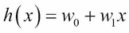

如果我们将此绘制成图，我们可以看到它是一条直线，在*w<sub>0</sub>T3 处穿过 y 轴，斜率为 *w <sub>1</sub>* 。线性模型的目的是找到参数值，这些参数值将创建一条与数据最匹配的直线。我们称这些函数为参数值。我们定义了一个目标函数 *J <sub>w</sub>* ，我们希望将其最小化:*


这里， *m* 为训练样本数， *h <sub>w</sub> (x <sup>(i)</sup> )* 为 *i <sup>th</sup>* 训练样本的估计值， *y <sup>i</sup>* 为其实际值。这是 *h、*的**成本函数**，因为它衡量的是误差的成本；误差越大，成本越高。这种推导成本函数的方法有时被称为平方误差的**和，因为它总结了预测值和实际值之间的差异。正如我们将看到的，这笔钱被减半作为一种便利。实际上有两种方法可以解决这个问题。我们可以使用迭代梯度下降算法，或者使用正规方程一步最小化成本函数。我们先看梯度下降。**

## 梯度下降

当我们对照成本函数绘制参数值时，我们得到一个碗形凸函数。随着参数值在两个方向上偏离它们的最优值(从一个最小值开始)，我们模型的成本增加。由于假设函数是线性的，所以成本函数是凸的。如果不是这样，那么就无法区分**全局**和**局部最小值**。

梯度下降算法由以下更新规则表示:


其中 *δ* 是*J<sub>w</sub>T5 的一阶导数，因为它使用导数的符号来确定该走哪条路。这只是各点切线斜率的符号。算法取一个超参数 *α* ，这是我们需要设置的学习速率。它被称为 **超参数**，以区别于我们模型估计的 *w* 参数。如果我们把学习率设置得太小，找到最小值需要更长的时间；如果设置得太高，就会超调。我们可能会发现，我们需要多次运行模型来确定最佳学习速率。*

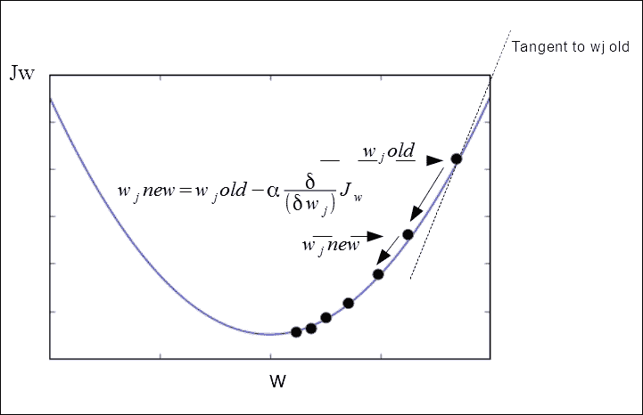

当我们将梯度下降应用于线性回归时，可以导出以下公式，它们是我们的模型的参数。我们可以重写导数项，使它更容易计算。派生本身相当复杂，没有必要在这里一一解释。如果你懂微积分，你会发现下面的规则是等价的。这里，我们使用一个停止函数，对假设重复应用两个更新规则。这通常是当后续迭代中参数之间的差异下降到阈值以下时，即 *t* 。

初始化*w<sub>0</sub>T3*w<sub>1</sub>T7】并重复:**

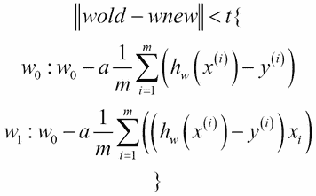

重要的是这些更新规则是同时应用的，也就是说，它们都是在同一个迭代中应用的，所以*w<sub>0</sub>T3】和*w<sub>1</sub>T7】的新值在下一个迭代中被插回。这有时被称为**批梯度下降**，因为它在一个*批*中更新了所有的训练样本。**

将这些更新规则应用于具有多个特征的线性回归问题是相当简单的。如果我们不担心精确的推导，这是真的。

对于多个特征，我们的假设函数如下所示:


在这里，添加了 *x <sub>0</sub> = 1* ，通常称为我们的**偏差特征**，以帮助我们进行以下计算。我们看到可以看到，通过使用向量，我们也可以把这个简单地写成参数值的转置乘以特征值向量， *x* 。对于多个特征梯度下降，我们的成本函数将应用于参数值的向量，而不仅仅是单个参数。这是新的成本函数。


*J(w)* 简单来说就是 *J(w <sub>0</sub> ，w<sub>1</sub>……，w <sub>n</sub> )* ，其中 *n* 是特征的个数。 *J* 是参数向量的函数， *w* 。现在，我们的梯度下降更新规则如下:


注意我们现在有多个特征。因此，我们用下标 *j* 写 *x* 值来表示 *j <sup>th</sup>* 特征。我们可以把这个拆开来看，它真的代表了 *j + 1* 的嵌套更新规则。除了下标之外，每一个都与我们用于单个特征的训练规则相同。

这里要提到的一个要点是，为了让我们的模型更有效地工作，我们可以定义自己的特征，这也是我们将在后面的章节中重新讨论的一个要点。对于一个简单的情况，我们的假设是根据宽度和深度两个特征来估算一块土地的价格，显然，我们可以将这两个特征相乘，得到一个特征，即面积。因此，根据您对某个问题的特定见解，使用派生功能可能更有意义。我们可以更进一步，创建我们自己的特征，使我们的模型适合非线性数据。一种方法是 **多项式回归**。这包括向我们的假设函数添加幂项，使其成为多项式。这里有一个例子:

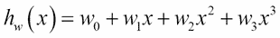

在我们的土地价格示例中，一种应用方法是简单地添加我们的*区域*特征的正方形和立方体。这些项有许多可能的选择，事实上，在我们的住房例子中，更好的选择可能是取其中一项的平方根，以阻止函数爆炸到无穷大。这就凸显了一个重要的点，那就是在使用多项式回归时，我们必须非常小心特征缩放。我们可以看到，随着 *x* 变大，函数中的项变得越来越大。

我们现在有一个模型来拟合非线性数据，然而，在这个阶段，我们只是手动尝试不同的多项式。理想情况下，我们需要能够在某种程度上在我们的模型中包含特征选择，而不是让人工尝试找出合适的功能。我们还需要意识到相关特征可能会使我们的模型不稳定，因此我们需要设计将相关特征分解成其组件的方法。我们在[第 7 章](7.html "Chapter 7. Features – How Algorithms See the World")、*特征–算法如何看世界*中研究这些方面。

下面是批量梯度下降的简单实现。尝试使用不同的学习速率α值运行它，并在具有较大偏差和/或方差的数据上运行，以及在改变迭代次数后运行，看看这对我们模型的性能有什么影响:

```py
import numpy as np
import random
import matplotlib.pyplot as plt

def gradientDescent(x, y, alpha, numIterations):
 xTrans = x.transpose()
 m, n = np.shape(x)
 theta = np.ones(n)
 for i in range(0, numIterations):
 hwx = np.dot(x, theta)
 loss = hwx - y
 cost = np.sum(loss ** 2) / (2 * m)
 print("Iteration %d | Cost: %f " % (i, cost))
 gradient = np.dot(xTrans, loss) / m
 theta = theta - alpha * gradient
 return theta

def genData(numPoints, bias, variance):
 x = np.zeros(shape=(numPoints, 2))
 y = np.zeros(shape=numPoints)
 for i in range(0, numPoints):
 x[i][0] = 1
 x[i][1] = i
 y[i] = (i + bias) + random.uniform(0, 1) * variance
 return x, y

def plotData(x,y,theta):
 plt.scatter(x[...,1],y)
 plt.plot(x[...,1],[theta[0] + theta[1]*xi for xi in x[...,1]])

x, y = genData(20, 25, 10)
iterations= 10000
alpha = 0.001
theta=gradientDescent(x,y,alpha,iterations)
plotData(x,y,theta)

```

代码的输出如下图所示:


这被称为 **批量梯度下降**，因为在每次迭代中，它一次基于所有训练样本更新参数值。在**随机梯度下降**的情况下，另一方面，梯度一次由单个例子的梯度近似。在算法收敛之前，可以对数据进行多次。每次通过时，数据都会被打乱，以防止陷入循环。随机梯度下降已成功应用于自然语言处理等大规模学习问题。缺点之一是它需要大量的超参数，尽管这确实提供了调整的机会，例如选择损失函数或应用的正则化类型。随机梯度下降也对特征缩放敏感。这方面的许多实现，例如`Sklearn`包中的 **SGDClassifier** 和**SGD gressor**，默认情况下将使用自适应学习速率。随着算法越来越接近最小值，这将降低学习速率。为了使这些算法运行良好，通常需要缩放数据，以便输入向量 *X* 中的每个值在 0 和 1 之间或-1 和 1 之间缩放。或者，确保数据值的平均值为 0，方差为 1。使用来自`sklearn.preprocessing`的`StandardScaler`类最容易做到这一点。

梯度下降并不是唯一的算法，在很多方面也不是最有效的最小化代价函数的方法。有许多高级库可以比我们手动实现梯度下降更新规则更有效地计算参数值。幸运的是，我们不必太担心细节，因为已经有许多用 Python 编写的复杂而高效的回归算法。以为例，在`sklearn.linear_model`模块中，有**脊**、**套索**和 **弹性线**算法，根据您的应用，这些算法可能表现更好。

## 正规方程

现在让我们从稍微不同的角度来看线性回归问题。如前所述，有一个数值解；因此，我们可以使用所谓的 **正规方程**一步求解，而不是像梯度下降那样迭代训练集。如果你知道一些微积分，你会记得我们可以通过取一个函数的导数，然后将导数设置为零来求解一个变量，从而最小化这个函数。这是有意义的，因为如果我们考虑凸成本函数，最小值将是切线斜率为零的地方。因此，在具有一个特征的简单情况下，我们区分 *J(w)* 和 *w* ，并将其设置为零，然后求解 *w* 。我们感兴趣的问题是当 *w* 是一个 *n +1* 参数向量时，成本函数 *J(w)* 是这个向量的函数。一种最小化的方法是依次对参数值取 *J(w)* 的偏导数，然后将这些导数设置为零，对 *w* 的每个值求解。这给了我们最小化成本函数所需的 *w* 的值。

事实证明，一个简单的解决方法，可能是一个漫长而复杂的计算，就是所谓的正规方程。为了了解这是如何工作的，我们首先定义一个特征矩阵，如下所示:


这通过 *n + 1* 矩阵创建了一个 *m* ，其中 *m* 是训练示例的数量， *n* 是特征的数量。请注意，在我们的符号中，我们现在将训练标签向量定义如下:

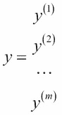

现在，我们可以通过以下等式计算参数值以最小化成本函数:

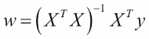

这是正常方程。当然，有很多方法可以在 Python 中实现这一点。这里有一个使用 NumPy `matrix`类的简单方法。大多数实现都有一个正则化参数，除其他外，该参数可以防止试图转置奇异矩阵时出现错误。当我们拥有比训练数据更多的特征时，也就是当 *n* 大于 *m* 时，就会出现这种情况；没有正则化的正规方程是行不通的。这是因为矩阵 *X <sup>T</sup> X* 是不可换位的，所以，我们的术语*(X<sup>T</sup>X)<sup>-1</sup>*是没有办法计算的。正则化还有其他好处，我们将很快看到:

```py
import numpy as np

def normDemo(la=.9):
 X = np.matrix('1 2 5 ; 1 4 6')
 y=np.matrix('8; 16')
 xtrans=X.T
 idx=np.matrix(np.identity(X.shape[1]))
 xti = (xtrans.dot(X)+la * idx).I
 xtidt = xti.dot(xtrans)
 return(xtidt.dot(y))

```

使用法向方程的一个优点是您不需要担心特征缩放。具有不同范围的要素(例如，如果一个要素的值介于 1 和 10 之间，而另一个要素的值介于 0 和 1000 之间)可能会导致梯度下降的问题。使用正规方程，你不需要担心这个。正规方程的另一个优点是不需要选择学习速率。我们看到，梯度下降；错误选择的学习速率可能会使模型变得不必要的慢，或者，如果学习速率太大，可能会导致模型超过最小值。这可能需要在我们的梯度下降测试阶段增加一个步骤。

正规方程有其特殊的缺点；最重要的是，当我们有大量特征的数据时，它不能很好地扩展。我们需要计算特征矩阵转置的逆， *X* 。这种计算通过 *n* 矩阵产生一个 *n* 。记住 *n* 是特征的数量。这实际上意味着，在大多数平台上，矩阵求逆所需的时间大约增长为 *n* 的立方。因此，对于具有大量特征的数据，比如大于 10，000 的数据，您可能应该考虑使用梯度下降而不是正规方程。使用正规方程时出现的另一个问题是，当我们拥有比训练数据更多的特征时，也就是当 *n* 大于 *m* 时，没有正则化的正规方程就不起作用了。这是因为矩阵 *X <sup>T</sup> X* 是不可转座的，所以没有办法计算我们的术语*(X<sup>T</sup>X)<sup>-1</sup>*。

# 逻辑回归

用我们的最小平方模型，我们已经应用它来解决最小化问题。我们也可以用这种思想的变体来解决分类问题。考虑当我们将线性回归应用于分类问题时会发生什么。让我们以具有一个特征的二元分类的简单情况为例。我们可以对照 *y* 轴上的类别标签，在 *x* 轴上绘制我们的特征。我们的特征变量是连续的，但是我们在 *y* 轴上的目标变量是离散的。对于二元分类，我们通常表示一个 *0* 为负类，一个 *1* 为正类。我们通过数据构建一条回归线，并在 y 轴上使用一个阈值来估计决策边界。这里我们使用 0.5 的阈值。

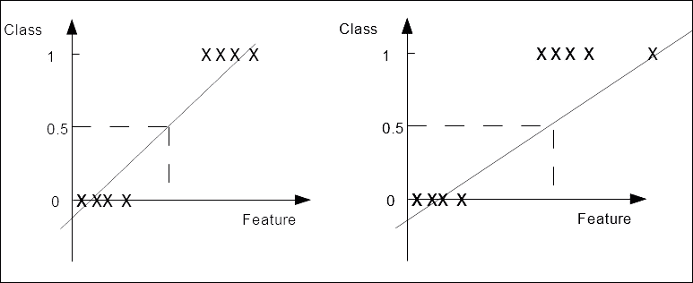

在左边的图中，方差很小，并且我们的正负情况很好地分开，我们得到了一个可接受的结果。该算法正确地对训练集进行分类。在右侧的图像中，我们在数据中有一个孤立点。这使得我们的回归线变平，并且将我们的截止线向右移动。显然属于类别 *1* 的异常值应该不会对模型的预测产生任何影响，但是，现在在相同的截止点下，预测将类别 *1* 的第一个实例误分类为类别 *0* 。

我们处理这个问题的一种方法是制定一个不同的假设表示。对于逻辑回归，我们将使用线性函数作为另一个函数 *g* 的输入。

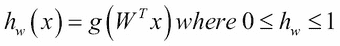

术语 *g* 被称为 **sigmoid** 或**逻辑函数**。你会从它的图中注意到，在*y*轴上，它在 0 和 1 处有渐近线，并且它在 *0.5* 处与该轴相交。

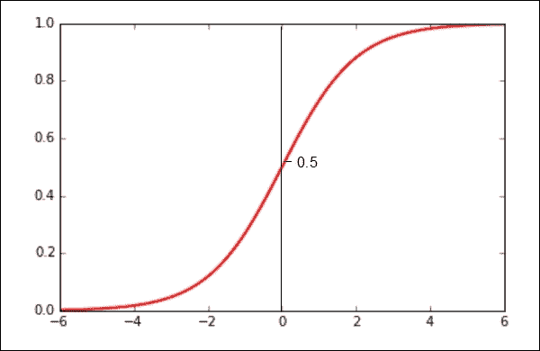

现在，如果我们将 *z* 替换为 *W <sup>T</sup> x* ，我们可以这样重写我们的假设函数:

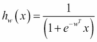

与线性回归一样，我们需要将参数 *w、*拟合到我们的训练数据中，以给出一个可以进行预测的函数。在我们尝试拟合模型之前，让我们看看如何解释假设函数的输出。由于这将返回一个介于 0 和 1 之间的数字，最自然的解释方式是因为它是正类的概率。既然我们知道，或者假设，每个样本只能属于两类中的一类，那么正类的概率加上负类的概率就一定等于一。因此，如果我们能估计正类，那么我们就能估计负类的概率。因为我们最终试图预测特定样本的类别，所以如果假设函数的输出返回大于或等于 0.5 的值，我们可以将其解释为正，否则为负。现在，给定 sigmoid 函数的特征，我们可以写出以下内容:


每当我们的假设函数在特定的训练样本上返回一个大于或等于零的数字时，我们就可以预测一个正类。让我们看一个简单的例子。我们还没有将我们的参数拟合到这个模型中，我们将很快这样做，但是为了这个例子，让我们假设我们有一个如下的参数向量:

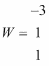

因此，我们的假设函数是这样的:

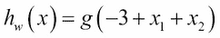

如果满足以下条件，我们可以预测 *y = 1* :


相当于:


这可以用下面的图表来描述:


这只是 *x=3* 和 *y=3* 之间的一条直线，代表**决策边界**。它创建了两个区域，我们可以在其中预测 *y = 0* 或 *y = 1* 。当判定边界不是直线时会发生什么？就像我们在线性回归中给假设函数添加多项式一样，我们也可以用逻辑回归来做这件事。让我们编写一个带有一些高阶项的新假设函数，看看如何将其与数据进行拟合:

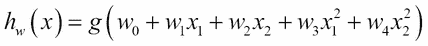

这里我们在函数中增加了两个平方项。我们将很快看到如何拟合参数，但是现在，让我们将参数向量设置为以下值:


所以，我们现在可以写出以下内容:

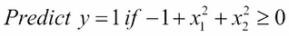

或者，我们可以这样写:


你可能认识到，这是以原点为中心的圆的方程，我们可以用它作为我们的决策边界。我们可以通过添加高阶多项式项来创建更复杂的决策边界。

## 逻辑回归的成本函数

现在，我们需要看看将参数拟合到数据的重要任务。如果我们更简单地重写我们用于线性回归的成本函数，我们可以看到成本是平方误差的一半:


对此的解释是，在给定某个预测，即 *h <sub>w</sub> (x)* 和训练标签 *y* 的情况下，它只是简单地计算我们希望模型产生的成本。

这在一定程度上适用于逻辑回归，但是，有一个问题。对于逻辑回归，我们的假设函数依赖于非线性 sigmoid 函数，当我们将它与我们的参数进行比较时，它通常会产生一个非凸函数。这意味着，当我们试图将梯度下降等算法应用于代价函数时，它不一定会收敛到全局最小值。一种解决方案是定义一个凸的成本函数，结果证明以下两个函数适合我们的目的，每个类一个:

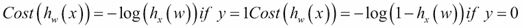

这为我们提供了以下图表:


直觉上，我们可以看到这是我们需要它做的事情。如果我们考虑正类中的单个训练样本，那就是 *y = 1* ，如果我们的假设函数 *h <sub>w</sub> (x)* 正确预测 *1* ，那么成本，正如你所料，就是 *0* 。如果假设函数的输出为 *0* ，则不正确，因此成本趋近于无穷大。当 *y* 在负类时，我们的成本函数就是右边的图。这里 *h <sub>w</sub> (x)* 为 *0* 时成本为零，当 *h <sub>w</sub> (x)* 为 *1* 时成本上升到无穷大。我们可以用更简洁的方式写这个，记住 *y* 不是 *0* 就是 *1* :

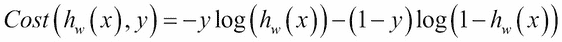

我们可以看到，对于每种可能性， *y=1* 或 *y=0* ，无关项乘以 *0* ，为每种特定情况留下正确的项。所以，现在我们可以把成本函数写成如下:


那么，如果给我们一个新的、未标记的值 *x* ，我们如何进行预测呢？与线性回归一样，我们的目标是最小化成本函数， *J(w)* 。我们可以使用与用于线性回归相同的更新规则，即使用偏导数来寻找斜率，当我们重写导数时，我们得到以下结果:


# 多类分类

到目前为止，我们只看了二元分类。对于多类分类，我们假设每个实例只属于一个类。一个稍微不同的分类问题是每个样本可以属于多个目标类。这叫做多标签分类。我们可以对每一类问题采用类似的策略。

有两种基本方法:

*   一个对所有
*   一对多

在“一个对所有”的方法中，单个多类问题被转化为多个二进制分类问题。这被称为 **一对全**技术，因为我们依次取每个类，并为该特定类拟合一个假设函数，给其他类分配一个负类。我们最终得到不同的分类器，每个分类器都被训练来识别其中的一个类。我们通过运行所有的分类器并挑选预测具有最高概率的类的分类器，在给定新输入的情况下进行预测。为了使它形式化，我们编写了以下内容:


为了做出预测，我们选择最大化以下内容的类:


用另一种方法称为**一对一**方法，为每对类构造一个分类器。当模型做出预测时，得票最多的班级获胜。这种方法通常比一对多方法慢，尤其是当有大量类时。

所有 Sklearn 分类器都实现了多类分类。我们在[第 2 章](2.html "Chapter 2. Tools and Techniques")、*工具和技术*中看到了这一点，以 K 近邻为例，我们试图使用虹膜数据集预测三个类别中的一个。Sklearn 使用`OneVsRestClassifier`类实现一对所有算法，使用`OneVsOneClassifier`实现一对一算法。这些被称为元估计器，因为它们将另一个估计器作为输入。它们具有的优势，能够允许改变处理两个以上类的方式，这可以导致更好的性能，无论是在计算效率方面，还是在泛化误差方面。

在下面的示例中，我们使用了 SVC:

```py
from sklearn import datasets
from sklearn.multiclass import OneVsRestClassifier, OneVsOneClassifier
from sklearn.svm import LinearSVC

X,y = datasets.make_classification(n_samples=10000, n_features=5)
X1,y1 = datasets.make_classification(n_samples=10000, n_features=5)
clsAll=OneVsRestClassifier(LinearSVC(random_state=0)).fit(X, y)
clsOne=OneVsOneClassifier(LinearSVC(random_state=0)).fit(X1, y1)
print("One vs all cost= %f" % clsAll.score(X,y))
print("One vs one cost= %f" % clsOne.score(X1,y1))

```

我们将观察以下输出:


# 正规化

我们前面提到如果特征是相关的，线性回归会变得不稳定，也就是说，对训练数据的微小变化高度敏感。考虑两个特征完全负相关的极端情况，这样一个特征的任何增加都会伴随着另一个特征的同等减少。当我们将我们的线性回归算法应用于这两个特征时，它将产生一个常数函数，所以这并没有真正告诉我们任何关于数据的信息。或者，如果特征是正相关的，它们的微小变化将被放大。正规化有助于缓和这种情况。

我们之前看到，我们可以通过添加多项式项来使我们的假设更接近于训练数据。随着我们添加这些项，函数的形状变得更加复杂，这通常会导致假设过度拟合训练数据，并且在测试数据上表现不佳。当我们添加特征时，无论是直接从数据还是我们自己导出的特征，模型更有可能过度填充数据。一种方法是丢弃我们认为不太重要的特征。然而，我们无法事先确定哪些特征可能包含相关信息。更好的方法是不丢弃特征，而是缩小它们。由于我们不知道每个特征包含多少信息，正则化减少了所有参数的大小。

我们可以简单地将该术语添加到成本函数中。

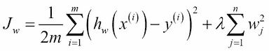

超参数**λ，**控制着两个目标之间的权衡——拟合训练数据的需要，以及保持参数小以避免过度拟合的需要。我们不将正则化参数应用于我们的偏差特征，因此我们分离第一个特征的更新规则，并向所有后续特征添加正则化参数。我们可以这样写:


在这里，我们已经添加了正则化项， *λ w <sub>j</sub> /m* 。为了更清楚地了解这是如何工作的，我们可以将所有依赖于 *wj* 的术语分组，我们的更新规则可以改写如下:


正则化参数 *λ* 通常是一个大于零的小数值。为了使其具有期望的效果，将其设置为使得 *α λ /m* 是比 *1* 稍小的数字。这将在更新的每次迭代中缩小 *w <sub>j</sub>* 。

现在，让我们看看如何将正则化应用于正规方程。等式如下:

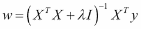

这有时被称为闭合形式解。我们加上身份矩阵， *I* ，乘以正则化参数。单位矩阵是由主对角线上的 1 和其他地方的 0 组成的 *(n+1)* 矩阵乘以 *(n+1)* 。

在一些实现中，我们还可以使矩阵零的第一个条目(左上角)反映我们没有将正则化参数应用于第一个偏差特征的事实。然而，在实践中，这很少会对我们的模型产生很大影响。

当我们将其与单位矩阵相乘时，我们得到一个主对角线包含 *λ* 值的矩阵，所有其他位置为零。这确保了，即使我们有比训练样本更多的特征，我们仍然能够反转矩阵 *X <sup>T</sup> X* 。如果我们有相关变量，这也使我们的模型更加稳定。这种回归形式有时被称为**岭回归**，我们在[第二章](2.html "Chapter 2. Tools and Techniques")*工具与技术*中看到了这种实现。岭回归的一个有趣的替代方法是 **套索回归**。它将岭回归正则化项 *∑iwi 2* 替换为 *∑i | wi |* 。也就是说，它不是使用权重的平方和，而是使用权重平均值的和。结果是一些权重被设置为 *0* ，而其他权重被缩小。套索回归往往对正则化参数相当敏感。与岭回归不同，套索回归没有封闭形式的解，因此需要采用其他形式的数值优化。岭回归有时被称为使用 **L2 范数、**和套索正则化、 **L1 范数**。

最后，我们将研究如何将正则化应用于逻辑回归。与线性回归一样，如果我们的假设函数包含高阶项或许多特征，逻辑回归也会遇到过拟合的问题。我们可以修改我们的逻辑回归成本函数来添加正则化参数，如下所示:


为了实现逻辑回归的梯度下降，我们最终得到了一个表面上看起来与线性回归的梯度下降相同的方程。然而，我们必须记住，我们的假设函数是我们用于逻辑回归的函数。

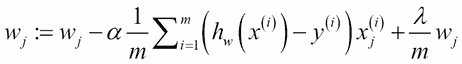

使用假设函数，我们得到以下结果:


# 总结

在这一章中，我们研究了机器学习中一些最常用的技术。我们为线性和逻辑回归创建了假设表示。您学习了如何创建成本函数来衡量训练数据假设的性能，以及如何使用梯度下降和正规方程最小化成本函数来拟合参数。我们展示了如何通过在假设函数中使用多项式项来将假设函数拟合到非线性数据。最后，我们研究了正则化，它的用途，以及如何将其应用于逻辑回归和线性回归。

这些是在许多不同的机器学习算法中广泛使用的强大技术。然而，正如你可能已经意识到的，这个故事还有很多。到目前为止，我们所研究的模型通常需要相当多的人工干预才能使它们有效地运行。例如，我们必须设置超参数，如学习率或正则化参数，并且，在非线性数据的情况下，我们必须尝试并找到多项式项，这将迫使我们的假设与数据相匹配。很难确切地确定这些术语是什么，尤其是当我们有很多特征的时候。在下一章中，我们将看看驱动这个星球上一些最强大的学习算法的想法，即神经网络。