# 六、神经网络

人工神经网络，顾名思义，是基于试图模仿神经元在大脑中工作方式的算法。概念工作始于 20 世纪 40 年代，但直到最近，一些重要的见解，以及运行这些计算成本更高的模型的硬件的可用性，才使神经网络得到了实际应用。它们现在是最先进的技术，是许多高级机器学习应用的核心。

在本章中，我们将介绍以下主题:

*   后勤单位
*   神经网络的代价函数
*   实现神经网络
*   其他神经网络架构

# 神经网络入门

我们在上一章中看到了如何通过向假设函数添加多项式项来创建非线性决策边界。我们也可以在线性回归中使用这种技术来拟合非线性数据。然而，由于多种原因，这不是理想的解决方案。首先，我们必须选择多项式项，对于复杂的决策边界，这可能是一个不精确且耗时的过程，可能需要大量的试错。我们还需要考虑当我们拥有大量功能时会发生什么。很难准确理解增加的多项式项将如何改变决策边界。这也意味着衍生特征的可能数量将呈指数级增长。为了适应复杂的边界，我们将需要许多高阶项，我们的模型将变得笨拙、计算昂贵且难以理解。

考虑计算机视觉等应用，在灰度图像中，每个像素都是一个值介于 0 到 255 之间的特征。对于一个小图像，比如 100 像素乘 100 像素，我们有 10，000 个特征。如果我们只包括二次项，我们最终会得到大约 5000 万个可能的特征，为了适应复杂的决策边界，我们可能需要三次项和更高阶的项。显然，这样的模式完全行不通。

当我们处理模仿大脑的问题时，我们面临着许多困难。考虑到大脑做的所有不同的事情，我们可能会首先认为大脑由许多不同的算法组成，每个算法都专门用于完成特定的任务，并且每个算法都被硬连线到大脑的不同部分。这种方法基本上将大脑视为多个子系统，每个子系统都有自己的程序和任务。例如，用于感知声音的听觉皮层有其自己的算法，例如，对进入的声波进行**傅立叶**变换以检测音调。另一方面，视觉皮层有自己独特的算法来解码视神经的信号并将其转换成视觉。然而，越来越多的证据表明，大脑根本不是这样运作的。

最近在动物身上的实验显示了脑组织的显著适应性。科学家们将动物的视神经重新连接到听觉皮层，发现大脑可以利用听觉皮层的机制来学习视觉。尽管这些动物的视觉皮层被绕过了，但它们还是被测试出拥有完全的视觉。大脑不同部位的脑组织似乎可以重新学习如何解释其输入。因此，大脑不是由被编程来执行特定任务的专门子系统组成，而是使用相同的算法来学习不同的任务。这种单一算法方法有许多优点，尤其是它相对容易实现。这也意味着我们可以创建通用模型，然后训练它们执行专门的任务。就像在真实大脑中使用单一算法来描述每个神经元如何与其周围的其他神经元通信一样，它允许人工神经网络具有适应性，能够执行多个更高级别的任务。但是，这个单一算法的本质是什么？

当试图模仿真实的大脑功能时，我们被迫大大简化了许多事情。例如，没有办法考虑大脑化学状态的作用，或者大脑在不同发育和生长阶段的状态。目前使用的大多数神经网络模型采用离散的人工神经元层或单元，以有序的线性序列或层连接。另一方面，大脑由许多复杂的、嵌套的和相互连接的神经回路组成。在试图模仿这些复杂的反馈系统方面已经取得了一些进展，我们将在本章的最后讨论这些。然而，对于真实的大脑行为以及如何将这种复杂的行为纳入人工神经网络，我们仍然有很多不知道的地方。

# 后勤单位

作为起点，我们在神经元的简化模型上使用逻辑单元的概念。它由一组输入和输出以及一个激活功能组成。这个激活函数本质上是对输入集进行计算，然后给出输出。这里，我们将激活函数设置为上一章中用于逻辑回归的 sigmoid:


我们有两个输入单元，x <sub>1</sub> 和 x <sub>2</sub> 和一个偏置单元，x <sub>0</sub> ，设置为 1。这些被输入到假设函数中，该假设函数使用 sigmoid 逻辑函数和权重向量 *w* ，该权重向量参数化假设函数。由二进制值组成的特征向量和前面示例的参数向量由以下内容组成:


为了了解如何让它执行逻辑功能，让我们给模型一些权重。我们可以把它写成 sigmoid、 *g* 和我们的权重的函数。首先，我们将选择一些重量。我们将很快学习如何训练模型学习它自己的重量。假设我们设定了权重，使得我们具有以下假设函数:

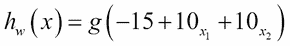

我们为模型提供一些简单的标记数据，并构建一个真值表:


虽然这个数据看起来相对简单，但是分离类所需要的决策边界并不简单。我们的目标变量 *y* 与输入变量形成逻辑的 **XNOR** 。只有当 *x <sub>1</sub>* 和 *x <sub>2</sub>* 均为 *0* 或 *1* 时，输出才为 *1* 。

在这里，我们的假设给了我们一个逻辑**和**。也就是说，当*x<sub>1</sub>T7】和*x<sub>2</sub>T11】都为 *1* 时，返回一个 *1* 。通过将权重设置为其他值，我们可以让单个人工神经元形成其他逻辑函数。**

这给了我们逻辑上的**或**功能:

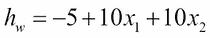

为了执行 XNOR，我们结合了与、或和非函数。要执行否定，即逻辑**而非**，我们只需为要否定的输入变量选择大的负权重。

物流单元连接在一起形成人工神经网络。这些网络由输入层、一个或多个隐藏层和输出层组成。每个单元都有一个激活函数，这里是 sigmoid，并通过权重矩阵 *W* 进行参数化:


我们可以写出隐藏层中每个单元的激活函数:

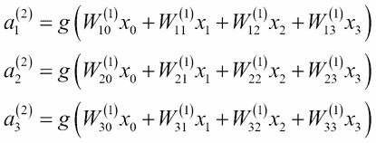

输出层的激活功能如下:

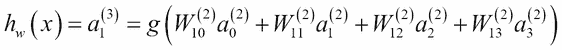

更一般地，我们可以说从给定层 *j* 到层 *j+1* 的函数映射是由参数矩阵*w<sub>j</sub>T8】确定的。超级脚本 *j* 表示 *j <sup>第</sup>* 层，下标 *i* 表示该层的单元。我们表示参数或权重矩阵， *W <sup>(j)</sup>* ，它控制从图层 *j* 到图层 *j + 1* 的映射。我们在矩阵索引的下标中表示各个权重。*

注意，每一层的参数矩阵的维数将是下一层的单位数乘以当前层的单位数加上*1*；这是针对*x<sub>0</sub>T5 的，这是偏向层。更正式地说，我们可以写出给定层的参数矩阵的维数 *j* ，如下所示:*


下标 *(j + 1)* 指的是下一个输入层和前一层的单位数，*d<sub>j</sub>T5】+*1*指的是当前层的单位数加上 *1* 。*

现在让我们看看如何使用向量实现来计算这些激活函数。我们可以通过定义一个新的术语 *Z* 来更简洁地编写这些函数，它由给定层上每个单元的输入值的加权线性组合组成。这里有一个例子:

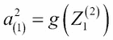

我们只是用一个单一的函数 *Z* 来代替我们激活函数内部术语中的一切。这里超级脚本 *(2)* 表示层数，下标 *1* 表示该层的单位。因此，更一般地，定义层 *j* 的激活函数的矩阵如下:

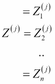

因此，在我们的三层示例中，我们的输出层可以定义如下:


我们可以通过首先仅查看单个隐藏层上的三个单元以及它如何将其输入映射到输出层上的单个单元的输入来学习特征。我们可以看到，它仅使用特征集( *a <sup>2</sup> )* 执行逻辑回归。不同之处在于，现在隐藏图层的输入要素本身已经使用从输入图层的原始要素中学习的权重进行了计算。通过隐藏层，我们可以开始拟合更复杂的非线性函数。

我们可以使用下面的神经网络结构来解决我们的 XNOR 问题:

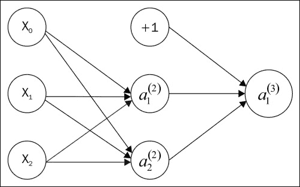

这里，我们在输入层有三个单位，在单个隐藏层有两个单位加偏置单位，在输出层有一个单位。我们可以为隐藏层中的第一个单元(不包括偏置单元)设置权重，以执行逻辑功能 *x <sub>1</sub> 和 x<sub>2</sub>T6】。第二单元的砝码执行功能 *(NOT x <sub>1</sub> )和(NOT x <sub>2</sub> )* 。最后，我们的输出层执行或函数。*

我们可以按如下方式编写激活函数:


该网络的真值表如下所示:

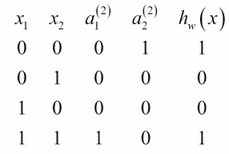

为了用神经网络执行多类分类，我们使用的体系结构为我们试图分类的每个类都有一个输出单元。网络输出一个二进制数向量，其中 *1* 表示该类存在。这个输出变量是一个 *i* 维向量，其中 *i* 是输出类的数量。例如，四个功能的输出空间如下所示:


我们的目标是定义一个假设函数，大约等于这四个向量中的一个:

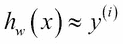

这本质上是一个一对所有的表现。

我们可以用层数 *L* 来描述一个神经网络架构，用一个数来描述每层中的单元数*s<sub>I</sub>T5】，其中下标表示层数。为了方便起见，我打算定义一个变量， *t* ，表示层 *l + 1* 上的单位数，其中 *l + 1* 为正向层，即图右侧的层。*

# 成本函数

为了给定训练集拟合神经网络中的权重，我们首先需要定义一个成本函数:

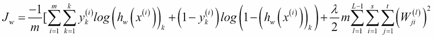

这与我们用于逻辑回归的成本函数非常相似，除了现在我们也在对 *k* 输出单位求和。正则化项中使用的三重求和看起来有点复杂，但它真正做的是对参数矩阵中的每个项求和，并使用它来计算正则化。注意求和， *i* 、 *l* 、 *j* 从 *1* 开始，而不是*0*；这是为了反映我们不对偏差单位应用正则化的事实。

## 最小化成本函数

既然有了成本函数，就要想办法最小化。与梯度下降一样，我们需要计算偏导数来计算成本函数的斜率。这是使用**反向传播**算法完成的。之所以称之为反向传播，是因为我们首先计算输出层的误差，然后依次计算前一层的误差。我们可以使用成本函数计算的这些导数来计算神经网络中每个单元的参数值。为此，我们需要定义一个错误术语:

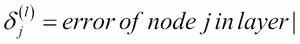

对于这个例子，让我们假设我们总共有三层，包括输入和输出层。输出层的错误可以写为:


最后一层的激活函数相当于我们的假设函数，我们可以用简单的向量 减法来计算我们假设预测的值和我们训练集中的实际值之间的差值。一旦我们知道了输出层中的错误，我们就能够*反向传播*来找到先前层中的错误，即增量值:


这将计算第三层的误差。我们使用当前层的参数向量的转置，在这个例子中是层 2，乘以来自前向层的误差向量，在这个例子中是层 3。然后，我们使用成对乘法，用符号 *** 表示，用激活函数的导数 *g* ，在由 *z <sup>(3)</sup>* 给出的输入值下计算。我们可以通过以下公式计算这个导数项:

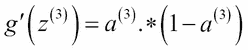

如果你知道微积分，这是一个相当直接的程序来证明这一点，但出于我们的目的，我们在这里不深入讨论。如您所料，当我们有多个隐藏层时，我们可以使用完全相同的方式计算每个隐藏层的增量值，使用参数向量、前向层的增量向量和当前层激活函数的导数。我们不需要计算第 1 层的增量值，因为这些只是要素本身，没有任何错误。最后，通过一个相当复杂的数学证明，我们将不再赘述，我们可以写出代价函数的导数，忽略正则化，如下所示:


通过使用反向传播计算增量项，我们可以找到每个参数值的偏导数。现在，让我们看看如何将其应用于训练样本数据集。我们需要定义资本 delta，*δ*，它只是 delta 项的矩阵，有维度， *l:i:j* 。当算法在每个训练样本中循环时，这将充当神经网络中每个节点的增量值的**累加器**。在每个循环中，它对每个训练样本执行以下功能:

1.  它将第一层的激活函数设置为 *x* 的每个值，即我们的输入特征。
2.  它在每个后续层上依次向前传播到输出层，以计算每个层的激活函数。
3.  It computes the delta values at the output layer and begins the process of back propagation. This is similar to the process we performed in forward propagation, except that it occurs in reverse. So, for our output layer in our 3-layer example, it is demonstrated as follows:

    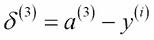

请记住，这一切都是在一个循环中发生的，因此我们一次只处理一个训练样本； *y <sup>(i)</sup>* 代表 *i <sup>th</sup>* 训练样本的目标值。我们现在可以使用反向传播算法来计算先前图层的增量值。我们现在可以使用更新规则将这些值添加到累加器中:

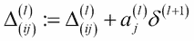

这个公式可以用矢量化的形式表示，一次更新所有训练样本，如图所示:


现在，我们可以添加正则化项:

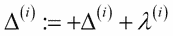

最后，我们可以通过执行梯度下降来更新权重:


记住 *α* 是学习率，也就是我们设置为 0 到 1 之间的一个小数值的超参数。

# 实现神经网络

还有一件事我们需要考虑，那就是我们权重的初始化。如果我们将它们初始化为 0，或者全部初始化为相同的数字，则前向层上的所有单元将在输入端计算相同的函数，这使得计算高度冗余，并且无法拟合复杂的数据。本质上，我们需要做的是打破对称性，这样我们给每个单元一个稍微不同的起点，实际上允许网络创建更多有趣的功能。

现在，让我们看看如何在代码中实现这一点。这个实现是 Sebastian Raschka 写的，摘自他的优秀著作， *Python 机器学习*，由 Packt 出版发行:

```py
import numpy as np
from scipy.special import expit
import sys

class NeuralNetMLP(object):

 def __init__(self, n_output, n_features, n_hidden=30,
 l1=0.0, l2=0.0, epochs=500, eta=0.001, 
 alpha=0.0, decrease_const=0.0, shuffle=True,
 minibatches=1, random_state=None):

 np.random.seed(random_state)
 self.n_output = n_output
 self.n_features = n_features
 self.n_hidden = n_hidden
 self.w1, self.w2 = self._initialize_weights()
 self.l1 = l1
 self.l2 = l2
 self.epochs = epochs
 self.eta = eta
 self.alpha = alpha
 self.decrease_const = decrease_const
 self.shuffle = shuffle
 self.minibatches = minibatches

 def _encode_labels(self, y, k):

 onehot = np.zeros((k, y.shape[0]))
 for idx, val in enumerate(y):
 onehot[val, idx] = 1.0
 return onehot

 def _initialize_weights(self):
 """Initialize weights with small random numbers."""
 w1 = np.random.uniform(-1.0, 1.0, size=self.n_hidden*(self.n_features + 1))
 w1 = w1.reshape(self.n_hidden, self.n_features + 1)
 w2 = np.random.uniform(-1.0, 1.0, size=self.n_output*(self.n_hidden + 1))
 w2 = w2.reshape(self.n_output, self.n_hidden + 1)
 return w1, w2

 def _sigmoid(self, z):

 # return 1.0 / (1.0 + np.exp(-z))
 return expit(z)

 def _sigmoid_gradient(self, z):
 sg = self._sigmoid(z)
 return sg * (1 - sg)

 def _add_bias_unit(self, X, how='column'):

 if how == 'column':
 X_new = np.ones((X.shape[0], X.shape[1]+1))
 X_new[:, 1:] = X
 elif how == 'row':
 X_new = np.ones((X.shape[0]+1, X.shape[1]))
 X_new[1:, :] = X
 else:
 raise AttributeError('`how` must be `column` or `row`')
 return X_new

 def _feedforward(self, X, w1, w2):

 a1 = self._add_bias_unit(X, how='column')
 z2 = w1.dot(a1.T)
 a2 = self._sigmoid(z2)
 a2 = self._add_bias_unit(a2, how='row')
 z3 = w2.dot(a2)
 a3 = self._sigmoid(z3)
 return a1, z2, a2, z3, a3

 def _L2_reg(self, lambda_, w1, w2):
 """Compute L2-regularization cost"""
 return (lambda_/2.0) * (np.sum(w1[:, 1:] ** 2) + np.sum(w2[:, 1:] ** 2))

 def _L1_reg(self, lambda_, w1, w2):
 """Compute L1-regularization cost"""
 return (lambda_/2.0) * (np.abs(w1[:, 1:]).sum() + np.abs(w2[:, 1:]).sum())

 def _get_cost(self, y_enc, output, w1, w2):

 term1 = -y_enc * (np.log(output))
 term2 = (1 - y_enc) * np.log(1 - output)
 cost = np.sum(term1 - term2)
 L1_term = self._L1_reg(self.l1, w1, w2)
 L2_term = self._L2_reg(self.l2, w1, w2)
 cost = cost + L1_term + L2_term
 return cost

 def _get_gradient(self, a1, a2, a3, z2, y_enc, w1, w2):

 # backpropagation
 sigma3 = a3 - y_enc
 z2 = self._add_bias_unit(z2, how='row')
 sigma2 = w2.T.dot(sigma3) * self._sigmoid_gradient(z2)
 sigma2 = sigma2[1:, :]
 grad1 = sigma2.dot(a1)
 grad2 = sigma3.dot(a2.T)

 # regularize
 grad1[:, 1:] += (w1[:, 1:] * (self.l1 + self.l2))
 grad2[:, 1:] += (w2[:, 1:] * (self.l1 + self.l2))

 return grad1, grad2

 def predict(self, X):

 if len(X.shape) != 2:
 raise AttributeError('X must be a [n_samples, n_features] array.\n'
 'Use X[:,None] for 1-feature classification,'
 '\nor X[[i]] for 1-sample classification')

 a1, z2, a2, z3, a3 = self._feedforward(X, self.w1, self.w2)
 y_pred = np.argmax(z3, axis=0)
 return y_pred

 def fit(self, X, y, print_progress=False):

 self.cost_ = []
 X_data, y_data = X.copy(), y.copy()
 y_enc = self._encode_labels(y, self.n_output)

 delta_w1_prev = np.zeros(self.w1.shape)
 delta_w2_prev = np.zeros(self.w2.shape)

 for i in range(self.epochs):

 # adaptive learning rate
 self.eta /= (1 + self.decrease_const*i)

 if print_progress:
 sys.stderr.write('\rEpoch: %d/%d' % (i+1, self.epochs))
 sys.stderr.flush()

 if self.shuffle:
 idx = np.random.permutation(y_data.shape[0])
 X_data, y_data = X_data[idx], y_data[idx]

 mini = np.array_split(range(y_data.shape[0]), self.minibatches)
 for idx in mini:

 # feedforward
 a1, z2, a2, z3, a3 = self._feedforward(X[idx], self.w1, self.w2)
 cost = self._get_cost(y_enc=y_enc[:, idx],
 output=a3,
 w1=self.w1,
 w2=self.w2)
 self.cost_.append(cost)

 # compute gradient via backpropagation
 grad1, grad2 = self._get_gradient(a1=a1, a2=a2,
 a3=a3, z2=z2,
 y_enc=y_enc[:, idx],
 w1=self.w1,
 w2=self.w2)

 delta_w1, delta_w2 = self.eta * grad1, self.eta * grad2
 self.w1 -= (delta_w1 + (self.alpha * delta_w1_prev))
 self.w2 -= (delta_w2 + (self.alpha * delta_w2_prev))
 delta_w1_prev, delta_w2_prev = delta_w1, delta_w2

 return self

```

现在，让我们将这个神经网络应用于虹膜样本数据集。请记住，这个数据集包含三个类，因此我们将`n_output`参数(输出层数)设置为 3。数据集中第一个轴的形状指的是要素的数量。我们创建 50 个隐藏层和 100 个纪元，每个纪元是所有训练集的完整循环。在这里，我们将学习率`alpha`设置为`.001`，并显示成本与时代数量的关系图:

```py
iris = datasets.load_iris()
X=iris.data
y=iris.target
nn= NeuralNetMLP(3, X.shape[1],n_hidden=50, epochs=100, alpha=.001)
nn.fit(X,y)
plt.plot(range(len(nn.cost_)),nn.cost_)
plt.show()

```

以下是输出:

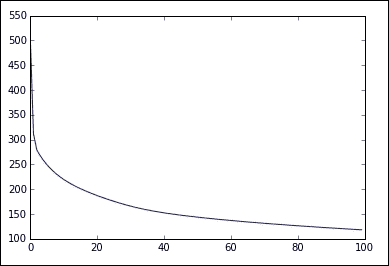

该图显示了成本在每个时期是如何降低的。要了解模型是如何工作的，可以花一些时间在其他数据集和各种输入参数上进行实验。测试多类分类问题时经常使用的一个特定数据集是 MNIST 数据集，可在[http://yann.lecun.com/exdb/mnist/](http://yann.lecun.com/exdb/mnist/)获得。这由包含 60，000 个手绘字母图像及其标签的数据集组成。它经常被用作机器学习算法的基准。

# 梯度检查

反向传播和一般的神经网络，有点难以概念化。因此，经常不容易理解改变任何模型(超)参数将如何影响结果。此外，通过不同的实现，有可能获得指示算法正在正确工作的结果，即，在梯度下降的每个级别上，成本函数正在降低。然而，就像任何复杂的软件一样，可能会有隐藏的 bug，这些 bug 可能只在非常特殊的情况下才会表现出来。一种帮助消除这些的方法是通过一种叫做**梯度检查**的程序。这是一种近似梯度的数值方法，我们可以通过查看下图直观地理解这一点:


*J(w)* 相对于 *w、*的导数可以近似如下:


当参数为单个值时，上述公式近似于导数。我们需要在一个成本函数上评估这些导数，其中权重是一个向量。我们通过依次对每个权重进行偏导数来实现这一点。这里有一个例子:


# 其他神经网络架构

在神经网络模型领域，以及实际上一般的机器学习领域，许多最重要的工作正在使用具有许多层和特征的非常复杂的神经网络。这种方法通常被称为**深度架构**或深度学习。人类和动物学习的速度和深度是任何机器都无法比拟的。生物学习的许多要素仍然是个谜。目标识别是研究的关键领域之一，也是实际应用中最有用的领域之一。这是生命系统非常基本的东西，高等动物已经进化出一种非凡的能力来学习物体之间的复杂关系。生物大脑有很多层；每个突触事件都存在于一长串突触过程中。为了识别复杂的对象，如人脸或手写数字，需要的一项基本任务是创建一个从原始输入到越来越高的抽象层次的表示层次。目标是将原始数据(如一组像素值)转换成我们可以描述为骑自行车的人的东西。解决这类问题的一种方法是使用稀疏表示，创建更高维的特征空间，其中有许多特征，但只有极少数具有非零值。这种方法很有吸引力，原因有几个。首先，在更高的特征空间中，特征可能变得更加线性可分。此外，在某些模型中已经表明，稀疏性可以用来使训练更加有效，并有助于从非常嘈杂的数据中提取信息。我们将在下一章中更详细地探讨这个想法和特征提取的一般概念。

另一个有趣的想法是 T2 递归神经网络或 T4 递归神经网络。这些在许多方面与我们目前考虑的前馈网络截然不同。RNNs 不仅仅是输入和输出之间的静态映射，它至少有一条循环反馈路径。rnn 给网络引入了时间成分，因为一个单元的输入可能包括它先前通过反馈回路接收的输入。所有的生物神经网络都是高度递归的。人工神经网络在语音和手写识别等领域显示出了前景。然而，一般来说，它们更难训练，因为我们不能简单地反向传播错误。我们必须考虑这种系统的时间成分和动态非线性特征。RNNs 将为未来的研究提供一个非常有趣的领域。

# 总结

在这一章中，我们介绍了人工神经网络强大的机器学习算法。我们看到了这些网络是如何成为大脑神经元的简化模型的。他们可以执行复杂的学习任务，例如学习高度非线性的决策边界，使用多层人工神经元或单元，从标记数据中学习新特征。在下一章中，我们将研究任何机器学习算法的关键组成部分，也就是它的特征。