# 一、AutoML 介绍

如果没有别的，过去十年是一次惊心动魄的科技冒险。第一部 iPhone 于 2007 年发布，当时它的所有竞争对手都有一个物理集成键盘。触摸屏的想法并不新鲜，因为苹果以前也有类似的原型，IBM 在 1994 年推出了西蒙个人通信器。苹果的想法是拥有一个充满多媒体娱乐的设备，比如听音乐和流式视频，同时拥有所有有用的功能，比如网络和全球定位系统导航。当然，在苹果发布第一代 iPhone 时，所有这一切都有可能实现，因为有了负担得起的计算能力。如果你真的想一想这些伟大的公司在过去 20 年中所经历的挣扎，你会发现技术发展到今天的地步是多么的迅速。客观地说，在第一代 iPhone 发布 10 年后的今天，你的 iPhone 和其他手机一样，可以追踪人脸，识别动物、车辆和食物等物体。它能听懂自然语言并和你交谈。

可以打印器官的 3D 打印机、自动驾驶汽车、成群和谐飞行的无人机、基因编辑、可重复使用的火箭，以及可以做后空翻的机器人呢？这些不再是你在科幻小说中读到的故事，而是发生在你读到这些台词的时候。你只能想象这在过去，但今天，科幻小说正在成为现实。人们已经开始谈论**人工智能** ( **AI** )的威胁。许多领先的科学家，如斯蒂芬·霍金，警告官员人类可能会灭亡，这可能是由基于人工智能的生命形式引起的。

AI 和**机器学习** ( **ML** )在最近几年达到了巅峰，完全是在抢风头。很有可能你已经听说了 ML 算法的成功和过去十年该领域的巨大进步。谷歌 AlphaGo 最近的成功表明，当它击败地球上最好的人类围棋手柯洁时，这项技术可以走多远。这不是 ML 算法第一次在图像识别等特定任务中击败人类。当涉及到细粒度的细节时，例如识别不同种类的动物，这些算法的表现往往比人类竞争对手更好。

这些进步引起了商界的极大兴趣。虽然这听起来像是一个学术研究领域，但这些技术具有巨大的商业意义，可以直接影响您组织的财务状况。

来自不同行业的企业希望利用这些算法的力量，并尝试适应不断变化的技术场景。每个人都意识到，那些想出如何将这些技术集成到他们业务中的人将在这个领域处于领先地位，其他人将很难赶上。

我们将在书中探讨更多这样的例子。在本书中，我们将涵盖以下主题:

*   机器学习的范围
*   汽车是什么
*   为什么使用 AutoML 以及它有什么帮助
*   何时使用 AutoML
*   自动图书馆概述

# 机器学习的范围

机器学习和预测分析现在帮助公司专注于重要的领域，在问题发生之前预测问题，降低成本，增加收入。这是在与**商业智能** ( **BI** )解决方案合作后的自然进化。商业智能应用程序通过有组织地监控业务流程来帮助公司做出更好的决策，通常使用具有各种**关键绩效指标** ( **关键绩效指标**)和绩效指标的仪表板。

商业智能工具允许您更深入地挖掘组织的历史数据，揭示趋势，了解季节性，发现不规则事件，等等。它们还可以提供实时分析，您可以在其中设置一些警告和警报，以更好地管理特定事件。所有这些东西都很有用，但今天企业需要的不仅仅是这些。这是什么意思？商业智能工具允许您处理历史和接近实时的数据，但它们不能为您提供关于未来的答案，也不能回答以下问题:

*   你生产线上的哪台机器可能会出故障？
*   您的哪些客户可能会转向您的竞争对手？
*   哪家公司的股价明天会上涨？

如今，企业希望回答这类问题，这促使他们寻找合适的工具和技术，这将他们带到了 ML 和预测分析领域。

但是你需要小心！当您使用 BI 工具时，您对将要获得的结果更有信心，但是当您使用 ML 模型时，没有这样的保证，而且地面很滑。现在关于人工智能和人工智能肯定有一个巨大的嗡嗡声，人们对即将到来的人工智能产品的能力提出了令人愤慨的要求。毕竟，计算机科学家长期以来一直在寻求创造智能机器，在这一过程中偶尔会因为不真实的期望而遭受痛苦。你可以在谷歌上快速搜索一下 *AI winter* ，了解更多那个时期的情况。尽管这些进步超出了想象，并且该领域进展迅速，但您应该在噪音中导航，看看 ML 真正闪耀的实际用例是什么，它们可以帮助您以可衡量的方式为您的研究或业务创造价值。

为此，您需要从小型试点项目开始，其中:

*   你有一个相对容易的决策过程
*   你很清楚你的假设
*   你很了解你的数据

这里的关键是要有一个明确的项目范围和您将要执行的步骤。不同团队之间的协作在这个过程中非常有用，这就是为什么您应该打破组织内部的孤岛。还有，从小做起不代表你的眼界也要小。您应该始终考虑未来的可扩展性，并慢慢准备好利用大数据源。

有各种各样的 ML 算法可供您试验，每种算法都旨在解决特定的问题，各有利弊。在这个领域有越来越多的研究，从业者每天都在想出新的方法，推动这个领域的极限。因此，一个人可能很容易丢失所有可用的信息，尤其是在开发 ML 应用程序时，因为模型构建过程的每个阶段都有许多可用的工具和技术。为了简化 ML 模型的构建，您需要将整个过程分解成小块。**Automated ML**(**AutoML**)流水线有很多运动部件，例如特征预处理、特征选择、模型选择和超参数优化。为了交付成功的项目，需要特别小心地处理这些部分。

你会在整本书里听到很多关于 ML 的概念，但是让我们退一步来理解为什么你需要特别关注 AutoML。

当你的武器库中有更多的工具和技术来解决你的问题时，有太多的选择通常会成为一个问题本身，并且需要相当多的时间来研究和理解针对给定问题的正确方法。当你处理 ML 问题时，也是类似的情况。构建高性能的 ML 模型包含几个精心制作的小步骤。每一步都将引导您进入另一个步骤，如果您没有中途放弃，那么当您在生产环境中部署您的流水线时，您将使您的 ML 流水线正常运行并很好地推广。

流水线中涉及的步骤数量可能会很大，而且过程可能会非常漫长。在每一步，都有许多可用的方法，一旦您考虑了不同组合的可能数量，您就会很快意识到，您需要一种系统的方式在您的 ML 流水线中尝试所有这些组件。

这就引出了 AutoML 的话题！

# 什么是 AutoML？

AutoML 旨在通过自动化常用步骤(如特征预处理、模型选择和超参数调整)来简化 ML 模型的构建过程。在接下来的章节中，您将详细了解这些步骤，并且您将实际构建一个 AutoML 系统来更深入地了解 AutoML 可用的工具和库。

在不涉及细节的情况下，回顾什么是 ML 模型以及如何训练 ML 模型是很有用的。

ML 算法会对你的数据进行运算，找到一定的模式，这个学习过程叫做**模型训练**。作为模型训练的结果，你将拥有一个 ML 模型，它可以给你关于数据的见解/答案，而不需要你写明确的规则。

当你在实践中使用 ML 模型时，你会抛出一堆数值数据作为训练算法的输入。训练过程的输出是一个 ML 模型，您可以使用它进行预测。预测可以帮助您根据服务器的当前状态来决定是否应该在未来四小时内对其进行维护，或者您的客户是否会转向您的竞争对手。

有时候你正在解决的问题不会被很好地定义，你甚至不知道你在寻找什么样的答案。在这种情况下，ML 模型将帮助您探索您的数据集，例如确定一组在行为方面彼此相似的客户，或者根据他们的相关性找到股票的层次结构。

当你的模型出现客户群时，你会怎么做？嗯，你至少知道这一点:属于同一个集群的客户在特征上是相似的，比如年龄、职业、婚姻状况、性别、产品偏好、日/周/月消费习惯、消费总额等等。属于不同集群的客户互不相同。有了这样的洞察力，您可以利用这些信息为每个集群创建不同的广告活动。

从更技术性的角度来看，让我们用简单的数学术语来理解这个过程。有一个数据集 *X* ，其中包含 *n* 个例子。这些例子可以代表顾客或不同种类的动物。每个例子通常是一组实数，称为**特征**，例如，如果我们有一个 35 岁的女性客户在您的商店花了 12000 美元，您可以用以下向量(0.0，35.0，12000.0)表示该客户。请注意，性别用 *0.0* 表示，这意味着男性客户将拥有该功能的 *1.0* 。向量的大小代表维度。因为这是一个大小为三的向量，我们通常用 *m* 来表示，所以这是一个三维数据集。

根据问题类型，您可能需要为每个示例设置一个标签。例如，如果这是一个监督学习问题，如二进制分类，你可以用 1.0 或 0.0 标记你的例子，这个新变量被称为**标记**或**目标**变量。目标变量通常被称为 *y* 。

ML 模型有 *x* 和 *y* ，简单来说就是一个函数， *f* ，带权重， *w* (模型参数):

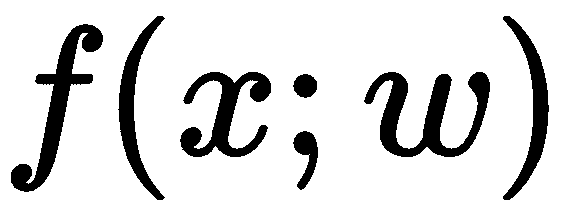

模型参数是在训练过程中学习的，但是在训练开始之前，您可能还需要设置其他参数，这些参数被称为**超参数**，稍后将对此进行解释。

数据集中的要素通常应在用于模型训练之前进行预处理。例如，一些 ML 模型隐含地假设特征是正态分布的。在许多现实场景中，情况并非如此，您可以通过应用特征转换(如日志转换)来使它们正常分布。

一旦完成特征处理并设置了模型超参数，模型训练就开始了。在模型训练结束时，模型参数将被学习，我们可以为模型以前没有见过的新数据预测目标变量。模型做出的预测通常称为:

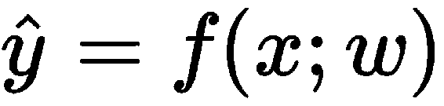

训练中到底发生了什么？因为我们知道用于训练的数据集的标签，所以我们可以基于当前模型预测的和原始标签的比较来迭代更新模型参数。

这个比较是基于一个叫做**损失函数**(或成本函数)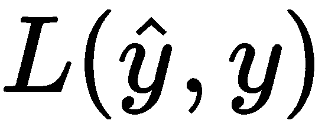的函数。损失函数代表预测的不准确性。您可能听说过的一些常见损失函数有平方损失、铰链损失、逻辑损失和交叉熵损失。

一旦模型训练完成，您将在`test`数据上测试您的 ML 模型的性能，该数据是在训练过程中没有使用过的数据集，以查看您的模型概括得有多好。您可以使用不同的性能指标来评估性能；根据结果，您应该回到前面的步骤，进行多次调整以获得更好的性能。

在这一点上，你应该对训练一个 ML 模型在引擎盖下是什么样子有一个总体的概念。

那么什么是自动驾驶？当我们谈论 AutoML 时，我们主要指的是自动化数据准备(即特征预处理、生成和选择)和模型训练(模型选择和超参数优化)。根据问题类型的不同，此过程中每个步骤的可能选项数量可能会有很大差异。

AutoML 允许研究人员和实践者为每一步从这些可能的选项中自动构建 ML 流水线，以便为给定的问题找到高性能的 ML 模型。

下图显示了典型的 ML 模型生命周期，每一步都有几个例子:


数据可以从各种来源获取，如平面文件、数据库和 API。一旦您能够摄取数据，您应该对其进行处理，使其为 ML 做好准备，并且有典型的操作，例如清理和格式化、特征转换和特征选择。在数据处理之后，您的最终数据集应该为 ML 做好准备，您将列出候选算法。入围的算法应该通过交叉验证和超参数优化等技术进行验证和调整。您的最终模型将准备好使用合适的工作负载类型(如在线、批处理和流式部署)进行操作。一旦模型投入生产，您需要监控其性能，并在需要时采取必要的措施，如重新培训、重新评估和重新部署。

一旦你面临构建 ML 模型，你将首先对你正在研究的领域进行研究，并确定你的目标。在这个过程中涉及到许多步骤，在你真正开始工作之前，应该提前计划和记录下来。想要了解更多关于项目管理的全过程，可以参考 CRISP-DM 模型([https://en . Wikipedia . org/wiki/Cross-industry _ standard _ process _ for _ data _ mining](https://en.wikipedia.org/wiki/Cross-industry_standard_process_for_data_mining))，项目管理对于交付一个成功的应用程序至关重要，然而，这已经超出了本书的范围。

就构建 ML 流水线而言，您通常会有多个数据源，例如关系数据库或平面文件，您可以在其中获取历史数据。您还可以让流数据从各种资源流入您的系统。

您将对这些数据源进行操作，以了解哪些数据源对您的特定任务有用，然后您将进入数据处理步骤，在该步骤中，您将进行大量的清理、格式化和数据质量检查，随后是特征转换和选择。

当您决定您的数据集准备好被输入到 ML 模型中时，您将需要考虑使用一个或多个合适的 ML 模型。您将训练多个模型，评估它们，并搜索最佳超参数设置。在这一点上，版本控制将帮助您跟踪变更。作为实验的结果，您将拥有一个性能 ML 流水线，每一步都针对性能进行了优化。性能最好的 ML 流水线是您希望在生产环境中进行测试的流水线，这也是您希望在部署步骤中对其进行操作的地方。

操作 ML 流水线意味着您需要选择一种部署类型。一些工作负载将用于批量处理数据库中的数据，在这种情况下，您需要批量部署。其他可能用于处理各种数据提供者提供的实时数据，您将需要在这些地方进行流式部署。

如果你仔细检查每一个步骤，尤其是数据处理和训练步骤的选项是巨大的。首先，您需要选择合适的方法和算法，然后您还应该微调所选方法和算法的超参数，使它们对您的给定问题表现最佳。

仅举一个简单的例子，让我们假设您已经完成了模型训练步骤，您需要选择一组 ML 模型进行实验。为了让事情变得更简单，假设你唯一想尝试的算法是 k-means，它只是调整它的参数。

k-means 算法有助于将相似的数据点聚集在一起。下面的代码片段使用了 scikit-learn 库，您可以使用 pip([http://scikit-learn.org/stable/install.html](http://scikit-learn.org/stable/install.html))安装它，如果您不理解每一行，请不要担心:

```py
# Sklearn has convenient modules to create sample data.
# make_blobs will help us to create a sample data set suitable for clustering
from sklearn.datasets.samples_generator import make_blobs

X, y = make_blobs(n_samples=100, centers=2, cluster_std=0.30, random_state=0)

# Let's visualize what we have first
import matplotlib.pyplot as plt
import seaborn as sns

plt.scatter(X[:, 0], X[:, 1], s=50)
```

前面代码片段的输出如下:

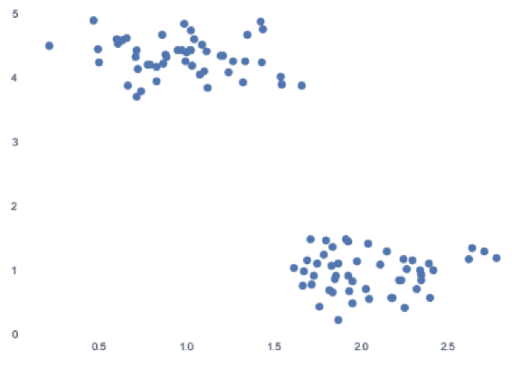

你可以很容易地看到我们在图上有两个集群:

```py
# We will import KMeans model from clustering model family of Sklearn
from sklearn.cluster import KMeans

k_means = KMeans(n_clusters=2)
k_means.fit(X)
predictions = k_means.predict(X)

# Let's plot the predictions
plt.scatter(X[:, 0], X[:, 1], c=predictions, cmap='brg')
```

前面代码片段的输出如下:


很好！我们的算法如我们预期的那样工作。机敏的读者可能已经注意到，k-means 模型有一个名为`n_clusters`的论点。当您将此值提供给 k-means 算法时，它会尝试将此数据集分成两个聚类。正如你所猜测的，k-means 在这种情况下的超参数是簇的数量。k-means 模型在训练之前需要知道这个参数。

不同的算法有不同的超参数，如决策树的树深、隐藏层数、神经网络的学习率、Lasso 或 C 的α参数、**支持向量机** ( **支持向量机**)的核和γ。

让我们通过使用`get_params`方法来看看 k-means 模型有多少个参数:

```py
k_means.get_params()
```

输出将是您可以优化的所有参数列表:

```py
{'algorithm': 'auto',
 'copy_x': True,
 'init': 'k-means++',
 'max_iter': 300,
 'n_clusters': 2,
 'n_init': 10,
 'n_jobs': 1,
 'precompute_distances': 'auto',
 'random_state': None,
 'tol': 0.0001,
 'verbose': 0}
```

在大多数实际使用案例中，您既没有资源也没有时间尝试每种可能的组合以及所有考虑的步骤选项。

在这一点上，AutoML 库通过为各种 ML 流水线仔细设置实验来帮助您，这些实验涵盖了从数据摄取、数据处理、建模和评分的所有步骤。

# 为什么使用 AutoML，它有什么帮助？

互联网上有很多 ML 教程，通常样本数据集是干净的、格式化的，并准备好与算法一起使用，因为许多教程的目的是展示某些工具、库或**软件即服务**(**【SaaS】**)产品的功能。

实际上，数据集有不同的类型和大小。Kaggle 最近在 2017 年进行的一项名为*数据科学和机器学习的现状*的行业调查获得了超过 16，000 份回复，调查显示，最常用的三种数据类型是关系数据、文本数据和图像数据。

此外，同样基于卡格尔调查，杂乱的数据是人们必须处理的首要问题。当数据集很乱，需要大量特殊处理才能被 ML 模型使用时，您会花费大量时间在数据清理、操作和手工制作特征上，以使其处于正确的形状。这是任何数据科学项目中最耗时的部分。

在训练、验证和测试阶段，性能最大似然模型的选择、模型的超参数优化如何？这些也是非常重要的步骤，可以通过多种方式执行。

当合适的组件组合在一起处理和建模数据集时，该组合就代表了一个 ML 流水线，并且要实验的流水线数量可能会快速增长。

为了成功构建高性能的 ML 流水线，您应该系统地检查每一步的所有可用选项，考虑您在时间和硬件/软件资源方面的限制。

AutoML systems help you to define robust approaches to automatically constructing ML pipelines for a given problem and effectively execute them in order to find performant models.

# 什么时候自动化 ML？

一旦你对构建 ML 流水线有了信心，你就会意识到你必须执行许多平凡的例程来准备特性和调整超参数。您还会对某些方法更有信心，并且您会非常清楚哪些技术可以与不同的参数设置一起很好地工作。

在不同项目之间，您可以通过执行多个实验来评估您的处理和建模流水线，以迭代的方式优化整个工作流，从而获得更多经验。如果你从一开始就没有条理，管理整个过程会很快变得非常糟糕。

Necessity of AutoML arises out of these difficult situations, when you are dealing with many moving parts and a great number of parameters. These are the situations where AutoML can help you focus on the design and implementation details in a structured manner.

# 你会学到什么？

在这本书里，你将学习自动驾驶系统的理论和实践方面。更重要的是，你将通过从头开始开发一个 AutoML 系统来练习你的技能。

# 汽车系统的核心部件

在本节中，您将回顾 AutoML 系统的以下核心组件:

*   自动特征预处理

*   自动算法选择
*   超参数优化

更好地理解核心组件将有助于您创建 AutoML 系统的思维导图。

# 自动特征预处理

当您处理 ML 问题时，您通常有一个包含各种类型数据的关系数据集，在训练 ML 算法之前，您应该正确处理每一个数据。

例如，如果您正在处理数字数据，您可以通过应用最小-最大缩放或方差缩放等方法来缩放它。

对于文本数据，您可能希望删除停止词，如 *a* 、*a*和*a*，并执行词干、解析和标记化等操作。

对于分类数据，您可能需要使用热编码、虚拟编码和特征散列等方法对其进行编码。

拥有非常多的功能怎么样？例如，当你有成千上万个功能时，其中有多少是真正有用的？使用**主成分分析** ( **主成分分析**)等方法降维会更好吗？

如果您有不同格式的数据，如视频、音频和图像，该怎么办？你如何处理它们？

例如，对于图像数据，您可以应用一些变换，例如将图像重新缩放到公共形状，并分割以分离某些区域。

There is an abundance of feature preprocessing methods, and ML algorithms will perform better with some set of transformations. Having a flexible AutoML system in your arsenal will allow you to experiment with different combinations in a smart way, which will save you much needed time and money in your projects.

# 自动算法选择

一旦你完成了特征处理，你需要找到一套合适的算法进行训练和评估。

每个 ML 算法都有解决某些问题的能力。让我们考虑聚类算法，如 k-means、层次聚类、谱聚类和 DBSCAN。我们熟悉 k-means，但是其他的呢？这些算法中的每一个都有应用领域，并且基于数据集的分布特性，每一个都可能比其他算法表现得更好。

AutoML 流水线可以帮助您从一组适合给定问题的算法中选择正确的算法。

# 超参数优化

每个 ML 算法都有一个或多个超参数，你已经熟悉了 k-means。但不仅仅是 ML 算法有超参数，特征处理方法也有超参数，这些也需要微调。

调整超参数对于模型的成功至关重要，AutoML 流水线将帮助您定义一系列您想要尝试的超参数，从而产生性能最佳的 ML 流水线。

# 为每个组件构建原型子系统

在整本书中，您将从头开始构建 AutoML 系统的每个核心组件，并了解每个部分是如何相互作用的。

拥有从头开始构建这样的系统的技能将会让你对这个过程以及流行的 AutoML 库的内部工作有更深的理解。

# 将所有这些整合为一个端到端的自动化系统

完成所有章节后，您将很好地理解组件以及它们如何协同工作来创建 ML 流水线。然后，您将使用您的知识从头开始编写 AutoML 流水线，并以任何方式调整它们，以解决您想要解决的一系列问题。

# 自动图书馆概述

有许多流行的 AutoML 库，在本节中，您将对数据科学社区中常用的库有一个概述。

# 功能工具

featuretools([https://www.featuretools.com/](https://www.featuretools.com/))是一个很好的库，用于从关系和事务数据中自动设计特征。该库引入了名为**深度特征合成** ( **DFS** )的概念。如果您有多个数据集，其中定义了关系，例如基于用作唯一标识符的列的父子关系，例如，DFS 将基于某些计算创建新的特征，例如求和、计数、平均值、模式、标准差等。让我们看一个小例子，其中有两个表，一个显示数据库信息，另一个显示每个数据库的数据库事务:

```py
import pandas as pd

# First dataset contains the basic information for databases.
databases_df = pd.DataFrame({"database_id": [2234, 1765, 8796, 2237, 3398], 
"creation_date": ["2018-02-01", "2017-03-02", "2017-05-03", "2013-05-12", "2012-05-09"]})

databases_df.head()
```

您将获得以下输出:

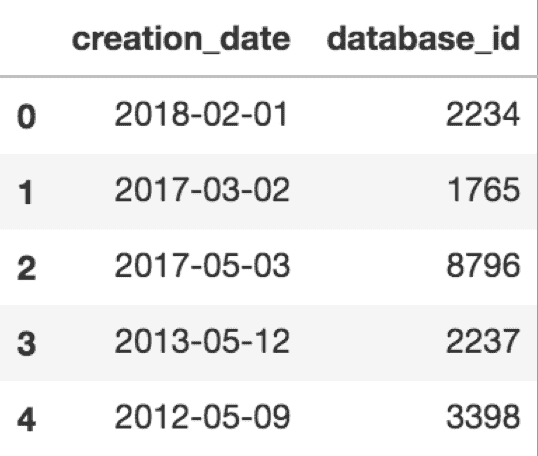

以下是数据库事务的代码:

```py
# Second dataset contains the information of transaction for each database id
db_transactions_df = pd.DataFrame({"transaction_id": [26482746, 19384752, 48571125, 78546789, 19998765, 26482646, 12484752, 42471125, 75346789, 16498765, 65487547, 23453847, 56756771, 45645667, 23423498, 12335268, 76435357, 34534711, 45656746, 12312987], 
                "database_id": [2234, 1765, 2234, 2237, 1765, 8796, 2237, 8796, 3398, 2237, 3398, 2237, 2234, 8796, 1765, 2234, 2237, 1765, 8796, 2237], 
                "transaction_size": [10, 20, 30, 50, 100, 40, 60, 60, 10, 20, 60, 50, 40, 40, 30, 90, 130, 40, 50, 30],
                "transaction_date": ["2018-02-02", "2018-03-02", "2018-03-02", "2018-04-02", "2018-04-02", "2018-05-02", "2018-06-02", "2018-06-02", "2018-07-02", "2018-07-02", "2018-01-03", "2018-02-03", "2018-03-03", "2018-04-03", "2018-04-03", "2018-07-03", "2018-07-03", "2018-07-03", "2018-08-03", "2018-08-03"]})

db_transactions_df.head()
```

您将获得以下输出:

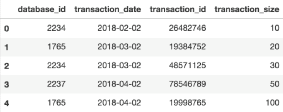

实体的代码如下:

```py
# Entities for each of datasets should be defined
entities = {
"databases" : (databases_df, "database_id"),
"transactions" : (db_transactions_df, "transaction_id")
}

# Relationships between tables should also be defined as below
relationships = [("databases", "database_id", "transactions", "database_id")]

print(entities)

```

对于前面的代码，您会得到以下输出:


以下代码片段将创建特征矩阵和特征定义:

```py
# There are 2 entities called ‘databases’ and ‘transactions’

# All the pieces that are necessary to engineer features are in place, you can create your feature matrix as below

import featuretools as ft

feature_matrix_db_transactions, feature_defs = ft.dfs(entities=entities,
relationships=relationships,
target_entity="databases")
```

以下输出显示了生成的一些功能:


Generated features using databases and transaction entities

您可以通过查看以下`features_defs`来查看所有特征定义:

```py
feature_defs
```

输出如下:


这是您可以基于关系和事务数据集轻松生成要素的方式。

# 汽车硬化

Scikit-learn 有一个很好的开发 ML 模型和流水线的 API。Scikit-learn 的 API 非常一致和成熟；如果你习惯了使用它，那么*a**uto-sklearn*([http://automl.github.io/auto-sklearn/stable/](http://automl.github.io/auto-sklearn/stable/))也同样容易使用，因为它确实是 scikit-learn 估算器的替代产品。

让我们看一个小例子:

```py
# Necessary imports
import autosklearn.classification
import sklearn.model_selection
import sklearn.datasets
import sklearn.metrics
from sklearn.model_selection import train_test_split

# Digits dataset is one of the most popular datasets in machine learning community.
# Every example in this datasets represents a 8x8 image of a digit.
X, y = sklearn.datasets.load_digits(return_X_y=True)

# Let's see the first image. Image is reshaped to 8x8, otherwise it's a vector of size 64.
X[0].reshape(8,8)
```

输出如下:

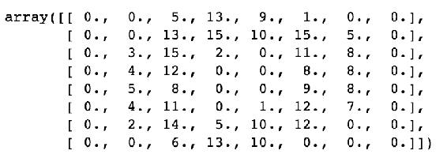

您可以绘制一些图像来看看它们的外观:

```py
import matplotlib.pyplot as plt

number_of_images = 10
images_and_labels = list(zip(X, y))

for i, (image, label) in enumerate(images_and_labels[:number_of_images]):
    plt.subplot(2, number_of_images, i + 1)
    plt.axis('off')
    plt.imshow(image.reshape(8,8), cmap=plt.cm.gray_r, interpolation='nearest')
    plt.title('%i' % label)

plt.show()
```

运行前面的代码片段会得到下面的图:

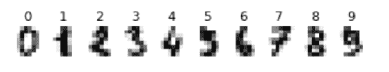

分割数据集以训练和测试数据:

```py
# We split our dataset to train and test data
X_train, X_test, y_train, y_test = train_test_split(X, y, random_state=1)

# Similarly to creating an estimator in Scikit-learn, we create AutoSklearnClassifier
automl = autosklearn.classification.AutoSklearnClassifier()

# All you need to do is to invoke fit method to start experiment with different feature engineering methods and machine learning models
automl.fit(X_train, y_train)

# Generating predictions is same as Scikit-learn, you need to invoke predict method.
y_hat = automl.predict(X_test)

print("Accuracy score", sklearn.metrics.accuracy_score(y_test, y_hat))
# Accuracy score 0.98

```

那很容易，不是吗？

# mvbox

MLBox([http://mlbox.readthedocs.io/en/latest/)](http://mlbox.readthedocs.io/en/latest/)是另一个 AutoML 库，它支持分布式数据处理、清理、格式化和最先进的算法，如 LightGBM 和 XGBoost。它还支持模型堆叠，这允许您组合模型的信息集合来生成新模型，旨在比单个模型具有更好的性能。

下面是它的用法示例:

```py
# Necessary Imports
from mlbox.preprocessing import *
from mlbox.optimisation import *
from mlbox.prediction import *
import wget

file_link = 'https://apsportal.ibm.com/exchange-api/v1/entries/8044492073eb964f46597b4be06ff5ea/data?accessKey=9561295fa407698694b1e254d0099600'
file_name = wget.download(file_link)

print(file_name)
# GoSales_Tx_NaiveBayes.csv
```

`GoSales`数据集包含客户及其产品偏好的信息:

```py
import pandas as pd
df = pd.read_csv('GoSales_Tx_NaiveBayes.csv')
df.head()
```

从前面的代码中可以得到以下输出:


让我们通过删除一个`target`列，从同一数据集创建一个`test`集:

```py
test_df = df.drop(['PRODUCT_LINE'], axis = 1)

# First 300 records saved as test dataset
test_df[:300].to_csv('test_data.csv')

paths = ["GoSales_Tx_NaiveBayes.csv", "test_data.csv"]
target_name = "PRODUCT_LINE"

rd = Reader(sep = ',')
df = rd.train_test_split(paths, target_name)
```

输出将类似于以下内容:


`Drift_thresholder`将帮助您在`train`和`test`数据集之间删除标识和漂移变量:

```py
dft = Drift_thresholder()
df = dft.fit_transform(df)
```

您将获得以下输出:

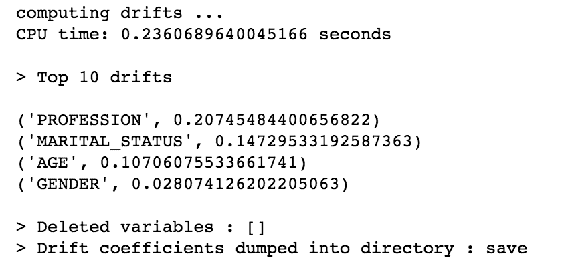

`Optimiser`将优化超参数:

```py
opt = Optimiser(scoring = 'accuracy', n_folds = 3)
opt.evaluate(None, df)
```

通过运行前面的代码，您可以获得以下输出:

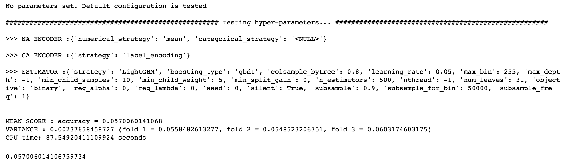

下面的代码定义了 ML 流水线的参数:

```py
space = {  
        'ne__numerical_strategy':{"search":"choice", "space":[0]},
        'ce__strategy':{"search":"choice",
               "space":["label_encoding","random_projection", "entity_embedding"]}, 
        'fs__threshold':{"search":"uniform", "space":[0.01,0.3]}, 
        'est__max_depth':{"search":"choice", "space":[3,4,5,6,7]}
        }

best = opt.optimise(space, df,15)
```

下面的输出向您展示了通过给定 ML 算法正在测试的选定方法，在这个输出中是 LightGBM:

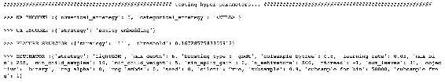

您还可以看到各种度量，如准确性、方差和 CPU 时间:

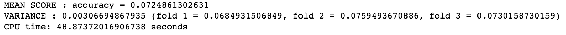

使用`Predictor`，可以使用最佳模型进行预测:

```py
predictor = Predictor()
predictor.fit_predict(best, df)
```

您将获得以下输出:

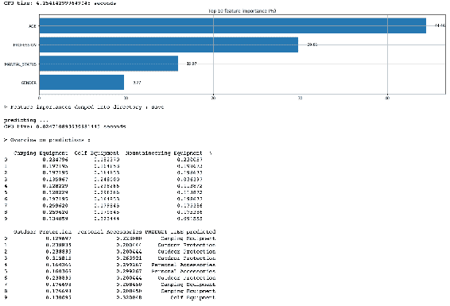

# TPOT 的

**基于树的流水线优化工具** ( **TPOT** )正在使用遗传编程来寻找性能最好的 ML 流水线，它是建立在 scikit-learn 之上的。

一旦数据集被清理并准备好使用，TPOT 将帮助您完成 ML 流水线的以下步骤:

*   特征预处理
*   特征构造和选择
*   型号选择
*   超参数优化

一旦 TPOT 完成了它的实验，它将为你提供最好的性能流水线。

TPOT 非常方便用户，因为它类似于使用 scikit-learn 的 API:

```py
from tpot import TPOTClassifier
from sklearn.datasets import load_digits
from sklearn.model_selection import train_test_split

# Digits dataset that you have used in Auto-sklearn example
digits = load_digits()
X_train, X_test, y_train, y_test = train_test_split(digits.data, digits.target,
                                                    train_size=0.75, test_size=0.25)

# You will create your TPOT classifier with commonly used arguments
tpot = TPOTClassifier(generations=10, population_size=30, verbosity=2)

# When you invoke fit method, TPOT will create generations of populations, seeking best set of parameters. Arguments you have used to create TPOTClassifier such as generations and population_size will affect the search space and resulting pipeline.
tpot.fit(X_train, y_train)

print(tpot.score(X_test, y_test))
# 0.9834
tpot.export('my_pipeline.py')
```

在 Python `my_pipeline.py`文件中导出流水线后，您将看到选定的流水线组件:

```py
import numpy as np
import pandas as pd
from sklearn.model_selection import train_test_split
from sklearn.neighbors import KNeighborsClassifier

# NOTE: Make sure that the class is labeled 'target' in the data file
tpot_data = pd.read_csv('PATH/TO/DATA/FILE', sep='COLUMN_SEPARATOR', dtype=np.float64)
features = tpot_data.drop('target', axis=1).values
training_features, testing_features, training_target, testing_target =\
            train_test_split(features, tpot_data['target'].values, random_state=42)

exported_pipeline = KNeighborsClassifier(n_neighbors=6, 
   weights="distance")

exported_pipeline.fit(training_features, training_target)
results = exported_pipeline.predict(testing_features)

```

就是这里！

# 摘要

到目前为止，您应该对什么是自动化的 ML 以及为什么需要熟悉 ML 流水线有了一个总体的了解。

您已经回顾了 AutoML 系统的核心组件，并使用流行的 AutoML 库练习了您的技能。

这绝对不是全部，AutoML 是一个活跃的研究领域。您应该查看其他库，如 Auto-WEKA 和 Xcessive，Auto-WEKA 也使用了贝叶斯优化的最新创新，Xcessive 是创建堆叠系综的用户友好工具。

就目前而言，这已经足够神奇了！你应该开始着手你自己的杰作，在接下来的几章中，你将构建一个你自己的 AutoML 系统！