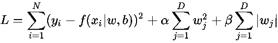

# 五、超参数优化

auto-sklearn 库使用**贝叶斯优化**来调整**机器学习** ( **ML** )流水线的超参数。您将学习贝叶斯优化的内部工作原理，但是让我们首先回顾一下数学优化的基础。

简单来说，优化就是选择最佳值来最小化或最大化给定的函数。如果我们的目标是最小化，一个函数被称为**损失函数**或**成本函数**。如果你试图最大化它，那么它被称为**实用功能**或**健身功能**。例如，当您构建 ML 模型时，损失函数可以帮助您在训练阶段最小化预测误差。

当你从更广的角度来看整个过程时，会有很多变量起作用。

首先，你可以在一个系统上决定问题的类型，比如无监督的，有监督的，半监督的，或者强化学习的问题。您可以根据数据大小和复杂性决定硬件和软件配置。然后你可以选择合适的语言或库用于你的实验。从一组可用的转换器和估算器中，您可以选择其中的一个子集，用于培训、验证和测试阶段。

所有这些都可以称为**配置参数**，为开发 ML 流水线设置场景。

其次，变压器和估计器在训练阶段有自己的参数需要计算，例如线性模型中的系数，或者创建多项式和交互特征的次数参数。

例如，ML 算法通常被分类为参数的或非参数的。如果一个算法有固定数量的参数，这意味着函数形式是已知的，那么它就是一个参数；如果不是，那么它被称为**非参数**，你的数据将塑造函数的形式。

第三，除了参数之外，你需要在训练开始之前设置超参数来指导变压器和估计器参数的估计。

超参数特别重要，因为您的流水线的性能将取决于它们，并且由于有许多超参数，每个超参数可以取一个范围的值，您很快就会意识到这是一个优化问题。

给定超参数和它们可以取值的范围，也就是您的搜索空间，您如何高效地找到性能最好的 ML 流水线？实际上，性能最好的 ML 流水线是交叉验证分数最高的流水线。

本章将涵盖以下主题:

*   ML 实验的配置空间
*   最大似然模型参数和超参数
*   什么是热启动，它如何帮助参数优化
*   基于贝叶斯的超参数调整
*   示例系统

# 技术要求

你可以在书的仓库的`Chapter 05`文件夹中找到所有的代码示例。

# 超参数

为了更好地理解这个过程，您将从简单的 Branin 函数开始，该函数有 3 个全局最小值:


下面的代码片段向您展示了 Branin 函数的最小化:

```py
import numpy as np

def branin(x):

    # Branin function has 2 dimensions and it has 3 global mimima
    x1 = x[0]
    x2 = x[1]

    # Global minimum is f(x*)=0.397887 at points (-pi, 12.275), (pi,2.275) and (9.42478, 2.475)

    # Recommended values of a, b, c, r, s and t for Branin function
    a = 1
    b = 5.1 / (4 * np.pi**2)
    c = 5\. / np.pi
    r = 6.
    s = 10.
    t = 1 / (8 * np.pi)

    # Calculating separate parts of the function first for verbosity
    p1 = a * (x2 - (b * x1**2) + (c * x1) - r)**2
    p2 = s * (1-t) * np.cos(x1)
    p3 = s

    # Calculating result
    ret = p1 + p2 + p3

    return ret

# minimize function from scipy.optimize will minimize a scalar function with one or more variables
from scipy.optimize import minimize

x = [5.6, 3.2]

res = minimize(branin, x)

print(res)

```

执行前面的代码片段将产生以下输出:

```py
fun: 0.3978873577297417
hess_inv: array([[0.10409341, -0.0808961],
[-0.0808961, 0.56160622]])
jac: array([3.57627869e-07, -1.19209290e-07])
message: 'Optimization terminated successfully.'
nfev: 36
nit: 5
njev: 9
status: 0
success: True
x: array([3.14159268, 2.27499994])
```

优化成功终止，全局最小值可以在 Branin 函数的(`3.14159268`、`2.27499994`)处找到。你的优化问题有很多解算器可以用，比如 **BFGS** 、 **L-BFGS-B** 、 **SLSQP** ，这些会有不同的特点，比如一致性和复杂性。通过例子练习会让你熟悉其中的一些，并为进一步探索打开空间。

让我们回顾一下 ML 问题的优化基础。下面的公式显示了大多数 ML 问题可以归结为什么:



在这个方程中，你有损失函数和正则项来防止过度拟合。由 *w* 表示的权重是您在训练过程中试图学习的内容，这些是前面提到的学习算法的参数。除了这些参数之外，一般还需要定义超参数，比如学习速率和提前停止条件，这些都会影响学习行为。

你有没有注意到损失函数中的 *α* 和 *β* ？这些是训练前需要设置的参数，也是超参数。

超参数帮助您在模型偏差和模型方差之间保持健康的平衡。

让我们看一下`sklearn`中估计器参数的一个简单例子:

```py
from sklearn.linear_model import LogisticRegression

log_reg = LogisticRegression()
log_reg.get_params()
```

输出如下所示:

```py
{'C': 1.0,
 'class_weight': None,
 'dual': False,
 'fit_intercept': True,
 'intercept_scaling': 1,
 'max_iter': 100,
 'multi_class': 'ovr',
 'n_jobs': 1,
 'penalty': 'l2',
 'random_state': None,
 'solver': 'liblinear',
 'tol': 0.0001,
 'verbose': 0,
 'warm_start': False}
```

这里有 14 个超参数，如果你考虑一下可能的组合，你会意识到搜索空间有多大。您的目标是从所有超参数集中获得最佳交叉验证分数。

`LogisticRegression`的重要超参数之一是`C`，它控制正则化的强度。值反过来影响正则化强度，这意味着较高的值表示较弱的正则化。

即使您是正在使用的算法的专家，正确设置超参数对于从业者的经验来说也是实验性的和主观的。你需要找到比启发式方法更好的方法来找到一组接近最优或最优的超参数。

例如，可以使用`GridSearchCV`或`RandomizedSearchCV`在`sklearn`中搜索超参数空间:

*   `GridSearchCV`从给定的超参数和它们可以取的一系列值生成候选集。假设您有以下参数网格:

```py
# Hyperparameters
param_grid = [ {'C': [0.001, 0.01, 0.1, 1, 10, 20, 50, 100],
                'penalty': ['l1', 'l2']} ]
```

然后`GridSearhCV`会生成以下参数:

```py
'params': [{'C': 0.001, 'penalty': 'l1'},
  {'C': 0.001, 'penalty': 'l2'},
  {'C': 0.01, 'penalty': 'l1'},
  {'C': 0.01, 'penalty': 'l2'},
  {'C': 0.1, 'penalty': 'l1'},
  {'C': 0.1, 'penalty': 'l2'},
  {'C': 1, 'penalty': 'l1'},
  {'C': 1, 'penalty': 'l2'},
  {'C': 10, 'penalty': 'l1'},
  {'C': 10, 'penalty': 'l2'},
  {'C': 20, 'penalty': 'l1'},
  {'C': 20, 'penalty': 'l2'},
  {'C': 50, 'penalty': 'l1'},
  {'C': 50, 'penalty': 'l2'},
  {'C': 100, 'penalty': 'l1'},
  {'C': 100, 'penalty': 'l2'}]
```

它将执行详尽的搜索，以找到最佳的交叉验证分数。

*   `RandomizedSearchCV`执行搜索的方式与`GridSearchCV`不同。它不是彻底搜索超参数空间，而是从指定的分布中采样参数设置。您应该按照以下方式构建参数网格:

```py
# Hyperparameters
param_grid = {'C': sp_randint(1, 100),
                'penalty': ['l1', 'l2']}
```

你注意到`sp_randint`了吗？它将允许`RandomizedSearchCV`从均匀分布中提取随机变量，参数将如下创建:

```py
'params': [{'C': 6, 'penalty': 'l2'},
  {'C': 97, 'penalty': 'l2'},
  {'C': 92, 'penalty': 'l2'},
  {'C': 62, 'penalty': 'l1'},
  {'C': 63, 'penalty': 'l2'},
  {'C': 5, 'penalty': 'l2'},
  {'C': 7, 'penalty': 'l1'},
  {'C': 45, 'penalty': 'l1'},
  {'C': 77, 'penalty': 'l2'},
  {'C': 12, 'penalty': 'l1'},
  {'C': 72, 'penalty': 'l2'},
  {'C': 28, 'penalty': 'l1'},
  {'C': 7, 'penalty': 'l2'},
  {'C': 65, 'penalty': 'l1'},
  {'C': 32, 'penalty': 'l1'},
  {'C': 84, 'penalty': 'l1'},
  {'C': 27, 'penalty': 'l1'},
  {'C': 12, 'penalty': 'l1'},
  {'C': 21, 'penalty': 'l1'},
  {'C': 65, 'penalty': 'l1'}],
```

让我们看一个用法的例子，都是针对`GridSearchCV`和`RandomizedSearchCV`的。

以下片段向您展示了`GridSearchCV`:

```py
from sklearn.linear_model import LogisticRegression

log_reg = LogisticRegression()

# Hyperparameters
param_grid = {'C': [0.001, 0.01, 0.1, 1, 10, 20, 50, 100],
                'penalty': ['l1', 'l2']}

from sklearn.model_selection import GridSearchCV

n_folds = 5
estimator = GridSearchCV(log_reg,param_grid, cv=n_folds)

from sklearn import datasets
iris = datasets.load_iris()
X = iris.data
Y = iris.target

estimator.fit(X, Y)
```

您将看到以下输出:

```py
GridSearchCV(cv=5, error_score='raise',
       estimator=LogisticRegression(C=1.0, class_weight=None, dual=False, fit_intercept=True,
          intercept_scaling=1, max_iter=100, multi_class='ovr', n_jobs=1,
          penalty='l2', random_state=None, solver='liblinear', tol=0.0001,
          verbose=0, warm_start=False),
       fit_params=None, iid=True, n_jobs=1,
       param_grid=[{'C': [0.001, 0.01, 0.1, 1, 10, 20, 50, 100], 'penalty': ['l1', 'l2']}],
       pre_dispatch='2*n_jobs', refit=True, return_train_score=True,
       scoring=None, verbose=0)
```

训练完成后，您可以看到性能最佳的估计器设置:

```py
estimator.best_estimator_
```

前面的代码将生成以下输出:

```py
LogisticRegression(C=10, class_weight=None, dual=False, fit_intercept=True,
intercept_scaling=1, max_iter=100, multi_class='ovr', n_jobs=1,
penalty='l1', random_state=None, solver='liblinear', tol=0.0001,
verbose=0, warm_start=False)
```

你也可以看到最好的分数:

```py
estimator.best_score_
```

输出如下:

```py
0.98
```

也可以通过勾选`cv_results_`查看所有结果:

```py
estimator.cv_results_
```

这将为您提供每次培训的各种指标:

```py
{'mean_fit_time': array([0.00039144, 0.00042701, 0.00036378, 0.00043044, 0.00145531,
        0.00046387, 0.00670047, 0.00056334, 0.00890565, 0.00064907,
        0.00916181, 0.00063758, 0.01110044, 0.00076027, 0.01196856,
        0.00084472]),
 'mean_score_time': array([0.00017729, 0.00018134, 0.00016704, 0.00016623, 0.00017071,
        0.00016556, 0.00024438, 0.00017123, 0.00020232, 0.00018559,
        0.00020504, 0.00016532, 0.00024428, 0.00019045, 0.00023465,
        0.00023274]),
 'mean_test_score': array([0.33333333, 0.40666667, 0.33333333, 0.66666667, 0.77333333,
        0.82 , 0.96 , 0.96 , 0.98 , 0.96666667,
        0.96666667, 0.96666667, 0.96666667, 0.97333333, 0.96 ,
        0.98 ]),
 'mean_train_score': array([0.33333333, 0.40166667, 0.33333333, 0.66666667, 0.775 ,
        0.83166667, 0.96333333, 0.96333333, 0.97333333, 0.97333333,
        0.97333333, 0.97666667, 0.975 , 0.97833333, 0.975 ,
        0.98 ]),
 'param_C': masked_array(data=[0.001, 0.001, 0.01, 0.01, 0.1, 0.1, 1, 1, 10, 10, 20,
                    20, 50, 50, 100, 100],
              mask=[False, False, False, False, False, False, False, False,
                    False, False, False, False, False, False, False, False],
        fill_value='?',
             dtype=object),
 'param_penalty': masked_array(data=['l1', 'l2', 'l1', 'l2', 'l1', 'l2', 'l1', 'l2', 'l1',
                    'l2', 'l1', 'l2', 'l1', 'l2', 'l1', 'l2'],
              mask=[False, False, False, False, False, False, False, False,
                    False, False, False, False, False, False, False, False],
        fill_value='?',
             dtype=object),
 'params': [{'C': 0.001, 'penalty': 'l1'},
  {'C': 0.001, 'penalty': 'l2'},
  {'C': 0.01, 'penalty': 'l1'},
  {'C': 0.01, 'penalty': 'l2'},
  {'C': 0.1, 'penalty': 'l1'},
  {'C': 0.1, 'penalty': 'l2'},
  {'C': 1, 'penalty': 'l1'},
  {'C': 1, 'penalty': 'l2'},
  {'C': 10, 'penalty': 'l1'},
  {'C': 10, 'penalty': 'l2'},
  {'C': 20, 'penalty': 'l1'},
  {'C': 20, 'penalty': 'l2'},
  {'C': 50, 'penalty': 'l1'},
  {'C': 50, 'penalty': 'l2'},
  {'C': 100, 'penalty': 'l1'},
  {'C': 100, 'penalty': 'l2'}],
 'rank_test_score': array([15, 14, 15, 13, 12, 11, 8, 8, 1, 4, 4, 4, 4, 3, 8, 1],
       dtype=int32),
 'split0_test_score': array([0.33333333, 0.36666667, 0.33333333, 0.66666667, 0.7 ,
        0.76666667, 1\. , 1\. , 1\. , 1\. ,
        1\. , 1\. , 1\. , 1\. , 0.96666667,
        1\. ]),
 'split0_train_score': array([0.33333333, 0.41666667, 0.33333333, 0.66666667, 0.775 ,
        0.825 , 0.95 , 0.95 , 0.95 , 0.96666667,
        0.95 , 0.975 , 0.95833333, 0.975 , 0.95833333,
        0.975 ]),
 'split1_test_score': array([0.33333333, 0.46666667, 0.33333333, 0.66666667, 0.8 ,
        0.86666667, 0.96666667, 0.96666667, 1\. , 1\. ,
        0.96666667, 1\. , 0.96666667, 1\. , 0.96666667,
        1\. ]),
 'split1_train_score': array([0.33333333, 0.35833333, 0.33333333, 0.66666667, 0.775 ,
        0.825 , 0.95833333, 0.96666667, 0.975 , 0.96666667,
        0.975 , 0.975 , 0.975 , 0.975 , 0.975 ,
        0.975 ]),
 'split2_test_score': array([0.33333333, 0.36666667, 0.33333333, 0.66666667, 0.8 ,
        0.83333333, 0.93333333, 0.93333333, 0.96666667, 0.93333333,
        0.93333333, 0.93333333, 0.93333333, 0.93333333, 0.93333333,
        0.96666667]),
 'split2_train_score': array([0.33333333, 0.41666667, 0.33333333, 0.66666667, 0.76666667,
        0.83333333, 0.96666667, 0.96666667, 0.975 , 0.975 ,
        0.975 , 0.98333333, 0.975 , 0.98333333, 0.975 ,
        0.98333333]),
 'split3_test_score': array([0.33333333, 0.46666667, 0.33333333, 0.66666667, 0.8 ,
        0.83333333, 0.9 , 0.9 , 0.93333333, 0.9 ,
        0.93333333, 0.9 , 0.93333333, 0.93333333, 0.93333333,
        0.93333333]),
 'split3_train_score': array([0.33333333, 0.39166667, 0.33333333, 0.66666667, 0.775 ,
        0.84166667, 0.975 , 0.975 , 0.99166667, 0.98333333,
        0.99166667, 0.98333333, 0.99166667, 0.98333333, 0.99166667,
        0.99166667]),
 'split4_test_score': array([0.33333333, 0.36666667, 0.33333333, 0.66666667, 0.76666667,
        0.8 , 1\. , 1\. , 1\. , 1\. ,
        1\. , 1\. , 1\. , 1\. , 1\. ,
        1\. ]),
 'split4_train_score': array([0.33333333, 0.425 , 0.33333333, 0.66666667, 0.78333333,
        0.83333333, 0.96666667, 0.95833333, 0.975 , 0.975 ,
        0.975 , 0.96666667, 0.975 , 0.975 , 0.975 ,
        0.975 ]),
 'std_fit_time': array([7.66660734e-05, 3.32198455e-05, 1.98168153e-05, 6.91923414e-06,
        4.74922317e-04, 2.65661212e-05, 1.03221712e-03, 3.79795334e-05,
        1.86899641e-03, 8.53752397e-05, 1.93386463e-03, 2.95752073e-05,
        2.91377734e-03, 5.70420424e-05, 3.59721435e-03, 9.67829087e-05]),
 'std_score_time': array([1.28883712e-05, 2.39771817e-05, 4.81959487e-06, 2.47955322e-06,
        1.34236224e-05, 2.41545203e-06, 5.64869920e-05, 8.94803700e-06,
        4.10209125e-05, 3.35513820e-05, 3.04168290e-05, 2.87924369e-06,
        4.91685012e-05, 1.62987656e-05, 4.23611246e-05, 7.26868455e-05]),
 'std_test_score': array([0\. , 0.04898979, 0\. , 0\. , 0.03887301,
        0.03399346, 0.03887301, 0.03887301, 0.02666667, 0.0421637 ,
        0.02981424, 0.0421637 , 0.02981424, 0.03265986, 0.02494438,
        0.02666667]),
 'std_train_score': array([0\. , 0.02438123, 0\. , 0\. , 0.00527046,
        0.0062361 , 0.00849837, 0.00849837, 0.01333333, 0.0062361 ,
        0.01333333, 0.0062361 , 0.01054093, 0.00408248, 0.01054093,
        0.00666667])}
```

让我们看看它是如何工作的`RandomizedSearchCV`:

```py
from sklearn.model_selection import RandomizedSearchCV
from scipy.stats import randint as sp_randint

# Hyperparameters
param_grid = {'C': sp_randint(1, 100),
                'penalty': ['l1', 'l2']}

n_iter_search = 20
n_folds = 5
estimator = RandomizedSearchCV(log_reg, param_distributions=param_grid, n_iter=n_iter_search, cv=n_folds)

estimator.fit(X, Y)
```

前面的代码生成类似于`GridSearchCV`的如下输出:

```py
RandomizedSearchCV(cv=5, error_score='raise',
          estimator=LogisticRegression(C=1.0, class_weight=None, dual=False, fit_intercept=True,
          intercept_scaling=1, max_iter=100, multi_class='ovr', n_jobs=1,
          penalty='l2', random_state=None, solver='liblinear', tol=0.0001,
          verbose=0, warm_start=False),
          fit_params=None, iid=True, n_iter=20, n_jobs=1,
          param_distributions={'C': <scipy.stats._distn_infrastructure.rv_frozen object at 0x1176d4c88>, 'penalty': ['l1', 'l2']},
          pre_dispatch='2*n_jobs', random_state=None, refit=True,
          return_train_score=True, scoring=None, verbose=0)
```

我们也来看看`best_estimator_`:

```py
estimator.best_estimator_
```

上述代码生成以下输出:

```py
LogisticRegression(C = 95, class_weight=None, dual=False, fit_intercept=True,
          intercept_scaling=1, max_iter=100, multi_class='ovr', n_jobs=1,
          penalty ='l2', random_state=None, solver='liblinear', tol=0.0001,
          verbose = 0, warm_start=False)
```

`estimator.best_score_`显示以下输出:

```py
0.98
```

`RandomizedSearchCV`具有相同的最佳得分，但这里需要注意的是，表现最佳的估计器设置具有`C = 95`，这是一个很难找到的值，因为人们在手动构建参数网格时通常会尝试取整值，如 10、100 或 1000。

你也可以用`estimator.cv_results_`同样检查交叉验证的结果:

```py
{'mean_fit_time': array([0.0091342 , 0.00065241, 0.00873041, 0.00068126, 0.00082703,
        0.01093817, 0.00067267, 0.00961967, 0.00883713, 0.00069351,
        0.01048965, 0.00068388, 0.01074204, 0.0090354 , 0.00983639,
        0.01081419, 0.01014266, 0.00067706, 0.01015086, 0.00067825]),
 'mean_score_time': array([0.00026116, 0.0001647 , 0.00020576, 0.00017738, 0.00022368,
        0.00023923, 0.00016236, 0.00017295, 0.00026078, 0.00021319,
        0.00028219, 0.00018024, 0.00027289, 0.00025878, 0.00020723,
        0.00020337, 0.00023756, 0.00017438, 0.00028505, 0.0001936 ]),
 'mean_test_score': array([0.96666667, 0.97333333, 0.97333333, 0.98 , 0.97333333,
        0.96666667, 0.97333333, 0.96666667, 0.98 , 0.97333333,
        0.96666667, 0.98 , 0.96666667, 0.96666667, 0.96666667,
        0.96666667, 0.96666667, 0.98 , 0.96666667, 0.96666667]),
 'mean_train_score': array([0.97333333, 0.97833333, 0.97333333, 0.98 , 0.97833333,
        0.975 , 0.97833333, 0.975 , 0.97333333, 0.97833333,
        0.975 , 0.98 , 0.975 , 0.97333333, 0.975 ,
        0.975 , 0.975 , 0.97833333, 0.975 , 0.97666667]),
 'param_C': masked_array(data=[20, 53, 5, 95, 50, 71, 41, 43, 8, 30, 70, 91, 53, 15,
                    35, 41, 56, 82, 90, 27],
              mask=[False, False, False, False, False, False, False, False,
                    False, False, False, False, False, False, False, False,
                    False, False, False, False],
        fill_value='?',
             dtype=object),
 'param_penalty': masked_array(data=['l1', 'l2', 'l1', 'l2', 'l2', 'l1', 'l2', 'l1', 'l1',
                    'l2', 'l1', 'l2', 'l1', 'l1', 'l1', 'l1', 'l1', 'l2',
                    'l1', 'l2'],
              mask=[False, False, False, False, False, False, False, False,
                    False, False, False, False, False, False, False, False,
                    False, False, False, False],
        fill_value='?',
             dtype=object),
 'params': [{'C': 20, 'penalty': 'l1'},
  {'C': 53, 'penalty': 'l2'},
  {'C': 5, 'penalty': 'l1'},
  {'C': 95, 'penalty': 'l2'},
  {'C': 50, 'penalty': 'l2'},
  {'C': 71, 'penalty': 'l1'},
  {'C': 41, 'penalty': 'l2'},
  {'C': 43, 'penalty': 'l1'},
  {'C': 8, 'penalty': 'l1'},
  {'C': 30, 'penalty': 'l2'},
  {'C': 70, 'penalty': 'l1'},
  {'C': 91, 'penalty': 'l2'},
  {'C': 53, 'penalty': 'l1'},
  {'C': 15, 'penalty': 'l1'},
  {'C': 35, 'penalty': 'l1'},
  {'C': 41, 'penalty': 'l1'},
  {'C': 56, 'penalty': 'l1'},
  {'C': 82, 'penalty': 'l2'},
  {'C': 90, 'penalty': 'l1'},
  {'C': 27, 'penalty': 'l2'}],
 'rank_test_score': array([10, 5, 5, 1, 5, 10, 5, 10, 1, 5, 10, 1, 10, 10, 10, 10, 10,
         1, 10, 10], dtype=int32),
 'split0_test_score': array([1., 1., 1., 1., 1., 1., 1., 1., 1., 1., 1., 1., 1., 1., 1., 1., 1.,
        1., 1., 1.]),
 'split0_train_score': array([0.95 , 0.975 , 0.95833333, 0.975 , 0.975,
        0.95833333, 0.975 , 0.95833333, 0.95833333, 0.975 ,
        0.95833333, 0.975 , 0.95833333, 0.95 , 0.95833333,
        0.95833333, 0.95833333, 0.975 , 0.95833333, 0.975 ]),
 'split1_test_score': array([0.96666667, 1\. , 1\. , 1\. , 1\. ,
        0.96666667, 1\. , 0.96666667, 1\. , 1\. ,
        0.96666667, 1\. , 0.96666667, 0.96666667, 0.96666667,
        0.96666667, 0.96666667, 1\. , 0.96666667, 1\. ]),
 'split1_train_score': array([0.975, 0.975, 0.975, 0.975, 0.975, 0.975, 0.975, 0.975, 0.975,
        0.975, 0.975, 0.975, 0.975, 0.975, 0.975, 0.975, 0.975, 0.975,
        0.975, 0.975]),
 'split2_test_score': array([0.93333333, 0.93333333, 0.93333333, 0.96666667, 0.93333333,
        0.93333333, 0.93333333, 0.93333333, 0.96666667, 0.93333333,
        0.93333333, 0.96666667, 0.93333333, 0.93333333, 0.93333333,
        0.93333333, 0.93333333, 0.96666667, 0.93333333, 0.93333333]),
 'split2_train_score': array([0.975 , 0.98333333, 0.975 , 0.98333333, 0.98333333,
        0.975 , 0.98333333, 0.975 , 0.975 , 0.98333333,
        0.975 , 0.98333333, 0.975 , 0.975 , 0.975 ,
        0.975 , 0.975 , 0.98333333, 0.975 , 0.98333333]),
 'split3_test_score': array([0.93333333, 0.93333333, 0.93333333, 0.93333333, 0.93333333,
        0.93333333, 0.93333333, 0.93333333, 0.93333333, 0.93333333,
        0.93333333, 0.93333333, 0.93333333, 0.93333333, 0.93333333,
        0.93333333, 0.93333333, 0.93333333, 0.93333333, 0.9 ]),
 'split3_train_score': array([0.99166667, 0.98333333, 0.98333333, 0.99166667, 0.98333333,
        0.99166667, 0.98333333, 0.99166667, 0.98333333, 0.98333333,
        0.99166667, 0.99166667, 0.99166667, 0.99166667, 0.99166667,
        0.99166667, 0.99166667, 0.98333333, 0.99166667, 0.98333333]),
 'split4_test_score': array([1., 1., 1., 1., 1., 1., 1., 1., 1., 1., 1., 1., 1., 1., 1., 1., 1.,
        1., 1., 1.]),
 'split4_train_score': array([0.975 , 0.975 , 0.975 , 0.975 , 0.975 ,
        0.975 , 0.975 , 0.975 , 0.975 , 0.975 ,
        0.975 , 0.975 , 0.975 , 0.975 , 0.975 ,
        0.975 , 0.975 , 0.975 , 0.975 , 0.96666667]),
 'std_fit_time': array([2.16497645e-03, 5.39653699e-05, 1.00355397e-03, 4.75298306e-05,
        9.75692490e-05, 2.63689357e-03, 7.04799517e-05, 2.52499464e-03,
        1.92020413e-03, 6.05031761e-05, 1.78589024e-03, 5.85074724e-05,
        2.28621528e-03, 2.19771432e-03, 1.96957384e-03, 3.06769107e-03,
        1.15194163e-03, 2.10475943e-05, 1.33958298e-03, 4.09795418e-05]),
 'std_score_time': array([4.62378644e-05, 1.66142000e-06, 3.40806829e-05, 1.73623737e-05,
        5.26490415e-05, 4.75790783e-05, 1.48510089e-06, 7.53432889e-06,
        3.86445261e-05, 8.16042958e-05, 4.98746594e-05, 1.93474877e-05,
        2.82650630e-05, 2.54787261e-05, 2.55031663e-05, 3.09080976e-05,
        2.99830109e-05, 7.89824294e-06, 2.02431836e-05, 4.25877252e-05]),
 'std_test_score': array([0.02981424, 0.03265986, 0.03265986, 0.02666667, 0.03265986,
        0.02981424, 0.03265986, 0.02981424, 0.02666667, 0.03265986,
        0.02981424, 0.02666667, 0.02981424, 0.02981424, 0.02981424,
        0.02981424, 0.02981424, 0.02666667, 0.02981424, 0.0421637 ]),
 'std_train_score': array([0.01333333, 0.00408248, 0.00816497, 0.00666667, 0.00408248,
        0.01054093, 0.00408248, 0.01054093, 0.00816497, 0.00408248,
        0.01054093, 0.00666667, 0.01054093, 0.01333333, 0.01054093,
        0.01054093, 0.01054093, 0.00408248, 0.01054093, 0.0062361 ])}
```

交叉验证结果可能看起来很混乱，但您可以将其导入`pandas`数据框:

```py
import pandas as pd

df = pd.DataFrame(estimator.cv_results_)

df.head()
```

我们可以看到如下几条记录:

```py
mean_fit_time mean_score_time mean_test_score mean_train_score param_C \
0 0.009134 0.000261 0.966667 0.973333 20 
1 0.000652 0.000165 0.973333 0.978333 53 
2 0.008730 0.000206 0.973333 0.973333 5 
3 0.000681 0.000177 0.980000 0.980000 95 
4 0.000827 0.000224 0.973333 0.978333 50 
  param_penalty params rank_test_score \
0 l1 {'C': 20, 'penalty': 'l1'} 10 
1 l2 {'C': 53, 'penalty': 'l2'} 5 
2 l1 {'C': 5, 'penalty': 'l1'} 5 
3 l2 {'C': 95, 'penalty': 'l2'} 1 
4 l2 {'C': 50, 'penalty': 'l2'} 5 
   split0_test_score split0_train_score ... split2_test_score \
0 1.0 0.950000 ... 0.933333 
1 1.0 0.975000 ... 0.933333 
2 1.0 0.958333 ... 0.933333 
3 1.0 0.975000 ... 0.966667 
4 1.0 0.975000 ... 0.933333 
   split2_train_score split3_test_score split3_train_score \
0 0.975000 0.933333 0.991667 
1 0.983333 0.933333 0.983333 
2 0.975000 0.933333 0.983333 
3 0.983333 0.933333 0.991667 
4 0.983333 0.933333 0.983333 
   split4_test_score split4_train_score std_fit_time std_score_time \
0 1.0 0.975 0.002165 0.000046 
1 1.0 0.975 0.000054 0.000002 
2 1.0 0.975 0.001004 0.000034 
3 1.0 0.975 0.000048 0.000017 
4 1.0 0.975 0.000098 0.000053 
   std_test_score std_train_score 
0 0.029814 0.013333 
1 0.032660 0.004082 
2 0.032660 0.008165 
3 0.026667 0.006667 
4 0.032660 0.004082 
[5 rows x 22 columns]
```

您可以过滤数据帧，查看`mean_test_score`处于最大值的位置:

```py
df[df['mean_test_score'] == df['mean_test_score'].max()]
```

这将输出以下内容:

```py
    mean_fit_time mean_score_time mean_test_score mean_train_score param_C \
3 0.000681 0.000177 0.98 0.980000 95 
8 0.008837 0.000261 0.98 0.973333 8 
11 0.000684 0.000180 0.98 0.980000 91 
17 0.000677 0.000174 0.98 0.978333 82 
   param_penalty params rank_test_score \
3 l2 {'C': 95, 'penalty': 'l2'} 1 
8 l1 {'C': 8, 'penalty': 'l1'} 1 
11 l2 {'C': 91, 'penalty': 'l2'} 1 
17 l2 {'C': 82, 'penalty': 'l2'} 1 
    split0_test_score split0_train_score ... split2_test_score \
3 1.0 0.975000 ... 0.966667 
8 1.0 0.958333 ... 0.966667 
11 1.0 0.975000 ... 0.966667 
17 1.0 0.975000 ... 0.966667 
    split2_train_score split3_test_score split3_train_score \
3 0.983333 0.933333 0.991667 
8 0.975000 0.933333 0.983333 
11 0.983333 0.933333 0.991667 
17 0.983333 0.933333 0.983333 
    split4_test_score split4_train_score std_fit_time std_score_time \
3 1.0 0.975 0.000048 0.000017 
8 1.0 0.975 0.001920 0.000039 
11 1.0 0.975 0.000059 0.000019 
17 1.0 0.975 0.000021 0.000008 
    std_test_score std_train_score 
3 0.026667 0.006667 
8 0.026667 0.008165 
11 0.026667 0.006667 
17 0.026667 0.004082 
[4 rows x 22 columns]
```

作为练习，您可以使用以下超参数为`GradientBoostingClassifier`创建一个参数网格，对`GridSearchCV`和`RandomizedSearchCV`进行实验:

*   `learning_rate`(默认值= 0.1)—提高学习率
*   `n_estimators`(默认值= 100)—适合的提升树的数量
*   `max_depth`(默认值= 3)—最大树深

# 热启动

就**自动化 ML** ( **自动化**)流水线而言，超参数搜索空间可以增长得非常快，在有限的时间和资源下，穷举搜索变得不切实际。您需要更智能的方法来执行这项任务，尤其是如果您有一个大型数据集，并且有一个复杂的模型在处理它。如果你发现自己处于这种情况下，`GridSeachCV`实例穷举搜索将是不可行的，或者`RandomizedSearchCV`的随机参数绘制可能不会在有限的时间内给你最好的结果。

热启动的基本思想是使用从先前的训练跑步中获得的信息来为下一次训练跑步确定更聪明的起点。

例如，`LogisticRegression`有一个`warm_start`参数，默认设置为`False`。以下示例显示了第一次训练的时间，以及参数更新后设置为`False`的时间:

```py
from sklearn.linear_model import LogisticRegression

log_reg = LogisticRegression(C=10, tol=0.00001)

from sklearn import datasets
iris = datasets.load_iris()
X = iris.data
Y = iris.target

from time import time
start = time()
log_reg.fit(X, Y)
end = time()
print("Time: {}".format(end - start))
# Time: 0.0009272098541259766

log_reg.set_params(C=20)
# LogisticRegression(C=100, class_weight=None, dual=False, fit_intercept=True,
# intercept_scaling=1, max_iter=100, multi_class='ovr', n_jobs=1,
# penalty='l2', random_state=None, solver='liblinear', tol=0.0001,
# verbose=0, warm_start=False)

start = time()
log_reg.fit(X, Y)
end = time()
print("Time: {}".format(end - start))
# Time: 0.0012941360473632812
```

`LogisticRegression`的默认解算器是`liblinear`，它将在每次新拟合之前重新初始化权重，但是其他解算器如`lbfgs`、`newton-cg`、`sag`和`saga`可以利用`warm_start`并通过使用来自先前拟合的信息来减少计算时间。

下面的代码片段向您展示了它在实践中是如何工作的一个小例子:

```py
log_reg = LogisticRegression(C=10, solver='sag', warm_start=True, max_iter=10000)

start = time()
log_reg.fit(X, Y)
end = time()
print("Time: {}".format(end - start))
# Time: 0.043714046478271484

log_reg.set_params(C=20)

start = time()
log_reg.fit(X, Y)
end = time()
print("Time: {}".format(end - start))
# Time: 0.020781755447387695
```

# 基于贝叶斯的超参数调整

当涉及到基于模型的超参数调整时，有几种方法可以使用，这些方法在**基于顺序模型的全局优化** ( **SMBO** )下结合使用。

当你想到`GridSearchCV`或`RandomizedSearchCV`时，你可能会理所当然地觉得它们交叉验证超参数的方式不是很聪明。两者都预先定义了要在训练期间验证的超参数集，并且都不是为了从训练期间可能获得的信息中获益而设计的。如果您能够找到一种方法，从基于模型性能的超参数验证的先前迭代中学习，那么您就会知道哪个超参数集可能在下一次迭代中给出更好的性能。

SMBO 方法源于这种推理，基于贝叶斯的超参数优化就是其中之一。

**基于序列模型的算法配置** ( **SMAC** )是一个很棒的库，利用贝叶斯优化来配置给定 ML 算法的超参数，非常好用。

以下代码片段向您展示了如何优化您在 SMAC 开始时使用的`branin`函数:

```py
from smac.facade.func_facade import fmin_smac

x, cost, _ = fmin_smac(func=branin, # function
                           x0=[3.2, 4.5], # default configuration
                           bounds=[(-5, 10), (0, 15)], # limits
                           maxfun=500, # maximum number of evaluations
                           rng=3) # random seed

print(x, cost)
# [3.12848204 2.33810374] 0.4015064637498025
```

# 示例系统

在本节中，您将编写一个包装函数来优化 XGBoost 算法超参数，以提高`Breast Cancer Wisconsin`数据集的性能:

```py
# Importing necessary libraries
import numpy as np
from xgboost import XGBClassifier
from sklearn import datasets
from sklearn.model_selection import cross_val_score

# Importing ConfigSpace and different types of parameters
from smac.configspace import ConfigurationSpace
from ConfigSpace.hyperparameters import CategoricalHyperparameter, \
    UniformFloatHyperparameter, UniformIntegerHyperparameter
from ConfigSpace.conditions import InCondition

# Import SMAC-utilities
from smac.tae.execute_func import ExecuteTAFuncDict
from smac.scenario.scenario import Scenario
from smac.facade.smac_facade import SMAC

# Creating configuration space.
# Configuration space will hold all of your hyperparameters
cs = ConfigurationSpace()

# Defining hyperparameters and range of values that they can take
learning_rate = UniformFloatHyperparameter("learning_rate", 0.001, 0.1, default_value=0.1)
n_estimators = UniformIntegerHyperparameter("n_estimators", 100, 200, default_value=100)

# Adding hyperparameters to configuration space
cs.add_hyperparameters([learning_rate, n_estimators])

# Loading data set
wbc_dataset = datasets.load_breast_cancer()

# Creating function to cross validate XGBoost classifier given the configuration space
def xgboost_from_cfg(cfg):
    """ Creates a XGBoost based on a configuration and evaluates it on the
    Wisconsin Breast Cancer-dataset using cross-validation.

    Parameters:
    -----------
    cfg: Configuration (ConfigSpace.ConfigurationSpace.Configuration)
        Configuration containing the parameters.
        Configurations are indexable!
    Returns:
    --------
    A crossvalidated mean score for the svm on the loaded data-set.
    """

    cfg = {k: cfg[k] for k in cfg if cfg[k]}

    clf = XGBClassifier(**cfg, eval_metric='auc', early_stopping_rounds=50, random_state=42)

    scores = cross_val_score(clf, wbc_dataset.data, wbc_dataset.target, cv=5)

    return 1 - np.mean(scores) # Minimize!

# Creating Scenario object
scenario = Scenario({"run_obj": "quality",
                     "runcount-limit": 200, # maximum function evaluations
                     "cs": cs, # configuration space
                     "deterministic": "true"
                     })

# SMAC object handles bayesian optimization loop
print("Please wait until optimization is finished")
smac = SMAC(scenario=scenario, rng=np.random.RandomState(42),
        tae_runner=xgboost_from_cfg)

incumbent = smac.optimize()

# Let's see the best performing hyperparameter values
print(incumbent)
# Configuration:
# learning_rate, Value: 0.08815217130807515
# n_estimators, Value: 196

# You can see the errpr rate of optimized hyperparameters
inc_value = xgboost_from_cfg(incumbent)

print("Optimized Value: %.2f" % (inc_value))
# 0.02
```

太好了。现在您知道如何创建您的配置空间，添加您的超参数，并为每个超参数定义值范围。配置完成后，您已经看到了如何创建一个场景对象，并使用 SMAC 优化给定估计器的超参数。

您可以使用 SMAC 对象获取运行历史，并查看每个配置的成本:

```py
param_1 = []
param_2 = []
costs = []

for k,v in smac.runhistory.config_ids.items():
    param_1.append(k._values['learning_rate'])
    param_2.append(k._values['n_estimators'])
    costs.append(smac.runhistory.cost_per_config[v])

print(len(param_1), len(param_2), len(costs))

import matplotlib.pyplot as plt
import matplotlib.cm as cm

sc = plt.scatter(param_1, param_2, c=costs)
plt.colorbar(sc)
plt.show()
```

下图显示了`learning_rate`和`n_estimators`在优化过程中取的不同值及其相关成本:


可以看到最佳配置为`learning_rate`~ 0.09，`n_estimators`~ 200。

# 摘要

在本章中，您学习了模型参数、超参数和配置空间。让我们快速回顾一下:

*   **模型参数**:你可以把这些作为训练时要学习的参数
*   **模型超参数**:这些是你应该在训练开始前定义的参数
*   **配置空间参数**:这些参数是指用于主持实验的环境的任何其他参数

您已经了解了常见的超参数优化方法，如网格搜索和随机搜索。网格搜索和随机搜索不使用从以前的训练运行中产生的信息，这是基于贝叶斯的优化方法解决的一个缺点。

基于贝叶斯的优化方法利用先前训练运行的信息来决定下一次训练运行的超参数值，并以更智能的方式在超参数空间中导航。SMAC 是 auto-sklearn 用来优化给定估计量的超参数的工具，本章向您展示了如何在自己的 ML 流水线中使用这种方法。