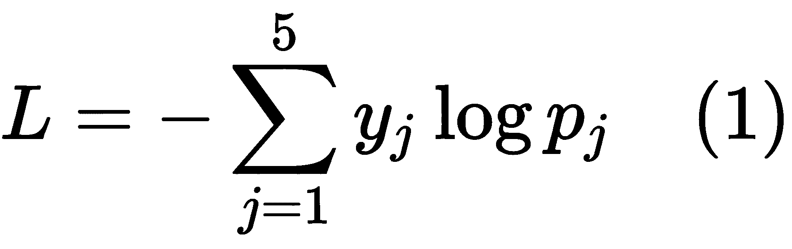
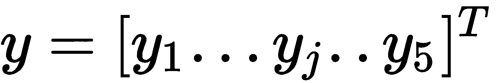
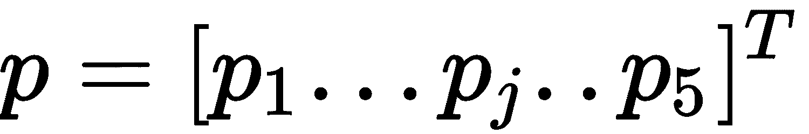
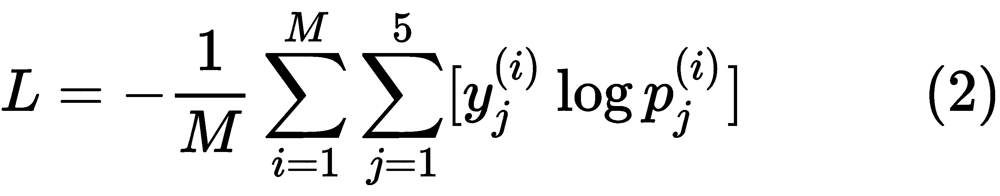
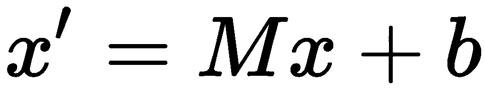
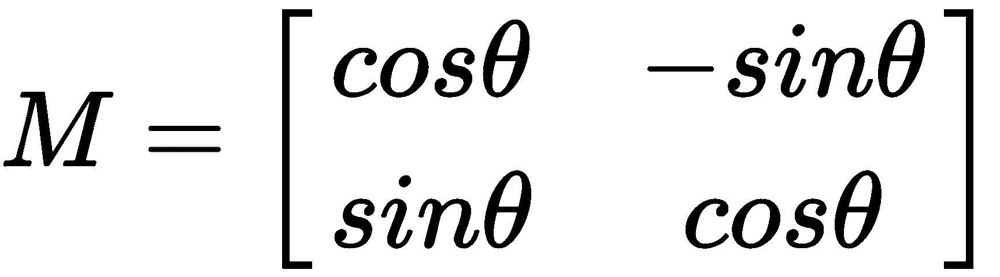
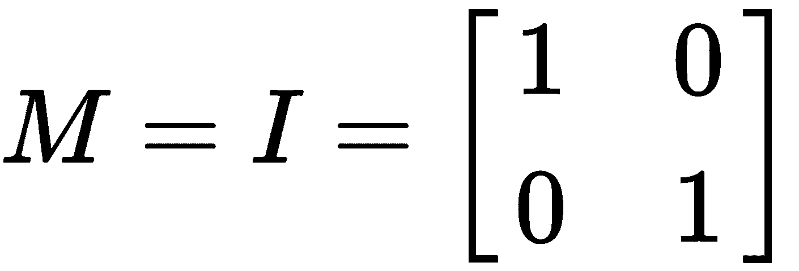
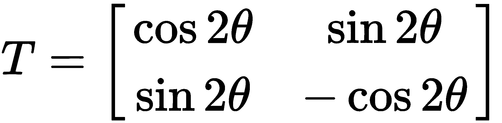
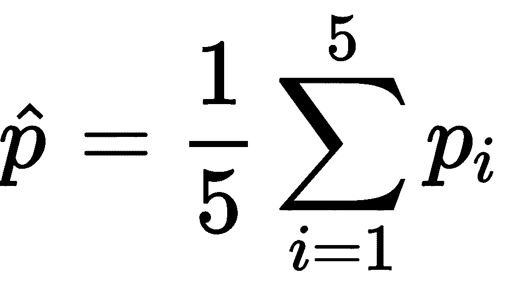
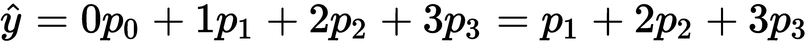

# 迁移学习

迁移学习是将在特定领域的一项任务中获得的知识转移到相似领域的相关任务中的过程。在深度学习范式中，迁移学习一般指的是重用一个预先训练好的模型作为另一个问题的起点。计算机视觉和自然语言处理中的问题需要大量的数据和计算资源，来训练有意义的深度学习模型。迁移学习在视觉和文本领域已经变得非常重要，因为它减少了对大量训练数据和训练时间的需求。在本章中，我们将使用迁移学习来解决医疗保健问题。

我们将在本章中涉及的与迁移学习相关的一些关键主题如下:

*   使用转移学习来检测人眼中的糖尿病视网膜病变状况，并确定视网膜病变的严重程度
*   探索先进的预训练卷积神经架构，该架构可用于训练能够检测人眼眼底图像中糖尿病视网膜病变的**卷积神经网络** ( **CNN** )
*   查看实际实现 CNN 所需的不同图像预处理步骤
*   学习制定适合当前问题的成本函数
*   定义适当的度量标准来衡量训练模型的性能
*   使用仿射变换生成附加数据
*   训练的复杂性与适当的学习速率、优化器的选择等有关
*   浏览端到端 Python 实现

# 技术要求

你将需要具备 Python 3、TensorFlow、Keras 和 OpenCV 的基本知识。

本章代码文件可在 GitHub:
[https://GitHub . com/PacktPublishing/Intelligent-Projects-use-Python/tree/master/chapter 02](https://github.com/PacktPublishing/Intelligent-Projects-using-Python/tree/master/Chapter02)上找到

查看以下视频，查看正在运行的代码:
[http://bit.ly/2t6LLyB](http://bit.ly/2t6LLyB)

# 迁移学习导论

在传统的机器学习范例中(见*图 2.1* )，每个用例或任务都是基于手头的数据独立建模的。在迁移学习中，我们使用从特定任务中获得的知识(以架构和模型参数的形式)来解决不同的(但相关的)任务，如下图所示:


Figure 2.1: Traditional machine learning versus transfer learning

吴恩达在他的 2016 NIPS 教程中指出，迁移学习将是机器学习商业成功的下一个大驱动力(在监督学习之后)；这种说法一天比一天正确。迁移学习现在广泛应用于需要用人工神经网络解决的问题。因此，最大的问题是为什么会这样。

从头开始训练人工神经网络是一项艰巨的任务，主要有以下两个原因:

*   人工神经网络的成本面是非凸的；因此，它需要一组良好的初始权重来实现合理的收敛。
*   人工神经网络有很多参数，因此需要大量数据进行训练。不幸的是，对于许多项目来说，可用于训练神经网络的具体数据不足，而项目旨在解决的问题足够复杂，需要神经网络解决方案。

在这两种情况下，迁移学习都有帮助。如果我们使用预先训练好的模型，这些模型是在一个巨大的标记数据语料库上训练的，比如 ImageNet 或 CIFAR，那么涉及迁移学习的问题将有一组很好的初始权重来开始训练；然后可以根据手头的数据对这些权重进行微调。类似地，为了避免在少量数据上训练复杂模型，我们可能希望从预先训练的神经网络中提取复杂特征，然后使用这些特征训练相对简单的模型，例如 SVM 或逻辑回归模型。举个例子，如果我们正在处理一个图像分类问题，并且我们已经有了一个预先训练好的模型——比如说，一个在 1000 类 ImageNet 上的`VGG16`网络——我们可以通过`VGG16`的权重传递训练数据，并从最后一个池层提取特征。如果我们有 *m* 训练数据点，可以使用方程，其中 *x* 为特征向量， *y* 为输出类。然后，我们可以从预先训练的`VGG16`网络中导出复杂的特征，例如向量 *h* ，如下所示:


这里， *W* 是预先训练好的`VGG16`网络的一组权重，一直到最后一个汇聚层。

然后，我们可以使用转换后的训练数据点集合，来构建一个相对简单的模型。

# 迁移学习与糖尿病视网膜病变的检测

在本章中，我们将使用迁移学习来构建一个模型来检测人眼中的糖尿病视网膜病变。糖尿病视网膜病变通常见于糖尿病患者，高血糖水平会导致视网膜血管受损。下图左侧为正常视网膜，右侧为糖尿病视网膜病变:


Figure 2.2: A normal human retina versus a retina with diabetic retinopathy

在医疗保健中，糖尿病视网膜病变检测通常是一个手动过程，包括训练有素的医生检查彩色眼底视网膜图像。这在诊断过程中引入了延迟，经常导致延迟治疗。作为我们项目的一部分，我们将构建一个强大的人工智能系统，该系统可以拍摄视网膜的彩色眼底图像，并根据糖尿病视网膜病变对视网膜状况的严重程度进行分类。我们将视网膜图像分类到的不同条件如下:

*   **0** :无糖尿病视网膜病变
*   **1** :轻度糖尿病视网膜病变
*   **2** :中度糖尿病视网膜病变
*   **3** :重度糖尿病视网膜病变
*   **4** :增生性糖尿病视网膜病变

# 糖尿病视网膜病变数据集

构建糖尿病视网膜病变检测应用程序的数据集从 Kaggle 获得，可从以下链接下载:[https://www.kaggle.com/c/教室-糖尿病-视网膜病变-检测-竞赛/数据](https://www.kaggle.com/c/%20classroom-diabetic-retinopathy-detection-competition/data)。

训练和保持测试数据集都存在于`train_dataset.zip`文件中，该文件在前面的链接中可用。

我们将使用标记的训练数据通过交叉验证来构建模型。我们将在保持数据集上评估模型。

由于我们正在处理类预测，准确性将是一个有用的验证指标。精确度定义如下:


这里， *c* 为正确分类样本数， *N* 为评估样本总数。

我们还将使用**二次加权 kappa** 统计数据来确定模型的质量，并与 Kaggle 标准相比，确定模型有多好的基准。二次加权 kappa 定义如下:


二次加权 kappa 表达式中的权重 *(w <sub>i，j</sub> )* 如下:


在上式中，以下公式适用:

*   *N* 代表班级数量
*   *O <sub>ij</sub>* 表示已经被预测具有类别 *i* 的图像的数量，并且其中图像的实际类别是 *j*
*   *E <sub>ij</sub>* 代表预测类的预期观测数，即 *i* ，实际类为 *j* ，假设预测类和实际类之间是独立的

为了更好地理解 kappa 指标的组成部分，让我们看看苹果和橘子的二元分类。我们假设预测类和实际类的混淆矩阵如下图所示:


Figure 2.3: Kappa metric terms

当真实标签为*橙，*假设标签之间独立时，预测*苹果*的预期计数由以下公式给出:

  

鉴于没有模型，这个预期计数是你能犯的最大错误。

如果您熟悉两个分类变量之间独立性的卡方检验，列联表每个单元格中的预期计数是基于相同的公式计算的，假设分类变量之间是独立的。

真实标签为*橙*时预测*苹果*的模型的观测计数可以从混淆矩阵中直接追溯，等于 *5* ，如下:


因此，我们可以看到模型在预测*橙色*为*苹果*时产生的误差小于我们在不使用模型的情况下获得的误差。Kappa 通常衡量与没有模型的预测相比，我们做得有多好。

如果我们观察二次权重的表达式，( *w <sub>i，j</sub>* )，我们可以看到当实际标签和预测标签之间的差异较大时，权重的值较高。这是有道理的，因为类是有序的。例如，让我们用类标签零来表示处于完美状态的眼睛；轻度糖尿病视网膜病变伴有一种；中度糖尿病视网膜病变，伴有两种；和严重的糖尿病视网膜病变。当轻度糖尿病视网膜病变被错误地归类为重度糖尿病视网膜病变，而不是中度糖尿病视网膜病变时，这个二次项权重( *w <sub>i，j</sub>* )将会更高。这是有道理的，因为我们希望预测一个尽可能接近实际情况的条件，即使我们无法预测实际的类。

我们将使用`sklearn.metrics.cohen_kappa_score`与`weights= "quadratic"` 来计算卡帕分数。权重越高，kappa 分数越低。

# 建立损失函数

此使用案例的数据分为五类，分别为无糖尿病视网膜病变、轻度糖尿病视网膜病变、中度糖尿病视网膜病变、重度糖尿病视网膜病变和增生性糖尿病视网膜病变。因此，我们可以把它当作一个分类问题。对于我们的分类问题，输出标签需要进行一次热编码，如下所示:

*   **无糖尿病视网膜病变**:【1 0 0 0】<sup>T</sup>
*   **轻度糖尿病视网膜病变**:【0 1 0 0】<sup>T</sup>
*   **中度糖尿病视网膜病变**:【0 0 1 0】<sup>T</sup>
*   **严重糖尿病视网膜病变**:【0 0 1 0】<sup>T</sup>
*   **增生性糖尿病视网膜病变**:【0 0 0 0 1】<sup>T</sup>

Softmax 将是呈现输出层中不同类别概率的最佳激活函数，而每个数据点的分类交叉熵损失之和将是最佳优化损失。对于具有输出标签向量 *y* 和预测概率 *p* 的单个数据点，交叉熵损失由以下等式给出:



这里，和。

同样，训练数据点上的平均损失 *M* 可以表示如下:



在训练过程中，小批量的梯度基于 *(2)* 给出的平均对数损失，其中 *M* 是选择的批量大小。对于我们将结合验证精度监控的验证日志丢失， *M* 是验证集数据点的数量。因为我们将在每个折叠中进行 **K 折叠交叉验证**，所以我们将在每个折叠中有不同的验证数据集。

现在我们已经定义了训练方法、损失函数和验证度量，让我们继续进行数据探索和建模。

请注意，输出类中的分类是序数性质的，因为严重性随着类的不同而增加。由于这个原因，回归可能会派上用场。我们也会用回归代替分类来试试运气，看看结果如何。回归面临的挑战之一是将原始分数转换为类别。我们将使用一个简单的方案，将分数散列到最接近的整数严重性级别。

# 考虑到阶级不平衡

阶级不平衡是分类的一个主要问题。下图描述了五个严重性级别的级别密度:


Figure 2.4: Class densities of the five severity classes

从上图可以看出，近 73%的训练数据属于**0 类**，代表无糖尿病视网膜病变情况。因此，如果我们碰巧将所有数据点标记为**0 级**，那么我们将有 73%的准确率。这在患者健康状况下是不可取的。我们宁愿让一个测试说一个病人有某种健康状况，当它没有的时候(假阳性)，也不愿让一个测试在它有健康状况的时候没有检测到某种健康状况(假阴性)。如果模型学会将所有点分类为属于**0 级**，那么 73%的准确率可能毫无意义。

检测更高的严重性等级比在*无严重性等级*上做得好更重要。使用对数损失或交叉熵代价函数的分类模型的问题是它偏向多数类。这是因为交叉熵误差源自最大似然原理，该原理倾向于将较高概率分配给多数类。我们可以做两件事:

*   丢弃样本较多的类中的数据，或者对低频类进行上采样，以保持样本在类之间的分布均匀。
*   在损失函数中，以与密度成反比的方式为类分配权重。这将确保当模型未能对低频类别进行分类时，低频类别对成本函数施加更高的惩罚。

我们将使用方案二，因为它不涉及生成更多数据或丢弃现有数据。如果我们将类别权重与类别频率的倒数成比例，我们会得到以下类别权重:

| **严重性等级** | **等级权重** |
| `Class 0` | `0.0120353863` |
| `Class 1` | `0.1271350558` |
| `Class 2` | `0.0586961973` |
| `Class 3` | `0.3640234214` |
| `Class 4` | `0.4381974727` |

我们将在训练分类网络时使用这些权重。

# 预处理图像

不同类别的图像将存储在不同的文件夹中，因此很容易标记它们的类别。我们将使用`Opencv`功能读取图像，并将它们调整到不同的尺寸，例如 224 x 224 x 3。我们将根据 ImageNet 数据集，从每个图像中减去平均像素强度。这意味着减法将使糖尿病视网膜病变图像达到与处理后的 ImageNet 图像相同的强度范围，在该图像上训练预训练的模型。一旦每个图像被前置，它们将被存储在一个`numpy`数组中。图像预处理功能可定义如下:

```py
def get_im_cv2(path,dim=224):
     img = cv2.imread(path)
     resized = cv2.resize(img, (dim,dim), cv2.INTER_LINEAR)
     return resized

 def pre_process(img):
     img[:,:,0] =     img[:,:,0] - 103.939
     img[:,:,1] =     img[:,:,0] - 116.779
     img[:,:,2] =     img[:,:,0] - 123.68
     return img

```

通过`opencv`功能`imread`读取图像，然后使用行间插值方法将图像调整到`(224,224,3)`或任何给定的尺寸。ImageNet 图像的红色、绿色和蓝色通道中的平均像素强度分别为`103.939`、`116.779`和`123.68`；在从图像中减去这些平均值之后，训练预先训练的模型。这个平均减法的活动是用来集中数据的。以零为中心的数据有助于对抗消失和爆炸的梯度问题，这反过来有助于模型更快地收敛。此外，每个通道标准化有助于保持梯度均匀地流入每个通道。由于我们将在这个项目中使用预先训练的模型，因此在将图像输入预先训练的网络之前，根据通道平均像素值对图像进行平均校正是有意义的。然而，根据预训练网络所基于的 ImageNet 的平均值来校正图像并不是强制性的。您可以很好地通过项目训练语料库的平均像素强度进行归一化。

同样，您可以选择对整个图像进行均值归一化，而不是执行通道均值归一化。这需要从图像本身减去每个图像的平均值。想象一个场景，CNN 要识别的物体暴露在不同的光照条件下，比如白天和晚上。不管光线条件如何，我们都希望对物体进行正确分类，然而不同的像素强度会以不同的方式激活神经网络的神经元，从而导致对物体进行错误分类的可能性。然而，如果我们从图像本身减去每个图像的平均值，物体将不再受到不同照明条件的影响。因此，根据我们处理的图像的性质，我们可以为自己选择最佳的图像归一化方案。然而，任何默认的规范化方式都倾向于给出合理的性能。

# 使用仿射变换的附加数据生成

我们将使用`keras` `ImageDataGenerator` 来生成附加数据，使用**仿射变换**对图像进行像素坐标。我们将主要使用的转换是旋转、平移和缩放。如果像素空间坐标由*x =【x<sub>1</sub>x<sub>2</sub><sup>T</sup>∈R<sup>2</sup>*定义，则像素的新坐标可由下式给出:



这里*M = R<sup>2x 2</sup>T3】为仿射变换矩阵，*b =【b<sub>1</sub>b<sub>2</sub><sup>T</sup>∈R<sup>2</sup>T13】为平移向量。**

术语 *b <sub>1</sub>* 指定沿着一个空间方向的平移，而 *b <sub>2</sub>* 提供沿着另一个空间维度的平移。

这些变换是必需的，因为神经网络通常不是平移不变、旋转不变或尺度不变的。汇集操作确实提供了一些平移不变性，但这通常是不够的。神经网络不会将图像中特定位置的一个对象和另一个图像中平移位置的同一对象视为同一事物。这就是为什么我们需要一个图像在不同翻译位置的几个实例，以便神经网络更好地学习。同样的解释也适用于旋转和缩放。

# 旋转

下面是旋转的仿射变换矩阵，其中 *θ* 代表旋转的角度:



在这种情况下，平移向量 *b、*为零。我们可以通过选择一个非零的 *b* 来获得旋转和平移。

例如，下图显示了一张视网膜照片，然后将同一张照片旋转 90 度:


Figure 2.5: Rotated photo of the retina 

# 翻译

对于平移，仿射变换矩阵是单位矩阵，平移向量 *b、*具有非零值:




例如，对于沿垂直方向的五个像素位置和沿水平方向的三个像素位置的平移，我们可以使用 *b= [5 3] <sup>T</sup>* ，以 *M* 作为单位矩阵。

以下是视网膜沿图像的宽度和高度平移 24 个像素位置的图像:


Figure 2.5: Image translation of the retina

# 缩放比例

可以通过对角矩阵*M∈R<sup>2x 2</sup>T3】进行缩放，如下图所示:*


这里 *S <sub>v</sub>* 表示垂直方向的比例因子， *S <sub>h</sub>* 表示水平方向的比例因子(图示见*图 2.6* )。我们也可以选择通过一个非零的平移向量 *b* 来跟进平移的缩放:


Figure 2.6 Image scaling of the retina

# 反射

通过变换矩阵*T∈R<sup>2x 2</sup>T5】可以得到直线 *L、*与水平线成θ角的反射，如下:*



下图显示了视网膜照片的水平翻转:


Figure 2.7: Horizontal flip of a retina photo

# 通过仿射变换的附加图像生成

`keras`图像生成器将使用以下类来完成我们的任务:

```py
datagen = ImageDataGenerator(
             horizontal_flip = True,
                             vertical_flip = True,
                             width_shift_range = 0.1,
                             height_shift_range = 0.1,
                             channel_shift_range=0,
                             zoom_range = 0.2,
                             rotation_range = 20)
```

从定义的生成器中可以看到，我们启用了水平和垂直翻转，这只是图像分别沿水平和垂直轴的反射。类似地，我们已经定义了沿着宽度和高度的图像平移在沿着这些方向的像素位置的 10%以内。旋转范围被限制在`20`度的角度，而比例因子被定义为在原始图像的`0.8`到`1.2`之间。

# 网络体系结构

我们现在将实验预训练的`ResNet50`、`InceptionV3`和`VGG16`网络，并找出哪一个给出最好的结果。每个预训练模型的权重都基于 ImageNet。我已经提供了 ResNet、`InceptionV3`和`VGG16`架构的原始论文的链接，以供参考。建议读者仔细阅读这些论文，深入了解这些架构以及它们之间的细微差别。

VGG 论文链接如下:

*   **标题** : *用于大规模图像识别的超深度卷积网络*
*   **链接**:[https://arxiv.org/abs/1409.1556](https://arxiv.org/abs/1409.1556)

ResNet 论文链接如下:

*   **标题** : *图像识别的深度残差学习*
*   **链接**:[https://arxiv.org/abs/1512.03385](https://arxiv.org/abs/1512.03385)

InceptionV3 论文链接如下:

*   **标题** : *重新思考计算机视觉的初始架构*
*   **链接**:[https://arxiv.org/abs/1512.00567](https://arxiv.org/abs/1512.00567)

简单解释一下，`VGG16`是一个 16 层的 CNN，使用 3×3 的滤镜和 2×2 的感受野进行卷积。整个网络中使用的激活功能都是 ReLUs。由 Simonyan 和 Zisserman 开发的 VGG 建筑在 ILSVRC 2014 竞赛中获得亚军。`VGG16`网络因其简单性获得了大量的普及，是目前最流行的从图像中提取特征的网络。

`ResNet50`是一个贯彻残块思想的深度 CNN，与`VGG16`网络截然不同。经过一系列卷积激活池操作后，该模块的输入再次反馈到输出端。ResNet 架构是何等人开发的，虽然有 152 层，但比网络的复杂度低。该架构以 3.57%的前五名错误率赢得了 ILSVRC 2015 竞赛，优于该竞赛数据集上的人类级性能。通过检查目标是否在具有最高概率的五个类别预测中来计算前五个错误率。原则上，ResNet 网络会尝试学习残差映射，而不是直接从输出映射到输入，如下残差框图所示:


Figure 2.8: Residual block of ResNet models

**InceptionV3** 是来自谷歌的最先进的 CNN。InceptionV3 架构不是在每一层使用固定大小的卷积滤波器，而是使用不同大小的滤波器来提取不同粒度级别的特征。下图说明了第 3 层的卷积块:


Figure 2.9: InceptionV3 convolution block

盗梦空间 V1 公司是 2014 年 ILSVRC 竞赛的获胜者。其前 5%的错误率非常接近人类水平的表现，为 6.67%。

# VGG16 传输学习网络

我们将从预先训练的`VGG16`网络中的最后一个池层获取输出，并添加两个完全连接的层，每个层 512 个单元，然后是输出层。最终汇集层的输出从完全连接层之前的全局平均汇集操作传递。我们可以只展平池层的输出，而不是执行全局平均池化——其思想是确保池化的输出不是二维点阵格式，而是一维数组格式，很像完全连接的层。下图说明了基于预训练`VGG16`的新`VGG16`、的架构:


Figure 2.10: The VGG16 transfer learning network

如上图所示，我们将从预训练网络中的最后一个最大池层提取输出，并在最终输出层之前附加两个完全连接的层。基于前面的架构，VGG 定义函数可以定义为如下代码块所示，使用`keras`:

```py
def VGG16_pseudo(dim=224,freeze_layers=10,full_freeze='N'):
   # model_save_dest = {}
    model = VGG16(weights='imagenet',include_top=False)
    x = model.output
    x = GlobalAveragePooling2D()(x)
    x = Dense(512, activation='relu')(x)
    x = Dropout(0.5)(x)
    x = Dense(512, activation='relu')(x)
    x = Dropout(0.5)(x)
    out = Dense(5,activation='softmax')(x)
    model_final = Model(input = model.input,outputs=out)
    if full_freeze != 'N':
        for layer in model.layers[0:freeze_layers]:
         layer.trainable = False
    return model_final
```

我们将使用在 ImageNet 上训练的预训练`VGG16`的权重作为模型的初始权重，然后对模型进行微调。我们还冻结了前几层的权重(`10`是默认的)，因为在 CNN 中，前几层学习检测一般特征，如边缘、颜色组成等。因此，不同领域的特性不会有很大的不同。冻结层是指不训练特定于该层的权重。我们可以试验冻结的层数，并选择提供最佳验证分数的层数。由于我们正在执行多类别分类，因此已为输出层选择了 softmax 激活功能。

# 第三代转移学习网络

我们任务的`InceptionV3`网络在下面的代码块中定义。需要注意的一点是，由于`InceptionV3`是一个更深的网络，我们可以有更多的初始层。在数据可用性方面，不训练每个模型中所有层的想法还有另一个优点。如果我们使用较少的数据训练，整个网络的权重可能会导致过度拟合。冻结图层减少了要训练的权重数量，因此提供了一种正则化形式。

由于初始图层学习通用要素而不考虑问题的领域，因此它们是冻结的最佳图层。我们还在全连接层使用了压降，以防止过度匹配:

```py
def inception_pseudo(dim=224,freeze_layers=30,full_freeze='N'):
    model = InceptionV3(weights='imagenet',include_top=False)
    x = model.output
    x = GlobalAveragePooling2D()(x)
    x = Dense(512, activation='relu')(x)
    x = Dropout(0.5)(x)
    x = Dense(512, activation='relu')(x)
    x = Dropout(0.5)(x)
    out = Dense(5,activation='softmax')(x)
    model_final = Model(input = model.input,outputs=out)
    if full_freeze != 'N':
        for layer in model.layers[0:freeze_layers]:
         layer.trainable = False
    return model_final
```

# ResNet50 迁移学习网络

转移学习的`ResNet50`模型可以类似于`VGG16`和`InceptionV3`网络来定义，如下所示:

```py
def resnet_pseudo(dim=224,freeze_layers=10,full_freeze='N'):
   # model_save_dest = {}
    model = ResNet50(weights='imagenet',include_top=False)
    x = model.output
    x = GlobalAveragePooling2D()(x)
    x = Dense(512, activation='relu')(x)
    x = Dropout(0.5)(x)
    x = Dense(512, activation='relu')(x)
    x = Dropout(0.5)(x)
    out = Dense(5,activation='softmax')(x)
    model_final = Model(input = model.input,outputs=out)
    if full_freeze != 'N':
        for layer in model.layers[0:freeze_layers]:
       layer.trainable = False
    return model_final

```

# 优化器和初始学习率

**亚当**优化器(**自适应矩估计器**)用于实现随机梯度下降高级版本的训练。Adam 优化器负责成本函数中的曲率，同时，它使用动量来确保朝着良好的局部最小值稳步前进。对于手头的问题，由于我们正在使用迁移学习，并且希望使用尽可能多的来自预训练网络的先前学习的特征，因此我们将使用小的初始学习率`0.00001`。这将确保网络不会失去通过预先训练的网络学习到的有用特性，并根据手头问题的新数据，不那么激进地微调到最佳点。Adam 优化器可以定义如下:

```py
adam = optimizers.Adam(lr=0.00001, beta_1=0.9, beta_2=0.999, epsilon=1e-08, decay=0.0)
```

`beta_1`参数控制当前梯度在动量计算中的贡献，而`beta_2`参数控制梯度归一化中梯度平方的贡献，这有助于解决代价函数中的曲率。

# 交叉验证

由于训练数据集很小，我们将执行五重交叉验证，以更好地了解模型推广到新数据的能力。我们还将在训练中使用交叉验证的不同折叠中构建的所有五个模型进行推断。测试数据点属于类别标签的概率是所有五个模型的平均概率预测，表示如下:



因为目标是预测实际的类而不是概率，所以我们会选择具有最大概率的类。当我们使用基于分类的网络和成本函数时，这种方法有效。如果我们把这个问题当作一个回归问题，那么这个过程会有一些改变，我们将在后面讨论。

# 基于验证日志丢失的模型检查点

当选择用于评估的验证分数提高时，保存模型总是一个好的做法。对于我们的项目，我们将跟踪验证日志的丢失，并随着不同时期验证分数的提高保存模型。这样，在训练之后，我们将保存提供最佳验证分数的模型权重，而不是停止训练时的最终模型权重。训练将继续，直到达到为训练定义的最大时期数，或者直到连续`10`个时期的验证日志丢失没有减少。当`3`时期的验证日志丢失没有改善时，我们也会降低学习率。以下代码块可用于执行学习速率降低和检查点操作:

```py
reduce_lr = keras.callbacks.ReduceLROnPlateau(monitor='val_loss', factor=0.50,
 patience=3, min_lr=0.000001)

 callbacks = [
 EarlyStopping(monitor='val_loss', patience=10, mode='min', verbose=1),
 CSVLogger('keras-5fold-run-01-v1-epochs_ib.log', separator=',', append=False),reduce_lr,
 ModelCheckpoint(
 'kera1-5fold-run-01-v1-fold-' + str('%02d' % (k + 1)) + '-run-' + str('%02d' % (1 + 1)) + '.check',
 monitor='val_loss', mode='min', # mode must be set to max or keras will be confused
 save_best_only=True,
 verbose=1)
 ]
```

正如您在前面的代码块中看到的，如果在`3` ( `patience=3`)时代验证损失没有改善，学习率会降低一半(`0.50`)。同样，如果在`10` ( `patience = 10`)时期验证损失没有减少，我们将停止培训(通过执行`EarlyStopping`)。只要验证日志丢失减少，模型就会被保存，如下面的代码片段所示:

```py
'kera1-5fold-run-01-v1-fold-' + str('%02d' % (k + 1)) + '-run-' + str('%02d' % (1 + 1)) + '.check'
```

在`keras-5fold-run-01-v1-epochs_ib.log` 日志文件中跟踪训练过程每个时期的验证日志丢失，如果验证日志丢失有所改善，则参考该日志文件以保存模型，或者决定何时降低学习率或停止训练。

在用户定义的路径中使用`keras save`功能保存每个文件夹中的模型，而在推理过程中，使用`keras.load_model`功能将模型加载到内存中。

# 培训过程的 Python 实现

下面的 Python 代码块显示了培训过程的端到端实现。它由前面章节中讨论的所有功能块组成。让我们从调用所有必需的 Python 包开始，如下所示:

```py
import numpy as np
np.random.seed(1000)

import os
import glob
import cv2
import datetime
import pandas as pd
import time
import warnings
warnings.filterwarnings("ignore")
from sklearn.model_selection import KFold
from sklearn.metrics import cohen_kappa_score
from keras.models import Sequential,Model
from keras.layers.core import Dense, Dropout, Flatten
from keras.layers.convolutional import Convolution2D, MaxPooling2D, ZeroPadding2D
from keras.layers import GlobalMaxPooling2D,GlobalAveragePooling2D
from keras.optimizers import SGD
from keras.callbacks import EarlyStopping
from keras.utils import np_utils
from sklearn.metrics import log_loss
import keras
from keras import __version__ as keras_version
from keras.applications.inception_v3 import InceptionV3
from keras.applications.resnet50 import ResNet50
from keras.applications.vgg16 import VGG16
from keras.preprocessing.image import ImageDataGenerator
from keras import optimizers 
from keras.callbacks import EarlyStopping, ModelCheckpoint, CSVLogger, Callback
from keras.applications.resnet50 import preprocess_input
import h5py
import argparse
from sklearn.externals import joblib
import json

```

导入所需库后，我们可以定义`TransferLearning`类:

```py
class TransferLearning:
  def __init__(self):
    parser = argparse.ArgumentParser(description='Process the inputs')
    parser.add_argument('--path',help='image directory')
    parser.add_argument('--class_folders',help='class images folder  
                        names')
    parser.add_argument('--dim',type=int,help='Image dimensions to 
                        process')
    parser.add_argument('--lr',type=float,help='learning 
                        rate',default=1e-4)
    parser.add_argument('--batch_size',type=int,help='batch size')
    parser.add_argument('--epochs',type=int,help='no of epochs to 
                        train')
    parser.add_argument('--initial_layers_to_freeze',type=int,help='the 
                        initial layers to freeze')
    parser.add_argument('--model',help='Standard Model to 
                        load',default='InceptionV3')
    parser.add_argument('--folds',type=int,help='num of cross 
                        validation folds',default=5)
    parser.add_argument('--outdir',help='output directory')

    args = parser.parse_args()
    self.path = args.path
    self.class_folders = json.loads(args.class_folders)
    self.dim = int(args.dim)
    self.lr = float(args.lr)
    self.batch_size = int(args.batch_size)
    self.epochs = int(args.epochs)
    self.initial_layers_to_freeze = int(args.initial_layers_to_freeze)
    self.model = args.model
    self.folds = int(args.folds)
    self.outdir = args.outdir
```

接下来，让我们定义一个可以读取图像并将它们调整到合适尺寸的函数，如下所示:

```py
  def get_im_cv2(self,path,dim=224):
    img = cv2.imread(path)
    resized = cv2.resize(img, (dim,dim), cv2.INTER_LINEAR)
    return resized

  # Pre Process the Images based on the ImageNet pre-trained model   
    Image transformation
  def pre_process(self,img):
    img[:,:,0] = img[:,:,0] - 103.939
    img[:,:,1] = img[:,:,0] - 116.779
    img[:,:,2] = img[:,:,0] - 123.68
    return img

  # Function to build X, y in numpy format based on the   
    train/validation datasets
  def read_data(self,class_folders,path,num_class,dim,train_val='train'):
    print(train_val)
    train_X,train_y = [],[] 
    for c in class_folders:
      path_class = path + str(train_val) + '/' + str(c)
      file_list = os.listdir(path_class) 
      for f in file_list:
        img = self.get_im_cv2(path_class + '/' + f)
        img = self.pre_process(img)
        train_X.append(img)
        train_y.append(int(c.split('class')[1]))
    train_y = keras.utils.np_utils.to_categorical(np.array(train_y),num_class) 
    return np.array(train_X),train_y
```

接下来，我们将从`InceptionV3`开始定义迁移学习的三个模型:

```py
def inception_pseudo(self,dim=224,freeze_layers=30,full_freeze='N'):
    model = InceptionV3(weights='imagenet',include_top=False)
    x = model.output
    x = GlobalAveragePooling2D()(x)
    x = Dense(512, activation='relu')(x)
    x = Dropout(0.5)(x)
    x = Dense(512, activation='relu')(x)
    x = Dropout(0.5)(x)
    out = Dense(5,activation='softmax')(x)
    model_final = Model(input = model.input,outputs=out)
    if full_freeze != 'N':
      for layer in model.layers[0:freeze_layers]:
        layer.trainable = False
    return model_final
```

然后，我们将为迁移学习定义`ResNet50`模型:

```py
  def resnet_pseudo(self,dim=224,freeze_layers=10,full_freeze='N'):
    model = ResNet50(weights='imagenet',include_top=False)
    x = model.output
    x = GlobalAveragePooling2D()(x)
    x = Dense(512, activation='relu')(x)
    x = Dropout(0.5)(x)
    x = Dense(512, activation='relu')(x)
    x = Dropout(0.5)(x)
    out = Dense(5,activation='softmax')(x)
    model_final = Model(input = model.input,outputs=out)
    if full_freeze != 'N':
      for layer in model.layers[0:freeze_layers]:
        layer.trainable = False
    return model_final

```

最后，我们将定义`VGG16`模型:

```py
  def VGG16_pseudo(self,dim=224,freeze_layers=10,full_freeze='N'):
    model = VGG16(weights='imagenet',include_top=False)
    x = model.output
    x = GlobalAveragePooling2D()(x)
    x = Dense(512, activation='relu')(x)
    x = Dropout(0.5)(x)
    x = Dense(512, activation='relu')(x)
    x = Dropout(0.5)(x)
    out = Dense(5,activation='softmax')(x)
    model_final = Model(input = model.input,outputs=out)
    if full_freeze != 'N':
      for layer in model.layers[0:freeze_layers]:
        layer.trainable = False
    return model_final
```

现在，让我们定义训练函数，如下所示:

```py
def train_model(self,train_X,train_y,n_fold=5,batch_size=16,epochs=40,
dim=224,lr=1e-5,model='ResNet50'):
    model_save_dest = {}
    k = 0
    kf = KFold(n_splits=n_fold, random_state=0, shuffle=True)

    for train_index, test_index in kf.split(train_X):
      k += 1 
      X_train,X_test = train_X[train_index],train_X[test_index]
      y_train, y_test = train_y[train_index],train_y[test_index]

      if model == 'Resnet50':
        model_final =     
        self.resnet_pseudo(dim=224,freeze_layers=10,full_freeze='N')

      if model == 'VGG16':
        model_final = 
        self.VGG16_pseudo(dim=224,freeze_layers=10,full_freeze='N') 

      if model == 'InceptionV3':
        model_final = self.inception_pseudo(dim=224,freeze_layers=10,full_freeze='N')

      datagen = ImageDataGenerator(
          horizontal_flip = True,
          vertical_flip = True,
          width_shift_range = 0.1,
          height_shift_range = 0.1,
          channel_shift_range=0,
          zoom_range = 0.2,
          rotation_range = 20)

      adam = optimizers.Adam(lr=lr, beta_1=0.9, beta_2=0.999, 
        epsilon=1e-08, decay=0.0)
      model_final.compile(optimizer=adam, 
       loss= ["categorical_crossentropy"],metrics=['accuracy'])
      reduce_lr = keras.callbacks.ReduceLROnPlateau(monitor='val_loss',   
        factor=0.50, patience=3, min_lr=0.000001)

      callbacks = [
            EarlyStopping(monitor='val_loss', patience=10, mode='min',   
             verbose=1),
        CSVLogger('keras-5fold-run-01-v1-epochs_ib.log', 
        separator=',', append=False),reduce_lr,
            ModelCheckpoint(
                'kera1-5fold-run-01-v1-fold-' + str('%02d' % (k + 1)) + 
                '-run-' + str('%02d' % (1 + 1)) + '.check',
                monitor='val_loss', mode='min',
                save_best_only=True,
                verbose=1)
          ]

      model_final.fit_generator(datagen.flow(X_train,y_train, 
                                 batch_size=batch_size),
      steps_per_epoch=X_train.shape[0]/batch_size, epochs=epochs,
         verbose=1, validation_data= (X_test,y_test),
         callbacks=callbacks, class_weight=     
         {0:0.012,1:0.12,2:0.058,3:0.36,4:0.43})

      model_name = 'kera1-5fold-run-01-v1-fold-' + str('%02d' % (k + 
                    1)) + '-run-' + str('%02d' % (1 + 1)) + '.check'
      del model_final
      f = h5py.File(model_name, 'r+')
      del f['optimizer_weights']
      f.close()
      model_final = keras.models.load_model(model_name)
      model_name1 = self.outdir + str(model) + '___' + str(k) 
      model_final.save(model_name1)
      model_save_dest[k] = model_name1

    return model_save_dest
```

我们还将为保持数据集定义一个`inference`函数，如下所示:

```py
  def inference_validation(self,test_X,test_y,model_save_dest,
    n_class=5,folds=5):
    pred = np.zeros((len(test_X),n_class))

    for k in range(1,folds + 1):
      model = keras.models.load_model(model_save_dest[k])
      pred = pred + model.predict(test_X)
    pred = pred/(1.0*folds) 
    pred_class = np.argmax(pred,axis=1) 
    act_class = np.argmax(test_y,axis=1)
    accuracy = np.sum([pred_class == act_class])*1.0/len(test_X)
    kappa = cohen_kappa_score(pred_class,act_class,weights='quadratic')
    return pred_class,accuracy,kappa 
```

现在，让我们调用`main`函数，来触发训练过程，如下所示:

```py
def main(self):
    start_time = time.time()
    self.num_class = len(self.class_folders)
  if self.mode == 'train':
        print("Data Processing..")
        file_list,labels= 
        self.read_data(self.class_folders,self.path,self.num_class,
                       self.dim,train_val='train')
        print(len(file_list),len(labels))
        print(labels[0],labels[-1])
        self.model_save_dest = 
        self.train_model(file_list,labels,n_fold=self.folds,
                         batch_size=self.batch_size,
                         epochs=self.epochs,dim=self.dim,
                         lr=self.lr,model=self.model)
        joblib.dump(self.model_save_dest,f'{self.outdir}/model_dict.pkl')
        print("Model saved to dest:",self.model_save_dest)
  else:
        model_save_dest = joblib.load(self.model_save_dest)
        print('Models loaded from:',model_save_dest)
            # Do inference/validation
        test_files,test_y = 
        self.read_data(self.class_folders,self.path,self.num_class,
                       self.dim,train_val='validation')
      test_X = []
      for f in test_files:
        img = self.get_im_cv2(f)
        img = self.pre_process(img)
        test_X.append(img)
      test_X = np.array(test_X)
      test_y = np.array(test_y)
      print(test_X.shape)
      print(len(test_y))
      pred_class,accuracy,kappa =     
      self.inference_validation(test_X,test_y,model_save_dest,
                                n_class=self.num_class,folds=self.folds)
      results_df = pd.DataFrame()
      results_df['file_name'] = test_files
      results_df['target'] = test_y
      results_df['prediction'] = pred_class
      results_df.to_csv(f'{self.outdir}/val_resuts_reg.csv',index=False)

      print("-----------------------------------------------------")
      print("Kappa score:", kappa)
      print("accuracy:", accuracy) 
      print("End of training")
      print("-----------------------------------------------------")
      print("Processing Time",time.time() - start_time,' secs')
```

我们可以改变几个参数，比如学习速率、批量大小、图像大小等等，我们可以实验，想出一个像样的模型。在训练阶段，模型位置保存在写入`dict_model`文件的`model_save_dest`字典中。

在推断阶段，模型只是基于训练好的模型对新的测试数据进行预测。

名为`TransferLearning.py`的迁移学习脚本可以如下调用:

```py
python TransferLearning.py --path '/media/santanu/9eb9b6dc-b380-486e-b4fd-c424a325b976/book AI/Diabetic Retinopathy/Extra/assignment2_train_dataset/' --class_folders '["class0","class1","class2","class3","class4"]' --dim 224 --lr 1e-4 --batch_size 16 --epochs 20 --initial_layers_to_freeze 10 --model InceptionV3 --folds 5 --outdir '/home/santanu/ML_DS_Catalog-/Transfer_Learning_DR/'
```

脚本的输出日志如下:

```py
Model saved to dest: {1: '/home/santanu/ML_DS_Catalog-/Transfer_Learning_DR/categorical/InceptionV3___1', 2: '/home/santanu/ML_DS_Catalog-/Transfer_Learning_DR/categorical/InceptionV3___2', 3: '/home/santanu/ML_DS_Catalog-/Transfer_Learning_DR/categorical/InceptionV3___3', 4: '/home/santanu/ML_DS_Catalog-/Transfer_Learning_DR/categorical/InceptionV3___4', 5: '/home/santanu/ML_DS_Catalog-/Transfer_Learning_DR/categorical/InceptionV3___5'}
validation
-----------------------------------------------------
Kappa score: 0.42969781637876836
accuracy: 0.5553973227000855
End of training
-----------------------------------------------------
Processing Time 26009.3344039917 secs
```

从日志中的结果可以看出，我们获得了约为`56%`的不错的交叉验证精度和约为`0.43`的二次卡帕值。

在这个脚本中，我们已经将所有数据加载到内存中，然后将`ImageDataGenerator`中的增强图像馈送到模型中进行训练。如果训练图像集很少和/或维数适中，那么将数据加载到内存中可能不是很重要。然而，如果图像库很大和/或我们的资源有限，将所有数据加载到内存中并不是一个可行的选择。由于运行这些实验的机器有 64 GB 的内存，我们能够毫无问题地训练这些模型。即使是 16 GB 内存的机器也可能不足以通过将所有数据加载到内存中来运行这些实验，并且您可能会遇到内存错误。

**问题是，我们是否需要一次性将所有数据加载到内存中？**

由于神经网络使用小批量，我们将只需要对应于一个小批量的数据来通过反向传播一次训练模型。类似地，对于下一个反向传播，我们可以丢弃对应于当前批次的数据，转而处理下一个批次。所以在某种程度上，每个小批量的内存需求只是对应于该批量的数据。因此，我们可以通过在训练时创建动态批处理来避免在内存较少的机器上训练深度学习模型。Keras 有一个很好的功能，可以在训练时创建动态批处理，我们将在下一节中讨论。

# 培训期间动态创建小批量

仅加载与小批量对应的数据的方法之一是通过从图像的位置随机处理图像来动态创建小批量。小批量处理的图像数量将等于我们指定的小批量大小。当然，在训练过程中会有一些瓶颈，因为在训练期间会产生动态的小批量，但是这个瓶颈可以忽略不计。特别是`keras`等包，具有高效的动态批量创建机制。我们将利用 keras 中的`flow_from_directory`功能在训练期间动态创建小批量，以减少训练过程中的内存需求。我们仍将继续使用`ImageDataGenerator`进行图像增强。列车发生器和验证发生器可以定义如下。

从三个通道中减去平均图像像素强度的图像预处理步骤通过将`pre_process`函数作为输入馈送到`ImageDataGenerator`的`preprocessing_function`来完成:

```py
        def pre_process(img):
            img[:,:,0] = img[:,:,0] - 103.939
            img[:,:,1] = img[:,:,0] - 116.779
            img[:,:,2] = img[:,:,0] - 123.68
            return img

        train_file_names = glob.glob(f'{train_dir}/*/*')
        val_file_names = glob.glob(f'{val_dir}/*/*')
        train_steps_per_epoch = len(train_file_names)/float(batch_size)
        val_steps_per_epoch = len(val_file_names)/float(batch_size)
        train_datagen = 
        ImageDataGenerator(horizontal_flip =
                           True,vertical_flip =
                           True,width_shift_range =
                           0.1,height_shift_range = 0.1,
                           channel_shift_range=0,zoom_range = 0.2,
                           rotation_range = 20,
                           preprocessing_function=pre_process)
        val_datagen =
        ImageDataGenerator(preprocessing_function=pre_process)
        train_generator =
        train_datagen.flow_from_directory(train_dir,
                                          target_size=(dim,dim),
                                          batch_size=batch_size,
                                          class_mode='categorical')
        val_generator =
        val_datagen.flow_from_directory(val_dir,
                                        target_size=(dim,dim),
                                         batch_size=batch_size,
                                         class_mode='categorical')
        print(train_generator.class_indices)
        joblib.dump(train_generator.class_indices,
        f'{self.outdir}/class_indices.pkl')

```

`flow_from_directory`函数接收一个图像目录作为输入，并期望在图像目录中有一个属于某个类的文件夹。然后，它从文件夹名称推断类标签。如果图像目录具有以下图像目录结构，则类被推断为`0`、`1`、`2`、`3`、`4`，属于类文件夹`'class0'`、`'class1'`、`'class2'`、`'class3'`和`'class4'`。

`flow_from_directory`功能的其他重要输入是`batch_size`、`target_size`和`class_mode`。`target_size`是指定要馈送到神经网络的图像的维度，而`class_mode`是指定问题的性质。对于二进制分类`class_mode`设置为二进制，而对于多类分类，同样设置为`categorical`。

接下来，我们将通过创建动态批处理来训练相同的模型，而不是一次将所有数据加载到内存中。我们只需要使用`flow_from_directory`选项创建一个生成器，并将其绑定到数据增强对象。数据生成器对象可以按如下方式生成:

```py
# Pre processing for channel wise mean pixel subtraction 
def pre_process(img):
    img[:,:,0] = img[:,:,0] - 103.939
    img[:,:,1] = img[:,:,0] - 116.779
    img[:,:,2] = img[:,:,0] - 123.68
    return img

# Add the pre_process function at the end of the ImageDataGenerator, 
#rest all of the data augmentation options
# remain the same. 

train_datagen = 
ImageDataGenerator(horizontal_flip = True,vertical_flip = True,
                   width_shift_range = 0.1,height_shift_range = 0.1,
                   channel_shift_range=0,zoom_range =                     
                   0.2,rotation_range = 20,
                   preprocessing_function=pre_process)

 # For validation no data augmentation on image mean subtraction preprocessing
val_datagen = ImageDataGenerator(preprocessing_function=pre_process)

# We build the train generator using flow_from_directory
train_generator = train_datagen.flow_from_directory(train_dir,
        target_size=(dim,dim),
        batch_size=batch_size,
        class_mode='categorical')

# We build the validation generator using flow_from_directory
val_generator = val_datagen.flow_from_directory(val_dir,
        target_size=(dim,dim),
        batch_size=batch_size,
        class_mode='categorical')
```

在前面的代码中，我们将执行平均像素减法的额外任务传递给`ImageDataGenerator`，因为我们无法控制将图像数据加载到内存中并通过`pre_process`函数传递。在`preprocessing_function`选项中，我们可以为任何特定的预处理任务传递任何想要的自定义函数。

通过`train_dir`和`val_dir`，我们将训练和验证目录传递给我们用`flow_with_directory`选项创建的训练和验证生成器。生成器通过查看通过的训练数据目录(此处为`train_dir`)中的班级文件夹数量来识别班级数量。在基于`target_size`的训练时间内，根据指定的`batch_size`将图像读入存储器

`class_mode`帮助生成器识别它是二进制分类还是多分类(`'categotical'`)分类。

具体实现在[GitHub 上的`TransferLearning_ffd.py`文件夹中。](https://github.com/PacktPublishing/Python-Artificial-Intelligence-Projects/tree/master/Chapter02)

Python 脚本`TransferLearning_ffd.py`可以如下调用:

```py
python TransferLearning_ffd.py  --path '/media/santanu/9eb9b6dc-b380-486e-b4fd-c424a325b976/book AI/Diabetic Retinopathy/Extra/assignment2_train_dataset/' --class_folders '["class0","class1","class2","class3","class4"]' --dim 224  --lr 1e-4 --batch_size 32 --epochs 50 --initial_layers_to_freeze 10 --model InceptionV3  --outdir '/home/santanu/ML_DS_Catalog-/Transfer_Learning_DR/' 

```

作业运行的输出日志结尾如下:

```py
Validation results saved at : /home/santanu/ML_DS_Catalog-/Transfer_Learning_DR/val_results.csv
[0 0 0 ... 4 2 2]
[0 0 0 ... 4 4 4]
Validation Accuracy: 0.5183708345200797
Validation Quadratic Kappa Score: 0.44422008110380984

```

正如我们所看到的，通过重用一个现有的网络并在其上执行迁移学习，我们能够获得一个像样的`0.44`二次卡帕值。

# 分类结果

通过使用所有三种神经网络体系结构来执行分类分类:`VGG16`、`ResNet50`和`InceptionV3`。对于此糖尿病视网膜病变使用案例，使用`InceptionV3`版本的迁移学习网络获得了最佳结果。在分类分类的情况下，我们只是将具有最大预测类别概率的类别转换为预测严重性标签。然而，由于问题中的类具有序数意义，我们可以利用软最大概率的一种方法是，根据软最大概率得到类严重性的期望值，并得出期望值如下:



我们可以对分数进行排序，并确定三个阈值来确定图像属于哪个类别。这些阈值可以通过在这些预期分数上训练二级模型作为特征来选择。建议读者按照这些思路进行实验，看看是否会有所收获。

As part of this project we are using transfer learning to get reasonable results on a difficult problem. The model performances could have very well been better by training a network from scratch on the given dataset. 

# 测试时的推断

以下代码可用于对未标记的测试数据进行推断:

```py
import keras
import numpy as np
import pandas as pd
import cv2
import os
import time
from sklearn.externals import joblib
import argparse

# Read the Image and resize to the suitable dimension size
def get_im_cv2(path,dim=224):
    img = cv2.imread(path)
    resized = cv2.resize(img, (dim,dim), cv2.INTER_LINEAR)
    return resized

# Pre Process the Images based on the ImageNet pre-trained model Image transformation
def pre_process(img):
    img[:,:,0] = img[:,:,0] - 103.939
    img[:,:,1] = img[:,:,0] - 116.779
    img[:,:,2] = img[:,:,0] - 123.68
    return img

# Function to build test input data
def read_data_test(path,dim):
    test_X = [] 
    test_files = []
    file_list = os.listdir(path) 
    for f in file_list:
        img = get_im_cv2(path + '/' + f)
        img = pre_process(img)
        test_X.append(img)
        f_name = f.split('_')[0]
        test_files.append(f_name)
    return np.array(test_X),test_files
```

让我们定义一下推论:

```py
def inference_test(test_X,model_save_dest,n_class):
    folds = len(list(model_save_dest.keys()))
    pred = np.zeros((len(test_X),n_class))
    for k in range(1,folds + 1):
        model = keras.models.load_model(model_save_dest[k])
        pred = pred + model.predict(test_X)
    pred = pred/(1.0*folds) 
    pred_class = np.argmax(pred,axis=1) 
    return pred_class 

def main(path,dim,model_save_dest,outdir,n_class):
    test_X,test_files = read_data_test(path,dim)
    pred_class = inference_test(test_X,model_save_dest,n_class)
    out = pd.DataFrame()
    out['id'] = test_files
    out['class'] = pred_class
    out['class'] = out['class'].apply(lambda x:'class' + str(x))
    out.to_csv(outdir + "results.csv",index=False)

if __name__ == '__main__':
    parser = argparse.ArgumentParser(description='arguments')
    parser.add_argument('--path',help='path of images to run inference on')
    parser.add_argument('--dim',type=int,help='Image dimension size to          
                        process',default=224)
    parser.add_argument('--model_save_dest',
                        help='location of the trained models')
    parser.add_argument('--n_class',type=int,help='No of classes')
    parser.add_argument('--outdir',help='Output DIrectory')
    args = parser.parse_args()
    path = args.path
    dim = args.dim
    model_save_dest = joblib.load(args.model_save_dest)
    n_class = args.n_class
    outdir = args.outdir
    main(path,dim,model_save_dest,outdir,n_class)

```

# 执行回归而不是分类分类

我们在*制定损失函数*一节中讨论的一件事是，类别标签不是独立的分类类别，而是随着糖尿病视网膜病变病情的加重而具有序数意义。因此，通过定义的迁移学习网络而不是分类来执行回归是值得的，并看看结果如何。我们唯一需要改变的是输出单元，从 softmax 变为线性单元。事实上，我们将把它改为 ReLU，因为我们想避免负分数。以下代码块显示了回归网络的`InceptionV3`版本:

```py
def inception_pseudo(dim=224,freeze_layers=30,full_freeze='N'):
    model = InceptionV3(weights='imagenet',include_top=False)
    x = model.output
    x = GlobalAveragePooling2D()(x)
    x = Dense(512, activation='relu')(x)
    x = Dropout(0.5)(x)
    x = Dense(512, activation='relu')(x)
    x = Dropout(0.5)(x)
    out = Dense(1,activation='relu')(x)
    model_final = Model(input = model.input,outputs=out)
    if full_freeze != 'N':
        for layer in model.layers[0:freeze_layers]:
         layer.trainable = False
    return model_final
```

我们将最小化回归网络的均方误差，而不是像在分类网络中那样最小化分类交叉熵(对数损失)。对于回归问题，最小化的成本函数如下，其中是预测的标签:


一旦我们预测了回归分数，我们将把分数四舍五入到最接近的严重程度等级(0 到 4)。

# 使用 keras 顺序实用程序作为生成器

Keras 有一个很好的名为`keras.utils.sequence()`的批处理生成器，可以帮助您非常灵活地定制批处理创建。事实上，有了`keras.utils.sequence()`就可以设计出整个纪元流水线。我们将在这个回归问题中使用这个工具来习惯这个工具。对于迁移学习问题，我们可以使用`keras.utils.sequence()`设计生成器类，如下所示:

```py
class DataGenerator(keras.utils.Sequence):
    'Generates data for Keras'
    def __init__(self,files,labels,batch_size=32,n_classes=5,dim=(224,224,3),shuffle=True):
        'Initialization'
        self.labels = labels
        self.files = files
        self.batch_size = batch_size
        self.n_classes = n_classes
        self.dim = dim
        self.shuffle = shuffle
        self.on_epoch_end()

    def __len__(self):
        'Denotes the number of batches per epoch'
        return int(np.floor(len(self.files) / self.batch_size))

    def __getitem__(self, index):
        'Generate one batch of data'
        # Generate indexes of the batch
        indexes = self.indexes[index*self.batch_size:
                               (index+1)*self.batch_size]

        # Find list of files to be processed in the batch
        list_files = [self.files[k] for k in indexes]
        labels = [self.labels[k] for k in indexes]

        # Generate data
        X, y = self.__data_generation(list_files,labels)

        return X, y

    def on_epoch_end(self):
        'Updates indexes after each epoch'
        self.indexes = np.arange(len(self.files))
        if self.shuffle == True:
            np.random.shuffle(self.indexes)

    def __data_generation(self,list_files,labels):
        'Generates data containing batch_size samples' # X : (n_samples, 
                                                        *dim, n_channels)
        # Initialization

        X = np.empty((len(list_files),self.dim[0],self.dim[1],self.dim[2]))
        y = np.empty((len(list_files)),dtype=int)
     # print(X.shape,y.shape)

        # Generate data
        k = -1
        for i,f in enumerate(list_files):
            # print(f)
            img = get_im_cv2(f,dim=self.dim[0])
            img = pre_process(img)
            label = labels[i]
            #label =
             keras.utils.np_utils.to_categorical(label,self.n_classes)
            X[i,] = img
            y[i,] = label
       # print(X.shape,y.shape) 
        return X,y

```

在前面的代码中，我们使用`keras.utils.Sequence`定义了`DataGenerator`类。

我们定义数据生成器来接受图像文件名、标签、批次大小、类的数量以及我们希望图像调整到的尺寸。此外，我们指定是否希望打乱图像在一个时期内的处理顺序。

我们指定的功能是从`keras.utils.Sequence`继承而来的，因此这些功能中的具体活动不能在其他地方指定。 **`len`** 功能是计算一个纪元中的批次数量。

类似地，在`on_epoch_end`功能中，我们可以指定要在纪元结束时执行的活动，例如打乱输入在纪元中的处理顺序。我们可以在每个时期创建不同的数据集进行处理。当我们有大量数据并且不想处理每个时期的所有数据时，这通常是有用的。`__getitem__`功能通过提取与特定于批次的所有数据点索引相对应的数据来帮助批次创建。如果数据创建过程更复杂，则可以利用`__data_generation `功能来提取批次中每个数据点的特定逻辑。例如，我们将与该批中的数据点索引相对应的文件名传递给`__data_generation`函数，以使用`opencv`读取每个图像，并且还使用`preprocess`函数对它们进行预处理，我们必须执行平均像素减法。

基于回归的转移学习的训练函数可以编码如下:

```py
def train_model(self,file_list,labels,n_fold=5,batch_size=16,
epochs=40,dim=224,lr=1e-5,model='ResNet50'):
        model_save_dest = {}
        k = 0
        kf = KFold(n_splits=n_fold, random_state=0, shuffle=True)

        for train_index,test_index in kf.split(file_list):

            k += 1
            file_list = np.array(file_list)
            labels = np.array(labels)
            train_files,train_labels = 
            file_list[train_index],labels[train_index]
            val_files,val_labels = 
            file_list[test_index],labels[test_index]

            if model == 'Resnet50':
                model_final =        
                self.resnet_pseudo(dim=224,freeze_layers=10,full_freeze='N')

            if model == 'VGG16':
                model_final = 
                self.VGG16_pseudo(dim=224,freeze_layers=10,full_freeze='N')

            if model == 'InceptionV3':
                model_final =  
                self.inception_pseudo(dim=224,freeze_layers=10,full_freeze='N')

            adam = 
            optimizers.Adam(lr=lr, beta_1=0.9, beta_2=0.999, epsilon=1e-08, 
                            decay=0.0)
            model_final.compile(optimizer=adam, loss=["mse"],metrics=['mse'])
            reduce_lr = 
            keras.callbacks.ReduceLROnPlateau(monitor='val_loss', 
                                              factor=0.50,patience=3,                                                                                
                                              min_lr=0.000001)
            early = 
            EarlyStopping(monitor='val_loss', patience=10, mode='min', 
                          verbose=1)
            logger = 
            CSVLogger('keras-5fold-run-01-v1-epochs_ib.log', separator=',', 
                      append=False)
            checkpoint = 
            ModelCheckpoint('kera1-5fold-run-01-v1-fold-' 
                            + str('%02d' % (k + 1))
                            + '-run-' + str('%02d' % (1 + 1)) + '.check',
                            monitor='val_loss', mode='min',
                            save_best_only=True,
                            verbose=1)
            callbacks = [reduce_lr,early,checkpoint,logger]
            train_gen = 
            DataGenerator(train_files,train_labels,batch_size=32,
            n_classes=
            len(self.class_folders),dim=(self.dim,self.dim,3),shuffle=True)
            val_gen =    
            DataGenerator(val_files,val_labels,batch_size=32,
                          n_classes=len(self.class_folders),
                          dim=(self.dim,self.dim,3),shuffle=True)
            model_final.fit_generator(train_gen,epochs=epochs,verbose=1,
            validation_data=(val_gen),callbacks=callbacks)
            model_name =
            'kera1-5fold-run-01-v1-fold-' + str('%02d' % (k + 1)) + '-run-
                                                ' + str('%02d' % (1 + 1)) + '.check'
            del model_final
            f = h5py.File(model_name, 'r+')
            del f['optimizer_weights']
            f.close()
            model_final = keras.models.load_model(model_name)
            model_name1 = self.outdir + str(model) + '___' + str(k)
            model_final.save(model_name1)
            model_save_dest[k] = model_name1

        return model_save_dest
```

从前面的代码中我们可以看到，火车生成器和验证生成器是使用继承了`keras.utils.sequence`类的`DataGenerator`创建的。推理功能可以编码如下:

```py
def inference_validation(self,test_X,test_y,model_save_dest,n_class=5,
folds=5):
        print(test_X.shape,test_y.shape)
        pred = np.zeros(test_X.shape[0])
        for k in range(1,folds + 1):
            print(f'running inference on fold: {k}')
            model = keras.models.load_model(model_save_dest[k])
            pred = pred + model.predict(test_X)[:,0]
            pred = pred
            print(pred.shape)
            print(pred)
        pred = pred/float(folds)
        pred_class = np.round(pred)
        pred_class = np.array(pred_class,dtype=int)
        pred_class = list(map(lambda x:4 if x > 4 else x,pred_class))
        pred_class = list(map(lambda x:0 if x < 0 else x,pred_class))
        act_class = test_y
        accuracy = np.sum([pred_class == act_class])*1.0/len(test_X)
        kappa = cohen_kappa_score(pred_class,act_class,weights='quadratic')
        return pred_class,accuracy,kappa

```

从前面的代码中我们可以看到，计算了每个折叠的预测平均值，并通过舍入预测分数将其转换为最近的严重性级别。回归的 Python 脚本在 GitHub 链接[中。名为`TransferLearning_reg.py`。通过运行以下命令可以调用相同的功能:](https://github.com/PacktPublishing/Python-Artificial-Intelligence-Projects/tree/master/Chapter02)

```py
python TransferLearning_reg.py --path '/media/santanu/9eb9b6dc-b380-486e-b4fd-c424a325b976/book AI/Diabetic Retinopathy/Extra/assignment2_train_dataset/' --class_folders '["class0","class1","class2","class3","class4"]' --dim 224 --lr 1e-4 --batch_size 32 --epochs 5 --initial_layers_to_freeze 10 --model InceptionV3 --folds 5 --outdir '/home/santanu/ML_DS_Catalog-/Transfer_Learning_DR/Regression/'
```

培训的输出日志如下:

```py
Model saved to dest: {1: '/home/santanu/ML_DS_Catalog-/Transfer_Learning_DR/Regression/InceptionV3___1', 2: '/home/santanu/ML_DS_Catalog-/Transfer_Learning_DR/Regression/InceptionV3___2', 3: '/home/santanu/ML_DS_Catalog-/Transfer_Learning_DR/Regression/InceptionV3___3', 4: '/home/santanu/ML_DS_Catalog-/Transfer_Learning_DR/Regression/InceptionV3___4', 5: '/home/santanu/ML_DS_Catalog-/Transfer_Learning_DR/Regression/InceptionV3___5'}
```

如我们所见，对应于`5`折叠的`5`模型已经保存在我们指定的回归文件夹下。接下来，我们可以对验证数据集运行推断，并查看回归模型的运行情况。可以调用相同的 Python 脚本，如下所示:

```py
 python TransferLearning_reg.py  --path '/media/santanu/9eb9b6dc-b380-486e-b4fd-c424a325b976/book AI/Diabetic Retinopathy/Extra/assignment2_train_dataset/' --class_folders '["class0","class1","class2","class3","class4"]' --dim 224  --lr 1e-4 --batch_size 32 --model InceptionV3  --outdir '/home/santanu/ML_DS_Catalog-/Transfer_Learning_DR/Regression/' --mode validation  --model_save_dest --'/home/santanu/ML_DS_Catalog-/Transfer_Learning_DR/Regression/model_dict.pkl' --folds 5 
```

推断的结果如下:

```py
Models loaded from: {1: '/home/santanu/ML_DS_Catalog-/Transfer_Learning_DR/Regression/InceptionV3___1', 2: '/home/santanu/ML_DS_Catalog-/Transfer_Learning_DR/Regression/InceptionV3___2', 3: '/home/santanu/ML_DS_Catalog-/Transfer_Learning_DR/Regression/InceptionV3___3', 4: '/home/santanu/ML_DS_Catalog-/Transfer_Learning_DR/Regression/InceptionV3___4', 5: '/home/santanu/ML_DS_Catalog-/Transfer_Learning_DR/Regression/InceptionV3___5'}

-----------------------------------------------------
Kappa score: 0.4662660860310418
accuracy: 0.661350042722871
End of training
-----------------------------------------------------
Processing Time 138.52878069877625 secs

```

从前面的日志中我们可以看到，该模型获得了约 66%的良好验证精度和二次 Kappa 分数`0.466`，因为我们刚刚使用回归分数将其映射到最近的严重性条件。建议读者进行实验，看看基于预测的二级模型是否对评分，以及眼睛是左眼还是右眼，是否比这种映射到最近的严重程度类别的简单评分给出更好的结果。

# 摘要

在这一章中，我们讨论了迁移学习的实际方面，以解决医疗保健领域的一个现实问题。读者应该通过尽可能定制这些示例来进一步构建这些概念。

我们通过分类和基于回归的神经网络获得的准确度和 kappa 分数对于生产实施来说已经足够好了。在[第 3 章](03.html)、*神经机器翻译*中，我们将致力于实现智能机器翻译系统，这是一个比本章中介绍的更高级的主题。我期待你的参与。