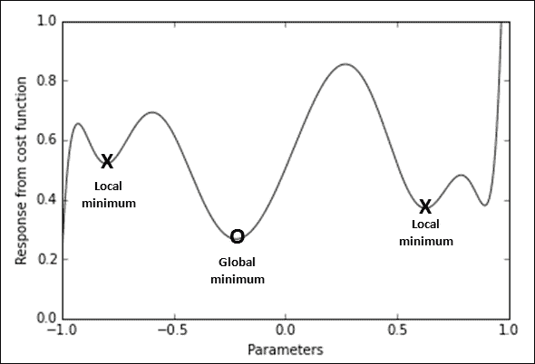
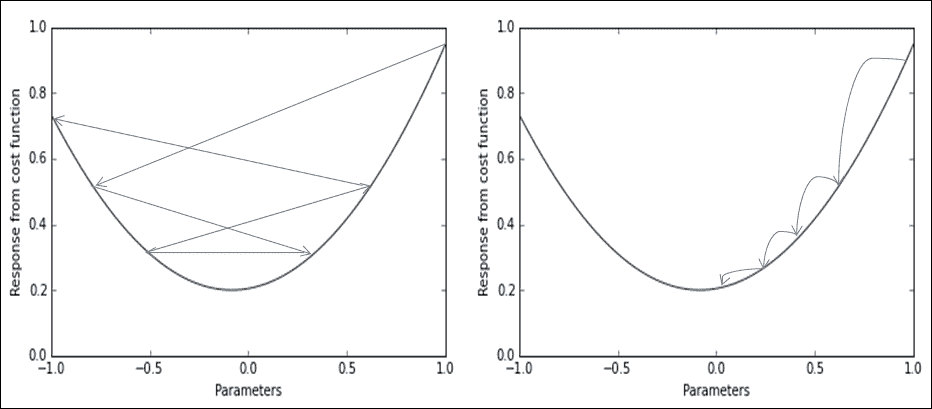
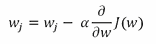
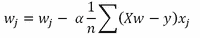
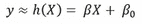
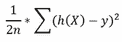
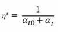
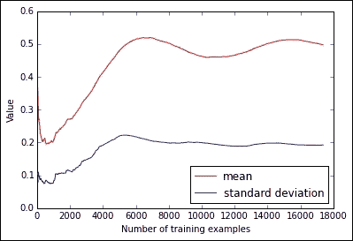
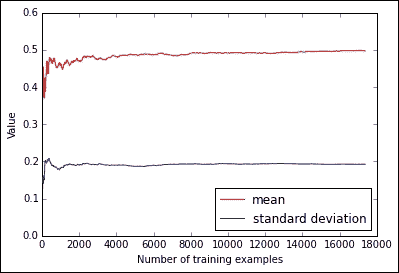

# 二、Scikit-learn 中的可扩展学习

将数据集加载到内存中、准备数据矩阵、训练机器学习算法以及使用样本外观察来测试其泛化能力通常不是什么大事，因为当今时代的计算机相当强大，但价格合理。然而，越来越多的情况是，要处理的数据规模如此之大，以至于不可能将其加载到计算机的核心内存中，即使是可管理的，其结果在数据管理和机器学习方面也是难以处理的。

除了核心内存处理之外，其他可行的策略也是可能的:将数据分成样本，使用并行性，最后以小批量或单个实例进行学习。本章将重点介绍 Scikit-learn 包提供的现成解决方案:来自数据存储的小批量实例流(我们的观察)以及基于它们的增量学习。这样的解决方案叫做核心外学习。

通过处理可管理的块和增量学习来处理数据是一个好主意。然而，当您试图实现它时，它也可能被证明是具有挑战性的，因为可用的学习算法和流中的流数据的限制将要求您在数据管理和特征提取方面有不同的想法。除了展示用于核心外学习的 Scikit-learn 功能之外，我们还将努力向您展示 Python 解决方案，解决您在被迫一次只观察一小部分数据时可能面临的明显令人生畏的问题。

在本章中，我们将涵盖以下主题:

*   核心外学习的方式在 Scikit-learn 中实现
*   使用哈希技巧有效管理数据流
*   随机学习的基本原理
*   通过在线学习实施数据科学
*   数据流的无监督转换

# 核心外学习

核心外学习指的是一组处理数据的算法，这些数据不能放入单台计算机的内存中，但可以很容易地放入一些数据存储中，如本地硬盘或网络存储库。您的可用内存，也就是单台机器上的核心内存，在大型服务器上可能从几千兆字节(有时是 2 GB，更常见的是 4 GB，但我们假设您最多有 2 GB)到 256 GB 不等。大型服务器就像您可以在云计算服务上获得的服务器，例如亚马逊**弹性计算云** ( **EC2** )，而您的存储容量仅使用一个外部驱动器就可以轻松超过万亿字节的容量(很可能约为 1 TB，但最高可达 4 TB)。

由于机器学习是基于全局降低成本函数，许多算法最初被认为是使用所有可用数据并在优化过程的每次迭代中访问这些数据。对于所有基于利用矩阵演算的统计学习的算法来说尤其如此，例如，反转矩阵，但是基于贪婪搜索的算法在采取下一步之前需要对尽可能多的数据进行评估。因此，最常见的开箱即用的类似回归的算法(特征的加权线性组合)更新它们的系数，试图最小化整个数据集的汇集误差。同样，由于对数据集中存在的噪声非常敏感，决策树必须根据所有可用数据决定最佳分割，以便找到最佳解决方案。

如果在这种情况下，数据无法容纳在计算机的核心内存中，您没有太多可能的解决方案。您可以增加可用内存(取决于主板的限制；之后，您将不得不求助于分布式系统，如 Hadoop 和 Spark(我们将在本书的最后几章中提到这种解决方案)，或者简单地减少数据集，以便让它适合内存。

如果您的数据是稀疏的，也就是说，您的数据集中有许多零值，您可以将密集矩阵转换为稀疏矩阵。这对于具有许多列的文本数据来说是典型的，因为每一列都是一个单词，但是代表单词计数的值很少，因为单个文档通常显示有限的单词选择。有时，使用稀疏矩阵可以解决允许您加载和处理其他相当大的数据集的问题，但这不是灵丹妙药(抱歉，没有免费的午餐，也就是说，没有适合所有问题的解决方案)，因为一些数据矩阵虽然稀疏，但可能有令人生畏的大小。

在这种情况下，您总是可以尝试通过减少实例数量或限制要素数量来减少数据集，从而减少数据集矩阵的维度及其在内存中所占的面积。通过只选取一部分观察值来减小数据集的大小，是一种称为二次采样(或简称采样)的解决方案。二次抽样本身没有错，但它有严重的缺点，在决定分析过程之前，有必要记住它们。

## 二次采样是一个可行的选择

当你进行二次抽样时，你实际上是在丢弃你的信息丰富性的一部分，你不能确定你只是在丢弃多余的，不是那么有用的观察。其实一些隐藏的宝石只有综合考虑所有数据才能发现。尽管在计算上很有吸引力——因为二次采样只需要一个随机生成器来告诉你是否应该选择一个实例——但通过选择二次采样数据集，你确实有可能限制算法以完整的方式学习数据中的规则和关联的能力。在偏差-方差权衡中，二次抽样导致预测的方差膨胀，因为由于随机噪声或数据中的异常观察，估计将更加不确定。

在大数据的世界里，拥有更多高质量数据的算法获胜，因为它可以比其他拥有更少(或更多噪音)数据的模型学会更多将预测与预测因子联系起来的方法。因此，二次抽样虽然作为一种解决方案是可以接受的，但会对机器学习活动的结果造成限制，因为预测不太精确，估计的方差更大。

通过在数据的多个子样本上学习多个模型，然后最终将所有解集合在一起或将所有模型的结果叠加在一起，从而创建一个简化的数据矩阵以供进一步训练，可以以某种方式克服子采样限制。这个过程被称为装袋。(您实际上是以这种方式压缩功能，从而减少了内存中的数据空间。)我们将在后面的章节中探讨集合和堆叠，并发现它们实际上如何减少因二次抽样而膨胀的估计方差。

作为替代方案，我们可以不切割实例，而是切割特征，但同样，我们会遇到这样的问题，即我们需要从数据中构建模型，以测试我们可以选择哪些特征，因此我们仍然需要构建一个包含无法放入内存的数据的模型。

## 一次优化一个实例

意识到二次采样虽然总是可行的，但并不是一个最优的解决方案，我们必须评估一种不同的方法，而核外实际上并不需要你放弃观察或特征。只不过训练一个模型需要更长一点的时间，需要更多的迭代和从你的存储到你的计算机内存的数据传输。我们立即提供了核心外学习过程如何工作的第一直觉。

让我们从学习开始，这是一个过程，我们试图将表达响应的未知函数(一个回归或分类问题的数字或结果)映射到可用数据。学习是可能的，通过拟合学习算法的内部系数，试图在可用数据上实现最佳拟合，即最小化成本函数，这种度量告诉我们我们的近似有多好。归根结底，我们谈论的是优化过程。

不同的优化算法，就像梯度下降一样，是能够处理任何数据量的过程。他们致力于导出优化梯度(优化过程中的一个方向)，并让学习算法调整其参数，以便遵循梯度。

在梯度下降的具体情况下，经过一定次数的迭代，如果问题可以解决，并且没有其他问题，比如学习率太高，梯度应该变得很小，这样我们就可以停止优化过程。在这个过程的最后，我们可以确信已经找到了一个最优解(因为它是一个全局最优解，尽管有时它可能是一个局部最小值，如果要逼近的函数不是凸的)。

由于由梯度决定的方向性可以基于任意数量的示例，因此也可以在单个实例上进行。在单个实例上采用梯度需要小的学习速率，但是最终，该过程可以达到与在全部数据上采用梯度下降相同的优化。最后，我们的算法所需要的只是一个方向，即在拟合可用数据的基础上正确定位学习过程。因此，从从数据中随机抽取的单个案例中学习这样的方向是完全可行的:

*   我们可以获得相同的结果，就好像我们一次处理所有数据一样，尽管优化路径可能会变得有点粗糙；如果你的大部分观察都指向一个最佳方向，算法就会采用那个方向。唯一的问题是正确调整学习过程的正确参数，并多次传递数据，以确保优化完成，因为此学习过程比处理所有可用数据要慢得多。
*   我们在设法将单个实例保留在核心内存中，将大部分数据排除在外方面没有任何特殊问题。通过单个例子将数据从其存储库移动到我们的核心内存可能会产生其他问题。可伸缩性是有保证的，因为处理数据所需的时间是线性的；无论我们要处理的实例总数是多少，多使用一个实例的时间成本总是一样的。

将学习算法拟合到单个实例或一次拟合到内存的数据子集上的方法称为在线学习，基于这种单次观测的梯度下降称为随机梯度下降。如前所述，在线学习是一种核心外技术，被 Scikit-learn 中的许多学习算法所采用。

## 构建核心外学习体系

在接下来的几个段落中，我们将说明随机梯度下降的内部工作原理，提供更多的细节和推理。现在知道如何可能学习核外(由于随机梯度下降)允许我们更清楚地描述我们应该做什么来使它在我们的计算机上工作。

您可以将活动划分为不同的任务:

1.  准备您的数据存储库访问，以便逐个实例地流式传输数据。此活动可能要求您在将数据提取到计算机之前随机化数据行的顺序，以便删除排序可能带来的任何信息。
2.  首先进行一些数据调查，可能是对所有数据的一部分(例如，前一万行)，试图弄清楚到达的实例在特征数量、数据类型、数据值的存在与否、每个变量的最小值和最大值以及平均值和中值方面是否一致。找出目标变量的范围或类别。
3.  将每个接收到的数据行准备成学习算法可以接受的固定格式(密集或稀疏向量)。在这个阶段，您可以执行任何基本的转换，例如，将分类特征转换为数字特征，或者让数字特征通过特征本身的叉积进行交互。
4.  将示例的顺序随机化后(如第一点所述)，使用系统保持或在一定数量的观察后保持来建立验证程序。
5.  通过重复流式传输数据或处理小样本数据来调整超参数。这也是进行一些特征工程(使用无监督学习和特殊变换函数，如核近似)并利用正则化和特征选择的合适时机。
6.  使用您为培训保留的数据构建您的最终模型，并在全新的数据上理想地测试模型的有效性。

作为第一步，我们将讨论如何准备您的数据，然后利用 Python 包(如 pandas 和 Scikit-learn)中的有用功能，轻松创建适合在线学习的流。

# 从来源流式传输数据

当你有一个传输数据的生成过程时，一些数据真的在你的计算机中流动，你可以动态处理或丢弃这些数据，但除非你已经把它们存储在某个数据档案库中，否则以后不会再调用。这就像从流动的河流中拖水一样——河流一直在流动，但你可以过滤和处理所有流动的水。这与一次处理所有数据是完全不同的策略，这更像是把所有的水放在一个大坝里(类似于处理内存中的所有数据)。

作为流式传输的一个例子，我们可以引用传感器即时产生的数据流，或者更简单地说，推特上的推文流。一般来说，数据流的主要来源如下:

*   测量温度、压力和湿度的环境传感器
*   GPS 跟踪传感器记录位置(纬度/经度)
*   记录图像数据的卫星
*   监控录像和录音
*   网络流量

但是，您不会经常处理真实的数据流，而是处理存储在存储库或文件中的静态记录。在这种情况下，可以根据某些标准重新创建流，例如，一次按顺序或随机提取单个记录。例如，如果我们的数据包含在一个 TXT 或 CSV 文件中，我们需要做的就是一次提取文件的一行，并将其传递给学习算法。

对于本章和下一章中的示例，我们将处理存储在本地硬盘上的文件，并准备将其提取为流所需的 Python 代码。我们不会使用玩具数据集，但我们不会在您的本地硬盘上塞满太多测试和演示数据。

## 数据集自己去尝试真实的东西

自 1987 年以来，在加州大学欧文分校(**UCI**)**UCI 机器学习资源库**已经被托管，这是一个用于机器学习社区对机器学习算法进行经验测试的大型数据集资源库。在撰写本文时，知识库包含大约 350 个数据集，这些数据集来自非常不同的领域和目的，从有监督的回归和分类到无监督的任务。您可以在[https://archive.ics.uci.edu/ml/](https://archive.ics.uci.edu/ml/)查看可用的数据集。

从我们的角度来看，我们选择了几个数据集，这些数据集将在整本书中变得有用，用一台不寻常但仍可管理的 2 GB 内存计算机和大量的行或列向您提出了具有挑战性的问题:

<colgroup><col style="text-align: left"> <col style="text-align: left"> <col style="text-align: left"> <col style="text-align: left"></colgroup> 
| 

数据集名称

 | 

数据集网址

 | 

问题类型

 | 

行和列

 |
| --- | --- | --- | --- |
| 自行车共享数据集 | [https://archive . ics . UCI . edu/ml/datasets/Bike+Sharing+Dataset](https://archive.ics.uci.edu/ml/datasets/Bike+Sharing+Dataset) | 回归 | 17389, 16 |
| BlogFeedback 数据集 | [https://archive . ics . UCI . edu/ml/datasets/blogging feedback](https://archive.ics.uci.edu/ml/datasets/BlogFeedback) | 回归 | 60021, 281 |
| 社交媒体数据集中的嗡嗡声 | [https://archive . ics . UCI . edu/ml/datasets/Buzz+in+社交+媒体+](https://archive.ics.uci.edu/ml/datasets/Buzz+in+social+media+) | 回归和分类 | 140000, 77 |
| 普查-收入(KDD)数据集 | [https://archive . ics . UCI . edu/ml/datasets/Census-Income+% 28KDD % 29](https://archive.ics.uci.edu/ml/datasets/Census-Income+%28KDD%29) | 带有缺失数据的分类 | 299285, 40 |
| Covertype 数据集 | [https://archive.ics.uci.edu/ml/datasets/Covertype](https://archive.ics.uci.edu/ml/datasets/Covertype) | 分类 | 581012, 54 |
| 1999 年 KDD 杯数据集 | [https://archive.ics.uci.edu/ml/datasets/KDD+Cup+1999+Data](https://archive.ics.uci.edu/ml/datasets/KDD+Cup+1999+Data) | 分类 | 4000000, 42 |

要从 UCI 存储库中下载并使用数据集，您必须转到该数据集的专用页面，并按照标题下的链接:**下载:数据文件夹**。我们已经为自动下载数据准备了一些脚本，这些脚本将被放在 Python 中您正在使用的目录中，从而使数据访问更加容易。

以下是我们准备好的一些函数，当我们需要从 UCI 下载任何数据集时，我们会在整个章节中回忆这些函数:

```py
In: import urllib2 # import urllib.request as urllib2 in Python3
import requests, io, os, StringIO
import numpy as np
import tarfile, zipfile, gzip

def unzip_from_UCI(UCI_url, dest=''):
    """
    Downloads and unpacks datasets from UCI in zip format
    """
    response = requests.get(UCI_url)
    compressed_file = io.BytesIO(response.content)
    z = zipfile.ZipFile(compressed_file)
    print ('Extracting in %s' %  os.getcwd()+'\\'+dest)
    for name in z.namelist():
        if '.csv' in name:
            print ('\tunzipping %s' %name)
            z.extract(name, path=os.getcwd()+'\\'+dest)

def gzip_from_UCI(UCI_url, dest=''):
    """
    Downloads and unpacks datasets from UCI in gzip format
    """
    response = urllib2.urlopen(UCI_url)
    compressed_file = io.BytesIO(response.read())
    decompressed_file = gzip.GzipFile(fileobj=compressed_file)
    filename = UCI_url.split('/')[-1][:-3]
    with open(os.getcwd()+'\\'+filename, 'wb') as outfile:
        outfile.write(decompressed_file.read())
    print ('File %s decompressed' % filename)

def targzip_from_UCI(UCI_url, dest='.'):
    """
    Downloads and unpacks datasets from UCI in tar.gz format
    """
    response = urllib2.urlopen(UCI_url)
    compressed_file = StringIO.StringIO(response.read())
    tar = tarfile.open(mode="r:gz", fileobj = compressed_file)
    tar.extractall(path=dest)
    datasets = tar.getnames()
    for dataset in datasets:
        size = os.path.getsize(dest+'\\'+dataset)
        print ('File %s is %i bytes' % (dataset,size))
    tar.close()

def load_matrix(UCI_url):
    """
    Downloads datasets from UCI in matrix form
    """
    return np.loadtxt(urllib2.urlopen(UCI_url))
```

### 型式

**下载示例代码**

下载代码包的详细步骤在本书的前言中提到。请看看。

这本书的代码包也托管在 GitHub 上，网址为[。我们还有来自丰富的图书和视频目录的其他代码包，可在](https://github.com/PacktPublishing/Large-Scale-Machine-Learning-With-Python)[https://github.com/PacktPublishing/](https://github.com/PacktPublishing/)获得。看看他们！

这些功能只是围绕处理压缩数据的各种包构建的方便的包装器，如`tarfile`、`zipfile`和`gzip`。文件是使用`urllib2`模块打开的，该模块生成远程系统的句柄，允许数据的顺序传输，并以字符串(`StringIO`)或二进制模式(`BytesIO`)从`io`模块存储在内存中，该模块专门用于流处理([【https://docs.python.org/2/library/io.html】](https://docs.python.org/2/library/io.html))。存储在内存中后，它会被重新调用，就像文件是从专门用于从磁盘中解压缩压缩文件的函数中调用一样。

所提供的四个函数应该可以方便地帮助您快速下载数据集，无论它们是压缩的、涂了焦油的、gzip 的还是只是矩阵形式的纯文本，避免了手动下载和提取操作的麻烦。

## 第一个例子——流式传输自行车共享数据集

作为第一个例子，我们将使用自行车共享数据集。该数据集由两个 CSV 文件组成，包含 2011 年至 2012 年期间在美国华盛顿首都自行车共享系统内租赁的自行车的小时数和日数。这些数据显示了租赁当天相应的天气和季节信息。该数据集与由 *Fanaee-T，Hadi 和 Gama，Joao 出版的结合集成检测器和背景知识的事件标记，《人工智能进展》(2013 年):第 1-15 页，斯普林格·柏林海德堡*。

我们的第一个目标是使用前面几段中定义的方便的包装函数将数据集保存在本地硬盘上:

```py
In: UCI_url = 'https://archive.ics.uci.edu/ml/machine-learning-databases/00275/Bike-Sharing-Dataset.zip'
unzip_from_UCI(UCI_url, dest='bikesharing')

Out: Extracting in C:\scisoft\WinPython-64bit-2.7.9.4\notebooks\bikesharing
    unzipping day.csv
    unzipping hour.csv
```

如果运行成功，代码将指示 CSV 文件保存在哪个目录中，并打印两个解压缩文件的名称。

此时，将信息保存在物理设备上后，我们将编写一个脚本，构成核心外学习系统的核心，从文件中提供数据流。我们将首先使用`csv`库，为我们提供了双重选择:将数据恢复为列表或 Python 字典。我们将从一个列表开始:

```py
In: import os, csv
local_path = os.getcwd()
source = 'bikesharing\\hour.csv'
SEP = ',' # We define this for being able to easily change it as required by the file
with open(local_path+'\\'+source, 'rb') as R:
    iterator = csv.reader(R, delimiter=SEP)
    for n, row in enumerate(iterator):
        if n==0:
            header = row
        else:
            # DATA PROCESSING placeholder
            # MACHINE LEARNING placeholder
            pass
    print ('Total rows: %i' % (n+1))
    print ('Header: %s' % ', '.join(header))
    print ('Sample values: %s' % ', '.join(row))

Out: Total rows: 17380
Header: instant, dteday, season, yr, mnth, hr, holiday, weekday, workingday, weathersit, temp, atemp, hum, windspeed, casual, registered, cnt
Sample values: 17379, 2012-12-31, 1, 1, 12, 23, 0, 1, 1, 1, 0.26, 0.2727, 0.65, 0.1343, 12, 37, 49
```

输出将向我们报告已经读取了多少行，标题的内容 CSV 文件的第一行(存储在列表中)——以及一行的内容(为了方便起见，我们打印了最后一行)。`csv.reader`函数创建一个`iterator`，由于有一个`for`循环，它将逐个释放文件的每一行。请注意，我们在代码片段内部放置了两个注释，指出了在整个章节中，我们将在哪里放置其他代码来处理数据预处理和机器学习。

在这种情况下，必须使用定位方法来处理特征，即索引标签在标题中的位置。如果你必须广泛地操作你的特征，这可能是一个小麻烦。一个解决方案可能是使用`csv.DictReader`生成一个 Python 字典作为输出(这是无序的，但是特征很容易被它们的标签召回):

```py
In: with open(local_path+'\\'+source, 'rb') as R:
       iterator = csv.DictReader(R, delimiter=SEP)
       for n, row in enumerate(iterator):
           # DATA PROCESSING placeholder
           # MACHINE LEARNING placeholder
           pass
       print ('Total rows: %i' % (n+1))
       print ('Sample values: %s' % str(row))

Out: Total rows: 17379
Sample values: {'mnth': '12', 'cnt': '49', 'holiday': '0', 'instant': '17379', 'temp': '0.26', 'dteday': '2012-12-31', 'hr': '23', 'season': '1', 'registered': '37', 'windspeed': '0.1343', 'atemp': '0.2727', 'workingday': '1', 'weathersit': '1', 'weekday': '1', 'hum': '0.65', 'yr': '1', 'casual': '12'}
```

## 使用熊猫输入输出工具

作为 `csv`模块的替代，我们可以使用熊猫的`read_csv`功能。这样一个专门用于上传 CSV 文件的功能，是大量专门用于不同文件格式输入/输出的功能的一部分，如 http://pandas.pydata.org/pandas-docs/stable/io.html熊猫文档所规定的。

使用熊猫输入输出功能的巨大优势如下:

*   如果您改变了源代码类型，您可以保持代码的一致性，也就是说，您只需要重新定义流迭代器
*   您可以访问大量不同的格式，例如 CSV、普通 TXT、HDF、JSON 和特定数据库的 SQL 查询
*   由于熊猫数据帧中典型的切片和切割方法`.loc`、`.iloc`、`.ix`，数据以数据帧数据结构的形式被流式传输到所需大小的块中，以便您可以通过定位方式或通过调用其标签来访问特征

下面是一个使用与之前相同方法的例子，这次是围绕熊猫的`read_csv`功能构建的:

```py
In: import pandas as pd
CHUNK_SIZE = 1000
with open(local_path+'\\'+source, 'rb') as R:
    iterator = pd.read_csv(R, chunksize=CHUNK_SIZE) 
    for n, data_chunk in enumerate(iterator):
        print ('Size of uploaded chunk: %i instances, %i features' % (data_chunk.shape))
        # DATA PROCESSING placeholder
        # MACHINE LEARNING placeholder
        pass
    print ('Sample values: \n%s' % str(data_chunk.iloc[0]))

Out: 
Size of uploaded chunk: 2379 instances, 17 features
Size of uploaded chunk: 2379 instances, 17 features
Size of uploaded chunk: 2379 instances, 17 features
Size of uploaded chunk: 2379 instances, 17 features
Size of uploaded chunk: 2379 instances, 17 features
Size of uploaded chunk: 2379 instances, 17 features
Size of uploaded chunk: 2379 instances, 17 features
Sample values: 
instant            15001
dteday        2012-09-22
season                 3
yr                     1
mnth                   9
hr                     5
holiday                0
weekday                6
workingday             0
weathersit             1
temp                0.56
atemp             0.5303
hum                 0.83
windspeed         0.3284
casual                 2
registered            15
cnt                   17
Name: 0, dtype: object
```

这里，注意到迭代器是通过指定块大小来实例化的，也就是迭代器在每次迭代中必须返回的行数，这一点非常重要。`chunksize`参数可以取从 1 到任何值的值，尽管很明显，小批量(检索到的块)的大小与您的可用内存严格相连，以便在接下来的预处理阶段存储和操作它。

将更大的块带入内存仅在磁盘访问方面有优势。较小的块需要多次访问磁盘，并且根据物理存储的特性，需要更长的时间来传递数据。然而，从机器学习的角度来看，更小或更大的块对 Scikit 来说没有什么区别——学习核心外的函数，因为它们一次只考虑一个实例来学习，使它们在计算成本上真正线性。

## 使用数据库

作为熊猫输入/输出工具灵活性的一个例子，我们将提供一个使用 SQLite3 数据库的进一步例子，其中数据是从一个简单的查询逐块流式传输的。这个例子不仅仅是为了教学而提出的。从磁盘空间和处理时间的角度来看，在数据库中使用大型数据存储确实可以带来优势。

在 SQL 数据库中排列成表的数据可以标准化，从而消除冗余和重复，节省磁盘存储。数据库规范化是一种在数据库中排列列和表的方式，以减少它们的维度而不丢失任何信息。通常，这是通过拆分表并将重复的数据重新编码成键来实现的。此外，在内存、操作和多处理方面进行了优化的关系数据库可以加速和预测那些在 Python 脚本中处理的预处理活动。

使用 Python，SQLite([http://www.sqlite.org](http://www.sqlite.org))是一个不错的默认选择，原因如下:

*   它是开源的
*   它可以处理大量数据(理论上每个数据库高达 140 TB，尽管不太可能看到任何 SQLite 应用程序处理如此大量的数据)
*   它在苹果操作系统、Linux 和视窗 32 和 64 位环境下运行
*   它不需要任何服务器基础架构或特定安装(零配置)，因为所有数据都存储在磁盘上的单个文件中
*   使用 Python 代码可以很容易地将其扩展成存储过程

此外，Python 标准库包括一个`sqlite3`模块，提供从头开始创建数据库并使用它的所有功能。

在我们的示例中，我们将首先将包含自行车共享数据集的 CSV 文件每天和每小时上传到一个 SQLite 数据库，然后我们将像从 CSV 文件一样从该数据库进行流式传输。我们提供的数据库上传代码可以在整本书和您自己的应用程序中重复使用，而不局限于我们提供的特定示例(您只需更改输入和输出参数，仅此而已):

```py
In : import os, sys
import sqlite3, csv,glob

SEP = ','

def define_field(s):
    try:
        int(s)
        return 'integer'
    except ValueError:
        try:
            float(s)
            return 'real'
        except:
            return 'text'

def create_sqlite_db(db='database.sqlite', file_pattern=''):
    conn = sqlite3.connect(db)
    conn.text_factory = str  # allows utf-8 data to be stored

    c = conn.cursor()

    # traverse the directory and process each .csv file useful for building the db
    target_files = glob.glob(file_pattern) 

    print ('Creating %i table(s) into %s from file(s): %s' % (len(target_files), db, ', '.join(target_files)))

    for k,csvfile in enumerate(target_files):
        # remove the path and extension and use what's left as a table name
        tablename = os.path.splitext(os.path.basename(csvfile))[0]

        with open(csvfile, "rb") as f:
            reader = csv.reader(f, delimiter=SEP)

            f.seek(0)
            for n,row in enumerate(reader):
                if n==11:
                    types = map(define_field,row)
                else:
                    if n>11:
                        break      

            f.seek(0)
            for n,row in enumerate(reader):
                if n==0:

                    sql = "DROP TABLE IF EXISTS %s" % tablename
                    c.execute(sql)
                    sql = "CREATE TABLE %s (%s)" % (tablename,\
                              ", ".join([ "%s %s" % (col, ct) \
for col, ct  in zip(row, types)]))
                    print ('%i) %s' % (k+1,sql))
                    c.execute(sql)

                    # Creating indexes for faster joins on long strings
                    for column in row:
                        if column.endswith("_ID_hash"):
                            index = "%s__%s" % \
( tablename, column )
                            sql = "CREATE INDEX %s on %s (%s)" % \
( index, tablename, column )
                            c.execute(sql) 

                    insertsql = "INSERT INTO %s VALUES (%s)" % (tablename,
                                ", ".join([ "?" for column in row ]))

                    rowlen = len(row)
                else:
                    # raise an error if there are rows that don't have the right number of fields
                    if len(row) == rowlen:
                        c.execute(insertsql, row)
                    else:
                        print ('Error at line %i in file %s') % (n,csvfile)
                        raise ValueError('Houston, we\'ve had a problem at row %i' % n)

            conn.commit()
            print ('* Inserted %i rows' % n)

    c.close()
    conn.close()
```

该脚本提供了一个有效的数据库名称和模式来定位您想要导入的文件(接受通配符，如`*`)，并从头创建一个您需要的新数据库和表，然后用所有可用的数据填充它们:

```py
In: create_sqlite_db(db='bikesharing.sqlite', file_pattern='bikesharing\\*.csv')

Out: Creating 2 table(s) into bikesharing.sqlite from file(s): bikesharing\day.csv, bikesharing\hour.csv
1) CREATE TABLE day (instant integer, dteday text, season integer, yr integer, mnth integer, holiday integer, weekday integer, workingday integer, weathersit integer, temp real, atemp real, hum real, windspeed real, casual integer, registered integer, cnt integer)
* Inserted 731 rows
2) CREATE TABLE hour (instant integer, dteday text, season integer, yr integer, mnth integer, hr integer, holiday integer, weekday integer, workingday integer, weathersit integer, temp real, atemp real, hum real, windspeed real, casual integer, registered integer, cnt integer)
* Inserted 17379 rows
```

该脚本还报告了所创建字段的数据类型和行数，因此很容易验证在导入过程中一切是否顺利。现在很容易从数据库中流式传输。在我们的示例中，我们将在小时表和日表之间创建一个内部连接，以小时为基础提取数据，其中包含当天总租金的信息:

```py
In: import os, sqlite3
import pandas as pd

DB_NAME = 'bikesharing.sqlite'
DIR_PATH = os.getcwd()
CHUNK_SIZE = 2500

conn = sqlite3.connect(DIR_PATH+'\\'+DB_NAME)
conn.text_factory = str  # allows utf-8 data to be stored     
sql = "SELECT H.*, D.cnt AS day_cnt FROM hour AS H INNER JOIN day as D ON (H.dteday = D.dteday)"
DB_stream = pd.io.sql.read_sql(sql, conn, chunksize=CHUNK_SIZE)
for j,data_chunk in enumerate(DB_stream):
    print ('Chunk %i -' % (j+1)),
    print ('Size of uploaded chunk: %i instances, %i features' % (data_chunk.shape))
    # DATA PROCESSING placeholder
    # MACHINE LEARNING placeholder

Out:
Chunk 1 - Size of uploaded chunk: 2500 instances, 18 features
Chunk 2 - Size of uploaded chunk: 2500 instances, 18 features
Chunk 3 - Size of uploaded chunk: 2500 instances, 18 features
Chunk 4 - Size of uploaded chunk: 2500 instances, 18 features
Chunk 5 - Size of uploaded chunk: 2500 instances, 18 features
Chunk 6 - Size of uploaded chunk: 2500 instances, 18 features
Chunk 7 - Size of uploaded chunk: 2379 instances, 18 features
```

如果您需要加速流，您只需要优化数据库，首先为您打算使用的关系查询构建正确的索引。

### 型式

`conn.text_factory = str`是剧本中非常重要的一部分；它允许存储 UTF-8 数据。如果忽略这样的命令，您可能会在输入数据时遇到奇怪的错误。

## 注意实例的排序

作为流数据主题的总结注释，我们必须警告您这样一个事实，即在流传输时，由于您的学习所基于的示例顺序，您实际上在学习过程中包含了隐藏的信息。

事实上，在线学习者基于他们评估的每个实例来优化他们的参数。每个实例都将引导学习者朝着优化过程中的某个方向前进。从全局来看，在给定足够多的评估实例的情况下，学习者应该采取正确的优化方向。然而，如果学习者改为通过有偏差的观察(例如，按时间排序的观察或以有意义的方式分组的观察)来训练，则算法也将学习偏差。为了不记起以前见过的例子，可以在训练中做一些事情，但无论如何都会引入一些偏见。如果你正在学习时间序列——对时间流动的反应通常是模型的一部分——这样的偏差是相当有用的，但在大多数其他情况下，它充当了某种过度拟合，并转化为最终模型中某种程度的泛化能力的缺乏。

如果您的数据具有某种排序，而您不希望机器学习算法学习到这种排序(例如 ID 顺序)，作为一种谨慎措施，您可以在流式传输数据之前对其行进行洗牌，并获得更适合在线随机学习的随机顺序。

最快的方法，也是占用较少磁盘空间的方法，是在内存中流式传输数据集，并通过压缩来缩小数据集。在大多数情况下，但不是所有情况下，由于所应用的压缩算法以及您用于训练的数据的相对稀疏性和冗余性，这种方法都是可行的。在它不起作用的情况下，您必须直接在磁盘上洗牌，这意味着更多的磁盘空间消耗。

在这里，我们首先介绍一种快速的内存洗牌方法，这得益于能够将行快速压缩到内存中的`zlib`包，以及来自`random`模块的`shuffle`功能:

```py
In: import zlib
from random import shuffle

def ram_shuffle(filename_in, filename_out, header=True):
    with open(filename_in, 'rb') as f:
        zlines = [zlib.compress(line, 9) for line in f]
        if header:
            first_row = zlines.pop(0)
    shuffle(zlines)
    with open(filename_out, 'wb') as f:
        if header:
            f.write(zlib.decompress(first_row))
        for zline in zlines:
            f.write(zlib.decompress(zline))

import os

local_path = os.getcwd()
source = 'bikesharing\\hour.csv'
ram_shuffle(filename_in=local_path+'\\'+source, \
                   filename_out=local_path+'\\bikesharing\\shuffled_hour.csv', header=True)
```

### 型式

对于 Unix 用户来说，`sort`命令可以很容易地用一次调用来使用(`-R`参数)，它比任何 Python 实现都更容易、更高效地混合大量文本文件。它可以与使用管道的减压和压缩步骤相结合。

因此，类似下面的命令应该可以做到这一点:

```py
zcat sorted.gz | sort -R | gzip - > shuffled.gz
```

如果内存不足以存储所有压缩数据，唯一可行的解决方案是像在磁盘上一样对文件进行操作。下面的代码片段定义了一个函数，该函数会重复地将您的文件分割成越来越小的文件，在内部对它们进行洗牌，并在一个更大的文件中再次随机排列它们。结果不是完美的随机重排，而是行分散到足以破坏任何可能影响在线学习的先前顺序:

```py
In: from random import shuffle
import pandas as pd
import numpy as np
import os

def disk_shuffle(filename_in, filename_out, header=True, iterations = 3, CHUNK_SIZE = 2500, SEP=','):
    for i in range(iterations):
        with open(filename_in, 'rb') as R:
            iterator = pd.read_csv(R, chunksize=CHUNK_SIZE) 
            for n, df in enumerate(iterator):
                if n==0 and header:
                    header_cols =SEP.join(df.columns)+'\n'
                df.iloc[np.random.permutation(len(df))].to_csv(str(n)+'_chunk.csv', index=False, header=False, sep=SEP)
        ordering = list(range(0,n+1))
        shuffle(ordering)
        with open(filename_out, 'wb') as W:
            if header:
                W.write(header_cols)
            for f in ordering:
                with open(str(f)+'_chunk.csv', 'r') as R:
                    for line in R:
                        W.write(line)
                os.remove(str(f)+'_chunk.csv')
        filename_in = filename_out
        CHUNK_SIZE = int(CHUNK_SIZE / 2)

import os

local_path = os.getcwd()
source = 'bikesharing\\hour.csv'
disk_shuffle(filename_in=local_path+'\\'+source, \
                   filename_out=local_path+'\\bikesharing\\shuffled_hour.csv', header=True)
```

# 随机学习

定义了流过程后，现在是时候看一看学习过程了，因为正是学习及其特定需求决定了在预处理阶段处理数据和转换数据的最佳方式。

与批处理学习相反，在线学习使用更大数量的迭代，一次从每个单个实例中获取方向，因此与批处理优化相比，在线学习允许更不稳定的学习过程，批处理优化会立即从整体数据中获取正确的方向。

## 分批梯度下降

机器学习的核心算法梯度下降因此被重新考虑，以适应在线学习。当处理批处理数据时，梯度下降可以使用比统计算法少得多的计算来最小化线性回归分析的成本函数。梯度下降的复杂度按照 *O(n*p)* 的顺序排序，使得学习回归系数即使在出现大的 *n* (代表观测数)和大的 *p* (变量数)时也是可行的。当训练数据中存在高度相关甚至完全相同的特征时，它也能很好地工作。

一切都基于一个简单的优化方法:通过多次迭代来改变参数集，使其从一个随机的解开始逐渐收敛到最优解。梯度下降是一种理论上众所周知的优化方法，对于某些问题(如回归问题)具有已知的收敛保证。然而，让我们从下面的图像开始，该图像表示参数可以取的值(表示假设空间)之间的复杂映射(典型的神经网络)，并导致成本函数的最小化:



用一个比喻的例子，梯度下降就像蒙着眼睛在山上行走。如果你想在看不到路径的情况下下降到最低的山谷，你可以沿着你感觉正在下坡的方向前进；尝试一会儿，然后停下来，再次感受地形，然后朝着你感觉它正在下坡的地方前进，以此类推，一次又一次。如果你继续朝着地面下降的地方前进，你最终会到达一个点，因为地形平坦，你不能再下降了。希望在那个时候，你已经到达目的地了。

使用这种方法，您需要执行以下操作:

*   决定起点。这通常是通过对函数参数的初始随机猜测来实现的(多次重启将确保初始化不会因为不幸运的初始设置而导致算法达到局部最优)。
*   能够感受到地形，也就是能够分辨出它什么时候下沉。用数学术语来说，这意味着你应该能够得到实际参数化函数相对于目标变量的导数，也就是你正在优化的成本函数的偏导数。请注意，梯度下降适用于您的所有数据，试图同时优化所有实例的预测。
*   决定你应该沿着导数指示的方向走多长时间。用数学术语来说，这相当于一个权重(通常称为 alpha)，用来决定在优化的每一步你应该改变多少参数。这个方面可以被认为是学习因素，因为它指出了你应该在每个优化步骤中从数据中学到多少。与任何其他超参数一样，alpha 的最佳值可以通过对验证集的性能评估来确定。
*   Determine when to stop, given a too marginal improvement of the cost function with respect to the previous step. In such a sense, you also should be able to notice when something goes wrong and you are not going in the right direction maybe because you are using too large an alpha for the learning. This is actually a matter of *momentum*, that is, the speed at which the algorithm converges toward the optimum. It is just like throwing a ball down a mountainside: it just rolls over small dents in the surface, but if its speed is too high, it won't stop at the right point. Thus, if alpha is set correctly, the momentum will naturally slow down as the algorithm is approaching the optimum as shown in the following image in the right panel. However, if it is not set properly, it will just jump over the global optimum and report further errors to be minimized, as depicted in the following image on the right panel, when the optimization process causes parameters to jump across different values without achieving the required error minimization:

    

为了更好地描述梯度下降的情况，让我们以线性回归为例，其参数通过这样的过程进行优化。

我们从成本函数 *J* 开始，给定权重向量 *w* :


训练数据矩阵 *X* 和系数向量 *w* 之间的矩阵向量乘法 *Xw* 表示线性模型的预测，其与响应 *y* 的偏差被平方，然后求和，最后除以两次 *n* ，即实例数。

最初，向量 *w* 可以是实例化的，使用的随机数取自平均值为零、标准差为单位的标准化正态分布。(实际上，初始化可以用很多不同的方法来完成，所有这些方法都同样适用于近似成本函数为碗形且具有唯一最小值的线性回归。)这允许我们的算法沿着优化路径的某个地方开始，并且可以有效地加速过程的收敛。当我们优化线性回归时，初始化不应该给算法带来太多麻烦(最坏的情况是，错误的开始只会让它变慢)。相反，当我们使用梯度下降来优化不同的机器学习算法(如神经网络)时，我们可能会因为错误的初始化而陷入困境。举例来说，如果初始的 *w* 仅仅充满了零值(风险是被困在一个完美对称的山顶上，在那里没有方向性可以立即带来比任何其他更好的优化)，就会发生这种情况。这也可能发生在具有多个局部极小值的优化过程中。

给定起始随机系数向量 *w* ，我们可以立即计算成本函数 *J(w)* ，并通过从每个系数中减去成本函数偏导数的部分α(*α*，学习率)来确定每个系数的初始方向，如下式所示:



这可以在求解偏导数后更好地表达出来，如下所示:



值得注意的是，在给定特征向量 *xj* 的情况下，对每个奇异系数( *wj* )进行更新，但同时基于所有预测(因此是求和)。

在迭代 *w* 中的所有系数之后，系数的更新将完成，并且优化可以通过计算偏导数和更新 *w* 向量来重新开始。

该过程的一个有趣的特征是，随着 *w* 向量接近最优配置，更新将越来越少。因此，当相对于之前的操作，在 w 中引起的变化很小时，该过程可以停止。无论如何，当学习率 alpha 设置为正确的大小时，我们的更新确实会减少。事实上，如果它的值太大，它可能导致优化绕道而行并失败，在某些情况下，导致过程完全发散，并且不可能最终收敛到解决方案。事实上，优化往往会超出目标，实际上离目标更远。

另一端，过小的α值不仅会使优化过程向目标移动得太慢，还可能很容易陷入局部极小值。对于更复杂的算法尤其如此，就像神经网络一样。至于线性回归和它的分类对应物，逻辑回归，因为优化曲线是碗状的，就像凹曲线一样，它的特点是只有一个极小值，根本没有局部极小值。

在我们说明的实现中，α是一个固定的常数(一个固定的学习速率梯度下降)。由于α在收敛到最优解的过程中扮演着如此重要的角色，因此人们设计了不同的策略，使其随着优化的进行而开始变大和缩小。我们将在检查 Scikit-learn 实现时讨论这些不同的方法。

## 随机梯度下降

到目前为止看到的梯度下降的版本被称为整批梯度下降，通过优化整个数据集的误差来工作，因此需要将其存储在内存中。核心外版本为**随机梯度下降** ( **SGD** )和小批量梯度下降。

在这里，公式保持完全相同，但为了更新；一次只更新一个实例，这样我们就可以将核心数据留在存储中，只在内存中进行一次观察:


核心思想是，如果实例是随机挑选的，没有特定的偏差，优化将平均地朝着目标成本最小化的方向发展。这解释了为什么我们讨论了如何从一个流中删除任何排序，并使其尽可能随机。例如，在自行车共享的例子中，如果你有随机梯度下降，首先学习早期季节的模式，然后关注夏季，然后关注秋季，以此类推，取决于优化停止时的季节，模型将被调整为比其他季节更好地预测一个季节，因为最近的大多数例子来自那个季节。在随机梯度下降优化中，当数据为**独立同分布** ( **内径**)时，保证收敛到全局最小值。实际上，i.i.d .意味着您的示例不应该有顺序或分布，而应该像从可用示例中随机挑选一样向算法提出。

## Scikit-learn SGD 实施

在 Scikit-learn 包中可以找到大量在线学习算法。并非所有的机器学习算法都有在线对应物，但这个列表很有趣，而且还在稳步增长。对于监督学习，我们可以将可用的学习者分为分类器和回归器，并对它们进行枚举。

作为量词，我们可以提到以下几点:

*   `sklearn.naive_bayes.MultinomialNB`
*   `sklearn.naive_bayes.BernoulliNB`
*   `sklearn.linear_model.Perceptron`
*   `sklearn.linear_model.PassiveAggressiveClassifier`
*   `sklearn.linear_model.SGDClassifier`

作为回归者，我们有两个选择:

*   `sklearn.linear_model.PassiveAggressiveRegressor`
*   `sklearn.linear_model.SGDRegressor`

他们都可以增量学习，一个实例一个实例地更新自己；虽然只有`SGDClassifier`和`SGDRegressor`是基于我们之前描述的随机梯度下降优化，它们是本章的主要主题。SGD 学习器对于所有大规模问题来说都是最优的，因为它们的复杂性与 *O(k*n*p)* 有关，其中 *k* 是数据的传递次数， *n* 是实例的数量， *p* 是特征的数量(如果我们使用稀疏矩阵，则自然是非零特征):一个完全线性的时间学习器，花费的时间与所显示的示例数量成正比。

其他在线算法将作为比较基准。此外，所有算法都使用相同的应用编程接口，基于在线学习和小批量的`partial_fit`方法(当您流式传输更大的块而不是单个实例时)。共享同一个应用编程接口使得所有这些学习技术在你的学习框架中可以互换。

与使用所有可用数据进行即时优化的 fit 方法相反，`partial_fit`基于传递的每个单个实例进行部分优化。即使将数据集传递给`partial_fit`方法，算法也不会处理整个批次，而是处理其单个元素，使得学习操作的复杂性确实是线性的。此外，`partial_fit`之后的学习者可以通过后续的`partial_fit`调用不断更新，这使得它非常适合从连续的数据流中进行在线学习。

分类时，唯一需要注意的是，在第一次初始化时，有必要知道我们将学习多少个类，以及它们是如何被标记的。这可以使用 classes 参数来完成，指出数值标签的列表。这需要事先探索，通过数据流记录问题的标签，并注意它们的分布，以防它们不平衡——一个类相对于其他类在数字上太大或太小(但是 Sciket-learn 实现提供了一种自动处理问题的方法)。如果目标变量是数字，知道它的分布仍然是有用的，但这不是成功运行学习者所必需的。

在 Scikit-learn 中，我们有两个实现——一个用于分类问题(`SGDClassifier`)一个用于回归问题(`SGDRegressor`)。分类实现可以使用**一对全** ( **OVA** )策略处理多类问题。这个策略意味着，给定 k 个类，建立 k 个模型，每个类一个模型，与其他类的所有实例相对，因此创建 k 个二进制分类。这将产生 k 组系数和 k 个预测向量及其概率。最后，基于每个类别相对于其他类别的发射概率，将分类分配给具有最高概率的类别。如果我们需要给出多项式分布的实际概率，我们可以简单地通过除以它们的和来归一化结果。(这是神经网络中 softmax 层正在发生的事情，我们将在后面的章节中看到。)

Scikit-learn 中的分类和回归 SGD 实现都具有不同的损失函数(代价函数，随机梯度下降优化的核心)。

对于分类，用`loss`参数表示，我们可以依赖于以下内容:

*   `loss='log'`:经典逻辑回归
*   `loss='hinge'`:软余量，即线性支持向量机
*   `loss='modified_huber'`:平滑的铰链损失

对于回归，我们有三个损失函数:

*   `loss='squared_loss'` : **普通最小** **平方** ( **OLS** )进行线性回归
*   `loss='huber'`:针对异常值的稳健回归的 Huber 损失
*   `loss='epsilon_insensitive'`:线性支持向量回归

我们将给出一些使用经典统计损失函数的例子，它们是逻辑损失和 OLS。铰链损失和**支持向量机** ( **支持向量机**)将在下一章讨论，详细介绍它们的功能是必要的。

提醒一下(这样你就不用去查阅其他任何补充的机器学习书籍了)，如果我们把回归函数定义为 h，它的预测由 *h(X)* 给出，因为 *X* 是特征的矩阵，那么下面是合适的公式:



因此，要最小化的 OLS 成本函数如下:



在逻辑回归中，将二元结果 *0* / *1* 转化为优势比，πy 为正结果的概率，公式如下:


因此，物流成本函数定义如下:


## 定义 SGD 学习参数

为了在 Scikit-learn 中定义 SGD 参数，在分类和回归问题中(这样它们对`SGDClassifier`和`SGDRegressor`都有效)，我们必须弄清楚当您不能一次评估所有数据时，如何处理正确学习所必需的一些重要参数。

第一个是`n_iter`，通过数据定义迭代次数。最初设置为 *5* ，经验表明，在给定其他默认参数的情况下，应该对其进行调整，以便学习者查看`10^6`示例；因此，设置它的一个好的解决方案是`n_iter = np.ceil(10**6 / n)`，其中 *n* 是实例的数量。值得注意的是，`n_iter`仅适用于内存中的数据集，因此它仅在通过 fit 方法操作时起作用，而不适用于`partial_fit`。实际上，`partial_fit`将重复相同的数据，只是如果你在你的过程中对它进行重新流，并且重新流的正确迭代次数是要沿着学习过程本身进行测试的，受数据类型的影响。在下一章中，我们将说明超参数优化，并讨论正确的遍数。

### 型式

在进行小批量学习时，每次完整地传递完所有数据后，重新整理数据可能是有意义的。

`shuffle`是需要的参数，如果你想打乱你的数据。它是指内存中的小批量，而不是指核心外的数据排序。它也适用于`partial_fit`，但在这种情况下，它的效果非常有限。请始终将其设置为 True，但是对于要以块为单位传递的数据，请将您的数据移出内核，如我们之前所述。

`warm_start`是与拟合方法一起工作的另一个参数，因为它会记住以前的拟合系数(但如果已经动态修改，则不会记住学习速率)。如果使用`partial_fit`方法，算法将记住先前学习的系数和学习速率表的状态。

`average`参数触发一个计算技巧，在特定情况下，开始对新系数和旧系数进行平均，从而加快收敛速度。它可以设置为`True`或一个整数值，指示从什么情况开始取平均值。

最后但同样重要的是，我们有`learning_rate`及其相关参数，`eta0`和`power_t`。`learning_rate`参数意味着每个观察到的实例如何影响优化过程。当从理论角度提出 SGD 时，我们提出了恒定速率学习，这可以通过设置`learning_rate='constant'`来复制。

然而，存在其他选择，让 eta (在 Scikit-learn 中称为学习率，在时间 *t* 定义)逐渐降低。在分类中，提出的解决方案是`learning_rate='optimal'`，由以下公式给出:



这里， *t* 是时间步长，由实例数乘以迭代次数给出， *t0* 是一个启发式选择的值，因为莱昂·博图的研究，其版本的*随机梯度 SVM* 严重影响了 SGD Scikit-learn 实现([http://leon.bottou.org/projects/sgd](http://leon.bottou.org/projects/sgd))。这种学习策略的明显优势是，随着看到更多的例子，学习会减少，避免了由异常值给出的优化的突然扰动。显然，这个策略也是现成的，也就是说你和它没有太多关系。

在回归中，建议的学习衰退由该公式给出，对应于`learning_rate= 'invscaling'`:


这里，`eta0`和`power_t`是要通过优化搜索进行优化的超参数(它们最初被设置为`0`和`0.5`)。值得注意的是，使用`invscaling`学习速率，SGD 将从较低的学习速率开始，低于最佳速率，并且它将降低得更慢，在学习期间适应性更强。

# 数据流特征管理

数据流带来的问题是，您无法像处理完整的内存数据集那样进行评估。对于一个正确和最优的方法来馈送你的 SGD 核外算法，你首先必须调查数据(例如，通过对文件的初始实例进行卡盘)并找出你手头的数据类型。

我们区分以下类型的数据:

*   定量值
*   用整数编码的分类值
*   以文本形式表达的非结构化分类值

当数据是定量的时，它可以仅仅被馈送给 SGD 学习器，但是事实上该算法对特征缩放相当敏感；也就是说，你必须将所有的量化特征纳入相同的价值范围，否则学习过程不会轻易正确地收敛。可能的缩放策略是转换[0，1]，[-1，1]范围内的所有值，或者通过将其平均值居中到零并将其方差转换为单位来标准化变量。对于缩放策略的选择，我们没有特别的建议，但是如果您正在处理稀疏矩阵，并且您的大部分值为零，那么在[0，1]范围内转换会特别有效。

至于内存学习，在转换训练集上的变量时，你必须注意你使用的值(基本上，你需要得到每个特征的最小值、最大值、平均值和标准差。)并在测试集中重用它们，以便获得一致的结果。

鉴于您正在流式传输数据，并且不可能将所有数据都上传到内存中，您必须通过传递所有数据或至少一部分数据来计算它们(采样总是一种可行的解决方案)。使用一个短暂的流(一个你无法复制的流)会带来更具挑战性的问题；事实上，你必须不断追踪你不断接受的价值。

如果采样只需要您计算一大块 *n* 实例的统计数据(假设您的流没有特定的顺序)，那么动态计算统计数据需要您记录正确的度量。

对于最小值和最大值，您需要为每个定量特征存储一个变量。从第一个值开始，您将该值存储为您的初始最小值和最大值，对于您将从流中接收的每个新值，您将不得不将其与之前记录的最小值和最大值进行比较。如果新实例超出了先前的值范围，则只需相应地更新变量。

此外，平均值不会带来任何特别的问题，因为您只需要保存看到的值的总和和实例的计数。至于方差，你需要回忆一下教科书的公式如下:


值得注意的是，您需要知道平均值μ，这也是您从流中逐步学习的。然而，该公式可以解释如下:


由于您只是记录实例的数量 *n* 和 *x* 值的总和，您只需要存储另一个变量，它是 *x* 平方值的总和，您将拥有配方的所有成分。

例如，使用自行车共享数据集，我们可以计算报告最终结果的运行平均值、标准偏差和范围，并绘制数据从磁盘流出时这些统计数据的变化情况:

```py
In: import os, csv
local_path = os.getcwd()
source = 'bikesharing\\hour.csv'
SEP=','
running_mean = list()
running_std = list()
with open(local_path+'\\'+source, 'rb') as R:
    iterator = csv.DictReader(R, delimiter=SEP)
    x = 0.0
    x_squared = 0.0
    for n, row in enumerate(iterator):
        temp = float(row['temp'])
        if n == 0:
            max_x, min_x = temp, temp
        else:
            max_x, min_x = max(temp, max_x),min(temp, min_x)
        x += temp
        x_squared += temp**2
        running_mean.append(x / (n+1))
        running_std.append(((x_squared - (x**2)/(n+1))/(n+1))**0.5)
        # DATA PROCESSING placeholder
        # MACHINE LEARNING placeholder
        pass
    print ('Total rows: %i' % (n+1))
    print ('Feature \'temp\': mean=%0.3f, max=%0.3f, min=%0.3f,\ sd=%0.3f' % (running_mean[-1], max_x, min_x, running_std[-1]))

Out: Total rows: 17379
Feature 'temp': mean=0.497, max=1.000, min=0.020, sd=0.193
```

过一会儿，数据将从数据源流出，与`temp`特征相关的关键数字将被记录为平均值的运行估计，标准偏差将被计算并存储在两个单独的列表中。

通过绘制列表中的值，我们可以检查估计值相对于最终数字的波动程度，并了解在获得稳定的平均值和标准偏差估计值之前需要多少个实例:

```py
In: import matplotlib.pyplot as plt
%matplotlib inline
plt.plot(running_mean,'r-', label='mean')
plt.plot(running_std,'b-', label='standard deviation')
plt.ylim(0.0,0.6)
plt.xlabel('Number of training examples')
plt.ylabel('Value') 
plt.legend(loc='lower right', numpoints= 1)
plt.show()
```

如果您之前处理了原始的自行车共享数据集，您将获得一个图表，其中数据明显有趋势(由于时间顺序，因为温度自然会随着季节而变化):



相反，如果我们使用数据集的混洗版本作为源，`shuffled_hour.csv`文件，我们可以获得几个更加稳定和快速收敛的估计。因此，我们将会了解到一个近似但更可靠的平均值和标准偏差的估计，从流中观察到更少的实例:



两张图的不同提醒我们随机化观察顺序的重要性。即使学习简单的描述性统计也会受到数据趋势的严重影响；因此，在通过 SGD 学习复杂模型时，我们必须更加注意。

## 描述目标

此外，目标变量也需要在启动前进行探索。事实上，我们需要确定它假设了什么样的值，如果是绝对的，并弄清楚它在类中是否不平衡，或者当是一个数字时是否有偏斜分布。

如果我们正在学习一个数字响应，我们可以对特性采用前面显示的相同策略，而对于类，一个 Python 字典记录类的数量(键)和它们的频率(值)就足够了。

例如，我们将下载一个数据集进行分类，**森林覆盖类型**数据。

为了快速下载和准备数据，我们将使用*数据集中定义的`gzip_from_UCI`函数亲自尝试本章的*部分:

```py
In: UCI_url = 'https://archive.ics.uci.edu/ml/machine-learning-databases/covtype/covtype.data.gz'
gzip_from_UCI(UCI_url)
```

如果在运行代码时出现问题，或者您更喜欢自己准备文件，只需前往 UCI 网站，下载数据集，并将其解包到 Python 当前工作的目录中:

[https://archive . ics . UCI . edu/ml/机器学习-数据库/covtype/](https://archive.ics.uci.edu/ml/machine-learning-databases/covtype/)

一旦数据在磁盘上可用，我们可以扫描 581，012 个实例，将代表我们应该估计的类别的每行的最后一个值转换为其对应的森林覆盖类型:

```py
In: import os, csv
local_path = os.getcwd()
source = 'covtype.data'
SEP=','
forest_type = {1:"Spruce/Fir", 2:"Lodgepole Pine", \
                3:"Ponderosa Pine", 4:"Cottonwood/Willow",\ 
                5:"Aspen", 6:"Douglas-fir", 7:"Krummholz"}
forest_type_count = {value:0 for value in forest_type.values()}
forest_type_count['Other'] = 0
lodgepole_pine = 0
spruce = 0
proportions = list()
with open(local_path+'\\'+source, 'rb') as R:
    iterator = csv.reader(R, delimiter=SEP)
    for n, row in enumerate(iterator):
        response = int(row[-1]) # The response is the last value
        try:
            forest_type_count[forest_type[response]] +=1
            if response == 1:
                spruce += 1
            elif response == 2:
                lodgepole_pine +=1
            if n % 10000 == 0:
                proportions.append([spruce/float(n+1),\
                lodgepole_pine/float(n+1)])
        except:
            forest_type_count['Other'] += 1
    print ('Total rows: %i' % (n+1))
    print ('Frequency of classes:')
    for ftype, freq in sorted([(t,v) for t,v \
        in forest_type_count.iteritems()], key = \
        lambda x: x[1], reverse=True):
            print ("%-18s: %6i %04.1f%%" % \
                    (ftype, freq, freq*100/float(n+1)))

Out: Total rows: 581012
Frequency of classes:
Lodgepole Pine    : 283301 48.8%
Spruce/Fir        : 211840 36.5%
Ponderosa Pine    :  35754 06.2%
Krummholz         :  20510 03.5%
Douglas-fir       :  17367 03.0%
Aspen             :   9493 01.6%
Cottonwood/Willow :   2747 00.5%
Other             :      0 00.0%
```

输出显示两个类`Lodgepole Pine`和`Spruce/Fir`占据了大部分观察值。如果示例在流中被适当地打乱，SGD 将适当地学习正确的先验分布，并因此调整其概率发射(后验概率)。

如果与我们目前的情况相反，您的目标不是提高分类精度，而是增加**接收机工作特性** ( **ROC** ) **曲线下面积** ( **AUC** )或 f1-score(可用于评估的误差函数；有关概述，您可以直接参考 Scikit-learn 文档，网址为[http://Scikit-learn . org/stable/modules/model _ evaluation . html](http://scikit-learn.org/stable/modules/model_evaluation.html)关于在不平衡数据上训练的分类模型，然后提供的信息可以帮助您在定义`SGDClassifier`时使用`class_weight`参数平衡权重，或者在部分拟合模型时使用`sample_weight`参数平衡权重。两者都通过增加或减少观察到的实例的重量来改变其影响。在这两种方式中，操作这两个参数将改变先验分布。加权类和实例将在下一章讨论。

在进行训练和跟班工作之前，我们可以检查一下类的比例是否总是一致的，以便向 SGD 传达正确的先验概率:

```py
import matplotlib.pyplot as plt
import numpy as np
%matplotlib inline
proportions = np.array(proportions)
plt.plot(proportions[:,0],'r-', label='Spruce/Fir')
plt.plot(proportions[:,1],'b-', label='Lodgepole Pine')
plt.ylim(0.0,0.8)
plt.xlabel('Training examples (unit=10000)')
plt.ylabel('%') 
plt.legend(loc='lower right', numpoints= 1)
plt.show()
```


在上图中，您可以注意到随着我们按现有顺序对数据进行流式传输，示例的百分比是如何变化的。在这种情况下，如果我们想要一个随机的在线算法从数据中正确学习，洗牌是非常必要的。

其实的比例是可变的；这个数据集有某种排序，可能是地理排序，应该通过重新排列数据来纠正，否则我们将冒着高估或低估某些类别相对于其他类别的风险。

## 散列技巧

如果在你的特性中，有类别(以值编码或者以文本形式留下)，事情会变得有点棘手。通常，在批处理学习中，你会对类别进行一次热编码，并获得与类别一样多的新的二进制特征。不幸的是，在一个流中，你事先不知道你将处理多少个类别，甚至不能通过采样来确定它们的数量，因为稀有类别可能在流中出现得很晚，或者需要太大的样本才能被发现。您必须首先流式传输所有数据，并记录出现的每个类别。无论如何，流可能是短暂的，有时类的数量可能非常大，以至于它们不能存储在内存中。在线广告数据就是这样一个例子，因为它的量很大，很难存储起来，并且因为该流不能被传递超过一次。此外，广告数据多种多样，特征不断变化。

处理文本使这个问题变得更加明显，因为你无法预料你将要分析的文本中会有什么样的单词。在单词包模型中，对于每个文本，当前单词被计数，它们的频率值被粘贴在每个单词特有的特征向量的元素中，您应该能够预先将每个单词映射到一个索引。即使你能做到这一点，当一个未知的单词(因此以前从未映射过)在测试中或者预测器在生产中出现时，你也必须处理这种情况。此外，还应该补充的是，作为一种口语，由数十万甚至数百万个不同术语组成的词典并不罕见。

简单回顾一下，如果你能提前知道你的特性中的类，你可以使用 Scikit-learn([http://Scikit-learn . org/stable/modules/generated/sklearn . premization . onehotencoder . html](http://Scikit-learn.org/stable/modules/generated/sklearn.preprocessing.OneHotEncoder.html))的一键编码器来处理它们。我们实际上不会在这里说明它，但基本上，这种方法与您在使用批处理学习时应用的方法没有任何不同。我们想向你说明的是，当你不能真正应用一热编码时。

有一种解决方案被称为哈希技巧，因为它基于哈希函数，可以处理整数或字符串形式的文本和分类变量。它也可以处理混合了数量特征数值的分类变量。one-hot 编码的核心问题是，它在将特征映射到特征向量的某个位置后，将该位置分配给该位置的值。哈希技巧可以将一个值唯一地映射到它的位置，而无需事先评估该特征，因为它利用了哈希函数的核心特性——确定性地将一个值或字符串转换为整数值。

因此，在应用它之前，唯一必要的准备工作是创建一个足够大的稀疏向量来表示数据的复杂性(可能包含从 *2**19* 到 *2**30* 的元素，具体取决于可用内存、计算机的总线架构以及您正在使用的哈希函数的类型)。如果您正在处理一些文本，您还需要一个标记器，即一个将您的文本拆分成单个单词并删除标点符号的功能。

一个简单的玩具例子就能说明这一点。我们将使用 Scikit-learn 包中的两个专用函数:`HashingVectorizer`，一个基于哈希技巧的用于文本数据的转换器，以及`FeatureHasher`，这是另一个转换器，专门用于将表示为 Python 字典的数据行转换为稀疏的特征向量。

作为第一个例子，我们将把一个短语变成一个向量:

```py
In: from sklearn.feature_extraction.text import HashingVectorizer
h = HashingVectorizer(n_features=1000, binary=True, norm=None)
sparse_vector = h.transform(['A simple toy example will make clear how it works.'])
print(sparse_vector)

Out:
  (0, 61)       1.0
  (0, 271)      1.0
  (0, 287)      1.0
  (0, 452)      1.0
  (0, 462)      1.0
  (0, 539)      1.0
  (0, 605)      1.0
  (0, 726)      1.0
  (0, 918)      1.0
```

生成的向量只有在特定索引处有单位值，指出短语(单词)中的标记和向量中特定位置之间的关联。不幸的是，除非我们在外部 Python 字典中映射每个令牌的哈希值，否则关联无法逆转。虽然这种映射是可能的，但它确实会消耗内存，因为根据语言和主题的不同，字典可能会很大，在数百万条目甚至更多的范围内。实际上，我们不需要保持这样的跟踪，因为散列函数保证总是从同一个令牌产生相同的索引。

哈希技巧的一个真正问题是冲突的可能性，当两个不同的令牌关联到同一个索引时就会发生冲突。在使用大型单词词典时，这是一种罕见但可能发生的情况。另一方面，在一个由数百万个系数组成的模型中，有影响力的很少。因此，如果发生冲突，可能会涉及两个不重要的令牌。当使用散列技巧时，概率是站在你这边的，因为有足够大的输出向量(例如，元素的数量在 *2^24* 之上)，尽管冲突总是可能的，但是它们极不可能涉及模型的重要元素。

哈希技巧可以应用于正常特征向量，尤其是当有分类变量时。下面是一个带有`FeatureHasher`的例子:

```py
In: from sklearn.feature_extraction import FeatureHasher
h = FeatureHasher(n_features=1000, non_negative=True)
example_row = {'numeric feature':3, 'another numeric feature':2, 'Categorical feature = 3':1, 'f1*f2*f3':1*2*3}
print (example_row)

Out: {'another numeric feature': 2, 'f1*f2*f3': 6, 'numeric feature': 3, 'Categorical feature = 3': 1}
```

如果您的 Python 字典包含数值的要素名称以及任何分类变量的要素名称和值的组合，字典的值将使用关键字的散列索引进行映射，从而创建一个一次性编码的要素向量，准备好由 SGD 算法学习:

```py
In: print (h.transform([example_row]))
Out:
  (0, 16)       2.0
  (0, 373)      1.0
  (0, 884)      6.0
  (0, 945)      3.0
```

## 其他基本变换

正如我们从数据存储中绘制的示例一样，除了将分类特征转换为数字特征之外，还可以应用另一种转换，以便让学习算法增加其预测能力。变换可以通过函数(通过应用平方根、对数或其他变换函数)或通过对要素组的操作应用于要素。

在下一章，我们将提出关于多项式展开和随机厨房水槽方法的详细例子。在本章中，我们将预测如何通过嵌套迭代创建二次特征。二次特征通常是在创建多项式展开时创建的，其目的是截取预测特征如何在它们之间相互作用；这可能会以意想不到的方式影响目标变量中的响应。

作为直观阐明为什么二次特征在目标反应建模中很重要的一个例子，让我们解释两种药物对患者的影响。事实上，可能每种药物对我们正在对抗的疾病或多或少都有效。无论如何，这两种药物是由不同的成分组成的，当患者一起摄入时，往往会抵消彼此的效果。在这种情况下，虽然两种药物都有效，但由于它们的负面相互作用，它们一起根本不起作用。

从这个意义上说，特征之间的相互作用可以在各种各样的特征中找到，而不仅仅是在医学中，找到最重要的一个是至关重要的，这样我们的模型才能更好地预测它的目标。如果我们没有意识到某些特性与我们的问题相互作用，我们唯一的选择就是系统地测试它们，并让我们的模型保留那些工作得更好的特性。

在下面这个简单的例子中，一个名为 *v* 的向量，一个我们想象的刚刚在内存中流动以便被学习的例子，被转换成另一个向量 *vv* ，其中 *v* 的原始特征伴随着它们的乘法交互的结果(每个特征被所有其他特征相乘一次)。给定更多数量的特征，学习算法将使用 *vv* 向量代替原始的 *v* 向量，以实现数据的更好拟合:

```py
In: import numpy as np
v = np.array([1, 2, 3, 4, 5, 6, 7, 8, 9, 10])
vv = np.hstack((v, [v[i]*v[j] for i in range(len(v)) for j in range(i+1, len(v))]))
print vv

Out:[ 1  2  3  4  5  6  7  8  9 10  2  3  4  5  6  7  8  9 10  6  8 10 12 14 16 18 20 12 15 18 21 24 27 30 20 24 28 32 36 40 30 35 40 45 50 42 48 54 60 56 63 70 72 80 90]
```

类似的转换，或者甚至更复杂的转换，可以在示例流向学习算法时动态生成，利用了数据批量小(有时减少到单个示例)的事实，并扩展了特征的数量，因此可以在内存中可行地实现几个示例。在下一章中，我们将探索更多这类转换的例子，以及它们成功集成到学习管道中的例子。

## 流中的测试和验证

在引入 SGD 后，我们没有展示完整的训练示例，因为我们需要介绍如何在流中测试和验证。使用批处理学习、测试和交叉验证是一个随机化观察顺序的问题，将数据集切割成折叠并取一个精确的折叠作为测试集，或者依次系统地取所有折叠来测试您的算法的学习能力。

流不能保存在内存中，因此在以下实例已经随机化的基础上，最好的解决方案是在流展开一段时间后进行验证实例，或者在数据流中系统地使用精确的、可复制的模式。

流的部分样本外方法实际上与测试样本相当，只有事先知道流的长度才能成功完成。对于连续流，这仍然是可能的，但是意味着一旦测试实例开始，就必须停止学习。这种方法被称为 *n* 策略后的保持。

交叉验证类型的方法可以使用系统的和可复制的验证实例抽样。定义了起始缓冲区后，每隔 *n* 次选择一个实例进行验证。这样的实例不是用于培训，而是用于测试目的。这种方法被称为每隔 *n* 次的周期性保持策略。

由于验证是在单个实例的基础上进行的，因此会计算一个全局性能度量，使用最新的一组 *k* 度量对数据的同一次传递中或以类似窗口的方式收集的所有误差度量进行平均，其中 *k* 是您认为具有有效代表性的一些测试。

事实上，在第一遍中，所有实例实际上都是学习算法看不到的。因此，当算法接收要学习的案例时，测试算法是有用的，在学习之前，根据观察结果验证其响应。这种方法被称为渐进验证。

## 在行动中尝试 SGD

作为本章的结论，我们将实现两个示例:一个用于基于森林覆盖类型数据的分类，一个用于基于自行车共享数据集的回归。我们将看到如何将之前对响应和特性分布的见解付诸实践，以及如何为每个问题使用最佳验证策略。

从分类问题开始，有两个值得注意的方面需要考虑。作为一个多类问题，首先我们注意到数据库中存在某种排序，并且类沿着实例流分布。作为第一步，我们将使用在章节*中定义的`ram_shuffle`函数对数据进行洗牌，注意实例*部分的顺序:

```py
In: import os
local_path = os.getcwd()
source = 'covtype.data'
ram_shuffle(filename_in=local_path+'\\'+source, \
            filename_out=local_path+'\\shuffled_covtype.data', \
            header=False)
```

当我们在不占用太多磁盘的情况下压缩内存中的行并进行洗牌时，我们可以快速获得一个新的工作文件。下面的代码将使用对数丢失(相当于逻辑回归)来训练`SGDClassifier`，这样它就利用了我们以前对数据集中存在的类的了解。`forest_type`列表包含课程的所有代码，并且每次都传递给(尽管只有一个，第一个就足够了)SGD 学习者的`partial_fit`方法。

出于验证目的，我们在`200.000`观察到的情况下定义冷启动。每十次，就有一次被排除在培训之外，用于验证。这个模式允许重复性，即使我们要多次传递数据；每次通过时，相同的实例将作为样本外测试被忽略，从而允许创建验证曲线来测试多次通过相同数据的效果。

保持模式也伴随着渐进的验证。所以冷启动后的每一个病例在被送去训练前都要进行评估。虽然渐进式验证提供了有趣的反馈，但这种方法仅适用于第一遍；事实上，在最初的传递之后，所有的观察(但是保持模式中的观察)都将成为样本内的实例。在我们的示例中，我们将只进行一次传递。

提醒一下，数据集有`581.012`个实例，用 SGD 进行流式处理和建模可能会有点长(对于单台计算机来说，这是一个相当大的问题)。虽然我们放置了一个限制器来观察仅仅`250.000`的实例，但是仍然允许你的计算机运行大约 15-20 分钟，然后期待结果:

```py
In: import csv, time
import numpy as np
from sklearn.linear_model import SGDClassifier
source = 'shuffled_covtype.data'
SEP=','
forest_type = [t+1 for t in range(7)]
SGD = SGDClassifier(loss='log', penalty=None, random_state=1, average=True)
accuracy = 0
holdout_count = 0
prog_accuracy = 0
prog_count = 0
cold_start = 200000
k_holdout = 10
with open(local_path+'\\'+source, 'rb') as R:
    iterator = csv.reader(R, delimiter=SEP)
    for n, row in enumerate(iterator):
        if n > 250000: # Reducing the running time of the experiment
            break 
        # DATA PROCESSING
        response = np.array([int(row[-1])]) # The response is the last value
        features = np.array(map(float,row[:-1])).reshape(1,-1)
        # MACHINE LEARNING
        if (n+1) >= cold_start and (n+1-cold_start) % k_holdout==0:
            if int(SGD.predict(features))==response[0]:
                accuracy += 1
            holdout_count += 1
            if (n+1-cold_start) % 25000 == 0 and (n+1) > cold_start:
                    print '%s holdout accuracy: %0.3f' % (time.strftime('%X'), accuracy / float(holdout_count))
        else:
            # PROGRESSIVE VALIDATION
            if (n+1) >= cold_start:
                if int(SGD.predict(features))==response[0]:
                    prog_accuracy += 1
                prog_count += 1
                if n % 25000 == 0 and n > cold_start:
                    print '%s progressive accuracy: %0.3f' % (time.strftime('%X'), prog_accuracy / float(prog_count))
            # LEARNING PHASE
            SGD.partial_fit(features, response, classes=forest_type)
print '%s FINAL holdout accuracy: %0.3f' % (time.strftime('%X'), accuracy / ((n+1-cold_start) / float(k_holdout)))
print '%s FINAL progressive accuracy: %0.3f' % (time.strftime('%X'), prog_accuracy / float(prog_count))

Out: 
18:45:10 holdout accuracy: 0.627
18:45:10 progressive accuracy: 0.613
18:45:59 holdout accuracy: 0.621
18:45:59 progressive accuracy: 0.617
18:45:59 FINAL holdout accuracy: 0.621
18:45:59 FINAL progressive accuracy: 0.617
```

作为第二个例子，我们将尝试基于一系列天气和时间信息来预测华盛顿共享自行车的数量。给定数据集的历史顺序，我们不会将其打乱，并将问题视为时间序列问题。我们的验证策略是在看到一定数量的例子后测试结果，以便复制从那时起预测的不确定性。

有趣的是，注意到一些特征是分类的，所以我们应用了 Scikit-learn 的`FeatureHasher`类，以便将记录在字典中的类别表示为由变量名和类别代码组成的联合字符串。字典中为每个键分配的值是 1，以便类似于哈希技巧将创建的稀疏向量中的二进制变量:

```py
In: import csv, time, os
import numpy as np
from sklearn.linear_model import SGDRegressor
from sklearn.feature_extraction import FeatureHasher
source = '\\bikesharing\\hour.csv'
local_path = os.getcwd()
SEP=','
def apply_log(x): return np.log(float(x)+1)
def apply_exp(x): return np.exp(float(x))-1
SGD = SGDRegressor(loss='squared_loss', penalty=None, random_state=1, average=True)
h = FeatureHasher(non_negative=True)
val_rmse = 0
val_rmsle = 0
predictions_start = 16000
with open(local_path+'\\'+source, 'rb') as R:
    iterator = csv.DictReader(R, delimiter=SEP)
    for n, row in enumerate(iterator):
        # DATA PROCESSING
        target = np.array([apply_log(row['cnt'])])
        features = {k+'_'+v:1 for k,v in row.iteritems() \
        if k in ['holiday','hr','mnth','season', \
           'weathersit','weekday','workingday','yr']}
        numeric_features = {k:float(v) for k,v in \
           row.iteritems() if k in ['hum', 'temp', '\
           atemp', 'windspeed']}
        features.update(numeric_features)
        hashed_features = h.transform([features])
        # MACHINE LEARNING
        if (n+1) >= predictions_start:
            # HOLDOUT AFTER N PHASE
            predicted = SGD.predict(hashed_features)
            val_rmse += (apply_exp(predicted) \
               - apply_exp(target))**2
            val_rmsle += (predicted - target)**2
            if (n-predictions_start+1) % 250 == 0 \
               and (n+1) > predictions_start:
                  print '%s holdout RMSE: %0.3f' \
                     % (time.strftime('%X'), (val_rmse \
                     / float(n-predictions_start+1))**0.5),
                print 'holdout RMSLE: %0.3f' % ((val_rmsle \
/ float(n-predictions_start+1))**0.5)
        else:
            # LEARNING PHASE
            SGD.partial_fit(hashed_features, target)

print '%s FINAL holdout RMSE: %0.3f' % \
(time.strftime('%X'), (val_rmse \
    / float(n-predictions_start+1))**0.5)
print '%s FINAL holdout RMSLE: %0.3f' % \
(time.strftime('%X'), (val_rmsle \
    / float(n-predictions_start+1))**0.5)

Out: 
18:02:54 holdout RMSE: 281.065 holdout RMSLE: 1.899
18:02:54 holdout RMSE: 254.958 holdout RMSLE: 1.800
18:02:54 holdout RMSE: 255.456 holdout RMSLE: 1.798
18:52:54 holdout RMSE: 254.563 holdout RMSLE: 1.818
18:52:54 holdout RMSE: 239.740 holdout RMSLE: 1.737
18:52:54 FINAL holdout RMSE: 229.274
18:52:54 FINAL holdout RMSLE: 1.678
```

# 总结

在这一章中，我们已经看到了如何通过从硬盘上的文本文件或数据库中流式传输数据来实现核心外的学习，无论数据有多大。这些方法当然适用于比我们用来演示它们的例子大得多的数据集(这实际上可以使用非平均的、强大的硬件在内存中解决)。

我们还解释了使核外学习成为可能的核心算法——SGD——并检查了它的优缺点，强调了流必须是真正随机的(这意味着以随机的顺序)才能真正有效，除非顺序是学习目标的一部分。特别是，我们引入了 SGD 的 Scikit-learn 实现，将我们的重点限制在线性和逻辑回归损失函数上。

最后，我们讨论了数据准备，介绍了流的哈希技巧和验证策略，并总结了 SGD 拟合两种不同模型——分类和回归的知识。

在下一章中，我们将通过找出如何在我们的学习模式中启用非线性和支持向量机的铰链损失来继续丰富我们的核心外能力。我们还将展示 Scikit-learn 的替代产品，例如 **Liblinear** 、 **Vowpal Wabbit** 和 **StreamSVM** 。虽然作为外壳命令运行，但所有这些命令都可以很容易地被 Python 脚本包装和控制。