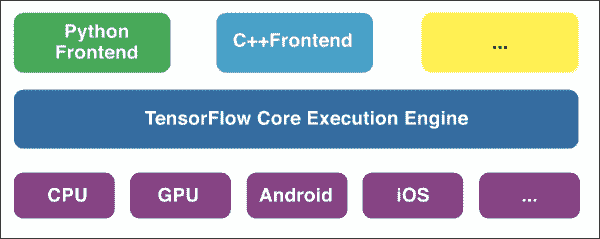
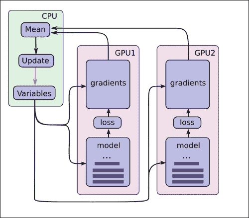
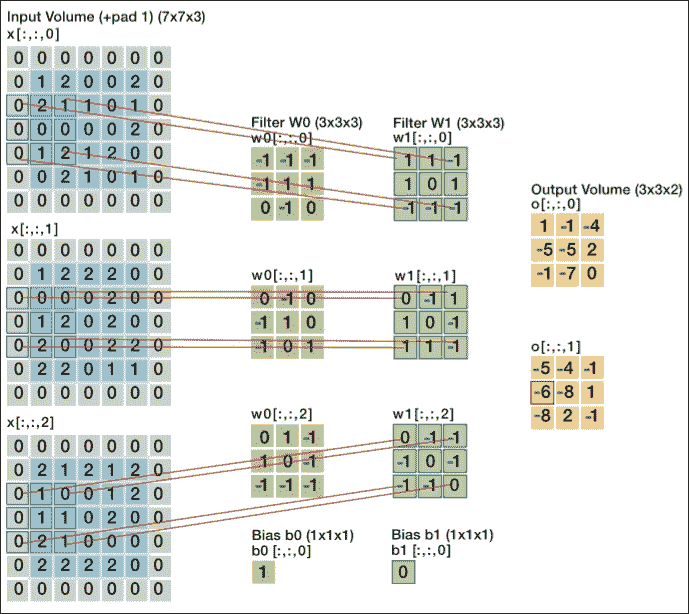
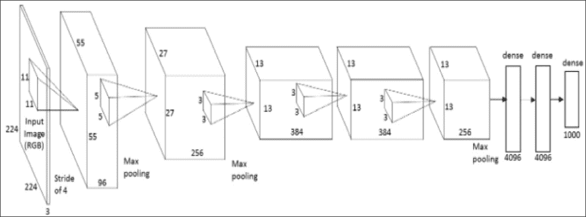

# 第五章。张量流深度学习

在本章中，我们将重点介绍 TensorFlow，并涵盖以下主题:

*   基本张量流运算
*   使用 TensorFlow 从零开始的机器学习—回归、SGD 分类器和神经网络
*   使用 SkFlow 进行深度学习
*   大型文件的增量深度学习
*   带 Keras 的卷积神经网络

TensorFlow 框架是在撰写本书时引入的，并且已经被证明是机器学习领域的一大补充。

TensorFlow 是由谷歌大脑团队发起的，该团队由近十年来从事深度学习重要发展的大多数研究人员(杰弗里·辛顿、萨米·本吉奥等人)组成。它基本上是上一代框架的下一代开发，称为 dist 信仰，是分布式深度神经网络的平台。与 TensorFlow 相反，**diststrust**不是开源的。diststrust 项目成功的有趣例子是反转图像搜索引擎、谷歌深梦和谷歌应用中的语音识别。DistBelief 使谷歌开发人员能够利用数千个内核(包括 CPU 和 GPU)进行分布式训练。

TensorFlow 是对 diststrust 的改进，因为它现在是完全开源的，并且它的编程语言不那么抽象。TensorFlow 声称更灵活，应用范围更广。在撰写本文时(2015 年末)，TensorFlow 框架还处于起步阶段，基于 TensorFlow 构建的有趣的轻量级包已经出现，我们将在本章后面部分看到。

与 Anano 类似，张量流在张量上进行符号计算；这意味着它的大部分计算都是基于向量和矩阵乘法。

常规编程语言定义了**变量**，这些变量包含可以应用操作的值或字符。

在符号编程语言中，如 Anano 或 TensorFlow，操作是围绕图而不是变量来构造的。这具有计算优势，因为它们可以跨计算单元(GPU 和 CPU)分布和并行化:



TensorFlow 的架构于 2015 年 11 月推出

张量流具有以下特征和应用:

*   张量流可以用多个图形处理器并行化(水平)
*   开发框架也可用于移动部署
*   **TensorBoard** 是一个用于可视化的仪表盘(处于早期阶段)
*   它是几种编程语言(Python Go、Java、Lua、JavaScript、R、C++，很快还有 Julia)的前端
*   为 Spark、谷歌云平台([https://cloud.google.com/ml/](https://cloud.google.com/ml/))等大规模解决方案提供集成

类似于图的结构中的张量运算提供了并行计算的新方法(因此谷歌声称)的想法可以通过下面的图片变得非常清楚:



一种基于 TensorFlow 的分布式处理架构

从这张图片中我们可以看到，每个模型都可以分配给单独的图形处理器。之后根据每个模型计算预测的平均值。在其他方法中，这种方法是在 GPU 集群上训练非常大的分布式神经网络的核心思想。

# tensorlow 安装

我们将在本章中使用的 TensorFlow 版本是 0.8，所以请确保您安装了该版本。由于 TensorFlow 正处于重度开发阶段，小的变化是应该的。借助`pip install`，我们可以非常轻松地安装 TensorFlow，而与您使用的操作系统无关:

```py
pip install tensorflow
```

如果您已经安装了以前的版本，您可以根据您的操作系统进行升级:

```py
# Ubuntu/Linux 64-bit, CPU only:
$ sudo pip install --upgrade https://storage.googleapis.com/tensorflow/linux/cpu/tensorflow-0.8.1-cp27-none-linux_x86_64.whl

# Ubuntu/Linux 64-bit, GPU enabled:
$ sudo pip install --upgrade https://storage.googleapis.com/tensorflow/linux/gpu/tensorflow-0.8.1-cp27-none-linux_x86_64.whl

# Mac OS X, CPU only:
$ sudo easy_install --upgrade six
$ sudo pip install --upgrade https://storage.googleapis.com/tensorflow/mac/tensorflow-0.8.1-cp27-none-any.whl
```

现在安装了 TensorFlow，可以在终端进行测试:

```py
$python
import tensorflow as tf
hello = tf.constant('Hello, TensorFlow!')
sess = tf.Session()
print(sess.run(hello))
Output Hello, TensorFlow!
```

## 张量流运算

让我们通过一些简单的例子来感受一下它是如何工作的。

一个重要的区别是，对于 TensorFlow，我们首先需要初始化变量，然后才能对它们应用操作。TensorFlow 在 C++后端运行以执行计算，因此，为了连接到这个后端，我们需要首先实例化一个会话:

```py
x = tf.constant([22,21,32], name='x')
d=tf.constant([12,23,43],name='x')
y = tf.Variable(x * d, name='y')
print(y)
```

不提供 *x*d* 的输出向量，您将看到如下内容:

```py
OUTPUT ]
<tensorflow.python.ops.variables.Variable object at 0x114a95710>
```

为了从 C++后端实际生成提供的计算结果，我们用以下方式实例化会话:

```py
x = tf.constant([22,21,32], name='x')
d=tf.constant([12,23,43],name='d')
y = tf.Variable(x * d, name='y')

model = tf.initialize_all_variables()

with tf.Session() as session:
    session.run(model)
    print(session.run(y))

Output [ 264  483 1376]
```

到目前为止，我们已经直接使用了变量，但是为了更灵活地使用张量运算，如果我们可以将数据分配给一个预先指定的容器，这可能会很方便。这样，我们就可以对计算图执行操作，而无需事先将数据加载到内存中。在 TensorFlow 术语中，我们通过所谓的*占位符*将数据输入到图表中。这正是与安诺语言的相似之处(见[附录](10.html "Appendix A. Introduction to GPUs and Theano")、*图形处理器和安诺*简介)。

这些张量流占位符只是具有某些预先指定的设置和类的对象的容器。因此，为了对一个对象执行操作，我们首先为该对象创建一个占位符，以及它对应的类(在本例中是一个整数):

```py
a = tf.placeholder(tf.int8)
b = tf.placeholder(tf.int8)
sess = tf.Session()
sess.run(a+b, feed_dict={a: 111, b: 222})

Output  77
```

矩阵乘法的工作原理如下:

```py
matrix1 = tf.constant([[1, 2,32], [3, 4,2],[3,2,11]])

matrix2 = tf.constant([[21,3,12], [3, 56,2],[35,21,61]])

product = tf.matmul(matrix1, matrix2)

with tf.Session() as sess:
    result = sess.run(product)
    print result

OUTPUT

[[1147  787 1968]
 [ 145  275  166]
 [ 454  352  711]]
```

有趣的是，对象`result`的输出是一个 NumPy `ndarray`对象，我们可以对 TensorFlow 之外的对象进行操作。

### GPU 计算

如果我们想在图形处理器上执行张量流操作，我们只需要指定一个设备。被警告；这仅适用于安装正确、与 CUDA 兼容的 NVIDIA GPU 单元:

```py
with tf.device('/gpu:0'):
    product = tf.matmul(matrix1, matrix2)
with tf.Session() as sess:
    result = sess.run(product)
    print result
```

如果我们想利用多个图形处理器，我们需要分配一个图形处理器设备给一个特定的任务:

```py
matrix3 = tf.constant([[13, 21,53], [4, 3,6],[3,1,61]])
matrix4 = tf.constant([[13,23,32], [23, 16,2],[35,51,31]])

with tf.device('/gpu:0'):
    product = tf.matmul(matrix1, matrix2)
with tf.Session() as sess:
    result = sess.run(product)
    print result

with tf.device('/gpu:1'):
    product = tf.matmul(matrix3, matrix4)
with tf.Session() as sess:
    result = sess.run(product)
    print result
```

### 用 SGD 进行线性回归

既然我们已经涵盖了基础知识，我们可以开始在 TensorFlow 框架内从头开始编写我们的第一个机器学习算法。稍后，我们将在 TensorFlow 之上的更高抽象中使用更实用的轻量级应用程序。

我们将使用随机梯度下降执行一个非常简单的线性回归，以便了解训练和评估在 TensorFlow 中是如何工作的。首先，我们将创建一些变量来使用，以便在占位符中解析它们来包含这些变量。然后我们将和`y`输入到`cost` 功能中，用梯度下降训练模型:

```py
import tensorflow as tf
import numpy as np

X = tf.placeholder("float") # create symbolic variables
Y = tf.placeholder("float")
X_train = np.asarray([1,2.2,3.3,4.1,5.2])
Y_train =  np.asarray([2,3,3.3,4.1,3.9,1.6])

def model(X, w):
    return tf.mul(X, w)

w = tf.Variable(0.0, name="weights")
y_model = model(X, w) # our predicted values

cost = (tf.pow(Y-y_model, 2)) # squared error cost

train_op = tf.train.GradientDescentOptimizer(0.01).minimize(cost) #sgd optimization
sess = tf.Session()
init = tf.initialize_all_variables()
sess.run(init)

for trials in range(50):  #
    for (x, y) in zip(X_train, Y_train):
        sess.run(train_op, feed_dict={X: x, Y: y})

print(sess.run(w))

OUTPUT ]
0.844732
```

综上所述，我们用 SGD 进行线性回归的方式如下:首先，我们初始化回归权重(系数)，然后在第二步中，我们设置成本函数，以稍后训练和优化梯度下降的函数。最后，我们需要编写一个`for`循环，以指定我们想要的训练回合数，并计算最终预测。相同的基本结构将在神经网络中变得明显。

### 张量流中从头开始的神经网络

现在让我们用张量流语言来执行一个神经网络，并剖析这个过程。

在这种情况下，我们还将使用 Iris 数据集和一些 Scikit-learn 应用程序进行预处理:

```py
import tensorflow as tf
import numpy as np
from sklearn import cross_validation
from sklearn.cross_validation import train_test_split
from sklearn.preprocessing import OneHotEncoder
from sklearn.utils import shuffle
from sklearn import preprocessing
import os
import pandas as pd
from datetime import datetime as dt
import logging

iris = datasets.load_iris()
X = np.asarray(iris.data, 'float32')

Y = iris.target

from sklearn import preprocessing
X= preprocessing.scale(X)
min_max_scaler = preprocessing.MinMaxScaler()
X = min_max_scaler.fit_transform(X)

lb = preprocessing.LabelBinarizer()
Y=lb.fit_transform(iris.target)
```

这是重要的一步。张量流中的神经网络不能处理单个向量中的目标标签。目标标签需要被转换成二进制化的特征(有些人将此称为虚拟变量)，这样神经网络将使用一对所有输出:

```py
X_train, x_test, y_train, y_test = train_test_split(X,Y,test_size=0.3,random_state=22)

def init_weights(shape):
    return tf.Variable(tf.random_normal(shape, stddev=0.01))
```

在这里，我们可以看到前馈通道:

```py
def model(X, w_h, w_o):
    h = tf.nn.sigmoid(tf.matmul(X, w_h))
    return tf.matmul(h, w_o)

X = tf.placeholder("float", [None, 4])
Y = tf.placeholder("float", [None, 3])
```

在这里，我们用一个隐藏层建立了我们的层架构:

```py
w_h = init_weights([4, 4])
w_o = init_weights([4, 3])
py_x = model(X, w_h, w_o)

cost = tf.reduce_mean(tf.nn.softmax_cross_entropy_with_logits(py_x, Y)) # compute costs
train_op = tf.train.GradientDescentOptimizer(learning_rate=0.01).minimize(cost) # construct an optimizer

predict_op = tf.argmax(py_x, 1)

sess = tf.Session()
init = tf.initialize_all_variables()
sess.run(init)

for i in range(500):
    for start, end in zip(range(0, len(X_train),1 ), range(1, len(X_train),1)):
        sess.run(train_op, feed_dict={X: X_train[start:end], Y: y_train[start:end]})
    if i % 100 == 0:
        print i, np.mean(np.argmax(y_test, axis=1) ==
                     sess.run(predict_op, feed_dict={X: x_test, Y: y_test}))

OUTPUT:]
0 0.288888888889
100 0.666666666667
200 0.933333333333
300 0.977777777778
400 0.977777777778
```

该神经网络的精度约为 0.977%，但在次运行中会产生略有不同的结果。它或多或少是具有单一隐藏层和普通 SGD 的神经网络的基准。

就像我们在前面的例子中看到的，实现一个优化方法并设置张量是非常直观的。这比我们在 NumPy 中做同样的事情要直观得多。(参见[第 4 章](04.html "Chapter 4. Neural Networks and Deep Learning")、*神经网络和深度学习*。)目前的缺点是评估和预测需要一个有时很繁琐的`for`循环，而像 Scikit-learn 这样的包可以用一行简单的脚本提供这些方法。幸运的是，在 TensorFlow 的基础上开发了更高级别的包，使得培训和评估变得更加容易。其中一个包是 SkFlow 顾名思义，它是一个基于脚本风格的包装器，就像 Scikit-learn 一样工作。

# 基于 SkFlow 的张量流机器学习

现在我们已经看到了 TensorFlow 的基本操作，让我们深入到构建在 TensorFlow 之上的更高级别的应用中去让机器学习更实用一点。SkFlow 是我们将介绍的第一个应用程序。在 SkFlow 中，我们不必指定类型和占位符。我们可以像使用 Scikit-learn 和 NumPy 一样加载和管理数据。让我们用`pip`安装软件包。

最安全的方法是直接从 GitHub 安装软件包:

```py
$ pip install git+git://github.com/tensorflow/skflow.git
```

SkFlow 有三类主要的学习算法:线性分类器、线性回归和神经网络。线性分类器基本上是一个简单的 SGD(多)分类器，而神经网络是 SkFlow 的强项。它为深度神经网络、递归网络和卷积神经网络提供了相对容易使用的包装器。不幸的是，其他算法，如随机森林、梯度增强、SVM 和朴素贝叶斯还没有实现。然而，在 GitHub 上有关于在 SkFlow 中实现随机森林算法的讨论，该算法可能会被命名为 tf_forest，这是一个令人兴奋的发展。

让我们在 SkFlow 中应用我们的第一个多类分类算法。在这个例子中，我们将使用葡萄酒数据集——一个最初来自 UCI 机器学习存储库的数据集。它由镁、酒精、苹果酸等 13 个连续化学指标组成。这是一个只有 178 个实例的光照数据集和一个有三个类的目标要素。目标变量由三个不同的品种组成。使用十三种化学指标的化学分析，根据各自的品种(用于酿酒的葡萄类型)对葡萄酒进行分类。您可以看到，我们从网址加载数据的方式与我们在 Scikit-learn 环境中工作时的方式相同:

```py
import numpy as np
from sklearn.metrics import accuracy_score
import skflow
import urllib2
url = 'https://www.csie.ntu.edu.tw/~cjlin/libsvmtools/datasets/multiclass/wine.scale'
set1 = urllib2.Request(url)
wine = urllib2.urlopen(set1)

from sklearn.datasets import load_svmlight_file
X_train, y_train = load_svmlight_file(wine)
X_train=X_train.toarray()

from sklearn.cross_validation import train_test_split
X_train, X_test, y_train, y_test = train_test_split(X_train,
y_train, test_size=0.30, random_state=4)

classifier = skflow.TensorFlowLinearClassifier(n_classes=4,learning_rate=0.01, optimizer='SGD',continue_training=True, steps=1000)
classifier.fit(X_train, y_train)
score = accuracy_score(y_train, classifier.predict(X_train))
d=classifier.predict(X_test)
print("Accuracy: %f" % score)

c=accuracy_score(d,y_test)
print('validation/test accuracy: %f' % c)

OUTPUT:
Step #1, avg. loss: 1.58672
Step #101, epoch #25, avg. loss: 1.45840
Step #201, epoch #50, avg. loss: 1.09080
Step #301, epoch #75, avg. loss: 0.84564
Step #401, epoch #100, avg. loss: 0.68503
Step #501, epoch #125, avg. loss: 0.57680
Step #601, epoch #150, avg. loss: 0.50120
Step #701, epoch #175, avg. loss: 0.44486
Step #801, epoch #200, avg. loss: 0.40151
Step #901, epoch #225, avg. loss: 0.36760
Accuracy: 0.967742
validation/test accuracy: 0.981481
```

到现在，这个方法会相当熟悉；这与 Scikit-learn 中的分类器的工作方式基本相同。然而，有两件重要的事情需要注意。使用 SkFlow，我们可以交替使用 NumPy 和 TensorFlow 对象，这样我们就不需要在张量框架中合并和转换对象。这使得通过像 SkFlow 这样的高级方法来使用 TensorFlow 变得更加灵活。要注意的第二件事是，我们将`toarray`方法应用于主数据对象。这是因为数据集非常稀疏(大量零条目)，并且 TensorFlow 不能很好地处理稀疏数据。

神经网络是 TensorFlow 擅长的地方，在 SkFlow 中，训练多层神经网络是非常容易的。让我们对糖尿病数据集执行神经网络。该数据集包含 21 岁以上怀孕女性和皮马遗产的糖尿病指标(二进制目标)诊断特征。亚利桑那州的皮马印第安人是世界上报告的糖尿病患病率最高的人群，因此这个种族群体一直是糖尿病研究的自愿对象。数据集由以下要素组成:

*   怀孕次数
*   口服葡萄糖耐量试验中两小时的血浆葡萄糖浓度
*   舒张压(毫米汞柱)
*   三头肌皮肤褶皱厚度(mm)
*   2 小时血清胰岛素(微克/毫升)
*   体重指数(以千克为单位的体重/(m)^2 的身高)
*   糖尿病谱系功能
*   年龄(岁)
*   类变量(0 或 1)

在本例中，我们首先加载和缩放数据:

```py
import tensorflow
import tensorflow as tf
import numpy as np
import urllib
import skflow
from sklearn.preprocessing import Normalizer
from sklearn import datasets, metrics, cross_validation
from sklearn.cross_validation import train_test_split
# Pima Indians Diabetes dataset (UCI Machine Learning Repository)
url = "http://archive.ics.uci.edu/ml/machine-learning-databases/pima-indians-diabetes/pima-indians-diabetes.data"
# download the file
raw_data = urllib.urlopen(url)
dataset = np.loadtxt(raw_data, delimiter=",")
print(dataset.shape)
X = dataset[:,0:7]
y = dataset[:,8]
X_train, X_test, y_train, y_test = train_test_split(X, y,
                                                    test_size=0.2,
                                                    random_state=0)

from sklearn import preprocessing
X= preprocessing.scale(X)
min_max_scaler = preprocessing.MinMaxScaler()
X = min_max_scaler.fit_transform(X)
```

这一步很有意思；为了使神经网络更好地收敛，我们可以使用更灵活的衰减率。在训练多层神经网络时，随着时间的推移降低学习速率通常是有帮助的。一般来说，当我们的学习率过高时，我们可能会超过最佳值。另一方面，当学习率太低时，我们会浪费计算资源，陷入局部极小值。指数衰减是一种随着时间降低学习速率的方法，这样当学习速率开始接近最小值时，它会变得更加敏感。有三种常见的实现学习率衰减的方法；即阶跃衰减、1/t 衰减和指数衰减:

指数衰减:*a = a<sub>0</sub>e<sup>kt</sup>T5】*

在这种情况下， *a* 为学习率， *k* 为超参数， *t* 为迭代。

在这个例子中，我们将使用指数衰减，因为它似乎对这个数据集非常有效。这就是我们如何实现指数衰减函数(利用张量流的内置`tf.train.exponential_decay`函数):

```py
def exp_decay(global_step):
    return tf.train.exponential_decay(
        learning_rate=0.01, global_step=global_step,
        decay_steps=steps, decay_rate=0.01)
```

我们现在可以在 TensorFlow 神经网络模型中传递衰减函数。对于这个神经网络，我们将提供一个两层网络，第一层由五个单元组成，第二层由四个单元组成。默认情况下，SkFlow 实现 ReLU 激活功能，因为我们比其他功能(tanh、sigmoid 等)更喜欢它，所以我们坚持使用它。

下面这个例子，我们也可以实现随机梯度下降以外的优化算法。让我们基于迪德里克·金马和吉米·巴()的一篇文章，实现一个名为亚当的自适应算法。

亚当，在阿姆斯特丹大学开发，代表自适应力矩估计。在前一章中，我们看到了 ADAGRAD 是如何工作的——随着时间的推移，当梯度向(希望是)全局最小值移动时，通过降低梯度。Adam 也使用自适应方法，但是结合动量训练的思想，其中考虑了先前的梯度更新:

```py
steps = 5000
classifier = skflow.TensorFlowDNNClassifier(
    hidden_units=[5,4],
    n_classes=2,
    batch_size=300,
    steps=steps,
    optimizer='Adam',#SGD  #RMSProp
    learning_rate=exp_decay #here is the decay function
     )
classifier.fit(X_train,y_train)
score1a = metrics.accuracy_score(y_train, classifier.predict(X_train))
print("Accuracy: %f" % score1a)
score1b = metrics.accuracy_score(y_test, classifier.predict(X_test))
print("Validation Accuracy: %f" % score1b)

OUTPUT
(768, 9)
Step #1, avg. loss: 12.83679
Step #501, epoch #167, avg. loss: 0.69306
Step #1001, epoch #333, avg. loss: 0.56356
Step #1501, epoch #500, avg. loss: 0.54453
Step #2001, epoch #667, avg. loss: 0.54554
Step #2501, epoch #833, avg. loss: 0.53300
Step #3001, epoch #1000, avg. loss: 0.53266
Step #3501, epoch #1167, avg. loss: 0.52815
Step #4001, epoch #1333, avg. loss: 0.52639
Step #4501, epoch #1500, avg. loss: 0.52721
Accuracy: 0.754072
Validation Accuracy: 0.740260
```

准确性不是那么有说服力；我们可以通过将**主成分分析** ( **主成分分析**)应用于输入来提高准确性。在 Stavros J Perantonis 和 Vassilis Virvilis 从 1999 年([http://rexa . info/paper/dc4f 2 babc 5c ca 4534 b 435280 AE 32 f 5816 DDB 53 b 0](http://rexa.info/paper/dc4f2babc5ca4534b435280aec32f5816ddb53b0))撰写的这篇文章中，已经提出该糖尿病数据集在传入神经网络之前从 PCA 维度的降低中获益良多。我们将对此数据集使用 Sciket-learn 管道方法:

```py
from sklearn.decomposition import PCA
from sklearn import linear_model, decomposition, datasets
from sklearn.pipeline import Pipeline
from sklearn.metrics import accuracy_score

pca = PCA(n_components=4,whiten=True)

lr = pca.fit(X)
classifier = skflow.TensorFlowDNNClassifier(
    hidden_units=[5,4],
    n_classes=2,
    batch_size=300,
    steps=steps,
    optimizer='Adam',#SGD  #RMSProp
    learning_rate=exp_decay
     )

pipe = Pipeline(steps=[('pca', pca), ('NNET', classifier)])

X_train, X_test, Y_train, Y_test = train_test_split(X, y,
                                                    test_size=0.2,
                                                    random_state=0)
pipe.fit(X_train, Y_train)

score2 = metrics.accuracy_score(Y_test, pipe.predict(X_test))
print("Accuracy Validation, with pca: %f" % score2)

OUTPUT:
Step #1, avg. loss: 1.07512
Step #501, epoch #167, avg. loss: 0.54236
Step #1001, epoch #333, avg. loss: 0.50186
Step #1501, epoch #500, avg. loss: 0.49243
Step #2001, epoch #667, avg. loss: 0.48541
Step #2501, epoch #833, avg. loss: 0.46982
Step #3001, epoch #1000, avg. loss: 0.47928
Step #3501, epoch #1167, avg. loss: 0.47598
Step #4001, epoch #1333, avg. loss: 0.47464
Step #4501, epoch #1500, avg. loss: 0.47712
Accuracy Validation, with pca: 0.805195
```

通过简单的主成分分析预处理步骤，我们已经能够相当大地提高神经网络的性能。我们从七个特征减少到四个维度，因此是四个特征。主成分分析通常通过将特征置零来平滑信号，仅使用包含最高*特征值*的向量来减少特征空间。**白化**确保特征被转换成零相关特征。这导致更平滑的信号和更小的特征集，使得神经网络能够更快地收敛。有关主成分分析的更详细解释，请参见[第 7 章](07.html "Chapter 7. Unsupervised Learning at Scale")、*无监督学习量表*。

## 大文件深度学习——增量学习

到目前为止，我们已经在相对较小的数据集上处理了 SkFlow 上的一些 TensorFlow 操作和机器学习技术。然而这本书讲的是大规模、可扩展的机器学习；在这方面，TensorFlow 框架能为我们提供什么？

直到最近，并行计算还处于起步阶段，不够稳定，不足以在本书中涵盖。没有兼容 CUDA 的 NVIDIA 卡，读者无法访问多 GPU 计算。大型规模的云服务([https://cloud.google.com/products/machine-learning/](https://cloud.google.com/products/machine-learning/))或者亚马逊 EC2 都是有相当可观的费用的。这使得我们只有一种方法可以扩展我们的项目——通过增量学习。

一般来说，任何超过计算机可用内存 25%的文件都会导致内存过载问题。因此，如果您有一台 2 GB 的计算机，并且想要将机器学习解决方案应用于 500 MB 的文件，那么是时候开始考虑绕过内存消耗的方法了。

为了防止内存过载，我们建议使用一种核外学习方法，将数据分解成更小的块，以增量方式训练和更新模型。我们在[第 2 章](02.html "Chapter 2. Scalable Learning in Scikit-learn")、*在 Scikit-learn* 中介绍的部分拟合方法就是这方面的例子。

SkFlow 还为其所有的机器学习模型提供了一种非常棒的增量学习方法，就像 Scikit-learn 中的部分拟合方法一样。在这一节中，我们将逐步使用深度学习分类器，因为我们认为它是最令人兴奋的。

在本节中，我们将为我们的可扩展和核心外深度学习项目使用两种策略；即增量学习和随机子采样。

首先，我们生成一些数据，然后我们构建一个子样本函数，我们可以从该数据集抽取随机子样本，并在这些子集上增量训练深度学习模型:

```py
import numpy as np
import pandas as pd
import skflow
from sklearn.datasets import make_classification
import random
from sklearn.cross_validation import train_test_split
import gc
import tensorflow as tf
from sklearn.metrics import accuracy_score
```

首先，我们将生成一些示例数据并将其写入磁盘:

```py
X, y = make_classification(n_samples=5000000,n_features=10, n_classes=4,n_informative=6,random_state=222,n_clusters_per_class=1)
X_train, X_test, y_train, y_test = train_test_split(X,y, test_size=0.2, random_state=22)

Big_trainm=pd.DataFrame(X_train,y_train)
Big_testm = pd.DataFrame(X_test,y_test)

Big_trainm.to_csv('lsml-Bigtrainm', sep=',')
Big_testm.to_csv('lsml-Bigtestm', sep=',')
```

让我们通过删除所有创建的对象来释放内存。

借助`gc.collect`我们强制 Python 的垃圾收集器清空内存:

```py
del(X,y,X_train,y_train,X_test)
gc.collect
```

在这里，我们创建了一个从磁盘中抽取随机子样本的函数。请注意，我们使用的是⅓.的样本分数我们可以使用较小的分数，但如果这样做，我们还需要调整两个重要的东西。首先，我们需要匹配深度学习模型的批量大小，以便批量大小永远不会超过样本大小。其次，我们需要调整我们的`for`循环中的纪元数量，以确保最大部分的训练数据用于训练模型:

```py
import pandas as pd
import random
def sample_file():
    global skip_idx
    global train_data
    global X_train
    global y_train
    big_train='lsml-Bigtrainm'
```

计算整个集合中的行数:

```py
num_lines = sum(1 for i in open(big_train))
```

我们使用训练集的三分之一:

```py
size = int(num_lines / 3)
```

跳过索引并保留索引:

```py
skip_idx = random.sample(range(1, num_lines), num_lines - size)
train_data = pd.read_csv(big_train, skiprows=skip_idx)
X_train=train_data.drop(train_data.columns[[0]], axis=1)
y_train = train_data.ix[:,0]
```

我们在前面的部分看到了重量衰减；我们将在这里再次使用它:

```py
def exp_decay(global_step):
    return tf.train.exponential_decay(
        learning_rate=0.01, global_step=global_step,
        decay_steps=steps, decay_rate=0.01)
```

这里，我们分别用`5`、`4`和`4`单元建立了三个隐藏层的神经网络 DNN 分类器。请注意，我们将的批量设置为`300`，这意味着我们在每个时期使用 300 个训练案例。这也有助于防止内存过载:

```py
steps = 5000
clf = skflow.TensorFlowDNNClassifier(
    hidden_units=[5,4,4],
    n_classes=4,
    batch_size=300,
    steps=steps,
    optimizer='Adam',
    learning_rate=exp_decay
     )
```

这里，我们将子样本的数量设置为三个(`epochs=3`)。这意味着我们在三个连续的子样本上逐步训练我们的深度学习模型:

```py
epochs=3
for i in range(epochs):
    sample_file()
    clf.partial_fit(X_train,y_train)

test_data = pd.read_csv('lsml-Bigtestm',sep=',')
X_test=test_data.drop(test_data.columns[[0]], axis=1)
y_test = test_data.ix[:,0]
score = accuracy_score(y_test, clf.predict(X_test))
print score

OUTPUT

Step #501, avg. loss: 0.55220
Step #1001, avg. loss: 0.31165
Step #1501, avg. loss: 0.27033
Step #2001, avg. loss: 0.25250
Step #2501, avg. loss: 0.24156
Step #3001, avg. loss: 0.23438
Step #3501, avg. loss: 0.23113
Step #4001, avg. loss: 0.23335
Step #4501, epoch #1, avg. loss: 0.23303
Step #1, avg. loss: 2.57968
Step #501, avg. loss: 0.57755
Step #1001, avg. loss: 0.33215
Step #1501, avg. loss: 0.27509
Step #2001, avg. loss: 0.26172
Step #2501, avg. loss: 0.24883
Step #3001, avg. loss: 0.24343
Step #3501, avg. loss: 0.24265
Step #4001, avg. loss: 0.23686
Step #4501, epoch #1, avg. loss: 0.23681
0.929022
```

我们设法在非常容易管理的训练时间内在测试集上获得了`.929`的准确度，并且没有使我们的记忆超负荷，比我们在整个数据集上一次训练相同的模型要快得多。

# Keras 和 TensorFlow 安装

之前，我们已经看到了用于 TensorFlow 应用程序的 SkFlow 包装器的实际例子。对于神经网络和深度学习的更复杂的方法，我们对参数有更多的控制，我们提出了 Keras([http://keras.io/](http://keras.io/))。这个包最初是在“T4”框架内开发的，但最近也适应了 TensorFlow。这样，我们可以在 TensorFlow 之上使用 Keras 作为更高抽象的包。请记住，在方法上，Keras 比 SkFlow 稍微不那么简单。Keras 既可以在 GPU 上运行，也可以在 CPU 上运行，这使得这个包在移植到不同环境时非常灵活。

让我们首先安装 Keras，并确保它利用了 TensorFlow 后端。

安装工作只需在命令行中使用`pip`:

```py
$pip install Keras

```

Keras 最初是建立在 antao 之上的，所以我们需要指定 Keras 来代替使用 TensorFlow。为了做到这一点，我们首先需要在 Keras 的默认平台 antao 上运行一次。

首先，我们需要运行一些 Keras 代码来确保所有的库项目都被正确安装。让我们训练一个基本的神经网络，并介绍一些关键概念。

为了方便起见，我们将使用由四个特性组成的 Scikit-learn 和由三个类组成的目标变量生成的数据。这些维度非常重要，因为我们需要它们来指定神经网络的架构:

```py
import numpy as np
import keras
from sklearn.datasets import make_classification
from sklearn.cross_validation import train_test_split
from sklearn.preprocessing import OneHotEncoder
from keras.utils import np_utils, generic_utils
from keras.models import Sequential
from keras.layers import Dense, Dropout, Activation
from keras.optimizers import SGD

nb_classes=3
X, y = make_classification(n_samples=1000, n_features=4, n_classes=nb_classes,n_informative=3, n_redundant=0, random_state=101)
```

既然我们已经指定了变量，那么将目标变量转换成一个热编码数组就很重要了(就像我们在 TensorFlow 中所做的那样)。否则，Keras 将无法计算一个与所有目标输出的比较。对于 Keras，我们想用`np_utils`代替 sklearn 的一热编码器。我们将这样使用它:

```py
y=np_utils.to_categorical(y,nb_classes)
print y
```

我们的`y`数组将如下所示:

```py
OUTPUT]
array([[ 1.,  0.,  0.],
       [ 0.,  0.,  1.],
       [ 0.,  0.,  1.],
       …,
```

现在让我们将数据分为测试和训练:

```py
x_train, x_test, y_train, y_test = train_test_split(X, y,test_size=0.30, random_state=222)
```

这是我们开始形成我们心中的神经网络架构的地方。让我们开始一个双隐藏层神经网络，激活`relu`，每个隐藏层有三个单位。我们的第一层有四个输入，因为在这种情况下我们有四个特征。之后，我们添加三个单位的隐藏层，因此(`model.add(dense(3)`)。

就像我们之前看到的，我们将使用`softmax`函数将网络传递到输出层:

```py
model = Sequential()
model.add(Dense(4, input_shape=(4,)))
model.add(Activation('relu'))
model.add(Dense(3))
model.add(Activation('relu'))
model.add(Dense(3))
model.add(Activation('softmax'))
```

首先，我们指定我们的 SGD 函数，在这里我们实现了我们现在熟悉的最重要的参数，即:

*   **lr**:学习率。
*   **衰减**:衰减学习速率的衰减函数。不要将其与权重衰减混淆，权重衰减是一个正则化参数。
*   **动量**:我们用这个来防止陷入局部极小。
*   **nesterov** :这是一个布尔值，它指定我们是否要使用 nesterov 动量，并且仅当我们为动量参数指定了一个整数时才适用。(详见[第四章](04.html "Chapter 4. Neural Networks and Deep Learning")、*神经网络和深度学习*，了解更多详细说明。)
*   **优化器**:这里我们将指定我们选择的优化算法(由 SGD、RMSProp、ADAGRAD、Adadelta 和 Adam 组成)。

让我们看看下面的代码片段:

```py
#We use this for reproducibility 
seed = 22
np.random.seed(seed)

model = Sequential()
model.add(Dense(4, input_shape=(4,)))
model.add(Activation('relu'))
model.add(Dense(3))
model.add(Activation('relu'))
model.add(Dense(3))
model.add(Activation('softmax'))

sgd = SGD(lr=0.01, decay=1e-6, momentum=0.9, nesterov=True)
model.compile(loss='categorical_crossentropy', optimizer=sgd)
model.fit(x_train, y_train, verbose=1, batch_size=100, nb_epoch=50,show_accuracy=True,validation_data=(x_test, y_test))
time.sleep(0.1)
```

在这种情况下，我们使用了`100`的`batch_size`，这意味着我们在每个历元中使用了 100 个训练示例的迷你批次梯度下降。在这个模型中，我们使用了`50`训练时代。这将为您提供以下输出:

```py
OUTPUT:

acc: 0.8129 - val_loss: 0.5391 - val_acc: 0.8000
Train on 700 samples, validate on 300 samples
```

在上一个模型中，我们将 SGD 与 nesterov 一起使用，无论我们对它的训练使用了多少个时代，我们都无法提高我们的分数。

为了增加准确性。建议尝试其他优化算法。我们之前已经成功使用了 Adam 优化方法，那么我们在这里再使用一次，看看能否增加精度。像 Adam 这样的自适应学习率会随着时间的推移而降低学习率，因此需要更多的时期才能达到最佳解决方案。因此，在本例中，我们将纪元的数量设置为 200:

```py
adam=keras.optimizers.Adam(lr=0.01)
model.compile(loss='categorical_crossentropy', optimizer=adam)
model.fit(x_train, y_train, verbose=1, batch_size=100, nb_epoch=200,show_accuracy=True,validation_data=(x_test, y_test))
time.sleep(0.1)

OUTPUT:
Epoch 200/200
700/700 [==============================] - 0s - loss: 0.3755 - acc: 0.8657 - val_loss: 0.4725 - val_acc: 0.8200
```

我们现在已经成功地通过 Adam 优化算法实现了从 0.8 到 0.82 的令人信服的改进。

目前，我们已经介绍了 Keras 中神经网络的最重要的元素。现在让我们继续设置 Keras ，这样它将利用 TensorFlow 框架。默认情况下，Keras 将使用安诺后端。为了指示 Keras 在 TensorFlow 上工作，我们需要首先在 packages 文件夹中找到 Keras 文件夹:

```py
import os
print keras.__file__
```

您的道路可能会有所不同:

```py
Output: /Library/Python/2.7/site-packages/keras/__init__.pyc
```

现在我们已经找到了 Keras 的包文件夹，我们需要寻找`~/.keras/keras.json`文件。

这个文件中有一段脚本如下所示:

```py
{"epsilon": 1e-07, "floatx": "float32", "backend": "theano"}
```

您只需将`"backend":"theano"`更改为`"backend":"tensorflow"`，结果如下:

```py
{"epsilon": 1e-07, "floatx": "float32", "backend": "tensorflow"}
```

如果由于某种原因`.json`文件不在 Keras 文件夹中，即`/Library/Python/2.7/site-packages/keras/`，您可以将其复制粘贴到文本编辑器中:

```py
{"epsilon": 1e-07, "floatx": "float32", "backend": "tensorflow"}
```

保存为`.json`文件，放入`keras`文件夹。

要测试张量流环境是否在张量流中得到正确利用，我们可以键入以下内容:

```py
from keras import backend as K
input = K.placeholder(shape=(4, 4, 5))
# also works:
input = K.placeholder(shape=(None, 2, 5))
# also works:
input = K.placeholder(ndim=2)

OUTPUT:

Using Theano backend.
```

有些用户可能根本没有输出，这很好。你的 TensorFlow 后端应该可以使用了。

# 张量流中的卷积神经网络

在这一章和上一章之间，我们已经走了很长的路，涵盖了深度学习中最重要的主题。我们现在了解如何通过在神经网络中堆叠多层来构建架构，以及如何识别和利用反向传播方法。我们还介绍了使用堆叠式去噪自动编码器进行无监督预处理的概念。深度学习的下一个真正令人兴奋的步骤是**卷积神经网络** ( **CNN** )的快速发展领域，这是一种构建多层、局部连接网络的方法。CNNs，通常被称为**convents**，在撰写本书时发展如此迅速，以至于我们不得不在一个月的时间内重写和更新这一章。在这一章中，我们将涵盖中枢神经系统背后最基本和最重要的概念，这样我们就能够运行一些基本的例子，而不会被有时巨大的复杂性所淹没。然而，我们不能完全公正地对待巨大的理论和计算背景，所以这一段提供了一个实际的起点。

从概念上理解中枢神经系统最好的方法是追溯历史，从一点点认知神经科学开始，看看 Huber 和 Wiesel 对猫视觉皮层的研究。Huber 和 Wiesel 记录了猫视觉皮层的神经激活，同时通过在大脑的视觉皮层插入微电极来测量神经活动。(可怜的猫！)他们这样做的时候，猫正在观看投影在屏幕上的原始形状图像。有趣的是，他们发现某些神经元只对特定方向或形状的轮廓做出反应。这导致了视觉皮层由局部和定向特异性神经元组成的理论。这意味着特定的神经元只对特定方向和形状(三角形、圆形或正方形)的图像做出反应。考虑到猫和其他哺乳动物可以将复杂且不断进化的形状感知为一个连贯的整体，我们可以假设感知是所有这些局部和分层组织的神经元的集合。到那时，第一个多层感知器已经完全开发出来，所以用不了多久，神经元中的局部性和特定灵敏度的想法就在感知器架构中建模出来了。从计算神经科学的角度来看，这个想法被发展成大脑中局部感受区的地图，并增加了选择性连接的层。这被已经在进行的神经网络和人工智能领域所采用。第一位*报道*的科学家是福岛和他的所谓的新神经元(1982)，他将局部特定计算的概念应用于多层感知器。

Yann LeCun 把新神经元的概念发展成了他的版本，叫做 LeNet。增加了梯度下降反向传播算法。这种 LeNet 架构仍然是最近引入的许多更进化的 CNN 架构的基础。像 LeNet 这样的基本 CNN 学习从第一层中的原始像素中检测边缘，然后使用这些边缘来检测第二层中的简单形状，然后在该过程的后期使用这些形状来检测更高级别的特征，例如更高层中的环境中的对象。神经序列的下一层是使用这些高级特征的最终分类器。我们可以在类似这样的 CNN 中看到前馈传递:我们从矩阵输入移动到像素，我们从像素中检测边缘，然后从边缘检测形状，并从形状中检测越来越有特色、越来越抽象和复杂的特征。

### 注

网络中的每个卷积或层都可以接受特定的特征(如形状、角度或颜色)。

更深的层将把这些特征组合成一个更复杂的集合。这样，它可以处理完整的图像，而不会在步骤中用图像的全部输入空间给网络增加负担。

到目前为止，我们只研究了完全连接的神经网络，其中每一层都连接到相邻的每一层。这些网络已经被证明是非常有效的，但是缺点是我们必须训练的参数数量急剧增加。另一方面，我们可能会想象，当我们训练一个小图像(28 x 28)大小时，我们可以摆脱完全连接的网络。然而，在跨越整个 T2 的更大的图像上训练一个完全连接的网络，计算量会非常大。

### 注

总而言之，我们可以说，与全连接神经网络相比，中枢神经系统具有以下优势:

*   它们减少了参数空间，从而防止过度训练和计算负荷
*   中枢神经系统对于物体方向是不变的(想象一下人脸识别对不同位置的人脸进行分类)
*   能够学习和概括复杂多维特征的中枢神经系统
*   神经网络可用于语音识别、图像分类和最近的复杂推荐引擎

中枢神经系统利用所谓的感受野将输入连接到特征地图。了解 CNNs 的最好方法是更深入地了解架构，当然也可以获得实际操作体验。让我们来看看构成中枢神经系统的各种层。美国有线电视新闻网的架构由三种类型的层组成；即卷积层、汇集层和全连接层，其中每层接受输入 3D 体积(h，w，d)，并通过可微函数将其转换为 3D 输出。

## 卷积层

我们可以通过想象一定大小的聚光灯滑过输入(像素值和 RGB 颜色维度)来理解卷积的概念，之后我们可以方便地计算过滤值(也称为面片)和真实输入之间的点积。这做了两件重要的事情:第一，它压缩输入，更重要的是，第二，网络学习过滤器，只有当他们在输入中看到某些特定类型的特征空间位置时，过滤器才会激活。

请看下图，了解这是如何工作的:



处理图像输入的两个卷积层[7x7x3]输入体积:宽度为 7、高度为 7 并且具有三个颜色通道 R、G、B 的图像

从这张图中我们可以看到我们有两级滤波器(W0 和 W1)和输入的三维(以阵列的形式)，所有这些都导致输入矩阵上滑动聚光灯/窗口的点积。我们把这个聚光灯的大小称为*步幅*，意思是步幅越大，输出越小。

如您所见，当我们应用 3×3 过滤器时，过滤器的整个范围都在矩阵的中心进行处理，但是一旦我们靠近或经过边缘，我们就开始在输入的边缘失去优势。在这种情况下，我们应用即所谓的*零填充*。在这种情况下，输入尺寸之外的所有元素都被设置为零。最近，零填充或多或少成为了大多数美国有线电视新闻网应用程序的默认设置。

## 汇集层

下一种类型的层通常位于过滤层之间，称为汇集层或*子采样*层。这样做是沿着空间维度(宽度、高度)执行下采样操作，这反过来又有助于过拟合和减少计算负载。有几种方法可以执行这种下采样，但最近最大池被证明是最有效的方法。

最大池化是一种简单的方法，它通过取相邻要素的一个面片的最大值来压缩要素。下图将阐明这一观点；矩阵中的每个颜色框代表步幅大小为 2:


跨度为 2 的最大池层

使用池层的主要原因如下:

*   减少参数数量，从而减少计算负载
*   正规化

有趣的是，最新的研究结果建议完全省略汇集层，这将导致更好的准确性(尽管代价是对 CPU 或 GPU 造成更大的压力)。

## 全连接层

关于这种类型的层没有太多要解释的。计算分类的最终输出(主要使用 softmax)是一个完全连接的层。然而，在卷积层之间，也有(虽然很少)完全连接的层。

在我们自己申请有线电视新闻网之前，让我们把你到目前为止学到的东西拿来，检查一下有线电视新闻网的架构，以检验我们的理解。当我们查看下图中的 ConvNet 架构时，我们已经可以了解到 ConvNet 会对输入做什么。这个例子是一个名为 AlexNet 的有效卷积神经网络，旨在将 120 万幅图像分类为 1000 类。它被用于 2012 年的 ImageNet 竞赛。ImageNet 是全球最重要的图像分类和本地化比赛，每年都会举办。AlexNet 指的是 Alex Krizhevsky(与 Vinod Nair 和 Geoffrey Hinton 一起)。



AlexNet 架构

当我们查看架构时，我们可以立即看到具有三维深度的输入维度 224 乘以 224。最大池层堆叠的输入中的步长为 4，降低了输入的维度。依次是卷积层。尺寸为 4，096 的两个密集层是完全连接的层，通向我们之前提到的最终输出。

另一方面，我们在前面的一段中提到，张量流的图形计算允许跨图形处理器的并行化。AlexNet 也做了同样的事情；请看下图，了解他们如何跨 GPU 并行化架构:


上图来自[http://www.cs.toronto.edu/~fritz/absps/imagenet.pdf](http://www.cs.toronto.edu/~fritz/absps/imagenet.pdf)。

AlexNet 让不同的模型通过垂直拆分架构来利用 GPU，以便以后合并到最终的分类输出中。中枢神经系统更适合分布式处理，这是本地连接网络相对于完全连接网络的最大优势之一。该模型训练了一组 120 万张图像，在两台 NVIDIA GTX 580 3GB 图形处理器上用了 5 天时间完成。本项目使用了两个多图形处理器单元(总共六个图形处理器)。

# 美国有线电视新闻网采用渐进的方式

既然我们已经对有线电视新闻网的架构有了一个很好的了解，让我们开始应用有线电视新闻网吧。

对于本例，我们将使用著名的 CIFAR-10 人脸图像数据集，该数据集在 Keras 域中非常方便。数据集由 60，000 张 32 x 32 的彩色图像组成，10 个目标类别由飞机、汽车、鸟、猫、鹿、狗、青蛙、马、船和卡车组成。这是一个比用于 AlexNet 示例的数据集更小的数据集。更多信息可以参考[https://www.cs.toronto.edu/~kriz/cifar.html](https://www.cs.toronto.edu/~kriz/cifar.html)。

在这个 CNN 中，我们将使用以下体系结构根据我们指定的 10 个类别对图像进行分类:

`input->convolution 1 (32,3,3)->convolution 2(32,3,3)->pooling->dropout -> Output (Fully connected layer and softmax)`

# GPU 计算

如果你安装了一个兼容 CUDA 的显卡，你可以通过在你的集成开发环境上放置下面的代码来利用你的图形处理器。

```py
import os
os.environ['THEANO_FLAGS'] = 'device=gpu0, assert_no_cpu_op=raise, on_unused_input=ignore, floatX=float32'
```

然而，我们建议首先在您的常规中央处理器上尝试这个例子。

让我们首先导入并准备数据。

我们使用 32 x 32 的输入尺寸，因为这是图像的实际尺寸:

```py
from keras.datasets import cifar10
from keras.preprocessing.image import ImageDataGenerator
from keras.models import Sequential
from keras.layers.core import Dense, Dropout, Activation, Flatten
from keras.layers.convolutional import Convolution2D, MaxPooling2D
from keras.optimizers import SGD
from keras.utils import np_utils

batch_size = 32
nb_classes = 10
nb_epoch = 5 #these are the number of epochs, watch out because it might set your #cpu/gpu on fire.

# input image dimensions
img_rows, img_cols = 32, 32
# the CIFAR10 images are RGB
img_channels = 3

# the data, shuffled and split between train and test sets
(X_train, y_train), (X_test, y_test) = cifar10.load_data()
print('X_train shape:', X_train.shape)
print(X_train.shape[0], 'train samples')
print(X_test.shape[0], 'test samples')

#remember we need to encode the target variable
Y_train = np_utils.to_categorical(y_train, nb_classes)
Y_test = np_utils.to_categorical(y_test, nb_classes)
```

现在，让我们设置我们的 CNN 架构，并根据我们心中的架构构建模型。

对于这个例子，我们将用香草 SGD 和内斯特罗夫动量训练我们的 CNN 模型:

```py
model = Sequential()

#this is the first convolutional layer, we set the filter size
model.add(Convolution2D(32, 3, 3, border_mode='same',
                    	input_shape=(img_channels, img_rows, img_cols)))
model.add(Activation('relu'))
#the second convolutional layer
model.add(Convolution2D(32, 3, 3))
model.add(Activation('relu'))
#here we specify the pooling layer
model.add(MaxPooling2D(pool_size=(2, 2)))
model.add(Dropout(0.25))

#first we flatten the input towards the fully connected layer into the softmax function
model.add(Flatten())
model.add(Dense(512))
model.add(Activation('relu'))
model.add(Dropout(0.2))
model.add(Dense(nb_classes))
model.add(Activation('softmax'))

# let's train the model using SGD + momentum like we have done before.
sgd = SGD(lr=0.01, decay=1e-6, momentum=0.9, nesterov=True)
model.compile(loss='categorical_crossentropy', optimizer=sgd)

X_train = X_train.astype('float32')
X_test = X_test.astype('float32')

#Here we apply scaling to the features
X_train /= 255
X_test /= 255
```

这一步非常重要，因为我们在这里指定美国有线电视新闻网进行增量训练。我们在前面几章(参考[第二章](02.html "Chapter 2. Scalable Learning in Scikit-learn")、*Scikit 中的可伸缩学习-learn* )看到了，在前面一段，在线和增量学习的计算效率。我们可以模拟它的一些属性，并通过使用一个非常小的纪元大小和一个更小的`batch_size`(每个纪元中训练集的一部分)将其应用于中枢神经系统，并在 for 循环中对它们进行增量训练。这样，我们可以给定相同数量的时代，在更短的时间内训练我们的有线电视新闻网，同时对主存储器的负担也更低。我们可以用一个简单的 for 循环实现这个非常强大的想法，如下所示:

```py
for epoch in xrange(nb_epoch):
    model.fit(X_train, Y_train, batch_size=batch_size, nb_epoch=1,show_accuracy=True
              ,validation_data=(X_test, Y_test), shuffle=True)

OUTPUT:]

X_train shape: (50000, 3, 32, 32)
50000 train samples
10000 test samples
Train on 50000 samples, validate on 10000 samples
Epoch 1/1
50000/50000 [==============================] - 1480s - loss: 1.4464 - acc: 0.4803 - val_loss: 1.1774 - val_acc: 0.5785
Train on 50000 samples, validate on 10000 samples
Epoch 1/1
50000/50000 [==============================] - 1475s - loss: 1.0701 - acc: 0.6212 - val_loss: 0.9959 - val_acc: 0.6525
Train on 50000 samples, validate on 10000 samples
Epoch 1/1
50000/50000 [==============================] - 1502s - loss: 0.8841 - acc: 0.6883 - val_loss: 0.9395 - val_acc: 0.6750
Train on 50000 samples, validate on 10000 samples
Epoch 1/1
50000/50000 [==============================] - 1555s - loss: 0.7308 - acc: 0.7447 - val_loss: 0.9138 - val_acc: 0.6920
Train on 50000 samples, validate on 10000 samples
Epoch 1/1
50000/50000 [==============================] - 1587s - loss: 0.5972 - acc: 0.7925 - val_loss: 0.9351 - val_acc: 0.6820
```

我们可以看到我们的美国有线电视新闻网列车最终达到接近 0.7 的验证精度。考虑到我们已经在具有 50，000 个训练示例和 10 个目标类的高维数据集上训练了一个复杂模型，这已经令人满意了。美国有线电视新闻网在这个数据集上可以达到的最大可能分数至少需要 200 个时代。本例提出的方法绝不是的最终结果。这是让你开始使用中枢神经系统的一个相当基本的实现。可以通过添加或移除层、调整批次大小等方式自由进行实验。玩玩参数，感受一下这是如何工作的。

如果你想了解更多卷积层的最新进展，可以看看 **【残留网络】** ( **ResNet** )，这是 CNN 架构上的最新改进之一。

和其他人是 2015 年 ImageNet(ILSVRC)的获奖者。它的特点是一个有趣的架构，使用了一种叫做批处理规范化的方法，一种规范化层之间的特征转换的方法。在 Keras 中有一个批处理规范化函数，您可能想要对其进行实验([http://keras.io/layers/normalization/](http://keras.io/layers/normalization/))。

为了让您全面了解最新一代的氯化萘，您可能需要熟悉以下被发现更有效的氯化萘参数设置:

*   小步幅
*   权重衰减(正则化而不是丢弃)
*   没有辍学
*   中层之间的批处理规范化
*   少到没有预训练(自动编码器和玻尔兹曼机器慢慢退出图像分类的时尚)

另一个有趣的概念是，最近卷积网络被用于图像检测之外的应用。它们用于语言和文本分类、句子补全，甚至推荐系统。一个有趣的例子是 Spotify 的音乐推荐引擎，它基于卷积神经网络。您可以在这里查看更多信息:

*   [http://benane . github . io/2014/08/05/Spotify-CNNs . html](http://benanne.github.io/2014/08/05/spotify-cnns.html)
*   [http://machine learning . wustl . edu/mlpapers/paper _ files/NIPS 2013 _ 5004 . pdf](http://machinelearning.wustl.edu/mlpapers/paper_files/NIPS2013_5004.pdf)

目前，卷积网络用于以下操作:

*   人脸检测(脸书)
*   电影分类(YouTube)
*   语音和文本
*   生成艺术(例如谷歌深度梦境)
*   推荐引擎(音乐推荐—Spotify)

# 总结

在这一章中，我们已经走了很长的路，涵盖了张量流景观及其相应的方法。我们熟悉了如何建立基本的回归器、分类器和单隐层神经网络。尽管编程 TensorFlow 操作相对简单，但对于现成的机器学习任务来说，TensorFlow 可能有点过于繁琐。这正是 SkFlow 的用武之地，它是一个更高级的库，其界面非常类似于 Scikit-learn。对于增量式甚至核外解决方案，SkFlow 提供了一种部分适配的方法，可以轻松设置。其他大规模解决方案要么局限于 GPU 应用，要么处于过早阶段。因此，就目前而言，当涉及到可扩展的解决方案时，我们不得不满足于增量学习策略。

我们还介绍了卷积神经网络，并了解了如何在 Keras 中设置它们。