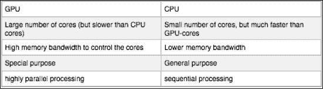

# 附录 a .图形处理器和硬件介绍

到目前为止，我们使用常规的中央处理器执行神经网络和深度学习任务。然而最近，图形处理器的计算优势变得广泛。本章深入探讨了图形处理器的基础知识以及深度学习的人工智能框架。

# GPU 计算

当我们使用常规的 CPU 计算包进行机器学习时，例如 Scikit-learn，并行化的数量惊人地有限，因为默认情况下，即使有多个可用的内核，一个算法也只利用一个内核。在关于**分类回归树** ( **CART** )的章节中，我们会看到一些加速 Scikit-learn 算法的高级例子。

与中央处理器不同，图形处理器单元被设计成从头开始并行工作。想象通过图形卡在屏幕上投影图像；GPU 单元必须能够同时处理和投影大量信息(运动、颜色和空间性)，这并不奇怪。另一方面，CPU 是为顺序处理设计的，适合需要更多控制的任务，如分支和检查。与中央处理器相反，图形处理器由许多可以同时处理数千个任务的内核组成。GPU 可以以更低的成本胜过 CPU 100 倍。另一个优势是，与最先进的中央处理器相比，现代图形处理器相对便宜。

所以这一切听起来很棒，但是请记住，图形处理器只擅长执行特定类型的任务。中央处理器由几个为顺序串行处理而优化的内核组成，而图形处理器由数千个更小、更高效的内核组成，旨在同时处理任务。

中央处理器和图形处理器有不同的体系结构，使它们更适合不同的任务。仍然有很多任务，如检查、调试和切换，由于其体系结构，GPU 无法有效地完成。

了解中央处理器和图形处理器之间区别的一个简单方法是比较它们处理任务的方式。经常做的一个类比是分析和顺序左脑和整体右脑。这只是一个类比，不应该太认真。



在以下链接中查看更多信息:

*   [http://www . NVIDIA . com/object/what-is-GPU-computing . html # th ash . c4r 7 ej3s . dpuf](http://www.nvidia.com/object/what-is-gpu-computing.html#sthash.c4R7eJ3s.dpuf)
*   [http://www . NVIDIA . com/object/what-is-GPU-computing . html # th ash . c4r 7 ej3s . dpuf](http://www.nvidia.com/object/what-is-gpu-computing.html#sthash.c4R7eJ3s.dpuf)

为了利用图形处理器进行机器学习，需要一个特定的平台。遗憾的是，到目前为止，除了 CUDA，还没有稳定的 GPU 计算平台；这意味着您必须在计算机上安装 NVIDIA 图形卡。没有 NVIDIA 卡，图形处理器计算将无法工作。是的，我知道这对大多数苹果用户来说是个坏消息。我真的希望它是不同的，但这是我们必须忍受的限制。还有其他一些项目，比如 OpenCL，通过**BLAS**([https://github.com/clMathLibraries/clBLAS](https://github.com/clMathLibraries/clBLAS)等举措，为其他 GPU 品牌提供 GPU 计算，但这些项目都在繁重的开发中，并且没有针对 Python 中的深度学习应用进行完全优化。OpenCL 的另一个限制是只有 AMD 积极参与，这样才会对 AMD GPUs 有利。在接下来的几年(甚至十年)里，不依赖硬件的机器学习 GPU 应用是没有希望的！).不过，看看 OpenCL 项目([https://www.khronos.org/opencl/](https://www.khronos.org/opencl/)的新闻和动态。考虑到媒体的广泛关注，这种对图形处理器可访问性的限制可能并不令人满意。似乎只有 NVIDIA 将他们的研究工作放在了开发 GPU 平台上，在未来几年内，该领域极不可能出现任何新的重大发展。

对于 CUDA 的使用，您将需要以下东西。

你需要测试你电脑上的显卡是否适合 CUDA。它至少应该是一个 NVIDIA 卡。您可以在终端中用这一行代码测试您的 GPU 是否适用于 CUDA:

```py
$ su
```

现在在根目录下键入您的密码:

```py
$ lspci | grep -i nvidia
```

如果你有一个基于 NVIDIA 的 GNU，你可以下载 NVIDIA CUDA 工具包([http://developer.nvidia.com/cuda-downloads](http://developer.nvidia.com/cuda-downloads))。

在撰写之时，NVIDIA 即将发布 CUDA 8 版本，会有不同的安装程序，建议大家按照 CUDA 网站上的说明进行操作。有关进一步的安装程序，请参考英伟达网站:

[http://docs . NVIDIA . com/cuda/cuda-入门-linux 指南/#axzz3xBimv9ou](http://docs.nvidia.com/cuda/cuda-getting-started-guide-for-linux/#axzz3xBimv9ou)

# 图形处理器上的并行计算

antao 是最初由蒙特利尔大学的詹姆斯·伯格斯特拉开发的 Python 库。它旨在为用符号表示法编写数学函数提供更具表现力的方法(F. Bastien，P. Lamblin，R. Pascanu，J. Bergstra，I. Goodfellow，A. Bergeron，N. Bouchard，d . ward-Farley 和 Y. Bengio。*安诺:新功能和速度提升*。NIPS 2012 深度学习研讨会)。有趣的是，安蒂诺是以希腊数学家 T2 的名字命名的，他可能是毕达哥拉斯的妻子。它的最大优点是快速的 c 编译计算、符号表达式和图形处理器计算，并且正在积极开发中。通过新功能定期进行改进。antao 的实现比可扩展的机器学习要广泛得多，所以我将缩小范围并使用 antao 进行深度学习。更多信息请访问安诺网站—[http://deeplearning.net/software/theano/](http://deeplearning.net/software/theano/)。

当我们想要在多维矩阵上执行更复杂的计算时，基本的 NumPy 将求助于昂贵的循环和迭代，如前所述，这会增加 CPU 负载。安诺的目标是通过将这些计算编译成高度优化的 C 代码，并在可能的情况下利用图形处理器来优化这些计算。对于神经网络和深度学习，人工神经网络具有自动区分数学函数的有用能力，这对于使用反向传播等算法计算偏导数非常方便。

目前，该平台已应用于各种深度学习项目，并成为该领域使用最多的平台。最近，为了让我们更容易地利用深度学习功能，新的软件包已经被建立在 antio 之上。考虑到茶氨酸陡峭的学习曲线，我们将使用基于茶氨酸构建的包，如茶氨酸、派尔恩 2 和千层面。

# 安装天线

首先，确保你从安诺页面安装了开发版本。请注意，如果您执行“$ pip install an ao”，您可能会遇到问题。直接从 GitHub 安装开发版本更安全:

```py
$ git clone git://github.com/Theano/Theano.git
$  pip install Theano
```

如果要升级音频，可以使用以下命令:

```py
$ sudo pip install --upgrade theano
```

如果您有疑问想联系安诺社区，可以参考[https://groups.google.com/forum/#!forum/theano-users](https://groups.google.com/forum/#!forum/theano-users)。

就这样，我们准备出发了！

为了确保我们将目录路径设置为“无”文件夹，我们需要执行以下操作:

```py
#!/usr/bin/python
import cPickle as pickle
from six.moves import cPickle as pickle
import os

#set your path to the theano folder here
path = '/Users/Quandbee1/Desktop/pthw/Theano/'
```

让我们安装所有需要的软件包:

```py
from theano import tensor
import theano.tensor as T
import theano.tensor.nnet as nnet
import numpy as np
import numpy
```

为了让 antio 在 GPU 上工作(如果你安装了 NVIDIA 卡+ CUDA)，我们需要先配置 antio 框架。

通常情况下，NumPy 和 antao 使用双精度浮点格式(`float64`)。然而，如果我们想利用图形处理器来实现运算，就要使用 32 位浮点。这意味着我们必须根据需要在 32 位和 64 位浮点之间更改设置。如果您想查看系统默认使用的配置，请键入以下内容:

```py
print(theano.config.floatX)
output: float64
```

您可以将 GPU 计算的配置更改为 32 位，如下所示:

```py
theano.config.floatX = 'float32'
```

有时通过终端更改设置更为实际。

对于 32 位浮点，键入如下内容:

```py
$ export THEANO_FLAGS=floatX=float32
```

对于 64 位浮点，键入如下内容:

```py
$ export THEANO_FLAGS=floatX=float64
```

如果您希望将某个设置附加到特定的 Python 脚本，您可以这样做:

```py
$ THEANO_FLAGS=floatX=float32 python you_name_here.py
```

如果您想查看您的系统正在使用哪种计算方法，请键入以下内容:

```py
print(theano.config.device)
```

如果要更改特定脚本的所有设置，包括位浮点和计算方法(GPU 或 CPU)，请键入以下内容:

```py
$ THEANO_FLAGS=device=gpu,floatX=float32 python your_script.py
```

这对于测试和编码来说非常方便。你可能不想一直使用图形处理器；有时最好使用 CPU 进行原型制作和草图绘制，并在脚本准备就绪后在 GPU 上运行。

首先，让我们测试一下 GPU 是否适合您的设置。如果您的计算机上没有 NVIDIA GPU 卡，您可以跳过此步骤:

```py
from theano import function, config, shared, sandbox
import theano.tensor as T
import numpy
import time

vlen = 10 * 30 * 768  # 10 x #cores x # threads per core
iters = 1000

rng = numpy.random.RandomState(22)
x = shared(numpy.asarray(rng.rand(vlen), config.floatX))
f = function([], T.exp(x))
print(f.maker.fgraph.toposort())
t0 = time.time()
for i in xrange(iters):
    r = f()
t1 = time.time()
print("Looping %d times took %f seconds" % (iters, t1 - t0))
print("Result is %s" % (r,))
if numpy.any([isinstance(x.op, T.Elemwise) for x in f.maker.fgraph.toposort()]):
    print('Used the cpu')
else:
    print('Used the gpu')
```

既然我们已经知道了如何配置茶诺，让我们通过一些简单的例子来看看它是如何工作的。基本上，每段安诺代码都由相同的结构组成:

1.  在类中声明变量的初始化部分。
2.  形成函数的编译。
3.  函数应用于数据类型的执行。

让我们在向量计算和数学表达式的一些基本例子中使用这些原理:

```py
#Initialize a simple scalar 
x = T.dscalar()

fx = T.exp(T.tan(x**2)) #initialize the function we want to use.

type(fx)            #just to show you that fx is a theano variable type

#Compile create a tanh function
f = theano.function(inputs=[x], outputs=[fx])

#Execute the function on a number in this case

f(10)
```

正如我们之前提到的，我们可以用 Anano 来表示数学表达式。看看这个例子，我们使用了一个强大的名为*自动分化*的 antio 特性，这个特性对于反向传播非常有用:

```py
fp = T.grad(fx, wrt=x)
fs= theano.function([x], fp)

fs(3)

output:] 4.59
```

现在我们已经理解了使用变量和函数的方式，让我们执行一个简单的逻辑函数:

```py
#now we can apply this function to  matrices as well  
x = T.dmatrix('x')
s = 1 / (1 + T.exp(-x))
logistic = theano.function([x], s)
logistic([[2, 3], [.7, -2],[1.5,2.3]])

output:
array([[ 0.88079708,  0.95257413],
       [ 0.66818777,  0.11920292],
       [ 0.81757448,  0.90887704]])
```

我们可以清楚地看到，与 NumPy 相比，antio 提供了更快的方法将函数应用于数据对象。