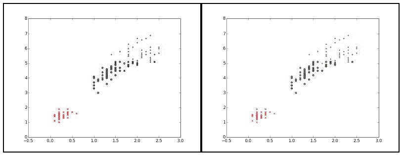
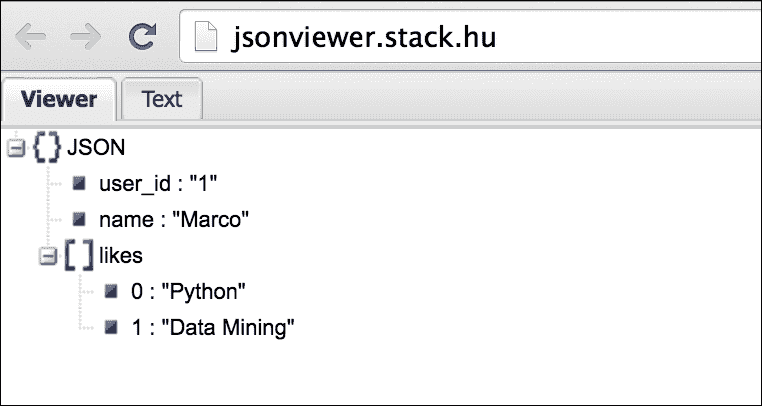

# 第一章。社交媒体、社交数据和 Python

这本书是关于使用 *Python* 将*数据挖掘*技术应用到*社交媒体*的。前一句中突出的三个关键词帮助我们定义了这本书的预期读者:任何对探索这三个主题交汇的领域感兴趣的开发人员、工程师、分析师、研究员或学生。

在本章中，我们将涵盖以下主题:

*   社交媒体和社交数据
*   从社交媒体中挖掘数据的整个过程
*   设置 Python 开发环境
*   用于数据科学的 Python 工具
*   用 Python 处理数据

# 开始

2015 年第二季度，脸书报告了近 15 亿月活跃用户。2013 年，推特报道每天有 5 亿多条推文。规模较小，但肯定是本书读者感兴趣的，2015 年，Stack Overflow 宣布，自网站开通以来，他们的平台上已有超过 1000 万个编程问题被提问。

当描述随着越来越多的用户通过不同平台分享越来越多的信息，社交媒体的受欢迎程度如何呈指数级增长时，这些数字只是冰山一角。这些丰富的数据为数据挖掘从业者提供了独特的机会。这本书的目的是通过使用社交媒体 API 来引导读者收集可以用 Python 工具分析的数据，以便对用户如何在社交媒体上进行交互产生有趣的见解。

本章为初步讨论社交媒体挖掘中的挑战和机遇奠定了基础，并介绍了将在以下章节中使用的一些 Python 工具。

# 社交媒体——挑战与机遇

在传统媒体中，用户通常只是消费者。信息朝一个方向流动:从出版商到用户。社交媒体打破了这种模式，让每个用户同时成为消费者和发布者。很多学术刊物都是以此为题，目的是定义*社交媒体*这个名词到底是什么意思(比如*全世界的用户，团结起来！社交媒体的挑战与机遇*，*安德烈亚斯·m·卡普兰*，*迈克尔·海恩林*， *2010* 。不同社交媒体平台之间最常共享的方面如下:

*   基于互联网的应用
*   用户生成的内容
*   建立工作关系网

社交媒体是基于互联网的应用。很明显，互联网和移动技术的进步促进了社交媒体的发展。通过你的手机，你实际上可以立即连接到一个社交媒体平台，发布你的内容，或者赶上最新的新闻。

社交媒体平台由用户生成的内容驱动。与传统媒体模式相反，每个用户都是潜在的出版商。更重要的是，任何用户都可以通过像按钮一样的*来分享内容、评论或表达积极的评价(有时也称为向上投票或竖起大拇指)，从而与其他用户互动。*

社交媒体是关于网络的。如上所述，社交媒体是关于用户与其他用户的互动。连接是大多数社交媒体平台的核心概念，你通过*新闻源*或*时间线*消费的内容是由你的连接驱动的。

由于这些主要功能在多个平台中占据核心地位，社交媒体被用于多种目的:

*   与朋友和家人保持联系(例如，通过脸书)
*   微博和了解最新消息(例如，通过推特)
*   与您的专业网络保持联系(例如，通过 LinkedIn)
*   共享多媒体内容(例如，通过 Instagram、YouTube、Vimeo 和 Flickr)
*   寻找问题的答案(例如，通过堆栈溢出、堆栈交换和 Quora)
*   查找和组织感兴趣的项目(例如，通过 Pinterest)

这本书旨在回答一个中心问题:如何从来自社交媒体的数据中提取有用的知识？退一步说，我们需要定义什么是*知识*什么是*有用*。

传统的知识定义来自信息科学。知识的概念通常被描绘成金字塔的一部分，有时被称为**知识层次**，它以数据为基础，以信息为中间层，以知识为顶层。下图显示了这种知识层次结构:


图 1.1:从原始数据到语义知识

攀登金字塔意味着从原始数据中提炼知识。从原始数据到提炼知识的旅程经历了语境和意义的整合。随着我们爬上金字塔，我们构建的技术对原始数据有了更深的理解，更重要的是，对生成这些数据的用户有了更深的理解。换句话说，它变得更加有用。

在这种情况下，有用的知识意味着*可操作的*知识，即使决策者能够实施业务战略的知识。作为这本书的读者，你将理解从社会数据中提取价值的关键原则。了解用户如何通过社交媒体平台进行互动是这一旅程的关键方面之一。

以下部分列出了从社交媒体平台挖掘数据的一些挑战和机遇。

## 机会

开发数据挖掘系统的关键机会是*从数据中提取有用的见解*。该过程的目的是使用数据挖掘技术来回答有趣(有时是困难)的问题，以丰富我们对特定领域的知识。例如，在线零售店可以应用数据挖掘来了解他们的顾客如何购物。通过这种分析，他们能够向客户推荐产品，这取决于他们的购物习惯(例如，购买项目 A 的用户也购买项目 B)。总的来说，这将带来更好的客户体验和满意度，反过来也能产生更好的销量。

不同领域的许多组织可以应用数据挖掘技术来改进他们的业务。一些例子包括:

*   银行业:
    *   确定忠实客户，为他们提供独家促销
    *   识别欺诈交易模式以降低成本
*   医学:
    *   了解患者行为以预测手术就诊
    *   支持医生根据患者的病史确定成功的治疗方法

*   零售:
    *   了解购物模式以改善客户体验
    *   通过更好的针对性提高营销活动的有效性
    *   分析实时交通数据，找到最快的食物运送路线

那么它是如何转化到社交媒体领域的呢？问题的核心在于用户如何通过社交媒体平台分享他们的数据。组织不再局限于分析他们直接收集的数据，他们可以访问更多的数据。

这种数据收集的解决方案是通过精心设计的语言无关的 API 实现的。事实上，社交媒体平台的一个常见做法是向希望将其应用程序与特定社交媒体功能集成的开发人员提供网络应用编程接口。

### 注

**应用编程接口**

应用程序编程接口 ( **应用编程接口**)是一组过程定义和协议，根据允许的操作、输入和输出来描述软件组件(如库或远程服务)的行为。当使用第三方应用编程接口时，开发人员不需要担心组件的内部，只需要担心他们如何使用它。

对于网络应用编程接口这个术语，我们指的是一个向公众公开多个 URIs 的网络服务，可能在一个身份验证层之后，以访问数据。设计这种 API 的一种常见的架构方法叫做**表示状态转移** ( **REST** )。实现 REST 架构的应用编程接口叫做 **RESTful 应用编程接口**。我们仍然更喜欢通用术语网络应用编程接口，因为许多现有的应用编程接口并不严格遵循 REST 原则。就本书而言，不需要对 REST 架构有深刻的理解。

## 挑战

社交媒体挖掘的一些挑战来自更广泛的数据挖掘领域。

在处理社交数据时，我们经常会处理**大数据**。要理解大数据的含义及其带来的挑战，我们可以回到传统定义( *3D 数据管理:控制数据量、速度和变化*、*道格·兰尼*、 *2001* )也就是所谓的*大数据的三个 Vs*:量、变化和速度。多年来，这一定义也通过增加更多的 Vs 得到了扩展，最显著的是价值，因为为组织提供价值是利用大数据的主要目的之一。关于最初的三个 Vs，*卷*意味着处理跨越多台机器的数据。当然，这需要与小型数据处理不同的基础设施(例如，内存)。此外，从数据增长如此之快以至于*大*的概念成为一个移动目标的意义上来说，体积也与*速度*相关联。最后，*变体*关注数据如何以不同的格式和结构呈现，它们之间通常不兼容，并且具有不同的语义。来自社交媒体的数据可以检查所有三个 Vs。

大数据的兴起推动了数据库技术新方法的发展，使之成为一个名为 NoSQL 的系统家族。该术语是多个数据库范例的总称，这些范例都具有远离传统关系数据的共同特征，促进了动态模式设计。虽然这本书不是关于数据库技术的，但从这个领域，我们仍然可以理解处理结构化、非结构化和半结构化数据的需要。短语*结构化数据*是指组织良好且通常以表格形式呈现的信息。因此，与关系数据库的连接是即时的。下表显示了书店销售的图书的结构化数据示例:

<colgroup><col> <col> <col></colgroup> 
| **标题** | 型 | **价格** |
| One thousand nine hundred and eighty-four | 政治小说 | Twelve |
| 战争与和平 | 战争小说 | Ten |

这种数据是结构化的，因为每个表示的项目都有一个精确的组织，具体来说，有三个属性，称为标题、流派和价格。

结构化数据的反面是非结构化数据，即没有预定义数据模型的信息，或者根本没有按照预定义数据模型组织的信息。非结构化数据通常是文本数据的形式，例如电子邮件、文档、社交媒体帖子等。贯穿本书的技术可以用来提取非结构化数据中的模式，以提供某种结构。

在结构化和非结构化数据之间，我们可以找到半结构化数据。在这种情况下，结构要么是灵活的，要么不是完全预定义的。它有时也被称为自描述结构。半结构化数据格式的一个典型例子是 JSON。顾名思义，JSON 借用了编程语言 JavaScript 的符号。这种数据格式已经变得非常流行，因为它被广泛用作 web 应用程序中客户机和服务器之间交换数据的一种方式。下面的代码片段显示了扩展上一本书数据的 JSON 表示的一个例子:

```py
[ 
  { 
    "title": "1984", 
    "price": 12, 
    "author": "George Orwell", 
    "genre": ["Political fiction", "Social science fiction"] 
  }, 
  { 
    "title": "War and Peace", 
    "price": 10, 
    "genre": ["Historical", Romance", "War novel"] 
  } 
] 

```

从这个例子我们可以观察到，第一本书有`author`属性，而第二本书没有这个属性。此外，`genre`属性在此显示为一个列表，具有可变数量的值。在结构良好的(关系)数据格式中，这两个方面通常都会被避免，但在 JSON 中完全可以，在处理半结构化数据时更是如此。

对结构化和非结构化数据的讨论转化为以不同的方式处理不同的数据格式和处理数据完整性。短语**数据完整性**用于捕获来自脏数据、不一致数据或不完整数据的挑战组合。

在分析用户生成的内容时，数据不一致和不完整的情况非常常见，这需要引起注意，尤其是来自社交媒体的数据。几乎以正式的方式有条不紊地分享数据的用户是非常罕见的。相反，社交媒体往往由非正式环境组成，存在一些矛盾。例如，如果用户想在公司的脸书页面上投诉某个产品，用户首先需要像页面本身一样*，这与因为某个公司的产品质量差而对其不满是完全相反的。了解用户在社交媒体平台上的互动方式对于设计一个好的分析至关重要。*

 *开发数据挖掘应用还需要我们考虑与**数据访问**相关的问题，尤其是当公司政策转化为缺乏数据进行分析时。换句话说，数据并不总是公开的。上一段讨论了在社交媒体挖掘中，与其他公司环境相比，这是一个不太重要的问题，因为大多数社交媒体平台都提供了精心设计的语言无关的 API，允许我们访问所需的数据。当然，这些数据的可用性仍然取决于用户如何共享他们的数据，以及他们如何授予我们访问权限。例如，脸书用户可以决定可以在他们的公共个人资料中显示的详细程度，以及只能向他们的朋友显示的详细程度。个人资料信息，如生日、当前位置和工作经历(以及更多)，都可以单独标记为私有或公共。同样，当我们试图通过脸书应用编程接口访问这些数据时，注册我们应用程序的用户有机会只允许我们访问我们要求的数据的有限子集。

数据挖掘的最后一个一般挑战在于理解数据挖掘过程本身并能够解释它。换句话说，在我们开始分析数据之前提出正确的问题并不总是简单的。更多的时候，**研发** ( **R & D** )流程是由探索性分析驱动的，也就是说，为了理解如何解决问题，我们首先需要开始篡改它。统计学中一个相关的概念是由短语*描述的，相关性并不意味着因果关系*。许多统计检验可以用来建立两个变量之间的相关性，即两个事件一起发生，但这不足以建立两个方向的因果关系。奇怪关联的有趣例子在网上随处可见。一个流行的案例发表在最著名的医学期刊之一《新英格兰医学杂志》上，显示了人均巧克力消费量与诺贝尔奖授予价格之间的有趣相关性(*巧克力消费、认知功能，以及诺贝尔奖获得者*、*弗朗茨·h·梅瑟利*、 *2012* )。

在执行探索性分析时，一定要记住相关性(两个事件一起发生)是双向关系，而因果关系(事件 A 导致了事件 B)是单向关系。是巧克力让你更聪明，还是聪明人比一般人更喜欢巧克力？这两件事是偶然发生的吗？是否有第三个尚未被发现的变量在相关性中扮演了某种角色？简单地观察一个相关性不足以描述因果关系，但对我们正在观察的数据提出重要问题通常是一个有趣的起点。

以下部分概括了我们的应用程序与社交媒体应用编程接口交互并执行所需分析的方式。

## 社交媒体挖掘技术

本节简要讨论构建社交媒体挖掘应用程序的整个过程，然后在接下来的章节中深入探讨细节。

该过程可以总结为以下步骤:

1.  证明
2.  数据收集
3.  数据清理和预处理
4.  建模和分析
5.  结果展示

*图 1.2* 显示了流程概述:


图 1.2:社交媒体挖掘的整体流程

认证步骤通常使用名为**开放授权** ( **开放授权**)的行业标准来执行。这个过程是*三条腿*，意思是它涉及三个参与者:用户、消费者(我们的应用程序)和资源提供者(社交媒体平台)。流程中的步骤如下:

1.  用户同意消费者授予对社交媒体平台的访问权。
2.  由于用户不直接将他们的社交媒体密码给消费者，消费者与资源提供者进行初始交换以生成令牌和秘密。这些用于签署每个请求并防止伪造。
3.  然后，用户将使用令牌重定向到资源提供者，资源提供者将要求确认授权消费者访问用户的数据。
4.  根据社交媒体平台的性质，它还会要求确认消费者是否可以代表用户执行任何操作，例如发布更新、共享链接等。
5.  资源提供者为使用者颁发有效的令牌。
6.  然后，令牌可以返回给确认访问的用户。

*图 1.3* 显示了 OAuth 过程，并参考了前面描述的每个步骤。需要记住的一点是，凭据(用户名/密码)的交换只在用户和资源提供者之间通过步骤 **3** 和 **4** 进行。所有其他交换都由令牌驱动:


图 1.3:OAuth 流程

从用户的角度来看，这个看似复杂的过程发生在用户访问我们的网络应用程序，点击**用脸书**(或推特、谷歌+等)登录按钮的时候。然后用户必须确认他们正在授予我们的应用程序权限，对他们来说一切都在幕后发生。

从开发人员的角度来看，好的一面是 Python 生态系统已经为大多数社交媒体平台建立了完善的库，这些库伴随着身份验证过程的实现。作为开发人员，一旦您向目标服务注册了应用程序，平台就会为您的应用程序提供必要的授权令牌。*图 1.4* 显示了一个名为**文本挖掘介绍**的定制推特应用的截图。在**密钥和访问令牌**配置页面，开发者可以找到 API 密钥和秘密，以及访问令牌和访问令牌秘密。我们将在相关章节中讨论每个社交媒体平台的授权细节:


图 1.4:名为文本挖掘介绍的推特应用程序的配置页面。该页面包含开发人员在其应用程序中使用的所有授权令牌。

数据收集、清理和预处理步骤也取决于我们正在处理的社交媒体平台。特别是，数据收集步骤与初始授权相关联，因为我们只能下载已被授权访问的数据。另一方面，清理和预处理对于我们决定用来对数据产生见解的数据建模和分析类型是起作用的。

回到*图 1.2* ，建模和分析由标记为**分析引擎**的组件执行。我们将在本书中遇到的典型数据处理任务是文本挖掘和图形挖掘。

**文本挖掘**(也称为文本分析)是从非结构化文本数据中导出结构化信息的过程。文本挖掘适用于大多数社交媒体平台，因为用户可以以帖子或评论的形式发布内容。

文本挖掘应用程序的一些示例包括:

*   **文档分类**:这是将文档分配到一个或多个类别的任务
*   **文档聚类**:这是将文档分组为连贯且彼此不同的子集(称为聚类)的任务(例如，按主题或子主题)
*   **文档摘要**:这是创建文档的缩短版本的任务，目的是减少用户的信息过载，同时仍然保留原始来源中描述的最重要的方面
*   **实体提取**:这是将文本中的实体引用定位和分类到一些期望的类别中的任务，例如人员、位置或组织
*   **情绪分析**:这是对文本中表达的情绪和观点进行识别和分类的任务，目的是了解对特定产品、话题、服务等的态度

并非所有这些应用程序都是为社交媒体量身定制的，但通过这些平台获得的文本数据量越来越大，这使得社交媒体成为文本挖掘的天然游乐场。

**图挖掘**也是关注数据的结构。图形是一种简单易懂但功能强大的数据结构，它足够通用，可以应用于许多不同的数据表示。在图中，有两个主要组件需要考虑:节点，表示实体或对象；边，表示节点之间的关系或连接。在社交媒体的背景下，图的明显用途是代表我们用户的社交关系。更一般地说，在社会科学中，用于表示社会关系的图结构也被称为社会网络。

在社交媒体中使用这样的数据结构，我们自然可以将用户表示为节点，将他们的关系(如的*好友或*的关注者*)表示为边。这样，像喜欢 Python 的朋友的*朋友这样的信息只需遍历图形(即，沿着边从一个节点走到另一个节点)就变得很容易访问。图论和图挖掘提供了更多的选项来发现不像前面的例子那样清晰可见的更深刻的见解。**

在对社交媒体挖掘进行了高级别讨论后，下一节将介绍数据挖掘项目中常用的一些有用的 Python 工具。

# 数据科学的 Python 工具

到目前为止，我们一直在使用术语数据挖掘来指代我们将在本书中应用的问题和技术。这一节的标题，其实提到了术语*数据科学*。近年来，这个词的使用激增，尤其是在商业环境中，而许多学者和记者也批评它是一个时髦词。与此同时，其他学术机构也开始开设数据科学课程，并出版了许多关于这一主题的书籍和文章。我们不会对不同学科之间的界限有强烈的看法，而是局限于观察如今人们对多个领域的普遍兴趣，包括数据科学、数据挖掘、数据分析、统计学、机器学习、人工智能、数据可视化等等。我们讨论的话题本质上都是跨学科的，而且都是时不时互相借鉴。这当然是一个在这些领域工作的令人惊讶的时刻，公众对此非常感兴趣，有趣的项目也不断有新的进展。

本节的目的是介绍 Python 作为数据科学的工具，并描述我们将在接下来的章节中使用的 Python 生态系统的一部分。

Python 是数据分析项目中最有趣的语言之一。以下是使其适合特定用途的一些原因:

*   声明性和直观的语法
*   丰富的数据处理生态系统
*   效率

由于 Python 优雅的语法，它的学习曲线很浅。作为一种动态的解释语言，它有助于快速开发和交互式探索。数据处理的生态系统将在下面的章节中进行部分描述，这些章节将介绍我们将在本书中使用的主要包。

就效率而言，解释语言和高级语言并不以速度极快而闻名。像 NumPy 这样的工具通过在幕后连接到低级库，并公开友好的 Python 界面来实现效率。此外，许多项目使用 **Cython** ，这是 Python 的超集，通过允许定义强变量类型和编译成 c 语言来丰富语言。Python 世界中的许多其他项目正在解决效率问题，总体目标是使纯 Python 实现更快。在本书中，我们不会深入研究 Cython 或任何这些有前途的项目，但我们将利用 NumPy(尤其是通过使用 NumPy 的其他库)进行数据分析。

## Python 开发环境设置

当这本书开始的时候，Python 3.5 刚刚发布，它的一些最新特性受到了一些关注，比如对异步编程的改进支持和类型提示的语义定义。就用法而言，Python 3.5 可能还没有被广泛使用，但它代表了该语言当前的发展路线。

### 注

本书中的示例与 Python 3 兼容，尤其是 3.4+和 3.5+版本。

在关于 Python 2 和 Python 3 之间选择的永无止境的讨论中，需要记住的一点是，对 Python 2 的支持将在几年后被打消(在撰写本文时，日落日期是 2020 年)。Python 2 中没有开发新特性，因为这个分支只用于错误修复。另一方面，很多库还是先为 Python 2 开发，后来才增加了对 Python 3 的支持。由于这个原因，有时在某些库的兼容性方面可能会出现小问题，这通常会被社区很快解决。一般来说，如果没有强烈的理由反对这种选择，首选应该是 Python 3，尤其是对于新的绿地项目。

### pip 和 virtualenv

为了保持开发环境的干净，并方便从原型到生产的过渡，建议使用`virtualenv`来管理虚拟环境并安装依赖项。`virtualenv`是一个用于创建和管理隔离的 Python 环境的工具。通过使用隔离的虚拟环境，开发人员避免了用可能彼此不兼容的库污染全局 Python 环境。这些工具允许我们维护需要不同配置的多个项目，并轻松地从一个项目切换到另一个项目。此外，虚拟环境可以安装在没有管理权限的用户可以访问的本地文件夹中。

要在全局 Python 环境中安装`virtualenv`以使其对所有用户可用，我们可以从终端(Linux/Unix)或命令提示符(Windows)使用`pip`:

```py
$ [sudo] pip install virtualenv

```

如果我们当前的用户在系统上没有管理员权限，那么`sudo`命令在 Linux/Unix 或 macOS 上可能是必需的。

如果已经安装了软件包，可以将其升级到最新版本:

```py
$ pip install --upgrade [package name] 

```

### 注

从 Python 3.4 开始，`pip`工具随 Python 一起发货。之前的版本需要单独安装`pip`，如项目页面上所述([https://github.com/pypa/pip](https://github.com/pypa/pip))。该工具还可用于将自身升级到最新版本:

```py
$ pip install --upgrade pip

```

一旦`virtualenv`是全局可用的，对于每个项目，我们可以定义一个单独的 Python 环境，其中依赖项被隔离安装，而不会篡改全局环境。这样，跟踪单个项目所需的依赖关系就变得非常容易。

要设置虚拟环境，请执行以下步骤:

```py
$ mkdir my_new_project # creat new project folder
$ cd my_new_project # enter project folder
$ virtualenv my_env # setup custom virtual environment

```

这将在当前目录中创建一个`my_env`子文件夹，这也是我们正在创建的虚拟环境的名称。在这个子文件夹中，我们有所有必要的工具来创建独立的 Python 环境，包括 Python 二进制文件和标准库。为了激活环境，我们可以键入以下命令:

```py
$ source my_env/bin/activate

```

一旦环境处于活动状态，提示中将显示以下内容:

```py
(my_env)$

```

可以使用`pip`为该特定环境安装 Python 包:

```py
(my_env)$ pip install [package-name]

```

环境激活时所有安装`pip`的新 Python 库都会安装到`my_env/lib/python{VERSION}/site-packages`中。请注意，作为一个本地文件夹，我们不需要管理权限来执行这个命令。

当我们想要停用虚拟环境时，我们可以简单地键入以下命令:

```py
$ deactivate

```

前面描述的过程应该适用于随操作系统一起提供(或可供下载)的官方 Python 发行版。

### Conda、Anaconda 和 Miniconda

还有一个选项需要考虑，叫做**conda**([http://conda.pydata.org/](http://conda.pydata.org/))，它在科学界获得了一些吸引力，因为它使得依赖管理变得非常容易。Conda 是一个开源的软件包管理器和环境管理器，用于安装多个版本的软件包(以及相关的依赖关系)，这使得从一个版本切换到另一个版本变得很容易。它支持 Linux、macOS 和 Windows，虽然最初是为 Python 创建的，但它可以用来打包和分发任何软件。

conda 附带的发行版主要有两个:包含电池的版本 Anaconda，它附带了大约 100 个已经安装的科学计算软件包，以及轻量级版本 Miniconda，它只附带 Python 和 conda 安装程序，没有外部库。

如果您是 Python 新手，有一些时间进行更大的下载并腾出磁盘空间，并且不想手动安装所有软件包，您可以开始使用 Anaconda。对于 Windows 和 macOS，Anaconda 提供了图形或命令行安装程序。*图 1.5* 显示了 macOS 上安装过程的屏幕截图。对于 Linux，只有命令行安装程序可用。在所有情况下，都可以在 Python 2 和 Python 3 之间进行选择。如果您希望完全控制您的系统，Miniconda 可能是您最喜欢的选择:


图 1.5:Anaconda 安装的屏幕截图

安装完 conda 版本后，为了创建新的 conda 环境，可以使用以下命令:

```py
$ conda create --name my_env python=3.4 # or favorite version

```

可以使用以下命令激活环境:

```py
$ conda activate my_env

```

类似于`virtualenv`发生的情况，环境名称将在提示中可见:

```py
(my_env)$

```

可以使用以下命令为此环境安装新软件包:

```py
$ conda install [package-name]

```

最后，您可以通过键入以下命令来停用环境:

```py
$ conda deactivate

```

conda 的另一个很好的特性是也可以从 pip 安装包，所以如果一个特定的库不能通过`conda install`获得，或者它没有被更新到我们需要的最新版本，我们总是可以在使用 conda 环境时回到传统的 Python 包管理器。

如果没有特别说明，默认情况下，conda 会在[https://anaconda.org](https://anaconda.org)上查找包裹，而`pip`则使用位于[https://pypi.python.org/pypi](https://pypi.python.org/pypi)的 **Python 包裹索引** ( **PyPI** 简称 **CheeseShop** )。也可以指示两个安装程序从本地文件系统或私有存储库中安装软件包。

以下部分将使用`pip`来安装所需的软件包，但是如果您喜欢使用这种替代方法，您可以轻松切换到 conda。

## 高效的数据分析

本节介绍科学巨蟒的两个基础包: **NumPy** 和**熊猫**。

NumPy(数值 Python)提供快速高效的处理或类似数组的数据结构。对于数字数据，使用 Python 内置(例如，列表或字典)存储和操作数据比使用 NumPy 数组要慢得多。此外，NumPy 数组经常被其他库用作需要矢量化操作的不同算法的输入和输出容器。

要使用`pip` / `virtualenv`安装 NumPy，请使用以下命令:

```py
$ pip install numpy

```

当使用包含电池的 Anaconda 发行版时，开发人员会发现 NumPy 和 pandas 都已预装，因此无需执行前面的安装步骤。

这个库的核心数据结构是名为`ndarray`的多维数组。

下面的代码片段是从交互式解释器运行的，展示了用 NumPy 创建一个简单数组的过程:

```py
>>> import numpy as np
>>> data = [1, 2, 3] # a list of int
>>> my_arr = np.array(data)
>>> my_arr
array([1, 2, 3])
>>> my_arr.shape
(3,)
>>> my_arr.dtype
dtype('int64')
>>> my_arr.ndim
1

```

该示例显示，我们的数据由一个一维数组(即`ndim`属性)表示，如我们所料，该数组包含三个元素。数组的数据类型是`int64`，因为我们所有的输入都是整数。

我们可以通过分析一个简单的操作来观察 NumPy 数组的速度，例如使用`timeit`模块对一个列表求和:

```py
# Chap01/demo_numpy.py 
from timeit import timeit 
import numpy as np 

if __name__ == '__main__': 
  setup_sum = 'data = list(range(10000))' 
  setup_np = 'import numpy as np;' 
  setup_np += 'data_np = np.array(list(range(10000)))' 

  run_sum = 'result = sum(data)' 
  run_np = 'result = np.sum(data_np)' 

  time_sum = timeit(run_sum, setup=setup_sum, number=10000) 
  time_np = timeit(run_np, setup=setup_np, number=10000) 

  print("Time for built-in sum(): {}".format(time_sum)) 
  print("Time for np.sum(): {}".format(time_np)) 

```

`timeit`模块将一段代码作为第一个参数，运行多次，产生运行所需的时间作为输出。为了专注于我们正在分析的特定代码段，初始数据设置和所需的导入被移动到`setup`参数，该参数将只运行一次，并且不包括在概要分析中。最后一个参数`number`将迭代次数限制在 10，000 次，而不是默认值 100 万次。您观察到的输出应该如下所示:

```py
Time for built-in sum(): 0.9970562970265746
Time for np.sum(): 0.07551316602621228

```

内置的`sum()`功能比 NumPy `sum()`功能慢 10 倍以上。对于更复杂的代码片段，我们可以很容易地观察到更大数量级的差异。

### 型式

**命名约定**

Python 社区已经汇聚了一些事实上的“T2”标准来导入一些流行的库。NumPy 和熊猫是两个众所周知的例子，因为它们通常是用别名导入的，例如:`import numpy as np`

通过这种方式，可以使用`np.function_name()`访问 NumPy 功能，如前面的示例所示。同样，熊猫图书馆也别名为`pd`。原则上，用`from numpy import *`导入整个库命名空间被认为是不好的做法，因为它污染了当前的命名空间。

我们希望记住的 NumPy 阵列的一些特征详述如下:

*   NumPy 数组的大小在创建时是固定的，不像 Python 列表那样可以动态更改，因此更改数组大小的操作实际上是创建一个新的数组并删除原来的数组。
*   数组中每个元素的数据类型必须相同(对象数组除外，因此内存大小可能不同)。
*   NumPy 促进了向量运算的使用，产生了更紧凑和可读的代码。

本节介绍的第二个图书馆是熊猫。它建立在 NumPy 之上，因此它也提供了快速的计算，并且它提供了方便的数据结构，称为**系列**和**数据帧**，允许我们以灵活简洁的方式执行数据操作。

熊猫的一些好特征包括:

*   快速高效的数据操作对象
*   用于在不同格式(如 CSV、文本文件、MS Excel 电子表格或 SQL 数据结构)之间读写数据的工具
*   丢失数据的智能处理和相关数据对齐
*   大型数据集的基于标签的切片和切片
*   类似 SQL 的数据聚合和数据转换
*   支持时序功能
*   集成绘图功能

我们可以通过通常的程序从奶酪店安装熊猫:

```py
$ pip install pandas

```

让我们考虑下面的例子，从 Python 交互式解释器运行，使用用户数据的一个小的虚构玩具例子:

```py
>>> import pandas as pd
>>> data = {'user_id': [1, 2, 3, 4], 'age': [25, 35, 31, 19]}
>>> frame = pd.DataFrame(data, columns=['user_id', 'age'])
>>> frame.head()
 user_id  age
0        1   25
1        2   35
2        3   31
3        4   19

```

初始数据布局基于字典，其中键是用户的属性(用户 ID 和年龄表示为年数)。字典中的值是列表，对于每个用户，相应的属性根据位置对齐。一旦我们用这些数据创建了数据框架，数据的对齐就变得非常清晰。`head()`函数以表格形式打印数据，如果数据大于表格，则截断到前十行。

我们现在可以通过增加一列来扩充数据框:

```py
>>> frame['over_thirty'] = frame['age'] > 30
>>> frame.head()
 user_id  age over_thirty
0        1   25       False
1        2   35        True
2        3   31        True
3        4   19       False

```

使用 pandas 声明性语法，我们不需要遍历整个列来访问它的数据，但是我们可以应用一个类似 SQL 的操作，如前面的例子所示。此操作使用现有数据创建布尔列。我们还可以通过添加新数据来扩充数据框架:

```py
>>> frame['likes_python'] = pd.Series([True, False, True, True], index=frame.index)
>>> frame.head()
 user_id  age over_thirty likes_python
0        1   25       False         True
1        2   35        True        False
2        3   31        True         True
3        4   19       False         True

```

我们可以使用`describe()`方法观察一些基本的描述性统计:

```py
>>> frame.describe()
 user_id   age over_thirty likes_python
count  4.000000   4.0           4            4
mean   2.500000  27.5         0.5         0.75
std    1.290994   7.0     0.57735          0.5
min    1.000000  19.0       False        False
25%    1.750000  23.5           0         0.75
50%    2.500000  28.0         0.5            1
75%    3.250000  32.0           1            1
max    4.000000  35.0        True         True

```

例如，我们 50%的用户超过 30 岁，其中 75%喜欢 Python。

### 注

**下载示例代码**

下载代码包的详细步骤在本书的前言中提到。请看看。

这本书的代码包也托管在 https://github.com/bonzanini/Book-SocialMediaMiningPython 的 GitHub 上。我们还有来自丰富的图书和视频目录的其他代码包，可在[https://github.com/PacktPublishing/](https://github.com/PacktPublishing/)获得。看看他们！

## 机器学习

机器学习是研究和开发算法以从数据中学习并对数据进行预测的学科。它与数据挖掘密切相关，有时这两个字段的名称可以互换使用。这两个领域的共同区别大致如下:机器学习侧重于基于数据已知属性的预测，而数据挖掘侧重于基于数据未知属性的发现。这两个领域都从对方那里借用了算法和技术。这本书的目标之一是实用，所以我们承认，在学术上，这两个领域尽管有很大的重叠，但往往有不同的目标和假设，但我们不会对此过于担心。

机器学习应用程序的一些示例包括以下内容:

*   确定收到的电子邮件是否是垃圾邮件
*   从体育、金融或政治等已知主题列表中选择新闻文章的主题
*   分析银行交易以识别欺诈企图
*   从*苹果*查询决定用户对水果还是对电脑感兴趣

一些最流行的方法可以分为有监督和无监督的学习方法，在下一节中描述。这是一个过度的简化，没有描述机器学习领域的整个广度和深度，但这是一个很好的起点来欣赏它的一些技术细节。

**监督学习**方法可以用来解决分类等问题，在分类中，数据带有我们想要预测的附加属性，例如类的标签。在这种情况下，分类器可以将每个输入对象与期望的输出相关联。通过从输入对象的特征进行推断，分类器然后可以为新的未看到的输入预测期望的标签。常见的技术包括**朴素贝叶斯** ( **NB** )、**支持向量机** ( **SVM** )以及属于**神经网络** ( **NN** )家族的模型，如感知器或多层感知器。

学习算法用来建立数学模型的样本输入称为**训练数据**，而我们想要获得预测的看不见的输入称为**测试数据**。机器学习算法的输入通常是向量的形式，向量的每个元素代表输入的*特征*。对于监督学习方法，分配给每个看不见的输入的期望输出通常被称为**标签**或**目标**。

**无监督学习**方法改为应用于数据没有相应输出值的问题。这类问题的一个典型例子是聚类。在这种情况下，一种算法试图找到数据中的隐藏结构，以便将相似的项目分组到集群中。另一个应用程序包括识别不属于特定组的项目(例如，异常检测)。常用聚类算法的一个例子是 k-means。

机器学习的主要 Python 包是 **scikit-learn** 。它是机器学习算法的开源集合，包括访问和预处理数据、评估算法输出以及可视化结果的工具。

您可以通过“奶酪店”安装 sci kit-学习通用程序:

```py
$ pip install scikit-learn

```

在不深入技术细节的情况下，我们现在将演练 scikit 的一个应用程序-学会解决一个聚类问题。

由于我们还没有社交数据，我们可以使用 scikit-learn 附带的一个数据集。

我们正在使用的数据被称为费希尔鸢尾数据集，也称为鸢尾花数据集。它是由罗纳德·费雪在 20 世纪 30 年代引入的，现在是经典数据集之一:鉴于它的小尺寸，它经常被用在玩具示例的文献中。数据集包含来自三种鸢尾属植物的 50 个样本，每个样本有四个特征:花瓣和萼片的长度和宽度。

数据集通常被用作分类的展示示例，因为数据带有每个样本的正确标签，而它在聚类中的应用不太常见，主要是因为只有两个明显分离的清晰可见的聚类。考虑到它的小尺寸和简单的结构，它为 scikit-learn 的数据分析做了一个温和的介绍。如果你想运行这个例子，包括数据可视化部分，你还需要安装带有`pip install matplotlib`的 **matplotlib** 库。本章稍后将讨论 Python 数据可视化的更多细节。

让我们看看下面的示例代码:

```py
# Chap01/demo_sklearn.py 
from sklearn import datasets 
from sklearn.cluster import KMeans 
import matplotlib.pyplot as plt 

if __name__ == '__main__': 
  # Load the data 
  iris = datasets.load_iris() 
  X = iris.data 
  petal_length = X[:, 2] 
  petal_width = X[:, 3] 
  true_labels = iris.target 
  # Apply KMeans clustering 
  estimator = KMeans(n_clusters=3) 
  estimator.fit(X) 
  predicted_labels = estimator.labels_ 
  # Color scheme definition: red, yellow and blue 
  color_scheme = ['r', 'y', 'b'] 
  # Markers definition: circle, "x" and "plus" 
  marker_list = ['o', 'x', '+'] 
  # Assign colors/markers to the predicted labels
  colors_predicted_labels = [color_scheme[lab] for lab in
                             predicted_labels]
  markers_predicted = [marker_list[lab] for lab in
                       predicted_labels] 
  # Assign colors/markers to the true labels 
  colors_true_labels = [color_scheme[lab] for lab in true_labels] 
  markers_true = [marker_list[lab] for lab in true_labels] 
  # Plot and save the two scatter plots 
  for x, y, c, m in zip(petal_width, 
                        petal_length, 
                        colors_predicted_labels, 
                        markers_predicted): 
    plt.scatter(x, y, c=c, marker=m) 
  plt.savefig('iris_clusters.png') 
  for x, y, c, m in zip(petal_width, 
                        petal_length, 
                        colors_true_labels, 
                        markers_true): 
    plt.scatter(x, y, c=c, marker=m) 
  plt.savefig('iris_true_labels.png') 

  print(iris.target_names) 

```

首先，我们将数据集加载到`iris`变量中，该变量是一个包含数据和关于数据的信息的对象。具体来说，`iris.data`包含数据本身，其形式为一个或多个 NumPy 数组，而`iris.target`包含一个数字标签，表示样本所属的类。在每个样本向量中，四个值分别代表萼片长度(以厘米为单位)、萼片宽度(以厘米为单位)、花瓣长度(以厘米为单位)和花瓣宽度(以厘米为单位)。使用 NumPy 数组的切片符号，我们将每个样本的第三和第四个元素分别提取到`petal_length`和`petal_width`中。这些将用于绘制二维表示的样本，即使向量有四维。

聚类过程由两行代码组成:一行代码创建`KMeans`算法的实例，第二行代码将数据添加到模型中。这个界面的简单性是 scikit-learn 的特点之一，在大多数情况下，它允许你用几行代码应用一个学习算法。对于 k-means 算法的应用，我们选择聚类数为 3，因为这是由数据给出的。请记住，提前知道适当数量的集群并不是经常发生的事情。确定正确(或最有趣)的聚类数本身就是一个挑战，这与应用聚类算法*本身*不同。由于这个例子的目的是简单介绍 scikit-learn 及其界面的简单性，所以我们走这条捷径。通常，更多的努力被投入到以 scikit-learn 理解的格式准备数据中。

示例的后半部分用于使用 matplotlib 可视化数据。首先，我们将使用`color_scheme`列表中定义的红色、黄色和蓝色来定义一个配色方案，以直观地区分三个聚类。其次，我们将利用这样一个事实，即每个样本的真实标签和聚类关联都是以整数形式给出的，从 0 开始，因此它们可以用作匹配其中一种颜色的索引。

请注意，虽然真实标签的数字与标签的特定含义(即类名)相关联；聚类编号只是用来说明给定的样本属于一个聚类，但没有关于该聚类含义的信息。具体来说，真实标签的三个类别分别是濑户鸢尾、云芝和弗吉尼亚鸢尾——数据集中表示的三种鸢尾。

该示例的最后几行生成了两个数据散点图，一个用于真实标签，另一个用于聚类关联，使用花瓣长度和宽度作为两个维度。两个图在*图 1.6* 中表示。当然，两个图中项目的位置是相同的，但是我们可以观察到的是算法是如何将三个组分开的。特别是左下方的聚类被其他两个明显分开，算法可以毫无疑问地轻松识别。相反，其他两个聚类更难区分，因为一些元素重叠，所以算法在这种情况下会出错。

再次值得一提的是，在这里我们可以发现错误，因为我们知道每个样本的真实类别。该算法只是根据输入的特征创建了一个关联:



图 1.6:虹膜数据的二维表示，根据真实标签(左)和聚类结果(右)进行着色

## 自然语言处理

**自然语言处理** ( **NLP** )是与自然语言的自动分析、理解和生成的方法和技术的研究相关的学科，即人类自然书写或说出的语言。

在学术上，几十年来，它一直是一个活跃的研究领域，因为它的早期通常归功于计算机科学之父艾伦·图灵，他在 1950 年提出了一个评估机器智能的测试。这个概念相当简单:如果一个人类法官正在与两个代理人——一个人类和一个机器——进行书面对话，机器能欺骗法官认为它不是机器吗？如果出现这种情况，机器通过测试并显示出*智能*的迹象。

这个测试现在被称为图灵测试，在很长一段时间里，它只是计算机科学界的常识，但最近被流行媒体带到了更广泛的受众中。比如电影*《模仿游戏》* ( *2014* )大致是根据艾伦·图灵的传记改编而成，片名也是对测试本身的明确引用。另一部提到图灵测试的电影是 *Ex 玛奇纳* ( *2015* )，更强调一种人工智能的发展，这种人工智能可以为了自己的利益而撒谎和愚弄人类。在这部电影中，图灵测试在人类法官和看起来像人类的机器人艾娃之间进行，有直接的语言互动。在不破坏没有看过电影的人的结局的情况下，这个故事随着人工智能的发展，以一种阴暗而巧妙的方式显示出比人类聪明得多。有趣的是，这个未来机器人被训练使用搜索引擎日志，来理解和模仿人类如何提问。

人工智能的过去和假设的未来之间的这条小弯路是为了强调掌握人类语言将如何成为开发先进的**人工智能** ( **AI** )的核心。尽管最近有了一些改进，但我们还没有完全实现，自然语言处理仍然是目前的一个热门话题。

在社交媒体的竞争中，我们明显的机会是有大量的自然语言等待挖掘。通过社交媒体获得的文本数据量在不断增加，对于许多问题，答案可能已经写好了；但是将原始文本转换成信息并不是一件容易的事情。对话一直在社交媒体上发生，用户在网络论坛上提出技术问题并找到答案，客户通过社交媒体上的评论或评论描述他们对特定产品的体验。了解这些对话的主题，找到回答这些问题的最专业的用户，并了解撰写这些评论的客户的意见，这些都是可以通过自然语言处理以相当高的准确性实现的任务。

转到 Python，NLP 最受欢迎的包之一是**自然语言工具包** ( **NLTK** )。该工具包为许多常见的自然语言处理任务以及词汇资源和语言数据提供了友好的界面。

我们可以使用 NLTK 轻松执行的一些任务包括:

*   单词和句子的标记化，即把文本流分解成单个标记的过程
*   词类标注，即根据词类的句法功能给词类赋值，如名词、形容词、动词等
*   识别命名实体，例如，识别和分类人员、位置、组织等的引用
*   将机器学习技术(例如，分类)应用于文本
*   通常，从原始文本中提取信息

NLTK 的安装遵循通过奶酪店的通用程序:

```py
$ pip install nltk

```

NLTK 与许多其他包的区别在于，这个框架还附带了用于特定任务的语言资源(即数据)。考虑到它们的大小，这些数据不包含在默认安装中，但必须单独下载。

安装程序在[http://www.nltk.org/data.html](http://www.nltk.org/data.html)有完整的记录，强烈建议您阅读本官方指南了解所有细节。

简而言之，从 Python 解释器中，您可以键入以下代码:

```py
>>> import nltk
>>> nltk.download()

```

如果您在桌面环境中，这将打开一个新窗口，允许您浏览可用数据。如果桌面环境不可用，您将在终端中看到一个文本界面。您可以选择下载单个软件包，甚至下载所有数据(这将占用大约 2.2 GB 的磁盘空间)。

如果您使用管理员帐户工作，下载器会尝试将文件保存在中央位置(Windows 上的`C:\nltk_data`和 Unix 和 Mac 上的`/usr/share/nltk_data`),如果您是普通用户，下载器会尝试将文件保存在您的个人文件夹(例如，`~/nltk_data`)中。您也可以选择一个自定义文件夹，但是在这种情况下，NLTK 将寻找`$NLTK_DATA`环境变量，以知道在哪里可以找到它的数据，因此您需要相应地设置它。

如果磁盘空间不成问题，安装所有数据可能是最方便的选择，因为你只需安装一次，就可以忘记它。另一方面，下载所有内容并不能让你清楚地了解需要什么资源。如果你想完全控制你安装的东西，你可以一个一个地下载你需要的软件包。在这种情况下，在你的 NLTK 开发过程中，你会时不时地发现路上有一个`LookupError`形式的小凸起，这意味着你试图使用的一个资源丢失了，你必须下载它。

例如，在全新的 NLTK 安装之后，如果我们尝试从 Python 解释器中标记一些文本，我们可以键入以下代码:

```py
>>> from nltk import word_tokenize
>>> word_tokenize('Some sample text')
Traceback (most recent call last):
 # some long traceback here
LookupError:
*********************************************************************
 Resource 'tokenizers/punkt/PY3/english.pickle' not found.
 Please use the NLTK Downloader to obtain the resource:  >>>
nltk.download()
Searched in:
 - '/Users/marcob/nltk_data'
 - '/usr/share/nltk_data'
 - '/usr/local/share/nltk_data'
 - '/usr/lib/nltk_data'
 - '/usr/local/lib/nltk_data'
 - ''
*********************************************************************

```

这个错误告诉我们负责标记化的`punkt`资源在任何常规文件夹中都找不到，所以我们必须回到 NLTK 下载器，通过获取这个包来解决这个问题。

假设我们现在有了一个完全正常工作的 NLTK 安装，我们可以回到前面的例子，用一些更多的细节来讨论标记化。

在自然语言处理的上下文中，标记化(也称为分段)是将一段文本分成称为标记或分段的更小单元的过程。虽然标记可以用许多不同的方式来解释，但通常我们对单词和句子感兴趣。使用`word_tokenize()`的一个简单例子如下:

```py
>>> from nltk import word_tokenize
>>> text = "The quick brown fox jumped over the lazy dog"
>>> words = word_tokenize(text)
>>> print(words)
# ['The', 'quick', 'brown', 'fox', 'jumped', 'over', 'the', 'lazy', 'dog']

```

`word_tokenize()`的输出是一个字符串列表，每个字符串代表一个单词。本例中的单词边界由空格给出。以类似的方式，`sent_tokenize()`返回一个字符串列表，每个字符串代表一个句子，以标点符号为界。涉及两种功能的示例:

```py
>>> from nltk import word_tokenize, sent_tokenize
>>> text = "The quick brown fox jumped! Where? Over the lazy dog."
>>> sentences = sent_tokenize(text)
>>> print(sentences)
#['The quick brown fox jumped!', 'Where?', 'Over the lazy dog.']
>>> for sentence in sentences:
...     words = word_tokenize(sentence)
...     print(words)
# ['The', 'quick', 'brown', 'fox', 'jumped', '!']
# ['Where', '?']
# ['Over', 'the', 'lazy', 'dog', '.']

```

如您所见，标点符号本身被视为标记，因此包含在`word_tokenize()`的输出中。这就引出了一个我们到目前为止还没有真正问过的问题:我们如何定义一个令牌？`word_tokenize()`功能实现了为标准英语设计的算法。由于本书的重点是来自社交媒体的数据，因此调查标准英语的规则是否也适用于我们的环境是公平的。让我们考虑一个推特数据的虚构例子:

```py
>>> tweet = '@marcobonzanini: an example! :D http://example.com #NLP'
>>> print(word_tokenize(tweet))
# ['@', 'marcobonzanini', ':', 'an', 'example', '!', ':', 'D', 'http', ':', '//example.com', '#', 'NLP']

```

示例推文介绍了一些打破标准标记化的特性:

*   用户名的前缀是一个`@`符号，因此`@marcobonzanini`被分成两个标记，其中`@`被识别为标点符号
*   像`:D`这样的表情符号是聊天、短信、当然还有社交媒体上常见的俚语，但它们并不是标准英语的正式组成部分，因此出现了分裂
*   网址经常被用来分享文章或图片，但同样，它们不是标准英语的一部分，所以它们被分解成组件
*   像`#NLP`这样的散列标签是以`#`为前缀的字符串，用于定义帖子的主题，这样其他用户就可以轻松地搜索主题或跟踪对话

前面的例子表明，一个表面上简单的问题，如标记化，可以隐藏许多棘手的边缘情况，这些情况需要比最初的直觉更聪明的东西来解决。幸运的是，NLTK 提供了以下现成的解决方案:

```py
>>> from nltk.tokenize import TweetTokenizer
>>> tokenizer = TwitterTokenizer()
>>> tweet = '@marcobonzanini: an example! :D http://example.com #NLP'
>>> print(tokenizer.tokenize(tweet))
# ['@marcobonzanini', ':', 'an', 'example', '!', ':D', 'http://example.com', '#NLP']

```

前面的例子应该提供了 NLTK 简单界面的味道。我们将在整本书的不同场合使用这个框架。

随着人们对自然语言处理应用程序的兴趣越来越大，Python 对自然语言处理生态系统近年来有了显著的发展，许多有趣的项目越来越受到关注。特别是 **Gensim** ，被称为*人类主题建模*，是一个专注于语义分析的开源库。Gensim 和 NLTK 一样倾向于提供一个易于使用的界面，因此成为了人类的“T4”口号的一部分。推动其流行的另一个方面是效率，因为该库针对速度进行了高度优化，具有分布式计算选项，并且可以处理大型数据集，而无需将所有数据保存在内存中。

Gensim 的简单安装遵循通常的程序:

```py
$ pip install gensim

```

主要的依赖项是 NumPy 和 SciPy，不过如果你想利用 Gensim 的分布式计算能力，你还需要安装 **PYthon 远程对象** ( **Pyro4** ):

```py
$ pip install Pyro4

```

为了展示 Gensim 的简单界面，我们可以看一下文本摘要模块:

```py
# Chap01/demo_gensim.py 
from gensim.summarization import summarize 
import sys 

fname = sys.argv[1] 

with open(fname, 'r') as f: 
  content = f.read() 
  summary = summarize(content, split=True) 
  for i, sentence in enumerate(summary): 
    print("%d) %s" % (i+1, sentence)) 

```

`demo_gensim.py`脚本取一个命令行参数，是一个文本文件的名称来概括。为了测试剧本，我从维基百科页面上拿了一段关于《指环王》的文字，特别是第一卷《指环王》情节的段落。可以使用以下命令调用该脚本:

```py
$ python demo_gensim.py lord_of_the_rings.txt

```

这将产生以下输出:

```py
1) They nearly encounter the Nazgûl while still in the Shire, but shake off pursuit by cutting through the Old Forest, where they are aided by the enigmatic Tom Bombadil, who alone is unaffected by the Ring's corrupting influence.
2) Aragorn leads the hobbits toward the Elven refuge of Rivendell, while Frodo gradually succumbs to the wound.
3) The Council of Elrond reveals much significant history about Sauron and the Ring, as well as the news that Sauron has corrupted Gandalf's fellow wizard, Saruman.
4) Frodo volunteers to take on this daunting task, and a "Fellowship of the Ring" is formed to aid him: Sam, Merry, Pippin, Aragorn, Gandalf, Gimli the Dwarf, Legolas the Elf, and the Man Boromir, son of the Ruling Steward Denethor of the realm of Gondor.

```

Gensim 中的`summarize()`函数实现了经典的 TextRank 算法。该算法根据句子的重要性对句子进行排序，并选择最特殊的句子来生成输出摘要。值得注意的是，这种方法是一种*提取摘要*技术，意思是输出只包含从输入中选择的句子，也就是说，没有文本转换、重新措辞等。输出大小约为原始文本的 25%。这可以通过可选的`ratio`参数来控制比例大小，或者`word_count`参数来控制固定的字数。在这两种情况下，输出将只包含完整的句子，也就是说，句子不会被分解以符合期望的输出大小。

## 社交网络分析

网络理论是图论的一部分，是将图作为离散对象之间关系的表示来研究的。它在社交媒体上的应用采取了**社交网络分析** ( **SNA** )的形式，这是一种调查友谊或熟人等社会结构的策略。

**NetworkX** 是创建、操作和研究复杂网络结构的主要 Python 库之一。它提供了图形的数据结构，以及许多众所周知的标准图形算法。

对于奶酪店的安装，我们遵循通常的程序:

```py
$ pip install networkx

```

下面的示例显示了如何创建一个简单的图，该图有几个代表用户的节点和节点之间的几条边，这些边代表用户之间的社交关系:

```py
# Chap01/demo_networkx.py 
import networkx as nx 
from datetime import datetime 

if __name__ == '__main__': 
  g = nx.Graph() 
  g.add_node("John", {'name': 'John', 'age': 25}) 
  g.add_node("Peter", {'name': 'Peter', 'age': 35}) 
  g.add_node("Mary", {'name': 'Mary', 'age': 31}) 
  g.add_node("Lucy", {'name': 'Lucy', 'age': 19}) 

  g.add_edge("John", "Mary", {'since': datetime.today()}) 
  g.add_edge("John", "Peter", {'since': datetime(1990, 7, 30)}) 
  g.add_edge("Mary", "Lucy", {'since': datetime(2010, 8, 10)}) 

  print(g.nodes()) 
  print(g.edges()) 
print(g.has_edge("Lucy", "Mary")) 
# ['John', 'Peter', 'Mary', 'Lucy'] 
# [('John', 'Peter'), ('John', 'Mary'), ('Mary', 'Lucy')] 
# True 

```

节点和边都可以以 Python 字典的形式携带附加属性，这有助于描述网络的语义。

`Graph`类用来表示无向图，意思是不考虑边的方向。这一点从`has_edge()`功能的使用中可以清楚地看出，该功能检查露西和玛丽之间是否存在边缘。边缘插入在玛丽和露西之间，但函数显示方向被忽略。相同节点之间的其他边也将被忽略，也就是说，每个节点对只考虑一条边。`Graph`类允许自循环，尽管在我们的示例中，它们不是必需的。

NetworkX 支持的其他类型的图是有向图的`DiGraph`(节点的方向很重要)和节点间多条(平行)边的对应图，分别是`MultiGraph`和`MultiDiGraph`。

## 数据可视化

数据可视化(或数据可视化)是一门处理数据可视化表示的跨领域学科。可视化表示是强大的工具，提供了理解复杂数据的机会，也是展示和交流数据分析过程结果的有效方式。通过数据可视化，人们可以看到数据中不太清晰的方面。毕竟，如果一张图片抵得上千言万语，一个好的数据可视化可以让读者借助简单的图片吸收复杂的概念。例如，数据科学家可以在探索性数据分析步骤中使用数据可视化来理解数据。此外，数据科学家还可以使用数据可视化与非专家交流，并向他们解释数据的有趣之处。

Python 提供了许多数据可视化工具，例如本章*机器学习*一节中简要使用的 matplotlib 库。要安装库，请使用以下命令:

```py
$ pip install matplotlib

```

Matplotlib 以多种格式制作出版物质量数字。这个库背后的理念是，开发人员应该能够用少量代码创建简单的情节。Matplotlib 图可以保存为不同的文件格式，例如**便携式网络图形** ( **PNG** )或**便携式文档格式** ( **PDF** )。

让我们考虑一个绘制一些二维数据的简单示例:

```py
# Chap01/demo_matplotlib.py 
import matplotlib.pyplot as plt 
import numpy as np 

if __name__ == '__main__': 
  # plot y = x^2 with red dots 
  x = np.array([1, 2, 3, 4, 5]) 
  y = x * x 
  plt.plot(x, y, 'ro') 
  plt.axis([0, 6, 0, 30]) 
  plt.savefig('demo_plot.png') 

```

下图显示了该代码的输出:


图 1.7:用 matplotlib 创建的图

如前所述，将`pyploy`别名为`plt`是一种常见的命名约定，对于其他包也是如此。`plot()`函数采用两个类似序列的参数，分别包含`x`和`y`的坐标。在这个例子中，这些坐标被创建为 NumPy 数组，但是它们可能是 Python 列表。`axis()`功能定义轴的可见范围。当我们绘制 1 到 5 的平方时，x 轴的范围是 0-6，y 轴的范围是 0-30。最后，`savefig()`函数生成一个图像文件，输出在*图 1.7* 中可视化，根据文件扩展名猜测图像格式。

Matplotlib 为出版物制作了出色的图像，但有时需要一些交互性，以允许用户通过动态放大可视化的细节来探索数据。这种交互性在其他编程语言中更常见，例如，JavaScript(尤其是通过位于 https://d3js.org T2 的流行的 **D3.js** 库)，它允许构建交互式的基于网络的数据可视化。虽然这不是本书的中心主题，但值得一提的是，由于将 Python 对象翻译成 Vega 语法的工具，Python 在这个领域并不逊色，Vega 语法是一种基于 JSON 的声明性格式，允许创建交互式可视化。

Python 和 JavaScript 可以很好地合作的一个特别有趣的情况是地理数据的情况。大多数社交媒体平台都可以通过移动设备访问。这提供了跟踪用户位置的机会，也包括数据分析的地理方面。用于编码和交换各种地理数据结构(如点或多边形)的常见数据格式是 GeoJSON([http://geojson.org](http://geojson.org))。顾名思义，这种格式是基于 JSON 的语法。

一个流行的绘制交互式地图的 JavaScript 库是活页([http://leafletjs.com](http://leafletjs.com))。JavaScript 和 Python 之间的桥梁由**叶**提供，这是一个 Python 库，它使地理数据可视化变得容易，例如，通过 GeoJSON，在 Layet . js 地图上使用 Python 处理地理数据。

还值得一提的是，Plotly ( [https://plot.ly](https://plot.ly) )等第三方服务为数据可视化的自动生成提供了支持，减轻了创建服务交互组件的负担。具体来说，Plotly 为使用 Python 客户端([https://plot.ly/python](https://plot.ly/python))创建定制数据可视化提供了充足的支持。这些图表由 Plotly 在线托管，并链接到用户帐户(公共托管免费，而私人图表有付费计划)。

# 用 Python 处理数据

在介绍了一些用于数据分析的最重要的 Python 包之后，我们后退一小步，描述一些感兴趣的工具，这些工具可以用 Python 从不同格式加载和操作数据。

大多数社交媒体 API 都以 JSON 或 XML 的形式提供数据。从这个角度来看，Python 配备了支持这些格式的包，它们是标准库的一部分。

为了方便起见，我们将重点关注 JSON，因为这种格式可以很好地映射到 Python 字典中，并且更容易阅读和理解。JSON 库的接口非常简单，您可以加载或转储数据，从 JSON 到 Python 字典。

让我们考虑以下片段:

```py
# Chap01/demo_json.py 
import json 

if __name__ == '__main__': 
  user_json = '{"user_id": "1", "name": "Marco"}' 
  user_data = json.loads(user_json) 
  print(user_data['name']) 
  # Marco 

  user_data['likes'] = ['Python', 'Data Mining'] 
  user_json = json.dumps(user_data, indent=4) 
  print(user_json) 
  # { 
  #     "user_id": "1", 
  #     "name": "Marco", 
  #     "likes": [ 
  #         "Python", 
  #         "Data Mining" 
  #     ] 
  # } 

```

`json.loads()`和`json.dumps()`函数管理从 JSON 字符串到 Python 字典以及从 Python 字典到 JSON 字符串的转换。还有两个对应的，`json.load()`和`json.dump()`，它们使用文件指针进行操作，以防您想要从/向文件加载或保存 JSON 数据。

`json.dumps()`函数还接受第二个参数`indent`，以指定缩进的字符数，这对于漂亮的打印很有用。

当手动分析更复杂的 JSON 文件时，使用外部 JSON 查看器可能会更方便，它可以在浏览器中执行漂亮的打印，允许用户根据自己的意愿折叠和扩展结构。

这方面有几个免费的工具，有些是基于 web 的服务，比如 JSON Viewer([http://jsonviewer . stack . Hu](http://jsonviewer.stack.hu))。用户只需要粘贴一段 JSON，或者传递一个服务于一段 JSON 的网址，查看器就会加载它，并以用户友好的格式显示它。

下图显示了上一个示例中的 JSON 文档在 JSON 查看器中的显示方式:



图 1.8:在 JSON 查看器上漂亮打印的 JSON 的一个例子

正如我们在*图 1.8* 中看到的，`likes`字段是一个列表，可以折叠以隐藏其元素并简化可视化。虽然这个例子很小，但是这个特性在检查具有几个嵌套层的复杂文档时变得非常方便。

### 型式

当使用基于网络的服务或浏览器扩展时，加载大型 JSON 文档进行漂亮的打印会阻塞浏览器并降低系统速度。

# 构建复杂的数据管道

一旦我们正在构建的数据工具发展成比简单脚本更大的东西，将数据预处理任务分成小的单元，以便映射数据管道的所有步骤和依赖关系，这是非常有用的。

使用术语*数据管道*，我们打算进行一系列数据处理操作，清理、扩充和操作原始数据，将其转换为可被分析引擎消化的东西。任何重要的数据分析项目都需要一个由多个步骤组成的数据管道。

在原型阶段，通常将这些步骤分成不同的脚本，然后分别运行，例如:

```py
$ python download_some_data.py
$ python clean_some_data.py
$ python augment_some_data.py

```

本例中的每个脚本都会产生以下脚本的输出，因此不同步骤之间存在依赖关系。我们可以将数据处理脚本重构为一个可以完成所有工作的大型脚本，然后一次性运行它:

```py
$ python do_everything.py

```

此类脚本的内容可能类似于以下代码:

```py
if __name__ == '__main__': 
  download_some_data() 
  clean_some_data() 
  augment_some_data() 

```

前面的每一个函数都将包含初始单个脚本的主要逻辑。这种方法的问题是数据管道中可能会出现错误，因此我们还应该包含大量带有`try`和`except`的样板代码，以便控制可能出现的异常。此外，参数化这种代码可能会觉得有点笨拙。

总的来说，当从原型转向更稳定的东西时，值得考虑使用数据编排器，也称为工作流管理器。Spotify 引入的开源项目 Luigi 给出了 Python 中这种工具的一个很好的例子。使用 Luigi 这样的数据编排器的优势包括以下几点:

*   任务模板:每个数据任务都被定义为一个类，该类有一些方法来定义任务如何运行、它的依赖关系和它的输出

依赖关系图:可视化工具帮助数据工程师可视化和理解任务之间的依赖关系从中间故障中恢复:如果数据管道在任务进行到一半时出现故障，可以从最后的一致状态重新启动它

*   与命令行界面以及系统作业调度程序(如 cron 作业)的集成
*   可自定义的错误报告

我们不会深入挖掘 Luigi 的所有特性，因为详细的讨论将超出本书的范围，但是我们鼓励读者看一看这个工具，并使用它来产生一个更优雅、可复制、易于维护和扩展的数据管道。

# 总结

本章介绍了多方面主题的不同方面，例如使用 Python 应用于社交媒体的数据挖掘。我们经历了一些挑战和机遇，这些挑战和机遇让这个话题变得有趣，并对希望从社交媒体数据中收集有意义见解的企业有价值。

在介绍完主题之后，我们还讨论了社交媒体挖掘的整体流程，包括使用 OAuth 进行身份验证等方面。我们还分析了 Python 工具的细节，这些工具应该是任何数据挖掘从业者的数据工具箱的一部分。根据我们正在分析的社交媒体平台和我们关注的见解类型，Python 为机器学习、自然语言处理和系统网络体系结构提供了强大且成熟的包。

我们建议您使用本章的 *pip 和*部分中描述的`virtualenv`建立一个 Python 开发环境，因为这允许我们保持全局开发环境的干净。

下一章将集中讨论推特，特别是讨论如何通过推特应用编程接口访问推特数据，以及如何切割和切片这些数据以产生有趣的信息。*