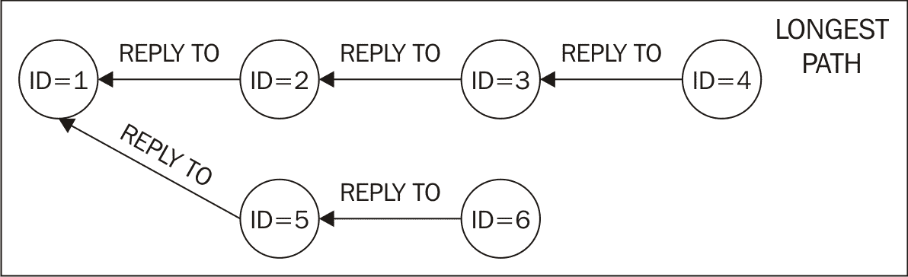

# 第三章。推特上的用户、关注者和社区

本章继续讨论挖掘推特数据。在重点分析了上一章的推文之后，我们现在将把注意力转移到用户、他们的联系和他们的互动上。

在本章中，我们将讨论以下主题:

*   如何为给定用户下载好友和关注者列表
*   如何分析用户之间的联系，共同的朋友等等
*   如何衡量推特上的影响力和参与度
*   聚类算法以及如何使用 **scikit-learn** 对用户进行聚类
*   网络分析以及如何利用它来挖掘推特上的对话
*   如何创建动态地图来可视化推文的位置

# 用户、朋友和追随者

推特和其他流行社交网络的主要区别之一是用户的连接方式。事实上，推特上的关系不一定是双向的。用户可以选择订阅其他用户的推文，成为他们的跟随者，但跟随者的行为可能不会得到回报。这与脸书和领英等其他社交网络的情况截然不同，在这些社交网络中，双方必须在发生关系之前确认关系。

用推特术语来说，关系的两个方向(我追随的人和追随我的人)有不同的名字。我追随的人被称为*朋友*，而跟随我的人被称为我的*追随者*。当关系是双向的，用户通常被描述为*共同的朋友*。

## 回到推特 API

Twitter API 提供了几个端点来检索关于追随者、朋友和一般用户配置文件的信息。特定端点的选择将由我们试图解决的任务决定。

快速浏览一下文档([https://dev.twitter.com/rest/public](https://dev.twitter.com/rest/public))将会突出一些有趣的文档。

从单用户配置文件开始，明显需要考虑的端点是`users/show`:给定一个屏幕名称或用户 ID，端点将为一个用户检索完整的配置文件。这一功能受到严重的速率限制，因为每 15 分钟只能有 180 个请求，这意味着在 15 分钟的窗口中只有 180 个用户配置文件。鉴于这种限制，只有当我们需要检索特定的配置文件时，才应该使用这个端点，它不适合批量下载。

可以使用`followers/list`端点([https://dev.twitter.com/rest/reference/get/followers/list](https://dev.twitter.com/rest/reference/get/followers/list))检索给定用户的关注者列表，该端点在 Tweepy 中使用`API.followers()`功能实现。类似地，`friends/list`端点允许检索给定用户的好友列表，Tweepy 实现作为`API.friends()`可用。这些端点的主要问题是严格的速率限制:在 15 分钟的窗口内只有 15 个请求，每个请求最多提供 20 个用户配置文件。这意味着每 15 分钟检索多达 300 个配置文件。

虽然这种方法对于拥有极少数粉丝和朋友的个人资料来说是可行的，但拥有数千粉丝的个人资料并不罕见(对于名人来说，这一数字可能高达数百万)。

此限制的变通方法是基于更适合大批量数据的其他端点的组合。`followers/ids`端点([https://dev.twitter.com/rest/reference/get/followers/ids](https://dev.twitter.com/rest/reference/get/followers/ids))可以根据每个请求返回 5000 个用户标识的组。尽管在 15 分钟的窗口内也限制为 15 个请求，但很容易计算出我们可以检索的最终用户标识数(每一刻钟 75，000 个)如何比以前的限制好得多。

使用`followers/ids`端点后，我们只有用户关注者对应的用户 id 列表，但是我们还没有完整的配置文件。解决方案是将这些用户标识用作`users/lookup`端点([https://dev.twitter.com/rest/reference/get/users/lookup](https://dev.twitter.com/rest/reference/get/users/lookup))的输入，该端点最多接受 100 个标识作为输入，并提供相应的完整配置文件列表作为输出。`users/lookup`的速率限制设置为每 15 分钟 180 个，相当于每一刻钟 18000 个配置文件。这个数字实际上限制了我们的下载。

如果我们想下载一批好友的个人资料，将`friends/ids`端点和前面提到的`users/lookup`结合起来，变通方法也可以。在速率限制方面，当下载朋友的 id 时，我们会遇到和跟随者一样的限制。要避免的一个小错误是认为两个下载过程完全独立；请记住`users/lookup`是瓶颈。对于同时下载好友和关注者配置文件的脚本，我们需要考虑到两个下载过程都需要`users/lookup`端点，因此对`users/lookup`的请求总数将达到好友和关注者的总和。对于既是朋友又是关注者的用户，只需要一次查找。

## 用户配置文件的结构

在深入挖掘如何下载大量关注者和好友简介的细节之前，我们将考虑单个用户的情况来了解一个用户简介的结构。我们可以使用`users/show`端点，因为这是一个一次性的例子，所以我们没有达到速率限制(下一节将讨论批量下载)。

端点通过`API.get_user()`函数在 Tweepy 中实现。我们可以重用我们在[第 2 章](2.html "Chapter 2.  #MiningTwitter – Hashtags, Topics, and Time Series")、*# miningtwetter-Hashtags、主题和时间序列*中定义的身份验证代码(确保环境变量设置正确)。从交互式解释器中，我们将输入以下内容:

```py
>>> from twitter_client import get_twitter_client 
>>> import json 
>>> client = get_twitter_client() 
>>> profile = client.get_user(screen_name="PacktPub") 
>>> print(json.dumps(profile._json, indent=4))

```

这段代码非常简单；一旦执行了身份验证，单个 API 调用将允许我们下载配置文件。函数调用返回的对象是`tweepy.models.User`类的一个实例，已经在[第 2 章](2.html "Chapter 2.  #MiningTwitter – Hashtags, Topics, and Time Series")、*# miningtwetter-Hashtags、Topics 和 Time Series* 中提到过，它是存储不同用户属性的包装器。推特最初的 JSON 响应被存储为 Python 字典中的`_json`属性，我们将在屏幕上输出，使用`json.dumps()`和`indent`参数进行一些漂亮的打印。

我们将观察到一段类似于以下代码的 JSON(为了简洁起见，省略了几个属性):

```py
{ 
  "screen_name": "PacktPub", 
  "name": "Packt Publishing", 
  "location": "Birmingham, UK", 
  "id": 17778401, 
  "id_str": "17778401", 
  "description": "Providing books, eBooks, video tutorials, and  
    articles for IT developers, administrators, and users.", 
  "followers_count": 10209, 
  "friends_count": 3583, 
  "follow_request_sent": false, 
  "status": { ... }, 
  "favourites_count": 556, 
  "protected": false, 
  "verified": false, 
  "statuses_count": 10802, 
  "lang": "en", 
  "entities": { 
    "description": { 
      "urls": [] 
    }, 
    "url": { 
      "urls": [ 
        { 
          "indices": [ 
            0, 
            22 
          ], 
          "display_url": "PacktPub.com", 
          "expanded_url": "http://www.PacktPub.com", 
          "url": "http://t.co/vEPCgOu235" 
        } 
      ] 
    } 
  }, 
  "following": true, 
  "geo_enabled": true, 
  "time_zone": "London", 
  "utc_offset": 0, 
} 

```

下表描述了我们可以找到的所有字段:

<colgroup><col> <col></colgroup> 
| **属性名称** | **描述** |
| `_json` | 这是一个带有用户配置文件的 JSON 响应的字典 |
| `created_at` | 这是用户帐户创建的 UTC 日期时间 |
| `contributors_enabled` | 这是指示**投稿人模式**启用(很少`true`)的标志 |
| `default_profile` | 这是一个标志，表示用户没有改变配置文件主题 |
| `description` | 这是描述用户配置文件的字符串 |
| `default_profile_image` | 这是表示用户没有自定义个人资料图片的标志 |
| `entities` | 这是 URL 或描述中的实体列表 |
| `followers_count` | 这是追随者的数量 |
| `follow_request_sent` | 这是指示是否发送了跟随请求的标志 |
| `favourites_count` | 这是用户喜欢的推文数量 |
| `following` | 这是指示经过身份验证的用户是否在跟踪的标志 |
| `friends_count` | 这是朋友的数量 |
| `geo_enabled` | 这是表示**地理标记**启用的标志 |
| `id` | 这是作为大整数的用户的唯一标识 |
| `id_str` | 这是字符串形式的用户的唯一标识 |
| `is_translator` | 这是一个标志，表明用户是 Twitter 翻译社区的一部分 |
| `lang` | 这是用户的语言代码 |
| `listed_count` | 这是用户所属的公共列表的数量 |
| `location` | 这是用户以字符串形式声明的位置 |
| `name` | 这是用户的名称 |
| `profile_*` | 这是配置文件相关的信息量(请参考下面的配置文件相关属性列表) |
| `protected` | 这是指示用户是否保护其推文的标志 |
| `status` | 这是一个嵌入了最新推文的对象(所有可用字段请参考[第 2 章](2.html "Chapter 2.  #MiningTwitter – Hashtags, Topics, and Time Series")、*# miningtwetter-Hashtags、主题和时间序列*) |
| `screen_name` | 这是用户的屏幕名称，也就是 Twitter 句柄 |
| `statuses_count` | 这是推文的数量 |
| `time_zone` | 这是用户声明的时区字符串 |
| `utc_offset` | 这是相对于格林尼治标准时间/世界协调时的偏移量，以秒为单位 |
| `url` | 这是用户提供的与配置文件关联的 URL |
| `verified` | 这是指示用户是否被验证的标志 |

配置文件相关属性列表如下:

*   `profile_background_color`:这是用户为其背景选择的十六进制色码
*   `profile_background_tile`:这是表示`profile_background_image_url`显示时应该平铺的标志
*   `profile_link_color`:这是用户选择在 Twitter UI 中显示链接的十六进制色码
*   `profile_use_background_image`:这是表示用户希望使用自己上传的背景图片的标志
*   `profile_background_image_url`:这是一个基于 HTTP 的 URL，指向上传的背景图片
*   `profile_background_image_url_https`:这个和之前的属性一样，但是基于 HTTPS
*   `profile_text_color`:这是用户选择的十六进制颜色代码，用于在他们的推特用户界面中显示文本
*   `profile_banner_url`:这是用户上传的个人资料横幅的 HTTPS 网址
*   `profile_sidebar_fill_color`:这是用户选择的十六进制颜色代码，用于在他们的推特用户界面中显示侧栏背景

*   `profile_image_url`:这是一个基于 HTTP 的用户头像 URL

*   `profile_image_url_https`:这个和之前的属性一样，但是基于 HTTPS
*   `profile_sidebar_border_color`:这是用户选择的十六进制颜色代码，用他们的 Twitter UI 显示侧边栏边框

下一节将讨论如何为给定用户的朋友和追随者下载用户配置文件。

## 下载好友和关注者的个人资料

鉴于上一节中对相关端点的讨论，我们可以创建一个脚本，该脚本将用户名(屏幕名称)作为输入，并下载他们的完整个人资料、关注者列表(带有完整个人资料)和朋友列表(也带有完整个人资料):

```py
# Chap02-03/twitter_get_user.py 
import os 
import sys 
import json 
import time 
import math 
from tweepy import Cursor 
from twitter_client import get_twitter_client 

MAX_FRIENDS = 15000 

def usage(): 
  print("Usage:") 
  print("python {} <username>".format(sys.argv[0])) 

def paginate(items, n): 
  """Generate n-sized chunks from items""" 
  for i in range(0, len(items), n): 
    yield items[i:i+n] 

if __name__ == '__main__': 
  if len(sys.argv) != 2: 
    usage() 
    sys.exit(1) 
  screen_name = sys.argv[1] 
  client = get_twitter_client() 
  dirname = "users/{}".format(screen_name) 
  max_pages = math.ceil(MAX_FRIENDS / 5000) 
  try: 
    os.makedirs(dirname, mode=0o755, exist_ok=True) 
  except OSError: 
    print("Directory {} already exists".format(dirname)) 
  except Exception as e: 
    print("Error while creating directory {}".format(dirname)) 
    print(e) 
    sys.exit(1) 

  # get followers for a given user 
  fname = "users/{}/followers.jsonl".format(screen_name) 
  with open(fname, 'w') as f: 
    for followers in Cursor(client.followers_ids,  
                            screen_name=screen_name).pages(max_pages): 
      for chunk in paginate(followers, 100): 
        users = client.lookup_users(user_ids=chunk) 
        for user in users: 
          f.write(json.dumps(user._json)+"\n") 
      if len(followers) == 5000: 
        print("More results available. Sleeping for 60 seconds to  
              avoid rate limit") 
        time.sleep(60) 

  # get friends for a given user 
  fname = "users/{}/friends.jsonl".format(screen_name) 
  with open(fname, 'w') as f: 
    for friends in Cursor(client.friends_ids,  
                          screen_name=screen_name).pages(max_pages): 
      for chunk in paginate(friends, 100): 
        users = client.lookup_users(user_ids=chunk) 
        for user in users: 
          f.write(json.dumps(user._json)+"\n") 
      if len(friends) == 5000: 
        print("More results available. Sleeping for 60 seconds to  
              avoid rate limit") 
        time.sleep(60) 

  # get user's profile 
  fname = "users/{}/user_profile.json".format(screen_name) 
  with open(fname, 'w') as f: 
    profile = client.get_user(screen_name=screen_name) 
    f.write(json.dumps(profile._json, indent=4)) 

```

该脚本从命令行中获取一个参数，即您要分析的用户的屏幕名称。例如，可以使用以下命令运行该脚本:

```py
$ python twitter_get_user.py PacktPub

```

由于在撰写本文时，PacktPub 拥有超过 10，000 名关注者，由于 API 的限制，脚本将需要 2 分钟以上的时间才能运行。如[第 2 章](2.html "Chapter 2.  #MiningTwitter – Hashtags, Topics, and Time Series")、*# miningtwetter-Hashtags、Topics 和 Time Series* 中所述，该脚本使用`time.sleep()`来减缓执行速度，避免达到速率限制。传递给`sleep()`功能的秒数由应用编程接口决定。

## 分析你的网络

下载与给定个人资料的朋友和追随者相关的数据后，我们可以开始对这些连接创建的网络结构进行一些探索性的分析。*图 3.1* 展示了一个虚构的用户小网络的例子，用户之间的链接从第一人称的角度突出显示(也就是从贴有 **ME** 标签的用户的角度，所以我们用第一人称来描述图片):


图 3.1:本地网络的一个例子:朋友、追随者和共同的朋友

在这个例子中，我连接到四个不同的用户: **PETER** 和 **JOHN** 跟随我(所以他们被标记为 **FOLLOWERS** ，而我跟随 **LUCY** 、 **MARY** 和 **JOHN** (所以他们被标记为 **FRIENDS** )。**约翰**属于两个群体:**朋友**和**追随者**之间的交集被描述为**共同的朋友**。

从这个表象我们不知道的是，这四个用户之间是否也有联系。这就是我们在前一节下载的数据的本质:我们有关于给定个人资料的朋友和追随者的信息，但是如果我们想发现他们之间的联系，我们需要遍历他们的所有个人资料并下载相关数据。

有了这些数据，我们就有了关于关注者和朋友数量的基本统计，现在我们可以回答以下基本问题:

*   谁是我共同的朋友？
*   谁没跟着我回去？
*   我没跟谁回去？

以下脚本读取先前下载的 JSONL 文件，并计算统计数据来回答这些问题:

```py
# Chap02-03/twitter_followers_stats.py 
import sys 
import json 

def usage(): 
  print("Usage:") 
  print("python {} <username>".format(sys.argv[0])) 

if __name__ == '__main__': 
  if len(sys.argv) != 2: 
    usage() 
    sys.exit(1) 
  screen_name = sys.argv[1] 
  followers_file = 'users/{}/followers.jsonl'.format(screen_name) 
  friends_file = 'users/{}/friends.jsonl'.format(screen_name) 
  with open(followers_file) as f1, open(friends_file) as f2: 
    followers = [] 
    friends = [] 
    for line in f1: 
      profile = json.loads(line) 
      followers.append(profile['screen_name']) 
    for line in f2: 
      profile = json.loads(line) 
      friends.append(profile['screen_name']) 
    mutual_friends = [user for user in friends 
                      if user in followers] 
    followers_not_following = [user for user in followers 
                               if user not in friends] 
    friends_not_following = [user for user in friends 
                             if user not in followers] 

    print("{} has {} followers".format(screen_name,  
          len(followers))) 
    print("{} has {} friends".format(screen_name, len(friends))) 
    print("{} has {} mutual friends".format(screen_name,  
          len(mutual_friends))) 
    print("{} friends are not following {}  
          back".format(len(friends_not_following), screen_name)) 
    print("{} followers are not followed back by  
          {}".format(len(followers_not_following), screen_name)) 

```

该脚本使用用户名作为命令行参数，因此您可以使用以下命令运行它:

```py
$ python twitter_followers_stats.py PacktPub

```

这将产生以下输出:

```py
PacktPub has 10209 followers
PacktPub has 3583 friends
PacktPub has 2180 mutual friends
1403 friends are not following PacktPub back
8029 followers are not followed back by PacktPub

```

用来处理朋友和关注者的数据类型是一个普通的 Python `list()`，用用户名(【准确的说是`screen_name`)填充。代码读取两个 JSONL 文件，将屏幕名称添加到各自的列表中。然后使用三种列表理解来构建不同的统计数据。

### 型式

**Python 中的列表理解**

Python 支持一个叫做列表理解的概念，这是一种将一个列表(或任何可迭代列表)转换成另一个列表的优雅方式。在此过程中，可以通过自定义函数有条件地包含和转换元素，例如:

`>>> numbers = [1, 2, 3, 4, 5]`

`>>> squares = [x*x for x in numbers]`

`>>> squares`

`[1, 4, 9, 16, 25]`

前面的列表理解相当于下面的代码:

`>>> squares = []`

`>>> for x in numbers:`

`...   squares.append(x*x)`

`...`

`>>> squares`

`[1, 4, 9, 16, 25]`

列表理解的一个很好的方面是它们也可以用简单的英语阅读，所以代码特别易读。

理解不仅仅局限于列表，事实上，它们也可以用来构建词典。

关于实现的这一方面，有几个注意事项。首先，JSONL 文件将包含唯一的配置文件:每个追随者(或朋友)将只列出一次，因此我们没有重复的条目。其次，在计算前面的统计数据时，项目的顺序是不相关的。事实上，我们所做的只是计算基于集合的操作(在这个例子中是交集和差集)。

我们可以重构代码，使用`set()`实现基本统计；脚本中的变化与我们如何加载数据和计算共同的朋友、没有跟踪回来的朋友和没有跟踪回来的追随者有关:

```py
with open(followers_file) as f1, open(friends_file) as f2: 
  followers = set() 
  friends = set() 
  for line in f1: 
    profile = json.loads(line) 
    followers.add(profile['screen_name']) 
  for line in f2: 
    profile = json.loads(line) 
    friends.add(profile['screen_name']) 
  mutual_friends = friends.intersection(followers) 
  followers_not_following = followers.difference(friends) 
  friends_not_following = friends.difference(followers) 

```

这将产生与使用列表的代码相同的输出。使用集合而不是列表的主要优势在于计算的复杂性:像包含(也就是检查`item in list`或`item in set`)这样的操作对于列表是以线性时间运行的，对于集合是以恒定时间运行的。遏制用于构建`mutual_friends`、`followers_not_following`和`friends_not_following`，因此这一简单的更改将显著影响脚本的总运行时间，并且随着关注者/朋友数量的增加，由于列表所需的线性复杂性，这种差异更加明显。

### 型式

**计算复杂度**

上一节使用了*线性时间*、*恒定时间*、*线性复杂度*等短语。计算复杂性的概念是计算机科学中的一个重要概念，因为它涉及算法运行所需的资源量。在这一段中，我们将讨论时间复杂度和算法运行所花费的时间，描述为其输入大小的函数。

当算法以线性时间运行时，对于大的输入大小，其运行时间随着输入的大小线性增加。描述这类算法的数学符号(称为大 O 符号)是`O(n)`，其中`n`是输入的大小。

相反，对于在恒定时间内运行的算法，输入的大小不会影响运行时间。这种情况下使用的符号是`O(1)`。

一般来说，理解不同操作和数据结构的复杂性是开发非平凡程序的关键步骤，因为这可能会对我们系统的性能产生巨大影响。

此时，读者可能会对 NumPy 等库的使用感到好奇。正如在[第 1 章](1.html "Chapter 1.  Social Media, Social Data, and Python")、*社交媒体、社交数据和 Python* 中已经讨论过的，NumPy 为类似数组的数据结构提供了快速高效的处理，并且比简单列表提供了显著的性能提升。尽管针对速度进行了优化，但在这种特定情况下使用 NumPy 不会在性能方面产生任何特别的好处，这仅仅是因为包含操作的计算成本与列表的计算成本相同。重构前面的代码以使用 NumPy 会生成以下代码:

```py
with open(followers_file) as f1, open(friends_file) as f2: 
  followers = [] 
  friends = [] 
  for line in f1: 
    profile = json.loads(line) 
    followers.append(profile['screen_name']) 
  for line in f2: 
    profile = json.loads(line) 
    friends.append(profile['screen_name']) 
  followers = np.array(followers) 
  friends = np.array(friends) 
  mutual_friends = np.intersect1d(friends, 
                                  followers, 
                                  assume_unique=True) 
  followers_not_following = np.setdiff1d(followers, 
                                         friends, 
                                         assume_unique=True) 
  friends_not_following = np.setdiff1d(friends, 
                                       followers, 
                                       assume_unique=True) 

```

这个片段假设 NumPy 已经用别名`np`导入，如[第 1 章](1.html "Chapter 1.  Social Media, Social Data, and Python")、*社交媒体、社交数据和 Python* 中所述。该库提供了一些类似集合的操作- `intersect1d`和`setdiff1d`，但是底层数据结构仍然是类似数组的对象(类似列表)。这些函数的第三个参数`assume_unique`可以在输入数组具有唯一元素的假设下使用，就像我们的例子一样。这有助于加快计算速度，但底线保持不变:拥有数百个以上的关注者/朋友，在执行这些操作时，集合会更快。对于少数追随者/朋友来说，性能的差异不会很明显。

这本书提供的源代码提供了用`twitter_followers_stats.py`、`twitter_followers_stats_set.py`和`twitter_followers_stats_numpy.py`编码的三种不同的实现，其中包括一些时序计算，以便您可以用不同的数据进行实验。

### 注

总结这段重构的间歇期，主要的信息是为您正在处理的操作类型选择最合适的数据结构。

## 衡量影响力和参与度

社交媒体领域最常被提及的角色之一是神话般的*影响者*。这一数字导致了最近营销策略的范式转变([https://en.wikipedia.org/wiki/Influencer_marketing](https://en.wikipedia.org/wiki/Influencer_marketing))，其重点是针对关键个人，而不是整个市场。

影响者通常是其社区内的活跃用户；以推特为例，一个有影响力的人会发很多关于他们关心的话题的推文。有影响力的人在追随时有很好的关系，并被社区中的许多其他用户追随。一般来说，影响者也被认为是他们所在领域的专家，通常受到其他用户的信任。

这种描述应该解释为什么影响者是最近营销趋势的重要组成部分——一个影响者可以提高知名度，甚至成为特定产品或品牌的倡导者，并可以接触到大量的支持者。

无论你的主要兴趣是 Python 编程还是品酒，无论你的社交网络有多大(或多小)，你可能已经知道你社交圈子里的影响者是谁:朋友、熟人或互联网上的随机陌生人，他们的观点你信任并重视，因为他们在给定主题上的专业知识。

一个不同但又有某种关联的概念是*订婚*。用户参与度或客户参与度是对特定产品或服务的响应的评估。在社交媒体环境中，创建内容片段的目的通常是为了推动公司网站或电子商务的流量。衡量参与度很重要，因为它有助于定义和理解策略，以最大限度地与您的网络互动，并最终带来业务。在推特上，用户通过转发或喜欢特定推文的方式参与进来，这反过来又为推文提供了更多的可见性。

在这一节中，我们将讨论社交媒体分析中一些有趣的方面，比如衡量影响力和参与度的可能性。在推特上，一个自然的想法是将影响力与特定网络中的用户数量联系起来。直觉上，高关注人数意味着一个用户可以接触到更多的人，但这并不能告诉我们一条推文是如何被感知的。

以下脚本比较了两个用户配置文件的一些统计信息:

```py
# Chap02-03/twitter_influence.py 
import sys 
import json 

def usage(): 
  print("Usage:") 
  print("python {} <username1> <username2>".format(sys.argv[0])) 

if __name__ == '__main__': 
  if len(sys.argv) != 3: 
    usage() 
    sys.exit(1) 
  screen_name1 = sys.argv[1] 
  screen_name2 = sys.argv[2] 

```

从命令行读取两个屏幕名称后，我们将为每个名称建立一个关注者列表，包括关注者的数量，以计算可访问用户的数量:

```py
  followers_file1 = 'users/{}/followers.jsonl'.format(screen_name1) 
  followers_file2 = 'users/{}/followers.jsonl'.format(screen_name2) 
  with open(followers_file1) as f1, open(followers_file2) as f2: 
    reach1 = [] 
    reach2 = [] 
    for line in f1: 
      profile = json.loads(line) 
      reach1.append((profile['screen_name'],  
                    profile['followers_count'])) 
    for line in f2: 
      profile = json.loads(line) 
      reach2.append((profile['screen_name'],  
                    profile['followers_count'])) 

```

然后，我们将从两个用户配置文件中加载一些基本统计数据(关注者计数和状态计数):

```py
  profile_file1 = 'users/{}/user_profile.json'.format(screen_name1) 
  profile_file2 = 'users/{}/user_profile.json'.format(screen_name2) 
  with open(profile_file1) as f1, open(profile_file2) as f2: 
    profile1 = json.load(f1) 
    profile2 = json.load(f2) 
    followers1 = profile1['followers_count'] 
    followers2 = profile2['followers_count'] 
    tweets1 = profile1['statuses_count'] 
    tweets2 = profile2['statuses_count'] 

  sum_reach1 = sum([x[1] for x in reach1]) 
  sum_reach2 = sum([x[1] for x in reach2]) 
  avg_followers1 = round(sum_reach1 / followers1, 2) 
  avg_followers2 = round(sum_reach2 / followers2, 2) 

```

然后，我们将为这两个用户加载时间表，以观察他们的推文被支持或转发的次数:

```py
  timeline_file1 = 'user_timeline_{}.jsonl'.format(screen_name1) 
  timeline_file2 = 'user_timeline_{}.jsonl'.format(screen_name2) 
  with open(timeline_file1) as f1, open(timeline_file2) as f2: 
    favorite_count1, retweet_count1 = [], [] 
    favorite_count2, retweet_count2 = [], [] 
    for line in f1: 
      tweet = json.loads(line) 
      favorite_count1.append(tweet['favorite_count']) 
      retweet_count1.append(tweet['retweet_count']) 
    for line in f2: 
      tweet = json.loads(line) 
      favorite_count2.append(tweet['favorite_count']) 
      retweet_count2.append(tweet['retweet_count']) 

```

然后，前面的数字被汇总到收藏夹和转发的平均数量中，包括绝对数量和每个关注者的数量:

```py
  avg_favorite1 = round(sum(favorite_count1) / tweets1, 2) 
  avg_favorite2 = round(sum(favorite_count2) / tweets2, 2) 
  avg_retweet1 = round(sum(retweet_count1) / tweets1, 2) 
  avg_retweet2 = round(sum(retweet_count2) / tweets2, 2) 
  favorite_per_user1 = round(sum(favorite_count1) / followers1, 2) 
  favorite_per_user2 = round(sum(favorite_count2) / followers2, 2) 
  retweet_per_user1 = round(sum(retweet_count1) / followers1, 2) 
  retweet_per_user2 = round(sum(retweet_count2) / followers2, 2) 
  print("----- Stats {} -----".format(screen_name1)) 
  print("{} followers".format(followers1)) 
  print("{} users reached by 1-degree  
        connections".format(sum_reach1)) 
  print("Average number of followers for {}'s followers:  
        {}".format(screen_name1, avg_followers1)) 
  print("Favorited {} times ({} per tweet, {} per  
        user)".format(sum(favorite_count1), avg_favorite1,  
        favorite_per_user1)) 
  print("Retweeted {} times ({} per tweet, {} per  
        user)".format(sum(retweet_count1), avg_retweet1,  
        retweet_per_user1)) 
  print("----- Stats {} -----".format(screen_name2)) 
  print("{} followers".format(followers2)) 
  print("{} users reached by 1-degree  
        connections".format(sum_reach2)) 
  print("Average number of followers for {}'s followers:  
        {}".format(screen_name2, avg_followers2)) 
  print("Favorited {} times ({} per tweet, {} per  
        user)".format(sum(favorite_count2), avg_favorite2,  
        favorite_per_user2)) 
  print("Retweeted {} times ({} per tweet, {} per  
        user)".format(sum(retweet_count2), avg_retweet2,  
        retweet_per_user2)) 

```

该脚本从命令行获取两个参数，并假设数据已经下载。对于这两个用户，我们需要关注者的数据(用`twitter_get_user.py`下载)和他们各自的用户时间表(用`twitter_get_user_timeline.py`从[第二章](2.html "Chapter 2.  #MiningTwitter – Hashtags, Topics, and Time Series")、*# miningtwetter-Hashtags、Topics 和时间序列*下载)。

该脚本有些冗长，因为它为两个配置文件计算相同的操作，并在终端上打印所有内容。我们可以把它分解成不同的部分。

首先，我们将调查追随者的追随者。这将提供与直接连接到给定用户的网络部分相关的一些信息。换句话说，它应该回答这样一个问题:如果我的所有追随者都转发我，我能接触到多少用户？我们将通过读取`users/<user>/followers.jsonl`文件并保存元组列表来实现这一点，其中每个元组代表一个追随者，并且是`(screen_name, followers_count)`形式。在这个阶段保持屏幕名称是有用的，以防我们想要找出谁是拥有最多关注者的用户(没有在脚本中计算，但是使用`sorted()`很容易产生)。

第二步，我们将从`users/<user>/user_profile.json`文件中读取用户简介，这样我们就可以获得关注者和推文总数的信息。通过到目前为止收集的数据，我们可以计算出在一个分离度内可到达的用户总数(追随者的追随者)和追随者的平均追随者数量。这是通过以下方式实现的:

```py
sum_reach1 = sum([x[1] for x in reach1]) 
avg_followers1 = round(sum_reach1 / followers1, 2) 

```

第一个使用列表理解来迭代前面提到的元组列表，而第二个是简单的算术平均，四舍五入到小数点后两位。

脚本的第三部分从[第二章](2.html "Chapter 2.  #MiningTwitter – Hashtags, Topics, and Time Series")、*# miningtwetter-Hashtags、Topics 和 Time Series* 中产生的`user_timeline_<user>.jsonl`文件中读取用户时间线，并收集每条推文的转发次数和喜爱度信息。将所有内容放在一起，我们可以计算用户被转发或喜欢的次数，以及每条推文和每个追随者的平均转发/喜欢次数。

为了提供一个例子，我将进行一些虚荣心分析，并将我的`@marcobonzanini`账户与 Packt Publishing 进行比较:

```py
$ python twitter_influence.py marcobonzanini PacktPub

```

该脚本产生以下输出:

```py
----- Stats marcobonzanini -----
282 followers
1411136 users reached by 1-degree connections
Average number of followers for marcobonzanini's followers: 5004.03
Favorited 268 times (1.47 per tweet, 0.95 per user)
Retweeted 912 times (5.01 per tweet, 3.23 per user)
----- Stats PacktPub -----
10209 followers
29961760 users reached by 1-degree connections
Average number of followers for PacktPub's followers: 2934.84
Favorited 3554 times (0.33 per tweet, 0.35 per user)
Retweeted 6434 times (0.6 per tweet, 0.63 per user)

```

如你所见，关注者的原始数量没有显示出任何竞争，Packt Publishing 的关注者大约是我的 35 倍。当我们比较平均转发数和收藏数时，这个分析有趣的部分就出现了；显然，我的追随者比 PacktPub 的更关注我的内容。这足以证明我是一个有影响力的人，而 PacktPub 不是吗？显然不是。我们在这里观察到的是一个自然的结果，即我的推文可能更专注于特定的主题(Python 和数据科学)，因此我的追随者已经对我发布的内容更感兴趣。另一方面，Packt Publishing 制作的内容高度多样化，因为它涵盖了许多不同的技术。这种多样性也体现在 PacktPub 的追随者中，他们包括开发人员、设计人员、科学家、系统管理员等等。由于这个原因，PacktPub 的每条推文都被较少比例的追随者发现有趣(即值得转发)。

# 挖掘你的追随者

在现实世界中，社交社区是一群有着一些共同条件的人。这一宽泛的定义包括，例如，位于精确地理区域的人群、具有相同政治或宗教信仰的人群，或有共同特定兴趣的人群，如阅读书籍。

社交社区的概念也是社交媒体平台的核心。虚拟环境中的社区边界可能比现实世界中更模糊，例如，地理方面的决定因素较少。就像在面对面的情况下，当有共同兴趣或条件的人开始互动时，社区自然会出现在社交媒体平台上。

我们可以对不同类型的社区进行第一次区分，这取决于它们的成员是否明确理解自己是社区的一部分。在*显性*社区中，成员和非成员确切知道自己是否属于该社区，通常会了解其他社区成员是谁。社区成员之间的互动比与非成员之间的互动更频繁。

另一方面，*隐含的*社区在没有被明确承认的情况下产生。这类社区的成员可能有共同的利益，但没有明确而牢固的联系。

本节建议对用户数据进行分析，以便将一组用户资料分组，目的是突出这些共同的兴趣或条件。

**聚类**，或称聚类分析，是一种机器学习技术，用于对项目进行分组，使得同一组中的对象(即*聚类*)彼此之间的相似度高于其他聚类中的对象。聚类属于*无监督学习*技术的范畴，这意味着我们正在处理的对象没有被明确标记。无监督学习的目的是发现数据中隐藏的结构。

聚类应用的一个常见示例是市场研究，例如，将具有相似行为/兴趣的客户群体进行细分，以便他们可以成为不同产品或营销活动的目标。社交网络分析是聚类发现有趣应用的另一个重要领域，因为它可以用于识别更大人群中的社区结构。

聚类不仅仅是一个特定的算法，而是一个可以被不同算法处理的一般任务。我们选择的分析方法是 **K-Means** ，这是最流行的聚类方法之一。K-Means 是一个方便的选择，因为它相对容易理解和实现，并且与其他聚类方法相比计算效率高。

K-Means 本质上采用两个参数:n 维空间中的多个输入向量，代表我们要聚类的对象，以及 *K* 作为我们要将输入划分到的聚类数。由于我们处于无监督的学习环境中，我们没有任何关于正确类别标签的基本事实信息。更具体地说，我们甚至不知道正确(或理想)的簇数。这个细节在聚类分析中是相当核心的，但暂时我们不会太担心。

上一段定义了我们想要在 n 维空间中聚类为向量的对象。更简单地说，这意味着每个用户简档将被表示为一个名为*特征*的 *n* 数值元素的向量。

我们选择的定义这些特征的方法是基于用户的描述，即他们提供的关于他们的兴趣或职业的文本信息。将此文本描述转换为要素向量的过程称为矢量化。K-Means 算法和矢量化工具都是通过 scikit-learn 中的简单界面实现的，scikit-learn 是 Python 的机器学习工具包，已经在[第 1 章](1.html "Chapter 1.  Social Media, Social Data, and Python")、*社交媒体、社交数据和 Python* 中介绍过。

矢量化过程包括将用户描述分解成令牌，然后为每个令牌分配特定的*权重*。本例采用的加权方案是常见的 TF-IDF 方法([https://en.wikipedia.org/wiki/Tf%E2%80%93idf](https://en.wikipedia.org/wiki/Tf%E2%80%93idf))，是**词频** ( **TF** )和**逆文档频率** ( **IDF** )的组合。TF 是一个局部统计数据，因为它表示一个单词在文档中出现频率。另一方面，IDF 是一个全球性的统计数据——它代表了一个词在一组文档中是多么罕见。这些统计数据通常用在搜索引擎和不同的文本挖掘应用程序中，提供了一个词在给定上下文中有多重要的度量。

TF-IDF 提供了简单直觉背后的数字权重；如果一个词在一个文档中频繁出现，并且在整个集合中很少出现，那么它可能非常代表这个特定的文档，因此它应该得到更高的权重。在这个应用程序中，我们基本上是将用户描述作为文档来处理，我们使用 TF-IDF 统计数据将这些用户描述表示为向量。一旦我们有了 n 维向量表示，K-Means 算法就可以用它来计算它们之间的相似度。

以下脚本利用了 scikit-learn 提供的工具，尤其是`TfidfVectorizer`和`KMeans`类:

```py
# Chap02-03/twitter_cluster_users.py 
import sys 
import json 
from argparse import ArgumentParser 
from collections import defaultdict 
from sklearn.feature_extraction.text import TfidfVectorizer 
from sklearn.cluster import KMeans 

def get_parser(): 
  parser = ArgumentParser("Clustering of followers") 
  parser.add_argument('--filename') 
  parser.add_argument('--k', type=int) 
  parser.add_argument('--min-df', type=int, default=2) 
  parser.add_argument('--max-df', type=float, default=0.8) 
  parser.add_argument('--max-features', type=int, default=None) 
  parser.add_argument('--no-idf', dest='use_idf', default=True,  
                      action='store_false') 
  parser.add_argument('--min-ngram', type=int, default=1) 
  parser.add_argument('--max-ngram', type=int, default=1) 
  return parser 

if __name__ == '__main__': 
  parser = get_parser() 
  args = parser.parse_args() 
  if args.min_ngram > args.max_ngram: 
    print("Error: incorrect value for --min-ngram ({}): it can't  
          be higher than --max-value ({})".format(args.min_ngram,  
          args.max_ngram)) 
    sys.exit(1) 
  with open(args.filename) as f: 
    # load data 
    users = [] 
    for line in f: 
      profile = json.loads(line) 
      users.append(profile['description']) 
    # create vectorizer 
    vectorizer = TfidfVectorizer(max_df=args.max_df, 
                                 min_df=args.min_df, 
                                 max_features=args.max_features, 
                                 stop_words='english', 
                                 ngram_range=(args.min_ngram,  
                                              args.max_ngram), 
                                 use_idf=args.use_idf) 
    # fit data 
    X = vectorizer.fit_transform(users) 
    print("Data dimensions: {}".format(X.shape)) 
    # perform clustering 
    km = KMeans(n_clusters=args.k) 
    km.fit(X) 
    clusters = defaultdict(list) 
    for i, label in enumerate(km.labels_): 
      clusters[label].append(users[i]) 
    # print 10 user description for this cluster 
    for label, descriptions in clusters.items(): 
      print('---------- Cluster {}'.format(label+1)) 
      for desc in descriptions[:10]: 
        print(desc) 

```

由于`TfidfVectorizer`有多个选项来配置矢量的计算方式，我们将使用 Python 标准库的一部分`ArgumentParser`从命令行捕获这些选项。`get_parser()`函数定义参数如下:

*   `--filename`:这是我们要分析的 JSONL 文件名的路径
*   `--k`:这是集群数
*   `--min-df`:这是一个特征的最小文档频率(默认为`2`)
*   `--max-df`:这是一个功能的最大文档频率(默认为`0.8`)
*   `--max-features`:这是最大特征数(默认为`None`)
*   `--no-idf`:这标志着我们是否希望仅使用 TF 来关闭 IDF 权重(默认情况下使用 IDF)
*   `--min-ngram`:这是要抽取的 n 克的下边界(默认为`1`)
*   `--max-ngram`:这是要抽取的 n 克的上边界(默认为`1`)

例如，我们可以使用以下命令运行脚本:

```py
$ python twitter_cluster_users.py \
 --filename users/marcobonzanini/followers.jsonl \
 --k 5 \
 --max-features 200 \
 --max-ngram 3

```

唯一必须的参数是`--filename`指定要分析的配置文件的文件名，以及`--k`指定集群的数量。所有其他参数都是可选的，并定义`TfidfVectorizer`将如何为`KMeans`创建向量。

我们可以通过`TfidfVectorizer`来限制提取的特征数量，或者明确使用`--max-features`或者使用`--min-df`和`--max-df`指定特征的文档频率的期望范围。默认情况下，最小文档频率设置为`2`，这意味着少于两个文档中出现的特征将被忽略。另一方面，一个特征的最大文档频率被设置为`0.8`，这意味着出现在 80%以上文档中的特征将被忽略。根据数据集的大小，我们可以决定这些值是保守还是保守。基于特征的文档频率排除特征的目的是避免对不代表任务的特征进行计算。此外，用`--max-features`限制特征的总数也是为了在输入更小时加快计算速度。指定此选项后，将选择最常用的功能(取决于它们的文档频率)。

与其他参数不同的是，`--no-idf`选项不是用来指定特定的值，而是用来关闭 IDF 的使用(意味着在计算特征权重时只考虑 TF)。参数解析器允许我们通过提供一个变量名作为目标(`dest=use_idf`)来指定这个参数的行为，以及当给出参数时要执行的操作:`store_false`，而如果没有提供参数，变量默认为`True`。IDF 通常用于缩小文档集合中非常常见的术语的权重，因此没有任何特殊的区分能力。虽然在许多应用程序中，在您的加权函数中采用 IDF 非常合理，但在探索性数据分析步骤中，观察其效果仍然很重要，因此关闭它的选项只是我们盒子中的一个额外工具。

最后两个论点允许我们超越单个单词，使用 *n-grams* 作为特征。一般来说，n-gram 是 *n* 项的连续序列。在我们的应用程序中，我们有一段被标记为一系列单词的文本。单个单词也称为*单字*(n = 1 的 n-克)。其他常用的 n-grams 是二元模型(n = 2)和三元模型(n = 3)，而根据应用可以使用更大的尺寸。比如给定一句*快棕狐狸跳过懒狗*，它的二元模型定义如下:*快棕*、*快棕*、*棕狐狸*、*狐狸跳过*等等。

使用 n-grams 而不仅仅是 unigrams 的好处是可以捕获短语。例如，考虑以下虚构的句子:

*   他是科学家，但他不喜欢数据
*   他是一名数据科学家

仅通过使用 unigrams，术语*数据*和*科学家*将在两行中被捕获，尽管它们以不同的方式被使用，而使用 bigrams，我们可以捕获短语*数据科学家*，与这两个单词相比，这提供了不同的含义。默认情况下，n-grams 的上下边界被设置为`1`，这意味着如果没有不同的指定，我们只使用 unigrams。

总结一下`TfidfVectorizer`是如何配置的，我们会注意到它还使用了`stop_words`参数，该参数被定义为从英语词汇中获取停止词。这是一个常见英语单词的列表，如*和*和*，它们本身没有特定的含义，可能在几乎每篇文章中都有使用。虽然在普通英语中，停止词可能已经被`max_df`选项过滤掉了(因为它们的文档频率接近 100%)，但推特上的用户通常不会使用流利的普通英语，而只是一个代表他们兴趣的关键词列表，以克服字符数量的限制。`TfidfVectorizer`还允许`stop_words`属性获取自定义单词列表，以防我们想要对其进行个性化设置。*

 *如前所述运行代码将会输出一些有趣的结果。为简洁起见，输出部分再现，如图*图 3.2* :


图 3.2:部分输出

为了简洁和突出 K-Means 算法的有趣行为，输出被缩短了。

在第一组追随者中，有一群学者和博士生，他们的工作主要是文本分析和信息检索。例如，在两个简档描述中找到短语`PhD candidate`和`Information Retrieval`是用户相似性的有力证据。

第二组由讲西班牙语的用户组成。K-Means 和`TfidfVectorizer`都没有任何关于多种语言的明确知识。唯一的语言学方面是对常见的英语单词使用停止词删除。K-Means 是否足够聪明，能够识别一种语言，并使用这些信息作为证据将这些用户分组在一起？请记住，我们正在构建的向量是基于单词包表示(准确地说，是 n 克包)，因此相似性只是基于单词和 n 克的重叠。不是说西班牙语的人，我们可以在不同的个人资料中发现一些常见的单词(例如，`en`、`y`和`de`)。这些关键词在追随者(主要是说英语的人)的集合中可能相当罕见，因此它们的重要性反映在高 IDF 值中。它们也碰巧是西班牙语的停止词，但是由于停止词列表是为英语明确设计的，所以它们被保留为向量特征。除了语言之外，这些配置文件之间的联系可能相当松散。第一个和第三个提到了一些与计算机科学相关的术语，第二个提到了*语言、交流和新媒体。遇火不发推*。与其他配置文件的链接相当模糊，但这仍然是一个有趣的结果。

第三和第四个集群，就像第一个集群一样，是不言自明的，并且非常一致:集群 3 主要由 Python 开发人员组成，而集群 4 由数据科学家组成。

由于 K-Means 的初始化具有随机成分，用完全相同的参数重新运行代码并不能保证总是获得相同的结果。鼓励感兴趣的读者使用不同的脚本参数值(例如，或多或少的特性，只是单一图形对较长的 n 图形，文档频率范围窄或宽，等等)，并观察这些如何影响算法的行为。

在我们开始讨论 K-Means 的时候，我们提到了聚类数 *K* 是如何和数据一起作为这个算法的主要输入的。找到给定数据集的最优 *K* 本身就是一个研究问题，它不同于如何执行实际的聚类。有多种方法可以用来达到这个目的。

最简单的方法是经验法则，包括将 *K* 设置为 *n/2* 比值的平方根，其中 *n* 是数据集中的对象数量。不同的方法涉及一些集群内一致性的度量，例如肘形方法或剪影。

# 挖掘对话

在重点介绍了用户档案以及它们是如何通过追随者/朋友关系明确联系在一起的之后，在本节中，我们将分析一种不同类型的交互——对话。在推特上，用户可以发布一条推文*来回复特定的内容。当两个或更多的用户跟进这个过程时，一个适当的对话就可以展开了。*

*图 3.3* 显示了一个表示为网络的对话。网络的每个节点都是一条推文(由其标识唯一标识)，每个边代表对关系的*回复。*

这种关系有一个明确的方向，因为它只能走一条路(父子关系)。例如，如果推文 2 是对推文 1 的回复，我们就看不到推文 1 是对推文 2 的回复。这种关系的基数始终是一，意味着一条给定的推文可以是对一条且只有一条推文的回复(但我们可以有多条推文回复给定的推文，使这种关系成为一对多)。此外，不允许循环(例如，关系 1 到 2、2 到 3、3 到 1 的顺序是不可能的)。由于这些原因，我们所表示的图属于有向无环图或 DAG([https://en.wikipedia.org/wiki/Directed_acyclic_graph](https://en.wikipedia.org/wiki/Directed_acyclic_graph))的范畴。更准确地说，我们在这里表示的图形类型通常被称为*有向树*:



图 3.3:表示为网络的对话示例

虽然图中没有明确描述，但我们注意到这种关系是有时间限制的:只有在推文已经发布的情况下，你才能回复推文。

通过将推文和回复描述为图，我们可以利用图的属性和图论中的算法来挖掘对话。

例如，节点的*度*是图中给定节点的子节点数。从对话的角度来看，节点的程度对应于节点收到的回复数量。在图 3.3 的例子中，节点 1 有两个直接连接的节点，所以它的度是 2。节点 2、3 和 5 都有一个单独连接的节点，因此它们的度数为 1。最后，节点 4 和 6 没有连接到它们的节点，因此它们的度为零。节点 4 和 6 也被称为树的*叶子*，代表对话中的死胡同。另一方面，对话的开始，节点 1，也被称为树的*根*。

图论中的一个基本概念是*路径*的概念，它是连接一系列不同顶点的一系列边。给定一系列推文的图形表示，找到一条路径相当于跟踪一个对话。一个有趣的问题是找到最大长度的路径，也称为最长路径。

为了将这些图形概念应用到我们的推特数据中，我们可以使用[第 1 章](1.html "Chapter 1.  Social Media, Social Data, and Python")、*社交媒体、社交数据和 Python* 中已经介绍过的 **NetworkX** 库，因为它提供了高效的图形结构计算和简单的界面。下面的脚本将推文的 JSONL 文件作为输入，并生成一个有向图，正如我们刚刚讨论的:

```py
# Chap02-03/twitter_conversation.py 
import sys 
import json 
from operator import itemgetter 
import networkx as nx 

def usage(): 
  print("Usage:") 
  print("python {} <filename>".format(sys.argv[0])) 

if __name__ == '__main__': 
  if len(sys.argv) != 2: 
    usage() 
    sys.exit(1) 
  fname = sys.argv[1] 
  with open(fname) as f: 
    graph = nx.DiGraph() 
    for line in f: 
      tweet = json.loads(line) 
      if 'id' in tweet: 
        graph.add_node(tweet['id'], 
                       tweet=tweet['text'], 
                       author=tweet['user']['screen_name'], 
                       created_at=tweet['created_at']) 
        if tweet['in_reply_to_status_id']: 
          reply_to = tweet['in_reply_to_status_id'] 
          if reply_to in graph \ 
          and tweet['user']['screen_name'] !=  
            graph.node[reply_to]['author']: 
            graph.add_edge(tweet['in_reply_to_status_id'], 
                           tweet['id']) 
    # Print some basic stats 
    print(nx.info(graph)) 
    # Find most replied tweet 
    sorted_replied = sorted(graph.degree_iter(), 
                            key=itemgetter(1), 
                            reverse=True) 
    most_replied_id, replies = sorted_replied[0] 
    print("Most replied tweet ({} replies):".format(replies)) 
    print(graph.node[most_replied_id]) 
    # Find longest conversation 
    print("Longest discussion:") 
    longest_path = nx.dag_longest_path(graph) 
    for tweet_id in longest_path: 
      node = graph.node[tweet_id] 
      print("{} (by {} at {})".format(node['tweet'], 
                                      node['author'], 
                                      node['created_at'])) 

```

该脚本可以按如下方式运行:

```py
$ python twitter_conversation.py <filename>

```

在这个脚本中，我们将使用别名`nx`导入 NetworkX，如[第 1 章](1.html "Chapter 1.  Social Media, Social Data, and Python")、*社交媒体、社交数据和 Python* 中所述。我们将初始化一个空的有向图，它是用`nx.DiGraph`类实现的。输入 JSONL 文件的每一行代表一条推文，所以我们将循环遍历这个文件，为每条推文添加一个节点。用于此目的的`add_node()`函数使用一个强制参数，即节点标识，后跟可选关键字参数的数量，为节点提供附加属性。在我们的例子中，我们将包括作者的屏幕名称、推文全文和创建时间戳。

节点创建后，我们会检查该推文是否是在回复另一条推文时发布的；如果是这种情况，我们可能希望在节点之间添加一条边。在添加边之前，我们将首先确认被回复的推文已经存在于图中。这是为了避免包含对不在我们数据集中的推文的回复(例如，在我们开始使用 Streaming API 收集数据之前发布的推文)。如果我们试图连接的节点在图中不存在，`add_edge()`函数可以添加它，但是除了 ID 之外，我们没有任何关于它的属性的信息。我们还会检查推文的作者和回复的作者是否是不同的人。这是因为推特用户界面会自动将属于对话一部分的推文分组，但有些用户，例如，正在评论一个直播事件，或者只是写了一个超过 140 个字符的评论，他们只是回复自己的推文，以轻松创建一个多推文线程。虽然这可能是一个很好的特性，但它并不是真正的对话(事实上，它恰恰相反)，所以我们决定忽略这种线索。如果你对寻找独白感兴趣，你可以修改代码来执行相反的操作:只有当推文的作者和回复的作者是同一个人时，才添加边。

建图后，我们先打印一些基本的统计数据，由`nx.info()`功能提供。然后我们会识别出回复次数最多的推文(即度最高的节点)和对话时间最长的推文(即路径最长)。

由于`degree_iter()`函数返回一个(节点，度)元组序列的迭代器，我们将使用`itemgetter()`按照度以相反的顺序对其进行排序。排序列表的第一项是回复最多的推文。

寻找最长对话的解决方案在`dag_longest_path()`函数中实现，该函数返回节点标识列表。为了重建对话，我们只需要遍历这些标识并打印出数据。

使用在[第 2 章](2.html "Chapter 2.  #MiningTwitter – Hashtags, Topics, and Time Series")、*# miningtwetter-Hashtags、主题和时间序列*中创建的`stream__RWC2015__RWCFinal_Rugby.jsonl`文件运行的脚本产生以下输出(为简洁起见，省略了最长对话的输出):

```py
Name:
Type: DiGraph
Number of nodes: 198004
Number of edges: 1440
Average in degree:   0.0073
Average out degree:   0.0073
Most replied tweet (15 replies):
{'author': 'AllBlacks', 'tweet': 'Get ready for live scoring here, starting shortly. You ready #AllBlacks fans? #NZLvAUS #TeamAllBlacks #RWC2015', 'created_at': 'Sat Oct 31 15:49:22 +0000 2015'}
Longest discussion:
# ...

```

如你所见，推文的数量远高于边的数量。这是由于很多推文与其他推文没有关联造成的，也就是只有一小部分推文是回复其他推文发送的。当然，这可能会有所不同，具体取决于数据以及我们是否决定还包括自我回复和旧推文(即已回复但不在我们数据集中的推文)。

# 在地图上绘制推文

本节讨论了使用地图可视化表示推文。数据可视化是一种很好的方式，可以提供易于理解的数据概览，因为图片可以提供数据集特定特征的摘要。

在一小部分推文中，我们可以以地理坐标的形式找到用户设备的地理定位细节。虽然许多用户在他们的手机上禁用了这一功能，但在数据挖掘方面仍然有一个有趣的机会来了解推文的地理分布。

本节介绍 GeoJSON，一种地理数据结构的通用数据格式，以及为我们的推文构建交互式地图的过程。

## 从推文到 GeoJSON

**GeoJSON**([http://geojson.org](http://geojson.org))是一种基于 JSON 的地理数据结构编码格式。GeoJSON 对象可以表示几何图形、要素或要素集合。几何图形只包含关于形状的信息；它的例子包括点、线串、多边形和更复杂的形状。特征扩展了这一概念，因为它们包含几何图形和附加(自定义)属性。最后，功能集合只是功能列表。

一个 GeoJSON 数据结构总是一个 JSON 对象。下面的代码片段显示了 GeoJSON 的一个示例，它表示一个具有两个不同点的集合，每个点用于固定一个特定的城市:

```py
{ 
  "type": "FeatureCollection", 
  "features": [ 
    { 
      "type": "Feature", 
      "geometry": { 
        "type": "Point", 
        "coordinates": [ 
          -0.12 
          51.5 
        ] 
      }, 
      "properties": { 
        "name": "London" 
      } 
    }, 
    { 
      "type": "Feature", 
      "geometry": { 
        "type": "Point", 
        "coordinates": [ 
          -74, 
          40.71 
        ] 
      }, 
      "properties": { 
        "name": "New York City" 
      } 
    } 
  ] 
} 

```

在这个 GeoJSON 对象中，第一个键是被表示对象的`type`。此字段为必填字段，其值必须为以下值之一:

*   `Point`:这个用来表示单个位置
*   `MultiPoint`:这代表多个位置
*   `LineString`:指定一串经过两个或多个位置的线
*   `MultiLineString`:这相当于多串线
*   `Polygon`:这代表一串封闭的线，也就是第一个和最后一个位置是一样的
*   `GeometryCollection`:这是不同几何图形的列表
*   `Feature`:这是带有额外自定义属性的前述项目之一(不包括`GeometryCollection`)
*   `FeatureCollection`:用于表示特征列表

假设前面例子中的`type`具有`FeatureCollection`值，我们将期望`features`字段是一个对象列表(每个对象都是一个`Feature`)。

示例中显示的两个要素是简单的点，因此在这两种情况下，`coordinates`字段都是两个元素的数组:经度和纬度。该字段还允许第三个元素存在，表示高度(省略时，高度假定为零)。

一旦我们理解了我们需要的结构，我们就可以从推文数据集中提取地理信息。以下脚本`twitter_make_geojson.py`读取 JSON Lines 格式的推文数据集，并生成地理信息相关的所有推文的 GeoJSON 文件:

```py
# Chap02-03/twitter_make_geojson.py 
import json 
from argparse import ArgumentParser 

def get_parser(): 
  parser = ArgumentParser() 
  parser.add_argument('--tweets') 
  parser.add_argument('--geojson') 
  return parser 

if __name__ == '__main__': 
  parser = get_parser() 
  args = parser.parse_args() 
  # Read tweet collection and build geo data structure 
  with open(args.tweets, 'r') as f: 
    geo_data = { 
      "type": "FeatureCollection", 
      "features": [] 
    } 
    for line in f: 
      tweet = json.loads(line) 
      try: 
        if tweet['coordinates']: 
          geo_json_feature = { 
            "type": "Feature", 
            "geometry": { 
              "type": "Point", 
              "coordinates": tweet['coordinates']['coordinates'] 
            }, 
            "properties": { 
              "text": tweet['text'], 
              "created_at": tweet['created_at'] 
            } 
          } 
          geo_data['features'].append(geo_json_feature) 
      except KeyError: 
        # Skip if json doc is not a tweet (errors, etc.) 
        continue 

  # Save geo data 
  with open(args.geojson, 'w') as fout: 
    fout.write(json.dumps(geo_data, indent=4)) 

```

脚本利用`ArgumentParser`读取命令行参数。它可以按如下方式运行:

```py
$ python twitter_make_geojson.py \
 --tweets stream__RWC2015__RWCFinal_Rugby.jsonl \
 --geojson rwc2015_final.geo.json

```

在本例中，我们将读取[第 2 章](2.html "Chapter 2.  #MiningTwitter – Hashtags, Topics, and Time Series")、*# miningtwetter-Hashtags、Topics 和时间序列*中描述的`stream__RWC2015__RWCFinal_Rugby.jsonl`文件(使用`--tweets`参数)，而输出将存储在`rwc2015_final.geo.json`中，并传递给`--geojson`参数。

地理数据结构是`FeatureCollection`，在脚本中由`geo_data`字典表示。在遍历包含推文数据集的文件时，脚本会加载每个推文，并将其作为单个要素追加到要素集合中。对于每个要素，我们将把几何图形存储为具有相关坐标的点，以及一些附加属性，例如推文的文本和创建时间。如果数据集中的任何 JSON 文档不是正确的推文(例如，推特应用编程接口返回的错误)，缺少所需的属性将触发`KeyError`，被`try/except`块捕获并静音。

脚本的最后一部分只是将地理信息转储到给定的 JSON 文件中，以便在自定义地图中使用。

## 用树叶绘制简易地图

本节介绍**叶**([https://folium.readthedocs.io/en/latest/](https://folium.readthedocs.io/en/latest/))，这是一个 Python 库，允许以最小的工作量生成交互式地图。

leaf 在 Python 的数据处理能力和 JavaScript 提供的用户界面机会之间架起了一座桥梁。具体来说，它允许 Python 开发人员将 GeoJSON 和 TopoJSON 数据与**传单**库集成，后者是构建交互式地图的功能最丰富的前端库之一。

使用像 leaf 这样的库的优势在于，它可以无缝地处理 Python 数据结构和 JavaScript、HTML 和 CSS 组件之间的转换。从 Python 开发人员的角度来看，不需要前端技术的知识，因为我们可以留在 Python 领域，只需将库的输出转储到一个 HTML 文件中(或者直接从 Jupyter Notebook 中将其可视化)。

该库可以使用`pip`安装在我们的虚拟环境中，如下所示:

```py
$ pip install folium

```

### 注

本节中显示的示例是基于 0.2 版本的 leaf 库，因此总是值得仔细检查文档，因为作为一个新项目，对界面的一些重大更改仍然是可能的。

以下示例显示了一个以欧洲为中心的简单地图，其中显示了两个标记，一个在伦敦的顶部，一个在巴黎的顶部:

```py
# Chap02-03/twitter_map_example.py 
from argparse import ArgumentParser 
import folium 

def get_parser(): 
  parser = ArgumentParser() 
  parser.add_argument('--map') 
  return parser 

def make_map(map_file): 
  # Custom map 
  sample_map = folium.Map(location=[50, 5], 
                          zoom_start=5) 
  # Marker for London 
  london_marker = folium.Marker([51.5, -0.12], 
                                popup='London') 
  london_marker.add_to(sample_map) 
  # Marker for Paris 
  paris_marker = folium.Marker([48.85, 2.35], 
                               popup='Paris') 
  paris_marker.add_to(sample_map) 
  # Save to HTML file 
  sample_map.save(map_file) 

if __name__ == '__main__': 
  parser = get_parser() 
  args = parser.parse_args() 

  make_map(args.map) 

```

该脚本使用一个参数`ArgumentParser`来选择输出文件，并且可以运行，例如，使用以下命令:

```py
$ python twitter_map_example.py --map example_map.html

```

一旦我们运行了脚本，`example_map.html`文件将包含可以在浏览器中可视化的输出。*图 3.4* 显示了这个脚本的输出:


图 3.4:用树叶构建的地图示例

脚本的核心逻辑由`make_map()`函数实现。首先，我们将创建一个`folium.Map`对象，以特定的位置为中心(一组`[latitude, longitude]`坐标和特定的缩放比例)。`zoom_start`属性接受一个整数——使用一个较低的数字意味着我们正在缩小，看着更大的画面；而更大的数字相当于放大。

创建地图后，我们可以在地图上附加自定义标记。示例脚本显示了如何创建带有特定位置和气球状弹出窗口的标记。在*图 3.4* 中，位于巴黎的标记已被点击，并显示弹出窗口。

在看到了一个如何使用 leaf 的基本示例后，我们可以将这些概念应用到我们的推文数据集。以下示例显示了如何从 GeoJSON 文件加载标记列表，类似于我们之前构建的列表:

```py
# Chap02-03/twitter_map_basic.py 
from argparse import ArgumentParser 
import folium 

def get_parser(): 
  parser = ArgumentParser() 
  parser.add_argument('--geojson') 
  parser.add_argument('--map') 
  return parser 

def make_map(geojson_file, map_file): 
  tweet_map = folium.Map(location=[50, 5], 
                         zoom_start=5) 
  geojson_layer = folium.GeoJson(open(geojson_file), 
                                 name='geojson') 
  geojson_layer.add_to(tweet_map) 
  tweet_map.save(map_file) 

if __name__ == '__main__': 
  parser = get_parser() 
  args = parser.parse_args() 

  make_map(args.geojson, args.map) 

```

脚本照常使用`ArgumentParser`，可以如下运行:

```py
$ python twitter_map_basic.py \
 --geojson rwc2015_final.geo.json \
 --map rwc2015_final_tweets.html

```

`--geojson`参数用于传递之前创建的文件，该文件包含 GeoJSON 信息。`--map`参数用于提供输出文件的名称，在这种情况下，我们可以在*图 3.5* 中观察到的`rwc2015_final_tweets.html` HTML 页面。

这个脚本和前一个脚本的主要区别是我们实现`make_map()`函数的方式。我们从前面完成的地图对象初始化开始。这一次，我们将使用 GeoJSON 文件填充一个图层，而不是一个接一个地添加标记，该图层被添加到地图的顶部。`folium.GeoJson`对象处理来自 JSON 数据的转换，因此只需很少的工作就可以填充地图:


图 3.5:我们推文的基本地图

和我们之前做的一样，*图 3.5* 中的地图以欧洲为中心。我们可以观察到最拥挤的地区是英国(活动在伦敦举行)，但以最初的缩放比例，很难更好地理解推文是如何在当地分发的。

解决这个问题的一种方法是放大地图，因为地图是交互式的。树叶和传单也提供了另一种选择，在密集的区域分组标记。

以下脚本利用了专用于此目的的`MarkerCluster`对象:

```py
# Chap02-03/twitter_map_clustered.py 
from argparse import ArgumentParser 
import folium 

def get_parser(): 
  parser = ArgumentParser() 
  parser.add_argument('--geojson') 
  parser.add_argument('--map') 
  return parser 

def make_map(geojson_file, map_file): 
  tweet_map = folium.Map(location=[50, 5], 
                         zoom_start=5) 
  marker_cluster = folium.MarkerCluster().add_to(tweet_map) 

  geojson_layer = folium.GeoJson(open(geojson_file), 
                                 name='geojson') 
  geojson_layer.add_to(marker_cluster) 
  tweet_map.save(map_file) 

if __name__ == '__main__': 
  parser = get_parser() 
  args = parser.parse_args() 

  make_map(args.geojson, args.map) 

```

该脚本像往常一样使用`ArgumentParser`，例如，可以使用以下命令运行:

```py
$ python twitter_map_clustered.py \
 --geojson rwc2015_final.geo.json \
 --map rwc2015_final_tweets_clustered.html

```

参数的含义与前面的脚本相同。这次输出存储在`rwc2015_final_tweets_clustered.html`中，可以在浏览器中打开。

*图 3.6* 显示了我们放大突出伦敦区域后这张地图的一部分。从这里我们可以观察到一些标记是如何组合成一个簇的，显示为一个圆形对象，它报告了其中的元素数量。

当将指针移动到其中一个聚类的顶部时，地图将突出显示该聚类所代表的区域，因此用户甚至可以在放大之前更好地了解局部密度。在*图 3.6* 中，我们将突出显示位于伦敦西南部的一个包含 65 个项目的集群(该事件的地点 Twickenham 体育场所在的区域):


图 3.6:带有聚类标记的叶图示例

可以结合 leaf 的不同特性，打造更丰富的用户体验。例如，我们可以混合使用 GeoJSON、集群和弹出窗口，让用户点击单个标记并看到准确的推文。

使用集群和弹出窗口的地图创建示例如下所示:

```py
def make_map(geojson_file, map_file): 
  tweet_map = folium.Map(location=[50, 5], 
                         zoom_start=5) 
  marker_cluster = folium.MarkerCluster().add_to(tweet_map) 
  geodata = json.load(open(geojson_file)) 
  for tweet in geodata['features']: 
    tweet['geometry']['coordinates'].reverse() 
    marker = folium.Marker(tweet['geometry']['coordinates'], 
                           popup=tweet['properties']['text']) 
    marker.add_to(marker_cluster) 
  tweet_map.save(map_file) 

```

前面定义的`make_map()`函数可以代替前面脚本中的函数，因为界面是一样的。

需要注意的是，这里创建的`Marker`对象期望坐标为`[latitude, longitude]`，而 GeoJSON 格式使用`[longitude, latitude]`。因此，坐标阵列在用于定义`marker`之前被反转。

*图 3.7* 展示了地图的一个示例，放大后突出显示了体育场。其中一个标记已被点击，因此相关的推文会显示在弹出窗口中:


图 3.7:上一张地图(*图 3.6* )已经放大，聚类作为单个标记可用

当使用大量标记时，重要的是要考虑到用户界面方面可能会出现一些性能问题。特别是，当组合标记和弹出窗口时，在几百个项目之后，地图可能会特别慢，或者浏览器可能会拒绝加载它。如果是这种情况，建议使用较小的数据集进行实验，或者减少同一地图中使用的各种要素。

# 总结

本章继续讨论从推特上挖掘数据。在[第 2 章](2.html "Chapter 2.  #MiningTwitter – Hashtags, Topics, and Time Series")、*# miningtwetter-Hashtags、主题和时间序列*中重点介绍了文本和频率之后，本章重点分析了用户连接和交互。我们讨论了如何提取关于显式联系(即追随者和朋友)的信息，以及如何比较用户之间的影响力和参与度。

关于用户社区的讨论已经导致了针对群组用户的无监督学习方法的引入，该方法根据他们的简档描述，使用聚类算法。

我们对与直播事件相关的数据应用了网络分析技术，以便从推文中挖掘对话，了解如何识别回复数量最多的推文，以及如何确定最长的对话。

最后，我们还展示了如何通过将推文绘制到地图上来理解推文的地理分布。通过使用 Python 库 leaf，我们展示了如何用最少的努力实现地理数据的美丽可视化。

在下一章，我们将把焦点转移到一个不同的社交网络上，可能是现在的*社交网络:脸书。**