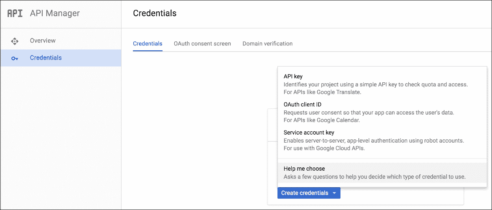
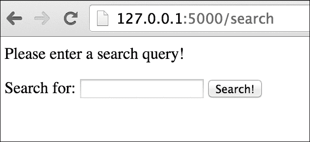
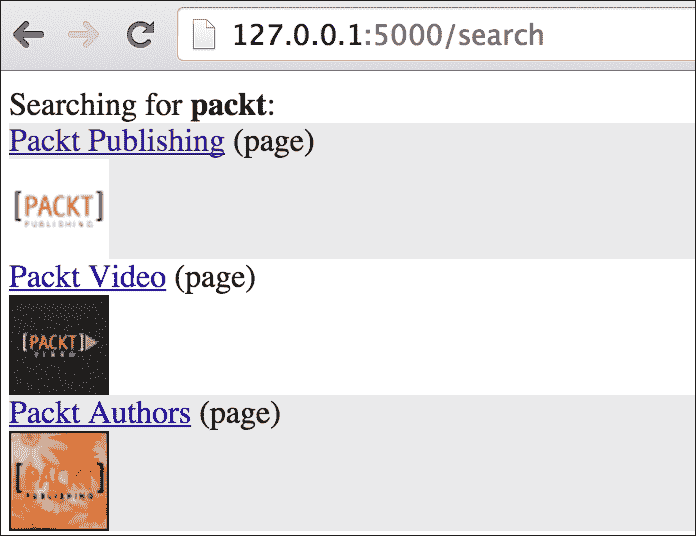
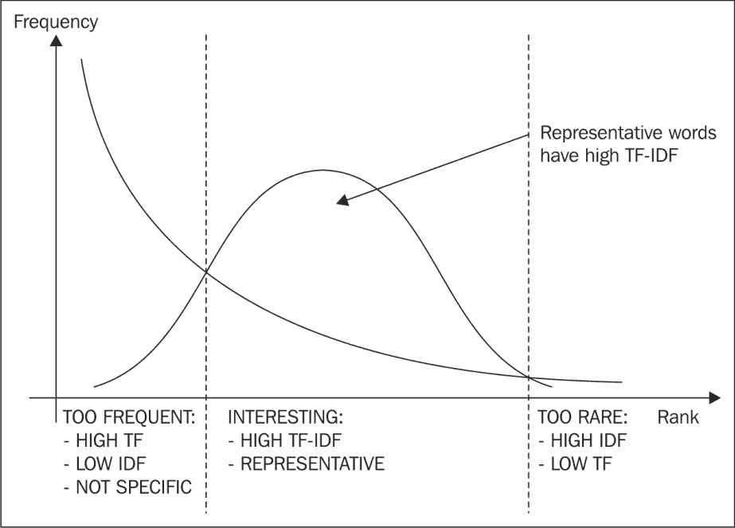

# 五、谷歌Plus话题分析

本章重点介绍谷歌+(有时称为谷歌 Plus 或简称 G+)，这是最近加入社交网络领域的大玩家之一。它于 2011 年推出，被描述为*“横跨谷歌所有服务的社交层”*([https://en.wikipedia.org/wiki/Google%2B](https://en.wikipedia.org/wiki/Google%2B))。它的用户群经历了极其快速的增长，前两周有 1000 万用户。经过多次重新设计，在 2015 年底，谷歌披露了他们对社区和收藏的更大关注，将服务转向基于兴趣的网络。

在本章中，我们将讨论以下主题:

*   如何借助 Python 与 Google+ API 进行交互
*   如何在 Google+上搜索人物或页面
*   如何使用 web 框架 **Flask** 在 web GUI 中可视化搜索结果
*   如何处理用户帖子中的内容以提取感兴趣的关键词

# 开始使用谷歌+应用编程接口

Google+ API 是 Google+的编程接口。这个应用编程接口可以用来整合你的应用程序或网站与谷歌+，类似于我们已经讨论过的推特和脸书。本节讨论注册应用程序和开始使用谷歌+应用编程接口的过程。

在开始之前，如果我们还没有注册，我们需要一个谷歌账户([https://www.google.com/accounts](https://www.google.com/accounts))。谷歌提供了几种服务(例如，Gmail、Blogger 等)，但账户管理是集中的。这意味着，如果您是这些服务之一的用户，您的帐户可以快速设置为谷歌+。

注册登录后，起点就是谷歌开发者控制台([https://console.developers.google.com/start](https://console.developers.google.com/start))。从控制台，我们需要创建我们的第一个项目。*图 5.1* 显示了项目创建的对话框，我们只需要为我们的项目指定一个名称:


图 5.1:在谷歌开发者控制台中创建项目

项目创建后，我们需要专门启用谷歌+应用编程接口。从项目仪表板中，**使用谷歌 API**组件允许我们管理 API 访问，创建新的凭证，等等。类似于单个谷歌帐户可以用来访问多个谷歌服务的方式，一个项目可以使用多个 API，只要它们被启用。一旦我们找到了**社交应用编程接口**组下的谷歌+应用编程接口，我们只需点击一下就可以启用它。*图 5.2* 显示**概述**，如下:


图 5.2:为我们的项目启用谷歌+应用编程接口

API 启用后，系统会立即提醒我们，为了消费 API，我们需要某种凭证，如图*图 5.3* :


图 5.3:启用 API 后，我们需要设置凭证

从左侧菜单可轻松访问**凭证**选项卡。有三种不同类型的凭据: **API 密钥**、 **OAuth 客户端 ID** 或**服务帐户密钥**(后者仅在服务器到服务器使用谷歌云 API 时需要)。

简单的 API 访问需要一个 **API 键**，即不访问任何私有用户数据的 API 调用。此密钥支持应用程序级身份验证，主要用于出于会计目的衡量项目使用情况(有关费率限制的更多详细信息，请参见以下部分)。

授权的应用编程接口访问需要一个 **OAuth 客户端标识**，也就是说，一个访问私有用户数据的应用编程接口调用。在调用之前，有权访问私有数据的用户必须明确授予对您的应用程序的访问权限。不同的谷歌应用编程接口声明不同的范围，也就是说，必须由用户批准的一组允许的操作。

如果您不确定应用程序需要的凭据类型，仪表板还提供了一个**帮助我选择**选项(如图 5.4*所示)*，该选项将通过几个简单的问题引导您完成选择，这些问题将阐明您的应用程序需要的权限级别:



图 5.4:选择应用编程接口访问凭证类型的下拉菜单

一旦我们设置了我们需要的项目和访问键，我们就可以研究如何以编程方式访问谷歌+应用编程接口。

谷歌为谷歌 API 提供了一个官方 Python 客户端，可以用`pip`在我们的虚拟环境中安装，使用通常的程序:

```py
$ pip install google-api-python-client

```

客户端将通过`googleapiclient`包提供，该包也简称为`apiclient`。下一节展示了测试应用编程接口使用的第一个工作示例。

## 在 Google+上搜索

第一个例子显示在`gplus_search_example.py`脚本中，查询搜索人员或页面的谷歌+应用编程接口。

这个例子假设您已经通过项目仪表板上的**凭证**页面设置了一个简单访问的 API 键——我们还没有访问个人数据。与我们对 Twitter 和脸书所做的类似，我们将遵循将凭据存储为环境变量的模式。例如，如果我们使用的是 Bash 提示符，我们可以使用以下命令:

```py
$ export GOOGLE_API_KEY="your-api-key-here"

```

如果我们希望，也可以将`export`命令包含在 shell 脚本中:

```py
# Chap05/gplus_search_example.py 
import os 
import json 
from argparse import ArgumentParser 
from apiclient.discovery import build 

def get_parser(): 
  parser = ArgumentParser() 
  parser.add_argument('--query', nargs='*') 
  return parser 

if __name__ == '__main__': 
  api_key = os.environ.get('GOOGLE_API_KEY') 
  parser = get_parser() 
  args = parser.parse_args() 

  service = build('plus', 
                  'v1', 
                  developerKey=api_key) 

  people_feed = service.people() 
  search_query = people_feed.search(query=args.query) 
  search_results = search_query.execute() 

  print(json.dumps(search_results, indent=4)) 

```

该脚本使用`ArgumentParser`实例从命令行读取查询字符串。例如，如果我们想要查询术语`packt`，我们可以运行如下脚本:

```py
$ python gplus_search_example.py --query packt

```

解析器的`--query`参数是用`nargs='*'`属性定义的，因此可以为搜索查询添加和使用多个术语。

使用 API 的起点是使用`build()`函数创建一个`service`对象。从 Google API 客户端，我们将导入服务构建器，它以我们要交互的服务的名称(`plus`)及其 API 的版本(`v1`)作为强制参数，后面是`developerKey`，也就是我们之前定义的 API 键。

### 注

支持的 api 列表及其最新版本见[https://developers . Google . com/API-client-library/python/API/](https://developers.google.com/api-client-library/python/apis/)文档。

一般来说，服务构建器的使用方式如下:

```py
from apiclient.discovery import build 
service = build('api_name', 'api_version', [extra params]) 

```

一旦构建了`service`对象，它就可以提供对不同资源(分组为集合)的访问。在示例中，我们将查询`people`集合。

一旦构建并执行了搜索查询，脚本只需将 JSON 输出转储到屏幕上，这样我们就可以理解格式了:

```py
{ 
  "nextPageToken": "token-string", 
  "selfLink": "link-to-this-request", 
  "title": "Google+ People Search Results", 
  "etag": "etag-string", 
  "kind": "plus#peopleFeed", 
  "items": [ 
    { 
      "kind": "plus#person", 
      "objectType": "page", 
      "image": { 
        "url": "url-to-image" 
      }, 
      "id": "112328881995125817822", 
      "etag": "etag-string", 
      "displayName": "Packt Publishing", 
      "url": "https://plus.google.com/+packtpublishing" 
    }, 
    { 
      /* more items ... */ 
    } 
  ] 
} 

```

为了简洁，输出被简化了，但是整体结构是清晰的。第一级属性(例如，`title`、`selfLink`等)定义了结果集的一些特征。结果列表包含在`items`列表中。每个物品都由`id`属性唯一标识，也由其`url`表示。本例中显示的结果可以包含页面和人员的混合，如`objectType`属性中所定义的。`displayName`属性由用户(或页面管理员)选择，通常显示在相应的 G+页面中。

# 将搜索结果嵌入网络图形用户界面

在本节中，我们将扩展第一个示例，以便可视化我们的搜索结果。作为显示项目的一种方式，我们将使用一个动态自动生成的网页，这样我们就可以使用熟悉的界面在每个人或页面的显示名称旁边显示配置文件图像。这种可视化可以帮助我们消除共享相同显示名称的不同结果之间的歧义。

为了达到这个目标，我们将引入**Flask**([http://flask.pocoo.org/](http://flask.pocoo.org/))，这是一个用于 web 开发的微框架，允许我们快速生成 web 界面。

广义地说，Python 和 web 开发是齐头并进的，几个与 web 相关的 Python 库已经存在了很多年，达到了一个有趣的成熟水平。与其他框架相比，Flask 相对年轻，但它也达到了成熟的水平，并被广泛的社区采用。由于 web 开发不是本书的核心概念，我们将采用 Flask，这是由于它的*微*性质——它对我们应用程序的结构不做任何假设，并且使我们更容易用相对少量的代码开始。

Flask 的一些特性包括:

*   开发服务器和调试器
*   对单元测试的集成支持
*   使用 Jinja2 库支持模板化
*   它是基于 Unicode 的
*   各种用例的大量扩展

使用`pip`的安装过程是通常的，如下:

```py
$ pip install flask

```

前面的命令将安装微框架和相关的依赖项。

感兴趣的读者可以通过*packkt Publishing*以各种标题拓宽知识面，例如， *Matt Copperwaite* 和 *Charles Leifer* 的*学习烧瓶框架*或 *Jack 斯托福*的*标准烧瓶*获取更高级的用例。本章将直接跳到一个例子，尽量减少关于 Flask 的讨论:

```py
# Chap05/gplus_search_web_gui.py 
import os 
import json 
from flask import Flask 
from flask import request 
from flask import render_template 
from apiclient.discovery import build 

app = Flask(__name__) 
api_key = os.environ.get('GOOGLE_API_KEY') 

@app.route('/') 
def index(): 
  return render_template('search_form.html') 

@app.route('/search', methods=['POST']) 
def search(): 
  query = request.form.get('query') 
  if not query: 
    # query not given, show an error message 
    message = 'Please enter a search query!' 
    return render_template('search_form.html', message=message) 
  else: 
    # search 
    service = build('plus', 
                    'v1', 
                    developerKey=api_key) 

    people_feed = service.people() 
    search_query = people_feed.search(query=query) 
    search_results = search_query.execute() 
    return render_template('search_results.html', 
                           query=query, 
                           results=search_results['items']) 

if __name__ == '__main__': 
  app.run(debug=True) 

```

`gplus_search_web_gui.py`脚本在 Flask 中实现了一个基本的 web 应用，展示了一个查询 Google+ API 并显示结果的简单表单。

应用程序只是`Flask`类的一个实例，它的主要方法是`run()`，用于启动 web 服务器(在示例中，我们将在调试模式下运行它，以便在需要时简化调试过程)。

web 应用程序的行为由其路由定义，也就是说，当在特定的 URL 上执行请求时，Flask 会在所需的代码段上路由该请求，这将产生响应。在最简单的形式中，Flask 中的路由只是简单的修饰功能。

## Python 中的装饰器

虽然在 Python 中使用装饰器非常简单，但是如果您是这个主题的新手，理解它们并不容易。

装饰器只是一个函数，它可以通过充当目标函数的包装器来丰富另一个函数的行为。这种行为的改变是动态的，因为它不需要目标函数代码的任何改变，也不需要子类化的使用。通过这种方式，可以改进特定的功能，而不会给现有的代码库带来任何特殊的复杂性。

一般来说，装饰者是一个强大而优雅的工具，可以证明在不同的情况下极其有用。

在前面的例子中，`index()`和`search()`是修饰的函数，在这两种情况下，修饰者都是`app.route()`。装饰器在目标函数的正上方被调用，并以`@`符号作为前缀。

## 烧瓶路线和模板

`app.route()`装饰器获取第一个参数，该参数带有我们想要访问的资源的相对 URL。第二个参数是特定网址支持的 HTTP 方法列表。如果没有给出第二个参数，则默认为`GET`方法。

`index()`功能用于显示包含搜索表单的进入页面，可在相对网址`/`获得。该功能通过`render_template()`功能返回保存在`search_form.html`模板中的网页。

当 Flask 利用 Jinja2 模板库([http://jinja.pocoo.org/](http://jinja.pocoo.org/))时，`render_template()`函数读取存储在 HTML 文件中的代码，应用模板指令，并返回最终的 HTML 页面作为输出。

不需要过多讨论最好留给感兴趣的读者在官方文档中查看的细节，使用模板库的目的是引入一种嵌入到网页中的特殊语法，该语法可以被解析以动态生成 HTML。

`templates/search_form.html`文件的来源，相对于运行 Flask 的 Python 文件定位，在我们的例子中为`gplus_search_web_gui.py`，如下所示:

```py
<html> 
  <body> 

     
    <p>{{ message }}</p> 
     

    <form action="/search" method="post"> 
      Search for: 
      <input type="text" name="query" /> 
      <input type="submit" name="submit" value="Search!" /> 
    </form> 

  </body> 
</html> 

```

源代码包含一个基本页面(为简洁起见过于简化)，只有一个表单。这个页面上唯一的模板指令是一个`if`块，它检查`message`变量并在一个段落中显示它(如果有的话)。

使用开机自检方法将表单操作设置为相对网址`/search`。这是`gplus_search_web_gui.py`文件`search()`中第二个修饰功能的配置。

`search()`功能是与 Google+ API 进行交互的地方。首先，函数期望通过表单传递一个`query`参数。该参数可通过`request.form`字典访问。

Flask 中的全局`request`对象通常用于访问传入的请求数据。`request.form`字典提供了对使用 POST 方法通过表单传递的数据的访问。

如果没有给出查询，`search()`功能将再次显示搜索表单，包括一条错误消息。`render_template()`函数获取多个关键字参数，并将它们传递给模板，在这种情况下，唯一的参数是`message`。

另一方面，如果提供了查询，`search()`函数将执行与 Google+ API 的交互，并将结果馈送到`search_results.html`模板。`templates/search_results.html`文件的来源如下:

```py
<html> 
  <link rel="stylesheet" 
    href="{{ url_for('static', filename='style.css') }}" /> 
  <body> 

    Searching for <strong>{{ query }}</strong>: 

     
    <div class="{{ loop.cycle('row_odd', 'row_even') }}"> 
      <a href="{{ item.url }}">{{ item.displayName }}</a> 
      ({{ item.objectType}})<br /> 
      <a href="{{ item.url }}"> 
         
      </a> 
    </div> 
     

    <p><a href="/">New search</a></p> 

  </body> 
</html> 

```

主体的核心是一个`for`循环，它遍历结果列表。对于列表中的每个项目，都会显示一个带有给定项目详细信息的`<div>`元素。我们注意到打印特定变量值的语法是用双花括号构造的，例如，`{{ item.displayName }}`将打印每个项目的显示名称。另一方面，控制流程包含在``符号中。

该示例还使用了一些有趣的工具，这些工具允许与个性化结果页面外观所必需的**级联样式表** ( **CSS** )轻松集成。`loop.cycle()`函数用于在一系列字符串或变量之间循环，它在这里用于将不同的 CSS 类分配给形成结果的`<div>`块。这样，不同的行可以用不同的(替代的)颜色突出显示。另一个工具是`url_for()`功能，用于提供特定资源的网址。类似于`templates`文件夹的`static`文件夹必须放在运行 Flask 应用程序的`gplus_search_web_gui.py`文件的相同目录中。它用于提供静态文件，如图像或 CSS 定义。`static/style.css`文件包含搜索结果页面中使用的 CSS 的定义，如下所示:

```py
.row_odd { 
  background-color: #eaeaea; 
} 
.row_even { 
  background-color: #fff; 
} 

```

虽然 web 开发的主题与数据挖掘没有严格的关系，但它提供了一种快速原型化一些简单用户界面的简单方法。主题相当广泛，这一章并不旨在全面讨论。一个感兴趣的读者被邀请深入研究网络开发和 Flask 的细节。

该示例可以使用以下命令行运行:

```py
$ python gplus_search_web_gui.py

```

这将运行 Flask 应用程序，它将等待一个 HTTP 请求，以便提供 Python 代码中定义的响应。运行脚本后，应用程序应该在前台运行，并且终端上应该出现以下输出:

```py
* Running on http://127.0.0.1:5000/ (Press CTRL+C to quit)

```

`127.0.0.1`地址是本地主机，而端口`5000`是 Flask 的默认值。

### 型式

**通过网络可见的 Flask 服务器**

如果您在虚拟机或通过网络运行 Flask 应用程序，您需要为此计算机使用适当的网络地址，而不是本地主机地址。

此外，您需要确保服务器在外部可见，以便可以通过网络访问。因为这可能会带来安全隐患，所以首先建议您考虑是否信任网络用户。

为了使 Flask 应用程序在外部可见，您可以禁用调试模式或将服务器绑定到适当的地址，例如:

`app.run(host='0.0.0.0')`

这里，`0.0.0.0`表示本地机器上的所有地址。

我们现在可以打开一个浏览器窗口，指向`http://127.0.0.1:5000`，如图*图 5.5* :


图 5.5:Flask 应用程序的入口页面

如果我们点击**搜索！**按钮不插入任何输入，app 会再次显示带有错误信息的表单，如图*图 5.6* :



图 5.6:如果没有给出查询，将显示错误消息

另一方面，如果正确给出查询，结果页面将显示为*图 5.7* (该图给出的查询为`packt`):



图 5.7:在谷歌+应用编程接口上搜索的结果

正如我们所看到的，每个项目都显示在它自己的块中，具有交替的背景颜色和关于项目本身的所需信息。项目名称在锚点标签(`<a>`)中表示，因此它们是可点击的，并链接到相关的谷歌+页面。

# 来自 Google+页面的笔记和活动

在搜索一个谷歌+页面并在网络图形用户界面中可视化结果后，我们将继续下载给定页面的活动列表。活动相当于谷歌+的脸书帖子。默认情况下，一个活动被认为是一个笔记，也就是在 Google+上共享的一段文字。

以下脚本`gplus_get_page_activities.py`用于从 Google+页面收集活动列表:

```py
# Chap05/gplus_get_page_activities.py 
import os 
import json 
from argparse import ArgumentParser 
from apiclient.discovery import build 

def get_parser(): 
  parser = ArgumentParser() 
  parser.add_argument('--page') 
  parser.add_argument('--max-results', type=int, default=100) 
  return parser 

if __name__ == '__main__': 
  api_key = os.environ.get('GOOGLE_API_KEY') 
  parser = get_parser() 
  args = parser.parse_args() 

  service = build('plus', 
                  'v1', 
                  developerKey=api_key) 

  activity_feed = service.activities() 
  activity_query = activity_feed.list( 
                                      collection='public', 
                                      userId=args.page, 
                                      maxResults='100' 
                                      ) 

  fname = 'activities_{}.jsonl'.format(args.page) 
  with open(fname, 'w') as f: 
    retrieved_results = 0 
    while activity_query and retrieved_results < args.max_results: 
      activity_results = activity_query.execute() 
      retrieved_results += len(activity_results['items']) 
      for item in activity_results['items']: 
        f.write(json.dumps(item)+"\n")
      activity_query = service.activities().list_next(activity_query,
                                                      activity_results)
```

该脚本使用`ArgumentParser`从命令行获取几个输入参数。`--page`选项是必需的，因为它包含我们正在寻找的页面(或用户)的标识。该参数可以是页面的数字标识，也可以是其谷歌+句柄(例如，Packt Publishing G+页面的`+packtpublishing`)。另一个参数是我们想要检索的结果(即活动)的最大数量。该参数可选，默认为`100`。

该脚本可以按如下方式运行:

```py
$ python gplus_get_page_activities.py --page +packtpublishing 
  --max-results 1000

```

几秒钟后，我们会在`activities_+packtpublishing.jsonl`文件中找到 JSON 格式的活动列表。这个文件，就像我们为 Twitter 和脸书做的一样，是根据 JSON Lines 规范格式化的，这意味着每一行都是一个有效的 JSON 文档。

单个活动的完整描述可在[https://developers . Google . com/+/web/API/rest/latest/activities # resource](https://developers.google.com/+/web/api/rest/latest/activities#resource)的文档中找到。下表概述了最重要的字段:

*   `kind`:这是项目类型(即`plus#activity`)
*   `etag`:这是实体标签串(参考[https://en.wikipedia.org/wiki/HTTP_ETag](https://en.wikipedia.org/wiki/HTTP_ETag)
*   `title`:这是活动的简称
*   `verb`:这不是帖子就是分享
*   `actor`:这是一个代表分享或发布活动的用户的对象
*   `published`:这是 ISO 8601 格式的出版日期
*   `updated`:这是 ISO 8601 格式的上次更新日期
*   `id`:这是活动的唯一标识符
*   `url`:这是活动的 URL
*   `object`:这是一个复杂的对象，包含活动的所有细节，例如内容、原始参与者(如果活动是共享，这将不同于活动的参与者)、回复、共享和*plus one*的信息、附件列表和相关细节(例如，图像)，以及地理位置信息(如果有)

对象的描述引入了*加一*的概念，有点类似于脸书上的 *Like* 按钮。当用户喜欢谷歌+上的某个特定内容时，他们可以 *+1* 它。+1 按钮允许用户在谷歌+上共享内容，它还推荐谷歌搜索上的内容。JSON 文档中的`plusoners`键提供了特定对象上+1 个反应的详细信息。`plusoners.totalItems`包含+1 反应的数量，`plusoners.selfLink`包含一个到+1 列表的 API 链接。类似地，`replies`和`resharers`包含相同的关于直接评论和分享的信息。

查看下载活动列表的代码要旨，可以看到出发点仍然是`apiclient.discovery.build()`函数构建服务对象。以下步骤将活动集合存储在`activity_feed`对象中。为了查询`activity_feed`对象，我们将使用其`list()`功能，而不是`search()`，因为我们正在检索完整的活动列表(至少达到可用结果的最大数量)。该功能需要两个强制参数:`collection`和`userId`。而`collection`只能接受`public`作为值，`userId`参数是我们正在检索其活动的用户/页面的标识符。该参数可以是唯一数字标识符或谷歌+处理程序字符串的形式。我们也可以通过`maxResults`作为可选参数，在本例中设置为`100`。这是单个 API 调用可以检索的项目数(默认为`20`，最大为`100`)。

代码还展示了如何使用这个 API 进行分页。查询在`while`循环中执行，该循环用检索到的结果数更新计数器(循环到通过`--max-results`指定的值)，并检查下一页结果是否存在。`list_next()`函数以当前查询和当前结果列表为参数，通过更新查询对象来处理分页。如果下一页结果不可用(即用户/页面发布的帖子没有超过已经检索到的帖子)，该功能将返回`None`。

# 笔记上的文本分析和 TF-IDF

在讨论了如何下载给定页面或用户的笔记和活动列表后，我们将把重点转移到内容的文本分析上。

对于给定用户发布的每个帖子，我们希望提取最有趣的关键词，这些关键词可以用来总结帖子本身。

虽然这在直觉上是一个简单的练习，但有一些微妙之处需要考虑。在实际方面，我们可以很容易地观察到，每个帖子的内容并不总是一段干净的文本，事实上，HTML 标签可以包含在内容中。在进行计算之前，我们需要提取干净的文本。虽然 Google+ API 返回的 JSON 对象结构清晰，但内容本身不一定是格式良好的结构化文档。幸运的是，有一个不错的 Python 包来拯救。**美汤**其实是能够解析 HTML 和 XML 文档，包括格式错误的标记。它与 Python 3 兼容，可以以通常的方式从 CheeseShop 安装。在我们的虚拟环境中，使用以下命令:

```py
$ pip install beautifulsoup4

```

这将安装版本 4。*图书馆。从版本 3 的过渡。*到版本 4。*已经看到了一些重要的变化，因此这里显示的示例与旧版本的库不兼容。

下一个重要的问题是我们如何定义关键词的重要性？

这个问题可以从不同的方向解决，重要性的定义可以根据应用而改变。在我们的案例中，我们将使用基于统计的方法，其中关键字的重要性由它在文档中的存在和我们正在分析的文档集合给出。

提议的方法被称为**TF-IDF**([https://en.wikipedia.org/wiki/Tf%E2%80%93idf](https://en.wikipedia.org/wiki/Tf%E2%80%93idf))，这是基于术语频率的两个分数( **TF** 和 **IDF** 的组合。[第 3 章](3.html "Chapter 3. Users, Followers, and Communities on Twitter")、*Twitter 上的用户、关注者和社区*，在 Twitter 上简要介绍了 TF-IDF 使用 scikit-learn 库提供的现成实现。一般来说，使用现有的实现是一个好主意，尤其是如果它来自高质量的库，比如 scikit-learn。在本节中，我们将提出一个定制的实现，这样我们就可以展示 TF-IDF 的细节，让读者更好地理解这个框架。

TF-IDF 背后的动机相当简单:如果一个词在文档中出现的频率很高，那么它是表示文档的一个很好的候选词，但是在整个集合中很少出现。这两个属性通过两个分数来反映:**术语频率** ( **TF** )，文档内术语的局部频率，以及**逆文档频率** ( **IDF** )，在整个文档集合上计算。

IDF 于 1972 年在信息检索研究的背景下由该领域的先驱之一凯伦·斯帕克-琼斯([https://en.wikipedia.org/wiki/Karen_Sp%C3%A4rck_Jones](https://en.wikipedia.org/wiki/Karen_Sp%C3%A4rck_Jones))提出。作为一种启发，它展示了术语特异性和齐夫定律([https://en.wikipedia.org/wiki/Zipf%27s_law](https://en.wikipedia.org/wiki/Zipf%27s_law))之间的联系。

### 型式

**齐夫定律和齐夫安分布**

Zipf 定律是一个经验定律，指的是不同科学领域的许多类型的数据可以用一个 Zipfian(即长尾)分布来近似。在[第 2 章](2.html "Chapter 2.  #MiningTwitter – Hashtags, Topics, and Time Series")、*# miningtwetter-Hashtags、Topics 和 Time Series* 中，我们已经观察到 Packt Publishing 在推文中使用的词汇遵循这种分布。关于齐夫定律的更多细节，请参考[第 2 章](2.html "Chapter 2.  #MiningTwitter – Hashtags, Topics, and Time Series")、*# miningtwetter-Hashtags、Topics 和 Time Series* 。

从数学的角度来看，多年来已经提出了 TF 和 IDF 的不同变体。

TF 最常见的两种选择是简单地考虑文档中某个单词的原始频率，或者根据文档中的单词数量对其进行归一化(也就是说，对观察文档中某个单词的概率的频繁解释)。

在 IDF 方面，传统的定义是`log(N/n)`，其中`N`是文档的总数，而`n`是包含给定术语的文档数。对于每个文档中出现的术语，这将导致 IDF 值为零(即`log(1)`)。出于这个原因，以色列国防军可能的正常化之一是`1+log(N/n)`。

*图 5.8* 提供了 TF-IDF 背后的直觉及其与 Zipf 定律的联系的可视化表示——过于频繁或过于罕见的词语不具有代表性:



图 5.8:单词的分布及其重要性

常用词包括终止词，例如，冠词、连词和命题。一般来说，它们本身没有任何特定的含义，所以可以忽略(即删除)。另一方面，非常罕见的词包括错别字和过于专业的术语。根据应用程序的不同，有必要对数据集进行探索，以更好地理解停止单词移除是否是一个好主意。

`gplus_activities_keywords.py`脚本从给定的 JSON Lines 文件中读取活动列表，为每个活动的文本内容计算每个单词的 TF-IDF，然后显示每个帖子旁边的顶级关键词。

### 注

代码使用 NLTK 库来执行一些文本处理操作，例如标记化和停止单词删除。在[第 1 章](1.html "Chapter 1.  Social Media, Social Data, and Python")、*社交媒体、社交数据和 Python* 中，我们看到了如何下载执行其中一些操作所需的附加 NLTK 包，特别是用于令牌化的`punkt`包。

`gplus_activities_keywords.py`脚本如下:

```py
# Chap05/gplus_activities_keywords.py 
import os 
import json 
from argparse import ArgumentParser 
from collections import defaultdict 
from collections import Counter 
from operator import itemgetter 
from math import log 
from string import punctuation 
from bs4 import BeautifulSoup 
from nltk.tokenize import word_tokenize 
from nltk.corpus import stopwords 

```

我们将定义一个包含常见英语停止词和标点符号的停止词列表:

```py
punct = list(punctuation) 
all_stopwords = stopwords.words('english') + punct 

def get_parser(): 
  parser = ArgumentParser() 
  parser.add_argument('--file', 
                      '-f', 
                      required=True, 
                      help='The .jsonl file of the activities') 
  parser.add_argument('--keywords', 
                      type=int, 
                      default=3, 
                      help='N of words to extract for each post') 
  return parser 

```

预处理步骤由`preprocess()`函数处理，该函数协调规范化、数据清理(使用`clean_html()`辅助函数)和标记化:

```py
def clean_html(html): 
  soup = BeautifulSoup(html, "html.parser") 
  text = soup.get_text(" ", strip=True) 
  text = text.replace('\xa0', ' ') 
  text = text.replace('\ufeff', ' ') 
  text = ' '.join(text.split()) 
  return text 

def preprocess(text, stop=all_stopwords, normalize=True): 
  if normalize: 
    text = text.lower() 
  text = clean_html(text) 
  tokens = word_tokenize(text) 
  return [tok for tok in tokens if tok not in stop] 

```

以下函数处理基于单词的统计。`make_idf()`创建集合范围内的 IDF 分数，`get_keywords()`可以使用该分数计算每个文档的 TF-IDF 分数，目的是提取感兴趣的关键词:

```py
def make_idf(corpus): 
  df = defaultdict(int) 
  for doc in corpus: 
    terms = set(doc) 
    for term in terms: 
      df[term] += 1 
  idf = {} 
  for term, term_df in df.items(): 
    idf[term] = 1 + log(len(corpus) / term_df) 
  return idf 

def get_keywords(doc, idf, normalize=False): 
  tf = Counter(doc) 
  if normalize: 
    tf = {term: tf_value/len(doc) 
          for term, tf_value in tf.items()} 
  tfidf = {term: tf_value*idf[term] 
           for term, tf_value in tf.items()} 
  return sorted(tfidf.items(), 
                key=itemgetter(1), 
                reverse=True) 

if __name__ == '__main__': 
  parser = get_parser() 
  args = parser.parse_args() 
  with open(args.file) as f: 

    posts = [] 
    for line in f: 
      activity = json.loads(line) 
      posts.append(preprocess(activity['object']['content'])) 

  idf = make_idf(posts) 

  for i, post in enumerate(posts): 
    keywords = get_keywords(post, idf) 
    print("----------") 
    print("Content: {}".format(post)) 
    print("Keywords: {}".format(keywords[:args.keywords])) 

```

像往常一样，我们将利用`ArgumentParser`来读取命令行参数。具体来说，`--file`用于传递文件名，`--keywords`是一个可选参数，用于指定我们要观察的每个文档的关键词数量(默认为`3`)。

例如，该脚本可以按如下方式运行:

```py
$ python gplus_activities_keywords.py --file 
  activities_+LarryPage.jsonl --keywords 5

```

该命令将为用户+LarryPage 读取活动的`.jsonl`文件(假设我们之前下载了它)，并将显示每个活动的前五个关键词。

例如，拉里·佩奇的一篇文章如下:

```py
----------
Content: ['fun', 'day', 'kiteboarding', 'alaska', 'pretty', 'cold', 'gusty', 'ago']
Keywords: [('alaska', 5.983606621708336), ('gusty', 5.983606621708336), ('kiteboarding', 5.983606621708336), ('cold', 4.884994333040227), ('pretty', 3.9041650800285006)]

```

如我们所见，帖子显示为术语列表，而关键字显示为元组列表，每个元组包含术语本身和 TF-IDF 分数。

从全文到令牌列表的转换由`preprocess()`函数处理，该函数也使用`clean_html()`函数作为助手。

预处理包括以下步骤:

*   文本规范化(即降低音量)
*   HTML 清理/剥离
*   标记化
*   停止单词删除

`preprocess()`函数只需要一个强制参数，我们可以对要删除的停止词列表进行个性化设置(如果不想执行此步骤，则传递一个空列表)，也可以通过设置两个关键字参数`stop`和`normalize`来关闭下限。

文本规范化用于将仅因使用的大小写而不同的单词组合在一起，例如，*和*将通过下取过程映射到*中。Lowercasing 对很多应用程序都有意义，但在某些情况下却没有帮助，例如 *us* (代词)对*us*(美国的首字母缩写)的情况。重要的是要记住，降级是不可逆的，所以如果我们需要在应用程序的后面参考原始文本，我们也需要继续下去。***

 **HTML 清理是用几行代码执行的，利用了美丽的汤。一旦用`html.parser`作为第二个参数实例化了`BeautifulSoup`对象，它就能够处理格式错误的 HTML。`get_text()`函数完全符合预期:它只获取文本，而不包含 HTML。空白作为这个函数的第一个参数，用来替换剥离的 HTML 标记。这在以下情况下很有用:

```py
... some sentence<br />The beginning of the next one 

```

在这种情况下，仅仅剥离断线标签就会创建`sentenceThe`标记，这显然不是一个真正的单词。用空格替换标签解决了这个问题。

`clean_html()`函数还用几个字符串替换了空白的 Unicode 字符。最后，如果文本中存在多个连续的空格，则通过拆分文本并重新连接它们，将它们规范化为单个空格(例如，`' '.join(text.split())`)。

令牌化是将字符串分解成单个令牌的过程，由 NLTK 通过其`word_tokenize()`函数来处理。

最后，通过简单的列表理解来执行停止词移除，其中对照`stop`列表检查每个标记。来自 NLTK 的英文停止词列表和来自`string.punctuation`的标点符号列表组合使用作为默认停止词列表。

TF-IDF 实现由两个函数处理:`make_idf()`和`get_keywords()`。由于 IDF 是一个集合范围的统计数据，我们将首先计算它。`corpus`参数是一个列表列表，也就是一个已经由`preprocess()`函数处理的标记化文档列表。

首先，我们将使用`df`字典计算文档频率。这个统计只是一个术语出现的文档数量，也就是说，我们不考虑重复。对于语料库中的每个文档，我们将在一个集合中铸造文档。这样，每个文档只考虑一次术语。其次，我们将迭代新构建的`df`字典的项目，我们将使用它来计算 IDF 分数，然后由函数返回。在 IDF 的这个版本中，我们将使用前面讨论过的+1 规范化。

此时，我们准备计算每个文档中每个术语的 TF-IDF 分数。迭代所有帖子，我们将调用`get_keywords()`函数，该函数接受两个参数:文档(令牌列表)和之前构建的 IDF 字典。第三个可选参数是激活文档长度归一化的标志，它有效地将 TF 转换为观察文档中某个术语的概率，即`P(t|d)`。

`get_keywords()`函数首先通过`collections.Counter`构建原始 TF，本质上是一个字典。如果需要文档长度标准化，`tf`字典通过字典理解来重建，将每个原始 TF 的值除以文档中的术语总数(即文档长度)。

TF-IDF 分数的计算方法是将每个术语的 TF 与 IDF 相乘。再一次，字典理解被用来达到目的。

最后，该函数返回带有相关 TF-IDF 分数的术语列表，按分数排序。使用`key=itemgetter(1)`调用`sorted()`函数，使用 TF-IDF 分数(元组中的第二项)应用排序，并使用`reverse=True`以降序显示值。

## 用 n-grams 捕捉短语

TF-IDF 提供了关于给定文档中关键字重要性的简单统计解释。使用这个模型，每个单词都被单独考虑，单词的顺序并不重要。事实上，单词是按顺序使用的，通常一系列单词在句子结构中充当一个单一的单位(这在语言学中也称为成分)。

给定一个标记化的文档(即一系列标记)，我们将 *n-grams* 称为从上述文档中提取的一系列`n`相邻术语。有了`n=1`，我们还在考虑单项式(也叫 unigrams)。如果值大于 1，我们将考虑任意长度的序列。典型的例子包括二元模型(带`n=2`)和三元模型(带`n=3`，但是任何序列长度都是可能的。

NLTK 提供了在给定令牌输入列表的情况下快速计算 n 克列表的工具。特别是处理 n-gram 生成的功能是`nltk.util.ngrams`:

```py
>>> from nltk.util import ngrams
>>> s = 'the quick brown fox jumped over the lazy dog'.split()
>>> s
['the', 'quick', 'brown', 'fox', 'jumped', 'over', 'the', 'lazy', 'dog']
>>> list(ngrams(s, 4))
[('the', 'quick', 'brown', 'fox'), ('quick', 'brown', 'fox', 'jumped'), ('brown', 'fox', 'jumped', 'over'), ('fox', 'jumped', 'over', 'the'), ('jumped', 'over', 'the', 'lazy'), ('over', 'the', 'lazy', 'dog')]

```

如您所见，该函数接受两个参数:一系列标记和一个数字。`ngrams()`返回的值是一个生成器对象，所以为了在提示符下可视化，我们将其转换为列表，但是它可以直接使用，例如在列表理解中。

NLTK 还提供了两个有用的快捷方式- `nltk.bigrams()`和`nltk.trigrams()`-分别用`n=2`和`n=3`简单调用`ngrams()`函数。

作为对感兴趣的读者的练习，我们将以以下问题结束本节:

*   我们能否修改本节中提出的代码，以便能够捕获有趣的二元模型或三元模型，而不仅仅是单个关键字？
*   捕捉 n 克时，停字去除的效果如何？

# 总结

在这一章中，我们看了谷歌+应用编程接口。我们还讨论了如何在谷歌开发者控制台上注册一个项目，以及如何为我们的项目启用所需的应用编程接口。

这一章从一个例子开始，展示了如何使用谷歌+应用编程接口执行搜索。然后在这个例子的基础上进行讨论，以便将应用编程接口的使用嵌入到网络应用程序中。Flask 是一个用于网络开发的微型框架，只需几行代码就可以启动并运行，我们利用它构建了一个网络图形用户界面来显示搜索会话的结果。

下一步是分析用户或页面的文本注释。在下载用户活动并以 JSON Lines 格式存储它们之后，我们讨论了 TF-IDF 的一些细节，作为从一段文本中提取有趣关键词的统计方法。

在下一章中，我们将把注意力转移到问题回答领域，我们将通过接近堆栈溢出应用编程接口来做到这一点。**