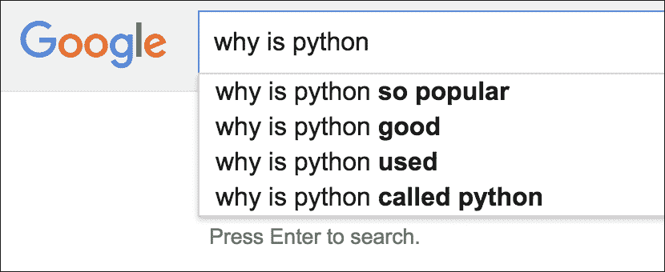
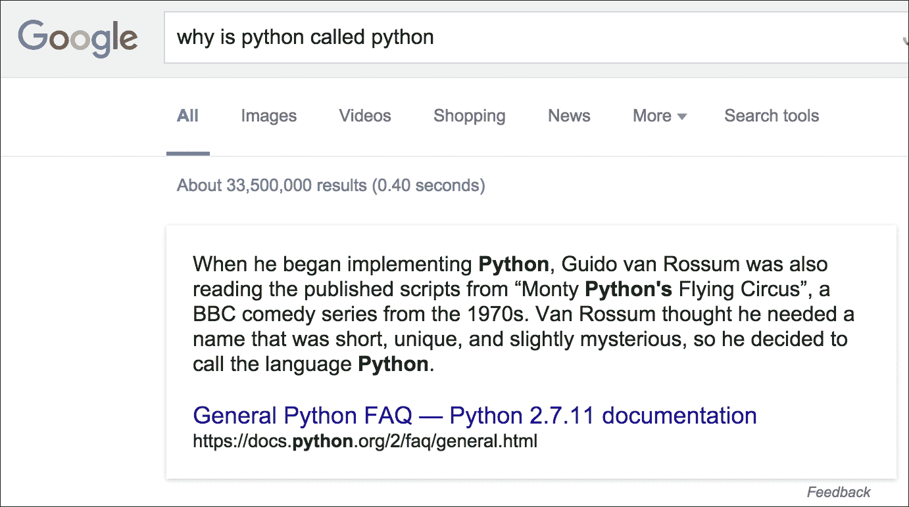
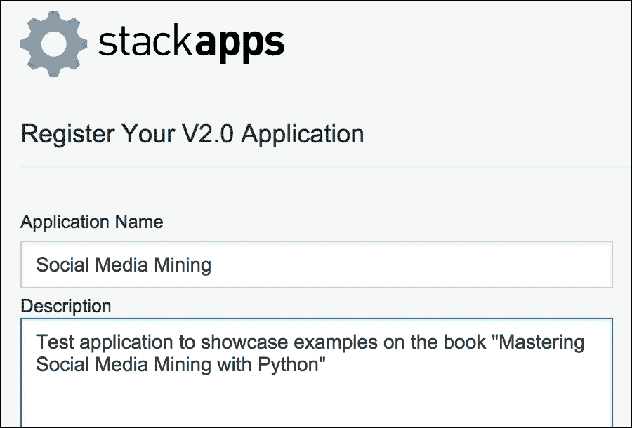
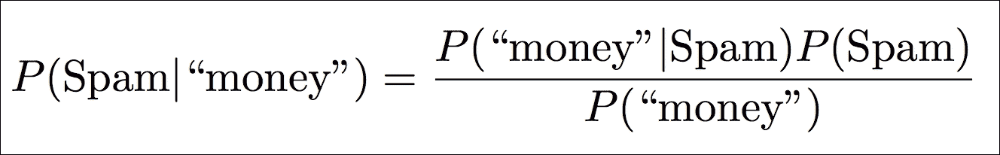
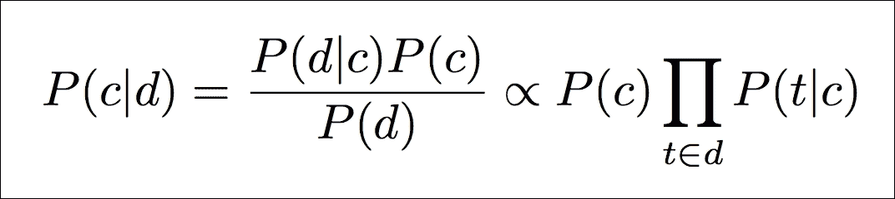

# 第六章。栈交换问答

这一章是关于堆栈交换、问答网络和更广泛的问答主题。

在本章中，我们将讨论以下主题:

*   如何创建与堆栈交换应用编程接口交互的应用程序
*   如何在 Stack Exchange 上搜索用户和问题
*   如何处理离线处理的数据转储
*   用于文本分类的监督机器学习方法
*   如何使用机器学习预测问题标签
*   如何在实时应用程序中嵌入机器学习模型

# 问答

寻找特定信息需求的答案是网络的主要用途之一。随着时间的推移，技术不断发展，互联网用户也一直在改变他们的在线行为。

如今人们在互联网上寻找信息的方式与 15-20 年前大不相同。在早期，寻找答案主要意味着使用搜索引擎。对 90 年代末一个流行搜索引擎的查询日志的研究显示，在那个年代，典型的搜索非常短(平均 2.4 个词)。

近年来，我们开始经历从短的基于关键词的搜索查询到长的会话查询(或者应该说，问题)的转变。换句话说，搜索引擎已经从关键词匹配转向**自然语言处理** ( **NLP** )。例如，*图 6.1* 显示了谷歌如何尝试自动完成用户的查询/问题。系统使用来自流行查询的统计数据来预测用户打算如何完成问题:



图 6.1:谷歌查询自动完成的一个例子

自然语言的用户界面为最终用户提供了更自然的体验。更高级的例子是嵌入在我们智能手机中的智能个人助理——谷歌的“现在”、苹果的“Siri”或微软的“Cortana”等应用程序允许用户搜索网络、获得关于餐馆的推荐或安排约会。

提问只是故事的一部分，因为最重要的部分是找到这个问题的答案。*图 6.2* 显示了回答查询的谷歌结果页面的顶部:`why is python called python`。当谷歌将查询解释为对话式查询时，即一个适当的问题，而不是一般的信息查询时，所谓的*回答框*被激活。该框包含一个网页片段，谷歌认为这是给定问题的答案。页面其余部分，图中未显示，包含传统的**搜索引擎结果页面** ( **SERP** ):



图 6.2:对话查询结果的答案框示例

自动**问答** ( **QA** )的研究不仅限于搜索引擎领域。人工智能领域的一项广受欢迎的成就以 IBM Watson 为代表，这是一个由 IBM 开发的问答系统，以 IBM 首任 CEO Thomas Watson([https://en . Wikipedia . org/wiki/Watson _(computer)](https://en.wikipedia.org/wiki/Watson_(computer)))命名。当机器在*危险游戏中与人类冠军竞争并获胜时，它变得流行起来！*，一个受欢迎的美国游戏节目，以智力竞赛为特色，参赛者必须在得到一些与答案相关的线索后找到正确的问题。当竞争正在逆转这个过程时，也就是说，你需要为给定的答案找到问题，解决问题所必需的技术可以双向运行。

虽然搜索引擎和智能个人助理正在改善用户在网上查找信息的方式，但寻找答案的迫切需求也推动了质量保证网站的兴起(参见[https://en.wikipedia.org/wiki/Comparison_of_Q%26A_sites](https://en.wikipedia.org/wiki/Comparison_of_Q%26A_sites))。最受欢迎的质量保证网络之一是堆栈交换([http://stackexchange.com](http://stackexchange.com))。最著名的是 Stack Overflow([http://stackoverflow.com](http://stackoverflow.com))，它的特色是对广泛的编程相关主题的问答，现在的网络由几十个主题网站组成，从技术到科学，从商业到娱乐。Stack Exchange 网站的其他例子包括电影&电视(针对电影和电视节目爱好者)、经验丰富的建议(针对专业和业余厨师)、英语语言&用法(针对语言学家、词源学家和英语语言爱好者)和学术(针对学者和高等教育入学者)。单个网站的列表很长，主题也相当多样([http://stackexchange.com/sites](http://stackexchange.com/sites))。

Stack Exchange 成功的原因之一可能是社区策划的高质量内容。问题和答案实际上是由用户投票决定的，这样顶级的答案就可以上升到顶级。通过使用网站获得的信誉积分机制，使我们能够识别社区中最活跃的成员及其专业领域。事实上，当用户的答案获得*向上*(或*向下*)的投票时，以及当他们提议内容编辑以提高网站质量时，用户可以获得(或失去)分数。该系统的游戏化还包括一系列的*徽章*，用户可以通过他们的贡献获得这些徽章。

为了保持内容的高质量，重复问题和低质量问题通常会被搁置，由版主审核，最终被编辑或关闭。

Stack Exchange 中没有社交网络服务的一些主要功能。例如，不可能直接与其他用户联系(例如，脸书和推特上的朋友或追随者关系)，也不能与其他用户进行私人对话。随着人们交流知识和协作，Stack Exchange 作为社交媒体平台的效果仍然很明显。

下一节介绍堆栈交换应用编程接口。

# 开始使用堆栈交换应用编程接口

栈交换应用编程接口([https://api.stackexchange.com/docs](https://api.stackexchange.com/docs))提供了对所有栈交换网站的编程访问。打算使用该应用编程接口的第三方应用程序应该在[http://stackapps.com](http://stackapps.com)注册，以便获得用于每天批准更多请求的请求密钥。注册的应用程序还可以执行经过身份验证的 API 调用，即代表经过身份验证的用户与 Stack Exchange 进行交互。注册过程相当简单，如*图 6.3* 所示-所有需要的细节是一个**申请名称**和**描述**:



图 6.3:在 stackapps.com 注册的应用程序

注册我们的应用程序的直接效果是 API 允许的每天请求数量增加。需要注意的是，速率限制不仅是每天设置的，也是为了防止泛洪(例如，如果同一 IP 每秒发送 30 个以上的请求，这些请求将被丢弃)。文件([https://api.stackexchange.com/docs/throttle](https://api.stackexchange.com/docs/throttle))中描述了限速申请的细节。

注册应用程序后，我们必须记下堆栈交换提供的密钥。而*客户端 ID* 和*客户端密码*必须用于 OAuth 过程，以防我们需要执行认证呼叫，关键是我们使用什么来享受增加的请求配额。重要的是要注意，如文档中所详述的，客户端 ID 和密钥不是秘密；而客户秘密，顾名思义，是不应该被传播的敏感信息。

通过使用环境变量，我们可以按照与前面章节相同的过程配置应用程序密钥的使用:

```py
$ export STACK_KEY="your-application-key"

```

在开始以编程方式与应用编程接口交互之前，我们需要的下一个工具是应用编程接口客户端。目前主要有一个(非官方的)Python 栈交换 API 客户端叫做**Py-StackExchange**([https://github.com/lucjon/Py-StackExchange](https://github.com/lucjon/Py-StackExchange))。客户端只需通过简单的接口将应用编程接口端点绑定到 Python 方法。

从我们的虚拟环境中，我们可以通过 CheeseShop 按照通常的方法安装 Py-StackExchange:

```py
$ pip install py-stackexchange

```

为了测试客户端并展示其核心类，我们可以使用 Python 交互式外壳并观察一些关于 Stack Overflow 网站的通用统计数据:

```py
>>> import os 
>>> import json 
>>> from stackexchange import Site 
>>> from stackexchange import StackOverflow 
>>> api_key = os.environ.get('STACK_KEY') 
>>> so = Site(StackOverflow, api_key) 
>>> info = so.info() 
>>> print(info.total_questions) 
10963403 
>>> print(info.questions_per_minute) 
2.78 
>>> print(info.total_comments) 
53184453 
>>> print(json.dumps(info.json, indent=4)) 
{ 
  "total_votes": 75841653, 
  "badges_per_minute": 4.25, 
  "total_answers": 17891858, 
  "total_questions": 10963403, 
  "_params_": { 
    "body": "false", 
    "site": "stackoverflow.com", 
    "comments": "false" 
  }, 
  "api_revision": "2016.1.27.19039", 
  "new_active_users": 35, 
  "total_accepted": 6102860, 
  "total_comments": 53184453, 
  "answers_per_minute": 4.54, 
  "total_users": 5126460, 
  "total_badges": 16758151, 
  "total_unanswered": 2940974, 
  "questions_per_minute": 2.78
} 

```

与 API 交互的核心类是`stackexchange.Site`，可以用两个参数进行实例化:第一个是我们感兴趣的 Stack Exchange 网站的类定义(本例中为`stackexchange.StackOverflow`)，第二个是(可选的)应用键。一旦定义了`Site`对象，我们就可以使用它的方法来访问应用编程接口。

在本例中，我们将使用`info()`方法访问`/info`端点([https://api.stackexchange.com/docs/info](https://api.stackexchange.com/docs/info))。返回的对象有许多属性。在本例中，我们将打印`total_questions`、`questions_per_minute`和`total_comments`的值。属性的完整列表在`info.__dict__`字典中可见，更一般地说，info 对象也有一个`info.json`属性，它包含来自 API 的原始响应，其中所有前述属性都以 JSON 格式显示。

## 搜索标记问题

在介绍了与堆栈交换应用编程接口的基本交互之后，我们将使用 Python 客户端来搜索问题。具体来说，我们将使用问题标签作为关键字的过滤器。

以下代码执行搜索:

```py
# Chap06/stack_search_keyword.py 
import os 
import json 
from argparse import ArgumentParser 
from stackexchange import Site 
from stackexchange import StackOverflow 

def get_parser(): 
  parser = ArgumentParser() 
  parser.add_argument('--tags') 
  parser.add_argument('--n', type=int, default=20) 
  return parser 

if __name__ == '__main__': 
  parser = get_parser() 
  args = parser.parse_args() 
  my_key = os.environ.get('STACK_KEY') 

  so = Site(StackOverflow, my_key) 
  questions = so.questions(tagged=args.tags, pagesize=20)[:args.n] 

  for i, item in enumerate(questions): 
    print("{}) {} by {}".format(i, 
                                item.title, 
                                item.owner.display_name)) 

```

代码使用`ArgumentParser`从命令行获取一些参数。特别是，`--tags`选项用于传递我们正在搜索的标签列表，用分号分隔。脚本给出的结果数量可以使用`--n`标志定义(默认为`20`问题)。

例如，我们可以按如下方式运行脚本:

```py
$ python stack_search_keyword.py --tags "python;nosql" --n 10

```

标签列表的双引号是必需的，因为分号是 Bash 这样的外壳上的命令分隔符，所以该行将被解释为两个独立的命令(第二个命令从`nosql`开始)。通过使用双引号，`python;nosql`字符串被解释为单个字符串，整个行被解释为单个命令，正如我们所期望的那样。

标签列表通过`questions()`方法的`tagged`参数传递给应用编程接口。该参数用于布尔`AND`查询，这意味着检索到的问题都用`python`和`nosql`标记。

### 型式

**布尔查询**

`questions()`方法实现了`/questions`端点([https://api.stackexchange.com/docs/questions](https://api.stackexchange.com/docs/questions)，其使用多个标签作为`AND`约束。调用此方法的输出是包含所有指定标记的问题列表。

`search()`方法改为实现`/search`端点([https://api.stackexchange.com/docs/search](https://api.stackexchange.com/docs/search)，这显示了相反的行为，因为多个标签被插入到一个`OR`约束中。调用此方法的输出是包含任何指定标记的问题列表。

需要注意的一个重要细节是，Py-StackExchange 客户端经常使用惰性列表来最小化幕后执行的 API 调用量。这意味着像`questions()`这样的方法不返回列表，而是返回结果集的包装器。通过这种结果集的直接迭代将尝试访问所有与查询匹配的项目(如果不小心，这将违背惰性列表的目的)，而不仅仅是给定页面大小的列表。

出于这个原因，我们使用`slice`运算符来显式调用给定数量的结果(通过命令行用`--n`参数指定，因此可用作`args.n`)。

### 型式

**切片切片 Python 列表**

`slice`运算符是一个强大的工具，但是对于经验较少的 Python 程序员来说，语法可能会有些混乱。以下示例总结了它的主要用途:

`# pick items from start to end-1`

`array[start:end]`

`# pick items from start to the rest of the array`

`array[start:]`

`# pick items from the beginning to end-1`

`array[:end]`

`# get a copy of the whole array`

`array[:]`

`# pick items from start to not past end, by step`

`array[start:end:step]`

`# get the last item`

`array[-1]`

`# get the last n items`

`array[-n:]`

`# get everything except the n items`

`array[:-n]`

例如，考虑以下情况:

`>>> data = ['one', 'two', 'three', 'four', 'five']`

`>>> data[2:4]`

`['three', 'four']`

`>>> data[2:]`

`['three', 'four', 'five']`

`>>> data[:4]`

`['one', 'two', 'three', 'four']`

`>>> newdata = data[:]`

`>>> newdata`

`['one', 'two', 'three', 'four', 'five']`

`>>> data[1:5:2]`

`['two', 'four']`

`>>> data[-1]`

`'five'`

`>>> data[-1:]`

`['five']`

`>>> data[:-2]`

`['one', 'two', 'three']`

需要记住的一个重要方面是索引从零开始，所以`data[0]`是第一项，`data[1]`是第二项，以此类推。

如前所示运行的`stack_search_keyword.py`脚本的输出是与 Python 和 NoSQL 相关的 10 个问题的标题序列，格式如下:

```py
n) Question title by User

```

单个问题(通过`item`变量在`for`循环中访问)被包装到`stackexchange.model.Question`模型类中，具有`title`或`tags`等属性。每个问题也通过`owner`属性链接到提问用户的模型。在示例中，我们访问问题的`title`和用户的`display_name`。

结果集按上次活动日期排序，这意味着具有最近活动(例如，具有新答案)的问题会首先显示。

使用`questions()`方法的`sort`属性可以影响这种行为，该属性可以采用以下任何值:

*   `activity`(默认):首先显示最近的活动
*   `creation`:首先显示最近的创建日期
*   `votes`:这个先显示最高分
*   `hot`:这使用了**热点问题**标签的公式
*   `week`:这使用了**周问题**标签的公式
*   `month`:这使用了**月问**标签的公式

## 搜索用户

在搜索问题之后，在本节中，我们将讨论如何搜索特定用户。搜索过程与用于检索问题的过程非常相似。下面的例子建立在前一个例子的基础上，我们扩展了`ArgumentParser`的使用来个性化一些搜索选项:

```py
# Chap06/stack_search_user.py 
import os 
import json 
from argparse import ArgumentParser 
from argparse import ArgumentTypeError 
from stackexchange import Site 
from stackexchange import StackOverflow 

```

以下功能用于验证通过`ArgumentParser`传递的参数。如果该值无效，它们将引发异常以停止脚本的执行:

```py
def check_sort_value(value): 
  valid_sort_values = [ 
    'reputation', 
    'creation', 
    'name', 
    'modified' 
  ] 
  if value not in valid_sort_values: 
     raise ArgumentTypeError("Invalid sort value") 
  return value 

def check_order_value(value): 
  valid_order_values = ['asc', 'desc'] 
  if value not in valid_order_values: 
    raise ArgumentTypeError("Invalid order value") 
  return value 

```

`check_sort_value()`和`check_order_value()`功能可以在`ArgumentParser`定义中用作相关参数的`type`:

```py
def get_parser(): 
  parser = ArgumentParser() 
  parser.add_argument('--name') 
  parser.add_argument('--sort', 
                      default='reputation', 
                      type=check_sort_value) 
  parser.add_argument('--order', 
                      default='desc', 
                      type=check_order_value) 
  parser.add_argument('--n', type=int, default=20) 
  return parser 

```

实现用户搜索的脚本的主要逻辑相当简单:

```py
if __name__ == '__main__': 
  parser = get_parser() 
  args = parser.parse_args() 
  my_key = os.environ.get('STACK_KEY') 

  so = Site(StackOverflow, my_key) 

  users = so.users(inname=args.name, 
                   sort=args.sort, 
                   order=args.order) 
  users = users[:args.n] 

  for i, user in enumerate(users): 
    print("{}) {}, reputation {}, joined {}".format(i, 
          user.display_name, 
          user.reputation, 
          user.creation_date)) 

```

`stack_search_user.py`脚本像往常一样使用`ArgumentParser`来捕获命令行参数。与以前的使用不同的是一些选项的个性化数据类型，如`--sort`和`--order`。在深入了解`ArgumentParser`数据类型的细节之前，让我们来看一个使用它们的例子。

假设我们在寻找堆栈交易所的创始人(杰夫·阿特伍德和乔尔·斯波尔斯基)。仅使用给定名称发送查询可以按如下方式执行:

```py
$ python stack_search_user.py --name joel

```

前面命令的输出类似于以下内容:

```py
0) Joel Coehoorn, reputation 231567, joined 2008-08-26 14:24:14 
1) Joel Etherton, reputation 27947, joined 2010-01-14 15:39:24 
2) Joel Martinez, reputation 26381, joined 2008-09-09 14:41:43 
3) Joel Spolsky, reputation 25248, joined 2008-07-31 15:22:31 
# (snip)

```

`Site.users()`方法的默认行为，实现`/users`端点([https://api.stackexchange.com/docs/users](https://api.stackexchange.com/docs/users))按照信誉点降序返回用户列表。

有趣的是，Stack Overflow 的创始人之一并不是这个结果集中口碑最高的用户。我们想知道他是否有最早的注册日期。我们只需要向搜索中添加几个参数，如下所示:

```py
$ python stack_search_user.py --name joel --sort creation --order asc

```

现在输出不同了，不出所料，`Joel Spolsky`是注册日期最早的 Joel:

```py
0) Joel Spolsky, reputation 25248, joined 2008-07-31 15:22:31 
1) Joel Lucsy, reputation 6003, joined 2008-08-07 13:58:41 
2) Joel Meador, reputation 1923, joined 2008-08-19 17:34:45 
3) JoelB, reputation 84, joined 2008-08-24 00:05:44 
4) Joel Coehoorn, reputation 231567, joined 2008-08-26 14:24:14 
# (snip)

```

本例中提出的`ArgumentParser`的使用利用了这样一个事实，即我们可以个性化各个参数的数据类型。通常，传递给`add_argument()`函数的`type`参数使用内置的数据类型(例如`int`或`bool`，但是在我们的例子中，我们可以更进一步，扩展这个行为来执行一些基本的验证。

我们面临的问题是传递到`/users`端点的`sort`和`order`参数只接受有限的一组字符串。`check_sort_value()`和`check_order_value()`功能只是确认给定值在接受值列表中。如果不是这种情况，这些功能将引发`ArgumentTypeError`异常，该异常将被`ArgumentParser`捕获并用于向用户显示消息。例如，使用以下命令:

```py
$ python stack_search_user.py --name joel --sort FOOBAR --order asc

```

使用`--sort`参数将产生以下输出:

```py
usage: stack_search_user.py [-h] [--name NAME] [--sort SORT] [--order ORDER] 
  [--n N] 
stack_search_user.py: error: argument --sort: FOOBAR is an invalid sort value

```

在没有实现个性化数据类型的情况下，用错误的参数调用脚本将导致 API 返回一个错误，该错误将被 Py-StackExchange 客户端捕获，并显示为带有相关回溯的`StackExchangeError`:

```py
Traceback (most recent call last): 
  File "stack_search_user.py", line 48, in <module> 
# (long traceback) 
stackexchange.core.StackExchangeError: 400 [bad_parameter]: sort

```

换句话说，个性化数据类型允许我们处理错误，并向用户显示更好的消息。

# 处理堆栈交换数据转储

堆栈交换网络还提供其数据的完整转储，可通过互联网档案库([https://archive.org/details/stackexchange](https://archive.org/details/stackexchange))下载。数据在 7Z 可用，这是一种高压缩比的压缩数据格式([http://www.7-zip.org](http://www.7-zip.org))。为了读取和提取这种格式，必须下载适用于 Windows 的 7-zip 实用程序，或者适用于 Linux/Unix 和 macOS 的其中一个端口。

在编写时，堆栈溢出的数据转储是作为单独的压缩文件提供的，每个文件代表其数据集中的一个实体或表。例如，`stackoverflow.com-Posts.7z`文件包含帖子表的转储(即问题和答案)。2016 年发布的该文件的第一个版本的大小约为 7.9 GB，未压缩时产生 39 GB 的文件(大约比压缩版本大五倍)。所有其他堆栈交换网站都有一个小得多的数据转储，它们为所有的表提供一个文件。

比如影视爱好者就此话题进行问答的影视网站([http://movies.stackexchange.com](http://movies.stackexchange.com)的数据，可以下载为单个`movies.stackexchange.com.7z`文件。一旦解压缩，将生成八个文件(每个实体一个)，如下表所示:

<colgroup><col> <col></colgroup> 
| **文件名** | **表示的实体** |
| `movies.stackexchange.com` | 徽章 |
| `movies.stackexchange_1.com` | 评论 |
| `movies.stackexchange_2.com` | 过帐历史记录 |
| `movies.stackexchange_3.com` | 帖子链接 |
| `movies.stackexchange_4.com` | 帖子(问题和答案) |
| `movies.stackexchange_5.com` | 标签 |
| `movies.stackexchange_6.com` | 用户 |
| `movies.stackexchange_7.com` | 投票 |

不同网站的不同转储的命名约定是相同的，例如，对于每个网站，`website_4.com`文件名应该包含帖子列表。

转储文件的内容以 XML 格式表示。文件的结构始终遵循以下模板:

```py
<?xml version="1.0" encoding="utf-8"?> 
  <entity> 
    <row [attributes] /> 
    <!-- more rows --> 
  </entity> 

```

第一行是标准的 XML 声明。XML 文档的根元素是实体类型(例如，`posts`、`users`等)。然后，特定实体的每个条目由一个`<row>`元素表示，该元素有许多属性。例如，`posts`实体的一个小片段如下所示:

```py
<?xml version="1.0" encoding="utf-8"?> 
  <posts> 
    <row Id="1" PostTypeId="1" ... /> 
    <row Id="2" PostTypeId="2" ... /> 
    <row Id="3" PostTypeId="1" ... /> 
    <!-- more rows --> 
  </posts> 

```

由于`posts`元素用于表示问题和答案，因此属性可能因行而异。

下表显示了用于表示问题的`<row>`元素的最重要属性的摘要:

<colgroup><col> <col></colgroup> 
| **属性名** | **描述** |
| `Id` | 这是帖子的唯一标识符 |
| `PostTypeId` | `1`用于提问 |
| `AcceptedAnswerId` | 这是标记为已接受答案的帖子的 ID |
| `CreationDate` | 这是问题以 ISO 8601 格式发布的日期 |
| `Score` | 这是这个问题的赞成票减去反对票的数目 |
| `ViewCount` | 这是问题被查看的次数 |
| `Title` | 这是问题的标题 |
| `Body` | 这是问题的全文 |
| `OwnerUserId` | 这是发布问题的用户的 ID |
| `Tags` | 这是问题的标签列表 |
| `AnswerCount` | 这是附在问题上的答案数量 |
| `CommentCount` | 这是附在问题上的评论数量 |
| `FavoriteCount` | 这是已将该问题标记为收藏夹的用户数量 |

类似地，下表显示了用于表示答案的`<row>`元素的主要属性列表:

<colgroup><col> <col></colgroup> 
| **属性名** | **描述** |
| `Id` | 这是帖子的唯一标识符 |
| `PostTypeId` | `2`获取答案 |
| `ParentId` | 这是帖子回答的问题的 ID |
| `OwnerUserId` | 这是发布答案的用户的 ID |
| `Score` | 这是上升票数减去下降票数 |
| `CommentCount` | 这是附在答案上的评论数量 |
| `Body` | 这是答案的全文 |

在本书中，我们主要使用 JSON Lines 格式的数据，因为它提供了一种方便的表示方式。

下面提出的`stack_xml2json.py`脚本用于展示从数据转储的 XML 到更熟悉的 JSON Lines 格式的转换。还会执行一些基本的数据清理。

虽然 Python 对标准库附带的 XML 提供了相当好的支持，但需要考虑的一个有趣的包是**lxml**([http://lxml . de](http://lxml.de))。该库为低级 C 库提供了 Python 绑定: **libxml2** 和 **libxslt** ，它们将极致的性能和特性的完整性与典型的精心设计的 Python 库的易用性相结合。

唯一潜在的缺点是安装过程，以防 libxml2 和 libxslt 库不顺利，这是必需的依赖项。程序是通常的，使用`pip`，就像我们对所有先前安装的软件包所做的那样:

```py
$ pip install lxml

```

文档附带了关于 C 库首选版本的详细讨论([http://lxml.de/installation.html](http://lxml.de/installation.html))，以及一些优化。根据平台和系统配置，有许多细节可能会导致安装出错。完整的故障排除超出了本书的范围，但是网络提供了大量关于这个主题的材料(堆栈溢出本身就是一个突出的信息来源)。

幸运的是，lxml 已经被设计成尽可能与 **ElementTree** 包(Python 标准库的一部分)兼容，所以安装 lxml 并不是遵循本节的关键。建议是尝试一下安装，如果事情变得太复杂，不用太担心就踢回去成为一个具体的选择。事实上，如果缺少 lxml，脚本将返回到 ElementTree:

```py
# Chap06/stack_xml2json.py 
import json 
from argparse import ArgumentParser 
from bs4 import BeautifulSoup 
try: 
  from lxml import etree 
except ImportError: 
  # lxml not installed, fall back to ElementTree 
  import xml.etree.ElementTree as etree 

def get_parser(): 
  parser = ArgumentParser() 
  parser.add_argument('--xml') 
  parser.add_argument('--json') 
  parser.add_argument('--clean-post', 
                      default=False, 
                      action='store_true') 
  return parser 

def clean_post(doc): 
  try: 
    doc['Tags'] = doc['Tags'].replace('><', ' ') 
    doc['Tags'] = doc['Tags'].replace('<', '') 
    doc['Tags'] = doc['Tags'].replace('>', '') 
  except KeyError: 
    pass 
  soup = BeautifulSoup(doc['Body'], 'html.parser') 
  doc['Body'] = soup.get_text(" ", strip=True) 
  return doc 

if __name__ == '__main__': 
  parser = get_parser() 
  args = parser.parse_args() 

  xmldoc = etree.parse(args.xml) 
  posts = xmldoc.getroot() 
  with open(args.json, 'w') as fout: 
    for row in posts: 
      doc = dict(row.attrib) 
      if args.clean_post: 
        doc = clean_post(doc) 
      fout.write("{}\n".format(json.dumps(doc))) 

```

lxml 的导入包含在捕获`ImportError`的`try/except`块中。当我们试图导入 Python 路径中不存在的包/模块时，会引发这种类型的异常。

`stack_xml2json.py`脚本再次使用`ArgumentParser`捕获命令行参数。脚本可以使用可选的`--clean-post`标志，因此我们可以区分`posts`实体和所有其他实体，其中`posts`实体需要本节后面描述的一些特殊处理。

例如，要将电影和电视数据集的标签文件转换为 JSON，我们可以使用以下命令:

```py
$ python stack_xml2json.py --xml movies.stackexchange_5.com --json 
  movies.tags.jsonl

```

这将创建`movies.tags.jsonl`文件，其中每个标签都表示为一行上的 JSON 文档。使用 Bash 提示符，我们可以简单地检查文件:

```py
$ wc -l movies.tags.jsonl

```

前面的命令计算文件中的行数，从而计算标签数:

```py
2218 movies.tags.jsonl

```

如果我们想检查第一个 JSON 文档，也就是文件的第一行，我们使用以下命令:

```py
$ head -1 movies.tags.jsonl

```

这将产生以下输出:

```py
{"Count": "108", "WikiPostId": "279", "Id": "1", "TagName": "comedy", "ExcerptPostId": "280"}

```

该脚本使用`lxml.etree`将 XML 文档解析为`xmldoc`变量，该变量以`ElementTree`实例的形式保存文档的树形表示。为了访问树中的特定对象，我们使用`getroot()`方法作为入口点，开始遍历行。该方法返回一个存储在`posts`变量中的`Element`对象。如前所述，数据转储中的每个文件都有类似的结构，根元素保存实体名称(例如，`<tags>`、`<posts>`等)。

为了访问给定实体的单个条目(即行)，我们可以使用常规的`for`循环迭代根元素。这些行也是`Element`类的实例。从 XML 到 JSON 的转换需要将元素属性转储到字典中；这是通过简单地将`row.attrib`对象转换成`dict`来实现的，以便使其成为 JSON 可序列化的。该字典可以通过`json.dumps()`转储到输出文件中。

如前所述，`posts`实体需要特殊处理。当我们使用脚本将帖子转换为 JSON 时，我们需要额外的`--clean-post`参数:

```py
$ python stack_xml2json.py --xml movies.stackexchange_4.com --json 
  movies.posts.jsonl --clean-post

```

该命令产生`movies.posts.jsonl`文件。附加标志调用`clean_post()`函数对包含单个帖子的字典执行一些数据清理。具体来说，需要一些清理的属性是`Tags`(针对问题)和`Body`(针对问题和答案)。

`Tags`属性是一个采用`<tag1><tag2>...<tagN>`格式的字符串，因此带角度的括号字符被用作各个标签的分隔符。通过去掉括号并在标签名之间添加一个空格，我们简化了以后检索标签名的过程。例如，一个电影问题可以被标记为喜剧和浪漫。在清理之前，`Tags`属性的值在这种情况下会是`<comedy><romance>`，清理之后会转化为`comedy romance`。替换件封装在捕获`KeyError`的`try/except`块中；当文档中不存在`Tags`键时，也就是我们在处理一个答案时(只有问题才有标签)，就会引发这个异常。

下面的步骤包括使用美丽的汤从正文中提取文本。事实上，偶尔正文会包含一些段落格式的 HTML 代码，我们不需要分析问题的文本内容。《美丽的汤》中的`get_text()`方法将 HTML 代码剥离出来，只返回我们需要的文本。

# 问题标签的文本分类

这部分是关于监督学习。我们将为问题分配标签的问题定义为文本分类问题，并将其应用于来自 Stack Exchange 的问题数据集。

在介绍文本分类的细节之前，我们先来考虑一下影视栈交换网站的以下问题(问题标题和正文已经合并):

> *《豪斯医生》有什么插曲，他雇了一个女人装死来忽悠团队？我记得一个(据说已经死了的)女人醒来，向豪斯击掌。这是哪一集的？”*

上一个问题是关于热门电视剧《T4》中某一集的细节。如前所述，堆栈交换上的问题用标签标记，目的是快速识别问题的主题。用户给这个问题分配的标签是`house`和`identify-this-episode`，第一个是对电视剧本身的引用，第二个描述问题的性质。有人可能会说，仅仅用一个标签来标记这个问题(也就是说，简单地使用`house`)就足以描述它的主题了。同时，我们观察到两个标签并不互斥，因此多个标签可以帮助更好地表示问题。

虽然前面描述的为文档分配标签的过程(目的是更好地理解文档的主题)在直觉上看起来很简单，但这是为类分配项目(真实对象、人、国家、概念等)这一长期存在的问题的一个特殊情况。分类作为一个研究领域横跨多个学科，从哲学到计算机科学到商业管理。在这本书里，分类是作为一个机器学习问题来处理的。

## 监督学习和文本分类

监督学习是从标记的训练数据中推断函数的机器学习领域。分类作为监督学习的一种特殊情况，其目的是根据类别已知的训练项目集，为新项目分配正确的类别(标签)。

分类的实际例子包括:

*   **垃圾邮件过滤**:判断新邮件是否为垃圾邮件
*   **语言识别**:自动检测文本的语言
*   **体裁识别**:自动检测文本的体裁/主题

这些例子描述了分类的不同变体:

*   垃圾邮件过滤任务是二进制分类的一种情况，因为只有两种可能的类别，垃圾邮件或非垃圾邮件，必须选择其中一种。这也是单标签分类的情况，因为给定的文档可以用一个且只有一个标签来描述。
*   语言识别有不同的方法。假设文档只用一种语言编写，语言识别也是一个单一标签的问题。从类的数量来看，可以作为二元分类问题来处理(例如，这个文档是不是用英文写的？)，但它可能最好被描述为一个多类问题，也就是说，有多个大于 2 的类，并且文档可以被分配给其中的任何一个。
*   最后，体裁识别(或主题分类)通常被视为一个多类别和多标签的问题:潜在类别的数量大于两个，同一文档可以被分配到多个类别(如 *House* 、 *M.D.* 问题示例)。

作为监督学习的一种特殊情况，分类需要训练数据，即已经分配了正确标签的数据实例。分类器分两个阶段运行，如图 6.4*所示，学习(或训练)步骤和预测步骤:*

 *

图 6.4:监督学习的一般框架

在学习阶段，训练数据被提供给机器学习算法。因此，算法的输入是一系列对`(item, labels)`，其中已知给定项目的正确标签。这个过程构建了分类器模型，然后用它来预测新的不可见数据的标签。在这个阶段，输入是一个新项目，输出是算法分配给该项目的标签。

在建立分类模型的过程中，机器学习算法*为了学习如何对文档进行分类，会关注一些元素*。

在机器学习的背景下，表示文档(更一般地说，对象)的一种常见方式是使用 n 维向量，向量的每个元素被称为*特征*。以一种信息丰富的方式从原始数据构建这样的向量的过程通常被称为*特征提取*或*特征工程*(当过程中涉及专家知识时，后一个短语被更频繁地使用)。

从实用的角度来看，选择正确的特征和正确的方式来表示它们可以对机器学习算法的性能产生巨大的影响。通过使用一组明显的特性，通常可以获得相当不错的性能。一个迭代的试错过程，其中不同的方法按照一些直觉被测试，通常是在开发的早期阶段发生的事情。在文本分析的上下文中，出发点通常是单词包方法，其中考虑了单词频率。

为了阐明从文档到矢量的发展，让我们考虑下面的例子，其中两个文档的样本语料库以原始和矢量的形式显示:

<colgroup><col> <col></colgroup> 
| **原始文件** |   |
| 文件 1 | 约翰是一名程序员。 |
| 文件 2 | 约翰喜欢编码。他也喜欢 Python。 |
| **矢量化文档** |   |
| 文件 1 | [1, 1, 1, 1, 0, 0, 0, 0, 0] |
| 文件 2 | [1, 0, 0, 0, 2, 1, 1, 1, 1] |
| 特征 | [约翰，是，程序员，喜欢编码，他，也是，Python] |

示例中每个文档的矢量化版本包含九个元素。这是用于表示向量的维数，即整个语料库中不同单词的数量。虽然这种表示没有真正考虑到原始文档中的语法和单词顺序，但是向量中元素的顺序很重要。例如，每个向量中的第一个项目代表单词 **John** ，第二个项目**是**，第五个项目**喜欢**等等。

每个单词在这里用它的原始频率来表示，也就是说，用它的计数来表示。其他常见的方法包括二进制表示(所有非零计数都设置为 1，因此它仅表示文档中的单词存在)，或者一些更复杂的统计数据，例如 TF-IDF 的版本。

从高级角度来看，从文档创建向量的任务看起来很简单，但它涉及一些不平凡的操作，包括文本的标记化和规范化。

幸运的是， **scikit-learn** 拯救了我们，因为它提供了一些工具来用最少的努力产生文档向量。`CountVectorizer`和`TfidfVectorizer`类是我们正在研究的器具。它们都属于`feature_extraction.text`子包，因此可以使用以下代码导入:

```py
from sklearn.feature_extraction.text import CountVectorizer 
from sklearn.feature_extraction.text import TfidfVectorizer 

```

具体来说，`CountVectorizer`处理原始频率和二进制表示(默认情况下，`binary`属性设置为`False`，而`TfidfVectorizer`将原始频率转换为 TF、TF-IDF 或归一化 TF-IDF。两个向量器的行为都可能受到传递给构造函数的许多参数的影响。

这是一个使用`TfidfVectorizer`类的例子:

```py
>>> from sklearn.feature_extraction.text import TfidfVectorizer 
>>> corpus = [ 
... "Peter is a programmer.", 
... "Peter likes coding. He also likes Python" 
... ] 
>>> vectorizer = TfidfVectorizer() 
>>> vectors = vectorizer.fit_transform(corpus) 
>>> vectors 
<2x8 sparse matrix of type '<class 'numpy.float64'>' 
  with 9 stored elements in Compressed Sparse Row format> 
>>> vectors[0] 
<1x8 sparse matrix of type '<class 'numpy.float64'>' 
  with 3 stored elements in Compressed Sparse Row format> 
>>> vectors[1] 
<1x8 sparse matrix of type '<class 'numpy.float64'>' 
  with 6 stored elements in Compressed Sparse Row format> 
>>> print(vectors) 
  (0, 6)    0.631667201738 
  (0, 3)    0.631667201738 
  (0, 5)    0.449436416524 
  (1, 7)    0.342871259411 
  (1, 0)    0.342871259411 
  (1, 2)    0.342871259411 
  (1, 1)    0.342871259411 
  (1, 4)    0.685742518822 
  (1, 5)    0.243955725 
>>> vectorizer.get_feature_names() 
['also', 'coding', 'he', 'is', 'likes', 'peter', 'programmer', 'python']

```

我们可以观察到，默认情况下，矢量器会按照预期执行标记化，但是单词`a`不在特征列表中(事实上，矢量是八维的，而不是前面介绍的九维的)。

这是因为默认标记化是使用正则表达式执行的，该表达式捕获两个或更多字母数字字符的所有标记，将标点符号视为类似于空格的标记分隔符。默认情况下，标记被规范化为小写。

影响`TfidfVectorizer`的一些有趣属性如下:

*   `tokenizer`:这是一个覆盖标记化步骤的可调用函数。
*   `ngram_range`:这是一个元组`(min_n, max_n)`来考虑 n-grams，而不仅仅是单个单词作为代币。
*   `stop_words`:这是要移除的停止词的明确列表(默认情况下，不执行停止词移除)。
*   `lowercase`:这是一个布尔值，默认为`True`。
*   `min_df`:这定义了最小文档频率截止阈值；它可以是一个 int(例如，只有当它出现在 5 个或更多文档中时，5 才会包含一个标记)或一个在[0.0，1.0]范围内的 float 来表示文档的比例。默认设置为`1`，所以没有阈值。
*   `max_df`:定义最大文档频率截止阈值；像`min_df`一样，可以是 int，也可以是 float。默认情况下，它被设置为`1.0`(因此是 100%的文档)，这意味着没有阈值。
*   `binary`:这是一个布尔值，默认为`False`。当`True`时，所有非零项计数都被设置为`1`，这意味着 TF-IDF 的 TF 分量是二进制的，但最终值仍然受 IDF 的影响。
*   `use_idf`:这是一个布尔值，默认为`True`。当`False`时，不启用 IDF 加权。
*   `smooth_idf`:这是一个布尔值，默认为`True`。启用文件频率的*加一*平滑，防止除以零。
*   `sublinear_tf`:这是一个布尔值，默认为`False`。`True`时，应用亚线性 TF 缩放，即使用 *1+log(TF)* 替换 TF。

以下部分描述了 scikit-learn 提供的三种常用分类方法。

## 分类算法

在本节中，我们将简要概述可用于文本分类的三种常见机器学习方法:**朴素贝叶斯** ( **NB** )、k-最近邻( **k-NN** )和**支持向量机** ( **SVM** )。目的不是要深入挖掘算法的细节，而是简单地总结一些 scikit-learn 中已经可用并且可以直接使用的工具。值得看看 scikit-learn 文档，因为该工具支持丰富的算法集(对于监督学习算法:[http://scikit-learn.org/stable/supervised_learning.html](http://scikit-learn.org/stable/supervised_learning.html))。

重要的是要记住，不同的算法可以用不同的数据显示不同的性能水平，因此在开发分类系统的过程中，测试不同的实现是明智的。scikit-learn 提供的界面让我们的生活变得相当容易，因为通常我们可以通过简单地改变一两行代码来交换算法。

### 朴素贝叶斯

我们从朴素贝叶斯开始，这是一个基于贝叶斯定理([https://en.wikipedia.org/wiki/Bayes%27_theorem](https://en.wikipedia.org/wiki/Bayes%27_theorem))的分类器家族，具有特征之间的(朴素)独立性假设。

贝叶斯定理(也称为贝叶斯定律或贝叶斯规则)描述了事件的条件概率:


等式左侧的项是观察事件 *A* 的概率，假设我们已经观察到事件 *B* 。

将这个等式放在上下文中，让我们考虑垃圾邮件过滤的例子:



该等式显示了如何计算将*垃圾邮件*标签分配给包含单词*“钱”*的(新的、未看到的)文档的概率。就条件概率而言，这个问题经常被表述为:假设我们观察到单词*“钱”*，给这个文档分配标签 *Spam* 的概率是多少？

使用训练数据，可以在训练步骤期间计算等式右侧的三个概率。

由于分类器不使用单个单词/特征来给文档分配特定的类，让我们考虑以下一般情况:



最后一个等式描述了将一个 *c* 类分配给一个观察到的文档 *d* 的概率。根据独立性假设，该文件被描述为一系列独立的术语， *t* 。由于特征(以及它们的概率)是独立的，概率 *P(d|c)* 可以写成每个术语 *P(t|c)* 的乘积 *t* ，在文档中为 *d* 。

细心的读者可能已经意识到，最后一个等式的最后一部分，我们将文档表示为一系列独立的术语，没有分母。这只是一个优化，因为 *P(d)* 在不同的班级中是相同的，因此不需要为了计算和比较单个班级的分数而计算它。因此，等式的最后一部分使用了一个*正比的*符号，而不是*等价的*符号。

就数学背景而言，这已经够了，因为我们不想忽略这本书的实际方面。鼓励感兴趣的读者挖掘更深层次的细节(参考*塞巴斯蒂安·拉什卡*、*帕克特出版*的 *Python 机器学习*)。

在 scikit-learn 中，`naive_bayes`子包支持朴素贝叶斯方法，例如，文本分类中常用的多项式 NB 分类器由`MultinomialNB`类实现:

```py
from sklearn.naive_bayes import MultinomialNB 

```

### k-最近邻

k-NN 算法([https://en.wikipedia.org/wiki/K-nearest_neighbors_algorithm](https://en.wikipedia.org/wiki/K-nearest_neighbors_algorithm))是一种用于分类和回归的方法。算法的输入由特征空间中最接近的`k`训练样本组成，即最相似的`k`文档。该算法的输出是通过其邻居的多数投票获得的分配给特定文档的类成员资格。

在训练阶段，表示训练集中文档的多维向量简单地与它们的标签一起存储。在预测阶段，未看到的文档用于查询其`k`最相似的文档，其中`k`是用户定义的常数。在这些`k`文档中最常见的类(最近的邻居)被分配给看不见的文档。

k-NN 属于非参数方法的类别，因为算法的决策直接由数据(即文档向量)驱动，而不是由在数据上估计的参数驱动(如朴素贝叶斯的情况，其中估计的概率用于分配类别)。

算法背后的直觉相当简单，但仍有两个未解决的问题:

*   如何计算向量之间的距离？
*   如何选择最佳`k`？

第一个问题有不同的有效答案。常见的选择是欧几里得距离([https://en.wikipedia.org/wiki/Euclidean_distance](https://en.wikipedia.org/wiki/Euclidean_distance))。scikit-learn 中的默认实现使用闵可夫斯基距离，当使用 scikit-learn 中的预定义参数时，该距离相当于欧几里德距离。

相反，第二个问题的答案有点复杂，它可能会因数据而异。选择小的`k`意味着算法受噪声影响更大。为`k`选择一个大值会使算法的计算成本更高。一种常见的方法是简单地选择特征数量的平方根`n`，即`k = sqrt(n)`；然而，需要进行实验。

分类 k-NN 的实现可在 scikit-learn 的`neighbors`子包中获得，如下所示:

```py
from sklearn.neighbors import KneighborsClassifier 

```

`KneighborsClassifier`类接受许多参数，包括`k`和`distance`。有关不同距离度量的可用选项的详细信息，请参见`sklearn.neighbors.DistanceMetric`课程的文档。

### 支持向量机

**支持向量机**(**SVM**)([https://en.wikipedia.org/wiki/Support_vector_machine](https://en.wikipedia.org/wiki/Support_vector_machine))是用于分类和回归的监督学习模型和相关算法。

SVM 应用了一种二元分类方法，这意味着看不见的文档被分配到两个可能的类别之一。该方法可以扩展到多类分类，或者使用一对所有方法，其中给定的类与一个包罗万象的类进行比较，或者使用一对一方法，其中考虑所有可能的对或类。在一对全方法中，建立`n`分类器，其中`n`是类的总数。具有最高输出功能的类是分配给文档的类。在一对一方法中，每个分类器为所选类增加一个计数器。最后，得票最多的班级被分配到文档。

众所周知，SVM 分类器家族在文本分类任务中是有效的，其中数据通常在高维空间中表示。在维数大于样本数的情况下，分类器仍然可以有效。如果特征的数量远大于样本的数量(也就是说，训练集中的文档很少)，该方法可能会失去其有效性。

与其他算法一样，scikit-learn 中提供了一个实现(通过`svm`子包)，如下所示:

```py
from sklearn.svm import LinearSVC 

```

`LinearSVC`类实现了线性内核，这是内核函数的选项之一。粗略地说，核函数可以看作是一个用来计算一对样本之间相似度的相似度函数。scikit-learn 库提供了通用内核，也可以采用自定义实现。可以用`kernel='linear'`参数实例化`SVC`类；虽然这个分类器也是基于线性内核的，但是引擎盖下的实现是不同的，因为`SVC`是基于`libSVM`，一个 SVM 的通用库，而`LinearSVC`是基于`liblinear`，一个为线性内核优化的更高效的实现。

## 评价

在讨论了不同的分类算法之后，本节试图解决一个有趣的问题:我们如何选择*最佳*算法？

在分类的上下文中，有四种不同的类别来定义分类器的结果:

*   该单据属于类 *C* ，系统将其分配给类 *C* ( **真正**，或 **TP**
*   该单据不属于类 *C* ，但系统将其分配给类 *C* ( **假阳性**，或 **FP**
*   该单据属于类 *C* ，但系统没有将其分配给类 *C* ( **假阴性**，或 **FN**
*   该单据不属于类 *C* ，系统不将其分配给类 *C* ( **真负**，或 **TN**

这些结果通常用一个叫做混淆矩阵的表格来表示。对于二进制分类，混淆矩阵如下所示:

<colgroup><col> <col> <col></colgroup> 
|  | **预测标签:C** | **预测标签:不是 C** |
| **正确标签:C** | 东帝汶的网络域名代号 | 【数学】函数 |
| **正确标签:不是 C** | 冰点 | 长吨 |

混淆矩阵可以扩展到多类分类的情况。一旦我们得到了测试集中所有样本的结果，我们就可以计算不同的性能指标。其中包括:

*   **准确率**:分类器多久正确一次？*(总磷+总氮)/总计*
*   **误分类率**:分类器多长时间错一次？ *(FP+FN) /合计*
*   **精度**:给一个类 *C* 赋值时，分类器多久正确一次？ *TP /丙类预测数*
*   **召回**:在 *C* 中，哪些部分的文件被正确识别？*TP/C 中的标签数量*

所有这些指标都提供了一个介于 0 和 1 之间的数字，可以解释为一个比例。精度和召回率通常被合并成一个值，称为调和平均值(也称为 F-score 或 F1)。

在多类别分类的背景下，不同类别的 F 分数可以用不同的方式进行平均。通常，这些方法被称为微观 F1，其中每个决策在平均值中被赋予相等的权重，以及宏观 F1，其中每个类在平均值中被赋予相等的权重(*自动文本分类中的机器学习*、*法布里吉奥·塞巴斯蒂安尼*、 *2002* )。

到目前为止，我们在评估方面所描述的假设是，训练数据和测试数据(我们运行评估所针对的数据集)之间存在明显的分离。一些著名的数据集带有关于训练/测试分割的清晰注释，因此研究人员可以复制结果。有时，这种分裂并不明显，所以我们需要保留一部分带注释的数据进行测试。小的测试集意味着评估可能不准确，而大的测试集意味着训练阶段的数据较少。

这个问题的一个可能的解决方案叫做*交叉验证*，最常见的方法叫做 *k 重验证*。其思想是每次使用不同的训练/测试分割重复评估多次，然后报告汇总分数(例如，平均值)。

例如，通过十倍验证，我们可以将数据集分成十个不同的子集。迭代地，我们将选择这些折叠中的一个作为测试集，而剩余的折叠被合并到训练集中。一旦评估在单个文件夹上运行，我们将把结果放在一边，继续下一个迭代。第二个折叠现在成为测试集，而其他九个折叠用作训练数据。第 10 次<sup>迭代后，我们可以对所有的分数进行平均，得到一个单一的结果。k 折叠的常见方法有十倍(90/10 列车/测试分割)和五倍(80/20 列车/测试分割)。使用交叉验证的主要优点是，即使对于小数据集，我们对分数准确性的信心也得到提高。</sup>

## 对栈交换数据进行文本分类

在对分类、相关算法和评估进行了长时间的介绍之后，本节将我们所讨论的内容应用到电影和电视网站的问题集中。

当我们使用标记名来表示类时，我们将准备数据集，以避免太罕见的类，因此很难捕获。假设我们将阈值设置为 10，也就是说，出现不到十次的标签将被忽略。这个阈值是任意的，我们可以用不同的数字进行实验。此外，帖子文件包含问题和答案，但这里我们只考虑问题(可从`PostTypeId="1"`属性中识别)，因此我们可以丢弃所有答案。

以下脚本读取带有标签和帖子的 JSON Lines 文件，并生成一个 JSON Lines 文件，该文件只包含根据我们的阈值足够频繁的标签:

```py
# Chap06/stack_classification_prepare_dataset.py 
import os 
import json 
from argparse import ArgumentParser 

def get_parser(): 
  parser = ArgumentParser() 
  parser.add_argument('--posts-file') 
  parser.add_argument('--tags-file') 
  parser.add_argument('--output') 
  parser.add_argument('--min-df', type=int, default=10) 
  return parser 

if __name__ == '__main__': 
  parser = get_parser() 
  args = parser.parse_args() 

  valid_tags = [] 
  with open(args.tags_file, 'r') as f: 
    for line in f: 
      tag = json.loads(line) 
      if int(tag['Count']) >= args.min_df: 
        valid_tags.append(tag['TagName']) 

  with open(args.posts_file, 'r') as fin, open(args.output, 'w') as fout: 
    for line in fin: 
      doc = json.loads(line) 
      if doc['PostTypeId'] == '1': 
        doc_tags = doc['Tags'].split(' ') 
        tags_to_store = [tag for tag in doc_tags 
                         if tag in valid_tags] 
        if tags_to_store: 
          doc['Tags'] = ' '.join(tags_to_store) 
          fout.write("{}\n".format(json.dumps(doc))) 

```

该脚本假设我们已经如前所述将标签和帖子文件从 XML 转换为 JSON 行。

我们可以从命令行运行脚本，如下所示:

```py
$ python stack_classification_prepare_dataset.py \
 --tags-file movies.tags.jsonl \
 --posts-file movies.posts.jsonl \
 --output movies.questions4classification.jsonl \
 --min-df 10

```

脚本`movies.questions4classification.jsonl`生成的文件只包含标签频繁的问题。我们可以看到与原始帖子文件在大小上的差异:

```py
$ wc -l movies.posts.jsonl
 28146 movies.posts.jsonl
$ wc -l movies.questions4classification.jsonl
8413 movies.questions4classification.jsonl

```

我们现在准备在电影和电视数据集上进行实验。在关于评估的讨论之后，我们将执行十倍交叉验证，这意味着问题语料库将被分成十个相等的折叠，分类任务将运行十次，使用 90%的数据进行训练，剩余的 10%进行测试，每次使用不同的折叠进行测试:

```py
# Chap06/stack_classification_predict_tags.py 
import json 
from argparse import ArgumentParser 
from nltk.corpus import stopwords 
from sklearn.feature_extraction.text import TfidfVectorizer 
from sklearn.svm import LinearSVC 
from sklearn.multiclass import OneVsRestClassifier 
from sklearn.metrics import f1_score 
from sklearn.preprocessing import MultiLabelBinarizer 
from sklearn.cross_validation import cross_val_score 
import numpy as np 

def get_parser(): 
  parser = ArgumentParser() 
  parser.add_argument('--questions') 
  parser.add_argument('--max-df', default=1.0, type=float) 
  parser.add_argument('--min-df', default=1, type=int) 
  return parser 

if __name__ == '__main__': 
  parser = get_parser() 
  args = parser.parse_args() 

  stop_list = stopwords.words('english') 

  all_questions = [] 
  all_labels = [] 
  with open(args.questions, 'r') as f: 
    for line in f: 
      doc = json.loads(line) 
      question = "{} {}".format(doc['Title'], doc['Body']) 
      all_questions.append(question) 
      all_labels.append(doc['Tags'].split(' ')) 

  vectorizer = TfidfVectorizer(min_df=args.min_df, 
                               stop_words=stop_list, 
                               max_df=args.max_df) 
  X = vectorizer.fit_transform(all_questions) 
  mlb = MultiLabelBinarizer() 
  y = mlb.fit_transform(all_labels) 
  classifier = OneVsRestClassifier(LinearSVC()) 

  scores = cross_val_score(classifier, 
                           X, 
                           y=y, 
                           cv=10, 
                           scoring='f1_micro') 
  print("Average F1: {}".format(np.mean(scores))) 

```

`stack_classification_predict_tags.py`脚本通过`ArgumentParser`接受三个参数。第一个，`--questions`，是唯一强制的，因为我们需要指定带有问题的`.jsonl`文件。另外两个参数`--min-df`和`--max-df`可以用来影响分类器在构建特征向量方面的行为。这两个参数的默认值不影响特征提取的过程，因为限制被设置为`min_df=1`和`max_df=1.0`，这意味着所有的特征(单词)都将被包括在内。

我们可以使用以下命令运行脚本:

```py
$ python stack_classification_predict_tags.py \
 --questions movies.questions4classification.jsonl

```

这将产生以下输出:

```py
Average F1: 0.6271980062798452

```

深入脚本的细节，在从命令行解析参数之后，我们将使用 NLTK 将停止词列表加载到`stop_list`变量中。这是常用英语单词(大约 130 个单词，包括冠词、连词、代词等)的默认列表。下一步是读取输入文件，将每个 JSON 文档加载到内存中，并创建将被输入到分类器中的数据结构。特别是，我们将通过连接每个问题的标题和正文来创建`all_questions`变量中所有文档的列表。同时，我们将跟踪`all_labels`变量中的原始标签(即分类器的标签/类)。

对于特征提取步骤，我们将创建`TfidfVectorizer`的实例，将停止词列表以及最小文档频率和最大文档频率作为参数传递给构造器。向量器将为分类器创建特征向量，从原始文本开始，将每个单词转换为对应于给定单词的 TF-IDF 的数值。矢量中不包括停止字。同样，频率超出所需范围的单词将被删除。

从原始文本到矢量的转换通过矢量器的`fit_transform()`方法执行。

由于我们正在执行的任务是多标签的，为了正确地将所有标签映射成二进制向量，我们需要执行一个额外的步骤。这是必需的，因为分类器需要一个二进制向量列表，而不是一个类名列表作为输入。为了理解`MultiLabelBinarizer`如何执行这个转换，我们可以检查以下代码片段:

```py
>>> from sklearn.preprocessing import MultiLabelBinarizer 
>>> mlb = MultiLabelBinarizer() 
>>> labels = [['house', 'drama'], ['star-wars'], ['drama', 'uk']] 
>>> y = mlb.fit_transform(labels) 
>>> y 
array([[1, 1, 0, 0], 
      [0, 0, 1, 0], 
      [1, 0, 0, 1]]) 
>>> mlb.classes_ 
array(['drama', 'house', 'star-wars', 'uk'], dtype=object)

```

此时，语料库和标签的格式可以被分类器理解。关于命名的一个注意事项:语料库使用大写`X`，标签使用小写`y`简单来说就是机器学习中常见的约定，这在机器学习教材中经常可以找到。如果您不喜欢代码中的单字母变量，当然可以重命名它们。

对于分类器，我们将选择`LinearSVC`，具有线性核的支持向量机分类器。鼓励感兴趣的读者尝试各种分类器。由于任务是多标签的，我们将选择由`OneVsRestClassifier`类实现的一对一方法，该方法将实际分类器的实例作为第一个参数，并使用它来执行前面部分中描述的所有分类任务。

最后一步是分类本身。如前所述，当我们想要执行交叉验证时，我们不直接使用分类器对象，而是将其与矢量化数据、标签和一些其他参数一起传递给`cross_val_score()`函数。该函数的目的是根据用`cv=10`参数声明的 k 折叠策略迭代数据(这意味着我们使用十次折叠)，执行分类，并最终显示所选评估指标的分数(在示例中，我们使用微平均 F1 分数)。

交叉验证函数的返回值是分数的 NumPy 数组，每个折叠一个。通过使用`numpy.mean()`函数，我们可以汇总这些分数并显示它们的算术平均值。

值得注意的是，最终的分数，大概是`0.62`，本身并没有好坏*。它告诉我们，分类系统还远远不够完善，但在现阶段，我们还没有一个清晰的画面来说明是否有提高性能的空间，以及万一这个空间在哪里。分数没有告诉我们分类器是否表现不好*或者任务是否太难达到更好的表现。聚合分数是比较不同分类器行为的一种方式，或者是使用不同参数的同一分类器的不同运行。**

 **为了提供一个额外的例子，我们可以简单地重新运行脚本，指定一个额外的参数来过滤掉所有非常罕见的特性:

```py
$ python stack_classification_predict_tags.py \
--questions movies.questions4classification.jsonl \
--min-df 5

```

通过将最小文档频率设置为`5`，一个简单地在特征频率分布中切割长尾的任意数字，我们将获得以下输出:

```py
Average F1: 0.635184845312832

```

这个例子表明，配置中的一个简单的调整可以产生不同的(幸运的是，在这种情况下更好)结果。

## 在实时应用中嵌入分类器

上一节已经用学术思维方式处理了分类问题:从一组预先标记的文档中，我们运行了一个批处理实验，执行交叉验证以获得一个评估指标。如果我们只想用不同的分类器进行实验，调整特征提取过程，并了解哪种分类器和哪种配置最适合给定的数据集，这当然非常有趣。

本节向前推进了一步，讨论了将分类器(或者更一般地说，机器学习模型)嵌入到可以与用户实时交互的应用程序中的一些简单步骤。这种应用程序的流行例子包括搜索引擎、推荐系统、垃圾邮件过滤器和许多其他智能应用程序，我们可能每天都在使用它们，而没有意识到它们是如何由机器学习技术驱动的。

我们将在本节中构建的应用程序执行以下步骤:

*   训练分类器(学习步骤，离线执行)
*   将分类器保存在磁盘上，以便可以从实时应用程序中加载
*   将分类器嵌入到与用户交互的应用程序中(预测步骤，实时执行)

前两个步骤由以下脚本执行:

```py
# Chap06/stack_classification_save_model.py 
import json 
import pickle 
from datetime import datetime 
from argparse import ArgumentParser 
from nltk.corpus import stopwords 
from sklearn.feature_extraction.text import TfidfVectorizer 
from sklearn.svm import LinearSVC 
from sklearn.multiclass import OneVsRestClassifier 
from sklearn.preprocessing import MultiLabelBinarizer 

def get_parser(): 
  parser = ArgumentParser() 
  parser.add_argument('--questions') 
  parser.add_argument('--output') 
  parser.add_argument('--max-df', default=1.0, type=float) 
  parser.add_argument('--min-df', default=1, type=int) 
  return parser 

if __name__ == '__main__': 
  parser = get_parser() 
  args = parser.parse_args() 

  stop_list = stopwords.words('english') 

  all_questions = [] 
  all_labels = [] 
  with open(args.questions, 'r') as f: 
    for line in f: 
      doc = json.loads(line) 
      question = "{} {}".format(doc['Title'], doc['Body']) 
      all_questions.append(question) 
      all_labels.append(doc['Tags'].split(' ')) 

  vectorizer = TfidfVectorizer(min_df=args.min_df, 
                               stop_words=stop_list, 
                               max_df=args.max_df) 
  X = vectorizer.fit_transform(all_questions) 
  mlb = MultiLabelBinarizer() 
  y = mlb.fit_transform(all_labels) 

  classifier = OneVsRestClassifier(LinearSVC()) 

  classifier.fit(X, y) 
  model_to_save = { 
    'classifier': classifier, 
    'vectorizer': vectorizer, 
    'mlb': mlb, 
    'created_at': datetime.today().isoformat() 
  } 
  with open(args.output, 'wb') as f: 
    pickle.dump(model_to_save, f) 

```

该代码与上一节中执行的离线分类非常相似。主要区别在于，在训练分类器之后，我们不使用它来预测任何事情，而是将其存储在文件中。

输出文件在`wb`模式下打开，这意味着文件指针将对该文件具有写访问权限，并且该文件将是二进制的，而不是纯文本的。pickle 包处理复杂 Python 对象到字节码的序列化，该字节码可以转储到文件中。

该模块有一个非常类似于`json`包的接口，具有简单的`load()`和`dump()`函数，用于执行 Python 对象和文件之间的转换。我们不仅需要分类器，还需要向量器和`MultiLabelBinarizer`的实例。为此，我们使用`model_to_save`变量，一个 Python 字典来包含所有必要的数据。本词典的`created_at`键包含 ISO 8601 格式的当前系统日期，以防我们需要跟踪分类器的不同版本，或者我们有新数据并决定重新训练它。

我们可以使用以下命令执行该脚本:

```py
$ python stack_classification_save_model.py \
--questions movies.questions4classification.jsonl \
--min-df 5 \
--output questions-svm-classifier.pickle

```

过了一会儿，创建了`questions-svm-classifier.pickle`文件，它可以被其他应用程序使用。

为了简单起见，我们将从命令行实现一个基本接口。同样的方法可以很容易地与 web 应用程序集成(例如，使用 **Flask** ，就像我们在上一章中所做的那样)，以便通过 web 界面向用户提供预测功能。

`stack_classification_user_input.py`脚本实现面向用户的应用:

```py
# Chap06/stack_classification_user_input.py 
import sys 
import json 
import pickle 
from argparse import ArgumentParser 

def get_parser(): 
  parser = ArgumentParser() 
  parser.add_argument('--model') 
  return parser 

def exit(): 
  print("Goodbye.") 
  sys.exit() 

if __name__ == '__main__': 
  parser = get_parser() 
  args = parser.parse_args() 

  with open(args.model, 'rb') as f: 
    model = pickle.load(f) 
  classifier = model['classifier'] 
  vectorizer = model['vectorizer'] 
  mlb = model['mlb'] 

  while True: 
    print("Type your question, or type "exit" to quit.") 
    user_input = input('> ') 
    if user_input == 'exit': 
      exit() 
    else: 
      X = vectorizer.transform([user_input]) 
      print("Question: {}".format(user_input)) 
      prediction = classifier.predict(X) 
      labels = mlb.inverse_transform(prediction)[0] 
      labels = ', '.join(labels) 
      if labels: 
        print("Predicted labels: {}".format(labels)) 
      else: 
        print("No label available for this question") 

```

脚本使用`ArgumentParser`读取命令行参数`--model`，该参数用于传递之前序列化的 pickle 文件。

该脚本使用前面描述的 pickle 接口加载 pickle 文件。该文件是一个二进制文件，因此它是在`rb`模式下打开的(`r`表示读取，而`b`表示二进制)。这允许我们访问之前生成的分类器、矢量器和多标签二进制器。

然后，应用程序进入一个无限的`while True`循环，用于不断地向用户请求一些输入。如果我们运行以下命令:

```py
$ python stack_classification_user_input.py \
--model questions-svm-classifier.pickle

```

事实上，我们得到了以下提示:

```py
Type your question, or type "exit" to quit. 
>

```

一旦我们输入一些输入，`input()`函数会将其读入`user_input`变量。这用于检查用户是否键入了单词`exit`，这会导致应用程序退出。否则，将对用户键入的任何文本进行分类。

预测步骤需要将输入转换成特征向量。这是矢量器执行的工作。需要注意的是`vectorizer.transform()`函数以列表(或可迭代)作为参数，而不是直接以`user_input`字符串作为参数。一旦输入被矢量化，就可以将其传递给分类器的`predict()`功能，并执行分类。

然后，分类的结果以可读的格式返回给用户。事实上，这个阶段的预测是一个 NumPy 数组，它代表有效标签列表上的二进制掩码。`MultiLabelBinarizer`负责在训练阶段产生该掩码，具有使用`inverse_transform()`功能将二进制掩码映射回原始标签的能力。

这个调用的结果是一个元组列表。准确地说，因为我们只传递了一个要分类的文档，所以列表只有一个元组(因此在逆变换期间可以访问`[0]`索引)。

在向用户显示结果之前，标签元组被连接成一个字符串，除非是空的(在这种情况下，会显示一个自定义消息)。

现在我们可以看到分类器在起作用:

```py
$ python stack_classification_user_input.py \ 
 --model questions-svm-classifier.pickle 
Type your question, or type "exit" to quit. 
> What's up with Gandalf and Frodo lately? They haven't been in the Shire for a while... 
Question: What's up with Gandalf and Frodo lately? They haven't been in the Shire for a while... 
Predicted labels: plot-explanation, the-lord-of-the-rings 
Type your question, or type "exit" to quit. 
> What's the title of the latest Star Wars movie? 
Question: What's the title of the latest Star Wars movie? 
Predicted labels: identify-this-movie, star-wars, title 
Type your question, or type "exit" to quit. 
> How old is Tom Cruise? 
Question: How old is Tom Cruise? 
No label available for this question 
Type your question, or type "exit" to quit. 
> How old is Brad Pitt? 
Question: How old is Brad Pitt? 
Predicted labels: character, plot-explanation 
Type your question, or type "exit" to quit. 
> exit 
Goodbye. 

```

调用脚本后，我们被鼓励输入我们的问题。突出显示的代码显示了用户输入与应用程序响应混合的示例。

非常有趣的是，分类器可以从*《指环王》*(佛罗多、甘道夫和夏尔)中提取一些名字，并在没有提到标题的情况下正确标记问题。出于某种原因，这个问题也被解释为对情节解释的请求。更准确地说，问题的特征使得分类器将该文档标记为属于情节解释类。

第二个输入包含短语星球大战，所以这个标签的识别正如预期的那样简单。问题还要求一个标题，所以有两个额外的类名，`title`和`identify-this-movie`，与问题相关联。到目前为止，这个分类似乎相当准确。

通过最后两个问题，我们可以看到分类器并不总是完美的。当问及汤姆·克鲁斯时，分类器不会将任何标签与问题相关联。这很可能是由于训练数据中缺少有趣的特征，即单词*汤姆*和*克鲁斯*。布拉德·皮特稍微好一点，他的问题与`character`(有点夸张)和`plot-explanation`(完全不正确)标签有关。

该示例以用户输入`exit`结束，这将导致应用程序退出。

前面几节的实验表明，分类器的精度远非完美。通过这个实时应用程序，我们已经测试了第一手的分类器功能。虽然它很容易被一个模糊的输入，或者仅仅是看不见的单词所欺骗，但是这一部分的核心信息是这样一个事实，即我们不局限于像学术一样的实验来测试我们的模型。将机器学习模型集成到适当的面向用户的应用程序中几乎是一项简单的任务，尤其是使用 Python 优雅而简单的界面。

实时分类的应用数不胜数:

*   情感分析，自动识别用户在评论中表达的观点并在线展示
*   垃圾邮件过滤阻止或过滤潜在的垃圾邮件
*   亵渎检测，用于识别在论坛上发布令人讨厌的消息的用户，并自动保留他们的消息

邀请感兴趣的读者重复使用他们在[第 5 章](5.html "Chapter 5.  Topic Analysis on Google+")、*谷歌+* 上的主题分析中所学的关于 Flask 的知识，并将其扩展到这个上下文中，以便构建一个简单的网络应用程序，该应用程序加载一个机器学习模型，并使用该模型通过网络界面实时对用户问题进行分类。

# 总结

本章介绍了问答应用程序，这是网络最流行的用途之一。堆栈交换网络和面向程序员的堆栈溢出网站的流行是由社区策划的高质量材料推动的。在本章中，我们讨论了如何与堆栈交换应用编程接口交互，以及如何使用堆栈交换的数据转储从堆栈交换访问整个数据集。

本章的第二部分介绍了分类的任务和相关的监督机器学习方法。堆栈交换中标记数据的可用性为构建预测模型提供了机会。本章中提出的用例是预测标签将被用作问题标签，但是这些技术可以应用于各种应用。这一章的最后一部分扩展了讨论，展示了机器学习模型如何容易地集成到面向用户的实时应用程序中。

下一章集中讨论博客，特别是自然语言处理技术的应用。***