# Python 机器学习生态系统

机器学习正在迅速改变我们的世界。作为人工智能的核心，很难一天不阅读它将如何带领我们进入一个类似奇点的技术乌托邦，或者某种全球银翼杀手式的噩梦场景。虽然专家们可能喜欢讨论这些夸张的未来，但更现实的是，机器学习正迅速成为我们日常生活的一部分。通过我们与计算机和周围世界互动方式的微妙但渐进的改进，机器学习正在逐步让我们的生活变得更好。

如果你在 Amazon.com 等在线零售商那里购物，使用 Spotify 或网飞等流媒体音乐或电影服务，甚至刚刚完成谷歌搜索，你就会遇到一个利用机器学习的应用程序。这些服务收集了大量数据，其中大部分来自用户，这些数据用于构建模型，以改善用户体验。

这是深入开发机器学习应用程序的理想时机，正如您将发现的那样，Python 是开发它们的理想选择。Python 有一个深厚而活跃的开发人员社区，其中许多人都扎根于科学界。这一传统为 Python 提供了无与伦比的科学计算库。在本书中，我们将讨论和使用这个 **Python 科学堆栈**中包含的一些库。

在接下来的章节中，我们将逐步学习如何构建各种各样的机器学习应用程序。在我们认真开始之前，我们将在本章的剩余部分讨论这些关键库的特性，以及如何准备您的环境来最好地利用它们。

这些是本章将涉及的主题:

*   数据科学/机器学习工作流程
*   工作流每个阶段的库
*   设置您的环境

# 数据科学/机器学习工作流程

构建机器学习应用程序虽然在许多方面与标准工程范例相似，但在一个关键方面有所不同:需要使用数据作为原材料。项目的成功在很大程度上取决于你获取的数据的质量，以及你对这些数据的处理。因为处理数据属于数据科学的范畴，所以理解数据科学工作流程很有帮助:


Data science workflow

该过程包括以下顺序的六个步骤:

1.  获得物ˌ获得
2.  检查
3.  准备
4.  建模
5.  估价
6.  部署

通常，需要循环回到之前的步骤，例如在检查和准备数据时，或者在评估和建模时，但是高级别的过程可以如前面的列表所述。

现在让我们详细讨论每一步。

# 获得物ˌ获得

机器学习应用程序的数据可以来自任何来源；它可能以 CSV 文件的形式通过电子邮件发送给您，也可能来自于下拉服务器日志，或者可能需要构建一个自定义的 web 刮板。数据也可能以任何格式存在。在大多数情况下，您将处理基于文本的数据，但是，正如我们将看到的，机器学习应用程序也可以很容易地利用图像甚至视频文件来构建。不管格式如何，一旦保护了数据，了解数据中的内容和非内容就变得至关重要。

# 检查

一旦你获得了你的数据，下一步就是检查它。这个阶段的主要目标是对数据进行健全性检查，实现这一目标的最佳方式是寻找不可能或极不可能的事情。举个例子，如果数据有一个唯一的标识符，检查一下是否确实只有一个；如果数据是基于价格的，检查它是否总是正的；不管数据类型是什么，检查最极端的情况。它们有意义吗？一个好的做法是对数据进行一些简单的统计测试，并将其可视化。你的模型的结果只和你输入的数据一样好，所以做好这一步是至关重要的。

# 准备

当你确信你的数据是有序的时，接下来你需要准备它，把它放在一个易于建模的格式中。这个阶段包括许多过程，如过滤、聚合、输入和转换。您需要采取的操作类型将高度依赖于您使用的数据类型，以及您将使用的库和算法。例如，如果您使用的是基于自然语言的文本，那么所需的转换将与时间序列数据所需的转换非常不同。我们将在整本书中看到许多这类转换的例子。

# 建模

一旦数据准备完成，下一个阶段就是建模。在这里，您将选择一个合适的算法，并使用数据来训练您的模型。在这个阶段有许多最佳实践需要遵循，我们将详细讨论它们，但是基本的步骤包括将您的数据分成培训、测试和验证集。数据的这种分割似乎不合逻辑——尤其是当更多的数据通常会产生更好的模型时——但正如我们将看到的，这样做可以让我们获得关于模型在现实世界中表现如何的更好的反馈，并防止我们犯建模的主要错误:过度拟合。我们将在后面的章节中更多地讨论这一点。

# 估价

那么，现在你有了一个闪亮的新模型，但是这个模型到底有多好呢？这是评估阶段试图回答的问题。有许多方法可以衡量模型的性能，同样，这在很大程度上取决于您使用的数据类型和使用的模型类型，但总的来说，我们正在寻找模型预测与实际值有多接近的问题的答案。有一系列听起来令人困惑的术语，如均方根误差、欧几里德距离或 F1 分数。但最终，它们都只是实际预测和估计预测之间距离的度量。

# 部署

一旦您对模型的性能感到满意，您就会想要部署它。这可以采取多种形式，取决于用例，但是常见的场景包括在另一个更大的应用程序、定制的 web 应用程序或者甚至只是一个简单的 cron 作业中作为一个特性来使用。

# 数据科学工作流每个阶段的 Python 库和函数

现在，您已经了解了数据科学工作流中的每一步，我们将查看这些库中每一步有用的 Python 库和函数的选择。

# 获得物ˌ获得

由于访问数据的一种更常见的方式是通过 RESTful API，所以您想要了解的一个库是 Python 请求库，即[http://www.python-requests.org/en/latest/](http://www.python-requests.org/en/latest/)。它被称为人类的*超文本传输协议*，使与应用程序接口的交互成为一种干净简单的体验。

我们来看一个交互的例子，使用`requests`从 GitHub 的 API 下拉数据。在这里，我们将调用 API，并为用户请求一个星形存储库列表:

```py
import requests r = requests.get(r"https://api.github.com/users/acombs/starred") r.json() 
```

这将返回一个用户已经标记的所有存储库的 JSON，以及每个存储库的属性。下面是前面调用的输出片段:


Output snippet when we return a JSON of all the repositories

`requests`库有惊人数量的特性——这里覆盖的太多了，但是我建议你查看文档。

# 检查

因为检查您的数据是机器学习应用程序开发中非常关键的一步，所以我们现在将深入研究几个在这项任务中能很好地为您服务的库。

# 朱拜特笔记本

有许多库将使数据检查过程更容易。第一款是带 IPython 的 Jupyter 笔记本([http://ipython.org/](http://ipython.org/))。这是一个成熟的交互式计算环境，非常适合数据探索。与大多数开发环境不同的是，Jupyter Notebook 是一个基于网络的前端(对于 IPython 内核来说)，它被分成单独的代码块或单元。根据需要，细胞可以单独运行，也可以一次性运行。这允许开发人员运行一个场景，查看输出，然后返回代码，进行调整，并查看结果更改——所有这些都无需离开笔记本。以下是 Jupyter 笔记本中的一个示例交互:

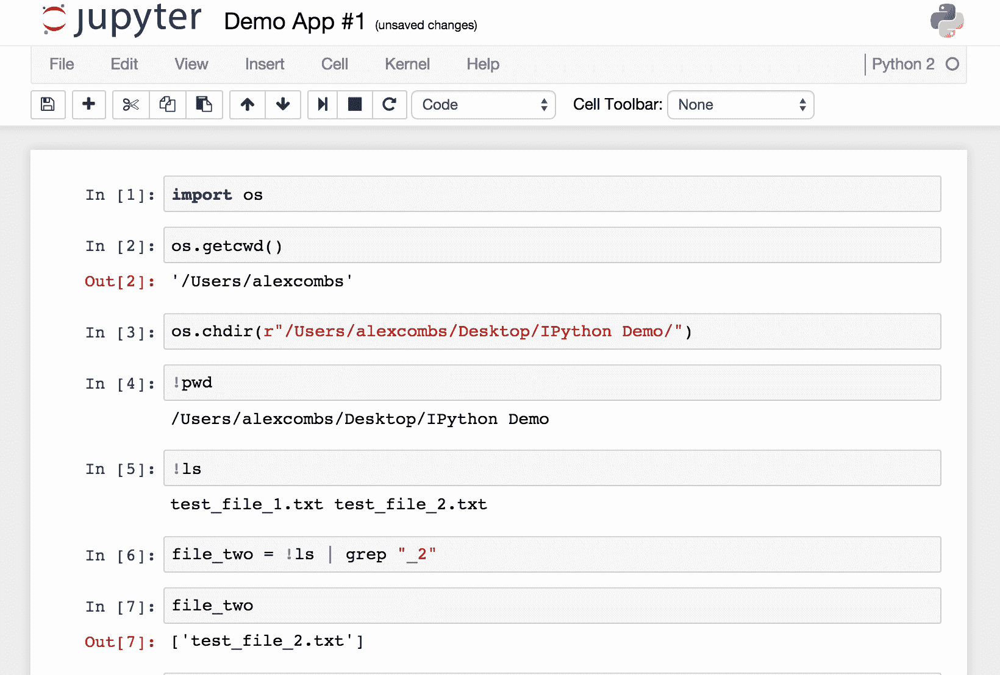

Sample interaction in the Jupyter Notebook

您会注意到，我们在这里做了很多事情，不仅与 IPython 后端交互，还与终端外壳交互。在这里，我已经导入了 Python `os`库，并进行调用来查找当前的工作目录(单元格#2)，您可以看到这是我的输入代码单元格下面的输出。然后，我在单元#3 中使用`os`库更改了目录，但是停止使用`os`库，开始在单元#4 中使用基于 Linux 的命令。这是通过在单元格前添加`!`来完成的。在单元格#6 中，您可以看到我甚至能够将 shell 输出保存到 Python 变量(`file_two`)中。这是一个很好的特性，使得文件操作变得很简单。

Note that the results would obviously differ slightly on your machine, since this displays information on the user under which it runs.

现在，让我们看一下使用笔记本进行的一些简单数据操作。这也将是我们对另一个不可或缺的图书馆熊猫的首次介绍。

# 熊猫

Pandas 是一款出色的数据分析工具，旨在成为任何语言中最强大、最灵活的开源数据分析/处理工具。而且，正如你很快会看到的，如果它还没有达到这个要求，它不可能太远。我们现在来看看:


Importing the iris dataset

从前面的截图中可以看到，我已经使用 scikit-learn 导入了一个经典的机器学习数据集，`iris`数据集(也可以在[https://archive.ics.uci.edu/ml/datasets/Iris](https://archive.ics.uci.edu/ml/datasets/Iris)上获得)，我们稍后将详细研究这个库。然后，我将数据传递到`pandas`数据框中，确保分配了列标题。一个数据框包含花卉测量数据，另一个数据框包含代表`iris`物种的数字。分别为`setosa`、`versicolor`和`virginica`编码为`0`、`1`和`2`。然后，我将两个数据帧连接起来。

对于处理适合单台机器的数据集，pandas 是终极工具；你可以把它想得有点像类固醇上的 Excel。而且，像流行的电子表格程序一样，基本的操作单位是形成表格的数据的列和行。在熊猫的术语中，数据列是系列，表格是数据框。

使用我们之前加载的相同`iris`数据帧，现在让我们来看看一些常见的操作，包括以下操作:


第一个动作就是使用`.head()`命令获取前五行。第二个命令是通过按列名引用数据框来从数据框中选择一列。我们执行此**数据切片**的另一种方式是使用`.iloc[row,column]`或`.loc[row,column]`符号。前者对列和行使用数字索引(位置索引)，而后者对行使用数字索引，但允许使用命名列(基于标签的索引)。

让我们使用`.iloc`符号选择前两列和前四行。然后我们来看看`.loc`符号:

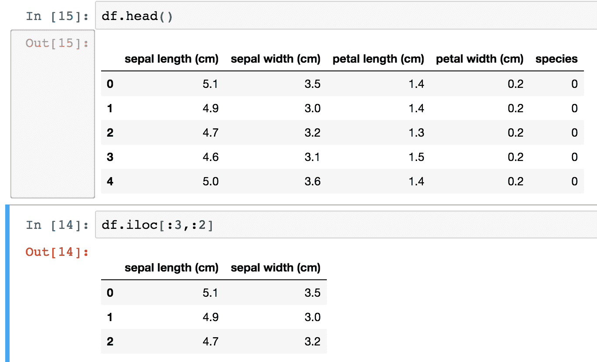

使用`.iloc`符号和 Python 列表切片语法，我们能够选择这个数据帧的一个切片。

现在，让我们试试更高级的东西。我们将使用列表迭代器来选择宽度特征列:


我们在这里所做的是创建一个列表，它是所有列的子集。`df.columns`返回所有列的列表，我们的迭代使用条件语句只选择标题中带有`width`的列。显然，在这种情况下，我们可以很容易地将我们想要的列键入到列表中，但是这让您在处理更大的数据集时感觉到了可用的能力。

我们已经看到了如何根据切片在数据框中的位置来选择切片，但是现在让我们看看另一种选择数据的方法。这一次，我们将根据我们指定的满足条件来选择数据的子集:

1.  现在让我们看看可用的`species`的唯一列表，并选择其中的一个:

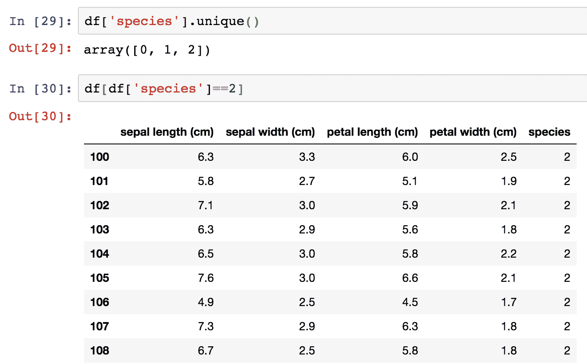

2.  在最右边一栏，你会注意到我们的数据框现在只包含`Iris-virginica`物种(由`2`代表)的数据。事实上，数据框的大小现在是 50 行，低于最初的 150 行:


3.  您还可以看到左侧的索引保留了原始的行号。如果我们只想保存这些数据，我们可以将其保存为新的 DataFrame，并重置索引，如下图所示:

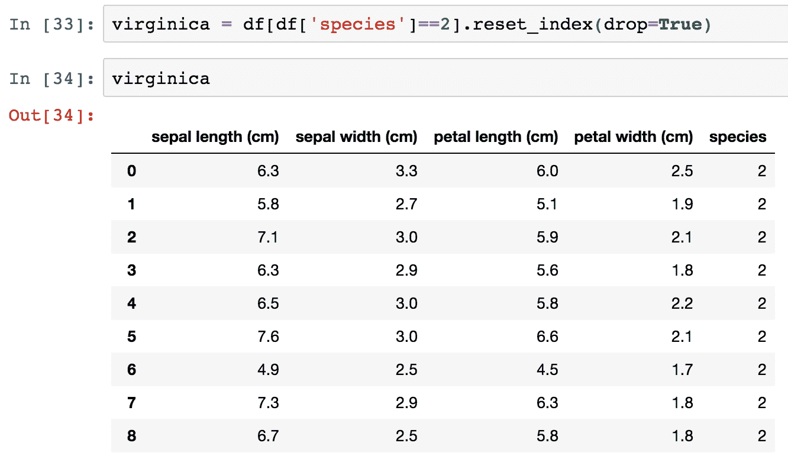

4.  我们通过在一列上放置条件来选择数据；现在让我们添加更多条件。我们将返回到原始数据框，并添加两个条件:


数据框现在只包含花瓣宽度大于`2.2`的`virginica`物种的数据。

现在让我们继续使用熊猫从我们的`iris`数据集获得一些快速描述性统计数据:

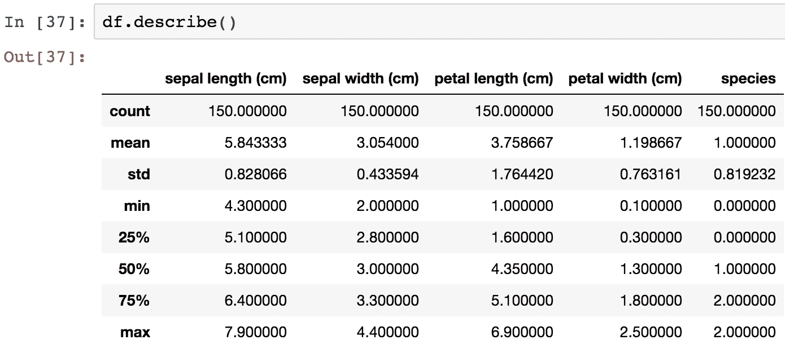

通过调用`.describe()`函数，我收到了每个相关列的描述性统计数据的分解。(请注意，物种被自动移除，因为它与此无关。)如果我想要更详细的信息，我也可以输入自己的百分比:

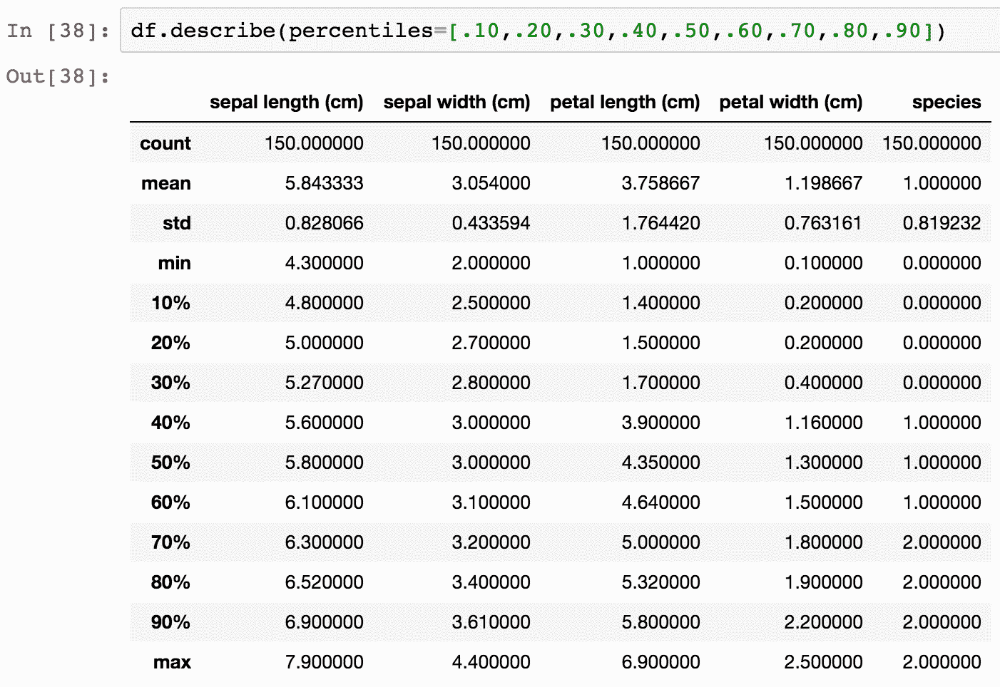

接下来，让我们检查这些特性之间是否有任何关联。这可以通过在我们的数据框中调用`.corr()`来实现:

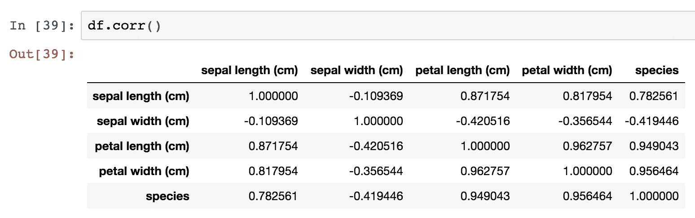

默认值为每一行-列对返回**皮尔逊相关系数**。通过传入一个方法参数(例如`.corr(method="spearman")`或`.corr(method="kendall")`，可以切换到**肯德尔的τ**或**斯皮尔曼的秩相关系数**。

# 形象化

到目前为止，我们已经了解了如何选择数据帧的部分，以及如何从数据中获取汇总统计数据，但是现在让我们继续学习如何直观地检查数据。但首先，为什么还要费心进行目视检查？让我们看一个例子来理解为什么。

以下是四个不同系列的 *x* 和 *y* 值的汇总统计:

| **系列 *x* 和*y*T5】** | **值** |
| *x* 的平均值 | nine |
| *y* 的平均值 | Seven point five |
| *x* 的样本方差 | Eleven |
| *y* 的样本方差 | Four point one |
| *x* 和 *y* 之间的相关性 | Zero point eight one six |
| 回归线 | *y* = 3.00 + 0.500 *x* |

基于具有相同汇总统计数据的系列，您可能会认为这些系列在外观上相似。你当然会错。非常错误。这四个系列是**安斯科姆四重奏**的一部分，它们是为了说明视觉数据检查的重要性而特意打造的。每个系列绘制如下:

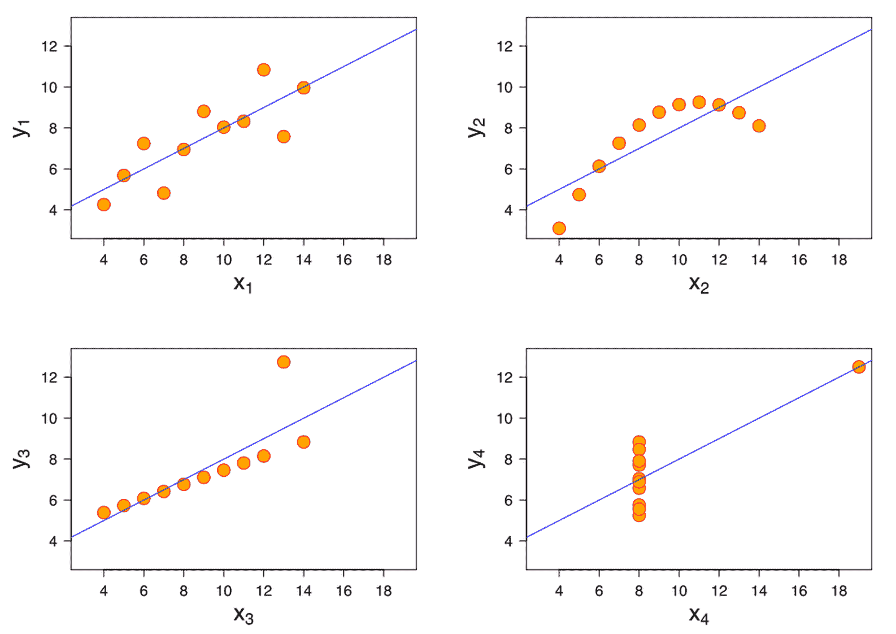

很明显，在可视化这些数据集后，我们不会将其视为完全相同。现在我们已经理解了可视化的重要性，让我们来看看两个有用的 Python 库。

# matplotlib 图书馆

我们要看的第一个图书馆是`matplotlib`。`matplotlib`库是 Python 绘图库宇宙的中心。它最初是为了模拟 MATLAB 的绘图功能而创建的，后来发展成为一个功能齐全的库，拥有广泛的功能。如果你不是来自 MATLAB 背景，你可能很难理解所有的部分是如何一起工作来创建你看到的图形的。我会尽最大努力将这些片段分解成逻辑组件，这样您就可以快速跟上进度。但是在完全进入`matplotlib`之前，让我们设置好我们的 Jupyter 笔记本，让我们可以在线查看我们的图表。为此，在您的`import`语句中添加以下几行:

```py
import matplotlib.pyplot as plt 
plt.style.use('ggplot') 
%matplotlib inline 
```

第一行导入`matplotlib`，第二行将样式设置为近似 R 的`ggplot`库(要求 matplotlib 1.41 或更高)，最后一行设置绘图，以便它们在笔记本中可见。

现在，让我们使用我们的`iris`数据集生成第一个图形:

```py
fig, ax = plt.subplots(figsize=(6,4)) 
ax.hist(df['petal width (cm)'], color='black'); 
ax.set_ylabel('Count', fontsize=12) 
ax.set_xlabel('Width', fontsize=12) 
plt.title('Iris Petal Width', fontsize=14, y=1.01) 
```

上述代码生成以下输出:

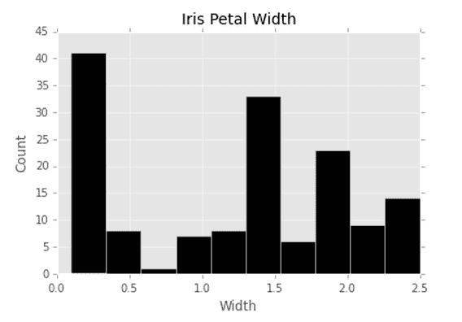

即使在这个简单的例子中也发生了很多事情，但是我们将一行一行地分解它。第一行创建一个宽度为`6`英寸、高度为`4`英寸的子图。然后我们通过调用`.hist()`并传入我们的数据，从`iris`数据框中绘制花瓣宽度的直方图。我们还在这里将条形颜色设置为`black`。接下来的两行分别在我们的 *y* 和 *x* 轴上放置标签，最后一行为我们的图形设置标题。我们使用 *y* 参数调整标题的 *y* 相对于图形顶部的位置，并在默认的基础上稍微增加字体大小。这给了我们一个漂亮的花瓣宽度数据直方图。现在让我们对此进行扩展，并为我们的`iris`数据集的每一列生成直方图:

```py
fig, ax = plt.subplots(2,2, figsize=(6,4)) 

ax[0][0].hist(df['petal width (cm)'], color='black'); 
ax[0][0].set_ylabel('Count', fontsize=12) 
ax[0][0].set_xlabel('Width', fontsize=12) 
ax[0][0].set_title('Iris Petal Width', fontsize=14, y=1.01) 

ax[0][1].hist(df['petal length (cm)'], color='black'); 
ax[0][1].set_ylabel('Count', fontsize=12) 
ax[0][1].set_xlabel('Length', fontsize=12) 
ax[0][1].set_title('Iris Petal Length', fontsize=14, y=1.01) 

ax[1][0].hist(df['sepal width (cm)'], color='black'); 
ax[1][0].set_ylabel('Count', fontsize=12) 
ax[1][0].set_xlabel('Width', fontsize=12) 
ax[1][0].set_title('Iris Sepal Width', fontsize=14, y=1.01) 

ax[1][1].hist(df['sepal length (cm)'], color='black'); 
ax[1][1].set_ylabel('Count', fontsize=12) 
ax[1][1].set_xlabel('Length', fontsize=12) 
ax[1][1].set_title('Iris Sepal Length', fontsize=14, y=1.01) 

plt.tight_layout() 
```

下图显示了上述代码的输出:


显然，这不是对此进行编码的最有效的方法，但它对于演示`matplotlib`是如何工作的很有用。请注意，与第一个示例中的单个子场景对象`ax`不同，我们现在有四个子场景，可以通过现在的`ax`数组进行访问。代码的新增加是对`plt.tight_layout()`的调用；这个函数会很好地自动分隔你的支线剧情以避免拥挤。

现在让我们来看看`matplotlib`中可用的其他几种类型的地块。一个有用的情节是**散点图**。在这里，我们将绘制花瓣宽度对花瓣长度:

```py
fig, ax = plt.subplots(figsize=(6,6)) 
ax.scatter(df['petal width (cm)'],df['petal length (cm)'],                      color='green') 
ax.set_xlabel('Petal Width') 
ax.set_ylabel('Petal Length') 
ax.set_title('Petal Scatterplot') 
```

上述代码生成以下输出:

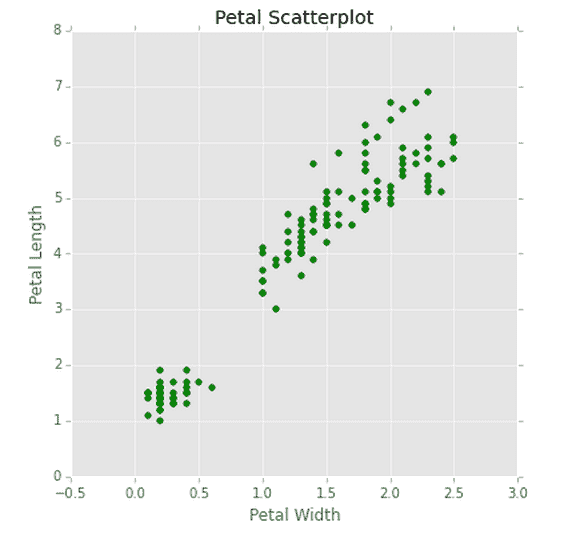

像以前一样，我们可以添加多个子场景来检查每个方面。

我们可以考察的另一个情节是简单的线状情节。在这里，我们将看一个花瓣长度的图:

```py
fig, ax = plt.subplots(figsize=(6,6)) 
ax.plot(df['petal length (cm)'], color='blue') 
ax.set_xlabel('Specimen Number') 
ax.set_ylabel('Petal Length') 
ax.set_title('Petal Length Plot') 
```

上述代码生成以下输出:


我们已经开始看到，基于这个简单的线图，每个物种都有不同的长度集群——记住我们的样本数据集有每种类型的 50 个有序例子。这告诉我们，如果我们要构建一个分类器，花瓣长度可能是区分物种的有用特征。

让我们来看看`matplotlib`库中的最后一种图表，条形图。这可能是你会看到的最常见的图表之一。在这里，我们将为三种鸢尾花的每个特征的平均值绘制一个条形图，为了使它更有趣，我们将使它成为一个带有许多附加`matplotlib`特征的堆叠条形图:

```py
import numpy as np
fig, ax = plt.subplots(figsize=(6,6))
bar_width = .8
labels = [x for x in df.columns if 'length' in x or 'width' in x]
set_y = [df[df['species']==0][x].mean() for x in labels]
ver_y = [df[df['species']==1][x].mean() for x in labels]
vir_y = [df[df['species']==2][x].mean() for x in labels]
x = np.arange(len(labels))
ax.bar(x, set_y, bar_width, color='black')
ax.bar(x, ver_y, bar_width, bottom=set_y, color='darkgrey')
ax.bar(x, vir_y, bar_width, bottom=[i+j for i,j in zip(set_y, ver_y)], color='white')
ax.set_xticks(x + (bar_width/2))
ax.set_xticklabels(labels, rotation=-70, fontsize=12);
ax.set_title('Mean Feature Measurement By Species', y=1.01)
ax.legend(['Setosa','Versicolor','Virginica'])   
```

这里给出了前面代码片段的输出:


要生成条形图，我们需要将`x`和`y`值传递到`.bar()`函数中。在这种情况下，`x`值将只是我们感兴趣的特征长度的数组——这里是四个，或者数据框中的每列一个。`np.arange()`函数是一种简单的生成方法，但是我们几乎可以轻松地手动输入这个数组。因为我们不希望 *x* 轴显示为 1 到 4，所以我们调用`.set_xticklabels()`函数并传入我们想要显示的列名。为了正确排列`x`标签，我们还需要调整标签的间距。这就是为什么我们将`xticks`设置为`x`加上`bar_width`一半大小的原因，我们之前也在`0.8`设置过。`y`值来自对每个物种的每个特征取平均值。然后我们通过调用`.bar()`来绘制每一个。需要注意的是，我们为每个系列传入一个`bottom`参数，该参数设置其下系列的最小 *y* 点和最大 *y* 点。这将创建堆叠条形图。最后，我们添加一个描述每个系列的图例。这些名称按照从上到下的条放置顺序插入图例列表。

# 海底图书馆

我们要看的下一个可视化库叫做`seaborn`([http://seaborn.pydata.org/index.html](http://seaborn.pydata.org/index.html))。这是一个专为统计可视化而创建的库。事实上，它非常适合与`pandas`数据框一起使用，其中列是特征，行是观察。这种风格的数据框架被称为**整齐**数据，是机器学习应用程序最常见的形式。

现在我们来看看`seaborn`的威力:

```py
import seaborn as sns 
sns.pairplot(df, hue='species') 
```

仅用这两行代码，我们就可以得到以下结果:


Seaborn plot

刚刚详细描述了`matplotlib`错综复杂的细微差别，你会立刻欣赏到我们生成这个情节的简单性。我们所有的特征都是相互对照绘制的，并且用两行代码正确地标记出来。你可能会想，当`seaborn`让这些类型的可视化变得如此简单时，我是不是浪费了几十页来教你`matplotlib`。事实并非如此，因为`seaborn`是建在`matplotlib`之上的。事实上，您可以使用您所学的关于`matplotlib`的所有知识来修改和使用`seaborn`。让我们看看另一个可视化:

```py
fig, ax = plt.subplots(2, 2, figsize=(7, 7)) 
sns.set(style='white', palette='muted') 
sns.violinplot(x=df['species'], y=df['sepal length (cm)'], ax=ax[0,0]) sns.violinplot(x=df['species'], y=df['sepal width (cm)'], ax=ax[0,1]) sns.violinplot(x=df['species'], y=df['petal length (cm)'], ax=ax[1,0]) sns.violinplot(x=df['species'], y=df['petal width (cm)'], ax=ax[1,1]) fig.suptitle('Violin Plots', fontsize=16, y=1.03) 
for i in ax.flat:
 plt.setp(i.get_xticklabels(), rotation=-90) 
fig.tight_layout() 
```

上述代码生成以下输出:


Violin Plots

在这里，我们已经为四个特征中的每一个生成了一个小提琴情节。小提琴图显示了特征的分布。例如，你可以很容易地看到`setosa` (0)的花瓣长度在 1 厘米到 2 厘米之间高度聚集，而`virginica` (2)则分散得多，从近 4 厘米到 7 厘米以上。您还会注意到，我们在构建`matplotlib`图时使用了大量相同的代码。主要区别是增加了`sns.plot()`呼叫，取代了之前的`ax.plot()`呼叫。我们还在所有的支线剧情上面增加了一个标题，而不是单独在每一个上面，使用`fig.suptitle()`功能。另一个值得注意的增加是迭代每个子剧情来改变`xticklabels`的旋转。我们调用`ax.flat()`，然后使用`.setp()`迭代每个子图轴来设置特定属性。这防止了我们必须单独键入`ax[0][0]...ax[1][1]`并设置属性，就像我们之前在早期的`matplotlib`子图代码中所做的那样。

使用`matplotlib`和`seaborn`可以生成数百种样式的图形，我强烈建议深入挖掘这两个库的文档——这将是很值得花费的时间——但是我在前面部分中详细介绍的图形应该会大大有助于您理解您拥有的数据集，这反过来将有助于您构建机器学习模型。

# 准备

我们已经学习了很多关于检查我们拥有的数据的知识，但是现在让我们继续学习如何处理和操作我们的数据。在这里，我们将了解熊猫的`.map()`、`.apply()`、`.applymap()`和`.groupby()`功能。这些对于处理数据是非常宝贵的，在特征工程的机器学习环境中尤其有用，我们将在后面的章节中详细讨论这个概念。

# 地图

我们现在从`map`功能开始。`map`函数在系列上工作，所以在我们的例子中，我们将使用它来转换我们的数据帧的一列，您会记得这只是一个熊猫系列。假设我们决定物种数量不适合我们的需要。我们将使用带有 Python 字典的`map`函数作为参数来实现这一点。我们将为每种独特的`iris`类型提供一个替代品:


让我们看看我们在这里做了什么。我们已经对现有`species`列的每个值运行了`map`函数。由于每个值都是在 Python 字典中找到的，所以它被添加到返回序列中。我们给这个回归系列指定了相同的`species`名称，所以它取代了我们最初的`species`列。如果我们选择一个不同的名称，比如说`short code`，那么该列将被添加到数据框中，然后我们将拥有原始的`species`列加上新的`short code`列。

相反，我们可以将`map`函数传递给一个系列或函数来对一个列执行这种转换，但是这是一个也可以通过`apply`函数获得的功能，我们接下来将看一看。字典功能是`map`功能独有的，选择`map`而不是`apply`进行单列转换是最常见的原因。但是，我们现在来看看`apply`功能。

# 应用

`apply`功能允许我们同时使用数据帧和序列。我们将从一个同样适用于`map`的例子开始，然后继续讨论仅适用于`apply`的例子。

使用我们的`iris`数据框，让我们根据花瓣宽度创建一个新列。我们之前看到花瓣宽度的平均值是`1.3`。现在让我们在数据框`wide petal`中创建新列，它包含基于`petal width`列中的值的二进制值。如果`petal width`等于或大于中值，我们用`1`编码，如果小于中值，我们用`0`编码。我们将使用`petal width`栏上的`apply`功能来完成此操作:


这里发生了几件事，让我们一步一步来。首先，我们能够简单地通过使用列名的列选择语法向数据框添加一个新列，我们想要创建列名，在本例中为`wide petal`。我们将新列设置为等于`apply`函数的输出。这里，我们在`petal width`列上运行`apply`，该列返回了`wide petal`列中的相应值。`apply`功能通过运行`petal width`列的每个值来工作。如果大于或等于`1.3`，则返回`1`，否则返回`0`。这种类型的转换是机器学习中相当常见的特征工程转换，所以熟悉如何执行它是很好的。

现在让我们来看一下在数据帧而不是单个系列上使用`apply`。我们现在将基于`petal area`创建一个特性:


Creating a new feature

请注意，我们调用`apply`不是在这里的一个系列上，而是在整个数据帧上，因为`apply`是在整个数据帧上调用的，所以我们传入了`axis=1`，以便告诉熊猫我们希望逐行应用该函数。如果我们进入`axis=0`，那么函数将按列运行。这里，每一列都是按顺序处理的，我们选择将来自`petal length (cm)`和`petal width (cm)`列的值相乘。所得的序列成为我们数据框中的`petal area`列。这种力量和灵活性使熊猫成为数据处理不可或缺的工具。

# applymap

我们已经了解了如何操作列，并解释了如何使用行，但是假设您希望在数据框中的所有数据单元上执行一个函数。这就是`applymap`是正确工具的地方。让我们看一个例子:


Using applymap function

这里，我们在数据帧上调用`applymap`来获取每个值的日志(`np.log()`利用 NumPy 库返回该值)，如果该值是浮点类型的话。这种类型检查可防止为分别为字符串和整数值的`species`或`wide petal`列返回错误或浮点值。`applymap`的常见用法包括基于满足多个条件标准来转换或格式化每个单元格。

# 群组依据

现在让我们来看看一个非常有用的操作，但对于新熊猫用户来说通常很难理解:功能`.groupby()`。为了说明最重要的功能，我们将逐步介绍一些示例。

`groupby`操作完全按照它所说的进行:它根据您选择的一个或多个类对数据进行分组。让我们用我们的`iris`数据集来看一个简单的例子。我们将返回并重新导入原始的`iris`数据集，并运行我们的第一个`groupby`操作:


这里，对每个物种的数据进行了划分，并提供了每个特征的平均值。现在让我们更进一步，获取每个`species`的完整描述性统计数据:

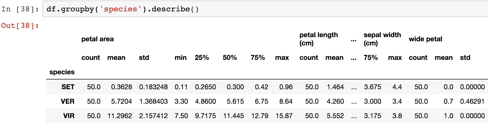

Statistics for each species

现在，我们可以看到由`species`打破的全面崩溃。现在让我们看看我们可以执行的其他一些`groupby`操作。我们之前看到花瓣的长度和宽度在物种之间有一些相对清晰的界限。现在，让我们来看看如何使用`groupby`来看到:

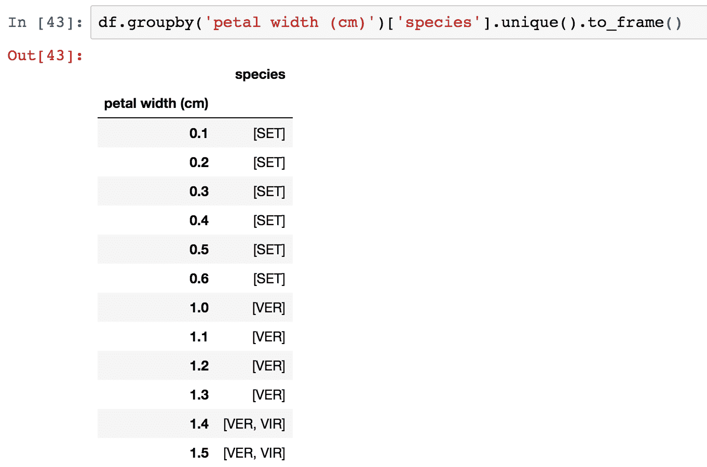

在这种情况下，我们已经根据它们所关联的`petal width`对每个独特的物种进行了分组。这是一个可管理的度量分组，但是如果它变得更大，我们可能需要将度量划分到括号中。正如我们之前看到的，这可以通过`apply`功能来实现。

现在让我们来看看一个自定义聚合函数:


在这段代码中，我们使用`.max()`和`.min()`函数以及返回小于最小花瓣宽度的最大花瓣宽度的`lambda`函数，按种类对花瓣宽度进行分组。

We've only just touched on the functionality of the `groupby` function; there is a lot more to learn, so I encourage you to read the documentation available at [http://pandas.pydata.org/pandas-docs/stable/](http://pandas.pydata.org/pandas-docs/stable/).

希望您现在已经对如何操作和准备数据有了坚实的基础理解，为我们的下一步(建模)做准备。我们现在将继续讨论 Python 机器学习生态系统中的主要库。

# 建模和评估

在本节中，我们将浏览不同的库，如`statsmodels`和`Scikit-learn`，并了解什么是部署。

# Statsmodels

我们要报道的第一个图书馆是`statsmodels`图书馆([http://statsmodels.sourceforge.net/](http://statsmodels.sourceforge.net/))。Statsmodels 是一个 Python 包，它被很好地记录和开发用于探索数据、估计模型和运行统计测试。让我们在这里用它来建立一个简单的`setosa`物种萼片长度和萼片宽度之间关系的线性回归模型。

首先，让我们用散点图直观地检查关系:

```py
fig, ax = plt.subplots(figsize=(7,7)) 
ax.scatter(df['sepal width (cm)'][:50], df['sepal length (cm)'][:50]) 
ax.set_ylabel('Sepal Length') 
ax.set_xlabel('Sepal Width') 
ax.set_title('Setosa Sepal Width vs. Sepal Length', fontsize=14, y=1.02) 
```

上述代码生成以下输出:


所以，我们可以看到，似乎有一个正的线性关系；也就是说，随着萼片宽度的增加，萼片长度也增加。接下来，我们将使用`statsmodels`对数据进行线性回归，以估计这种关系的强度:

```py
import statsmodels.api as sm 

y = df['sepal length'][:50] 
x = df['sepal width'][:50] 
X = sm.add_constant(x) 

results = sm.OLS(y, X).fit() 
print results.summary() 
```

上述代码生成以下输出:


在上图中，我们得到了简单回归模型的结果。由于这是一个线性回归，模型采用*Y =β<sub>0</sub>+β<sub>1</sub>X*的格式，其中*B<sub>0</sub>T11】为截距，*B<sub>1</sub>T15】为回归系数。这里的公式是*萼片长= 2.6447 + 0.6909 *萼片宽*。我们还可以看到模型的 *R <sup>2</sup>* 是一个值得尊敬的`0.558`，而 *p* 值(`Prob`)是非常显著的——至少对于这个物种是如此。**

现在让我们使用`results`对象绘制我们的回归线:

```py
fig, ax = plt.subplots(figsize=(7,7)) 
ax.plot(x, results.fittedvalues, label='regression line') 
ax.scatter(x, y, label='data point', color='r') 
ax.set_ylabel('Sepal Length') 
ax.set_xlabel('Sepal Width') 
ax.set_title('Setosa Sepal Width vs. Sepal Length', fontsize=14, y=1.02) 
ax.legend(loc=2) 
```

上述代码生成以下输出:

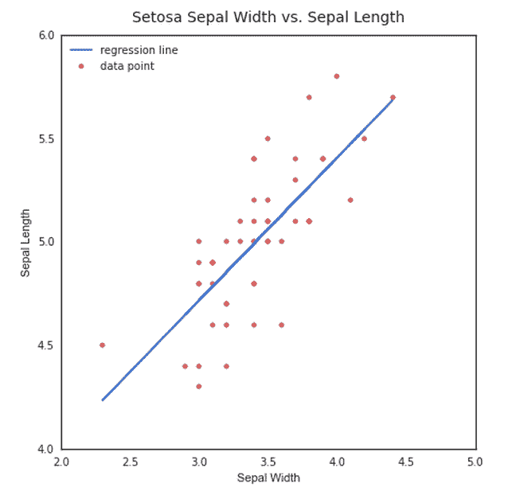

通过绘制`results.fittedvalues`，我们可以从回归中得到最终的回归线。

`statsmodels`包里还有很多其他的统计函数和测试，我邀请大家去探索一下。对于 Python 中的标准统计建模来说，这是一个非常有用的包。现在让我们继续讨论 Python 机器学习包之王:scikit-learn。

# Scikit-learn

Scikit-learn 是一个惊人的 Python 库，拥有无与伦比的文档，旨在为几十种算法提供一致的应用编程接口。它建立在 Python 科学堆栈的核心组件之上，并且本身就是 Python 科学堆栈的核心组件，包括 NumPy、SciPy、pandas 和 matplotlib。以下是 scikit-learn 涵盖的一些领域:分类、回归、聚类、降维、模型选择和预处理。

我们将看几个例子。首先，我们将使用我们的`iris`数据构建一个分类器，然后我们将看看如何使用 scikit-learn 的工具评估我们的模型:

1.  在 scikit-learn 中构建机器学习模型的第一步是了解数据必须如何结构化。
2.  自变量应该是数字 *n ×* *m* 矩阵， *X* ，因变量 *y* ，一个 *n ×* *1* 向量。
3.  *y* 向量可以是连续的或分类的数字，或者是分类的字符串。
4.  然后这些被传递到所选分类器的`.fit()`方法中。
5.  这是使用 scikit-learn 的最大好处:每个分类器尽可能使用相同的方法。这使得它们的交换变得轻而易举。

让我们在第一个例子中看到这一点:

```py
from sklearn.ensemble import RandomForestClassifier 
from sklearn.cross_validation import train_test_split 

clf = RandomForestClassifier(max_depth=5, n_estimators=10) 

X = df.ix[:,:4] 
y = df.ix[:,4] 

X_train, X_test, y_train, y_test = train_test_split(X, y, test_size=.3) 

clf.fit(X_train,y_train) 

y_pred = clf.predict(X_test) 

rf = pd.DataFrame(zip(y_pred, y_test), columns=['predicted', 'actual']) 
rf['correct'] = rf.apply(lambda r: 1 if r['predicted'] == r['actual'] else 0, axis=1) 

rf 
```

上述代码生成以下输出:


现在，让我们执行下面一行代码:

```py
rf['correct'].sum()/rf['correct'].count() 
```

上述代码生成以下输出:


在前面的几行代码中，我们构建、训练并测试了一个分类器，该分类器在我们的`iris`数据集上具有 95%的准确率。让我们解开每个步骤。在顶部，我们做了几个进口产品；前两个来自 scikit-learn，谢天谢地在导入语句中被缩短为`sklearn`。第一个导入是一个随机的森林分类器，第二个是一个模块，用于将您的数据分成训练和测试队列。这种数据划分对于构建机器学习应用程序至关重要，原因有很多。我们将在后面的章节中讨论这个问题，但在这一点上，我们必须这么说。这个`train_test_split`模块也打乱了你的数据，这也是很重要的，因为订单可能包含的信息会影响你的实际预测。

导入后的第一行看起来很奇怪，它实例化了我们的分类器，在本例中是一个随机的森林分类器。我们选择一个使用 10 棵决策树的森林，每棵树允许最大分裂深度为 5。这是为了避免过度拟合，我们将在后面的章节中深入讨论。

接下来的两行创建我们的 *X* 矩阵和 *y* 向量。如果你还记得我们最初的`iris`数据框，它包含四个特征:花瓣的宽度和长度，萼片的宽度和长度。这些特征被选中，成为我们独立的特征矩阵， *X* 。最后一列，即`iris`类名，成为我们的依赖 *y* 向量。

然后，这些数据被传递到`train_test_split`方法中，该方法将我们的数据打乱并划分为四个子集:`X_train`、`X_test`、`y_train`和`y_test`。`test_size`参数设置为`.3`，这意味着我们数据集的 30%将分配给`X_test`和`y_test`分区，而其余的将分配给训练分区`X_train`和`y_train`。

接下来，使用训练数据拟合我们的模型。训练好模型后，我们使用测试数据调用分类器上的预测方法。记住，测试数据是分类器没有看到的数据。这个预测的返回是一个预测标签列表。然后，我们创建实际标签与预测标签的数据框。我们最终将正确的预测相加，除以实例总数，我们可以看到这给了我们一个非常准确的预测。现在让我们看看哪些特性给了我们最强的辨别能力或预测能力:

```py
f_importances = clf.feature_importances_ 
f_names = df.columns[:4] 
f_std = np.std([tree.feature_importances_ for tree in clf.estimators_], axis=0) 

zz = zip(f_importances, f_names, f_std) 
zzs = sorted(zz, key=lambda x: x[0], reverse=True) 

imps = [x[0] for x in zzs] 
labels = [x[1] for x in zzs] 
errs = [x[2] for x in zzs] 

plt.bar(range(len(f_importances)), imps, color="r", yerr=errs, align="center") 
plt.xticks(range(len(f_importances)), labels); 
```

上述代码生成以下输出:


正如我们所料，基于我们早期的视觉分析，花瓣的长度和宽度在区分`iris`类时具有更强的辨别能力。这些数字到底是从哪里来的？随机森林有一个名为`.feature_importances_`的方法，返回特征在叶子处分裂的相对性能。如果一个特征能够一致而清晰地将一个组划分为不同的类，它将具有很高的特征重要性。这个数字总会是 1。正如您将在这里注意到的，我们已经包括了标准差，这有助于说明每个特性的一致性。这是通过对每一个特征、每十棵树取特征重要性并计算标准差而产生的。

现在让我们再看一个使用 scikit-learn 的例子。我们现在将切换我们的分类器，并使用**支持向量机** ( **SVM** ):

```py
from sklearn.multiclass import OneVsRestClassifier 
from sklearn.svm import SVC 
from sklearn.cross_validation import train_test_split 

clf = OneVsRestClassifier(SVC(kernel='linear')) 

X = df.ix[:,:4] 
y = np.array(df.ix[:,4]).astype(str) 

X_train, X_test, y_train, y_test = train_test_split(X, y, test_size=.3) 

clf.fit(X_train,y_train) 

y_pred = clf.predict(X_test) 

rf = pd.DataFrame(zip(y_pred, y_test), columns=['predicted', 'actual']) 
rf['correct'] = rf.apply(lambda r: 1 if r['predicted'] == r['actual'] else 0, axis=1) 

rf 
```

上述代码生成以下输出:


现在，让我们执行下面一行代码:

```py
rf['correct'].sum()/rf['correct'].count() 
```

上述代码生成以下输出:


在这里，我们交换了一个 SVM，几乎没有改变我们的任何代码。唯一的变化是与导入 SVM 而不是随机森林相关的变化，以及实例化分类器的行。(我不得不对`y`标签的格式做一个小小的改变，因为 SVM 不能像随机森林分类器那样将它们解释为 NumPy 字符串。有时，这些数据类型转换必须是特定的，否则会导致错误，但这是一个小麻烦。)

这只是 scikit-learn 功能的一个小例子，但它应该会给你一个提示，这个宏伟的工具对于机器学习应用程序的力量。还有许多额外的机器学习库，我们在这里没有机会讨论，但将在后面的章节中探讨，但我强烈建议，如果这是您第一次使用机器学习库，并且您想要一个强大的通用工具，scikit-learn 是您的首选。

# 部署

当您决定将机器学习模型投入生产时，有许多选项可供选择。这在很大程度上取决于应用的性质。部署可以包括从在本地机器上运行的 cron 作业到在 Amazon EC2 实例上部署的全面实现。

我们不会在这里详细讨论具体的实现，但是我们将有机会在整本书中深入研究不同的部署示例。

# 设置您的机器学习环境

我们已经介绍了许多库，如果您要单独安装每个库，安装起来可能会有点麻烦——当然可以，因为大多数库都可以用 Python 的包管理器 pip 来安装，但是我强烈建议您使用预打包的解决方案，例如 Anaconda Python 发行版([http://anaconda.org](http://anaconda.org))。这允许您下载并安装一个可执行文件，其中包含为您处理的所有包和依赖项。由于该发行版面向 Python 科学堆栈用户，因此本质上是一个一劳永逸的解决方案。

Anaconda 还包括一个包管理器，使更新包成为一项简单的任务。只需输入`conda update <package_name>`，就会更新到最近的稳定版本。

# 摘要

在本章中，我们学习了数据科学/机器学习工作流。我们学习了如何在管道的每个阶段一步一步地获取数据，从获取一直到部署。我们还学习了 Python 科学堆栈中每个最重要的库的关键特性。我们现在将学习这些知识和课程，并开始应用它们来创建独特而有用的机器学习应用程序。我们开始吧！