# 二、创建一个应用来寻找低价公寓

在[第 1 章](01.html)*Python 机器学习生态系统*中，我们学习了处理数据的要领。我们现在将应用这些知识来构建我们的第一个机器学习应用。我们将从一个极小但非常实用的例子开始:构建一个应用来识别价格过低的公寓。

如果你曾经寻找过公寓，你会意识到这个过程有多令人沮丧。不仅费时，即使找到了自己喜欢的公寓，又怎么知道是不是合适的呢？

最有可能的是，你有目标预算和目标地点。但是，如果你和我一样，你也愿意做一些取舍。例如，我住在纽约市，靠近地铁这样的便利设施是一个很大的优势。但那值多少钱？我应该用在有电梯的大楼里来换取离火车更近吗？走几分钟的火车值得走上一段楼梯？租房时，有几十个这样的问题需要考虑。那么，我们如何使用机器学习来帮助我们做出这些类型的决定呢？

我们将在本章的剩余部分探讨这一点。我们将无法得到所有问题的答案(原因将在后面变得清楚)，但在本章结束时，我们将创建一个应用，使找到合适的公寓变得稍微容易一点。

这就是我们将在本章中介绍的内容:

*   寻找公寓列表数据
*   检查和准备数据
*   可视化数据
*   回归建模
*   预测

# 寻找公寓列表数据

在 20 世纪 70 年代初，如果你想购买一只股票，你需要雇佣一个经纪人，他会向你收取近 1%的固定佣金。如果你想买机票，你需要联系旅行社，旅行社会给你 7%左右的佣金。如果你想卖房子，你可以联系房地产经纪人，他们会给你 6%的佣金。2018 年，基本上可以免费做前两个。最后一个仍然是上世纪 70 年代的样子。

为什么会这样，更重要的是，这些和机器学习有什么关系？现实是，这一切都归结于数据，以及谁有权访问这些数据。

您可能会认为，通过应用编程接口或通过**网络抓取**房地产网站，您可以非常容易地访问大量房地产上市数据。你就错了。如果你打算遵守这些网站的条款和条件，那就错了。房地产数据由**全国房地产经纪人协会** ( **NAR** )严格控制，该协会运行**多次上市服务** ( **MLS** )。这是一项汇总上市数据的服务，只对经纪人和代理人开放，费用很高。所以，正如你所能想象的，他们并不太热衷于让任何人集体下载*。*

 *这是不幸的，因为开放这些数据无疑会带来有用的消费应用。这对于代表家庭预算最大一部分的购买决策来说似乎尤为重要。

话虽如此，并不是所有的希望都落空了，因为并不是每个网站都明确禁止刮擦。

# 下拉列表数据

我们将使用 RentHop 网站[http://www.renthop.com](https://www.renthop.com/)来获取我们的列表数据。该网站的以下截图显示了我们将要检索的列表的布局:


我们可以看到清单上有地址、价格、卧室数量和浴室数量。我们将从检索每个列表的信息开始。

我们将使用 Python 请求库来完成这项任务。对于人类来说，请求被称为*HTTP*，这使得检索网站变得非常容易。如果您想了解如何使用请求，可在[http://docs.python-requests.org/en/master/user/quickstart/](http://docs.python-requests.org/en/master/user/quickstart/)获得快速入门指南。请遵循以下步骤:

1.  因此，第一步是为我们的 Jupyter 笔记本准备好我们将用于此任务的导入。我们在下面的代码片段中这样做:

```py
import numpy as np 
import pandas as pd 
import requests 
import matplotlib.pyplot as plt 
%matplotlib inline 
```

稍后我们可能需要导入更多的库，但现在应该可以开始了。

2.  我们将在模型中使用纽约公寓的数据。该数据的网址是[https://www.renthop.com/nyc/apartments-for-rent](https://www.renthop.com/nyc/apartments-for-rent)。让我们运行一个快速测试，确保我们可以检索到该页面。我们在下面的代码中这样做:

```py
r = requests.get('https://www.renthop.com/nyc/apartments-for-rent') 
r.content 
```

3.  该代码调用该站点，并检索信息，将其存储在`r`对象中。我们可以从`r`对象中检索许多属性，但是现在，我们只想要页面内容。我们可以在下面的截图中看到它的输出:


4.  经检查，我们想要的东西似乎都包含在里面了。为了验证这一点，让我们复制所有的 HTML 并将其粘贴到文本编辑器中，然后在浏览器中打开它。我将使用[https://www.sublimetext.com/](https://www.sublimetext.com/)上流行的文本编辑器**崇高文本**来实现。

5.  在下面的截图中，可以看到我已经将 Jupyter 输出中复制的 HTML 粘贴到了崇高文本中，并保存为`test.html`:

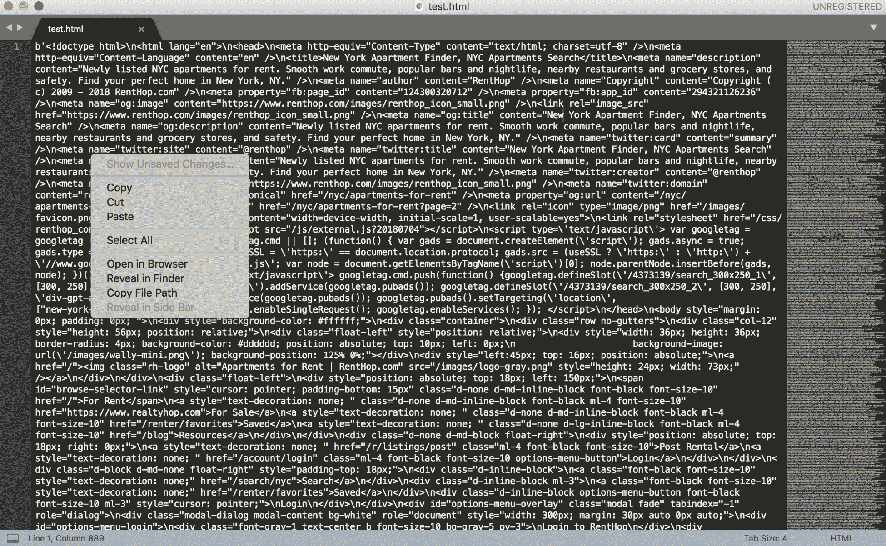

HTML text

6.  接下来，我们单击在浏览器中打开，我们可以看到类似于下图的输出:

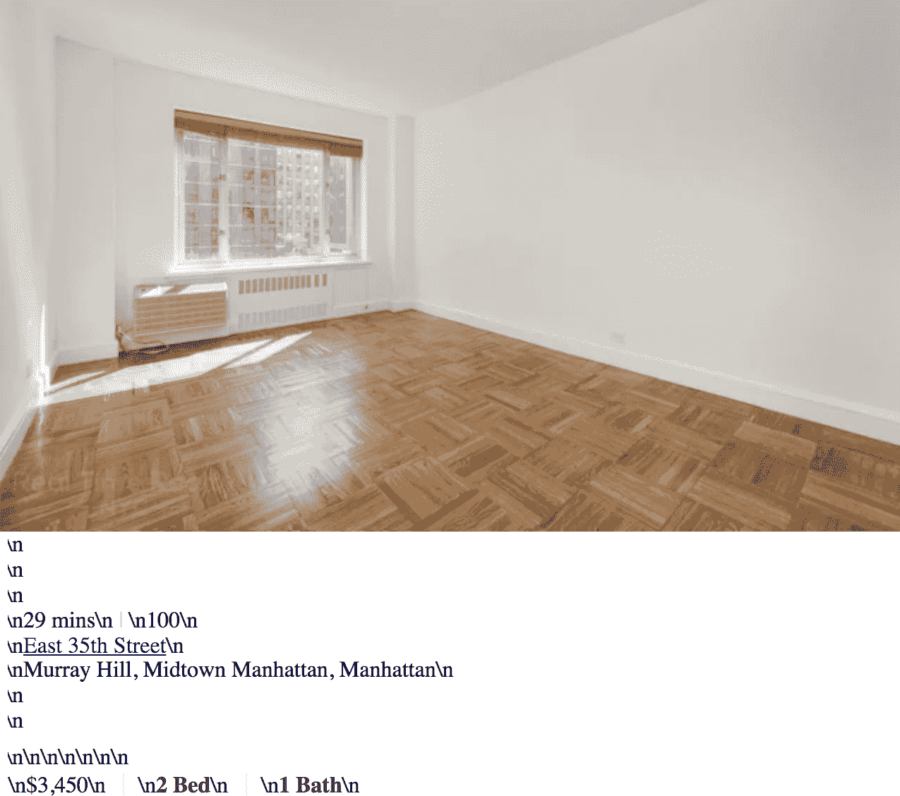

请注意，尽管文本没有清晰地呈现(由于缺少 CSS)，但我们要定位的所有数据都在那里。对我们来说幸运的是，这意味着 RentHop 站点不使用任何高级的 JavaScript 渲染，所以这应该会让我们的工作变得容易得多。如果是的话，我们将不得不使用一种不同的工具，比如 Selenium。

现在让我们检查一下页面元素，看看如何解析页面数据:

1.  在 Chrome 中打开 RentHop 网站，然后右键单击页面上的任意位置。
2.  在上下文菜单的底部，您应该会看到“检查”。点击那个。该页面现在应该类似于下图:

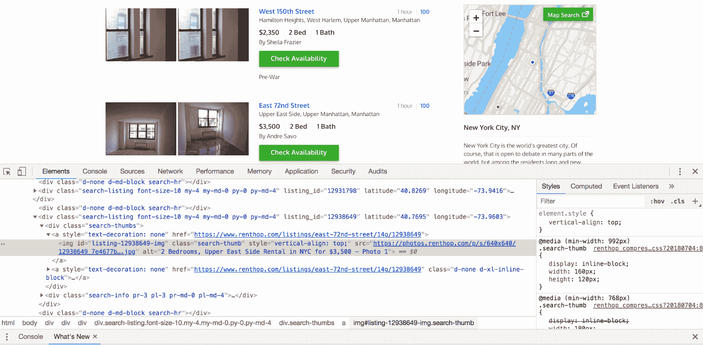

3.  在刚刚打开的工具中，左上角有一个正方形，角上有一个箭头。点击那个，然后点击页面上的数据。它应该如下所示:


由此我们可以看出，每个清单的数据都在一张表中，第一个`td`标签包含价格，第二个包含卧室数量，第三个包含卫生间数量。我们还希望公寓的地址可以在一个锚点或标签中找到。

现在让我们开始构建我们的代码来测试我们对数据的解析。为了进行 HTML 解析，我们将使用一个库调用**美化组**。相关文件可在[https://www.crummy.com/software/BeautifulSoup/](https://www.crummy.com/software/BeautifulSoup/)找到。是一个流行的、易于使用的 Python HTML 解析库。如果你还没有画中画，可以安装。我们将使用它来提取我们公寓列表的所有单个规格:

1.  首先，我们只需要将我们的页面内容传递到`BeautifulSoup`类中。这可以在下面的代码中看到:

```py
from bs4 import BeautifulSoup 

soup = BeautifulSoup(r.content, "html5lib") 
```

2.  我们现在可以使用我们创建的这个`soup`对象开始解析我们的公寓数据。我们要做的第一件事是在页面上检索包含我们的列表数据的`div`标签。我们在下面的代码中可以看到:

```py
listing_divs = soup.select('div[class*=search-info]') 
listing_divs 
```

我们在前面的代码中所做的是选择所有包含`search-info`的`divs`。这些正是拥有我们数据的`divs`。

3.  接下来，我们看一下下面截图中的输出:


4.  请注意，我们有一个 Python 列表，其中包含了我们正在寻找的所有`div`标签。从页面上我们知道应该有二十个这样的。让我们确认一下:

```py
len(listing_divs) 
```

5.  然后，我们会看到以下输出，它确认我们已经按照我们的要求捕获了它们:


# 拉出各个数据点

现在我们有了所有的`divs`和我们每个公寓的列表数据，我们需要为每个公寓提取单独的数据点。

这些都是我们希望达到的目标:

*   列表的网址
*   公寓地址
*   附近
*   卧室数量
*   浴室数量

很明显，我们喜欢有更多的信息——比如平方英尺之类的东西，但是我们将不得不将就我们所拥有的。

让我们从第一个列表开始:

```py
listing_divs[0] 
```

前面的代码产生以下输出:


请注意，第一个`div`包含了我们正在寻找的所有数据点。我们现在只需要开始我们的解析，分别针对它们。让我们看看我们要检索的第一个网址。

我们可以看到页面的网址带有一个锚点或标签。我们现在来分析一下。我们可以用另一个`select`语句来实现，如下面的代码片段所示:

```py
listing_divs[0].select('a[id*=title]')[0]['href'] 
```

我们在下面的截图中看到了输出:


这正是我们所希望的。我们现在可以继续检索列表的其他数据点。我们在下面的代码中这样做:

```py
href = current_listing.select('a[id*=title]')[0]['href'] 
addy = current_listing.select('a[id*=title]')[0].string 
hood = current_listing.select('div[id*=hood]')[0]\ 
       .string.replace('\n','') 
```

现在让我们通过打印出我们捕获的内容来验证这一点。我们在下面的代码中这样做:

```py
print(href) 
print(addy) 
print(hood) 
```

前面的代码产生以下输出:


基于这个输出，我们得到了我们需要的数据。让我们继续讨论我们需要的最后几个项目——卧室、浴室和价格。

由于这些项目的呈现方式略有不同，它们位于我们的`div`中的`table`标签中，然后位于表格行或`tr`中，因此我们需要遍历每个点来获取数据。我们在下面的代码中这样做:

```py
listing_specs = listing_divs[0].select('table[id*=info] tr') 
for spec in listing_specs: 
    spec_data = spec.text.strip().replace(' ', '_').split() 
    print(spec_data) 
```

前面的代码产生以下输出:

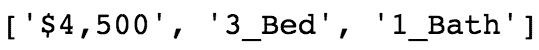

同样，这正是我们要找的。我们现在有了我们正在寻找的所有数据。现在让我们在一个循环中把所有的数据拉在一起，这样我们就可以从每个列表中提取数据，并将其保存到一个列表中。

在下面的代码中，我们将提取每个列表的所有数据点:

```py
listing_list = [] 
for idx in range(len(listing_divs)): 
    indv_listing = [] 
    current_listing = listing_divs[idx] 
    href = current_listing.select('a[id*=title]')[0]['href'] 
    addy = current_listing.select('a[id*=title]')[0].string 
    hood = current_listing.select('div[id*=hood]')[0]\ 
    .string.replace('\n','') 
  indv_listing.append(href) 
    indv_listing.append(addy) 
    indv_listing.append(hood) 

    listing_specs = current_listing.select('table[id*=info] tr') 
    for spec in listing_specs: 
        try: 
            indv_listing.extend(spec.text.strip()\ 
                                .replace(' ', '_').split()) 
        except: 
            indv_listing.extend(np.nan) 
    listing_list.append(indv_listing) 
```

让我们稍微解释一下我们在前面的代码中做了什么。我们知道页面上有 20 个包含公寓列表的 div，所以我们创建了一个`for`循环，遍历每个 div，取出数据并添加到`indv_listing`中。完成后，个人清单的所有数据将被添加到`listing_list`，其中包含 20 套公寓清单的所有最终信息。我们使用以下代码进行验证:

```py
listing_list 
```

前面的代码产生以下输出:


同样，我们似乎得到了我们期望的结果，所以我们将继续下去。检查`listing_list`中的项目数量也确认我们在页面上有所有 20 套公寓。

到目前为止，我们已经成功检索到一页数据。虽然这很好，但如果我们想建立任何有意义的模式，我们将需要更多的公寓。为此，我们需要遍历多个页面。为此，我们需要使用适当的网址。我们可以看到，在列表的底部，有一个按钮，上面写着“下一步”。如果您右键单击该按钮，然后单击复制链接地址，您会看到它看起来像以下网址:[https://www.renthop.com/search/nyc?max_price=50000&min _ price = 0&page = 2&sort = hop score&q =&search = 0](https://www.renthop.com/search/nyc?max_price=50000&min_price=0&page=2&sort=hopscore&q=&search=0)。

# 解析数据

对网址的基本分析告诉我们，我们传递的参数包括最低价格和最高价格，但最重要的是页码。我们可以在代码中使用这一点，只需动态地改变页码，使用循环来获取更多的页面。

让我们用一些示例代码来尝试一下:

```py
url_prefix = "https://www.renthop.com/search/nyc?max_price=50000&min_price=0&page=" 
page_no = 1 
url_suffix = "&sort=hopscore&q=&search=0" 

for i in range(3): 
    target_page = url_prefix + str(page_no) + url_suffix 
    print(target_page) 
    page_no += 1 
```

前面的代码产生以下输出:


这看起来是成功的。现在我们只需要把它们放在一起。我们将从把我们的解析循环变成一个我们可以为每个页面调用的适当函数开始。我们在下面的代码中这样做:

```py
def parse_data(listing_divs): 
    listing_list = [] 
    for idx in range(len(listing_divs)): 
        indv_listing = [] 
        current_listing = listing_divs[idx] 
        href = current_listing.select('a[id*=title]')[0]['href'] 
        addy = current_listing.select('a[id*=title]')[0].string 
        hood = current_listing.select('div[id*=hood]')[0]\ 
        .string.replace('\n','') 

        indv_listing.append(href) 
        indv_listing.append(addy) 
        indv_listing.append(hood) 

        listing_specs = current_listing.select('table[id*=info] tr') 
        for spec in listing_specs: 
            try: 
                values = spec.text.strip().replace(' ', '_').split() 
                clean_values = [x for x in values if x != '_'] 
                indv_listing.extend(clean_values) 
            except: 
                indv_listing.extend(np.nan) 
        listing_list.append(indv_listing) 
    return listing_list 
```

该函数将接收一整页的`listing_divs`，并返回每个页面的数据有效载荷。然后，我们可以继续将数据添加到公寓数据的主列表中。请注意，这里有一些额外的代码来验证和删除在`listing_spec`循环中添加的一些错误的`'_'`值。这是为了避免一些糟糕的解析，这些解析在不应该增加一列的时候增加了一列。

接下来，我们将构建主循环，检索每个页面，获取`listing_divs`，解析出数据点，最后将所有信息添加到每个列表的所有数据点的最终 Python 列表中。我们在下面的代码中这样做:

```py
all_pages_parsed = [] 
for i in range(100): 
    target_page = url_prefix + str(page_no) + url_suffix 
    print(target_page) 
    r = requests.get(target_page) 

    soup = BeautifulSoup(r.content, 'html5lib') 

    listing_divs = soup.select('div[class*=search-info]') 

    one_page_parsed = parse_data(listing_divs) 

    all_pages_parsed.extend(one_page_parsed) 

    page_no += 1 
```

在 100 页上尝试之前，您应该确认它可以在更小的数字上工作，比如 3。

你应该注意到代码运行时页面被打印出来了。如果你用了 30 页，你应该会看到你的`all_pages_parsed`列表中有 2000 个列表。

现在让我们将数据移动到`pandas`数据框中，这样我们可以更容易地使用它。我们在下面的代码中这样做:

```py
df = pd.DataFrame(all_pages_parsed, columns=['url', 'address', 'neighborhood', 'rent', 'beds', 'baths']) 

df 
```

前面的代码产生以下输出:


现在，我们已经将所有数据拉下、解析并合并到一个数据框架中，让我们继续清理和验证我们的数据。

# 检查和准备数据

让我们从检查每个列的数据点开始。我们希望在我们的数据中寻找奇数和异常值。我们将从卧室和浴室的柱子开始:

1.  在下面的代码中，我们查看卧室的唯一值:

```py
df['beds'].unique() 
```

前面的代码产生以下输出:


2.  现在，让我们看看浴室。我们在下面的代码中这样做:

```py
df['baths'].unique() 
```

前面的代码产生以下输出:


3.  根据前面两个查询的输出，我们看到需要更正一些带有前导下划线的项目。我们现在就开始吧:

```py
df['beds'] = df['beds'].map(lambda x: x[1:] if x.startswith('_') else x) 
df['baths'] = df['baths'].map(lambda x: x[1:] if x.startswith('_') else x) 
```

4.  在前面的代码中，我们运行了一个熊猫`map`函数和一个`lambda`函数，该函数主要检查元素是否以下划线开头，如果是，则删除它。快速检查一下床和浴缸的独特价值，就会发现我们错误的起始下划线已经被删除:

```py
df['beds'].unique() 
```

前面的代码产生以下输出:


让我们执行下面一行代码并查看结果:

```py
df['baths'].unique() 
```

前面的代码产生以下输出:


5.  接下来，我们想看一些描述性统计数据，以更好地理解我们的数据。一种方法是使用`describe`方法。让我们在下面的代码中尝试一下:

```py
df.describe() 
```

前面的代码产生以下输出:


虽然我们希望获得诸如平均床位和浴室数量以及最高租金等指标，但我们得到的却远低于此。问题是数据不是这些操作的正确数据类型。熊猫不能对字符串对象执行这些类型的操作。我们需要进一步清理数据，并将其设置为正确的数据类型。我们将在下面的代码中做到这一点:

```py
df['rent'] = df['rent'].map(lambda x: str(x).replace('$','').replace(',','')).astype('int') 
df['beds'] = df['beds'].map(lambda x: x.replace('_Bed', '')) 
df['beds'] = df['beds'].map(lambda x: x.replace('Studio', '0')) 
df['beds'] = df['beds'].map(lambda x: x.replace('Loft', '0')).astype('int') 
df['baths'] = df['baths'].map(lambda x: x.replace('_Bath', '')).astype('float') 
```

我们在前面的代码中所做的是从每个值中移除任何非数字的内容。你可以看到我们去掉了`_Bed`和`_Bath`只留下了数字，并且我们用实际的卧室数量替换了`Studio`和`Loft`这样的词，这是零。

# 偷窥数据类型

现在让我们看看我们的数据类型:

```py
df.dtypes 
```

前面的代码产生以下输出:


这就是我们想看到的。请注意，因为我们可以有一个半浴，我们需要一个浮动，而不是一个整数。

接下来，让我们进行一次检查。让我们计算一下每个街区的单元数量:

```py
df.groupby('neighborhood')['rent'].count().to_frame('count')\ 
.sort_values(by='count', ascending=False) 
```

上述代码生成以下输出:


看起来大部分单元都在曼哈顿，这是我们可能会想到的。让我们确保我们的邻里关系是干净的。我们可以通过做一些`groupby`操作来做到这一点:

```py
df[df['neighborhood'].str.contains('Upper East Side')]['neighborhood'].value_counts() 
```

上述代码生成以下输出:


看起来我们在前导空格和可能的尾随空格方面有些问题。我们来清理一下。我们在下面的代码中这样做:

```py
df['neighborhood'] = df['neighborhood'].map(lambda x: x.strip()) 
```

那应该会澄清的。让我们验证一下:

```py
df[df['neighborhood'].str.contains('Upper East Side')]['neighborhood'].value_counts() 
```

前面的代码产生以下输出:

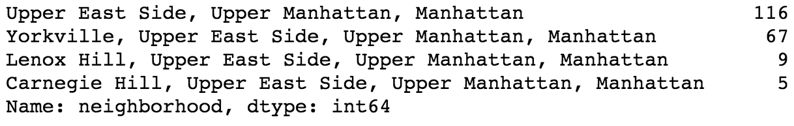

太好了。正是我们想要看到的。此时，我们可以再做一些检查。让我们来看看附近的平均租金:

```py
df.groupby('neighborhood')['rent'].mean().to_frame('mean')\ 
.sort_values(by='mean', ascending=False) 
```

前面的代码产生以下输出:

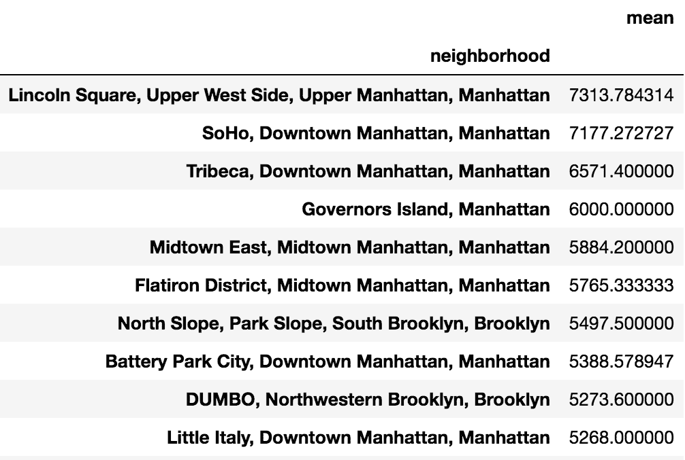

我们看到林肯广场地区似乎平均租金最高。此时，我们可以继续查询数据中有趣的模式，但是让我们继续可视化数据。

# 可视化我们的数据

当我们在这里处理地理数据时，能够绘制这些信息是非常有价值的。一种方法是用一种叫做**的东西来绘制**地图。合唱团本质上是一张地理热图。我们将建立一个地图，通过邮政编码创建平均租赁价格的热图。

我们需要做的第一件事是邮政编码。不幸的是，我们的数据集不包含邮政编码信息。但是，我们有房产的地址。在谷歌地图应用编程接口的一点帮助下，我们可以检索这些信息。

目前，谷歌地图应用编程接口是一个付费应用编程接口。费率是合理的，1000 个电话需要 5 美元，但他们每月还会给你 200 美元的积分(在撰写本文时)。他们还允许您在他们开始向您收费之前注册免费试用，除非您明确允许他们这样做，否则他们不会收费。既然真的没有免费的选择，我们就去注册一个账户。我将引导您完成以下步骤:

1.  第一步是进入[https://developers . Google . com/Maps/documentation/geocode/intro](https://developers.google.com/maps/documentation/geocoding/intro):的谷歌地图 API 页面


2.  点击右上角的开始。接下来会提示您创建一个项目。给它取任何你喜欢的名字:

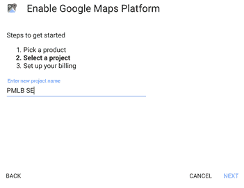

Creating a project

3.  然后您将启用计费:


4.  接下来，您将启用您的应用编程接口密钥:


5.  一旦这个完成，你有了你的应用编程接口键，回到首页启用地理定位应用编程接口。单击左侧窗格中的应用编程接口:


6.  然后，在“未使用的应用编程接口”下，单击地理定位应用编程接口:

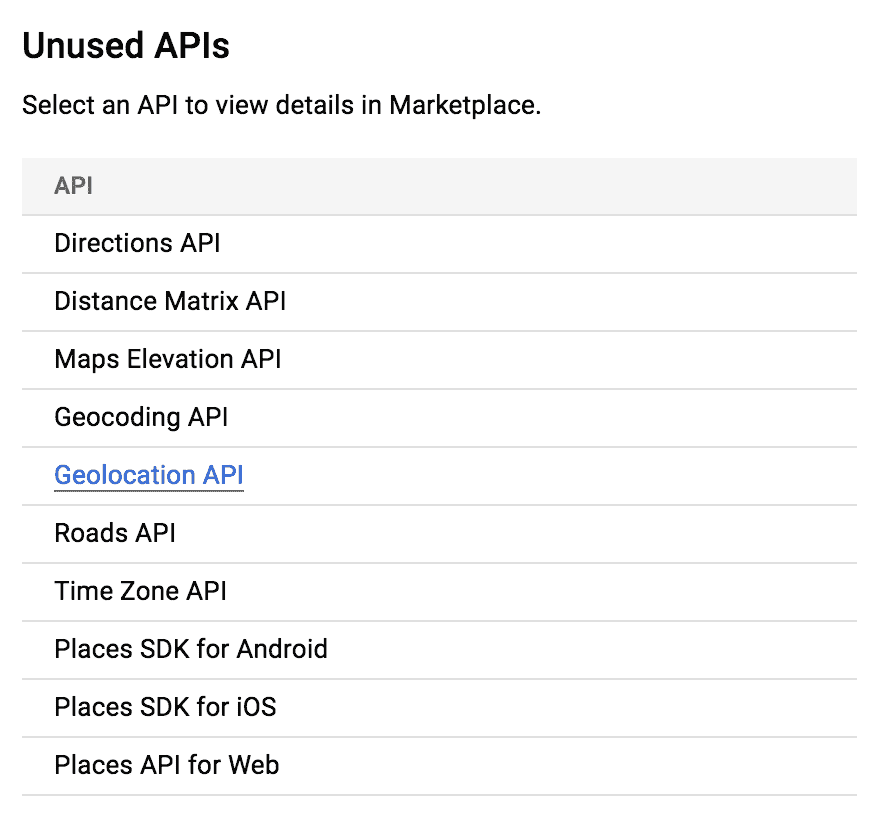

一旦所有这些都完成了，并且你有了你的应用编程接口密钥，pip 安装谷歌地图。这可以通过`pip install -U googlemaps`从命令行完成。

让我们继续在我们的 Jupyter 笔记本中使用这个应用编程接口。我们将导入新的映射 API 并进行测试:

```py
import googlemaps 

gmaps = googlemaps.Client(key='YOUR_API_KEY_GOES_HERE') 

ta = df.loc[3,['address']].values[0] + ' '\ 
+ df.loc[3,['neighborhood']].values[0].split(', ')[-1] 

ta 
```

前面的代码产生以下输出:

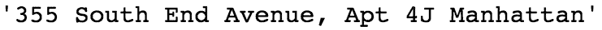

好的，本质上，我们在最后一段代码中所做的就是导入和初始化我们的`googlemaps`客户端，以及使用我们公寓中的一块作为可用地址。现在让我们把这个地址传递给谷歌地图应用编程接口:

```py
geocode_result = gmaps.geocode(ta) 

geocode_result 
```

上述代码生成以下输出:

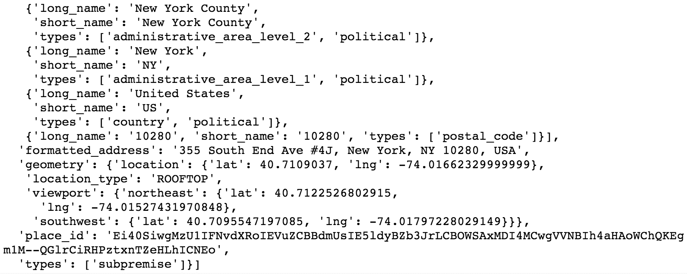

请记住，我们只是在这里提取邮政编码。邮政编码嵌入在 JSON 中，但是由于这个响应 JSON 对象的格式，提取它需要一些工作。我们现在就开始吧:

```py
for piece in geocode_result[0]['address_components']: 
    if 'postal_code' in piece['types'] : 
        print(piece['short_name']) 
```

前面的代码产生以下输出:

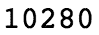

看起来我们得到了想要的信息。然而，有一个警告。深入查看地址列，我们可以看到，有时并没有给出完整的地址。这将导致没有邮政编码回来。我们以后会处理的。现在，让我们构建一个函数来检索邮政编码，我们可以这样做:

```py
import re 
def get_zip(row): 
    try: 
        addy = row['address'] + ' ' + row['neighborhood'].split(', ')[-1] 
        print(addy) 
        if re.match('^\d+\s\w', addy): 
            geocode_result = gmaps.geocode(addy) 
            for piece in geocode_result[0]['address_components']: 
                if 'postal_code' in piece['types']: 
                    return piece['short_name'] 
                else: 
                    pass 
        else: 
            return np.nan 
    except: 
        return np.nan 

df['zip'] = df.apply(get_zip, axis=1) 
```

前面的代码片段中有相当多的代码，所以让我们来谈谈这里发生了什么。

首先，在底部，您可以看到我们正在数据帧上运行一个`apply`方法。因为我们设置了`axis=1`，所以`df`数据帧的每一行都将被传递到我们的函数中。在这个函数中，我们拼凑了一个地址来调用谷歌地图地理定位应用编程接口。我们使用 regex 将我们的呼叫限制在那些以街道号码开头的呼叫。然后，我们迭代 JSON 响应来解析出邮政编码。如果我们找到一个邮政编码，我们返回它，否则我们返回一个`np.nan`，或者空值。请注意，这个函数将需要一些时间来运行，因为我们必须进行数百次调用，然后解析出响应。

一旦完成，我们将有一个数据帧，它现在有那些属性的邮政编码，这些属性有一个正确的地址。让我们来看看实际上有多少:

```py
df[df['zip'].notnull()].count() 
```

前面的代码生成了以下输出:

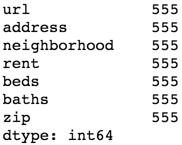

因此，我们丢失了相当多的数据，但是，尽管如此，我们现在所拥有的在许多方面都更有用，所以我们将继续下去。

首先，由于检索所有的邮政编码数据需要很长时间，现在让我们存储我们所拥有的数据，以便我们可以在以后需要时随时检索它，而不必再次进行所有这些应用编程接口调用。我们使用以下代码来实现:

```py
df.to_csv('apts_with_zip.csv') 
```

让我们也将带有邮政编码信息的数据存储在一个新的数据框中。我们称之为`zdf`:

```py
zdf = df[df['zip'].notnull()].copy() 
```

最后，让我们按邮政编码进行汇总，看看按邮政编码计算的平均租赁价格是多少:

```py
zdf_mean = zdf.groupby('zip')['rent'].mean().to_frame('avg_rent')\ 
.sort_values(by='avg_rent', ascending=False).reset_index() 
zdf_mean 
```

上述代码生成以下输出:


我们可以看到这与我们早先的发现一致，即林肯中心地区的平均租金最高，因为 10069 位于林肯中心地区。

现在让我们继续可视化这些信息。

# 可视化数据

因为这些数据是基于邮政编码的，所以最好的可视化方法是使用 choropleth。如果你不熟悉合唱团，它只是一个可视化，根据颜色光谱来表示数据。现在让我们使用名为**的 Python 映射库创建一个。**如果你没有安装 leaf，同样，可以在命令行上用 pip install 来完成。

现在，我们将继续创建我们的可视化:

```py
import folium 

m = folium.Map(location=[40.748817, -73.985428], zoom_start=13) 

m.choropleth( 
    geo_data=open('nyc.json').read(), 
    data=zdf_mean, 
    columns=['zip', 'avg_rent'], 
    key_on='feature.properties.postalCode', 
    fill_color='YlOrRd', fill_opacity=0.7, line_opacity=0.2, 
    ) 

m 
```

这里发生了很多事情，让我们一步一步来:

1.  导入`folium`后，我们创建一个`.Map()`对象。我们需要传入坐标和缩放级别来使地图居中。谷歌搜索帝国大厦的坐标会给我们正确的纬度和经度(翻转经度上的标志以正确渲染)。最后，调整缩放比例，使其对我们的数据适当居中。
2.  下一行需要一个名为 GeoJSON 的文件。这是一种用于表示地理属性的开放格式。这可以通过搜索 NYC GeoJSON 文件找到——特别是那些带有邮政编码映射的文件。完成后，我们通过输入路径来引用 GeoJSON 文件。
3.  接下来，我们在`data`参数中引用我们的数据帧。这里，我们使用的是之前创建的邮政编码平均租金。`columns`参数引用了这些。`key_on`参数引用了我们的 JSON 文件的目标部分，在这个例子中是`postalCode`。
4.  最后，其他选项确定调色板和某些其他参数来调整图例和颜色。

运行单元格时，地图应该在您的 Jupyter 笔记本中内联呈现，如下图所示:

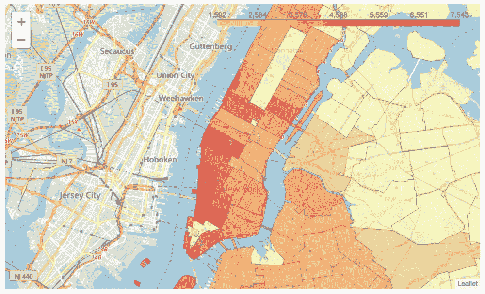

随着热图的完成，你可以开始了解哪些区域的租金更高或更低。这在针对特定领域时可能会有所帮助，但是让我们通过使用回归建模来进行更深入的分析。

# 数据建模

让我们从使用数据集开始建模。我们将研究邮政编码和卧室数量对租金的影响。我们这里用两个包:第一个，`statsmodels`，我们在 [第一章](01.html)*中介绍了 Python 机器学习生态系统*，但是第二个，`patsy`[https://patsy.readthedocs.org/en/latest/index.html](https://patsy.readthedocs.org/en/latest/index.html)是一个让和`statsmodels`一起工作变得更容易的包。Patsy 允许您在运行回归时使用 R 型公式。我们现在就开始吧:

```py
import patsy 
import statsmodels.api as sm 

f = 'rent ~ zip + beds' 
y, X = patsy.dmatrices(f, zdf, return_type='dataframe') 

results = sm.OLS(y, X).fit() 
results.summary() 
```

上述代码生成以下输出:


请注意，前面的输出被截断。

有了这几行代码，我们刚刚运行了第一个机器学习算法。

While most people don't tend to think of linear regression as machine learning, that's exactly what it is. Linear regression is a type of supervised machine learning. Supervised, in this context, simply means we provide the output values for our training set.

现在让我们解开那里发生的事情。导入后，我们有两行与`patsy`模块相关。第一行是我们将使用的公式。左边(波浪号前)是我们的反应，或因变量`rent`。在右边，我们有我们的独立或预测变量`zip`和`beds`。这个公式只是意味着我们想知道邮政编码和卧室数量将如何影响租金。

然后，我们的公式与包含相应列名的数据框一起被传递到`patsy.dmatrices()`中。然后，Patsy 将返回一个带有预测变量矩阵的数据帧和一个带有响应变量的 T4 y 向量。然后这些被传递到`sm.OLS()`，我们也称之为`.fit()`来运行我们的模型。最后，我们打印出模型的结果。

如您所见，结果输出中提供了大量信息。让我们从最上面的部分开始。我们看到该模型包含`555`观测值，其调整后的 R <sup>2</sup> 为`.367`，并且其与`F-statistic`概率`3.50e-31`具有显著性。这有什么意义？这意味着我们已经创建了一个模型，仅使用卧室和邮政编码就能解释大约三分之一的价格差异。这是个好结果吗？为了更好地回答这个问题，我们现在来看看输出的中间部分。

中心部分为我们提供了模型中每个独立变量的信息。从左到右，我们看到以下内容:变量、模型中的变量系数、标准误差、*t*-统计量、*p*-值、*t*-统计量以及 95%的置信区间。

所有这些告诉我们什么？如果我们查看*p*-值列，我们可以确定我们的个体变量是否具有统计学意义。回归模型中的统计显著性意味着自变量和响应变量之间的关系不太可能偶然发生。通常，统计学家在确定这一点时会使用`.05`的 *p* 值。a`.05`*p*-值表示我们看到的结果只有 5%的几率会发生。就我们在这里的产出而言，卧室的数量显然很重要。邮政编码呢？

这里首先要注意的是，我们的截取代表了 07302 邮政编码。当对线性回归建模时，需要截距。截距只是回归线与 *y* 轴相交的地方。Statsmodels 将自动选择一个预测变量用作截距。这里，它决定在泽西城，07302，因为它组织的邮政编码按升序排列。我们可以通过检查以下数据来证实这一点:

```py
X 
```

上述代码生成以下输出:

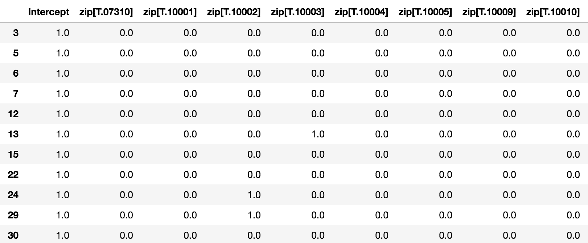

请注意，它们是按升序排列的，如果我们查看数据框中已排序的邮政编码值，除了缺少的邮政编码 07302 之外，我们看到的都是相同的，邮政编码 07302 现在是我们的基线，所有其他邮政编码都将与它进行比较。

再次查看我们的结果输出，我们注意到一些邮政编码非常重要，而另一些则不是。让我们看看我们的老朋友，林肯中心附近，或 10069。如果你记得的话，那是我们样本中租金最高的区域。我们预计，与泽西市的基线相比，这将是显著的，并具有较大的正系数，事实上，确实如此。*p*-值为 0.000，系数为 4116。这意味着，与泽西城的同等公寓相比，林肯中心附近的租金可能会高得多——这并不奇怪。

现在让我们用我们的模型来做一些预测。

# 预测

假设我们已经从之前的分析中确定，我们对三个特定的邮政编码感兴趣:`10002`、`10003`和`10009`。我们如何使用我们的模型来确定我们应该为给定的公寓支付什么？现在让我们来看看。

首先，我们需要知道模型的输入是什么样子的，这样我们就知道如何输入一组新的值。让我们来看看我们的`X`矩阵:

```py
X.head() 
```

上述代码生成以下输出:


我们看到的是，我们的输入是用所谓的**虚拟变量编码的。**为了表示邮政编码特征，因为它不是数字，所以使用虚拟编码。如果公寓在 10003，那么该列将被编码为`1`，而所有其他邮政编码被编码为`0`。床位将根据实际数量进行编码，因为它们是数字。现在让我们创建自己的输入行来预测:

```py
to_pred_idx = X.iloc[0].index 
to_pred_zeros = np.zeros(len(to_pred_idx)) 
tpdf = pd.DataFrame(to_pred_zeros, index=to_pred_idx, columns=['value']) 

tpdf 
```

上述代码生成以下输出:

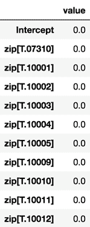

我们刚刚使用了`X`矩阵中的索引，并用全零填充数据。现在让我们填写我们的价值观。我们将在`10009`区为一居室公寓定价:

```py
tpdf.loc['Intercept'] = 1 
tpdf.loc['beds'] = 1 
tpdf.loc['zip[T.10009]'] = 1 

tpdf 
```

The intercept value for a linear regression must always be set to `1` for the model in order to return accurate statistical values.

上述代码生成以下输出:

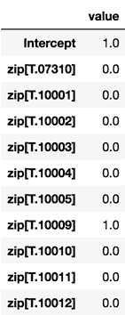

我们已经将我们的特征设置为适当的值，所以现在让我们使用我们的模型来返回一个预测。我们需要将它转换成数据帧并进行转置，以获得正确的格式。我们按如下方式进行:

```py
results.predict(tpdf['value'].to_frame().T) 
```

上述代码生成以下输出:


您会记得`results`是我们保存模型的变量名。该模型对象有一个`.predict()`方法，我们用输入值调用它。正如你所看到的，模型返回一个预测值。

如果我们想再增加一间卧室呢？我们可以这样做:

1.  让我们改变我们的输入，看看:

```py
tpdf['value'] = 0 
tpdf.loc['Intercept'] = 1 
tpdf.loc['beds'] = 2 
tpdf.loc['zip[T.10009]'] = 1 
```

2.  然后我们将再次运行预测:

```py
results.predict(tpdf['value'].to_frame().T) 
```

上述代码生成以下输出:

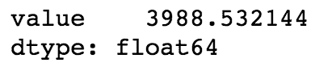

3.  看起来那个额外的卧室每月要多花我们 800 美元。但是如果我们选择`10069`来代替呢？让我们改变输入，看看:

```py
tpdf['value'] = 0 
tpdf.loc['Intercept'] = 1 
tpdf.loc['beds'] = 2 
tpdf.loc['zip[T.10069]'] = 1 

results.predict(tpdf['value'].to_frame().T) 
```

上述代码生成以下输出:


根据我们的模型，与东村相比，林肯中心地区的两间卧室将花费一大笔钱。

# 扩展模型

在这一点上，我们只检查了邮政编码、卧室和租金之间的关系。虽然我们的模型有一些解释性的好处，但我们只有很少的数据集和很少的特征来充分考察复杂的房地产估价世界。

然而，幸运的是，如果我们要向模型中添加更多的数据和特性，我们可以使用完全相同的框架来扩展我们的分析。

未来可能探索的一些扩展将是利用 Foursquare 或 Yelp 等 API 提供的餐馆和酒吧数据，或者利用 Walk Score 等提供商提供的步行性和交通邻近性度量。

有很多方法可以扩展这个模型，我建议如果你真的从事这样的项目，你可以探索各种各样的方法。每天都有更多的数据发布，有了这些数据，模型只能改进。

# 摘要

在这一章中，我们学习了如何获取房地产上市的数据，如何利用熊猫的功能来处理和净化这些数据，如何用 choropleths 直观地检查数据，最后，如何构建和使用回归模型来定价公寓。

此时，我们刚刚触及机器学习的表面。在接下来的章节中，我们将进一步探讨如何评估我们模型的质量，我们还将学习如何将它们转化为全面的解决方案。*