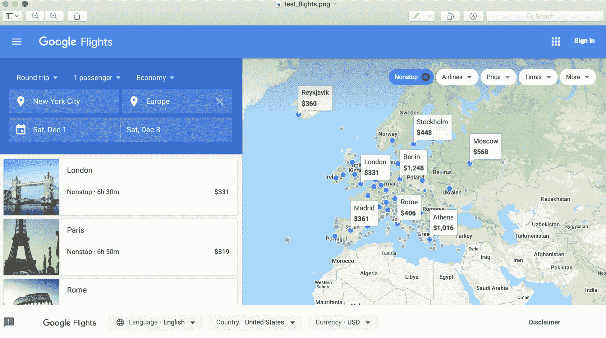
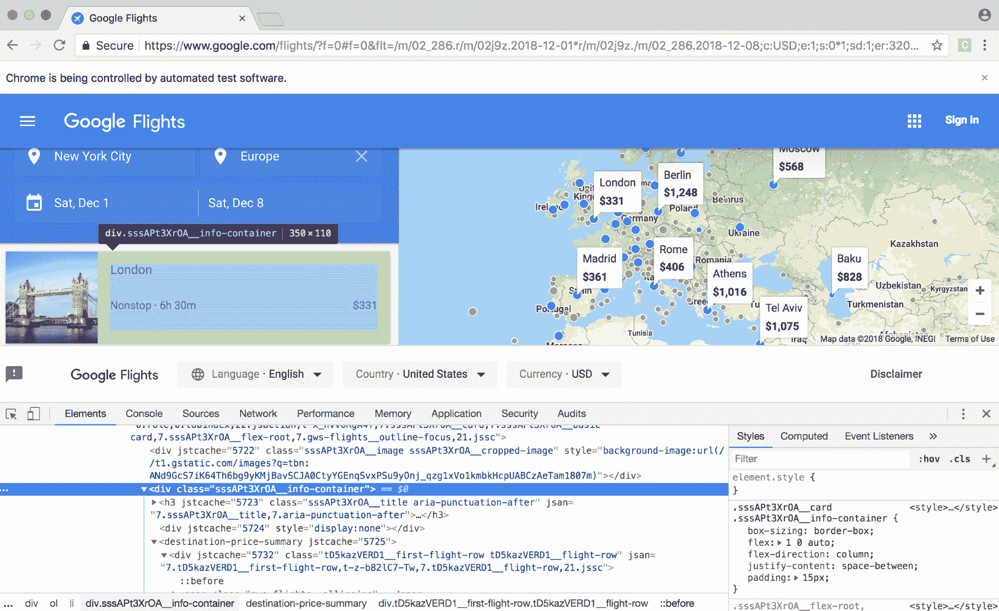
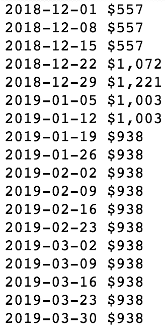
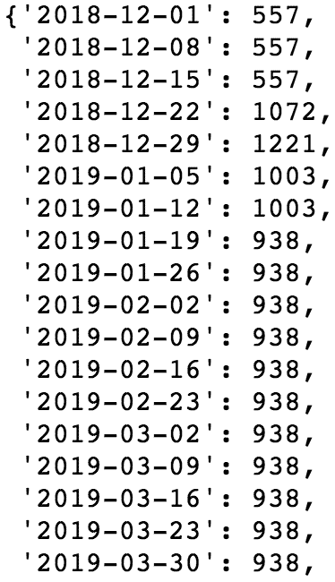
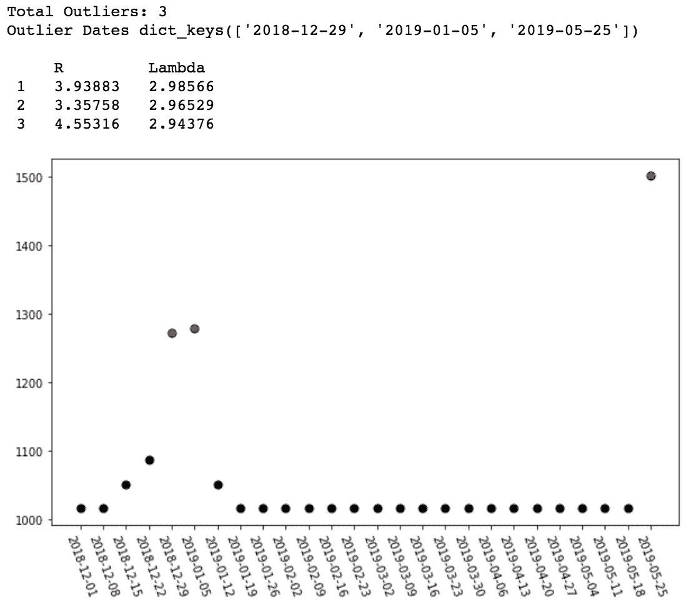
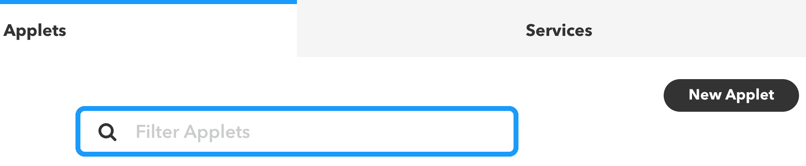
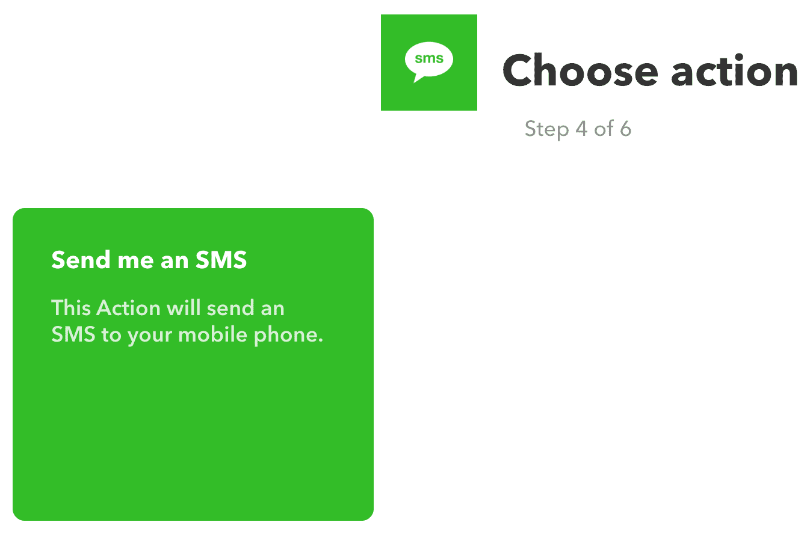
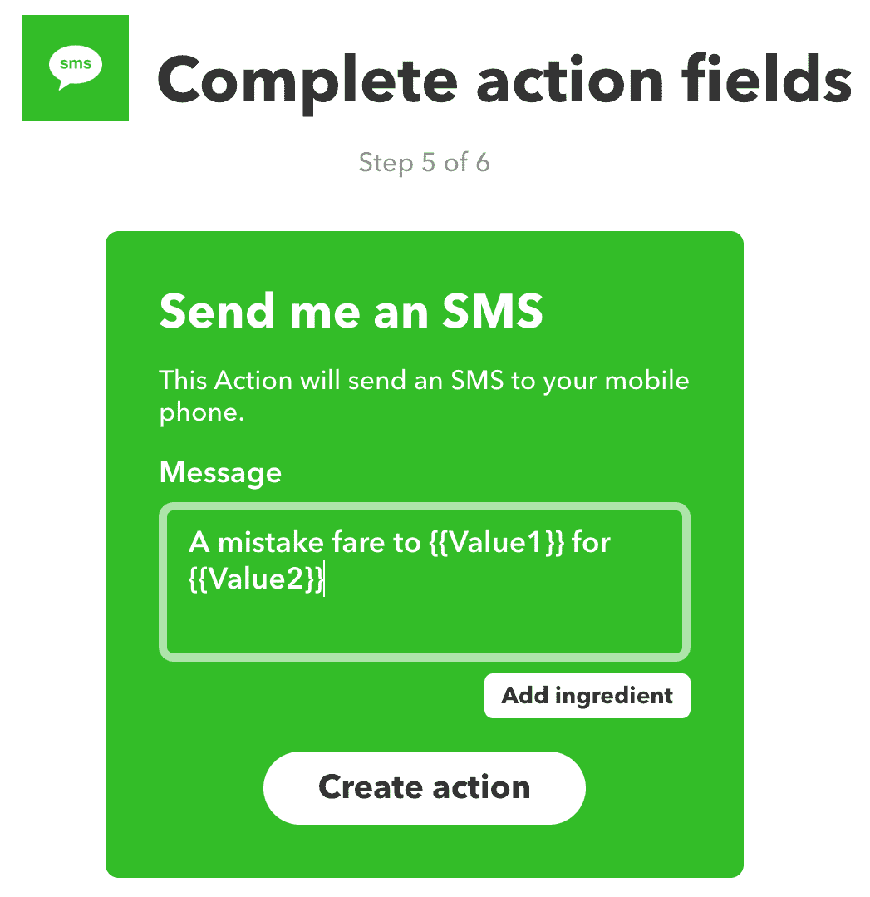
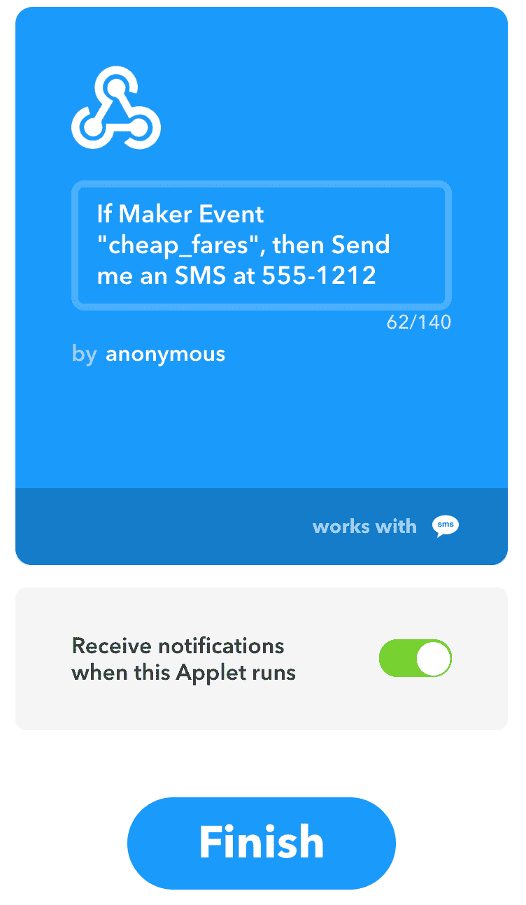

# 创建一个应用程序来寻找便宜的机票

我们来谈谈错误。它们是生活的一部分；每个人都制造它们——甚至航空公司。

2014 年，一天下午，我碰巧在看我的推特，我关注的一个账户发推说，美国一家主要航空公司飞往欧洲的机票价格明显低于预期。当时，从纽约到维也纳最便宜的票价约为 800 美元，但一些特定日期的广告票价在 350 美元至 450 美元之间。这似乎好得令人难以置信。但事实并非如此。我幸运地遇到了业内众所周知的错误。

在这个由旅行黑客和里程迷组成的超级神秘的社会里，众所周知，航空公司偶尔会公布不包括燃油附加费的票价。值得注意的是，这并不是他们犯的唯一错误。你可能会认为先进的算法会在考虑大量因素的情况下更新每个航班的票价。在大多数情况下，你是对的。但由于遗留系统以及处理多个承运人和多个辖区的复杂性，有时确实会出错。

以下是一些最近的错误票价列表:

*   2007 年，联合航空公司以 1500 美元的价格出售从旧金山到新西兰的商务机票
*   2013 年，达美航空以 6.90 美元的价格出售了从多个美国城市到夏威夷的经济舱机票
*   2015 年，美国航空公司以 450 美元的价格出售了从 DC 华府飞往中国的商务舱机票

既然你知道有这些票价，你怎么能上车呢？当然是机器学习！由于它们通常只持续几个小时就消失了，我们将构建一个应用程序，持续监控票价，检查异常价格，从而产生警报，我们可以迅速采取行动。

这就是我们将在本章中介绍的内容:

*   在网上寻找机票价格
*   使用高级网页抓取技术检索票价数据
*   解析 DOM 以提取价格
*   用异常检测技术识别异常票价
*   通过 IFTTT 发送实时文本警报

# 获取机票定价数据

幸运的是，获取机票数据比获取房地产数据要容易一些。这种数据有许多提供者，也有有偿和无偿的原料药。检索数据的一个具有挑战性的方面是它需要大量的 web 请求。在本书的上一版中，我们概述了如何从谷歌的**飞行探索者**页面抓取数据。这是在一个页面上查看多个城市数周价格数据的理想演示。不幸的是，该页面现在已经被删除，谷歌现在提供了一个更典型的搜索界面，要求用户输入出发城市、目的地城市、开始日期和结束日期。剩下的一个幸运特征是能够输入整个地区，而不是特定的城市。我们将在刮擦中利用这一点。这方面的一个例子可以在下面的截图中看到:


如您所见，我们已经输入`New York`作为我们的出发城市，并简单地将`Asia`作为我们的目的地。这返回了亚洲所有顶级城市(以及中东，出于某种原因)的价格。这是一个好消息，因为我们希望在一个 web 请求中获取尽可能多的价格。

虽然该界面仍然有一些功能，可以更容易地抓取这些数据，但我们需要使用一些比过去更先进的技术。我们接下来会讨论这个。

# 使用高级网页抓取功能检索票价数据

在前面的章节中，我们已经看到了如何使用`Requests`库来检索网页。正如我之前所说的，这是一个非常棒的工具，但不幸的是，它在这里对我们不起作用。我们想要抓取的页面完全基于 AJAX。**异步 JavaScript** ( **AJAX** )是一种无需重新加载页面就能从服务器检索数据的方法。这对我们来说意味着我们需要使用浏览器来检索数据。虽然这听起来可能需要大量的开销，但是有两个库，当一起使用时，使它成为一个轻量级任务。

这两个库是 Selenium 和 ChromeDriver。Selenium 是一个用于自动化网络浏览器的强大工具，ChromeDriver 是一个浏览器。为什么使用 ChromeDriver 而不是 Firefox 或 Chrome 本身？ChromeDriver 就是所谓的**无头浏览器**。这意味着它没有用户界面。这使它保持倾斜，非常适合我们正在努力做的事情。

To install ChromeDriver, you can download the binaries or source from [https://sites.google.com/a/chromium.org/chromedriver/downloads](https://sites.google.com/a/chromium.org/chromedriver/downloads). As for Selenium, it can be pip installed.

我们还需要另一个名为`BeautifulSoup`的库来解析页面中的数据。如果你没有安装，你现在也应该安装。

做完这些，让我们开始吧。我们将从 Jupyter 笔记本开始。这最适合探索性分析。稍后，当我们完成探索后，我们将继续在文本编辑器中为我们想要部署的代码工作。这是通过以下步骤完成的:

1.  首先，我们导入我们的例程库，如下面的代码片段所示:

```py
import numpy as np 
import pandas as pd 
import matplotlib.pyplot as plt 
%matplotlib inline 
```

2.  接下来，确保您已经安装了`BeautifulSoup`和`Selenium`，并下载了`ChromeDriver`，如前所述。我们现在将这些导入到一个新的单元格中:

```py
from bs4 import BeautifulSoup 
from selenium import webdriver 

# replace this with the path of where you downloaded chromedriver 
chromedriver_path = "/Users/alexcombs/Downloads/chromedriver" 

browser = webdriver.Chrome(chromedriver_path) 
```

请注意，我已经引用了我的机器上下载`ChromeDriver`的路径。请注意，您必须用自己机器上的路径替换该行。

# 创建链接

现在，值得注意的是，我们已经有了开始刮机票所需的一切，只有一个例外:我们需要网址。在这个练习中，我将重点关注从纽约出发飞往欧洲的航班。由于我们不想拉低大量数据并冒着被封锁的风险，我们将只拉周六出发并在下周六返回的直达航班的数据。当然，您可以自由地将其更改为您想要的任何票价，但是我们将在示例项目中使用它。

下一步是在谷歌航班中填写表格。确保选择一个未来的日期。输入数据并点击搜索后，从浏览器栏复制网址字符串，如下图所示:


我复制的网址是`2018-12-01`起飞`2018-12-08`返回的航班。这些日期可以在搜索字符串中看到。如果您选择不同的日期，您应该会看到这些日期反映在您复制的字符串中。现在让我们对其进行编码:

1.  让我们输入该字符串并将其保存为变量`sats`，如下面的代码块所示:

```py
sats = 'https://www.google.com/flights/f=0#f=0&flt=/m/02_286.r/m/02j9z.2018-12-01*r/m/02j9z./m/02_286.2018-12-08;c:USD;e:1;s:0*1;sd:1;t:e' 
```

2.  接下来，我们将测试我们能否成功检索到我们在页面上看到的内容。我们将使用下面一行代码来测试这一点，该代码使用`selenium`:

```py
browser.get(sats) 
```

3.  我们只需要这一行代码就可以检索页面。我们可以用几行额外的代码来验证这是否成功。
4.  首先，让我们检查页面的标题:

```py
browser.title 
```

由此产生的输出如下所示:


看起来我们找到了正确的页面。现在让我们检查一下我们是否捕获了我们正在寻找的所有东西。我们可以通过截图来做到这一点。我们用下面一行代码来实现:

```py
browser.save_screenshot('/Users/alexcombs/Desktop/test_flights.png') 
```

同样，我用来保存截图的路径是基于我的机器；您需要引用自己机器上的路径。正如您应该看到的，基于以下输出，我们成功地获得了页面的所有内容:



由于我们似乎拥有所有我们正在寻找的页面数据，我们现在将继续讨论如何从页面中提取单个数据点。为此，首先，我们需要了解**文档对象模型** ( **DOM** )。

# 解析 DOM 以提取定价数据

DOM 是构成网页的元素的集合。包括`body`、`div`等 HTML 标签，以及嵌入这些标签中的类和 id。

让我们看看谷歌页面的 DOM:

1.  要查看它，右键单击页面，然后单击检查。这对于火狐或者 Chrome 应该是一样的。这将打开开发人员选项卡，允许您查看页面源信息，如下图所示:


2.  打开后，选择左上角的元素选择器，点击一个元素，跳转到页面源代码中的那个元素:


3.  我们关心的元素是包含航班信息的盒子。这可以在下面的截图中看到:



如果你仔细观察这个元素，你会注意到它是一个叫做`div`的元素。这个 div 有一个属性叫做`class`。在这个`class`中是一长串随机数字和字母，但是你也会注意到它包含了字符串`info-container`。我们可以使用这些信息来检索所有拥有每个城市航班信息的`div`元素。我们将在一分钟内完成，但是现在，让我们讨论解析过程。

# 从语法上分析

为了开始我们的解析，我们需要使用前面提到的名为`BeautifulSoup`的库。我们之前导入过，所以现在只需要把页面源码传入`BeautifulSoup`。我们通过以下代码来做到这一点:

```py
soup = BeautifulSoup(browser.page_source, "html5lib") 
```

请注意，浏览器对象包含一个`page_source`属性。这就是我们之前用`get`请求检索到的所有 HTML。传递到`BeautifulSoup`的另一个参数是它将使用的解析库。在这里，我们将坚持使用`html5lib`。

现在，一旦页面内容已经传递到`BeautifulSoup`，我们要开始提取感兴趣的元素。这就是`info-container`类的`div`元素的来源。我们要找回那些。每一个都对应一个城市。

让我们检索它们，但我们只看第一个:

```py
cards = soup.select('div[class*=info-container]') cards[0] 
```

前面代码的输出如下所示:


在前面的代码中，我们在`soup`对象上使用了`select`方法。select 方法允许我们使用 CSS 选择器来引用感兴趣的元素。在这里，我们指定了我们想要的 div 具有一个`class`属性，该属性在类名中的某个地方包含字符串`info-container`。关于美化组有很好的文档来解释这些 CSS 选择器和其他方法，并且可以在[https://www . crummy . com/software/美化组/bs4/doc/#css 选择器](https://www.crummy.com/software/BeautifulSoup/bs4/doc/#css-selectors) [上找到。](https://www.crummy.com/software/BeautifulSoup/bs4/doc/#css-selectors)

查看前面的输出，注意隐藏在标记深处的是目的地城市的名称(`London`)和票价(`$440`)。因为我们只需要数据，而不是所有周围的标记，所以我们需要创建代码来迭代每个`info-container`div，并提取城市和票价:

```py
for card in cards: 
    print(card.select('h3')[0].text) 
    print(card.select('span[class*=price]')[0].text) 
    print('\n') 
```

前面的代码产生以下输出:


由于看起来我们能够成功地检索每个城市的票价，现在让我们继续构建大量票价的完整刮擦和解析。

我们现在将尝试检索 26 周内从纽约到欧洲的最低成本直达票价。我使用的开始日期是 2018 年 12 月 1 日，但是很明显，如果你在那个日期之后阅读这篇文章，请确保相应地调整你的日期。

我们首先需要的是引进一些额外的进口货。我们在下面的代码中这样做:

```py
from datetime import date, timedelta 
from time import sleep 
```

接下来，我们将构建剩余的抓取代码:

```py
start_sat = '2018-12-01' 
end_sat = '2018-12-08' 

start_sat_date = datetime.strptime(start_sat, '%Y-%m-%d') 
end_sat_date = datetime.strptime(end_sat, '%Y-%m-%d') 

fare_dict = {} 

for i in range(26):     
    sat_start = str(start_sat_date).split()[0] 
    sat_end = str(end_sat_date).split()[0] 

    fare_dict.update({sat_start: {}}) 

    sats = "https://www.google.com/flights/?f=0#f=0&flt=/m/02_286.r/m/02j9z." + \ 
    sat_start + "*r/m/02j9z./m/02_286." + \ 
    sat_end + ";c:USD;e:1;s:0*1;sd:1;t:e" 

    sleep(np.random.randint(3,7)) 
    browser.get(sats) 

    soup = BeautifulSoup(browser.page_source, "html5lib") 

    cards = soup.select('div[class*=info-container]') 

    for card in cards: 
        city = card.select('h3')[0].text 
        fare = card.select('span[class*=price]')[0].text 
        fare_dict[sat_start] = {**fare_dict[sat_start], **{city: fare}} 

    start_sat_date = start_sat_date + timedelta(days=7) 
    end_sat_date = end_sat_date + timedelta(days=7) 
```

这是相当多的代码，所以我们将一行一行地打开包装。前两行只是创建我们将使用的开始和结束日期。接下来的两行将这些日期字符串转换成`datetime`对象。这将在稍后当我们想使用`timedelta`给每个人增加一周时使用。`for`循环前的最后一行只是创建了一个保存解析数据的字典。

下一行开始一个`for`循环。在这个将运行`26`迭代的循环中，我们将`datetime`对象转换回一个字符串，这样我们就可以将其传递到我们将使用浏览器对象调用的网址中。另外，请注意，在每次迭代中，我们都会用开始日期填充票价字典。然后，我们使用创建的日期字符串创建我们的网址。

接下来，我们使用`numpy.random`函数和 Python `sleep`函数插入一个随机暂停。这只是为了防止我们看起来像一个机器人，过度使用网站。

然后我们用浏览器对象检索页面，将其传递到`BeautifulSoup`进行解析，选择`info-container`div，然后解析并更新我们的票价字典。最后，我们在开始和结束日期上增加一周，这样下一次迭代就可以提前一周。

现在，让我们看看票价字典中的数据:

```py
fare_dict 
```

前面的代码产生以下输出:


如您所见，我们有一个以日期为主键的字典，然后是以城市/票价配对的子字典。

现在，让我们深入一个城市来检查数据。我们从`Berlin`开始:

```py
city_key = 'Berlin' 
for key in fare_dict: 
    print(key, fare_dict[key][city_key]) 
```

前面的代码产生以下输出:


我们马上注意到的一件事是，我们需要清理机票，以便与他们合作。我们需要去掉美元符号和逗号，并将它们转换成整数。我们在下面的代码中这样做:

```py
city_dict = {} 
for k,v in fare_dict.items(): 
    city_dict.update({k:int(v[city_key].replace(',','').split('$')[1])}) 
```

前面的代码产生以下输出:


请记住，前面代码中显示的输出仅适用于柏林，因为我们目前只是在检查一个城市。

现在，让我们绘制数据:

```py
prices = [int(x) for x in city_dict.values()] 
dates = city_dict.keys() 

fig,ax = plt.subplots(figsize=(10,6)) 
plt.scatter(dates, prices, color='black', s=50) 
ax.set_xticklabels(dates, rotation=-70); 
```

上述代码生成以下输出:


请注意，我们有连续 26 周的数据，在这种情况下，从纽约到柏林的直飞航班周六起飞，下周六返回。这些票价似乎有相当大的差异。只需观察数据，似乎在期初和期末的高端可能有两个异常值。

现在，让我们看看另一个城市。为此，我们只需返回代码并更改`city_key`变量。然后我们可以重新运行它下面的细胞。我们将在下面的代码中做到这一点:

```py
city_key = 'Milan' 
for key in fare_dict: 
    print(key, fare_dict[key][city_key]) 
```

这将产生以下输出:



我们需要去掉美元符号和逗号，并将它们转换成整数。我们在下面的代码中这样做:

```py
city_dict = {} 
for k,v in fare_dict.items(): 
    city_dict.update({k:int(v[city_key].replace(',','').split('$')[1])}) 

city_dict 
```

前面的代码产生以下输出:



现在，让我们绘制数据:

```py
prices = [int(x) for x in city_dict.values()] 
dates = city_dict.keys() 

fig,ax = plt.subplots(figsize=(10,6)) 
plt.scatter(dates, prices, color='black', s=50) 
ax.set_xticklabels(dates, rotation=-70); 
```

前面的代码产生以下输出:


在这里，我们可以看到更大的差异，票价从 600 美元以下到 1200 美元以上不等。左边那些便宜的票价正是我们想知道的票价类型。我们想要创建一个异常值检测系统来告诉我们这些廉价票价。我们现在继续讨论这个问题。

# 用异常检测技术识别异常票价

异常值有各种严格的定义，但就我们的目的而言，**异常值**是与数据集中的其他观测值相差甚远的任何极值。有许多技术，包括参数和非参数技术，用于识别异常值；示例算法包括带有噪声的应用程序的基于密度的空间聚类、隔离森林和格拉布测试。通常，数据类型决定了使用的算法类型。例如，一些算法在多变量数据上比单变量数据做得更好。在这里，我们处理的是单变量时间序列数据，所以我们希望选择一个处理得好的算法。

If you aren't familiar with the term *time series*, it simply means data that is recorded at regular intervals, such as the daily closing price of a stock.

我们将用于数据的算法称为异常值的**广义极端学生化偏差** ( **广义静电放电**)测试。这种算法非常适合我们的数据，因为它是单变量和近似正态的。

我们可以使用几个测试来确保我们的数据近似正态分布，但是我们也可以使用正态概率图直观地检查我们的数据的正态性。现在，我们将使用 SciPy 库中的一些功能对莫斯科城市数据执行此操作:

```py
from scipy import stats 
fix, ax = plt.subplots(figsize=(10,6)) 
stats.probplot(list(city_dict.values()), plot=plt) 
plt.show() 
```

上述代码生成以下输出:


当评估一个**正态概率**或**分位数-分位数** ( **Q-Q** ) **图**时，我们寻找尽可能接近直线的数据来揭示正态性。偏离一个方向或另一个方向的数据，或具有强烈的 S 形，与正常数据相反。在这里，我们有相当少的数据点，而那些我们确实有相当平衡的对角线。如果我们有更多的数据，我们可能会更接近对角线。这对我们的目的来说应该足够好了。

我们现在将进入异常值检测代码。我们将为此利用另一个名为`PyAstronomy`的图书馆。如果你没有，可以很容易地安装 pip。

让我们看看代码:

```py
from PyAstronomy import pyasl 

r = pyasl.generalizedESD(prices, 3, 0.025, fullOutput=True) 

print('Total Outliers:', r[0]) 

out_dates = {} 
for i in sorted(r[1]): 
    out_dates.update({list(dates)[i]: list(prices)[i]}) 

print('Outlier Dates', out_dates.keys(), '\n') 
print('     R         Lambda') 

for i in range(len(r[2])): 
    print('%2d  %8.5f  %8.5f' % ((i+1), r[2][i], r[3][i])) 

fig, ax = plt.subplots(figsize=(10,6)) 
plt.scatter(dates, prices, color='black', s=50) 
ax.set_xticklabels(dates, rotation=-70); 

for i in range(r[0]): 
    plt.plot(r[1][i], prices[r[1][i]], 'rp') 
```

让我们讨论一下前面的代码是做什么的。第一行就是我们的进口。接下来，我们实现了我们的广义静电放电算法。参数是我们的票价，然后是离群值的最大数量(在这里，我们选择了`3`)，显著性水平(α，在`0.025`)，最后是一个布尔值来指定我们想要完整的输出。关于显著性水平，该值越低，算法越不敏感，并且将产生越少的误报。

接下来的两行只是打印出与`R`和`Lambda`值相关的数据。这些用于确定数据点是否为异常值。

最后，代码的剩余部分只是用于生成散点图，并将异常值的票价涂成红色。

上述代码生成以下输出:


同样，这些数据是针对莫斯科的。确保您更改了您的`city_key`变量来反映这一点，以确保您获得该数据。请注意，尽管有各种变化，数据中没有异常值。

现在，让我们也为米兰运行它。我们将返回并更改我们的`city_key`变量，并运行下面的单元格来更新所有内容，如下图所示:


请注意，这一次，我们有三个异常值，当平均票价看起来超过 900 美元时，这些票价低于 600 美元，因此这看起来像是我们的胜利。

让我们试试另一个城市。这一次，我们将通过更新`city_key`变量并运行后续单元格来查看雅典:



请再次注意，我们有三个异常值，但这一次，它们是向上的极端票价。因为我们只对获取便宜票价的警报感兴趣，所以我们可以建立一种机制，只在票价异常值小于平均票价时提醒我们。

现在，我们将创建一些代码来处理这个元素:

```py
city_mean = np.mean(list(city_dict.values())) 

for k,v in out_dates.items(): 
    if v < city_mean: 
        print('Alert for', city_key + '!') 
        print('Fare: $' + str(v), 'on', k) 
        print('\n') 
```

当我们运行雅典的代码时，它不会产生任何输出。当运行米兰时，它会生成以下输出:


所以，现在，我们已经创建了一个系统来抓取数据，解析它，并识别异常值。让我们继续前进，创建一个能够实时提醒我们的成熟应用程序。

Keep in mind that we just did a very preliminary analysis on our outlier detection model. In the real world, it would likely take a much more thorough series of tests to identify whether we had selected workable parameters for our model.

# 使用 IFTTT 发送实时警报

为了有机会获得这些便宜的票价，我们需要几乎实时地了解它们何时发生。为此，我们将使用名为**如果这个那么那个**(**iftt**)的服务。这个免费的服务允许你用一系列的触发器和动作连接大量的服务。想在 Instagram 上将任意多的图片保存到 iPhone 照片中吗？想在某个人每次发推的时候都收到一封邮件吗？想把你的脸书更新发到推特上吗？IFTTT 可以做到这一切。执行以下步骤:

1.  第一步是在[http://www.ifttt.com](https://ifttt.com/)注册账户。
2.  完成后，您需要注册 Maker 频道[https://ifttt.com/maker_webhooks](https://ifttt.com/maker_webhooks)，以及短信频道[https://ifttt.com/sms](https://ifttt.com/sms)。
3.  Maker 允许您通过发送和接收 HTTP 请求来创建 IFTTT 食谱。
4.  创建帐户并激活 Maker 和 SMS 频道后，从主页中单击我的小程序，然后单击新建小程序:



5.  然后，点击这个，如下图截图所示:


6.  然后，搜索`webhooks`并点击接收网络请求:


7.  然后，我们将创建一个名为`cheap_fares`的事件:


8.  填写事件名称后，单击创建触发器。接下来，我们将设置+that:


9.  点击，然后搜索`SMS`并选择:


然后，选择向我发送短信:



10.  之后，我们将定制我们的消息:



完成后，单击“完成”结束设置:



要测试设置，进入[http://www.ifttt.com/maker_webhooks](https://ifttt.com/maker_webhooks)并点击设置。您应该看到您的帐户信息，其中包括一个带有密钥的网址。将该网址复制并粘贴到浏览器中。它应该有一个表格，上面有你的密匙和一个地方来填写与你的城市和价格相对应的值。

填写活动的廉价票价，并将城市和票价分别设为值 1 和值 2:


最后，点击测试它，你应该会在几秒钟内收到一条短信。

现在我们已经把所有的部分都准备好了，是时候把它们整合成一个可以全天候监控票价的脚本了。

# 把它们放在一起

到目前为止，我们一直在 Jupyter 笔记本中工作，但是现在，为了部署我们的应用程序，我们将继续在文本编辑器中工作。笔记本非常适合探索性分析和可视化，但是运行后台工作最好在一个简单的`.py`文件内完成。那么，让我们开始吧。

我们将从进口开始。如果您还没有安装它们，您可能需要`pip install`其中的一些:

```py
import sys 
import sys 
import numpy as np 
from bs4 import BeautifulSoup 
from selenium import webdriver 
import requests 
import scipy 
from PyAstronomy import pyasl 

from datetime import date, timedelta, datetime 
import time 
from time import sleep 
import schedule 
```

接下来，我们将创建一个下拉数据并运行算法的函数:

```py
def check_flights(): 
   # replace this with the path of where you downloaded chromedriver 
   chromedriver_path = "/Users/alexcombs/Downloads/chromedriver" 

   browser = webdriver.Chrome(chromedriver_path) 

   start_sat = sys.argv[2] 
   end_sat = sys.argv[3] 

   start_sat_date = datetime.strptime(start_sat, '%Y-%m-%d') 
   end_sat_date = datetime.strptime(end_sat, '%Y-%m-%d') 

   fare_dict = {} 

   for i in range(26):     
       sat_start = str(start_sat_date).split()[0] 
       sat_end = str(end_sat_date).split()[0] 

       fare_dict.update({sat_start: {}}) 

       sats = "https://www.google.com/flights/?f=0#f=0&flt=/m/02_286.r/m/02j9z." + \ 
       sat_start + "*r/m/02j9z./m/02_286." + \ 
       sat_end + ";c:USD;e:1;s:0*1;sd:1;t:e" 

       sleep(np.random.randint(10,15)) 

       browser.get(sats) 
       soup = BeautifulSoup(browser.page_source, "html5lib") 

       cards = soup.select('div[class*=info-container]') 

       for card in cards: 
           city = card.select('h3')[0].text 
           fare = card.select('span[class*=price]')[0].text 
           fare_dict[sat_start] = {**fare_dict[sat_start], **{city: fare}} 

       start_sat_date = start_sat_date + timedelta(days=7) 
       end_sat_date = end_sat_date + timedelta(days=7) 

   city_key = sys.argv[1] 

   city_dict = {} 
   for k,v in fare_dict.items(): 
       city_dict.update({k:int(v[city_key].replace(',','').split('$')[1])}) 

   prices = [int(x) for x in city_dict.values()] 
   dates = city_dict.keys() 

   r = pyasl.generalizedESD(prices, 3, 0.025, fullOutput=True) 

   print('Total Outliers:', r[0]) 

   out_dates = {} 
   for i in sorted(r[1]): 
       out_dates.update({list(dates)[i]: list(prices)[i]}) 

   city_mean = np.mean(list(city_dict.values())) 

   for k,v in out_dates.items(): 
       if v < city_mean: 
          requests.post('https://maker.ifttt.com/trigger/cheap_fares/with/key/bNHFwiZx0wMS7EnD425n3T', \ 
             data={ "value1" : str(city_key), "value2" : str(v), "value3" : "" }) 
          print('Alert for', city_key + '!') 
          print('Fare: $' + str(v), 'on', k) 
          print('\n') 
       else: 
          print(str(v) + ' is greater than ' + str(city_mean)) 

```

最后，我们将包括一个调度程序。这将每 60 分钟运行一次我们的代码:

```py
# set up the scheduler to run our code every 60 min 
schedule.every(60).minutes.do(check_flights) 

while 1: 
    schedule.run_pending() 
    time.sleep(1) 
```

这就够了。我们现在可以将其保存为`fare_alerter.py`，并从命令行运行它。你需要传入三个参数。第一个是城市，第二个是开始日期，最后一个是结束日期。一个例子如下:

```py
python fare_alerter.py 'Milan' '2018-12-01' '2018-12-08'
```

该脚本将继续运行，并每 60 分钟检查一次票价。如果发生错误，我们会是第一个知道的！

# 摘要

这一章我们已经讲了很多内容。我们已经学习了如何在网络上找到最好的机票数据，如何与 DOM 一起工作来找到我们想要解析的元素，如何识别异常值，最后，如何通过 IFTTT 使用网络请求从我们的代码中发送文本警报。虽然我们在这里讨论的是机票价格，但我们所做的几乎所有事情都可以重复用于您希望得到提醒的任何定价类型。

如果你真的决定用它来买机票，我希望它能给你带来很多快乐的旅行！