# 预测你的内容是否会迅速传播

像许多伟大的事情一样，这一切都始于打赌。那是 2001 年，当时麻省理工学院的研究生乔纳·佩雷蒂正在拖延。他没有写论文，而是决定接受耐克的提议，个性化一双运动鞋。根据最近启动的一个项目，任何人都可以从他们的网站 NIKEiD 这样做。唯一的问题是，至少从耐克的角度来看，按照佩雷蒂的要求，在他们身上印上“血汗工厂”这个词是行不通的。佩雷蒂在一系列电子邮件中提出异议，指出该词绝不属于会导致他的个性化请求被拒绝的任何令人反感的术语类别。

佩雷蒂认为其他人可能会觉得与耐克客服代表的交流也很有趣，于是将这些交流转发给了一些密友。几天之内，这些电子邮件就进入了世界各地的收件箱。《时代》、《沙龙》、《卫报》甚至《今日秀》等主要媒体都开始关注此事。佩雷蒂是一场病毒式轰动的中心。

但开始困扰佩雷蒂的问题是，这种事情能被复制吗？他的朋友卡梅伦·马洛一直在准备写他关于病毒现象的博士论文，并坚持认为这样的事情太复杂了，任何人都无法设计。赌注就在这里开始了。马洛打赌说，佩雷蒂不可能重复他与耐克最初的一系列电子邮件所获得的成功。

快进 15 年，乔纳·佩雷蒂领导的网站已经成为病毒的代名词——BuzzFeed。2015 年，该网站拥有超过 7700 万的独特访客，总访问量排名高于《纽约时报》。我认为可以肯定地说，佩雷蒂赢了那笔赌注。

但是佩雷蒂到底是怎么做到的呢？他是如何拼凑出创造像野火一样传播的内容的秘密公式的？在这一章中，我们将试图解开其中的一些谜团。我们将研究一些最常分享的内容，并尝试找出区别于人们不太愿意分享的内容的共同要素。

本章将涵盖以下主题:

*   关于病毒性，研究告诉了我们什么？
*   获取共享计数和内容
*   探索共享性的特征
*   构建预测性内容评分模型

# 关于病毒性，研究告诉了我们什么？

理解分享行为是大生意。随着消费者年复一年地对传统广告越来越视而不见，这种推动正在超越简单的推销，转而讲述引人入胜的故事。这些努力的成功越来越多地以社会份额来衡量。为什么要这么麻烦？因为，作为一个品牌，我收到的每一份都代表着我接触到的另一个消费者——所有这些都不需要额外花费一分钱。

由于这一价值，一些研究人员检查了分享行为，希望了解它的动机。研究人员发现的原因如下:

*   为他人提供实用价值(利他动机)
*   将自己与某些想法和概念联系起来(认同动机)
*   围绕共同的情感(共同的动机)与他人建立联系

关于最后一个动机，一项特别精心设计的研究查看了《纽约时报》的 7000 篇内容，以考察情绪对分享的影响。他们发现，单纯的情绪情绪不足以解释分享行为，但当结合情绪唤醒时，解释力更大。

例如，虽然悲伤有很强的负价，但它被认为是一种低唤醒状态。另一方面，愤怒具有负价，这与高唤醒状态成对出现。因此，让读者难过的故事往往比引发愤怒的故事少得多。那么，如今在政治中扮演如此重要角色的许多虚假新闻都是以这种形式出现的，这有什么好奇怪的吗？下图显示了相同的结果:

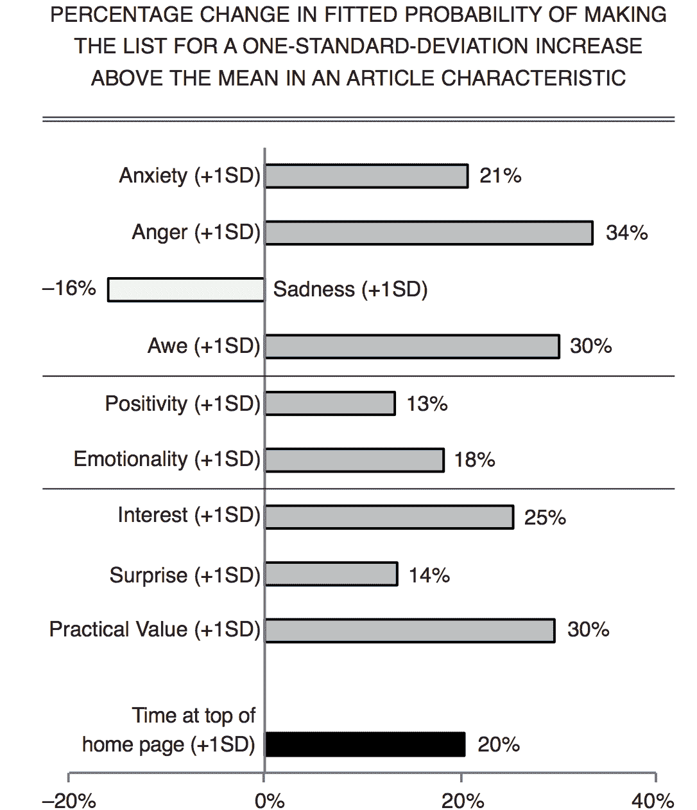

Figure taken from *What Makes Online Content Viral?* by Jonah Berger and Katherine L. Milkman, Journal of Marketing Research, available at: http://jonahberger.com/wp-content/uploads/2013/02/ViralityB.pdf

这涵盖了激励的方面，但是如果我们保持这些因素不变，其他属性如何影响一个内容的虚拟性？其中一些因素可能包括以下内容:标题措辞、标题长度、标题词性、内容长度、帖子的社交网络、主题、主题的及时性等等。毫无疑问，一个人可以用一生的时间来研究这种现象。然而，就目前而言，我们将在接下来的 30 页左右的时间里这样做。从那里，你可以决定你是否愿意更进一步。

# 获取共享计数和内容

在我们开始探索哪些功能可以共享内容之前，我们需要获得相当多的内容，以及共享频率的数据。不幸的是，在过去几年中，保护这类数据变得更加困难。事实上，当这本书的第一版在 2016 年出版时，这些数据很容易获得。但是今天，这种类型的数据似乎没有免费的来源，尽管如果你愿意付费，你仍然可以找到。

对我们来说幸运的是，我有一个数据集，它是从一个现已关闭的网站`ruzzit.com`收集的。该网站在活动时，跟踪了一段时间内共享最多的内容，这正是我们对该项目的要求:

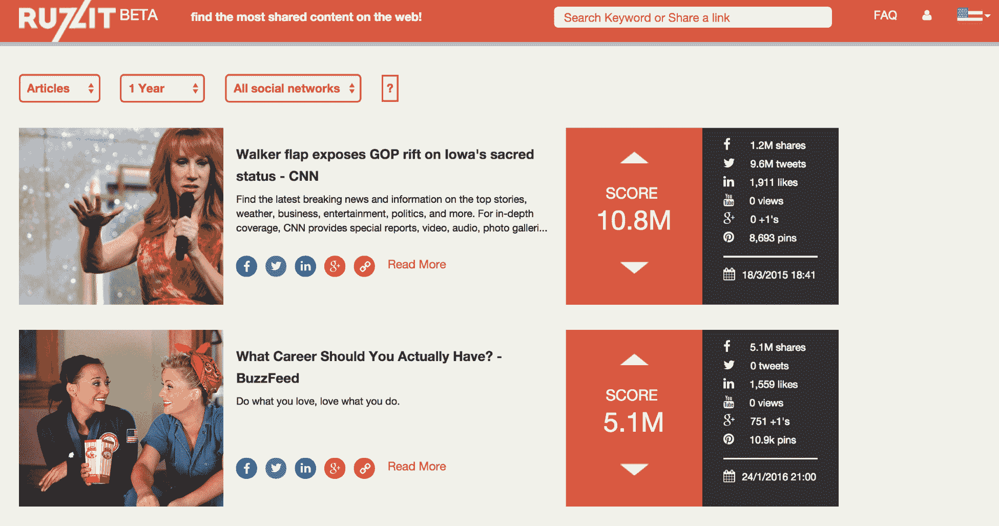

我们将像往常一样，首先将导入内容加载到笔记本中，然后加载数据。这个特殊的数据是以 JSON 文件的形式出现的。我们可以使用 pandas `read_json()`方法读取它，如下面的代码块所示:

```py
import numpy as np 
import pandas as pd 
import matplotlib.pyplot as plt 
%matplotlib inline 

dfc = pd.read_json('viral_dataset.json') 
dfc.reset_index(drop=True, inplace=True) 
dfc 
```

上述代码生成以下输出:


让我们看一下这个数据集的列，以便更好地理解我们将使用的内容:

```py
dfc.columns 
```

上述代码生成以下输出:

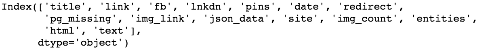

现在，让我们来看看每一列代表什么:

*   `title`:文章标题
*   `link`:链接`ruzzit.com`
*   `bb`:脸书喜欢的人数
*   `lnkdn`:领英股份数量
*   `pins`:Pinterest 针数
*   `date`:文章的日期
*   `redirect`:原文链接
*   `pg_missing`:描述该页面是否可用的字段
*   `img_link`:文章图片的链接
*   `json_data`:与文章相关的附加数据
*   `site`:文章所在的域
*   `img_count`:文章中包含的图片数量
*   `entities`:文章的人物、地点、事物相关特征
*   `html`:文章正文
*   `text`:文章正文

另一个有启发性的特点是每篇文章的字数。我们目前的数据中没有这些，所以让我们创建一个函数来为我们提供这些:

```py
def get_word_count(x): 
    if not x is None: 
        return len(x.split(' ')) 
    else: 
        return None 

dfc['word_count'] = dfc['text'].map(get_word_count) 
dfc 
```

上述代码生成以下输出:

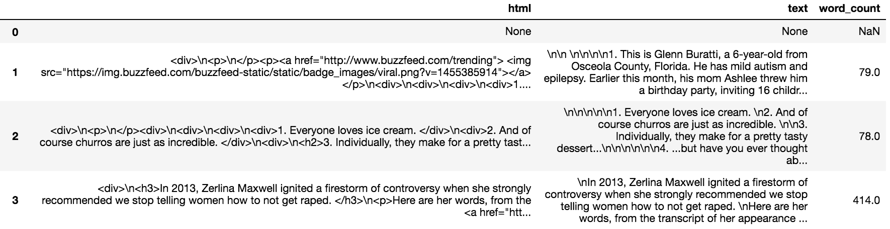

让我们添加更多功能。我们将在页面上添加第一个图像最突出的颜色。每个图像的颜色在 JSON 数据中按 RGB 值列出，因此我们可以从中提取颜色:

```py
import matplotlib.colors as mpc 

def get_rgb(x): 
    try: 
        if x.get('images'): 
            main_color = x.get('images')[0].get('colors')[0].get('color') 
            return main_color 
    except: 
        return None 

def get_hex(x): 
    try: 
        if x.get('images'): 
            main_color = x.get('images')[0].get('colors')[0].get('color') 
            return mpc.rgb2hex([(x/255) for x in main_color]) 
    except: 
        return None 
 dfc['main_hex'] = dfc['json_data'].map(get_hex) 
dfc['main_rgb'] = dfc['json_data'].map(get_rgb) 

dfc 
```

上述代码生成以下输出:


我们已经从第一张图像中提取了最突出的颜色作为 RGB 值，但我们也将其转换为十六进制值。我们稍后在检查图像颜色时会用到它。

数据准备就绪后，我们就可以开始进行分析了。我们将尝试找到内容高度可共享的原因。

# 探索共享性的特征

我们在这里收集的故事大致代表了 2015 年和 2016 年初 500 条最常分享的内容。我们将尝试解构这些文章，找出让它们如此易于分享的共同特征。我们将从查看图像数据开始。

# 探索图像数据

让我们从每个故事中包含的图片数量开始。我们将进行数值计算，然后绘制数字:

```py
dfc['img_count'].value_counts().to_frame('count') 
```

这将显示类似于以下内容的输出:


现在，让我们绘制相同的信息:

```py
fig, ax = plt.subplots(figsize=(8,6)) 
y = dfc['img_count'].value_counts().sort_index() 
x = y.sort_index().index 
plt.bar(x, y, color='k', align='center') 
plt.title('Image Count Frequency', fontsize=16, y=1.01) 
ax.set_xlim(-.5,5.5) 
ax.set_ylabel('Count') 
ax.set_xlabel('Number of Images') 
```

此代码生成以下输出:

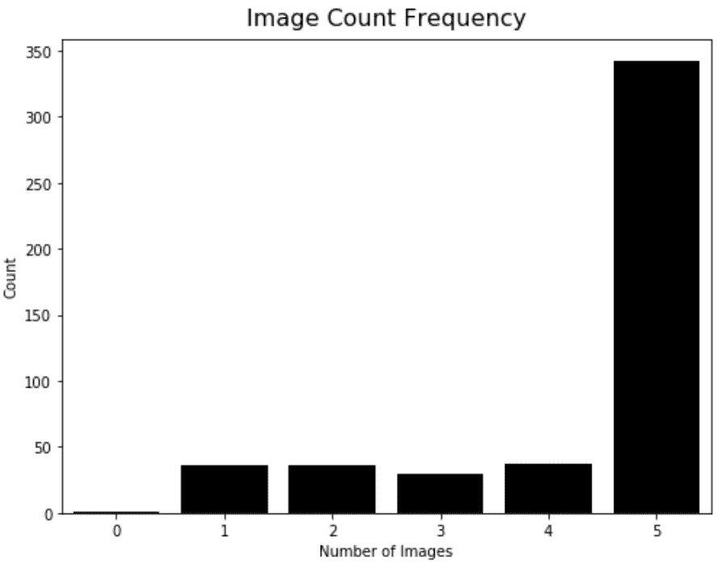

我已经对这些数字感到惊讶了。绝大多数故事都有五张图片在里面，而那些要么有一张图片要么根本没有图片的故事则相当罕见。

因此，我们可以看到人们倾向于与大量图像共享内容。现在，让我们看看这些图像中最常见的颜色:

```py
mci = dfc['main_hex'].value_counts().to_frame('count') 

mci 
```

此代码生成以下输出:

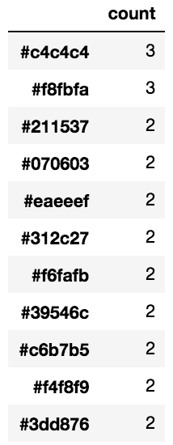

我不知道你怎么想，但鉴于我不认为十六进制值是颜色，这并没有多大帮助。然而，我们可以在熊猫中使用一个叫做条件格式的新特性来帮助我们:

```py
mci['color'] = ' ' 

def color_cells(x): 
    return 'background-color: ' + x.index 

mci.style.apply(color_cells, subset=['color'], axis=0) 

mci 
```

上述代码生成以下输出:

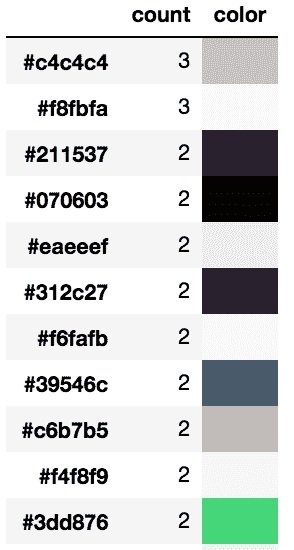

# 使聚集

这当然有帮助，但是颜色是如此的精细，我们总共有超过 450 种独特的颜色。让我们使用一点聚类来将这个范围缩小到更易管理的范围。由于我们有每种颜色的 RBG 值，我们可以创建一个三维空间来使用 k-means 算法对它们进行聚类。我不会在这里详细讨论算法，但它是一个相当简单的迭代算法，基于通过测量到中心的距离并重复来生成聚类。算法确实需要我们选择 *k* ，或者我们期望的聚类数量。因为 RGB 的范围是从 0 到 256，所以我们将使用 256 的平方根，也就是 16。这应该给我们一个可管理的数字，同时保留我们调色板的特性。

首先，我们将 RGB 值分成单独的列:

```py
def get_csplit(x): 
    try: 
        return x[0], x[1], x[2] 
    except: 
        return None, None, None 

dfc['reds'], dfc['greens'], dfc['blues'] = zip(*dfc['main_rgb'].map(get_csplit)) 
```

接下来，我们将使用它来运行我们的 k 均值模型并检索中心值:

```py
from sklearn.cluster import KMeans 

clf = KMeans(n_clusters=16) 
clf.fit(dfc[['reds', 'greens', 'blues']].dropna()) 

clusters = pd.DataFrame(clf.cluster_centers_, columns=['r', 'g', 'b']) 

clusters 
```

这将生成以下输出:


现在，我们有了每张图片中第一张图片的十六种最受欢迎的主色。让我们检查他们是否正在使用我们的熊猫`DataFrame.style()`方法和我们之前创建的功能来给我们的细胞着色。我们需要将我们的索引设置为三列的十六进制值，以使用我们的`color_cells`函数，因此我们也将这样做:

```py
def hexify(x): 
    rgb = [round(x['r']), round(x['g']), round(x['b'])] 
    hxc = mpc.rgb2hex([(x/255) for x in rgb]) 
    return hxc 

clusters.index = clusters.apply(hexify, axis=1) 

clusters['color'] = ' ' 

clusters.style.apply(color_cells, subset=['color'], axis=0) 
```

这将生成以下输出:

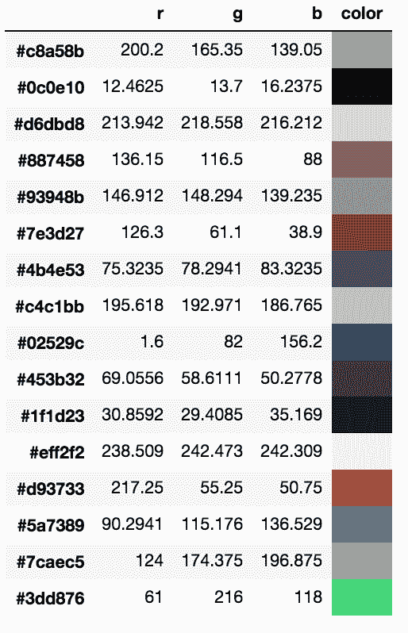

所以你有它；这些是您将在最常共享的内容中看到的最常见的颜色(至少对于第一张图像)。这比我预想的要单调一些，因为前几部似乎都是米色和灰色的色调。

现在，让我们继续研究我们故事的标题。

# 探索头条新闻

让我们从创建一个可以用来检查最常见元组的函数开始。我们将对其进行设置，以便稍后也可以在正文中使用它。我们将使用 Python **自然语言工具包** ( **NLTK** )库来实现这一点。如果您当前没有 pip 安装，可以安装它:

```py
from nltk.util import ngrams 
from nltk.corpus import stopwords 
import re 

def get_word_stats(txt_series, n, rem_stops=False): 
    txt_words = [] 
    txt_len = [] 
    for w in txt_series: 
        if w is not None: 
            if rem_stops == False: 
                word_list = [x for x in ngrams(re.findall('[a-z0-9\']+', w.lower()), n)] 
            else: 
                word_list = [y for y in ngrams([x for x in re.findall('[a-z0-9\']+', w.lower())\ 
                                                if x not in stopwords.words('english')], n)] 
            word_list_len = len(list(word_list)) 
            txt_words.extend(word_list) 
            txt_len.append(word_list_len) 
    return pd.Series(txt_words).value_counts().to_frame('count'), pd.DataFrame(txt_len, columns=['count']) 
```

里面有很多，我们打开包装吧。我们创建了一个函数，它接受一个序列、一个整数和一个布尔值。整数决定了我们将用于 n-gram 解析的 *n* ，而布尔值决定了我们是否排除停止词。该函数返回每行元组的数量和每个元组的频率。

让我们在标题上运行它，同时保留停止词。我们将从一个词开始:

```py
hw,hl = get_word_stats(dfc['title'], 1, 0) 

hl 
```

这将生成以下输出:

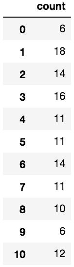

现在，我们有了每个标题的字数。让我们看看这上面的统计数据是什么样子的:

```py
hl.describe() 
```

此代码生成以下输出:


我们可以看到，我们的病毒式报道的标题长度中值正好是 11 个字。让我们来看看最常用的词:

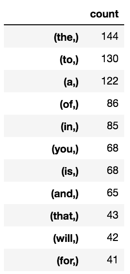

这并不完全有用，但符合我们的预期。现在，让我们看看 bi-gram 的相同信息:

```py
hw,hl = get_word_stats(dfc['title'], 2, 0) 

hw 
```

这将生成以下输出:


这绝对更有趣。我们可以开始一遍又一遍地看到标题的一些组成部分。突出的两个是`(donald, trump)`和`(dies, at)`。特朗普在选举期间说了一些引人注目的话，这是有道理的，但我对*去世的*头条感到惊讶。我看了一下头条，显然有一些高知名度的人在有问题的年份去世了，所以这也是有道理的。

现在，让我们在删除停止词的情况下运行这个程序:

```py
hw,hl = get_word_stats(dfc['title'], 2, 1) 

hw 
```

这将生成以下输出:

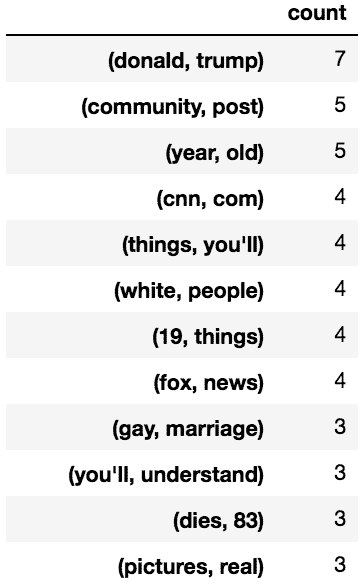

同样，我们可以看到许多我们可能期待的事情。看起来，如果我们改变解析数字的方式(用像 number 这样的单个标识符替换它们)，我们可能会看到更多这样的泡沫。如果你想尝试的话，我会把它留给读者。

现在，让我们来看看三克:

```py
hw,hl = get_word_stats(dfc['title'], 3, 0) 
```

此代码生成以下输出:


似乎我们包含的单词越多，标题就越像经典的 BuzzFeed 原型。事实上，让我们看看是否如此。我们还没有看到哪些网站产生的病毒故事最多；让我们看看 BuzzFeed 是否领先于图表:

```py
dfc['site'].value_counts().to_frame() 
```

这将生成以下输出:


我们可以清楚地看到，BuzzFeed 在列表中占据主导地位。在遥远的第二个地方，我们可以看到《赫芬顿邮报》，顺便说一下，这是乔纳·佩雷蒂工作过的另一个网站。研究病毒科学似乎能带来巨大的收益。

到目前为止，我们已经检查了图片和标题。现在，让我们继续检查故事的全文。

# 探索故事内容

在最后一节中，我们创建了一个函数来检查我们故事标题中常见的 n-grams。现在，让我们用它来探索我们故事的全部内容。

我们将从探索去掉了终止词的连词开始。由于与故事正文相比，标题太短了，所以完整地看一下停止词是有意义的，尽管在故事中，消除它们通常是有意义的:

```py
hw,hl = get_word_stats(dfc['text'], 2, 1) 

hw 
```

这将生成以下输出:

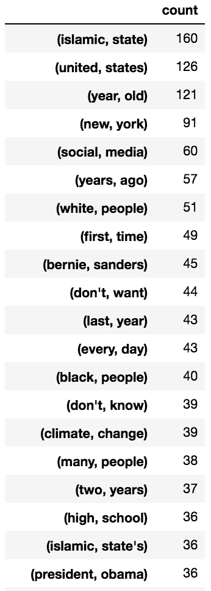

有趣的是，我们可以看到我们在头条看到的轻浮已经完全消失了。文本现在充满了讨论恐怖主义、政治和种族关系的内容。

怎么可能头条轻松，正文阴暗有争议？我认为这是因为像《13 只看起来像猫王的小狗》这样的文章比《T2》和《伊斯兰国史》要少得多。

让我们再看一个。我们将评估故事主体的三重图:

```py
hw,hl = get_word_stats(dfc['text'], 3, 1) 

hw 
```

此代码生成以下输出:


我们似乎突然进入了广告和社会迎合的领域。接下来，让我们继续构建内容评分的预测模型。

# 构建预测性内容评分模型

让我们利用我们所学的知识来创建一个模型，该模型可以估计给定内容的份额计数。我们将使用已经创建的特性，以及一些附加特性。

理想情况下，我们将拥有更大的内容样本，尤其是具有更典型的份额计数的内容，但我们将不得不满足于我们这里所拥有的。

我们将使用一种叫做**随机森林回归**的算法。在前几章中，我们研究了基于分类的随机森林的一个更典型的实现，但是在这里我们将尝试预测份额计数。我们可以将我们的共享类合并到范围中，但是在处理连续变量时最好使用回归，这就是我们正在处理的。

首先，我们将创建一个简单的模型。我们将使用图像数量、网站和字数。我们将根据脸书喜欢的数量来训练我们的模型。我们还将把数据分成两组:训练集和测试集。

首先，我们将导入 scikit-learn 库，然后我们将通过删除带有空值的行、重置索引来准备数据，最后将框架拆分为我们的训练和测试集:

```py
from sklearn.ensemble import RandomForestRegressor 

all_data = dfc.dropna(subset=['img_count', 'word_count']) 
all_data.reset_index(inplace=True, drop=True) 

train_index = [] 
test_index = [] 
for i in all_data.index: 
    result = np.random.choice(2, p=[.65,.35]) 
    if result == 1: 
        test_index.append(i) 
    else: 
        train_index.append(i) 
```

我们使用了一个随机数发生器，其概率设置为大约三分之二和三分之一，以确定哪一行项目(基于它们的`index`)将被放置在每一组中。像这样设置概率可以确保我们得到的训练集行数大约是测试集的两倍。我们可以在下面的代码中看到这一点:

```py
print('test length:', len(test_index), '\ntrain length:', len(train_index)) 
```

上述代码生成以下输出:

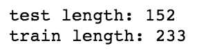

现在，我们将继续准备数据。接下来，我们需要为我们的站点设置分类编码。目前，我们的数据框架用字符串表示每个站点的名称。我们需要使用虚拟编码。这将为每个站点创建一列，如果该行有该特定站点，则该列将填充一个`1`，而站点的所有其他列将使用一个`0`进行编码。我们现在就开始吧:

```py
sites = pd.get_dummies(all_data['site']) 

sites 
```

上述代码生成以下输出:

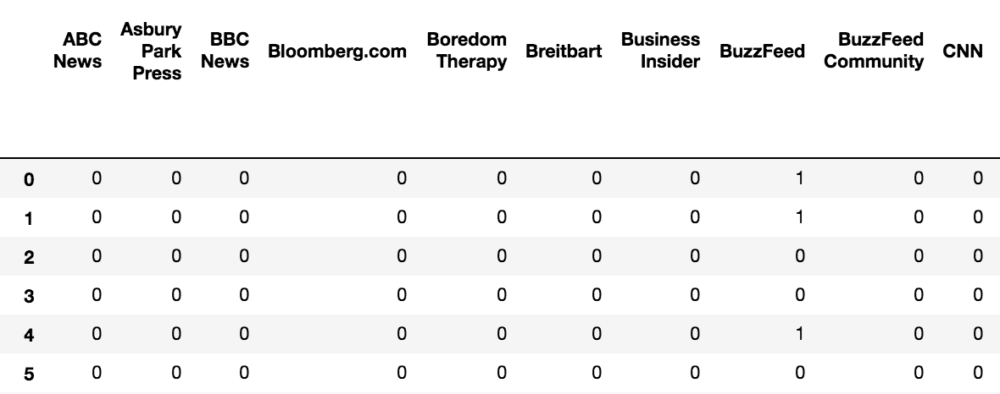

您可以从前面的输出中看到虚拟编码是如何出现的。

我们现在继续:

```py
y_train = all_data.iloc[train_index]['fb'].astype(int) 
X_train_nosite = all_data.iloc[train_index][['img_count', 'word_count']] 

X_train = pd.merge(X_train_nosite, sites.iloc[train_index], left_index=True, right_index=True) 

y_test = all_data.iloc[test_index]['fb'].astype(int) 
X_test_nosite = all_data.iloc[test_index][['img_count', 'word_count']] 

X_test = pd.merge(X_test_nosite, sites.iloc[test_index], left_index=True, right_index=True) 
```

至此，我们已经设置了`X_test`、`X_train`、`y_test`和`y_train`变量。现在，我们将使用我们的培训数据来构建我们的模型:

```py
clf = RandomForestRegressor(n_estimators=1000) 
clf.fit(X_train, y_train) 
```

有了这两行代码，我们已经训练了我们的模型。让我们用它来预测脸书喜欢我们的测试集:

```py
y_actual = y_test 
deltas = pd.DataFrame(list(zip(y_pred, y_actual, (y_pred - y_actual)/(y_actual))), columns=['predicted', 'actual', 'delta']) 

deltas 
```

此代码生成以下输出:


在这里，我们可以并排看到预测值、实际值和差异百分比。让我们看看这方面的描述性统计数据:

```py
deltas['delta'].describe() 
```

上述代码生成以下输出:

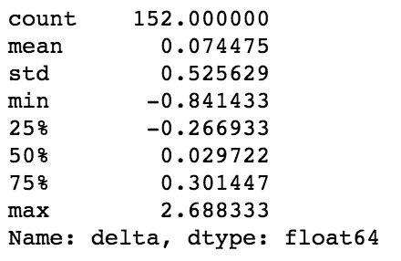

这看起来很神奇。我们的中位数误差是 0！嗯，不幸的是，这是一个特别有用的信息，因为错误是正反两面的，并且趋向于平均，这就是我们在这里看到的。让我们看一个更有信息的度量来评估我们的模型。我们要看均方根误差占实际平均值的百分比。

# 评估模型

为了说明为什么这更有用，让我们在两个示例系列上运行以下场景:

```py
a = pd.Series([10,10,10,10]) 
b = pd.Series([12,8,8,12]) 

np.sqrt(np.mean((b-a)**2))/np.mean(a) 
```

这将生成以下输出:

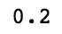

现在，将它与平均值进行比较:

```py
(b-a).mean() 
```

这将生成以下输出:


显然，后者是更有意义的统计数据。现在，让我们为我们的模型运行它:

```py
np.sqrt(np.mean((y_pred-y_actual)**2))/np.mean(y_actual) 
```

这将生成以下输出:

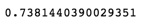

突然间，我们令人敬畏的模型看起来不那么令人敬畏了。让我们看一下我们的模型所做的一些预测与数据中可以看到的实际值的对比:

```py
deltas[['predicted','actual']].iloc[:30,:].plot(kind='bar', figsize=(16,8)) 
```

上述代码生成以下输出:


基于我们在这里看到的，这个模型——至少对于这个样本来说——倾向于适度低估典型文章的病毒率，但是严重低估一小部分文章的病毒率。让我们看看那些是什么:

```py
all_data.loc[test_index[:30],['title', 'fb']].reset_index(drop=True) 
```

前面的代码产生以下输出:

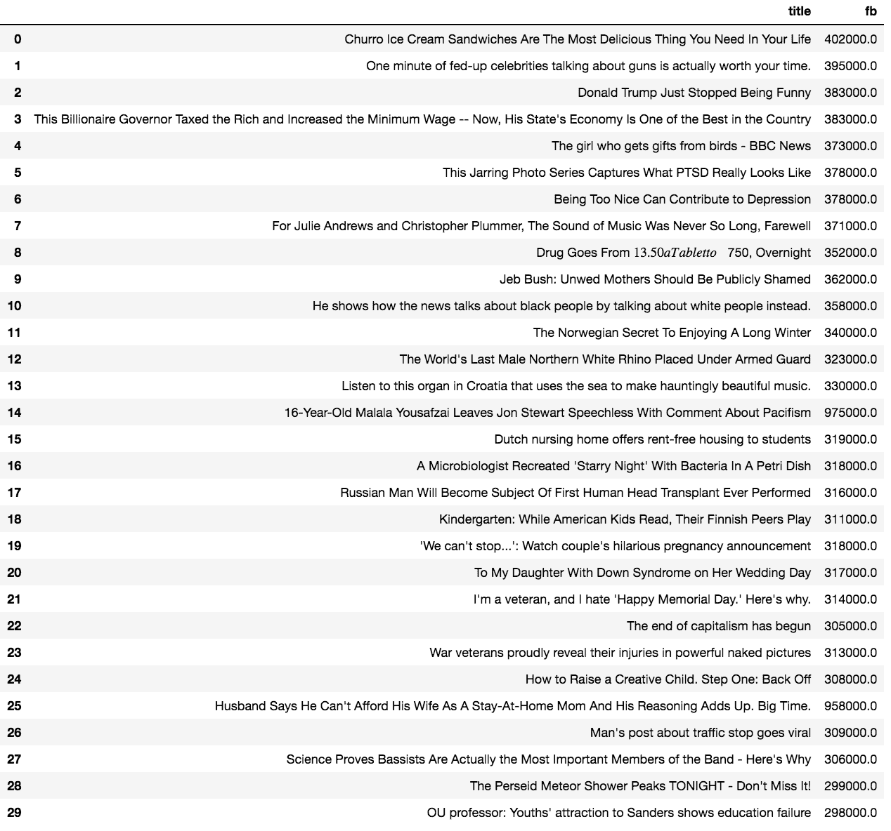

从前面的输出中，我们可以看到一篇关于*马拉拉*的文章和一篇关于*丈夫抱怨他的全职太太花了他多少钱*的文章大大超出了我们模型的预测数字。两者似乎都有很高的情感价。

# 为我们的模型添加新功能

现在，让我们给我们的模型添加另一个特性。让我们看看增加字数是否有助于我们的模型。我们将使用`CountVectorizer`来完成此操作。就像我们对网站名称所做的一样，我们将把单个单词和 n-grams 转换成特性:

```py
from sklearn.feature_extraction.text import CountVectorizer 

vect = CountVectorizer(ngram_range=(1,3)) 
X_titles_all = vect.fit_transform(all_data['title']) 

X_titles_train = X_titles_all[train_index] 
X_titles_test = X_titles_all[test_index] 

X_test = pd.merge(X_test, pd.DataFrame(X_titles_test.toarray(), index=X_test.index), left_index=True, right_index=True) 

X_train = pd.merge(X_train, pd.DataFrame(X_titles_train.toarray(), index=X_train.index), left_index=True, right_index=True) 
```

在前面的几行中，我们已经将现有功能加入到新的 n-gram 功能中。让我们训练我们的模型，看看我们是否有任何改进:

```py
clf.fit(X_train, y_train) 

y_pred = clf.predict(X_test) 

deltas = pd.DataFrame(list(zip(y_pred, y_actual, (y_pred - y_actual)/(y_actual))), columns=['predicted', 'actual', 'delta']) 

deltas 
```

此代码生成以下输出:

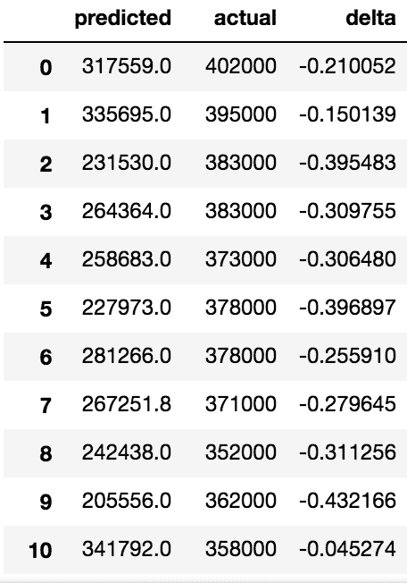

如果我们再次检查错误，我们将看到以下内容:

```py
np.sqrt(np.mean((y_pred-y_actual)**2))/np.mean(y_actual) 
```

上述代码生成以下输出:

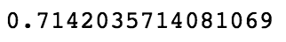

所以看起来我们有一个适度改进的模型。让我们在模型中增加一个特性——标题的字数:

```py
all_data = all_data.assign(title_wc = all_data['title'].map(lambda x: len(x.split(' ')))) 

X_train = pd.merge(X_train, all_data[['title_wc']], left_index=True, right_index=True) 

X_test = pd.merge(X_test, all_data[['title_wc']], left_index=True, right_index=True) 

clf.fit(X_train, y_train) 

y_pred = clf.predict(X_test) 

np.sqrt(np.mean((y_pred-y_actual)**2))/np.mean(y_actual) 
```

此代码生成以下输出:


似乎每个特性都适度地改进了我们的模型。当然，我们还可以添加更多的功能。例如，我们可以添加发布的日期和时间，我们可以通过在标题上运行正则表达式来确定文章是否是列表，或者我们可以检查每篇文章的情绪。但这只是触及了可能对虚拟性建模很重要的特性。我们当然需要更进一步，继续减少模型中的错误数量。

我还应该注意到，我们只对我们的模型进行了最粗略的测试。每次测量应运行多次，以获得更准确的实际误差率。因为我们只进行了一次测试，所以我们的最后两个模型之间可能没有统计上可辨别的差异。

# 摘要

在这一章中，我们研究了病毒内容的共同特征是什么，以及我们如何使用随机森林回归来建立一个预测病毒的模型。我们还学习了如何组合多种类型的特征，以及如何将我们的模型分成训练集和测试集。

希望你能利用在这里学到的知识，建立下一个病毒帝国。如果这种方法行不通，或许下一章关于掌握股票市场的内容会奏效。