# 用机器学习预测股票市场

就在最近，我读到一篇文章，描述了一种特殊疗法在对抗耐甲氧西林金黄色葡萄球菌方面取得的巨大成功。如果你没有直接听说过耐甲氧西林金黄色葡萄球菌，很可能你已经听说了一些关于目前的担忧，即我们正走向抗生素不再有效的时代。这在很大程度上是一种不可避免的现象，因为群体中的一些细菌对相关药物的遗传抗性更强。当对这种药物敏感的细菌在治疗过程中被消灭时，剩余的抗药性细菌就会繁殖并成为种群中的主要变种。为了解决这个问题，科学家们不断突破科学的界限，寻找新的方法来解决这些问题。

在生物学中，这种情况被称为**红皇后竞赛**:这个术语来自刘易斯·卡罗尔的《透过镜子看 T2:中的一句话

"Now, here, you see, it takes all the running you can do, to keep in the same place."

这有效地描述了我们在抗生素方面的处境，但也许答案在转向新的、越来越先进的药物时找不到。也许答案可以从理解更大的循环中找到，并利用它为我们带来好处。

我之前讨论的耐甲氧西林金黄色葡萄球菌的新疗法？这实际上来自于 10 世纪的一本医学药剂书，名为《T2·巴尔德的书》。列举的成分包括大蒜、葡萄酒和洋葱。这种组合被发现已经超过了我们目前的最后治疗手段**万古霉素**的结果。

但是这些和预测股市有什么关系呢？我想说的是，在这两种情况下，同样的现象都在起作用。例如，偶尔会有一篇论文发表，提醒金融界存在一种有利可图的异常现象。最有可能的是，这种现象是一些外部强加的现实世界约束的下游效应。

以年终税损销售为例。由于税法的性质，交易者在年底出售损失是有意义的。这给临近年底的亏损股票带来了价格下行压力。价格下跌意味着股票可以被折价超过其公允价值。这也意味着，1 月份，随着新资金投入这些被低估的资产，下行压力消失，取而代之的是上行压力。但一旦这种现象被传播开来，交易者试图走在前面，在 12 月下旬开始买入这些股票，并在 1 月份卖给那些预计会成为买家的其他交易者，这才有意义。这些新交易者，通过进入市场，现在已经稀释了影响。他们正在缓解年底的抛售压力，减少 1 月份的买入压力。这种影响基本上是随着盈利能力一起被套利的。曾经有效的方法不再有效，交易者将开始放弃策略，转向下一个新事物。

到现在，我希望你开始看到相似之处。大蒜、葡萄酒和洋葱的组合很可能曾经是治疗细菌感染的非常有效的方法，但随着细菌的适应，这种方法逐渐失去了效力。作为一种治疗方法，这种细菌在很久以前就被放弃了，因此没有理由避开使它们容易受到这种治疗的原始基因。现实世界的限制使得这种类型的循环几乎不可避免地会发生——无论是在生物体内还是在市场中。关键是利用这一点对我们有利。

在本章中，我们将花一些时间讨论如何构建和测试交易策略。然而，我们将花更多的时间来研究如何做到这一点。当试图设计你自己的系统时，有无数的陷阱需要避免，这几乎是一个不可能的任务，但它可能会很有趣，有时甚至会有利可图。话虽如此，不要做傻事，比如拿你输不起的钱去冒险。

If you do decide to use anything you learned here to trade, you're on your own. This shouldn't be deemed investment advice of any kind, and I accept no responsibility for your actions.

在本章中，我们将涵盖以下主题:

*   市场分析的类型
*   关于股票市场，研究告诉了我们什么？
*   如何开发交易系统

# 市场分析的类型

让我们从讨论一些处理金融市场时的关键术语和分析方法开始。虽然有无数的金融工具，包括股票、债券、ETF、货币和掉期，但我们将只讨论股票和股票市场。股票只是上市公司所有权的一部分。当公司的未来前景上升时，股票价格预计会上升，当这些前景下降时，股票价格会下降。

投资者一般分为两大阵营。第一类是基本面分析师。这些分析师仔细研究公司财务状况，寻找表明市场在某种程度上低估公司股票价值的信息。这些投资者关注各种因素，如收入、收益和现金流，以及各种价值比率。这通常包括查看一家公司的财务状况与另一家公司的财务状况的比较。

投资者的第二个阵营是技术分析师。技术分析师认为，股价已经反映了所有可公开获得的信息，浏览基本面在很大程度上是浪费时间。他们认为，通过查看历史价格——股票图表——你可以看到价格可能上涨、下跌或停滞的领域。一般来说，他们觉得这些图表揭示了投资者心理的线索。

这两个群体的共同点是一个潜在的信念，即正确的分析可以带来利润。但这是真的吗？

# 关于股票市场，研究告诉了我们什么？

也许过去 50 年里对股票市场最有影响的理论是有效市场假说。尤金·法玛发展的这一理论规定，市场是理性的，所有可获得的信息都适当地反映在股票价格中。因此，投资者不可能在风险调整的基础上始终如一地跑赢市场。有效市场假说通常被认为有三种形式:弱形式、半强形式和强形式:

1.  在弱形态下，市场是有效的，因为你不能用过去的价格信息来预测未来的价格。信息在股票中的反映相对较快，虽然技术分析可能无效，但在某些情况下，基本面分析可能有效。

2.  在半强形式下，价格立即以不偏不倚的方式反映所有相关的新公共信息。在这里，无论是技术分析还是基本面分析都不会有效。
3.  最后，在强形式中，股票价格反映了所有公共和私人信息。

基于这些理论，通过利用市场模式赚钱的希望不大。但幸运的是，尽管市场总体上以一种基本上有效的方式运行，但明显的低效区域已经被发现。其中大部分都是短暂的，但有些已经被记录为持续存在。其中最值得注意的——甚至根据法玛的说法——是动量策略的出色表现。

# 那么，动量策略到底是什么？

关于这个主题有许多不同的说法，但基本的观点是，股票是根据它们在前一个时期的回报从最高到最低排列的。排名靠前的表演者被购买并持有一段时间，然后在固定的持有期后重复该过程。典型的只做多的动量策略可能包括买入过去一年标准普尔 500 表现最好的 25 只股票，持有一年，卖出，然后重复这个过程。

这听起来像是一个荒谬的简单策略，事实也确实如此，但它始终会带来出乎意料的结果。但是为什么呢？你可以想象，很多研究已经检验了这种影响，假设是，关于人类如何处理新信息，存在某种内在的系统性偏见。研究表明，他们在短期内对新闻反应不足，然后在长期对新闻反应过度。这意味着，当股票在特别好的消息下开始上涨时，投资者不会将股价完全提升到充分反映这一消息的水平；他们需要时间来接受这个美好的前景。

This tendency of investors to fail to adequately reprice shares in the face of exceedingly good news may be the result of a well-documented bias called the **anchoring effect**. Essentially, when presented with a number, even a random number, and then asked to estimate a real-world value, such as the number of countries in Africa, for instance, our answer will be mentally tethered to that number we were primed with. Remarkably, this happens even if we know the number is randomly generated and unrelated to the question.

那么，随着越来越多的交易者了解并涌入，动量策略会不会被套利者抛弃？近年来有一些证据表明了这一点，但仍不清楚。无论如何，这种影响是显而易见的真实，并且持续的时间远远超过了有效市场假说目前所能解释的时间。因此，至少市场预测似乎有一些希望。考虑到这一点，现在让我们继续探索如何挖掘我们自己的市场异常。

# 如何制定交易策略

我们将从关注技术方面开始我们的战略发展。让我们来看看过去几年的标准普尔 500。我们将使用`pandas`来导入我们的数据。这将使我们能够访问几个股票数据来源，包括雅虎！还有谷歌。

1.  首先，您需要安装数据读取器:

```py
!pip install pandas_datareader 
```

2.  然后，继续整合您的导入:

```py
import pandas as pd 
from pandas_datareader import data, wb 
import matplotlib.pyplot as plt 

%matplotlib inline 
pd.set_option('display.max_colwidth', 200) 
```

3.  现在，我们将得到`SPY` ETF 的数据，它代表了 S & P 500 的股票。我们将提取 2010 年初至 2018 年 12 月的数据:

```py
import pandas_datareader as pdr 

start_date = pd.to_datetime('2010-01-01') 
stop_date = pd.to_datetime('2018-12-01') 

spy = pdr.data.get_data_yahoo('SPY', start_date, stop_date) 
```

此代码生成以下输出:

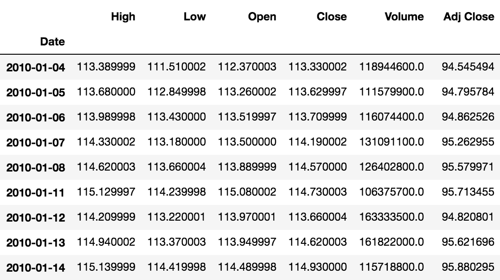

4.  我们现在可以绘制我们的数据。我们将只选择收盘价:

```py
spy_c = spy['Close'] 

fig, ax = plt.subplots(figsize=(15,10)) 
spy_c.plot(color='k') 
plt.title("SPY", fontsize=20); 
```

5.  这将生成以下输出:

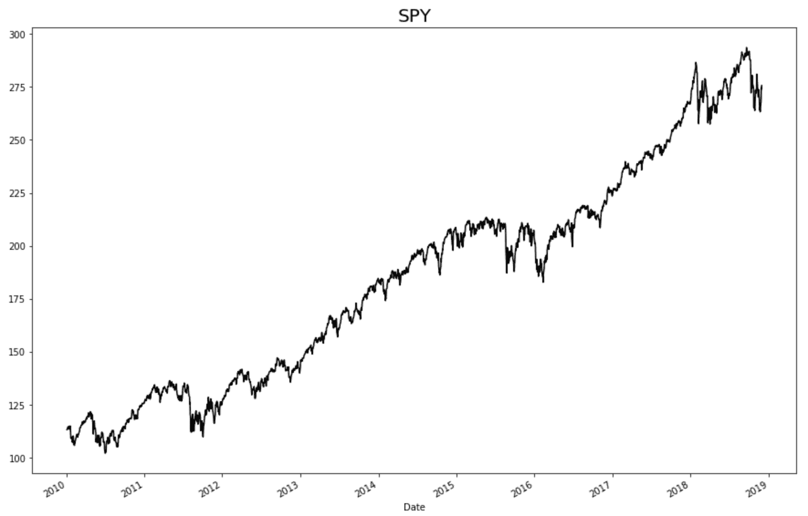

在上图中，我们看到了我们所选时期标准普尔 500 每日收盘价的价格图。

# 数据分析

让我们进行一些分析，看看如果我们投资这个 ETF，这段时间的回报会是多少:

1.  我们将首先提取`first_open`的数据:

```py
first_open = spy['Open'].iloc[0] 
first_open 
```

这将生成以下输出:


2.  接下来，让我们得到期末的收盘价:

```py
last_close = spy['Close'].iloc[-1] 
last_close 
```

这将生成以下输出:

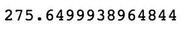

3.  最后，让我们看看整个时期的变化:

```py
last_close - first_open 
```

这将生成以下输出:


因此，在该期间开始时购买 100 股股票将花费我们大约 11，237 美元，在该期间结束时，同样的 100 股股票的价值将大约为 27，564 美元。这笔交易会让我们在此期间获得略高于 145%的收益。一点也不坏。

现在让我们来看看同期的回报率，仅仅是日内涨幅。这假设我们在每天开盘时买入股票，并在当天收盘时卖出:

```py
spy['Daily Change'] = pd.Series(spy['Close'] - spy['Open']) 
```

这将使我们每天从开放到关闭的变化。让我们来看看:

```py
spy['Daily Change'] 
```

这将生成以下输出:


现在让我们总结一下这段时间的变化:

```py
spy['Daily Change'].sum() 
```

这将生成以下输出:


所以，正如你所看到的，我们已经从超过 163 点的收益变成了刚刚超过 53 点的收益。哎哟！市场收益的一半以上来自这一时期的隔夜持有。

# 回报的波动性

隔夜收益好于日内收益，但波动性如何？回报总是在风险调整的基础上进行判断，所以让我们看看隔夜交易和盘中交易是如何根据它们的标准差进行比较的。

我们可以使用 NumPy 为我们计算如下:

```py
np.std(spy['Daily Change']) 
```

这将生成以下输出:


```py
spy['Overnight Change'] = pd.Series(spy['Open'] - spy['Close'].shift(1)) 

np.std(spy['Overnight Change']) 
```

这将生成以下输出:

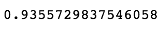

因此，与日内交易相比，我们的隔夜交易不仅收益更高，而且波动性也更低。但并非所有的波动都是平等的。让我们比较两种策略在下跌日和上涨日的平均变化:

```py
 spy[spy['Daily Change']<0]['Daily Change'].mean() 
```

此代码生成以下输出:

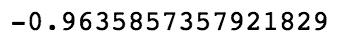

在有利的日子运行此代码:

```py
 spy[spy['Overnight Change']<0]['Overnight Change'].mean() 
```

我们得到如下输出:

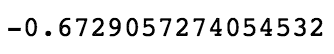

同样，我们看到，我们的隔夜交易策略的平均下行波动远小于我们的盘中交易策略。

# 每日收益

到目前为止，我们已经从积分的角度看了一切，但现在让我们看看每日回报。这将有助于把我们的得失放到一个更现实的背景中。让我们为每个场景创建一个熊猫系列:每日回报(接近收盘变化)、日内回报和隔夜回报:

```py
daily_rtn = ((spy['Close'] - spy['Close'].shift(1))/spy['Close'].shift(1))*100 

id_rtn = ((spy['Close'] - spy['Open'])/spy['Open'])*100 

on_rtn = ((spy['Open'] - spy['Close'].shift(1))/spy['Close'].shift(1))*100 
```

我们所做的是使用熊猫`.shift()`方法从前一天的系列中减去每个系列。例如，对于前面的第一个系列，我们将每天从前一天的收盘中减去收盘。这将导致少一个数据点。如果您打印出新系列，您可以看到如下内容:

```py
Daily_rtn 
```

这将生成以下输出:


# 战略统计

现在让我们来看看这三种策略的统计数据。我们将创建一个函数，它可以接收每个系列的返回，并将打印出汇总结果。我们将获得我们的每一次赢、输和盈亏平衡交易的统计数据，以及一种叫做**夏普比率**的东西。我之前说过，回报是在风险调整的基础上判断的；这正是夏普比率提供给我们的；这是一种通过计算回报的波动性来比较回报的方法。这里，我们使用夏普比率，并对比率进行年度调整:

```py
def get_stats(s, n=252): 
    s = s.dropna() 
    wins = len(s[s>0]) 
    losses = len(s[s<0]) 
    evens = len(s[s==0]) 
    mean_w = round(s[s>0].mean(), 3) 
    mean_l = round(s[s<0].mean(), 3) 
    win_r = round(wins/losses, 3) 
    mean_trd = round(s.mean(), 3) 
    sd = round(np.std(s), 3) 
    max_l = round(s.min(), 3) 
    max_w = round(s.max(), 3) 
    sharpe_r = round((s.mean()/np.std(s))*np.sqrt(n), 4) 
    cnt = len(s) 
    print('Trades:', cnt,\ 
          '\nWins:', wins,\ 
          '\nLosses:', losses,\ 
          '\nBreakeven:', evens,\ 
          '\nWin/Loss Ratio', win_r,\ 
          '\nMean Win:', mean_w,\ 
          '\nMean Loss:', mean_l,\ 
          '\nMean', mean_trd,\ 
          '\nStd Dev:', sd,\ 
          '\nMax Loss:', max_l,\ 
          '\nMax Win:', max_w,\ 
          '\nSharpe Ratio:', sharpe_r) 
```

现在让我们运行每个策略来查看统计数据。我们将从买入并持有策略(每日回报)开始，然后进入另外两个策略，如下所示:

```py
get_stats(daily_rtn) 
```

这将生成以下输出:


运行以下代码获取当天回报:

```py
get_stats(id_rtn) 
```

这将生成以下输出:


为隔夜退货运行以下代码:

```py
get_stats(on_rtn) 
```

这将生成以下输出:


如你所见，买入并持有策略的平均回报率最高，标准差也最高。它也有最大的每日提款(损失)。你还会注意到，即使隔夜策略的平均回报率高于日内策略，它的波动性也要小得多。这反过来又使其夏普比率高于日内策略。

在这一点上，我们有了比较未来战略的坚实基础。现在，我要告诉你一个策略，把这三个策略都从水里吹出来。

# 神秘策略

让我们看看这个新的神秘策略的统计数据:

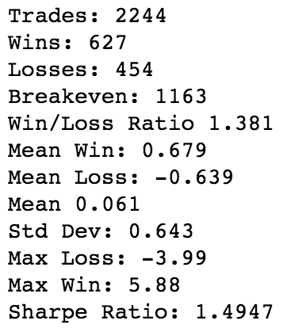

通过这一策略，我基本上将夏普比率提高了一倍，大幅降低了波动性，增加了最大收益，并将最大损失降低了一个显著水平。

我是如何设计出这种打败市场的策略的？(要说出令人吃惊或高兴的事情)听着...我通过生成 5000 个随机的过夜信号来做到这一点，并选择了最好的一个。

这显然不是打败市场的方法。那我为什么要这么做呢？为了证明这一点，如果你测试了足够多的策略，你会偶然发现一个看起来很神奇的数字。这就是所谓的**数据挖掘谬误**，是交易策略制定中真正的风险。这就是为什么找到一种基于现实世界投资者偏见和行为的策略如此重要。如果你想在交易中占据优势，你就不要交易市场；你们这些交易市场的交易者*。*

一个优势来自深思熟虑地理解人们对某些情况的错误反应。

现在让我们扩展我们的分析。首先，我们将从 2000 年开始提取指数数据:

```py
start_date = pd.to_datetime('2000-01-01') 
stop_date = pd.to_datetime('2018-12-01') 

sp = pdr.data.get_data_yahoo('SPY', start_date, stop_date) 
```

现在让我们看看我们的图表:

```py
fig, ax = plt.subplots(figsize=(15,10)) 
sp['Close'].plot(color='k') 
plt.title("SPY", fontsize=20) 
```

这将生成以下输出:

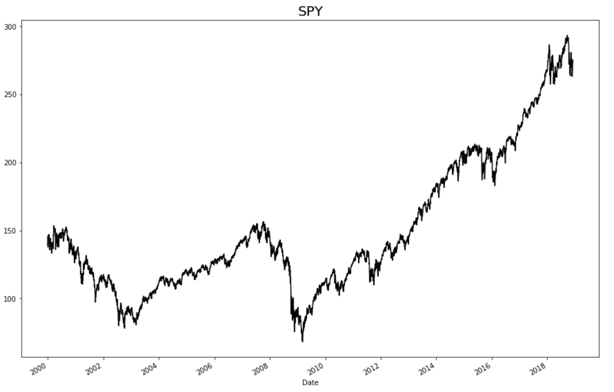

这里我们看到`SPY`从 2000 年初到 2018 年 12 月 1 日的价格走势。在此期间，市场无疑出现了许多波动，因为市场经历了高度积极和高度消极的局面。

让我们为我们的三个基本战略的新的扩展时期得到我们的基线。

首先，让我们为每个变量设置变量:

```py
long_day_rtn = ((sp['Close'] - sp['Close'].shift(1))/sp['Close'].shift(1))*100 

long_id_rtn = ((sp['Close'] - sp['Open'])/sp['Open'])*100 

long_on_rtn = ((sp['Open'] - sp['Close'].shift(1))/sp['Close'].shift(1))*100 
```

现在，让我们看看每一项的总分是多少:

```py
(sp['Close'] - sp['Close'].shift(1)).sum() 
```

这将生成以下输出:


现在，让我们来看看开盘价和收盘价的总和:

```py
(sp['Close'] - sp['Open']).sum() 
```

这将生成以下输出:


现在，让我们看看接近开仓的总点数是多少:

```py
(sp['Open'] - sp['Close'].shift(1)).sum() 
```

这将生成以下输出:

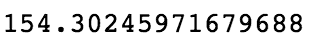

现在让我们看看每一个的统计数据:

```py
get_stats(long_day_rtn) 
```

这将生成以下输出:


现在，让我们看看日内回报率的统计数据:

```py
get_stats(long_id_rtn) 
```

这将生成以下输出:


现在，让我们看看隔夜回报的统计数据:

```py
get_stats(long_on_rtn) 
```

这将生成以下输出:

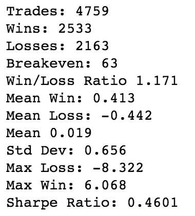

我们可以看到，在更长的时间内，这三者之间的差异甚至更加明显。如果你在过去 18 年里只在白天持有，你就会在这个 S&P 交易所交易基金中亏损。如果你只持有一夜，你的总积分回报会提高 18%以上！显然，这假定没有交易成本，没有税收以及完美的填充，但无论如何，这是一个了不起的发现。

# 建立回归模型

现在我们有了一个可以比较的基线，让我们构建第一个回归模型。我们将从一个非常基本的模型开始，仅使用股票的前一个收盘价来预测第二天的收盘价，我们将使用支持向量回归来构建它。这样，让我们建立我们的模型:

1.  第一步是建立一个包含每天价格历史的数据框架。我们将在模型中包含过去 20 次收盘:

```py
for i in range(1, 21, 1): 
    sp.loc[:,'Close Minus ' + str(i)] = sp['Close'].shift(i) 

sp20 = sp[[x for x in sp.columns if 'Close Minus' in x or x == 'Close']].iloc[20:,] 

sp20 
```

2.  这段代码给了我们每天的收盘价，以及之前的 20，都在同一条线上。我们代码的结果可以在下面的输出中看到:

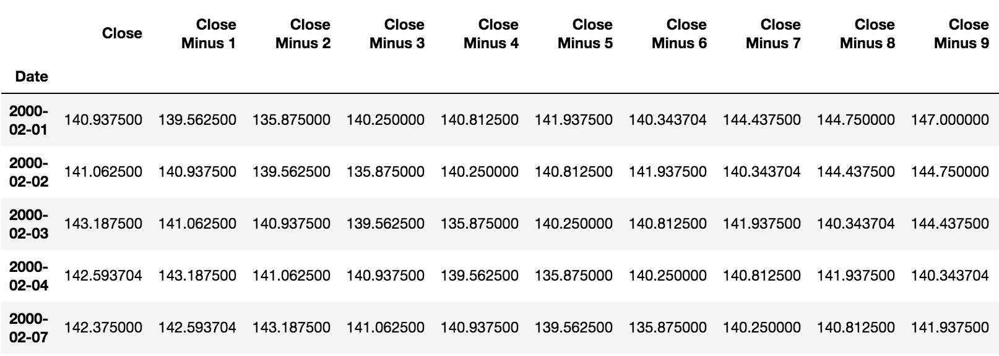

3.  这将形成我们将为模型提供的 *X* 数组的基础。但是在我们准备好之前，还有一些额外的步骤。
4.  首先，我们将反转我们的列，以便时间从左向右运行:

```py
sp20 = sp20.iloc[:,::-1] 

sp20 
```

这将生成以下输出:

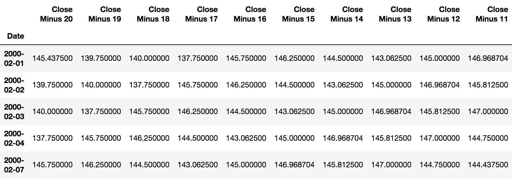

5.  现在，让我们导入我们的支持向量机，并设置我们的训练和测试矩阵和向量:

```py
from sklearn.svm import SVR 
clf = SVR(kernel='linear') 

X_train = sp20[:-2000] 
y_train = sp20['Close'].shift(-1)[:-2000] 

X_test = sp20[-2000:] 
y_test = sp20['Close'].shift(-1)[-2000:] 
```

6.  我们只有 5000 个数据点可以使用，所以我选择使用最后 2000 个数据点进行测试。现在，让我们调整我们的模型，并使用它来检查样本外数据:

```py
model = clf.fit(X_train, y_train) 

preds = model.predict(X_test) 
```

7.  现在我们有了预测，让我们将它们与实际数据进行比较:

```py
tf = pd.DataFrame(list(zip(y_test, preds)), columns=['Next Day Close', 'Predicted Next Close'], index=y_test.index) 

tf 
```

上述代码生成以下输出:

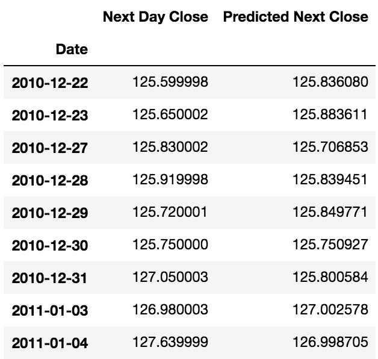

# 模型的性能

现在让我们看看我们模型的性能。如果预期收盘价高于开盘价，我们将买入第二天的开盘价。然后我们将在当天收盘时卖出。我们需要在数据框中添加一些额外的数据点来计算结果，如下所示:

```py
cdc = sp[['Close']].iloc[-1000:] 
ndo = sp[['Open']].iloc[-1000:].shift(-1) 

tf1 = pd.merge(tf, cdc, left_index=True, right_index=True) 
tf2 = pd.merge(tf1, ndo, left_index=True, right_index=True) 
tf2.columns = ['Next Day Close', 'Predicted Next Close', 'Current Day Close', 'Next Day Open'] 

tf2 
```

这将生成以下输出:

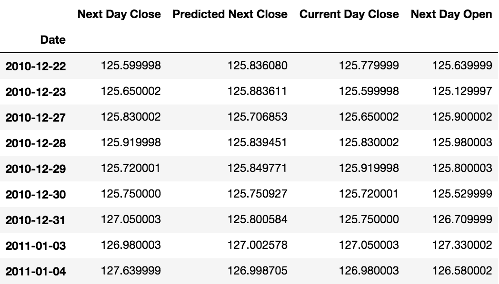

在这里，我们将添加以下代码来获取我们的信号以及信号的损益:

```py
def get_signal(r): 
    if r['Predicted Next Close'] > r['Next Day Open']: 
        return 1 
    else: 
        return 0 

def get_ret(r): 
    if r['Signal'] == 1: 
        return ((r['Next Day Close'] - r['Next Day Open'])/r['Next Day Open']) * 100 
    else: 
        return 0 

tf2 = tf2.assign(Signal = tf2.apply(get_signal, axis=1)) 
tf2 = tf2.assign(PnL = tf2.apply(get_ret, axis=1)) 

tf2 
```

这将生成以下输出:


现在让我们看看，仅使用价格历史记录，我们是否能够成功预测第二天的价格。我们将从计算所得积分开始:

```py
(tf2[tf2['Signal']==1]['Next Day Close'] - tf2[tf2['Signal']==1]['Next Day Open']).sum() 
```

这将生成以下输出:

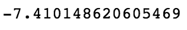

哎哟！这看起来很糟糕。但是我们测试的时间段呢？我们从来没有单独评估过。在过去的 2000 天里，我们的基本日内策略会产生多少积分:

```py
(sp['Close'].iloc[-2000:] - sp['Open'].iloc[-2000:]).sum() 
```

这将生成以下输出:


所以看起来我们的策略很糟糕。让我们比较两者。

一、本期基本盘中策略:

```py
get_stats((sp['Close'].iloc[-2000:] - sp['Open'].iloc[-2000:])/sp['Open'].iloc[-2000:] * 100) 
```

这将生成以下输出:

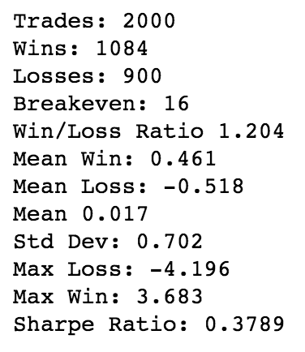

现在我们模型的结果是:

```py
get_stats(tf2['PnL']) 
```

这将生成以下输出:

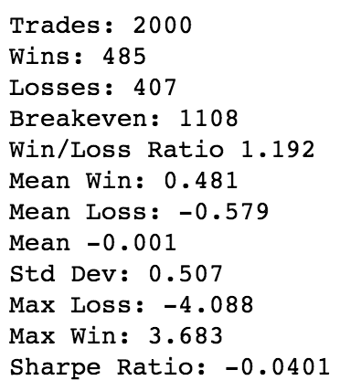

很明显，我们的战略不是我们想要实施的。我们如何改进我们这里的东西？如果我们修改交易策略呢？如果我们只接受那些比开盘价高一个点或更多的交易，而不仅仅是比开盘价高一个点或更多。有帮助吗？让我们试试。我们将使用修改后的信号重新运行我们的策略，如以下代码块所示:

```py
def get_signal(r): 
    if r['Predicted Next Close'] > r['Next Day Open'] + 1: 
        return 1 
    else: 
        return 0 

def get_ret(r): 
    if r['Signal'] == 1: 
        return ((r['Next Day Close'] - r['Next Day Open'])/r['Next Day Open']) * 100 
    else: 
        return 0 

tf2 = tf2.assign(Signal = tf2.apply(get_signal, axis=1)) 
tf2 = tf2.assign(PnL = tf2.apply(get_ret, axis=1)) 

(tf2[tf2['Signal']==1]['Next Day Close'] - tf2[tf2['Signal']==1]['Next Day Open']).sum() 
```

这将生成以下输出:


现在是统计数据:

```py
get_stats(tf2['PnL']) 
```

这将生成以下输出:

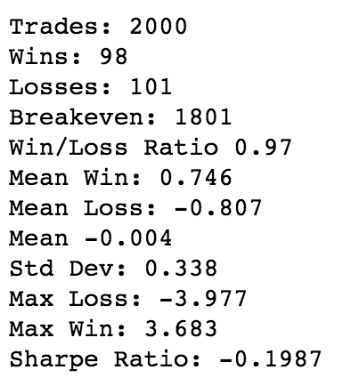

我们每况愈下。看来，如果过去的价格历史表明好事即将到来，你可以期待正好相反。我们的模型似乎开发了一个反向指标。如果我们探索一下呢？让我们看看，如果我们翻转我们的模型，当我们预测强劲的收益时，我们不会交易，但除此之外，我们会交易:

```py
def get_signal(r): 
    if r['Predicted Next Close'] > r['Next Day Open'] + 1: 
        return 0 
    else: 
        return 1 

def get_ret(r): 
    if r['Signal'] == 1: 
        return ((r['Next Day Close'] - r['Next Day Open'])/r['Next Day Open']) * 100 
    else: 
        return 0 

tf2 = tf2.assign(Signal = tf2.apply(get_signal, axis=1)) 
tf2 = tf2.assign(PnL = tf2.apply(get_ret, axis=1)) 

(tf2[tf2['Signal']==1]['Next Day Close'] - tf2[tf2['Signal']==1]['Next Day Open']).sum() 
```

这将生成以下输出:


让我们得到我们的统计数据:

```py
get_stats(tf2['PnL']) 
```

这将生成以下输出:


看起来我们确实有一个反向指标。当我们的模型预测第二天会有强劲的上涨时，市场表现明显不佳，至少在我们的测试期间是这样。这在大多数情况下都成立吗？不太可能。市场倾向于从均值回归机制转向趋势持续机制。

在这一点上，我们可以对这个模型进行一些扩展。我们甚至还没有触及在我们的模型中使用技术指标或基本数据，我们已经将交易限制在一天内。所有这些都可以调整和扩展，但有一个重要的点我们没有解决，必须提到。

我们正在处理的数据是一种特殊类型的数据，称为**时间序列数据**。时间序列数据需要特殊处理才能正确建模，因为它通常违反统计建模所需的假设，例如恒定的均值和方差。

不恰当地处理时间序列数据的一个后果是错误的度量给出了非常不准确的度量。由于显著的自相关性，换句话说，下一个时期的数据与当前时期的数据高度相关，似乎我们已经实现了比实际更好的预测。

为了解决这些问题，时间序列数据经常被**差分**(在股票数据的情况下，这意味着我们看的是日变化，而不是指数的绝对水平)以使其成为我们所说的**平稳**；也就是说，它具有恒定的均值和方差，并且缺乏显著的自相关性。

如果你打算继续研究时间序列数据，我恳求你更详细地研究这些概念。

# 动态时间扭曲

然而，接下来我想介绍另一个模型，它使用了完全不同的算法。这个算法叫做**动态时间扭曲**。它的作用是给你一个度量，代表两个时间序列之间的相似性:

1.  首先，我们需要`pip install``fastdtw`库:

```py
!pip install fastdtw 
```

2.  安装后，我们将导入所需的其他库:

```py
from scipy.spatial.distance import euclidean 
from fastdtw import fastdtw 
```

3.  接下来，我们将创建两个系列的函数，并返回它们之间的距离:

```py
def dtw_dist(x, y): 
    distance, path = fastdtw(x, y, dist=euclidean) 
    return distance 
```

4.  现在，我们将把 18 年的时间序列数据分成不同的 5 天周期。我们将把每个周期与一个额外的点配对。这将用于创建我们的 *x* 和 *y* 数据，如下所示:

```py
tseries = [] 
tlen = 5 
for i in range(tlen, len(sp), tlen): 
    pctc = sp['Close'].iloc[i-tlen:i].pct_change()[1:].values * 100 
    res = sp['Close'].iloc[i-tlen:i+1].pct_change()[-1] * 100 
    tseries.append((pctc, res)) 
```

5.  我们可以看一下我们的第一个系列，了解一下数据是什么样的:

```py
tseries[0] 
```

这将生成以下输出:


6.  现在我们有了每个系列，我们可以通过我们的算法运行它们，以获得每个系列相对于其他系列的距离度量:

```py
dist_pairs = [] 
for i in range(len(tseries)): 
    for j in range(len(tseries)): 
        dist = dtw_dist(tseries[i][0], tseries[j][0]) 
        dist_pairs.append((i,j,dist,tseries[i][1], tseries[j][1])) 
```

一旦我们有了它，我们就可以把它放入`DataFrame`中。我们将删除具有`0`距离的系列，因为它们代表相同的系列。我们还将根据系列的日期进行排序，只查看第一个系列在第二个系列之前的那些，按时间顺序来说:

```py
dist_frame = pd.DataFrame(dist_pairs, columns=['A','B','Dist', 'A Ret', 'B Ret']) 

sf = dist_frame[dist_frame['Dist']>0].sort_values(['A','B']).reset_index(drop=1) 

sfe = sf[sf['A']<sf['B']] 
```

最后，我们将限制距离小于`1`且第一个系列有正回报的交易:

```py
winf = sfe[(sfe['Dist']<=1)&(sfe['A Ret']>0)] 

winf 
```

这将生成以下输出:


让我们看看我们的一个顶级模式(A:6 和 B:598)在绘制时是什么样子的:

```py
plt.plot(np.arange(4), tseries[6][0]); 
```

上述代码生成以下输出:

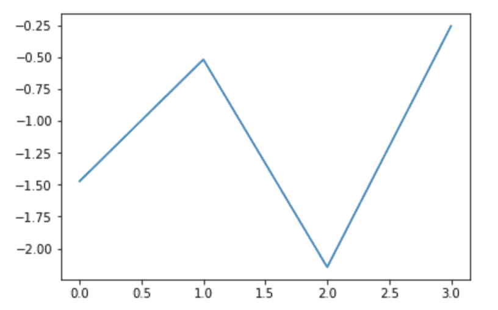

现在，我们将绘制第二个:

```py
plt.plot(np.arange(4), tseries[598][0]) 
```

上述代码生成以下输出:

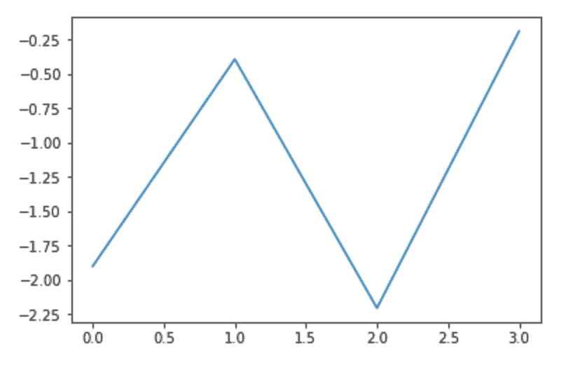

如你所见，曲线几乎完全相同，这正是我们想要的。我们将试图找到所有第二天有正收益的曲线，然后，一旦我们有一条与这些盈利曲线高度相似的曲线，我们将购买它，期待另一个收益。

# 评估我们的交易

现在让我们构造一个函数来评估我们的交易。我们将购买类似的曲线，除非它们不能返回正的结果。如果发生这种情况，我们将消除它们，如下所示:

```py
excluded = {} 
return_list = [] 
def get_returns(r): 
    if excluded.get(r['A']) is None: 
        return_list.append(r['B Ret']) 
        if r['B Ret'] < 0: 
            excluded.update({r['A']:1}) 

winf.apply(get_returns, axis=1); 
```

现在我们已经将交易的所有回报存储在`return_list`中，让我们评估结果:

```py
get_stats(pd.Series(return_list)) 
```

这将生成以下输出:

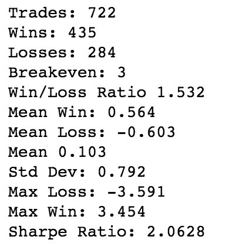

这些结果是迄今为止我们看到的最好的。胜败比和平均值远高于我们的其他模型。看来我们可能对这种新模式有所了解，尤其是与我们已经看到的其他模式相比。

此时，为了进一步检查我们的模型，我们应该通过检查匹配的其他时间段来探索它的健壮性。超过四天是否会改善模型？我们应该总是排除产生损失的模式吗？在这一点上有大量的问题需要探索，但是我将把这个留给读者作为练习。

# 摘要

在这一章中，我们研究了股票市场的内部运作，并探索了在交易策略中利用机器学习的多种方法。毫无疑问，这一章的材料可以填满一本书。我们甚至没有涵盖交易的一些最重要的方面，比如投资组合构建、风险缓解和资金管理。这些是任何战略的关键组成部分，甚至可能比贸易信号更重要。

希望这将成为你自己探索的起点，但我再次提醒你，*击败市场*是一个几乎不可能的游戏——在这个游戏中，你与世界上最聪明的人竞争。如果你决定尝试，我祝你好运。只要记住，我警告过你，如果结果不像你希望的那样！