# 八、使用卷积神经网络分类图像

在这一章中，我们将探索广阔而令人敬畏的计算机视觉世界。

如果你曾经想用图像数据构建一个预测性的机器学习模型，这一章将作为一个容易消化和实用的资源。我们将逐步构建一个图像分类模型，交叉验证它，然后以更好的方式构建它。在本章的最后，我们将有一个*该死的好*模型，并讨论一些未来增强的路径。

当然，预测性建模基础中的一些背景知识将有助于顺利进行。正如您将很快看到的，将图像转换为我们模型的可用特征的过程可能会感觉很新，但是一旦提取了我们的特征，模型构建和交叉验证过程就完全相同了。

在本章中，我们将构建一个卷积神经网络来对来自 Zalando Research 数据集的服装物品图像进行分类——该数据集包含 70，000 幅图像，每幅图像描绘了 10 种可能的服装物品中的 1 种，如 t 恤/上衣、裤子、毛衣、连衣裙、外套、凉鞋、衬衫、运动鞋、包或踝靴。但是首先，我们将一起探索一些基础知识，从图像特征提取开始，逐步了解卷积神经网络是如何工作的。

那么，让我们开始吧。说真的！。

这就是我们将在本章中介绍的内容:

*   图像特征提取
*   卷积神经网络；
    *   网络拓扑结构
    *   卷积层和滤波器
    *   最大池层数
    *   变平
    *   全连接层和输出
*   使用 Keras 构建卷积神经网络，对 Zalando 研究数据集中的图像进行分类

# 图像特征提取

当处理非结构化数据时，无论是文本还是图像，我们都必须首先将数据转换为机器学习模型可用的数字表示。将非数值数据转换为数值表示的过程称为**特征提取**。对于图像数据，我们的特征是图像的像素值。

首先，让我们想象一个 1，150 x 1，150 像素的灰度图像。1，150 x 1，150 像素的图像将返回 1，150 x 1，150 像素强度矩阵。对于灰度图像，像素值的范围可以从 0 到 255，0 是完全黑色的像素，255 是完全白色的像素，中间是灰色阴影。

为了演示代码中的样子，让我们从灰度猫卷饼中提取特征。图片可在 GitHub 上获得，网址为[。](https://github.com/PacktPublishing/Python-Machine-Learning-Blueprints-Second-Edition/tree/master/Chapter08)

I've made the image assets used throughout this chapter available to you at [https://github.com/mroman09/packt-image-assets](https://github.com/mroman09/packt-image-assets). You can find our cat burritos there!

现在让我们看看下面代码中的一个示例:

```py
import matplotlib.image as mpimg
import matplotlib.pyplot as plt
import pandas as pd
%matplotlib inline

cat_burrito = mpimg.imread('img/grayscale_cat_burrito.jpg')
cat_burrito
```

If you're unable to read a `.jpg` by running the preceding code, just install `PIL` by running `pip install pillow`. 

在前面的代码中，我们从`matplotlib`导入了`pandas`和两个子模块:`image`和`pyplot`。我们使用`matplotlib.image`中的`imread`方法读入图像。

运行前面的代码会得到以下输出:

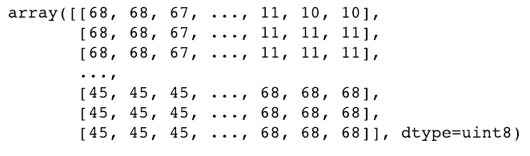

输出是包含我们模型特征的二维数组。与大多数应用机器学习应用一样，您需要对这些提取的特征执行几个预处理步骤，其中一些我们将在本章稍后在 Zalando 时尚数据集上一起探讨，但这些是图像的原始提取特征！

为我们的灰度图像提取的特征的形状是`image_height`行 x `image_width`列。我们可以通过运行以下命令轻松检查形状:

```py
cat_burrito.shape
```

前面的代码返回以下输出:

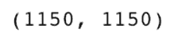

我们也可以轻松检查阵列中的最大和最小像素值:

```py
print(cat_burrito.max())
print(cat_burrito.min())
```

这将返回以下内容:

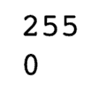

最后，我们可以通过运行以下代码来显示我们阵列中的灰度图像:

```py
plt.axis('off')
plt.imshow(cat_burrito, cmap='gray');
```

前面的代码返回了我们的图像，可在[https://github . com/PacktPublishing/Python-机器学习-蓝图-第二版/树/主/第 08 章](https://github.com/PacktPublishing/Python-Machine-Learning-Blueprints-Second-Edition/tree/master/Chapter08)中找到作为`output_grayscale_cat_burrito.png`。

彩色图像的特征提取过程是相同的；然而，对于彩色图像，我们的阵列输出的形状将是三维的——一个**张量**——代表我们图像的**红色、绿色和蓝色** ( **RGB** )像素值。在这里，我们将执行与之前相同的过程，这次是在彩色版的猫卷饼上。图片可在 GitHub 上[https://GitHub . com/PacktPublishing/Python-机器学习-蓝图-第二版/树/主/章节 08](https://github.com/PacktPublishing/Python-Machine-Learning-Blueprints-Second-Edition/tree/master/Chapter08) 作为`color_cat_burrito.jpg`获得。

让我们使用以下代码从彩色版的猫卷饼中提取特征:

```py
color_cat_burrito = mpimg.imread('img/color_cat_burrito.jpg')
color_cat_burrito.shape
```

运行此代码将返回以下输出:

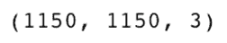

同样，在这里我们看到这个图像包含三个通道。我们的`color_cat_burrito`变量是一个张量，包含三个矩阵，告诉我们图像中每个像素的 RGB 值是多少。

我们可以通过运行以下命令来显示阵列中的彩色图像:

```py
plt.axis('off')
plt.imshow(color_cat_burrito);
```

这将返回我们的彩色图像。图片可在 GitHub 上获得，网址为[。](https://github.com/PacktPublishing/Python-Machine-Learning-Blueprints-Second-Edition/tree/master/Chapter08)

这是我们图像特征提取的第一步。我们一次只拍摄一张图像，只需几行代码就可以将这些图像转换成数值。在这样做的时候，我们看到从灰度图像中提取特征产生了二维数组，从彩色图像中提取特征产生了像素强度值的张量。
不过，有一个小问题。请记住，这只是我们数据的单个图像、单个训练样本和单个*行*。在我们的灰度图像的例子中，如果我们将这个矩阵展平成一行，我们将有`image_height` x `image_width`列，或者在我们的例子中，1，322，500 列。我们可以通过运行下面的代码片段来确认这一点:

```py
# flattening our grayscale cat_burrito and checking the length
len(cat_burrito.flatten())
```

这是一个问题！与其他机器学习建模任务一样，高维度会导致模型性能问题。在这个维度的数量级上，我们构建的任何模型都可能会过度拟合，并且训练时间会很慢。

这种维度问题是这类计算机视觉任务的通病。即使是分辨率较低的数据集，即 400 x 400 像素灰度的猫卷饼，每张图像也会有 160，000 个特征。

然而，这个问题有一个已知的解决方案:卷积神经网络。在下一节中，我们将继续使用卷积神经网络来构建这些原始图像像素的低维表示的特征提取过程。我们将讨论它们的工作原理，并继续构建它们在图像分类任务中如此出色的原因。

# 卷积神经网络

卷积神经网络是一类神经网络，它解决了我们在前面部分中提到的高维问题，因此在图像分类任务中表现出色。事实证明，给定图像区域中的图像像素高度相关——它们告诉我们关于该特定图像区域的类似信息。因此，使用卷积神经网络，我们可以扫描图像的区域，并在低维空间中总结该区域。正如我们将看到的，这些被称为**特征图**的低维表示告诉我们许多关于各种形状存在的有趣的事情——从最简单的线条、阴影、循环和漩涡，到非常抽象、复杂的特定于我们的数据的形式，在我们的例子中是猫耳朵、猫脸或玉米饼——并且以比原始图像更少的维度来做这件事。

在使用卷积神经网络从我们的图像中提取这些低维特征之后，我们将把卷积神经网络的输出传递到适合于我们想要执行的分类或回归任务的网络中。在我们的例子中，当对 Zalando 研究数据集建模时，我们的卷积神经网络的输出将被传递到一个完全连接的神经网络中，用于多类分类。

但是这是如何工作的呢？关于灰度图像上的卷积神经网络，我们将讨论几个关键组件，这些对于建立我们的理解都很重要。

# 网络拓扑结构

您可能已经遇到了类似于上述的图表，该图表描述了卷积神经网络到前馈神经网络的体系结构。我们很快就会建造这样的东西！但是这里描绘的是什么呢？看看吧:


在上图中，在最左边，我们有我们的输入。这些是我们图像的提取特征，从 0 到 255 范围内的值的矩阵(如灰度猫卷饼的情况)描述了图像中存在的像素强度。

接下来，我们通过交替的卷积层和最大池层传递数据。这些层定义了所描述的体系结构的卷积神经网络组件。我们将在接下来的两个部分中描述这些层类型的作用。

之后，我们将数据传递到一个完全连接的层，然后到达输出层。这两层描述了一个完全连接的神经网络。在这里，您可以自由使用任何您喜欢的多类分类算法，而不是完全连接的神经网络——也许是**逻辑回归**或**随机森林分类器**——但是对于我们的数据集，我们将使用完全连接的神经网络。

所描绘的输出层与任何其他多类分类器相同。以我们的猫卷饼为例，假设我们正在构建一个模型来预测图像来自五个不同的类别:鸡猫卷饼、牛排猫卷饼、猫卷饼、素食猫卷饼或鱼猫卷饼(我将让您利用您的想象力来想象我们的训练数据可能是什么样子)。输出层是图像属于五个类别之一的预测概率，其中`max(probability)`表示我们的模型认为最有可能的类别。

在高层次上，我们已经浏览了前面网络的架构或**拓扑**。我们已经讨论了我们的输入与前面拓扑的卷积神经网络组件和全连接神经网络组件的对比。现在让我们稍微深入一点，添加一些概念，让我们能够更详细地描述拓扑:

*   网络有多少个卷积层？两个。
*   而在每个卷积层中，有多少个特征映射？卷积层 1 有 7 个，卷积层 2 有 12 个。
*   网络有多少个池层？两个。
*   有多少个完全连接的层？一个。
*   全连接层有多少**神经元**？10.
*   产出是什么？五个。

建模者决定使用两个卷积层来对抗任何其他数字，或者仅使用一个完全连接的层来对抗任何其他数字，这应该被认为是模型的**超参数**。也就是说，这是我们作为建模者应该尝试和交叉验证的东西，但不是我们的模型正在明确学习和优化的参数。

通过查看网络拓扑，您可以推断出您正在解决的问题的其他有用信息。正如我们所讨论的，我们网络的输出层包含五个节点的事实让我们知道，这个神经网络被设计来解决一个有五个类的多类分类任务。如果这是一个回归或二进制分类问题，我们的网络架构将(在大多数情况下)只有一个输出节点。我们还知道，建模器在第一个卷积层中使用了 7 个滤波器，在第二个卷积层中使用了 12 个内核，这是因为每一层产生的特征图的数量(我们将在下一节中更详细地讨论这些内核是什么)。

太好了。我们学习了一些有用的行话，这些行话将帮助我们描述我们的网络，并建立我们对它们如何工作的概念理解。现在让我们来探索一下我们架构的卷积层。

# 卷积层和滤波器

卷积层和滤波器是卷积神经网络的核心。在这些层中，我们将一个过滤器(在本文中也称为**窗口**或**内核**)滑过我们的标准特征，并在每一步获取内积。以这种方式对我们的数组和内核进行卷积会得到一个低维的图像表示。让我们来探索一下这在这个灰度图像上是如何工作的(可在图像资产存储库中找到):


前面的图像是一个 5 x 5 像素的灰度图像，在白色背景下显示了一条黑色对角线。

从下图中提取特征，我们得到以下像素强度矩阵:


接下来，让我们假设我们(或 Keras)实例化了以下内核:


我们现在将可视化卷积过程。窗口的移动是从图像矩阵的左上开始的。我们将窗口向右滑动一个预定的步幅。在这种情况下，我们的步幅大小将是 1，但一般来说，步幅大小应该被视为您的模型的另一个超参数。一旦窗口到达图像的最右边，我们将窗口向下滑动 1(我们的步幅大小)，将窗口移回图像的最左边，并再次开始获取内积的过程。

现在让我们一步一步来:

1.  将内核滑过矩阵的左上角，计算内积:


我将明确规划第一步的内部产品，以便您可以轻松地完成:

`(0x0)+(255x0)+(255x0)+(255x0)+(0x1)+(255x0)+(255x0)+(255x0)+(0x0) = 0`

我们将结果写入我们的要素地图并继续！

2.  获取内部产品，并将结果写入我们的功能图:


3.  第三步:


4.  我们已经到达图像的最右边。将窗口向下滑动 1，即我们的步幅大小，并在图像的最左边重新开始该过程:

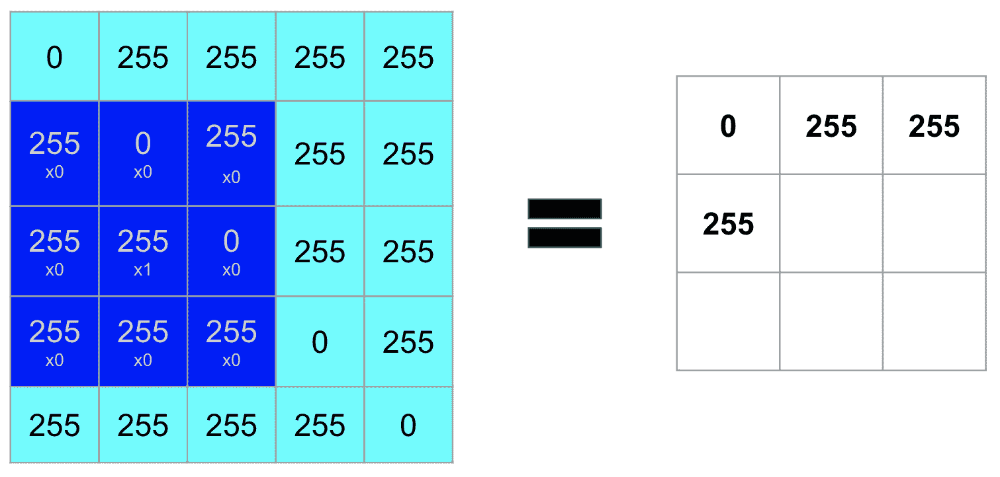

5.  第五步:


6.  第六步:

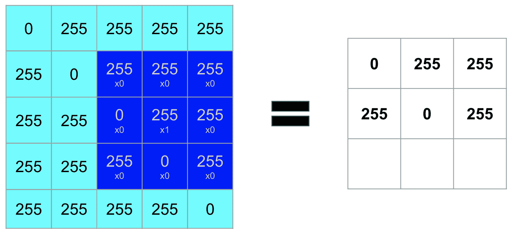

7.  第七步:

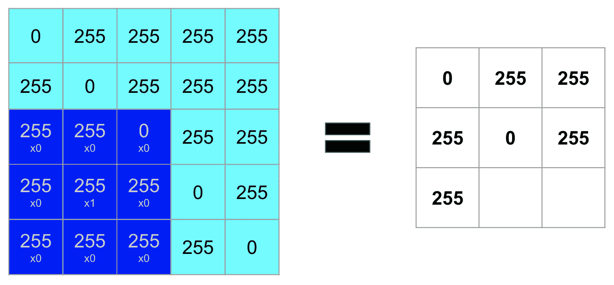

8.  第八步:

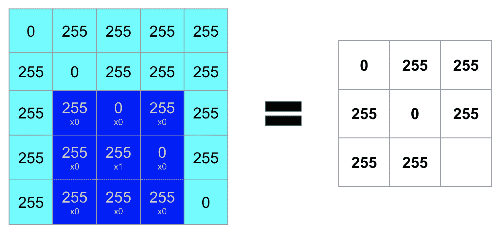

9.  第九步:


瞧啊。我们现在已经在一个 3×3 矩阵(我们的特征图)中表示了我们最初的 5×5 图像。在这个玩具示例中，我们已经能够将维度从 25 个特征减少到只有 9 个。让我们看一下这个操作产生的图像:


如果你认为这看起来和我们原来的黑色对角线一模一样，但是更小，你是对的。内核取的值决定了什么被识别，在这个具体的例子中，我们使用了所谓的**身份内核**。取其他值的内核将返回图像的其他属性——检测线条、边缘、轮廓、高对比度区域等的存在。

我们将在每个卷积层同时对图像应用多个核。使用的内核数量取决于建模者——另一个超参数。理想情况下，您希望使用尽可能少的，同时仍然获得可接受的交叉验证结果。越简单越好！但是，根据任务的复杂程度，我们可能会通过使用更多来获得性能提升。当调整模型的其他超参数时，例如网络中的层数或每层神经元的数量，可以应用相同的思想。我们用简单换取复杂，用概括和速度换取细节和精确。

虽然内核的数量是我们的选择，但每个内核取的值是我们模型的参数，它是从我们的训练数据中学习的，并在训练过程中以降低成本函数的方式进行优化。

我们已经看到了如何将过滤器与图像特征进行卷积以创建单个特征图的逐步过程。但是当我们同时应用多个内核时会发生什么呢？这些要素地图如何穿过网络的每一层？让我们看看下面的截图:


Image source: Lee et al., Convolutional Deep Belief Networks for Scalable Unsupervised Learning of Hierarchical Representations, via stack exchange. Source text here: https://ai.stanford.edu/~ang/papers/icml09-ConvolutionalDeepBeliefNetworks.pdf

前面的截图可视化了在人脸图像上训练的网络的每个卷积层生成的特征图。在网络的早期层(最底层)，我们检测到简单视觉结构的存在——简单的线条和边缘。我们用我们的身份内核做到了这一点！第一层的输出传递到下一层(中间一行)，它将这些简单的形状组合成抽象的形式。我们在这里看到，边缘的组合构成了一张脸的组成部分——眼睛、鼻子、耳朵、嘴巴和眉毛。这个中间层的输出依次传递到最后一层，最后一层将边缘组合成完整的对象——在这种情况下，是不同人的脸。

整个过程的一个特别强大的特性是，所有这些特征和表示都是从数据中学习的。我们没有明确告诉我们的模型:*模型，对于这个任务，我想在第一个卷积层中使用一个身份核和一个底部 sobel 核，因为我认为这两个核将提取信号最丰富的特征图*。一旦我们为我们想要使用的核的数量设置了超参数，模型就通过优化来学习什么线、边、阴影以及它们的复杂组合最适合于确定一张脸是什么或者不是什么。该模型执行这种优化，没有关于什么是脸、猫卷饼或衣服的特定领域的硬编码规则。

卷积神经网络还有许多其他迷人的特性，这一章我们不会涉及。然而，我们确实探索了基本原理，希望你能意识到使用卷积神经网络提取高表达、信号丰富、低维特征的重要性。

接下来，我们将讨论*最大池层*。

# 最大池层数

我们已经讨论了减少维度空间的重要性，以及如何使用卷积层来实现这一点。出于同样的原因，我们使用最大池层来进一步降低维度。非常直观地说，顾名思义，使用最大池，我们在要素地图上滑动一个窗口，并获取该窗口的最大值。让我们从对角线示例返回到要素地图来说明，如下所示:

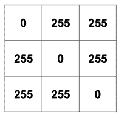

让我们看看当我们使用 2 x 2 窗口最大化前面的要素地图时会发生什么。同样，我们在这里所做的就是返回`max(values in window)`:

1.  返回`max(0,255,255,0)`，得到 us 255:


2.  第二步:


3.  第三步:


4.  第四步:

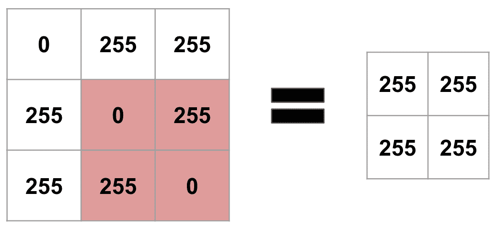

通过将我们的要素地图与一个 2 x 2 窗口最大化，我们去掉了一列和一行，使我们从一个 3 x 3 的表示变成了一个 2 x 2 的表示——还不错！

还有其他形式的统筹——例如平均统筹和最低统筹；但是，您会看到最常使用的 max pooling。

接下来，我们将讨论展平，这是我们将执行的一个步骤，用于将最大集合要素图转换为适合建模的形状。

# 变平

到目前为止，我们专注于构建尽可能精简和表达的特征表示，并使用卷积神经网络和最大池层来做到这一点。我们转换的最后一步是将卷积和最大集合的数组(在我们的例子中是一个 2×2 的矩阵)展平成一行训练数据。

我们的最大池对角线黑线示例在代码中看起来如下所示:

```py
import numpy as np
max_pooled = np.array([[255,255],[255,255]])
max_pooled
```

运行此代码将返回以下输出:


我们可以通过运行以下命令来检查形状:

```py
max_pooled.shape
```

这将返回以下输出:

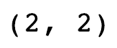

要把这个矩阵变成一个单一的训练样本，我们只需运行`flatten()`。让我们这样做，看看我们的扁平矩阵的形状:

```py
flattened = max_pooled.flatten()
flattened.shape
```

这将生成以下输出:


最初是像素强度的 5×5 矩阵，现在是具有四个特征的单行。我们现在可以把这个传递到一个完全连接的神经网络中。

# 全连接层和输出

完全连接的图层是我们将输入映射到目标类的地方，这些输入是我们卷积、最大池化和展平原始提取要素后得到的行。这里，每个输入连接到下一层的每个**神经元**或**节点**。这些连接的强度或**权重**和网络每个节点中存在的**偏差**项是模型的参数，在整个训练过程中进行优化以最小化目标函数。

我们模型的最后一层将是我们的输出层，它给出我们的模型预测。我们的输出层中的神经元数量和我们应用于它的**激活函数**由我们试图解决的问题类型决定:回归、二元分类或多类分类。在下一节中，当我们开始使用 Zalando Research 时尚数据集时，我们将看到如何为多类分类任务设置完全连接的层和输出层。

The fully-connected layers and output—that is, the feedforward neural network component of our architecture—belong to a distinct neural network type from the convolutional neural networks we discussed in this section. We briefly described how feedforward networks work in this section only to provide color on how the classifier component of our architecture works. You can always substitute this portion of the architecture for a classifier you are more familiar with, such as a **logit**!

有了这些基础知识，您现在就可以构建您的网络了！

# 使用 Keras 构建卷积神经网络，对 Zalando 研究数据集中的图像进行分类

在这一节中，我们将使用 Zalando Research 的时尚数据集构建卷积神经网络来对服装图像进行分类。该数据集的存储库位于[https://github.com/zalandoresearch/fashion-mnist](https://github.com/zalandoresearch/fashion-mnist)。

这个数据集包含 70，000 个灰度图像——每个图像描绘一件衣服——来自 10 件可能的衣服。具体来说，目标类如下:t 恤/上衣、裤子、毛衣、连衣裙、外套、凉鞋、衬衫、运动鞋、包包和踝靴。

总部位于德国的电子商务公司 Zalando 发布了这个数据集，为研究人员提供了手写数字的经典 MNIST 数据集的替代方案。此外，这个他们称之为**时尚 MNIST** 的数据集在出色预测方面更具挑战性——MNIST 手写数字数据集可以以 99.7%的准确率进行预测，而无需大量预处理或特别深入的神经网络。

所以，让我们开始吧！请遵循以下步骤:

1.  将存储库克隆到我们的桌面上。从终端运行以下命令:

```py
cd ~/Desktop/
git clone git@github.com:zalandoresearch/fashion-mnist.git
```

If you haven't done so already, please install Keras by running `pip install keras` from the command line. We'll also need to install TensorFlow. To do this, run `pip install tensorflow` from the command line. 

2.  导入我们将使用的库:

```py
import sys
import numpy as np
import pandas as pd
from keras.models import Sequential
from keras.layers import Dense, Dropout, Flatten
from keras.layers import Conv2D, MaxPool2D
from keras.utils import np_utils, plot_model
from PIL import Image
import matplotlib.pyplot as plt
```

这些库中的许多现在应该看起来很熟悉了。然而，对于你们中的一些人来说，这可能是你第一次使用 Keras。Keras 是一个流行的 Python 深度学习库。它是一个包装器，可以运行在机器学习框架上，如 TensorFlow、CNTK 或 Antano。

对于我们的项目，Keras 将在幕后运行 TensorFlow。直接使用TensorFlow将允许我们更明确地控制我们网络的行为；然而，由于 TensorFlow 使用数据流图来表示其操作，这可能需要一些时间来适应。对我们来说幸运的是，Keras 提取了很多这样的东西，对于那些对`sklearn`感到舒适的人来说，它的应用编程接口很容易学习。

对于在座的一些人来说，唯一新的库将是 **Python 图像库** ( **PIL** )。PIL 提供了某些图像处理功能。我们将使用它来可视化我们的 Keras 网络的拓扑。

3.  载入数据。Zalando 为我们提供了一个帮助脚本，为我们进行加载。我们只需要确保`fashion-mnist/utils/`在我们的道路上:

```py
sys.path.append('/Users/Mike/Desktop/fashion-mnist/utils/')
import mnist_reader
```

4.  使用助手脚本加载数据:

```py
X_train, y_train = mnist_reader.load_mnist('/Users/Mike/Desktop/fashion-mnist/data/fashion', kind='train')
X_test, y_test = mnist_reader.load_mnist('/Users/Mike/Desktop/fashion-mnist/data/fashion', kind='t10k')
```

5.  看一下`X_train`、`X_test`、`y_train`、`y_test`的形状:

```py
print(X_train.shape, y_train.shape)
print(X_test.shape, y_test.shape)
```

运行该代码会得到以下输出:

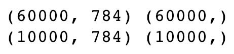

在这里，我们可以看到我们的训练集包含 60，000 个图像，我们的测试包含 10，000 个图像。每个图像当前是元素长的值 784 的向量。现在让我们检查数据类型:

```py
print(type(X_train))
print(type(y_train))
print(type(X_test))
print(type(y_test))
```

这将返回以下内容:

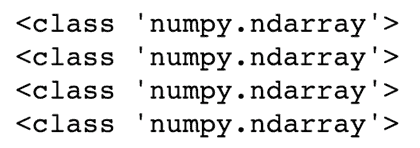

接下来，让我们看看数据是什么样子的。请记住，在当前形式下，每个图像都是一个值向量。我们知道图像是灰度的，所以为了可视化每幅图像，我们必须将这些向量重塑为 28×28 的矩阵。让我们来看看第一张图片:

```py
image_1 = X_train[0].reshape(28,28)
plt.axis('off')
plt.imshow(image_1, cmap='gray');
```

这将生成以下输出:


太棒了。我们可以通过运行以下命令来查看该图像所属的类:

```py
y_train[0]
```

这将生成以下输出:

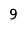

这些类是从 0 到 9 编码的。在自述文件中，Zalando 为我们提供了映射:


考虑到这一点，我们现在知道我们的第一张图片是踝靴。太好了。让我们创建这些编码值到它们类名的显式映射。这会马上派上用场:

```py
mapping = {0: "T-shirt/top", 1:"Trouser", 2:"Pullover", 3:"Dress", 
 4:"Coat", 5:"Sandal", 6:"Shirt", 7:"Sneaker", 8:"Bag", 9:"Ankle Boot"}
```

太好了。我们已经看到了一张图片，但是我们仍然需要对数据中的内容有所了解。这些图像看起来像什么？掌握这一点会告诉我们一些事情。举个例子，我很想看看这些类在视觉上有多明显。看起来与其他类相似的类比更独特的类更难区分。

在这里，我们定义了一个助手函数来帮助我们完成可视化之旅:

```py
def show_fashion_mnist(plot_rows, plot_columns, feature_array, target_array, cmap='gray', random_seed=None):
 '''Generates a plot_rows * plot_columns grid of randomly selected images from a feature         array. Sets the title of each subplot equal to the associated index in the target array and     unencodes (i.e. title is in plain English, not numeric). Takes as optional args a color map     and a random seed. Meant for EDA.'''
 # Grabs plot_rows*plot_columns indices at random from X_train. 
 if random_seed is not None:
 np.random.seed(random_seed)

 feature_array_indices = np.random.randint(0,feature_array.shape[0], size = plot_rows*plot_columns)

 # Creates our plots
 fig, ax = plt.subplots(plot_rows, plot_columns, figsize=(18,18))

 reshaped_images_list = []

 for feature_array_index in feature_array_indices:
 # Reshapes our images, appends tuple with reshaped image and class to a reshaped_images_list.
 reshaped_image = feature_array[feature_array_index].reshape((28,28))
 image_class = mapping[target_array[feature_array_index]]
 reshaped_images_list.append((reshaped_image, image_class))

 # Plots each image in reshaped_images_list to its own subplot
 counter = 0
 for row in range(plot_rows):
 for col in range(plot_columns):
 ax[row,col].axis('off')
 ax[row, col].imshow(reshaped_images_list[counter][0], 
                                cmap=cmap)
 ax[row, col].set_title(reshaped_images_list[counter][1])
 counter +=1
```

这个函数是做什么的？它创建了一个从数据中随机选择的图像网格，这样我们就可以同时查看多个图像。

它将所需的图像行数(`plot_rows`)、图像列数(`plot_columns`)、我们的`X_train` ( `feature_array`)和`y_train` ( `target_array`)作为参数，并生成一个很大的图像矩阵。作为可选参数，如果复制可视化很重要，您可以指定`cmap`或颜色图(默认为`‘gray'`，因为它们是灰度图像)和`random_seed`。

让我们看看如何运行它，如下所示:

```py
show_fashion_mnist(4,4, X_train, y_train, random_seed=72)
```

这将返回以下内容:


Visualization output

删除`random_seed`参数，并多次重新运行该函数。具体来说，运行以下代码:

```py
show_fashion_mnist(4,4, X_train, y_train)
```

您可能已经注意到，在这个分辨率下，一些类看起来非常相似，而另一些类则非常不同。例如，t 恤/上衣目标类的样本看起来与衬衫和外套目标类的样本非常相似，而凉鞋目标类似乎与其他目标类有很大不同。当思考我们的模型在哪里可能是弱的，在哪里可能是强的时，这是一个值得思考的问题。

现在让我们来看一下目标类在数据集中的分布。我们需要进行上采样还是下采样？让我们检查一下:

```py
y = pd.Series(np.concatenate((y_train, y_test)))
plt.figure(figsize=(10,6))
plt.bar(x=[mapping[x] for x in y.value_counts().index], height = y.value_counts());
plt.xlabel("Class")
plt.ylabel("Number of Images per Class")
plt.title("Distribution of Target Classes");
```

运行前面的代码会生成如下图:


太棒了。这里没有阶级平衡。

接下来，让我们开始预处理数据，为建模做准备。

正如我们在*图像特征提取*部分所讨论的，这些灰度图像包含的像素值范围从 0 到 255。我们通过运行以下代码来确认这一点:

```py
print(X_train.max())
print(X_train.min())
print(X_test.max())
print(X_test.min())
```

这将返回以下值:


出于建模的目的，我们希望将这些值标准化为 0–1。这是为建模准备图像数据时常见的预处理步骤。将我们的值保持在这个范围内将允许我们的神经网络更快地收敛。我们可以通过运行以下命令来规范化数据:

```py
# First we cast as float
X_train = X_train.astype('float32')
X_test = X_test.astype('float32')
# Then normalize
X_train /= 255
X_test /= 255
```

我们的数据现在从 0.0 缩放到 1.0。我们可以通过运行以下代码来确认这一点:

```py
print(X_train.max())
print(X_train.min())
print(X_test.max())
print(X_test.min())
```

这将返回以下输出:


在运行我们的第一个 Keras 网络之前，我们需要执行的下一个预处理步骤是重塑我们的数据。记住，我们`X_train`和`X_test`的形状目前分别是(60，000，784)和(10，000，784)。我们的图像仍然是矢量。为了将这些可爱的内核在整个图像中进行卷积，我们需要将它们重塑为 28×28 的矩阵形式。此外，Keras 要求我们明确声明数据的通道数。因此，当我们重塑这些灰度图像进行建模时，我们将宣布`1`:

```py
X_train = X_train.reshape(X_train.shape[0], 28, 28, 1)
X_test = X_test.reshape(X_test.shape[0], 28, 28, 1)
```

最后，我们将对我们的`y`向量进行一次热编码，以符合 Keras 的目标形状要求:

```py
y_train = np_utils.to_categorical(y_train, 10)
y_test = np_utils.to_categorical(y_test, 10)
```

我们现在准备好建模了。我们的第一个网络将有八个隐藏层。前六个隐藏层将由交替的卷积层和最大池层组成。然后，在生成我们的预测之前，我们将展平这个网络的输出，并将其输入两层前馈神经网络。这是代码的样子:

```py
model = Sequential()
model.add(Conv2D(filters = 35, kernel_size=(3,3), input_shape=(28,28,1), activation='relu'))
model.add(MaxPool2D(pool_size=(2,2)))
model.add(Conv2D(filters = 35, kernel_size=(3,3), activation='relu'))
model.add(MaxPool2D(pool_size=(2,2)))
model.add(Conv2D(filters = 45, kernel_size=(3,3), activation='relu'))
model.add(MaxPool2D(pool_size=(2,2)))
model.add(Flatten())
model.add(Dense(64, activation='relu'))
model.add(Dense(32, activation='relu'))
model.add(Dense(10, activation='softmax'))
model.compile(optimizer='adam', loss='categorical_crossentropy', metrics=['accuracy'])
```

让我们深入描述一下每一行发生了什么:

*   **第 1 行**:这里，我们只是实例化我们的模型对象。我们将通过接下来的一系列`.add()`方法调用来进一步定义体系结构——也就是层数。这就是 Keras API 的妙处。
*   **第 2 行**:这里，我们添加我们的第一个卷积层。我们指定`35`个内核，每个大小为 3×3。之后，我们指定图像输入形状，28 x 28 x 1。我们只需要在我们网络的第一个`.add()`调用中指定输入形状。最后，我们将激活函数指定为`relu`。激活函数在一个层的输出传递到下一层之前对其进行转换。我们将对`Conv2D`和`Dense`图层应用激活功能。这些转换有许多重要的属性。在这里使用`relu`加快了我们网络的收敛速度，[http://www.cs.toronto.edu/~fritz/absps/imagenet.pdf](http://www.cs.toronto.edu/~fritz/absps/imagenet.pdf)http://www.cs.toronto.edu/~fritz/absps/imagenet.pdf 和`relu`相对于替代激活函数来说，计算起来并不昂贵——我们只是将负值转换为 0，否则保留所有正值。数学上，`relu`函数由`max(0, value)`给出。为了本章的目的，除了输出层，我们将坚持对每一层进行`relu`激活。
*   **第 3 行**:这里，我们添加我们的第一个最大池层。我们指定该层的窗口大小为 2 x 2。
*   **第 4 行**:这是我们的第二个卷积层。我们设置它就像我们设置第一个卷积层一样。
*   **5 号线**:这是第二个最大池层。我们设置这个层就像我们设置第一个最大池层一样。
*   **第 6 行**:这是我们的第三层也是最后一层卷积层。这一次，我们添加了额外的过滤器(`45`相对于前面层中的`35`)。这只是一个超参数，我鼓励你尝试它的多种变体。
*   **7 号线**:这是第三层也是最后一层最大池层。它的配置与之前的所有最大池层相同。
*   **第 8 行**:这里是我们展平卷积神经网络输出的地方。
*   **9 号线**:这是我们全连接网络的第一层。我们在这一层指定`64`神经元和一个`relu`激活函数。
*   **10 号线**:这是我们全连接网络的第二层。我们为该层指定`32`神经元和一个`relu`激活函数。
*   **11 号线**:这是我们的输出层。我们指定`10`神经元，等于我们数据中目标类的数量。由于这是一个多类分类问题，我们指定一个`softmax`激活函数。输出将表示图像属于类别 0–9 的预测概率。这些概率加起来就是`1`。`10`的最高预测概率将代表我们的模型认为最有可能的类别。
*   **第 12 行**:这里是我们编译 Keras 模型的地方。在编译步骤中，我们指定我们的优化器`Adam`，一个自动调整其学习速率的**梯度下降**算法。我们指定我们的**损失函数**—在本例中为`categorical cross entropy`，因为我们正在执行一个多类分类问题。最后，对于度量参数，我们指定`accuracy`。通过指定这一点，Keras 将告知我们模型运行的每个时期的训练和验证精度。

我们可以通过运行以下命令来获得模型的摘要:

```py
model.summary()
```

这将输出以下内容:

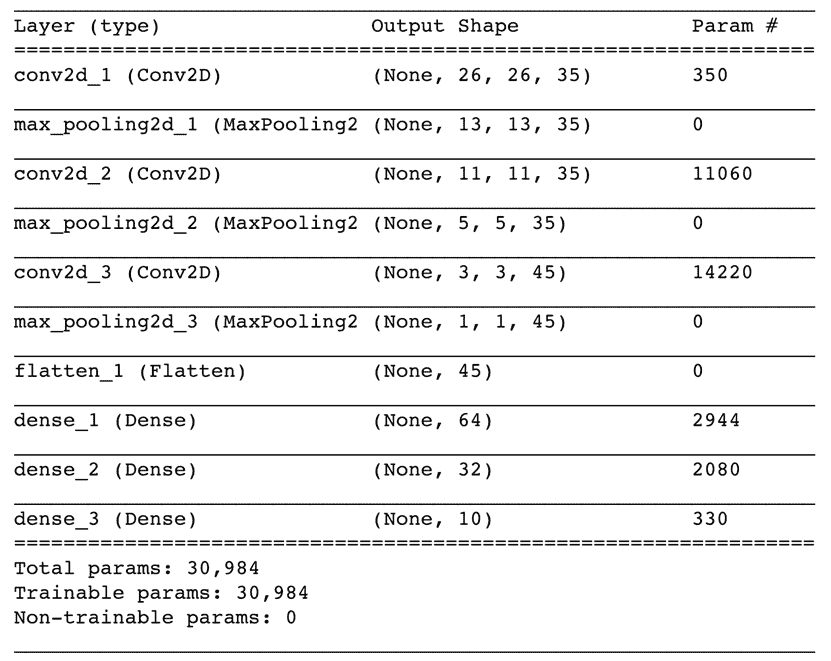

请注意，当数据通过模型时，输出形状会如何变化。具体来说，查看展平发生后我们输出的形状——只有 45 个特征。`X_train`和`X_test`中的原始数据由每行 784 个特征组成，所以这太棒了！

You'll need to install `pydot` to render the visualization. To install it, run `pip install pydot` from the terminal. You may need to restart your kernel for the install to take effect. 

使用 Keras 中的`plot_model`函数，我们可以以不同的方式可视化网络拓扑。为此，请运行以下代码:

```py
plot_model(model, to_file='Conv_model1.png', show_shapes=True)
Image.open('Conv_model1.png')
```

运行前面的代码将拓扑保存到`Conv_model1.png`并生成以下内容:


This model will take several minutes to fit. If you have concerns about your system's hardware specs, you can easily reduce the training time by reducing the number of epochs to `10`.

运行以下代码块将适合该模型:

```py
my_fit_model = model.fit(X_train, y_train, epochs=25, validation_data=
                        (X_test, y_test))
```

在拟合步骤中，我们指定我们的`X_train`和`y_train`。然后，我们指定想要训练模型的纪元数量。然后我们插入验证数据——`X_test`和`y_test`——来观察我们模型的样本外性能。我喜欢将`model.fit`步骤作为变量`my_fit_model`保存下来，这样我们以后就可以很容易地想象各个时期的训练和验证损失。

随着代码的运行，您将看到模型的训练和验证损失，以及每个时期后的准确性。让我们使用下面的代码来绘制模型的列车损失和验证损失:

```py
plt.plot(my_fit_model.history['val_loss'], label="Validation")
plt.plot(my_fit_model.history['loss'], label = "Train")
plt.xlabel("Epoch", size=15)
plt.ylabel("Cat. Crossentropy Loss", size=15)
plt.title("Conv Net Train and Validation loss over epochs", size=18)
plt.legend();
```

运行前面的代码会生成下面的图。你的图不会完全相同——这里有几个随机过程发生——但它看起来应该大致相同:


快速浏览一下这个图，我们会发现我们的模型过度拟合了。我们看到我们的列车损耗在每个时期都在下降，但是验证损耗并没有同步下降。让我们看一下我们的准确性分数，以了解该模型在分类任务中的表现。我们可以通过运行以下代码来做到这一点:

```py
plt.plot(my_fit_model.history['val_acc'], label="Validation")
plt.plot(my_fit_model.history['acc'], label = "Train")
plt.xlabel("Epoch", size=15)
plt.ylabel("Accuracy", size=15)
plt.title("Conv Net Train and Validation accuracy over epochs", 
           size=18)
plt.legend();
```

这会生成以下内容:


这个情节也告诉我们，我们已经过度了。但是看起来我们的验证准确率在 80%以上，这很好！为了获得我们的模型达到的最大精度和它发生的时间，我们可以运行以下代码:

```py
print(max(my_fit_model.history['val_acc']))
print(my_fit_model.history['val_acc'].index(max(my_fit_model.history['v
      al_acc'])))
```

您的具体结果将与我的不同，但以下是我的输出:


使用我们的卷积神经网络，我们在 21 世纪实现了 89.48%的最大分类准确率。太神奇了！但是我们仍然需要解决过度拟合的问题。接下来，我们将使用**脱落正则化**重建我们的模型。

脱落正则化是正则化的一种形式，我们可以将其应用于神经网络的全连接层。使用脱落正则化，我们在训练过程中从网络中随机脱落神经元及其连接。通过这样做，网络不会变得过于依赖与任何特定节点相关联的权重或偏差，从而允许它更好地从样本中进行归纳。

在这里，我们添加了丢失正则化，指定我们想要删除每个`Dense`层的`35%`个神经元:

```py
model = Sequential()
model.add(Conv2D(filters = 35, kernel_size=(3,3), input_shape=
         (28,28,1), activation='relu'))
model.add(MaxPool2D(pool_size=(2,2)))
model.add(Conv2D(filters = 35, kernel_size=(3,3), activation='relu'))
model.add(MaxPool2D(pool_size=(2,2)))
model.add(Conv2D(filters = 45, kernel_size=(3,3), activation='relu'))
model.add(MaxPool2D(pool_size=(2,2)))
model.add(Flatten())
model.add(Dense(64, activation='relu'))
model.add(Dropout(0.35))
model.add(Dense(32, activation='relu'))
model.add(Dropout(0.35))
model.add(Dense(10, activation='softmax'))
model.compile(optimizer='adam', loss='categorical_crossentropy', metrics=['accuracy'])
```

运行前面的代码将编译我们的新模型。让我们通过重新运行以下内容来再次查看摘要:

```py
model.summary()
```

运行前面的代码将返回以下输出:

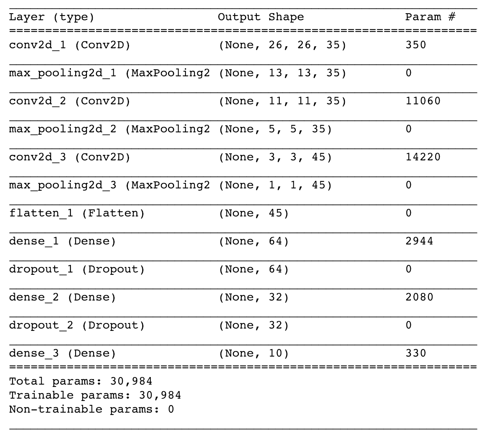

让我们通过重新运行以下命令来重新调整我们的模型:

```py
my_fit_model = model.fit(X_train, y_train, epochs=25, validation_data=
                        (X_test, y_test))
```

一旦你的模型重新调整，重新运行绘图代码来可视化损失。这是我的:

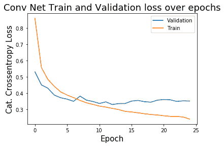

这看起来更好！我们的培训和验证损失之间的差异已经缩小，这是预期的目的，尽管似乎确实有一些改进的空间。

接下来，重新绘制精度曲线。这是我的跑步记录:

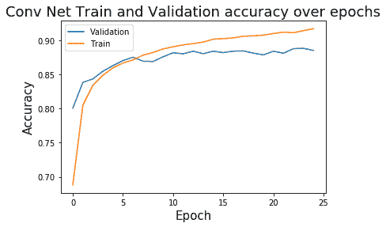

从过度拟合的角度来看，这也更好。太棒了！应用正则化后，我们达到的最佳分类精度是多少？让我们运行以下代码:

```py
print(max(my_fit_model.history['val_acc']))
print(my_fit_model.history['val_acc'].index(max(my_fit_model.history['v
      al_acc'])))
```

这个模型运行的输出如下:

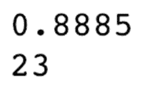

有意思！我们获得的最佳验证精度低于我们的非正规模型，但也差不了多少。而且还是挺好的！我们的模型告诉我们，88.85%的情况下我们预测的是正确的服装物品类型。

思考我们在这里做得有多好的一种方法是将我们模型的精度与数据集的**基线精度**进行比较。基线精度仅仅是我们通过天真地选择数据集中最常见的类别而获得的分数。对于这个特定的数据集，因为类是完全平衡的，并且有 10 个类，所以基线精度是 10%。我们的模型轻而易举地超过了这个基线精度。它显然对数据有所了解！

从这里你可以去很多不同的地方！尝试构建更深层次的模型，或者在模型中使用的许多超参数上进行网格搜索。评估你的分类器的性能，就像评估任何其他模型一样——试着建立一个混淆矩阵来理解我们预测的好的类和我们没有预测的强的类！

# 摘要

我们在这里确实走了很多路！我们讨论了如何从图像中提取特征，卷积神经网络是如何工作的，然后我们构建了一个卷积神经网络到完全连接的网络架构。一路上，我们也学到了很多新的术语和概念！

希望读完这一章，你会觉得这些图像分类技术——你可能曾经认为是巫师的领域——实际上只是出于直觉原因而进行的一系列数学优化！希望这些内容能帮助你解决你感兴趣的图像处理项目！