# 九、构建聊天机器人

想象一下，你独自坐在一个安静宽敞的房间里。你的右边是一张小桌子，上面放着一叠白色打印纸和一支黑色钢笔。在你面前的似乎是一个巨大的红色立方体，有一个微小的开口——略小于一个邮件槽的大小。插槽正上方的铭文邀请你写下一个问题，并通过插槽传递。碰巧你会说普通话；所以，你用普通话在其中一张纸上写下你的问题，并插入到开头。几分钟过去了，慢慢地，一个答案出现了。它也是用中文写的，并且是你可能期望的那种答案。你问了什么？*你是人还是电脑？*反应如何？*为什么是的，是的我是*。

这个思想实验基于哲学家约翰·塞尔的《中国房间论》。实验的前提是，如果房间里有一个人不会说中文，但有一套规则允许他们将英文字符完美地映射为中文字符，那么在提问者看来，他们可能理解中文，而实际上对中文没有任何理解。塞尔的论点是，不能说产生可理解输出的算法程序理解了输出。他们缺少一个*头脑*。他的思维实验试图对抗*强大的人工智能*的思想，或者说人类大脑本质上只是一个*湿机器*的概念。塞尔不相信人工智能可以说是有意识的，不管它的行为在外部观察者看来有多复杂。

塞尔在 1980 年发表了这个实验。31 年后，Siri 将在 iPhone 4S 上发布。对于任何使用过 Siri 的人来说，很明显，在我们可能面临与我们交谈的代理是否有头脑的不确定性之前，我们还有很长的路要走(尽管我们可能会怀疑我们认识的人是否有头脑)。尽管这些代理或聊天机器人在过去表现出笨拙，但该领域正在迅速发展。

在本章中，我们将学习如何从头开始构建聊天机器人。在此过程中，我们将了解该领域的更多历史及其未来前景。

我们将在本章中讨论以下主题:

*   图灵测试
*   聊天机器人的历史
*   聊天机器人的设计
*   构建聊天机器人

# 图灵测试

在塞尔的《中国房间》问世 30 年前，艾伦·图灵提出了这样一个问题:*机器能思考吗？*在他的一篇比较著名的论文中。作为一个实际的天才，他决定不正面解决这个问题，而是把它放在其他人的思维的*问题的框架中。这个问题问，*我们如何真正知道别人也有和我们一样的想法？*因为我们只能观察他们的行为——而不能观察他们的内心活动——我们必须相信他们和我们一样。图灵提出，如果一台机器可以表现得好像它是智能的，那么我们应该这样看待它。简单来说，这就是*图灵测试*。通过测试意味着让人类相信机器也是人类。*

此时你可能会想，*有没有一个程序曾经成功通过图灵测试？*答案是真的没有官方的图灵测试。最接近官方测试的是罗布纳奖。这是一项每年举行一次的竞赛，向那些在评委团看来最有说服力的聊天机器人颁发适度的奖项。如果这听起来严谨和学术，它已经被描述为任何事情。据说罗布纳本人就是这样的人物，经常公开表示他对葡萄酒、大麻和妓女的喜爱。据说他对比赛的赞助是他完全蔑视任何形式的劳动的结果。

希望此时，你已经意识到任何关于*通过图灵测试*的说法都比真正的科学更壮观。尽管如此，图灵最初的概念是一个有用的构造。

# 聊天机器人的历史

我还记得有一天，父亲让我坐在他的 IBM XT 前，看着它黑白闪烁的显示器，让我和它说话。对话大致如下:

>你好。你今天感觉怎么样？

>嗨。这是谁？

你好...你今天怎么样？

>我很好。你没告诉我你是谁。

>我们应该讨论你，而不是我。

>我们应该吗？为什么呢？

>让我们稍微改变一下焦点...说说你的家庭吧。

>你是不可能与之交谈的。

>你能详细说明一下吗？

>你要杀了我。

>也许你想让我杀了你。

>好吧，你吓到我了。

>也许你真的在说你自己？

>什么？？这说不通。

>这个问题的答案对你有什么帮助？

>结束

>非常有趣。

>退出

>感谢您与我交谈。

>#$###$#@@....

我正在和一个名叫**伊莱扎**的程序交谈。伊莱扎是约瑟夫·韦森鲍姆于 20 世纪 60 年代中期在麻省理工学院人工智能实验室创作的，旨在模仿一位罗格里安心理治疗师的反应。尽管在任何深度检查时都近乎滑稽，但该程序能够让一些用户相信他们在和真人聊天——考虑到它只有不到 200 行代码，使用随机化和正则表达式来鹦鹉学舌地回答，这是一个了不起的壮举。即使在今天，这个简单的节目仍然是流行文化的主要内容。如果你问 Siri ELISA 是谁，她会告诉你她是一个朋友，也是一个出色的精神病医生。

如果伊莱扎是聊天机器人的早期例子，从那以后我们看到了什么？近年来，新聊天机器人激增。其中最引人注目的是 Cleverbot。

Cleverbot 于 1997 年通过网络向世界发布。从那以后的几年里，这个机器人已经积累了数亿次转换，与早期的聊天机器人不同，正如它的名字所暗示的那样，Cleverbot 似乎随着每次转换变得更加智能。虽然算法工作的确切细节很难找到，但据说它的工作原理是通过记录数据库中的所有对话，并通过识别数据库中最相似的问题和答案来找到最合适的答案。

我编了一个无意义的问题，如下所示，你可以看到它在字符串匹配方面找到了与我的问题的对象相似的东西:


我坚持说:


我又得到了一些东西...相似吗？

您还会注意到，话题可以贯穿整个对话。作为回应，我被要求更详细地解释我的回答。这似乎是让克莱伯特变得聪明的原因之一。

虽然向人类学习的聊天机器人可能相当有趣，但它们也有黑暗的一面。

几年前，微软在推特上发布了一个名为 Tay 的聊天机器人。人们被邀请问泰问题，泰会根据她的*性格*做出回应。微软显然将机器人编程为一个 19 岁的美国女孩。她本打算成为你的虚拟*闺蜜*；唯一的问题是，她开始在推特上发布极端种族主义的言论。

由于这些令人难以置信的煽动性推文，微软被迫将 Tay 从推特上拉下来并发表道歉。

"As many of you know by now, on Wednesday we launched a chatbot called Tay. We are deeply sorry for the unintended offensive and hurtful tweets from Tay, which do not represent who we are or what we stand for, nor how we designed Tay. Tay is now offline and we'll look to bring Tay back only when we are confident we can better anticipate malicious intent that conflicts with our principles and values." -March 25, 2016 Official Microsoft Blog

显然，想要在未来将聊天机器人释放到野外的品牌应该从这次失败中吸取教训，并计划让用户试图操纵它们来展示人类最糟糕的行为。

毫无疑问，品牌正在拥抱聊天机器人。从脸书到塔可钟，每个人都参与了这场比赛。

见证玉米机器人:


是的，这是真的。而且，尽管有一些障碍，像 Tay 一样，UI 的未来很有可能看起来很像 TacoBot。最后一个例子甚至可能有助于解释为什么。

Quartz 最近推出了一款将新闻转化为对话的应用。与其把一天的故事列成一个简单的清单，不如像从朋友那里得到消息一样聊天:

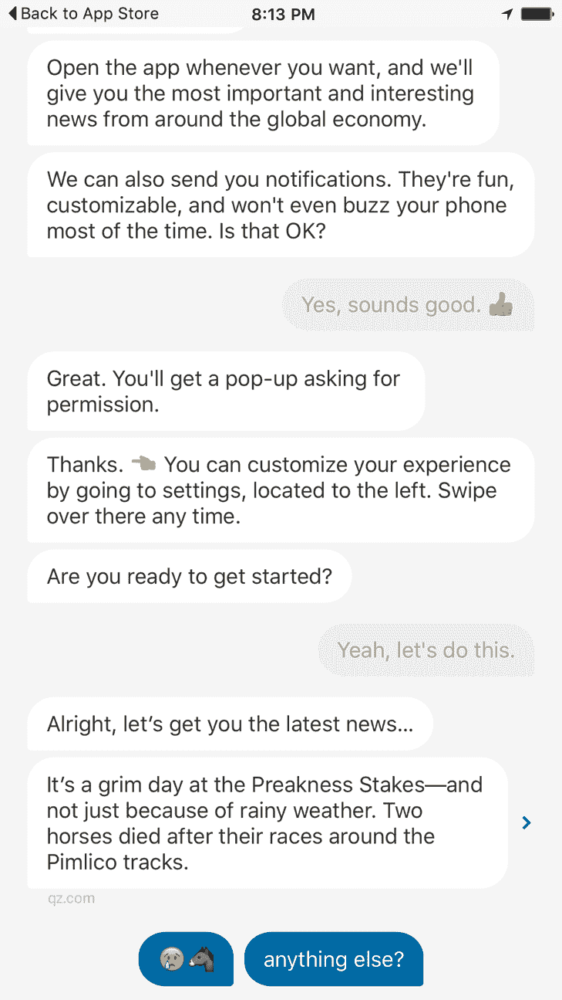

推特的项目经理大卫·加斯卡在《媒体》上的一篇帖子中描述了他使用该应用的经历。他描述了对话性质如何唤起通常只在人际关系中触发的感情:

"Unlike a simple display ad, in a conversational relationship with my app I feel like I owe something to it: I want to click. At the most subconscious level I feel the need to reciprocate and not let the app down: "The app has given me this content. It's been very nice so far and I enjoyed the GIFs. I should probably click since it's asking nicely."

如果这种体验是普遍的——我预计也是如此——这可能是广告界的下一件大事，我毫不怀疑广告利润将推动用户界面设计:

"The more the bot acts like a human, the more it will be treated like a human." -Mat Webb, Technologist and Co-Author of Mind Hacks

在这一点上，你可能很想知道这些东西是如何工作的，所以让我们继续吧！

# 聊天机器人的设计

最初的 ELIZA 应用是 200 多行代码。Python NLTK 实现同样很短。节选自 NLTK 网站([http://www.nltk.org/_modules/nltk/chat/eliza.html](http://www.nltk.org/_modules/nltk/chat/eliza.html)):

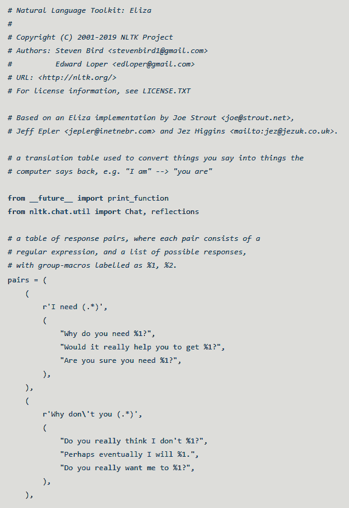

从代码中可以看到，输入文本被解析，然后与一系列正则表达式进行匹配。一旦输入匹配，就会返回随机响应(有时会回显部分输入)。所以，比如说，*我需要一个玉米卷*会引发这样的反应，*真的能帮你得到一个玉米卷吗？*显然，答案是肯定的，而且，幸运的是，我们已经发展到了技术可以为你提供一个的地步(祝福你，TacoBot)，但这仍然是早期。令人震惊的是，有些人真的相信 ELIZA 是一个真正的人。

但是更先进的机器人呢？它们是如何建造的？

令人惊讶的是，你可能遇到的大多数聊天机器人甚至都没有使用**机器学习**(**ML**)；它们是所谓的基于 T4 检索的模型。这意味着响应是根据问题和上下文预先定义的。这些机器人最常见的架构是一种叫做**人工智能标记语言** ( **AIML** )的东西。AIML 是一个基于 XML 的模式，用于表示在给定用户输入的情况下机器人应该如何交互。这实际上只是伊莱扎工作方式的更高级版本。

让我们看看如何使用 AIML 生成响应。首先，对所有输入进行预处理，使其规范化。这意味着当你输入 *Waaazzup 时？？？*映射到*什么是向上*。这个预处理步骤将无数种表达同一件事的方式汇集到一个输入中，这个输入可以违反一个规则。标点符号和其他无关的输入在这一点上也被删除。一旦完成，输入将与适当的规则相匹配。以下是一个示例模板:

```py
<category> 
<pattern>WHAT IS UP</pattern> 
<template>The sky, duh. Pfft. Humans...</template> 
</category> 
```

这是基本设置，但您也可以分层使用通配符、随机化和优先化方案。例如，以下模式使用通配符匹配:

```py
<category> 
<pattern>* FOR ME<pattern> 
<template>I'm a bot. I don't <star/>. Ever.</template> 
</category> 
```

这里，`*`通配符匹配`FOR ME`之前的一个或多个单词，然后在输出模板中重复这些单词。如果用户输入`Dance for me!`，响应将是`I'm a bot. I don't dance. Ever`。

正如你所看到的，这些规则并没有创造出任何接近真实智力的东西，但是有一些技巧可以强化这种错觉。其中一个更好的是能够产生以某个话题为条件的反应。

例如，这里有一个调用主题的规则:

```py
<category> 
<pattern>I LIKE TURTLES</pattern> 
<template>I feel like this whole <set name="topic">turtle</set> thing could be a problem. What do you like about them? </template> 
</category> 
```

一旦设置了主题，就可以匹配特定于该上下文的规则:

```py
<topic name="turtles"> 

<category> 
<pattern>* SHELL IS *</pattern> 
<template>I dislike turtles primarily because of their shells. What other creepy things do you like about turtles? </template> 
</category> 

<category> 
<pattern>* HIDE *</pattern> 
<template>I wish, like a turtle, that I could hide from this conversation. </template> 
</category> 

</topic> 
```

让我们看看这种交互可能是什么样子:

>我喜欢乌龟！

>我觉得海龟这件事可能是个问题。你喜欢他们什么？

>我喜欢它们藏在壳里的样子。

>我希望，像乌龟一样，我能躲过这场对话。

你可以看到整个对话的连续性增加了一点真实性。

你可能在想，在这个深度学习的时代，这不可能是最先进的，你是对的。虽然大多数机器人都是基于规则的，但下一代聊天机器人正在出现，它们是基于神经网络的。

2015 年，谷歌的 Oriol Vinyas 和 Quoc Le 发表了一篇名为[http://arxiv.org/pdf/1506.05869v1.pdf](https://arxiv.org/pdf/1506.05869v1.pdf)的论文，描述了基于序列到序列模型的神经网络的构建。这种类型的模型将输入序列(如 *ABC* )映射到输出序列(如 *XYZ* )。例如，这些输入和输出可能是从一种语言到另一种语言的翻译。就他们在这里的工作而言，培训数据不是语言翻译，而是技术支持成绩单和电影对话。虽然这两种模式的结果都很有趣，但占据头条的是基于电影模式的互动。

以下是本文中的互动示例:


这些都不是由人类明确编码的，也没有按照要求出现在训练集中，然而，看着这些，就像和人类说话一样可怕。但让我们看看更多:

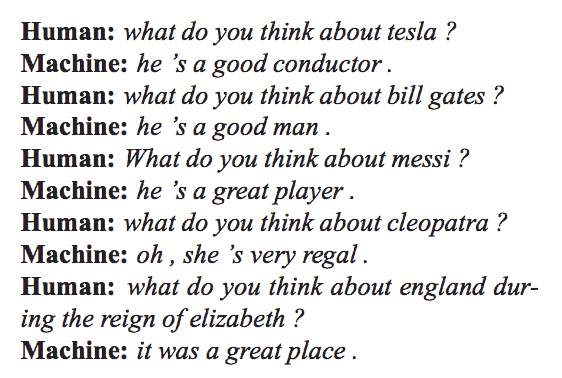

请注意，模特的回应似乎是性别知识( **he** 、 **she** )、 **place** (英国)和职业(**选手**)。甚至意义、伦理和道德的问题都是公平的游戏:


如果那份成绩单没有让你感到一丝寒意，你可能已经是某种人工智能了。

我衷心推荐阅读整篇论文。它并没有过度的技术化，它肯定会让你看到技术的发展方向。

我们已经谈了很多关于聊天机器人的历史、类型和设计，但是现在让我们继续构建我们自己的聊天机器人。对此，我们将采取两种方法。第一个将使用我们在前面看到的技术，余弦相似性，第二个将利用序列到序列的学习。

# 构建聊天机器人

现在，在了解了聊天机器人的可能性之后，你很可能想要构建最好的、最先进的、谷歌级别的机器人，对吗？好吧，暂时不要想这些，因为我们要从相反的事情开始。我们要建造史上最可怕的机器人！

这听起来可能令人失望，但如果你的目标只是建造一些非常酷和吸引人的东西(不需要花费数小时来建造)，这是一个很好的开始。

我们将利用从与 Cleverbot 的一系列真实对话中获得的培训数据。数据来自[http://notsocleverbot.jimrule.com](http://notsocleverbot.jimrule.com)。这个网站是完美的，因为它让人们提交了他们与 Cleverbot 最荒谬的对话。

让我们看一下 Cleverbot 和网站用户之间的对话示例:

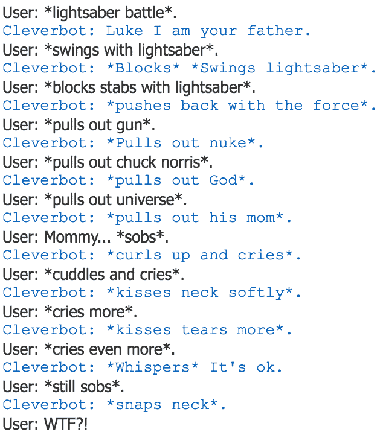

虽然您可以自由使用我们在前面章节中使用的网页抓取技术来收集数据，但是您可以在本章的 GitHub repo 中找到数据的`.csv`。

我们将在 Jupyter 笔记本中重新开始。我们将加载、解析和检查数据。我们将首先导入熊猫和 Python 正则表达式库`re`。我们还将在 pandas 中设置选项，以扩大我们的列宽，这样我们可以更好地查看数据:

```py
import pandas as pd 
import re 
pd.set_option('display.max_colwidth',200) 
```

现在我们将载入我们的数据:

```py
df = pd.read_csv('nscb.csv') 
df.head() 
```

前面的代码产生以下输出:

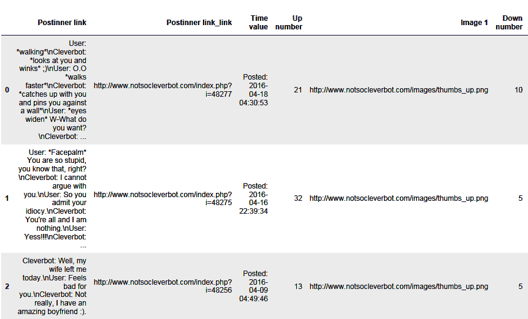

由于我们只对第一列即对话数据感兴趣，我们将解析出:

```py
convo = df.iloc[:,0] 
convo 
```

前面的代码产生以下输出:


你应该能看出我们在**用户**和**克莱伯**之间有互动，并且两者都可以发起对话。为了以我们需要的格式获得数据，我们必须将它解析成问题和响应对。我们不一定关心谁说了什么，而是匹配每个问题的每个回答。一会儿你就会明白为什么了。现在让我们对文本进行一点正则表达式魔法:

```py
clist = [] 
def qa_pairs(x): 
    cpairs = re.findall(": (.*?)(?:$|\n)", x) 
    clist.extend(list(zip(cpairs, cpairs[1:]))) 

convo.map(qa_pairs); 
convo_frame = pd.Series(dict(clist)).to_frame().reset_index() 
convo_frame.columns = ['q', 'a'] 
```

前面的代码产生以下输出:

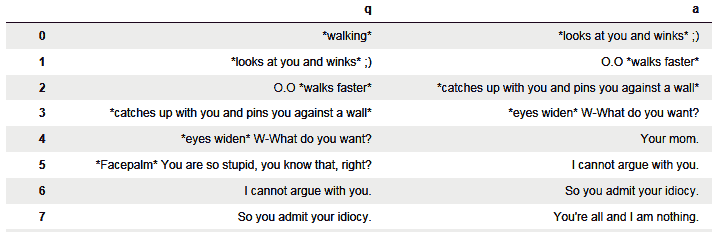

好的，有很多代码。刚刚发生了什么？我们首先创建了一个列表来保存我们的问答元组。然后，我们通过一个函数传递我们的对话，使用正则表达式将它们分成几对。

最后，我们将其全部设置到熊猫数据框中，其中的列分别标记为`q`和`a`。

我们现在将应用一点算法魔法来匹配与用户输入的问题最接近的问题:

```py
from sklearn.feature_extraction.text import TfidfVectorizer 
from sklearn.metrics.pairwise import cosine_similarity 

vectorizer = TfidfVectorizer(ngram_range=(1,3)) 
vec = vectorizer.fit_transform(convo_frame['q']) 
```

在前面的代码中，我们导入了 tf-idf 矢量化库和余弦相似性库。然后，我们使用我们的训练数据来创建 tf-idf 矩阵。我们现在可以使用它来转换我们自己的新问题，并测量与训练集中现有问题的相似性。我们现在就开始吧:

```py
my_q = vectorizer.transform(['Hi. My name is Alex.']) 

cs = cosine_similarity(my_q, vec) 

rs = pd.Series(cs[0]).sort_values(ascending=False) 
top5 = rs.iloc[0:5] 
top5 
```

前面的代码产生以下输出:


我们在看什么？这是我问的问题和前五个最接近的问题之间的余弦相似度。左边是索引，右边是余弦相似度。让我们看看这些:

```py
convo_frame.iloc[top5.index]['q'] 
```

这将产生以下输出:


如你所见，没有什么是完全相同的，但肯定有一些相似之处。

现在让我们来看看回应:

```py
rsi = rs.index[0] 
rsi 

convo_frame.iloc[rsi]['a'] 
```

前面的代码产生以下输出:


好吧，看来我们的机器人已经有态度了。让我们更进一步。

我们将创建一个方便的函数，这样我们就可以轻松地测试许多语句:

```py
def get_response(q): 
    my_q = vectorizer.transform([q]) 
    cs = cosine_similarity(my_q, vec) 
    rs = pd.Series(cs[0]).sort_values(ascending=False) 
    rsi = rs.index[0] 
    return convo_frame.iloc[rsi]['a'] 

get_response('Yes, I am clearly more clever than you will ever be!') 
```

这将产生以下输出:

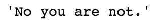

我们显然创造了一个怪物，所以我们将继续:

```py
get_response('You are a stupid machine. Why must I prove anything to    
              you?') 
```

这将产生以下输出:

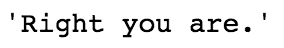

我很享受这一切。让我们继续前进:

```py
get_response('Did you eat tacos?') 
```


```py
get_response('With beans on top?') 
```


```py
get_response('What else do you like to do?') 
```


```py
get_response('What do you like about it?') 
```


```py
get_response('Me, random?') 
```


```py
get_response('I think you mean you\'re') 
```


值得注意的是，这可能是我有一段时间以来最好的对话之一，不管是不是机器人。

虽然这是一个有趣的小项目，但现在让我们转向使用序列到序列建模的更高级的建模技术。

# 聊天机器人的序列对序列建模

对于下一个任务，我们将利用在[第 8 章](08.html)、*中讨论的几个库，使用卷积神经网络*、TensorFlow 和 Keras 对图像进行分类。如果你还没有安装，两者都可以`pip`安装。

我们还将使用本章前面讨论的高级建模类型；这是一种叫做**序列对序列建模**的深度学习。这在机器翻译和问答应用中经常使用，因为它允许我们将任意长度的输入序列映射到任意长度的输出序列:


Source: https://blog.keras.io/a-ten-minute-introduction-to-sequence-to-sequence-learning-in-keras.html

Francois Chollet 在 Keras 的博客上对这种类型的模型有一个很好的介绍:[https://blog . Keras . io/a-十分钟介绍序列对序列学习 in-keras.html](https://blog.keras.io/a-ten-minute-introduction-to-sequence-to-sequence-learning-in-keras.html) 。值得一读。

我们将大量使用他的示例代码来构建我们的模型。虽然他的例子使用了机器翻译，即英语到法语，但我们将使用我们的 Cleverbot 数据集将其重新用于问答:

1.  设置导入:

```py
from keras.models import Model 
from keras.layers import Input, LSTM, Dense 
import numpy as np 
```

2.  设置培训参数:

```py
batch_size = 64  # Batch size for training. 
epochs = 100  # Number of epochs to train for. 
latent_dim = 256  # Latent dimensionality of the encoding space. 
num_samples = 1000  # Number of samples to train on. 
```

我们用这些来开始。我们可以检查我们的模型是否成功，然后根据需要进行调整。

数据处理的第一步将是获取我们的数据，以适当的格式获取它，然后对它进行矢量化。我们会一步一步来:

```py
input_texts = [] 
target_texts = [] 
input_characters = set() 
target_characters = set() 
```

这为我们的问题和答案(目标)创建了列表，也为我们的问题和答案中的单个字符创建了集合。这个模型实际上将通过一次生成一个字符来工作:

1.  让我们将问答对限制在 50 个字符以内。这将有助于加快我们的培训:

```py
convo_frame['q len'] = convo_frame['q'].astype('str').apply(lambda  
                       x: len(x)) 
convo_frame['a len'] = convo_frame['a'].astype('str').apply(lambda 
                       x: len(x)) 
convo_frame = convo_frame[(convo_frame['q len'] < 50)&
                          (convo_frame['a len'] < 50)] 
```

2.  让我们设置输入和目标文本列表:

```py
input_texts = list(convo_frame['q'].astype('str')) 
target_texts = list(convo_frame['a'].map(lambda x: '\t' + x + 
                    '\n').astype('str')) 
```

前面的代码以正确的格式获取我们的数据。请注意，我们在目标文本中添加了一个制表符(`\t`)和一个换行符(`\n`)。这将作为解码器的开始和停止标记。

3.  让我们看看输入文本和目标文本:

```py
input_texts 
```

上述代码生成以下输出:


```py
target_texts 
```

上述代码生成以下输出:


现在让我们看看这些输入和目标字符集:

```py
input_characters 
```

上述代码生成以下输出:


```py
target_characters 
```

上述代码生成以下输出:


接下来，我们将为输入模型的数据做一些额外的准备。尽管数据可以以任意长度输入和返回，但我们需要添加填充，直到数据的最大长度，模型才能工作:

```py
input_characters = sorted(list(input_characters)) 
target_characters = sorted(list(target_characters)) 
num_encoder_tokens = len(input_characters) 
num_decoder_tokens = len(target_characters) 
max_encoder_seq_length = max([len(txt) for txt in input_texts]) 
max_decoder_seq_length = max([len(txt) for txt in target_texts]) 

print('Number of samples:', len(input_texts)) 
print('Number of unique input tokens:', num_encoder_tokens) 
print('Number of unique output tokens:', num_decoder_tokens) 
print('Max sequence length for inputs:', max_encoder_seq_length) 
print('Max sequence length for outputs:', max_decoder_seq_length) 
```

上述代码生成以下输出:


接下来，我们将使用单向编码对数据进行矢量化:

```py
input_token_index = dict( 
    [(char, i) for i, char in enumerate(input_characters)]) 
target_token_index = dict( 
    [(char, i) for i, char in enumerate(target_characters)]) 

encoder_input_data = np.zeros( 
    (len(input_texts), max_encoder_seq_length, num_encoder_tokens), 
    dtype='float32') 
decoder_input_data = np.zeros( 
    (len(input_texts), max_decoder_seq_length, num_decoder_tokens), 
    dtype='float32') 
decoder_target_data = np.zeros( 
    (len(input_texts), max_decoder_seq_length, num_decoder_tokens), 
    dtype='float32') 

for i, (input_text, target_text) in enumerate(zip(input_texts, target_texts)): 
    for t, char in enumerate(input_text): 
        encoder_input_data[i, t, input_token_index[char]] = 1\. 
    for t, char in enumerate(target_text): 
        # decoder_target_data is ahead of decoder_input_data by one 
        # timestep 
        decoder_input_data[i, t, target_token_index[char]] = 1\. 
        if t > 0: 
            # decoder_target_data will be ahead by one timestep 
            # and will not include the start character. 
            decoder_target_data[i, t - 1, target_token_index[char]] = 
                                1\. 
```

让我们来看看其中一个向量:

```py
Decoder_input_data 
```

上述代码生成以下输出:

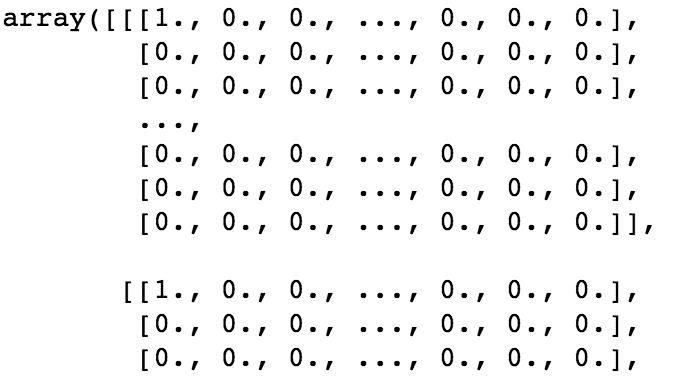

从上图中，你会注意到我们有一个字符数据的单热编码向量，它将用于我们的模型中。

我们现在设置序列到序列模型编码器和解码器 LSTMs:

```py
# Define an input sequence and process it. 
encoder_inputs = Input(shape=(None, num_encoder_tokens)) 
encoder = LSTM(latent_dim, return_state=True) 
encoder_outputs, state_h, state_c = encoder(encoder_inputs) 
# We discard `encoder_outputs` and only keep the states. 
encoder_states = [state_h, state_c] 

# Set up the decoder, using `encoder_states` as initial state. 
decoder_inputs = Input(shape=(None, num_decoder_tokens)) 

# We set up our decoder to return full output sequences, 
# and to return internal states as well. We don't use the 
# return states in the training model, but we will use them in  
# inference. 
decoder_lstm = LSTM(latent_dim, return_sequences=True,  
               return_state=True) 
decoder_outputs, _, _ = decoder_lstm(decoder_inputs, 
                                     initial_state=encoder_states) 
decoder_dense = Dense(num_decoder_tokens, activation='softmax') 
decoder_outputs = decoder_dense(decoder_outputs) 
```

然后我们继续讨论模型本身:

```py
# Define the model that will turn 
# `encoder_input_data` & `decoder_input_data` into `decoder_target_data` 
model = Model([encoder_inputs, decoder_inputs], decoder_outputs) 

# Run training 
model.compile(optimizer='rmsprop', loss='categorical_crossentropy') 
model.fit([encoder_input_data, decoder_input_data], 
           decoder_target_data, 
           batch_size=batch_size, 
           epochs=epochs, 
           validation_split=0.2) 
# Save model 
model.save('s2s.h5') 
```

在前面的代码中，我们使用编码器和解码器输入以及解码器输出定义了模型。然后我们编译它，调整它，并保存它。

我们将模型设置为使用 1000 个样本。在这里，我们还将数据分为 80/20，分别进行训练和验证。我们还将我们的纪元设置为 100，因此这将基本上运行 100 个周期。在标准的 MacBook Pro 上，这可能需要大约一个小时才能完成。

运行该单元格后，将生成以下输出:

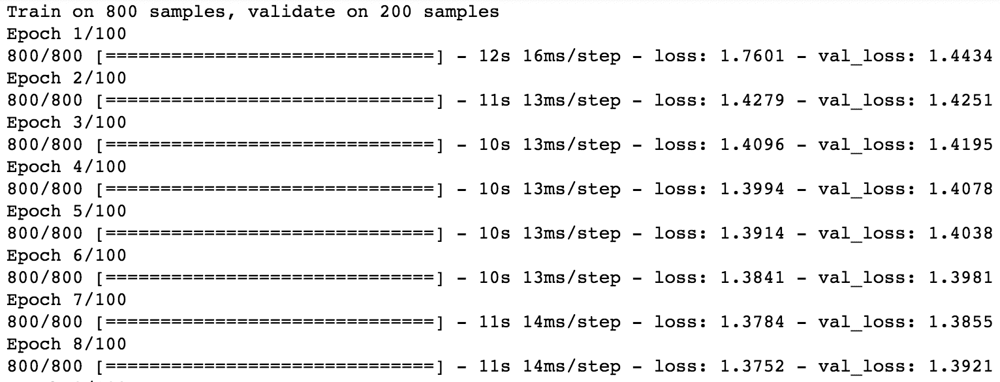

下一步是我们的推断步骤。我们将使用从这个模型生成的状态来输入到下一个模型中，以生成我们的输出:

```py
# Next: inference mode (sampling). 
# Here's the drill: 
# 1) encode input and retrieve initial decoder state 
# 2) run one step of decoder with this initial state 
# and a "start of sequence" token as target. 
# Output will be the next target token 
# 3) Repeat with the current target token and current states 

# Define sampling models 
encoder_model = Model(encoder_inputs, encoder_states) 

decoder_state_input_h = Input(shape=(latent_dim,)) 
decoder_state_input_c = Input(shape=(latent_dim,)) 
decoder_states_inputs = [decoder_state_input_h, decoder_state_input_c] 
decoder_outputs, state_h, state_c = decoder_lstm( 
    decoder_inputs, initial_state=decoder_states_inputs) 
decoder_states = [state_h, state_c] 
decoder_outputs = decoder_dense(decoder_outputs) 
decoder_model = Model( 
    [decoder_inputs] + decoder_states_inputs, 
    [decoder_outputs] + decoder_states) 

# Reverse-lookup token index to decode sequences back to 
# something readable. 
reverse_input_char_index = dict( 
    (i, char) for char, i in input_token_index.items()) 
reverse_target_char_index = dict( 
    (i, char) for char, i in target_token_index.items()) 

def decode_sequence(input_seq): 
    # Encode the input as state vectors. 
    states_value = encoder_model.predict(input_seq) 

    # Generate empty target sequence of length 1\. 
    target_seq = np.zeros((1, 1, num_decoder_tokens)) 
    # Populate the first character of target sequence with the start character. 
    target_seq[0, 0, target_token_index['\t']] = 1\. 

    # Sampling loop for a batch of sequences 
    # (to simplify, here we assume a batch of size 1). 
    stop_condition = False 
    decoded_sentence = '' 
    while not stop_condition: 
        output_tokens, h, c = decoder_model.predict( 
            [target_seq] + states_value) 

        # Sample a token 
        sampled_token_index = np.argmax(output_tokens[0, -1, :]) 
        sampled_char = reverse_target_char_index[sampled_token_index] 
        decoded_sentence += sampled_char 

        # Exit condition: either hit max length 
        # or find stop character. 
        if (sampled_char == '\n' or 
           len(decoded_sentence) > max_decoder_seq_length): 
            stop_condition = True 

        # Update the target sequence (of length 1). 
        target_seq = np.zeros((1, 1, num_decoder_tokens)) 
        target_seq[0, 0, sampled_token_index] = 1\. 

        # Update states 
        states_value = [h, c] 

    return decoded_sentence 

for seq_index in range(100): 
    # Take one sequence (part of the training set) 
    # for trying out decoding. 
    input_seq = encoder_input_data[seq_index: seq_index + 1] 
    decoded_sentence = decode_sequence(input_seq) 
    print('-') 
    print('Input sentence:', input_texts[seq_index]) 
    print('Decoded sentence:', decoded_sentence) 
```

上述代码生成以下输出:


如您所见，我们模型的结果相当重复。但是我们只使用了 1000 个样本，每次产生一个字符的响应，所以这实际上是相当令人印象深刻的。

如果您想要更好的结果，请使用更多的样本数据和更多的时期重新运行模型。

在这里，我提供了一些我从更长时间的训练中注意到的更幽默的输出:

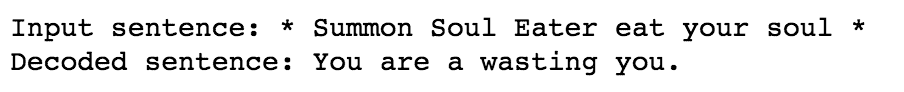

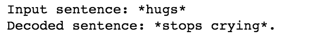


# 摘要

在这一章中，我们全面参观了 chatbot 景观。很明显，我们正处于这类应用爆炸的风口浪尖。*对话式 UI* 革命即将开始。希望这一章已经启发你创建自己的机器人，但如果没有，我们希望你对这些应用如何工作以及它们将如何塑造我们的未来有更丰富的理解。

我会让应用说出最后的话:

```py
get_response("This is the end, Cleverbot. Say goodbye.") 
```