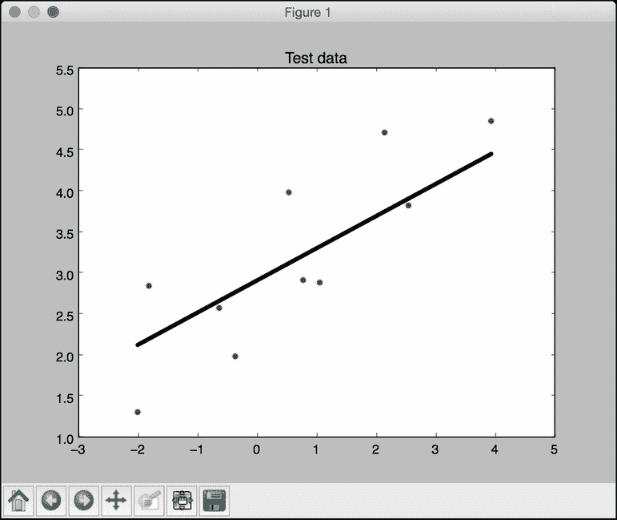
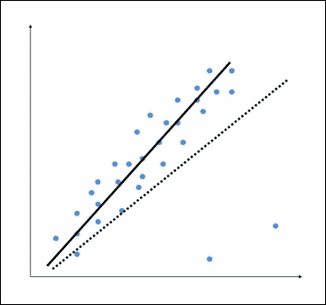
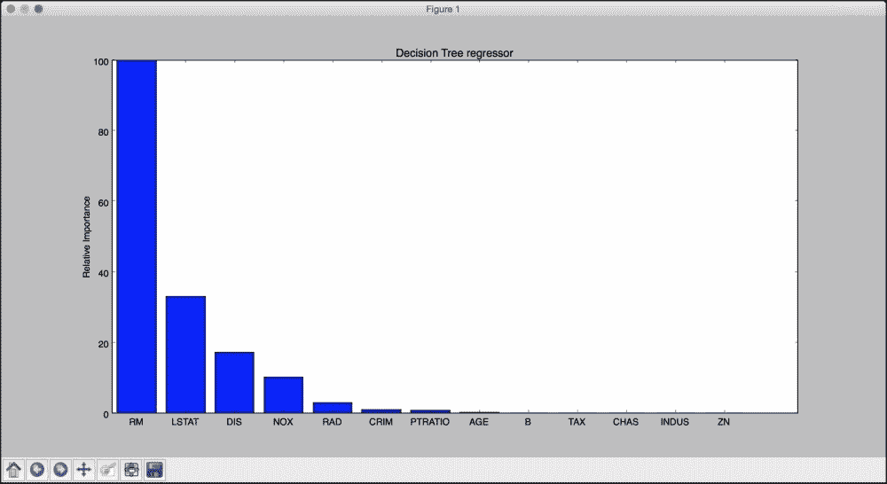
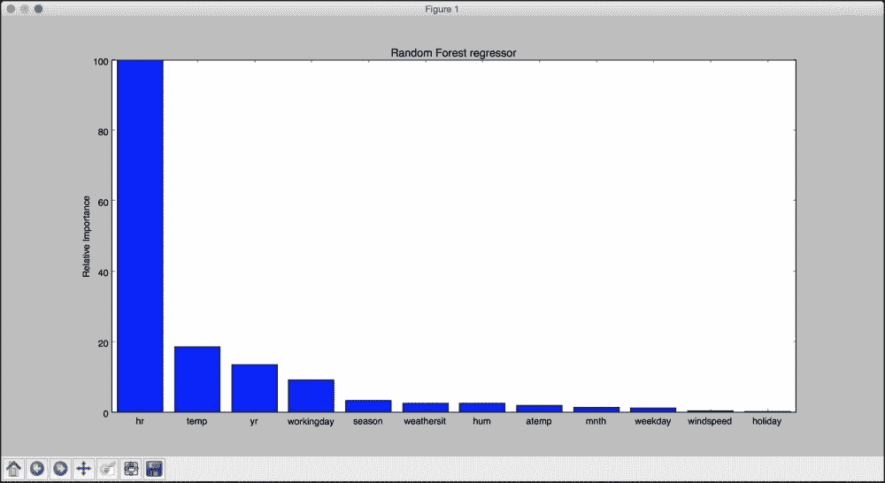

# 一、监督学习的领域

在本章中，我们将介绍以下食谱:

*   使用不同技术预处理数据
*   标签编码
*   构建线性回归器
*   计算回归精度
*   实现模型持久性
*   建立山脊回归器
*   构建多项式回归器
*   估计房价
*   计算特征的相对重要性
*   估计自行车需求分布

# 简介

如果你熟悉机器学习的基础知识，你一定会知道监督学习是关于什么的。给你一个快速复习，监督学习是指建立一个基于标记样本的机器学习模型。例如，如果我们构建一个系统，根据各种参数(如大小、地点等)来估计房子的价格，我们首先需要创建一个数据库并对其进行标记。我们需要告诉我们的算法什么参数对应什么价格。基于这些数据，我们的算法将学习如何使用输入参数计算房子的价格。

无监督学习与我们刚才讨论的相反。这里没有可用的标记数据。让我们假设我们有一堆数据点，我们只是想把它们分成多个组。我们不知道分离的标准是什么。因此，无监督学习算法将尝试以最佳方式将给定数据集分成固定数量的组。我们将在接下来的章节中讨论无监督学习。

在本书的过程中，我们会使用各种 Python 包，如**【NumPy】****SciPy****scikit-learn****matplotlib**来构建各种东西。如果你使用 Windows，建议使用 SciPy-stack 兼容版本的 Python。您可以在[http://www.scipy.org/install.html](http://www.scipy.org/install.html)查看兼容版本列表。这些发行版已经安装了所有必要的软件包。如果你用的是 Mac OS X 或者 Ubuntu，安装这些软件包相当简单。以下是一些有用的安装和文档链接:

*   num py:[http://docs . scipy . org/doc/num py-1 . 10 . 1/user/install . html](http://docs.scipy.org/doc/numpy-1.10.1/user/install.html)
*   **SciPy**:[http://www.scipy.org/install.html](http://www.scipy.org/install.html)
*   **sci kit-学习**:[http://scikit-learn.org/stable/install.html](http://scikit-learn.org/stable/install.html)
*   **matplotlib**:[http://matplotlib.org/1.4.2/users/installing.html](http://matplotlib.org/1.4.2/users/installing.html)

在继续之前，请确保您的计算机上安装了这些软件包。

# 使用不同技术预处理数据

在现实世界中，我们通常要处理大量的原始数据。这些原始数据不容易被机器学习算法吸收。为了给机器学习准备数据，我们必须在将其输入各种算法之前对其进行预处理。

## 做好准备

让我们看看如何用 Python 对数据进行预处理。首先，在您喜欢的文本编辑器中打开一个扩展名为`.py`的文件，例如`preprocessor.py`。向该文件添加以下行:

```py
import numpy as np
from sklearn import preprocessing
```

我们刚刚进口了几个必要的包裹。让我们创建一些示例数据。向该文件添加以下行:

```py
data = np.array([[3, -1.5,  2, -5.4], [0,  4,  -0.3, 2.1], [1,  3.3, -1.9, -4.3]])
```

我们现在准备对这些数据进行操作。

## 怎么做…

数据可以通过多种方式进行预处理。我们将讨论一些最常用的预处理技术。

### 平均去除量

从每个特征中去除平均值，使其以零为中心，通常是有益的。这有助于我们消除特征中的任何偏差。向我们之前打开的文件中添加以下行:

```py
data_standardized = preprocessing.scale(data)
print "\nMean =", data_standardized.mean(axis=0)
print "Std deviation =", data_standardized.std(axis=0)
```

我们现在准备运行代码。为此，请在您的终端上运行以下命令:

```py
$ python preprocessor.py

```

您将在终端上看到以下输出:

```py
Mean = [  5.55111512e-17  -1.11022302e-16  -7.40148683e-17  -7.40148683e-17]
Std deviation = [ 1\.  1\.  1\.  1.]

```

可以看到均值几乎为`0`，标准差为`1`。

### 缩放

数据点中每个特征的值可以在随机值之间变化。所以，有时候扩大规模是很重要的，这样才能成为一个公平的竞争环境。向文件中添加以下行并运行代码:

```py
data_scaler = preprocessing.MinMaxScaler(feature_range=(0, 1))
data_scaled = data_scaler.fit_transform(data)
print "\nMin max scaled data =", data_scaled
```

缩放后，所有要素值的范围都在指定值之间。将显示输出，如下所示:

```py
Min max scaled data: 
[[ 1\.          0\.          1\.          0\.        ]
 [ 0\.          1\.          0.41025641  1\.        ]
 [ 0.33333333  0.87272727  0\.          0.14666667]]

```

### 正常化

数据当你想调整特征向量中的值，以便它们可以在一个共同的尺度上测量时，使用归一化。机器学习中最常见的标准化形式之一是调整特征向量的值，使它们的总和为 1。在前一个文件中添加以下行:

```py
data_normalized = preprocessing.normalize(data, norm='l1')
print "\nL1 normalized data =", data_normalized
```

如果运行 Python 文件，您将获得以下输出:

```py
L1 normalized data: 
[[ 0.25210084 -0.12605042  0.16806723 -0.45378151]
 [ 0\.          0.625      -0.046875    0.328125  ]
 [ 0.0952381   0.31428571 -0.18095238 -0.40952381]]

```

这被大量使用，以确保数据点不会因为其特性的基本性质而被人为提升。

### 二值化

二值化是当你想把你的数字特征向量转换成布尔向量时使用的。向 Python 文件中添加以下行:

```py
data_binarized = preprocessing.Binarizer(threshold=1.4).transform(data)
print "\nBinarized data =", data_binarized
```

再次运行代码，您将看到以下输出:

```py
Binarized data:
[[ 1\.  0\.  1\.  0.]
 [ 0\.  1\.  0\.  1.]
 [ 0\.  1\.  0\.  0.]]

```

这是一种非常有用的技术，通常在我们对数据有一些先验知识时使用。

### 一个热编码

很多时候我们处理的数值都是稀疏的，分散在各处。我们并不真的需要储存这些大的价值。这就是一个热编码进入画面的地方。我们可以把 One Hot Encoding 看作是*收紧*特征向量的工具。它查看每个特性，并确定不同值的总数。它使用“T3”k 之一“T4”方案对值进行编码。基于此对特征向量中的每个特征进行编码。这有助于我们在空间方面更有效率。例如，假设我们正在处理 4 维特征向量。要对特征向量中的第 *n* 个特征进行编码，编码器将遍历每个特征向量中的第 *n* 个特征，并计算不同值的数量。如果不同值的数量为 *k* ，则将特征转换为 *k* 维向量，其中只有一个值为 *1* ，所有其他值为 *0* 。向 Python 文件中添加以下行:

```py
encoder = preprocessing.OneHotEncoder()
encoder.fit([[0, 2, 1, 12], [1, 3, 5, 3], [2, 3, 2, 12], [1, 2, 4, 3]])
encoded_vector = encoder.transform([[2, 3, 5, 3]]).toarray()
print "\nEncoded vector =", encoded_vector
```

这是的预期输出:

```py
Encoded vector:
[[ 0\.  0\.  1\.  0\.  1\.  0\.  0\.  0\.  1\.  1\.  0.]]

```

在上面的例子中，让我们考虑每个特征向量中的第三个特征。数值为`1`、`5`、`2`和`4`。这里有四个不同的值，这意味着单热编码向量的长度为 4。如果要对值`5`进行编码，它将是一个向量`[0, 1, 0, 0]`。这个向量中只有一个值可以是 *1* 。第二个元素为 1，表示数值为`5`。

# 标签编码

在有监督的学习中，我们通常会处理各种各样的标签。这些可以是数字或单词的形式。如果它们是数字，那么算法可以直接使用它们。然而，很多时候，标签需要是人类可读的形式。所以，人们通常用文字来标注训练数据。标签编码是指将单词标签转换成数字形式，以便算法能够理解如何对它们进行操作。让我们看看如何做到这一点。

## 怎么做…

1.  新建一个 Python 文件，导入预处理包:

    ```py
    from sklearn import preprocessing
    ```

2.  这个包包含数据预处理所需的各种功能。让我们定义标签编码器，如下所示:

    ```py
    label_encoder = preprocessing.LabelEncoder()
    ```

3.  `label_encoder`对象知道如何理解单词标签。让我们创建一些标签:

    ```py
    input_classes = ['audi', 'ford', 'audi', 'toyota', 'ford', 'bmw']
    ```

4.  我们现在准备对这些标签进行编码:

    ```py
    label_encoder.fit(input_classes)
    print "\nClass mapping:"
    for i, item in enumerate(label_encoder.classes_):
        print item, '-->', i
    ```

5.  运行代码，您将在终端上看到以下输出:

    ```py
    Class mapping:
    audi --> 0
    bmw --> 1
    ford --> 2
    toyota --> 3

    ```

6.  As shown in the preceding output, the words have been transformed into 0-indexed numbers. Now, when you encounter a set of labels, you can simply transform them, as follows:

    ```py
    labels = ['toyota', 'ford', 'audi']
    encoded_labels = label_encoder.transform(labels)
    print "\nLabels =", labels 
    print "Encoded labels =", list(encoded_labels)
    ```

    以下是您将在终端上看到的输出:

    ```py
    Labels = ['toyota', 'ford', 'audi']
    Encoded labels = [3, 2, 0]

    ```

7.  This is way easier than manually maintaining mapping between words and numbers. You can check the correctness by transforming numbers back to word labels:

    ```py
    encoded_labels = [2, 1, 0, 3, 1]
    decoded_labels = label_encoder.inverse_transform(encoded_labels)
    print "\nEncoded labels =", encoded_labels
    print "Decoded labels =", list(decoded_labels)
    ```

    以下是输出:

    ```py
    Encoded labels = [2, 1, 0, 3, 1]
    Decoded labels = ['ford', 'bmw', 'audi', 'toyota', 'bmw']

    ```

    如您所见，映射得到了完美的保留。

# 建立线性回归器

回归是估计输入数据和连续值输出数据之间关系的过程。这些数据通常是实数的形式，我们的目标是估计控制从输入到输出的映射的基础函数。让我们从一个非常简单的例子开始。考虑以下输入和输出之间的映射:

1 --> 2

3 --> 6

4.3 --> 8.6

7.1 --> 14.2

如果我要求您估计输入和输出之间的关系，您可以通过分析模式轻松做到这一点。我们可以看到，在每种情况下，输出都是输入值的两倍，因此变换如下:

*f(x) = 2x*

这是一个简单的函数，将输入值与输出值联系起来。然而，在现实世界中，情况通常并非如此。现实世界中的函数没那么简单！

## 做好准备

线性回归是指使用输入变量的线性组合来估计基础函数。前面的例子是一个由一个输入变量和一个输出变量组成的例子。

请考虑下图:


线性回归的目标是提取将输入变量与输出变量联系起来的基本线性模型。这旨在使用线性函数最小化实际输出和预测输出之间的差异平方和。这个方法叫做 **普通最小二乘**。

你可能会说可能有一条曲线更适合这些点，但线性回归不允许这样。线性回归的主要优点是它不复杂。如果你进入非线性回归，你可能会得到更精确的模型，但它们会更慢。如上图所示，模型试图用一条直线来近似输入数据点。让我们看看如何用 Python 构建线性回归模型。

## 怎么做…

已经为您提供了一个名为`data_singlevar.txt`的数据文件。这包含逗号分隔的行，其中第一个元素是输入值，第二个元素是对应于该输入值的输出值。您应该使用它作为输入参数:

1.  Create a file called `regressor.py`, and add the following lines:

    ```py
    import sys
    import numpy as np
    filename = sys.argv[1]
    X = []
    y = []
    with open(filename, 'r') as f:
        for line in f.readlines():
            xt, yt = [float(i) for i in line.split(',')]
            X.append(xt)
            y.append(yt)
    ```

    我们只是将输入数据加载到`X`和`y`中，其中`X`指的是数据，`y`指的是标签。在前面代码的循环中，我们解析每一行，并根据逗号运算符对其进行拆分。然后我们将其转换为浮点值，并分别保存在`X`和`y`中。

2.  When we build a machine learning model, we need a way to validate our model and check whether the model is performing at a satisfactory level. To do this, we need to separate our data into two groups: a training dataset and a testing dataset. The training dataset will be used to build the model, and the testing dataset will be used to see how this trained model performs on unknown data. So, let's go ahead and split this data into training and testing datasets:

    ```py
    num_training = int(0.8 * len(X))
    num_test = len(X) - num_training

    # Training data
    X_train = np.array(X[:num_training]).reshape((num_training,1))
    y_train = np.array(y[:num_training])

    # Test data
    X_test = np.array(X[num_training:]).reshape((num_test,1))
    y_test = np.array(y[num_training:])
    ```

    这里，我们将 80%的数据用于训练数据集，剩余的 20%用于测试数据集。

3.  我们现在准备训练模型。让我们创建一个回归对象，如下所示:

    ```py
    from sklearn import linear_model

    # Create linear regression object
    linear_regressor = linear_model.LinearRegression()

    # Train the model using the training sets
    linear_regressor.fit(X_train, y_train)
    ```

4.  我们刚刚根据训练数据训练了线性回归器。拟合方法获取输入数据并训练模型。让我们看看它是如何配合的:

    ```py
    import matplotlib.pyplot as plt

    y_train_pred = linear_regressor.predict(X_train)
    plt.figure()
    plt.scatter(X_train, y_train, color='green')
    plt.plot(X_train, y_train_pred, color='black', linewidth=4)
    plt.title('Training data')
    plt.show()
    ```

5.  We are now ready to run the code using the following command:

    ```py
    $ python regressor.py data_singlevar.txt

    ```

    您应该会看到下图:

    

6.  在前面的代码中，我们使用训练好的模型来预测训练数据的输出。这不会告诉我们模型在未知数据上的表现，因为我们是在训练数据本身上运行它。这只是让我们对模型如何适应训练数据有了一个概念。就像你在上图中看到的那样，看起来一切正常！
7.  Let's predict the test dataset output based on this model and plot it, as follows:

    ```py
    y_test_pred = linear_regressor.predict(X_test)

    plt.scatter(X_test, y_test, color='green')
    plt.plot(X_test, y_test_pred, color='black', linewidth=4)
    plt.title('Test data')
    plt.show()
    ```

    如果运行这段代码，您将看到如下图:

    

# 计算回归精度

现在我们知道如何构建回归器，了解如何评估回归器的质量也很重要。在这种情况下，误差被定义为实际值和回归预测值之间的差值。

## 做好准备

让我们快速了解什么度量可以用来衡量回归器的质量。可以使用许多不同的指标来评估回归器，例如:

*   **平均绝对误差**:这个是给定数据集中所有数据点绝对误差的平均值。
*   **均方误差**:这个是给定数据集中所有数据点误差平方的平均值。这是目前最流行的衡量标准之一！
*   **中值绝对误差**:这个是给定数据集中所有误差的中值。这种度量的主要优点是它对异常值具有鲁棒性。与平均误差度量相反，测试数据集中的一个坏点不会扭曲整个误差度量。
*   **解释方差得分**:这个得分衡量了我们的模型能够在多大程度上解释数据集的变化。得分 1.0 表示我们的模型是完美的。
*   **R2 评分**:这个发音为 R 平方，这个评分是指判定系数。这告诉我们，我们的模型能够很好地预测未知样本。最好的分数是 1.0，数值也可以是负数。

## 怎么做…

scikit-learn 中有一个模块，提供计算以下所有指标的功能。打开一个新的 Python 文件，并添加以下行:

```py
import sklearn.metrics as sm

print "Mean absolute error =", round(sm.mean_absolute_error(y_test, y_test_pred), 2) 
print "Mean squared error =", round(sm.mean_squared_error(y_test, y_test_pred), 2) 
print "Median absolute error =", round(sm.median_absolute_error(y_test, y_test_pred), 2) 
print "Explained variance score =", round(sm.explained_variance_score(y_test, y_test_pred), 2) 
print "R2 score =", round(sm.r2_score(y_test, y_test_pred), 2)
```

跟踪每一个度量可能会变得乏味，所以我们选择一两个度量来评估我们的模型。一个好的做法是确保均方误差低，解释的方差得分高。

# 实现模型持久性

当我们训练一个模型的时候，如果能把它保存为文件，这样以后只需要重新加载就可以使用，那就太好了。

## 怎么做…

让我们看看如何通过编程实现模型持久性:

1.  在`regressor.py`中增加以下几行:

    ```py
    import cPickle as pickle

    output_model_file = 'saved_model.pkl'
    with open(output_model_file, 'w') as f:
        pickle.dump(linear_regressor, f)
    ```

2.  回归器对象将保存在`saved_model.pkl`文件中。我们来看看如何加载和使用，如下所示:

    ```py
    with open(output_model_file, 'r') as f:
        model_linregr = pickle.load(f)

    y_test_pred_new = model_linregr.predict(X_test)
    print "\nNew mean absolute error =", round(sm.mean_absolute_error(y_test, y_test_pred_new), 2)
    ```

3.  这里，我们只是将文件中的回归器加载到`model_linregr`变量中。您可以将前面的结果与前面的结果进行比较，以确认它是相同的。

# 建立一个山脊回归器

线性回归的主要问题之一是对异常值敏感。在现实世界的数据收集过程中，错误地测量输出是很常见的。线性回归使用普通的最小二乘法，该方法试图最小化误差的平方。异常值往往会导致问题，因为它们对总体误差贡献很大。这往往会破坏整个模型。

## 做好准备

让我们考虑下图:


底部的两个点显然是异常值，但这个模型试图拟合所有的点。因此，整体模型往往不准确。通过目测，我们可以看到下图是一个比较好的模型:



普通的最小二乘法在建立模型时考虑每一个数据点。因此，实际模型看起来像上图中的虚线。我们可以清楚地看到，这种模式是次优的。为了避免这种情况，我们使用**正则化** 对系数的大小进行惩罚。这个方法叫做T5【岭回归】T6。

## 怎么做…

让我们看看如何在 Python 中构建一个岭回归器:

1.  可以从`data_multi_variable.txt`文件加载数据。该文件每行包含多个值。除最后一个值之外的所有值构成输入特征向量。
2.  在`regressor.py`处增加以下几行。让我们用一些参数初始化一个岭回归器:

    ```py
    ridge_regressor = linear_model.Ridge(alpha=0.01, fit_intercept=True, max_iter=10000)
    ```

3.  `alpha`参数控制复杂度。随着`alpha`越来越接近`0`，岭回归器越来越像普通最小二乘法的线性回归器。所以，如果你想让它对异常值有鲁棒性，你需要给`alpha`分配一个更高的值。我们考虑了`0.01`的一个数值，这个数值是适中的。
4.  让我们训练这个回归器，如下:

    ```py
    ridge_regressor.fit(X_train, y_train)
    y_test_pred_ridge = ridge_regressor.predict(X_test)
    print "Mean absolute error =", round(sm.mean_absolute_error(y_test, y_test_pred_ridge), 2) 
    print "Mean squared error =", round(sm.mean_squared_error(y_test, y_test_pred_ridge), 2) 
    print "Median absolute error =", round(sm.median_absolute_error(y_test, y_test_pred_ridge), 2) 
    print "Explain variance score =", round(sm.explained_variance_score(y_test, y_test_pred_ridge), 2) 
    print "R2 score =", round(sm.r2_score(y_test, y_test_pred_ridge), 2)
    ```

运行此代码查看错误度量。您可以构建一个线性回归器来比较和对比相同数据的结果，以查看在模型中引入正则化的效果。

# 构建多项式回归器

线性回归模型的主要限制之一是它试图将线性函数拟合到输入数据。多项式回归模型通过允许函数为多项式克服了这个问题，从而提高了模型的精度。

## 做好准备

让我们考虑下图:


我们可以看到数据点的模式有一条自然曲线。这个线性模型无法捕捉到这一点。让我们看看多项式模型会是什么样子:


虚线代表线性回归模型，实线代表多项式回归模型。该模型的曲线性由多项式的次数控制。随着模型曲线的增加，它变得更加精确。然而，曲线性也增加了模型的复杂性，因此，使其更慢。这是一种权衡，在这种情况下，你必须在给定计算约束的情况下，决定模型的精确度。

## 怎么做…

1.  在`regressor.py`中增加以下几行:

    ```py
    from sklearn.preprocessing import PolynomialFeatures

    polynomial = PolynomialFeatures(degree=3)
    ```

2.  We initialized a polynomial of the degree `3` in the previous line. Now we have to represent the datapoints in terms of the coefficients of the polynomial:

    ```py
    X_train_transformed = polynomial.fit_transform(X_train)

    ```

    这里，`X_train_transformed`以多项式形式表示相同的输入。

3.  Let's consider the first datapoint in our file and check whether it can predict the right output:

    ```py
    datapoint = [0.39,2.78,7.11]
    poly_datapoint = polynomial.fit_transform(datapoint)

    poly_linear_model = linear_model.LinearRegression()
    poly_linear_model.fit(X_train_transformed, y_train)
    print "\nLinear regression:", linear_regressor.predict(datapoint)[0]
    print "\nPolynomial regression:", poly_linear_model.predict(poly_datapoint)[0]
    ```

    变量数据点中的值是输入数据文件第一行中的值。我们仍然在这里拟合线性回归模型。唯一的区别是我们表示数据的方式。如果运行此代码，您将看到以下输出:

    ```py
    Linear regression: -11.0587294983
    Polynomial regression: -10.9480782122

    ```

    可以看到，这已经接近输出值了。如果我们想让它更接近，我们需要增加多项式的次数。

4.  Let's make it `10` and see what happens:

    ```py
    polynomial = PolynomialFeatures(degree=10)
    ```

    您应该会看到如下内容:

    ```py
    Polynomial regression: -8.20472183853

    ```

现在，你可以看到预测值更接近实际输出值。

# 估算房价

是时候将我们的知识应用于现实世界的问题了。让我们运用所有这些原则来估计房价。这是用来理解回归的最流行的例子之一，它是一个很好的切入点。这是直观的和相关的，因此在我们进行更复杂的机器学习之前更容易理解概念。我们将使用 **决策树回归器**和 **AdaBoost** 来解决这个问题。

## 做好准备

决策树是一种树，其中每个节点都做出有助于最终输出的简单决策。叶节点代表输出值，分支代表基于输入特征做出的中间决策。AdaBoost 代表自适应升压，这是一种用于提高另一个系统结果准确性的技术。这结合了不同版本算法的输出，称为 **【弱学习者】**，使用加权求和得到最终输出。在 AdaBoost 算法的每个阶段收集的信息被反馈到系统中，以便后期的学习者专注于难以分类的训练样本。这是提高系统精度的方法。

使用 AdaBoost，我们在数据集上拟合了一个回归器。我们计算误差，然后根据这个误差估计值在同一数据集上再次拟合回归。我们可以认为这是对回归器的微调，直到达到所需的精度。给你一个数据集，其中包含影响房价的各种参数。我们的目标是估计这些参数和房价之间的关系，以便在给定未知输入参数的情况下，我们可以用它来估计价格。

## 怎么做…

1.  创建一个名为`housing.py`的新文件，并添加以下行:

    ```py
    import numpy as np
    from sklearn.tree import DecisionTreeRegressor
    from sklearn.ensemble import AdaBoostRegressor
    from sklearn import datasets
    from sklearn.metrics import mean_squared_error, explained_variance_score
    from sklearn.utils import shuffle
    import matplotlib.pyplot as plt
    ```

2.  There is a standard housing dataset that people tend to use to get started with machine learning. You can download it at [https://archive.ics.uci.edu/ml/datasets/Housing](https://archive.ics.uci.edu/ml/datasets/Housing). The good thing is that scikit-learn provides a function to directly load this dataset:

    ```py
    housing_data = datasets.load_boston() 
    ```

    每个数据点有 13 个影响房价的输入参数。您可以使用`housing_data.data`访问输入数据，使用`housing_data.target`访问相应的价格。

3.  让我们把它分成输入和输出。为了使其独立于数据的顺序，让我们也对其进行洗牌:

    ```py
    X, y = shuffle(housing_data.data, housing_data.target, random_state=7)
    ```

4.  `random_state`参数控制我们如何打乱数据，以便我们可以获得可再现的结果。让我们把数据分为训练和测试。我们将分配 80%用于培训，20%用于测试:

    ```py
    num_training = int(0.8 * len(X))
    X_train, y_train = X[:num_training], y[:num_training]
    X_test, y_test = X[num_training:], y[num_training:]
    ```

5.  我们现在准备好拟合决策树回归模型。让我们选择一棵最大深度为`4`的树，这意味着我们没有让树变得任意深:

    ```py
    dt_regressor = DecisionTreeRegressor(max_depth=4)
    dt_regressor.fit(X_train, y_train)
    ```

6.  Let's also fit decision tree regression model with AdaBoost:

    ```py
    ab_regressor = AdaBoostRegressor(DecisionTreeRegressor(max_depth=4), n_estimators=400, random_state=7)
    ab_regressor.fit(X_train, y_train)
    ```

    这将有助于我们比较结果，并了解 AdaBoost 如何真正提高决策树回归器的性能。

7.  让我们评估决策树回归器的性能:

    ```py
    y_pred_dt = dt_regressor.predict(X_test)
    mse = mean_squared_error(y_test, y_pred_dt)
    evs = explained_variance_score(y_test, y_pred_dt) 
    print "\n#### Decision Tree performance ####"
    print "Mean squared error =", round(mse, 2)
    print "Explained variance score =", round(evs, 2)
    ```

8.  现在，我们来评估一下 AdaBoost 的性能:

    ```py
    y_pred_ab = ab_regressor.predict(X_test)
    mse = mean_squared_error(y_test, y_pred_ab)
    evs = explained_variance_score(y_test, y_pred_ab) 
    print "\n#### AdaBoost performance ####"
    print "Mean squared error =", round(mse, 2)
    print "Explained variance score =", round(evs, 2)
    ```

这是终端上的输出:

```py
#### Decision Tree performance ####
Mean squared error = 14.79
Explained variance score = 0.82

#### AdaBoost performance ####
Mean squared error = 7.54
Explained variance score = 0.91

```

如前面的输出所示，当我们使用 AdaBoost 时，误差更低，方差得分更接近 1。

# 计算特征的相对重要性

所有的特征都同样重要吗？在本例中，我们使用了 13 个输入特征，它们都对模型做出了贡献。然而，这里的一个重要问题是，“我们如何知道哪些功能更重要？”显然，所有特性对输出的贡献并不相等。万一我们想以后丢弃其中的一些，我们需要知道哪些特性不太重要。我们在 scikit-learn 中提供了此功能。

## 怎么做…

1.  Let's plot the relative importance of the features. Add the following lines to `housing.py`:

    ```py
    plot_feature_importances(dt_regressor.feature_importances_, 
            'Decision Tree regressor', housing_data.feature_names)
    plot_feature_importances(ab_regressor.feature_importances_, 
            'AdaBoost regressor', housing_data.feature_names)
    ```

    回归器对象有一个可调用的`feature_importances_`方法，它给出了每个特征的相对重要性。

2.  我们实际上需要定义我们的`plot_feature_` `importances`函数来绘制条形图:

    ```py
    def plot_feature_importances(feature_importances, title, feature_names):
        # Normalize the importance values 
        feature_importances = 100.0 * (feature_importances / max(feature_importances))

        # Sort the index values and flip them so that they are arranged in decreasing order of importance
        index_sorted = np.flipud(np.argsort(feature_importances))

        # Center the location of the labels on the X-axis (for display purposes only)
        pos = np.arange(index_sorted.shape[0]) + 0.5

        # Plot the bar graph
        plt.figure()
        plt.bar(pos, feature_importances[index_sorted], align='center')
        plt.xticks(pos, feature_names[index_sorted])
        plt.ylabel('Relative Importance')
        plt.title(title)
        plt.show()
    ```

3.  We just take the values from the `feature_importances_` method and scale it so that it ranges between 0 and 100\. If you run the preceding code, you will see two figures. Let's see what we will get for a decision tree-based regressor in the following figure:

    

4.  So, the decision tree regressor says that the most important feature is RM. Let's take a look at what AdaBoost has to say in the following figure:

    

根据 AdaBoost，最重要的特性是 LSTAT。实际上，如果您在这些数据上构建各种回归，您会看到最重要的特性实际上是 LSTAT。这显示了使用 AdaBoost 和基于决策树的回归器的优势。

# 估算自行车需求分布

我们用一个不同的回归方法来解决自行车需求分配问题。我们将使用 **随机森林回归器**来估计输出值。随机森林是决策树的集合。这基本上使用了一组决策树，这些决策树是使用数据集的各种子集构建的，然后它使用平均来提高整体性能。

## 做好准备

我们将使用提供给您的`bike_day.csv`文件。这也可以在[https://archive . ics . UCI . edu/ml/datasets/Bike+Sharing+Dataset](https://archive.ics.uci.edu/ml/datasets/Bike+Sharing+Dataset)找到。此数据集中有 16 列。前两列对应于序列号和实际日期，因此我们不会在分析中使用它们。最后三列对应不同类型的输出。最后一列只是第十四列和第十五列的值的总和，所以我们在构建模型时可以忽略这两列。

## 怎么做…

让我们继续，看看如何在 Python 中做到这一点。已经向您提供了一个名为`bike_sharing.py`的文件，其中包含完整的代码。我们将讨论其中的重要部分，如下所示:

1.  我们首先需要导入几个新包，如下所示:

    ```py
    import csv
    from sklearn.ensemble import RandomForestRegressor
    from housing import plot_feature_importances
    ```

2.  We are processing a CSV file, so the CSV package is useful in handling these files. As it's a new dataset, we will have to define our own dataset loading function:

    ```py
    def load_dataset(filename):
        file_reader = csv.reader(open(filename, 'rb'), delimiter=',')
        X, y = [], []
        for row in file_reader:
            X.append(row[2:13])
            y.append(row[-1])

        # Extract feature names
        feature_names = np.array(X[0])

        # Remove the first row because they are feature names
        return np.array(X[1:]).astype(np.float32), np.array(y[1:]).astype(np.float32), feature_names
    ```

    在这个函数中，我们只是从 CSV 文件中读取所有数据。当我们将其显示在图形上时，特征名称非常有用。我们从输出值中分离数据并返回它们。

3.  让我们读取数据并将其打乱，使其独立于数据在文件中的排列顺序:

    ```py
    X, y, feature_names = load_dataset(sys.argv[1])
    X, y = shuffle(X, y, random_state=7)  
    ```

4.  正如我们之前所做的，我们需要将数据分为培训和测试。这次我们用 90%的数据进行训练，剩下的 10%进行测试:

    ```py
    num_training = int(0.9 * len(X))
    X_train, y_train = X[:num_training], y[:num_training]
    X_test, y_test = X[num_training:], y[num_training:]
    ```

5.  Let's go ahead and train the regressor:

    ```py
    rf_regressor = RandomForestRegressor(n_estimators=1000, max_depth=10, min_samples_split=1)
    rf_regressor.fit(X_train, y_train)
    ```

    这里，`n_estimators`指的是估计量的数量，也就是我们要在我们的随机森林中使用的决策树的数量。`max_depth`参数是指每棵树的最大深度，`min_samples_split`参数是指拆分树中一个节点所需的数据样本数量。

6.  我们来评估一下随机森林回归器的性能:

    ```py
    y_pred = rf_regressor.predict(X_test)
    mse = mean_squared_error(y_test, y_pred)
    evs = explained_variance_score(y_test, y_pred) 
    print "\n#### Random Forest regressor performance ####"
    print "Mean squared error =", round(mse, 2)
    print "Explained variance score =", round(evs, 2)
    ```

7.  As we already have the function to plot the `importances` feature, let's just call it directly:

    ```py
    plot_feature_importances(rf_regressor.feature_importances_, 'Random Forest regressor', feature_names)
    ```

    运行此代码后，您将看到以下图表:

    

看来温度是控制自行车租赁最重要的因素。

## 还有更多…

让我们看看当您在数据集中包括第十四列和第十五列时会发生什么。在特征重要性图中，除这两个特征之外的每个特征都必须为零。原因是输出可以通过简单地对第十四列和第十五列求和来获得，因此该算法不需要任何其他特征来计算输出。在`load_dataset`功能中，在 for 循环中进行以下更改:

```py
X.append(row[2:15])
```

如果现在绘制要素重要性图，您将看到以下内容:


不出所料，它说只有这两个特性是重要的。这在直觉上是有意义的，因为最终输出是这两个特性的简单总和。所以，这两个变量和产值有直接的关系。因此，回归者说它不需要任何其他变量来预测输出。这是一个非常有用的工具，可以消除数据集中的冗余变量。

还有一个名为`bike_hour.csv`的文件，其中包含了每小时如何共享自行车的数据。我们需要考虑第 3 列到第 14 列，所以让我们在`load_dataset`函数中进行这个更改:

```py
X.append(row[2:14])
```

如果你运行这个，你会看到回归器的性能显示，如下所示:

```py
#### Random Forest regressor performance ####
Mean squared error = 2619.87
Explained variance score = 0.92

```

特征重要性图如下所示:



这说明一天中的小时是最重要的特征，仔细想想，直觉上说得通！下一个重要特征是温度，这与我们之前的分析一致。