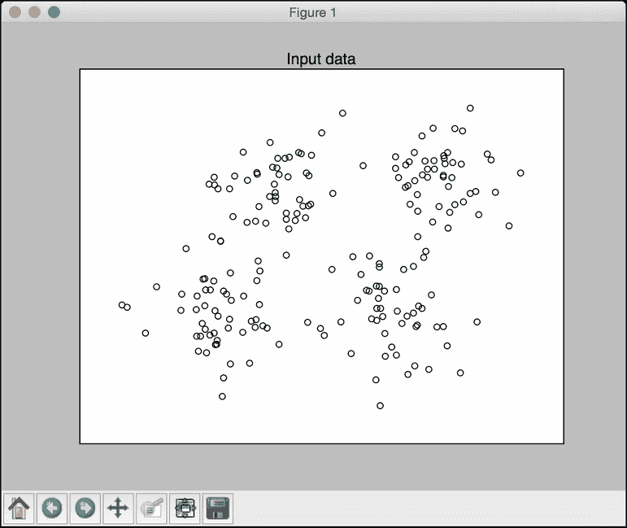
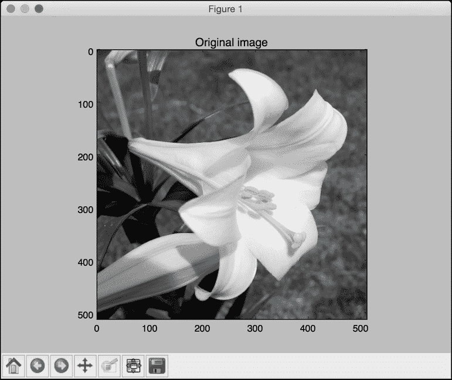
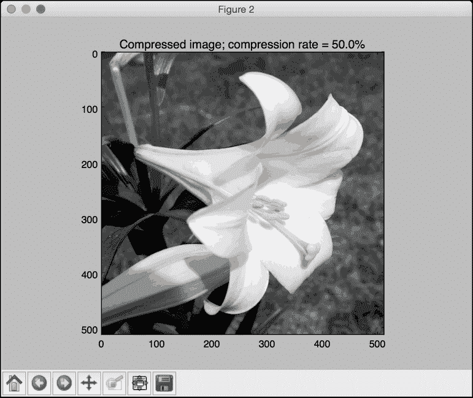
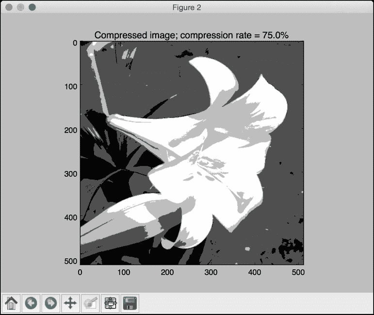
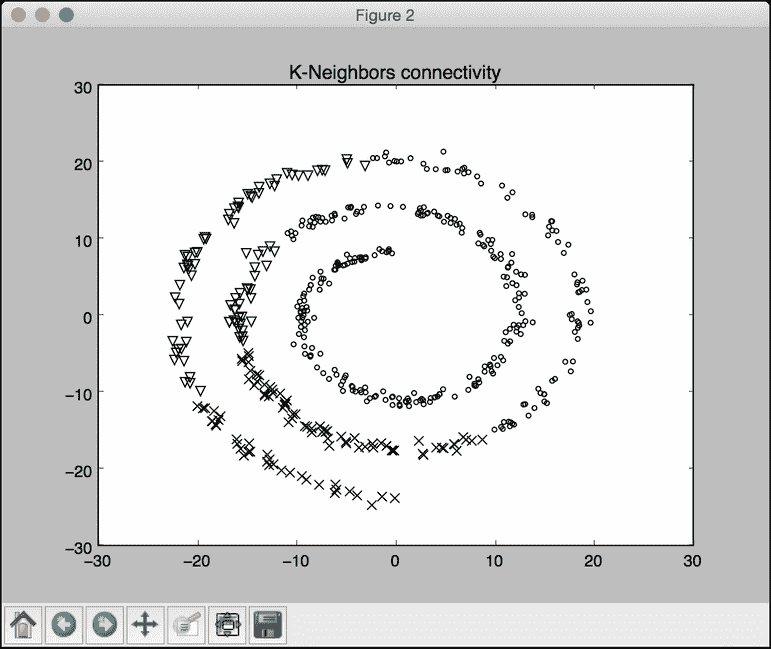
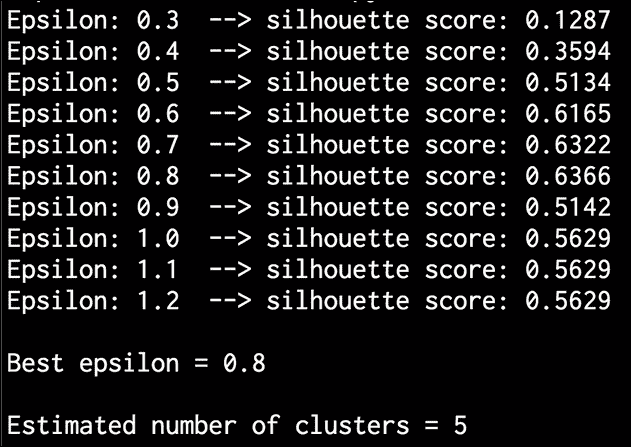
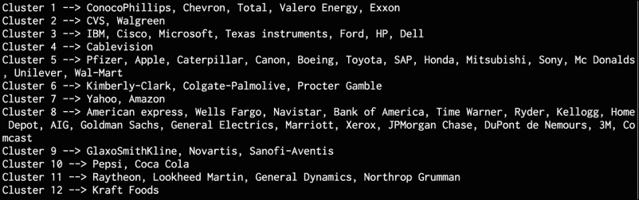

# 四、无监督学习聚类

在本章中，我们将介绍以下食谱:

*   使用 k-均值算法对数据进行聚类
*   使用矢量量化压缩图像
*   建立均值漂移聚类模型
*   使用聚集聚类对数据进行分组
*   评估聚类算法的性能
*   使用 DBSCAN 算法自动估计集群数量
*   在股票市场数据中寻找模式
*   构建客户细分模型

# 简介

**无监督学习**是机器学习中的一种范式，在这种范式中，我们不依赖于有标签的训练数据来构建模型。在此之前，我们处理以某种方式标记的数据。这意味着学习算法可以查看这些数据，并学会根据标签对它们进行分类。在无监督学习的世界里，我们没有这种奢侈！当我们想要使用一些相似性度量在数据集中寻找子组时，使用这些算法。

最常见的方法之一是**聚类**。你一定听说过这个词经常被使用。我们主要使用它进行数据分析，我们希望在数据中找到聚类。这些聚类通常是使用某种相似性度量(如欧氏距离)找到的。无监督学习广泛应用于数据挖掘、医学影像、股市分析、计算机视觉、市场细分等领域。

# 使用 k-means 算法对数据进行聚类

**k-means 算法**是最流行的聚类算法之一。该算法用于使用数据的各种属性将输入数据划分为 *k* 子组。分组是使用优化技术来实现的，其中我们试图最小化数据点和聚类的相应质心之间的距离的平方和。如果您需要快速复习，您可以在[http://www.onmyphd.com/?p=k-means.clustering&CK entry = 1](http://www.onmyphd.com/?p=k-means.clustering&ckattempt=1)了解更多 k-means。

## 怎么做…

1.  该配方的完整代码在已经提供给您的`kmeans.py`文件中给出。让我们看看它是如何建造的。新建一个 Python 文件，导入以下包:

    ```py
    import numpy as np
    import matplotlib.pyplot as plt
    from sklearn import metrics
    from sklearn.cluster import KMeans

    import utilities
    ```

2.  让我们加载输入数据并定义集群的数量。我们将使用已经提供给您的`data_multivar.txt`文件:

    ```py
    data = utilities.load_data('data_multivar.txt')
    num_clusters = 4
    ```

3.  We need to see what the input data looks like. Let's go ahead and add the following lines of the code to the Python file:

    ```py
    plt.figure()
    plt.scatter(data[:,0], data[:,1], marker='o', 
            facecolors='none', edgecolors='k', s=30)
    x_min, x_max = min(data[:, 0]) - 1, max(data[:, 0]) + 1
    y_min, y_max = min(data[:, 1]) - 1, max(data[:, 1]) + 1
    plt.title('Input data')
    plt.xlim(x_min, x_max)
    plt.ylim(y_min, y_max)
    plt.xticks(())
    plt.yticks(())
    ```

    如果运行这段代码，您将得到下图:

    

4.  我们现在准备训练模型。让我们初始化 k-means 对象并训练它:

    ```py
    kmeans = KMeans(init='k-means++', n_clusters=num_clusters, n_init=10)
    kmeans.fit(data)
    ```

5.  现在数据已经训练好了，我们需要可视化边界。让我们继续将以下代码行添加到 Python 文件中:

    ```py
    # Step size of the mesh
    step_size = 0.01

    # Plot the boundaries
    x_min, x_max = min(data[:, 0]) - 1, max(data[:, 0]) + 1
    y_min, y_max = min(data[:, 1]) - 1, max(data[:, 1]) + 1
    x_values, y_values = np.meshgrid(np.arange(x_min, x_max, step_size), np.arange(y_min, y_max, step_size))

    # Predict labels for all points in the mesh
    predicted_labels = kmeans.predict(np.c_[x_values.ravel(), y_values.ravel()])
    ```

6.  我们只是在一个点网格上评估了模型。让我们绘制这些结果来查看边界:

    ```py
    # Plot the results
    predicted_labels = predicted_labels.reshape(x_values.shape)
    plt.figure()
    plt.clf()
    plt.imshow(predicted_labels, interpolation='nearest',
               extent=(x_values.min(), x_values.max(), y_values.min(), y_values.max()),
               cmap=plt.cm.Paired,
               aspect='auto', origin='lower')

    plt.scatter(data[:,0], data[:,1], marker='o', 
            facecolors='none', edgecolors='k', s=30)
    ```

7.  Let's overlay the centroids on top of it:

    ```py
    centroids = kmeans.cluster_centers_
    plt.scatter(centroids[:,0], centroids[:,1], marker='o', s=200, linewidths=3,
            color='k', zorder=10, facecolors='black')
    x_min, x_max = min(data[:, 0]) - 1, max(data[:, 0]) + 1
    y_min, y_max = min(data[:, 1]) - 1, max(data[:, 1]) + 1
    plt.title('Centoids and boundaries obtained using KMeans')
    plt.xlim(x_min, x_max)
    plt.ylim(y_min, y_max)
    plt.xticks(())
    plt.yticks(())
    plt.show()
    ```

    如果运行这段代码，您应该会看到下图:

    

# 使用矢量量化压缩图像

k-means 聚类的主要应用之一是**矢量量化**。简单来说，矢量量化就是 *N* 维版本的“四舍五入”。当我们处理 1D 数据时，例如数字，我们使用舍入技术来减少存储该值所需的内存。例如，如果我们想要精确到小数点后第二位，我们只存储 23.73，而不是存储 23.73473572。或者，如果我们不在乎小数位数，我们可以只存储 24 位。这取决于我们的需求和我们愿意做出的权衡。

同样，当我们把这个概念扩展到 *N* 维数据时，就变成了矢量量化。当然还有更多的细微差别！你可以在[http://www.data-compression.com/vq.shtml](http://www.data-compression.com/vq.shtml)了解更多。矢量量化在图像压缩中被广泛使用，其中我们使用比原始图像更少的比特来存储每个像素，以实现压缩。

## 怎么做…

1.  这个食谱的完整代码已经在提供给你的文件中给出了。让我们看看它是如何建造的。我们将从导入所需的包开始。创建一个新的 Python 文件，并添加以下几行:

    ```py
    import argparse

    import numpy as np
    from scipy import misc 
    from sklearn import cluster
    import matplotlib.pyplot as plt
    ```

2.  让我们创建一个函数来解析输入参数。我们将能够传递图像和每个像素的位数作为输入参数:

    ```py
    def build_arg_parser():
        parser = argparse.ArgumentParser(description='Compress the input image \
                using clustering')
        parser.add_argument("--input-file", dest="input_file", required=True,
                help="Input image")
        parser.add_argument("--num-bits", dest="num_bits", required=False,
                type=int, help="Number of bits used to represent each pixel")
        return parser
    ```

3.  让我们创建一个函数来压缩输入图像:

    ```py
    def compress_image(img, num_clusters):
        # Convert input image into (num_samples, num_features) 
        # array to run kmeans clustering algorithm 
        X = img.reshape((-1, 1))  

        # Run kmeans on input data
        kmeans = cluster.KMeans(n_clusters=num_clusters, n_init=4, random_state=5)
        kmeans.fit(X)
        centroids = kmeans.cluster_centers_.squeeze()
        labels = kmeans.labels_

        # Assign each value to the nearest centroid and 
        # reshape it to the original image shape
        input_image_compressed = np.choose(labels, centroids).reshape(img.shape)

        return input_image_compressed
    ```

4.  一旦我们压缩了图像，我们需要看看它是如何影响质量的。让我们定义一个函数来绘制输出图像:

    ```py
    def plot_image(img, title):
        vmin = img.min()
        vmax = img.max()
        plt.figure()
        plt.title(title)
        plt.imshow(img, cmap=plt.cm.gray, vmin=vmin, vmax=vmax)
    ```

5.  我们现在准备使用所有这些功能。让我们定义`main`函数，该函数接受输入参数，对其进行处理，并提取输出图像:

    ```py
    if __name__=='__main__':
        args = build_arg_parser().parse_args()
        input_file = args.input_file
        num_bits = args.num_bits

        if not 1 <= num_bits <= 8:
            raise TypeError('Number of bits should be between 1 and 8')

        num_clusters = np.power(2, num_bits)

        # Print compression rate
        compression_rate = round(100 * (8.0 - args.num_bits) / 8.0, 2)
        print "\nThe size of the image will be reduced by a factor of", 8.0/args.num_bits
        print "\nCompression rate = " + str(compression_rate) + "%"
    ```

6.  让我们加载输入图像:

    ```py
        # Load input image
        input_image = misc.imread(input_file, True).astype(np.uint8)

        # original image 
        plot_image(input_image, 'Original image')
    ```

7.  让我们使用输入参数

    ```py
        # compressed image 
        input_image_compressed = compress_image(input_image, num_clusters)
        plot_image(input_image_compressed, 'Compressed image; compression rate = ' 
                + str(compression_rate) + '%')

        plt.show()
    ```

    来压缩这个图像
8.  We are now ready to run the code. Run the following command on your Terminal:

    ```py
    $ python vector_quantization.py --input-file flower_image.jpg --num-bits 4

    ```

    输入图像如下所示:

    

    您应该获得以下压缩图像作为输出:

    

9.  Let's compress the image further by reducing the number of bits to 2\. Run the following command on your Terminal:

    ```py
    $ python vector_quantization.py --input-file flower_image.jpg --num-bits 2

    ```

    您应该获得以下压缩图像作为输出:

    

10.  If you reduce the number of bits to 1, you can see that it will become a binary image with black and white as the only two colors. Run the following command:

    ```py
    $ python vector_quantization.py --input-file flower_image.jpg --num-bits 1

    ```

    您将获得以下输出:

    

# 建立均值漂移聚类模型

均值漂移是一种强大的无监督学习算法，用于聚类数据点。它将数据点的分布视为概率密度函数，并试图在特征空间中找到*模式*。这些*模式*基本都是局部极大值对应的点。均值漂移算法的主要优点是不需要我们事先知道聚类的数量。

假设我们有一组输入点，我们试图在其中寻找聚类，而不知道我们要寻找多少个聚类。均值漂移算法认为这些点是从概率密度函数中采样的。如果数据点中有簇，那么它们对应于概率密度函数的峰值。该算法从随机点开始，并向这些峰值迭代收敛。您可以在[了解更多信息。](http://homepages.inf.ed.ac.uk/rbf/CVonline/LOCAL_COPIES/TUZEL1/MeanShift.pdf)

## 怎么做…

1.  这个配方的完整代码在已经提供给你的`mean_shift.py`文件中给出。让我们看看它是如何建造的。创建一个新的 Python 文件，并导入几个必需的包:

    ```py
    import numpy as np
    from sklearn.cluster import MeanShift, estimate_bandwidth

    import utilities
    ```

2.  让我们从已经提供给您的`data_multivar.txt`文件中加载输入数据:

    ```py
    # Load data from input file
    X = utilities.load_data('data_multivar.txt')
    ```

3.  通过指定输入参数

    ```py
    # Estimating the bandwidth 
    bandwidth = estimate_bandwidth(X, quantile=0.1, n_samples=len(X))

    # Compute clustering with MeanShift
    meanshift_estimator = MeanShift(bandwidth=bandwidth, bin_seeding=True)
    ```

    建立均值漂移聚类模型
4.  训练模型:

    ```py
    meanshift_estimator.fit(X)
    ```

5.  提取标签:

    ```py
    labels = meanshift_estimator.labels_
    ```

6.  从模型中提取聚类的质心，打印出聚类数:

    ```py
    centroids = meanshift_estimator.cluster_centers_
    num_clusters = len(np.unique(labels))

    print "Number of clusters in input data =", num_clusters
    ```

7.  让我们继续想象一下:

    ```py
    # Plot the points and centroids 
    import matplotlib.pyplot as plt
    from itertools import cycle

    plt.figure()

    # specify marker shapes for different clusters
    markers = '.*xv'
    ```

8.  迭代数据点并绘制它们:

    ```py
    for i, marker in zip(range(num_clusters), markers):
        # plot the points belong to the current cluster
        plt.scatter(X[labels==i, 0], X[labels==i, 1], marker=marker, color='k')

        # plot the centroid of the current cluster
        centroid = centroids[i]
        plt.plot(centroid[0], centroid[1], marker='o', markerfacecolor='k',
                 markeredgecolor='k', markersize=15)

    plt.title('Clusters and their centroids')
    plt.show()
    ```

9.  If you run this code, you will get the following output:

    

# 使用凝聚聚类对数据进行分组

在我们谈论聚集聚类之前，我们需要了解层次聚类。**层次聚类** 是指一组通过连续拆分或合并来构建树状聚类的聚类算法。这种层次结构用树来表示。

层次聚类算法可以是自下而上，也可以是自上而下。这是什么意思？在自下而上的算法中，每个数据点都被视为一个单独的集群，只有一个对象。然后这些集群被连续合并，直到所有集群合并成一个巨大的集群。这就是所谓的 **集聚集群**。另一方面，自上而下的算法从一个巨大的集群开始，并连续分裂这些集群，直到到达单个数据点。您可以在[http://NLP . Stanford . edu/IR-book/html/html mle dition/hierarchy-aggregate-clustering-1 . html](http://nlp.stanford.edu/IR-book/html/htmledition/hierarchical-agglomerative-clustering-1.html)了解更多。

## 怎么做…

1.  这个食谱的完整代码在提供给你的`agglomerative.py`文件中给出。让我们看看它是如何建造的。创建一个新的 Python 文件，并导入必要的包:

    ```py
    import numpy as np
    import matplotlib.pyplot as plt
    from sklearn.cluster import AgglomerativeClustering
    from sklearn.neighbors import kneighbors_graph
    ```

2.  让我们定义执行聚集聚类所需的函数:

    ```py
    def perform_clustering(X, connectivity, title, num_clusters=3, linkage='ward'):
        plt.figure()
        model = AgglomerativeClustering(linkage=linkage, 
                        connectivity=connectivity, n_clusters=num_clusters)
        model.fit(X)
    ```

3.  让我们提取标签并为图形指定标记的形状:

    ```py
        # extract labels
        labels = model.labels_
    `
        # specify marker shapes for different clusters
        markers = '.vx'
    ```

4.  迭代数据点，并使用不同的标记相应地绘制它们:

    ```py
        for i, marker in zip(range(num_clusters), markers):
            # plot the points belong to the current cluster
            plt.scatter(X[labels==i, 0], X[labels==i, 1], s=50, 
                        marker=marker, color='k', facecolors='none')

        plt.title(title)
    ```

5.  在中，为了展示聚集聚类的优势，我们需要在空间上链接但在空间上彼此靠近的数据点上运行它。我们希望链接的数据点属于同一个集群，而不是空间上彼此接近的数据点。让我们定义一个函数来获取螺旋上的一组数据点:

    ```py
    def get_spiral(t, noise_amplitude=0.5):
        r = t
        x = r * np.cos(t)
        y = r * np.sin(t)

        return add_noise(x, y, noise_amplitude)
    ```

6.  在前面的函数中，我们在曲线中添加了一些噪声，因为它增加了一些不确定性。我们来定义一下这个函数:

    ```py
    def add_noise(x, y, amplitude):
        X = np.concatenate((x, y))
        X += amplitude * np.random.randn(2, X.shape[1])
        return X.T
    ```

7.  让我们定义另一个函数来获取玫瑰曲线上的数据点:

    ```py
    def get_rose(t, noise_amplitude=0.02):
        # Equation for "rose" (or rhodonea curve); if k is odd, then
        # the curve will have k petals, else it will have 2k petals
        k = 5       
        r = np.cos(k*t) + 0.25 
        x = r * np.cos(t)
        y = r * np.sin(t)

        return add_noise(x, y, noise_amplitude)
    ```

8.  为了增加更多的多样性，我们也来定义一个 **次摆线**:T0
9.  我们现在准备定义`main`函数:

    ```py
    if __name__=='__main__':
        # Generate sample data
        n_samples = 500 
        np.random.seed(2)
        t = 2.5 * np.pi * (1 + 2 * np.random.rand(1, n_samples))
        X = get_spiral(t)

        # No connectivity
        connectivity = None 
        perform_clustering(X, connectivity, 'No connectivity')

        # Create K-Neighbors graph 
        connectivity = kneighbors_graph(X, 10, include_self=False)
        perform_clustering(X, connectivity, 'K-Neighbors connectivity')

        plt.show()
    ```

10.  If you run this code, you will get the following image if we don't use any connectivity:

    

11.  The second output image looks like the following:

    

    正如我们所见，使用连接特性，我们可以根据数据点的空间位置，对相互链接的数据点进行分组，而不是对它们进行聚类。

# 评估聚类算法的性能

到目前为止，我们构建了不同的聚类算法，但没有衡量它们的性能。在监督学习中，我们只是将预测值与原始标签进行比较，以计算它们的准确性。在无监督学习中，我们没有任何标签。因此，我们需要一种方法来衡量我们的算法的性能。

衡量聚类算法的一个好方法是看聚类的分离程度。集群分离得好吗？集群中的数据点是否足够紧密？我们需要一个可以量化这种行为的指标。我们将使用一个度量，称为**轮廓系数**分数。这个分数是为每个数据点定义的。该系数定义如下:

*得分=(x–y)/最大值(x，y)*

这里，`x`是当前数据点和同一簇中所有其他数据点之间的平均距离；`y`是当前数据点和下一个最近簇中所有数据点之间的平均距离。

## 怎么做…

1.  这个配方的完整代码在已经提供给你的`performance.py`文件中给出。让我们看看它是如何建造的。新建一个 Python 文件，导入以下包:

    ```py
    import numpy as np
    import matplotlib.pyplot as plt
    from sklearn import metrics
    from sklearn.cluster import KMeans

    import utilities
    ```

2.  让我们从已经提供给您的`data_perf.txt`文件中加载输入数据:

    ```py
    # Load data
    data = utilities.load_data('data_perf.txt')
    ```

3.  为了确定最佳聚类数，让我们遍历一系列值，看看它的峰值在哪里:

    ```py
    scores = []
    range_values = np.arange(2, 10)

    for i in range_values:
        # Train the model
        kmeans = KMeans(init='k-means++', n_clusters=i, n_init=10)
        kmeans.fit(data)
        score = metrics.silhouette_score(data, kmeans.labels_, 
                    metric='euclidean', sample_size=len(data))

        print "\nNumber of clusters =", i
        print "Silhouette score =", score

        scores.append(score)
    ```

4.  让我们绘制图表，看看它的峰值在哪里:

    ```py
    # Plot scores
    plt.figure()
    plt.bar(range_values, scores, width=0.6, color='k', align='center')
    plt.title('Silhouette score vs number of clusters')

    # Plot data
    plt.figure()
    plt.scatter(data[:,0], data[:,1], color='k', s=30, marker='o', facecolors='none')
    x_min, x_max = min(data[:, 0]) - 1, max(data[:, 0]) + 1
    y_min, y_max = min(data[:, 1]) - 1, max(data[:, 1]) + 1
    plt.title('Input data')
    plt.xlim(x_min, x_max)
    plt.ylim(y_min, y_max)
    plt.xticks(())
    plt.yticks(())

    plt.show()
    ```

5.  If you run this code, you will get the following output on the Terminal:

    

6.  The bar graph looks like the following:

    

7.  As per these scores, the best configuration is five clusters. Let's see what the data actually looks like:

    

    我们可以直观地确认数据实际上有五个集群。我们刚才举了一个包含五个不同聚类的小数据集的例子。当你在处理一个包含不容易可视化的高维数据的巨大数据集时，这个方法变得非常有用。

# 使用 DBSCAN 算法自动估计集群数量

当我们讨论 k-means 算法时，我们看到我们必须给出聚类的数量作为输入参数之一。在现实世界中，我们不会有这些信息。我们绝对可以使用轮廓系数分数来扫描参数空间以找出最佳聚类数，但是这将是一个昂贵的过程！如果有一种方法可以告诉我们数据中的聚类数，那不是很好吗？这就是带有噪声的应用的基于密度的空间聚类 ( **DBSCAN** )出现的地方。

这是通过将数据点视为密集集群组来实现的。如果一个点属于一个簇，那么应该有很多其他的点属于同一个簇。我们可以控制的参数之一是该点与其他点的最大距离。这叫做 T1【ε】T2。给定簇中的任何两点都不应比ε更远。你可以在[了解更多。pdf](http://staffwww.itn.liu.se/~aidvi/courses/06/dm/Seminars2011/DBSCAN(4).pdf) 。这种方法的主要优点之一是可以处理异常值。如果有一些点单独位于低密度区域，DBSCAN 会将这些点检测为异常值，而不是强制它们成为一个簇。

## 怎么做…

1.  这个配方的完整代码在已经提供给你的`estimate_clusters.py`文件中给出。让我们看看它是如何建造的。创建一个新的 Python 文件，并导入必要的包:

    ```py
    from itertools import cycle

    import numpy as np
    from sklearn.cluster import DBSCAN
    from sklearn import metrics
    import matplotlib.pyplot as plt

    from utilities import load_data
    ```

2.  从`data_perf.txt`文件加载输入数据。这是我们在前面的配方中使用的同一个文件，它将帮助我们比较同一数据集上的方法:

    ```py
    # Load input data
    input_file = 'data_perf.txt'
    X = load_data(input_file)
    ```

3.  我们需要找到最佳参数。让我们初始化几个变量:

    ```py
    # Find the best epsilon
    eps_grid = np.linspace(0.3, 1.2, num=10)
    silhouette_scores = []
    eps_best = eps_grid[0]
    silhouette_score_max = -1
    model_best = None
    labels_best = None
    ```

4.  我们来扫一下参数空间:

    ```py
    for eps in eps_grid:
        # Train DBSCAN clustering model
        model = DBSCAN(eps=eps, min_samples=5).fit(X)

        # Extract labels
        labels = model.labels_
    ```

5.  对于每次迭代，我们需要提取性能度量:

    ```py
        # Extract performance metric 
        silhouette_score = round(metrics.silhouette_score(X, labels), 4)
        silhouette_scores.append(silhouette_score)

        print "Epsilon:", eps, " --> silhouette score:", silhouette_score
    ```

6.  我们需要存储最佳分数及其相关的ε值:

    ```py
        if silhouette_score > silhouette_score_max:
            silhouette_score_max = silhouette_score
            eps_best = eps
            model_best = model
            labels_best = labels
    ```

7.  让我们绘制条形图:

    ```py
    # Plot silhouette scores vs epsilon
    plt.figure()
    plt.bar(eps_grid, silhouette_scores, width=0.05, color='k', align='center')
    plt.title('Silhouette score vs epsilon')

    # Best params
    print "\nBest epsilon =", eps_best
    ```

8.  让我们存储最好的型号和标签:

    ```py
    # Associated model and labels for best epsilon
    model = model_best 
    labels = labels_best
    ```

9.  一些数据点可能仍未分配。我们需要识别它们，如下所示:

    ```py
    # Check for unassigned datapoints in the labels
    offset = 0
    if -1 in labels:
        offset = 1
    ```

10.  提取聚类数:

    ```py
    # Number of clusters in the data 
    num_clusters = len(set(labels)) - offset 

    print "\nEstimated number of clusters =", num_clusters
    ```

11.  我们需要提取所有核心样本:

    ```py
    # Extracts the core samples from the trained model
    mask_core = np.zeros(labels.shape, dtype=np.bool)
    mask_core[model.core_sample_indices_] = True
    ```

12.  让我们想象一下最终的集群。我们将从提取唯一标签集并指定不同的标记开始:

    ```py
    # Plot resultant clusters 
    plt.figure()
    labels_uniq = set(labels)
    markers = cycle('vo^s<>')
    ```

13.  让我们遍历集群，并使用不同的标记绘制数据点:

    ```py
    for cur_label, marker in zip(labels_uniq, markers):
        # Use black dots for unassigned datapoints
        if cur_label == -1:
            marker = '.'

        # Create mask for the current label
        cur_mask = (labels == cur_label)

        cur_data = X[cur_mask & mask_core]
        plt.scatter(cur_data[:, 0], cur_data[:, 1], marker=marker,
                 edgecolors='black', s=96, facecolors='none')

        cur_data = X[cur_mask & ~mask_core]
        plt.scatter(cur_data[:, 0], cur_data[:, 1], marker=marker,
                 edgecolors='black', s=32)

    plt.title('Data separated into clusters')
    plt.show()
    ```

14.  If you run this code, you will get the following on your Terminal:

    

15.  You will get the following bar graph:

    

16.  Let's look the labeled datapoints along with unassigned datapoints marked by solid points in the following figure:

    

# 在股市数据中寻找模式

让我们看看如何利用无监督学习进行股市分析。我们将在不知道有多少集群的假设下运行。由于我们不知道聚类的数量，我们将使用一种称为 **亲和传播**的算法来聚类。它试图在我们的数据中为每个集群找到一个有代表性的数据点。它试图找到数据点对之间的相似性度量，并将我们所有的数据点视为它们各自集群的潜在代表，也称为**样本**。您可以在[http://www . cs . Columbia . edu/~ del Bert/docs/DDueck-thesis _ small . pdf](http://www.cs.columbia.edu/~delbert/docs/DDueck-thesis_small.pdf)了解更多

在这个食谱中，我们将分析公司在特定时间内的股票市场变化。我们的目标是找出随着时间的推移，哪些公司在报价方面表现相似。

## 怎么做…

1.  这个配方的完整代码在已经提供给你的`stock_market.py`文件中给出。让我们看看它是如何建造的。新建一个 Python 文件，导入以下包:

    ```py
    import json
    import datetime

    import numpy as np
    import matplotlib.pyplot as plt
    from sklearn import covariance, cluster
    from matplotlib.finance import quotes_historical_yahoo_ochl as quotes_yahoo
    ```

2.  我们需要一个包含所有符号和相关名称的文件。该信息位于提供给您的`symbol_map.jso` `n`文件中。让我们加载它，如下所示:

    ```py
    # Input symbol file
    symbol_file = 'symbol_map.json'
    ```

3.  让我们从符号映射文件

    ```py
    # Load the symbol map
    with open(symbol_file, 'r') as f:
        symbol_dict = json.loads(f.read())

    symbols, names = np.array(list(symbol_dict.items())).T
    ```

    中读取数据
4.  让我们为这个分析指定一个时间段。我们将使用这些开始和结束日期来加载输入数据:

    ```py
    # Choose a time period
    start_date = datetime.datetime(2004, 4, 5)
    end_date = datetime.datetime(2007, 6, 2)
    ```

5.  让我们读取输入数据:

    ```py
    quotes = [quotes_yahoo(symbol, start_date, end_date, asobject=True) 
                    for symbol in symbols]
    ```

6.  由于我们需要一些特征点进行分析，所以我们将每天使用开盘价和收盘价的差值来分析数据:

    ```py
    # Extract opening and closing quotes
    opening_quotes = np.array([quote.open for quote in quotes]).astype(np.float)
    closing_quotes = np.array([quote.close for quote in quotes]).astype(np.float)

    # The daily fluctuations of the quotes 
    delta_quotes = closing_quotes - opening_quotes
    ```

7.  让我们建立一个图形模型:

    ```py
    # Build a graph model from the correlations
    edge_model = covariance.GraphLassoCV()
    ```

8.  我们需要在使用之前对数据进行标准化:

    ```py
    # Standardize the data 
    X = delta_quotes.copy().T
    X /= X.std(axis=0)
    ```

9.  我们来用这个数据训练模型:

    ```py
    # Train the model
    with np.errstate(invalid='ignore'):
        edge_model.fit(X)
    ```

10.  我们现在准备构建集群模型:

    ```py
    # Build clustering model using affinity propagation
    _, labels = cluster.affinity_propagation(edge_model.covariance_)
    num_labels = labels.max()

    # Print the results of clustering
    for i in range(num_labels + 1):
        print "Cluster", i+1, "-->", ', '.join(names[labels == i])
    ```

11.  If you run this code, you will get the following output on the Terminal:

    

# 建立客户细分模型

无监督学习的主要应用之一是市场细分。这是我们没有随时可用的标签数据的时候，但细分市场很重要，这样人们就可以瞄准单个群体。这在广告、库存管理、实施分销策略、大众媒体等方面非常有用。让我们继续将无监督学习应用到这样一个案例中，看看它是如何有用的。

我们将与一个批发供应商及其客户打交道。我们将使用 https://archive.ics.uci.edu/ml/datasets/Wholesale+customers 的可用数据。该电子表格包含有关客户消费不同类型商品的数据，我们的目标是找到集群，以便他们能够优化销售和分销策略。

## 怎么做…

1.  这个配方的完整代码在已经提供给你的`customer_segmentation.py`文件中给出。让我们看看它是如何建造的。新建一个 Python 文件，导入以下包:

    ```py
    import csv

    import numpy as np
    from sklearn import cluster, covariance, manifold
    from sklearn.cluster import MeanShift, estimate_bandwidth
    import matplotlib.pyplot as plt
    ```

2.  让我们从已经提供给您的`wholesale.csv`文件中加载输入数据:

    ```py
    # Load data from input file
    input_file = 'wholesale.csv'
    file_reader = csv.reader(open(input_file, 'rb'), delimiter=',')
    X = []
    for count, row in enumerate(file_reader):
        if not count:
            names = row[2:]
            continue

        X.append([float(x) for x in row[2:]])

    # Input data as numpy array
    X = np.array(X)
    ```

3.  让我们建立一个均值漂移模型，就像我们在早期食谱中所做的那样:

    ```py
    # Estimating the bandwidth 
    bandwidth = estimate_bandwidth(X, quantile=0.8, n_samples=len(X))

    # Compute clustering with MeanShift
    meanshift_estimator = MeanShift(bandwidth=bandwidth, bin_seeding=True)
    meanshift_estimator.fit(X)
    labels = meanshift_estimator.labels_
    centroids = meanshift_estimator.cluster_centers_
    num_clusters = len(np.unique(labels))

    print "\nNumber of clusters in input data =", num_clusters
    ```

4.  让我们打印我们获得的簇的质心，如下所示:

    ```py
    print "\nCentroids of clusters:"
    print '\t'.join([name[:3] for name in names])
    for centroid in centroids:
        print '\t'.join([str(int(x)) for x in centroid])
    ```

5.  让我们可视化几个特性来了解输出:

    ```py
    # Visualizing data

    centroids_milk_groceries = centroids[:, 1:3]

    # Plot the nodes using the coordinates of our centroids_milk_groceries
    plt.figure()
    plt.scatter(centroids_milk_groceries[:,0], centroids_milk_groceries[:,1], 
            s=100, edgecolors='k', facecolors='none')

    offset = 0.2
    plt.xlim(centroids_milk_groceries[:,0].min() - offset * centroids_milk_groceries[:,0].ptp(),
            centroids_milk_groceries[:,0].max() + offset * centroids_milk_groceries[:,0].ptp(),)
    plt.ylim(centroids_milk_groceries[:,1].min() - offset * centroids_milk_groceries[:,1].ptp(),
            centroids_milk_groceries[:,1].max() + offset * centroids_milk_groceries[:,1].ptp())

    plt.title('Centroids of clusters for milk and groceries')
    plt.show()
    ```

6.  If you run this code, you will get the following output on the Terminal:

    

7.  You will get the following image that depicts the centroids for the features *milk* and *groceries*, where milk is on the X-axis and groceries is on the Y-axis:

    