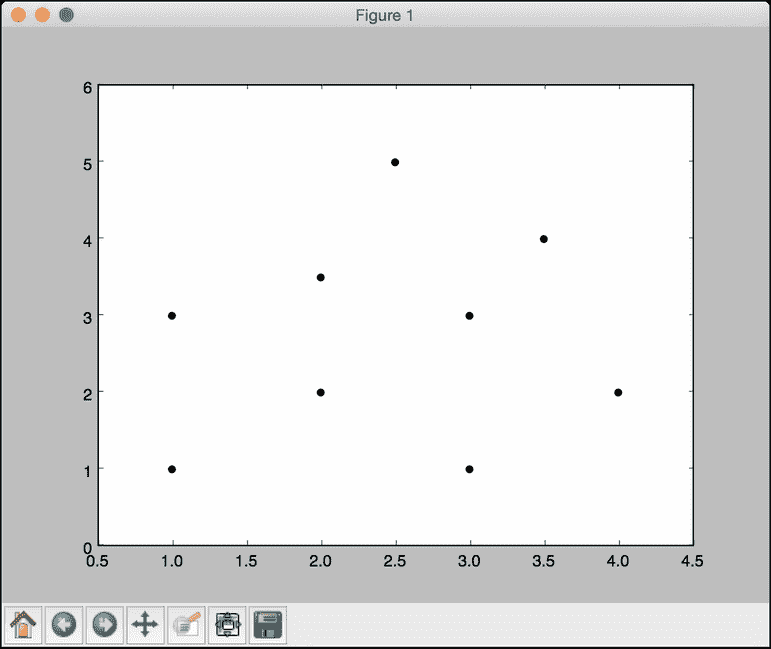
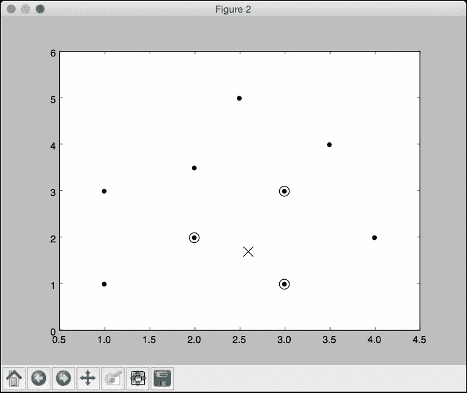
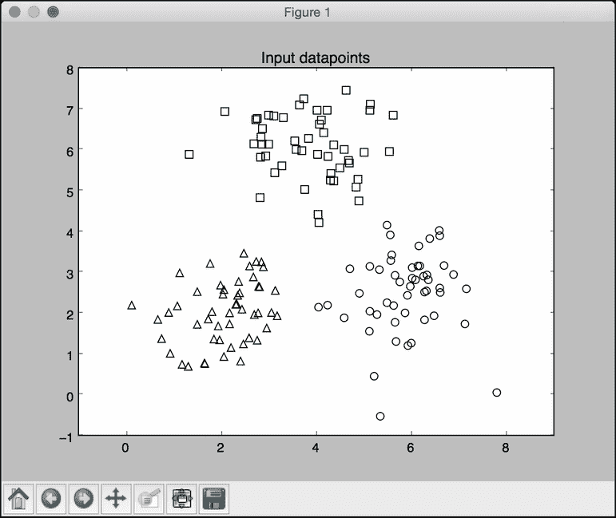
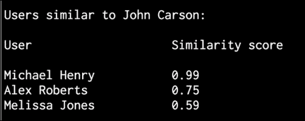

# 第五章。构建推荐引擎

在本章中，我们将介绍以下食谱:

*   为数据处理构建函数组合
*   构建机器学习管道
*   寻找最近的邻居
*   构建 k 近邻分类器
*   构造 k 近邻回归器
*   计算欧几里德距离分数
*   计算皮尔逊相关分数
*   在数据集中查找相似的用户
*   生成电影推荐

# 简介

推荐引擎是一个可以预测用户可能感兴趣的模型。当我们把这个应用到电影的上下文中，这就变成了一个电影推荐引擎。我们通过预测当前用户对项目的评价来过滤数据库中的项目。这有助于我们将用户与数据集中正确的内容联系起来。为什么这是相关的？如果你有一个庞大的目录，那么用户可能会也可能不会找到所有相关的内容。通过推荐合适的内容，你增加了消费。网飞等公司非常依赖推荐来吸引用户。

推荐引擎通常使用协作过滤或基于内容的过滤来产生一组推荐。这两种方法的区别在于挖掘建议的方式。协同过滤根据当前用户过去的行为以及其他用户给出的评分来构建模型。然后我们使用这个模型来预测这个用户可能感兴趣的东西。另一方面，基于内容的过滤使用项目本身的特征，以便向用户推荐更多的项目。项目之间的相似性是这里的主要驱动力。在这一章中，我们将重点讨论协同过滤。

# 构建用于数据处理的函数组合

任何机器学习系统的主要部分之一是数据处理管道。在将数据输入机器学习算法进行训练之前，我们需要以不同的方式对其进行处理，以使其适合该算法。拥有一个强大的数据处理管道对于构建一个精确且可扩展的机器学习系统大有帮助。有许多基本功能可用，数据处理管道通常由这些功能的组合组成。与其以嵌套或循环的方式调用这些函数，不如使用函数式编程范式来构建组合。让我们来看看如何将这些函数组合起来，形成一个可重用的函数组合。在这个食谱中，我们将创建三个基本函数，并看看如何组成一个管道。

## 怎么做…

1.  新建一个 Python 文件，添加如下一行:

    ```py
    import numpy as np
    ```

2.  让我们定义一个函数，将`3`添加到数组的每个元素中:

    ```py
    def add3(input_array):
        return map(lambda x: x+3, input_array)
    ```

3.  让我们定义第二个函数将`2`与数组的每个元素相乘:

    ```py
    def mul2(input_array):
        return map(lambda x: x*2, input_array)
    ```

4.  让我们定义第三个函数，从数组的每个元素中减去【T0:

    ```py
    def sub5(input_array):
        return map(lambda x: x-5, input_array)
    ```

5.  Let's define a function composer that takes functions as input arguments and returns a composed function. This composed function is basically a function that applies all the input functions in sequence:

    ```py
    def function_composer(*args):
        return reduce(lambda f, g: lambda x: f(g(x)), args)
    ```

    我们使用`reduce`函数，通过依次应用这些函数来组合所有的输入函数。

6.  我们现在已经准备好使用这个函数编辑器了。让我们定义一些数据和一系列操作:

    ```py
    if __name__=='__main__':
        arr = np.array([2,5,4,7])

        print "\nOperation: add3(mul2(sub5(arr)))"
    ```

7.  如果我们使用常规方法，我们将依次应用此方法，如下所示:

    ```py
        arr1 = add3(arr)
        arr2 = mul2(arr1)
        arr3 = sub5(arr2)
        print "Output using the lengthy way:", arr3
    ```

8.  让我们用函数 composer 在一行中实现同样的事情:

    ```py
        func_composed = function_composer(sub5, mul2, add3)
        print "Output using function composition:", func_composed(arr) 
    ```

9.  我们也可以用前面的方法在一行中做同样的事情，但是符号变得非常嵌套和不可读。还有，这是不能重复使用的！如果你想重用这个操作序列，你必须重新写一遍整件事:

    ```py
        print "\nOperation: sub5(add3(mul2(sub5(mul2(arr)))))\nOutput:", \
                function_composer(mul2, sub5, mul2, add3, sub5)(arr)
    ```

10.  If you run this code, you will get the following output on the Terminal:

    

# 构建机器学习管道

scikit-learn 库提供了构建机器学习管道的功能。我们只需要指定函数，它将构建一个复合对象，使数据通过整个管道。该管道可以包括预处理、特征选择、监督学习、无监督学习等功能。在本食谱中，我们将构建一个管道来获取输入特征向量，选择顶部的 *k* 特征，然后使用随机森林分类器对它们进行分类。

## 怎么做…

1.  新建一个 Python 文件，导入以下包:

    ```py
    from sklearn.datasets import samples_generator
    from sklearn.ensemble import RandomForestClassifier
    from sklearn.feature_selection import SelectKBest, f_regression
    from sklearn.pipeline import Pipeline
    ```

2.  Let's generate some sample data to play with:

    ```py
    # generate sample data
    X, y = samples_generator.make_classification(
            n_informative=4, n_features=20, n_redundant=0, random_state=5)
    ```

    这条线生成`20`维特征向量，因为这是默认值。您可以使用上一行中的`n_features`参数进行更改。

3.  管道的第一步是选择 *k* 最佳特征，然后进一步使用数据点。在这种情况下，让我们将`k`设置为`10` :

    ```py
    # Feature selector 
    selector_k_best = SelectKBest(f_regression, k=10)
    ```

4.  下一步是使用随机森林分类器对数据进行分类:

    ```py
    # Random forest classifier
    classifier = RandomForestClassifier(n_estimators=50, max_depth=4)
    ```

5.  We are now ready to build the pipeline. The pipeline method allows us to use predefined objects to build the pipeline:

    ```py
    # Build the machine learning pipeline
    pipeline_classifier = Pipeline([('selector', selector_k_best), ('rf', classifier)])
    ```

    我们还可以为管道中的块指定名称。在前一行中，我们将`selector`名称分配给我们的特征选择器，`rf`分配给我们的随机森林分类器。你可以在这里随意使用任何其他名字！

6.  我们还可以在进行的同时更新这些参数。我们可以使用上一步中指定的名称来设置参数。例如，如果我们想在特征选择器中将`k`设置为`6`，在随机森林分类器中将`n_estimators`设置为`25`，我们可以像下面的代码中那样做。请注意，这些是上一步中给出的变量名:

    ```py
    pipeline_classifier.set_params(selector__k=6, 
            rf__n_estimators=25)
    ```

7.  让我们继续训练分类器:

    ```py
    # Training the classifier
    pipeline_classifier.fit(X, y)
    ```

8.  让我们预测训练数据的输出:

    ```py
    # Predict the output
    prediction = pipeline_classifier.predict(X)
    print "\nPredictions:\n", prediction
    ```

9.  让我们估计一下这个分类器的性能:

    ```py
    # Print score
    print "\nScore:", pipeline_classifier.score(X, y)                        
    ```

10.  我们还可以看到哪些功能被选中。让我们继续打印它们:

    ```py
    # Print the selected features chosen by the selector
    features_status = pipeline_classifier.named_steps['selector'].get_support()
    selected_features = []
    for count, item in enumerate(features_status):
        if item:
            selected_features.append(count)

    print "\nSelected features (0-indexed):", ', '.join([str(x) for x in selected_features])
    ```

11.  If you run this code, you will get the following output on your Terminal:

    

## 它是如何工作的…

选择 *k* 最佳特征的优势在于，我们将能够处理低维数据。这有助于降低计算复杂度。我们选择 *k* 最佳特征的方式是基于单变量特征选择。这将执行单变量统计测试，然后从特征向量中提取表现最好的特征。单变量统计检验是指涉及单个变量的分析技术。

一旦这些测试被执行，特征向量中的每个特征都被分配一个分数。基于这些分数，我们选择顶部的 *k* 特征。我们将此作为分类器管道中的预处理步骤。一旦我们提取了顶部的 *k* 特征，就形成了一个 *k* 维特征向量，并将其用作随机森林分类器的输入训练数据。

# 寻找最近的邻居

最近邻模型是指一类通用算法，旨在根据训练数据集中最近邻的数量做出决策。让我们看看如何找到最近的邻居。

## 怎么做…

1.  新建一个 Python 文件，导入以下包:

    ```py
    import numpy as np
    import matplotlib.pyplot as plt
    from sklearn.neighbors import NearestNeighbors
    ```

2.  让我们创建一些示例二维数据:

    ```py
    # Input data
    X = np.array([[1, 1], [1, 3], [2, 2], [2.5, 5], [3, 1], 
            [4, 2], [2, 3.5], [3, 3], [3.5, 4]])
    ```

3.  我们的目标是找到任意给定点的三个最近邻居。我们来定义这个参数:

    ```py
    # Number of neighbors we want to find
    num_neighbors = 3
    ```

4.  让我们定义一个不在输入数据中的随机数据点:

    ```py
    # Input point
    input_point = [2.6, 1.7]
    ```

5.  我们需要看看这些数据是什么样的。我们来绘制一下，如下:

    ```py
    # Plot datapoints
    plt.figure()
    plt.scatter(X[:,0], X[:,1], marker='o', s=25, color='k')
    ```

6.  为了找到最近的邻居，我们需要用正确的参数定义`NearestNeighbors`对象，并在输入数据上训练它:

    ```py
    # Build nearest neighbors model
    knn = NearestNeighbors(n_neighbors=num_neighbors, algorithm='ball_tree').fit(X)
    ```

7.  我们现在可以找到输入点到输入数据中所有点的距离:

    ```py
    distances, indices = knn.kneighbors(input_point)
    ```

8.  We can print the k-nearest neighbors, as follows:

    ```py
    # Print the 'k' nearest neighbors
    print "\nk nearest neighbors"
    for rank, index in enumerate(indices[0][:num_neighbors]):
        print str(rank+1) + " -->", X[index]
    ```

    `indices`数组已经排序，所以我们只需要解析它并打印数据点。

9.  让我们绘制输入数据点并突出显示`k`-最近的邻居:

    ```py
    # Plot the nearest neighbors 
    plt.figure()
    plt.scatter(X[:,0], X[:,1], marker='o', s=25, color='k')
    plt.scatter(X[indices][0][:][:,0], X[indices][0][:][:,1], 
            marker='o', s=150, color='k', facecolors='none')
    plt.scatter(input_point[0], input_point[1],
            marker='x', s=150, color='k', facecolors='none')

    plt.show()
    ```

10.  If you run this code, you will get the following output on your Terminal:

    

11.  Here is the plot of the input datapoints:

    

12.  The second output figure depicts the location of the test datapoint and the three nearest neighbors, as shown in the following screenshot:

    

# 构建 k 近邻分类器

**k 最近邻**是算法，利用训练数据集中的 *k* 最近邻来寻找未知物体的类别。当我们想要找到一个未知点所属的类时，我们会找到 k 近邻，并进行多数投票。让我们来看看如何构造这个。

## 怎么做…

1.  新建一个 Python 文件，导入以下包:

    ```py
    import numpy as np
    import matplotlib.pyplot as plt
    import matplotlib.cm as cm
    from sklearn import neighbors, datasets

    from utilities import load_data
    ```

2.  We will use the `data_nn_classifier.txt` file for input data. Let's load this input data:

    ```py
    # Load input data
    input_file = 'data_nn_classifier.txt'
    data = load_data(input_file)
    X, y = data[:,:-1], data[:,-1].astype(np.int)
    ```

    前两列包含输入数据，最后一列包含标签。因此，我们将它们分为`X`和`y`，如前面的代码所示。

3.  Let's visualize the input data:

    ```py
    # Plot input data
    plt.figure()
    plt.title('Input datapoints')
    markers = '^sov<>hp'
    mapper = np.array([markers[i] for i in y])
    for i in range(X.shape[0]):
        plt.scatter(X[i, 0], X[i, 1], marker=mapper[i], 
                s=50, edgecolors='black', facecolors='none')
    ```

    我们遍历所有的数据点，并使用适当的标记来分隔类。

4.  为了构建分类器，我们需要指定我们想要考虑的最近邻居的数量。我们来定义这个参数:

    ```py
    # Number of nearest neighbors to consider
    num_neighbors = 10
    ```

5.  为了可视化边界，我们需要定义一个网格，并评估该网格上的分类器。让我们定义步长:

    ```py
    # step size of the grid
    h = 0.01  
    ```

6.  我们现在准备构建 k 近邻分类器。让我们定义并训练它:

    ```py
    # Create a K-Neighbours Classifier model and train it
    classifier = neighbors.KNeighborsClassifier(num_neighbors, weights='distance')
    classifier.fit(X, y)
    ```

7.  我们需要创建一个网格来绘制边界。让我们对此进行定义，如下所示:

    ```py
    # Create the mesh to plot the boundaries
    x_min, x_max = X[:, 0].min() - 1, X[:, 0].max() + 1
    y_min, y_max = X[:, 1].min() - 1, X[:, 1].max() + 1
    x_grid, y_grid = np.meshgrid(np.arange(x_min, x_max, h), np.arange(y_min, y_max, h))
    ```

8.  让我们评估所有点的分类器输出:

    ```py
    # Compute the outputs for all the points on the mesh
    predicted_values = classifier.predict(np.c_[x_grid.ravel(), y_grid.ravel()])
    ```

9.  让我们绘制一下，如下:

    ```py
    # Put the computed results on the map
    predicted_values = predicted_values.reshape(x_grid.shape)
    plt.figure()
    plt.pcolormesh(x_grid, y_grid, predicted_values, cmap=cm.Pastel1)
    ```

10.  现在我们绘制了颜色网格，让我们覆盖训练数据点，看看它们相对于边界的位置:

    ```py
    # Overlay the training points on the map
    for i in range(X.shape[0]):
        plt.scatter(X[i, 0], X[i, 1], marker=mapper[i], 
                s=50, edgecolors='black', facecolors='none')

    plt.xlim(x_grid.min(), x_grid.max())
    plt.ylim(y_grid.min(), y_grid.max())
    plt.title('k nearest neighbors classifier boundaries')
    ```

11.  现在，我们可以考虑一个测试数据点，看看分类器是否正确运行。让我们定义它并绘制出来:

    ```py
    # Test input datapoint
    test_datapoint = [4.5, 3.6]
    plt.figure()
    plt.title('Test datapoint')
    for i in range(X.shape[0]):
        plt.scatter(X[i, 0], X[i, 1], marker=mapper[i], 
                s=50, edgecolors='black', facecolors='none')

    plt.scatter(test_datapoint[0], test_datapoint[1], marker='x', 
            linewidth=3, s=200, facecolors='black')
    ```

12.  我们需要使用以下模型提取 k 近邻:

    ```py
    # Extract k nearest neighbors
    dist, indices = classifier.kneighbors(test_datapoint)
    ```

13.  让我们绘制 k 近邻并突出显示它们:

    ```py
    # Plot k nearest neighbors
    plt.figure()
    plt.title('k nearest neighbors')

    for i in indices:
        plt.scatter(X[i, 0], X[i, 1], marker='o', 
                linewidth=3, s=100, facecolors='black')

    plt.scatter(test_datapoint[0], test_datapoint[1], marker='x', 
            linewidth=3, s=200, facecolors='black')

    for i in range(X.shape[0]):
        plt.scatter(X[i, 0], X[i, 1], marker=mapper[i], 
                s=50, edgecolors='black', facecolors='none')

    plt.show()
    ```

14.  让我们在终端上打印分类器输出:

    ```py
    print "Predicted output:", classifier.predict(test_datapoint)[0]
    ```

15.  If you run this code, the first output figure depicts the distribution of the input datapoints:

    

16.  The second output figure depicts the boundaries obtained using the k-nearest neighbors classifier:

    

17.  The third output figure depicts the location of the test datapoint:

    

18.  The fourth output figure depicts the location of the 10 nearest neighbors:

    

## 它是如何工作的…

k 近邻分类器存储所有可用的数据点，并基于相似性度量对新数据点进行分类。这种相似性度量通常以距离函数的形式出现。该算法是一种非参数技术，这意味着它在公式之前不需要找出任何底层参数。我们所需要做的就是选择一个对我们有用的`k`值。

一旦我们找到 k 最近的邻居，我们就获得多数票。一个新的数据点被 k 近邻的多数票分类。这个数据点被分配给 k 近邻中最常见的类。如果我们将`k`的值设置为`1`，那么这就变成了最近邻分类器的情况，我们只需将数据点分配给训练数据集中最近邻的类。你可以在[上了解更多。html](http://www.fon.hum.uva.nl/praat/manual/kNN_classifiers_1__What_is_a_kNN_classifier_.html) 。

# 构造 k 近邻回归器

我们学习了如何使用 k 近邻算法构建分类器。好的一点是，我们也可以用这个算法作为回归器。让我们看看如何用它作为回归器。

## 怎么做…

1.  新建一个 Python 文件，导入以下包:

    ```py
    import numpy as np
    import matplotlib.pyplot as plt
    from sklearn import neighbors
    ```

2.  让我们生成一些高斯分布的样本数据:

    ```py
    # Generate sample data
    amplitude = 10
    num_points = 100
    X = amplitude * np.random.rand(num_points, 1) - 0.5 * amplitude
    ```

3.  我们需要在数据中加入一些噪声，以引入一些随机性。添加噪声的目的是看我们的算法是否能够通过它，并且仍然以健壮的方式运行:

    ```py
    # Compute target and add noise
    y = np.sinc(X).ravel() 
    y += 0.2 * (0.5 - np.random.rand(y.size))
    ```

4.  让我们将其可视化如下:

    ```py
    # Plot input data
    plt.figure()
    plt.scatter(X, y, s=40, c='k', facecolors='none')
    plt.title('Input data')
    ```

5.  We just generated some data and evaluated a continuous-valued function on all these points. Let's define a denser grid of points:

    ```py
    # Create the 1D grid with 10 times the density of the input data
    x_values = np.linspace(-0.5*amplitude, 0.5*amplitude, 10*num_points)[:, np.newaxis]
    ```

    我们定义了这个更密集的网格，因为我们想在所有这些点上评估我们的回归器，看看它与我们的函数有多接近。

6.  让我们定义我们想要考虑的最近邻居的数量:

    ```py
    # Number of neighbors to consider 
    n_neighbors = 8
    ```

7.  让我们使用前面定义的参数初始化和训练 k 近邻回归器:

    ```py
    # Define and train the regressor
    knn_regressor = neighbors.KNeighborsRegressor(n_neighbors, weights='distance')
    y_values = knn_regressor.fit(X, y).predict(x_values)
    ```

8.  让我们看看回归器如何通过将输入和输出数据重叠在一起来执行:

    ```py
    plt.figure()
    plt.scatter(X, y, s=40, c='k', facecolors='none', label='input data')
    plt.plot(x_values, y_values, c='k', linestyle='--', label='predicted values')
    plt.xlim(X.min() - 1, X.max() + 1)
    plt.ylim(y.min() - 0.2, y.max() + 0.2)
    plt.axis('tight')
    plt.legend()
    plt.title('K Nearest Neighbors Regressor')

    plt.show()
    ```

9.  If you run this code, the first figure depicts the input datapoints:

    

10.  The second figure depicts the predicted values by the regressor:

    

## 它是如何工作的…

回归器的目标是预测连续的有价值的产出。在这种情况下，我们没有固定数量的输出类别。我们只有一组实值输出值，我们希望我们的回归器预测未知数据点的输出值。在这种情况下，我们使用`sinc`函数来演示 k 近邻回归器。这也被称为**基数正弦函数**。一个`sinc`功能定义如下:

*当 x 不为 0 时 sinc(x)= sin(x)/x*

*= x 为 0 时为 1*

当`x`为`0`时， *sin(x)/x* 取 *0/0* 的不定形。因此，我们必须计算这个函数的极限，因为`x`趋向于`0`。我们使用一组值进行训练，并定义了一个更密集的网格进行测试。从上图中我们可以看到，输出曲线接近训练输出。

# 计算欧几里德距离得分

现在我们已经有了足够的机器学习管道和最近邻分类器的背景，让我们开始讨论推荐引擎。为了构建一个推荐引擎，我们需要定义一个相似性度量，这样我们就可以在数据库中找到与给定用户相似的用户。欧几里得距离分数就是这样一个度量，我们可以用它来计算数据点之间的距离。我们将集中讨论电影推荐引擎。让我们看看如何计算两个用户之间的欧几里得分数。

## 怎么做…

1.  新建一个 Python 文件，导入以下包:

    ```py
    import json
    import numpy as np
    ```

2.  我们现在将定义一个函数来计算两个用户之间的欧几里得分数。第一步是检查数据库中是否有用户:

    ```py
    # Returns the Euclidean distance score between user1 and user2 
    def euclidean_score(dataset, user1, user2):
        if user1 not in dataset:
            raise TypeError('User ' + user1 + ' not present in the dataset')

        if user2 not in dataset:
            raise TypeError('User ' + user2 + ' not present in the dataset')
    ```

3.  为了计算分数，我们需要提取两个用户都评分的电影:

    ```py
        # Movies rated by both user1 and user2
        rated_by_both = {} 

        for item in dataset[user1]:
            if item in dataset[user2]:
                rated_by_both[item] = 1
    ```

4.  如果没有共同的电影，那么用户之间就没有相似性(或者至少根据数据库中的评分我们无法计算出来):

    ```py
        # If there are no common movies, the score is 0 
        if len(rated_by_both) == 0:
            return 0
    ```

5.  For each of the common ratings, we just compute the square root of the sum of squared differences and normalize it so that the score is between 0 and 1:

    ```py
        squared_differences = [] 

        for item in dataset[user1]:
            if item in dataset[user2]:
                squared_differences.append(np.square(dataset[user1][item] - dataset[user2][item]))

        return 1 / (1 + np.sqrt(np.sum(squared_differences))) 
    ```

    如果评级相似，那么平方差之和将非常低。因此，分数会变得很高，这也是我们希望从这个指标中得到的。

6.  我们将使用`movie_ratings.json`文件作为我们的数据文件。让我们加载它:

    ```py
    if __name__=='__main__':
        data_file = 'movie_ratings.json'

        with open(data_file, 'r') as f:
            data = json.loads(f.read())
    ```

7.  让我们考虑两个随机用户，计算欧几里得距离分数:

    ```py
        user1 = 'John Carson'
        user2 = 'Michelle Peterson'

        print "\nEuclidean score:"
        print euclidean_score(data, user1, user2)
    ```

8.  当您运行此代码时，您将看到终端上打印的欧几里德距离分数。

# 计算皮尔逊相关得分

欧几里德距离分数是一个很好的度量，但是它有一些缺点。因此，皮尔逊相关得分经常被用在推荐引擎中。让我们看看如何计算它。

## 怎么做…

1.  新建一个 Python 文件，导入以下包:

    ```py
    import json
    import numpy as np
    ```

2.  我们将定义一个函数来计算数据库中两个用户之间的皮尔逊相关分数。我们的第一步是确认这些用户存在于数据库中:

    ```py
    # Returns the Pearson correlation score between user1 and user2 
    def pearson_score(dataset, user1, user2):
        if user1 not in dataset:
            raise TypeError('User ' + user1 + ' not present in the dataset')

        if user2 not in dataset:
            raise TypeError('User ' + user2 + ' not present in the dataset')
    ```

3.  下一步是获得这两个用户都评价的电影:

    ```py
        # Movies rated by both user1 and user2
        rated_by_both = {}

        for item in dataset[user1]:
            if item in dataset[user2]:
                rated_by_both[item] = 1

        num_ratings = len(rated_by_both) 
    ```

4.  如果没有共同的电影，那么这些用户之间就没有可辨别的相似性；因此，我们返回`0` :

    ```py
        # If there are no common movies, the score is 0 
        if num_ratings == 0:
            return 0
    ```

5.  我们需要计算常见电影评分的平方值之和:

    ```py
        # Compute the sum of ratings of all the common preferences 
        user1_sum = np.sum([dataset[user1][item] for item in rated_by_both])
        user2_sum = np.sum([dataset[user2][item] for item in rated_by_both])
    ```

6.  让我们计算所有常见电影评分的平方总和:

    ```py
        # Compute the sum of squared ratings of all the common preferences 
        user1_squared_sum = np.sum([np.square(dataset[user1][item]) for item in rated_by_both])
        user2_squared_sum = np.sum([np.square(dataset[user2][item]) for item in rated_by_both])
    ```

7.  让我们计算乘积的总和:

    ```py
        # Compute the sum of products of the common ratings 
        product_sum = np.sum([dataset[user1][item] * dataset[user2][item] for item in rated_by_both])
    ```

8.  我们现在准备计算皮尔逊相关分数所需的各种元素:

    ```py
        # Compute the Pearson correlation
        Sxy = product_sum - (user1_sum * user2_sum / num_ratings)
        Sxx = user1_squared_sum - np.square(user1_sum) / num_ratings
        Syy = user2_squared_sum - np.square(user2_sum) / num_ratings
    ```

9.  我们需要注意分母变成`0` :

    ```py
        if Sxx * Syy == 0:
            return 0
    ```

    的情况
10.  如果一切正常，我们返回皮尔逊相关得分，如下所示:

    ```py
        return Sxy / np.sqrt(Sxx * Syy)
    ```

11.  让我们定义`main`函数，计算两个用户之间的皮尔逊相关得分:

    ```py
    if __name__=='__main__':
        data_file = 'movie_ratings.json'

        with open(data_file, 'r') as f:
            data = json.loads(f.read())

        user1 = 'John Carson'
        user2 = 'Michelle Peterson'

        print "\nPearson score:"
        print pearson_score(data, user1, user2) 
    ```

12.  如果您运行此代码，您将看到皮尔逊相关分数打印在终端上。

# 在数据集中寻找相似用户

构建推荐引擎最重要的任务之一是找到相似的用户。这将指导您创建将提供给这些用户的建议。让我们看看如何建立这个。

## 怎么做…

1.  新建一个 Python 文件，导入以下包:

    ```py
    import json
    import numpy as np

    from pearson_score import pearson_score
    ```

2.  让我们定义一个函数来查找与输入用户相似的用户。它需要三个输入参数:数据库、输入用户和我们正在寻找的相似用户的数量。我们的第一步是检查用户是否在数据库中。如果该用户存在，我们需要计算该用户与数据库中所有其他用户之间的皮尔逊相关得分:

    ```py
    # Finds a specified number of users who are similar to the input user
    def find_similar_users(dataset, user, num_users):
        if user not in dataset:
            raise TypeError('User ' + user + ' not present in the dataset')

        # Compute Pearson scores for all the users
        scores = np.array([[x, pearson_score(dataset, user, x)] for x in dataset if user != x])
    ```

3.  下一步是按降序排列这些分数:

    ```py
        # Sort the scores based on second column
        scores_sorted = np.argsort(scores[:, 1])

        # Sort the scores in decreasing order (highest score first) 
        scored_sorted_dec = scores_sorted[::-1]
    ```

4.  让我们提取 *k* 的最高分并返回:

    ```py
        # Extract top 'k' indices
        top_k = scored_sorted_dec[0:num_users] 

        return scores[top_k] 
    ```

5.  让我们定义`main`函数并加载输入数据库:

    ```py
    if __name__=='__main__':
        data_file = 'movie_ratings.json'

        with open(data_file, 'r') as f:
            data = json.loads(f.read())
    ```

6.  我们想找三个类似的用户，比如`John Carson`。我们使用以下步骤进行操作:

    ```py
        user = 'John Carson'
        print "\nUsers similar to " + user + ":\n"
        similar_users = find_similar_users(data, user, 3) 
        print "User\t\t\tSimilarity score\n"
        for item in similar_users:
            print item[0], '\t\t', round(float(item[1]), 2)
    ```

7.  If you run this code, you will see the following printed on your Terminal:

    

# 生成电影推荐

现在我们已经构建了推荐引擎的所有不同部分，我们已经准备好生成电影推荐了。我们将使用我们在前面的食谱中构建的所有功能来构建一个电影推荐引擎。让我们看看如何构建它。

## 怎么做…

1.  新建一个 Python 文件，导入以下包:

    ```py
    import json
    import numpy as np

    from euclidean_score import euclidean_score
    from pearson_score import pearson_score
    from find_similar_users import find_similar_users
    ```

2.  我们将定义一个函数来为给定用户生成电影推荐。第一步是检查用户是否存在于数据集中:

    ```py
    # Generate recommendations for a given user
    def generate_recommendations(dataset, user):
        if user not in dataset:
            raise TypeError('User ' + user + ' not present in the dataset')
    ```

3.  让我们计算该用户与数据集中所有其他用户的皮尔逊得分:

    ```py
        total_scores = {}
        similarity_sums = {}

        for u in [x for x in dataset if x != user]:
            similarity_score = pearson_score(dataset, user, u)

            if similarity_score <= 0:
                continue
    ```

4.  我们需要找到这个用户没有评分的电影:

    ```py
            for item in [x for x in dataset[u] if x not in dataset[user] or dataset[user][x] == 0]:
                total_scores.update({item: dataset[u][item] * similarity_score})
                similarity_sums.update({item: similarity_score})
    ```

5.  如果用户已经观看了数据库中的每一部电影，那么我们不能向该用户推荐任何内容。我们来处理一下这个情况:

    ```py
        if len(total_scores) == 0:
            return ['No recommendations possible']
    ```

6.  我们现在有这些分数的列表。让我们创建一个标准化的电影排名列表:

    ```py
        # Create the normalized list
        movie_ranks = np.array([[total/similarity_sums[item], item] 
                for item, total in total_scores.items()])
    ```

7.  我们需要根据分数降序排序:

    ```py
        # Sort in decreasing order based on the first column
        movie_ranks = movie_ranks[np.argsort(movie_ranks[:, 0])[::-1]]
    ```

8.  我们终于准备好提取电影推荐:

    ```py
        # Extract the recommended movies
        recommendations = [movie for _, movie in movie_ranks]

        return recommendations
    ```

9.  让我们定义`main`函数并加载数据集:

    ```py
    if __name__=='__main__':
        data_file = 'movie_ratings.json'

        with open(data_file, 'r') as f:
            data = json.loads(f.read())
    ```

10.  让我们为`Michael Henry` :

    ```py
        user = 'Michael Henry'
        print "\nRecommendations for " + user + ":"
        movies = generate_recommendations(data, user) 
        for i, movie in enumerate(movies):
            print str(i+1) + '. ' + movie
    ```

    生成推荐
11.  用户`John Carson`已经看完了所有的电影。因此，如果我们试图为他生成推荐，它应该显示 0 个推荐。我们来看看是否会这样:

    ```py
        user = 'John Carson' 
        print "\nRecommendations for " + user + ":"
        movies = generate_recommendations(data, user) 
        for i, movie in enumerate(movies):
            print str(i+1) + '. ' + movie
    ```

12.  If you run this code, you will see the following on your Terminal:

    