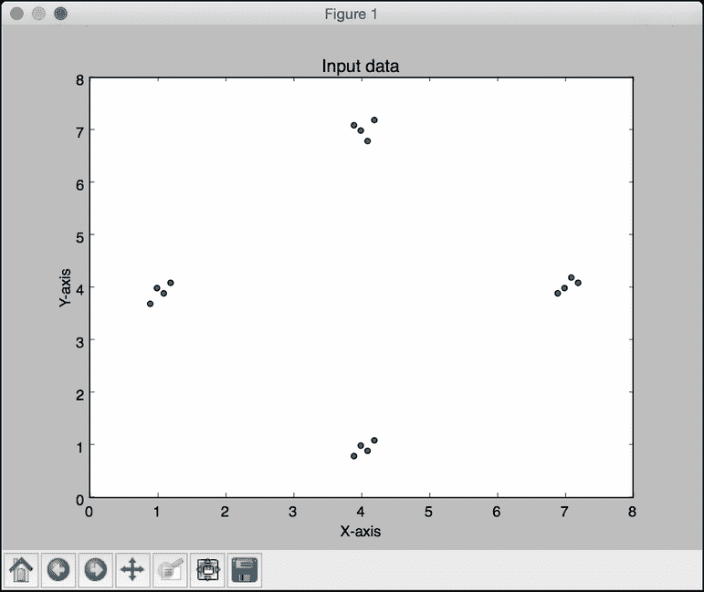
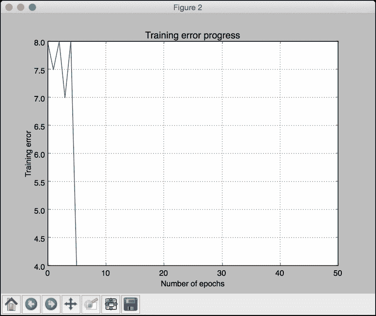
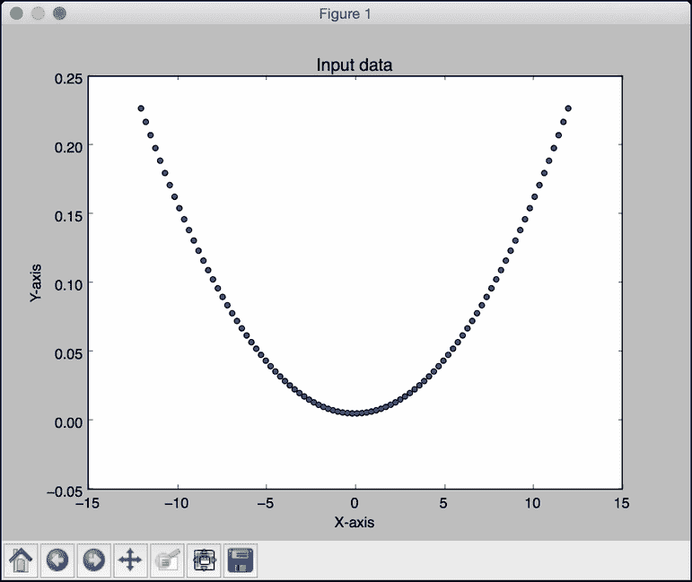
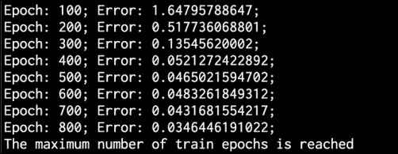
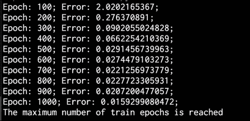
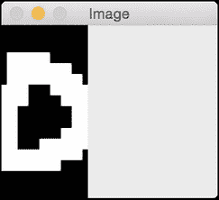
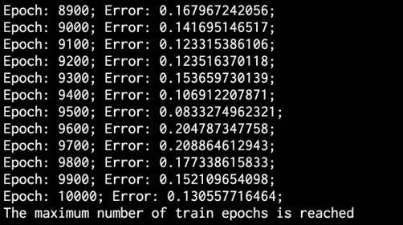

# 十一、深度神经网络

在本章中，我们将介绍以下食谱:

*   构建感知机
*   构建单层神经网络
*   构建深度神经网络
*   创建矢量量化器
*   为顺序数据分析建立循环神经网络
*   在光学字符识别数据库中可视化字符
*   利用神经网络构建光学字符识别器

# 简介

我们的大脑真的很擅长识别和认识事物。我们希望机器也能这样做。神经网络是模仿人脑模拟我们学习过程的框架。神经网络旨在从数据中学习并识别潜在的模式。与所有学习算法一样，神经网络处理数字。因此，如果我们想实现任何涉及图像、文本、传感器等的现实世界任务，我们必须先将它们转换成数字形式，然后再将其输入神经网络。我们可以使用神经网络进行分类、聚类、生成和许多其他相关任务。

神经网络由层层的 **神经元**组成。这些神经元模仿人脑中的生物神经元。每一层基本上都是一组独立的神经元，它们与相邻层的神经元相连。输入层对应于我们提供的输入数据，输出层由我们想要的输出组成。中间的所有图层都称为 **隐藏图层**。如果我们设计一个具有更多隐藏层的神经网络，那么我们就给它更多的自由来以更高的精度训练自己。

假设我们希望神经网络根据我们的需求对数据进行分类。为了使神经网络相应地工作，我们需要提供标记的训练数据。然后，神经网络将通过优化成本函数来训练自己。这个成本函数是实际标签和来自神经网络的预测标签之间的误差。我们不断迭代，直到误差低于某个阈值。

*深层*神经网络到底是什么？深度神经网络是由许多隐藏层组成的神经网络。总的来说，这属于深度学习的范畴。这是一个专门研究这些神经网络的领域，这些神经网络由跨多个垂直方向使用的多层组成。

您可以查看神经网络教程，了解更多关于[http://pages.cs.wisc.edu/~bolo/shipyard/neural/local.html](http://pages.cs.wisc.edu/~bolo/shipyard/neural/local.html)的信息。在本章中，我们将使用名为**神经实验室** 的库。在您继续之前，请确保您安装了它。您可以在[https://pythonhosted.org/neurolab/install.html](https://pythonhosted.org/neurolab/install.html)找到安装说明。让我们继续看看如何设计和开发这些神经网络。

# 构建感知器

让我们从感知器开始我们的神经网络冒险。一个**感知器**是一个执行所有计算的单神经元。这是一个非常简单的模型，但它构成了建立复杂神经网络的基础。这是它的样子:


神经元使用不同的权重组合输入，然后添加一个偏差值来计算输出。这是一个简单的线性方程，将输入值与感知器的输出联系起来。

## 怎么做…

1.  新建一个 Python 文件，导入以下包:

    ```py
    import numpy as np
    import neurolab as nl
    import matplotlib.pyplot as plt
    ```

2.  定义一些输入数据及其对应的标签:

    ```py
    # Define input data
    data = np.array([[0.3, 0.2], [0.1, 0.4], [0.4, 0.6], [0.9, 0.5]])
    labels = np.array([[0], [0], [0], [1]])
    ```

3.  让我们绘制这个数据，看看数据点位于哪里:

    ```py
    # Plot input data
    plt.figure()
    plt.scatter(data[:,0], data[:,1])
    plt.xlabel('X-axis')
    plt.ylabel('Y-axis')
    plt.title('Input data')
    ```

4.  让我们定义一个有两个输入的`perceptron`。这个函数还需要我们在输入数据中指定最小值和最大值:

    ```py
    # Define a perceptron with 2 inputs;
    # Each element of the list in the first argument 
    # specifies the min and max values of the inputs
    perceptron = nl.net.newp([[0, 1],[0, 1]], 1)
    ```

5.  让我们训练感知器。时代的数量指定了通过我们的训练数据集的完整次数。`show`参数指定我们希望显示进度的频率。`lr`参数指定感知器的学习速率。它是算法在参数空间中搜索的步长。如果这个值很大，那么算法可能会移动得更快，但它可能会错过最佳值。如果这个很小，那么算法会达到最优值，但是会很慢。所以这是一个交易；因此，我们选择一个值`0.01` :

    ```py
    # Train the perceptron
    error = perceptron.train(data, labels, epochs=50, show=15, lr=0.01)
    ```

6.  让我们绘制结果，如下所示:

    ```py
    # plot results
    plt.figure()
    plt.plot(error)
    plt.xlabel('Number of epochs')
    plt.ylabel('Training error')
    plt.grid()
    plt.title('Training error progress')

    plt.show()
    ```

7.  The full code is given in the `perceptron.py` file that's already provided to you. If you run this code, you will see two figures. The first figure displays the input data:

    

    第二个图显示了训练错误进度:

    

# 构建单层神经网络

现在我们知道如何创建感知器，让我们创建一个单层神经网络。单层神经网络由单层中的多个神经元组成。总的来说，我们将有一个输入层、一个隐藏层和一个输出层。

## 怎么做…

1.  新建一个 Python 文件，导入以下包:

    ```py
    import numpy as np
    import matplotlib.pyplot as plt
    import neurolab as nl 
    ```

2.  我们将使用`data_single_layer.txt`文件中的数据。让我们加载这个:

    ```py
    # Define input data
    input_file = 'data_single_layer.txt'
    input_text = np.loadtxt(input_file)
    data = input_text[:, 0:2]
    labels = input_text[:, 2:]
    ```

3.  让我们绘制输入数据:

    ```py
    # Plot input data
    plt.figure()
    plt.scatter(data[:,0], data[:,1])
    plt.xlabel('X-axis')
    plt.ylabel('Y-axis')
    plt.title('Input data')
    ```

4.  让我们提取最小值和最大值:

    ```py
    # Min and max values for each dimension
    x_min, x_max = data[:,0].min(), data[:,0].max()
    y_min, y_max = data[:,1].min(), data[:,1].max()
    ```

5.  让我们定义一个在隐藏层有两个神经元的单层神经网络:

    ```py
    # Define a single-layer neural network with 2 neurons;
    # Each element in the list (first argument) specifies the 
    # min and max values of the inputs
    single_layer_net = nl.net.newp([[x_min, x_max], [y_min, y_max]], 2)
    ```

6.  训练神经网络直到 50 个纪元:

    ```py
    # Train the neural network
    error = single_layer_net.train(data, labels, epochs=50, show=20, lr=0.01)
    ```

7.  绘制结果，如下所示:

    ```py
    # Plot results
    plt.figure()
    plt.plot(error)
    plt.xlabel('Number of epochs')
    plt.ylabel('Training error')
    plt.title('Training error progress')
    plt.grid()

    plt.show()
    ```

8.  让我们在新的测试数据上测试神经网络:

    ```py
    print single_layer_net.sim([[0.3, 4.5]])
    print single_layer_net.sim([[4.5, 0.5]])
    print single_layer_net.sim([[4.3, 8]])
    ```

9.  The full code is in the `single_layer.py` file that's already provided to you. If you run this code, you will see two figures. The first figure displays the input data:

    

    第二个数字显示训练错误进度:

    

    您将在您的终端上看到以下内容，指示输入测试点属于哪里:

    ```py
    [[ 0\.  0.]]
    [[ 1\.  0.]]
    [[ 1\.  1.]]

    ```

    您可以根据我们的标签验证输出是否正确。

# 构建深度神经网络

我们现在准备构建一个深度神经网络。深度神经网络由输入层、许多隐藏层和输出层组成。这看起来如下所示:


上图描绘了具有一个输入层、一个隐藏层和一个输出层的多层神经网络。在深度神经网络中，输入层和输出层之间有许多隐藏层。

## 怎么做…

1.  新建一个 Python 文件，导入以下包:

    ```py
    import neurolab as nl
    import numpy as np
    import matplotlib.pyplot as plt
    ```

2.  让我们定义参数来生成一些训练数据:

    ```py
    # Generate training data
    min_value = -12
    max_value = 12
    num_datapoints = 90
    ```

3.  该训练数据将由我们定义的函数组成，该函数将转换这些值。我们希望神经网络能够根据我们提供的输入和输出值，自行学习这一点:

    ```py
    x = np.linspace(min_value, max_value, num_datapoints)
    y = 2 * np.square(x) + 7
    y /= np.linalg.norm(y)
    ```

4.  重塑数组:

    ```py
    data = x.reshape(num_datapoints, 1)
    labels = y.reshape(num_datapoints, 1)
    ```

5.  绘图输入数据:

    ```py
    # Plot input data
    plt.figure()
    plt.scatter(data, labels)
    plt.xlabel('X-axis')
    plt.ylabel('Y-axis')
    plt.title('Input data')
    ```

6.  定义一个具有两个隐藏层的深度神经网络，其中每个隐藏层由 10 个神经元组成:

    ```py
    # Define a multilayer neural network with 2 hidden layers;
    # Each hidden layer consists of 10 neurons and the output layer 
    # consists of 1 neuron
    multilayer_net = nl.net.newff([[min_value, max_value]], [10, 10, 1])
    ```

7.  将训练算法设置为 **梯度下降**(可在[https://spin . atomicobject . com/2014/06/24/gradient-down-linear-relationship](https://spin.atomicobject.com/2014/06/24/gradient-descent-linear-regression))了解更多:

    ```py
    # Change the training algorithm to gradient descent
    multilayer_net.trainf = nl.train.train_gd
    ```

8.  训练网络:

    ```py
    # Train the network
    error = multilayer_net.train(data, labels, epochs=800, show=100, goal=0.01)
    ```

9.  在训练数据上运行网络查看性能:

    ```py
    # Predict the output for the training inputs 
    predicted_output = multilayer_net.sim(data)
    ```

10.  绘制训练误差:

    ```py
    # Plot training error
    plt.figure()
    plt.plot(error)
    plt.xlabel('Number of epochs')
    plt.ylabel('Error')
    plt.title('Training error progress')
    ```

11.  让我们创建一组新的输入，并在这些输入上运行神经网络，看看它的表现:

    ```py
    # Plot predictions
    x2 = np.linspace(min_value, max_value, num_datapoints * 2)
    y2 = multilayer_net.sim(x2.reshape(x2.size,1)).reshape(x2.size)
    y3 = predicted_output.reshape(num_datapoints)
    ```

12.  绘制输出:

    ```py
    plt.figure()
    plt.plot(x2, y2, '-', x, y, '.', x, y3, 'p')
    plt.title('Ground truth vs predicted output')

    plt.show()
    ```

13.  The full code is in the `deep_neural_network.py` file that's already provided to you. If you run this code, you will see three figures. The first figure displays the input data:

    

    第二个图显示了训练错误进度:

    

    第三个图形显示神经网络的输出:

    

    您将在终端上看到以下内容:

    

# 创建矢量量化器

也可以使用神经网络进行矢量量化。**矢量量化**是 *N* 维版本的“四舍五入”。这在计算机视觉、自然语言处理和一般机器学习的多个领域中非常常用。

## 怎么做…

1.  新建一个 Python 文件，导入以下包:

    ```py
    import numpy as np
    import matplotlib.pyplot as plt
    import neurolab as nl
    ```

2.  让我们从`data_vq.txt`文件加载输入数据:

    ```py
    # Define input data
    input_file = 'data_vq.txt'
    input_text = np.loadtxt(input_file)
    data = input_text[:, 0:2]
    labels = input_text[:, 2:]
    ```

3.  定义一个两层的**学习矢量量化** ( **LVQ** )神经网络。最后一个参数中的数组指定了每个输出的百分比权重(它们的总和应该是 1):

    ```py
    # Define a neural network with 2 layers:
    # 10 neurons in input layer and 4 neurons in output layer
    net = nl.net.newlvq(nl.tool.minmax(data), 10, [0.25, 0.25, 0.25, 0.25])
    ```

4.  训练 LVQ 神经网络:

    ```py
    # Train the neural network
    error = net.train(data, labels, epochs=100, goal=-1)
    ```

5.  为测试和可视化创建一个值网格:

    ```py
    # Create the input grid
    xx, yy = np.meshgrid(np.arange(0, 8, 0.2), np.arange(0, 8, 0.2))
    xx.shape = xx.size, 1
    yy.shape = yy.size, 1
    input_grid = np.concatenate((xx, yy), axis=1)
    ```

6.  评估该网格上的网络:

    ```py
    # Evaluate the input grid of points
    output_grid = net.sim(input_grid)
    ```

7.  定义我们数据中的四个类:

    ```py
    # Define the 4 classes
    class1 = data[labels[:,0] == 1]
    class2 = data[labels[:,1] == 1]
    class3 = data[labels[:,2] == 1]
    class4 = data[labels[:,3] == 1]
    ```

8.  定义所有这些类的网格:

    ```py
    # Define grids for all the 4 classes
    grid1 = input_grid[output_grid[:,0] == 1]
    grid2 = input_grid[output_grid[:,1] == 1]
    grid3 = input_grid[output_grid[:,2] == 1]
    grid4 = input_grid[output_grid[:,3] == 1]
    ```

9.  绘制输出:

    ```py
    # Plot outputs 
    plt.plot(class1[:,0], class1[:,1], 'ko', class2[:,0], class2[:,1], 'ko', 
                    class3[:,0], class3[:,1], 'ko', class4[:,0], class4[:,1], 'ko')
    plt.plot(grid1[:,0], grid1[:,1], 'b.', grid2[:,0], grid2[:,1], 'gx',
                    grid3[:,0], grid3[:,1], 'cs', grid4[:,0], grid4[:,1], 'ro')
    plt.axis([0, 8, 0, 8])
    plt.xlabel('X-axis')
    plt.ylabel('Y-axis')
    plt.title('Vector quantization using neural networks')

    plt.show()
    ```

10.  The full code is in the `vector_quantization.py` file that's already provided to you. If you run this code, you will see the following figure where the space is divided into regions. Each region corresponds to a bucket in the list of vector-quantized regions in the space:

    

# 构建用于序列数据分析的循环神经网络

循环神经网络真的很擅长分析序列和时间序列数据。你可以在上了解更多。当我们处理序列和时间序列数据时，我们不能仅仅扩展通用模型。数据中的时间依赖性非常重要，我们需要在模型中考虑这一点。让我们看看如何构建它们。

## 怎么做…

1.  新建一个 Python 文件，导入以下包:

    ```py
    import numpy as np
    import matplotlib.pyplot as plt
    import neurolab as nl
    ```

2.  根据输入参数

    ```py
    def create_waveform(num_points):
        # Create train samples
        data1 = 1 * np.cos(np.arange(0, num_points))
        data2 = 2 * np.cos(np.arange(0, num_points))
        data3 = 3 * np.cos(np.arange(0, num_points))
        data4 = 4 * np.cos(np.arange(0, num_points))
    ```

    ，定义一个函数来创建波形
3.  为每个间隔创建不同的振幅，以创建随机波形:

    ```py
        # Create varying amplitudes
        amp1 = np.ones(num_points)
        amp2 = 4 + np.zeros(num_points) 
        amp3 = 2 * np.ones(num_points) 
        amp4 = 0.5 + np.zeros(num_points) 
    ```

4.  组合数组以创建输出数组。该数据对应于输入，振幅对应于标签:

    ```py
        data = np.array([data1, data2, data3, data4]).reshape(num_points * 4, 1)
        amplitude = np.array([[amp1, amp2, amp3, amp4]]).reshape(num_points * 4, 1)

        return data, amplitude 
    ```

5.  定义一个函数，将数据通过训练好的神经网络后绘制输出:

    ```py
    # Draw the output using the network
    def draw_output(net, num_points_test):
        data_test, amplitude_test = create_waveform(num_points_test)
        output_test = net.sim(data_test)
        plt.plot(amplitude_test.reshape(num_points_test * 4))
        plt.plot(output_test.reshape(num_points_test * 4))
    ```

6.  定义`main`功能，从创建样本数据开始:

    ```py
    if __name__=='__main__':
        # Get data
        num_points = 30
        data, amplitude = create_waveform(num_points)
    ```

7.  创建具有两层的循环神经网络:

    ```py
        # Create network with 2 layers
        net = nl.net.newelm([[-2, 2]], [10, 1], [nl.trans.TanSig(), nl.trans.PureLin()])
    ```

8.  设置每层的初始化函数:

    ```py
        # Set initialized functions and init
        net.layers[0].initf = nl.init.InitRand([-0.1, 0.1], 'wb')
        net.layers[1].initf= nl.init.InitRand([-0.1, 0.1], 'wb')
        net.init()
    ```

9.  训练循环神经网络:

    ```py
        # Training the recurrent neural network
        error = net.train(data, amplitude, epochs=1000, show=100, goal=0.01)
    ```

10.  计算网络输出的训练数据:

    ```py
        # Compute output from network
        output = net.sim(data)
    ```

11.  绘图训练错误:

    ```py
        # Plot training results
        plt.subplot(211)
        plt.plot(error)
        plt.xlabel('Number of epochs')
        plt.ylabel('Error (MSE)')
    ```

12.  绘制结果:

    ```py
        plt.subplot(212)
        plt.plot(amplitude.reshape(num_points * 4))
        plt.plot(output.reshape(num_points * 4))
        plt.legend(['Ground truth', 'Predicted output'])
    ```

13.  创建一个随机长度的波形，看网络能否预测:

    ```py
        # Testing on unknown data at multiple scales
        plt.figure()

        plt.subplot(211)
        draw_output(net, 74)
        plt.xlim([0, 300])
    ```

14.  创建另一个较短长度的波形，看网络能否预测:

    ```py
        plt.subplot(212)
        draw_output(net, 54)
        plt.xlim([0, 300])

        plt.show()
    ```

15.  The full code is in the `recurrent_network.py` file that's already provided to you. If you run this code, you will see two figures. The first figure displays training errors and the performance on the training data:

    

    第二幅图显示了一个经过训练的循环神经网络如何在任意长度的序列上运行:

    

    您将在您的终端上看到以下内容:

    

# 在光学字符识别数据库中可视化字符

我们将现在看看如何使用神经网络来执行光学字符识别。这是指识别图像中手写字符的过程。我们将使用[http://ai.stanford.edu/~btaskar/ocr](http://ai.stanford.edu/~btaskar/ocr)提供的数据集。下载后的默认文件名为`letter.data`。首先，让我们看看如何与数据交互并可视化它。

## 怎么做…

1.  新建一个 Python 文件，导入以下包:

    ```py
    import os
    import sys

    import cv2
    import numpy as np
    ```

2.  定义输入文件名:

    ```py
    # Load input data 
    input_file = 'letter.data' 
    ```

3.  定义可视化参数:

    ```py
    # Define visualization parameters 
    scaling_factor = 10
    start_index = 6
    end_index = -1
    h, w = 16, 8
    ```

4.  继续循环浏览文件，直到用户按下 *Esc* 键。将该行拆分为制表符分隔的字符:

    ```py
    # Loop until you encounter the Esc key
    with open(input_file, 'r') as f:
        for line in f.readlines():
            data = np.array([255*float(x) for x in line.split('\t')[start_index:end_index]])
    ```

5.  将数组重塑为所需的形状，调整其大小，并显示:

    ```py
            img = np.reshape(data, (h,w))
            img_scaled = cv2.resize(img, None, fx=scaling_factor, fy=scaling_factor)
            cv2.imshow('Image', img_scaled)
    ```

6.  如果用户按下 *Esc* ，中断循环:

    ```py
            c = cv2.waitKey()
            if c == 27:
                break
    ```

7.  The full code is in the `visualize_characters.py` file that's already provided to you. If you run this code, you will see a window displaying characters. For example, *o* looks like the following:

    

    字符 *i* 看起来如下:

    

# 利用神经网络构建光学字符识别器

现在我们知道了如何与数据交互，让我们构建一个基于神经网络的光学字符识别系统。

## 怎么做…

1.  新建一个 Python 文件，导入以下包:

    ```py
    import numpy as np
    import neurolab as nl
    ```

2.  定义输入文件名:

    ```py
    # Input file
    input_file = 'letter.data'
    ```

3.  当我们使用处理大量数据的神经网络时，需要花费大量时间进行训练。为了演示如何构建这个系统，我们将只取`20`数据点:

    ```py
    # Number of datapoints to load from the input file
    num_datapoints = 20
    ```

4.  如果您查看数据，您会发现前 20 行中有七个不同的字符。让我们定义它们:

    ```py
    # Distinct characters
    orig_labels = 'omandig'

    # Number of distinct characters
    num_output = len(orig_labels)
    ```

5.  我们将使用 90%的数据进行培训，其余 10%用于测试。定义训练和测试参数:

    ```py
    # Training and testing parameters
    num_train = int(0.9 * num_datapoints)
    num_test = num_datapoints - num_train
    ```

6.  数据集文件每行的开始和结束索引:

    ```py
    # Define dataset extraction parameters 
    start_index = 6
    end_index = -1
    ```

7.  创建数据集:

    ```py
    # Creating the dataset
    data = []
    labels = []
    with open(input_file, 'r') as f:
        for line in f.readlines():
            # Split the line tabwise
            list_vals = line.split('\t')
    ```

8.  添加错误检查，查看字符是否在我们的标签列表中:

    ```py
            # If the label is not in our ground truth labels, skip it
            if list_vals[1] not in orig_labels:
                continue
    ```

9.  提取标签，并将其附加到主列表中:

    ```py
            # Extract the label and append it to the main list
            label = np.zeros((num_output, 1))
            label[orig_labels.index(list_vals[1])] = 1
            labels.append(label)
    ```

10.  提取字符，并将其附加到主列表中:

    ```py
            # Extract the character vector and append it to the main list
            cur_char = np.array([float(x) for x in list_vals[start_index:end_index]])
            data.append(cur_char)
    ```

11.  一旦我们有足够的数据就退出循环:

    ```py
            # Exit the loop once the required dataset has been loaded
            if len(data) >= num_datapoints:
                break
    ```

12.  将该数据转换为 NumPy 数组:

    ```py
    # Convert data and labels to numpy arrays
    data = np.asfarray(data)
    labels = np.array(labels).reshape(num_datapoints, num_output)
    ```

13.  提取我们数据中的维数:

    ```py
    # Extract number of dimensions
    num_dims = len(data[0])
    ```

14.  训练神经网络直到`10,000`时期:

    ```py
    # Create and train neural network
    net = nl.net.newff([[0, 1] for _ in range(len(data[0]))], [128, 16, num_output])
    net.trainf = nl.train.train_gd
    error = net.train(data[:num_train,:], labels[:num_train,:], epochs=10000, 
            show=100, goal=0.01)
    ```

15.  预测测试输入的输出:

    ```py
    # Predict the output for test inputs 
    predicted_output = net.sim(data[num_train:, :])
    print "\nTesting on unknown data:"
    for i in range(num_test):
        print "\nOriginal:", orig_labels[np.argmax(labels[i])]
        print "Predicted:", orig_labels[np.argmax(predicted_output[i])]
    ```

16.  The full code is in the `ocr.py` file that's already provided to you. If you run this code, you will see the following on your Terminal at the end of training:

    

    神经网络的输出如下图所示:

    