# 三、使用支持向量机识别人脸

在前一章中，我们用朴素贝叶斯构建了一个电影推荐系统。这一章继续我们的监督学习和分类之旅。具体来说，我们将关注多类分类和**支持向量机** ( **SVM** )分类器。当涉及到高维空间时，SVM 是最流行的算法之一。该算法的目标是找到一个决策边界，以便从不同的类中分离数据。我们将详细讨论这是如何工作的。此外，我们将使用 scikit-learn 实现该算法，并将其应用于解决各种现实问题，包括我们的主要项目人脸识别，以及心脏生育和乳腺癌预测中的胎儿状态分类。本章还将介绍一种名为**主成分分析**的降维技术，它可以提高图像分类器的性能。

本章探讨以下主题:

*   SVM 的力学通过不同的场景来解释
*   用 scikit-learn 实现 SVM
*   多类分类策略
*   内核方法的 SVM
*   如何在线性核和高斯核之间进行选择
*   SVM 人脸识别
*   主成分分析
*   使用网格搜索和交叉验证进行调整
*   利用非线性核的 SVM 进行胎儿状态分类

# 找到与 SVM 的分界线

现在已经向您介绍了一个强大的但简单的分类器，朴素贝叶斯，我们将继续介绍另一个伟大的分类器，SVM，它在高维空间或维数大于样本数的情况下是有效的。

在机器学习分类中，SVM 发现了一个最佳超平面，它能最好地分离不同类别的观测值。一个**超平面**是一个 *n - 1* 维的平面，它将观测的 *n* 维特征空间分成两个空间。例如，二维特征空间中的超平面是直线，三维特征空间中的超平面是曲面。选择最佳超平面，使得从每个空间中最近的点到其自身的距离最大化。而这些最近的点就是所谓的**支持向量**。下面的玩具示例演示了在二进制分类的情况下，支持向量和分离超平面(以及距离边距，我将在后面解释)是什么样子的:


图 3.1:二进制分类中支持向量和超平面的例子

SVM 的最终目标是找到一个最优超平面，但迫切的问题是“我们如何找到这个最优超平面？”当我们探索以下场景时，您将会得到答案。没有你想象的那么难。我们首先要看的是如何找到一个超平面。

## 场景 1–识别分离超平面

首先，你需要理解什么是分离超平面。在下面的例子中，超平面 *C* 是唯一正确的，因为它成功地通过标签分离了观察值，而超平面 *A* 和 *B* 失败:

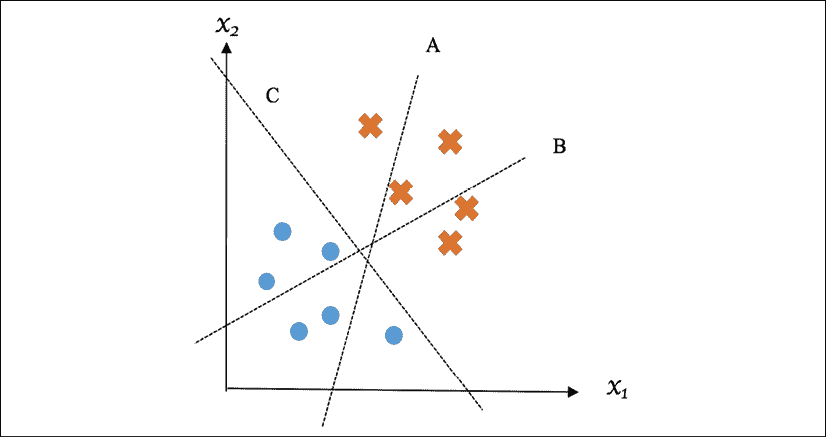

图 3.2:合格和不合格超平面示例

这是一个简单的观察。接下来让我们用形式或数学的方式来表达一个分离超平面。

在二维空间中，直线可以由斜率向量 *w* (表示为二维向量)和截距 *b* 来定义。类似地，在 *n* 维的空间中，超平面可以由 *n* 维向量 *w* 和截距 *b* 来定义。超平面上的任意数据点 *x* 满足 *wx + b = 0* 。如果满足以下条件，超平面就是分离超平面:

*   对于来自一个类的任何数据点 *x* ，它满足 *wx + b > 0*
*   对于来自另一个类的任何数据点 *x* ，它满足 *wx + b < 0*

但是 *w* 和 *b* 可以有无数种可能的解决方案。您可以在一定程度上移动或旋转超平面 *C* ，它仍将保持分离超平面。接下来，您将学习如何在各种可能的分离超平面中识别最佳超平面。

## 场景 2–确定最佳超平面

请看下面的例子:超平面 *C* 是优选的，因为它使正侧最近的数据点与自身之间的距离和负侧最近的数据点与自身之间的距离之和最大；

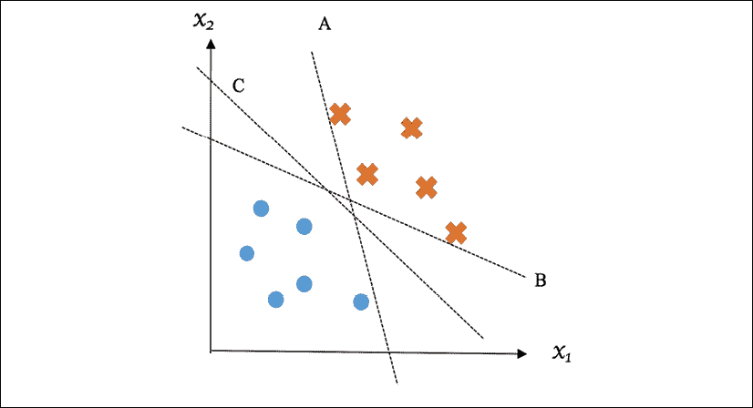

图 3.3:最优和次优超平面的例子

正侧最近的点可以构成平行于决策超平面的超平面，我们称之为正超平面；另一方面，负侧最近的点可以构成**负超平面**。正负超平面之间的垂直距离为，称为**余量**，其值等于上述两个距离之和。如果裕度最大化，则**判定**超平面被视为**最优**。

下图说明了训练后的 SVM 模型的最优(也称为**最大余量**)超平面和距离余量。同样，边缘上的样本(如图所示，两个来自一个类，一个来自另一个类)是所谓的支持向量:


图 3.4:最佳超平面和距离余量的示例

我们可以通过首先描述正负超平面来用数学方式解释它，如下所示:


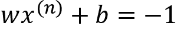

这里，是正超平面上的数据点，是负超平面上的数据点。

点和决策超平面之间的距离可以计算如下:


类似地，点和决策超平面之间的距离如下:


于是，边距变成了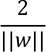。因此，我们需要最小化以便最大化利润。重要的是，为了符合正负超平面上的支持向量是决策超平面的最近数据点的事实，我们增加了一个条件，即没有数据点落在正负超平面之间:


这里，是一个观察。这可以进一步合并为以下内容:


综上所述，确定 SVM 决策超平面的 *w* 和 *b* 通过以下优化问题进行训练和求解:

*   最小化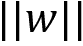
*   以为准，训练套、、… 、

为了解决这个优化问题，我们需要求助于二次规划技术，这超出了我们学习旅程的范围。因此，我们将不详细介绍计算方法，而是使用 scikit-learn 中的`SVC`和`LinearSVC`模块来实现分类器，其中分别基于两个流行的开源 SVM 机器学习库`libsvm`([https://www.csie.ntu.edu.tw/~cjlin/libsvm/](https://www.csie.ntu.edu.tw/~cjlin/libsvm/))和`liblinear` ([https://www.csie.ntu.edu.tw/~cjlin/liblinear/](https://www.csie.ntu.edu.tw/~cjlin/liblinear/))来实现。但是理解计算 SVM 的概念总是有价值的。

Shai Shalev-Shwartz 等人，“Pegasos:SVM 的原始估计子梯度解算器”(数学规划，2011 年 3 月，第 127 卷，第 1 期，第 3-30 页)，和 Cho-Jui xieh 等人，“大规模线性 SVM 的双坐标下降法”(第 25 届国际机器学习会议录，第 408-415 页)是很好的学习材料。它们涵盖了两种现代方法，亚梯度下降和坐标下降。

学习的模型参数 *w* 和 *b* 然后用于基于以下条件对新样本 *x* 进行分类:

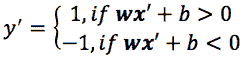

而且可以刻画为数据点 *x* 到决策超平面的距离，也可以解释为预测的置信度:数值越高，数据点离决策边界越远，因此预测的确定性越高。

虽然你可能渴望实现 SVM 算法，但让我们后退一步，看看一个常见的场景，其中数据点不能以严格的方式线性分离。尝试在以下示例中找到一个分离超平面:

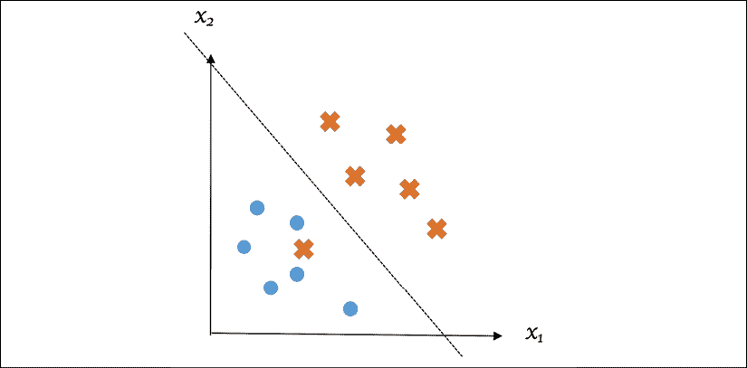

图 3.5:不是严格线性分离的数据点的例子

## 场景 3–处理异常值

我们如何处理不可能严格线性隔离一组包含异常值的观测值的情况？我们实际上可以允许这种异常值的错误分类，并尽量减少引入的误差。样本的误分类错误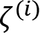(也称为**铰链损失**)可以表示如下:


将与我们想要减少的终极术语*|*|*|**w**|**|*结合在一起，我们想要最小化的最终目标值就变成了如下:

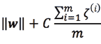

关于训练集 *m* 样本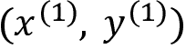、、… 、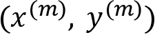，其中超参数 *C* 控制两个术语之间的权衡:

*   如果选择较大的 *C* 值，误分类的惩罚将变得相对较高。这意味着数据隔离的经验法则变得更加严格，并且模型可能容易过度拟合，因为在训练期间几乎不允许出现错误。具有大的 *C* 的 SVM 模型具有低偏差，但是它可能遭受高方差。
*   相反，如果 *C* 的值足够小，误分类的影响就变得相当低。该模型比具有大的 *C* 的模型允许更多的错误分类的数据点。因此，数据分离变得不那么严格。这样的模型方差很小，但可能会受到高偏差的影响。

大小 *C* 的对比如下图所示:


图 3.6:C 值如何影响隔离的严格性和余量

参数 *C* 决定偏差和方差之间的平衡。它可以通过交叉验证进行微调，我们将很快进行练习。

## 实施 SVM

我们已经在很大程度上介绍了 SVM 分类器的基本原理。现在，让我们立即将其应用于一个简单的二进制分类数据集。我们将使用 scikit-learn 的经典乳腺癌威斯康星数据集([https://sci kit-learn . org/stable/modules/generated/sklearn . datasets . load _ 乳腺癌. html](https://scikit-learn.org/stable/modules/generated/sklearn.datasets.load_breast_cancer.html) )。

让我们看看以下步骤:

1.  We first load the dataset and do some basic analysis, as follows:

    ```py
    >>> from sklearn.datasets import load_breast_cancer
    >>> cancer_data = load_breast_cancer()
    >>> X = cancer_data.data
    >>> Y = cancer_data.target
    >>> print('Input data size :', X.shape)
    Input data size : (569, 30)
    >>> print('Output data size :', Y.shape)
    Output data size : (569,)
    >>> print('Label names:', cancer_data.target_names)
    Label names: ['malignant' 'benign']
    >>> n_pos = (Y == 1).sum()
    >>> n_neg = (Y == 0).sum()
    >>> print(f'{n_pos} positive samples and {n_neg} negative samples.')
    357 positive samples and 212 negative samples. 
    ```

    可以看到，数据集有 569 个样本，30 个特征；其标签为二进制，63%的样本为阳性(良性)。同样，在尝试解决任何分类问题之前，一定要检查类是否不平衡。在这种情况下，它们相对平衡。

2.  Next, we split the data into training and testing sets:

    ```py
    >>> from sklearn.model_selection import train_test_split
    >>> X_train, X_test, Y_train, Y_test = train_test_split(X, Y, random_state=42) 
    ```

    为了再现性，不要忘记指定一个随机种子。

3.  我们现在可以将 SVM 分类器应用于数据。我们首先初始化一个`SVC`模型，将`kernel`参数设置为`linear`(我将在下一节解释内核的含义)，将惩罚超参数`C`设置为默认值`1.0` :

    ```py
    >>> from sklearn.svm import SVC
    >>> clf = SVC(kernel='linear', C=1.0, random_state=42) 
    ```

4.  然后，我们在训练集上拟合我们的模型，如下所示:

    ```py
    >>> clf.fit(X_train, Y_train)
    SVC(C=1.0, cache_size=200, class_weight=None, coef0=0.0,
        decision_function_shape='ovr', degree=3,
        gamma='auto_deprecated', kernel='linear', max_iter=-1,
        probability=False, random_state=42, shrinking=True,
        tol=0.001, verbose=False) 
    ```

5.  并用训练好的模型在测试集上进行预测，直接获得预测精度:

    ```py
    >>> accuracy = clf.score(X_test, Y_test)
    >>> print(f'The accuracy is: {accuracy*100:.1f}%')
    The accuracy is: 95.8% 
    ```

我们的第一个 SVM 模型非常好用，达到了`95.8%`的精度。处理两个以上的话题怎么样？SVM 如何处理多类分类？

## 场景 4–处理两个以上的类

SVM 和许多其他分类器可以应用于两类以上的情况。我们可以采取两种典型的方法，**一对多**(也叫**一对多**)和**一对一**。

在 one-vs-rest 设置中，对于一个 *K* 类问题，我们构造了 *K* 不同的二元 SVM 分类器。对于 *k* <sup class="" style="font-style: italic;">第</sup>分类器，将 *k* <sup class="" style="font-style: italic;">第</sup>类作为正例，其余 *K-1* 类作为整体作为负例；表示为( *w* <sub class="" style="font-style: italic;">k</sub> *、b* <sub class="" style="font-style: italic;">k</sub> 的超平面被训练来分离这两种情况。为了预测新样本的类别， *x* ，它比较从 *K* 单个分类器从 *1* 到 *k* 的结果预测。正如我们在上一节中所讨论的，的较大值意味着 *x* 属于正例的置信度较高。因此，它将 *x* 分配给类 *i* ，其中在所有预测结果中具有最大值:

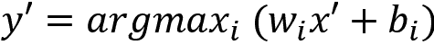

下图显示了一对多策略在三类情况下的工作原理:

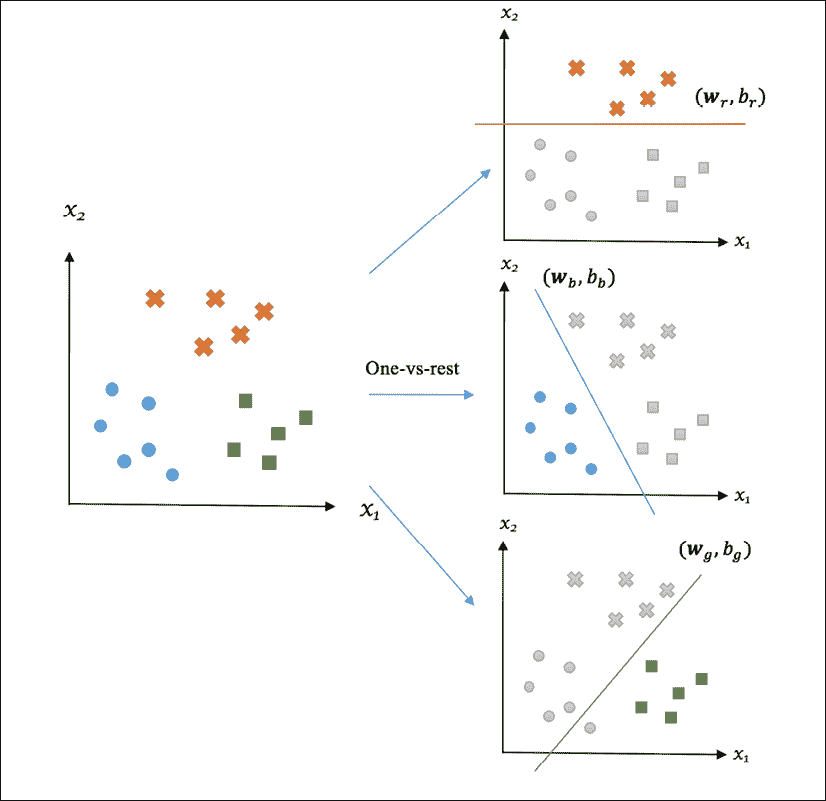

图 3.7:使用一对多策略的三类分类示例

例如，如果我们有以下( *r* 、 *b* 和 *g* 分别表示红色、蓝色和绿色等级):

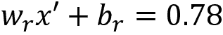


从 *0.78 > 0.35 > -0.64* 开始，我们可以说 *x* 属于红色阶层。如果我们有以下情况:


那么我们就可以确定 *x* 属于蓝色类，不管符号自- *0.35 > -0.64 > -0.78* 。

在一对一策略中，我们通过构建一组 SVM 分类器来进行成对比较，该分类器可以从每对类中区分数据点。这将导致不同的分类器。

对于与类 *i* 和 *j* 相关联的分类器，仅基于来自 *i* (可被视为正例)和 *j* (可被视为负例)的观察来训练表示为的超平面；然后，它根据的符号将类别 *i* 或 *j* 分配给新样本 *x* 。最后，作业数量最多的班级被认为是 *x* 的预测结果。获胜者是得票最多的班级。

下图显示了一对一策略在三类案例中的工作原理:

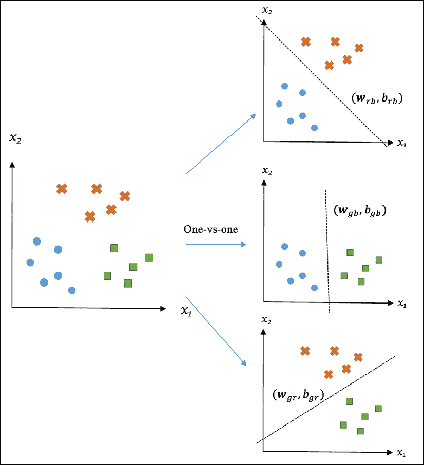

图 3.8:使用一对一策略的三级分类示例

一般来说，具有一对一设置的 SVM 分类器和具有一对一设置的分类器在准确性方面表现相当。这两种策略之间的选择主要是计算性的。

虽然一对一需要比一对一(K)更多的分类器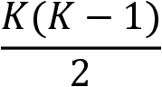，但是每个成对分类器只需要学习一小部分数据，而不是一对一设置中的整个集合。因此，在一对一设置中训练 SVM 模型通常更具内存效率，计算成本更低，因此更适合实际应用，正如徐志伟和林志仁的*多类支持向量机方法的比较* (IEEE 神经网络交易，2002 年 3 月，第 13 卷，第 415-425 页)中所述。

在 scikit-learn 中，分类器在内部处理多类情况，我们不需要显式地编写任何额外的代码来实现这一点。你可以在葡萄酒分类示例([https://sci kit-learn . org/stable/modules/generated/sklearn . datasets . load _ wine . html # sklearn . dataset . load _ wine](https://scikit-learn.org/stable/modules/generated/sklearn.datasets.load_wine.html#sklearn.datasets.l))中看到它有多简单，如下所示:

1.  We first load the dataset and do some basic analysis, as follows:

    ```py
    >>> from sklearn.datasets import load_wine
    >>> wine_data = load_breast_cancer()
    >>> X = wine_data.data
    >>> Y = wine_data.target
    >>> print('Input data size :', X.shape)
    Input data size : (178, 13)
    >>> print('Output data size :', Y.shape)
    Output data size : (178,)
    >>> print('Label names:', wine_data.target_names)
    Label names: ['class_0' 'class_1' 'class_2']
    >>> n_class0 = (Y == 0).sum() 
    >>> n_class1 = (Y == 1).sum() 
    >>> n_class2 = (Y == 2).sum() 
    >>> print(f'{n_class0} class0 samples,\n{n_class1} class1 samples,\n{n_class2} class2 samples.')
    59 class0 samples, 
    71 class1 samples, 
    48 class2 samples. 
    ```

    可以看到，数据集有 178 个样本，13 个特征；它的标签有三个可能的值，分别占 33%、40%和 27%。

2.  接下来，我们将数据分成训练集和测试集:

    ```py
    >>> X_train, X_test, Y_train, Y_test = train_test_split(X, Y, random_state=42) 
    ```

3.  We can now apply the SVM classifier to the data. We first initialize an `SVC` model and fit it against the training set:

    ```py
    >>> clf = SVC(kernel='linear', C=1.0, random_state=42)
    >>> clf.fit(X_train, Y_train)
    SVC(C=1.0, cache_size=200, class_weight=None, coef0=0.0,
        decision_function_shape='ovr', degree=3,
        gamma='auto_deprecated', kernel='linear', max_iter=-1,
        probability=False, random_state=42, shrinking=True,
        tol=0.001, verbose=False) 
    ```

    在`SVC`模型中，多类支持是根据一对一方案隐式处理的。

4.  Next, we predict on the testing set with the trained model and obtain the prediction accuracy directly:

    ```py
    >>> accuracy = clf.score(X_test, Y_test)
    >>> print(f'The accuracy is: {accuracy*100:.1f}%')
    The accuracy is: 97.8% 
    ```

    我们的 SVM 模型在多类情况下也能很好地工作，达到了`97.8%.`的精度

5.  我们还会检查它对单个类的表现:

    ```py
    >>> from sklearn.metrics import classification_report
    >>> pred = clf.predict(X_test)
    >>> print(classification_report(Y_test, pred))
                  precision    recall  f1-score   support
               0       1.00      1.00      1.00        15
               1       1.00      0.94      0.97        18
               2       0.92      1.00      0.96        12
       micro avg       0.98      0.98      0.98        45
       macro avg       0.97      0.98      0.98        45
    weighted avg       0.98      0.98      0.98        45 
    ```

看起来棒极了！例子是不是太容易了？也许吧。我们在棘手的案件中做什么？当然，我们可以调整`kernel`和`C`超参数的值。正如所讨论的，因子`C`控制分离的严格性，并且它可以被调整以实现偏差和方差之间的最佳权衡。内核怎么样？这是什么意思，除了 T3 内核之外，还有哪些 T4 的替代品？

在下一部分，我们将回答刚才提出的两个问题。你会看到内核技巧如何让 SVM 如此强大。

## 场景 5–用内核解决线性不可分问题

到目前为止，我们发现的超平面都是线性的，例如，二维特征空间中的直线，或者三维特征空间中的曲面。然而，在下面的例子中，我们无法找到一个可以将两个类分开的线性超平面:

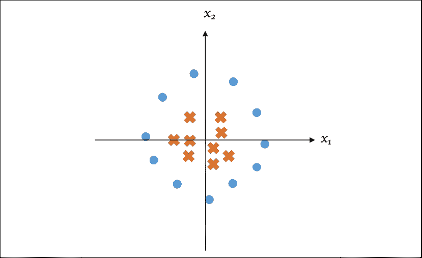

图 3.9:线性不可分的情况

直觉上，我们观察到一个类的数据点比另一个类的数据点更接近原点。到原点的距离提供了可区分的信息。所以我们增加了一个新的特征，，把原来的二维空间转换成三维空间。在新的空间中，如下图所示，我们可以找到分隔数据的曲面超平面，或者二维视图中的一条线。有了这个附加特征，数据集在更高维空间中就可以线性分离了，(*x*T5】1T7】，xT9】2T11，z ):

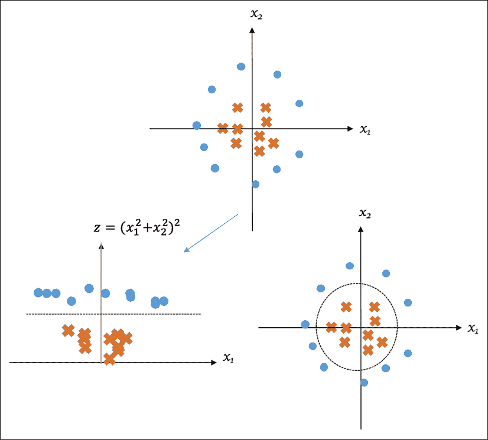

图 3.10:将不可分离的案例分离

基于类似的逻辑，通过将原始特征空间转换为具有变换函数的高维特征空间*φ*，使得变换后的数据集是线性可分的，从而发明了具有核的**支持向量机来解决非线性分类问题。**

然后使用观测值学习线性超平面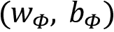。对于未知样本 *x* ，首先转化为；预测等级由决定。

具有核的 SVM 实现了非线性分离，但是它没有显式地将每个原始数据点映射到高维空间，然后在新空间中执行昂贵的计算。相反，它以一种微妙的方式接近。

在求解 SVM 二次优化问题的过程中，特征向量仅以成对点积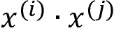的形式涉及，尽管我们不会在本书中对此进行数学扩展。对于核，新的特征向量是，它们的成对点积可以表示为。首先隐式地对两个低维向量进行成对运算，然后将结果映射到高维空间，这在计算上是高效的。事实上，满足这一点的函数 *K* 确实存在:

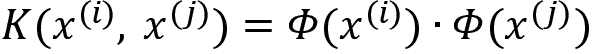

函数 *K* 就是所谓的**内核函数**。有了这个技巧，变换*φ*就变成了隐式的，只需将术语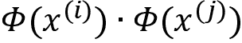替换为，就可以高效地学习非线性决策边界。

最流行的核函数是可能是**径向基函数** ( **RBF** )核(也叫**高斯**核)，定义如下:

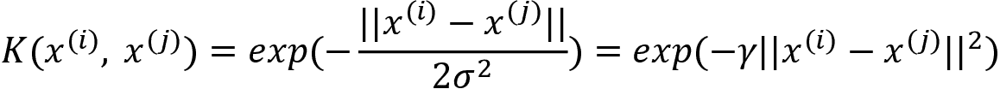

这里，。在高斯函数中，标准差控制允许的变异量或离差量:越高(或越低)，钟形的宽度越大，允许数据点分布的范围越广。因此，作为**核系数**决定了核函数与观测值拟合的严格程度或一般程度。大的意味着允许的小方差和训练样本上相对精确的拟合，这可能导致过度拟合。另一方面，小的意味着允许的高方差和训练样本上的宽松拟合，这可能导致拟合不足。

为了说明这种权衡，让我们将具有不同值的径向基函数核应用于玩具数据集:

```py
>>> import numpy as np
>>> import matplotlib.pyplot as plt
>>> X = np.c_[# negative class
...           (.3, -.8),
...           (-1.5, -1),
...           (-1.3, -.8),
...           (-1.1, -1.3),
...           (-1.2, -.3),
...           (-1.3, -.5),
...           (-.6, 1.1),
...           (-1.4, 2.2),
...           (1, 1),
...           # positive class
...           (1.3, .8),
...           (1.2, .5),
...           (.2, -2),
...           (.5, -2.4),
...           (.2, -2.3),
...           (0, -2.7),
...           (1.3, 2.1)].T
>>> Y = [-1] * 8 + [1] * 8 
```

八个数据点来自一个类，八个来自另一个类。我们以内核系数选项的三个值`1`、`2`和`4`为例:

```py
>>> gamma_option = [1, 2, 4] 
```

在每个核系数下，我们拟合一个单独的 SVM 分类器，并可视化训练的决策边界:

```py
>>> import matplotlib.pyplot as plt
>>> gamma_option = [1, 2, 4]
>>> for i, gamma in enumerate(gamma_option, 1):
...     svm = SVC(kernel='rbf', gamma=gamma)
...     svm.fit(X, Y)
...     plt.scatter(X[:, 0], X[:, 1], c=['b']*8+['r']*8, 
...                 zorder=10, cmap=plt.cm.Paired)
...     plt.axis('tight')
...     XX, YY = np.mgrid[-3:3:200j, -3:3:200j]
...     Z = svm.decision_function(np.c_[XX.ravel(), YY.ravel()])
...     Z = Z.reshape(XX.shape)
...     plt.pcolormesh(XX, YY, Z > 0, cmap=plt.cm.Paired)
...     plt.contour(XX, YY, Z, colors=['k', 'k', 'k'],
...            linestyles=['--', '-', '--'], levels=[-.5, 0, .5])
...     plt.title('gamma = %d' % gamma)
...     plt.show() 
```

有关最终结果，请参考以下屏幕截图:

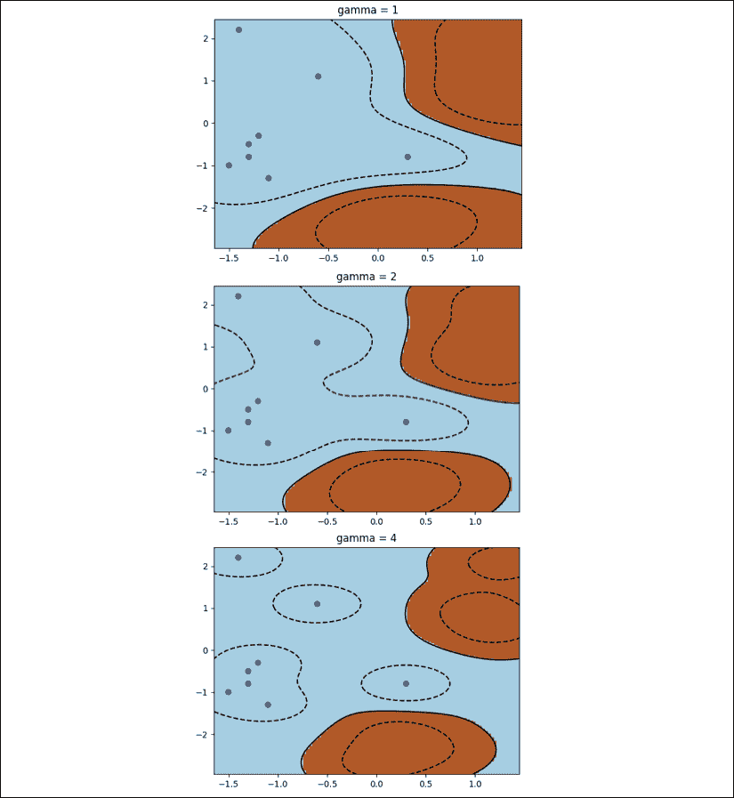

图 3.11:不同γ值下的 SVM 分类决策边界

我们可以观察到较大的导致区域变窄，这意味着对数据集的拟合更加严格；较小的会产生较宽的区域，这意味着数据集上的宽松拟合。当然，可以通过交叉验证进行微调，获得最佳表现。

其他一些常见的核函数包括 T2 多项式核

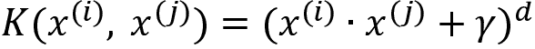

而**乙状结肠**内核:

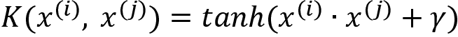

在没有分布的先验知识的情况下，径向基函数核在实际应用中通常是优选的，因为在多项式核(多项式次数 *d* )中有一个额外的参数要调整，经验 sigmoid 核的性能可以与径向基函数大致相当，但仅在某些参数下。因此，在给定数据集的情况下，我们在线性核(也被认为是无核)和径向基函数核之间进行辩论。

## 在线性核和径向基函数核之间进行选择

当然，当选择正确的内核开始时，线性可分性是经验法则。但是，大多数情况下，这很难识别，除非您对数据集有足够的先验知识，或者数据集的特征是低维的(1 到 3)。

一些公知的一般先验知识包括文本数据通常是线性可分的，而从`XOR`函数([https://en.wikipedia.org/wiki/XOR_gate](https://en.wikipedia.org/wiki/XOR_gate))生成的数据则不是。

现在，让我们看看下面三个场景，其中线性核比径向基函数更受青睐。

**场景 1** :特征数量和实例数量都很大(超过 104 或 105 个)。由于特征空间的维数足够高，作为径向基函数变换的结果的附加特征不会提供性能改进，但是这将增加计算费用。UCI 机器学习存储库中的一些示例属于这种类型:

*   *URL 信誉数据集:*[https://archive.ics.uci.edu/ml/datasets/URL+Reputation](https://archive.ics.uci.edu/ml/datasets/URL+Reputation)(实例数:2，396，130；特征数:3，231，961)。这是为基于词法和主机信息的恶意网址检测而设计的。
*   *YouTube 多视角视频游戏数据集:*[https://archive . ics . UCI . edu/ml/datasets/YouTube+多视角+视频+游戏+数据集](https://archive.ics.uci.edu/ml/datasets/YouTube+Multiview+Video+Games+Dataset)(实例数:12 万；功能数量:1，000，000)。这是专为题目分类的。

**场景 2** :与训练样本数量相比，特征数量明显较大。除了*场景 1* 中陈述的原因之外，径向基函数核明显更容易过度拟合。例如，在以下示例中会出现这种情况:

*   *多萝西娅数据集*:[https://archive.ics.uci.edu/ml/datasets/Dorothea](https://archive.ics.uci.edu/ml/datasets/Dorothea)(实例数:1，950；功能数量:100，000)。这是为药物发现而设计的根据化合物的结构分子特征将其分为活性或非活性。
*   *Arcene 数据集*:[https://archive.ics.uci.edu/ml/datasets/Arcene](https://archive.ics.uci.edu/ml/datasets/Arcene)(实例数:900；特色数量:万个。这是一个用于癌症检测的质谱数据集。

**场景 3** :实例的数量与特征的数量相比是非常大的。对于低维数据集，径向基函数核通常会通过将其映射到高维空间来提高性能。然而，由于训练的复杂性，在具有超过 106 或 107 个样本的训练集上，它通常变得低效。示例数据集包括以下内容:

*   *异质性活动识别数据集*:[https://archive . ics . UCI . edu/ml/datasets/异质性+活动+识别](https://archive.ics.uci.edu/ml/datasets/Heterogeneity+Activity+Recognition)(实例数43，930，257；特征数量:16)。这是为人类活动识别而设计的。
*   *HIGGS 数据集:*[https://archive.ics.uci.edu/ml/datasets/HIGGS](https://archive.ics.uci.edu/ml/datasets/HIGGS)(实例数:1100 万；特征数量:28)。这是为了区分产生希格斯玻色子的信号过程和背景过程。

除了这三种情况，径向基函数通常是第一选择。

线性核和径向基函数核之间的选择规则可以总结如下:

<colgroup><col> <col> <col></colgroup> 
| 方案 | 线性的 | 肾血流量（renal blood flow 的缩写） |
| 先验知识 | 如果是线性可分的 | 如果非线性分离 |
| 1 到 3 维的可视化数据 | 如果是线性可分的 | 如果非线性分离 |
| 特征的数量和实例的数量都很大。 | 首选 |  |
| 功能>>实例 | 首选 |  |
| 实例>>特征 | 首选 |  |
| 其他人 |  | 首选 |

表 3.1:线性核和径向基函数核之间的选择规则

再次，**首选**意味着我们可以**从**这个选项开始；这并不意味着这是前进的唯一选择。

接下来，我们来看看人脸图像的分类。

# 用 SVM 分类人脸图像

最后，是时候用你刚刚学到的所有东西构建一个基于 SVM 的人脸图像分类器了。我们将分部分进行，探索图像数据集。

## 探索人脸图像数据集

我们将从 scikit-learn 中使用【野生的 T1】标签人脸 ( **LFW** )人物数据集([https://sci kit-learn . org/stable/modules/generated/sklearn . datasets . fetch _ lfw _ people . html](https://scikit-learn.org/stable/modules/generated/sklearn.datasets.fetch_lfw_people.html))。它由 5000 多位名人的 13000 多张精选人脸图像组成。每个类都有不同数量的图像样本。

首先，我们如下加载人脸图像数据:

```py
>>> from sklearn.datasets import fetch_lfw_people
Downloading LFW metadata:c https://ndownloader.figshare.com/files/5976012
Downloading LFW metadata: https://ndownloader.figshare.com/files/5976009
Downloading LFW metadata: https://ndownloader.figshare.com/files/5976006
Downloading LFW data (~200MB): https://ndownloader.figshare.com/files/5976015
>>> face_data = fetch_lfw_people(min_faces_per_person=80) 
```

我们只加载至少有 80 个样本的类，这样我们就有足够的训练数据。注意，如果遇到需要 **Python 图像库** ( **PIL** )从 jpeg 文件加载数据的问题，请在终端安装如下的包`pillow`:

```py
pip install pillow 
```

接下来，我们看一下我们加载的数据:

```py
>>> X = face_data.data
>>> Y = face_data.target
>>> print('Input data size :', X.shape)
Input data size : (1140, 2914)
>>> print('Output data size :', Y.shape)
Output data size : (1140,)
>>> print('Label names:', face_data.target_names)
Label names: ['Colin Powell' 'Donald Rumsfeld' 'George W Bush' 'Gerhard Schroeder' 'Tony Blair'] 
```

这个五类数据集包含 1，140 个样本，一个样本有 2，914 个维度。作为一种良好的做法，我们分析标签分布如下:

```py
>>> for i in range(5):
...     print(f'Class {i} has {(Y == i).sum()} samples.')
Class 0 has 236 samples.
Class 1 has 121 samples.
Class 2 has 530 samples.
Class 3 has 109 samples.
Class 4 has 144 samples. 
```

数据集相当不平衡。当我们构建模型时，让我们记住这一点。

现在让我们绘制一些面部图像:

```py
>>> import matplotlib.pyplot as plt
>>>
>>> fig, ax = plt.subplots(3, 4)
>>> for i, axi in enumerate(ax.flat):
...     axi.imshow(face_data.images[i], cmap='bone')
...     axi.set(xticks=[], yticks=[],
...             xlabel=face_data.target_names[face_data.target[i]])
...
>>> plt.show() 
```

您将看到以下 12 幅带有标签的图像:


图 3.12:来自 LFW 人数据集的样本

既然我们已经讨论了探索性数据分析，我们将在下一节进入模型开发阶段。

## 构建基于 SVM 的图像分类器

首先，我们将数据分成训练和测试集:

```py
>>> X_train, X_test, Y_train, Y_test = train_test_split(X, Y, random_state=42) 
```

在这个项目中，维度的数量大于样本的数量。这是 SVM 有效解决的一个分类案例。在我们的解决方案中，我们将通过交叉验证来调整超参数，包括惩罚`C`、核(线性或径向基函数)和(径向基函数核)。

然后，我们初始化一个通用的 SVM 模型:

```py
>>> clf = SVC(class_weight='balanced', random_state=42) 
```

数据集不平衡，所以我们设置`class_weight='balanced`来强调代表性不足的类。

到目前为止，我们进行交叉验证的方式是显式地将数据拆分成折叠，并重复编写一个`for`循环来连续检查每个超参数。为了减少这种冗余，我们将引入一种更优雅的方法，利用 scikit-learn 的`GridSearchCV`模块。`GridSearchCV`隐式处理整个过程，包括数据拆分、折叠生成、交叉训练和验证，最后是对最佳参数集的彻底搜索。留给我们的只是指定调谐的超参数和每个单个超参数要探索的值:

```py
>>> parameters = {'C': [0.1, 1, 10],
...               'gamma': [1e-07, 1e-08, 1e-06],
...               'kernel' : ['rbf', 'linear'] }
>>> from sklearn.model_selection import GridSearchCV
>>> grid_search = GridSearchCV(clf, parameters, n_jobs=-1, cv=5) 
```

我们刚刚初始化的`GridSearchCV`模型将进行五重交叉验证(`cv=5`)，并将在所有可用内核(`n_jobs=-1`)上并行运行。然后，我们通过简单地应用`fit`方法来执行超参数调整:

```py
>>> grid_search.fit(X_train, Y_train) 
```

我们使用以下代码获得最优超参数集:

```py
>>> print('The best model:\n', grid_search.best_params_)
The best model:
 {'C': 10, 'gamma': 1e-07, 'kernel': 'rbf'} 
```

并且我们通过使用以下代码在最佳参数集下获得最佳的五倍平均性能:

```py
>>> print('The best averaged performance:', grid_search.best_score_)
 The best averaged performance: 0.8526315789473684 
```

然后，我们检索具有最优超参数集的 SVM 模型，并将其应用于测试集:

```py
>>> clf_best = grid_search.best_estimator_
>>> pred = clf_best.predict(X_test) 
```

然后，我们计算准确度和分类报告:

```py
>>> print(f'The accuracy is: {clf_best.score(X_test,
...       Y_test)*100:.1f}%')
The accuracy is: 87.7%
>>> print(classification_report(Y_test, pred,
...           target_names=face_data.target_names))
                   precision    recall  f1-score   support
     Colin Powell       0.89      0.88      0.88        64
  Donald Rumsfeld       0.84      0.81      0.83        32
    George W Bush       0.88      0.93      0.90       127
Gerhard Schroeder       0.84      0.72      0.78        29
       Tony Blair       0.91      0.88      0.89        33
        micro avg       0.88      0.88      0.88       285
        macro avg       0.87      0.84      0.86       285
     weighted avg       0.88      0.88      0.88       285 
```

需要注意的是，我们基于原始的训练集对模型进行了调优，该训练集内部分为折叠进行交叉训练和验证，我们将最优模型应用于原始的测试集。我们以这种方式检查分类性能，以便测量模型的一般化程度，从而在全新的数据集上做出正确的预测。最佳 SVM 模型达到了`87.7%`的精度。

还有另一个 SVM 分类器`LinearSVC`([https://scikit-learn . org/stable/modules/generated/sklearn . SVM . linear SVC . html](https://scikit-learn.org/stable/modules/generated/sklearn.svm.LinearSVC.html))来自 sci kit-learn。与`SVC`有何不同？`LinearSVC`类似于带线性核的`SVC`，但它是基于`liblinear`库实现的，比带线性核的`libsvm`优化更好，其罚函数更灵活。

总的来说，用`LinearSVC`模型训练要比`SVC.`快，这是因为高可扩展性的`liblinear`库是为大数据集设计的，而计算复杂度超过二次的`libsvm`库在超过 10 个 <sup class="" style="font-style: italic;">5 个</sup>训练实例的情况下无法很好地扩展。但是，同样的，`LinearSVC`模型仅限于线性核。

## 利用主成分分析提高图像分类性能

我们还可以通过使用**主成分分析** ( **主成分分析**)([https://en.wikipedia.org/wiki/Principal_component_analysis](https://en.wikipedia.org/wiki/Principal_component_analysis)对输入的特征进行压缩来改进图像分类器。它降低了原始特征空间的维度，保留了特征之间最重要的内部关系。简单来说，PCA 将原始数据投影到具有最重要方向(坐标)的较小空间中。我们希望在我们拥有比训练样本更多的特征的情况下，考虑较少的特征作为使用主成分分析降维的结果可以防止过度拟合。

我们将用 scikit-learn 的`PCA`模块([https://sci kit-learn . org/stable/modules/generated/sklearn . declaration . PCA . html](https://scikit-learn.org/stable/modules/generated/sklearn.decomposition.PCA.html))实现 PCA。我们将首先应用主成分分析来降低维数，并在所得数据上训练分类器。在机器学习中，我们通常连接多个连续的步骤，并将它们视为一个“模型”。我们称这个过程为**流水线**。我们利用 scikit-learn 的`pipeline`API([https://sci kit-learn . org/stable/modules/generated/sklearn . pipeline . pipeline . html](https://scikit-learn.org/stable/modules/generated/sklearn.pipeline.Pipeline.html))来实现这一点。

现在让我们初始化一个主成分分析模型、一个支持向量机模型和一个模型流水线这两个:

```py
>>> from sklearn.decomposition import PCA
>>> pca = PCA(n_components=100, whiten=True, random_state=42)
>>> svc = SVC(class_weight='balanced', kernel='rbf',
...           random_state=42)
>>> from sklearn.pipeline import Pipeline
>>> model = Pipeline([('pca', pca),
...                  ('svc', svc)]) 
```

主成分分析组件将原始数据投影到 100 维空间，然后是带有径向基函数核的支持向量机分类器。然后，我们从几个选项中网格搜索最佳模型:

```py
>>> parameters_pipeline = {'svc__C': [1, 3, 10],
...                       'svc__gamma': [0.001, 0.005]}
>>> grid_search = GridSearchCV(model, parameters_pipeline)
>>> grid_search.fit(X_train, Y_train) 
```

最后，我们打印出最佳超参数集和具有最佳模型的分类性能:

```py
>>> print('The best model:\n', grid_search.best_params_)
The best model:
 {'svc__C': 3, 'svc__gamma': 0.005}
>>> print('The best averaged performance:', grid_search.best_score_)
The best averaged performance: 0.8467836257309942
>>> model_best = grid_search.best_estimator_
>>> print(f'The accuracy is: {model_best.score(X_test, Y_test)*100:.1f}%')
The accuracy is: 92.3%
>>> pred = model_best.predict(X_test)
>>> print(classification_report(Y_test, pred, target_names=face_data.target_names))
                   precision    recall  f1-score   support
     Colin Powell       0.97      0.95      0.96        64
  Donald Rumsfeld       0.93      0.84      0.89        32
    George W Bush       0.92      0.98      0.95       127
Gerhard Schroeder       0.88      0.79      0.84        29
       Tony Blair       0.88      0.85      0.86        33
        micro avg       0.92      0.92      0.92       285
        macro avg       0.92      0.88      0.90       285
     weighted avg       0.92      0.92      0.92       285 
```

由主成分分析和 SVM 分类器组成的模型达到了“T0”的精度。主成分分析提高了基于 SVM 的图像分类器的性能。如果你感兴趣，你可以在[上阅读更多关于主成分分析的内容。](https://www.kaggle.com/nirajvermafcb/principal-component-analysis-explained)

随着 SVM 在图像分类中的成功应用，我们将在下一节再看一个例子。

# 心电描记术中的胎儿状态分类

我们将建立一个分类器，帮助产科医生将**心电图** ( **CTGs** )分为三种胎儿状态(正常、可疑和病理)之一。我们将使用的心电图数据集来自 UCI 机器学习资源库中的[https://archive.ics.uci.edu/ml/datasets/Cardiotocography](https://archive.ics.uci.edu/ml/datasets/Cardiotocography)，可以直接从[https://archive . ics . UCI . edu/ml/机器学习-databases/00193/CTG.xls](https://archive.ics.uci.edu/ml/machine-learning-databases/00193/CTG.xls) 下载。`xls` Excel 文件。该数据集包括作为特征的胎儿心率和子宫收缩的测量值，以及作为标签的胎儿状态分类代码(1 =正常，2 =可疑，3 =病理)。总共有 2126 个样本，具有 23 个特征。基于实例和特征的数量(2，126 不明显大于 23)，径向基函数核是首选。

我们将使用熊猫来处理 Excel 文件，熊猫适用于表格数据。当您运行以下代码行时，它可能会请求额外安装`xlrd`包，因为它的 Excel 模块是基于`xlrd`构建的。如果是，只需在终端运行`pip install xlrd`到安装`xlrd`。

我们首先读取位于名为`Raw Data`的表格中的数据:

```py
>>> import pandas as pd
>>> df = pd.read_excel('CTG.xls', "Raw Data") 
```

然后，我们获取这 2126 个数据样本，并分配特征集(从电子表格中的列`D`到`AL`)和标签集(列`AN`):

```py
>>> X = df.iloc[1:2126, 3:-2].values
>>> Y = df.iloc[1:2126, -1].values 
```

别忘了检查班级比例:

```py
>>> print(Counter(Y))
Counter({1.0: 1655, 2.0: 295, 3.0: 176}) 
```

我们留出 20%的原始数据用于最终测试:

```py
>>> X_train, X_test, Y_train, Y_test = train_test_split(X, Y,
...                                 test_size=0.2, random_state=42) 
```

现在，我们根据惩罚`C`和`kernel`系数来调整基于径向基函数的 SVM 模型:

```py
>>> svc = SVC(kernel='rbf')
>>> parameters = {'C': (100, 1e3, 1e4, 1e5),
...               'gamma': (1e-08, 1e-7, 1e-6, 1e-5)}
>>> grid_search = GridSearchCV(svc, parameters, n_jobs=-1, cv=5)
>>> grid_search.fit(X_train, Y_train)
>>> print(grid_search.best_params_)
{'C': 100000.0, 'gamma': 1e-07}
>>> print(grid_search.best_score_)
0.9547058823529412 
```

最后，我们将最优模型应用于测试集:

```py
>>> svc_best = grid_search.best_estimator_
>>> accuracy = svc_best.score(X_test, Y_test)
>>> print(f'The accuracy is: {accuracy*100:.1f}%')
The accuracy is: 96.5% 
```

此外，我们必须检查各个类的性能，因为数据非常不平衡:

```py
>>> prediction = svc_best.predict(X_test)
>>> report = classification_report(Y_test, prediction)
>>> print(report)
           precision recall f1-score  support
       1.0    0.98    0.98     0.98     333
       2.0    0.89    0.91     0.90     64
       3.0    0.96    0.93     0.95     29
micro avg     0.96    0.96     0.96     426
macro avg     0.95    0.94     0.94     426
weighted avg  0.96    0.96     0.96     426 
```

我们现在已经成功地构建了另一个基于 SVM 的分类器来解决一个现实世界的问题:心脏生育图中的胎儿状态分类。

# 摘要

在这一章中，我们和 SVM 一起继续我们的监督学习之旅。您学习了 SVM 的机制、SVM 的内核技术和实现，以及机器学习分类的其他重要概念，包括多类分类策略和网格搜索，以及使用 SVM 的有用技巧(例如，在内核和调整参数之间进行选择)。然后，我们最终以真实世界用例的形式将您所学的内容付诸实践，包括人脸识别和胎儿状态分类。

到目前为止，您已经学习并采用了两种分类算法，朴素贝叶斯和 SVM。朴素贝叶斯是一种简单的算法(顾名思义)。对于具有独立或接近独立特征的数据集，朴素贝叶斯通常表现良好。SVM 多才多艺，适应数据的线性可分性。一般来说，SVM 可以通过正确的内核和参数实现高精度。然而，这可能是以高计算和高内存消耗为代价的。在实践中，我们可以简单地尝试这两种方法，并选择具有最佳参数的较好方法。

在下一章中，我们将研究在线广告，并预测用户是否会点击广告。这将通过基于树的算法来完成，包括**决策树**和**随机森林**。

# 练习

1.  你能用`LinearSVC`模块实现 SVM 吗？你需要调整哪些超参数，你能达到的最佳人脸识别性能是什么？
2.  能不能在图像识别项目中多分类几类？举个例子，你可以设置`min_faces_per_person=50`。使用网格搜索和交叉验证可以获得的最佳性能是什么？