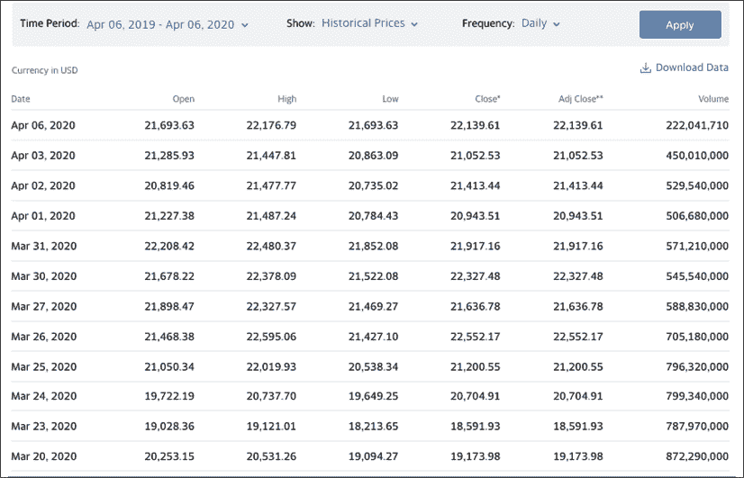
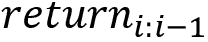
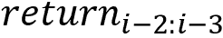
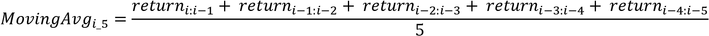
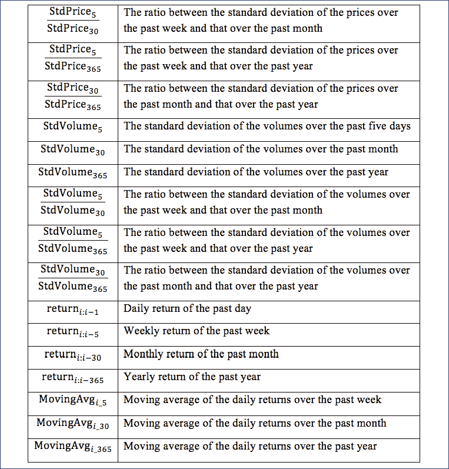
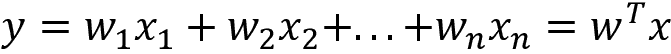
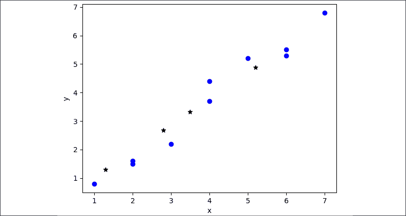
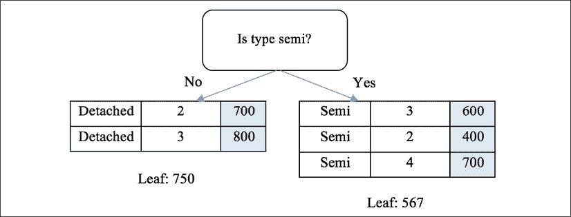
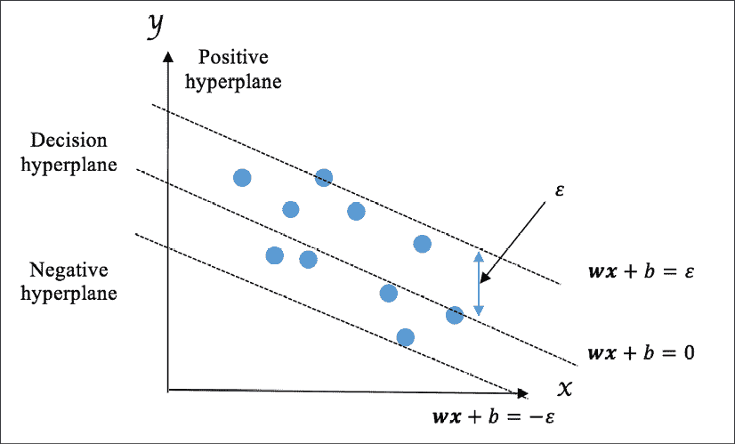

# seven

# 用回归算法预测股票价格

在前一章中，我们使用 Spark 在大型点击数据集上训练了一个分类器。在这一章中，我们将解决一个大家都感兴趣的问题——预测股票价格。通过明智的投资致富——谁不感兴趣？！大量金融、交易甚至科技公司都在积极研究股市走势和股价预测。已经开发了多种方法来使用机器学习技术预测股票价格。在这里，我们将集中学习几种流行的回归算法，包括线性回归、回归树和回归森林以及支持向量回归，并利用它们来解决这个十亿(或万亿)美元的问题。

我们将在本章中讨论以下主题:

*   介绍股票市场和股票价格
*   什么是回归？
*   股票数据采集和特征工程
*   线性回归力学
*   实现线性回归(从头开始，使用 scikit-learn 和 TensorFlow)
*   回归树的机制
*   实现回归树(从头开始并使用 scikit-learn)
*   从回归树到回归林
*   支持向量回归机及其 scikit-learn 实现
*   回归性能评估
*   用回归算法预测股票价格

# 股票市场和股票价格概述

公司的股票意味着公司的所有权。股票的单一份额代表对公司的部分资产和收益的要求，与股票总数成比例。例如，如果一名投资者拥有一家公司的 50 股股票，而该公司总共有 1000 股流通股，则该投资者(或股东)将拥有并有权获得该公司 5%的资产和收益。

公司股票可以通过证券交易所和组织在股东和其他方之间进行交易。主要证券交易所包括纽约证券交易所、纳斯达克、伦敦证券交易所集团、上海证券交易所和香港证券交易所。股票交易价格的波动主要是由供求规律决定的。在任何一个时刻，供给是公众投资者手中的股票数量，需求是投资者想要购买的股票数量，股票价格上下波动以达到和保持均衡。

一般来说，投资者希望低买高卖。这听起来很简单，但实施起来很有挑战性，因为很难判断一只股票的价格会上涨还是下跌。有两种主要的研究试图理解导致价格变化的因素和条件，甚至预测未来的股票价格，**基本面分析**和**技术分析**:

*   **基本面分析**:这个流重点关注影响公司价值和业务的底层因素，包括宏观角度的整体经济和行业状况，微观角度的公司财务状况、管理层和竞争对手。
*   **技术分析**:另一方面这个流通过对过去交易活动的统计研究来预测未来的价格走势，包括价格走势、成交量和市场数据。通过机器学习技术预测价格是当今技术分析中的一个重要课题。

许多定量交易公司一直在使用机器学习来增强自动化和算法交易。在本章中，我们将作为一名定量分析师/研究员，探索如何用几种典型的**机器学习回归**算法预测股价。

# 什么是回归？

**回归**是机器学习中主要的监督学习类型之一。在回归中，训练集包含观测值(也称为特征)及其相关的**连续**目标值。回归的过程有两个阶段:

*   第一阶段是探索观测和目标之间的关系。这是训练阶段。
*   第二阶段是使用第一阶段的模式为未来的观察生成目标。这是预测阶段。

下图描述了整个过程:


图 7.1:回归中的训练和预测阶段

回归和分类的主要区别在于回归中的输出值是连续的，而分类中的输出值是离散的。这导致这两种监督学习方法的应用领域不同。分类基本上是用来确定想要的成员或特征，正如你在前面几章中看到的，比如电子邮件是否是垃圾邮件、新闻组主题或广告点击。另一方面，回归主要涉及估计结果或预测反应。

用线性回归估计连续目标的一个例子如下，我们试图用一组二维数据点拟合一条线:


图 7.2:线性回归示例

典型的机器学习回归问题包括以下几个方面:

*   根据位置、面积、卧室数量和浴室预测房价
*   基于关于系统进程和内存的信息估计功耗
*   零售需求预测
*   预测股票价格

我在这一节已经谈到了回归，并将在下一节简要介绍它在股票市场和交易中的使用。

# 挖掘股价数据

理论上，我们可以应用回归技术来预测特定股票的价格。然而，很难确保我们挑选的股票适合学习目的——它的价格应该遵循一些可学习的模式，它不可能受到前所未有的情况或不规则事件的影响。因此，我们在这里将重点关注最受欢迎的股票指数之一，以更好地说明和概括我们的价格回归方法。

我们先来介绍一下什么是指数。一个**股票指数**是对整个股票市场的一部分价值的一个统计测量。一个指数包括几只不同的股票，足以代表整个市场的一部分。指数的价格通常被计算为所选股票价格的加权平均值。

道琼斯工业平均指数是世界上建立时间最长、最受关注的指数之一。它由美国最重要的 30 只股票组成，如微软、苹果、通用电气和华特·迪士尼公司，约占整个美国市场价值的四分之一。您可以在[https://finance.yahoo.com/quote/%5EDJI/history?p=%5EDJI](https://finance.yahoo.com/quote/%5EDJI/history?p=%5EDJI)的雅虎财经上查看其每日价格和表现:



图 7.3:雅虎财经每日价格和业绩截图

在每个交易日，股票的价格都会发生变化，并被实时记录下来。说明价格在一个时间单位(通常是一天，但也可以是一周或一个月)内变动的五个数值是关键的交易指标。它们如下:

*   **开仓**:给定交易日的起始价
*   **收盘**:当日最终价格
*   **高位**:当日股票交易的最高价格
*   **低点**:当日股票交易的最低价格
*   **成交量**:当日收盘前交易的股票总数

除 DJIA 以外的其他主要指数包括:

*   标准普尔 500(标准普尔 500 指数的简称)指数由美国 500 只最常交易的股票组成，占整个美国市场价值的 80%([https://finance.yahoo.com/quote/%5EGSPC/history?p=%5EGSPC](https://finance.yahoo.com/quote/%5EGSPC/history?p=%5EGSPC))
*   纳斯达克综合指数由纳斯达克交易的所有股票组成([https://finance.yahoo.com/quote/%5EIXIC/history?p=%5EIXIC](https://finance.yahoo.com/quote/%5EIXIC/history?p=%5EIXIC)
*   罗素 2000 指数是美国 3000 家最大上市公司中最后 2000 家的集合(https://finance.yahoo.com/quote/%5ERUT/history?p=%5ERUT T2)
*   伦敦富时 100 指数由伦敦证券交易所上市的市值最高的 100 家公司组成(https://finance.yahoo.com/quote/%5EFTSE/和 T2)

我们将重点关注 DJIA，并利用其历史价格和表现来预测未来价格。在接下来的部分中，我们将探索如何开发价格预测模型，特别是回归模型，以及哪些可以用作指标或预测特征。

## 功能工程入门

说到机器学习算法，首先要问的问题通常是有哪些特征可用或者预测变量是什么。

用来预测 DJIA 未来价格的驱动因素，即**收盘**价格，包括历史和当前**开盘**价格以及历史表现(**高**、**低**、**成交量**)。注意，当前或当天的表现(**高位**、**低位**、**成交量**)不应该包括在内，因为我们根本无法预见当天收盘前股票交易的最高和最低价格或交易的股票总数。

仅用上述四个指标预测收盘价似乎不太乐观，可能会导致拟合不足。因此，我们需要想办法生成更多的特征，以提高预测能力。概括地说，在机器学习中，**特征工程**是基于现有特征创建特定领域特征的过程，以提高机器学习算法的性能。

特征工程通常需要足够的领域知识，并且可能非常困难和耗时。实际上，用于解决机器学习问题的功能通常不是直接可用的，需要专门设计和构建，例如垃圾邮件检测和新闻组分类中的术语频率或 tf-idf 功能。因此，特征工程在机器学习中是必不可少的，并且通常是我们花费最多精力来解决实际问题的地方。

在做投资决定时，投资者通常会看一段时间内的历史价格，而不仅仅是前一天的价格。因此，在我们的股价预测案例中，我们可以将过去一周(五个交易日)、过去一个月和过去一年的平均收盘价计算为三个新特征。我们还可以将时间窗口定制为我们想要的大小，例如过去一个季度或过去六个月。在这三个平均价格特征的基础上，我们可以通过计算三个不同时间范围内每对平均价格之间的比率来生成与价格趋势相关联的新特征，例如，过去一周和过去一年的平均价格之间的比率。

除了价格，成交量是投资者分析的另一个重要因素。同样，我们可以通过计算几个不同时间段的平均体积和每对平均值之间的比率来生成新的基于体积的特征。

除了一个时间窗口内的历史平均值，投资者还会大量考虑股票的波动性。波动率描述给定股票或指数的价格随时间变化的程度。用统计学术语来说，基本上就是收盘价的标准差。我们可以通过计算特定时间范围内收盘价的标准偏差以及交易量的标准偏差，轻松生成新的特征集。以类似的方式，每对标准偏差值之间的比率可以包含在我们的工程特征池中。

最后但同样重要的是，回报是投资者密切关注的一个重要财务指标。回报率是股票/指数在特定时期内收盘价的收益或损失百分比。例如，日回报和年回报是我们经常听到的财务术语。它们的计算方法如下:


这里，*价格* <sub xmlns:epub="http://www.idpf.org/2007/ops" class="" style="font-style: italic;">i</sub> 是*I*T6 日的价格，*价格*T10【IT12】-1 是前一天的价格。周回报和月回报可以用类似的方式计算。根据每日收益，我们可以得出特定天数内的移动平均线。

例如，给定过去一周的每日回报、、、、和，我们可以计算该周的移动平均线如下:



总之，我们可以通过应用特征工程技术生成以下预测变量:


图 7.4:生成的特征(1)



图 7.5:生成的特征(2)

最终，我们能够生成总共 31 组特征，以及以下六个原始特征:

*   开盘价 <sub class="" style="font-style: italic;">i</sub> :此功能代表开盘价
*   开盘价 <sub class="" style="font-style: italic;">i-1</sub> :此功能代表过去一天的开盘价
*   收盘价 <sub class="" style="font-style: italic;">i-1</sub> :此功能代表过去一天的收盘价
*   高价 <sub class="" style="font-style: italic;">i-1</sub> :此功能代表过去一天的最高价格
*   低价 <sub class="" style="font-style: italic;">i-1</sub> :此功能代表过去一天的最低价
*   体积 <sub class="" style="font-style: italic;">i-1</sub> :该特征表示过去一天的体积

## 获取数据和生成特征

为了便于参考，我们将在这里而不是在后面的章节中实现生成特征的代码。我们将从获取项目所需的数据集开始。

在整个项目中，我们将从雅虎金融获取股票指数价格和业绩数据。比如在历史数据页面[https://finance.yahoo.com/quote/%5EDJI/history?p=%5EDJI](https://finance.yahoo.com/quote/%5EDJI/history?p=%5EDJI)我们可以把`Time Period`改成`Dec 01, 2005 – Dec10, 2005`，在`Show`中选择`Historical Prices`，在`Frequency` 中选择`Daily` (或者直接打开这个链接:[https://finance.yahoo.com/quote/%5EDJI/history?period 1 = 1133395200&period 2 = 1134172800&间隔=1d &过滤=历史&频率= 1d&includeAdjustedClose = true](https://finance.yahoo.com/quote/%5EDJI/history?period1=1133395200&period2=1134172800&interval=1d&fil)，然后点击**应用**按钮。点击**下载数据**按钮下载数据并命名文件`20051201_20051210.csv`。

我们可以加载刚刚下载的数据，如下所示:

```py
>>> mydata = pd.read_csv('20051201_20051210.csv', index_col='Date')
>>> mydata
               Open         High         Low          Close 
Date
2005-12-01 10806.030273 10934.900391 10806.030273 10912.570312
2005-12-02 10912.009766 10921.370117 10861.660156 10877.509766
2005-12-05 10876.950195 10876.950195 10810.669922 10835.009766
2005-12-06 10835.410156 10936.200195 10835.410156 10856.860352
2005-12-07 10856.860352 10868.059570 10764.009766 10810.910156
2005-12-08 10808.429688 10847.250000 10729.669922 10755.120117
2005-12-09 10751.759766 10805.950195 10729.910156 10778.580078
              Volume    Adjusted Close
Date
2005-12-01 256980000.0   10912.570312
2005-12-02 214900000.0   10877.509766
2005-12-05 237340000.0   10835.009766
2005-12-06 264630000.0   10856.860352
2005-12-07 243490000.0   10810.910156
2005-12-08 253290000.0   10755.120117
2005-12-09 238930000.0   10778.580078 
```

注意输出是一个`pandas`数据帧对象。`Date`栏为指标栏，其余栏为对应的财务变量。在下面几行代码中，您将看到 pandas 在简化**关系**(或类似表的)数据的数据分析和转换方面有多么强大。

首先，我们通过从一个子功能开始实现特征生成，该子功能从最初的六个特征直接创建特征，如下所示:

```py
>>> def add_original_feature(df, df_new):
...     df_new['open'] = df['Open']
...     df_new['open_1'] = df['Open'].shift(1)
...     df_new['close_1'] = df['Close'].shift(1)
...     df_new['high_1'] = df['High'].shift(1)
...     df_new['low_1'] = df['Low'].shift(1)
...     df_new['volume_1'] = df['Volume'].shift(1) 
```

然后，我们开发一个子函数，生成与平均收盘价相关的六个特征:

```py
>>> def add_avg_price(df, df_new):
...     df_new['avg_price_5'] = 
                     df['Close'].rolling(5).mean().shift(1)
...     df_new['avg_price_30'] =  
                     df['Close'].rolling(21).mean().shift(1)
...     df_new['avg_price_365'] = 
                     df['Close'].rolling(252).mean().shift(1)
...     df_new['ratio_avg_price_5_30'] = 
                 df_new['avg_price_5'] / df_new['avg_price_30']
...     df_new['ratio_avg_price_5_365'] = 
                 df_new['avg_price_5'] / df_new['avg_price_365']
...     df_new['ratio_avg_price_30_365'] = 
                df_new['avg_price_30'] / df_new['avg_price_365'] 
```

类似地，生成与平均体积相关的六个特征的子功能如下:

```py
>>> def add_avg_volume(df, df_new):
...     df_new['avg_volume_5'] = 
                  df['Volume'].rolling(5).mean().shift(1)
...     df_new['avg_volume_30'] =   
                  df['Volume'].rolling(21).mean().shift(1)
...     df_new['avg_volume_365'] = 
                      df['Volume'].rolling(252).mean().shift(1)
...     df_new['ratio_avg_volume_5_30'] = 
                df_new['avg_volume_5'] / df_new['avg_volume_30']
...     df_new['ratio_avg_volume_5_365'] = 
               df_new['avg_volume_5'] / df_new['avg_volume_365']
...     df_new['ratio_avg_volume_30_365'] = 
               df_new['avg_volume_30'] / df_new['avg_volume_365'] 
```

对于标准差，我们为价格相关特性开发了以下子函数:

```py
>>> def add_std_price(df, df_new):
...     df_new['std_price_5'] = 
               df['Close'].rolling(5).std().shift(1)
...     df_new['std_price_30'] = 
               df['Close'].rolling(21).std().shift(1)
...     df_new['std_price_365'] = 
               df['Close'].rolling(252).std().shift(1)
...     df_new['ratio_std_price_5_30'] = 
               df_new['std_price_5'] / df_new['std_price_30']
...     df_new['ratio_std_price_5_365'] = 
               df_new['std_price_5'] / df_new['std_price_365']
...     df_new['ratio_std_price_30_365'] = 
               df_new['std_price_30'] / df_new['std_price_365'] 
```

类似地，生成六个基于体积的标准偏差特征的子函数如下:

```py
>>> def add_std_volume(df, df_new):
...     df_new['std_volume_5'] = 
                 df['Volume'].rolling(5).std().shift(1)
...     df_new['std_volume_30'] = 
                 df['Volume'].rolling(21).std().shift(1)
...     df_new['std_volume_365'] = 
                 df['Volume'].rolling(252).std().shift(1)
...     df_new['ratio_std_volume_5_30'] = 
                df_new['std_volume_5'] / df_new['std_volume_30']
...     df_new['ratio_std_volume_5_365'] = 
                df_new['std_volume_5'] / df_new['std_volume_365']
...     df_new['ratio_std_volume_30_365'] = 
               df_new['std_volume_30'] / df_new['std_volume_365'] 
```

使用以下子功能生成七个基于返回的特征:

```py
>>> def add_return_feature(df, df_new):
...     df_new['return_1'] = ((df['Close'] - df['Close'].shift(1))    
                               / df['Close'].shift(1)).shift(1)
...     df_new['return_5'] = ((df['Close'] - df['Close'].shift(5)) 
                               / df['Close'].shift(5)).shift(1)
...     df_new['return_30'] = ((df['Close'] - 
           df['Close'].shift(21)) / df['Close'].shift(21)).shift(1)
...     df_new['return_365'] = ((df['Close'] - 
         df['Close'].shift(252)) / df['Close'].shift(252)).shift(1)
...     df_new['moving_avg_5'] = 
                    df_new['return_1'].rolling(5).mean().shift(1)
...     df_new['moving_avg_30'] = 
                    df_new['return_1'].rolling(21).mean().shift(1)
...     df_new['moving_avg_365'] = 
                   df_new['return_1'].rolling(252).mean().shift(1) 
```

最后，我们将调用前面所有子函数的主要特征生成函数放在一起:

```py
>>> def generate_features(df):
...     """
...     Generate features for a stock/index based on historical price and performance
...     @param df: dataframe with columns "Open", "Close", "High", "Low", "Volume", "Adjusted Close"
...     @return: dataframe, data set with new features
...     """
...     df_new = pd.DataFrame()
...     # 6 original features
...     add_original_feature(df, df_new)
...     # 31 generated features
...     add_avg_price(df, df_new)
...     add_avg_volume(df, df_new)
...     add_std_price(df, df_new)
...     add_std_volume(df, df_new)
...     add_return_feature(df, df_new)
...     # the target
...     df_new['close'] = df['Close']
...     df_new = df_new.dropna(axis=0)
...     return df_new 
```

注意这里的窗口大小是 5、21 和 252，而不是代表周、月和年窗口的 7、30 和 365 。这是因为一年有 252 个(四舍五入)交易日，一个月有 21 个交易日，一周有 5 个交易日。

我们可以对 1988 年至 2019 年查询的 DJIA 数据应用这一特征工程策略，如下(或直接从本页下载:[https://finance.yahoo.com/quote/%5EDJI/history?周期 1=567993600 &周期 2=1577750400 &间隔=1d &滤波器=历史&频率=1d](https://finance.yahoo.com/quote/%5EDJI/history?period1=567993600&period2=1577750400&interval=1d&filt) ):

```py
>>> data_raw = pd.read_csv('19880101_20191231.csv', index_col='Date')
>>> data = generate_features(data_raw) 
```

看看具有新功能的数据是什么样子的:

```py
>>> print(data.round(decimals=3).head(5)) 
```

前面的命令行生成以下输出:


图 7.6:打印数据框前五行的截图

由于所有的特征和驱动因素都准备好了，我们现在将关注基于这些预测特征估计连续目标变量的回归算法。

# 线性回归估计

我们首先想到的回归模型是**线性回归**。顾名思义，这是否意味着使用线性函数拟合数据点？让我们探索一下。

## 线性回归是如何工作的？

简单来说，线性回归试图用二维空间的直线或三维空间的平面拟合尽可能多的数据点。它探索观测值和目标之间的线性关系，这种关系用线性方程或加权和函数来表示。给定一个带有 *n* 特征的数据样本 *x* ，*x*T8】1，*x*T12】2，…，*x*T16】n(*x*代表一个特征向量并且*x =(x*T22】1T24】，xT26】2 以及线性回归模型 *w* ( *w* 表示向量(*w*T42】1，*w*T46】2，…，*w*T50】n)的权重(也称为**系数)，目标 *y* 表示如下:**



同样，有时线性回归模型带有一个**截距**(也称为**偏差**)*w*T7】0，因此前面的线性关系如下:


看起来眼熟吗？您在*第五章*、*中学习的**逻辑回归**算法，用逻辑回归*预测在线广告点击率，只是在线性回归的基础上增加了逻辑变换，将连续加权和映射到 *0* (负)或 *1* (正)类。类似地，从训练数据中学习线性回归模型，或者具体地说是其权重向量 *w* ，目标是将定义的估计误差最小化为**均方误差** ( **均方误差**，其测量真实值和预测值之间的差值的平方的平均值。给定 *m* 训练样本，( *x* <sup xmlns:epub="http://www.idpf.org/2007/ops" class="Superscript--PACKT-">(1)</sup> 、 *y* <sup xmlns:epub="http://www.idpf.org/2007/ops" class="Superscript--PACKT-">(1)</sup> )、(*x*T29】(2)、 *y* <sup xmlns:epub="http://www.idpf.org/2007/ops" class="Superscript--PACKT-">(2)</sup> )、……(*x*T37】(T39】I <sup xmlns:epub="http://www.idpf.org/2007/ops" class="Superscript--PACKT-">*y*<sup xmlns:epub="http://www.idpf.org/2007/ops" class="Superscript--PACKT-">(</sup><sup xmlns:epub="http://www.idpf.org/2007/ops" class="" style="font-style: italic;">m</sup><sup xmlns:epub="http://www.idpf.org/2007/ops" class="Superscript--PACKT-">)</sup>)，关于待优化权重的成本函数 *J(w)* 表示如下:</sup>


这里，是预测。

同样，我们可以获得最优的 *w* ，从而使用梯度下降使 *J(w)* 最小化。一阶导数，梯度*∮w*，推导如下:


结合梯度和学习率η，权重向量 *w* 可以在每一步更新如下:


在大量的迭代之后，学习的 *w* 然后被用于预测新的样本，如下所示:


了解了线性回归背后的数学理论后，让我们在下一节从头开始实现它。

## 从头开始实现线性回归

既然你对基于梯度下降的线性回归有了透彻的了解，我们就从头开始实现。

我们首先用当前权重定义计算预测的函数:

```py
>>> def compute_prediction(X, weights):
...     """
...     Compute the prediction y_hat based on current weights
...     """
...     predictions = np.dot(X, weights)
...     return predictions 
```

然后，我们继续更新权重 *w* 的函数，以梯度下降的方式进行一步，如下所示:

```py
>>> def update_weights_gd(X_train, y_train, weights, 
learning_rate):
...     """
...     Update weights by one step and return updated wights
...     """
...     predictions = compute_prediction(X_train, weights)
...     weights_delta = np.dot(X_train.T, y_train - predictions)
...     m = y_train.shape[0]
...     weights += learning_rate / float(m) * weights_delta
...     return weights 
```

接下来，我们还添加了计算成本 *J(w)* 的函数:

```py
>>> def compute_cost(X, y, weights):
...     """
...     Compute the cost J(w)
...     """
...     predictions = compute_prediction(X, weights)
...     cost = np.mean((predictions - y) ** 2 / 2.0)
...     return cost 
```

现在，通过执行以下任务，将所有功能与模型训练功能放在一起:

1.  在每次迭代中更新权重向量
2.  打印出每 100 次(或任意次数)迭代的当前成本，以确保成本正在降低，并且一切都在正确的轨道上

让我们看看它是如何通过执行以下命令来完成的:

```py
>>> def train_linear_regression(X_train, y_train, max_iter, learning_rate, fit_intercept=False):
...     """
...     Train a linear regression model with gradient descent, and return trained model
...     """
...     if fit_intercept:
...         intercept = np.ones((X_train.shape[0], 1))
...         X_train = np.hstack((intercept, X_train))
...     weights = np.zeros(X_train.shape[1])
...     for iteration in range(max_iter):
...         weights = update_weights_gd(X_train, y_train, 
                                       weights, learning_rate)
...         # Check the cost for every 100 (for example) iterations
...         if iteration % 100 == 0:
...             print(compute_cost(X_train, y_train, weights))
...     return weights 
```

最后，使用训练好的模型预测新输入值的结果，如下所示:

```py
>>> def predict(X, weights):
...     if X.shape[1] == weights.shape[0] - 1:
...         intercept = np.ones((X.shape[0], 1))
...         X = np.hstack((intercept, X))
...     return compute_prediction(X, weights) 
```

正如您刚刚看到的，实现线性回归与逻辑回归非常相似。让我们用一个小例子来检验它:

```py
>>> X_train = np.array([[6], [2], [3], [4], [1], 
                        [5], [2], [6], [4], [7]])
>>> y_train = np.array([5.5, 1.6, 2.2, 3.7, 0.8, 
                        5.2, 1.5, 5.3, 4.4, 6.8]) 
```

基于包含截距的权重，以`0.01`的学习速率，通过`100`迭代训练线性回归模型:

```py
>>> weights = train_linear_regression(X_train, y_train,
            max_iter=100, learning_rate=0.01, fit_intercept=True) 
```

按照以下步骤检查模型在新样品上的性能:

```py
>>> X_test = np.array([[1.3], [3.5], [5.2], [2.8]])
>>> predictions = predict(X_test, weights)
>>> import matplotlib.pyplot as plt
>>> plt.scatter(X_train[:, 0], y_train, marker='o', c='b')
>>> plt.scatter(X_test[:, 0], predictions, marker='*', c='k')
>>> plt.xlabel('x')
>>> plt.ylabel('y')
>>> plt.show() 
```

有关最终结果，请参考以下屏幕截图:



图 7.7:玩具数据集上的线性回归

我们训练的模型正确预测了新的样本(由星星描绘)。

让我们在另一个数据集上尝试一下，来自 scikit-learn 的糖尿病数据集:

```py
>>> from sklearn import datasets
>>> diabetes = datasets.load_diabetes()
>>> print(diabetes.data.shape)
(442, 10)
>>> num_test = 30 
>>> X_train = diabetes.data[:-num_test, :]
>>> y_train = diabetes.target[:-num_test] 
```

基于包含截距的权重，以`1`的学习速率，通过`5000`迭代训练线性回归模型(每次`500`迭代显示成本):

```py
>>> weights = train_linear_regression(X_train, y_train, 
              max_iter=5000, learning_rate=1, fit_intercept=True)
2960.1229915
1539.55080927
1487.02495658
1480.27644342
1479.01567047
1478.57496091
1478.29639883
1478.06282572
1477.84756968
1477.64304737
>>> X_test = diabetes.data[-num_test:, :]
>>> y_test = diabetes.target[-num_test:]
>>> predictions = predict(X_test, weights)
>>> print(predictions)
[ 232.22305668 123.87481969 166.12805033 170.23901231 
  228.12868839 154.95746522 101.09058779 87.33631249 
  143.68332296 190.29353122 198.00676871 149.63039042 
   169.56066651 109.01983998 161.98477191 133.00870377 
   260.1831988 101.52551082 115.76677836 120.7338523
   219.62602446 62.21227353 136.29989073 122.27908721 
   55.14492975 191.50339388 105.685612 126.25915035 
   208.99755875 47.66517424]
>>> print(y_test)
[ 261\. 113\. 131\. 174\. 257\. 55\. 84\. 42\. 146\. 212\. 233\. 
  91\. 111\. 152\. 120\. 67\. 310\. 94\. 183\. 66\. 173\. 72\. 
  49\. 64\. 48\. 178\. 104\. 132\. 220\. 57.] 
```

估计相当接近地面真相。

接下来，让我们利用 scikit-learn 实现线性回归。

## 用 scikit-learn 实现线性回归

到目前为止，我们已经在权重优化中使用了梯度下降，但是像逻辑回归一样，线性回归也对**随机梯度下降** ( **SGD** 开放。要使用它，我们可以简单地将`update_weights_gd`功能替换为我们在*第 5 章*、*中创建的`update_weights_sgd`功能，使用逻辑回归*预测在线广告点击率。

我们也可以直接使用基于 SGD 的回归算法`SGDRegressor`，来自 scikit-learn:

```py
>>> from sklearn.linear_model import SGDRegressor
>>> regressor = SGDRegressor(loss='squared_loss', penalty='l2',
  alpha=0.0001, learning_rate='constant', eta0=0.01, max_iter=1000) 
```

这里，`loss`参数的`'squared_loss'`表示成本函数为 MSE`penalty`是正则化术语，可以是`None`、`l1`或`l2`，类似于*第五章*、*用 Logistic 回归预测在线广告点击率*中的`SGDClassifier`，以减少过度拟合；`max_iter`为迭代次数；其余两个参数表示学习率为`0.01`，在训练过程中保持不变。在测试集上训练模型并输出预测，如下所示:

```py
>>> regressor.fit(X_train, y_train)
>>> predictions = regressor.predict(X_test)
>>> print(predictions)
[ 231.03333725 124.94418254 168.20510142 170.7056729 
  226.52019503 154.85011364 103.82492496 89.376184 
  145.69862538 190.89270871 197.0996725 151.46200981 
  170.12673917 108.50103463 164.35815989 134.10002755 
  259.29203744 103.09764563 117.6254098 122.24330421
  219.0996765 65.40121381 137.46448687 123.25363156 
  57.34965405 191.0600674 109.21594994 128.29546226 
  207.09606669 51.10475455] 
```

也可以用 TensorFlow 实现线性回归。让我们在下一节看到这一点。

## 用TensorFlow实现线性回归

首先，我们导入TensorFlow并构建模型:

```py
>>> import tensorflow as tf
>>> layer0 = tf.keras.layers.Dense(units=1, 
                      input_shape=[X_train.shape[1]])
>>> model = tf.keras.Sequential(layer0) 
```

它用一个线性层(或者你可以把它想象成一个线性函数)把`X_train.shape[1]`维的输入和`1`维的输出连接起来。

接下来，我们指定损失函数、均方误差和学习率为`1`的梯度下降优化器`Adam`:

```py
>>> model.compile(loss='mean_squared_error',
             optimizer=tf.keras.optimizers.Adam(1)) 
```

现在我们训练模型 100 次迭代:

```py
>>> model.fit(X_train, y_train, epochs=100, verbose=True)
Epoch 1/100
412/412 [==============================] - 1s 2ms/sample - loss: 27612.9129
Epoch 2/100
412/412 [==============================] - 0s 44us/sample - loss: 23802.3043
Epoch 3/100
412/412 [==============================] - 0s 47us/sample - loss: 20383.9426
Epoch 4/100
412/412 [==============================] - 0s 51us/sample - loss: 17426.2599
Epoch 5/100
412/412 [==============================] - 0s 44us/sample - loss: 14857.0057
……
Epoch 96/100
412/412 [==============================] - 0s 55us/sample - loss: 2971.6798
Epoch 97/100
412/412 [==============================] - 0s 44us/sample - loss: 2970.8919
Epoch 98/100
412/412 [==============================] - 0s 52us/sample - loss: 2970.7903
Epoch 99/100
412/412 [==============================] - 0s 47us/sample - loss: 2969.7266
Epoch 100/100
412/412 [==============================] - 0s 46us/sample - loss: 2970.4180 
```

这也打印出每次迭代的损失。最后，我们使用训练好的模型进行预测:

```py
>>> predictions = model.predict(X_test)[:, 0]
>>> print(predictions)
[231.52155  124.17711  166.71492  171.3975   227.70126  152.02522
 103.01532   91.79277  151.07457  190.01042  190.60373  152.52274
 168.92166  106.18033  167.02473  133.37477  259.24756  101.51256
 119.43106  120.893005 219.37921   64.873634 138.43217  123.665634
  56.33039  189.27441  108.67446  129.12535  205.06857   47.99469 ] 
```

您将学习的下一个回归算法是决策树回归。

# 决策树回归估计

**决策树回归**也叫**回归树**。通过比较回归树和你已经熟悉的它的兄弟分类树，很容易理解回归树。

## 从分类树过渡到回归树

在分类中，决策树是通过递归的二进制分裂和将每个节点成长为左右子节点来构建的。在每个分区中，它贪婪地搜索最重要的特征组合及其值作为最佳分割点。分离的质量是通过两个孩子标签的加权纯度来衡量的，特别是通过基尼杂质或信息增益。在回归中，树的构建过程几乎与分类过程相同，只有两个区别，因为目标变得连续:

*   分裂点的质量现在由两个子节点的加权均方误差来衡量；子代的均方误差相当于所有目标值的方差，加权均方误差越小，分割越好
*   终端节点中目标的**平均值**值成为叶值，而不是分类树中的大多数标签

为了确保您理解回归树，让我们使用特征**房屋类型**和**卧室数量**来研究一个估算房价的小例子:


图 7.8:玩具房价数据集

我们首先定义将在我们的计算中使用的均方误差和加权均方误差计算函数:

```py
>>> def mse(targets):
...     # When the set is empty
...     if targets.size == 0:
...         return 0
...     return np.var(targets) 
```

然后，我们定义节点拆分后的加权均方误差:

```py
>>> def weighted_mse(groups):
...     """
...     Calculate weighted MSE of children after a split
...     """
...     total = sum(len(group) for group in groups)
...     weighted_sum = 0.0
...     for group in groups:
...         weighted_sum += len(group) / float(total) * mse(group)
...     return weighted_sum 
```

通过执行以下命令进行测试:

```py
>>> print(f'{mse(np.array([1, 2, 3])):.4f}')
0.6667
>>> print(f'{weighted_mse([np.array([1, 2, 3]), np.array([1, 2])]):.4f}')
0.5000 
```

为了构建房价回归树，我们首先穷尽所有可能的特征和值对，并计算相应的均方误差:

```py
MSE(type, semi) = weighted_mse([[600, 400, 700], [700, 800]]) = 10333
MSE(bedroom, 2) = weighted_mse([[700, 400], [600, 800, 700]]) = 13000
MSE(bedroom, 3) = weighted_mse([[600, 800], [700, 400, 700]]) = 16000
MSE(bedroom, 4) = weighted_mse([[700], [600, 700, 800, 400]]) = 17500 
```

利用`type, semi`对获得最低的均方误差，然后由这个分裂点形成根节点。这种划分的结果如下:



图 7.9:使用(类型=半)分割

如果我们对一个一级回归树感到满意，我们可以在此停止，将两个分支都指定为叶节点，其值作为包含的样本的目标的平均值。或者，我们可以通过从右分支构建第二个级别(左分支不能进一步拆分)来进一步发展:

```py
MSE(bedroom, 2) = weighted_mse([[], [600, 400, 700]]) = 15556
MSE(bedroom, 3) = weighted_mse([[400], [600, 700]]) = 1667
MSE(bedroom, 4) = weighted_mse([[400, 600], [700]]) = 6667 
```

随着`bedroom, 3`对指定的第二个分裂点(不管它是否至少有三个卧室)与最小均方误差，我们的树变成如下图所示:


图 7.10:分割使用(卧室> =3)

我们可以通过给两个叶节点分配平均值来结束树。

## 实现决策树回归

现在你已经清楚了回归树的构建过程，是时候编码了。

我们将在本节中定义的节点拆分实用程序功能与我们在*第 4 章*、*中使用的基于树的算法预测在线广告点击率*相同，它基于特征和值对将节点中的样本分成左右分支:

```py
>>> def split_node(X, y, index, value):
...     """
...     Split data set X, y based on a feature and a value
...     @param index: index of the feature used for splitting
...     @param value: value of the feature used for splitting
...     @return: left and right child, a child is in the format of [X, y]
...     """
...     x_index = X[:, index]
...     # if this feature is numerical
...     if type(X[0, index]) in [int, float]:
...         mask = x_index >= value
...     # if this feature is categorical
...     else:
...         mask = x_index == value
...     # split into left and right child
...     left = [X[~mask, :], y[~mask]]
...     right = [X[mask, :], y[mask]]
...     return left, right 
```

接下来，我们定义贪婪搜索函数，尝试所有可能的拆分，并返回最小加权均方误差:

```py
>>> def get_best_split(X, y):
...     """
...     Obtain the best splitting point and resulting children for the data set X, y
...     @return: {index: index of the feature, value: feature value, children: left and right children}
...     """
...     best_index, best_value, best_score, children = 
                                     None, None, 1e10, None
...     for index in range(len(X[0])):
...         for value in np.sort(np.unique(X[:, index])):
...             groups = split_node(X, y, index, value)
...             impurity = weighted_mse(
                                [groups[0][1], groups[1][1]])
...             if impurity < best_score:
...                 best_index, best_value, best_score, children 
                                   = index, value, impurity, groups
...     return {'index': best_index, 'value': best_value, 
                'children': children} 
```

前面的选择和拆分过程以递归方式在每个后续子对象上发生。当满足停止标准时，节点处的过程停止，样本的平均值`targets`将被分配给该终端节点:

```py
>>> def get_leaf(targets):
...     # Obtain the leaf as the mean of the targets
...     return np.mean(targets) 
```

最后，这里是递归函数，`split`，它把所有的一切联系在一起。它检查是否满足任何停止标准，如果满足，则分配叶节点，否则继续进一步分离:

```py
>>> def split(node, max_depth, min_size, depth):
...     """
...     Split children of a node to construct new nodes or assign them terminals
...     @param node: dict, with children info
...     @param max_depth: maximal depth of the tree
...     @param min_size: minimal samples required to further split a child
...     @param depth: current depth of the node
...     """
...     left, right = node['children']
...     del (node['children'])
...     if left[1].size == 0:
...         node['right'] = get_leaf(right[1])
...         return
...     if right[1].size == 0:
...         node['left'] = get_leaf(left[1])
...         return
...     # Check if the current depth exceeds the maximal depth
...     if depth >= max_depth:
...         node['left'], node['right'] = get_leaf(
                             left[1]), get_leaf(right[1])
...         return
...     # Check if the left child has enough samples
...     if left[1].size <= min_size:
...         node['left'] = get_leaf(left[1])
...     else:
...         # It has enough samples, we further split it
...         result = get_best_split(left[0], left[1])
...         result_left, result_right = result['children']
...         if result_left[1].size == 0:
...             node['left'] = get_leaf(result_right[1])
...         elif result_right[1].size == 0:
...             node['left'] = get_leaf(result_left[1])
...         else:
...             node['left'] = result
...             split(node['left'], max_depth, min_size, depth + 1)
...     # Check if the right child has enough samples
...     if right[1].size <= min_size:
...         node['right'] = get_leaf(right[1])
...     else:
...         # It has enough samples, we further split it
...         result = get_best_split(right[0], right[1])
...         result_left, result_right = result['children']
...         if result_left[1].size == 0:
...             node['right'] = get_leaf(result_right[1])
...         elif result_right[1].size == 0:
...             node['right'] = get_leaf(result_left[1])
...         else:
...             node['right'] = result
...             split(node['right'], max_depth, min_size, 
                       depth + 1) 
```

回归树构建的入口点如下:

```py
>>> def train_tree(X_train, y_train, max_depth, min_size):
...     root = get_best_split(X_train, y_train)
...     split(root, max_depth, min_size, 1)
...     return root 
```

现在，让我们用一个手工计算的例子来测试它:

```py
>>> X_train = np.array([['semi', 3],
...                     ['detached', 2],
...                     ['detached', 3],
...                     ['semi', 2],
...                     ['semi', 4]], dtype=object)
>>> y_train = np.array([600, 700, 800, 400, 700])
>>> tree = train_tree(X_train, y_train, 2, 2) 
```

为了验证训练的树与我们手动构建的树相同，我们编写了一个显示树的函数:

```py
>>> CONDITION = {'numerical': {'yes': '>=', 'no': '<'},
...              'categorical': {'yes': 'is', 'no': 'is not'}}
>>> def visualize_tree(node, depth=0):
...     if isinstance(node, dict):
...         if type(node['value']) in [int, float]:
...             condition = CONDITION['numerical']
...         else:
...             condition = CONDITION['categorical']
...         print('{}|- X{} {} {}'.format(depth * ' ', 
                  node['index'] + 1, condition['no'], 
                  node['value']))
...         if 'left' in node:
...             visualize_tree(node['left'], depth + 1)
...         print('{}|- X{} {} {}'.format(depth * ' ', 
                 node['index'] + 1, condition['yes'], 
                 node['value']))
...         if 'right' in node:
...             visualize_tree(node['right'], depth + 1)
...     else:
...         print('{}[{}]'.format(depth * ' ', node))
>>> visualize_tree(tree)
|- X1 is not detached
  |- X2 < 3
    [400.0]
  |- X2 >= 3
    [650.0]
|- X1 is detached
  [750.0] 
```

既然你从零开始实现回归树后对回归树有了更好的理解，我们可以直接使用 scikit-learn 中的`DecisionTreeRegressor`包([https://sci kit-learn . org/stable/modules/generated/sklearn . tree . decision tree returnor . html](https://scikit-learn.org/stable/modules/generated/sklearn.tree.DecisionTreeRegressor.html))。让我们将它应用于预测波士顿房价的示例，如下所示:

```py
>>> boston = datasets.load_boston()
>>> num_test = 10 # the last 10 samples as testing set
>>> X_train = boston.data[:-num_test, :]
>>> y_train = boston.target[:-num_test]
>>> X_test = boston.data[-num_test:, :]
>>> y_test = boston.target[-num_test:]
>>> from sklearn.tree import DecisionTreeRegressor
>>> regressor = DecisionTreeRegressor(max_depth=10, 
                                      min_samples_split=3)
>>> regressor.fit(X_train, y_train)
>>> predictions = regressor.predict(X_test)
>>> print(predictions)
[12.7 20.9 20.9 20.2 20.9 30.8
 20.73076923 24.3 28.2 20.73076923] 
```

将预测与基本事实进行如下比较:

```py
>>> print(y_test)
[ 19.7  18.3 21.2  17.5 16.8 22.4  20.6 23.9 22\. 11.9] 
```

在这一节中，我们实现了一个回归树。回归树有集成版吗？让我们看看下一个。

## 实现回归林

在*第 4 章* *【基于树的算法预测在线广告点击率】*中，我们探索了**随机森林**作为一种集成学习方法，通过组合多个分别训练的决策树，并在树的每个节点随机子采样训练特征。在分类中，随机森林通过所有树决策的多数票做出最终决定。应用于回归，随机森林回归模型(也称为**回归森林**)将所有决策树的回归结果的平均值分配给最终决策。

在这里，我们将使用 scikit 的回归森林包`RandomForestRegressor`-学习并将其部署在我们的波士顿房价预测示例中:

```py
>>> from sklearn.ensemble import RandomForestRegressor
>>> regressor = RandomForestRegressor(n_estimators=100, 
                           max_depth=10, min_samples_split=3)
>>> regressor.fit(X_train, y_train)
>>> predictions = regressor.predict(X_test)
>>> print(predictions)
[ 19.34404351 20.93928947 21.66535354 19.99581433 20.873871
  25.52030056 21.33196685 28.34961905 27.54088571 21.32508585] 
```

我们要探索的第三个回归算法是**支持向量回归** ( **SVR** )。

# 用支持向量回归进行估计

顾名思义，SVR 是支持向量族的部分，是**支持向量机** ( **SVM** )的同胞，用于分类(或者我们可以直接称之为 **SVC** )，您在*第三章*、*使用支持向量机*识别人脸。

概括地说，支持向量机寻求一个最佳超平面，它能最好地分离不同类别的观测值。假设超平面由斜率向量 *w* 和截距 *b* 确定，并且选择最佳超平面，使得从每个隔离空间中最近的点到超平面的距离(可以表示为)最大化。最优的 *w* 和 *b* 可以通过以下优化问题学习和求解:

*   最小化|| *w* ||
*   以*y*<sup class="" style="font-style: italic;">(I)</sup>(*wx*<sup class="" style="font-style: italic;">(I)</sup>+*b*)≥1 为条件，训练集为( *x* <sup class="" style="font-style: italic;">(1)</sup> 、 *y* <sup class="" style="font-style: italic;">(1)</sup> )、( *x* <sup class="" style="font-style: italic;">(2)</sup> 、 *y* )

在 SVR 中，我们的目标是找到一个决策超平面(由一个斜率向量 *w* 定义并截取 *b* )这样两个超平面 *wx* + *b* =- *ε* (负超平面)和*wx*+*b*=*ε*(正超平面)可以覆盖大部分训练数据。换句话说，大多数数据点被限制在最佳超平面的 *ε* 带中。同时，最优超平面越平坦越好，这意味着 *w* 越小越好，如下图所示:



图 7.11:在支持向量回归机中寻找决策超平面

这转化为通过解决以下优化问题来推导出最优 *w* 和 *b* :

*   最小化|| *w* ||
*   以|*y*<sup xmlns:epub="http://www.idpf.org/2007/ops" class="" style="font-style: italic;">(I)</sup>(*wx*<sup xmlns:epub="http://www.idpf.org/2007/ops" class="" style="font-style: italic;">(I)</sup>+*b*)|≤ε为条件，给定一套( *x* <sup xmlns:epub="http://www.idpf.org/2007/ops" class="" style="font-style: italic;">(1)</sup> 、 *y* <sup xmlns:epub="http://www.idpf.org/2007/ops" class="" style="font-style: italic;">(1)</sup> )、( *x* <sup xmlns:epub="http://www.idpf.org/2007/ops" class="" style="font-style: italic;">(2)</sup> 、 *y*

支持向量回归机背后的理论与 SVM 非常相似。在下一节中，让我们看看 SVR 的实现。

## 实现支持向量回归

再次，为了解决前面的优化问题，我们需要求助于二次规划技术，这超出了我们学习旅程的范围。因此，我们不详细介绍计算方法，将使用 scikit-learn 的`SVR`包([https://sci kit-learn . org/stable/modules/generated/sklearn . SVM . SVR . html](https://scikit-learn.org/stable/modules/generated/sklearn.svm.SVR.html))实现回归算法。

在 SVM 使用的重要技术，例如作为偏差和方差之间的权衡的惩罚，以及处理线性非分离的核(例如径向基函数)，可以转移到支持向量回归机。scikit-learn 的`SVR`包也支持这些技术。

这次我们用`SVR`来解决之前的房价预测问题:

```py
>>> from sklearn.svm import SVR
>>> regressor = SVR(C=0.1, epsilon=0.02, kernel='linear')
>>> regressor.fit(X_train, y_train)
>>> predictions = regressor.predict(X_test)
>>> print(predictions)
[ 14.59908201 19.32323741 21.16739294 18.53822876 20.1960847
  23.74076575 22.65713954 26.98366295 25.75795682 22.69805145] 
```

您已经学习了三(或四)种回归算法。那么，我们应该如何评价回归性能呢？让我们在下一节找到答案。

# 评估回归性能

到目前为止，我们已经深入介绍了三种流行的回归算法，并通过使用几个著名的库从头开始实现了它们。我们不需要通过打印预测来判断一个模型在测试集上的表现，而是需要用以下指标来评估它的性能，这些指标会给我们更好的见解:

*   正如我提到的，均方误差衡量的是对应于期望值的平方损失。有时平方根取在均方误差之上，以便将数值转换回被估计的目标变量的原始标度。这产生**均方根误差** ( **RMSE** )。此外，由于我们首先计算误差的平方，RMSE 的好处是更能惩罚大误差。
*   The **mean absolute error** (**MAE**) on the other hand measures the absolute loss. It uses the same scale as the target variable and gives us an idea of how close the predictions are to the actual values.

    对于均方误差和均方误差，数值越小，回归模型越好。

*   R <sup class="Superscript--PACKT-">2</sup> (发音为 **r 平方**)表示回归模型的拟合优度。回归模型能够解释的是因变量变化的分数。它的范围从 0 到 1，代表从不适合到完美的预测。R <sup class="Superscript--PACKT-">2</sup> 有一个变体叫做**调整后的** R，它相对于数据点的数量来调整模型中的特征数量。

让我们使用 scikit-learn 中的相应函数来计算线性回归模型上的这三个测量值:

1.  我们将再次处理糖尿病数据集，并使用网格搜索技术

    ```py
    >>> diabetes = datasets.load_diabetes()
    >>> num_test = 30 # the last 30 samples as testing set
    >>> X_train = diabetes.data[:-num_test, :]
    >>> y_train = diabetes.target[:-num_test]
    >>> X_test = diabetes.data[-num_test:, :]
    >>> y_test = diabetes.target[-num_test:]
    >>> param_grid = {
    ...     "alpha": [1e-07, 1e-06, 1e-05],
    ...     "penalty": [None, "l2"],
    ...     "eta0": [0.03, 0.05, 0.1],
    ...     "max_iter": [500, 1000]
    ... }
    >>> from sklearn.model_selection import GridSearchCV
    >>> regressor = SGDRegressor(loss='squared_loss', 
                                 learning_rate='constant',
                                 random_state=42)
    >>> grid_search = GridSearchCV(regressor, param_grid, cv=3) 
    ```

    微调线性回归模型的参数
2.  我们获得了最佳参数集:

    ```py
    >>> grid_search.fit(X_train, y_train)
    >>> print(grid_search.best_params_)
    {'alpha': 1e-07, 'eta0': 0.05, 'max_iter': 500, 'penalty': None}
    >>> regressor_best = grid_search.best_estimator_ 
    ```

3.  我们用最优模型预测测试集:

    ```py
    >>> predictions = regressor_best.predict(X_test) 
    ```

4.  我们基于 MSE、MAE 和 R <sup class="Superscript--PACKT-">2</sup> 度量来评估测试集的性能:

    ```py
    >>> from sklearn.metrics import mean_squared_error, 
        mean_absolute_error, r2_score
    >>> mean_squared_error(y_test, predictions)
    1933.3953304460413
    >>> mean_absolute_error(y_test, predictions)
    35.48299900764652
    >>> r2_score(y_test, predictions)
    0.6247444629690868 
    ```

现在你已经了解了三个(或者四个，你可以说是四个)常用且强大的回归算法和绩效评估指标，让我们利用它们来解决我们的股价预测问题。

# 用三种回归算法预测股票价格

以下是预测股价的步骤:

1.  Earlier, we generated features based on data from 1988 to 2019, and we will now continue with constructing the training set with data from 1988 to 2018 and the testing set with data from 2019:

    ```py
    >>> data_raw = pd.read_csv('19880101_20191231.csv', index_col='Date')
    >>> data = generate_features(data_raw)
    >>> start_train = '1988-01-01'
    >>> end_train = '2018-12-31'
    >>> start_test = '2019-01-01'
    >>> end_test = '2019-12-31'
    >>> data_train = data.loc[start_train:end_train]
    >>> X_train = data_train.drop('close', axis=1).values
    >>> y_train = data_train['close'].values
    >>> print(X_train.shape)
    (7558, 37)
    >>> print(y_train.shape)
    (7558,) 
    ```

    `dataframe`数据中除`'close'`外的所有字段都是特征列，`'close'`是目标列。我们有 7558 个训练样本，每个样本都是 37 维的。我们还有 251 个测试样本:

    ```py
    >>> print(X_test.shape)
    (251, 37) 
    ```

2.  我们将首先用基于 T4 的线性回归进行实验。在我们训练模型之前，您应该意识到基于 SGD 的算法对具有非常不同尺度的特征的数据是敏感的；例如，在我们的例子中，`open`特征的平均值约为 8，856，而`moving_avg_365`特征的平均值约为 0.00037。因此，我们需要将特征标准化为相同或可比的比例。我们通过移除平均值并重新缩放到单位方差来实现:

    ```py
    >>> from sklearn.preprocessing import StandardScaler
    >>> scaler = StandardScaler() 
    ```

3.  我们使用由训练集

    ```py
    >>> X_scaled_train = scaler.fit_transform(X_train)
    >>> X_scaled_test = scaler.transform(X_test) 
    ```

    教授的`scaler`重新缩放两组
4.  现在我们可以搜索具有最佳参数集的基于 SGD 的线性回归。我们指定`l2`正则化和 1000 次迭代，调整正则化项乘数`alpha`和初始学习率`eta0` :

    ```py
    >>> param_grid = {
    ...     "alpha": [1e-4, 3e-4, 1e-3],
    ...     "eta0": [0.01, 0.03, 0.1],
    ... }
    >>> lr = SGDRegressor(penalty='l2', max_iter=1000, random_state=42
    )
    >>> grid_search = GridSearchCV(lr, param_grid, cv=5, scoring='r2')
    >>> grid_search.fit(X_scaled_train, y_train) 
    ```

5.  选择最佳线性回归模型，对测试样本进行预测:

    ```py
    >>> print(grid_search.best_params_)
    {'alpha': 0.0001, 'eta0': 0.03}
    >>> lr_best = grid_search.best_estimator_
    >>> predictions_lr = lr_best.predict(X_scaled_test) 
    ```

6.  Measure the prediction performance via the MSE, MAE, and R2:

    ```py
    >>> print(f'MSE: {mean_squared_error(y_test, predictions_lr):.3f}')
    MSE: 41631.128
    >>> print(f'MAE: {mean_absolute_error(y_test, predictions_lr):.3f}')
    MAE: 154.989
    >>> print(f'R^2: {r2_score(y_test, predictions_lr):.3f}')
    R^2: 0.964 
    ```

    我们通过微调线性回归模型实现了`0.964`的`R` <sup class="Superscript--PACKT-">2</sup> 。

7.  Similarly, let's experiment with a random forest. We specify 100 trees to ensemble and tune the maximum depth of the tree, `max_depth`; the minimum number of samples required to further split a node, `min_samples_split`; and the number of features used for each tree, as well as the following:

    ```py
    >>> param_grid = {
    ...     'max_depth': [30, 50],
    ...     'min_samples_split': [2, 5, 10],
    ...     'min_samples_leaf': [3, 5]
    ...
    ... }
    >>> rf = RandomForestRegressor(n_estimators=100, n_jobs=-1, max_features='auto', random_state=42)
    >>> grid_search = GridSearchCV(rf, param_grid, cv=5, 
                                   scoring='r2', n_jobs=-1)
    >>> grid_search.fit(X_train, y_train) 
    ```

    请注意，这可能需要一段时间，因此我们使用所有可用的 CPU 内核进行训练。

8.  选择最佳回归森林模型，对测试样本进行预测:

    ```py
    >>> print(grid_search.best_params_)
    {'max_depth': 30, 'min_samples_leaf': 3, 'min_samples_split': 2}
    >>> rf_best = grid_search.best_estimator_
    >>> predictions_rf = rf_best.predict(X_test) 
    ```

9.  Measure the prediction performance as follows:

    ```py
    >>> print(f'MSE: {mean_squared_error(y_test, predictions_rf):.3f}')
    MSE: 404310.522
    >>> print(f'MAE: {mean_absolute_error(y_test, predictions_rf):.3f}')
    MAE: 419.398
    >>> print(f'R^2: {r2_score(y_test, predictions_rf):.3f}')
    R^2: 0.647 
    ```

    `0.647`的一个 R <sup class="Superscript--PACKT-">2</sup> 是通过调整森林回归器获得的。

10.  接下来，我们使用带有线性和 T4 径向基函数核的 T3 支持向量回归机，并保留罚超参数 T0 和 T1 以及径向基函数的核系数进行微调。与基于 SGD 的算法类似，支持向量回归在特征尺度不一致的数据上效果不佳:

    ```py
    >>> param_grid = [
    ...     {'kernel': ['linear'], 'C': [100, 300, 500], 
                'epsilon': [0.00003, 0.0001]},
    ...     {'kernel': ['rbf'], 'gamma': [1e-3, 1e-4],
                 'C': [10, 100, 1000], 'epsilon': [0.00003, 0.0001]}
    ... ] 
    ```

11.  同样，为了解决这个问题，我们使用重新缩放的数据来训练`SVR`模型:

    ```py
    >>> svr = SVR()
    >>> grid_search = GridSearchCV(svr, param_grid, cv=5, scoring='r2')
    >>> grid_search.fit(X_scaled_train, y_train) 
    ```

12.  Select the best `SVR` model and make predictions of the testing samples:

    ```py
    >>> print(grid_search.best_params_)
    {'C': 500, 'epsilon': 0.0001, 'kernel': 'linear'}
    >>> svr_best = grid_search.best_estimator_ 
    >>> predictions_svr = svr_best.predict(X_scaled_test)
    >>> print(f'MSE: {mean_squared_error(y_test, predictions_svr):.3f}')
    MSE: 29999.827
    >>> print(f'MAE: {mean_absolute_error(y_test, predictions_svr):.3f}')
    MAE: 123.566
    >>> print(f'R^2: {r2_score(y_test, predictions_svr):.3f}')
    R^2: 0.974 
    ```

    借助支持向量回归机，我们能够在测试集上实现`0.974`的`R` <sup class="Superscript--PACKT-">2</sup> 。

13.  我们还绘制了由三种算法中的每一种生成的预测，以及基本事实:

    

图 7.12:使用三种算法的预测与基本事实的对比

可视化由以下代码生成:

```py
>>> import matplotlib.pyplot as plt
>>> plt.plot(data_test.index, y_test, c='k')
>>> plt.plot(data_test.index, predictions_lr, c='b')
>>> plt.plot(data_test.index, predictions_rf, c='r')
>>> plt.plot(data_test.index, predictions_svr, c='g')
>>> plt.xticks(range(0, 252, 10), rotation=60)
>>> plt.xlabel('Date')
>>> plt.ylabel('Close price')
>>> plt.legend(['Truth', 'Linear regression', 'Random Forest', 'SVR'])
>>> plt.show() 
```

在本节中，我们分别使用三种回归算法构建了一个股票预测器。总的来说，SVR 优于其他两种算法。

# 摘要

在本章中，我们研究了本书的最后一个项目，使用机器学习回归技术预测股票(特别是股票指数)价格。我们首先简单介绍了股票市场和影响交易价格的因素。为了解决这个十亿美元的问题，我们研究了机器学习回归，它估计一个连续的目标变量，而不是分类中的离散输出。随后，我们深入讨论了三种流行的回归算法，线性回归、回归树和回归森林以及支持向量回归机。我们用几个流行的框架从头开始介绍了它们的定义、机制和实现，包括 scikit-learn 和 TensorFlow，以及在玩具数据集上的应用。您还学习了用于评估回归模型的指标。最后，我们应用本章所涵盖的内容来解决我们的股价预测问题。

在下一章中，我们将继续研究股价预测项目，但是使用强大的**神经网络**。我们将看看他们是否能击败我们在本章中使用三个回归模型所取得的成就。

# 练习

1.  如前所述，你能给我们的股票预测系统增加更多的信号吗，比如其他主要指数的表现？这能提高预测吗？
2.  回想一下，除了 DJIA，我还简单提到了几个主要的股指。考虑到这些主要指数的历史价格和表现，是否有可能对我们刚刚开发的 DJIA 价格预测模型进行改进？很有可能！这背后的想法是，没有股票或指数是孤立的，股票和不同金融市场之间有弱或强的影响。这应该是耐人寻味的探索。
3.  能否尝试集成线性回归和 SVR，比如对预测进行平均，看看能否提高预测？